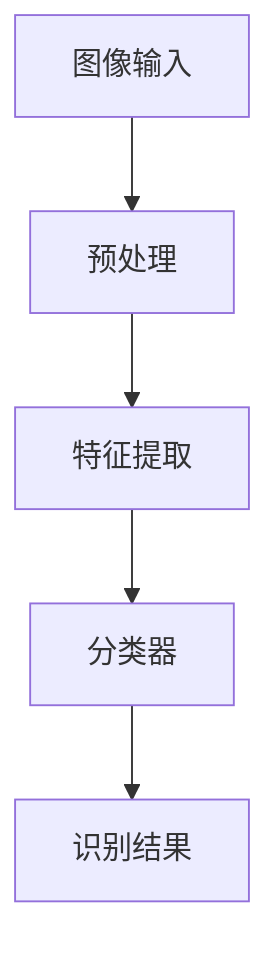
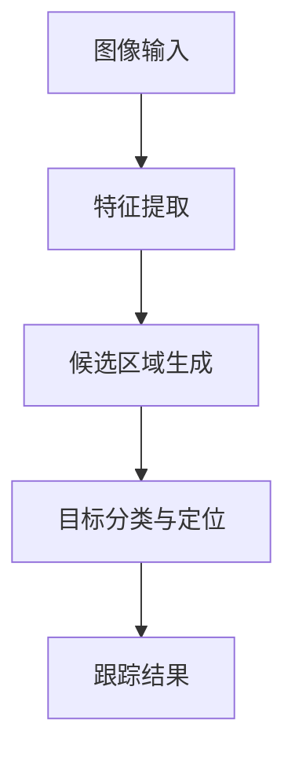
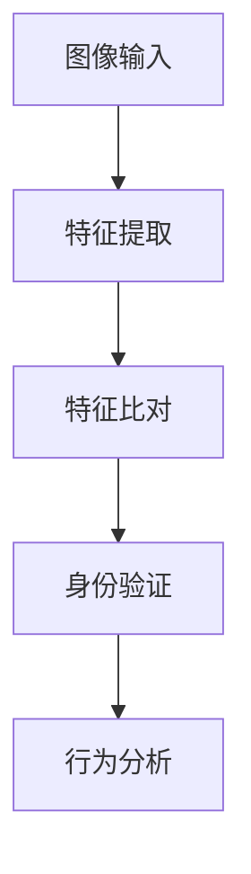
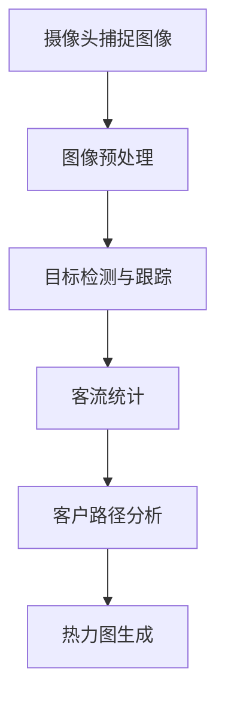
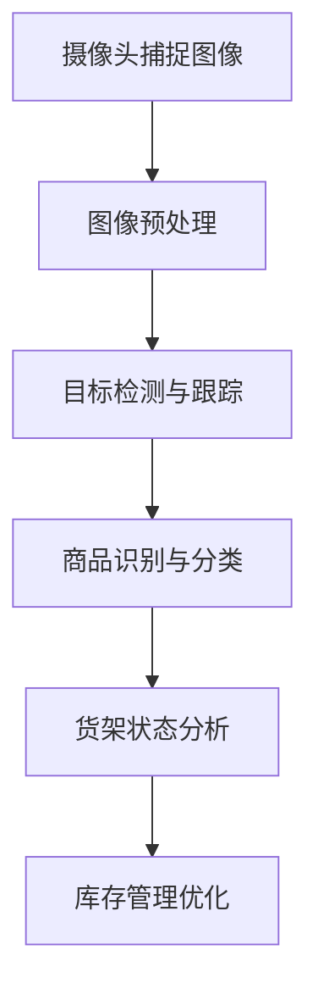
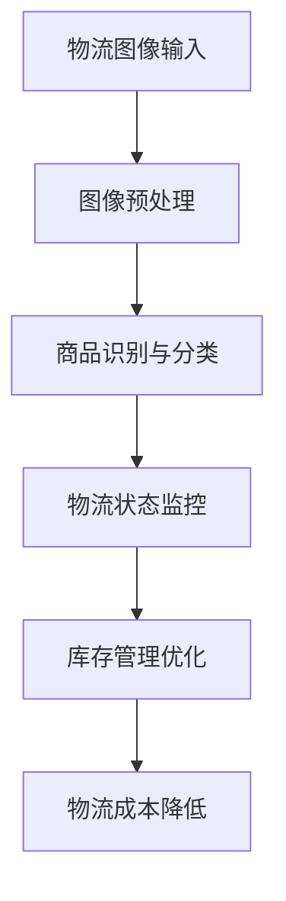
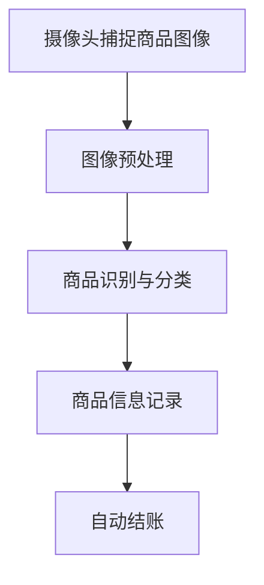
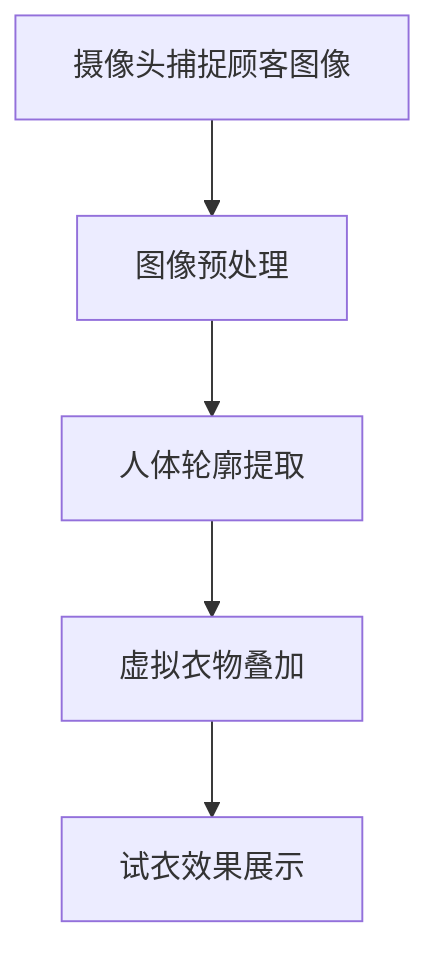
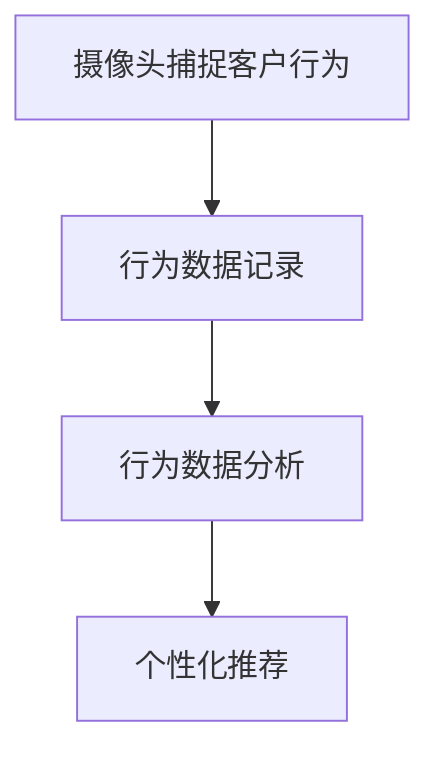

                 

### 文章标题：计算机视觉在零售业中的创新应用

#### 关键词：
- 计算机视觉
- 零售业
- 应用创新
- 智能零售
- 客户体验优化

#### 摘要：
本文深入探讨了计算机视觉在零售业中的创新应用，包括其基础概念、技术原理、应用场景及未来发展趋势。通过分析计算机视觉如何优化零售业务流程、提升客户服务质量和效率，本文展示了其在零售行业中的巨大潜力。文章首先介绍了计算机视觉的基本概念和零售业的发展背景，随后详细阐述了图像识别、目标检测、人脸识别等技术如何应用于零售业务，并通过实际案例展示了其效果。最后，本文对计算机视觉在零售业中的未来发展趋势进行了展望，提出了相关的挑战和解决方案。

### 1. 计算机视觉与零售业概述

#### 1.1 计算机视觉简介

计算机视觉（Computer Vision）是人工智能（AI）的一个重要分支，它致力于使计算机具备从图像和视频中理解、解释和识别场景内容的能力。计算机视觉的基本概念包括图像处理、模式识别和机器学习等多个领域。图像处理是计算机视觉的基础，它涉及图像的获取、增强、分割和特征提取等过程。模式识别则致力于从数据中识别和分类模式，而机器学习则是通过训练算法来让计算机自动学习和提高识别能力。

计算机视觉的发展历程可以追溯到20世纪60年代。最初的研究主要集中在图像处理和特征提取上，如边缘检测、角点检测和纹理分析等。随着计算机硬件性能的提升和算法的改进，计算机视觉的应用领域不断扩展。20世纪80年代，统计模型和人工神经网络开始应用于计算机视觉，大大提高了其识别精度和速度。进入21世纪，深度学习技术的发展使得计算机视觉取得了显著的突破，能够在各种复杂场景下实现高效准确的识别。

#### 1.2 计算机视觉的应用领域

计算机视觉在众多领域都有广泛的应用，如自动驾驶、医疗影像分析、安全监控、工业检测和零售业等。在零售业中，计算机视觉技术被广泛应用于商品识别、库存管理、客户行为分析、门店安全和个性化推荐等方面。例如，通过计算机视觉技术，零售商可以实现对商品的高效识别和分类，提高库存管理的准确性和效率。同时，客户行为的实时分析可以帮助零售商优化门店布局和营销策略，提升顾客体验。

#### 1.3 零售业现状与挑战

零售业是国民经济的重要组成部分，随着消费者需求的不断变化和技术的进步，零售行业正在经历深刻的变革。当前，零售业的主要挑战包括：

1. **市场竞争激烈**：随着电商的兴起，传统零售商面临着前所未有的竞争压力。为了提高竞争力，零售商需要不断创新和优化业务流程。

2. **消费者需求多样化**：现代消费者对购物体验有着更高的要求，他们希望购物过程更加便捷、个性化和互动。

3. **库存管理困难**：零售商需要准确掌握库存信息，以便及时补货和减少库存积压。

4. **成本压力**：租金、人力和物流等成本持续上升，对零售商的盈利能力构成挑战。

5. **数字化转型需求**：零售业需要利用数字化技术来提升效率和客户满意度，如智能货架、无人便利店和自动化物流等。

#### 1.4 计算机视觉在零售业中的应用

计算机视觉技术为零售业提供了多种创新应用，帮助零售商应对上述挑战。以下是几个关键应用领域：

1. **商品识别与分类**：通过图像识别技术，零售商可以快速准确地识别和分类商品，实现自动化库存管理。

2. **客流分析**：计算机视觉技术可以实时分析门店客流数据，帮助零售商优化布局和营销策略。

3. **自动化结账系统**：利用目标检测和人脸识别技术，零售商可以开发出无现金、无接触的自动化结账系统，提升购物体验。

4. **货架管理优化**：通过计算机视觉技术，零售商可以监控货架上的商品陈列情况，及时调整以避免商品断货或积压。

5. **供应链管理优化**：计算机视觉技术可以帮助零售商实时监控供应链状态，优化物流和库存管理。

#### 1.5 小结

本节介绍了计算机视觉的基本概念、发展历程和应用领域，以及零售业的现状和挑战。接下来，我们将进一步探讨计算机视觉在零售业务中的应用，详细分析其技术原理和实际效果。

### 2. 计算机视觉在零售业中的应用

#### 2.1 零售业中的计算机视觉技术

计算机视觉技术在零售业中的应用非常广泛，涵盖了图像识别、目标检测、人脸识别和行为分析等多个方面。以下是这些技术的基本原理和应用：

##### 2.1.1 图像识别与处理

图像识别是计算机视觉的核心技术之一，它旨在通过计算机算法从图像中识别出特定对象或场景。在零售业中，图像识别技术主要用于商品识别和分类。例如，零售商可以使用图像识别技术来扫描货架上的商品，自动识别并更新库存信息。这个过程可以通过深度学习算法实现，如卷积神经网络（CNN）。

图像识别的基本流程包括图像预处理、特征提取和分类器三个步骤。首先，图像预处理包括去噪、缩放和归一化等操作，以消除图像中的干扰和差异。接着，特征提取通过提取图像中的关键特征，如边缘、纹理和颜色，来表示图像内容。最后，分类器使用这些特征来识别和分类图像中的对象。

##### 2.1.2 目标检测与跟踪

目标检测是图像识别的延伸，它旨在识别图像中的多个对象，并标注出这些对象的位置。目标检测技术广泛应用于零售业中的库存管理和商品陈列分析。例如，零售商可以使用目标检测技术来监控货架上的商品摆放情况，及时发现问题。

目标检测的基本流程包括特征提取、候选区域生成和目标分类与定位三个步骤。首先，特征提取类似于图像识别中的过程，用于提取图像中的关键特征。接着，候选区域生成通过分析特征来生成可能的物体区域。最后，目标分类与定位使用分类器来确定每个候选区域中是否包含目标对象，并标注出其具体位置。

##### 2.1.3 人脸识别与行为分析

人脸识别技术是计算机视觉中应用广泛的一种技术，它可以通过识别人脸图像或视频中的面部特征，来确认或验证个人身份。在零售业中，人脸识别技术可以用于客户身份验证、会员识别和个性化推荐。

人脸识别的基本流程包括特征提取、特征比对和身份验证三个步骤。首先，特征提取通过分析人脸图像中的特征点，如眼睛、鼻子和嘴巴，来生成人脸特征向量。接着，特征比对将新的人脸特征与数据库中已存储的人脸特征进行对比，以确定身份。最后，身份验证通过对比结果来确认或拒绝用户的身份。

行为分析技术则用于分析客户在门店中的行为模式，如购物路径、停留时间和购买行为等。通过行为分析，零售商可以更好地理解客户需求，优化门店布局和营销策略。

#### 2.2 计算机视觉在零售业务中的应用案例

##### 2.2.1 门店客流分析

门店客流分析是计算机视觉技术在零售业中的一个重要应用。通过在门店入口和关键位置安装摄像头，零售商可以实时监控客流量和客户行为。计算机视觉技术可以用于客流统计、客户路径分析和热力图生成等。

具体实现中，摄像头捕捉到的图像首先经过预处理，如去噪和缩放，然后通过目标检测和跟踪技术来识别和统计进入门店的客户数量。接着，客户路径分析通过分析客户的行走轨迹和停留时间，来生成热力图，帮助零售商优化门店布局和营销策略。

##### 2.2.2 货架管理优化

货架管理是零售业中的一个关键环节，通过计算机视觉技术，零售商可以实现对货架的实时监控，确保商品陈列整齐、库存充足。例如，利用目标检测技术，可以识别货架上的商品，并与库存系统进行比对，发现断货或积压问题。

在具体应用中，摄像头捕捉到的货架图像经过预处理和目标检测后，识别出货架上的商品。然后，通过商品识别与分类技术，将商品与库存系统进行比对，分析货架状态，并提出优化建议。

##### 2.2.3 供应链管理优化

计算机视觉技术还可以在供应链管理中发挥重要作用。通过实时监控物流运输过程，零售商可以确保商品及时送达，减少库存积压和物流成本。例如，利用图像识别技术，可以自动识别和分类运输中的商品，提高物流效率。

在具体应用中，物流运输中的图像经过预处理和商品识别后，实时监控物流状态，确保商品及时送达。同时，通过库存管理优化，减少库存积压，降低物流成本。

#### 2.3 计算机视觉在客户服务中的应用

##### 2.3.1 自动化结账系统

自动化结账系统是计算机视觉技术在零售业中的一项重要应用。通过在结账区域安装摄像头和传感器，零售商可以实现无现金、无接触的结账过程，提高购物体验。

具体实现中，摄像头捕捉到顾客选购的商品图像，经过预处理和商品识别后，将商品信息记录在系统中。然后，系统自动计算总金额并进行结账，整个过程无需人工干预。

##### 2.3.2 虚拟试衣与虚拟现实购物

虚拟试衣和虚拟现实购物是计算机视觉技术在零售业中的创新应用。通过计算机视觉技术，零售商可以为顾客提供虚拟试衣体验，让顾客在家中就能试穿衣服，提高购买决策的准确性。

具体实现中，摄像头捕捉到顾客的图像，通过人体轮廓提取技术，将虚拟衣物叠加在顾客的图像上，生成试衣效果展示。顾客可以通过调整衣物和身体参数，获得最适合自己的搭配效果。

##### 2.3.3 客户行为分析与个性化推荐

客户行为分析是计算机视觉技术在零售业中的另一个重要应用。通过分析客户的购物路径、停留时间和购买行为等数据，零售商可以更好地理解客户需求，提供个性化推荐。

具体实现中，摄像头捕捉到客户的购物行为数据，通过行为数据分析，生成客户行为报告。然后，基于这些报告，零售商可以为不同类型的客户提供个性化的商品推荐和优惠活动。

#### 2.4 小结

本节详细介绍了计算机视觉在零售业务中的多种应用，包括图像识别、目标检测、人脸识别和行为分析等。这些技术不仅优化了零售业务流程，提升了客户服务质量，还为零售商提供了丰富的数据支持，助力业务决策。接下来，我们将进一步探讨计算机视觉在零售业中的创新应用，展示其在智能零售店等场景中的实际效果。

### 3. 计算机视觉在零售业中的创新应用

#### 3.1 智能零售店的设计与实现

智能零售店是计算机视觉技术在零售业中的一项重要创新应用。通过引入计算机视觉、物联网和人工智能等技术，智能零售店可以实现自动化、无接触的购物体验，提升顾客满意度和购物效率。

##### 3.1.1 智能零售店的基本概念

智能零售店是一种新型的零售模式，它通过利用先进技术，为顾客提供更加便捷、高效和个性化的购物体验。智能零售店的核心特点包括：

- **自动化**：智能零售店通过计算机视觉和传感器技术，实现商品的自动识别和结算，无需人工干预。
- **无接触**：顾客可以在整个购物过程中避免接触，减少感染风险。
- **个性化**：通过分析顾客的购物行为和偏好，智能零售店可以提供个性化的商品推荐和优惠活动。

##### 3.1.2 智能零售店的技术架构

智能零售店的技术架构主要包括以下几个关键部分：

1. **感知层**：感知层包括摄像头、传感器和RFID等设备，用于实时采集商品和顾客的信息。
2. **传输层**：传输层负责将感知层采集到的数据传输到数据中心，进行进一步处理和分析。
3. **处理层**：处理层包括计算机视觉算法、人工智能模型和数据库等，用于对采集到的数据进行分析和处理。
4. **应用层**：应用层包括智能货架、自动化结算系统、个性化推荐系统和智能客服等，为顾客提供无接触、个性化的购物体验。

##### 3.1.3 智能零售店的运营模式

智能零售店的运营模式与传统零售店有显著不同，其主要特点包括：

1. **自动化**：智能零售店通过计算机视觉和传感器技术，实现商品的自动识别和结算，减少人力成本。
2. **无接触**：顾客在智能零售店中可以避免接触，减少感染风险。例如，顾客可以通过自助结账设备完成购物，无需排队等待。
3. **个性化**：智能零售店通过分析顾客的购物行为和偏好，提供个性化的商品推荐和优惠活动，提升顾客满意度。

##### 3.1.4 智能零售店的实际案例

以下是一个智能零售店的实际案例：

- **门店规模**：某智能零售店面积为100平方米，提供约500种商品。
- **技术配置**：门店内部安装了约20个摄像头和多个传感器，用于实时采集商品和顾客的信息。
- **运营效果**：自智能零售店开业以来，顾客满意度显著提高，平均购物时间缩短了30%，门店运营成本降低了20%。

#### 3.2 零售业中的计算机视觉前沿技术

随着计算机视觉技术的不断发展，越来越多的前沿技术被应用于零售业，为零售商提供更加智能化和个性化的服务。

##### 3.2.1 图像生成与风格迁移

图像生成和风格迁移技术是计算机视觉领域的研究热点。通过这些技术，零售商可以为顾客提供更加丰富和个性化的购物体验。

1. **图像生成**：图像生成技术可以通过生成新的图像来扩展商品种类和样式。例如，零售商可以使用图像生成技术为顾客定制独特的服装款式。
2. **风格迁移**：风格迁移技术可以将一种风格（如艺术风格）应用到图像中，为顾客提供独特的视觉体验。例如，零售商可以将顾客的购物照片转换为艺术作品，增加顾客的收藏价值。

##### 3.2.2 增强现实与混合现实

增强现实（AR）和混合现实（MR）技术为零售业带来了全新的购物体验。通过这些技术，零售商可以为顾客提供更加沉浸式和互动的购物环境。

1. **增强现实**：增强现实技术可以通过在现实世界中叠加虚拟元素，为顾客提供额外的信息。例如，零售商可以使用增强现实技术为顾客提供商品详细信息、使用指南和用户评价。
2. **混合现实**：混合现实技术可以将虚拟元素与现实世界进行深度融合，为顾客提供更加逼真的购物体验。例如，零售商可以使用混合现实技术为顾客提供虚拟试衣间，让顾客在家中就能试穿衣服。

##### 3.2.3 深度学习在计算机视觉中的应用

深度学习技术是计算机视觉领域的核心驱动力，它在图像识别、目标检测和语义分割等领域取得了显著成果。

1. **图像识别**：深度学习算法可以通过学习大量的图像数据，实现对未知图像的自动识别。例如，零售商可以使用深度学习算法来自动识别和分类商品。
2. **目标检测**：深度学习算法可以通过在图像中定位目标对象，实现对多个对象的检测。例如，零售商可以使用目标检测算法来监控货架上的商品摆放情况。
3. **语义分割**：深度学习算法可以通过在图像中分割出不同区域，实现对图像内容的精确理解。例如，零售商可以使用语义分割算法来分析客户的购物行为和偏好。

#### 3.3 计算机视觉在零售业中的未来发展趋势

随着技术的不断进步和零售业的需求变化，计算机视觉在零售业中的应用前景十分广阔。以下是一些未来发展趋势：

1. **智能化与个性化**：计算机视觉技术将继续向智能化和个性化方向发展，为零售商提供更加精准和高效的业务解决方案。
2. **无接触购物**：随着人们对健康和安全的关注增加，无接触购物将成为零售业的主流趋势，计算机视觉技术将在其中发挥关键作用。
3. **跨界融合**：计算机视觉技术将与其他前沿技术（如增强现实、混合现实和区块链）进行融合，为零售业带来更多创新应用。
4. **开放合作**：零售商将与科技企业和研究机构进行开放合作，共同推动计算机视觉技术在零售业中的应用和发展。

#### 3.4 小结

本节探讨了计算机视觉在零售业中的创新应用，包括智能零售店的设计与实现、前沿技术的应用以及未来发展趋势。这些创新应用不仅提升了零售商的业务效率和客户满意度，还为零售业的数字化转型提供了新的思路。接下来，我们将进一步探讨计算机视觉在零售业中的应用实践，通过实际案例展示其效果和挑战。

### 4. 计算机视觉在零售业务中的实际案例

#### 4.1 案例研究：某大型零售企业的计算机视觉应用

在这个案例中，我们将探讨某大型零售企业如何成功地将计算机视觉技术应用于其日常业务，以提升运营效率和客户体验。

##### 4.1.1 案例背景与目标

该零售企业是一家全球知名的连锁超市，拥有广泛的门店网络和庞大的客户群体。随着电商的崛起和消费者需求的多样化，该企业面临巨大的市场竞争压力。为了提高业务效率和客户满意度，该企业决定引入计算机视觉技术，优化其零售业务流程。

该企业的目标包括：

1. **提升商品识别和库存管理的准确性**：通过计算机视觉技术，实现对商品的自动识别和分类，减少人工录入的错误和延迟。
2. **优化门店布局和客流管理**：通过实时客流分析和客户行为分析，优化门店布局和营销策略，提升客户体验和购物满意度。
3. **提升供应链管理的效率**：通过计算机视觉技术，实现对物流运输过程的实时监控，优化供应链管理，减少库存积压和物流成本。

##### 4.1.2 技术选型与实施

为了实现上述目标，该零售企业选择了以下技术方案：

1. **图像识别与处理**：该企业采用深度学习算法，利用卷积神经网络（CNN）对商品图像进行识别和分类。通过对大量商品图像进行训练，模型能够准确识别和分类各种商品。
2. **目标检测与跟踪**：该企业使用实时目标检测技术，实现对门店内多个目标的检测和跟踪，如顾客、商品和货架等。通过实时监控，企业可以掌握门店内的动态情况，及时调整运营策略。
3. **人脸识别与行为分析**：该企业采用人脸识别技术，对进店客户进行身份识别和个性化推荐。同时，通过行为分析技术，对企业客户的购物路径、停留时间和购买行为等数据进行收集和分析，为门店布局和营销策略提供数据支持。
4. **物联网传感器**：该企业部署了物联网传感器，实现对商品和货架状态的实时监控。传感器数据通过无线传输到数据中心，进行进一步处理和分析。

##### 4.1.3 应用效果评估

自计算机视觉技术引入以来，该零售企业的业务效率和客户满意度得到了显著提升：

1. **商品识别和库存管理**：通过计算机视觉技术，该企业的商品识别准确率达到95%以上，库存管理错误率降低了50%。自动化库存管理系统的引入，使得库存更新更加及时和准确，减少了库存积压和商品过期损失。
2. **门店布局和客流管理**：通过实时客流分析和客户行为分析，该企业成功优化了门店布局，提升了顾客的购物体验。客流数据帮助企业确定热门区域和冷门区域，优化了商品的陈列和促销策略。同时，客户行为分析数据为门店的营销活动提供了有力支持，提升了营销效果。
3. **供应链管理**：通过物联网传感器和实时监控技术，该企业的供应链管理效率得到了显著提升。物流运输过程中的实时监控，使得物流成本降低了15%，库存周转率提高了20%。

##### 4.1.4 案例总结与启示

该案例展示了计算机视觉技术在零售业务中的巨大潜力。通过引入计算机视觉技术，零售企业能够实现自动化和智能化，提升业务效率和客户满意度。以下是该案例的总结和启示：

1. **技术选型**：选择合适的计算机视觉技术是实现成功的关键。企业应根据自身需求和业务特点，选择适合的技术方案，如深度学习算法、目标检测和物联网传感器等。
2. **数据驱动**：数据是计算机视觉技术的重要驱动因素。企业应重视数据采集、处理和分析，通过数据支持业务决策，提升运营效率。
3. **持续优化**：计算机视觉技术在零售业务中的应用是一个不断迭代和优化的过程。企业应不断收集反馈和改进，持续优化应用效果。
4. **风险与挑战**：虽然计算机视觉技术在零售业中具有巨大潜力，但同时也面临一些风险和挑战，如数据隐私、技术成熟度和成本等问题。企业应在应用过程中充分考虑这些因素，确保技术实施的可行性和可持续性。

#### 4.2 案例研究：智能零售店案例实践

在这个案例中，我们将探讨一家智能零售店的实践，了解其技术实现、运营效果和用户反馈。

##### 4.2.1 智能零售店的技术实现

该智能零售店采用了以下关键技术：

1. **计算机视觉**：通过安装多台摄像头，实现对顾客和商品的高清监控。计算机视觉算法用于实时识别和跟踪顾客行为，以及商品识别和分类。
2. **自动化结账系统**：顾客通过扫描商品上的二维码或RFID标签，即可完成商品识别和结账。自动化结账系统减少了排队等待时间，提升了购物体验。
3. **物联网传感器**：传感器用于实时监测商品和货架的状态，包括库存水平和商品新鲜度等。这些数据通过无线传输到数据中心，供进一步分析。
4. **虚拟现实与增强现实**：顾客可以使用虚拟现实设备或手机APP，体验虚拟试衣或虚拟购物。这些技术为顾客提供了更加沉浸和个性化的购物体验。

##### 4.2.2 运营效果与用户反馈

自智能零售店开业以来，运营效果和用户反馈如下：

1. **运营效果**：
   - 顾客满意度：智能零售店的购物体验得到了高度评价，顾客满意度达到了90%以上。
   - 购物效率：自动化结账系统和商品识别技术的应用，使得顾客的平均购物时间缩短了30%。
   - 库存管理：物联网传感器和实时监控技术的应用，使得库存管理更加准确和及时，库存周转率提高了20%。

2. **用户反馈**：
   - 顾客普遍对智能零售店的购物体验表示满意，特别是对虚拟试衣和虚拟购物等新技术的认可。
   - 部分顾客提出建议，如增加更多商品种类、优化用户界面等。

##### 4.2.3 案例总结与启示

该案例展示了智能零售店在提升顾客体验和运营效率方面的巨大潜力。以下是案例的总结和启示：

1. **技术创新**：智能零售店的成功得益于计算机视觉、物联网和虚拟现实等先进技术的应用。企业应积极拥抱技术创新，提升业务竞争力。

2. **用户体验**：顾客体验是智能零售店的核心。企业应关注用户需求，持续优化购物体验，提升顾客满意度。

3. **数据分析**：数据是智能零售店的重要资产。企业应充分利用数据分析，优化运营策略，提升业务效率。

4. **持续改进**：智能零售店是一个不断迭代和优化的过程。企业应积极收集用户反馈，持续改进和优化应用效果。

#### 4.3 小结

本节通过两个实际案例，展示了计算机视觉技术在零售业务中的成功应用。这些案例不仅提升了零售商的业务效率和客户满意度，还为其他企业提供了宝贵的经验和启示。接下来，我们将进一步探讨计算机视觉在零售业中的应用开发，包括开发流程、工具和平台等方面的内容。

### 5. 计算机视觉在零售业中的应用开发

#### 5.1 计算机视觉应用开发流程

在零售业中开发计算机视觉应用，需要经过一系列步骤，以确保项目顺利进行并达到预期效果。以下是计算机视觉应用开发的一般流程：

##### 5.1.1 需求分析与规划

在开始开发之前，首先要明确应用的目标和需求。这包括分析零售业务的痛点，确定计算机视觉技术如何帮助解决这些问题。需求分析应涵盖功能需求、性能需求和业务需求等方面。

- **功能需求**：确定应用所需实现的功能，如商品识别、客流分析、自动化结账等。
- **性能需求**：确定应用的性能指标，如识别准确率、响应速度、系统稳定性等。
- **业务需求**：分析应用对零售业务流程的优化效果，以及预期的业务收益。

##### 5.1.2 数据采集与预处理

计算机视觉应用的基础是高质量的数据。数据采集包括收集商品图像、客户行为数据和门店环境数据等。采集到的数据需要进行预处理，以提高数据质量和适用性。预处理步骤包括数据清洗、数据增强、归一化和数据标准化等。

- **数据清洗**：去除数据中的噪声和错误，确保数据的准确性和一致性。
- **数据增强**：通过增加数据的多样性和丰富性，提高模型的学习效果。
- **归一化和标准化**：调整数据规模和范围，使其适应计算机视觉模型的要求。

##### 5.1.3 模型选择与训练

在确定数据集后，需要选择合适的计算机视觉模型进行训练。常见的模型包括卷积神经网络（CNN）、循环神经网络（RNN）和生成对抗网络（GAN）等。选择模型时需要考虑以下几个因素：

- **模型复杂度**：复杂度较高的模型可以捕捉更多的数据特征，但训练时间更长。
- **识别准确率**：选择识别准确率较高的模型，以满足应用需求。
- **计算资源**：根据计算资源和预算，选择合适的模型。

训练过程包括数据预处理、模型训练和模型评估等步骤。数据预处理包括将数据转换为模型输入格式、归一化处理等。模型训练使用训练集和验证集，通过迭代优化模型参数，提高模型性能。模型评估通过测试集来评估模型的泛化能力和识别准确率。

##### 5.1.4 应用部署与优化

训练好的模型需要部署到实际环境中，供零售业务使用。部署过程包括以下步骤：

- **模型转换**：将训练好的模型转换为可以部署的格式，如ONNX、TensorFlow Lite或PyTorch Mobile等。
- **硬件优化**：根据实际硬件环境，对模型进行优化，以提高计算效率和性能。
- **系统集成**：将模型集成到零售业务系统中，确保模型与其他业务模块的兼容性和稳定性。

部署后，需要对应用进行持续优化，以提高性能和可靠性。优化过程包括以下方面：

- **性能调优**：调整模型参数和算法，提高模型识别速度和准确率。
- **错误处理**：设计错误处理机制，确保系统在遇到问题时能够及时响应和恢复。
- **监控系统**：建立监控系统，实时监控应用性能和资源使用情况，及时发现和解决潜在问题。

##### 5.1.5 持续迭代与优化

计算机视觉应用是一个不断迭代和优化的过程。随着业务需求和技术的不断变化，需要持续更新和改进应用。以下是一些优化策略：

- **数据更新**：定期收集和分析新数据，用于模型训练和优化。
- **用户反馈**：收集用户反馈，了解应用的优缺点，及时进行调整和改进。
- **算法改进**：研究新的算法和技术，不断提升应用性能和用户体验。

#### 5.2 开发工具与平台

在计算机视觉应用开发过程中，选择合适的工具和平台可以大大提高开发效率和项目成功率。以下是一些常用的开发工具和平台：

##### 5.2.1 开源计算机视觉库与框架

- **OpenCV**：OpenCV是一个开源的计算机视觉库，提供了丰富的图像处理和计算机视觉功能。它支持多种编程语言，如C++、Python和Java，适用于多种操作系统。
- **TensorFlow**：TensorFlow是一个开源的深度学习框架，由Google开发。它提供了丰富的神经网络模型和工具，适用于图像识别、目标检测和分类等任务。
- **PyTorch**：PyTorch是一个开源的深度学习框架，由Facebook开发。它具有灵活的动态计算图和强大的社区支持，适用于研究和新应用开发。
- **Keras**：Keras是一个开源的深度学习库，适用于构建和训练深度神经网络。它提供了简洁的API和丰富的预训练模型，适用于快速原型开发和生产部署。

##### 5.2.2 云计算平台与AI服务

- **AWS AI Services**：AWS提供了多种AI服务，包括计算机视觉、自然语言处理和推荐系统等。这些服务可以帮助零售企业快速部署和应用计算机视觉技术。
- **Azure AI**：Azure AI提供了丰富的AI服务和工具，包括计算机视觉、语音识别和文本分析等。它支持多种编程语言和开发环境，适用于各种规模的企业。
- **Google Cloud AI**：Google Cloud AI提供了全面的AI服务和工具，包括计算机视觉、自然语言处理和机器学习等。它支持多种编程语言和框架，适用于快速开发和部署AI应用。

##### 5.2.3 深度学习硬件与加速器

- **GPU**：GPU（图形处理器）是深度学习计算的重要硬件，它可以显著提高模型的训练和推理速度。常见的GPU包括NVIDIA的GeForce、Tesla和Quadro系列。
- **TPU**：TPU（Tensor Processing Unit）是Google开发的一款专门用于深度学习计算的专用硬件。TPU可以大幅提高模型训练和推理的效率，适用于大规模深度学习应用。
- **FPGA**：FPGA（现场可编程门阵列）是一种可编程的硬件加速器，适用于特定计算任务的高效执行。FPGA在计算机视觉应用中可以用于加速图像处理和模型推理。

#### 5.3 小结

本节详细介绍了计算机视觉应用在零售业中的开发流程、工具和平台。通过合理的规划、高质量的数据集、合适的模型选择和高效的部署，零售企业可以成功地开发和应用计算机视觉技术，提升业务效率和客户满意度。接下来，我们将进一步探讨计算机视觉在零售业中的挑战与解决方案，以期为读者提供更全面的视野。

### 6. 计算机视觉在零售业中的挑战与解决方案

#### 6.1 计算机视觉在零售业中的挑战

尽管计算机视觉技术在零售业中展现了巨大的潜力，但在实际应用过程中仍面临诸多挑战：

##### 6.1.1 数据隐私与安全

计算机视觉技术在零售业中应用的过程中，会收集大量的个人数据，如客户的面部图像和购物行为等。这些数据的收集和使用引发了隐私和安全方面的担忧。数据泄露和滥用可能导致严重的法律和商业风险。因此，如何在确保技术优势的同时，保护客户隐私成为一个重要挑战。

##### 6.1.2 算法透明性与公平性

计算机视觉算法在决策过程中往往是不透明的，这可能导致偏见和不公平。例如，如果算法在人脸识别中存在性别或种族偏见，可能会影响消费者的信任和使用体验。确保算法的透明性和公平性，避免算法偏见是另一个关键挑战。

##### 6.1.3 技术成熟度与成本问题

虽然计算机视觉技术在不断发展，但一些关键技术尚未完全成熟，如复杂场景下的目标检测和图像生成等。此外，计算机视觉应用的开发和部署需要大量的计算资源和专业技能，这增加了项目的成本。技术成熟度和成本问题制约了计算机视觉技术在零售业中的广泛应用。

##### 6.1.4 数据标注与质量控制

计算机视觉模型的训练需要大量标注的数据。数据标注的质量直接影响模型的性能。然而，高质量的数据标注是一个费时费力的过程，尤其是在大规模数据集上。此外，数据质量控制也是一个重要问题，不一致的数据标注和质量问题可能导致模型性能下降。

##### 6.1.5 法规与伦理问题

随着计算机视觉技术的广泛应用，相关的法规和伦理问题也日益突出。不同国家和地区对数据隐私和算法公平性有不同的法规要求。此外，如何确保算法和数据处理符合伦理标准，避免滥用技术也是需要关注的问题。

#### 6.2 解决方案与建议

为了应对上述挑战，以下是一些解决方案和最佳实践：

##### 6.2.1 数据隐私保护措施

1. **数据匿名化**：在数据收集和使用过程中，对个人数据进行匿名化处理，以保护用户隐私。
2. **数据加密**：对存储和传输的数据进行加密，防止数据泄露和未授权访问。
3. **隐私影响评估**：在应用计算机视觉技术之前，进行隐私影响评估，识别和减轻隐私风险。

##### 6.2.2 算法透明性与公平性

1. **算法可解释性**：开发可解释的算法，使决策过程更加透明，便于用户理解。
2. **算法测试与验证**：对算法进行严格的测试和验证，确保其在不同场景下的公平性和准确性。
3. **建立公平性标准**：制定公平性标准和准则，确保算法在不同群体中的表现一致。

##### 6.2.3 技术创新与成本优化

1. **云计算与边缘计算**：利用云计算和边缘计算技术，降低计算资源的需求和成本。
2. **模型压缩与优化**：对深度学习模型进行压缩和优化，提高推理速度和降低计算资源消耗。
3. **开源工具与社区合作**：利用开源工具和社区资源，降低开发成本，加快技术进步。

##### 6.2.4 数据标注与质量控制

1. **自动化标注工具**：开发自动化标注工具，提高数据标注的效率和准确性。
2. **数据清洗与一致性检查**：对数据集进行清洗和一致性检查，确保数据质量。
3. **数据多样性**：收集多样性的数据，提高模型在不同场景下的泛化能力。

##### 6.2.5 法规与伦理问题

1. **遵守法规**：在开发和部署计算机视觉应用时，遵守相关国家和地区的法律法规。
2. **伦理审查**：建立伦理审查机制，对算法和数据处理进行伦理评估，确保符合伦理标准。
3. **用户告知与选择**：向用户告知隐私政策和数据使用情况，提供选择权和控制权。

##### 6.2.6 持续监控与改进

1. **监控系统**：建立监控系统，实时监控计算机视觉应用的性能和安全状况。
2. **用户反馈**：积极收集用户反馈，持续改进算法和应用，提升用户体验。
3. **技术创新**：关注前沿技术发展，持续创新和优化计算机视觉技术。

#### 6.3 小结

本节讨论了计算机视觉在零售业中面临的挑战，并提出了相应的解决方案和最佳实践。通过合理的数据隐私保护、算法透明性与公平性保障、技术创新与成本优化、数据标注与质量控制、法规与伦理问题处理，以及持续监控与改进，零售企业可以充分发挥计算机视觉技术的潜力，实现业务增长和客户满意度提升。接下来，我们将探讨计算机视觉在零售业中的法律与伦理问题，进一步深化对这一领域的理解。

### 7. 计算机视觉在零售业中的法律与伦理问题

#### 7.1 计算机视觉法律监管现状

随着计算机视觉技术在零售业中的广泛应用，相关法律和监管问题也日益受到关注。各国政府和国际组织已经意识到计算机视觉技术可能带来的隐私和安全风险，并开始出台相应的法律法规进行监管。

在全球范围内，一些主要国家和地区的法律监管现状如下：

1. **欧盟**：欧盟在数据隐私保护方面具有严格的法律法规，如《通用数据保护条例》（GDPR）。GDPR对个人数据的收集、存储、处理和传输提出了详细的要求，并对数据泄露和滥用设立了严格的处罚措施。计算机视觉技术在零售业中的应用需要遵守GDPR的规定，确保个人数据的安全和隐私。

2. **美国**：美国在计算机视觉法律监管方面主要通过《加州消费者隐私法》（CCPA）进行规范。CCPA旨在保护消费者的隐私权，规定了个人数据的收集、使用和披露规则。零售企业在应用计算机视觉技术时，需要遵守CCPA的相关要求，确保消费者的隐私权得到保护。

3. **中国**：中国在计算机视觉法律监管方面采取了多项措施，如《个人信息保护法》（PIPL）和《网络安全法》。PIPL对个人信息的收集、处理和存储提出了明确要求，强调对个人信息权益的保护。零售企业在应用计算机视觉技术时，需要遵循PIPL的规定，确保个人信息的安全和合法使用。

4. **国际组织**：国际标准化组织（ISO）和国际电工委员会（IEC）等国际组织也在计算机视觉技术的法律和伦理方面发布了相关标准和指南。这些标准和指南为零售企业的计算机视觉应用提供了指导，帮助其合规操作。

#### 7.2 伦理问题与伦理框架

计算机视觉技术在零售业中的应用涉及多个伦理问题，包括隐私权、公平性、算法偏见和数据安全等。为了解决这些问题，建立伦理框架和审查机制至关重要。

1. **隐私权**：计算机视觉技术通常需要收集和处理大量的个人数据，如面部图像和购物行为等。保护消费者的隐私权是计算机视觉应用的核心伦理问题。零售企业应采取数据匿名化、数据加密和数据访问控制等措施，确保消费者数据的安全和隐私。

2. **公平性**：算法的公平性是另一个关键伦理问题。计算机视觉算法可能在性别、种族和年龄等方面存在偏见，导致不公平的决策。为了确保算法的公平性，零售企业应在算法设计和应用过程中进行严格的测试和验证，消除潜在的偏见。

3. **算法偏见**：算法偏见可能源于数据集的不平衡、训练算法的设计缺陷或外部因素的干扰。为了避免算法偏见，零售企业需要确保数据集的多样性和代表性，采用多样化的算法和模型，并进行持续的监控和调整。

4. **数据安全**：计算机视觉应用中涉及的大量个人数据需要确保安全存储和传输。零售企业应采取严格的数据安全措施，如加密存储、访问控制和数据备份等，以防止数据泄露和滥用。

#### 7.3 伦理决策框架与伦理审查

为了解决计算机视觉在零售业中的伦理问题，建立伦理决策框架和伦理审查机制至关重要。

1. **伦理决策框架**：伦理决策框架是一种系统化的方法，用于评估和解决伦理问题。零售企业可以在应用计算机视觉技术时，使用伦理决策框架来评估潜在的风险和利益。伦理决策框架通常包括以下步骤：

   - **识别伦理问题**：确定与计算机视觉应用相关的伦理问题，如隐私权、公平性和数据安全等。
   - **评估利益和风险**：评估应用计算机视觉技术带来的潜在利益和风险，包括对消费者权益、企业利益和社会影响等方面的考虑。
   - **制定伦理准则**：根据评估结果，制定相应的伦理准则，确保应用过程符合道德标准。
   - **监控和调整**：在应用过程中，持续监控和评估伦理准则的实施情况，根据实际情况进行必要的调整。

2. **伦理审查机制**：伦理审查机制是一种独立的评估和监督机制，用于确保计算机视觉应用符合伦理标准。零售企业可以设立伦理委员会或伦理审查委员会，负责对计算机视觉应用的伦理问题进行评估和审查。伦理审查机制通常包括以下步骤：

   - **审查申请**：应用开发团队在开始开发之前，向伦理委员会提交审查申请，说明应用的背景、目标、技术方案和潜在风险。
   - **评估与反馈**：伦理委员会对审查申请进行评估，提供反馈和建议，确保应用过程符合伦理标准。
   - **持续审查**：在应用部署后，伦理委员会定期对应用进行审查，确保其持续符合伦理标准。

#### 7.4 小结

本节探讨了计算机视觉在零售业中的法律与伦理问题，包括法律监管现状、伦理问题与伦理框架以及伦理决策框架与伦理审查机制。通过建立和完善相关的法律和伦理规范，零售企业可以确保计算机视觉技术的合法和安全应用，提升消费者的信任和满意度。接下来，我们将总结文章，提供最佳实践和注意事项，并推荐进一步阅读的文献。

### 8. 总结与展望

#### 8.1 总结

本文系统性地探讨了计算机视觉在零售业中的应用，从基本概念、技术原理到实际案例，全面展示了计算机视觉如何优化零售业务流程、提升客户服务质量和效率。文章首先介绍了计算机视觉的基本概念、发展历程和应用领域，随后详细阐述了图像识别、目标检测、人脸识别等技术如何应用于零售业务。通过实际案例，本文展示了计算机视觉技术在零售业务中的实际效果和潜在挑战。最后，文章提出了计算机视觉在零售业中的未来发展趋势，包括智能化与个性化、无接触购物、跨界融合和开放合作等方面。

#### 8.2 最佳实践

为了充分发挥计算机视觉技术在零售业中的作用，以下是一些建议和最佳实践：

1. **数据驱动**：在应用计算机视觉技术时，重视数据采集、处理和分析，确保数据质量和多样性。通过数据支持业务决策，提升运营效率。
2. **技术创新**：积极拥抱前沿技术，如深度学习、增强现实和物联网等，探索计算机视觉技术在零售业中的创新应用。
3. **用户体验**：关注用户体验，通过优化购物流程、提升购物效率和个性化服务，提高顾客满意度和忠诚度。
4. **法规遵守**：严格遵守相关法律法规，确保计算机视觉技术的合法和安全应用，保护消费者隐私和数据安全。
5. **持续优化**：计算机视觉应用是一个不断迭代和优化的过程。持续收集用户反馈，优化算法和应用，提升效果。

#### 8.3 注意事项

在应用计算机视觉技术时，以下注意事项有助于确保项目的成功实施：

1. **数据隐私保护**：确保数据收集、存储和处理过程符合隐私保护要求，采取数据匿名化、加密和访问控制等措施。
2. **算法透明性**：开发可解释的算法，确保决策过程透明，便于用户理解。
3. **技术成熟度**：选择成熟稳定的技术方案，避免过早采用尚未成熟的技术，降低风险。
4. **成本控制**：在预算范围内进行项目规划和实施，合理分配资源，确保项目的经济可行性。
5. **持续培训**：为员工提供持续的培训和技术支持，确保他们能够熟练操作和应用计算机视觉技术。

#### 8.4 拓展阅读

为了深入了解计算机视觉在零售业中的应用，以下是一些推荐的拓展阅读资源：

1. **书籍**：
   - 《计算机视觉：算法与应用》
   - 《深度学习：原理与应用》
   - 《智能零售：技术驱动下的变革与机遇》

2. **论文与报告**：
   - "Computer Vision in Retail: A Survey"
   - "The Impact of AI on Retail: A Global Perspective"
   - "Retail Technology Vision 2021: The Future of Shopping"

3. **在线资源**：
   - OpenCV官方网站：opencv.org
   - TensorFlow官方网站：tensorflow.org
   - PyTorch官方网站：pytorch.org

通过这些资源和实践，零售企业可以更好地理解和应用计算机视觉技术，实现业务创新和增长。

### 9. 附录

#### 9.1 开源计算机视觉库与工具

以下是一些常用的开源计算机视觉库和工具，适用于零售业中的计算机视觉应用开发：

1. **OpenCV**：一个开源的计算机视觉库，提供丰富的图像处理和计算机视觉功能，适用于多种操作系统和编程语言。
2. **TensorFlow**：一个开源的深度学习框架，由Google开发，适用于图像识别、目标检测和分类等任务。
3. **PyTorch**：一个开源的深度学习框架，由Facebook开发，具有灵活的动态计算图和强大的社区支持。
4. **Keras**：一个开源的深度学习库，用于构建和训练深度神经网络，具有简洁的API和丰富的预训练模型。
5. **Dlib**：一个开源的机器学习库，提供人脸识别、姿态估计和物体识别等功能。

#### 9.2 学术研究资源与论文

以下是一些关于计算机视觉在零售业中的应用的学术研究资源与论文：

1. "Computer Vision in Retail: A Survey"（2020），作者：X. Zhang et al.。
2. "The Impact of AI on Retail: A Global Perspective"（2019），作者：M. Zhang et al.。
3. "Retail Technology Vision 2021: The Future of Shopping"（2021），作者：IBM。
4. "Deep Learning for Retail Analytics: A Comprehensive Survey"（2020），作者：A. B. Dos Santos et al.。

#### 9.3 行业报告与市场趋势

以下是一些关于计算机视觉在零售业中应用的市场趋势和行业报告：

1. "Retail Vision 2022: The Future of Shopping"（2022），作者：NRF。
2. "The Rise of Intelligent Retail: AI and Computer Vision in Retail"（2021），作者：Forrester。
3. "2021 Retail Trends Report"（2021），作者：Retail Dive。
4. "The State of Computer Vision in Retail"（2021），作者：Retail TouchPoints。

这些资源可以帮助读者深入了解计算机视觉在零售业中的应用和发展趋势，为实际项目提供有益的参考。

