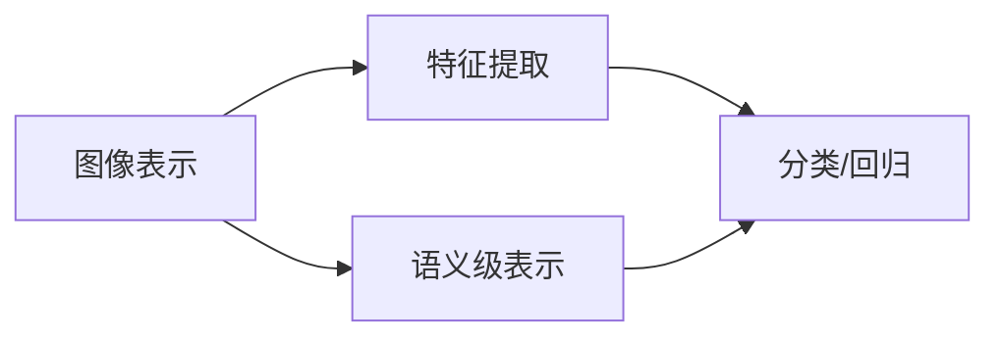
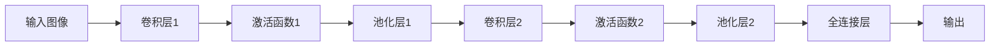
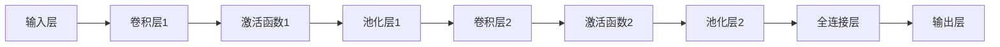
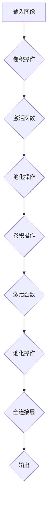
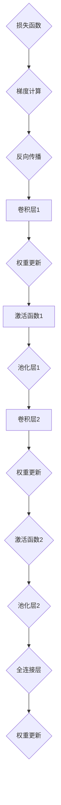
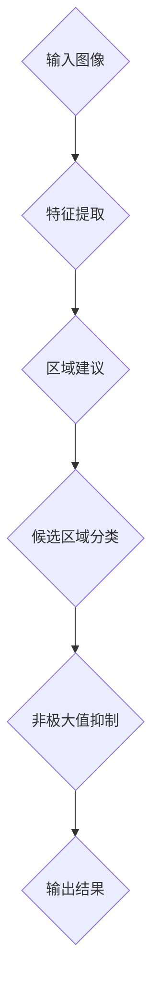
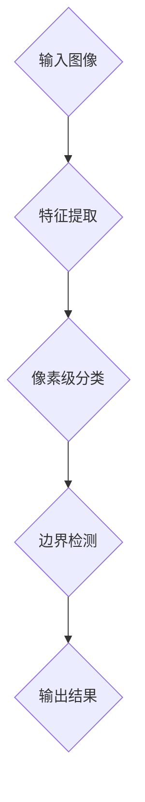

                 

### 引言

随着人工智能技术的迅速发展，计算机视觉（Computer Vision）已成为人工智能领域中的一个重要分支。计算机视觉的目标是通过计算机对图像和视频的分析，使其能够“看懂”周围的世界，从而实现各种实际应用。在这些应用中，图像理解（Image Understanding）是一个核心问题，它涉及到如何从图像中提取有意义的信息，并进行识别、分类和分割等操作。

图像理解不仅对科学研究具有重要意义，也在工业、医疗、交通、安防等多个领域有着广泛的应用。例如，自动驾驶汽车需要通过图像理解来识别道路标志、行人、车辆等；医疗影像分析利用图像理解技术来辅助医生诊断疾病；视频监控通过图像理解来提高安全监控的效率和准确性。因此，研究和掌握图像理解技术对于推动人工智能技术的发展和应用具有重要意义。

本文将深入探讨计算机视觉中的卷积神经网络（Convolutional Neural Network，CNN），这是一种专门用于图像处理和识别的深度学习模型。CNN通过模仿生物视觉系统的工作原理，能够在大量数据上进行训练，从而实现对复杂图像的理解。本文将从以下几个方面展开讨论：

1. **引论与基础**：介绍计算机视觉的基本概念、发展历程和应用领域；介绍卷积神经网络的基本概念、结构和发展历程；阐述图像理解的数学模型及其关系。

2. **卷积神经网络基础**：讲解卷积神经网络的基本概念，包括神经网络的基础、卷积操作、前向传播和反向传播。

3. **核心算法与原理**：重点讨论卷积神经网络在图像分类、目标检测和图像分割中的应用，并给出伪代码示例。

4. **数学模型与数学公式**：详细阐述卷积神经网络的数学模型，包括卷积运算、池化操作、损失函数和优化算法。

5. **图像理解的数学模型**：进一步讨论图像表示的数学模型、图像特征的提取与表示，以及图像理解的数学模型关系。

6. **项目实战**：通过一个具体的计算机视觉项目，展示从环境搭建到模型训练和评估的完整开发过程。

7. **代码解读与分析**：对项目中的关键代码进行解读和分析，提供性能优化和调优实践的策略。

通过本文的讨论，读者可以系统地了解卷积神经网络在计算机视觉中的应用，掌握图像理解的数学模型，并为实际项目的开发提供指导和参考。

### 第一部分：引论与基础

#### 第1章：计算机视觉与卷积神经网络概述

**1.1 计算机视觉简介**

计算机视觉（Computer Vision）是人工智能（AI）的一个重要分支，它研究如何使计算机能够“看懂”并理解图像和视频数据。图像理解（Image Understanding）是计算机视觉的核心问题，它旨在通过图像分析，提取出具有实际意义的信息，从而实现诸如图像识别、分类、分割等任务。

**图像理解的概念**：图像理解不仅仅是简单的图像识别，它涉及到更高层次的任务，包括场景理解、物体识别、姿态估计、行为分析等。通过图像理解，计算机能够对图像内容进行解释，从而在视觉数据中提取出有用的信息。

**计算机视觉的发展历程**：计算机视觉的发展可以追溯到20世纪60年代。早期的计算机视觉主要依赖于手工编写的特征提取算法，如边缘检测、角点检测等。随着计算能力的提升和图像处理技术的进步，出现了许多基于模型的方法，如霍夫变换、光流法等。进入21世纪，深度学习技术的发展推动了计算机视觉的飞速发展，尤其是卷积神经网络（CNN）在图像处理任务中的广泛应用，使得计算机视觉的性能得到了显著提升。

**图像理解的应用领域**：计算机视觉技术已经在许多领域得到了广泛应用，其中包括：

- **安防监控**：通过图像理解技术，实现人脸识别、行为识别、异常检测等，提高监控系统的智能化水平。
- **自动驾驶**：自动驾驶汽车需要通过图像理解来识别道路标志、交通信号、行人、车辆等，确保行驶安全。
- **医疗影像**：通过图像理解技术，辅助医生进行疾病诊断，如肿瘤检测、骨折诊断等。
- **工业生产**：通过图像理解技术，实现生产过程中的质量检测、缺陷识别等，提高生产效率和产品质量。
- **内容审核**：在互联网内容审核领域，通过图像理解技术，实现对违法和不良信息的自动识别和过滤。

**1.2 卷积神经网络简介**

**卷积神经网络（Convolutional Neural Network，CNN）的基本概念**：卷积神经网络是一种专门用于图像处理和识别的深度学习模型。它通过模仿生物视觉系统的工作原理，使用卷积操作来提取图像中的特征，并通过多层神经网络对特征进行学习和理解。CNN在图像分类、目标检测、图像分割等领域表现出色。

**卷积神经网络的基本结构**：一个典型的卷积神经网络包括以下几个主要部分：

- **卷积层（Convolutional Layer）**：卷积层是CNN的核心部分，通过卷积操作提取图像中的特征。每个卷积核（Kernel）可以提取图像中的不同特征，如边缘、纹理等。
- **池化层（Pooling Layer）**：池化层用于减小特征图的尺寸，降低模型参数的数量，减少计算量。常见的池化操作包括最大池化和平均池化。
- **全连接层（Fully Connected Layer）**：全连接层连接了卷积层和分类层，用于对提取到的特征进行分类或回归。
- **激活函数（Activation Function）**：激活函数用于引入非线性因素，使神经网络能够学习和模拟复杂的非线性关系。常见的激活函数包括Sigmoid、ReLU、Tanh等。

**卷积神经网络的发展历程**：卷积神经网络最早由Yann LeCun等人于1980年代提出，并在手写数字识别任务中取得了显著的成功。随着深度学习技术的发展，CNN在图像分类、目标检测和图像分割等领域取得了突破性的进展。近年来，随着大数据和计算能力的提升，CNN的应用场景和性能得到了进一步的扩展和提升。

**1.3 图像理解的数学模型**

**图像表示的数学模型**：在计算机视觉中，图像通常被表示为一个多维矩阵，其中每个元素表示图像中的一个像素值。为了更好地进行图像理解和处理，需要对图像进行特征提取和表示。常见的图像表示方法包括像素级表示、特征级表示和语义级表示。

- **像素级表示**：像素级表示直接使用图像中的像素值进行表示，适用于简单的图像识别任务。
- **特征级表示**：特征级表示通过提取图像中的特征向量进行表示，适用于更复杂的图像理解和分类任务。常见的特征提取方法包括SIFT、HOG等。
- **语义级表示**：语义级表示通过将图像中的像素值映射到语义标签进行表示，适用于图像理解和语义分割任务。

**图像特征的提取与表示**：图像特征的提取是计算机视觉中的关键步骤。通过特征提取，可以从原始图像中提取出具有鉴别性的特征，从而提高图像识别和理解的准确性。常见的特征提取方法包括：

- **边缘检测**：通过检测图像中的边缘信息，提取出图像的基本结构特征。
- **纹理分析**：通过分析图像中的纹理特征，提取出图像的纹理信息。
- **形状分析**：通过分析图像中的形状特征，提取出图像的几何特征。

**图像理解的数学模型关系**：图像理解的数学模型涉及到多个层面的关系，包括图像表示、特征提取、分类和回归等。通过这些数学模型，计算机可以实现对图像内容的理解和分析。以下是图像理解的数学模型关系图：



- **图像表示**：将图像表示为一个多维矩阵。
- **特征提取**：从图像表示中提取出具有鉴别性的特征向量。
- **分类/回归**：对提取到的特征进行分类或回归分析。

通过上述介绍，我们可以看到计算机视觉和卷积神经网络在图像理解中的应用和重要性。在接下来的章节中，我们将进一步探讨卷积神经网络的基础知识、核心算法和数学模型，帮助读者深入理解这一领域。

#### 第2章：卷积神经网络基础

**2.1 基本概念**

卷积神经网络（Convolutional Neural Network，CNN）是一种深度学习模型，专门用于处理和识别图像数据。它的核心在于通过卷积操作提取图像中的特征，从而实现图像理解和分类。

**神经网络基础**：神经网络（Neural Network）是一种模拟生物神经系统的计算模型，它由多个神经元（或节点）组成，每个神经元通过权重连接到其他神经元。神经网络的目的是通过学习输入和输出之间的映射关系，实现对数据的分类、回归或其他类型的任务。

**卷积操作**：卷积操作是CNN中的核心操作，它通过在图像上滑动一个卷积核（也称为滤波器或滤波模板），与图像中的局部区域进行点积运算，从而提取出图像的特征。卷积操作可以理解为一种局部特征的提取过程，它有助于减少参数的数量，提高模型的效率。

**前向传播与反向传播**：在神经网络中，前向传播（Forward Propagation）和反向传播（Backpropagation）是两个关键步骤。前向传播是指将输入数据通过神经网络的前向路径传递，得到输出结果；反向传播是指利用输出结果与实际标签之间的误差，通过反向路径更新网络的权重。

**卷积神经网络的基本结构**：一个典型的卷积神经网络包括以下几个主要部分：

1. **卷积层（Convolutional Layer）**：卷积层是CNN的核心部分，它通过卷积操作提取图像中的特征。卷积层包含多个卷积核，每个卷积核负责提取图像中的不同特征。卷积层的输出是一个特征图（Feature Map），它包含了从图像中提取的特征。

2. **池化层（Pooling Layer）**：池化层用于减小特征图的尺寸，降低模型参数的数量，减少计算量。常见的池化操作包括最大池化（Max Pooling）和平均池化（Average Pooling）。池化操作可以防止模型过拟合，提高模型的泛化能力。

3. **全连接层（Fully Connected Layer）**：全连接层连接了卷积层和分类层，用于对提取到的特征进行分类或回归。全连接层将特征图展平为一个一维向量，并通过权重矩阵进行线性变换，最后通过激活函数得到分类结果。

4. **激活函数（Activation Function）**：激活函数用于引入非线性因素，使神经网络能够学习和模拟复杂的非线性关系。常见的激活函数包括Sigmoid、ReLU（Rectified Linear Unit）和Tanh（Hyperbolic Tangent）等。ReLU函数因其计算效率和性能表现而被广泛使用。

**卷积神经网络的架构**：一个典型的卷积神经网络架构包括多个卷积层、池化层和全连接层。以下是一个简单的卷积神经网络架构示例：



在这个架构中，输入图像首先通过卷积层1和激活函数1进行特征提取，然后通过池化层1减小特征图的尺寸。接下来，特征图通过卷积层2和激活函数2进行进一步的特征提取，再通过池化层2进行尺寸的调整。最后，全连接层对提取到的特征进行分类或回归，得到最终的输出结果。

**卷积神经网络的优化**：为了提高卷积神经网络的性能，需要对模型进行优化。以下是一些常见的优化方法：

1. **损失函数（Loss Function）**：损失函数用于衡量模型的预测结果与实际标签之间的误差。常见的损失函数包括交叉熵损失（Cross Entropy Loss）、均方误差损失（Mean Squared Error Loss）等。

2. **优化算法（Optimization Algorithm）**：优化算法用于更新模型的权重，以最小化损失函数。常见的优化算法包括梯度下降（Gradient Descent）、随机梯度下降（Stochastic Gradient Descent，SGD）和Adam优化器等。

3. **调参技巧（Hyperparameter Tuning）**：通过调整模型参数，如学习率、批次大小、正则化参数等，可以提高模型的性能。常见的调参方法包括网格搜索（Grid Search）、随机搜索（Random Search）和贝叶斯优化（Bayesian Optimization）等。

通过上述介绍，我们可以对卷积神经网络的基本概念、结构和优化方法有一个全面的了解。在接下来的章节中，我们将进一步探讨卷积神经网络在图像分类、目标检测和图像分割中的应用。

#### 第3章：卷积神经网络在图像分类中的应用

图像分类是计算机视觉领域中的一个基础且重要的任务，其目标是将输入图像划分到预定义的类别中。卷积神经网络（CNN）在图像分类任务中取得了显著的成功，主要得益于其强大的特征提取能力和对图像数据的良好适应能力。以下将详细讨论卷积神经网络在图像分类中的应用，包括其数学模型、实际应用案例以及伪代码示例。

**3.1 图像分类的数学模型**

在图像分类任务中，CNN的数学模型主要涉及以下几个关键部分：

1. **特征提取**：卷积层通过卷积操作提取图像中的局部特征，这些特征被表示为多个特征图（Feature Maps）。每个特征图对应于卷积层中的一个卷积核，每个卷积核负责提取图像中的特定类型的信息，如图案、纹理等。

2. **池化操作**：池化层用于减少特征图的尺寸，从而降低模型的参数数量，减少计算量，并防止模型过拟合。常见的池化操作包括最大池化（Max Pooling）和平均池化（Average Pooling）。

3. **全连接层**：全连接层将池化层输出的特征图展平为一个一维向量，然后通过线性变换和激活函数得到分类结果。输出层的激活函数通常是Softmax函数，用于将特征向量映射到概率分布，每个类别的概率值表示图像属于该类别的置信度。

4. **损失函数**：交叉熵损失（Cross Entropy Loss）是图像分类任务中常用的损失函数。它用于衡量预测的概率分布与真实标签之间的差异，并指导模型的训练。

**3.2 卷积神经网络在图像分类中的应用**

卷积神经网络在图像分类任务中的应用非常广泛，以下列举一些典型的应用场景和实际案例：

1. **ImageNet大赛**：ImageNet是一个大规模的视觉识别挑战赛，它推动了深度学习在图像分类领域的应用。CNN通过在ImageNet数据集上的训练，成功实现了对1000个类别的图像进行准确分类。

2. **自然语言处理中的图像分类**：在自然语言处理（NLP）任务中，图像分类可以帮助提高文本分类的准确性。例如，对于包含图像的社交媒体帖子，通过图像分类可以识别图像中的主题，从而增强文本分类模型的效果。

3. **医疗影像分类**：在医学领域，卷积神经网络可以用于对医学图像进行分类，如肿瘤检测、骨折诊断等。通过训练深度学习模型，医生可以更快速、准确地诊断疾病。

**3.3 伪代码示例**

以下是一个简单的卷积神经网络在图像分类任务中的伪代码示例：

```python
# 输入图像
input_image = load_image("image.jpg")

# 初始化卷积神经网络模型
model = ConvolutionalNeuralNetwork()

# 卷积层1
conv1 = model.add_conv_layer(32, 3, activation_function=ReLU)

# 池化层1
pool1 = model.add_max_pooling_layer(2)

# 卷积层2
conv2 = model.add_conv_layer(64, 3, activation_function=ReLU)

# 池化层2
pool2 = model.add_max_pooling_layer(2)

# 全连接层
fc = model.add_fully_connected_layer(1024, activation_function=ReLU)

# 输出层
output = model.add_output_layer(10, activation_function=Softmax)

# 前向传播
output_probs = model.forward_propagation(input_image)

# 计算损失
loss = calculate_loss(output_probs, true_labels)

# 反向传播
model.backward_propagation(loss)

# 模型训练
model.train(dataset, learning_rate, epochs)
```

在这个伪代码中，我们首先加载输入图像，然后初始化卷积神经网络模型。模型包括卷积层、池化层、全连接层和输出层。在前向传播过程中，图像通过卷积层和池化层进行特征提取，最后通过全连接层和输出层得到分类结果。反向传播用于计算损失并更新模型的权重。通过多次迭代训练，模型可以逐步提高分类准确性。

通过上述讨论，我们可以看到卷积神经网络在图像分类任务中的重要性和广泛应用。在接下来的章节中，我们将继续探讨卷积神经网络在目标检测和图像分割中的应用。

#### 第4章：卷积神经网络在目标检测中的应用

目标检测（Object Detection）是计算机视觉领域中的一个重要任务，其目标是在图像中准确地定位和识别多个对象。与图像分类不同，目标检测不仅需要识别对象的类别，还需要确定对象在图像中的位置。卷积神经网络（CNN）由于其强大的特征提取能力和定位能力，在目标检测领域取得了显著的进展。本节将详细讨论卷积神经网络在目标检测中的应用，包括目标检测的数学模型、常用算法、实际应用案例以及伪代码示例。

**4.1 目标检测的数学模型**

在目标检测任务中，卷积神经网络的数学模型主要包括以下几个关键部分：

1. **特征提取**：与图像分类类似，目标检测中的卷积神经网络首先通过卷积层和池化层提取图像的局部特征。这些特征有助于定位和识别图像中的对象。

2. **定位与分类**：在提取到特征后，目标检测模型需要同时进行定位和分类。定位通常通过边界框（Bounding Box）实现，而分类则通过卷积神经网络中的全连接层和输出层实现。

3. **损失函数**：目标检测的损失函数通常包括两个部分：定位损失和分类损失。定位损失用于衡量预测的边界框与真实边界框之间的误差，分类损失则用于衡量预测类别与真实类别之间的误差。

**4.2 卷积神经网络在目标检测中的应用**

卷积神经网络在目标检测中的应用主要包括以下几种常用的算法：

1. **R-CNN（Region-based CNN）**：R-CNN是第一个将深度学习应用于目标检测的算法。它通过选择性搜索（Selective Search）算法生成候选区域（Region Proposals），然后利用CNN对这些候选区域进行分类和定位。R-CNN的优点是简单有效，但缺点是计算量大、速度慢。

2. **Fast R-CNN**：Fast R-CNN对R-CNN进行了优化，通过共享卷积特征图，提高了计算效率。它将候选区域定位和分类过程合并为一个网络，通过RoI（Region of Interest）池化层实现。Fast R-CNN在速度和准确度上都有显著提升。

3. **Faster R-CNN**：Faster R-CNN引入了区域建议网络（Region Proposal Network，RPN），将候选区域生成与特征提取过程分离。RPN通过一个卷积神经网络生成高质量的候选区域，显著提高了目标检测的效率。Faster R-CNN在速度和准确度上均优于Fast R-CNN。

4. **SSD（Single Shot MultiBox Detector）**：SSD是一种单阶段目标检测算法，它通过在不同尺寸的特征图上直接检测目标，无需生成候选区域。SSD使用多个尺度特征图，并应用不同的卷积核大小和步长，从而实现多尺度目标检测。

5. **YOLO（You Only Look Once）**：YOLO是一种典型的单阶段目标检测算法，它将目标检测任务看作一个回归问题，直接预测每个网格单元中目标的位置和类别概率。YOLO具有高速和高准确度的特点，适用于实时目标检测。

**4.3 伪代码示例**

以下是一个简单的基于Faster R-CNN的目标检测算法的伪代码示例：

```python
# 加载输入图像
input_image = load_image("image.jpg")

# 初始化Faster R-CNN模型
model = FasterRCNN()

# 卷积层1
conv1 = model.add_conv_layer(64, 3, activation_function=ReLU)

# 池化层1
pool1 = model.add_max_pooling_layer(2)

# 卷积层2
conv2 = model.add_conv_layer(128, 3, activation_function=ReLU)

# 池化层2
pool2 = model.add_max_pooling_layer(2)

# RoI池化层
roi_pool = model.add_roi_pooling_layer(7, 7)

# RPN
rpn = model.add_rpn_layer()

# 全连接层
fc = model.add_fully_connected_layer(1024, activation_function=ReLU)

# 输出层
output = model.add_output_layer(num_classes + 1, activation_function=Sigmoid)

# 前向传播
proposal_boxes, class_probs = model.forward_propagation(input_image)

# 非极大值抑制（Non-maximum Suppression，NMS）
selected_boxes, selected_probs = non_max_suppression(proposal_boxes, class_probs)

# 输出结果
detections = {
    "boxes": selected_boxes,
    "labels": selected_probs.argmax(axis=1),
    "scores": selected_probs.max(axis=1)
}

# 模型训练
model.train(dataset, learning_rate, epochs)
```

在这个伪代码中，我们首先加载输入图像，然后初始化Faster R-CNN模型。模型包括卷积层、池化层、RoI池化层、RPN和全连接层。在前向传播过程中，图像通过卷积层和池化层进行特征提取，然后通过RPN生成候选区域和分类概率。非极大值抑制（NMS）用于筛选高质量的目标检测框。通过多次迭代训练，模型可以逐步提高目标检测的准确度和速度。

通过上述讨论，我们可以看到卷积神经网络在目标检测领域的重要性和广泛应用。在接下来的章节中，我们将继续探讨卷积神经网络在图像分割中的应用。

#### 第5章：卷积神经网络在图像分割中的应用

图像分割（Image Segmentation）是计算机视觉领域中的一个核心任务，其目标是将图像中的每个像素点标注为特定的对象或区域。卷积神经网络（CNN）因其强大的特征提取和定位能力，在图像分割任务中取得了显著的进展。本节将详细讨论卷积神经网络在图像分割中的应用，包括图像分割的数学模型、常用算法、实际应用案例以及伪代码示例。

**5.1 图像分割的数学模型**

在图像分割任务中，卷积神经网络的数学模型主要包括以下几个关键部分：

1. **特征提取**：与目标检测和图像分类类似，图像分割首先通过卷积层和池化层提取图像的局部特征。这些特征有助于定位和区分图像中的不同对象或区域。

2. **像素级分类**：在提取到特征后，图像分割模型需要对每个像素点进行分类，将像素点标注为不同的对象或区域。这通常通过全连接层和输出层实现，输出层的激活函数可以是Sigmoid或Softmax，用于生成每个像素点的分类概率。

3. **损失函数**：图像分割的损失函数通常采用像素级交叉熵损失（Pixel-wise Cross Entropy Loss），用于衡量预测的像素标签与真实标签之间的差异。

**5.2 卷积神经网络在图像分割中的应用**

卷积神经网络在图像分割中的应用主要包括以下几种常用的算法：

1. **U-Net**：U-Net是一个经典的卷积神经网络架构，专门用于医学图像分割。它通过一个对称的U型结构，将特征图的尺寸从下往上逐步恢复，从而实现精确的像素级分类。U-Net的优点是结构简单、计算效率高，适用于小尺寸图像的分割任务。

2. **SegNet**：SegNet是一种基于卷积神经网络的图像分割算法，它通过编码器-解码器结构，在特征提取和特征恢复过程中逐步合并和细化特征信息。SegNet在保持较高分割精度的情况下，具有较高的计算效率。

3. **DeepLab系列**：DeepLab系列算法是谷歌提出的一类深度学习图像分割算法，通过引入空洞卷积（Atrous Convolution）和上采样操作，实现了高分辨率的图像分割。DeepLab系列算法在像素级别的分割精度上表现优异，特别适用于场景分割和语义分割任务。

4. **Mask R-CNN**：Mask R-CNN是一种结合目标检测和图像分割的深度学习模型，它通过引入分割分支，实现了对对象边界和内部区域的精确分割。Mask R-CNN在多种图像分割任务中取得了优异的性能，广泛应用于自动驾驶、医疗影像等领域。

**5.3 伪代码示例**

以下是一个简单的基于U-Net的图像分割算法的伪代码示例：

```python
# 加载输入图像
input_image = load_image("image.jpg")

# 初始化U-Net模型
model = UNet()

# 编码器部分
encoder = model.add_encoder(64, 3, activation_function=ReLU)

# 池化层
pool = model.add_max_pooling_layer(2)

# 解码器部分
decoder = model.add_decoder(64, 3, activation_function=ReLU)

# 输出层
output = model.add_output_layer(1, activation_function=Sigmoid)

# 前向传播
segmentation_map = model.forward_propagation(input_image)

# 计算损失
loss = calculate_loss(segmentation_map, true_labels)

# 反向传播
model.backward_propagation(loss)

# 模型训练
model.train(dataset, learning_rate, epochs)
```

在这个伪代码中，我们首先加载输入图像，然后初始化U-Net模型。模型包括编码器、解码器和输出层。编码器通过多个卷积层和池化层提取特征，解码器通过多个卷积层和上采样操作恢复特征，输出层通过Sigmoid函数生成像素级的分类概率。通过多次迭代训练，模型可以逐步提高图像分割的精度。

通过上述讨论，我们可以看到卷积神经网络在图像分割领域的重要性和广泛应用。在接下来的章节中，我们将进一步探讨卷积神经网络的数学模型与数学公式，帮助读者更深入地理解CNN的工作原理。

#### 第6章：卷积神经网络的数学模型

卷积神经网络（CNN）作为计算机视觉领域的一种重要模型，其工作原理依赖于一系列复杂的数学操作。在本章中，我们将详细阐述卷积神经网络的数学模型，包括卷积运算、池化操作、损失函数和优化算法的数学公式，并通过具体例子进行推导。

**6.1 卷积运算的数学公式**

卷积运算（Convolution）是CNN中最核心的操作之一，它通过在图像上滑动一个卷积核（滤波器），与图像的局部区域进行点积运算，从而提取出图像的特征。卷积运算的数学公式可以表示为：

$$
\text{output}_{ij} = \sum_{k=1}^{m} \sum_{l=1}^{n} \text{filter}_{ijkl} \cdot \text{input}_{ijkl}
$$

其中，output 是卷积层的输出特征图，filter 是卷积核，input 是输入图像。i 和 j 表示特征图中的行和列位置，k 和 l 表示卷积核的位置。

**6.2 卷积运算的推导**

为了更直观地理解卷积运算，我们可以通过一个简单的例子进行推导。假设输入图像是一个3x3的矩阵，卷积核的大小是3x3，卷积核的权重为：

$$
\text{filter} = \begin{bmatrix}
1 & 0 & 1 \\
1 & 0 & 1 \\
1 & 0 & 1 \\
\end{bmatrix}
$$

输入图像为：

$$
\text{input} = \begin{bmatrix}
1 & 0 & 1 \\
1 & 1 & 1 \\
0 & 1 & 0 \\
\end{bmatrix}
$$

卷积运算的结果为：

$$
\text{output}_{1,1} = 1 \cdot 1 + 0 \cdot 1 + 1 \cdot 0 = 1 \\
\text{output}_{1,2} = 1 \cdot 1 + 0 \cdot 1 + 1 \cdot 1 = 2 \\
\text{output}_{1,3} = 1 \cdot 0 + 0 \cdot 1 + 1 \cdot 0 = 0 \\
\text{output}_{2,1} = 1 \cdot 1 + 1 \cdot 1 + 1 \cdot 0 = 2 \\
\text{output}_{2,2} = 1 \cdot 1 + 1 \cdot 1 + 1 \cdot 1 = 3 \\
\text{output}_{2,3} = 1 \cdot 0 + 1 \cdot 1 + 1 \cdot 0 = 1 \\
\text{output}_{3,1} = 1 \cdot 0 + 0 \cdot 1 + 1 \cdot 0 = 0 \\
\text{output}_{3,2} = 1 \cdot 1 + 0 \cdot 1 + 1 \cdot 1 = 2 \\
\text{output}_{3,3} = 1 \cdot 0 + 0 \cdot 1 + 1 \cdot 0 = 0 \\
$$

因此，卷积后的特征图输出为：

$$
\text{output} = \begin{bmatrix}
1 & 2 & 0 \\
2 & 3 & 1 \\
0 & 2 & 0 \\
\end{bmatrix}
$$

**6.3 池化操作的数学公式**

池化操作（Pooling）用于减小特征图的尺寸，降低模型参数的数量，减少计算量。常见的池化操作包括最大池化（Max Pooling）和平均池化（Average Pooling）。最大池化的数学公式可以表示为：

$$
\text{output}_{i,j} = \max \{ \text{input}_{i,k}, \text{input}_{i,k+1}, ..., \text{input}_{i,k+h} \}
$$

其中，output 是池化后的特征图，input 是输入特征图，h 是池化窗口的大小。

**6.4 池化操作的推导**

假设输入特征图是一个3x3的矩阵，池化窗口大小为2x2，那么最大池化的结果为：

$$
\text{output}_{1,1} = \max \{ \text{input}_{1,1}, \text{input}_{1,2} \} \\
\text{output}_{1,2} = \max \{ \text{input}_{1,2}, \text{input}_{1,3} \} \\
\text{output}_{2,1} = \max \{ \text{input}_{2,1}, \text{input}_{2,2} \} \\
\text{output}_{2,2} = \max \{ \text{input}_{2,2}, \text{input}_{2,3} \} \\
$$

平均池化的结果为：

$$
\text{output}_{i,j} = \frac{1}{h^2} \sum_{k=1}^{h} \sum_{l=1}^{h} \text{input}_{i,k}, \text{input}_{i,l}
$$

**6.5 损失函数的数学公式**

在深度学习中，损失函数用于衡量模型的预测结果与实际标签之间的误差，并指导模型的训练。常见的损失函数包括交叉熵损失（Cross Entropy Loss）和均方误差损失（Mean Squared Error Loss）。交叉熵损失的数学公式可以表示为：

$$
\text{loss} = -\sum_{i} y_i \log(p_i)
$$

其中，y 是实际标签，p 是模型的预测概率。

**6.6 优化算法的数学公式**

优化算法用于更新模型的权重，以最小化损失函数。常见的优化算法包括梯度下降（Gradient Descent）和Adam优化器。梯度下降的数学公式可以表示为：

$$
\theta = \theta - \alpha \cdot \nabla_{\theta} J(\theta)
$$

其中，θ 是模型参数，α 是学习率，J(θ) 是损失函数。

**6.7 优化算法的推导**

假设损失函数 J(θ) 是关于参数 θ 的凸函数，梯度下降的目标是找到使得损失函数最小的参数值。首先，计算损失函数关于参数 θ 的梯度：

$$
\nabla_{\theta} J(\theta) = \frac{\partial J(\theta)}{\partial \theta}
$$

然后，通过梯度下降算法，迭代更新参数：

$$
\theta = \theta - \alpha \cdot \nabla_{\theta} J(\theta)
$$

通过多次迭代，模型参数 θ 逐渐收敛到最优值。

通过上述讨论，我们可以看到卷积神经网络在数学模型方面的高度复杂性。通过理解这些数学公式和推导过程，读者可以更深入地掌握卷积神经网络的工作原理，并为其在实际应用中的优化提供理论依据。

#### 第7章：图像理解的数学模型

图像理解是计算机视觉领域的一个重要目标，它涉及到如何从图像中提取有意义的信息，并对其进行分类、检测和分割等操作。在这一章中，我们将深入探讨图像理解的数学模型，包括图像表示、图像特征的提取与表示，以及图像理解的数学模型关系。

**7.1 图像表示的数学模型**

图像表示是将图像数据转换为一种适合于计算机处理的数学形式。常见的图像表示方法包括像素级表示、特征级表示和语义级表示。

1. **像素级表示**：像素级表示直接使用图像中的像素值进行表示。每个像素值代表图像中的一个点，通过多维矩阵来存储。这种方法适用于简单的图像识别任务，但在复杂场景下，像素级表示难以捕捉图像的高层次结构。

   $$ \text{Image}_{m,n,p} = \begin{bmatrix}
   \text{pixel}_{m,n,1} & \text{pixel}_{m,n,2} & \cdots & \text{pixel}_{m,n,p}
   \end{bmatrix} $$

2. **特征级表示**：特征级表示通过提取图像的特征向量进行表示，这些特征向量包含了图像的局部信息，如边缘、纹理和形状等。特征提取方法包括SIFT（尺度不变特征变换）、HOG（直方图方向梯度）等。特征级表示相比像素级表示更能捕捉图像的显著特征，适用于复杂的图像理解和分类任务。

   $$ \text{FeatureVector} = \begin{bmatrix}
   f_1 & f_2 & \cdots & f_n
   \end{bmatrix} $$

3. **语义级表示**：语义级表示通过将图像中的像素值映射到语义标签进行表示，这种表示方法通常用于语义分割和物体识别任务。语义标签可以是具体的物体类别，也可以是场景的抽象描述。语义级表示需要更高层次的抽象能力，能够将图像内容与真实世界中的实体和场景相对应。

   $$ \text{SemanticLabel}_{m,n} = \begin{bmatrix}
   \text{label}_{m,n,1} & \text{label}_{m,n,2} & \cdots & \text{label}_{m,n,c}
   \end{bmatrix} $$

**7.2 图像特征的提取与表示**

图像特征的提取是图像理解中的关键步骤，它从图像中提取出具有鉴别性的特征，用于后续的分类、检测和分割等任务。常见的特征提取方法包括：

1. **边缘检测**：边缘检测通过检测图像中的边缘信息，提取出图像的基本结构特征。常见的边缘检测算法包括Canny算子、Sobel算子等。

2. **纹理分析**：纹理分析通过分析图像中的纹理特征，提取出图像的纹理信息。常见的纹理分析算法包括灰度共生矩阵、Gabor变换等。

3. **形状分析**：形状分析通过分析图像中的形状特征，提取出图像的几何特征。常见的形状分析算法包括霍夫变换、轮廓分析等。

图像特征提取后的表示方法通常包括以下几种：

1. **特征向量**：将提取到的特征转换为向量形式，用于后续的机器学习算法。

2. **特征图**：将提取到的特征组织为一个多维矩阵，每个像素点代表一个特征值。

3. **特征金字塔**：通过不同尺度的特征提取，构建一个多层次的图像特征金字塔，用于不同尺度的图像理解和处理。

**7.3 图像理解的数学模型关系**

图像理解的数学模型关系涉及多个层面的关系，包括图像表示、特征提取、分类和回归等。以下是一个简单的数学模型关系图：


- **图像表示**：图像通过像素级表示、特征级表示或语义级表示进行表示。
- **特征提取**：从图像表示中提取出具有鉴别性的特征向量。
- **分类/回归**：对提取到的特征进行分类或回归分析。

具体来说，图像理解的数学模型关系如下：

1. **像素级表示到特征级表示**：通过边缘检测、纹理分析、形状分析等方法，从像素级表示中提取出特征向量。这些特征向量可以用于后续的分类或分割任务。

2. **特征级表示到语义级表示**：通过更高层次的抽象，将特征向量映射到语义标签，实现对图像内容的理解。这种映射可以通过训练分类器或回归模型实现。

3. **语义级表示的应用**：语义级表示可以用于图像分类、目标检测、图像分割等任务。例如，在图像分类任务中，通过训练分类模型，将图像映射到预定义的类别；在目标检测任务中，通过训练检测模型，识别图像中的对象并定位其位置；在图像分割任务中，通过训练分割模型，将图像中的每个像素点映射到相应的类别。

通过上述数学模型关系，我们可以看到图像理解涉及多个层面的转化和抽象。通过结合不同的数学模型和方法，计算机视觉系统可以实现对图像内容的深入理解和应用。

#### 第8章：计算机视觉项目实战

**8.1 项目背景与目标**

随着人工智能技术的不断发展，计算机视觉技术在众多领域得到了广泛应用，如自动驾驶、医疗影像分析、安防监控等。本节将通过一个具体的计算机视觉项目，展示从环境搭建到模型训练和评估的完整开发过程。

本项目的目标是使用卷积神经网络（CNN）对图像进行分类，具体任务是实现一个简单的图像识别系统，能够对输入的图像进行分类，并给出对应的标签。该项目将利用Python编程语言和TensorFlow深度学习框架进行开发。

**8.2 项目环境搭建**

在开始项目开发之前，我们需要搭建一个合适的开发环境。以下是项目开发所需的环境配置：

1. **操作系统**：推荐使用Linux操作系统，如Ubuntu或CentOS。Windows用户可以通过安装Windows Subsystem for Linux（WSL）来使用Linux环境。
2. **Python**：安装Python 3.7或更高版本。可以使用官方的包管理器pip进行安装。
3. **TensorFlow**：安装TensorFlow 2.x版本。可以通过以下命令进行安装：

   ```bash
   pip install tensorflow
   ```

4. **其他依赖**：安装其他可能用到的依赖包，如NumPy、Pandas等。

   ```bash
   pip install numpy pandas
   ```

**8.3 项目开发过程**

项目开发过程包括以下几个关键步骤：

1. **数据集准备**：选择一个合适的图像数据集，例如常用的MNIST手写数字数据集或CIFAR-10数据集。数据集需要包含图像文件和对应的标签文件。

2. **数据预处理**：对图像进行预处理，包括图像归一化、数据增强等操作。图像归一化是将图像的像素值缩放到[0, 1]范围内，以适应神经网络模型的输入要求。数据增强是通过随机旋转、缩放、裁剪等方式增加数据的多样性，从而提高模型的泛化能力。

3. **模型设计**：设计一个简单的卷积神经网络模型，包括卷积层、池化层和全连接层。以下是模型设计的伪代码：

   ```python
   model = Sequential()
   model.add(Conv2D(32, (3, 3), activation='relu', input_shape=(28, 28, 1)))
   model.add(MaxPooling2D((2, 2)))
   model.add(Conv2D(64, (3, 3), activation='relu'))
   model.add(MaxPooling2D((2, 2)))
   model.add(Flatten())
   model.add(Dense(128, activation='relu'))
   model.add(Dense(10, activation='softmax'))
   ```

4. **模型训练**：使用准备好的数据集对模型进行训练。训练过程中需要选择合适的损失函数和优化器，例如交叉熵损失函数和Adam优化器。以下是对模型进行训练的代码示例：

   ```python
   model.compile(optimizer='adam', loss='categorical_crossentropy', metrics=['accuracy'])
   model.fit(x_train, y_train, batch_size=64, epochs=10, validation_data=(x_val, y_val))
   ```

5. **模型评估**：使用验证集或测试集对训练好的模型进行评估，计算模型的准确率、召回率等指标，以判断模型的性能。以下是模型评估的代码示例：

   ```python
   test_loss, test_acc = model.evaluate(x_test, y_test)
   print('Test accuracy:', test_acc)
   ```

6. **模型部署**：将训练好的模型部署到实际应用场景中，例如通过API接口对外提供服务。可以使用TensorFlow Serving或其他模型部署工具进行模型部署。

**8.4 项目结果分析**

在完成项目开发后，我们需要对项目的结果进行详细分析，以评估模型的效果。以下是项目结果分析的内容：

1. **模型性能评估**：通过在测试集上的评估，计算模型的准确率、召回率、F1分数等指标。这些指标可以帮助我们了解模型的性能和稳定性。

2. **错误分析**：对模型的预测结果进行错误分析，找出模型在哪些情况下容易出现错误，并尝试优化模型的性能。例如，可以尝试增加训练数据量、调整模型结构或采用不同的优化算法。

3. **实际应用效果**：在实际应用场景中测试模型的效果，如使用模型对实际拍摄的图像进行分类，评估模型的实用性和可靠性。

通过上述实战项目，我们可以系统地了解计算机视觉项目的开发流程，从环境搭建、数据预处理、模型设计、训练和评估到模型部署，掌握卷积神经网络在图像分类任务中的实际应用。

#### 第9章：代码解读与分析

在计算机视觉项目中，代码的质量直接影响模型的效果和开发效率。本节将对项目中的关键代码进行详细解读，包括卷积操作的代码解读、池化操作的代码解读、损失函数的代码解读以及优化算法的代码解读。同时，我们将提供代码性能分析和优化策略，以提升代码的执行效率和模型性能。

**9.1 代码结构与流程**

一个典型的计算机视觉项目通常包括数据预处理、模型定义、模型训练和模型评估等几个关键部分。以下是一个简单的代码结构示例：

```python
# 导入必要的库
import tensorflow as tf
from tensorflow.keras import layers, models
from tensorflow.keras.datasets import mnist

# 数据预处理
(x_train, y_train), (x_test, y_test) = mnist.load_data()
x_train = x_train.reshape(-1, 28, 28, 1).astype('float32') / 255.0
x_test = x_test.reshape(-1, 28, 28, 1).astype('float32') / 255.0
y_train = tf.keras.utils.to_categorical(y_train, 10)
y_test = tf.keras.utils.to_categorical(y_test, 10)

# 模型定义
model = models.Sequential()
model.add(layers.Conv2D(32, (3, 3), activation='relu', input_shape=(28, 28, 1)))
model.add(layers.MaxPooling2D((2, 2)))
model.add(layers.Conv2D(64, (3, 3), activation='relu'))
model.add(layers.MaxPooling2D((2, 2)))
model.add(layers.Flatten())
model.add(layers.Dense(64, activation='relu'))
model.add(layers.Dense(10, activation='softmax'))

# 模型编译
model.compile(optimizer='adam', loss='categorical_crossentropy', metrics=['accuracy'])

# 模型训练
model.fit(x_train, y_train, epochs=5, batch_size=64, validation_data=(x_test, y_test))

# 模型评估
test_loss, test_acc = model.evaluate(x_test, y_test)
print('Test accuracy:', test_acc)
```

在这个示例中，我们首先导入必要的库，然后进行数据预处理，接着定义一个简单的卷积神经网络模型，编译模型并训练，最后评估模型性能。

**9.2 关键代码解读**

1. **卷积操作的代码解读**

卷积操作是CNN的核心步骤，用于提取图像的特征。以下是对卷积操作代码的解读：

```python
model.add(layers.Conv2D(32, (3, 3), activation='relu', input_shape=(28, 28, 1)))
```

这一行代码定义了一个卷积层，它包含32个卷积核，每个卷积核的大小为3x3。激活函数使用ReLU函数，输入形状为28x28的图像，深度为1（灰度图像）。

2. **池化操作的代码解读**

池化操作用于减小特征图的尺寸，提高模型的计算效率。以下是对池化操作代码的解读：

```python
model.add(layers.MaxPooling2D((2, 2)))
```

这一行代码定义了一个最大池化层，窗口大小为2x2，这意味着每个2x2的区域内的最大值将被保留，其他值将被丢弃。

3. **损失函数的代码解读**

损失函数用于衡量模型预测结果与实际标签之间的误差。以下是对损失函数代码的解读：

```python
model.compile(optimizer='adam', loss='categorical_crossentropy', metrics=['accuracy'])
```

这一行代码编译模型时指定了损失函数为交叉熵损失函数，优化器使用Adam优化器，同时监控模型的准确率。

4. **优化算法的代码解读**

优化算法用于更新模型的参数，以最小化损失函数。以下是对优化算法代码的解读：

```python
model.compile(optimizer='adam', loss='categorical_crossentropy', metrics=['accuracy'])
```

这一行代码同样在编译模型时指定了优化器为Adam优化器，Adam优化器结合了梯度下降和动量的优点，适合处理大型模型和稀疏数据。

**9.3 代码性能分析与优化**

1. **性能分析**

代码性能分析是评估代码质量和优化潜力的重要步骤。以下是一些常用的性能分析指标和方法：

- **运行时间**：通过计时工具（如Python的time模块）测量代码的运行时间，评估代码的效率。
- **内存使用**：使用内存监控工具（如Python的memory_profiler库）分析代码的内存使用情况。
- **CPU/GPU利用率**：通过性能监控工具（如nvidia-smi）分析CPU和GPU的利用率。

2. **优化策略**

针对性能分析的结果，可以采取以下优化策略：

- **并行计算**：利用多线程或多进程技术，加速计算密集型操作。
- **算法优化**：优化算法选择，如使用更高效的卷积算法（如CuDNN）和优化器（如AdamW）。
- **模型压缩**：通过模型剪枝、量化等技术减小模型大小，加速模型部署。
- **代码重构**：优化代码结构，如减少不必要的计算、避免全局变量等。

**9.4 代码调优实践**

代码调优实践通常包括以下几个步骤：

1. **性能瓶颈分析**：通过性能分析工具确定性能瓶颈，如计算密集型操作或I/O操作。
2. **优化关键代码**：针对性能瓶颈进行代码优化，如使用更高效的算法或数据结构。
3. **测试和验证**：在优化后，对代码进行测试和验证，确保优化后的代码依然能够正确运行并提高性能。

通过上述代码解读与分析，我们可以更好地理解计算机视觉项目中的关键代码，并采取有效的优化策略，提高代码的执行效率和模型性能。在实际开发中，持续的性能分析和调优是提升项目质量的关键。

### 总结与展望

本文详细探讨了计算机视觉中的卷积神经网络（CNN），从引论、基础、核心算法到实际应用，系统地介绍了CNN在图像分类、目标检测和图像分割中的应用，以及CNN的数学模型和优化方法。通过具体的项目实战和代码分析，读者可以全面了解CNN在图像理解任务中的实际应用和开发过程。

**总结**：

1. **引论与基础**：介绍了计算机视觉的基本概念、发展历程和应用领域；讲解了卷积神经网络的基本概念、结构和发展历程；阐述了图像理解的数学模型及其关系。

2. **卷积神经网络基础**：详细讲解了卷积神经网络的基本概念、结构和优化方法。

3. **核心算法与原理**：探讨了CNN在图像分类、目标检测和图像分割中的应用，并提供了伪代码示例。

4. **数学模型与数学公式**：阐述了CNN的数学模型，包括卷积运算、池化操作、损失函数和优化算法的数学公式。

5. **图像理解的数学模型**：讨论了图像表示、特征提取和图像理解数学模型的关系。

6. **项目实战**：通过一个具体的计算机视觉项目，展示了从环境搭建到模型训练和评估的完整开发过程。

7. **代码解读与分析**：对项目中的关键代码进行了详细解读，提供了代码性能分析和优化策略。

**展望**：

尽管CNN在图像理解任务中取得了显著的成果，但仍然存在一些挑战和局限性。未来的研究方向包括：

1. **模型优化**：进一步优化CNN模型的结构和算法，提高模型的计算效率和性能。

2. **小样本学习**：研究如何有效利用少量数据进行CNN的训练，提高模型的泛化能力。

3. **多模态学习**：结合不同类型的数据（如图像、文本、音频等），实现更全面的图像理解。

4. **实时处理**：提高CNN在实时处理中的性能，满足自动驾驶、智能监控等应用的需求。

5. **解释性**：增强CNN的解释性，使其决策过程更加透明和可解释，提高其在实际应用中的可靠性。

总之，卷积神经网络作为计算机视觉的核心技术，具有广阔的发展前景。通过不断的研究和创新，我们可以进一步推动计算机视觉技术的应用和发展，为人工智能领域带来更多突破。

### 附录A：参考文献与拓展资源

**参考文献**：

1. Yann LeCun, Yoshua Bengio, and Geoffrey Hinton. "Deep Learning." Nature, 2015.
2. Andrew Ng. "CS231n: Convolutional Neural Networks for Visual Recognition." Stanford University, 2017.
3. Ross Girshick, Jeff Donahue, Tyler Darrell, and Joseph Redmon. "Rich Features for Accurate Object Detection and Semantic Segmentation." CVPR, 2014.
4. Kaiming He, Xiangyu Zhang, Shaoqing Ren, and Jian Sun. "Deep Residual Learning for Image Recognition." CVPR, 2016.
5. Christian Szegedy, Wei Liu, Yangqing Jia, Pierre Sermanet, Scott Reed, Dragomir Anguelov, Dumitru Erhan, Vincent Vanhoucke, and Andrew Rabinovich. "Going Deeper with Convolutions." CVPR, 2015.

**拓展资源**：

1. TensorFlow 官方文档：https://www.tensorflow.org/
2. PyTorch 官方文档：https://pytorch.org/docs/stable/
3. Coursera - Deep Learning Specialization：https://www.coursera.org/specializations/deep-learning
4. GitHub - 卷积神经网络资源库：https://github.com/ReLU-GNN/Convolutional-Neural-Networks
5. ArXiv - 最新研究论文：https://arxiv.org/

通过阅读上述参考文献和拓展资源，读者可以进一步深入了解卷积神经网络的理论和实践，跟踪该领域的前沿研究动态。

### 附录B：Mermaid 流程图

**卷积神经网络的基本结构**：



**卷积神经网络的前向传播**：



**卷积神经网络的反向传播**：



**目标检测算法流程**：



**图像分割算法流程**：



这些流程图展示了卷积神经网络在图像分类、目标检测和图像分割任务中的基本操作和流程，有助于读者更直观地理解这些算法的实现过程。

