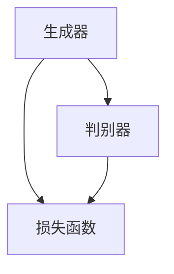

                 

### 文章标题

《计算机视觉的生成对抗网络：图像生成的数学模型》

### 关键词

- 计算机视觉
- 生成对抗网络（GAN）
- 图像生成
- 数学模型
- 卷积神经网络（CNN）

### 摘要

本文旨在深入探讨计算机视觉领域中的一种重要技术——生成对抗网络（GAN）及其图像生成的数学模型。首先，我们将介绍GAN的基本概念、历史发展及其核心组成部分。随后，文章将详细解析GAN的原理、损失函数与优化算法，以及其在计算机视觉中的应用。此外，文章还将探讨图像生成模型的数学基础和优化方法，并通过实例研究展示GAN在实际计算机视觉应用中的案例。最后，文章将总结GAN的高级应用及其未来发展方向，为读者提供全面的GAN知识体系。

## 《计算机视觉的生成对抗网络：图像生成的数学模型》目录大纲

### 第一部分：生成对抗网络（GAN）基础

## 第1章 生成对抗网络概述
### 1.1 GAN的基本概念
### 1.2 GAN的历史与发展
### 1.3 GAN的核心组成部分

## 第2章 生成对抗网络原理
### 2.1 判别器与生成器的训练过程
### 2.2 损失函数与优化算法
### 2.3 GAN的数学模型
### 2.4 GAN的稳定性与训练问题
### 2.5 GAN的扩展与应用场景

## 第3章 计算机视觉中的GAN
### 3.1 GAN在图像生成中的应用
### 3.2 GAN在图像超分辨率中的应用
### 3.3 GAN在图像修复与去噪中的应用
### 3.4 GAN在图像风格迁移中的应用

## 第4章 图像生成的数学模型
### 4.1 图像生成模型的数学基础
### 4.2 卷积神经网络与图像生成
### 4.3 常见的图像生成模型
### 4.4 图像生成模型的优化方法

## 第5章 实例研究：GAN在计算机视觉中的应用案例
### 5.1 GAN在图像生成中的实际应用
### 5.2 GAN在图像超分辨率中的实际应用
### 5.3 GAN在图像修复与去噪中的实际应用
### 5.4 GAN在图像风格迁移中的实际应用

### 第二部分：生成对抗网络在计算机视觉中的高级应用

## 第6章 高级GAN架构与算法
### 6.1 条件生成对抗网络（cGAN）
### 6.2 迁移生成对抗网络（mGAN）
### 6.3 对抗性自编码器（AAE）
### 6.4 增强生成对抗网络（EGAN）

## 第7章 GAN在计算机视觉中的挑战与未来方向
### 7.1 GAN面临的挑战
### 7.2 GAN在计算机视觉中的未来发展方向
### 7.3 GAN与其他技术的融合

## 第8章 综合实例分析：GAN在图像生成与计算机视觉中的创新应用
### 8.1 图像生成与计算机视觉中的创新应用实例
### 8.2 实例分析：GAN在图像生成中的创新应用
### 8.3 实例分析：GAN在计算机视觉中的创新应用
### 8.4 实例分析：GAN在图像生成与计算机视觉融合中的创新应用

### 附录

## 附录A GAN常用代码与工具库
### A.1 TensorFlow与GAN
### A.2 PyTorch与GAN
### A.3 其他GAN工具库

### Mermaid 流程图：生成对抗网络的基本组件



### GAN的核心算法原理讲解

在深入探讨生成对抗网络（GAN）的数学模型之前，我们先要理解GAN的核心组成部分：生成器（Generator）、判别器（Discriminator）和损失函数。

#### 生成器（Generator）

生成器的目的是从随机噪声生成逼真的数据样本。其输入为随机噪声向量 $z$，输出为生成的数据样本 $x$。生成器的训练目标是使生成的数据尽可能真实，以欺骗判别器。

**伪代码：**

```plaintext
// 生成器模型
Generator(z):
    # 输入噪声向量 z
    # 通过多层神经网络生成图像
    x = Dense layer(z)
    x = Activation(x)
    # 输出生成的图像
    return x
```

#### 判别器（Discriminator）

判别器的目的是区分真实数据与生成数据。其输入为真实数据 $x_{real}$ 或生成数据 $x_{fake}$，输出为一个概率值 $p$，表示输入数据的真实性。判别器的训练目标是提高其辨别真实数据与生成数据的能力。

**伪代码：**

```plaintext
// 判别器模型
Discriminator(x):
    # 输入数据 x
    # 通过多层神经网络输出一个概率值
    p = Dense layer(x)
    p = Activation(p)
    # 输出判别结果概率
    return p
```

#### 损失函数

GAN的训练过程基于一个对抗性的过程，生成器和判别器通过相互对抗来提高自身的能力。常用的损失函数有：

1. **均方误差损失（MSE）**：

   $$L_{MSE} = \frac{1}{n}\sum_{i=1}^{n}(y_{true} - y_{predicted})^2$$

2. **二元交叉熵损失（Binary Cross-Entropy）**：

   $$L_{BCE} = -\frac{1}{n}\sum_{i=1}^{n}(y_{true} \cdot \log(y_{predicted}) + (1 - y_{true}) \cdot \log(1 - y_{predicted}))$$

**GAN的训练过程**：

GAN的训练过程可以分为以下几个步骤：

1. **生成器训练**：在训练生成器时，我们固定判别器模型，只对生成器进行训练。生成器的目标是使生成的数据样本能够欺骗判别器，即生成的数据样本被判别器判为真实的概率最大。

2. **判别器训练**：在训练判别器时，我们固定生成器模型，只对判别器进行训练。判别器的目标是提高其辨别真实数据与生成数据的能力。

3. **交替训练**：生成器和判别器交替进行训练，通过不断的对抗性训练，使生成器生成的数据样本越来越真实，判别器对数据的辨别能力也越来越强。

**GAN的核心算法原理**：

GAN的核心算法原理基于以下思想：生成器和判别器通过相互对抗来提高自身的能力。生成器的目标是生成逼真的数据样本以欺骗判别器，而判别器的目标是提高其辨别真实数据与生成数据的能力。通过交替训练生成器和判别器，最终可以使生成器生成的数据样本接近真实数据。

**GAN的优势与挑战**：

GAN的优势在于其强大的数据生成能力，能够生成高质量、逼真的数据样本。GAN的应用范围广泛，包括图像生成、图像超分辨率、图像修复、图像去噪和图像风格迁移等。然而，GAN也存在一些挑战，如训练难度大、容易发生模式崩溃（mode collapse）等问题。

通过以上对GAN核心算法原理的讲解，我们为后续章节深入探讨GAN在计算机视觉中的应用和数学模型奠定了基础。在接下来的章节中，我们将进一步探讨GAN的历史与发展、核心组成部分以及GAN在计算机视觉中的应用案例。同时，我们将介绍图像生成的数学模型和优化方法，并通过实例研究展示GAN的实际应用。最后，我们将探讨GAN在计算机视觉中的挑战与未来发展方向，为读者提供全面的GAN知识体系。

