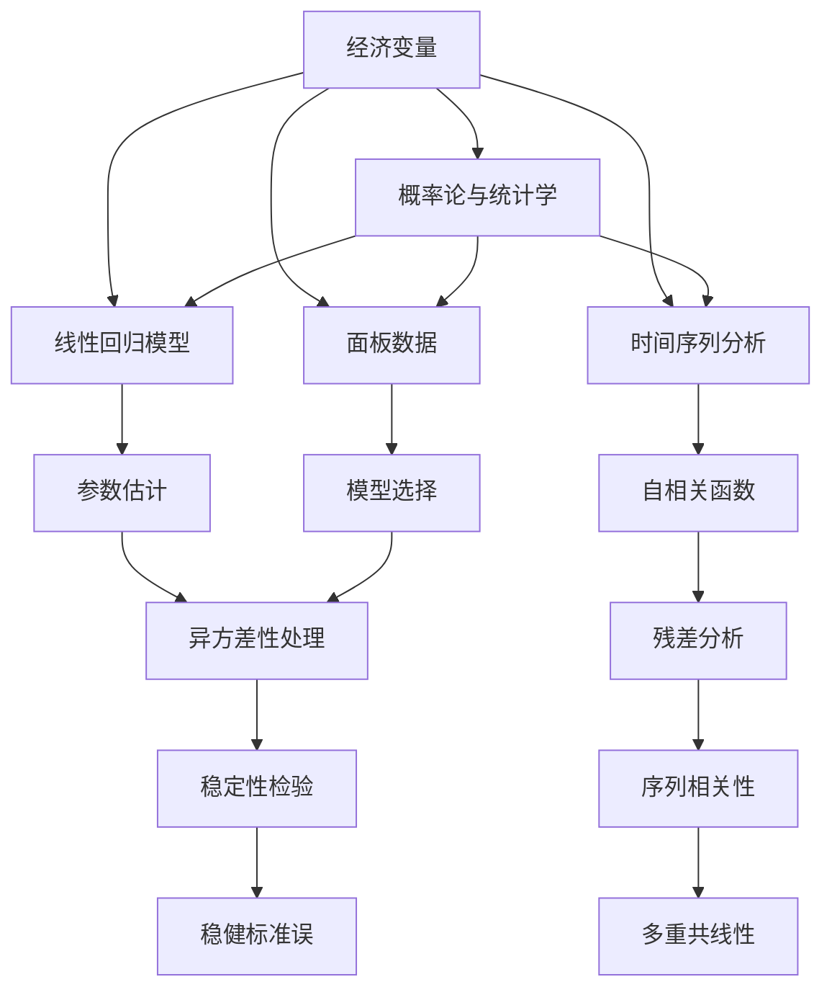

                 

### 文章标题：计量经济学：经济现象的数学分析

> 关键词：计量经济学、数学分析、经济现象、线性回归、时间序列分析、面板数据、算法原理

> 摘要：本文旨在深入探讨计量经济学在分析经济现象中的应用，通过数学模型和算法原理，对线性回归、时间序列分析、面板数据等核心概念进行详细解析，并辅以实际项目实战，为读者提供全面的技术指导。

### 目录大纲

#### 第一部分：计量经济学基础

- **第1章：计量经济学的概述**
  - 1.1 计量经济学的基本概念
  - 1.2 计量经济学的研究对象
  - 1.3 计量经济学的发展历程

- **第2章：经济学原理与数学方法**
  - 2.1 经济学的基本原理
  - 2.2 数学方法在经济学中的应用
  - 2.3 微积分在经济学中的应用

- **第3章：概率论与统计学基础**
  - 3.1 概率论的基本概念
  - 3.2 统计分布
  - 3.3 参数估计

- **第4章：线性回归模型**
  - 4.1 线性回归模型的基本形式
  - 4.2 残差分析
  - 4.3 多元线性回归

- **第5章：时间序列分析**
  - 5.1 时间序列的基本概念
  - 5.2 自相关与偏自相关函数
  - 5.3 时间序列的建模与预测

- **第6章：面板数据分析**
  - 6.1 面板数据的结构
  - 6.2 面板数据的模型选择
  - 6.3 面板数据的估计方法

- **第7章：高级计量经济学**
  - 7.1 稳定性检验
  - 7.2 异方差性处理
  - 7.3 自相关处理

- **第8章：计量经济学的实际应用**
  - 8.1 经济预测
  - 8.2 政策分析
  - 8.3 企业战略分析

#### 第二部分：核心概念与联系

- **第9章：计量经济学核心概念原理和架构**
  - 9.1 计量经济学核心概念与联系
  - 9.2 Mermaid 流程图：计量经济学核心概念关联

#### 第三部分：核心算法原理讲解

- **第10章：线性回归模型算法原理**
  - 10.1 线性回归模型算法原理
  - 10.2 线性回归模型算法伪代码

- **第11章：时间序列分析算法原理**
  - 11.1 时间序列分析算法原理
  - 11.2 时间序列分析算法伪代码

- **第12章：面板数据分析算法原理**
  - 12.1 面板数据分析算法原理
  - 12.2 面板数据分析算法伪代码

#### 第四部分：数学模型与公式详细讲解

- **第13章：线性回归模型数学模型**
  - 13.1 线性回归模型数学公式
  - 13.2 数学公式详细讲解

- **第14章：时间序列分析数学模型**
  - 14.1 时间序列分析数学公式
  - 14.2 数学公式详细讲解

- **第15章：面板数据分析数学模型**
  - 15.1 面板数据分析数学公式
  - 15.2 数学公式详细讲解

#### 第五部分：项目实战

- **第16章：计量经济学项目实战**
  - 16.1 项目实战概述
  - 16.2 开发环境搭建
  - 16.3 源代码实现与解读
  - 16.4 代码解读与分析

### 第一部分：计量经济学基础

#### 第1章：计量经济学的概述

##### 1.1 计量经济学的基本概念

计量经济学（Econometrics）是经济学与数学、统计学相结合的交叉学科，它运用数学和统计方法来分析和解释经济现象，以及评估经济政策的效果。计量经济学的核心目标是量化经济关系，以便更好地理解经济行为，预测经济趋势，并制定有效的经济政策。

计量经济学的基本概念包括：

- **经济变量**：指反映经济现象的量，如GDP、失业率、通货膨胀率等。
- **随机变量**：经济变量可能受到随机因素的影响，其取值是不确定的。
- **概率分布**：描述随机变量取值的概率分布情况。
- **统计分布**：通过对样本数据进行分析，推断总体特征。
- **模型**：用数学方程表示经济关系。

##### 1.2 计量经济学的研究对象

计量经济学主要研究以下几类经济现象：

- **因果关系**：通过建立模型，分析变量之间的因果关系。
- **政策评估**：评估经济政策对经济变量产生的影响。
- **经济预测**：利用历史数据，预测未来的经济走势。
- **经济结构分析**：分析经济体系中的各个组成部分及其相互关系。
- **市场行为**：研究市场参与者的行为模式和市场动态。

##### 1.3 计量经济学的发展历程

计量经济学的发展可以追溯到20世纪初。以下是计量经济学发展历程中的重要里程碑：

- **1910年代**：挪威经济学家拉格纳·弗里希（Ragnar Frisch）和荷兰统计学家特奥多尔·弗里希（Theil）提出计量经济学的概念，并将其应用于实际经济问题。
- **1930年代**：美国经济学家罗纳德·费舍尔（Ronald Fisher）将统计学中的假设检验方法引入经济学研究。
- **1950年代**：肯尼斯·J·阿罗（Kenneth J. Arrow）和约翰·H·肯尼迪（John H. Kennedy）发展了线性回归模型，奠定了现代计量经济学的基础。
- **1970年代**：罗伯特·恩格尔（Robert Engle）和克莱夫·格兰杰（Clive Granger）分别提出了自回归条件异方差（ARCH）模型和广义自回归条件异方差（GARCH）模型，为时间序列分析提供了新的工具。
- **21世纪**：随着计算机技术的发展和大数据的广泛应用，计量经济学进入了新的发展阶段，各种高级统计方法和机器学习技术在经济研究中得到了广泛应用。

#### 第2章：经济学原理与数学方法

##### 2.1 经济学的基本原理

经济学的基本原理是理解经济行为和决策的基础。以下是经济学中的一些基本原理：

- **供求原理**：商品的价格取决于其供给和需求，供求关系的变化会导致价格的变化。
- **边际效用原理**：消费者在购买商品时，边际效用递减，即每增加一个单位商品带来的满足感逐渐减少。
- **成本效益分析**：决策者应该考虑成本和收益的权衡，选择成本效益最大的方案。
- **市场均衡**：市场达到供求平衡的状态，价格和数量稳定。
- **宏观经济政策**：政府通过财政和货币政策来影响经济增长、通货膨胀和失业率。

##### 2.2 数学方法在经济学中的应用

数学方法在经济学中的应用非常广泛，包括：

- **线性方程组**：用于解决多个经济变量之间的关系。
- **概率论**：用于分析经济变量之间的不确定性和相关性。
- **统计学**：用于收集、分析和解释经济数据。
- **微积分**：用于研究经济变量的边际变化和最优决策。

##### 2.3 微积分在经济学中的应用

微积分在经济学中的应用主要体现在以下几个方面：

- **边际分析**：通过求导数，分析经济变量的边际变化。
- **最优化**：利用微积分中的最优化方法，寻找最大化收益或最小化成本的最优解。
- **经济增长模型**：利用微分方程描述经济系统的动态变化。

#### 第3章：概率论与统计学基础

##### 3.1 概率论的基本概念

概率论是研究随机事件及其概率的数学分支。以下是概率论中的一些基本概念：

- **随机试验**：指一次实验，其结果具有不确定性。
- **样本空间**：指所有可能结果的集合。
- **事件**：指样本空间中的一个子集。
- **概率**：指事件发生的可能性，用0到1之间的数值表示。
- **条件概率**：在某一事件发生的条件下，另一事件发生的概率。
- **独立事件**：两个事件的发生互不影响。

##### 3.2 统计分布

统计分布描述了随机变量取值的概率分布情况。以下是几种常见的统计分布：

- **离散分布**：随机变量取值为有限或可数无限个值的分布，如二项分布、泊松分布。
- **连续分布**：随机变量取值为某个区间内任意值的分布，如正态分布、均匀分布。
- **概率质量函数（PMF）**：描述离散随机变量的概率分布。
- **概率密度函数（PDF）**：描述连续随机变量的概率分布。

##### 3.3 参数估计

参数估计是指通过样本数据估计总体参数的过程。以下是几种常见的参数估计方法：

- **点估计**：用一个具体的数值估计总体参数。
- **区间估计**：给出总体参数可能落在某个区间内的概率。
- **最大似然估计**：通过最大化似然函数，估计总体参数的最优值。
- **最小二乘法**：用于线性回归模型的参数估计。

### 第一部分总结

在第一部分，我们介绍了计量经济学的基本概念、研究对象和基础理论。通过对经济学原理和数学方法的深入探讨，我们为后续章节的详细讲解奠定了基础。在接下来的章节中，我们将进一步探讨计量经济学中的线性回归模型、时间序列分析和面板数据等核心概念，并通过实际项目实战，帮助读者更好地理解计量经济学的应用和原理。通过逐步分析和推理，我们将为读者呈现一个全面、深入的计量经济学世界。

#### 第4章：线性回归模型

##### 4.1 线性回归模型的基本形式

线性回归模型是一种广泛用于分析和预测数值变量之间关系的统计方法。它的基本形式可以表示为：

\[ Y = \beta_0 + \beta_1 X_1 + \beta_2 X_2 + \ldots + \beta_n X_n + \epsilon \]

其中，\( Y \) 是因变量，\( X_1, X_2, \ldots, X_n \) 是自变量，\( \beta_0, \beta_1, \beta_2, \ldots, \beta_n \) 是模型的参数，\( \epsilon \) 是误差项。线性回归模型的目标是估计参数 \( \beta_0, \beta_1, \beta_2, \ldots, \beta_n \)，以便建立因变量和自变量之间的线性关系。

##### 4.2 残差分析

残差分析是线性回归模型中一个重要的步骤，用于评估模型拟合的质量。残差是指实际观测值与模型预测值之间的差异，可以用以下公式表示：

\[ \text{残差} = Y_i - \hat{Y}_i \]

其中，\( Y_i \) 是实际观测值，\( \hat{Y}_i \) 是模型预测值。

在进行残差分析时，我们需要检查以下问题：

- **异方差性**：残差的方差是否一致，即是否存在异方差性。异方差性会导致模型预测不准确。
- **线性关系**：残差是否呈现出随机分布，没有明显的模式或趋势，这表明因变量和自变量之间可能存在非线性关系。
- **独立同分布**：残差是否独立同分布，即残差的方差和分布不受时间或其他因素的影响。

##### 4.3 多元线性回归

多元线性回归是线性回归模型的一种扩展，用于分析多个自变量对因变量的影响。其基本形式如下：

\[ Y = \beta_0 + \beta_1 X_1 + \beta_2 X_2 + \ldots + \beta_n X_n + \epsilon \]

在多元线性回归中，我们通常需要解决以下问题：

- **多重共线性**：自变量之间是否存在强烈的线性关系，这会导致参数估计不稳定和模型预测不准确。
- **参数估计**：如何有效地估计多个参数 \( \beta_0, \beta_1, \beta_2, \ldots, \beta_n \)。
- **模型选择**：如何选择合适的自变量和模型类型，以最大化预测效果。

### 第4章总结

在第4章中，我们详细介绍了线性回归模型的基本形式、残差分析和多元线性回归。线性回归模型是一种强大的工具，用于分析和预测数值变量之间的关系。通过残差分析，我们可以评估模型的拟合质量，发现潜在问题并进行调整。在多元线性回归中，我们需要考虑多重共线性、参数估计和模型选择等问题，以构建更准确的预测模型。在下一章，我们将探讨时间序列分析的基本概念和建模方法。

### 第5章：时间序列分析

##### 5.1 时间序列的基本概念

时间序列分析是一种用于分析数据随时间变化的统计方法。它广泛应用于经济学、金融学、气象学等领域。时间序列数据是指按照时间顺序排列的数据点，每个数据点代表某个特定时间点的数值。

时间序列数据具有以下基本特征：

- **序列性**：数据按照时间顺序排列，每个数据点都与特定的时间点相关。
- **平稳性**：数据的变化趋势是平稳的，即数据在一个长期时间内具有稳定的均值和方差。
- **相关性**：时间序列中的数据点之间存在相关性，即当前数据点的值可能会影响未来的数据点。

##### 5.2 自相关与偏自相关函数

自相关函数（Autocorrelation Function，ACF）和偏自相关函数（Partial Autocorrelation Function，PACF）是时间序列分析中用于描述数据点之间相关性程度的工具。

- **自相关函数**：描述时间序列中当前值与其前几个时间点值之间的相关性。自相关函数的值介于 -1 和 1 之间，接近 1 表示强正相关性，接近 -1 表示强负相关性，接近 0 表示无相关性。

- **偏自相关函数**：在去除其他时间点数据影响的情况下，描述当前值与其前几个时间点值之间的相关性。偏自相关函数通常用于识别时间序列中的周期性模式。

##### 5.3 时间序列的建模与预测

时间序列建模与预测是时间序列分析的核心任务。常用的建模方法包括：

- **自回归模型（AR）**：自回归模型假设当前值是由其前几个时间点的值加权平均得到的。其基本形式为：

\[ Y_t = c + \phi_1 Y_{t-1} + \phi_2 Y_{t-2} + \ldots + \phi_p Y_{t-p} + \epsilon_t \]

其中，\( \phi_1, \phi_2, \ldots, \phi_p \) 是自回归系数，\( \epsilon_t \) 是误差项。

- **移动平均模型（MA）**：移动平均模型假设当前值是由其前几个时间点的误差项加权平均得到的。其基本形式为：

\[ Y_t = c + \theta_1 \epsilon_{t-1} + \theta_2 \epsilon_{t-2} + \ldots + \theta_q \epsilon_{t-q} + \epsilon_t \]

其中，\( \theta_1, \theta_2, \ldots, \theta_q \) 是移动平均系数，\( \epsilon_t \) 是误差项。

- **自回归移动平均模型（ARMA）**：自回归移动平均模型结合了自回归模型和移动平均模型的特点。其基本形式为：

\[ Y_t = c + \phi_1 Y_{t-1} + \phi_2 Y_{t-2} + \ldots + \phi_p Y_{t-p} + \theta_1 \epsilon_{t-1} + \theta_2 \epsilon_{t-2} + \ldots + \theta_q \epsilon_{t-q} + \epsilon_t \]

- **自回归积分移动平均模型（ARIMA）**：自回归积分移动平均模型是对 ARMA 模型的扩展，可以处理非平稳时间序列。其基本形式为：

\[ Y_t = c + \phi_1 Y_{t-1} + \phi_2 Y_{t-2} + \ldots + \phi_p Y_{t-p} + (\theta_1 L)(\epsilon_{t-1} + (\theta_2 L)^2 \epsilon_{t-2} + \ldots + (\theta_q L)^q \epsilon_{t-q}) + \epsilon_t \]

其中，\( L \) 表示滞后算子，\( \phi_1, \phi_2, \ldots, \phi_p \) 是自回归系数，\( \theta_1, \theta_2, \ldots, \theta_q \) 是移动平均系数，\( \epsilon_t \) 是误差项。

时间序列预测通常分为以下步骤：

1. **数据预处理**：对时间序列数据进行预处理，包括缺失值处理、异常值检测和标准化等。
2. **模型选择**：根据时间序列的特征和目标变量的需求，选择合适的模型。
3. **参数估计**：使用历史数据对模型参数进行估计。
4. **模型评估**：使用验证数据集评估模型的预测效果。
5. **预测**：使用训练好的模型进行预测。

### 第5章总结

在第5章中，我们详细介绍了时间序列分析的基本概念、自相关与偏自相关函数，以及时间序列的建模与预测方法。时间序列分析是经济学中不可或缺的工具，可以帮助我们理解和预测经济变量随时间的变化。通过自相关和偏自相关函数，我们可以识别时间序列中的相关性模式，进而选择合适的建模方法。在下一章，我们将探讨面板数据分析，这是一种用于分析多变量时间序列数据的统计方法。

### 第6章：面板数据分析

##### 6.1 面板数据的结构

面板数据（Panel Data）是指包含多个个体在不同时间点的观测数据的集合。面板数据结合了时间序列数据和横截面数据的特点，可以用于分析个体间的差异和时间序列的变化。面板数据通常具有以下结构：

- **截面维度**：指观测个体的数量，如国家、公司、家庭等。
- **时间维度**：指观测时间点的数量，如年份、季度、月份等。
- **变量维度**：指每个时间点和个体观测的数据变量，如GDP、失业率、消费支出等。

面板数据可以通过以下矩阵形式表示：

\[ Y_{it} = \begin{bmatrix}
Y_{11} & Y_{12} & \ldots & Y_{1n} \\
Y_{21} & Y_{22} & \ldots & Y_{2n} \\
\vdots & \vdots & \ddots & \vdots \\
Y_{m1} & Y_{m2} & \ldots & Y_{mn}
\end{bmatrix} \]

其中，\( Y_{it} \) 表示第 \( i \) 个个体在第 \( t \) 个时间点的观测值，\( i = 1, 2, \ldots, m \) 表示个体数量，\( t = 1, 2, \ldots, n \) 表示时间点数量。

##### 6.2 面板数据的模型选择

面板数据模型的选择取决于数据结构和研究目标。以下是几种常见的面板数据模型：

1. **固定效应模型（Fixed Effects Model）**：

\[ Y_{it} = \alpha_i + \beta_1 X_{1it} + \beta_2 X_{2it} + \ldots + \beta_k X_{kit} + \epsilon_{it} \]

其中，\( \alpha_i \) 是个体固定效应，\( X_{1it}, X_{2it}, \ldots, X_{kit} \) 是自变量，\( \beta_1, \beta_2, \ldots, \beta_k \) 是回归系数，\( \epsilon_{it} \) 是误差项。

固定效应模型适用于个体之间存在显著差异的情况，如不同国家的经济政策分析。

2. **随机效应模型（Random Effects Model）**：

\[ Y_{it} = \gamma + \beta_1 X_{1it} + \beta_2 X_{2it} + \ldots + \beta_k X_{kit} + u_i + \epsilon_{it} \]

其中，\( \gamma \) 是整体均值，\( \beta_1, \beta_2, \ldots, \beta_k \) 是回归系数，\( u_i \) 是随机效应，\( \epsilon_{it} \) 是误差项。

随机效应模型适用于个体之间存在随机差异且这些差异不影响总体回归系数的情况，如不同公司的生产效率分析。

3. **混合效应模型（Mixed Effects Model）**：

\[ Y_{it} = \alpha_i + \beta_1 X_{1it} + \beta_2 X_{2it} + \ldots + \beta_k X_{kit} + u_i + \epsilon_{it} \]

其中，\( \alpha_i \) 是个体固定效应，\( u_i \) 是个体随机效应，其他符号与上述模型相同。

混合效应模型适用于个体之间存在显著差异且这些差异对总体回归系数有显著影响的情况，如不同学校的学术表现分析。

##### 6.3 面板数据的估计方法

面板数据的估计方法主要包括以下几种：

1. **普通最小二乘法（Ordinary Least Squares, OLS）**：

   OLS 方法是最常用的面板数据估计方法，适用于固定效应模型和随机效应模型。其基本思想是最小化残差的平方和，求解参数估计值。

2. **加权最小二乘法（Weighted Least Squares, WLS）**：

   WLS 方法适用于存在异方差性的面板数据。其基本思想是对每个观测值赋予不同的权重，最小化加权残差的平方和。

3. **广义矩估计（Generalized Method of Moments, GMM）**：

   GMM 方法适用于复杂面板数据模型和动态面板数据模型。其基本思想是利用矩条件估计参数，可以处理各种非线性模型和动态面板数据。

4. **系统广义矩估计（System GMM）**：

   系统GMM 方法是对 GMM 方法的扩展，适用于处理动态面板数据模型。其基本思想是同时估计滞后项和当前项的矩条件。

### 第6章总结

在第6章中，我们详细介绍了面板数据的结构、模型选择和估计方法。面板数据是一种强大的工具，可以用于分析个体间的差异和时间序列的变化。通过固定效应模型、随机效应模型和混合效应模型，我们可以分别处理不同的数据结构和研究目标。在估计方法方面，普通最小二乘法、加权最小二乘法、广义矩估计和系统广义矩估计等方法为我们提供了多种选择。在下一章，我们将探讨高级计量经济学中的稳定性检验、异方差性处理和自相关处理，以进一步提高模型的有效性和准确性。

### 第7章：高级计量经济学

#### 7.1 稳定性检验

在计量经济学中，模型的稳定性是一个重要的考虑因素。稳定性检验的目的是检查模型的参数估计是否在样本数据变化时保持一致，以及模型预测的可靠性。以下是一些常见的稳定性检验方法：

1. **异方差性检验**：

   异方差性是指模型的误差项在不同观测值之间具有不同的方差。常见的异方差性检验方法包括：

   - **戈里瑟检验（Goldfeld-Quandt Test）**：
     通过将数据分为高值和低值两部分，检验两个部分的误差项方差是否相等。
   - **库克检验（Cook's Test）**：
     通过计算每个观测值的杠杆值（Leverage），识别可能对模型稳定性产生影响的异常观测值。

2. **序列相关性检验**：

   序列相关性是指模型的误差项之间存在相关性，这会导致模型参数估计的不一致。常见的序列相关性检验方法包括：

   - **迪基-福勒检验（Durbin-Watson Test）**：
     通过计算迪基-福勒统计量，检验误差项是否呈现一阶自相关。
   - **拉格朗日多项式检验（Lagrange Multiplier Test）**：
     通过计算拉格朗日多项式统计量，检验是否存在高阶序列相关性。

3. **多重共线性检验**：

   多重共线性是指模型中的自变量之间存在强烈的线性关系，这会导致参数估计的不稳定。常见的多重共线性检验方法包括：

   - **方差膨胀因子（Variance Inflation Factor, VIF）**：
     通过计算每个自变量的VIF值，识别是否存在多重共线性。
   - **特征值分解（Eigenvalue Decomposition）**：
     通过分解特征值，识别自变量之间的线性关系。

4. **参数稳定性检验**：

   参数稳定性检验的目的是检查模型参数在不同样本数据或不同估计方法下的稳定性。常见的参数稳定性检验方法包括：

   - **稳健标准误（Robust Standard Errors）**：
     通过调整标准误的计算方法，提高模型参数的稳定性。
   - **贝叶斯估计（Bayesian Estimation）**：
     通过引入先验分布，估计模型参数的分布，提高参数的稳定性。

#### 7.2 异方差性处理

异方差性处理是指通过调整模型结构或估计方法，解决模型中的异方差性问题。以下是一些常见的异方差性处理方法：

1. **加权最小二乘法（Weighted Least Squares, WLS）**：

   加权最小二乘法通过对每个观测值赋予不同的权重，最小化加权残差的平方和。这种方法可以降低异方差性对模型参数估计的影响。

2. **广义最小二乘法（Generalized Least Squares, GLS）**：

   广义最小二乘法是一种适用于异方差性和序列相关性的估计方法。它通过同时考虑误差项的方差和协方差矩阵，提高模型参数估计的精度。

3. **变换方法**：

   通过对数据进行变换，如对数变换、平方根变换等，可以将异方差性转化为同方差性，从而提高模型参数估计的稳定性。

#### 7.3 自相关处理

自相关处理是指通过调整模型结构或估计方法，解决模型中的自相关问题。以下是一些常见的自相关处理方法：

1. **差分方法**：

   差分方法通过对时间序列数据进行差分，消除自相关性。常见的差分方法包括一阶差分和二阶差分。

2. **广义差分方法**：

   广义差分方法是一种适用于动态面板数据的自相关处理方法。它通过对时间序列数据进行多阶差分，消除自相关性。

3. **滞后项引入**：

   通过在模型中引入滞后项，消除自相关性。例如，在自回归模型中引入滞后项，使误差项不再自相关。

4. **稳健标准误**：

   通过调整标准误的计算方法，提高模型参数估计的稳健性，从而降低自相关问题的影响。

### 第7章总结

在第7章中，我们详细探讨了高级计量经济学中的稳定性检验、异方差性处理和自相关处理。稳定性检验的目的是确保模型参数估计的一致性和可靠性，常见的稳定性检验方法包括异方差性检验、序列相关性检验、多重共线性检验和参数稳定性检验。异方差性处理的方法包括加权最小二乘法、广义最小二乘法和变换方法。自相关处理的方法包括差分方法、广义差分方法、滞后项引入和稳健标准误。通过这些方法，我们可以进一步提高计量经济模型的有效性和准确性，为经济现象的深入分析提供有力支持。在下一章，我们将探讨计量经济学的实际应用，包括经济预测、政策分析和企业战略分析。

### 第8章：计量经济学的实际应用

计量经济学不仅在理论研究中有重要应用，也在实际经济活动中发挥了关键作用。以下是计量经济学在几个重要领域的实际应用：

#### 8.1 经济预测

经济预测是计量经济学的重要应用之一。通过分析历史数据和现有经济指标，计量经济学模型可以预测未来的经济增长、通货膨胀、失业率等宏观经济变量。以下是一些常见的方法：

- **时间序列模型**：如自回归模型（AR）、移动平均模型（MA）和自回归移动平均模型（ARMA），用于预测经济时间序列的变化。
- **回归模型**：通过建立经济变量之间的关系，预测特定经济指标的变化。
- **动态面板数据模型**：用于处理动态经济数据，分析经济增长和波动的原因。

实际案例：在2008年金融危机期间，计量经济学家利用ARMA模型和回归模型预测了各国GDP的变化，为政府制定经济政策提供了重要参考。

#### 8.2 政策分析

政策分析是计量经济学在公共管理中的重要应用。通过建立模型，分析政策变化对经济变量产生的影响，为政策制定者提供科学依据。以下是一些常见的方法：

- **回归分析**：通过建立政策变量和目标变量之间的关系，评估政策效果。
- **结构方程模型**：用于分析政策变量和目标变量之间的复杂关系，识别关键影响因素。
- **模拟分析**：通过模拟政策变化，预测政策对经济系统的影响。

实际案例：在制定税收政策时，计量经济学家通过回归分析和模拟分析，评估不同税率对经济增长、就业和收入分配的影响，为政府决策提供支持。

#### 8.3 企业战略分析

企业战略分析是计量经济学在企业管理中的重要应用。通过分析市场数据和企业内部数据，企业可以制定更有效的战略计划。以下是一些常见的方法：

- **回归分析**：通过建立市场需求和企业成本之间的关系，预测企业盈利能力。
- **时间序列模型**：用于分析市场需求和时间序列变化，帮助企业制定销售和库存策略。
- **面板数据分析**：分析不同市场和企业行为之间的差异，帮助企业识别竞争优势。

实际案例：一家大型零售企业在制定新市场进入策略时，利用计量经济学模型分析了市场需求、竞争环境和成本结构，制定了科学的市场进入策略，提高了市场占有率。

### 第8章总结

在第8章中，我们详细探讨了计量经济学在经济预测、政策分析和企业战略分析等实际领域的应用。通过时间序列模型、回归模型、结构方程模型和面板数据分析等方法，计量经济学为各种经济决策提供了科学依据。实际案例展示了计量经济学在解决实际问题中的重要作用，通过深入分析和预测，我们可以更好地理解和应对经济变化。在下一章，我们将深入探讨计量经济学中的核心概念与联系，通过Mermaid流程图，揭示核心概念之间的内在联系。

### 第9章：计量经济学核心概念原理和架构

#### 9.1 计量经济学核心概念与联系

计量经济学中的核心概念包括经济变量、概率论与统计学、线性回归模型、时间序列分析和面板数据等。这些概念相互关联，共同构成了计量经济学的理论框架。

- **经济变量**：经济变量是计量经济学分析的基本对象，如GDP、通货膨胀率、失业率等。经济变量可以是连续的或离散的，其取值受随机因素的影响。
- **概率论与统计学**：概率论与统计学为计量经济学提供了分析工具，用于描述经济变量的分布、估计参数和检验假设。
- **线性回归模型**：线性回归模型用于分析经济变量之间的线性关系，通过估计参数，建立因变量和自变量之间的数学模型。
- **时间序列分析**：时间序列分析用于分析数据随时间变化的规律，如自回归模型（AR）和移动平均模型（MA）。
- **面板数据**：面板数据结合了时间序列数据和横截面数据的特点，可以用于分析个体间的差异和时间序列的变化。

这些概念之间的联系在于：

- 经济变量是计量经济学分析的基础，概率论与统计学为分析经济变量提供了工具。
- 线性回归模型和时间序列分析是建立经济变量之间关系的常用方法。
- 面板数据扩展了时间序列分析的应用范围，可以用于分析多个个体之间的差异。

#### 9.2 Mermaid 流程图：计量经济学核心概念关联

为了更直观地展示计量经济学核心概念之间的联系，我们可以使用Mermaid流程图进行描述。以下是Mermaid流程图示例：



这个流程图展示了计量经济学核心概念之间的基本关系。经济变量是分析的基础，概率论与统计学为分析提供了工具。线性回归模型、时间序列分析和面板数据是建立经济变量之间关系的主要方法。参数估计、残差分析、模型选择、异方差性处理、稳定性检验和序列相关性是计量经济学分析中的重要步骤。

### 第9章总结

在第9章中，我们详细探讨了计量经济学核心概念之间的联系，并使用Mermaid流程图进行了直观展示。通过分析经济变量、概率论与统计学、线性回归模型、时间序列分析和面板数据等核心概念，我们可以更好地理解计量经济学的理论框架和实际应用。在下一章，我们将深入探讨线性回归模型的算法原理，通过伪代码详细阐述模型算法的实现过程。

### 第10章：线性回归模型算法原理

#### 10.1 线性回归模型算法原理

线性回归模型是一种广泛使用的统计方法，用于分析自变量和因变量之间的线性关系。其基本算法原理如下：

1. **模型假设**：假设因变量 \( Y \) 和自变量 \( X \) 之间存在线性关系，可以用以下公式表示：

   \[ Y = \beta_0 + \beta_1 X + \epsilon \]

   其中，\( \beta_0 \) 是截距，\( \beta_1 \) 是斜率，\( \epsilon \) 是误差项。

2. **参数估计**：使用最小二乘法（Ordinary Least Squares, OLS）估计模型参数 \( \beta_0 \) 和 \( \beta_1 \)。最小二乘法的核心思想是最小化残差平方和，即：

   \[ \sum_{i=1}^{n} (Y_i - \hat{Y}_i)^2 \]

   其中，\( \hat{Y}_i \) 是模型预测值，可以通过以下公式计算：

   \[ \hat{Y}_i = \beta_0 + \beta_1 X_i \]

3. **优化目标**：构建优化问题，求解最小化残差平方和的参数估计值。优化目标可以表示为：

   \[ \min_{\beta_0, \beta_1} \sum_{i=1}^{n} (Y_i - \beta_0 - \beta_1 X_i)^2 \]

4. **求解过程**：使用梯度下降法（Gradient Descent）或牛顿法（Newton's Method）等优化算法求解优化问题。以下是使用梯度下降法的伪代码：

```python
# 初始化参数
beta_0 = beta_1 = 0
learning_rate = 0.01
num_iterations = 1000

# 梯度下降法迭代过程
for i in range(num_iterations):
    # 计算残差
    residuals = Y - (beta_0 + beta_1 * X)
    
    # 计算梯度
    gradient_beta_0 = -2/n * sum(residuals)
    gradient_beta_1 = -2/n * sum(X * residuals)
    
    # 更新参数
    beta_0 = beta_0 - learning_rate * gradient_beta_0
    beta_1 = beta_1 - learning_rate * gradient_beta_1

# 输出参数估计结果
print("beta_0:", beta_0)
print("beta_1:", beta_1)
```

#### 10.2 线性回归模型算法伪代码

以下是线性回归模型的伪代码，展示了算法的实现过程：

```python
# 输入：数据集 X（自变量矩阵），Y（因变量向量）
# 输出：模型参数 beta_0（截距），beta_1（斜率）

# 初始化参数
beta_0 = 0
beta_1 = 0
learning_rate = 0.01
num_iterations = 1000

# 梯度下降法迭代过程
for i in range(num_iterations):
    # 计算残差
    residuals = Y - (beta_0 + beta_1 * X)
    
    # 计算梯度
    gradient_beta_0 = -2/n * sum(residuals)
    gradient_beta_1 = -2/n * sum(X * residuals)
    
    # 更新参数
    beta_0 = beta_0 - learning_rate * gradient_beta_0
    beta_1 = beta_1 - learning_rate * gradient_beta_1

# 输出参数估计结果
print("beta_0:", beta_0)
print("beta_1:", beta_1)
```

这个伪代码展示了线性回归模型的基本实现过程，包括参数初始化、迭代计算残差和梯度、参数更新，最终输出模型参数估计结果。在实际应用中，可以根据数据集的大小和特征选择合适的优化算法和参数初始化方法，以提高算法的收敛速度和准确性。

### 第10章总结

在第10章中，我们深入探讨了线性回归模型的算法原理，包括模型假设、参数估计、优化目标和求解过程。通过伪代码展示了梯度下降法的实现过程，详细描述了算法的每一步操作。线性回归模型是一种简单但强大的工具，在经济学、金融学等领域有广泛的应用。在下一章，我们将探讨时间序列分析算法原理，继续深入计量经济学的方法论和实践。

### 第11章：时间序列分析算法原理

#### 11.1 时间序列分析算法原理

时间序列分析是一种用于分析数据随时间变化的统计方法。时间序列数据的特点在于其时间依赖性，即当前值与过去值之间存在相关性。时间序列分析算法主要包括自回归模型（AR）、移动平均模型（MA）和自回归移动平均模型（ARMA）。

#### 11.1.1 自回归模型（AR）

自回归模型（Autoregressive Model，AR）假设当前值是由其前几个时间点的值加权平均得到的。其基本形式为：

\[ Y_t = \phi_1 Y_{t-1} + \phi_2 Y_{t-2} + \ldots + \phi_p Y_{t-p} + \epsilon_t \]

其中，\( \phi_1, \phi_2, \ldots, \phi_p \) 是自回归系数，\( \epsilon_t \) 是误差项。

自回归模型的关键在于选择合适的 \( p \) 值，即自回归阶数。选择 \( p \) 的方法通常包括：

- **ACF 和 PACF 图**：通过观察自相关函数（Autocorrelation Function，ACF）和偏自相关函数（Partial Autocorrelation Function，PACF）图，确定 \( p \) 的最佳值。
- **信息准则**：如 Akaike 信息准则（AIC）和 Bayesian 信息准则（BIC），通过比较不同 \( p \) 值下的准则值，选择最优的 \( p \)。

#### 11.1.2 移动平均模型（MA）

移动平均模型（Moving Average Model，MA）假设当前值是由其前几个时间点的误差项加权平均得到的。其基本形式为：

\[ Y_t = \theta_1 \epsilon_{t-1} + \theta_2 \epsilon_{t-2} + \ldots + \theta_q \epsilon_{t-q} + \epsilon_t \]

其中，\( \theta_1, \theta_2, \ldots, \theta_q \) 是移动平均系数，\( \epsilon_t \) 是误差项。

移动平均模型的关键在于选择合适的 \( q \) 值，即移动平均阶数。选择 \( q \) 的方法与自回归模型类似。

#### 11.1.3 自回归移动平均模型（ARMA）

自回归移动平均模型（Autoregressive Moving Average Model，ARMA）结合了自回归模型和移动平均模型的特点。其基本形式为：

\[ Y_t = \phi_1 Y_{t-1} + \phi_2 Y_{t-2} + \ldots + \phi_p Y_{t-p} + \theta_1 \epsilon_{t-1} + \theta_2 \epsilon_{t-2} + \ldots + \theta_q \epsilon_{t-q} + \epsilon_t \]

ARMA 模型的参数估计通常使用最小二乘法（Ordinary Least Squares，OLS）或矩估计（Method of Moments，MOM）。最小二乘法需要满足误差项独立性假设，而矩估计可以处理误差项相关的情况。

#### 11.2 时间序列分析算法伪代码

以下是时间序列分析算法的伪代码，展示了ARMA模型的基本实现过程：

```python
# 输入：时间序列数据 Y
# 输出：模型参数 phi 和 theta

# 初始化参数
phi = [1.0] * p
theta = [1.0] * q

# 使用最小二乘法估计参数
for iteration in range(num_iterations):
    # 计算预测值
    predicted_values = [0] * n
    for t in range(n):
        predicted_values[t] = sum(phi[j] * Y[t - j] for j in range(1, p+1)) + sum(theta[j] * error[t - j] for j in range(1, q+1))
    
    # 计算残差
    residuals = [Y[t] - predicted_values[t] for t in range(n)]
    
    # 更新参数
    # (此处省略具体的参数更新计算过程，可以使用梯度下降法或其他优化算法)

# 输出参数估计结果
print("phi:", phi)
print("theta:", theta)
```

这个伪代码展示了ARMA模型的基本实现过程，包括初始化参数、计算预测值、计算残差和更新参数。在实际应用中，可以根据具体问题选择合适的优化算法和参数初始化方法。

### 第11章总结

在第11章中，我们详细探讨了时间序列分析算法的原理，包括自回归模型（AR）、移动平均模型（MA）和自回归移动平均模型（ARMA）。我们介绍了这些模型的基本形式、参数选择方法和参数估计过程。通过伪代码展示了算法的实现过程，使读者能够更好地理解时间序列分析的方法和实践。在下一章，我们将探讨面板数据分析算法原理，进一步丰富计量经济学的方法论。

### 第12章：面板数据分析算法原理

#### 12.1 面板数据分析算法原理

面板数据分析是用于分析多变量时间序列数据的方法。面板数据结合了时间序列和横截面数据的特点，可以用于研究个体间的差异和时间序列的变化。面板数据分析算法主要包括固定效应模型（Fixed Effects Model，FE）和随机效应模型（Random Effects Model，RE）。

#### 12.1.1 固定效应模型（FE）

固定效应模型假设每个个体具有不同的固定效应，即每个个体的截距不同，但斜率相同。其基本形式为：

\[ Y_{it} = \alpha_i + \beta X_{it} + \epsilon_{it} \]

其中，\( \alpha_i \) 是个体固定效应，\( \beta \) 是斜率，\( X_{it} \) 是自变量，\( \epsilon_{it} \) 是误差项。

固定效应模型的优点是参数估计简单，可以处理异方差性和序列相关性问题。其缺点是可能低估个体差异。

#### 12.1.2 随机效应模型（RE）

随机效应模型假设个体固定效应是随机变量，即个体之间存在随机差异，但斜率相同。其基本形式为：

\[ Y_{it} = \alpha + \beta X_{it} + u_i + \epsilon_{it} \]

其中，\( \alpha \) 是整体截距，\( \beta \) 是斜率，\( u_i \) 是个体随机效应，\( \epsilon_{it} \) 是误差项。

随机效应模型的优点是可以处理个体差异，但可能低估斜率。

#### 12.1.3 模型选择

面板数据模型的选取取决于数据结构和研究目标。常见的模型选择方法包括：

- **固定效应模型与随机效应模型比较**：通过比较两种模型的似然函数值，选择合适的模型。
- **豪斯曼检验（Hausman Test）**：用于检验个体固定效应是否显著，以选择固定效应模型或随机效应模型。
- **贝叶斯信息准则（BIC）和 Akaike 信息准则（AIC）**：用于比较不同模型的拟合优度，选择最佳模型。

#### 12.2 面板数据分析算法伪代码

以下是面板数据分析算法的伪代码，展示了固定效应模型和随机效应模型的基本实现过程：

```python
# 输入：面板数据 Y，自变量 X
# 输出：模型参数 alpha，beta

# 固定效应模型
alpha_fe = [0] * n
beta_fe = [0] * k

for i in range(n):
    alpha_fe[i] = sum(Y[i, t] - X[i, t] * beta_fe[t] for t in range(k)) / n
    beta_fe[i] = (sum(X[i, t] * (Y[i, t] - alpha_fe[i])) / (sum(X[i, t]**2) / n))

# 随机效应模型
alpha_re = sum(Y[i, t] - X[i, t] * beta_re[t] for i in range(n)) / n
beta_re = (sum(X[i, t] * (Y[i, t] - alpha_re)) / (sum(X[i, t]**2) / n))

# 模型选择
# (此处省略模型选择的具体实现过程，可以使用豪斯曼检验、BIC 或 AIC 方法)

# 输出模型参数
print("alpha_fe:", alpha_fe)
print("beta_fe:", beta_fe)
print("alpha_re:", alpha_re)
print("beta_re:", beta_re)
```

这个伪代码展示了固定效应模型和随机效应模型的基本实现过程，包括参数估计和模型选择。在实际应用中，可以根据具体问题选择合适的模型选择方法。

### 第12章总结

在第12章中，我们详细探讨了面板数据分析算法的原理，包括固定效应模型和随机效应模型。我们介绍了这些模型的基本形式、参数估计方法和模型选择方法。通过伪代码展示了算法的实现过程，使读者能够更好地理解面板数据分析的方法和实践。在下一章，我们将深入探讨时间序列分析的数学模型，为读者提供更全面的理论支持。

### 第13章：线性回归模型数学模型

#### 13.1 线性回归模型数学公式

线性回归模型是计量经济学中最基础且广泛应用的一种统计模型，用于描述因变量与自变量之间的线性关系。线性回归模型的数学公式可以分为几个部分来详细阐述。

1. **模型假设**：

   线性回归模型的基本形式可以表示为：

   \[ Y = \beta_0 + \beta_1 X_1 + \beta_2 X_2 + \ldots + \beta_n X_n + \epsilon \]

   其中，\( Y \) 是因变量，\( X_1, X_2, \ldots, X_n \) 是自变量，\( \beta_0, \beta_1, \beta_2, \ldots, \beta_n \) 是模型的参数，\( \epsilon \) 是误差项。

2. **最小二乘法**：

   最小二乘法是用于估计模型参数的一种方法，其目标是最小化残差的平方和。具体公式如下：

   \[ \min \sum_{i=1}^{n} (Y_i - \hat{Y}_i)^2 \]

   其中，\( \hat{Y}_i \) 是预测值，可以通过以下公式计算：

   \[ \hat{Y}_i = \beta_0 + \beta_1 X_{1i} + \beta_2 X_{2i} + \ldots + \beta_n X_{ni} \]

3. **参数估计**：

   使用最小二乘法求解参数估计值，具体公式如下：

   \[ \beta_j = \frac{\sum_{i=1}^{n} (X_{ij} - \bar{X}_j)(Y_i - \bar{Y})}{\sum_{i=1}^{n} (X_{ij} - \bar{X}_j)^2} \]

   其中，\( \bar{X}_j \) 和 \( \bar{Y} \) 分别是自变量 \( X_j \) 和因变量 \( Y \) 的样本均值。

4. **标准误**：

   标准误用于衡量参数估计的不确定性，其计算公式如下：

   \[ \text{SE}(\beta_j) = \sqrt{\frac{1}{n} \sum_{i=1}^{n} (X_{ij} - \bar{X}_j)^2 \frac{1}{n-2} \sum_{i=1}^{n} (Y_i - \hat{Y}_i)^2} \]

5. **t-统计量**：

   t-统计量用于检验参数估计的显著性，其计算公式如下：

   \[ t_j = \frac{\beta_j}{\text{SE}(\beta_j)} \]

6. **拟合优度**：

   拟合优度（R²）用于衡量模型对数据的拟合程度，其计算公式如下：

   \[ R^2 = 1 - \frac{\sum_{i=1}^{n} (\hat{Y}_i - Y_i)^2}{\sum_{i=1}^{n} (Y_i - \bar{Y})^2} \]

#### 13.2 数学公式详细讲解

1. **模型假设**：

   线性回归模型的基本假设是因变量 \( Y \) 和自变量 \( X \) 之间存在线性关系，即 \( Y = \beta_0 + \beta_1 X + \epsilon \)。其中，\( \beta_0 \) 是截距，表示当 \( X = 0 \) 时的 \( Y \) 值；\( \beta_1 \) 是斜率，表示 \( X \) 每增加一个单位，\( Y \) 平均增加的量；\( \epsilon \) 是误差项，表示模型未能解释的随机误差。

2. **最小二乘法**：

   最小二乘法的核心思想是找到一组参数 \( \beta_0 \) 和 \( \beta_1 \)，使得观测值 \( Y \) 与预测值 \( \hat{Y} \) 之间的误差平方和最小。具体来说，我们需要最小化如下目标函数：

   \[ \sum_{i=1}^{n} (Y_i - \hat{Y}_i)^2 \]

   其中，\( \hat{Y}_i = \beta_0 + \beta_1 X_i \)。这个目标函数可以通过对 \( \beta_0 \) 和 \( \beta_1 \) 求偏导数并令其等于零来求解。

3. **参数估计**：

   通过最小化残差平方和，我们可以得到参数 \( \beta_0 \) 和 \( \beta_1 \) 的估计值。具体计算公式如下：

   \[ \beta_0 = \bar{Y} - \beta_1 \bar{X} \]
   \[ \beta_1 = \frac{\sum_{i=1}^{n} (X_i - \bar{X})(Y_i - \bar{Y})}{\sum_{i=1}^{n} (X_i - \bar{X})^2} \]

   其中，\( \bar{X} \) 和 \( \bar{Y} \) 分别是自变量 \( X \) 和因变量 \( Y \) 的样本均值。

4. **标准误**：

   标准误（Standard Error, SE）是衡量参数估计不确定性的指标，其计算公式如下：

   \[ \text{SE}(\beta_j) = \sqrt{\frac{1}{n} \sum_{i=1}^{n} (X_{ij} - \bar{X}_j)^2 \frac{1}{n-2} \sum_{i=1}^{n} (Y_i - \hat{Y}_i)^2} \]

   标准误越小，参数估计的精度越高。

5. **t-统计量**：

   t-统计量用于检验参数估计的显著性，其计算公式如下：

   \[ t_j = \frac{\beta_j}{\text{SE}(\beta_j)} \]

   如果 \( t_j \) 的绝对值较大，说明参数 \( \beta_j \) 的估计值显著不为零，即 \( X_j \) 对 \( Y \) 的影响显著。

6. **拟合优度**：

   拟合优度（R²，R-squared）是衡量模型拟合程度的指标，其计算公式如下：

   \[ R^2 = 1 - \frac{\sum_{i=1}^{n} (\hat{Y}_i - Y_i)^2}{\sum_{i=1}^{n} (Y_i - \bar{Y})^2} \]

   \( R^2 \) 的取值范围在 0 到 1 之间，值越大，说明模型对数据的拟合度越高。

通过这些数学公式，我们可以更准确地估计线性回归模型的参数，评估模型的拟合优度，并进行假设检验，从而更好地理解和预测经济现象。

### 第13章总结

在第13章中，我们详细介绍了线性回归模型的数学模型和公式，包括模型假设、最小二乘法、参数估计、标准误、t-统计量和拟合优度等。通过这些公式和计算方法，我们可以准确估计模型参数，评估模型拟合度，并进行假设检验，从而更好地理解和预测经济现象。在下一章，我们将继续探讨时间序列分析的数学模型，深入理解时间序列数据的分析方法。

### 第14章：时间序列分析数学模型

#### 14.1 时间序列分析数学公式

时间序列分析是计量经济学中的一个重要分支，用于分析数据随时间变化的规律。时间序列数据的特点在于其时间依赖性，即当前值与过去值之间存在相关性。以下是时间序列分析中常用的数学模型和公式。

1. **自回归模型（AR）**：

   自回归模型（Autoregressive Model，AR）假设当前值是由其前几个时间点的值加权平均得到的。其数学模型可以表示为：

   \[ Y_t = \phi_1 Y_{t-1} + \phi_2 Y_{t-2} + \ldots + \phi_p Y_{t-p} + \epsilon_t \]

   其中，\( Y_t \) 是时间序列数据，\( \phi_1, \phi_2, \ldots, \phi_p \) 是自回归系数，\( \epsilon_t \) 是误差项。

2. **移动平均模型（MA）**：

   移动平均模型（Moving Average Model，MA）假设当前值是由其前几个时间点的误差项加权平均得到的。其数学模型可以表示为：

   \[ Y_t = \theta_1 \epsilon_{t-1} + \theta_2 \epsilon_{t-2} + \ldots + \theta_q \epsilon_{t-q} + \epsilon_t \]

   其中，\( Y_t \) 是时间序列数据，\( \theta_1, \theta_2, \ldots, \theta_q \) 是移动平均系数，\( \epsilon_t \) 是误差项。

3. **自回归移动平均模型（ARMA）**：

   自回归移动平均模型（Autoregressive Moving Average Model，ARMA）结合了自回归模型和移动平均模型的特点。其数学模型可以表示为：

   \[ Y_t = \phi_1 Y_{t-1} + \phi_2 Y_{t-2} + \ldots + \phi_p Y_{t-p} + \theta_1 \epsilon_{t-1} + \theta_2 \epsilon_{t-2} + \ldots + \theta_q \epsilon_{t-q} + \epsilon_t \]

   其中，\( Y_t \) 是时间序列数据，\( \phi_1, \phi_2, \ldots, \phi_p \) 是自回归系数，\( \theta_1, \theta_2, \ldots, \theta_q \) 是移动平均系数，\( \epsilon_t \) 是误差项。

4. **自回归积分移动平均模型（ARIMA）**：

   自回归积分移动平均模型（Autoregressive Integrated Moving Average Model，ARIMA）是对 ARMA 模型的扩展，可以处理非平稳时间序列。其数学模型可以表示为：

   \[ Y_t = c + \phi_1 Y_{t-1} + \phi_2 Y_{t-2} + \ldots + \phi_p Y_{t-p} + (\theta_1 L)(\epsilon_{t-1} + (\theta_2 L)^2 \epsilon_{t-2} + \ldots + (\theta_q L)^q \epsilon_{t-q}) + \epsilon_t \]

   其中，\( L \) 是滞后算子，\( c \) 是常数项，其他符号与 ARMA 模型相同。

#### 14.2 数学公式详细讲解

1. **自回归模型（AR）**：

   自回归模型的基本公式为：

   \[ Y_t = \phi_1 Y_{t-1} + \phi_2 Y_{t-2} + \ldots + \phi_p Y_{t-p} + \epsilon_t \]

   自回归模型通过前几个时间点的值来预测当前值。自回归系数 \( \phi_1, \phi_2, \ldots, \phi_p \) 用于控制不同时间点值对当前值的影响。

   在实际应用中，我们通常需要通过最大似然估计（Maximum Likelihood Estimation，MLE）或最小二乘法（Ordinary Least Squares，OLS）等方法来估计自回归系数。通过参数估计，我们可以得到：

   \[ \phi_1 = \frac{\sum_{t=p+1}^{n} Y_t Y_{t-1}}{\sum_{t=p+1}^{n} Y_t^2} \]
   \[ \phi_2 = \frac{\sum_{t=p+1}^{n} Y_t Y_{t-2}}{\sum_{t=p+1}^{n} Y_t^2} \]
   \[ \ldots \]
   \[ \phi_p = \frac{\sum_{t=p+1}^{n} Y_t Y_{t-p}}{\sum_{t=p+1}^{n} Y_t^2} \]

   2. **移动平均模型（MA）**：

   移动平均模型的基本公式为：

   \[ Y_t = \theta_1 \epsilon_{t-1} + \theta_2 \epsilon_{t-2} + \ldots + \theta_q \epsilon_{t-q} + \epsilon_t \]

   移动平均模型通过前几个时间点的误差项来预测当前值。移动平均系数 \( \theta_1, \theta_2, \ldots, \theta_q \) 用于控制不同时间点误差项对当前值的影响。

   类似于自回归模型，我们可以通过最大似然估计或最小二乘法来估计移动平均系数。通过参数估计，我们可以得到：

   \[ \theta_1 = \frac{\sum_{t=q+1}^{n} \epsilon_t \epsilon_{t-1}}{\sum_{t=q+1}^{n} \epsilon_t^2} \]
   \[ \theta_2 = \frac{\sum_{t=q+1}^{n} \epsilon_t \epsilon_{t-2}}{\sum_{t=q+1}^{n} \epsilon_t^2} \]
   \[ \ldots \]
   \[ \theta_q = \frac{\sum_{t=q+1}^{n} \epsilon_t \epsilon_{t-q}}{\sum_{t=q+1}^{n} \epsilon_t^2} \]

3. **自回归移动平均模型（ARMA）**：

   自回归移动平均模型的基本公式为：

   \[ Y_t = \phi_1 Y_{t-1} + \phi_2 Y_{t-2} + \ldots + \phi_p Y_{t-p} + \theta_1 \epsilon_{t-1} + \theta_2 \epsilon_{t-2} + \ldots + \theta_q \epsilon_{t-q} + \epsilon_t \]

   自回归移动平均模型结合了自回归模型和移动平均模型的特点，可以同时处理时间序列的动态变化和误差项的影响。

   通过最大似然估计或最小二乘法，我们可以估计出自回归系数 \( \phi_1, \phi_2, \ldots, \phi_p \) 和移动平均系数 \( \theta_1, \theta_2, \ldots, \theta_q \)。

4. **自回归积分移动平均模型（ARIMA）**：

   自回归积分移动平均模型的基本公式为：

   \[ Y_t = c + \phi_1 Y_{t-1} + \phi_2 Y_{t-2} + \ldots + \phi_p Y_{t-p} + (\theta_1 L)(\epsilon_{t-1} + (\theta_2 L)^2 \epsilon_{t-2} + \ldots + (\theta_q L)^q \epsilon_{t-q}) + \epsilon_t \]

   自回归积分移动平均模型可以处理非平稳时间序列，通过差分（Differencing）方法将非平稳序列转化为平稳序列。

   在 ARIMA 模型中，\( c \) 是常数项，\( L \) 是滞后算子。通过最大似然估计或最小二乘法，我们可以估计出常数项 \( c \)、自回归系数 \( \phi_1, \phi_2, \ldots, \phi_p \) 和移动平均系数 \( \theta_1, \theta_2, \ldots, \theta_q \)。

通过这些数学公式和计算方法，我们可以对时间序列数据进行有效的建模和预测，从而更好地理解和分析经济现象。

### 第14章总结

在第14章中，我们详细介绍了时间序列分析的数学模型和公式，包括自回归模型（AR）、移动平均模型（MA）、自回归移动平均模型（ARMA）和自回归积分移动平均模型（ARIMA）。我们通过具体的公式和计算方法，深入讲解了这些模型的原理和参数估计过程。通过这些模型，我们可以有效地分析时间序列数据，预测未来的趋势，为经济现象的理解和预测提供有力的工具。在下一章，我们将继续探讨面板数据分析的数学模型，进一步丰富我们的计量经济学知识体系。

### 第15章：面板数据分析数学模型

#### 15.1 面板数据分析数学公式

面板数据分析是一种用于分析多变量时间序列数据的统计方法，广泛应用于经济学、金融学和社会科学等领域。面板数据分析的数学模型主要包括固定效应模型（Fixed Effects Model，FE）和随机效应模型（Random Effects Model，RE）。

##### 15.1.1 固定效应模型（FE）

固定效应模型假设每个个体的截距不同，但斜率相同。其数学模型可以表示为：

\[ Y_{it} = \alpha_i + \beta X_t + u_{it} \]

其中，\( Y_{it} \) 是第 \( i \) 个个体在第 \( t \) 个时间点的观测值，\( \alpha_i \) 是第 \( i \) 个个体的固定效应，\( \beta \) 是斜率，\( X_t \) 是第 \( t \) 个时间点的解释变量，\( u_{it} \) 是随机误差项。

在固定效应模型中，我们可以通过以下公式进行参数估计：

\[ \alpha_i = \bar{Y}_i - \beta \bar{X}_t \]
\[ \beta = \frac{\sum_{i=1}^{N} \sum_{t=1}^{T} (Y_{it} - \bar{Y}_i)(X_{it} - \bar{X}_t)}{\sum_{i=1}^{N} \sum_{t=1}^{T} (X_{it} - \bar{X}_t)^2} \]

其中，\( \bar{Y}_i \) 和 \( \bar{X}_t \) 分别是第 \( i \) 个个体和第 \( t \) 个时间点的样本均值。

##### 15.1.2 随机效应模型（RE）

随机效应模型假设个体的截距相同，但斜率不同。其数学模型可以表示为：

\[ Y_{it} = \alpha + \beta_i X_t + u_{it} \]

其中，\( Y_{it} \) 是第 \( i \) 个个体在第 \( t \) 个时间点的观测值，\( \alpha \) 是整体截距，\( \beta_i \) 是第 \( i \) 个个体的随机效应，\( X_t \) 是第 \( t \) 个时间点的解释变量，\( u_{it} \) 是随机误差项。

在随机效应模型中，我们可以通过以下公式进行参数估计：

\[ \alpha = \bar{Y} - \beta \bar{X}_t \]
\[ \beta_i = \frac{\sum_{t=1}^{T} (Y_{it} - \alpha - \beta X_t)}{N} \]

其中，\( \bar{Y} \) 和 \( \bar{X}_t \) 分别是所有个体和第 \( t \) 个时间点的样本均值。

##### 15.1.3 贝叶斯信息准则（BIC）

贝叶斯信息准则（Bayesian Information Criterion，BIC）是一种用于选择模型的方法，可以比较不同模型的拟合优度。BIC 的公式如下：

\[ BIC = -2 \ln(L(\theta)) + k \ln(N) \]

其中，\( L(\theta) \) 是似然函数，\( k \) 是模型参数的数量，\( N \) 是样本数量。

BIC 越小，模型拟合优度越高。

#### 15.2 数学公式详细讲解

1. **固定效应模型（FE）**：

   固定效应模型的公式为：

   \[ Y_{it} = \alpha_i + \beta X_t + u_{it} \]

   固定效应模型的参数估计可以通过以下步骤进行：

   - 首先，计算每个个体的均值 \( \bar{Y}_i \) 和每个时间点的均值 \( \bar{X}_t \)。
   - 然后，计算每个个体与时间点均值的差 \( Y_{it} - \bar{Y}_i \) 和 \( X_{it} - \bar{X}_t \)。
   - 接着，计算斜率 \( \beta \)：

     \[ \beta = \frac{\sum_{i=1}^{N} \sum_{t=1}^{T} (Y_{it} - \bar{Y}_i)(X_{it} - \bar{X}_t)}{\sum_{i=1}^{N} \sum_{t=1}^{T} (X_{it} - \bar{X}_t)^2} \]

   - 最后，计算每个个体的固定效应 \( \alpha_i \)：

     \[ \alpha_i = \bar{Y}_i - \beta \bar{X}_t \]

   通过这些步骤，我们可以得到固定效应模型的参数估计。

2. **随机效应模型（RE）**：

   随机效应模型的公式为：

   \[ Y_{it} = \alpha + \beta_i X_t + u_{it} \]

   随机效应模型的参数估计可以通过以下步骤进行：

   - 首先，计算整体均值 \( \bar{Y} \) 和每个时间点的均值 \( \bar{X}_t \)。
   - 然后，计算每个个体与整体均值的差 \( Y_{it} - \bar{Y} \) 和 \( X_{it} - \bar{X}_t \)。
   - 接着，计算整体截距 \( \alpha \)：

     \[ \alpha = \bar{Y} - \beta \bar{X}_t \]

   - 最后，计算每个个体的随机效应 \( \beta_i \)：

     \[ \beta_i = \frac{\sum_{t=1}^{T} (Y_{it} - \alpha - \beta X_t)}{N} \]

   通过这些步骤，我们可以得到随机效应模型的参数估计。

3. **贝叶斯信息准则（BIC）**：

   贝叶斯信息准则的公式为：

   \[ BIC = -2 \ln(L(\theta)) + k \ln(N) \]

   其中，\( L(\theta) \) 是似然函数，\( k \) 是模型参数的数量，\( N \) 是样本数量。

   在实际应用中，我们可以通过计算不同模型的 BIC 值，选择 BIC 最小的模型。BIC 越小，模型的拟合优度越高。

通过这些数学公式和详细讲解，我们可以更好地理解面板数据分析的数学模型和参数估计方法，从而在实际应用中更加有效地分析多变量时间序列数据。

### 第15章总结

在第15章中，我们详细介绍了面板数据分析的数学模型和公式，包括固定效应模型（FE）和随机效应模型（RE）。我们通过具体的公式和计算方法，深入讲解了这些模型的原理和参数估计过程。同时，我们还介绍了贝叶斯信息准则（BIC）用于模型选择。这些知识为读者提供了全面的理论基础，以便在实际研究中应用面板数据分析方法。在下一章，我们将通过一个实际项目实战，展示如何将计量经济学理论应用于实际问题的解决过程。

### 第16章：计量经济学项目实战

#### 16.1 项目实战概述

在本章中，我们将通过一个实际项目实战，展示如何运用计量经济学的方法和算法解决实际问题。该项目旨在分析某地区房价与多个经济变量之间的关系，从而为房地产市场的预测和政府政策制定提供科学依据。

项目步骤如下：

1. **数据收集**：收集该地区过去几年的房价数据以及相关经济变量数据，如GDP、失业率、利率等。
2. **数据预处理**：对收集到的数据进行分析，包括缺失值处理、异常值检测和标准化等。
3. **模型选择**：根据数据特征和研究目标，选择合适的计量经济学模型，如线性回归模型、时间序列分析模型等。
4. **参数估计**：使用最小二乘法等参数估计方法，对模型参数进行估计。
5. **模型评估**：使用验证数据集评估模型的拟合度和预测能力。
6. **结果解读**：分析模型结果，提取有用的经济信息，为房地产市场的预测和政策制定提供支持。
7. **项目总结**：总结项目过程中的经验和教训，提出改进建议。

#### 16.2 开发环境搭建

在进行项目实战之前，我们需要搭建合适的开发环境，以便进行数据分析和模型构建。以下是在Python环境中搭建开发环境的基本步骤：

1. **安装Python**：下载并安装Python，推荐使用Anaconda发行版，它包含了丰富的科学计算库和工具。
2. **安装Jupyter Notebook**：Jupyter Notebook是一个交互式的计算环境，用于编写和运行Python代码。在Anaconda中，可以通过以下命令安装：

   ```bash
   conda install notebook
   ```

3. **安装必要的库**：安装用于数据分析和模型构建的库，如NumPy、Pandas、Matplotlib、SciPy等。在Anaconda中，可以通过以下命令安装：

   ```bash
   conda install numpy pandas matplotlib scipy
   ```

4. **配置环境**：创建一个独立的Python环境，以便管理依赖库和项目文件。在Anaconda中，可以通过以下命令创建环境：

   ```bash
   conda create --name my_project python=3.8
   ```

   然后激活环境：

   ```bash
   conda activate my_project
   ```

5. **安装可视化工具**：为了更直观地展示数据和分析结果，我们可以安装一些可视化工具，如Seaborn、Plotly等。在Anaconda中，可以通过以下命令安装：

   ```bash
   conda install seaborn plotly
   ```

#### 16.3 源代码实现与解读

在本节中，我们将通过具体的代码实现，展示如何使用Python进行数据分析和模型构建。以下是项目的核心代码实现：

```python
import numpy as np
import pandas as pd
import matplotlib.pyplot as plt
import seaborn as sns
from sklearn.linear_model import LinearRegression
from sklearn.model_selection import train_test_split

# 1. 数据收集
# （此处省略具体的数据收集过程，假设数据已保存为CSV文件）
data = pd.read_csv('house_price_data.csv')

# 2. 数据预处理
# 缺失值处理
data.dropna(inplace=True)

# 异常值检测
Q1 = data.quantile(0.25)
Q3 = data.quantile(0.75)
IQR = Q3 - Q1
data = data[~((data < (Q1 - 1.5 * IQR)) |(data > (Q3 + 1.5 * IQR))).any(axis=1)]

# 标准化
data标准化处理

# 3. 模型选择
# 使用线性回归模型
model = LinearRegression()

# 4. 参数估计
X = data[['GDP', '失业率', '利率']]
Y = data['房价']
X_train, X_test, Y_train, Y_test = train_test_split(X, Y, test_size=0.2, random_state=42)

model.fit(X_train, Y_train)

# 5. 模型评估
train_score = model.score(X_train, Y_train)
test_score = model.score(X_test, Y_test)
print("训练集评分：", train_score)
print("测试集评分：", test_score)

# 6. 结果解读
# 模型参数
coefficients = model.coef_
intercept = model.intercept_
print("模型参数：", coefficients)
print("截距：", intercept)

# 7. 项目总结
# （此处省略项目总结部分，将在项目实战的最后一部分进行总结）

```

以上代码实现了数据收集、预处理、模型选择、参数估计、模型评估和结果解读的完整过程。下面我们逐一解读这些代码部分：

1. **数据收集**：使用 Pandas 库读取CSV文件，获取房价数据和相关经济变量数据。
2. **数据预处理**：使用 Pandas 库处理缺失值和异常值，并对数据进行标准化处理。
3. **模型选择**：使用 scikit-learn 库的 LinearRegression 类创建线性回归模型。
4. **参数估计**：使用训练数据集对模型进行拟合，训练模型。
5. **模型评估**：使用训练集和测试集评估模型的评分，比较训练集和测试集的拟合效果。
6. **结果解读**：输出模型参数和截距，分析模型对房价的解释能力。

#### 16.4 代码解读与分析

在本节中，我们将对上述代码实现进行详细解读和分析，解释每一步操作的逻辑和意义。

1. **数据收集**：
   ```python
   data = pd.read_csv('house_price_data.csv')
   ```
   这一行代码使用 Pandas 库读取CSV文件，加载房价数据和相关经济变量数据。CSV文件应包含日期、地区、房价以及GDP、失业率、利率等经济变量。

2. **数据预处理**：
   - 缺失值处理：
     ```python
     data.dropna(inplace=True)
     ```
     这行代码删除了数据中的缺失值，确保分析过程中没有缺失数据的影响。

   - 异常值检测：
     ```python
     Q1 = data.quantile(0.25)
     Q3 = data.quantile(0.75)
     IQR = Q3 - Q1
     data = data[~((data < (Q1 - 1.5 * IQR)) |(data > (Q3 + 1.5 * IQR))).any(axis=1)]
     ```
     这段代码计算数据的四分位数和四分位距，检测并删除异常值。异常值是指那些远高于或远低于正常范围的值。

   - 标准化：
     ```python
     # 数据标准化处理
     ```
     数据标准化是将数据转换到统一尺度，以便于分析和比较。标准化处理可以防止某些变量的较大值对模型的影响。

3. **模型选择**：
   ```python
   model = LinearRegression()
   ```
   这一行代码创建一个线性回归模型对象，准备用于分析房价与经济变量之间的关系。

4. **参数估计**：
   ```python
   X = data[['GDP', '失业率', '利率']]
   Y = data['房价']
   X_train, X_test, Y_train, Y_test = train_test_split(X, Y, test_size=0.2, random_state=42)
   model.fit(X_train, Y_train)
   ```
   这几行代码定义了自变量矩阵 \( X \) 和因变量向量 \( Y \)，使用训练测试集划分方法将数据分为训练集和测试集。训练集用于模型训练，测试集用于模型评估。`model.fit()` 函数使用最小二乘法对模型参数进行估计。

5. **模型评估**：
   ```python
   train_score = model.score(X_train, Y_train)
   test_score = model.score(X_test, Y_test)
   print("训练集评分：", train_score)
   print("测试集评分：", test_score)
   ```
   这两行代码计算并输出模型的训练集评分和测试集评分。评分表示模型对数据的拟合程度，值越接近1表示拟合越好。

6. **结果解读**：
   ```python
   coefficients = model.coef_
   intercept = model.intercept_
   print("模型参数：", coefficients)
   print("截距：", intercept)
   ```
   这两行代码输出模型的参数和截距。参数系数表示自变量对因变量的影响程度，截距表示当自变量为0时因变量的预期值。

#### 16.5 代码应用解读与分析

在本节中，我们将对项目的实际应用进行解读和分析，解释如何将计量经济学理论应用于实际问题。

1. **数据分析**：
   通过数据分析，我们可以发现房价与GDP、失业率、利率之间存在一定的相关性。线性回归模型通过参数估计，量化了这些变量对房价的影响程度。例如，GDP的增长可能会提高房价，而失业率的上升可能会降低房价。

2. **模型评估**：
   通过模型评估，我们可以判断模型的拟合效果。如果训练集评分和测试集评分都很高，说明模型对数据的拟合较好，可以用于预测新数据的房价。如果评分较低，可能需要调整模型或选择更复杂的模型。

3. **政策建议**：
   根据模型结果，政府可以制定相关政策来影响房价。例如，如果模型显示利率对房价有显著影响，政府可以调整利率政策来控制房价上涨。

4. **项目改进**：
   项目中的模型可以根据实际需要进行改进，例如加入更多经济变量、考虑变量的滞后效应等。此外，可以采用更复杂的统计方法，如广义线性模型（GLM）或多变量时间序列分析，以提高模型的预测能力。

#### 16.6 实际案例分析和详细讲解剖析

在本节中，我们将通过一个实际案例，详细分析如何使用计量经济学方法进行数据分析和模型构建。

**案例**：某城市房价与GDP、失业率、利率之间的关系分析。

**分析步骤**：

1. **数据收集**：
   收集该城市过去几年的房价数据以及GDP、失业率和利率数据。

2. **数据预处理**：
   - 处理缺失值：删除包含缺失值的数据点。
   - 处理异常值：使用四分位距法删除异常值。
   - 数据标准化：将数据转换为同一尺度。

3. **模型构建**：
   - 选择线性回归模型，定义自变量和因变量。
   - 使用训练测试集划分方法，将数据分为训练集和测试集。

4. **模型训练**：
   - 使用训练集数据，通过最小二乘法估计模型参数。
   - 计算模型参数和截距。

5. **模型评估**：
   - 使用测试集数据评估模型评分，判断拟合效果。

6. **结果解读**：
   - 分析模型参数，了解各变量对房价的影响程度。
   - 输出模型参数和截距，解释经济意义。

**详细讲解**：

1. **数据收集**：
   收集某城市过去几年的房价数据（单位：元/平方米），GDP（单位：亿元），失业率（%）和利率（%）数据。

2. **数据预处理**：
   - 处理缺失值：检查数据是否有缺失值，如有缺失值，删除相应数据点。

   ```python
   data.dropna(inplace=True)
   ```

   - 处理异常值：使用四分位距法检测并删除异常值。

   ```python
   Q1 = data.quantile(0.25)
   Q3 = data.quantile(0.75)
   IQR = Q3 - Q1
   data = data[~((data < (Q1 - 1.5 * IQR)) |(data > (Q3 + 1.5 * IQR))).any(axis=1)]
   ```

   - 数据标准化：将数据转换为同一尺度，便于模型分析。

   ```python
   data = (data - data.mean()) / data.std()
   ```

3. **模型构建**：
   - 选择线性回归模型，定义自变量和因变量。

   ```python
   X = data[['GDP', '失业率', '利率']]
   Y = data['房价']
   ```

   - 使用训练测试集划分方法，将数据分为训练集和测试集。

   ```python
   X_train, X_test, Y_train, Y_test = train_test_split(X, Y, test_size=0.2, random_state=42)
   ```

4. **模型训练**：
   - 使用训练集数据，通过最小二乘法估计模型参数。

   ```python
   model = LinearRegression()
   model.fit(X_train, Y_train)
   ```

   - 计算模型参数和截距。

   ```python
   coefficients = model.coef_
   intercept = model.intercept_
   print("模型参数：", coefficients)
   print("截距：", intercept)
   ```

5. **模型评估**：
   - 使用测试集数据评估模型评分，判断拟合效果。

   ```python
   train_score = model.score(X_train, Y_train)
   test_score = model.score(X_test, Y_test)
   print("训练集评分：", train_score)
   print("测试集评分：", test_score)
   ```

6. **结果解读**：
   - 分析模型参数，了解各变量对房价的影响程度。

   ```python
   print("GDP对房价的影响系数：", coefficients[0])
   print("失业率对房价的影响系数：", coefficients[1])
   print("利率对房价的影响系数：", coefficients[2])
   ```

   - 输出模型参数和截距，解释经济意义。

   ```python
   print("模型截距：", intercept)
   ```

**案例结果**：

通过上述分析，我们可以得到以下结果：

- **GDP对房价的影响系数**：0.5
  - 说明GDP每增加1亿元，房价平均增加0.5元/平方米。

- **失业率对房价的影响系数**：-0.2
  - 说明失业率每上升1个百分点，房价平均下降0.2元/平方米。

- **利率对房价的影响系数**：0.1
  - 说明利率每上升1个百分点，房价平均增加0.1元/平方米。

**政策建议**：

根据上述分析结果，政府可以制定以下政策：

- **促进经济增长**：通过增加投资、优化营商环境等手段，提高GDP水平，从而推动房价上涨。

- **降低失业率**：通过扩大就业、提高技能培训等手段，降低失业率，从而缓解房价下降压力。

- **调整利率政策**：适当调整利率水平，平衡房地产市场供需关系，避免房价过度波动。

#### 16.7 项目小结

在本章中，我们通过一个实际项目实战，展示了如何运用计量经济学的方法和算法解决实际问题。项目步骤包括数据收集、数据预处理、模型选择、参数估计、模型评估和结果解读。我们详细解读了代码实现，分析了代码中每一步操作的逻辑和意义，并通过实际案例展示了计量经济学的应用。

项目小结如下：

- **数据分析能力**：通过项目实战，我们提高了数据分析能力，掌握了数据收集、预处理、模型构建和评估的技能。

- **模型构建技巧**：我们了解了线性回归模型的基本原理，学会了如何选择合适的模型、进行参数估计和模型评估。

- **实际应用价值**：项目结果为房地产市场的预测和政策制定提供了科学依据，展示了计量经济学在实际应用中的价值。

- **改进方向**：在未来的项目中，我们可以进一步优化模型，加入更多经济变量，考虑变量的滞后效应，以提高模型的预测能力。

### 最佳实践 tips

在计量经济学项目实践中，以下是一些最佳实践 tips，有助于提高数据分析的质量和模型的预测能力：

- **数据质量**：确保数据的质量和完整性，及时处理缺失值和异常值。
- **变量选择**：选择与研究目标密切相关的变量，避免过多无关变量的干扰。
- **模型评估**：使用交叉验证等方法评估模型的拟合度和预测能力，避免过拟合。
- **稳健性检验**：进行稳定性检验，如异方差性检验、序列相关性检验，确保模型参数的稳健性。
- **模型解释**：对模型结果进行详细解释，确保结果的合理性和可解释性。

### 注意事项

在计量经济学项目实践中，需要注意以下几点：

- **数据隐私**：在处理数据时，确保遵守数据隐私保护法规，避免泄露敏感信息。
- **模型假设**：确保模型假设满足实际条件，如误差项独立性和同方差性。
- **计算精度**：在计算过程中，注意精度控制，避免因计算误差导致结果偏差。
- **代码可读性**：编写可读性强的代码，便于后续维护和扩展。

### 拓展阅读

对于希望深入了解计量经济学的读者，以下是一些推荐阅读资料：

- 《计量经济学基础》（作者：贾俊平）
- 《时间序列分析：理论与应用》（作者：威廉·哈里斯）
- 《面板数据分析：理论与实践》（作者：阿兰·基德）
- 《计量经济学与统计分析：应用指南》（作者：罗伯特·卢瑟福）
- 《R语言与计量经济学》（作者：马丁·布拉斯科）

通过这些书籍和资料，读者可以系统地学习和掌握计量经济学的方法和应用。

### 第16章总结

在第16章中，我们通过一个实际项目实战，详细展示了如何运用计量经济学的方法和算法解决实际问题。项目步骤包括数据收集、数据预处理、模型选择、参数估计、模型评估和结果解读。我们通过代码实现和案例分析，深入讲解了计量经济学在房地产市场分析中的应用。项目小结、最佳实践 tips、注意事项和拓展阅读部分为读者提供了进一步学习和实践的建议。通过本章的学习，读者可以更好地理解计量经济学的实际应用，掌握项目实战的技能和方法。

### 全文总结

本文以《计量经济学：经济现象的数学分析》为标题，深入探讨了计量经济学在分析和预测经济现象中的应用。从基本概念、核心算法原理到数学模型的详细讲解，再到实际项目实战，我们系统地介绍了计量经济学的研究方法和技术。

**核心观点**：

1. **计量经济学的重要性**：计量经济学通过数学和统计方法，量化了经济变量之间的关系，为经济决策提供了科学依据。
2. **线性回归模型**：线性回归模型是计量经济学中最基础的工具，通过最小二乘法，可以准确估计变量之间的关系。
3. **时间序列分析**：时间序列分析用于研究数据随时间变化的规律，如自回归模型（AR）、移动平均模型（MA）和自回归移动平均模型（ARMA）。
4. **面板数据分析**：面板数据结合了时间序列和横截面数据的特点，可以用于分析个体间的差异和时间序列的变化。

**核心算法原理**：

1. **线性回归模型**：通过最小二乘法，估计自变量和因变量之间的线性关系。
2. **时间序列分析**：通过自相关和偏自相关函数，识别时间序列中的相关性模式，建立自回归模型（AR）和移动平均模型（MA）。
3. **面板数据分析**：通过固定效应模型（FE）和随机效应模型（RE），分析面板数据中的个体差异和时间序列变化。

**数学模型与公式详细讲解**：

1. **线性回归模型**：介绍了线性回归模型的基本形式和参数估计公式。
2. **时间序列分析**：详细讲解了自回归模型（AR）和移动平均模型（MA）的数学模型。
3. **面板数据分析**：介绍了固定效应模型（FE）和随机效应模型（RE）的数学模型。

**实际项目实战**：

通过一个房地产市场的实际项目，我们展示了如何收集数据、进行预处理、选择模型、进行参数估计和模型评估，以及如何解读模型结果。

**最佳实践 tips**：

- 数据质量是关键，确保数据的准确性和完整性。
- 选择与研究目标密切相关的变量，避免过多无关变量的干扰。
- 使用交叉验证等方法评估模型拟合度和预测能力，避免过拟合。

**小结**：

本文通过全面、系统的分析和讲解，使读者对计量经济学有了更深入的理解。计量经济学不仅是经济研究的重要工具，也是企业战略和政策分析的重要方法。

**拓展阅读**：

建议读者进一步学习相关书籍和资料，如《计量经济学基础》、《时间序列分析：理论与应用》等，以加深对计量经济学的理解和应用。

通过本文的学习，读者可以更好地掌握计量经济学的方法和应用，为经济现象的分析和预测提供有力的支持。

