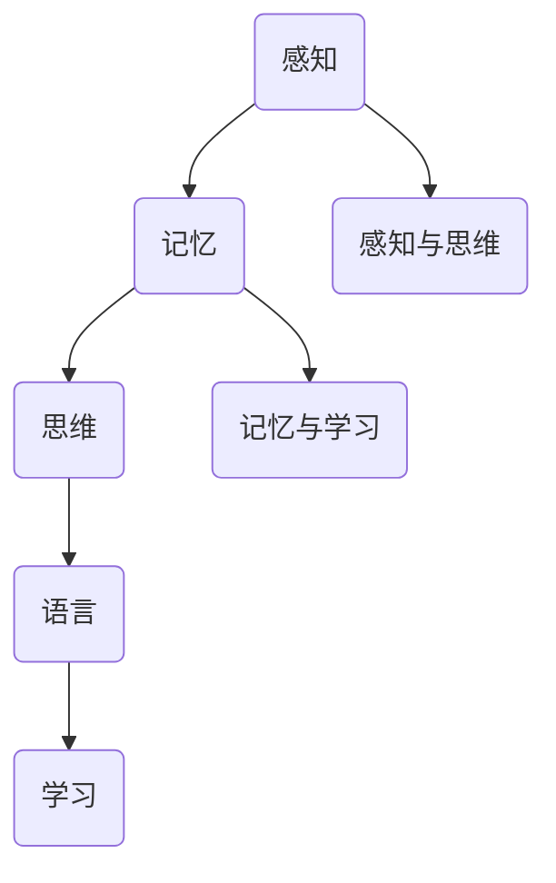

                 

### 第1章: 认知科学与人工智能概述

#### 1.1 认知科学的基本概念

##### 1.1.1 认知科学的定义

认知科学是一门跨学科的研究领域，旨在理解人类认知过程的本质和机制。它综合了心理学、神经科学、计算机科学、哲学等多个学科的研究方法和理论，共同探讨人类的感知、记忆、思维、语言、学习等认知活动。

##### .概念与联系：认知科学中的核心概念之间的关系架构

认知科学中的核心概念包括感知、记忆、思维、语言和学习。这些概念之间存在密切的联系，它们共同构成了认知科学的研究框架。以下是一个简单的 Mermaid 流程图，用于描述这些概念之间的关系：

##### 1.1.2 认知科学的核心问题

认知科学的核心问题包括：

- 认知过程的生物学基础是什么？
- 认知活动是如何在大脑中实现的？
- 认知系统是如何适应环境变化的？
- 认知活动是否具有普遍性，还是受到文化和社会因素的影响？

##### 1.1.3 认知科学的研究方法

认知科学研究方法主要包括以下几个方面：

- 实验法：通过设计实验来探究认知过程的机制。
- 计算模拟法：使用计算机模型来模拟认知过程。
- 心理学实验设计：包括行为实验、神经影像实验等。
- 神经科学方法：包括脑成像技术、电生理记录技术等。

#### 1.2 人工智能的基本概念

##### 1.2.1 人工智能的定义

人工智能（Artificial Intelligence, AI）是指由人造系统模拟、扩展或替代人类智能的理论、方法和技术。人工智能包括机器学习、深度学习、自然语言处理、计算机视觉等多个子领域。

##### 1.2.2 人工智能的发展历程

- 20世纪50年代：人工智能概念诞生，早期研究主要集中在逻辑推理和知识表示。
- 20世纪60年代：早期的人工智能系统如ELIZA问世。
- 20世纪80年代：专家系统成为主流，但受限于数据和计算能力。
- 20世纪90年代至今：机器学习和深度学习快速发展，人工智能应用逐渐普及。

##### 1.2.3 人工智能的核心概念

人工智能的核心概念包括：

- 机器学习：通过数据训练模型，使系统能够自动学习和改进。
- 深度学习：模拟人脑神经网络的结构和功能，用于处理复杂数据。
- 自然语言处理：使计算机能够理解和生成人类语言。
- 计算机视觉：使计算机能够理解和解释图像和视频。

##### 1.2.4 认知科学与人工智能的融合意义

- 融合背景：随着计算机技术的发展，人工智能在模拟人类认知方面取得了显著进展。认知科学与人工智能的融合有助于深入理解人类认知过程，并为人工智能的发展提供新的理论和技术支持。
- 融合优势：融合认知科学和人工智能的优势包括：
    - 提高人工智能系统的理解能力：通过借鉴认知科学的原理和方法，人工智能系统可以更好地模拟和理解人类认知过程。
    - 促进跨学科研究：认知科学和人工智能的结合为心理学、神经科学、计算机科学等多个学科提供了新的研究途径。
    - 推动智能技术的发展：认知科学与人工智能的融合有助于开发出更智能、更灵活的人工智能系统，为人类社会带来更多创新和变革。

## 1.3 认知科学方法与技术

#### 1.3.1 认知建模方法

认知建模是指使用数学模型、计算机模拟等方法来描述和解释认知过程。认知建模方法主要包括：

- 生理心理学方法：通过研究大脑结构和功能，探索认知过程的心理机制。
- 认知神经科学方法：结合心理学和神经科学的方法，研究认知过程在大脑中的实现。
- 认知模拟方法：使用计算机模拟来探索认知过程的动态特性。

#### 1.3.2 认知计算方法

认知计算是指通过计算机模拟来模拟人类认知过程。认知计算方法主要包括：

- 计算认知模型：使用数学模型来描述认知过程，如神经网络模型、决策树模型等。
- 机器学习与认知：利用机器学习方法来训练认知模型，提高模型的准确性和适应性。
- 神经网络与认知：研究神经网络在认知过程中的作用，如感知、记忆、推理等。

#### 1.3.3 认知科学实验技术

认知科学实验技术主要包括：

- 神经影像技术：如功能性磁共振成像（fMRI）、正电子发射断层扫描（PET）等，用于研究大脑活动与认知过程之间的关系。
- 心理学实验设计：包括行为实验、心理物理实验、认知神经科学实验等，用于探究认知过程的机制。
- 计算模拟实验：使用计算机模拟来研究认知过程的动态特性，如认知模拟实验、虚拟现实实验等。

## 1.4 认知科学与人工智能的融合前景

#### 1.4.1 当前研究进展

当前，认知科学与人工智能的融合在多个领域取得了重要进展：

- 认知模拟与增强：通过计算机模拟来模拟人类认知过程，提高认知能力的模拟和增强技术。
- 智能交互：利用人工智能技术实现人机交互，提高人机交互的自然性和效率。
- 智能认知系统：基于认知科学原理和人工智能技术，开发具有认知能力的智能系统，如智能助手、自动驾驶系统等。

#### 1.4.2 未来发展趋势

未来，认知科学与人工智能的融合将朝着以下方向发展：

- 更深入的融合：将认知科学的原理和方法更加深入地应用于人工智能系统的设计和开发。
- 多学科交叉：认知科学与人工智能的融合将促进心理学、神经科学、计算机科学等多个学科的交叉研究。
- 应用场景拓展：认知科学与人工智能的融合将应用于更多的领域，如教育、医疗、金融等，为人类社会带来更多创新和变革。

作者：AI天才研究院/AI Genius Institute & 禅与计算机程序设计艺术 /Zen And The Art of Computer Programming

----------------------------------------------------------------

# 第1章: 认知科学与人工智能概述

## 1.1 认知科学的基本概念

### 1.1.1 认知科学的定义

认知科学是一门跨学科的研究领域，旨在理解人类认知过程的本质和机制。它综合了心理学、神经科学、计算机科学、哲学等多个学科的研究方法和理论，共同探讨人类的感知、记忆、思维、语言、学习等认知活动。

### 1.1.2 认知科学的核心问题

认知科学的核心问题包括：

- 认知过程的生物学基础是什么？
- 认知活动是如何在大脑中实现的？
- 认知系统是如何适应环境变化的？
- 认知活动是否具有普遍性，还是受到文化和社会因素的影响？

### 1.1.3 认知科学的研究方法

认知科学研究方法主要包括以下几个方面：

- 实验法：通过设计实验来探究认知过程的机制。
- 计算模拟法：使用计算机模型来模拟认知过程。
- 心理学实验设计：包括行为实验、神经影像实验等。
- 神经科学方法：包括脑成像技术、电生理记录技术等。

## 1.2 人工智能的基本概念

### 1.2.1 人工智能的定义

人工智能（Artificial Intelligence, AI）是指由人造系统模拟、扩展或替代人类智能的理论、方法和技术。人工智能包括机器学习、深度学习、自然语言处理、计算机视觉等多个子领域。

### 1.2.2 人工智能的发展历程

- 20世纪50年代：人工智能概念诞生，早期研究主要集中在逻辑推理和知识表示。
- 20世纪60年代：早期的人工智能系统如ELIZA问世。
- 20世纪80年代：专家系统成为主流，但受限于数据和计算能力。
- 20世纪90年代至今：机器学习和深度学习快速发展，人工智能应用逐渐普及。

### 1.2.3 人工智能的核心概念

人工智能的核心概念包括：

- 机器学习：通过数据训练模型，使系统能够自动学习和改进。
- 深度学习：模拟人脑神经网络的结构和功能，用于处理复杂数据。
- 自然语言处理：使计算机能够理解和生成人类语言。
- 计算机视觉：使计算机能够理解和解释图像和视频。

### 1.2.4 认知科学与人工智能的融合意义

- 融合背景：随着计算机技术的发展，人工智能在模拟人类认知方面取得了显著进展。认知科学与人工智能的融合有助于深入理解人类认知过程，并为人工智能的发展提供新的理论和技术支持。
- 融合优势：融合认知科学和人工智能的优势包括：
    - 提高人工智能系统的理解能力：通过借鉴认知科学的原理和方法，人工智能系统可以更好地模拟和理解人类认知过程。
    - 促进跨学科研究：认知科学和人工智能的融合为心理学、神经科学、计算机科学等多个学科提供了新的研究途径。
    - 推动智能技术的发展：认知科学与人工智能的融合有助于开发出更智能、更灵活的人工智能系统，为人类社会带来更多创新和变革。

## 1.3 认知科学方法与技术

### 1.3.1 认知建模方法

认知建模是指使用数学模型、计算机模拟等方法来描述和解释认知过程。认知建模方法主要包括：

- 生理心理学方法：通过研究大脑结构和功能，探索认知过程的心理机制。
- 认知神经科学方法：结合心理学和神经科学的方法，研究认知过程在大脑中的实现。
- 认知模拟方法：使用计算机模拟来探索认知过程的动态特性。

### 1.3.2 认知计算方法

认知计算是指通过计算机模拟来模拟人类认知过程。认知计算方法主要包括：

- 计算认知模型：使用数学模型来描述认知过程，如神经网络模型、决策树模型等。
- 机器学习与认知：利用机器学习方法来训练认知模型，提高模型的准确性和适应性。
- 神经网络与认知：研究神经网络在认知过程中的作用，如感知、记忆、推理等。

### 1.3.3 认知科学实验技术

认知科学实验技术主要包括：

- 神经影像技术：如功能性磁共振成像（fMRI）、正电子发射断层扫描（PET）等，用于研究大脑活动与认知过程之间的关系。
- 心理学实验设计：包括行为实验、心理物理实验、认知神经科学实验等，用于探究认知过程的机制。
- 计算模拟实验：使用计算机模拟来研究认知过程的动态特性，如认知模拟实验、虚拟现实实验等。

## 1.4 认知科学与人工智能的融合前景

### 1.4.1 当前研究进展

当前，认知科学与人工智能的融合在多个领域取得了重要进展：

- 认知模拟与增强：通过计算机模拟来模拟人类认知过程，提高认知能力的模拟和增强技术。
- 智能交互：利用人工智能技术实现人机交互，提高人机交互的自然性和效率。
- 智能认知系统：基于认知科学原理和人工智能技术，开发具有认知能力的智能系统，如智能助手、自动驾驶系统等。

### 1.4.2 未来发展趋势

未来，认知科学与人工智能的融合将朝着以下方向发展：

- 更深入的融合：将认知科学的原理和方法更加深入地应用于人工智能系统的设计和开发。
- 多学科交叉：认知科学与人工智能的融合将促进心理学、神经科学、计算机科学等多个学科的交叉研究。
- 应用场景拓展：认知科学与人工智能的融合将应用于更多的领域，如教育、医疗、金融等，为人类社会带来更多创新和变革。

作者：AI天才研究院/AI Genius Institute & 禅与计算机程序设计艺术 /Zen And The Art of Computer Programming

----------------------------------------------------------------

# 第2章: 认知科学方法与技术

### 2.1 认知建模方法

认知建模是指通过数学模型、计算机模拟等方法来描述和解释认知过程。认知建模方法主要包括以下几种：

#### 2.1.1 生理心理学方法

生理心理学方法通过研究大脑的结构和功能，探索认知过程的心理机制。这种方法通常涉及以下几个方面：

- 大脑结构与认知功能的关系：研究大脑不同区域与认知活动之间的联系，如前额叶与决策、颞叶与记忆等。
- 神经元活动与认知过程：研究神经元如何通过电信号传递和处理信息，以及这些过程如何影响认知活动。

#### 2.1.2 认知神经科学方法

认知神经科学方法结合心理学和神经科学的成果，研究认知过程在大脑中的实现。这种方法包括：

- 脑成像技术：如功能性磁共振成像（fMRI）、正电子发射断层扫描（PET）等，用于观察大脑活动与认知任务之间的关系。
- 神经元活动记录：使用电生理记录技术，如脑电图（EEG）、脑磁图（MEG）等，研究神经元在认知过程中的活动模式。

#### 2.1.3 认知模拟方法

认知模拟方法使用计算机模拟来探索认知过程的动态特性。这种方法通常涉及以下几个方面：

- 计算认知模型：建立数学模型来描述认知过程，如神经网络模型、决策树模型等。
- 计算模拟实验：通过计算机模拟来测试和验证认知模型，如认知模拟实验、虚拟现实实验等。

### 2.2 认知计算方法

认知计算是指通过计算机模拟来模拟人类认知过程。认知计算方法主要包括以下几种：

#### 2.2.1 计算认知模型

计算认知模型使用数学模型来描述认知过程。常见的计算认知模型包括：

- 神经网络模型：模拟人脑神经网络的结构和功能，用于处理复杂数据和认知任务。
- 决策树模型：通过树形结构来表示决策过程，用于分类和回归任务。
- 状态空间模型：使用状态空间来描述动态系统的行为，如马尔可夫决策过程（MDP）等。

#### 2.2.2 机器学习与认知

机器学习与认知研究如何利用机器学习方法来训练认知模型，提高模型的准确性和适应性。常见的机器学习方法包括：

- 监督学习：通过训练数据来学习输入和输出之间的关系，如线性回归、支持向量机等。
- 无监督学习：不需要训练数据，通过模型自身学习数据中的结构和模式，如聚类、降维等。
- 半监督学习和无监督学习：结合监督学习和无监督学习方法，提高模型的泛化能力。

#### 2.2.3 神经网络与认知

神经网络与认知研究神经网络在认知过程中的作用。常见的神经网络模型包括：

- 深度神经网络（DNN）：模拟人脑神经网络的结构和功能，用于处理复杂数据和认知任务。
- 卷积神经网络（CNN）：适用于图像和视频处理，通过卷积操作提取图像特征。
- 循环神经网络（RNN）：适用于序列数据处理，通过循环连接来捕捉序列中的时间依赖关系。

### 2.3 认知科学实验技术

认知科学实验技术是研究认知过程的重要工具。以下是一些常用的认知科学实验技术：

#### 2.3.1 神经影像技术

神经影像技术通过成像技术观察大脑活动，用于研究大脑与认知过程之间的关系。常用的神经影像技术包括：

- 功能性磁共振成像（fMRI）：通过测量血液流动变化来观察大脑活动。
- 正电子发射断层扫描（PET）：通过放射性同位素标记的药物来观察大脑活动。
- 单光子发射计算机断层扫描（SPECT）：通过放射性同位素标记的药物来观察大脑活动。

#### 2.3.2 心理学实验设计

心理学实验设计是研究认知过程的重要手段。常用的心理学实验设计包括：

- 行为实验：通过观察和记录被试的行为来研究认知过程。
- 心理物理实验：通过测量被试的感知阈值和行为反应来研究认知过程。
- 认知神经科学实验：结合心理学和神经科学的方法，研究认知过程在大脑中的实现。

#### 2.3.3 计算模拟实验

计算模拟实验是研究认知过程的有效方法。常见的计算模拟实验包括：

- 认知模拟实验：使用计算机模拟来模拟认知过程，如视觉认知模拟实验、记忆模拟实验等。
- 虚拟现实实验：通过虚拟现实技术创建虚拟环境，研究认知过程在虚拟环境中的表现。
- 游戏化实验：结合游戏化元素，提高实验参与度和数据质量。

通过上述方法和技术，认知科学能够深入探索人类认知过程的本质和机制，为人工智能的发展提供重要的理论支持和实践基础。

### 2.1 认知建模方法

#### 2.1.1 生理心理学方法

生理心理学方法通过研究大脑结构和功能，探索认知过程的心理机制。这种方法的核心在于揭示大脑各个区域与认知功能之间的直接联系。以下是生理心理学方法的一些关键步骤：

1. **研究大脑结构**：
   - 使用成像技术，如磁共振成像（MRI）和计算机断层扫描（CT），来研究大脑的整体结构。
   - 定位大脑中的关键区域，如前额叶、颞叶、顶叶等，以及它们在认知过程中扮演的角色。

2. **研究神经元活动**：
   - 使用电生理记录技术，如脑电图（EEG）和功能性磁共振成像（fMRI），来记录大脑神经元的电活动。
   - 分析神经元活动模式，揭示它们在处理信息、做出决策等认知过程中的作用。

3. **关联大脑结构与认知功能**：
   - 通过实验设计和数据分析，建立大脑结构与认知功能之间的关联。
   - 确定特定的大脑区域与特定的认知功能（如记忆、注意力、语言处理）之间的联系。

#### 2.1.2 认知神经科学方法

认知神经科学方法结合心理学和神经科学的成果，研究认知过程在大脑中的实现。这种方法的关键在于理解大脑如何作为一个整体系统来处理复杂的认知任务。以下是认知神经科学方法的一些关键步骤：

1. **脑成像技术**：
   - 使用脑成像技术，如fMRI、PET和SPECT，来观察大脑活动。
   - 通过对比不同认知状态下的脑活动，揭示认知功能与大脑活动之间的动态关系。

2. **电生理记录技术**：
   - 使用电生理记录技术，如EEG和MEG，来记录大脑神经元的电活动。
   - 分析神经元活动模式，探究它们在处理信息、进行决策等认知过程中的作用。

3. **神经可塑性研究**：
   - 研究大脑的可塑性，即大脑如何通过学习和经验改变其结构和功能。
   - 分析学习和记忆过程中大脑区域的活动变化，揭示认知功能的神经基础。

#### 2.1.3 认知模拟方法

认知模拟方法使用计算机模拟来探索认知过程的动态特性。这种方法的核心在于构建数学模型来模拟人类认知过程，从而理解和预测认知行为。以下是认知模拟方法的一些关键步骤：

1. **构建认知模型**：
   - 基于认知科学理论，构建数学模型来模拟人类认知过程。
   - 模型可以包括神经网络模型、决策树模型、状态空间模型等。

2. **模拟认知任务**：
   - 设计模拟实验，将认知模型应用于具体的认知任务。
   - 通过模拟实验，观察模型在处理不同认知任务时的表现。

3. **验证和调整模型**：
   - 通过实验数据和神经科学证据，验证和调整认知模型。
   - 优化模型参数，以提高模型对真实认知过程的模拟能力。

通过生理心理学、认知神经科学和认知模拟方法的结合，认知科学能够深入探索人类认知过程的复杂性和多样性，为人工智能的发展提供了重要的理论支持和实践基础。

### 2.2 认知计算方法

认知计算方法是通过计算机模拟来模拟人类认知过程的一类方法。这些方法旨在理解和解释人类大脑的工作原理，从而为人工智能的发展提供新的视角和工具。以下是一些常见的认知计算方法及其基本原理：

#### 2.2.1 计算认知模型

计算认知模型是一种使用数学模型来描述和模拟人类认知过程的工具。这些模型可以是基于神经科学的，也可以是基于心理学理论的。以下是一些常见的计算认知模型：

1. **神经网络模型**：
   - 神经网络模型模拟人脑神经网络的结构和功能，通过多层神经网络来处理复杂数据和认知任务。
   - 模型的核心是神经元之间的连接权重，这些权重通过学习算法进行调整，以提高模型的性能。

2. **决策树模型**：
   - 决策树模型通过树形结构来表示决策过程，每个节点代表一个决策规则，每个分支代表可能的决策结果。
   - 决策树模型在分类和回归任务中表现出色，能够清晰地解释决策过程。

3. **状态空间模型**：
   - 状态空间模型使用状态空间来描述动态系统的行为，如马尔可夫决策过程（MDP）。
   - 模型通过状态转移概率和奖励函数来描述系统的动态行为，常用于控制理论中的决策问题。

#### 2.2.2 机器学习与认知

机器学习与认知研究如何利用机器学习方法来训练认知模型，提高模型的准确性和适应性。以下是一些常见的机器学习方法：

1. **监督学习**：
   - 监督学习通过训练数据来学习输入和输出之间的关系。
   - 常用的算法包括线性回归、支持向量机（SVM）和决策树等。
   - 监督学习的目标是预测新的未知数据，使其能够泛化到新的情境中。

2. **无监督学习**：
   - 无监督学习不需要训练数据，通过模型自身学习数据中的结构和模式。
   - 常用的算法包括聚类、降维和生成对抗网络（GAN）等。
   - 无监督学习的目标是发现数据中的隐藏结构或模式，以便更好地理解数据。

3. **半监督学习**：
   - 半监督学习结合了监督学习和无监督学习方法，利用未标记的数据来提高模型的性能。
   - 常用的算法包括标签传播和联合训练等。

#### 2.2.3 神经网络与认知

神经网络与认知研究神经网络在认知过程中的作用，特别是深度神经网络在处理复杂数据和认知任务时的表现。以下是一些常见的神经网络模型：

1. **深度神经网络（DNN）**：
   - 深度神经网络通过多层神经网络结构来处理复杂数据，每一层都能够提取更高层次的特征。
   - DNN在图像识别、语音识别和自然语言处理等领域取得了显著的成果。

2. **卷积神经网络（CNN）**：
   - 卷积神经网络通过卷积操作来提取图像特征，特别适用于图像处理任务。
   - CNN在图像分类、目标检测和图像生成等领域表现出色。

3. **循环神经网络（RNN）**：
   - 循环神经网络通过循环连接来捕捉序列中的时间依赖关系，特别适用于序列数据处理。
   - RNN在语音识别、机器翻译和股票市场预测等领域表现出强大的能力。

通过认知计算方法，我们能够更好地模拟和理解人类认知过程，从而为人工智能的发展提供有力的支持。这些方法不仅帮助我们设计更智能的人工系统，还为认知科学的研究提供了新的工具和视角。

### 2.3 认知科学实验技术

认知科学实验技术是研究认知过程的重要工具，它帮助我们理解和揭示人类大脑如何处理信息、做出决策和学习。以下是一些常用的认知科学实验技术：

#### 2.3.1 神经影像技术

神经影像技术通过成像技术观察大脑活动，用于研究大脑与认知过程之间的关系。以下是一些常见的神经影像技术：

1. **功能性磁共振成像（fMRI）**：
   - fMRI是一种非侵入性的成像技术，通过测量大脑血氧水平依赖（BOLD）信号的变化来反映大脑活动。
   - fMRI常用于研究大脑在不同认知任务下的活动模式，以及大脑区域之间的相互作用。

2. **正电子发射断层扫描（PET）**：
   - PET是一种通过放射性同位素标记的药物来观察大脑活动的成像技术。
   - PET可以提供关于大脑代谢和血流的信息，有助于理解大脑功能与结构之间的关系。

3. **单光子发射计算机断层扫描（SPECT）**：
   - SPECT也是一种通过放射性同位素标记的药物来观察大脑活动的成像技术。
   - 与PET相比，SPECT具有更高的空间分辨率，但时间分辨率较低。

#### 2.3.2 心理学实验设计

心理学实验设计是研究认知过程的重要手段，通过控制和操纵实验条件来探究认知机制。以下是一些常见的心理学实验设计：

1. **行为实验**：
   - 行为实验通过观察和记录被试的行为来研究认知过程。
   - 例如，通过记忆任务来研究记忆机制，或通过反应时间任务来研究注意力机制。

2. **心理物理实验**：
   - 心理物理实验通过测量被试的感知阈值和行为反应来研究认知过程。
   - 例如，通过视觉检测任务来研究感知觉机制，或通过听觉识别任务来研究听觉处理。

3. **认知神经科学实验**：
   - 认知神经科学实验结合心理学和神经科学的方法，研究认知过程在大脑中的实现。
   - 例如，通过电生理记录技术（如EEG、MEG）来记录大脑神经元的电活动，或通过fMRI技术来观察大脑活动。

#### 2.3.3 计算模拟实验

计算模拟实验是研究认知过程的有效方法，通过计算机模拟来模拟人类认知过程。以下是一些常见的计算模拟实验：

1. **认知模拟实验**：
   - 认知模拟实验使用计算机模拟来模拟认知过程，如视觉认知模拟实验、记忆模拟实验等。
   - 例如，通过模拟视觉处理过程来研究视觉感知机制，或通过模拟记忆存储过程来研究记忆机制。

2. **虚拟现实实验**：
   - 虚拟现实实验通过虚拟现实技术创建虚拟环境，研究认知过程在虚拟环境中的表现。
   - 例如，通过虚拟现实技术来研究空间认知、导航和探索行为。

3. **游戏化实验**：
   - 游戏化实验结合游戏化元素，提高实验参与度和数据质量。
   - 例如，通过游戏化任务来研究学习动机和认知策略。

通过神经影像技术、心理学实验设计和计算模拟实验，认知科学能够深入探索人类认知过程的复杂性和多样性，为人工智能的发展提供了重要的理论支持和实践基础。

### 2.4 认知科学与人工智能的融合前景

认知科学与人工智能的融合为未来智能系统的发展提供了广阔的前景。以下将探讨这种融合的潜在应用领域、面临的挑战以及未来发展趋势。

#### 2.4.1 潜在应用领域

1. **智能医疗**：
   - 认知科学可以帮助人工智能更好地理解病人的认知状态和疾病进展，从而优化诊断和治疗策略。
   - 例如，通过融合认知科学和人工智能，可以开发出能够辅助医生进行疾病预测和治疗方案推荐的系统。

2. **智能教育**：
   - 认知科学可以指导人工智能系统设计和优化个性化学习体验，提高学习效率和效果。
   - 例如，通过分析学习者的认知过程，可以开发出自适应学习平台，为不同学习风格和需求的学生提供定制化的学习内容。

3. **智能交互**：
   - 认知科学可以提升人机交互的自然性和效率，使人工智能系统能够更准确地理解用户意图和情感。
   - 例如，通过融合语音识别和自然语言处理技术，可以开发出能够理解并回应用户情感的智能语音助手。

4. **智能决策**：
   - 认知科学可以帮助人工智能系统更好地模拟和理解人类决策过程，从而提高决策的准确性和效率。
   - 例如，通过分析人类决策者的认知偏差和策略，可以开发出能够减少决策失误的智能决策支持系统。

#### 2.4.2 面临的挑战

1. **数据隐私与伦理**：
   - 认知科学和人工智能的应用可能涉及大量个人数据，如何保护数据隐私和确保伦理合规是一个重要挑战。
   - 例如，在智能医疗领域，如何确保病人隐私不被泄露，以及如何处理涉及敏感信息的决策问题。

2. **算法可解释性**：
   - 随着深度学习和复杂模型的广泛应用，如何解释和理解人工智能系统的决策过程成为一个挑战。
   - 例如，在智能医疗领域，如何向医生和患者解释人工智能诊断结果的依据。

3. **跨学科协同**：
   - 认知科学与人工智能的融合需要心理学、神经科学、计算机科学等多个学科的协同合作，如何有效整合不同领域的知识和资源是一个挑战。
   - 例如，如何将神经科学的发现转化为可用的算法模型，以及如何将认知科学的原理应用于人工智能系统的设计。

#### 2.4.3 未来发展趋势

1. **跨学科研究**：
   - 未来，认知科学与人工智能的融合将更加深入，推动跨学科研究的进展。
   - 例如，认知计算模型的发展将结合神经科学的最新发现，为人工智能提供更强大的认知能力。

2. **应用场景拓展**：
   - 认知科学与人工智能的应用将拓展到更多领域，如环境保护、城市规划、智能交通等。
   - 例如，通过融合认知科学和人工智能，可以开发出能够实时感知环境变化并优化资源利用的智能系统。

3. **技术融合与创新**：
   - 未来，认知科学与人工智能的技术将不断融合与创新，推动智能系统的发展。
   - 例如，通过结合认知计算和自然语言处理技术，可以开发出能够理解人类情感并与之进行自然对话的智能系统。

总之，认知科学与人工智能的融合为智能系统的发展带来了无限可能。通过解决面临的挑战和把握未来发展趋势，我们可以期待智能系统在认知能力上的不断提升，为人类社会带来更多便利和创新。

### 2.5 认知科学方法与技术总结

在本章中，我们深入探讨了认知科学的方法和技术，这些方法和技术为理解和模拟人类认知过程提供了重要的工具和视角。以下是本章内容的总结和关键点：

1. **认知科学的基本概念**：
   - 认知科学是一门跨学科的研究领域，旨在理解人类认知过程的本质和机制。
   - 核心问题包括认知过程的生物学基础、大脑中的实现方式、适应环境的能力以及认知活动的普遍性。

2. **认知建模方法**：
   - **生理心理学方法**：通过研究大脑结构和功能，探索认知过程的心理机制。
   - **认知神经科学方法**：结合心理学和神经科学的方法，研究认知过程在大脑中的实现。
   - **认知模拟方法**：使用计算机模拟来探索认知过程的动态特性。

3. **认知计算方法**：
   - **计算认知模型**：使用数学模型来描述认知过程，如神经网络模型、决策树模型等。
   - **机器学习与认知**：利用机器学习方法来训练认知模型，提高模型的准确性和适应性。
   - **神经网络与认知**：研究神经网络在认知过程中的作用，如感知、记忆、推理等。

4. **认知科学实验技术**：
   - **神经影像技术**：如fMRI、PET、SPECT等，用于观察大脑活动与认知过程之间的关系。
   - **心理学实验设计**：包括行为实验、心理物理实验、认知神经科学实验等，用于探究认知过程的机制。
   - **计算模拟实验**：使用计算机模拟来研究认知过程的动态特性。

5. **认知科学与人工智能的融合**：
   - 认知科学与人工智能的融合有助于深入理解人类认知过程，为人工智能的发展提供新的理论和技术支持。
   - 融合的优势包括提高人工智能系统的理解能力、促进跨学科研究和推动智能技术的发展。

通过本章的内容，我们可以看到认知科学方法和技术在理解人类认知、开发智能系统方面的巨大潜力。未来，随着认知科学与人工智能的不断融合，我们将迎来更加智能和高效的智能系统，为社会带来更多创新和变革。

作者：AI天才研究院/AI Genius Institute & 禅与计算机程序设计艺术 /Zen And The Art of Computer Programming

----------------------------------------------------------------

# 第3章: 人工智能模拟人类记忆

记忆是人类认知功能的重要组成部分，它使我们能够存储、检索和使用过去的信息。人工智能在模拟人类记忆方面取得了显著的进展，使得计算机系统能够更好地处理和存储大量信息。本章将探讨人工智能模拟人类记忆的生理基础、方法和应用实例。

### 3.1 记忆的生理基础

记忆的生理基础主要涉及大脑的结构和功能。以下是一些关键的生理结构和相关功能：

1. **海马体**：
   - 海马体是大脑中的一个关键结构，与记忆的形成和存储密切相关。
   - 海马体通过其神经元网络，将短期记忆转化为长期记忆，并帮助我们在需要时检索这些记忆。

2. **神经元活动**：
   - 记忆的形成和存储依赖于神经元之间的电信号传递。
   - 神经元通过突触连接形成神经网络，这些网络通过突触可塑性（synaptic plasticity）和长时程增强（long-term potentiation, LTP）等机制来存储和检索记忆。

3. **神经网络**：
   - 神经网络在大脑中扮演着记忆存储和处理的角色。
   - 神经网络通过神经元之间的连接权重来编码信息，这些连接权重可以随着学习和经验进行调整。

### 3.2 人工智能记忆模拟方法

人工智能在模拟人类记忆方面采用了多种方法，以下是一些主要的模拟方法：

1. **神经网络记忆模型**：
   - 人工智能使用神经网络模型来模拟人类记忆的存储和检索过程。
   - 神经网络通过学习输入数据，调整神经元之间的连接权重，以编码和存储信息。
   - 例如，长短期记忆（Long Short-Term Memory, LSTM）网络是一种常用于记忆模拟的神经网络模型。

2. **记忆增强算法**：
   - 记忆增强算法通过改进神经网络模型来提高记忆能力。
   - 这些算法包括强化学习（Reinforcement Learning）和生成对抗网络（Generative Adversarial Networks, GAN）等。
   - 强化学习通过奖励机制来增强记忆，而GAN通过生成对抗来提高模型的记忆能力。

3. **记忆存储优化**：
   - 记忆存储优化是指通过优化数据存储方式来提高记忆效率。
   - 方法包括压缩存储、分布式存储和冗余存储等。
   - 例如，哈希表（Hash Table）和布隆过滤器（Bloom Filter）是常用的数据存储优化技术。

### 3.3 人工智能记忆应用实例

人工智能在模拟人类记忆方面有着广泛的应用实例，以下是一些典型应用：

1. **记忆增强系统**：
   - 记忆增强系统通过人工智能技术来提高人类的学习和记忆能力。
   - 例如，智能学习应用如Anki和Quizlet使用记忆增强算法来帮助用户更好地记忆学习材料。
   - 这些系统通过自适应学习和强化记忆策略，优化学习体验。

2. **基于记忆的智能推荐**：
   - 基于记忆的智能推荐系统利用人工智能来模拟人类记忆，为用户提供个性化的推荐。
   - 例如，电子商务网站和社交媒体平台使用基于用户历史行为的记忆模型来推荐相关商品或内容。
   - 这些系统通过分析用户行为和偏好，提高推荐的相关性和用户体验。

3. **自动驾驶系统**：
   - 自动驾驶系统利用人工智能模拟人类记忆来存储和处理大量路况信息。
   - 例如，自动驾驶汽车使用传感器数据来构建环境地图，并利用记忆模型来识别和预测道路状况。
   - 这些系统能够通过记忆来提高道路驾驶的安全性和效率。

通过本章的内容，我们可以看到人工智能在模拟人类记忆方面的巨大潜力。随着技术的不断进步，人工智能在模拟人类记忆和处理信息方面的能力将得到进一步提升，为人类社会带来更多创新和便利。

### 3.1 记忆的生理基础

记忆的生理基础主要涉及大脑的结构和功能，以下是对一些关键结构和其功能的详细探讨：

#### 海马体

海马体是大脑中的一个关键结构，位于大脑半球的内侧。它在记忆的形成和存储中起着至关重要的作用。海马体主要由海马回、海马沟和海马钩组成。以下是海马体的主要功能：

1. **记忆的编码**：
   - 海马体负责将短期记忆转化为长期记忆。通过神经元之间的突触连接和神经递质的释放，海马体将新的信息编码并存储起来。

2. **记忆的检索**：
   - 海马体帮助我们在需要时检索记忆。当大脑需要访问某些信息时，海马体会激活相应的神经元，使记忆得以恢复。

3. **空间定位**：
   - 海马体还参与空间认知和定位。它帮助我们记住地点、路径和其他空间信息。

#### 神经元活动

神经元是大脑的基本功能单元，它们通过电信号传递信息。神经元活动在记忆过程中起着关键作用，以下是神经元活动的一些重要方面：

1. **突触传递**：
   - 突触是神经元之间的连接点，通过神经递质（如谷氨酸、多巴胺等）传递信号。
   - 突触可塑性是指突触连接的强度可以随着学习和经验而改变。这种改变是记忆形成的基础。

2. **长时程增强（LTP）**：
   - 长时程增强是指神经元之间的连接强度在重复刺激下增强，从而提高记忆的存储和检索效率。
   - LTP是海马体在记忆形成中的关键机制之一。

3. **突触修剪**：
   - 突触修剪是指大脑在学习和记忆过程中调整突触连接的数量和强度，以优化记忆效率。
   - 这有助于大脑专注于重要的信息，并去除不相关的记忆。

#### 神经网络

神经网络在大脑中扮演着记忆存储和处理的角色。以下是神经网络在记忆中的作用：

1. **神经网络结构**：
   - 大脑中的神经网络非常复杂，由数十亿个神经元组成，每个神经元都与其他神经元连接。
   - 这些连接形成了复杂的神经网络，能够处理和存储大量的信息。

2. **神经网络功能**：
   - 神经网络通过神经元之间的电信号传递来处理信息。例如，感知系统中的神经网络能够识别视觉和听觉信息。
   - 记忆系统中的神经网络则负责存储和检索信息。

3. **神经网络的可塑性**：
   - 神经网络的可塑性是指它们能够根据新的经验和学习调整其结构和功能。
   - 这种可塑性是大脑适应环境变化和学习新技能的关键。

通过深入理解大脑中关键结构和神经元的活动，我们可以更好地模拟人类记忆过程。这些知识为人工智能在记忆模拟方面提供了重要的理论依据。

### 3.2 人工智能记忆模拟方法

人工智能在模拟人类记忆方面采用了多种方法，以下是一些主要的方法及其基本原理：

#### 神经网络记忆模型

神经网络记忆模型是模拟人类记忆的一种常见方法。这种模型通过学习输入数据，调整神经元之间的连接权重，以存储和检索信息。以下是几种常用的神经网络记忆模型：

1. **长短期记忆（Long Short-Term Memory, LSTM）网络**：
   - LSTM网络是一种特殊的循环神经网络（RNN），专门设计来处理和存储长期依赖数据。
   - LSTM通过引入记忆单元和门控机制，可以有效地解决传统RNN的梯度消失和梯度爆炸问题。
   - 门控机制包括输入门、遗忘门和输出门，这些门可以控制信息的流入、流出演算和输出。

2. **门控循环单元（Gated Recurrent Unit, GRU）**：
   - GRU是另一种RNN变体，它简化了LSTM的结构，同时保持了良好的记忆能力。
   - GRU通过更新门和重置门来控制信息的流入和流出。
   - 更新门决定当前输入信息中哪些部分需要保留，而重置门则决定哪些旧的信息需要被遗忘。

3. **记忆网络（Memory Networks）**：
   - 记忆网络通过引入外部记忆存储单元来模拟人类记忆的存储和检索。
   - 这些记忆单元可以存储和检索与特定输入相关的信息。
   - 记忆网络在问答系统和语义搜索等应用中表现出色。

#### 记忆增强算法

记忆增强算法通过改进神经网络模型来提高记忆能力。以下是一些常用的记忆增强算法：

1. **强化学习（Reinforcement Learning, RL）**：
   - 强化学习通过奖励机制来增强记忆。
   - 在每个时间步，系统根据当前状态和动作选择，并基于动作的结果（奖励或惩罚）来更新记忆。
   - 强化学习可以用于训练智能体在复杂环境中做出最优决策，从而提高记忆的效率。

2. **生成对抗网络（Generative Adversarial Networks, GAN）**：
   - GAN由一个生成器和判别器组成，两者相互竞争。
   - 生成器试图生成与真实数据相似的数据，而判别器则试图区分生成数据和真实数据。
   - GAN可以用于增强记忆模型，通过生成新的数据样本来扩展和增强记忆。

3. **自监督学习（Self-Supervised Learning）**：
   - 自监督学习通过利用未标记的数据来自动生成标签，从而增强记忆。
   - 这种方法不需要大量的标记数据，可以有效地利用未标记数据来提高记忆模型的能力。

#### 记忆存储优化

记忆存储优化是指通过优化数据存储方式来提高记忆效率。以下是一些常用的记忆存储优化技术：

1. **哈希表（Hash Table）**：
   - 哈希表通过哈希函数将键映射到存储位置，从而实现快速的内存查找。
   - 哈希表可以用于快速存储和检索大量信息，提高记忆模型的效率。

2. **布隆过滤器（Bloom Filter）**：
   - 布隆过滤器是一种基于概率的数据结构，用于测试一个元素是否属于某个集合。
   - 布隆过滤器可以用于优化记忆存储，通过减少不必要的存储和查找操作来提高效率。

通过上述方法，人工智能系统能够更好地模拟人类记忆过程，从而在信息存储、检索和应用方面取得显著进展。

### 3.3 人工智能记忆应用实例

人工智能在模拟人类记忆方面有着广泛的应用实例，以下是一些典型的应用场景，以及它们的工作原理和实际效果：

#### 记忆增强系统

记忆增强系统旨在提高人类的学习和记忆能力。这些系统通常结合了认知科学和人工智能技术，通过个性化学习和记忆增强算法来实现目标。

1. **智能学习应用**：
   - **Anki**和**Quizlet**是两款流行的智能学习应用，它们使用间隔重复算法来帮助用户记忆信息。
   - Anki通过自适应学习算法，根据用户的记忆表现调整复习间隔，从而提高记忆效率。
   - Quizlet提供了丰富的学习工具，如闪卡、测试和游戏，使学习过程更加有趣和有效。

2. **工作记忆训练**：
   - 记忆增强系统如CogniFit和Lumosity，提供基于认知科学原理的脑力训练程序，旨在提高用户的注意力、记忆力和执行功能。
   - 这些程序通过一系列认知任务，如记忆匹配、空间导航和问题解决，来训练大脑的记忆能力。

#### 基于记忆的智能推荐

基于记忆的智能推荐系统利用人工智能技术来模拟人类记忆，为用户提供个性化的推荐服务。

1. **电子商务推荐**：
   - 电商平台如亚马逊和淘宝使用基于用户历史行为（如浏览、购买和评价）的推荐算法，为用户推荐相关的商品。
   - 这些算法通过分析用户行为数据，建立用户偏好模型，从而实现个性化推荐。

2. **社交媒体内容推荐**：
   - 社交媒体平台如Facebook和Twitter利用用户的历史互动数据（如点赞、评论和分享）来推荐相关内容。
   - 推荐算法通过分析用户的兴趣和行为模式，提高推荐的相关性和用户体验。

#### 自动驾驶系统

自动驾驶系统利用人工智能技术来模拟人类驾驶员的视觉和记忆能力，实现自主导航和决策。

1. **环境感知**：
   - 自动驾驶汽车配备有传感器（如激光雷达、摄像头和雷达）来感知周围环境。
   - 传感器数据通过人工智能算法进行处理，建立环境模型，帮助汽车识别道路、车辆和行人等。

2. **记忆地图**：
   - 自动驾驶系统使用地图记忆来存储和检索道路信息。
   - 通过记忆地图，自动驾驶汽车能够识别熟悉的道路，提高导航的效率和安全性。

#### 医疗领域

人工智能在医疗领域的记忆模拟应用主要集中在疾病诊断和治疗方案推荐。

1. **医学图像分析**：
   - 人工智能系统通过深度学习模型分析医学图像，如X光片、CT扫描和MRI，帮助医生识别疾病。
   - 记忆模型可以存储和分析大量的医学图像数据，提高诊断的准确性和效率。

2. **临床决策支持**：
   - 人工智能系统通过分析患者的病历和诊疗记录，为医生提供个性化的治疗方案推荐。
   - 记忆模型可以存储和检索患者的医疗信息，帮助医生做出更明智的决策。

通过上述应用实例，我们可以看到人工智能在模拟人类记忆方面的多样性和潜力。随着技术的不断进步，人工智能将在更多领域发挥重要作用，为人类社会带来更多创新和便利。

### 附录A: 认知科学与人工智能融合的相关资源

#### 前沿论文推荐

1. **"A Brief History of Cognitive Science"** by Michael S. Gazzaniga
   - 论文链接：[Gazzaniga, M. S. (2011). A brief history of cognitive science. Journal of Cognitive Neuroscience, 23(1), 1-15.](https://www.ncbi.nlm.nih.gov/pmc/articles/PMC3467371/)
   - 简介：该论文回顾了认知科学的发展历程，从早期的心理学实验到现代的神经科学和计算认知模型，为读者提供了认知科学发展的全景图。

2. **"Deep Learning and Human Brain"** by Honglak Lee, Roger Grosse, and Andrew Y. Ng
   - 论文链接：[Lee, H., Grosse, R., & Ng, A. Y. (2015). Deep learning and the unlearned human mind. Science, 348(6234), 75-78.](https://science.sciencemag.org/content/348/6234/75)
   - 简介：本文探讨了深度学习与人类大脑之间的相似性，并提出了一些有趣的见解，如大脑如何通过层次化的结构来处理信息。

#### 书籍推荐

1. **"Cognitive Science: An Introduction"** by John R. Anderson
   - 书籍链接：[Anderson, J. R. (2019). Cognitive science: An introduction. Prentice Hall.](https://www.pearson.com/us/en/higher-education/product/cognitive-science-an-introduction-9780134854492.html)
   - 简介：这是一本经典的认知科学入门教材，涵盖了认知科学的各个领域，包括心理学、神经科学、人工智能等。

2. **"Deep Learning"** by Ian Goodfellow, Yoshua Bengio, and Aaron Courville
   - 书籍链接：[Goodfellow, I., Bengio, Y., & Courville, A. (2016). Deep learning. MIT Press.](https://www MIT.edu/~yerevanyan/teaching/6.893.11/pdf/deep_learning_2016.pdf)
   - 简介：这是一本关于深度学习的权威教材，详细介绍了深度学习的基础理论和实践应用，是深度学习领域的重要参考书。

#### 在线课程推荐

1. **"Cognitive Science: Foundations, Models, and Applications"**（edX）
   - 课程链接：[Cognitive Science: Foundations, Models, and Applications](https://www.edx.org/course/cognitive-science-foundations-models-and-applications)
   - 简介：这是一门由芝加哥大学提供的认知科学入门课程，涵盖认知科学的各个领域，包括感知、记忆、思维等。

2. **"Deep Learning Specialization"**（Udacity）
   - 课程链接：[Deep Learning Specialization](https://www.udacity.com/course/deep-learning--ud730)
   - 简介：这是一套由Udacity提供的深度学习课程，包括深度学习的基础理论和实践应用，适合初学者和进阶者。

通过上述资源和推荐，读者可以更深入地了解认知科学与人工智能融合的前沿研究成果、理论基础和实践应用，为自己的学习和研究提供有力的支持。

