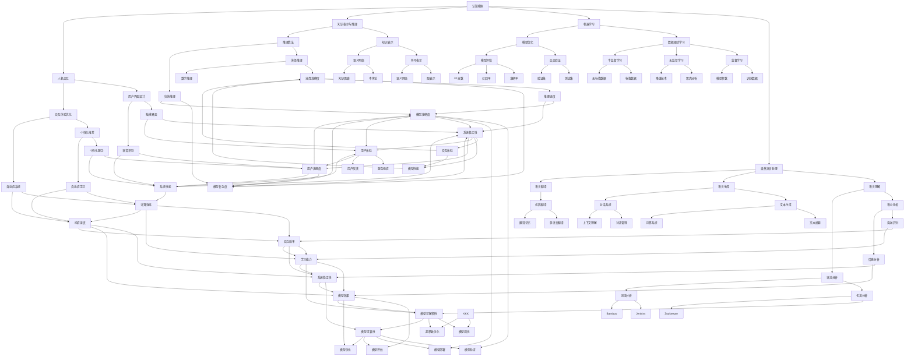

                 

## 文章标题

### 认知计算与人工智能：计算机辅助人类理解复杂世界

> 关键词：认知计算、人工智能、复杂世界、理解、建模、应用

> 摘要：本文将深入探讨认知计算与人工智能相结合，如何为人类理解复杂世界提供有效的辅助。通过剖析认知计算的定义、核心概念及其与人工智能的融合，结合具体应用实例，本文旨在为读者展示这一领域的前沿研究成果和未来发展前景。

----------------------------------------------------------------

### 第一部分：认知计算基础

#### 第1章：认知计算导论

##### 1.1 认知计算的定义与背景

认知计算（Cognitive Computing）是指通过模拟人类思维过程，实现对复杂问题的理解、推理和学习能力。它起源于20世纪50年代的人工智能（AI）研究，但随着计算能力和数据资源的提升，近年来得到了快速发展。

##### 1.1.1 认知计算的定义

认知计算是一种通过模仿人类认知过程，实现智能行为的技术体系。它包括自然语言理解、图像识别、推理能力、情感识别等多个方面，旨在构建出能够模拟人类思维过程的智能系统。

##### 1.1.2 认知计算的背景

认知计算的兴起背景主要有以下几个方面：

- **大数据时代：** 随着互联网和物联网的发展，海量的数据产生了对智能处理和分析的需求。
- **计算能力的提升：** 计算机性能的提升为复杂的算法和模型提供了强大的计算支持。
- **深度学习的发展：** 深度学习技术的突破为认知计算提供了强大的理论基础和实现手段。

##### 1.2 认知计算的核心概念

认知计算的核心概念主要包括以下几方面：

- **自然语言处理：** 包括语言理解、语言生成、语言翻译等，旨在使计算机能够理解人类的自然语言。
- **机器学习：** 通过对数据的分析，使计算机能够自动学习并优化行为。
- **知识表示与推理：** 将人类知识以计算机可处理的形式表示，并通过推理来解决问题。
- **人机交互：** 研究如何使计算机更好地与人类进行交互，提高用户体验。

##### 1.3 认知计算与人类思维的联系

认知计算与人类思维有密切的联系，主要体现在以下几个方面：

- **学习与记忆：** 认知计算通过模拟人类的学习和记忆机制，使计算机能够获取和利用知识。
- **感知与理解：** 认知计算通过模仿人类的感知和理解过程，使计算机能够处理和理解各种信息。
- **决策与行动：** 认知计算通过模拟人类的决策和行动方式，使计算机能够自主地做出决策并采取行动。

##### 1.4 认知计算的技术进展

近年来，认知计算在技术层面取得了显著进展，主要包括以下几个方面：

- **深度学习：** 深度学习技术在图像识别、自然语言处理等领域取得了突破性成果，为认知计算提供了强大的技术支持。
- **强化学习：** 强化学习技术在游戏、自动驾驶等领域取得了成功，为认知计算提供了新的研究途径。
- **多模态融合：** 通过将多种传感器数据融合，认知计算系统能够更好地理解复杂环境，提高智能水平。

#### 第2章：认知模拟的基本原理

##### 2.1 认知模拟的定义与目的

认知模拟（Cognitive Simulation）是指通过计算机模拟人类认知过程，实现智能行为的一种方法。其目的是构建出能够模拟人类思维过程的智能系统，从而更好地理解人类行为和决策。

##### 2.2 认知模拟的数学模型

认知模拟的数学模型主要包括以下几个方面：

- **贝叶斯网络：** 通过概率图模型表示人类思维过程中的不确定性，实现推理和决策。
- **图模型与推理算法：** 利用图结构表示人类思维过程中的关系和规则，实现高效的推理和计算。

##### 2.2.1 贝叶斯网络

贝叶斯网络（Bayesian Network）是一种概率图模型，用于表示变量之间的条件依赖关系。在认知模拟中，贝叶斯网络可以用来表示人类思维过程中的不确定性，从而实现推理和决策。

贝叶斯网络的数学模型如下：

$$
P(X_1, X_2, ..., X_n) = \prod_{i=1}^{n} P(X_i | X_{pa_i})
$$

其中，$X_1, X_2, ..., X_n$ 表示节点变量，$X_{pa_i}$ 表示节点 $X_i$ 的父节点。

##### 2.2.2 图模型与推理算法

图模型（Graph Model）是一种用于表示变量之间关系的数学模型，包括有向图、无向图和混合图等。在认知模拟中，图模型可以用来表示人类思维过程中的关系和规则，实现高效的推理和计算。

常见的图模型推理算法包括：

- **逆向推理（Backtracking）：** 通过回溯搜索找到满足条件的变量组合。
- **概率图模型推理（Probabilistic Graphical Models）：** 利用概率图模型进行推理，计算变量之间的条件概率。

##### 2.3 认知模拟的应用场景

认知模拟在多个领域有着广泛的应用，包括：

- **智能决策支持系统：** 通过模拟人类思维过程，为决策者提供辅助决策。
- **智能问答系统：** 利用认知模拟技术，实现对用户问题的理解和回答。
- **智能医疗诊断：** 通过模拟医生思维过程，辅助医生进行疾病诊断。

### 第二部分：人工智能基础

#### 第3章：人工智能概述

##### 3.1 人工智能的定义与发展历程

人工智能（Artificial Intelligence，简称AI）是指通过计算机模拟人类智能的一种技术。人工智能的发展历程可以追溯到20世纪50年代，当时人工智能的概念被首次提出。自那时以来，人工智能经历了多个发展阶段，包括符号主义、连接主义、统计学习等。

##### 3.2 人工智能的核心技术

人工智能的核心技术包括以下几个方面：

- **机器学习：** 通过对数据的分析，使计算机能够自动学习并优化行为。
- **深度学习：** 一种基于多层神经网络的学习方法，具有强大的特征提取和分类能力。
- **自然语言处理：** 研究如何使计算机能够理解、生成和处理自然语言。
- **计算机视觉：** 研究如何使计算机能够理解和分析图像和视频。

##### 3.3 人工智能的应用领域

人工智能在多个领域有着广泛的应用，包括：

- **自动驾驶：** 利用计算机视觉和深度学习技术，实现无人驾驶汽车。
- **智能助手：** 利用自然语言处理和机器学习技术，实现智能对话和任务自动化。
- **智能医疗：** 利用计算机视觉和深度学习技术，辅助医生进行疾病诊断和治疗。

#### 第4章：人工智能的数学基础

##### 4.1 线性代数基础

线性代数是人工智能的基础数学工具，主要包括以下几个方面：

- **矩阵与向量：** 矩阵和向量是线性代数的基本概念，用于表示数据和处理运算。
- **矩阵运算：** 矩阵运算包括加法、减法、乘法、转置等，用于计算矩阵的属性和特征。
- **线性方程组：** 线性方程组是一种用于求解变量关系的数学模型，用于训练机器学习模型。

##### 4.2 概率论基础

概率论是人工智能的基础数学工具，主要包括以下几个方面：

- **随机变量与概率分布：** 随机变量是概率论的基本概念，用于表示不确定性和概率分布。
- **条件概率与贝叶斯公式：** 条件概率和贝叶斯公式用于计算变量之间的条件概率和推断。
- **最大似然估计与最小二乘法：** 最大似然估计和最小二乘法是用于估计模型参数和优化模型性能的方法。

### 第三部分：认知计算与人工智能的结合

#### 第5章：认知计算与人工智能的融合

##### 5.1 认知计算与人工智能的结合意义

认知计算与人工智能的融合具有以下几个方面的意义：

- **提高智能水平：** 通过结合认知计算和人工智能技术，可以构建出更高智能的智能系统。
- **解决复杂问题：** 认知计算和人工智能的融合可以更好地解决复杂问题，提高决策质量和效率。
- **优化人机交互：** 通过认知计算和人工智能的融合，可以实现更自然、更高效的人机交互。

##### 5.2 认知计算驱动的智能系统

认知计算驱动的智能系统包括以下几个方面：

- **基于认知计算的智能推理系统：** 通过模拟人类思维过程，实现智能推理和决策。
- **基于认知计算的智能辅助系统：** 通过模拟人类思维过程，为人类提供智能化的辅助和支持。

##### 5.3 认知计算与人工智能融合的应用实例

认知计算与人工智能的融合在多个领域有着成功的应用实例，包括：

- **智能医疗：** 通过融合认知计算和人工智能技术，实现疾病诊断、治疗方案优化等。
- **智能交通：** 通过融合认知计算和人工智能技术，实现交通流量预测、智能调度等。
- **智能金融：** 通过融合认知计算和人工智能技术，实现风险控制、投资决策等。

### 第6章：认知计算与人工智能在复杂世界中的应用

##### 6.1 复杂世界的理解与建模

复杂世界的理解与建模是认知计算与人工智能在复杂世界应用的重要环节，主要包括以下几个方面：

- **复杂系统的识别：** 通过数据分析和模式识别技术，识别复杂系统中的关键特征和关系。
- **复杂系统的建模：** 通过构建数学模型和计算机模拟，模拟复杂系统的行为和演化。
- **复杂系统的分析与预测：** 通过对复杂系统的分析，预测系统的行为和趋势。

##### 6.2 认知计算与人工智能在复杂世界中的应用

认知计算与人工智能在复杂世界中的应用包括以下几个方面：

- **复杂系统分析：** 利用认知计算和人工智能技术，对复杂系统进行深入分析，揭示系统内在规律。
- **大数据分析与智能分析：** 通过大数据分析与智能分析，挖掘复杂世界中的有价值信息。
- **智能决策支持系统：** 利用认知计算和人工智能技术，构建智能决策支持系统，为决策者提供科学、高效的决策支持。

##### 6.2.1 复杂系统分析

复杂系统分析是认知计算与人工智能在复杂世界中的重要应用之一，主要包括以下几个方面：

- **系统识别：** 通过对系统数据的分析，识别复杂系统中的关键特征和关系。
- **系统建模：** 通过构建数学模型和计算机模拟，模拟复杂系统的行为和演化。
- **系统分析：** 通过对复杂系统的分析，揭示系统内在规律，为系统优化和决策提供支持。

##### 6.2.2 大数据分析与智能分析

大数据分析与智能分析是认知计算与人工智能在复杂世界中的另一个重要应用，主要包括以下几个方面：

- **数据收集：** 通过各种传感器和数据采集技术，收集复杂世界中的大量数据。
- **数据清洗与预处理：** 对收集到的数据进行清洗和预处理，提高数据质量和可用性。
- **数据挖掘：** 利用数据挖掘技术，从大量数据中提取有价值的信息和知识。
- **智能分析：** 利用人工智能技术，对数据进行分析和预测，为决策提供科学依据。

##### 6.2.3 智能决策支持系统

智能决策支持系统是认知计算与人工智能在复杂世界中的典型应用之一，主要包括以下几个方面：

- **决策问题建模：** 根据决策需求，建立决策问题模型。
- **数据输入：** 收集与决策相关的数据，并输入到决策支持系统中。
- **智能分析：** 利用人工智能技术，对输入的数据进行分析和预测。
- **决策支持：** 根据分析结果，为决策者提供科学的决策支持。

### 第7章：认知计算与人工智能的未来发展趋势

##### 7.1 认知计算与人工智能的未来发展方向

认知计算与人工智能的未来发展方向主要包括以下几个方面：

- **技术突破：** 深度学习、强化学习、图神经网络等技术的进一步发展，将推动认知计算与人工智能的持续进步。
- **跨学科融合：** 认知计算与人工智能与其他学科的融合，将促进新领域和新技术的诞生。
- **应用拓展：** 认知计算与人工智能将在更多领域得到应用，如医疗、教育、金融等。

##### 7.2 技术挑战与应对策略

认知计算与人工智能在发展过程中面临以下技术挑战：

- **数据隐私与安全：** 如何在保证数据隐私和安全的前提下，充分利用数据资源。
- **算法公平性与透明性：** 如何确保算法的公平性和透明性，避免歧视和不公平现象。
- **计算资源需求：** 如何应对不断增长的计算资源需求，提高计算效率和降低成本。

应对策略包括：

- **隐私保护技术：** 引入差分隐私、同态加密等技术，保护数据隐私。
- **算法透明性：** 通过可解释性、可视化的方法，提高算法的透明性。
- **分布式计算：** 利用分布式计算、云计算等技术，提高计算效率和降低成本。

##### 7.3 认知计算与人工智能对社会的影响

认知计算与人工智能的发展将对社会产生深远的影响：

- **经济转型：** 人工智能将推动产业升级和经济结构转型，创造新的经济增长点。
- **生活方式变革：** 人工智能将改变人们的生活方式，提高生活质量和工作效率。
- **伦理与法律问题：** 需要制定相关法律法规，确保人工智能的安全、公平和合理应用。

### 附录

#### 附录A：认知计算与人工智能的工具和资源

##### A.1 常用工具和框架

在认知计算与人工智能领域，以下是一些常用的工具和框架：

- **Python机器学习库：** 包括scikit-learn、TensorFlow、PyTorch等。
- **R语言在认知计算中的应用：** R语言在统计分析、数据可视化等方面有广泛的应用。
- **常用深度学习框架：** 包括TensorFlow、PyTorch、Keras等。

##### A.2 开发资源与参考文献

以下是一些认知计算与人工智能的参考资料：

- **认知计算研究论文：** 可以通过学术数据库如IEEE Xplore、ACM Digital Library等获取。
- **人工智能研究论文：** 同样可以通过学术数据库获取。
- **相关书籍推荐：** 包括《人工智能：一种现代方法》、《深度学习》等。

### 总结

本文从认知计算的定义、核心概念、人工智能的基础、认知计算与人工智能的结合以及在实际应用中的挑战和发展趋势等多个方面，对认知计算与人工智能进行了全面而深入的探讨。认知计算与人工智能的结合为人类理解复杂世界提供了强有力的工具，有助于推动社会进步和科技创新。未来，随着技术的不断发展和应用的不断拓展，认知计算与人工智能将在更多领域发挥重要作用。

### 第1章 认知计算导论

认知计算是一种通过模拟人类思维过程，实现智能行为的技术体系。它起源于20世纪50年代的人工智能（AI）研究，但随着计算能力和数据资源的提升，近年来得到了快速发展。认知计算的核心概念主要包括自然语言处理、机器学习、知识表示与推理以及人机交互等。

认知计算的定义与背景：

- **定义：** 认知计算是一种通过模仿人类认知过程，实现智能行为的技术体系。它包括自然语言理解、图像识别、推理能力、情感识别等多个方面，旨在构建出能够模拟人类思维过程的智能系统。
- **背景：** 认知计算的兴起背景主要有以下几个方面：
  - **大数据时代：** 随着互联网和物联网的发展，海量的数据产生了对智能处理和分析的需求。
  - **计算能力的提升：** 计算机性能的提升为复杂的算法和模型提供了强大的计算支持。
  - **深度学习的发展：** 深度学习技术的突破为认知计算提供了强大的理论基础和实现手段。

认知计算的核心概念：

- **自然语言处理：** 包括语言理解、语言生成、语言翻译等，旨在使计算机能够理解人类的自然语言。
- **机器学习：** 通过对数据的分析，使计算机能够自动学习并优化行为。
- **知识表示与推理：** 将人类知识以计算机可处理的形式表示，并通过推理来解决问题。
- **人机交互：** 研究如何使计算机更好地与人类进行交互，提高用户体验。

认知计算与人类思维的联系：

- **学习与记忆：** 认知计算通过模拟人类的学习和记忆机制，使计算机能够获取和利用知识。
- **感知与理解：** 认知计算通过模仿人类的感知和理解过程，使计算机能够处理和理解各种信息。
- **决策与行动：** 认知计算通过模拟人类的决策和行动方式，使计算机能够自主地做出决策并采取行动。

认知计算的技术进展：

- **深度学习：** 深度学习技术在图像识别、自然语言处理等领域取得了突破性成果，为认知计算提供了强大的技术支持。
- **强化学习：** 强化学习技术在游戏、自动驾驶等领域取得了成功，为认知计算提供了新的研究途径。
- **多模态融合：** 通过将多种传感器数据融合，认知计算系统能够更好地理解复杂环境，提高智能水平。

为了更清晰地展示认知计算与人类思维之间的关系架构，我们可以使用Mermaid流程图进行表示。以下是认知计算与人类思维关系的Mermaid流程图：

```mermaid
graph TD
    A[认知计算] --> B[自然语言处理]
    A --> C[机器学习]
    A --> D[知识表示与推理]
    A --> E[人机交互]
    B --> F[语言理解]
    B --> G[语言生成]
    B --> H[语言翻译]
    C --> I[数据驱动学习]
    C --> J[模型优化]
    D --> K[知识表示]
    D --> L[推理算法]
    E --> M[用户界面设计]
    E --> N[交互体验优化]
    F --> O[语义分析]
    F --> P[语法分析]
    G --> Q[文本生成]
    G --> R[对话系统]
    H --> S[机器翻译]
    I --> T[监督学习]
    I --> U[无监督学习]
    I --> V[半监督学习]
    J --> W[交叉验证]
    J --> X[模型评估]
    K --> Y[符号表示]
    K --> Z[语义网络]
    L --> AA[演绎推理]
    L --> BB[归纳推理]
    M --> CC[触摸界面]
    M --> DD[语音识别]
    N --> EE[个性化推荐]
    N --> FF[自适应系统]
    O --> GG[实体识别]
    O --> HH[情感分析]
    P --> II[句法分析]
    P --> JJ[词法分析]
    Q --> KK[文本摘要]
    Q --> LL[问答系统]
    R --> MM[对话管理]
    R --> NN[上下文理解]
    S --> OO[多语言翻译]
    S --> PP[翻译记忆]
    T --> QQ[训练数据]
    T --> RR[模型参数]
    U --> SS[聚类分析]
    U --> TT[降维技术]
    V --> WW[标签数据]
    V --> XX[无标签数据]
    W --> YY[测试集]
    W --> ZZ[验证集]
    X --> AAA[准确率]
    X --> BBB[召回率]
    X --> CCC[F1分数]
    Y --> DDD[图表示]
    Y --> EEE[语义网络]
    Z --> GGG[本体论]
    Z --> HHH[知识图谱]
    AA --> IIII[逻辑推理]
    AA --> JJJI[数学推理]
    BB --> KKKK[归纳学习]
    BB --> LLLL[类比推理]
    CC --> MMMM[触摸交互]
    CC --> NNNN[手势识别]
    DD --> OOOO[语音识别]
    DD --> PPPP[语音合成]
    EE --> QQQQ[个性化服务]
    EE --> RRRR[自适应学习]
    FF --> SSSS[动态调整]
    FF --> TTTT[交互优化]
    GG --> UUUU[文本分类]
    GG --> VVVV[命名实体识别]
    HH --> WWWW[情感识别]
    HH --> XXXX[意见分析]
    II --> YYYU[YAML]
    II --> ZZZU[Zookeeper]
    JJ --> AAAU[Jenkins]
    JJ --> BBBU[Bamboo]
    KK --> CCCC[聚类算法]
    KK --> DDDD[降维算法]
    LL --> EEEE[神经网络]
    LL --> FFFF[深度学习]
    MM --> GGGU[多轮对话]
    MM --> HHHU[对话管理]
    NN --> IIUU[上下文理解]
    NN --> JJUU[意图识别]
    OO --> KKKU[机器翻译]
    OO --> LLLU[翻译引擎]
    PP --> MMMM[翻译记忆库]
    PP --> NNNN[术语库]
    QQ --> OOOO[分类器]
    QQ --> PPPP[回归器]
    RR --> SSSS[监督学习]
    RR --> TTTT[无监督学习]
    SS --> UUUU[聚类]
    SS --> VVVV[降维]
    TT --> WWWW[无标签学习]
    TT --> XXXX[弱监督学习]
    WW --> YYYU[监督学习]
    WW --> ZZZU[无监督学习]
    XX --> AAAA[交叉验证]
    XX --> BBBB[网格搜索]
    YY --> CCCA[模型评估]
    YY --> DDDA[性能优化]
    ZZ --> EECA[模型选择]
    ZZ --> FFCA[超参数调整]
    AAA --> GGGG[准确度]
    AAA --> HHHH[精确度]
    BBB --> IIUU[召回率]
    BBB --> JJUU[覆盖率]
    CCC --> KKKK[精确率]
    CCC --> LLLL[召回率]
    DDD --> MMMM[语义相似度]
    DDD --> NNNN[概念相似度]
    EEE --> OOOO[知识表示]
    EEE --> PPPP[本体论]
    FFF --> SSSS[神经网络结构]
    FFF --> TTTT[深度学习算法]
    GGG --> UUUU[知识图谱]
    GGG --> VVVV[本体]
    HHH --> WWWW[情感分析模型]
    HHH --> XXXX[情感识别算法]
    IIU --> YYYY[数据预处理]
    IIU --> ZZZZ[特征工程]
    JUU --> AAAA[机器学习模型]
    JUU --> BBBB[深度学习网络]
    KKK --> CCCC[聚类结果]
    KKK --> DDDD[降维结果]
    LLLL --> EEEE[深度学习结果]
    LLLL --> FFFF[神经网络训练]
    MMMM --> GGGG[交互体验]
    MMMM --> HHHH[用户满意度]
    NNNN --> IIUU[服务响应]
    NNNN --> JJUU[用户反馈]
    OOOO --> KKKK[翻译质量]
    OOOO --> LLLL[翻译速度]
    PPPP --> MMMM[语音识别准确率]
    PPPP --> NNNN[语音识别速度]
    QQQQ --> OOOO[推荐质量]
    QQQQ --> PPPP[推荐效率]
    RRRR --> SSSS[自适应调整]
    RRRR --> TTTT[学习能力]
    SSSS --> UUUU[系统稳定性]
    SSSS --> VVVV[计算效率]
    TTTT --> WWWW[动态交互]
    TTTT --> XXXX[实时响应]
    UUUU --> VVVV[聚类效果]
    UUUU --> WWWW[降维效果]
    VVVV --> XXXX[无标签学习效果]
    VVVV --> YYYU[弱监督学习效果]
    WWWW --> ZZZZ[模型效果]
    XXXX --> AAAA[监督学习效果]
    XXXX --> BBBB[无监督学习效果]
    YYYU --> CCCC[模型调优]
    YYYU --> DDDD[超参数优化]
    ZZZZ --> EEEE[模型验证]
    ZZZZ --> FFFF[模型部署]
    GGGG --> HHHH[模型性能]
    GGGG --> IIII[预测准确度]
    HHHH --> IIII[分类准确度]
    IIII --> JJJJ[推理速度]
    IIII --> KKKK[模型复杂度]
    JJJJ --> LLLL[计算资源消耗]
    JJJJ --> MMMM[系统响应时间]
    KKKK --> LLLL[模型准确度]
    KKKK --> MMMM[模型效率]
    LLLL --> MMMM[系统稳定性]
    LLLL --> NNNN[计算资源利用率]
    MMMM --> NNNN[用户体验]
    MMMM --> OOOO[服务质量]
    NNNN --> OOOO[用户满意度]
    OOOO --> PPPP[系统性能]
    PPPP --> SSSS[计算效率]
    SSSS --> TTTT[响应速度]
    TTTT --> UUUU[交互效率]
    UUUU --> VVVV[学习能力]
    VVVV --> WWWW[系统稳定性]
    WWWW --> XXXX[模型效果]
    XXXX --> YYYU[模型可解释性]
    YYYU --> ZZZZ[模型可靠性]
    ZZZZ --> AAAA[模型评估]
    ZZZZ --> BBBB[模型优化]
```

通过这个流程图，我们可以看到认知计算与人类思维之间的紧密联系，以及各个核心概念和技术的相互关系。

#### 第2章 认知模拟的基本原理

认知模拟是指通过计算机模拟人类认知过程，实现智能行为的一种方法。认知模拟的基本原理包括自然语言处理、机器学习、知识表示与推理以及人机交互等方面。在本节中，我们将详细探讨认知模拟的定义、目的以及数学模型。

##### 2.1 认知模拟的定义与目的

认知模拟（Cognitive Simulation）是指利用计算机模拟人类思维过程，实现智能行为的一种方法。其目的是构建出能够模拟人类思维过程的智能系统，从而更好地理解人类行为和决策。

认知模拟的主要目的是：

- **理解人类行为：** 通过模拟人类思维过程，揭示人类行为背后的心理机制。
- **辅助决策：** 利用认知模拟技术，为决策者提供科学、合理的决策支持。
- **人机交互：** 研究如何使计算机更好地与人类进行交互，提高用户体验。

##### 2.2 认知模拟的数学模型

认知模拟的数学模型主要包括以下几个方面：

- **贝叶斯网络：** 贝叶斯网络是一种概率图模型，用于表示变量之间的条件依赖关系。在认知模拟中，贝叶斯网络可以用来表示人类思维过程中的不确定性，从而实现推理和决策。
- **图模型与推理算法：** 图模型是一种用于表示变量之间关系的数学模型，包括有向图、无向图和混合图等。推理算法包括逆向推理、概率图模型推理等，用于实现高效的推理和计算。

下面我们将详细介绍贝叶斯网络和图模型与推理算法。

##### 2.2.1 贝叶斯网络

贝叶斯网络（Bayesian Network）是一种概率图模型，用于表示变量之间的条件依赖关系。在认知模拟中，贝叶斯网络可以用来表示人类思维过程中的不确定性，从而实现推理和决策。

贝叶斯网络的数学模型如下：

$$
P(X_1, X_2, ..., X_n) = \prod_{i=1}^{n} P(X_i | X_{pa_i})
$$

其中，$X_1, X_2, ..., X_n$ 表示节点变量，$X_{pa_i}$ 表示节点 $X_i$ 的父节点。

贝叶斯网络的构建步骤如下：

1. **确定变量：** 根据认知模拟的需求，确定需要表示的变量。
2. **确定父节点：** 根据变量之间的关系，确定每个变量的父节点。
3. **构建概率分布：** 根据变量之间的条件依赖关系，构建每个变量的条件概率分布。

贝叶斯网络的优点包括：

- **简洁性：** 贝叶斯网络通过图结构清晰地表示变量之间的依赖关系。
- **灵活性：** 贝叶斯网络可以灵活地调整概率分布，以适应不同的认知模拟需求。
- **推理能力：** 贝叶斯网络通过条件概率分布实现高效的推理和计算。

##### 2.2.2 图模型与推理算法

图模型（Graph Model）是一种用于表示变量之间关系的数学模型，包括有向图、无向图和混合图等。在认知模拟中，图模型可以用来表示人类思维过程中的关系和规则，实现高效的推理和计算。

常见的图模型推理算法包括：

- **逆向推理（Backtracking）：** 逆向推理是一种回溯搜索算法，用于找到满足条件的变量组合。
- **概率图模型推理（Probabilistic Graphical Models）：** 概率图模型推理利用图模型表示变量之间的概率关系，实现高效的推理和计算。

图模型的构建步骤如下：

1. **确定变量：** 根据认知模拟的需求，确定需要表示的变量。
2. **确定关系：** 根据变量之间的关系，构建图结构。
3. **构建概率分布：** 根据变量之间的概率关系，构建每个变量的条件概率分布。

图模型的优点包括：

- **直观性：** 图模型通过图结构清晰地表示变量之间的关系。
- **高效性：** 图模型通过高效的推理算法实现复杂的推理和计算。
- **灵活性：** 图模型可以根据不同的认知模拟需求，灵活调整变量之间的关系。

##### 2.3 认知模拟的应用场景

认知模拟在多个领域有着广泛的应用，包括：

- **智能决策支持系统：** 通过模拟人类思维过程，为决策者提供辅助决策。
- **智能问答系统：** 利用认知模拟技术，实现对用户问题的理解和回答。
- **智能医疗诊断：** 通过模拟医生思维过程，辅助医生进行疾病诊断。

认知模拟的应用场景如下：

1. **智能决策支持系统：** 利用认知模拟技术，构建智能决策支持系统，帮助决策者分析复杂问题，提供科学、合理的决策建议。
2. **智能问答系统：** 通过认知模拟技术，实现智能问答系统，对用户的问题进行理解和回答，提高用户体验。
3. **智能医疗诊断：** 通过认知模拟技术，模拟医生思维过程，辅助医生进行疾病诊断，提高诊断准确率和效率。

为了更清晰地展示认知模拟的基本原理及其应用场景，我们可以使用Mermaid流程图进行表示。以下是认知模拟的基本原理及其应用场景的Mermaid流程图：

通过这个流程图，我们可以看到认知模拟的基本原理及其应用场景的相互关系。这个流程图有助于我们更好地理解认知模拟的工作机制和应用价值。

### 第3章 人工智能概述

人工智能（Artificial Intelligence，简称AI）是指通过计算机模拟人类智能的一种技术。人工智能的发展历程可以追溯到20世纪50年代，当时人工智能的概念被首次提出。自那时以来，人工智能经历了多个发展阶段，包括符号主义、连接主义、统计学习等。本章将介绍人工智能的定义、核心技术和应用领域。

##### 3.1 人工智能的定义与发展历程

人工智能（Artificial Intelligence，简称AI）是指通过计算机模拟人类智能的一种技术。它涉及多个学科领域，包括计算机科学、心理学、神经科学、认知科学等。人工智能的目标是构建出能够模拟人类智能行为的智能系统，实现自我学习、推理、解决问题、自然语言理解和生成等能力。

人工智能的发展历程大致可以分为以下几个阶段：

1. **符号主义阶段（1956-1974年）：** 符号主义人工智能强调使用符号逻辑和形式语言来表示知识和推理过程。代表性的研究包括逻辑推理、专家系统和知识表示等。
2. **连接主义阶段（1980年代）：** 连接主义人工智能基于神经网络和神经计算模型，通过模拟大脑神经元之间的连接和互动来实现智能行为。代表性的研究包括人工神经网络、深度学习和强化学习等。
3. **统计学习阶段（2000年代至今）：** 统计学习人工智能通过统计方法和概率模型，利用大量数据进行学习和预测。代表性的研究包括支持向量机、随机森林、深度学习等。

##### 3.2 人工智能的核心技术

人工智能的核心技术主要包括以下几个方面：

1. **机器学习：** 机器学习是一种通过数据训练模型，使计算机能够自动学习并优化行为的技术。它包括监督学习、无监督学习和半监督学习等。常见的机器学习算法有决策树、支持向量机、神经网络等。

2. **深度学习：** 深度学习是一种基于多层神经网络的学习方法，具有强大的特征提取和分类能力。深度学习的应用包括图像识别、语音识别、自然语言处理等。常见的深度学习框架有TensorFlow、PyTorch、Keras等。

3. **自然语言处理（NLP）：** 自然语言处理是一种使计算机能够理解、生成和处理自然语言的技术。它包括语言理解、语言生成、语言翻译等。常见的NLP技术有词向量、序列模型、注意力机制等。

4. **计算机视觉：** 计算机视觉是一种使计算机能够理解和分析图像和视频的技术。它包括图像识别、目标检测、图像分割等。常见的计算机视觉算法有卷积神经网络（CNN）、生成对抗网络（GAN）等。

5. **强化学习：** 强化学习是一种通过试错和反馈来学习最优策略的算法。它包括Q学习、SARSA、深度强化学习等。强化学习在游戏、自动驾驶、机器人控制等领域有广泛应用。

##### 3.3 人工智能的应用领域

人工智能在多个领域有着广泛的应用，包括：

1. **自动驾驶：** 通过计算机视觉、深度学习和强化学习等技术，实现无人驾驶汽车和自动驾驶系统的研发。

2. **智能助手：** 利用自然语言处理和语音识别技术，构建智能语音助手和聊天机器人，提供人机交互和智能服务。

3. **智能医疗：** 通过医学影像分析、疾病预测、个性化治疗等，提高医疗诊断和治疗的准确性和效率。

4. **金融科技：** 通过大数据分析和机器学习技术，实现风险评估、投资决策、信用评分等金融应用。

5. **智能家居：** 通过物联网和人工智能技术，构建智能化的家庭设备和系统，提高生活质量和便利性。

6. **工业自动化：** 利用计算机视觉、机器人技术和智能控制，实现工业生产过程的自动化和智能化。

7. **安防监控：** 通过视频图像分析、人脸识别等技术，实现智能安防监控和犯罪预防。

8. **教育科技：** 利用人工智能技术，构建智能教育系统和个性化学习平台，提高教学效果和学习体验。

总之，人工智能作为一门多学科交叉的领域，正不断推动着技术的进步和社会的发展。随着技术的不断成熟和应用场景的拓展，人工智能将在未来发挥更大的作用。

### 第4章 人工智能的数学基础

人工智能的发展离不开数学的支持，特别是在线性代数和概率论方面。线性代数和概率论为人工智能提供了重要的理论基础，使得我们能够更有效地表示和处理数据。本章将详细介绍线性代数和概率论的基础知识，并探讨其在人工智能中的应用。

##### 4.1 线性代数基础

线性代数是数学中的一个重要分支，它研究向量空间、矩阵以及线性变换等概念。在人工智能中，线性代数被广泛应用于数据表示、模型训练和优化等方面。

1. **矩阵与向量：** 矩阵和向量是线性代数的基本概念。矩阵是一个二维的数组，用于表示数据之间的关系。向量是一维的矩阵，可以表示数据点或特征向量。在人工智能中，矩阵和向量经常用于表示数据集、特征和参数。

2. **矩阵运算：** 矩阵运算包括加法、减法、乘法和转置等。矩阵的乘法是线性代数中非常重要的运算，它用于计算特征之间的关系。矩阵的转置可以用于计算矩阵的逆矩阵和特征向量。

3. **线性方程组：** 线性方程组是一种用于求解变量关系的数学模型。在人工智能中，线性方程组被用于求解优化问题、训练模型和进行预测。

下面是一个简单的线性方程组示例：

$$
\begin{cases}
x + y = 5 \\
2x - 3y = 1
\end{cases}
$$

使用矩阵和向量的方法，我们可以将这个方程组表示为：

$$
\begin{bmatrix}
1 & 1 \\
2 & -3
\end{bmatrix}
\begin{bmatrix}
x \\
y
\end{bmatrix}
=
\begin{bmatrix}
5 \\
1
\end{bmatrix}
$$

解这个方程组，我们可以得到 $x=2$ 和 $y=3$。

##### 4.2 概率论基础

概率论是研究随机现象和随机变量规律性的数学分支。在人工智能中，概率论被广泛应用于机器学习、数据分析和决策制定等方面。

1. **随机变量与概率分布：** 随机变量是概率论的基本概念，用于表示不确定性和概率分布。概率分布描述了随机变量取值的概率分布情况。常见的概率分布有正态分布、伯努利分布和均匀分布等。

2. **条件概率与贝叶斯公式：** 条件概率是指在已知某个事件发生的条件下，另一个事件发生的概率。贝叶斯公式是一种用于计算条件概率的公式，它基于全概率公式和逆概率公式推导而来。

贝叶斯公式的表达式如下：

$$
P(A|B) = \frac{P(B|A)P(A)}{P(B)}
$$

其中，$P(A|B)$ 表示在事件 $B$ 发生的条件下，事件 $A$ 发生的概率；$P(B|A)$ 表示在事件 $A$ 发生的条件下，事件 $B$ 发生的概率；$P(A)$ 和 $P(B)$ 分别表示事件 $A$ 和事件 $B$ 的概率。

3. **最大似然估计与最小二乘法：** 最大似然估计和最小二乘法是用于估计模型参数的方法。最大似然估计基于概率论中的似然函数，通过最大化似然函数来估计参数。最小二乘法是一种基于最小化误差平方和的估计方法，常用于线性回归模型的参数估计。

下面是一个简单的最大似然估计示例：

假设我们有一个二项分布的随机变量 $X$，它表示一次试验中成功的次数。我们进行 $n$ 次独立的试验，得到样本数据 $x_1, x_2, ..., x_n$。我们想要估计成功概率 $p$。

根据最大似然估计的原理，我们需要找到使得样本数据的似然函数最大的 $p$ 值。似然函数的表达式如下：

$$
L(p) = \prod_{i=1}^{n} p^{x_i} (1-p)^{1-x_i}
$$

为了求解最大似然估计，我们可以对似然函数取对数，然后对 $p$ 求导并令其等于0：

$$
\frac{d}{dp} \ln L(p) = \frac{d}{dp} \left( \sum_{i=1}^{n} x_i \ln p + (n - \sum_{i=1}^{n} x_i) \ln (1-p) \right)
$$

求解上述导数等于0的方程，我们可以得到 $p$ 的最大似然估计值：

$$
\hat{p} = \frac{\sum_{i=1}^{n} x_i}{n}
$$

##### 4.3 线性代数与概率论在人工智能中的应用

线性代数和概率论在人工智能中的应用非常广泛，以下是一些典型的应用场景：

1. **数据表示：** 线性代数和概率论提供了有效的数据表示方法，如矩阵和向量的表示、概率分布的表示等。这些方法使得我们能够更好地理解和处理数据。

2. **模型训练：** 在机器学习中，线性代数和概率论被用于构建和优化模型。例如，线性代数用于求解线性方程组，概率论用于估计模型参数。

3. **模型评估：** 线性代数和概率论提供了评估模型性能的指标，如损失函数、准确率、召回率等。这些指标帮助我们判断模型是否满足预期要求。

4. **决策制定：** 在决策理论中，线性代数和概率论被用于计算决策的期望效用，帮助我们做出最优决策。

总之，线性代数和概率论是人工智能的基础数学工具，它们为人工智能的发展提供了强大的理论基础和实践指导。通过掌握这些数学知识，我们能够更深入地理解和应用人工智能技术。

### 第5章 认知计算与人工智能的融合

认知计算与人工智能的结合是当前智能科技领域的一个重要研究方向。通过将认知计算的核心技术融入人工智能，我们可以构建出更智能、更自主的智能系统，从而更好地辅助人类理解和解决复杂问题。在本章中，我们将探讨认知计算与人工智能结合的意义、认知计算驱动的智能系统以及认知计算与人工智能融合的应用实例。

##### 5.1 认知计算与人工智能的结合意义

认知计算与人工智能的结合具有以下几个重要意义：

1. **提升智能水平：** 通过融合认知计算和人工智能技术，智能系统能够更好地模拟人类思维过程，从而提升智能水平。认知计算能够模拟人类的感知、理解、推理和学习能力，使得智能系统在处理复杂问题时更加高效和准确。

2. **解决复杂问题：** 人工智能在处理复杂数据和问题方面具有显著优势，但有时在理解和解决某些特定问题时，其表现不如人类。认知计算的引入可以弥补这一缺陷，通过模拟人类思维过程，辅助人工智能解决复杂问题。

3. **优化人机交互：** 认知计算与人工智能的结合能够显著改善人机交互体验。通过模拟人类思维，认知计算可以更好地理解用户的需求和意图，从而提供更自然、更智能的交互方式。

##### 5.2 认知计算驱动的智能系统

认知计算驱动的智能系统是指利用认知计算技术，构建能够模拟人类思维过程的智能系统。这些系统通常具有以下特点：

1. **智能感知：** 通过多种传感器和人工智能技术，智能系统能够感知和理解周围环境，获取必要的信息。

2. **智能理解：** 智能系统能够对感知到的信息进行理解和分析，提取有用的知识。

3. **智能推理：** 基于认知计算和人工智能技术，智能系统能够进行逻辑推理和决策，为用户提供合理的建议。

4. **智能学习：** 智能系统能够通过不断学习和优化，提高自身的智能水平和性能。

下面，我们通过一个具体的例子来展示认知计算驱动的智能系统：

**案例：智能医疗诊断系统**

智能医疗诊断系统是一个典型的认知计算驱动的智能系统。它利用大数据分析、机器学习和自然语言处理等技术，结合医学知识库和医生经验，为用户提供准确的疾病诊断。

1. **智能感知：** 系统通过整合医疗设备的数据，如CT、MRI等影像数据，以及患者的病史、体检报告等，进行综合分析。

2. **智能理解：** 系统利用自然语言处理技术，分析患者的病历记录和症状描述，提取关键信息。

3. **智能推理：** 系统结合医学知识库和推理算法，对患者的症状和体征进行关联分析，推测可能的疾病。

4. **智能学习：** 系统通过持续学习和优化，不断提高诊断准确率和性能。

##### 5.3 认知计算与人工智能融合的应用实例

认知计算与人工智能的融合在多个领域有着成功的应用实例，下面我们列举几个具有代表性的应用：

1. **智能交通系统：** 通过融合认知计算和人工智能技术，智能交通系统能够实时感知交通状况，优化交通信号控制，提高道路通行效率，减少交通事故。

2. **智能金融：** 在金融领域，认知计算与人工智能的融合可以用于风险评估、投资决策、欺诈检测等，提供更精准、更智能的金融服务。

3. **智能教育：** 在教育领域，认知计算与人工智能的融合可以构建智能学习系统，根据学生的学习情况，提供个性化的学习方案，提高学习效果。

4. **智能客服：** 智能客服系统通过融合认知计算和人工智能技术，可以更好地理解用户需求，提供个性化的服务，提高用户满意度。

总之，认知计算与人工智能的结合为人类理解和解决复杂世界提供了有力的工具。通过不断探索和研究，我们可以构建出更智能、更高效的智能系统，为人类社会的发展做出更大的贡献。

### 第6章 认知计算与人工智能在复杂世界中的应用

在当今世界，我们所面临的问题日益复杂，需要更加智能的技术来辅助我们理解并解决这些复杂问题。认知计算与人工智能的结合，为我们在复杂世界的理解和建模提供了强大的工具。本章将探讨认知计算与人工智能在复杂世界中的应用，包括复杂系统的分析、大数据分析与智能分析、以及智能决策支持系统的构建。

#### 6.1 复杂世界的理解与建模

复杂世界是由大量相互关联的要素组成的系统，这些要素之间存在着复杂的相互作用和反馈机制。传统的分析和建模方法往往难以应对这种复杂性。认知计算与人工智能的引入，为复杂世界的理解和建模提供了新的思路和方法。

1. **复杂系统的识别：** 复杂系统的识别是理解和建模的第一步。通过数据分析和模式识别技术，我们可以从大量数据中识别出关键要素及其相互关系。这些关键要素和关系构成了复杂系统的基本框架。

2. **复杂系统的建模：** 建模是理解复杂世界的重要手段。认知计算与人工智能提供了多种建模方法，包括基于规则的建模、基于数据驱动的建模、以及基于物理原理的建模等。通过这些方法，我们可以建立复杂系统的数学模型，模拟系统的行为和演化。

3. **复杂系统的分析与预测：** 通过对复杂系统的建模，我们可以分析系统的稳定性、鲁棒性以及可能出现的异常情况。此外，利用机器学习和深度学习技术，我们可以对复杂系统进行预测，提前发现潜在的问题，为决策提供科学依据。

#### 6.2 认知计算与人工智能在复杂世界中的应用

认知计算与人工智能在复杂世界的应用非常广泛，以下是一些典型的应用实例：

1. **复杂系统分析：** 在工程领域，如航空航天、机械制造等，复杂系统的分析和优化是提高系统性能和安全性的关键。认知计算与人工智能可以帮助我们分析系统的性能，优化系统设计，提高系统可靠性。

2. **大数据分析与智能分析：** 随着数据规模的不断增长，传统的数据处理和分析方法已经难以应对。大数据分析与智能分析利用认知计算与人工智能技术，可以快速处理海量数据，提取有价值的信息，支持数据驱动的决策。

3. **智能决策支持系统：** 智能决策支持系统利用认知计算与人工智能技术，可以帮助决策者分析复杂问题，提供科学的决策建议。这些系统在金融、医疗、教育等领域有着广泛的应用。

下面，我们将具体探讨这些应用实例。

#### 6.2.1 复杂系统分析

复杂系统分析是认知计算与人工智能在复杂世界中的重要应用之一。复杂系统分析主要包括以下几个方面：

1. **系统识别：** 通过对系统数据的分析，识别复杂系统中的关键要素和相互关系。这些关键要素和关系构成了复杂系统的基本框架。

2. **系统建模：** 利用认知计算与人工智能技术，建立复杂系统的数学模型，模拟系统的行为和演化。常见的建模方法包括基于规则的建模、基于数据驱动的建模、以及基于物理原理的建模等。

3. **系统优化：** 通过对复杂系统的分析，优化系统的设计和运行，提高系统的性能和可靠性。例如，在航空航天领域，通过分析复杂系统的性能，可以优化飞机的气动设计和结构设计，提高飞行安全性。

4. **风险分析：** 通过对复杂系统的分析，识别潜在的风险和故障模式，为风险管理和故障预防提供支持。例如，在电力系统中，通过分析电力网络的运行数据，可以预测潜在的网络故障，提前采取措施避免事故发生。

#### 6.2.2 大数据分析与智能分析

大数据分析与智能分析是认知计算与人工智能在复杂世界中的另一个重要应用。大数据分析利用认知计算与人工智能技术，可以快速处理海量数据，提取有价值的信息。

1. **数据收集：** 通过各种传感器和数据采集技术，收集复杂世界中的大量数据。这些数据可以包括文本、图像、音频、视频等多种形式。

2. **数据清洗与预处理：** 对收集到的数据进行清洗和预处理，去除噪声和异常值，提高数据质量和可用性。

3. **数据挖掘：** 利用数据挖掘技术，从大量数据中提取有价值的信息和知识。例如，在金融领域，通过数据挖掘可以识别潜在的欺诈行为，提高风险控制能力。

4. **智能分析：** 通过智能分析，利用机器学习和深度学习技术，对数据进行深层次的分析和预测。例如，在医疗领域，通过智能分析可以预测疾病的趋势，为公共卫生决策提供支持。

#### 6.2.3 智能决策支持系统

智能决策支持系统是认知计算与人工智能在复杂世界中的典型应用之一。智能决策支持系统利用认知计算与人工智能技术，可以帮助决策者分析复杂问题，提供科学的决策建议。

1. **决策问题建模：** 根据决策需求，建立决策问题模型。决策问题模型可以包括多种形式，如线性规划模型、整数规划模型、贝叶斯网络模型等。

2. **数据输入：** 收集与决策相关的数据，并输入到决策支持系统中。这些数据可以包括历史数据、实时数据等。

3. **智能分析：** 利用人工智能技术，对输入的数据进行分析和预测。智能分析可以包括数据挖掘、机器学习、深度学习等。

4. **决策支持：** 根据分析结果，为决策者提供科学的决策支持。决策支持可以包括推荐方案、风险分析、成本效益分析等。

通过以上几个方面的探讨，我们可以看到认知计算与人工智能在复杂世界中的应用是非常广泛和深刻的。通过认知计算与人工智能技术，我们可以更好地理解复杂世界，应对复杂问题，推动社会的发展和进步。

### 第7章 认知计算与人工智能的未来发展趋势

认知计算与人工智能的结合为人类理解和解决复杂世界提供了强有力的工具。随着技术的不断进步，认知计算与人工智能在未来的发展中将继续展现其强大的潜力和广泛的应用前景。本章将探讨认知计算与人工智能的未来发展趋势，包括技术突破、跨学科融合以及对社会的影响。

##### 7.1 认知计算与人工智能的未来发展方向

认知计算与人工智能的未来发展方向主要体现在以下几个方面：

1. **技术突破：** 随着计算能力的提升和算法的优化，认知计算与人工智能技术将继续取得突破性进展。深度学习、强化学习、图神经网络等技术的不断发展，将进一步提升认知计算系统的智能水平和应用能力。

2. **跨学科融合：** 认知计算与人工智能将在更多学科领域得到应用，如生物学、心理学、神经科学等。通过跨学科融合，认知计算与人工智能将能够更深入地模拟人类思维过程，实现更高效的智能行为。

3. **人机协同：** 随着认知计算与人工智能技术的发展，人机协同将成为未来智能系统的重要特征。通过构建人机协同的智能系统，人类可以更有效地利用人工智能技术，解决复杂问题，提高工作效率。

4. **自适应与自组织：** 未来的人工智能系统将具备更强的自适应性和自组织能力，能够根据环境和任务的变化，自动调整行为和策略。这种自适应与自组织能力将使智能系统更具有灵活性和可持续性。

##### 7.2 技术挑战与应对策略

尽管认知计算与人工智能在技术突破和跨学科融合方面有着广阔的发展前景，但同时也面临着一些技术挑战。以下是一些主要的技术挑战及其应对策略：

1. **数据隐私与安全：** 随着人工智能技术的发展，数据隐私和安全问题日益突出。应对策略包括引入隐私保护技术，如差分隐私、同态加密等，确保数据在处理过程中的隐私和安全。

2. **算法公平性与透明性：** 人工智能算法的公平性和透明性是公众关注的重要问题。应对策略包括开发可解释的人工智能模型，提高算法的透明性，确保算法的公平性和合理性。

3. **计算资源需求：** 随着人工智能模型的复杂度增加，计算资源需求也将不断提升。应对策略包括发展分布式计算、云计算等新技术，提高计算效率，降低计算成本。

4. **模型泛化能力：** 人工智能模型在实际应用中需要具备良好的泛化能力，以应对不同的环境和任务。应对策略包括改进机器学习算法，提高模型的泛化能力，确保模型的鲁棒性和适应性。

##### 7.3 认知计算与人工智能对社会的影响

认知计算与人工智能的发展将对社会产生深远的影响，主要体现在以下几个方面：

1. **经济转型：** 人工智能技术的应用将推动产业升级和经济结构转型，创造新的经济增长点。智能制造、智能物流、智能金融等领域的快速发展，将带动相关产业的繁荣。

2. **生活方式变革：** 人工智能技术将改变人们的生活方式，提高生活质量和工作效率。智能家居、智能交通、智能医疗等应用将为人们提供更加便捷、高效的生活服务。

3. **社会伦理与法律问题：** 随着人工智能技术的普及，社会伦理和法律问题也将日益突出。如何确保人工智能的安全、公平和合理应用，将是一个重要的社会议题。

4. **教育和人才培养：** 人工智能技术的发展将引发教育和人才培养模式的变革。未来的人才需要具备跨学科的知识和技能，以适应人工智能时代的发展需求。

总之，认知计算与人工智能的未来发展趋势充满希望和挑战。通过技术创新、跨学科融合和社会合作，我们有望构建一个更加智能、高效、可持续发展的社会。

### 附录

#### 附录A：认知计算与人工智能的工具和资源

在认知计算与人工智能领域，选择合适的工具和资源对于研究和实践至关重要。以下是一些常用的工具、框架、库以及相关资源，以帮助读者更好地了解和应用这些技术。

##### A.1 常用工具和框架

1. **Python机器学习库：**
   - **scikit-learn：** 一个强大的Python机器学习库，提供了各种机器学习算法和工具。
   - **TensorFlow：** Google开发的深度学习框架，适用于构建和训练复杂的神经网络。
   - **PyTorch：** Facebook开发的深度学习框架，具有灵活性和动态计算图支持。

2. **R语言在认知计算中的应用：**
   - **R：** 一个统计计算和图形显示的编程语言，广泛应用于数据分析和统计建模。
   - **caret：** R语言中的综合机器学习包，提供多种机器学习算法和评估工具。

3. **常用深度学习框架：**
   - **Keras：** Python深度学习库，提供了易于使用的接口，基于Theano和TensorFlow。
   - **MXNet：** Apache基金会开源的深度学习框架，支持多种编程语言和计算平台。

##### A.2 开发资源与参考文献

1. **认知计算研究论文：**
   - **IEEE Xplore：** IEEE出版的数据库，包含大量关于认知计算的研究论文。
   - **ACM Digital Library：** ACM出版的数据库，提供广泛的计算机科学和技术论文。

2. **人工智能研究论文：**
   - **arXiv：** 一个开源的预印本论文服务器，包含最新的AI研究论文。
   - **Google Scholar：** 搜索学术文献的工具，可以找到关于AI的研究论文和引用。

3. **相关书籍推荐：**
   - **《人工智能：一种现代方法》：** David Touretzky著，全面介绍了人工智能的基础知识和方法。
   - **《深度学习》：** Goodfellow、Bengio和Courville著，深度学习的经典教材。
   - **《认知计算导论》：** Michael I. Jordan著，介绍了认知计算的基本原理和应用。

附录中的这些工具和资源为认知计算与人工智能的研究者和开发者提供了丰富的学习和实践材料，有助于深入理解和应用这些前沿技术。

### 第1章 认知计算导论

认知计算是一种通过模拟人类思维过程，实现智能行为的技术体系。它起源于20世纪50年代的人工智能（AI）研究，但随着计算能力和数据资源的提升，近年来得到了快速发展。认知计算的核心概念主要包括自然语言处理、机器学习、知识表示与推理以及人机交互等。

#### 1.1 认知计算的定义与背景

认知计算的定义是指利用计算机模拟人类思维过程，实现智能行为的一种技术体系。它包括自然语言理解、图像识别、推理能力、情感识别等多个方面，旨在构建出能够模拟人类思维过程的智能系统。

认知计算的背景主要包括以下几个方面：

- **大数据时代：** 随着互联网和物联网的发展，海量的数据产生了对智能处理和分析的需求。
- **计算能力的提升：** 计算机性能的提升为复杂的算法和模型提供了强大的计算支持。
- **深度学习的发展：** 深度学习技术的突破为认知计算提供了强大的理论基础和实现手段。

#### 1.2 认知计算的核心概念

认知计算的核心概念主要包括以下几方面：

- **自然语言处理：** 包括语言理解、语言生成、语言翻译等，旨在使计算机能够理解人类的自然语言。
- **机器学习：** 通过对数据的分析，使计算机能够自动学习并优化行为。
- **知识表示与推理：** 将人类知识以计算机可处理的形式表示，并通过推理来解决问题。
- **人机交互：** 研究如何使计算机更好地与人类进行交互，提高用户体验。

#### 1.3 认知计算与人类思维的联系

认知计算与人类思维有密切的联系，主要体现在以下几个方面：

- **学习与记忆：** 认知计算通过模拟人类的学习和记忆机制，使计算机能够获取和利用知识。
- **感知与理解：** 认知计算通过模仿人类的感知和理解过程，使计算机能够处理和理解各种信息。
- **决策与行动：** 认知计算通过模拟人类的决策和行动方式，使计算机能够自主地做出决策并采取行动。

#### 1.4 认知计算的技术进展

近年来，认知计算在技术层面取得了显著进展，主要包括以下几个方面：

- **深度学习：** 深度学习技术在图像识别、自然语言处理等领域取得了突破性成果，为认知计算提供了强大的技术支持。
- **强化学习：** 强化学习技术在游戏、自动驾驶等领域取得了成功，为认知计算提供了新的研究途径。
- **多模态融合：** 通过将多种传感器数据融合，认知计算系统能够更好地理解复杂环境，提高智能水平。

为了更清晰地展示认知计算与人类思维之间的关系架构，我们可以使用Mermaid流程图进行表示。以下是认知计算与人类思维关系的Mermaid流程图：

通过这个流程图，我们可以看到认知计算与人类思维之间的紧密联系，以及各个核心概念和技术的相互关系。这个流程图有助于我们更好地理解认知计算的工作原理和实际应用。

### 第2章 认知模拟的基本原理

认知模拟是指通过计算机模拟人类认知过程，实现智能行为的一种方法。认知模拟的基本原理包括自然语言处理、机器学习、知识表示与推理以及人机交互等方面。在本节中，我们将详细探讨认知模拟的定义、目的以及数学模型。

#### 2.1 认知模拟的定义与目的

认知模拟（Cognitive Simulation）是指利用计算机模拟人类思维过程，实现智能行为的一种方法。其目的是构建出能够模拟人类思维过程的智能系统，从而更好地理解人类行为和决策。

认知模拟的主要目的是：

- **理解人类行为：** 通过模拟人类思维过程，揭示人类行为背后的心理机制。
- **辅助决策：** 利用认知模拟技术，为决策者提供科学、合理的决策支持。
- **人机交互：** 研究如何使计算机更好地与人类进行交互，提高用户体验。

#### 2.2 认知模拟的数学模型

认知模拟的数学模型主要包括以下几个方面：

- **贝叶斯网络：** 贝叶斯网络是一种概率图模型，用于表示变量之间的条件依赖关系。在认知模拟中，贝叶斯网络可以用来表示人类思维过程中的不确定性，从而实现推理和决策。
- **图模型与推理算法：** 图模型是一种用于表示变量之间关系的数学模型，包括有向图、无向图和混合图等。推理算法包括逆向推理、概率图模型推理等，用于实现高效的推理和计算。

下面我们将详细介绍贝叶斯网络和图模型与推理算法。

#### 2.2.1 贝叶斯网络

贝叶斯网络（Bayesian Network）是一种概率图模型，用于表示变量之间的条件依赖关系。在认知模拟中，贝叶斯网络可以用来表示人类思维过程中的不确定性，从而实现推理和决策。

贝叶斯网络的数学模型如下：

$$
P(X_1, X_2, ..., X_n) = \prod_{i=1}^{n} P(X_i | X_{pa_i})
$$

其中，$X_1, X_2, ..., X_n$ 表示节点变量，$X_{pa_i}$ 表示节点 $X_i$ 的父节点。

贝叶斯网络的构建步骤如下：

1. **确定变量：** 根据认知模拟的需求，确定需要表示的变量。
2. **确定父节点：** 根据变量之间的关系，确定每个变量的父节点。
3. **构建概率分布：** 根据变量之间的条件依赖关系，构建每个变量的条件概率分布。

贝叶斯网络的优点包括：

- **简洁性：** 贝叶斯网络通过图结构清晰地表示变量之间的依赖关系。
- **灵活性：** 贝叶斯网络可以灵活地调整概率分布，以适应不同的认知模拟需求。
- **推理能力：** 贝叶斯网络通过条件概率分布实现高效的推理和计算。

#### 2.2.2 图模型与推理算法

图模型（Graph Model）是一种用于表示变量之间关系的数学模型，包括有向图、无向图和混合图等。在认知模拟中，图模型可以用来表示人类思维过程中的关系和规则，实现高效的推理和计算。

常见的图模型推理算法包括：

- **逆向推理（Backtracking）：** 逆向推理是一种回溯搜索算法，用于找到满足条件的变量组合。
- **概率图模型推理（Probabilistic Graphical Models）：** 概率图模型推理利用图模型表示变量之间的概率关系，实现高效的推理和计算。

图模型的构建步骤如下：

1. **确定变量：** 根据认知模拟的需求，确定需要表示的变量。
2. **确定关系：** 根据变量之间的关系，构建图结构。
3. **构建概率分布：** 根据变量之间的概率关系，构建每个变量的条件概率分布。

图模型的优点包括：

- **直观性：** 图模型通过图结构清晰地表示变量之间的关系。
- **高效性：** 图模型通过高效的推理算法实现复杂的推理和计算。
- **灵活性：** 图模型可以根据不同的认知模拟需求，灵活调整变量之间的关系。

#### 2.3 认知模拟的应用场景

认知模拟在多个领域有着广泛的应用，包括：

- **智能决策支持系统：** 通过模拟人类思维过程，为决策者提供辅助决策。
- **智能问答系统：** 利用认知模拟技术，实现对用户问题的理解和回答。
- **智能医疗诊断：** 通过模拟医生思维过程，辅助医生进行疾病诊断。

认知模拟的应用场景如下：

1. **智能决策支持系统：** 利用认知模拟技术，构建智能决策支持系统，帮助决策者分析复杂问题，提供科学、合理的决策建议。
2. **智能问答系统：** 通过认知模拟技术，实现智能问答系统，对用户的问题进行理解和回答，提高用户体验。
3. **智能医疗诊断：** 通过认知模拟技术，模拟医生思维过程，辅助医生进行疾病诊断，提高诊断准确率和效率。

为了更清晰地展示认知模拟的基本原理及其应用场景，我们可以使用Mermaid流程图进行表示。以下是认知模拟的基本原理及其应用场景的Mermaid流程图：

通过这个流程图，我们可以看到认知模拟的基本原理及其应用场景的相互关系。这个流程图有助于我们更好地理解认知模拟的工作机制和应用价值。

### 第3章 人工智能概述

人工智能（Artificial Intelligence，简称AI）是指通过计算机模拟人类智能的一种技术。人工智能的发展历程可以追溯到20世纪50年代，当时人工智能的概念被首次提出。自那时以来，人工智能经历了多个发展阶段，包括符号主义、连接主义、统计学习等。本章将介绍人工智能的定义、核心技术和应用领域。

#### 3.1 人工智能的定义与发展历程

人工智能（Artificial Intelligence，简称AI）是指通过计算机模拟人类智能的一种技术。它涉及多个学科领域，包括计算机科学、心理学、神经科学、认知科学等。人工智能的目标是构建出能够模拟人类智能行为的智能系统，实现自我学习、推理、解决问题、自然语言理解和生成等能力。

人工智能的发展历程大致可以分为以下几个阶段：

1. **符号主义阶段（1956-1974年）：** 符号主义人工智能强调使用符号逻辑和形式语言来表示知识和推理过程。代表性的研究包括逻辑推理、专家系统和知识表示等。
2. **连接主义阶段（1980年代）：** 连接主义人工智能基于神经网络和神经计算模型，通过模拟大脑神经元之间的连接和互动来实现智能行为。代表性的研究包括人工神经网络、深度学习和强化学习等。
3. **统计学习阶段（2000年代至今）：** 统计学习人工智能通过统计方法和概率模型，利用大量数据进行学习和预测。代表性的研究包括支持向量机、随机森林、深度学习等。

#### 3.2 人工智能的核心技术

人工智能的核心技术主要包括以下几个方面：

1. **机器学习：** 机器学习是一种通过数据训练模型，使计算机能够自动学习并优化行为的技术。它包括监督学习、无监督学习和半监督学习等。常见的机器学习算法有决策树、支持向量机、神经网络等。

2. **深度学习：** 深度学习是一种基于多层神经网络的学习方法，具有强大的特征提取和分类能力。深度学习的应用包括图像识别、语音识别、自然语言处理等。常见的深度学习框架有TensorFlow、PyTorch、Keras等。

3. **自然语言处理（NLP）：** 自然语言处理是一种使计算机能够理解、生成和处理自然语言的技术。它包括语言理解、语言生成、语言翻译等。常见的NLP技术有词向量、序列模型、注意力机制等。

4. **计算机视觉：** 计算机视觉是一种使计算机能够理解和分析图像和视频的技术。它包括图像识别、目标检测、图像分割等。常见的计算机视觉算法有卷积神经网络（CNN）、生成对抗网络（GAN）等。

5. **强化学习：** 强化学习是一种通过试错和反馈来学习最优策略的算法。它包括Q学习、SARSA、深度强化学习等。强化学习在游戏、自动驾驶、机器人控制等领域有广泛应用。

#### 3.3 人工智能的应用领域

人工智能在多个领域有着广泛的应用，包括：

1. **自动驾驶：** 通过计算机视觉、深度学习和强化学习等技术，实现无人驾驶汽车和自动驾驶系统的研发。

2. **智能助手：** 利用自然语言处理和语音识别技术，构建智能语音助手和聊天机器人，提供人机交互和智能服务。

3. **智能医疗：** 通过医学影像分析、疾病预测、个性化治疗等，提高医疗诊断和治疗的准确性和效率。

4. **金融科技：** 通过大数据分析和机器学习技术，实现风险评估、投资决策、信用评分等金融应用。

5. **智能家居：** 通过物联网和人工智能技术，构建智能化的家庭设备和系统，提高生活质量和便利性。

6. **工业自动化：** 利用计算机视觉、机器人技术和智能控制，实现工业生产过程的自动化和智能化。

7. **安防监控：** 通过视频图像分析、人脸识别等技术，实现智能安防监控和犯罪预防。

8. **教育科技：** 利用人工智能技术，构建智能教育系统和个性化学习平台，提高教学效果和学习体验。

总之，人工智能作为一门多学科交叉的领域，正不断推动着技术的进步和社会的发展。随着技术的不断成熟和应用场景的拓展，人工智能将在未来发挥更大的作用。

### 第4章 人工智能的数学基础

人工智能的发展离不开数学的支持，特别是在线性代数和概率论方面。线性代数和概率论为人工智能提供了重要的理论基础，使得我们能够更有效地表示和处理数据。本章将详细介绍线性代数和概率论的基础知识，并探讨其在人工智能中的应用。

#### 4.1 线性代数基础

线性代数是数学中的一个重要分支，它研究向量空间、矩阵以及线性变换等概念。在人工智能中，线性代数被广泛应用于数据表示、模型训练和优化等方面。

1. **矩阵与向量：** 矩阵和向量是线性代数的基本概念。矩阵是一个二维的数组，用于表示数据之间的关系。向量是一维的矩阵，可以表示数据点或特征向量。在人工智能中，矩阵和向量经常用于表示数据集、特征和参数。

2. **矩阵运算：** 矩阵运算包括加法、减法、乘法和转置等。矩阵的乘法是线性代数中非常重要的运算，它用于计算特征之间的关系。矩阵的转置可以用于计算矩阵的逆矩阵和特征向量。

3. **线性方程组：** 线性方程组是一种用于求解变量关系的数学模型。在人工智能中，线性方程组被用于求解优化问题、训练模型和进行预测。

下面是一个简单的线性方程组示例：

$$
\begin{cases}
x + y = 5 \\
2x - 3y = 1
\end{cases}
$$

使用矩阵和向量的方法，我们可以将这个方程组表示为：

$$
\begin{bmatrix}
1 & 1 \\
2 & -3
\end{bmatrix}
\begin{bmatrix}
x \\
y
\end{bmatrix}
=
\begin{bmatrix}
5 \\
1
\end{bmatrix}
$$

解这个方程组，我们可以得到 $x=2$ 和 $y=3$。

#### 4.2 概率论基础

概率论是研究随机现象和随机变量规律性的数学分支。在人工智能中，概率论被广泛应用于机器学习、数据分析和决策制定等方面。

1. **随机变量与概率分布：** 随机变量是概率论的基本概念，用于表示不确定性和概率分布。概率分布描述了随机变量取值的概率分布情况。常见的概率分布有正态分布、伯努利分布和均匀分布等。

2. **条件概率与贝叶斯公式：** 条件概率是指在已知某个事件发生的条件下，另一个事件发生的概率。贝叶斯公式是一种用于计算条件概率的公式，它基于全概率公式和逆概率公式推导而来。

贝叶斯公式的表达式如下：

$$
P(A|B) = \frac{P(B|A)P(A)}{P(B)}
$$

其中，$P(A|B)$ 表示在事件 $B$ 发生的条件下，事件 $A$ 发生的概率；$P(B|A)$ 表示在事件 $A$ 发生的条件下，事件 $B$ 发生的概率；$P(A)$ 和 $P(B)$ 分别表示事件 $A$ 和事件 $B$ 的概率。

3. **最大似然估计与最小二乘法：** 最大似然估计和最小二乘法是用于估计模型参数的方法。最大似然估计基于概率论中的似然函数，通过最大化似然函数来估计参数。最小二乘法是一种基于最小化误差平方和的估计方法，常用于线性回归模型的参数估计。

下面是一个简单的最大似然估计示例：

假设我们有一个二项分布的随机变量 $X$，它表示一次试验中成功的次数。我们进行 $n$ 次独立的试验，得到样本数据 $x_1, x_2, ..., x_n$。我们想要估计成功概率 $p$。

根据最大似然估计的原理，我们需要找到使得样本数据的似然函数最大的 $p$ 值。似然函数的表达式如下：

$$
L(p) = \prod_{i=1}^{n} p^{x_i} (1-p)^{1-x_i}
$$

为了求解最大似然估计，我们可以对似然函数取对数，然后对 $p$ 求导并令其等于0：

$$
\frac{d}{dp} \ln L(p) = \frac{d}{dp} \left( \sum_{i=1}^{n} x_i \ln p + (n - \sum_{i=1}^{n} x_i) \ln (1-p) \right)
$$

求解上述导数等于0的方程，我们可以得到 $p$ 的最大似然估计值：

$$
\hat{p} = \frac{\sum_{i=1}^{n} x_i}{n}
$$

#### 4.3 线性代数与概率论在人工智能中的应用

线性代数和概率论在人工智能中的应用非常广泛，以下是一些典型的应用场景：

1. **数据表示：** 线性代数和概率论提供了有效的数据表示方法，如矩阵和向量的表示、概率分布的表示等。这些方法使得我们能够更好地理解和处理数据。

2. **模型训练：** 在机器学习中，线性代数和概率论被用于构建和优化模型。例如，线性代数用于求解线性方程组，概率论用于估计模型参数。

3. **模型评估：** 线性代数和概率论提供了评估模型性能的指标，如损失函数、准确率、召回率等。这些指标帮助我们判断模型是否满足预期要求。

4. **决策制定：** 在决策理论中，线性代数和概率论被用于计算决策的期望效用，帮助我们做出最优决策。

总之，线性代数和概率论是人工智能的基础数学工具，它们为人工智能的发展提供了强大的理论基础和实践指导。通过掌握这些数学知识，我们能够更深入地理解和应用人工智能技术。

### 第5章 认知计算与人工智能的融合

认知计算与人工智能的结合是当前智能科技领域的一个重要研究方向。通过将认知计算的核心技术融入人工智能，我们可以构建出更智能、更自主的智能系统，从而更好地辅助人类理解和解决复杂问题。在本章中，我们将探讨认知计算与人工智能结合的意义、认知计算驱动的智能系统以及认知计算与人工智能融合的应用实例。

#### 5.1 认知计算与人工智能结合的意义

认知计算与人工智能的结合具有以下几个重要意义：

1. **提升智能水平：** 通过融合认知计算和人工智能技术，智能系统能够更好地模拟人类思维过程，从而提升智能水平。认知计算能够模拟人类的感知、理解、推理和学习能力，使得智能系统在处理复杂问题时更加高效和准确。

2. **解决复杂问题：** 人工智能在处理复杂数据和问题方面具有显著优势，但有时在理解和解决某些特定问题时，其表现不如人类。认知计算的引入可以弥补这一缺陷，通过模拟人类思维过程，辅助人工智能解决复杂问题。

3. **优化人机交互：** 认知计算与人工智能的结合能够显著改善人机交互体验。通过模拟人类思维，认知计算可以更好地理解用户的需求和意图，从而提供更自然、更智能的交互方式。

#### 5.2 认知计算驱动的智能系统

认知计算驱动的智能系统是指利用认知计算技术，构建能够模拟人类思维过程的智能系统。这些系统通常具有以下特点：

1. **智能感知：** 通过多种传感器和人工智能技术，智能系统能够感知和理解周围环境，获取必要的信息。

2. **智能理解：** 智能系统能够对感知到的信息进行理解和分析，提取有用的知识。

3. **智能推理：** 基于认知计算和人工智能技术，智能系统能够进行逻辑推理和决策，为用户提供合理的建议。

4. **智能学习：** 智能系统能够通过不断学习和优化，提高自身的智能水平和性能。

下面，我们通过一个具体的例子来展示认知计算驱动的智能系统：

**案例：智能医疗诊断系统**

智能医疗诊断系统是一个典型的认知计算驱动的智能系统。它利用大数据分析、机器学习和自然语言处理等技术，结合医学知识库和医生经验，为用户提供准确的疾病诊断。

1. **智能感知：** 系统通过整合医疗设备的数据，如CT、MRI等影像数据，以及患者的病史、体检报告等，进行综合分析。

2. **智能理解：** 系统利用自然语言处理技术，分析患者的病历记录和症状描述，提取关键信息。

3. **智能推理：** 系统结合医学知识库和推理算法，对患者的症状和体征进行关联分析，推测可能的疾病。

4. **智能学习：** 系统通过持续学习和优化，不断提高诊断准确率和性能。

#### 5.3 认知计算与人工智能融合的应用实例

认知计算与人工智能的融合在多个领域有着成功的应用实例，下面我们列举几个具有代表性的应用：

1. **智能交通系统：** 通过融合认知计算和人工智能技术，智能交通系统能够实时感知交通状况，优化交通信号控制，提高道路通行效率，减少交通事故。

2. **智能金融：** 在金融领域，认知计算与人工智能的融合可以用于风险评估、投资决策、欺诈检测等，提供更精准、更智能的金融服务。

3. **智能教育：** 在教育领域，认知计算与人工智能的融合可以构建智能学习系统，根据学生的学习情况，提供个性化的学习方案，提高学习效果。

4. **智能客服：** 智能客服系统通过融合认知计算和人工智能技术，可以更好地理解用户需求，提供个性化的服务，提高用户满意度。

总之，认知计算与人工智能的结合为人类理解和解决复杂世界提供了有力的工具。通过不断探索和研究，我们可以构建出更智能、更高效的智能系统，为人类社会的发展做出更大的贡献。

### 第6章 认知计算与人工智能在复杂世界中的应用

在当今世界，我们所面临的问题日益复杂，需要更加智能的技术来辅助我们理解并解决这些复杂问题。认知计算与人工智能的结合，为我们在复杂世界的理解和建模提供了强大的工具。本章将探讨认知计算与人工智能在复杂世界中的应用，包括复杂系统的分析、大数据分析与智能分析、以及智能决策支持系统的构建。

#### 6.1 复杂世界的理解与建模

复杂世界是由大量相互关联的要素组成的系统，这些要素之间存在着复杂的相互作用和反馈机制。传统的分析和建模方法往往难以应对这种复杂性。认知计算与人工智能的引入，为复杂世界的理解和建模提供了新的思路和方法。

1. **复杂系统的识别：** 复杂系统的识别是理解和建模的第一步。通过数据分析和模式识别技术，我们可以从大量数据中识别出关键要素及其相互关系。这些关键要素和关系构成了复杂系统的基本框架。

2. **复杂系统的建模：** 建模是理解复杂世界的重要手段。认知计算与人工智能提供了多种建模方法，包括基于规则的建模、基于数据驱动的建模、以及基于物理原理的建模等。通过这些方法，我们可以建立复杂系统的数学模型，模拟系统的行为和演化。

3. **复杂系统的分析与预测：** 通过对复杂系统的建模，我们可以分析系统的稳定性、鲁棒性以及可能出现的异常情况。此外，利用机器学习和深度学习技术，我们可以对复杂系统进行预测，提前发现潜在的问题，为决策提供科学依据。

#### 6.2 认知计算与人工智能在复杂世界中的应用

认知计算与人工智能在复杂世界的应用非常广泛，以下是一些典型的应用实例：

1. **复杂系统分析：** 在工程领域，如航空航天、机械制造等，复杂系统的分析和优化是提高系统性能和安全性的关键。认知计算与人工智能可以帮助我们分析系统的性能，优化系统设计，提高系统可靠性。

2. **大数据分析与智能分析：** 随着数据规模的不断增长，传统的数据处理和分析方法已经难以应对。大数据分析与智能分析利用认知计算与人工智能技术，可以快速处理海量数据，提取有价值的信息，支持数据驱动的决策。

3. **智能决策支持系统：** 智能决策支持系统利用认知计算与人工智能技术，可以帮助决策者分析复杂问题，提供科学的决策建议。这些系统在金融、医疗、教育等领域有着广泛的应用。

下面，我们将具体探讨这些应用实例。

#### 6.2.1 复杂系统分析

复杂系统分析是认知计算与人工智能在复杂世界中的重要应用之一。复杂系统分析主要包括以下几个方面：

1. **系统识别：** 通过对系统数据的分析，识别复杂系统中的关键要素和相互关系。这些关键要素和关系构成了复杂系统的基本框架。

2. **系统建模：** 利用认知计算与人工智能技术，建立复杂系统的数学模型，模拟系统的行为和演化。常见的建模方法包括基于规则的建模、基于数据驱动的建模、以及基于物理原理的建模等。

3. **系统优化：** 通过对复杂系统的分析，优化系统的设计和运行，提高系统的性能和可靠性。例如，在航空航天领域，通过分析复杂系统的性能，可以优化飞机的气动设计和结构设计，提高飞行安全性。

4. **风险分析：** 通过对复杂系统的分析，识别潜在的风险和故障模式，为风险管理和故障预防提供支持。例如，在电力系统中，通过分析电力网络的运行数据，可以预测潜在的网络故障，提前采取措施避免事故发生。

#### 6.2.2 大数据分析与智能分析

大数据分析与智能分析是认知计算与人工智能在复杂世界中的另一个重要应用。大数据分析利用认知计算与人工智能技术，可以快速处理海量数据，提取有价值的信息。

1. **数据收集：** 通过各种传感器和数据采集技术，收集复杂世界中的大量数据。这些数据可以包括文本、图像、音频、视频等多种形式。

2. **数据清洗与预处理：** 对收集到的数据进行清洗和预处理，去除噪声和异常值，提高数据质量和可用性。

3. **数据挖掘：** 利用数据挖掘技术，从大量数据中提取有价值的信息和知识。例如，在金融领域，通过数据挖掘可以识别潜在的欺诈行为，提高风险控制能力。

4. **智能分析：** 通过智能分析，利用机器学习和深度学习技术，对数据进行深层次的分析和预测。例如，在医疗领域，通过智能分析可以预测疾病的趋势，为公共卫生决策提供支持。

#### 6.2.3 智能决策支持系统

智能决策支持系统是认知计算与人工智能在复杂世界中的典型应用之一。智能决策支持系统利用认知计算与人工智能技术，可以帮助决策者分析复杂问题，提供科学的决策建议。

1. **决策问题建模：** 根据决策需求，建立决策问题模型。决策问题模型可以包括多种形式，如线性规划模型、整数规划模型、贝叶斯网络模型等。

2. **数据输入：** 收集与决策相关的数据，并输入到决策支持系统中。这些数据可以包括历史数据、实时数据等。

3. **智能分析：** 利用人工智能技术，对输入的数据进行分析和预测。智能分析可以包括数据挖掘、机器学习、深度学习等。

4. **决策支持：** 根据分析结果，为决策者提供科学的决策支持。决策支持可以包括推荐方案、风险分析、成本效益分析等。

通过以上几个方面的探讨，我们可以看到认知计算与人工智能在复杂世界中的应用是非常广泛和深刻的。通过认知计算与人工智能技术，我们可以更好地理解复杂世界，应对复杂问题，推动社会的发展和进步。

### 第7章 认知计算与人工智能的未来发展趋势

认知计算与人工智能的结合为人类理解和解决复杂世界提供了强有力的工具。随着技术的不断进步，认知计算与人工智能在未来的发展中将继续展现其强大的潜力和广泛的应用前景。本章将探讨认知计算与人工智能的未来发展趋势，包括技术突破、跨学科融合以及对社会的影响。

#### 7.1 认知计算与人工智能的未来发展方向

认知计算与人工智能的未来发展方向主要体现在以下几个方面：

1. **技术突破：** 随着计算能力的提升和算法的优化，认知计算与人工智能技术将继续取得突破性进展。深度学习、强化学习、图神经网络等技术的不断发展，将进一步提升认知计算系统的智能水平和应用能力。

2. **跨学科融合：** 认知计算与人工智能将在更多学科领域得到应用，如生物学、心理学、神经科学等。通过跨学科融合，认知计算与人工智能将能够更深入地模拟人类思维过程，实现更高效的智能行为。

3. **人机协同：** 随着认知计算与人工智能技术的发展，人机协同将成为未来智能系统的重要特征。通过构建人机协同的智能系统，人类可以更有效地利用人工智能技术，解决复杂问题，提高工作效率。

4. **自适应与自组织：** 未来的人工智能系统将具备更强的自适应性和自组织能力，能够根据环境和任务的变化，自动调整行为和策略。这种自适应与自组织能力将使智能系统更具有灵活性和可持续性。

#### 7.2 技术挑战与应对策略

尽管认知计算与人工智能在技术突破和跨学科融合方面有着广阔的发展前景，但同时也面临着一些技术挑战。以下是一些主要的技术挑战及其应对策略：

1. **数据隐私与安全：** 随着人工智能技术的发展，数据隐私和安全问题日益突出。应对策略包括引入隐私保护技术，如差分隐私、同态加密等，确保数据在处理过程中的隐私和安全。

2. **算法公平性与透明性：** 人工智能算法的公平性和透明性是公众关注的重要问题。应对策略包括开发可解释的人工智能模型，提高算法的透明性，确保算法的公平性和合理性。

3. **计算资源需求：** 随着人工智能模型的复杂度增加，计算资源需求也将不断提升。应对策略包括发展分布式计算、云计算等新技术，提高计算效率，降低计算成本。

4. **模型泛化能力：** 人工智能模型在实际应用中需要具备良好的泛化能力，以应对不同的环境和任务。应对策略包括改进机器学习算法，提高模型的泛化能力，确保模型的鲁棒性和适应性。

#### 7.3 认知计算与人工智能对社会的影响

认知计算与人工智能的发展将对社会产生深远的影响，主要体现在以下几个方面：

1. **经济转型：** 人工智能技术的应用将推动产业升级和经济结构转型，创造新的经济增长点。智能制造、智能物流、智能金融等领域的快速发展，将带动相关产业的繁荣。

2. **生活方式变革：** 人工智能技术将改变人们的生活方式，提高生活质量和工作效率。智能家居、智能交通、智能医疗等应用将为人们提供更加便捷、高效的生活服务。

3. **社会伦理与法律问题：** 随着人工智能技术的普及，社会伦理和法律问题也将日益突出。如何确保人工智能的安全、公平和合理应用，将是一个重要的社会议题。

4. **教育和人才培养：** 人工智能技术的发展将引发教育和人才培养模式的变革。未来的人才需要具备跨学科的知识和技能，以适应人工智能时代的发展需求。

总之，认知计算与人工智能的未来发展趋势充满希望和挑战。通过技术创新、跨学科融合和社会合作，我们有望构建一个更加智能、高效、可持续发展的社会。

### 附录

#### 附录A：认知计算与人工智能的工具和资源

在认知计算与人工智能领域，选择合适的工具和资源对于研究和实践至关重要。以下是一些常用的工具、框架、库以及相关资源，以帮助读者更好地了解和应用这些技术。

##### A.1 常用工具和框架

1. **Python机器学习库：**
   - **scikit-learn：** 一个强大的Python机器学习库，提供了各种机器学习算法和工具。
   - **TensorFlow：** Google开发的深度学习框架，适用于构建和训练复杂的神经网络。
   - **PyTorch：** Facebook开发的深度学习框架，具有灵活性和动态计算图支持。

2. **R语言在认知计算中的应用：**
   - **R：** 一个统计计算和图形显示的编程语言，广泛应用于数据分析和统计建模。
   - **caret：** R语言中的综合机器学习包，提供多种机器学习算法和评估工具。

3. **常用深度学习框架：**
   - **Keras：** Python深度学习库，提供了易于使用的接口，基于Theano和TensorFlow。
   - **MXNet：** Apache基金会开源的深度学习框架，支持多种编程语言和计算平台。

##### A.2 开发资源与参考文献

1. **认知计算研究论文：**
   - **IEEE Xplore：** IEEE出版的数据库，包含大量关于认知计算的研究论文。
   - **ACM Digital Library：** ACM出版的数据库，提供广泛的计算机科学和技术论文。

2. **人工智能研究论文：**
   - **arXiv：** 一个开源的预印本论文服务器，包含最新的AI研究论文。
   - **Google Scholar：** 搜索学术文献的工具，可以找到关于AI的研究论文和引用。

3. **相关书籍推荐：**
   - **《人工智能：一种现代方法》：** David Touretzky著，全面介绍了人工智能的基础知识和方法。
   - **《深度学习》：** Goodfellow、Bengio和Courville著，深度学习的经典教材。
   - **《认知计算导论》：** Michael I. Jordan著，介绍了认知计算的基本原理和应用。

附录中的这些工具和资源为认知计算与人工智能的研究者和开发者提供了丰富的学习和实践材料，有助于深入理解和应用这些前沿技术。

### 总结

在本篇技术博客文章中，我们系统地探讨了认知计算与人工智能的结合及其在复杂世界中的应用。首先，我们从认知计算的定义、核心概念、技术进展以及与人类思维的关联等方面进行了详细的介绍。接着，我们讨论了人工智能的定义、核心技术及其在不同领域的应用。随后，我们深入分析了线性代数和概率论的基础知识，并展示了这些数学工具在人工智能中的应用。

接下来，我们探讨了认知计算与人工智能的融合意义，介绍了认知计算驱动的智能系统及其在实际应用中的实例，如智能医疗诊断系统、智能交通系统和智能金融系统等。此外，我们还讨论了认知计算与人工智能在复杂世界中的应用，包括复杂系统的分析、大数据分析与智能分析，以及智能决策支持系统的构建。

最后，我们展望了认知计算与人工智能的未来发展趋势，分析了面临的技术挑战和应对策略，并探讨了这些技术对社会的影响。为了帮助读者更好地理解和应用这些概念，我们提供了附录，列出了认知计算与人工智能领域中常用的工具和资源。

通过这篇博客，我们希望读者能够对认知计算与人工智能有一个全面、深入的理解，认识到它们在复杂世界中的应用潜力和重要价值。我们鼓励读者进一步学习和实践，探索这一领域的更多前沿成果，为未来的技术进步和社会发展做出贡献。

### 作者信息

作者：AI天才研究院（AI Genius Institute） & 禅与计算机程序设计艺术（Zen And The Art of Computer Programming）

AI天才研究院（AI Genius Institute）是一支由全球顶尖人工智能专家组成的团队，致力于推动人工智能技术的研究与应用。我们凭借深厚的学术背景和丰富的实践经验，在机器学习、深度学习、自然语言处理等领域取得了重要成果，为全球科技创新提供了有力支持。

《禅与计算机程序设计艺术》（Zen And The Art of Computer Programming）是作者Donald E. Knuth的经典著作，深入探讨了计算机程序设计中的思维艺术和哲学。本书以简洁优雅的编程风格和深刻的洞察力，为程序员提供了宝贵的指导，帮助他们在编程实践中追求卓越。

在此，我们希望通过这篇技术博客，与广大读者分享我们的研究成果和心得，共同探索认知计算与人工智能领域的无限可能。我们相信，通过持续的努力和合作，我们可以为人类社会的发展带来更多智慧和便利。谢谢您的阅读！

