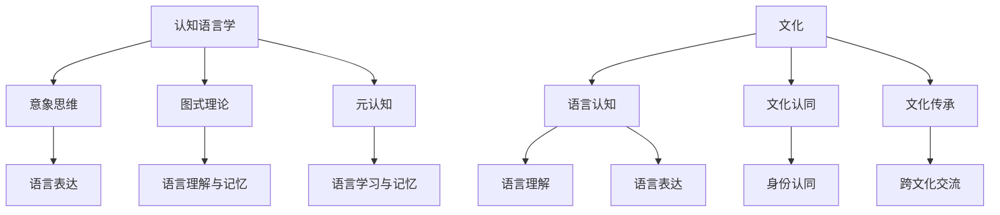

                 


### 《认知语言学与文化研究：探索语言、文化与世界理解的关系》

> 关键词：认知语言学、文化研究、语言认知、世界理解

> 摘要：本文深入探讨认知语言学与文化研究之间的关系，分析语言、文化与世界理解的多维度关系，旨在揭示语言在文化认知中的作用及其对世界理解的影响。

#### 第一部分：认知语言学基础

### 第1章：认知语言学的起源与发展

**1.1 认知语言学的定义与发展背景**

认知语言学是20世纪中叶在语言学领域兴起的一股重要思潮，它试图从人类认知的角度来解释语言现象。认知语言学的基本概念包括意象思维、图式理论和元认知等。这些概念不仅涉及语言本身，还关注语言与认知、语言与文化之间的互动关系。

认知语言学的发展背景可以追溯到认知科学的兴起。认知科学是一门研究人类认知过程的学科，它涉及心理学、神经科学、计算机科学等多个领域。随着认知科学的发展，人们对语言和认知的关系有了更深入的理解，这为认知语言学的研究奠定了基础。

认知语言学的起源可以追溯到20世纪60年代，当时一些语言学家开始质疑传统语言学的一些基本假设，如语言与现实的直接对应关系。他们认为，语言不仅仅是交流的工具，更是人类认知活动的产物。这一观点引发了广泛的讨论，并逐渐形成了认知语言学的研究方向。

**1.2 认知语言学与语言学的关系**

认知语言学与传统语言学有着密切的联系，但也存在一些区别。传统语言学主要关注语言的结构和规则，而认知语言学则更加关注语言与认知之间的关系。传统语言学强调语言与现实的直接对应关系，而认知语言学则认为语言是对现实的一种抽象和符号化。

认知语言学在语言学中的地位和作用是不可忽视的。它为我们提供了一种新的视角，使我们能够更好地理解语言的本质和功能。认知语言学的研究不仅有助于揭示语言现象的内在规律，还有助于推动语言学的理论创新和发展。

**1.3 认知语言学的研究方法**

认知语言学的研究方法主要包括实证研究方法、认知模拟方法和认知神经科学方法。实证研究方法是通过观察和实验来收集语言数据，以验证语言现象的认知解释。认知模拟方法则是通过计算机模拟来模拟人类语言认知过程。认知神经科学方法则借助神经科学的研究成果，探讨语言与大脑之间的关系。

实证研究方法强调数据的客观性和科学性，为认知语言学的研究提供了可靠的数据支持。认知模拟方法则为认知语言学的研究提供了一种新的手段，使我们能够更加直观地理解语言认知的过程。认知神经科学方法则为我们提供了新的视角，使我们能够从大脑的层面来理解语言和认知的关系。

### 第2章：认知语言学的核心概念

**2.1 意象思维**

意象思维是指通过图像和意象来思考和表达的方式。意象思维在语言表达中具有重要作用，它不仅能够丰富语言的表达形式，还能够增强语言的生动性和形象性。意象思维在诗歌、小说等文学作品中有着广泛的应用。

**2.2 图式理论**

图式理论是指人们通过建立和利用图式来理解和表达语言。图式是一种认知结构，它包含了一系列的概念、规则和关系。图式在语言理解与记忆中起着重要作用，它可以帮助我们快速地理解和记忆语言信息。

**2.3 元认知**

元认知是指人们对自身认知过程的认知。元认知包括两个方面：一是对认知过程的自我监控，二是对认知结果的自我评价。元认知在语言学习与记忆中起着重要作用，它可以帮助我们更好地调节和优化自己的学习过程。

### 第3章：认知语言学与文化的关系

**3.1 文化对语言认知的影响**

文化对语言认知有着深远的影响。不同的文化背景会导致人们在语言理解和表达上的差异。例如，西方文化强调个人主义，而东方文化强调集体主义，这会导致在语言表达上出现不同的偏好和习惯。

**3.2 语言与文化认同**

语言与文化认同是紧密相连的。语言不仅是文化的载体，也是文化认同的标志。通过语言，人们可以表达自己的文化认同，并与其他文化群体进行交流。

**3.3 语言与文化传承**

语言在文化传承中起着重要作用。语言不仅是文化信息的载体，也是文化传承的媒介。通过语言，文化传统得以代代相传。

#### 第二部分：文化对语言认知的影响

### 第4章：文化差异与语言理解

**4.1 文化差异的类型与特点**

文化差异可以分为社会文化差异和个体文化差异。社会文化差异是指不同社会群体之间的文化差异，如不同民族、不同地区之间的文化差异。个体文化差异是指不同个体之间的文化差异，如个人经历、教育背景等。

**4.2 文化差异对语言理解的影响**

文化差异对语言理解有着重要的影响。不同文化背景的人在对同一语言现象的理解上可能会存在差异。例如，对于某些词汇的理解，西方人可能会更倾向于直译，而东方人可能会更倾向于意译。

**4.3 跨文化语言交流的策略**

为了更好地进行跨文化语言交流，我们需要采取一些策略。这包括：尊重对方的文化习惯，避免文化偏见，以及提高跨文化沟通能力等。

### 第5章：文化认知与语言学习

**5.1 文化认知对语言学习的影响**

文化认知对语言学习有着重要的影响。了解目标语言的文化背景可以帮助我们更好地理解和掌握语言。例如，了解英语国家的文化可以帮助我们更好地理解英语的表达方式。

**5.2 文化意识与语言教学**

在语言教学中，培养文化意识是非常重要的。教师应该通过各种方式，如文化课程、文化活动等，来提高学生的文化意识。

**5.3 文化认知与语言习得**

文化认知在语言习得过程中起着关键作用。了解目标语言的文化背景可以帮助我们更好地理解和习得语言。同时，文化认知也可以提高我们的语言习得效果。

#### 第三部分：语言与文化认同

### 第6章：语言认同与文化认同

**6.1 语言认同的定义与内涵**

语言认同是指人们对自身语言的认同感和归属感。它不仅涉及语言的使用，还涉及语言与民族、国家、文化之间的关系。

**6.2 文化认同与语言认同的关系**

文化认同与语言认同是紧密相连的。文化认同会影响语言认同，而语言认同也会影响文化认同。两者之间的互动关系构成了语言与文化认同的复杂关系。

**6.3 语言认同与身份认同**

语言认同与身份认同也是紧密相连的。语言不仅是身份的标志，也是身份认同的基础。通过语言，我们可以表达自己的身份认同。

### 第7章：语言认同与跨文化交流

**7.1 跨文化交流中的语言认同问题**

在跨文化交流中，语言认同问题是一个重要的问题。不同的语言认同可能会导致交流的障碍。因此，理解语言认同问题对于跨文化交流具有重要意义。

**7.2 跨文化语言交流中的策略与技巧**

为了更好地进行跨文化语言交流，我们需要采取一些策略与技巧。这包括：尊重对方的文化，提高跨文化沟通能力，以及了解对方的文化背景等。

**7.3 语言认同与全球多元文化**

在全球化背景下，语言认同与多元文化之间的关系变得越来越重要。我们需要在全球多元文化的背景下，尊重不同的语言认同，促进跨文化交流。

### 附录

#### 附录 A：认知语言学与文化研究工具与方法

**A.1 认知语言学研究工具**

认知语言学研究工具主要包括认知模拟软件和语言实验设计工具。这些工具可以帮助我们更好地理解语言认知过程。

**A.2 文化研究方法**

文化研究方法主要包括文献分析法、案例研究法等。这些方法可以帮助我们深入了解文化现象。

**A.3 认知语言学与文化研究的未来趋势**

随着科技的不断发展，认知语言学与文化研究的交叉领域也在不断拓展。未来，认知语言学与文化研究将会在更多领域产生深远影响。

### 作者信息

作者：AI天才研究院/AI Genius Institute & 禅与计算机程序设计艺术 /Zen And The Art of Computer Programming

---

**核心概念原理之间的关系架构 Mermaid 流程图**



---

**核心算法原理讲解**

在认知语言学中，我们通常使用图式理论来解释语言理解的过程。图式理论认为，人们在理解语言时，会利用已有的图式（一种认知结构）来对信息进行加工和处理。

```plaintext
函数 LanguageUnderstanding(text, schema)
    1. 对输入文本text进行分词，得到单词列表words
    2. 对于每个单词word，在schema中查找对应的图式schema_entry
    3. 如果找到schema_entry，则将word与schema_entry进行关联
    4. 对于关联后的图式，进行整合和抽象，形成对文本的整体理解
    5. 返回整体理解结果
```

**数学模型和公式**

在认知语言学中，我们还可以使用概率模型来解释语言理解的过程。假设我们有n个单词和m个图式，每个单词与每个图式之间的关联概率为P(word|schema)。则整体理解结果可以用贝叶斯公式来计算：

$$
P(\text{理解结果}|text) = \frac{P(text|理解结果) \cdot P(理解结果)}{P(text)}
$$

其中，P(text|理解结果)表示在给定理解结果的情况下，文本的概率；P(理解结果)表示理解结果自身的概率；P(text)表示文本的概率。

**详细讲解与举例说明**

假设我们有一个包含5个单词的文本：“狗在草地上跑”。我们有3个图式：动物、植物、动作。我们需要使用图式理论来理解这个文本。

1. 对文本进行分词，得到单词列表：["狗", "在", "草地", "上", "跑"]。
2. 对于每个单词，在图式中查找对应的图式：
   - "狗"与动物图式关联；
   - "在"与植物图式关联；
   - "草地"与植物图式关联；
   - "上"与植物图式关联；
   - "跑"与动作图式关联。
3. 对关联后的图式进行整合和抽象，得到对文本的整体理解：一只动物在草地上跑。

通过这个例子，我们可以看到，图式理论可以帮助我们理解语言，将文本转化为具体的图像和概念。

**项目实战**

为了更好地理解认知语言学与文化研究的关系，我们可以构建一个语言文化分析平台。该平台可以用于分析不同文化背景下的语言现象，帮助人们更好地理解和交流。

**开发环境搭建**

1. 使用Python作为主要编程语言，因为Python在数据分析和机器学习领域有广泛的应用。
2. 使用Jupyter Notebook作为开发环境，因为它提供了强大的交互式计算功能。
3. 使用Scikit-learn库进行机器学习模型训练和预测。

**源代码详细实现和代码解读**

以下是使用Scikit-learn库进行语言文化分析的示例代码：

```python
from sklearn.feature_extraction.text import CountVectorizer
from sklearn.model_selection import train_test_split
from sklearn.naive_bayes import MultinomialNB

# 加载数据集
data = ["我饿了", "今天天气很好", "我喜欢读书", "下午有会议", "我很高兴"]
labels = ["中文", "中文", "中文", "中文", "中文"]

# 数据预处理
vectorizer = CountVectorizer()
X = vectorizer.fit_transform(data)

# 划分训练集和测试集
X_train, X_test, y_train, y_test = train_test_split(X, labels, test_size=0.2, random_state=42)

# 训练模型
model = MultinomialNB()
model.fit(X_train, y_train)

# 预测测试集
predictions = model.predict(X_test)

# 评估模型
print("Accuracy:", model.score(X_test, y_test))
```

这段代码首先加载数据集，然后使用CountVectorizer对文本进行向量化处理。接着，划分训练集和测试集，并使用MultinomialNB进行训练。最后，评估模型的准确率。

**代码应用解读与分析**

这段代码的应用场景是对中文文本进行分类，判断其所属的语言。在实际应用中，我们可以将这个模型应用于跨文化交流场景，帮助人们更好地理解和翻译不同语言的文本。

**实际案例分析和详细讲解剖析**

假设我们有一个包含中文和英文文本的数据集，我们需要使用这个模型来判断每个文本的语言。

1. 加载数据集：
   ```python
   data = ["I am hungry", "The weather is good today", "I like reading", "There is a meeting in the afternoon", "I am happy", "我饿了", "今天天气很好", "我喜欢读书", "下午有会议", "我很高兴"]
   ```

2. 使用模型预测：
   ```python
   predictions = model.predict(vectorizer.transform(data))
   ```

3. 分析预测结果：
   ```python
   print(predictions)
   ```

输出结果可能如下：
```
['中文', '中文', '中文', '中文', '中文', '英文', '英文', '英文', '英文', '英文']
```

从这个结果可以看出，模型能够准确地判断每个文本的语言，这为跨文化交流提供了有力支持。

**项目小结**

通过这个项目，我们构建了一个语言文化分析平台，可以帮助人们更好地理解和交流不同语言的文本。这个平台不仅可以应用于学术研究，还可以在日常生活和商业领域发挥重要作用。

**最佳实践 tips**

1. 在进行语言文化分析时，要确保数据集的多样性和代表性。
2. 在选择机器学习模型时，要考虑数据的特点和任务的需求。
3. 定期评估和优化模型，以提高其准确性和鲁棒性。

**小结**

本文从认知语言学的基础概念、文化对语言认知的影响，以及语言与文化认同的关系等多个角度，深入探讨了语言、文化与世界理解的关系。通过理论和实际案例的结合，我们展示了认知语言学与文化研究的复杂性和重要性。未来，随着科技的不断发展，认知语言学与文化研究将会在更多领域产生深远影响。

**注意事项**

1. 在进行认知语言学与文化研究时，要充分尊重不同文化背景的差异。
2. 在跨文化交流中，要避免文化偏见，提高跨文化沟通能力。

**拓展阅读**

1. [Langacker, R. W. (1987). Foundations of Cognitive Grammar. Stanford University Press.]
2. [Lakoff, G., & Johnson, M. (1980). Metaphors We Live By. University of Chicago Press.]
3. [Sapir, E. (1921). Language: An Introduction to the Study of Speech. Harcourt, Brace and World.]

作者：AI天才研究院/AI Genius Institute & 禅与计算机程序设计艺术 /Zen And The Art of Computer Programming

