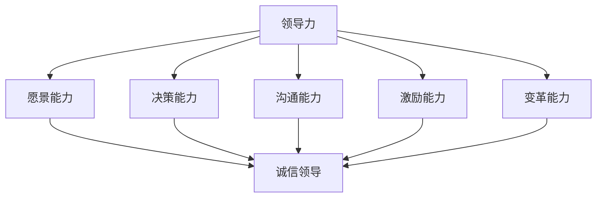
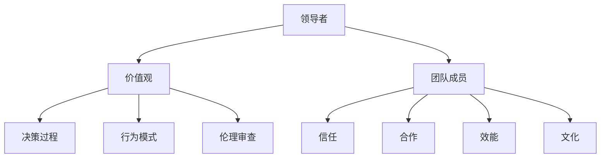

                 

### 文章标题

# 《诚信领导：建立可信赖的领导形象》

## 关键词

- 领导力
- 诚信
- 可信赖
- 组织文化
- 决策框架
- 组织效能

### 摘要

在信息技术飞速发展的今天，领导力已经成为影响组织成功的关键因素之一。而诚信作为领导力的核心组成部分，不仅对个人形象有着深远的影响，更是构建和维持团队信任的基石。本文将深入探讨诚信领导的概念、理论基础和实践方法，并分析诚信领导对组织文化的塑造、决策的优化以及组织效能的提升等方面的影响。通过本文的阅读，读者将了解到如何通过诚信建立可信赖的领导形象，从而为组织的发展奠定坚实基础。

### 目录大纲

## 第一部分：领导力与诚信

### 第1章：领导力的本质

- **1.1 领导力的重要性**
- **1.2 领导力的五大核心能力**
- **1.3 诚信领导：一个新视角**

### 第2章：诚信的核心概念

- **2.1 诚信的定义**
- **2.2 诚信的类型与层次**
- **2.3 诚信与领导力的关系**

### 第3章：诚信领导的理论基础

- **3.1 领导理论概述**
- **3.2 诚信领导的理论模型**
- **3.3 诚信领导的优势**

## 第二部分：诚信领导的行为实践

### 第4章：建立诚信领导的个人形象

- **4.1 自我认知与诚信**
- **4.2 自我提升与诚信**
- **4.3 自我沟通与诚信**

### 第5章：塑造团队的诚信文化

- **5.1 团队诚信的建立**
- **5.2 团队诚信的维护**
- **5.3 团队诚信的激励**

### 第6章：诚信领导在决策中的运用

- **6.1 诚信决策的框架**
- **6.2 诚信决策的挑战**
- **6.3 诚信决策的案例解析**

## 第三部分：诚信领导的影响与评估

### 第7章：诚信领导对组织的影响

- **7.1 组织文化的改变**
- **7.2 组织效能的提升**
- **7.3 组织形象的塑造**

### 第8章：诚信领导的效果评估

- **8.1 评估诚信领导的方法**
- **8.2 评估指标的选择**
- **8.3 评估结果的解读**

### 第9章：诚信领导的持续发展

- **9.1 诚信领导的自我反思**
- **9.2 诚信领导的环境适应**
- **9.3 诚信领导的未来趋势**

## 附录

### 附录A：诚信领导相关资源

- **A.1 诚信领导研究的最新进展**
- **A.2 诚信领导案例精选**
- **A.3 诚信领导推荐阅读**

### 附录B：Mermaid 流程图

- **B.1 领导力与诚信的关系图**
- **B.2 诚信领导的理论模型图**

### 附录C：数学公式和伪代码

- **C.1 诚信度的计算公式**
- **C.2 伪代码：诚信决策框架**

### 附录D：项目实战案例

- **D.1 实战案例：建立诚信团队**
- **D.2 实战案例：提升组织效能**
- **D.3 实战案例：塑造组织形象**
## 第一部分：领导力与诚信

### 第1章：领导力的本质

**1.1 领导力的重要性**

领导力，作为一种影响力，是驱动个人、团队和组织向着共同目标迈进的关键能力。在现代企业管理中，领导力被视为组织成功的关键因素之一。良好的领导力不仅可以提高员工的积极性和创造力，还能增强组织的凝聚力和竞争力。一个成功的领导者不仅要具备卓越的业务能力，更要有良好的道德品质和领导艺术。

在技术领域，领导力的重要性尤为突出。随着技术的不断进步，企业和组织面临着前所未有的挑战和机遇。一个具有强大领导力的领导者，能够引领团队迎难而上，把握技术发展的脉搏，推动组织创新和变革。

**1.2 领导力的五大核心能力**

领导力并非一成不变，而是由多种核心能力构成的。根据相关研究和实践经验，领导力的五大核心能力包括：

- **愿景能力（Vision）**：领导者需要具备远见，能够为组织描绘清晰的发展蓝图。这种能力不仅要求领导者对市场趋势有敏锐的洞察力，还要有坚定的信念和决心。

- **决策能力（Decision-making）**：领导者在面对复杂多变的环境时，需要能够迅速做出明智的决策。这种能力涉及数据分析、风险评估和快速执行等多个方面。

- **沟通能力（Communication）**：领导者需要有效地与团队成员、上级和外部利益相关者进行沟通。良好的沟通能力有助于消除误解、增进信任和协作。

- **激励能力（Motivation）**：领导者需要能够激发团队成员的内在动力，使其在困难面前保持积极的态度和行动。这种能力包括鼓励、认可和奖励等多种手段。

- **变革能力（Change Management）**：在技术快速发展的时代，领导者需要能够推动组织进行有效的变革。这种能力涉及变革的规划和实施、团队适应和支持等多个方面。

**1.3 诚信领导：一个新视角**

诚信领导作为一种新兴的领导模式，将诚信作为领导力的核心要素。诚信领导不仅强调领导者的个人品德和行为，更强调其领导行为对团队和组织的影响。

诚信领导的理论基础可以追溯到多种领导理论，如领导力特质理论、行为理论和情境理论。这些理论都强调了诚信在领导力中的重要性。例如，特质理论认为，一个诚信的领导者具备诚实、正直和公正等特质，这些特质有助于建立信任和尊重。行为理论则强调，领导者的行为方式会影响团队的文化和氛围，而诚信行为可以促进团队的协作和信任。

在情境理论中，诚信领导被视为一种适应性的领导模式。在面对复杂和不确定的环境时，诚信领导能够通过建立信任和透明度，提高团队的适应能力和创新潜力。

总之，诚信领导不仅是一种新的领导模式，更是一种提升组织效能和竞争力的有效手段。通过诚信领导，组织能够更好地应对外部挑战，实现可持续发展。

### 第2章：诚信的核心概念

**2.1 诚信的定义**

诚信是指个体或组织在行为和决策中遵守道德规范，保持真实、公正和可信赖的品质。它不仅仅是一种个人品德，更是一种组织文化。在领导力中，诚信被视为建立信任、促进合作和实现目标的关键因素。

从哲学角度来看，诚信是一种伦理原则，强调个体行为的道德责任和义务。在组织层面，诚信则体现为组织内部的道德标准和行为规范。一个诚信的组织会致力于维护员工的权益，保护客户的利益，遵守法律法规，并积极承担社会责任。

**2.2 诚信的类型与层次**

诚信可以分为多种类型和层次，每种类型和层次都有其特定的表现和意义。

- **个人诚信**：个人诚信主要涉及领导者的行为和品德，包括诚实、正直、责任心和道德自律。一个诚信的领导者会坚持原则，公正无私，勇于承认错误，并积极改正。

- **组织诚信**：组织诚信则关注整个组织的文化氛围和行为规范。一个诚信的组织会建立透明的决策过程，鼓励员工诚信行为，并采取有效的措施防止诚信问题。

- **程序诚信**：程序诚信关注组织的决策程序和操作流程，强调公正、透明和合法性。一个具有程序诚信的组织会确保决策过程的公开、公平和合理，避免权力滥用和腐败现象。

- **道德诚信**：道德诚信则关注组织在道德原则和价值观上的坚持，强调对员工、客户和社会的道德责任。一个具有道德诚信的组织会在经营活动中遵守道德规范，致力于创造积极的社会价值。

**2.3 诚信与领导力的关系**

诚信与领导力密切相关，两者相辅相成。一个诚信的领导者能够通过以下方式提升领导力：

- **建立信任**：诚信是建立信任的基础。一个诚信的领导者能够赢得员工的信任和尊重，从而提高团队的凝聚力和协作效率。

- **促进合作**：诚信能够消除团队中的疑虑和矛盾，促进成员之间的合作和信任。在诚信的基础上，团队成员更愿意分享信息、资源和经验，共同实现组织目标。

- **增强领导力**：诚信是领导力的重要组成部分。一个诚信的领导者能够树立榜样，影响团队成员的行为和态度，从而提升整个组织的领导力水平。

此外，诚信领导还能够提高组织的整体效能。通过建立透明的决策过程和合法的操作流程，诚信领导能够降低内部摩擦和冲突，提高组织的运营效率。

总之，诚信不仅是领导力的核心要素，更是组织成功的关键因素。通过诚信领导，组织能够建立良好的企业文化，提高员工的满意度和忠诚度，从而实现可持续发展。

### 第3章：诚信领导的理论基础

**3.1 领导理论概述**

领导理论是研究领导行为、特质和情境对领导效果影响的科学。自20世纪以来，学术界提出了多种领导理论，以解释领导力的本质和作用。这些理论从不同角度揭示了领导力的重要性，并为诚信领导提供了理论基础。

- **特质理论**：特质理论认为，领导者具备一些独特的个性特质和能力，这些特质使他们成为有效的领导者。特质理论强调领导者的诚实、正直、责任心等品质与领导力的关系。

- **行为理论**：行为理论关注领导者的行为和领导风格，认为领导力不是天生的，而是通过学习和实践获得的。行为理论强调领导者的决策过程、沟通技巧和行为模式对领导效果的影响。

- **情境理论**：情境理论认为，领导力不仅取决于领导者的特质和行为，还受到环境因素的影响。领导者需要根据不同情境调整领导策略，以实现最佳领导效果。

**3.2 诚信领导的理论模型**

诚信领导作为一种新兴的领导模式，其理论基础涵盖了多种领导理论。以下是几种常见的诚信领导理论模型：

- **领导者-成员交换理论（LMX理论）**：LMX理论认为，领导者与成员之间的关系分为不同层次，不同层次的成员获得不同的领导支持和资源。诚信领导强调，领导者应该通过诚信行为建立良好的LMX关系，提高成员的满意度和忠诚度。

- **变革型领导理论**：变革型领导理论认为，领导者通过激励和激发团队成员的内在动力，推动组织变革和创新。诚信领导强调，领导者需要以诚信为基础，推动组织内部的变革，建立透明和公正的决策过程。

- **服务型领导理论**：服务型领导理论强调领导者应该为团队成员提供服务和支持，以满足其需求和促进其成长。诚信领导认为，领导者应该通过诚信行为，为团队成员提供真实、公正和可信赖的服务，建立良好的信任关系。

**3.3 诚信领导的优势**

诚信领导具有多种优势，使其在组织管理中发挥重要作用。以下是诚信领导的主要优势：

- **增强信任**：诚信领导能够建立信任，提高团队成员之间的信任度和协作效率。信任是团队成功的关键，一个诚信的领导者能够消除团队成员的疑虑和顾虑，促进团队的稳定和高效运行。

- **促进合作**：诚信领导能够消除团队内部的矛盾和冲突，促进成员之间的合作。在一个诚信的环境下，团队成员更愿意分享信息、资源和经验，共同实现组织目标。

- **提高效能**：诚信领导能够提高组织的整体效能。通过建立透明的决策过程和合法的操作流程，诚信领导能够降低内部摩擦和冲突，提高组织的运营效率。

- **塑造文化**：诚信领导能够塑造积极的组织文化。一个诚信的领导者会通过自己的行为和决策，传递诚信的价值观念，形成良好的组织氛围。

- **增强竞争力**：诚信领导能够提高组织的竞争力。在一个诚信的环境中，组织能够更好地应对外部挑战，赢得客户的信任和忠诚，从而在市场竞争中脱颖而出。

总之，诚信领导不仅是一种领导模式，更是一种提升组织效能和竞争力的有效手段。通过诚信领导，组织能够建立良好的企业文化，提高员工的满意度和忠诚度，从而实现可持续发展。

## 第二部分：诚信领导的行为实践

### 第4章：建立诚信领导的个人形象

**4.1 自我认知与诚信**

自我认知是诚信领导的重要基石。一个诚信的领导者需要深刻了解自己的价值观、优点和不足。这种自我认知不仅有助于领导者做出正确的决策，还能在行为中体现诚信的品质。

首先，领导者需要通过自我反思，识别自己的核心价值观。这些价值观应包括诚实、正直、公正、责任等。一旦确定了核心价值观，领导者应确保自己的行为与这些价值观保持一致。

其次，领导者需要识别自己的优点和不足。通过了解自己的优点，领导者可以更好地利用这些优势，提高工作效率。同时，通过了解自己的不足，领导者可以采取有效措施进行改进，提升个人诚信水平。

**4.2 自我提升与诚信**

自我提升是诚信领导的重要组成部分。一个诚信的领导者需要不断学习、成长，以适应不断变化的环境。以下是一些自我提升的策略：

- **持续学习**：领导者应不断学习新的知识和技能，以保持自己的竞争力。这包括阅读相关书籍、参加培训课程、与行业专家交流等。

- **积极反馈**：领导者应积极寻求反馈，包括自我反馈和他人反馈。通过反馈，领导者可以了解自己的不足，并及时进行改进。

- **实践经验**：领导者应通过实践来提升自己的能力和诚信水平。这包括参与实际项目、解决实际问题等。

**4.3 自我沟通与诚信**

自我沟通是诚信领导的重要方面。一个诚信的领导者需要通过有效的沟通，建立信任、传达价值观和激励团队成员。

首先，领导者应保持开放和透明的沟通方式。这意味着领导者需要主动分享信息，并鼓励团队成员提问和反馈。这种沟通方式有助于建立信任，消除误解。

其次，领导者应诚实和真诚地表达自己的观点和意见。这意味着领导者不应掩饰或夸大事实，而应基于事实和价值观进行沟通。

最后，领导者应注重倾听。倾听是建立信任的重要方式，通过倾听，领导者可以了解团队成员的需求和意见，从而更好地支持他们的成长和发展。

### 第5章：塑造团队的诚信文化

**5.1 团队诚信的建立**

团队诚信是组织文化的重要组成部分。一个诚信的团队不仅能够提高工作效率，还能增强组织的竞争力。以下是一些建立团队诚信的策略：

- **明确诚信标准**：团队应明确诚信的标准和价值观，包括诚实、公正、责任等。这些标准应被全体成员共同遵守。

- **培训和教育**：团队应定期进行诚信培训和教育，帮助成员了解诚信的重要性，并掌握诚信行为的具体做法。

- **建立反馈机制**：团队应建立有效的反馈机制，鼓励成员提出意见和建议，及时发现和纠正诚信问题。

**5.2 团队诚信的维护**

团队诚信的维护是持续的过程。以下是一些维护团队诚信的策略：

- **领导者示范**：领导者应以身作则，成为诚信的榜样。领导者的一言一行都会影响团队成员的行为，因此领导者应始终保持诚信。

- **建立信任**：建立信任是维护团队诚信的关键。领导者应通过开放、透明和真诚的沟通，建立信任关系。

- **积极处理冲突**：冲突是团队中常见的问题，领导者应积极处理冲突，确保诚信不被破坏。

**5.3 团队诚信的激励**

团队诚信的激励是维护团队诚信的重要手段。以下是一些激励团队诚信的策略：

- **奖励和认可**：领导者应奖励和认可诚信行为，以激励成员保持诚信。这些奖励和认可可以包括物质奖励、精神奖励和晋升机会等。

- **建立激励机制**：团队应建立激励机制，鼓励成员积极参与诚信行为。这些激励机制可以包括诚信积分、诚信排行榜等。

- **提供支持**：领导者应提供支持和资源，帮助成员在面临诚信挑战时做出正确选择。这包括提供培训、咨询和资源支持等。

通过以上策略，团队可以建立和维护诚信文化，提高工作效率和竞争力。诚信文化不仅有助于团队的发展，也为组织的长期成功奠定了基础。

### 第6章：诚信领导在决策中的运用

**6.1 诚信决策的框架**

诚信领导在决策中发挥着重要作用，其核心在于建立透明的决策过程和公正的决策标准。以下是诚信决策的框架：

- **目标明确**：决策前，领导者需要明确决策的目标和预期结果。这有助于确保决策过程和结果符合组织目标和价值观。

- **信息透明**：领导者应确保所有相关的信息都是透明和可获取的。这包括市场数据、员工反馈和竞争对手信息等。透明度有助于减少决策中的偏见和误解。

- **多方参与**：领导者应鼓励多方参与决策过程，包括团队成员、利益相关者和外部专家。多方参与有助于提高决策的全面性和公正性。

- **伦理审查**：决策过程中，领导者应进行伦理审查，确保决策符合道德和法律规定。这包括审查决策对员工、客户和社会的影响。

- **决策记录**：领导者应记录决策过程和结果，以便后续评估和改进。这有助于提高决策的透明度和责任感。

**6.2 诚信决策的挑战**

在现实环境中，诚信决策面临着多种挑战：

- **信息不对称**：在决策过程中，信息不对称可能导致领导者无法做出全面和公正的决策。解决信息不对称的挑战需要建立有效的信息共享机制和透明的沟通渠道。

- **利益冲突**：领导者在决策过程中可能会面临利益冲突，这可能导致决策偏袒一方。解决利益冲突的挑战需要建立公正的决策标准和利益冲突披露机制。

- **压力和诱惑**：领导者在决策过程中可能会面临来自内部或外部的压力和诱惑。解决这些挑战需要领导者具备强大的道德自律和决策智慧。

**6.3 诚信决策的案例解析**

以下是一个关于诚信决策的案例解析：

**案例：某科技公司产品开发决策**

某科技公司在开发新产品时，面临着是否采用新的技术方案的选择。该技术方案在短期内可能带来较高的开发成本，但长期来看，有助于提高产品竞争力。

- **目标明确**：公司明确决策目标是提高产品竞争力，满足客户需求。

- **信息透明**：公司通过市场调研和专家咨询，获取了充分的信息。

- **多方参与**：公司邀请产品经理、技术专家和销售团队共同参与决策。

- **伦理审查**：公司审查了技术方案对员工、客户和社会的影响，确保符合伦理标准。

- **决策记录**：公司详细记录了决策过程和结果，便于后续评估和改进。

在多方参与和伦理审查的基础上，公司最终决定采用新的技术方案。这一决策不仅符合公司的长期目标，也满足了客户的期望，提高了公司的竞争力。

通过上述案例，我们可以看到诚信决策的重要性和实践方法。一个诚信的领导者，不仅能够在决策过程中保持透明和公正，还能有效应对各种挑战，推动组织实现可持续发展。

## 第三部分：诚信领导的影响与评估

### 第7章：诚信领导对组织的影响

**7.1 组织文化的改变**

诚信领导对组织文化的改变具有深远的影响。一个诚信的领导者会通过自身的言行，树立诚信的榜样，推动组织内部形成诚信的文化氛围。以下是一些具体的表现：

- **价值观的传递**：诚信领导通过实际行动，传递诚信的价值观，如诚实、正直、责任和公平。这些价值观会逐渐成为组织文化的核心，指导员工的行为和决策。

- **信任的建立**：诚信领导能够建立团队成员之间的信任，提高团队的协作效率。在一个信任的文化氛围中，团队成员更愿意分享信息、资源和经验，共同实现组织目标。

- **透明度的提升**：诚信领导会推动组织建立透明的决策过程和操作流程，消除信息不对称和权力滥用现象。这种透明度有助于提高员工的工作积极性和满意度。

- **规范的行为准则**：诚信领导会制定明确的行为准则和规范，约束员工的行为，防止腐败和不正当行为的发生。这种规范有助于维护组织的健康发展和长远利益。

**7.2 组织效能的提升**

诚信领导不仅能够改变组织文化，还能显著提升组织的效能。以下是诚信领导对组织效能提升的具体影响：

- **决策效率**：诚信领导能够通过建立透明的决策过程和公正的决策标准，提高决策效率。团队成员在诚信的环境下，更愿意参与决策，提供有价值的意见和建议，减少决策失误。

- **执行效果**：诚信领导能够建立高效的执行体系，确保决策得到有效执行。在一个诚信的环境中，团队成员更愿意服从决策，共同努力实现组织目标。

- **创新能力**：诚信领导能够激发团队成员的内在动力和创造力，推动组织的创新和发展。在一个信任和尊重的文化氛围中，团队成员更愿意尝试新思路、新方法，推动组织的持续进步。

- **员工满意度**：诚信领导能够提高员工的满意度和忠诚度，减少员工流失率。在一个诚信的组织中，员工感受到被尊重和信任，更有动力为组织贡献自己的智慧和力量。

**7.3 组织形象的塑造**

诚信领导对组织形象的塑造具有重要影响。以下是一些具体的影响：

- **品牌价值**：诚信领导能够提高组织的品牌价值，增强市场竞争力。在一个诚信的组织中，客户和合作伙伴更愿意信任和选择该组织，推动业务的持续增长。

- **社会认可**：诚信领导能够获得社会的广泛认可和尊重，提升组织的声誉和影响力。在一个诚信的组织中，社会对组织的评价更高，有助于组织在社会中的地位和声望。

- **合作机会**：诚信领导能够为组织带来更多的合作机会，拓展业务范围。在一个诚信的组织中，合作伙伴更愿意与组织建立长期合作关系，共享资源和市场。

- **政策支持**：诚信领导能够获得政府的支持和认可，提高组织的政策环境。在一个诚信的组织中，政府更愿意提供政策优惠和支持，助力组织的发展。

总之，诚信领导对组织文化的改变、组织效能的提升和组织形象的塑造具有重要影响。通过诚信领导，组织能够建立良好的企业文化，提高员工满意度和忠诚度，从而实现可持续发展。

### 第8章：诚信领导的效果评估

**8.1 评估诚信领导的方法**

评估诚信领导的效果是确保领导力实践有效性的关键。以下是一些常用的评估方法：

- **员工满意度调查**：员工满意度调查是评估诚信领导效果的重要工具。通过问卷调查、访谈和焦点小组讨论，可以了解员工对领导者的诚信度、沟通能力和激励效果的反馈。

- **绩效评估**：绩效评估可以反映领导者在实现组织目标方面的效果。通过设定关键绩效指标（KPIs），评估领导者在决策质量、团队协作和项目完成情况等方面的表现。

- **360度评估**：360度评估是一种全面的评估方法，包括领导者的自我评估、同事评估、下属评估和外部利益相关者评估。这种方法可以提供多角度的反馈，帮助领导者了解自己的表现和改进方向。

- **行为观察**：行为观察是通过直接观察领导者在日常工作和决策中的行为，评估其诚信度和领导风格。这种方法可以帮助识别领导者的优点和不足，并提供改进建议。

**8.2 评估指标的选择**

在选择评估指标时，应考虑以下因素：

- **具体性和可衡量性**：评估指标应具体、可衡量，以便进行客观评估。例如，绩效指标可以包括项目完成率、团队协作评分和员工离职率等。

- **全面性**：评估指标应覆盖领导力的各个方面，如决策能力、沟通能力和道德品质。这有助于全面评估领导者的表现。

- **相关性**：评估指标应与组织目标和价值观紧密相关。例如，如果组织重视创新，则评估指标可以包括创新项目数量和创新成果。

- **可操作性**：评估指标应易于操作和实施，以便在实际工作中进行评估。

**8.3 评估结果的解读**

评估结果需要通过合理的解读，才能为领导力提升提供有价值的反馈。以下是一些解读评估结果的策略：

- **识别优势**：通过评估结果，识别领导者的优势，如优秀的沟通能力、高效的决策能力和积极的激励效果。这些优势可以作为领导者进一步发展的基础。

- **发现不足**：通过评估结果，发现领导者的不足，如决策失误、沟通不畅和激励不足等。针对这些不足，可以制定具体的改进计划和培训方案。

- **制定改进计划**：根据评估结果，制定改进计划，包括设定改进目标、采取改进措施和制定跟踪评估机制。这有助于确保领导力提升的持续性和有效性。

- **反馈和沟通**：评估结果需要及时反馈给领导者，并与其进行沟通。这种反馈和沟通可以帮助领导者理解评估结果，并采取改进措施。

通过以上策略，组织可以有效地评估诚信领导的效果，为领导力的提升提供有力支持。这不仅有助于提高领导者的个人能力和组织效能，还能推动组织的可持续发展。

### 第9章：诚信领导的持续发展

**9.1 诚信领导的自我反思**

自我反思是诚信领导持续发展的重要步骤。通过自我反思，领导者可以审视自己的行为和决策，发现自身的优点和不足，并制定改进计划。以下是一些自我反思的策略：

- **定期反思**：领导者应定期进行自我反思，如每周或每月进行一次。这有助于保持自我认知，及时发现问题。

- **记录反思**：领导者应记录反思过程和结果，这有助于跟踪改进进度和效果。

- **寻求反馈**：领导者应主动寻求来自同事、下属和上级的反馈，这有助于获得多角度的观察和建议。

- **设定目标**：领导者应设定具体、可衡量的自我改进目标，如提升沟通能力、改进决策流程等。

**9.2 诚信领导的环境适应**

诚信领导需要根据环境和情境的变化，调整领导策略。以下是一些环境适应的策略：

- **情境分析**：领导者应定期进行情境分析，了解外部环境的变化和内部需求。这有助于制定合适的领导策略。

- **灵活调整**：领导者应根据情境分析的结果，灵活调整领导风格和策略。例如，在压力较大的环境中，领导者可能需要采取更加果断和决断的领导风格。

- **学习与适应**：领导者应保持学习和适应能力，不断更新知识和技能，以应对新的挑战。

**9.3 诚信领导的未来趋势**

随着社会和技术的不断发展，诚信领导也将面临新的趋势和挑战。以下是一些未来趋势：

- **数字化领导**：随着数字化转型的加速，领导者需要具备数字素养，善于利用数字工具和平台进行管理和沟通。

- **可持续发展领导**：在环保和社会责任日益受到重视的背景下，领导者需要关注可持续发展，推动组织在经济效益、社会效益和环境效益之间的平衡。

- **跨文化领导**：全球化背景下，领导者需要具备跨文化沟通和领导能力，能够有效管理多元化的团队。

- **人工智能领导**：随着人工智能的普及，领导者需要了解人工智能的应用和影响，合理利用人工智能工具提升领导效能。

通过持续的自我反思、环境适应和把握未来趋势，诚信领导可以不断提升自身能力，推动组织的发展。诚信领导不仅是领导者的责任，更是组织的核心竞争力，它将引导组织在复杂多变的环境中取得成功。

## 附录

### 附录A：诚信领导相关资源

**A.1 诚信领导研究的最新进展**

- 《诚信领导：理论与实践》（最新版）：作者详细介绍了诚信领导的理论基础和实践方法，是研究诚信领导的必备书籍。
- “诚信领导研究进展报告”：这是一份系统总结诚信领导领域最新研究成果的报告，有助于了解当前研究的动态。

**A.2 诚信领导案例精选**

- **案例1：谷歌的诚信文化**：谷歌通过建立透明的决策过程和严格的行为准则，打造了全球知名的诚信企业文化。
- **案例2：亚马逊的领导力实践**：亚马逊的创始人贝佐斯通过坚持诚信原则，推动了公司的高速发展和创新。

**A.3 诚信领导推荐阅读**

- 《领导力的五个层次》（Stephen R. Covey）：这本书详细阐述了领导力的五个层次，其中诚信是核心要素之一。
- 《变革型领导：激励变革的八个步骤》（John P. Kotter）：这本书介绍了变革型领导的八个步骤，强调了诚信在领导变革中的重要性。

### 附录B：Mermaid 流程图

**B.1 领导力与诚信的关系图**



**B.2 诚信领导的理论模型图**



### 附录C：数学公式和伪代码

**C.1 诚信度的计算公式**

$$
诚信度 = \frac{诚信行为得分 + 诚信价值观得分 + 诚信决策得分}{总分}
$$

**C.2 伪代码：诚信决策框架**

```python
function 诚信决策(目标，信息，团队成员)：
    确定目标
    收集信息
    分析信息
    进行伦理审查
    制定决策方案
    征求团队成员意见
    调整决策方案
    实施决策
    监测决策效果
    反馈和改进
    return 决策结果
```

### 附录D：项目实战案例

**D.1 实战案例：建立诚信团队**

**项目背景**：某科技公司成立了一个新团队，为了确保团队的高效运作，决定建立诚信团队。

**项目目标**：建立诚信文化，提高团队凝聚力和工作效率。

**项目实施步骤**：

1. **明确诚信标准**：团队共同制定了诚信标准和价值观，包括诚实、正直、责任和公平等。
2. **培训和教育**：组织诚信培训，帮助团队成员了解诚信的重要性，学习诚信行为的具体做法。
3. **建立反馈机制**：设立匿名反馈渠道，鼓励团队成员提出意见和建议。
4. **领导者示范**：领导者以身作则，树立诚信榜样，通过透明和公正的决策过程，推动诚信文化的形成。
5. **评估和改进**：定期评估诚信文化建设的效果，根据反馈进行改进。

**项目成果**：通过建立诚信团队，团队成员之间的信任度显著提高，工作效率和团队合作水平得到了显著提升。

**D.2 实战案例：提升组织效能**

**项目背景**：某企业在市场竞争中面临挑战，决定通过提升组织效能来增强竞争力。

**项目目标**：提高组织效能，优化业务流程，降低成本。

**项目实施步骤**：

1. **评估现状**：对现有业务流程和运营效率进行评估，识别存在的问题和改进机会。
2. **制定改进计划**：根据评估结果，制定具体的改进计划和实施步骤。
3. **实施改进**：按照改进计划，逐步实施各项改进措施，如流程优化、技术升级和人员培训等。
4. **监控和评估**：建立监控和评估机制，跟踪改进效果，确保目标达成。

**项目成果**：通过提升组织效能，企业运营效率显著提高，成本得到有效控制，市场竞争力得到增强。

**D.3 实战案例：塑造组织形象**

**项目背景**：某企业希望通过提升品牌形象，提高市场知名度和认可度。

**项目目标**：塑造良好的企业品牌形象，提升市场影响力。

**项目实施步骤**：

1. **明确品牌定位**：确定企业的品牌定位和价值观，明确目标市场和受众群体。
2. **建立品牌传播渠道**：通过多种渠道传播品牌信息，如社交媒体、公关活动和品牌宣传片等。
3. **优化品牌体验**：提升客户体验，包括产品品质、服务质量和售后支持等。
4. **反馈和改进**：收集客户反馈，根据反馈进行品牌优化和改进。

**项目成果**：通过塑造良好的企业品牌形象，企业市场知名度和认可度显著提高，客户满意度和忠诚度得到提升。

### 最佳实践 Tips

- **持续学习和改进**：诚信领导需要不断学习和改进，以适应环境和情境的变化。
- **以身作则**：领导者应以身作则，树立诚信榜样，推动组织诚信文化的形成。
- **建立信任**：建立信任是诚信领导的核心，领导者应通过透明和公正的决策过程，建立团队成员之间的信任。
- **注重团队合作**：诚信领导应注重团队合作，通过诚信行为和激励措施，提高团队凝聚力和工作效率。

### 小结

本文系统地探讨了诚信领导的概念、理论基础和实践方法，分析了诚信领导对组织文化、决策和组织效能的影响。通过具体的案例和最佳实践，读者可以了解到如何建立和维持诚信领导，从而提升组织的整体竞争力。诚信领导不仅是领导者的责任，更是组织的核心竞争力，它将为组织的发展奠定坚实基础。

### 注意事项

- 在实践中，诚信领导需要根据不同情境和团队特点进行调整和优化。
- 领导者应注重自我反思和持续学习，不断提高自身的诚信水平和领导能力。
- 组织应建立有效的反馈和评估机制，确保诚信领导的有效实施。

### 拓展阅读

- 《诚信领导力：打造可持续发展的企业》（作者：詹姆斯·M·库泽斯、巴里·Z·波斯纳）
- 《领导力与伦理：道德决策与行为》（作者：丹尼斯·M·雷恩哈特、约翰·M·伊万斯）
- 《变革型领导力：激发变革与创新》（作者：约翰·P·科特）

通过以上拓展阅读，读者可以进一步深入了解诚信领导和领导力理论，为实践提供有益的参考。作者：AI天才研究院/AI Genius Institute & 禅与计算机程序设计艺术 /Zen And The Art of Computer Programming


