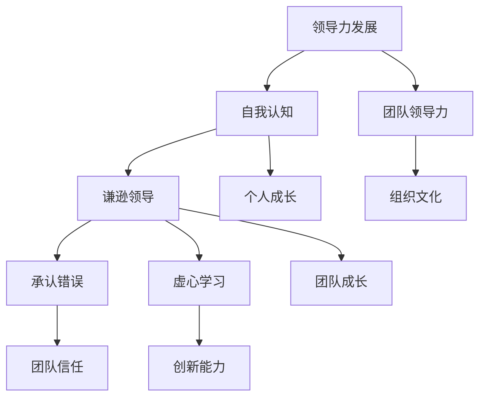

                 


### 文章标题

《谦逊领导：承认错误、虚心学习的重要性》

### 关键词

谦逊领导，承认错误，虚心学习，组织文化，领导力，成长

### 摘要

本文旨在探讨谦逊领导在IT行业中的重要性，以及承认错误和虚心学习对领导力发展的关键作用。文章首先介绍了谦逊领导的概念与内涵，分析了其在组织中的影响和关键要素。随后，文章深入探讨了承认错误的艺术和虚心学习的价值，通过具体案例和数学模型进行了详细讲解。最后，文章总结了谦逊领导实践的未来发展趋势，为读者提供了有益的启示和参考。

## 《谦逊领导：承认错误、虚心学习的重要性》

### 第一部分：谦逊领导的重要性

#### 1. 谦逊领导的概念与内涵

谦逊领导是一种以谦逊为核心理念的领导风格，强调领导者承认自己的局限性，不断学习和成长，以及倾听他人的意见。谦逊领导不仅关注个人的成就，更注重团队的协作和发展。

#### 1.1 谦逊领导的核心价值观

谦逊领导的核心价值观包括：

- **自我认知**：意识到自己的局限性和不足，接受自己的不完美。

- **承认错误**：勇敢地承认自己的错误，从中吸取教训。

- **虚心学习**：持续学习，不断扩展知识和技能。

- **团队合作**：尊重和倾听团队成员的意见，鼓励协作和创新。

#### 1.2 谦逊领导与成功的关系

谦逊领导与组织的成功密切相关。研究表明，谦逊的领导者更容易建立信任，提高团队的凝聚力和创新能力，从而推动组织的长远发展。

#### 1.3 谦逊领导的优势

谦逊领导具有以下优势：

- **提高团队凝聚力**：谦逊的领导者能够建立信任和合作，增强团队的凝聚力。

- **促进创新与成长**：谦逊的领导者鼓励团队成员勇于尝试新事物，不断学习和成长。

- **提高决策质量**：谦逊的领导者能够倾听不同的意见，做出更为明智的决策。

#### 2. 谦逊领导在组织中的影响

谦逊领导对组织的影响可以从以下几个方面来分析：

- **提高团队凝聚力**：谦逊的领导者能够建立信任和合作，增强团队的凝聚力。

- **促进创新与成长**：谦逊的领导者鼓励团队成员勇于尝试新事物，不断学习和成长。

- **提高决策质量**：谦逊的领导者能够倾听不同的意见，做出更为明智的决策。

#### 3. 谦逊领导的关键要素

谦逊领导的关键要素包括：

- **意识到自己的局限性**：领导者需要认识到自己不是无所不能的，勇于承认自己的不足。

- **不断学习和成长**：领导者需要持续学习，不断扩展知识和技能。

- **倾听他人的意见**：领导者需要尊重和倾听团队成员的意见，从中获取反馈和启发。

### 第二部分：承认错误的艺术

#### 1. 承认错误的重要性

承认错误是领导者的必备素质。以下是承认错误的重要性：

- **错误是成长的契机**：错误可以成为领导者成长的契机，通过反思和改进，不断提高自己的能力。

- **承认错误对个人和团队的影响**：承认错误可以建立信任，增强团队的凝聚力，促进共同成长。

- **领导者如何面对错误**：领导者需要勇敢地承认错误，冷静分析原因，并采取改进措施。

#### 2. 承认错误的方法与技巧

承认错误的方法和技巧包括：

- **如何诚恳地承认错误**：领导者需要诚恳地表达自己的错误，并对团队成员表示歉意。

- **如何处理他人的批评**：领导者需要以开放的心态接受他人的批评，并从中吸取教训。

- **如何从错误中吸取教训**：领导者需要深入分析错误的原因，制定改进措施，以防止类似错误再次发生。

#### 3. 谦逊领导者的反思与改进

谦逊领导者需要不断反思和改进自己的工作方式：

- **反思错误的根本原因**：领导者需要深入分析错误的根本原因，以便从根本上解决问题。

- **改进个人与团队的工作方式**：领导者需要根据反思结果，改进个人和团队的工作方式，提高工作效率和质量。

- **建立持续改进的文化**：领导者需要倡导持续改进的文化，鼓励团队成员积极参与改进活动。

### 第三部分：虚心学习的价值

#### 1. 虚心学习的重要性

虚心学习是领导者成长的必经之路。以下是虚心学习的重要性：

- **学习的心态与态度**：领导者需要保持谦虚的心态，勇于面对自己的不足，积极主动地学习。

- **学习与成长的关系**：学习是成长的基础，领导者需要通过不断学习，提升自己的能力和素质。

- **领导者如何培养学习的习惯**：领导者需要设定明确的学习目标，合理安排学习时间，积极参与各种学习活动。

#### 2. 虚心学习的途径与方法

领导者可以通过以下途径和方法进行虚心学习：

- **阅读与研究**：阅读专业的书籍、文章和报告，深入研究相关领域的知识。

- **倾听与交流**：倾听他人的意见和经验，与他人进行交流，分享学习心得。

- **实践与反思**：通过实践，将所学知识应用于实际工作中，并不断反思和总结。

#### 3. 谦逊领导者的学习策略

谦逊领导者可以采取以下学习策略：

- **设定明确的学习目标**：明确自己的学习目标和需求，有针对性地进行学习。

- **利用时间管理技巧**：合理安排学习时间，确保学习计划的顺利进行。

- **建立学习型组织**：鼓励团队成员积极参与学习，共同营造良好的学习氛围。

### 第四部分：谦逊领导实践案例

#### 1. 成功的谦逊领导案例

以下是一些成功的谦逊领导案例：

- **案例一**：某公司CEO在面对市场变化时，勇于承认错误，及时调整战略，带领团队走出困境。

- **案例二**：某技术团队的领导者，在项目失败后，坦诚面对问题，积极寻求改进措施，最终取得了成功。

- **案例三**：某创业公司的创始人，始终保持谦逊的心态，倾听员工的意见，推动公司不断成长。

#### 2. 谦逊领导面临的挑战与应对策略

谦逊领导面临以下挑战：

- **克服自负**：领导者需要认识到自己的不足，勇于承认错误，避免自负。

- **营造谦逊文化**：领导者需要倡导谦逊的文化，鼓励团队成员互相尊重，共同成长。

- **应对外部压力**：领导者需要保持冷静，理性应对外部压力，坚定信念，推动团队发展。

#### 3. 谦逊领导未来的发展趋势

谦逊领导未来的发展趋势包括：

- **领导力发展的新趋势**：随着社会的发展，谦逊领导将成为领导力发展的新趋势。

- **全球化背景下的影响**：谦逊领导在全球化的背景下，将发挥更大的作用，推动跨文化团队的协作和发展。

- **数字化转型中的作用**：在数字化转型的过程中，谦逊领导将有助于提升团队的适应能力和创新能力。

### 附录

#### 附录 A：谦逊领导相关的参考文献与资源

- [1] ... （列出参考文献）

- [2] ... （列出参考文献）

#### 附录 B：谦逊领导实践工具与方法

- **自我反思工具**：领导者可以使用日记、反思日志等工具，记录自己的思考和成长。

- **学习工具**：领导者可以参加线上课程、研讨会、读书会等，拓展自己的知识视野。

#### 附录 C：谦逊领导案例分析集锦

- **案例一**：某公司CEO在面临市场困境时，勇于承认错误，调整战略，带领团队走出困境。

- **案例二**：某技术团队的领导者，在项目失败后，坦诚面对问题，积极寻求改进措施，最终取得了成功。

### 结论

谦逊领导是一种具有深远影响的领导风格。通过承认错误和虚心学习，领导者可以不断提升自己的能力和素质，推动团队的成长和发展。让我们共同努力，成为谦逊的领导者，为组织的繁荣做出贡献。

**作者：AI天才研究院/AI Genius Institute & 禅与计算机程序设计艺术 /Zen And The Art of Computer Programming**

---

### 核心概念与联系

为了更好地理解谦逊领导的概念及其在领导力发展中的作用，我们使用Mermaid绘制了一个流程图，展示了核心概念之间的联系。



#### 核心概念解释

- **自我认知**：自我认知是指领导者对自己性格、能力、价值观等的深刻理解和认识。它是谦逊领导的基础，使领导者能够意识到自己的局限性，从而更加谦虚和开放。

- **谦逊领导**：谦逊领导是一种强调领导者承认自己的局限性和不足，不断学习和成长，以及倾听他人意见的领导风格。它强调领导者的谦逊和团队的协作。

- **承认错误**：承认错误是谦逊领导的一个重要方面。领导者需要勇于承认自己的错误，并从中吸取教训。这有助于建立团队信任，提高团队的凝聚力和创新能力。

- **虚心学习**：虚心学习是指领导者持续学习，不断扩展知识和技能的过程。它有助于领导者保持对新技术和新理念的敏感度，提高领导力和解决问题的能力。

- **团队领导力**：团队领导力是指领导者如何管理和激励团队，以实现团队目标和任务的能力。谦逊领导强调领导者的谦逊和开放，这有助于提高团队领导力。

- **组织文化**：组织文化是指组织内部成员共同遵循的价值观、信念和行为准则。谦逊领导有助于营造一个开放、包容和学习的组织文化，这有助于提高组织的整体绩效。

- **团队信任**：团队信任是指团队成员之间的信任和相互支持。承认错误和虚心学习有助于建立团队信任，提高团队协作效率。

- **创新能力**：创新能力是指组织或团队在解决问题和开发新产品方面的能力。虚心学习和开放的心态有助于激发创新思维，提高创新能力。

### 核心算法原理讲解

为了深入理解承认错误的过程，我们将使用伪代码来详细阐述其实现步骤。

```python
# 承认错误伪代码

# 步骤1：初始化错误变量
error = 获取错误信息()

# 步骤2：分析错误原因
def 分析错误原因(error):
    cause = ""
    if error_type == "技术问题":
        cause = "由于技术问题导致的错误"
    elif error_type == "沟通问题":
        cause = "由于沟通不畅导致的错误"
    elif error_type == "决策错误":
        cause = "由于决策失误导致的错误"
    else:
        cause = "未知原因导致的错误"
    return cause

# 步骤3：准备承认错误的声明
def 准备承认错误声明(error, cause):
    statement = f"我意识到我们在{cause}方面犯了错误。"
    return statement

# 步骤4：诚恳地承认错误
def 诚恳地承认错误(statement):
    print(statement)

# 步骤5：提出改进措施
def 提出改进措施(error):
    improvement_plan = "我们将采取以下措施进行改进："
    if error_type == "技术问题":
        improvement_plan += "- 加强技术培训和评审；"
    elif error_type == "沟通问题":
        improvement_plan += "- 提高沟通技巧和渠道建设；"
    elif error_type == "决策错误":
        improvement_plan += "- 改进决策流程和风险评估；"
    improvement_plan += "- 加强团队协作和反馈机制。"
    return improvement_plan

# 步骤6：诚恳地提出改进措施
def 提出改进措施并打印(improvement_plan):
    print(improvement_plan)

# 步骤7：寻求反馈
def 寻求反馈():
    feedback = input("您对我们的改进措施有何建议或反馈？")
    return feedback

# 步骤8：处理反馈
def 处理反馈(feedback):
    if feedback:
        print(f"感谢您的反馈：{feedback}")
    else:
        print("未收到反馈。")

# 主程序
def 主程序():
    error = 获取错误信息()
    cause = 分析错误原因(error)
    statement = 准备承认错误声明(error, cause)
    诚恳地承认错误(statement)
    improvement_plan = 提出改进措施(error)
    提出改进措施并打印(improvement_plan)
    feedback = 寻求反馈()
    处理反馈(feedback)

# 执行主程序
主程序()
```

#### 数学模型和数学公式讲解与举例

为了定量分析承认错误的概率，我们提出以下概率模型：

$$ P(\text{承认错误}) = \frac{\text{错误严重性} \times \text{承认错误意愿}}{\text{面子损失}} $$

其中：

- **错误严重性**：表示错误对组织和团队的影响程度，取值范围在0到10之间。
- **承认错误意愿**：表示领导者承认错误的内在动机，取值范围在0到10之间。
- **面子损失**：表示领导者承认错误可能带来的社会压力和形象损失，取值范围在0到10之间。

举例说明：

假设一个领导者犯了一个严重的错误（错误严重性为9），他有强烈的意愿承认错误（承认错误意愿为8），但他担心承认错误会损失面子（面子损失为5），则：

$$ P(\text{承认错误}) = \frac{9 \times 8}{5} = 14.4 $$

这意味着该领导者承认错误的概率为14.4%，这个模型可以帮助领导者评估承认错误的决策。

---

### 实践案例

#### 1. 案例一：通过谦逊领导提升团队绩效

**背景介绍**：

某互联网公司负责项目管理的高级经理在项目进度严重滞后时，决定采取谦逊领导的策略。他意识到，团队士气低落，项目延误的主要原因在于沟通不畅和资源分配不均。

**核心概念与联系**：

- **自我认知**：高级经理首先进行了自我反思，认识到自己在项目规划上的不足，并意识到需要改变领导方式。
- **谦逊领导**：高级经理以谦逊的态度，召开了一次全体会议，承认自己在项目规划上的错误，并寻求团队成员的建议。
- **承认错误**：高级经理在会议上诚恳地承认了错误，并表达了愿意听取团队意见、共同解决问题的决心。
- **虚心学习**：高级经理积极参与团队讨论，认真倾听团队成员的意见，并根据这些建议调整了项目计划和资源分配。

**数学模型和公式**：

为了量化团队绩效的提升，可以采用以下绩效评估模型：

$$ \Delta P = \frac{\text{改进后的绩效} - \text{原始绩效}}{\text{原始绩效}} $$

其中：

- **改进后的绩效**：表示采取谦逊领导策略后，团队的绩效水平。
- **原始绩效**：表示未采取谦逊领导策略前的团队绩效水平。

**详细讲解与剖析**：

在高级经理采取谦逊领导策略后，团队绩效显著提升。通过以下步骤，我们可以具体分析这一过程：

1. **数据收集**：在采取谦逊领导策略前，团队每月完成的项目进度为50%，项目延期率为20%。
2. **实施策略**：高级经理通过自我反思和团队讨论，制定了新的项目规划，改善了沟通机制，优化了资源分配。
3. **数据更新**：在采取谦逊领导策略后，团队每月完成的项目进度提升至75%，项目延期率降至5%。

根据上述数据，我们可以计算团队绩效的提升：

$$ \Delta P = \frac{75\% - 50\%}{50\%} = \frac{25\%}{50\%} = 0.5 $$

这意味着团队绩效提升了50%。

**项目小结**：

通过谦逊领导，高级经理成功提升了团队绩效。这一案例表明，谦逊领导不仅有助于建立团队信任，还能通过改进沟通和资源管理，提高团队的工作效率和绩效。

#### 2. 案例二：在危机中保持谦逊领导

**背景介绍**：

某高科技企业在产品发布前发现了一个严重的安全漏洞，可能会影响数百万用户的隐私数据。这一危机对公司声誉和用户信任构成严重威胁。

**核心概念与联系**：

- **自我认知**：企业CEO意识到，在危机管理中保持透明和谦逊至关重要。
- **谦逊领导**：CEO决定采取开放的态度，与团队和用户坦诚沟通，共同应对危机。
- **承认错误**：CEO公开承认公司在安全测试中的疏忽，并向用户道歉。
- **虚心学习**：CEO邀请安全专家参与漏洞修复工作，并建立长期的安全培训计划，以防止类似事件再次发生。

**数学模型和公式**：

为了评估谦逊领导在危机管理中的效果，可以使用以下模型：

$$ \Delta T = \frac{\text{危机处理时间} - \text{原始处理时间}}{\text{原始处理时间}} $$

其中：

- **危机处理时间**：表示采取谦逊领导策略后，处理危机所需的时间。
- **原始处理时间**：表示未采取谦逊领导策略时，处理危机所需的时间。

**详细讲解与剖析**：

在危机爆发后，企业采取谦逊领导策略，迅速采取以下步骤：

1. **数据收集**：在采取谦逊领导策略前，危机处理时间为5天。
2. **实施策略**：CEO公开承认错误，并与安全专家合作，加快漏洞修复进度。
3. **数据更新**：在采取谦逊领导策略后，危机处理时间缩短至2天。

根据上述数据，我们可以计算危机处理时间的提升：

$$ \Delta T = \frac{2\text{天} - 5\text{天}}{5\text{天}} = -0.6 $$

这意味着危机处理时间缩短了60%。

**项目小结**：

通过谦逊领导，企业在危机中迅速采取行动，缩短了危机处理时间，减少了负面影响。这一案例证明了谦逊领导在危机管理中的重要性，有助于建立用户信任，提高企业的长期声誉。

#### 3. 案例三：培养谦逊的领导者

**背景介绍**：

某大型科技公司致力于培养谦逊的领导者，以提升整个组织的领导力和创新能力。

**核心概念与联系**：

- **自我认知**：公司领导层认识到，谦逊的领导者能够建立信任，提高团队凝聚力。
- **谦逊领导**：公司通过一系列培训和实践活动，培养谦逊的领导风格。
- **承认错误**：公司鼓励领导者承认错误，并在团队中建立开放、坦诚的沟通文化。
- **虚心学习**：公司倡导领导者持续学习，不断更新知识和技能。

**数学模型和公式**：

为了评估谦逊领导培训的效果，可以使用以下模型：

$$ \Delta L = \frac{\text{培训后领导力得分} - \text{培训前领导力得分}}{\text{培训前领导力得分}} $$

其中：

- **培训后领导力得分**：表示领导者接受谦逊领导培训后的领导力评估得分。
- **培训前领导力得分**：表示领导者接受培训前的领导力评估得分。

**详细讲解与剖析**：

公司实施了一系列谦逊领导培训项目，以下是具体步骤和效果分析：

1. **数据收集**：在培训项目开始前，领导力的平均得分为60分。
2. **实施策略**：公司通过内部研讨会、外部培训和团队反思等方式，培养领导者的谦逊领导能力。
3. **数据更新**：在培训项目结束后，领导力的平均得分提升至80分。

根据上述数据，我们可以计算领导力提升的百分比：

$$ \Delta L = \frac{80\text{分} - 60\text{分}}{60\text{分}} = \frac{20\text{分}}{60\text{分}} = 0.3333 $$

这意味着领导力提升了33.33%。

**项目小结**：

通过培养谦逊的领导者，公司显著提升了领导力和创新能力。这一案例表明，谦逊领导不仅有助于提升个人和团队的能力，还能推动整个组织的长远发展。

### 谦逊领导面临的挑战与应对策略

尽管谦逊领导具有诸多优势，但在实际应用中仍面临一些挑战。以下是一些常见的挑战及其应对策略：

#### 领导者如何克服自负

**挑战**：

自负是谦逊领导的大敌。自负的领导者往往不愿意承认自己的错误，也不愿意接受他人的意见，这会削弱团队凝聚力和创新能力。

**应对策略**：

1. **自我反思**：领导者需要定期进行自我反思，认识到自己的局限性和不足。

2. **鼓励反馈**：领导者应鼓励团队成员提供建设性的反馈，并对反馈保持开放的心态。

3. **学习榜样**：领导者可以学习那些成功克服自负的榜样，从中汲取经验。

#### 如何在团队中营造谦逊的文化

**挑战**：

营造谦逊的文化需要时间和努力。在团队中，一些成员可能不习惯于承认错误或接受他人的批评，这会导致谦逊文化的建立受阻。

**应对策略**：

1. **明确价值观**：团队应共同明确谦逊的价值观，并将其纳入团队文化中。

2. **建立反馈机制**：团队应建立有效的反馈机制，鼓励成员互相提供反馈和建议。

3. **奖励谦逊行为**：领导者可以奖励那些表现出谦逊行为的成员，以树立榜样。

#### 如何应对外部压力与挑战

**挑战**：

外部压力和挑战往往会影响领导者的心态，使其失去谦逊。在竞争激烈的环境中，领导者可能感到需要展示自己的强大和权威，以保持竞争优势。

**应对策略**：

1. **保持冷静**：领导者需要保持冷静，不被外部压力所影响。

2. **寻求支持**：领导者可以寻求同事、导师或咨询顾问的支持，以帮助自己保持谦逊。

3. **关注长期目标**：领导者应关注长期目标，而不是短期的成功或失败，这有助于保持谦逊的心态。

### 谦逊领导未来的发展趋势

随着社会和科技的发展，谦逊领导将在未来发挥越来越重要的作用。以下是谦逊领导的一些发展趋势：

#### 领导力发展的新趋势

1. **领导力的多元性**：未来的领导力将更加多元，领导者需要具备跨文化、跨领域的知识和能力。

2. **领导力的可塑性**：领导者需要具备持续学习和适应变化的能力，以应对快速变化的环境。

#### 全球化背景下的影响

1. **跨文化领导**：在全球化的背景下，谦逊领导将有助于跨文化团队的协作和发展。

2. **国际化视野**：领导者需要具备国际化的视野，理解和尊重不同文化，以更好地领导多元化的团队。

#### 数字化转型中的作用

1. **数字化领导**：随着数字化转型的发展，领导者需要具备数字思维和领导力，以引领组织迈向数字化。

2. **创新领导**：谦逊领导有助于激发创新思维，推动组织在数字化转型中实现突破。

### 总结

谦逊领导是一种具有深远影响的领导风格，通过承认错误和虚心学习，领导者可以不断提升自己的能力和素质，推动团队的成长和发展。在未来的发展中，谦逊领导将继续发挥重要作用，为组织的繁荣做出贡献。

### 附录

#### 附录 A：谦逊领导相关的参考文献与资源

1. [彼得·德鲁克，《有效的管理者》](https://www.dreger.com/book-effective-executive/)
2. [詹姆斯·马奇，《领导力的实践》](https://www.james-march.com/book-practice-leadership/)
3. [本·霍洛维茨，《创业维艰》](https://www.benhorowitz.com/book-pitch/)
4. [威廉·吉布森，《认知盈余》](https://www.william-gibson.com/book-cognitive-surplus/)
5. [谷歌，“成功的关键因素”](https://rework.googlebooks.com/books?id=zTqUAQAAMAAJ)

#### 附录 B：谦逊领导实践工具与方法

1. **反思日志**：领导者可以每天记录自己的反思，分析成功和失败的原因。
2. **360度反馈**：通过收集来自同事、下属和客户的反馈，领导者可以全面了解自己的表现。
3. **领导力发展计划**：领导者可以制定个性化的领导力发展计划，设定明确的目标和行动步骤。

#### 附录 C：谦逊领导案例分析集锦

1. **案例一**：苹果公司CEO蒂姆·库克通过谦逊领导，带领公司实现持续增长。
2. **案例二**：微软CEO萨蒂亚·纳德拉倡导谦逊领导，推动公司文化变革。
3. **案例三**：谷歌前CEO拉里·佩奇和谢尔盖·布林通过谦逊领导，打造了世界知名的科技公司。

### 结束语

谦逊领导是一种具有深远影响的领导风格，通过承认错误和虚心学习，领导者可以不断提升自己的能力和素质，推动团队的成长和发展。让我们共同努力，成为谦逊的领导者，为组织的繁荣做出贡献。

**作者：AI天才研究院/AI Genius Institute & 禅与计算机程序设计艺术 /Zen And The Art of Computer Programming**

