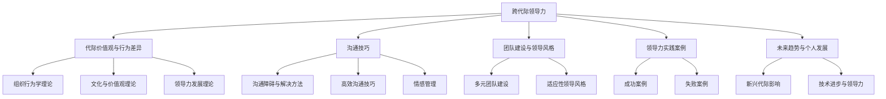

                 

# 跨代际领导力：bridging the generational gap

## 关键词

- 跨代际领导力
- 代际价值观差异
- 沟通技巧
- 团队建设
- 领导力发展

## 摘要

在当今多元化社会中，跨代际领导力已成为企业成功的关键因素。不同代际间的价值观和行为差异，为领导者在管理团队、推动组织发展带来了挑战。本文将从跨代际领导力的概念、理论基础、沟通技巧、实践应用及个人发展等多个角度，探讨如何有效运用跨代际领导力，实现组织内部的和谐共处与持续成长。

## 第一部分：跨代际领导力概述

### 第1章：跨代际领导力的概念与重要性

#### 1.1 跨代际领导力的定义与背景

跨代际领导力是指在不同代际之间进行有效沟通、协作和管理的领导能力。随着全球化、信息化和多元化的加剧，组织内部代际差异愈发明显，跨代际领导力的重要性愈发凸显。

#### 1.2 不同代际的价值观与行为差异

传统代际（如婴儿潮一代）和新兴代际（如Z世代）在价值观、工作态度、职业规划等方面存在显著差异。了解这些差异，有助于领导者更好地应对跨代际挑战。

#### 1.3 跨代际领导力的关键能力

跨代际领导力要求领导者具备以下关键能力：

1. **有效沟通技巧**：理解不同代际的沟通风格，提高跨代际沟通效率。
2. **协作与团队管理**：构建多元团队，促进代际间的合作与共赢。
3. **变革管理与适应性**：引导组织适应时代变迁，实现持续发展。

### 第2章：跨代际领导力的理论基础

#### 2.1 组织行为学理论

组织行为学理论关注组织内部个体和群体的行为，探讨代际差异对组织行为的影响。

#### 2.2 文化与价值观理论

文化与价值观理论强调组织文化的构建和传承，对跨代际领导力具有重要意义。

#### 2.3 领导力发展理论

领导力发展理论从不同阶段分析领导者的成长路径，为跨代际领导力的培养提供理论支持。

## 第二部分：跨代际沟通技巧

### 第3章：理解代际差异

#### 3.1 代际心理学分析

代际成长环境对价值观的影响，导致不同代际在心理特征上的差异。

#### 3.2 代际价值观差异的识别与应对

通过价值观的多样性分析，了解不同代际的价值观差异，掌握沟通中的价值观融合技巧。

### 第4章：跨代际沟通策略

#### 4.1 沟通障碍与解决方法

分析跨代际沟通中的障碍，提出提高沟通效果的策略。

#### 4.2 高效沟通技巧

主动倾听与反馈，非语言沟通的重要性，提升跨代际沟通效果。

#### 4.3 跨代际对话中的情感管理

处理冲突与分歧，建立信任与共识，加强跨代际对话的情感管理。

## 第三部分：跨代际领导力的实践应用

### 第5章：跨代际团队建设

#### 5.1 建立多元团队

分析多元团队的优点与挑战，提出跨代际团队的建设策略。

#### 5.2 团队领导风格与适应性

探讨针对不同代际成员的领导风格，以及团队领导者的适应性调整。

### 第6章：跨代际领导力实践案例

#### 6.1 成功的跨代际领导力实践

分析成功案例中的关键要素，学习跨代际领导力的实践经验。

#### 6.2 失败的跨代际领导力案例分析

分析失败案例中的问题与教训，避免跨代际领导力实践中的常见错误。

### 第7章：跨代际领导力的未来趋势

#### 7.1 新兴代际的影响

探讨新兴代际的崛起与工作方式，及其对组织文化的影响。

#### 7.2 技术进步与跨代际领导力

分析技术进步对领导力需求的变化，探讨利用技术提升跨代际领导效率的方法。

## 第四部分：跨代际领导力的个人发展

### 第8章：领导力自我评估与发展

#### 8.1 领导力自我评估

了解个人领导风格，识别个人优势和改进点。

#### 8.2 领导力自我提升方法

不断学习与适应，培养跨代际沟通与领导力技巧。

### 第9章：跨代际领导力的持续发展

#### 9.1 跨代际领导力的成长路径

分析领导力发展的不同阶段，制定持续发展的策略。

#### 9.2 跨代际领导力的影响力

探讨领导者的影响力与影响力提升，个人品牌建设与职业发展。

## 附录

### 附录A：跨代际领导力相关资源

推荐跨代际领导力相关书籍、学术论文与研究报告、培训课程与研讨会。

---

作者：AI天才研究院/AI Genius Institute & 禅与计算机程序设计艺术 /Zen And The Art of Computer Programming

（注：以上内容为Markdown格式，实际撰写时请根据需求进行扩展和细化。）在撰写技术博客文章时，可以按照以下步骤进行推理和逻辑展开：

### 1. 引言

- **问题陈述**：简要介绍跨代际领导力的背景和现实意义。
- **目的说明**：阐述文章的目的，即探讨如何实现有效的跨代际领导。

### 2. 跨代际领导力的定义与背景

- **定义**：明确跨代际领导力的概念和定义。
- **背景**：分析不同代际间的差异和领导力在组织中的重要性。

### 3. 不同代际的价值观与行为差异

- **代际分析**：通过比较不同代际（如婴儿潮一代、X一代、Y一代和Z世代）的价值观、态度和行为，解释差异的原因。
- **影响分析**：探讨这些差异如何影响领导力和团队管理。

### 4. 跨代际领导力的理论基础

- **组织行为学**：介绍组织行为学中关于代际差异的理论，如社会化理论、冲突理论和变革理论。
- **文化与价值观理论**：探讨跨文化背景下的领导力和价值观的构建。
- **领导力发展理论**：分析不同领导力发展阶段的代际特点。

### 5. 跨代际沟通技巧

- **沟通障碍**：识别跨代际沟通中可能出现的障碍，如语言差异、文化冲突等。
- **解决方法**：提出提高跨代际沟通效率的策略，如主动倾听、开放心态和适应性沟通。

### 6. 跨代际领导力的实践应用

- **团队建设**：探讨如何在团队中建立跨代际合作，提高团队绩效。
- **领导风格**：分析不同领导风格如何适应不同代际的员工。

### 7. 跨代际领导力实践案例

- **成功案例**：分析成功跨代际领导力实践的关键因素。
- **失败案例**：探讨跨代际领导力实践中的常见错误和教训。

### 8. 跨代际领导力的未来趋势

- **新兴代际影响**：探讨新兴代际（如Z世代和未来世代）对领导力的需求。
- **技术进步**：分析技术进步如何影响跨代际领导力的发展。

### 9. 跨代际领导力的个人发展

- **自我评估**：介绍领导者如何评估自己的跨代际领导力。
- **持续发展**：提供持续提升跨代际领导力的方法和策略。

### 10. 结论

- **总结**：回顾文章的核心观点和结论。
- **呼吁行动**：鼓励读者采取实际行动，提升自己的跨代际领导力。

### 11. 附录

- **资源推荐**：提供相关的书籍、学术论文、培训课程等资源。

在撰写过程中，确保每个部分的内容都是具体、详细和有实际价值的。以下是一个简单的Mermaid流程图示例，用于展示跨代际领导力的核心概念关系：

### 12. 作者信息

在文章末尾，加入作者信息，以示专业性和权威性。

---

作者：AI天才研究院/AI Genius Institute & 禅与计算机程序设计艺术 /Zen And The Art of Computer Programming

通过上述步骤，您可以根据具体需求和主题，逐步构建一篇高质量的技术博客文章。在每个步骤中，都要确保逻辑清晰、内容丰富，并通过具体的实例和数据来支持您的观点。这样的文章不仅能够帮助读者理解跨代际领导力的概念，还能提供实用的指导和建议。

