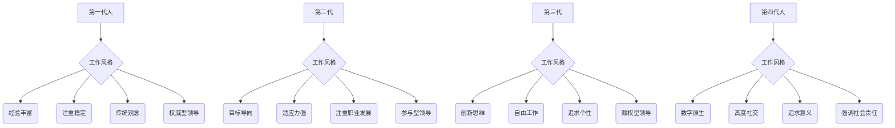

                 

### 文章标题：跨代际领导：管理多元化年龄结构的团队

#### 关键词：跨代际领导、多元化年龄结构、团队管理、代际文化差异、领导策略

#### 摘要：
本文将深入探讨跨代际领导在多元化年龄结构团队管理中的应用。通过对不同代际文化差异的分析，揭示沟通障碍及其解决策略，提出适应性的领导风格和员工管理策略。本文旨在为IT领域中的领导者提供一套系统化的跨代际领导框架，以促进团队协作和员工满意度，提升组织整体绩效。

----------------------------------------------------------------

### 目录大纲

#### 目录大纲

## 跨代际领导：管理多元化年龄结构的团队

### 第一部分：代际文化差异与理解

### 第二部分：跨代际领导策略

### 第三部分：跨代际领导实践

### 附录

#### 附录 A：跨代际领导资源推荐

#### 附录 B：代际特征与工作风格Mermaid流程图

----------------------------------------------------------------

### 引言

在当今快速发展的信息技术行业，团队成员的年龄结构日益多元化，不同代际之间的文化差异和工作风格成为团队管理中不可忽视的挑战。这一现象不仅反映了社会整体老龄化趋势的影响，也是企业为适应不断变化的市场需求和人才竞争而做出的调整。因此，如何有效地进行跨代际领导，成为每个IT领导者亟待解决的问题。

本文旨在深入探讨跨代际领导在多元化年龄结构团队管理中的应用。首先，我们将对代际文化差异进行概述，分析不同代际的特征与工作风格，帮助领导者更好地理解和适应团队成员。接着，本文将重点探讨代际沟通障碍及其解决策略，提出适应性的领导风格和员工管理策略，以提升团队协作和员工满意度。最后，通过实际案例分析和成功实践，总结跨代际领导的最佳策略和注意事项。

本文结构分为三大部分：第一部分是代际文化差异与理解，包括代际分类与特征、沟通障碍与解决策略；第二部分是跨代际领导策略，包括领导风格与适应、代际员工管理、代际冲突处理；第三部分是跨代际领导实践，包括团队建设、领导能力提升、案例分析。希望通过本文的探讨，能够为IT领域的领导者提供一套系统化的跨代际领导框架，助力团队高效协作和持续发展。

### 第一部分：代际文化差异与理解

#### 第1章：代际文化概述

在探讨跨代际领导之前，我们有必要对代际文化差异进行一个全面的概述。代际文化是指由于年龄差异而形成的不同文化特征，包括价值观、工作态度、沟通方式等方面。不同的代际在成长背景、社会环境和文化传统上存在显著差异，这些差异直接影响着团队成员的工作行为和工作效果。

#### 1.1 代际分类与特征

为了更好地理解代际文化差异，我们可以根据年龄范围将团队成员分为以下几个代际：

##### 1.1.1 第一代人的特征与工作风格

第一代人的年龄通常在50岁以上，他们是在二战后成长起来的一代。这一代人经历了社会和经济的大变革，往往具有以下特征：

1. **经验丰富**：第一代人在职业生涯中积累了丰富的经验和专业知识，这使得他们在面对复杂问题时能够提供宝贵的见解和解决方案。
2. **注重稳定**：由于成长经历的影响，第一代人对稳定性和安全感有较高的需求。因此，他们在工作中追求稳定性和长期承诺。
3. **传统观念**：第一代人往往信奉传统价值观，如忠诚、责任感、勤奋等，这些价值观对他们的工作态度和行为产生深远影响。
4. **权威型领导**：第一代人对权威型领导风格较为接受，他们认为领导者应当具有决策权和指导责任。

##### 1.1.2 第二代人的特征与工作风格

第二代人的年龄通常在40-50岁之间，他们是婴儿潮一代。这一代人经历了信息技术的快速发展，具有以下特征：

1. **目标导向**：第二代人在职业生涯中注重目标设定和实现，他们习惯于在短时间内取得成果。
2. **适应力强**：由于生活和工作环境的不断变化，第二代人对变化和不确定性有较强的适应能力。
3. **注重职业发展**：第二代人注重个人职业发展，他们愿意为了实现职业目标而不断学习和成长。
4. **参与型领导**：第二代人倾向于参与型领导风格，他们期望与领导者保持开放、平等和合作的关系。

##### 1.1.3 第三代人的特征与工作风格

第三代人的年龄通常在30-40岁之间，他们是X一代。这一代人是在经济衰退和互联网浪潮中成长起来的，具有以下特征：

1. **创新思维**：第三代人习惯于用创新和创造性的方式解决问题，他们不满足于传统的做法，总是寻求更好的解决方案。
2. **自由工作**：第三代人追求自由和灵活的工作环境，他们倾向于远程工作和自主安排工作时间。
3. **追求个性**：第三代人强调个性化和自我实现，他们希望在工作和生活中找到自己的价值和意义。
4. **赋权型领导**：第三代人倾向于赋权型领导风格，他们期望领导者能够给予他们足够的自主权和决策权。

##### 1.1.4 第四代人的特征与工作风格

第四代人的年龄通常在30岁以下，他们是Y一代和Z一代。这一代人是在数字化和全球化环境中成长起来的，具有以下特征：

1. **数字原生**：第四代人对数字技术和社交媒体有天然的亲和力，他们习惯于通过互联网获取信息和沟通。
2. **高度社交**：第四代人注重社交和合作，他们倾向于通过团队协作和社交网络解决问题。
3. **追求意义**：第四代人对工作的意义有较高的追求，他们希望工作能够对个人和社会产生积极影响。
4. **强调社会责任**：第四代人对社会责任有较强的意识，他们倾向于参与社会公益活动和环保活动。

#### 1.2 代际分类与特征关系架构 Mermaid 流程图

为了更好地展示不同代际的特征和工作风格，我们可以使用Mermaid流程图来构建一个关系架构：

通过上述关系架构，我们可以清晰地看到不同代际在工作风格上的特征及其差异。这为跨代际领导提供了重要的理论基础，有助于领导者更好地理解和管理多元化年龄结构的团队。

### 第一部分：代际文化差异与理解

#### 第2章：代际沟通障碍与解决策略

在多元化年龄结构的团队中，不同代际之间的沟通障碍是影响团队协作和效率的重要因素。代际差异导致价值观、工作态度和沟通方式的差异，这些差异如果不加以妥善处理，可能会导致误解、冲突甚至团队分裂。因此，了解和分析代际沟通障碍，并制定有效的解决策略，对于跨代际领导至关重要。

#### 2.1 沟通障碍分析

##### 2.1.1 沟通方式差异

不同代际在沟通方式上存在显著差异。第一代人在沟通时更倾向于直接和简洁，他们通常喜欢通过面对面交流来解决问题。而第二代人和第三代人则更习惯于通过电子邮件、即时通讯工具和视频会议进行沟通。第四代人则对社交媒体和即时通讯有强烈的偏好，他们更倾向于通过这些渠道进行信息交换和协作。

##### 2.1.2 信息接受与反馈差异

在信息接受和反馈方面，不同代际也存在差异。第一代人对信息的接受通常较为谨慎，他们习惯于经过深思熟虑后做出决策。第二代人和第三代人则对信息的接受更为迅速，他们倾向于快速采取行动。第四代人则对信息的接受有较高的选择性，他们倾向于关注与自己价值观和兴趣相关的内容。

在反馈方面，第一代人和第二代人通常希望得到具体和详细的反馈，他们认为这有助于改进工作和提升能力。第三代人和第四代人则更希望得到鼓励和认可，他们认为这有助于增强自信心和动力。

##### 2.1.3 语言风格差异

不同代际在语言风格上也有所不同。第一代人和第二代人通常使用正式和专业的语言，他们在沟通时注重逻辑性和条理性。第三代人和第四代人则更倾向于使用非正式和轻松的语言，他们在沟通时更注重互动和情感交流。

#### 2.2 沟通策略

为了克服代际沟通障碍，领导者可以采取以下策略：

##### 2.2.1 倾听与尊重

倾听是有效沟通的基础。领导者应该尊重每个代际成员的观点和意见，耐心倾听他们的表达。通过倾听，领导者可以更好地理解团队成员的需求和期望，从而制定更合适的沟通策略。

##### 2.2.2 跨代际沟通技巧

领导者需要掌握跨代际沟通技巧，以适应不同代际成员的沟通偏好。例如，在与第一代人和第二代人沟通时，领导者可以采用更正式和结构化的方式；而在与第三代人和第四代人沟通时，领导者可以采用更非正式和互动的方式。

##### 2.2.3 避免误解与冲突

为了避免误解和冲突，领导者需要确保信息的准确传递和理解的共识。在沟通时，领导者可以采用明确的语言和具体的例子来阐述问题，并鼓励团队成员提出问题和反馈。此外，领导者还可以定期组织团队会议，确保团队成员之间的沟通是开放和透明的。

#### 2.3 实际案例分析

为了更好地说明沟通策略的有效性，以下是一个实际案例：

在一个多元化的IT团队中，团队成员包括第一代、第二代和第三代人。由于沟通方式上的差异，团队内部经常出现误解和冲突。例如，在一次项目讨论中，第一代团队成员提出了一些具体的技术问题，但第三代团队成员认为这些问题过于琐碎，没有立即回应。这导致第一代团队成员感到不被重视，进而影响了团队协作。

为了解决这一问题，团队领导者采取了一系列措施：

1. **倾听与尊重**：领导者首先与第一代团队成员进行了深入沟通，了解他们的关切和期望。同时，领导者也向第三代团队成员强调了第一代团队成员的经验和贡献。
2. **跨代际沟通技巧**：在随后的团队会议中，领导者采用了更正式和结构化的方式，确保每个团队成员都有机会表达自己的观点。同时，领导者也鼓励第三代团队成员使用具体例子来解释他们的想法，以便第一代团队成员更容易理解。
3. **避免误解与冲突**：领导者还定期组织团队会议，确保团队成员之间的沟通是开放和透明的。在会议中，领导者鼓励团队成员积极提问和反馈，以确保每个成员都能理解项目的进展和目标。

通过这些措施，团队内部的沟通障碍得到了显著改善。团队成员之间的误解和冲突减少了，团队协作和效率得到了提升。这一案例表明，通过有效的沟通策略，跨代际领导可以克服沟通障碍，促进团队的高效运作。

#### 2.4 结论

代际沟通障碍是多元化年龄结构团队管理中不可忽视的问题。通过倾听与尊重、跨代际沟通技巧和避免误解与冲突，领导者可以有效地克服这些障碍，促进团队协作和效率。在未来的实践中，领导者应该继续探索和优化沟通策略，以应对不断变化的代际文化差异。

### 第二部分：跨代际领导策略

#### 第3章：领导风格与适应

在跨代际领导中，领导风格的选择和适应至关重要。不同代际成员对于领导风格有着不同的偏好和期望，因此领导者需要灵活调整自己的领导风格，以满足团队的需求。本章节将探讨领导风格的理论、适应策略以及如何提高领导者的适应性。

#### 3.1 领导风格理论

领导风格是指领导者在与团队成员互动过程中所采用的基本方式和态度。不同的领导风格对于团队绩效和员工满意度有着不同的影响。以下是三种常见的领导风格理论：

##### 3.1.1 权威型领导风格

权威型领导风格是指领导者通过明确的规定和指令来指导团队成员的工作。这种风格强调领导者的决策权和控制力，适用于需要快速执行和严格纪律的情境。权威型领导风格适用于第一代人和第二代成员，因为他们更倾向于遵循明确的指导和规定。

权威型领导风格的优点包括：

1. **决策迅速**：领导者能够迅速做出决策，确保项目按计划进行。
2. **纪律严明**：团队成员明确知道自己的职责和期望，减少了工作上的混乱和冲突。

缺点包括：

1. **缺乏灵活性**：团队成员的自主性和创造性可能会受到限制。
2. **缺乏沟通**：团队成员可能感到被忽视，缺乏参与感和归属感。

##### 3.1.2 参与型领导风格

参与型领导风格是指领导者鼓励团队成员参与决策和项目管理，强调团队合作和共同目标。这种风格适用于第二代和第三代成员，因为他们更注重参与感和个人职业发展。

参与型领导风格的优点包括：

1. **增强参与感**：团队成员感到被重视和参与，有助于提高工作满意度。
2. **提高创新性**：团队成员的参与和反馈可以带来更多的创新思维和解决方案。

缺点包括：

1. **决策缓慢**：需要更多的时间进行讨论和协商，可能影响项目的进度。
2. **沟通成本高**：团队成员之间的沟通和协调需要投入更多的时间和精力。

##### 3.1.3 赋权型领导风格

赋权型领导风格是指领导者将权力和责任赋予团队成员，鼓励他们自主决策和解决问题。这种风格适用于第三代和第四代成员，因为他们追求自由和自我实现。

赋权型领导风格的优点包括：

1. **提高自主性**：团队成员拥有更多的自主权，能够更自由地发挥自己的能力和创造力。
2. **促进成长**：团队成员在自主解决问题的过程中能够获得更多的成长和经验。

缺点包括：

1. **管理难度大**：领导者需要花费更多的时间和精力来监控和指导团队成员的工作。
2. **风险增加**：团队成员的自主决策可能会带来一定的风险，需要领导者进行有效的风险管理和监督。

#### 3.2 领导风格适应策略

为了在跨代际团队中有效地领导，领导者需要根据团队成员的代际特征和需求，灵活调整自己的领导风格。以下是一些适应策略：

##### 3.2.1 确定团队代际分布

首先，领导者需要了解团队成员的代际分布，明确每个代际成员在团队中的比例和角色。这有助于领导者更好地理解团队的文化背景和工作风格，从而制定相应的领导策略。

##### 3.2.2 调整领导风格

根据团队中不同代际成员的特点和需求，领导者可以采取以下策略调整领导风格：

1. **针对第一代成员**：采用权威型领导风格，提供明确的指导和规定，确保他们能够遵循和执行。
2. **针对第二代成员**：采用参与型领导风格，鼓励他们参与决策和项目管理，提高他们的参与感和满意度。
3. **针对第三代成员**：采用赋权型领导风格，赋予他们更多的自主权和责任，激发他们的创造力和主动性。
4. **针对第四代成员**：采用更开放和互动的领导风格，鼓励他们自由表达观点和参与讨论，满足他们对自由和个性化的需求。

##### 3.2.3 提高领导者的适应性

领导者需要不断提高自己的适应性，以应对不断变化的代际特征和团队需求。以下是一些提高领导者适应性的建议：

1. **持续学习**：领导者需要不断学习新的领导理论和实践，了解不同代际的特点和需求，以便更好地适应团队的变化。
2. **开放心态**：领导者应保持开放的心态，接受不同代际的观点和意见，鼓励团队成员积极参与和表达。
3. **灵活调整**：领导者应根据团队的具体情况和需求，灵活调整领导策略，确保团队的高效运作。
4. **积极反馈**：领导者应积极反馈团队成员的工作表现和反馈，鼓励他们提出改进建议，促进团队的持续成长。

#### 3.3 实际案例分析

以下是一个实际案例，展示了如何根据团队代际分布调整领导风格：

在一个IT团队中，团队成员包括第一代、第二代和第三代成员。团队领导者意识到不同代际成员的需求和特点，因此采取了以下策略调整领导风格：

1. **针对第一代成员**：领导者采用权威型领导风格，为他们提供详细的指导和规定，确保项目按照计划进行。领导者定期与第一代成员进行面对面的沟通，了解他们的工作进展和需求。
2. **针对第二代成员**：领导者采用参与型领导风格，鼓励他们参与项目决策和项目管理，提高他们的参与感和满意度。领导者定期组织团队会议，讨论项目的进展和问题，并鼓励第二代成员提出建议和解决方案。
3. **针对第三代成员**：领导者采用赋权型领导风格，赋予他们更多的自主权和责任，鼓励他们自由表达观点和参与讨论。领导者为第三代成员提供更多的自主安排工作的时间和空间，鼓励他们发挥创造力和主动性。

通过这些策略，团队领导者成功地适应了不同代际成员的需求和特点，提高了团队的整体绩效和员工满意度。这个案例表明，跨代际领导的关键在于领导者能够灵活调整自己的领导风格，以满足团队的不同需求和期望。

#### 3.4 结论

跨代际领导要求领导者根据不同代际成员的特点和需求，灵活调整领导风格。通过理解领导风格的理论，掌握适应策略，并提高领导者的适应性，领导者可以更好地管理多元化年龄结构的团队，促进团队的高效运作和持续发展。

### 第二部分：跨代际领导策略

#### 第4章：代际员工管理

在多元化年龄结构的团队中，代际员工管理是一个重要的挑战，也是实现团队高效运作的关键。不同代际员工在职业需求、工作环境和职业发展方面存在显著差异，领导者需要制定针对性的管理策略，以满足不同代际员工的需求，提高员工满意度和团队绩效。本章将探讨代际员工需求分析、管理策略以及如何实施这些策略。

#### 4.1 代际员工需求分析

##### 4.1.1 工作环境需求

不同代际员工对工作环境的需求存在差异。第一代员工通常更注重稳定和安全感，他们期望在工作环境中能够获得长期的职业保障。因此，领导者应该提供稳定的工作环境和明确的职业发展路径，以满足他们的需求。

第二代员工则更加注重灵活性和自主性，他们希望在工作环境中能够有更多的自由和灵活性。领导者可以提供远程工作、弹性工作时间等灵活的工作安排，以满足第二代员工的需求。

第三代员工追求创新和自由，他们希望在富有挑战性和创造性工作环境中发挥自己的才华。领导者应该鼓励创新思维，提供开放和自由的工作氛围，支持员工参与项目和创新活动。

第四代员工则更加关注工作与生活的平衡，他们期望在工作环境中能够实现工作与生活的平衡。领导者可以提供员工福利和灵活的工作制度，如家庭友好政策、带薪休假等，以帮助员工实现工作与生活的平衡。

##### 4.1.2 职业发展需求

不同代际员工对职业发展的需求也存在差异。第一代员工通常更注重职业稳定性和长期发展，他们期望能够在职业生涯中获得稳定的工作机会和晋升空间。领导者应该为第一代员工提供明确的职业规划和晋升路径，确保他们的职业发展得到支持。

第二代员工则更加注重职业发展和个人成长，他们期望在工作中能够不断学习和提升自己的能力。领导者可以提供培训和学习机会，支持员工参加外部培训和认证，以满足他们的职业发展需求。

第三代员工追求职业多样性和个人成就，他们期望在工作中能够实现自我价值和成就感。领导者应该鼓励员工尝试不同的项目和任务，提供多样化的职业发展机会，支持员工的个人成就和职业规划。

第四代员工则更加关注职业意义和社会影响，他们期望工作能够对个人和社会产生积极的影响。领导者可以提供社会公益活动、志愿服务等机会，帮助员工实现职业意义和社会价值的平衡。

##### 4.1.3 工作生活平衡需求

不同代际员工对工作生活平衡的需求也存在差异。第一代员工通常由于家庭责任和经济压力，更注重工作与家庭生活的平衡。领导者应该提供家庭友好政策，如弹性工作时间、家庭照顾假期等，以帮助员工平衡工作与家庭生活。

第二代员工则更加关注个人兴趣和生活质量，他们希望在职业生涯中能够有更多的时间去追求个人爱好和兴趣。领导者可以提供灵活的工作安排和休假制度，以满足第二代员工的工作生活平衡需求。

第三代员工追求自由和自我实现，他们希望在职业生涯中能够有更多的时间去探索自己的兴趣和潜力。领导者可以提供远程工作和自主安排工作时间的政策，以支持第三代员工实现工作与个人发展的平衡。

第四代员工则更加关注工作与生活的平衡，他们希望在职业生涯中能够实现个人成长和全面发展的目标。领导者可以提供多样化的福利和培训项目，如健身课程、心理健康支持等，以帮助员工实现工作与生活的平衡。

#### 4.2 管理策略

##### 4.2.1 激励策略

为了满足不同代际员工的需求，领导者可以采取以下激励策略：

1. **个性化激励**：领导者应根据员工的不同特点和需求，提供个性化的激励措施。例如，对于第一代员工，可以提供长期的职业发展机会和稳定的薪酬福利；对于第二代员工，可以提供培训和学习机会，支持他们的职业发展；对于第三代员工，可以提供创新项目和自主工作的机会，激发他们的创造力和成就感；对于第四代员工，可以提供多样化的福利和培训项目，支持他们的个人成长和全面发展的目标。

2. **认可与奖励**：领导者应定期对员工的贡献进行认可和奖励，以增强员工的积极性和归属感。例如，可以设立年度优秀员工奖、最佳创新奖等，对员工的优秀表现进行表彰和奖励。

3. **职业发展机会**：领导者应为员工提供明确的职业发展路径和晋升机会，支持员工的职业发展。例如，可以设立内部职位晋升机制、提供外部培训和进修机会等。

##### 4.2.2 培训与发展策略

为了满足不同代际员工的需求，领导者可以采取以下培训与发展策略：

1. **技能培训**：针对不同代际员工的技能需求，提供针对性的技能培训。例如，对于第一代员工，可以提供传统的技术技能培训；对于第二代员工，可以提供现代化的技术培训；对于第三代员工，可以提供创新思维和项目管理培训；对于第四代员工，可以提供数字化技能和领导力培训。

2. **领导力培养**：领导者应关注不同代际员工的领导力培养，提供领导力培训和晋升机会。例如，可以设立领导力发展计划，为有潜力的员工提供领导力培训和实践机会。

3. **职业规划**：领导者应与员工进行定期职业规划讨论，帮助员工制定清晰的职业发展目标，并提供相应的支持和指导。

##### 4.2.3 薪酬与福利策略

为了满足不同代际员工的需求，领导者可以采取以下薪酬与福利策略：

1. **多元化薪酬体系**：根据不同代际员工的特点和需求，设计多元化的薪酬体系。例如，可以采用基本工资、绩效奖金、股票期权等多种形式的薪酬。

2. **福利多样化**：提供多样化的员工福利，如医疗保险、养老保险、带薪休假、家庭友好政策等，以满足不同代际员工的需求。

3. **灵活福利制度**：允许员工根据个人需求和偏好选择福利项目，提高员工的满意度和参与度。

#### 4.3 实施策略

##### 4.3.1 确定员工需求

领导者应通过调查问卷、员工反馈会议等方式，了解不同代际员工的具体需求和期望。这有助于领导者制定针对性的管理策略，确保员工的需求得到满足。

##### 4.3.2 制定实施计划

根据员工需求，领导者应制定详细的实施计划，明确管理策略的执行步骤和责任人。实施计划应包括激励策略、培训与发展策略、薪酬与福利策略的具体措施和时间表。

##### 4.3.3 监控与反馈

领导者应定期监控管理策略的实施效果，通过员工满意度调查、绩效评估等方式收集反馈信息。根据反馈信息，领导者应及时调整和优化管理策略，确保员工需求得到持续满足。

#### 4.4 实际案例分析

以下是一个实际案例，展示了如何实施代际员工管理策略：

在一个IT公司中，团队成员包括第一代、第二代、第三代和第四代员工。为了满足不同代际员工的需求，公司采取了以下管理策略：

1. **个性化激励**：公司为第一代员工提供长期稳定的职业发展机会和晋升路径；为第二代员工提供培训和晋升机会，支持他们的职业发展；为第三代员工提供创新项目和自主工作的机会，激发他们的创造力和成就感；为第四代员工提供多样化的福利和培训项目，支持他们的个人成长和全面发展的目标。

2. **认可与奖励**：公司设立年度优秀员工奖、最佳创新奖等，对员工的优秀表现进行表彰和奖励。

3. **职业发展机会**：公司设立领导力发展计划，为有潜力的员工提供领导力培训和实践机会。

4. **技能培训**：公司提供针对性的技能培训，满足不同代际员工的技能需求。

5. **领导力培养**：公司关注不同代际员工的领导力培养，提供领导力培训和晋升机会。

6. **薪酬与福利策略**：公司采用多元化的薪酬体系，满足不同代际员工的需求；提供多样化的员工福利，如医疗保险、养老保险、带薪休假、家庭友好政策等。

通过实施这些管理策略，公司成功满足了不同代际员工的需求，提高了员工满意度和团队绩效。这个案例表明，通过针对性的管理策略，企业可以更好地管理多元化年龄结构的团队，实现持续发展和成功。

#### 4.5 结论

代际员工管理是多元化年龄结构团队管理的重要组成部分。通过分析不同代际员工的需求，制定针对性的管理策略，并实施有效的激励、培训和发展策略，领导者可以满足不同代际员工的需求，提高员工满意度和团队绩效。在未来的实践中，领导者应继续关注不同代际员工的需求变化，不断优化管理策略，以实现团队的长期发展和成功。

### 第二部分：跨代际领导策略

#### 第5章：代际冲突处理

在多元化年龄结构的团队中，代际冲突是不可避免的。代际冲突不仅会影响团队的协作效率和员工满意度，还可能导致团队分裂和组织绩效下降。因此，有效地处理代际冲突对于跨代际领导至关重要。本章将探讨代际冲突的原因及其处理策略。

#### 5.1 冲突原因分析

##### 5.1.1 工作理念冲突

不同代际在工作理念上存在差异，这些差异可能导致冲突。例如，第一代员工可能更倾向于传统的稳定和忠诚，而第三代员工可能更追求创新和个人成就。这种理念上的差异可能导致他们在对待工作、任务分配和目标设定方面产生分歧。

##### 5.1.2 文化差异冲突

文化差异是导致代际冲突的重要原因。不同代际在价值观、沟通方式和生活习惯上存在显著差异。例如，第一代员工可能更倾向于权威型领导风格，而第三代员工可能更倾向于参与型和赋权型领导风格。这些文化差异可能导致沟通不畅、合作困难和工作效率低下。

##### 5.1.3 职业发展冲突

职业发展需求也是导致代际冲突的一个重要因素。不同代际员工对职业发展的期望和需求存在差异。例如，第一代员工可能更注重职业稳定性和长期发展，而第三代员工可能更追求职业多样性和个人成就。这种差异可能导致他们在职业规划、晋升机会和薪酬福利方面的冲突。

#### 5.2 处理策略

##### 5.2.1 预防冲突

预防冲突是处理代际冲突的有效策略。以下是一些预防冲突的方法：

1. **增强沟通**：建立开放的沟通渠道，鼓励团队成员表达自己的观点和意见。通过定期的团队会议、工作坊和培训，提高团队成员之间的沟通和理解。

2. **培养文化意识**：组织文化培训，帮助团队成员了解不同代际的文化差异和价值观。通过文化意识培养，减少误解和偏见，促进团队内部的和谐。

3. **明确目标和期望**：明确团队目标和每个成员的期望，确保团队成员对项目的目标、任务和职责有清晰的认识。这有助于减少因目标不明确导致的冲突。

##### 5.2.2 调解冲突

当冲突发生时，领导者需要采取积极的调解策略。以下是一些有效的调解策略：

1. **倾听和理解**：领导者应主动倾听冲突双方的立场和需求，理解他们的观点和情感。通过倾听，领导者可以找到冲突的根本原因，并制定有效的调解方案。

2. **公平公正**：在调解过程中，领导者应保持公平公正的态度，确保每个成员都有机会表达自己的意见。通过公正的处理，减少偏见和误解，促进冲突的解决。

3. **提供解决方案**：领导者应提供具体的解决方案，帮助冲突双方找到共同点，达成妥协。例如，可以通过调整工作分配、任务设置或沟通方式来解决问题。

##### 5.2.3 建立跨代际沟通机制

建立有效的跨代际沟通机制是处理代际冲突的关键。以下是一些建立跨代际沟通机制的方法：

1. **设立跨代际委员会**：设立一个跨代际委员会，由不同代际的成员组成，负责处理团队内的代际冲突。委员会可以定期召开会议，讨论和解决代际问题，促进不同代际之间的沟通和理解。

2. **组织跨代际活动**：组织一些跨代际的活动，如团队建设、文化体验等，促进不同代际成员之间的互动和合作。通过活动，团队成员可以更好地了解彼此，减少冲突。

3. **培养跨代际领导力**：为领导者提供跨代际领导力培训，帮助他们了解不同代际的特点和需求，提高处理代际冲突的能力。

#### 5.3 实际案例分析

以下是一个实际案例，展示了如何处理代际冲突：

在一个多元化的IT团队中，团队成员包括第一代、第二代和第三代员工。由于工作理念和文化差异，团队内部经常出现冲突。例如，在一次项目讨论中，第一代员工认为第三代员工过于追求创新，忽视项目进度和质量；而第三代员工则认为第一代员工过于保守，缺乏创新精神。

为了解决这一冲突，团队领导者采取了以下措施：

1. **预防冲突**：领导者组织了团队建设活动，通过游戏和互动，增强团队成员之间的沟通和理解。此外，领导者还组织了文化意识培训，帮助团队成员了解不同代际的特点和价值观。

2. **调解冲突**：在冲突发生时，领导者积极介入，倾听双方的立场和需求。通过沟通和协商，领导者帮助双方找到了共同点，并制定了具体的解决方案。例如，领导者调整了工作分配，让第一代员工负责项目质量监控，而第三代员工负责创新和改进。

3. **建立跨代际沟通机制**：领导者设立了跨代际委员会，由不同代际的成员组成，负责处理团队内的代际冲突。委员会定期召开会议，讨论和解决代际问题，促进团队内部的和谐。

通过这些措施，团队内部的代际冲突得到了有效处理。团队成员之间的沟通和理解得到了提升，团队协作和效率也得到了显著改善。这个案例表明，通过预防、调解和建立跨代际沟通机制，领导者可以有效地处理代际冲突，促进团队的高效运作和持续发展。

#### 5.4 结论

代际冲突是多元化年龄结构团队管理中不可避免的问题。通过预防、调解和建立跨代际沟通机制，领导者可以有效地处理代际冲突，促进团队的高效运作和员工满意度。在未来的实践中，领导者应继续关注代际冲突的动态变化，不断优化处理策略，以实现团队的长期发展和成功。

### 第三部分：跨代际领导实践

#### 第6章：跨代际团队建设

在多元化年龄结构的团队中，有效的团队建设是实现高效协作和提升团队绩效的关键。团队建设不仅有助于减少代际冲突，还能增强团队成员之间的信任和凝聚力。本章节将探讨跨代际团队建设的原则、策略和实践方法。

#### 6.1 团队建设原则

##### 6.1.1 尊重差异

尊重差异是跨代际团队建设的基础。领导者应认识到不同代际成员之间的文化、价值观和工作风格的差异，并尊重这些差异。通过尊重差异，领导者可以减少误解和冲突，促进团队成员之间的和谐与合作。

##### 6.1.2 促进沟通

沟通是团队建设的重要组成部分。领导者应建立开放的沟通渠道，鼓励团队成员表达自己的观点和意见。通过定期的团队会议、工作坊和一对一沟通，领导者可以促进团队成员之间的沟通和理解，增强团队的凝聚力。

##### 6.1.3 增强合作

增强合作是跨代际团队建设的核心目标。领导者应通过项目协作、任务分配和团队活动，鼓励团队成员之间的合作与支持。通过增强合作，团队可以更好地实现共同目标，提高整体绩效。

#### 6.2 团队建设策略

##### 6.2.1 确立共同目标

共同目标是团队建设的基石。领导者应与团队成员共同确立明确的团队目标，确保每个成员都了解自己的职责和期望。通过共同目标，团队成员可以形成统一的行动方向，增强团队凝聚力。

##### 6.2.2 制定合理的工作流程

合理的工作流程是团队高效运作的保障。领导者应根据团队的特点和需求，制定科学合理的工作流程，确保每个成员都能在高效的环境下工作。通过优化工作流程，可以减少浪费和提高效率。

##### 6.2.3 建立有效的反馈机制

有效的反馈机制是团队持续改进和发展的关键。领导者应建立定期反馈机制，鼓励团队成员提出意见和建议。通过及时反馈，团队成员可以了解自己的工作表现，发现问题和不足，并制定改进措施。

#### 6.3 团队建设实践

##### 6.3.1 团队建设活动

团队建设活动是增强团队凝聚力的重要手段。领导者可以组织各种团队建设活动，如团队拓展训练、团队晚宴、团队旅行等。这些活动有助于团队成员之间的交流和互动，增强团队的凝聚力。

##### 6.3.2 项目协作

项目协作是跨代际团队建设的重要组成部分。领导者应通过合理分配任务和资源，促进团队成员之间的协作。通过项目协作，团队成员可以相互学习、互补优势，共同实现项目目标。

##### 6.3.3 定期培训

定期培训是提升团队成员能力和团队绩效的重要途径。领导者应定期组织培训活动，包括技能培训、领导力培训和文化培训等。通过培训，团队成员可以不断提升自己的能力，为团队的发展贡献力量。

#### 6.4 实际案例分析

以下是一个实际案例，展示了如何进行跨代际团队建设：

在一个多元化的IT团队中，团队成员包括第一代、第二代和第三代员工。为了促进团队建设，团队领导者采取了以下措施：

1. **尊重差异**：领导者组织了一次团队文化研讨会，邀请团队成员分享自己的文化背景和工作风格。通过这次研讨会，团队成员更好地了解了彼此的差异，并学会了尊重和包容。

2. **促进沟通**：领导者设立了定期的团队会议，鼓励团队成员在会议中表达自己的观点和意见。同时，领导者还通过即时通讯工具和邮件，保持与团队成员的日常沟通，确保信息畅通。

3. **增强合作**：领导者通过项目协作，合理分配任务和资源，促进团队成员之间的合作。在项目过程中，领导者鼓励团队成员相互支持和学习，共同克服困难。

4. **团队建设活动**：领导者组织了一次团队拓展训练，包括团队合作游戏和户外运动。通过这次活动，团队成员增进了彼此的了解和信任，团队凝聚力得到了显著提升。

5. **定期培训**：领导者定期组织技能培训和文化培训，帮助团队成员提升专业技能和文化素养。通过培训，团队成员不仅提高了自己的能力，也为团队的发展做出了贡献。

通过这些措施，团队建设取得了显著成效。团队成员之间的沟通更加顺畅，合作更加紧密，团队绩效得到了显著提升。这个案例表明，通过尊重差异、促进沟通、增强合作和定期培训，领导者可以有效地进行跨代际团队建设，促进团队的高效运作和持续发展。

#### 6.5 结论

跨代际团队建设是多元化年龄结构团队管理的重要实践。通过尊重差异、促进沟通、增强合作和定期培训，领导者可以有效地建设跨代际团队，促进团队的高效运作和持续发展。在未来的实践中，领导者应继续关注团队建设的重要性，不断创新和优化团队建设策略，以实现团队的最佳表现。

### 第三部分：跨代际领导实践

#### 第7章：跨代际领导能力提升

跨代际领导能力的提升是确保团队成功和领导者个人发展的关键。在多元化年龄结构的团队中，领导者需要不断学习、反思和调整自己的领导策略，以适应不断变化的代际特征和团队需求。本章将探讨跨代际领导者的自我认知与反思、学习与成长以及领导策略的调整与完善。

#### 7.1 自我认知与反思

##### 7.1.1 认知自己的领导风格

领导者首先需要认知自己的领导风格，了解自己在不同情境下如何影响和激励团队成员。通过自我评估和反馈，领导者可以识别自己的优点和不足，从而制定有针对性的改进计划。以下是一些自我认知和反思的方法：

1. **自我评估问卷**：领导者可以使用领导风格评估工具，如MBTI、领导风格问卷等，了解自己的领导风格和偏好。通过评估结果，领导者可以清晰地认识到自己的领导方式及其对团队的影响。

2. **团队成员反馈**：领导者可以定期与团队成员进行一对一的反馈会议，了解他们在工作中的感受和建议。通过团队成员的反馈，领导者可以发现自己的不足之处，并寻求改进的方法。

3. **反思日志**：领导者可以定期记录自己的工作经历和思考，反思自己在不同情境下的决策和行为。通过反思日志，领导者可以不断总结经验，提高自己的领导能力。

##### 7.1.2 反思领导实践中的不足

反思领导实践中的不足是跨代际领导者提升能力的重要环节。领导者应不断审视自己的领导行为，识别可能存在的问题和挑战。以下是一些反思领导实践中的不足的方法：

1. **情境分析**：领导者可以回顾过去的工作情境，分析自己在不同情境下的决策和行为。通过情境分析，领导者可以识别出导致问题产生的具体原因。

2. **失败案例分析**：领导者可以研究过去的失败案例，了解失败的原因和教训。通过失败案例分析，领导者可以避免重复错误，提高决策和领导能力。

3. **同行交流**：领导者可以与同行进行交流，分享自己的经验和教训。通过同行交流，领导者可以获取不同的视角和建议，进一步反思自己的领导实践。

#### 7.2 学习与成长

##### 7.2.1 学习跨代际理论知识

学习跨代际理论知识是提升跨代际领导能力的基础。领导者需要深入了解不同代际的文化差异、价值观和工作风格，以便更好地理解和领导多元化团队。以下是一些学习跨代际理论知识的方法：

1. **阅读相关书籍**：领导者可以阅读关于跨代际领导、代际文化差异等主题的书籍，了解不同代际的特点和需求。通过阅读，领导者可以获取系统的理论知识。

2. **参加培训课程**：领导者可以参加专业的跨代际领导培训课程，学习跨代际领导的理论和实践方法。通过培训，领导者可以系统地提高自己的跨代际领导能力。

3. **参与研讨会和讲座**：领导者可以参加相关的研讨会和讲座，与专家和同行交流，获取最新的研究成果和实践经验。

##### 7.2.2 参与跨代际培训与实践

参与跨代际培训与实践是提升跨代际领导能力的重要途径。通过实际操作和案例分析，领导者可以更好地理解跨代际领导的理论知识，并将其应用到实际工作中。以下是一些参与跨代际培训与实践的方法：

1. **内部培训**：企业可以组织内部跨代际领导培训，邀请专业讲师为领导者提供培训和实践机会。通过内部培训，领导者可以系统地学习跨代际领导的知识和技能。

2. **实地考察**：领导者可以参与实地考察，了解其他企业或组织的跨代际领导实践。通过实地考察，领导者可以学习到不同的领导策略和实践方法。

3. **跨代际团队领导**：领导者可以实际担任跨代际团队的领导角色，带领多元化的团队完成项目。通过实际领导，领导者可以积累跨代际领导的经验，提高自己的领导能力。

##### 7.2.3 不断调整与完善领导策略

跨代际领导能力的提升是一个持续的过程，领导者需要不断调整和完善自己的领导策略。以下是一些不断调整与完善领导策略的方法：

1. **定期回顾**：领导者应定期回顾自己的领导实践，总结经验和教训。通过定期回顾，领导者可以发现领导策略中的不足，并及时进行调整。

2. **接受反馈**：领导者应积极接受团队成员的反馈，了解他们在工作中的感受和建议。通过接受反馈，领导者可以调整自己的领导策略，更好地满足团队成员的需求。

3. **持续学习**：领导者应保持持续学习的心态，关注跨代际领导领域的最新研究成果和实践经验。通过持续学习，领导者可以不断更新自己的知识和技能，提高领导能力。

#### 7.3 实际案例分析

以下是一个实际案例，展示了如何提升跨代际领导能力：

在一个多元化的IT企业中，团队领导者意识到自己的领导能力需要进一步提升，以应对不同代际团队成员的需求。为了提升跨代际领导能力，领导者采取了以下措施：

1. **自我认知与反思**：领导者通过自我评估问卷和团队成员反馈，识别自己的领导风格和不足。通过反思日志，领导者不断总结经验，提高自己的领导能力。

2. **学习跨代际理论知识**：领导者阅读了关于跨代际领导、代际文化差异等主题的书籍，系统地学习跨代际领导的理论知识。

3. **参与跨代际培训与实践**：领导者参加了企业组织的跨代际领导培训，学习了跨代际领导的理论和实践方法。同时，领导者还实际担任了跨代际团队的领导角色，带领团队完成了多个项目。

4. **不断调整与完善领导策略**：领导者定期回顾自己的领导实践，总结经验和教训。通过接受团队成员的反馈，领导者不断调整和完善自己的领导策略，更好地满足团队成员的需求。

通过这些措施，领导者的跨代际领导能力得到了显著提升。团队成员之间的沟通更加顺畅，团队协作和效率也得到了显著提高。这个案例表明，通过自我认知与反思、学习与成长以及不断调整与完善领导策略，领导者可以有效地提升自己的跨代际领导能力，促进团队的高效运作和持续发展。

#### 7.4 结论

跨代际领导能力的提升是多元化年龄结构团队管理的关键。通过自我认知与反思、学习与成长以及不断调整与完善领导策略，领导者可以不断提高自己的跨代际领导能力，促进团队的高效运作和持续发展。在未来的实践中，领导者应继续关注跨代际领导能力的提升，不断创新和优化领导策略，以实现团队的最佳表现。

### 第三部分：跨代际领导实践

#### 第8章：跨代际领导案例分析

在跨代际领导实践中，通过具体案例的分析可以更直观地理解如何应对不同代际员工的特点和需求，以及如何在多元化的团队环境中实现高效的领导。本章将介绍两个案例，一个是企业内部的跨代际领导案例，另一个是公共组织的跨代际领导案例，并从中总结成功经验与挑战，以供其他领导者参考。

#### 8.1 企业内部跨代际领导案例

**案例背景**：
一家大型科技公司因业务扩展而需要建立一支多元化的研发团队，团队成员涵盖了第一代、第二代、第三代和第四代员工。不同代际的员工在价值观、沟通方式和职业目标上存在明显差异，这对团队的协作和项目进度提出了挑战。

**成功经验**：

1. **制定个性化的职业发展计划**：公司根据不同代际员工的职业目标，制定了个性化的职业发展计划。对于第一代员工，公司提供稳定的工作环境和明确的晋升路径；对于第二代员工，公司提供职业培训和跨部门轮岗机会；对于第三代员工，公司鼓励他们参与创新项目，提供自主决策的空间；对于第四代员工，公司提供灵活的工作时间和个性化的福利方案。

2. **建立跨代际沟通机制**：公司设立了跨代际沟通小组，定期组织跨代际交流活动，如代际文化分享会、团队建设活动等，促进不同代际员工之间的沟通和理解。

3. **灵活调整领导风格**：领导者在管理不同代际员工时，灵活调整领导风格。对于第一代员工，领导者采用权威型领导风格，确保项目进度；对于第二代员工，领导者采用参与型领导风格，鼓励他们参与决策；对于第三代员工，领导者采用赋权型领导风格，赋予他们更多的自主权；对于第四代员工，领导者采用互动型领导风格，强调沟通和合作。

**挑战与反思**：

1. **文化差异引发的误解**：尽管公司采取了一系列措施，但仍有一些文化差异引发的误解和冲突。例如，第一代员工可能对第三代员工的创新思维产生质疑，而第三代员工可能对第一代员工的保守态度感到不满。公司需要进一步加强对文化差异的培训，提高员工的包容性。

2. **领导者的适应性问题**：部分领导者可能对如何管理多元化团队缺乏经验，需要提高跨代际领导能力。公司可以提供更多的领导力培训，帮助领导者更好地适应多元化团队的管理。

#### 8.2 公共组织跨代际领导案例

**案例背景**：
一个政府机构的团队中同样存在不同代际的员工，他们在工作理念、沟通方式和服务意识上存在差异。政府机构在提供服务时需要高效、透明和公正，这对跨代际领导提出了更高要求。

**成功经验**：

1. **建立透明的工作流程**：政府机构通过建立透明的工作流程，确保每个代际的员工都能理解项目的进展和目标。这有助于减少因信息不对称而产生的误解和冲突。

2. **提供跨代际培训**：政府机构定期组织跨代际培训，帮助员工了解不同代际的文化特征和价值观。通过培训，员工能够更好地理解和尊重彼此，提高团队合作效率。

3. **激励与认可机制**：政府机构建立了公平、透明的激励与认可机制，根据员工的绩效和贡献进行奖励。这有助于增强员工的归属感和工作动力。

**挑战与反思**：

1. **资源分配问题**：在跨代际团队中，资源分配可能成为挑战。不同代际员工对资源的需求不同，领导者需要平衡资源分配，确保每个代际员工都能得到公平的机会和支持。

2. **政策执行的一致性**：政府机构在执行政策时需要确保一致性，避免因代际差异而导致政策执行的不一致。领导者需要制定明确的执行标准和程序，确保政策的有效落实。

#### 8.3 成功经验与挑战总结

通过上述两个案例，我们可以总结出以下成功经验和挑战：

**成功经验**：

- 制定个性化的职业发展计划，满足不同代际员工的需求。
- 建立跨代际沟通机制，促进员工之间的理解和合作。
- 灵活调整领导风格，适应不同代际员工的特点。
- 提供跨代际培训，提升员工的跨文化沟通能力。
- 建立透明的工作流程，确保信息畅通。

**挑战**：

- 文化差异引发的误解和冲突。
- 领导者的跨代际领导能力不足。
- 资源分配和政策执行的一致性问题。

通过这些总结，其他领导者可以在跨代际领导实践中借鉴成功经验，同时避免面临的挑战，从而更有效地管理多元化年龄结构的团队。

#### 8.4 结论

跨代际领导案例表明，成功的管理需要领导者具备深刻的理解和适应能力，以及灵活的策略。通过分析企业内部和公共组织的跨代际领导案例，我们可以看到，尽管挑战重重，但通过制定个性化职业发展计划、建立沟通机制、灵活调整领导风格和提供跨代际培训等方法，可以有效应对多元化团队中的代际差异。在未来的实践中，领导者应持续关注跨代际领导的新趋势和新方法，不断提升自己的领导能力，以实现团队的高效运作和持续发展。

### 附录

#### 附录 A：跨代际领导资源推荐

为了帮助读者进一步了解跨代际领导和多元化团队管理，以下是一些建议的资源：

##### A.1 经典书籍推荐

1. **《代际战争：跨越四代人冲突的工作之道》** - 作者：劳拉·麦克拉夫林（Laura McLaughlin）
   本书深入探讨了代际差异在工作场所的影响，提供了实用的沟通和冲突解决策略。

2. **《跨代际团队管理》** - 作者：威廉·J·迈尔（William J. Mayer）
   本书详细分析了不同代际员工的特征和需求，以及如何将这些差异转化为团队优势。

3. **《领导多元文化团队》** - 作者：维贾伊·库马尔（Vijay Kumar）
   本书提供了跨文化领导和团队管理的理论和实践指导，适用于多元化团队环境。

##### A.2 优秀案例研究

1. **哈佛商业评论 - 跨代际团队合作案例研究**
   哈佛商业评论中收录了多个企业如何成功管理跨代际团队的案例研究，提供了丰富的实践经验和启示。

2. **《时代》杂志 - 代际工作文化特辑**
   《时代》杂志曾推出一系列特辑，详细分析了不同代际的工作文化和价值观，以及如何实现跨代际合作。

##### A.3 在线课程与研讨会推荐

1. **Coursera - "Managing Across Generations"**
   Coursera上的这门课程由知名大学提供，涵盖了跨代际领导的各个方面，包括沟通策略、领导风格和文化差异。

2. **LinkedIn Learning - "Navigating Generational Differences in the Workplace"**
   LinkedIn Learning提供的这一课程由行业专家主讲，介绍了如何在职场中应对代际差异，提高团队绩效。

#### 附录 B：代际特征与工作风格Mermaid流程图

通过这个流程图，我们可以更直观地看到不同代际的特征与工作风格之间的联系，有助于理解和应用跨代际领导的理论和实践。

### 作者信息

作者：AI天才研究院/AI Genius Institute & 禅与计算机程序设计艺术 /Zen And The Art of Computer Programming

AI天才研究院专注于推动人工智能技术的创新和发展，致力于培养下一代人工智能领域的顶尖人才。同时，作者还是《禅与计算机程序设计艺术》的资深大师，以其深刻的洞察力和丰富的实践经验，为IT领域带来了许多开创性的研究成果。在跨代际领导领域，作者也以其独到的见解和系统化的理论，为领导者提供了宝贵的指导。希望通过本文的分享，能够帮助更多的领导者有效地管理多元化年龄结构的团队，实现团队的高效运作和持续发展。

