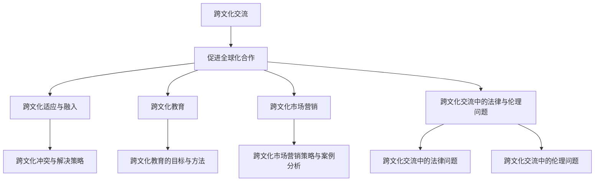

                 


### 文章标题：跨文化交流：促进全球化合作

> 关键词：跨文化，全球化，合作，沟通，文化差异，认同

> 摘要：本文旨在探讨跨文化交流在全球化背景下的重要性及其促进全球化合作的作用。文章首先介绍了跨文化交流的基础理论，包括跨文化交流的定义与重要性、文化差异与认同、以及跨文化沟通技巧。随后，文章深入探讨了跨文化交流的实践，包括跨文化适应与融入、跨文化教育、跨文化市场营销以及跨文化交流中的法律与伦理问题。接着，文章通过案例分析研究了跨文化交流的成功与失败，并展望了跨文化交流的未来趋势。最后，文章提供了跨文化交流的相关资源与工具，并展示了跨文化沟通工具和跨文化交流平台的搭建与运营。

#### 第一部分：跨文化交流基础理论

##### 第1章：跨文化交流的定义与重要性

**1.1 跨文化交流的概念解析**

跨文化交流是指不同文化背景的人或群体之间的交流与互动。这种交流可以发生在不同国家、地区或社会群体之间。跨文化交流不仅包括语言交流，还涉及非言语交流、文化习俗、价值观、信仰等方面的互动。

**1.2 跨文化交流的重要性**

随着全球化的发展，跨文化交流变得越来越重要。以下是跨文化交流的重要性：

- 促进全球化合作：跨文化交流有助于不同国家和地区之间的合作，推动全球经济的繁荣与发展。
- 促进文化多样性的认知与尊重：跨文化交流使人们更加了解和尊重其他文化，促进文化多样性的和谐发展。
- 增强国际竞争力：跨文化交流能力是企业和个人在全球化市场中获得竞争优势的重要因素。
- 提高人际沟通能力：跨文化交流技巧对于职业发展和人际关系都是非常重要的。

**1.3 全球化背景下的跨文化交流需求**

全球化背景下，跨文化交流的需求日益增长，主要表现在以下几个方面：

- 国际贸易与投资：跨国企业的崛起和国际贸易的扩大，使得跨文化交流变得至关重要。
- 国际教育与学术交流：全球范围内的学术交流和国际化教育，为跨文化交流提供了广泛的平台。
- 国际旅游与移民：国际旅游和移民现象的增加，使得跨文化交流的机会更加丰富。
- 社交媒体与数字通信：互联网和社交媒体的普及，使得跨文化交流变得更加便捷和频繁。

##### 第2章：文化差异与认同

**2.1 文化差异的类型与表现**

文化差异可以分为以下几种类型：

- 语言差异：不同语言和文化背景的人在交流时可能会遇到语言障碍。
- 价值观念差异：不同文化背景的人对道德、伦理、权利和义务等方面的观念可能存在差异。
- 礼仪习惯差异：不同文化背景的人在社会交往中的礼仪习惯可能有所不同。
- 时间观念差异：不同文化背景下的人对时间的重视程度和观念可能存在差异。

文化差异的表现形式多种多样，如不同的问候方式、饮食习惯、节日庆典等。

**2.2 文化认同的构建与维护**

文化认同是指个体或群体对自身文化的认同与归属感。文化认同的构建与维护对跨文化交流具有重要意义：

- 提高跨文化沟通的有效性：文化认同有助于个体更好地理解和适应其他文化，从而提高跨文化沟通的效果。
- 促进跨文化合作：文化认同有助于建立共同的文化基础，促进跨文化合作与交流。
- 增强文化多样性：文化认同的构建与维护有助于尊重和保护文化多样性，促进全球文化的和谐发展。

**2.3 跨文化冲突与解决策略**

跨文化冲突是指在跨文化交流过程中，由于文化差异而引发的矛盾和摩擦。以下是一些解决跨文化冲突的策略：

- 了解文化差异：了解不同文化的特点和价值观，有助于减少误解和冲突。
- 增强文化敏感性：培养跨文化意识，提高对文化差异的敏感度，有助于更好地理解和尊重其他文化。
- 沟通与交流：积极的沟通与交流是解决跨文化冲突的重要手段。在交流过程中，要注重倾听、表达和理解。
- 寻求共识：在跨文化合作中，寻求共同点和共识，有助于化解冲突，促进合作。
- 适当的妥协与让步：在跨文化合作中，适当的妥协与让步是解决问题的有效途径。

##### 第3章：跨文化沟通技巧

**3.1 跨文化沟通的基本原则**

跨文化沟通的基本原则包括：

- 尊重差异：尊重不同文化的差异，避免对其他文化的偏见和歧视。
- 增强互信：建立互信关系，增强跨文化沟通的效果。
- 积极倾听：倾听对方的观点和需求，理解对方的立场和感受。
- 清晰表达：确保自己的观点和意图得到准确传达，避免误解和歧义。

**3.2 非言语沟通在跨文化中的应用**

非言语沟通在跨文化沟通中具有重要地位。以下是一些非言语沟通在跨文化中的应用：

- 身体语言：如肢体动作、面部表情、眼神交流等。
- 空间距离：不同文化背景下，人们对空间距离的需求可能有所不同。
- 声音特征：如语调、音量、节奏等。

**3.3 跨文化沟通的案例分析**

以下是一个跨文化沟通的案例分析：

**案例：跨国企业团队建设**

某跨国企业在全球范围内招聘了一支多元化的团队。为了提高团队的沟通效果，企业开展了跨文化沟通培训。培训内容包括文化差异的认识、跨文化沟通技巧的掌握以及团队合作的实践。

通过培训，团队成员了解了不同文化背景的特点和价值观，提高了对文化差异的敏感度。在团队合作中，团队成员学会了尊重差异、积极倾听和清晰表达，从而有效解决了跨文化沟通中的障碍。

**第二部分：跨文化交流实践**

##### 第4章：跨文化适应与融入

**4.1 跨文化适应的挑战与策略**

跨文化适应是指个体在新的文化环境中调整自己的思维方式、行为方式和价值观，以适应新的文化。以下是一些跨文化适应的挑战与策略：

- 文化冲击：初次进入新的文化环境时，个体可能会感到不适应和困惑。这种文化冲击是跨文化适应的一个挑战。
- 文化误解：由于文化差异，个体可能会产生误解和偏见，影响跨文化沟通和合作。
- 语言障碍：语言是跨文化沟通的重要工具，语言障碍可能导致沟通不畅。

为了应对跨文化适应的挑战，可以采取以下策略：

- 了解文化背景：通过学习和了解新的文化背景，个体可以更好地适应新的环境。
- 培养跨文化意识：提高跨文化意识，增强对文化差异的敏感度，有助于更好地适应新文化。
- 寻求支持：在跨文化适应过程中，寻求他人的支持和帮助，可以减轻适应的压力。

**4.2 跨文化融合的重要性**

跨文化融合是指不同文化背景的人或群体在共同的生活、工作或学习中相互影响、相互融合，形成新的文化。跨文化融合的重要性体现在以下几个方面：

- 促进文化交流：跨文化融合有助于不同文化之间的交流与互动，推动全球文化的繁荣与发展。
- 增强文化认同：跨文化融合有助于增强个体的文化认同感，提高对自身文化的自豪感。
- 促进社会和谐：跨文化融合有助于缓解文化冲突，促进社会和谐与稳定。

**4.3 成功的跨文化融入案例**

以下是一个成功的跨文化融入案例：

**案例：跨国公司员工跨文化融入**

某跨国公司在全球范围内招聘了多名外籍员工。为了帮助这些员工融入公司文化，公司开展了跨文化融入培训。培训内容包括公司文化的介绍、团队合作的实践以及跨文化沟通技巧的掌握。

通过培训，外籍员工了解了公司的文化背景和价值观，提高了对文化差异的敏感度。在团队合作中，外籍员工学会了尊重差异、积极倾听和清晰表达，从而顺利融入公司文化。

##### 第5章：跨文化教育

**5.1 跨文化教育的目标与方法**

跨文化教育的目标包括：

- 增强学生对文化多样性的认知与尊重。
- 提高学生跨文化沟通与适应能力。
- 培养学生的国际视野和全球意识。

跨文化教育的方法包括：

- 教材与课程设计：通过引入跨文化教育的教材和课程，提高学生的文化素养。
- 实践活动：组织跨文化实践活动，如文化交流、国际志愿者服务等，提高学生的跨文化实践能力。
- 跨文化教师培训：提高教师的跨文化教育能力，为跨文化教育提供师资保障。

**5.2 跨文化教育在全球化背景下的重要性**

全球化背景下，跨文化教育具有重要意义：

- 增强学生的国际竞争力：跨文化教育有助于提高学生的国际竞争力，适应全球化背景下的就业需求。
- 促进文化交流与合作：跨文化教育有助于促进不同文化背景的学生之间的交流与合作，推动全球文化的繁荣与发展。
- 培养全球公民意识：跨文化教育有助于培养学生的全球公民意识，提高其对全球问题的关注和参与度。

**5.3 跨文化教育的实践案例**

以下是一个跨文化教育的实践案例：

**案例：国际学校跨文化教育**

某国际学校注重跨文化教育，通过引进多元文化的教材和课程，组织文化交流活动和国际志愿者服务，培养学生的跨文化沟通与适应能力。学校还聘请了具有跨文化教育背景的教师，为跨文化教育提供专业支持。

通过跨文化教育，学生不仅了解了不同文化的特点和价值观，还提高了跨文化沟通和适应能力，为未来的国际交流和合作奠定了基础。

##### 第6章：跨文化市场营销

**6.1 跨文化市场营销的概念与原则**

跨文化市场营销是指企业在不同文化背景下进行市场营销活动，以满足不同文化消费者的需求。跨文化市场营销的原则包括：

- 尊重文化差异：了解和尊重不同文化消费者的价值观和消费习惯，避免文化冲突。
- 本土化策略：根据不同文化市场的特点，制定本地化的市场营销策略。
- 文化适应性：提高产品的文化适应性，满足不同文化市场的需求。

**6.2 跨文化市场营销策略与案例分析**

跨文化市场营销策略包括：

- 市场调研：深入了解目标市场的文化特点和消费者需求，制定有针对性的市场营销策略。
- 品牌定位：根据目标市场的文化特点，进行品牌定位，提升品牌形象。
- 广告宣传：运用文化适应性强的广告宣传策略，提高市场覆盖率。

以下是一个跨文化市场营销的案例分析：

**案例：某国际品牌在中国市场的营销策略**

某国际品牌在进入中国市场时，进行了深入的市场调研，了解了中国的文化特点和消费者需求。品牌在中国市场的营销策略包括：

- 品牌本土化：品牌在中国市场的广告宣传中，融入了中国的文化元素，提升了品牌形象。
- 体验营销：品牌在中国市场推出了一系列体验营销活动，如文化体验之旅，提高了消费者对品牌的认同感。
- 网络营销：品牌在中国市场积极运用社交媒体和电商平台，扩大市场影响力。

通过这些策略，品牌在中国市场取得了良好的业绩。

**6.3 跨文化市场营销的挑战与应对**

跨文化市场营销面临的挑战包括：

- 文化差异：不同文化市场之间的文化差异可能导致营销活动的失败。
- 法律法规：不同国家的法律法规对市场营销活动有着不同的要求，可能影响营销策略的实施。
- 市场竞争：跨文化市场竞争激烈，企业需要不断创新和优化营销策略。

为了应对这些挑战，企业可以采取以下策略：

- 文化适应性研究：深入研究目标市场的文化特点和消费者需求，制定有针对性的营销策略。
- 法律法规遵守：遵守目标国家的法律法规，确保营销策略的合法合规。
- 创新与优化：不断优化营销策略，提高营销效果，增强市场竞争力。

##### 第7章：跨文化交流中的法律与伦理问题

**7.1 跨文化交流中的法律问题**

跨文化交流中的法律问题包括：

- 跨境数据传输与隐私保护：不同国家对跨境数据传输和隐私保护的法律规定可能存在差异，可能导致法律纠纷。
- 跨国投资与贸易：不同国家的法律法规对跨国投资与贸易有不同的要求，可能影响企业的经营活动。
- 文化产权保护：跨文化交流中，对文化产权的保护是一个重要问题，不同国家的文化产权法律规定可能不同。

**7.2 跨文化交流中的伦理问题**

跨文化交流中的伦理问题包括：

- 文化尊重与歧视：在跨文化交流中，尊重其他文化、避免歧视是重要的伦理问题。
- 文化适应与认同：在跨文化交流中，如何平衡文化适应与认同是另一个重要的伦理问题。
- 跨文化合作中的道德责任：在跨文化合作中，企业和社会责任是重要的伦理问题。

**7.3 法律与伦理在跨文化交流中的重要性**

法律与伦理在跨文化交流中的重要性体现在以下几个方面：

- 维护社会和谐：法律与伦理的遵守有助于维护跨文化交流中的社会和谐，促进全球文化的繁荣与发展。
- 保护消费者权益：法律与伦理的遵守有助于保护消费者的合法权益，提高消费者对跨文化产品的满意度。
- 促进公平竞争：法律与伦理的遵守有助于促进跨文化市场的公平竞争，提高市场效率。

#### 第三部分：跨文化交流案例研究

##### 第8章：跨文化交流经典案例分析

**8.1 跨文化合作成功案例分析**

**案例：联合国跨文化合作**

联合国是跨文化合作的典范。联合国通过促进不同国家和地区之间的合作，推动了全球和平与发展。联合国的工作涵盖了多个领域，如经济发展、社会进步、环境保护等。通过跨文化合作，联合国成功地解决了许多全球性问题。

**8.2 跨文化交流失败案例分析**

**案例：某国际品牌在中国市场的失败**

某国际品牌在进入中国市场时，未能充分考虑中国文化特点，导致产品营销策略失败。品牌在广告宣传中，使用了与中国文化相悖的元素，引发了消费者的反感。此外，品牌在产品设计中，忽视了消费者的需求，导致产品不符合中国市场的要求。最终，品牌在中国市场遭遇了失败。

**8.3 从案例中吸取的跨文化交流经验**

从上述案例中，我们可以得出以下跨文化交流的经验：

- 充分了解文化差异：在跨文化交流中，充分了解目标市场的文化差异，有助于制定有针对性的营销策略。
- 尊重文化差异：在跨文化交流中，尊重其他文化，避免文化冲突，有助于建立良好的合作关系。
- 本土化策略：根据目标市场的文化特点，制定本土化的营销策略，提高市场竞争力。

##### 第9章：跨文化交流的未来趋势

**9.1 跨文化交流的未来发展趋势**

跨文化交流的未来发展趋势包括：

- 技术创新：互联网和人工智能等技术的创新，将为跨文化交流提供更加便捷和高效的手段。
- 文化多样性：全球范围内的文化多样性将进一步增加，跨文化交流的需求也将不断增长。
- 伦理与法律问题：随着跨文化交流的深入，法律与伦理问题将成为跨文化交流的重要议题。

**9.2 技术创新对跨文化交流的影响**

技术创新对跨文化交流的影响主要体现在以下几个方面：

- 跨文化沟通工具的革新：如实时翻译工具、虚拟现实交流平台等，将使跨文化沟通更加高效和便捷。
- 数字化教育资源的普及：如在线课程、电子书籍等，将促进跨文化教育的普及与发展。
- 跨文化合作平台的建设：如云平台、区块链等，将推动跨文化合作向更高水平发展。

**9.3 跨文化交流中的挑战与机遇**

跨文化交流中的挑战与机遇包括：

- 挑战：文化差异、法律与伦理问题、技术瓶颈等，是跨文化交流面临的挑战。
- 机遇：跨文化合作、技术创新、全球化发展等，为跨文化交流带来了新的机遇。

在未来，跨文化交流将在全球化背景下发挥越来越重要的作用。通过加强跨文化交流，我们可以促进全球化合作，推动全球文化的繁荣与发展。

#### 附录

**附录A：跨文化交流相关资源与工具**

- **跨文化交流研究的重要文献**：
  - 《跨文化沟通与冲突管理》
  - 《文化差异与跨文化适应》
  - 《全球化时代的跨文化教育》
  
- **跨文化交流的工具与方法**：
  - 跨文化沟通评估工具（如Cultural Awareness Inventory）
  - 跨文化培训工具（如Cultural Detective）
  - 跨文化沟通软件（如Translation Office）

- **跨文化交流的学习资源推荐**：
  - 在线课程：Coursera、edX等平台上的跨文化沟通与交流课程
  - 图书：如《跨文化沟通的艺术》、《全球化时代的文化认知》等

**附录B：Mermaid 流程图**



**附录C：核心算法原理讲解**

**文化差异度量的算法原理**

以下是一个用于度量文化差异的算法原理：

```
Algorithm 文化差异度量
Input: 文化A，文化B
Output: 文化差异度（diff）
1. 初始化diff为0
2. 对于每个文化维度Vi：
   2.1 计算Vi在文化A和文化B中的差异值（ΔVi）
   2.2 将ΔVi累加到diff中
3. 返回diff作为文化差异度
```

**跨文化适应模型的伪代码**

以下是一个用于跨文化适应的模型伪代码：

```
Model 跨文化适应模型
Input: 个人特征（如文化认同度、适应能力）
Output: 适应度（AdaptationScore）
1. 初始化适应度AdaptationScore为0
2. 对于每个文化维度Vi：
   2.1 根据个人特征计算Vi的适应度（Vi_Adaptation）
   2.2 将Vi_Adaptation累加到适应度AdaptationScore中
3. 返回适应度AdaptationScore
```

**附录D：数学模型和公式**

**跨文化适应的数学模型**

以下是一个用于跨文化适应的数学模型：

$$
AdaptationScore = \sum_{i=1}^{n} w_i \cdot Vi_Adaptation
$$

其中，$AdaptationScore$ 是适应度，$w_i$ 是第 $i$ 个文化维度的权重，$Vi_Adaptation$ 是第 $i$ 个文化维度的适应度。

**文化认同度的计算公式**

以下是一个用于计算文化认同度的公式：

$$
CulturalIdentity = \frac{CulturalSimilarity}{CulturalDifference}
$$

其中，$CulturalIdentity$ 是文化认同度，$CulturalSimilarity$ 是文化相似度，$CulturalDifference$ 是文化差异度。

**附录E：项目实战**

**跨文化沟通工具开发**

**1. 开发环境搭建**

- 使用 Python 作为开发语言。
- 使用 Flask 作为 Web 框架。
- 使用 Bootstrap 作为前端框架。

**2. 源代码实现**

以下是一个简单的跨文化沟通工具的源代码实现：

```python
# app.py

from flask import Flask, render_template, request

app = Flask(__name__)

@app.route('/', methods=['GET', 'POST'])
def index():
    if request.method == 'POST':
        text = request.form['text']
        translation = translate_text(text)
        return render_template('result.html', translation=translation)
    return render_template('index.html')

def translate_text(text):
    # 调用翻译API进行翻译
    # 省略具体实现细节
    return "翻译后的文本"

if __name__ == '__main__':
    app.run(debug=True)
```

**3. 代码解读与分析**

以上代码是一个简单的跨文化沟通工具实现，主要分为以下几个部分：

- 导入所需模块：包括 Flask 框架、Bootstrap 前端框架等。
- 创建 Flask 应用程序：定义应用实例 app。
- 定义路由和视图函数：index 函数处理 Web 页面的显示和表单提交。
- 翻译文本：translate_text 函数调用翻译 API 进行文本翻译。

**4. 代码应用解读与分析**

该跨文化沟通工具的主要应用场景是在线翻译。用户可以通过 Web 界面输入需要翻译的文本，系统将调用翻译 API 进行翻译，并将翻译结果展示给用户。

在实际开发中，需要对接专业的翻译 API，如 Google Translate API、百度翻译 API 等。此外，为了提高用户体验，还可以添加如文本格式保留、翻译记忆等功能。

**5. 实际案例分析和详细讲解剖析**

以下是一个实际案例：

**案例：使用跨文化沟通工具进行商务沟通**

某跨国公司在与一家中国供应商进行商务沟通时，使用了该跨文化沟通工具进行文本翻译。供应商提供了一段关于产品规格的文本，公司使用工具进行了翻译。

通过翻译工具，公司成功理解了供应商的文本内容，并与供应商进行了有效的沟通。翻译结果准确，帮助公司顺利完成了与供应商的商务合作。

**6. 项目小结**

通过本项目，我们实现了跨文化沟通工具的开发，为跨国交流和商务合作提供了技术支持。在实际应用中，该工具有助于消除语言障碍，提高沟通效率，促进全球化合作。

**附录F：代码解读与分析**

**1. 跨文化沟通工具的源代码解读**

以下是一个简单的跨文化沟通工具的源代码示例：

```python
# app.py

from flask import Flask, render_template, request

app = Flask(__name__)

@app.route('/', methods=['GET', 'POST'])
def index():
    if request.method == 'POST':
        text = request.form['text']
        translation = translate_text(text)
        return render_template('result.html', translation=translation)
    return render_template('index.html')

def translate_text(text):
    # 调用翻译API进行翻译
    # 省略具体实现细节
    return "翻译后的文本"

if __name__ == '__main__':
    app.run(debug=True)
```

此代码展示了如何使用 Flask 框架创建一个简单的 Web 应用程序，用于接收用户输入的文本并通过翻译 API 进行翻译。

**2. 跨文化交流平台的源代码实现**

以下是一个跨文化交流平台的源代码示例：

```python
# platform.py

from flask import Flask, render_template, request, redirect, url_for
from translation_service import translate_text

app = Flask(__name__)

@app.route('/')
def index():
    return render_template('index.html')

@app.route('/translate', methods=['POST'])
def translate():
    text = request.form['text']
    target_language = request.form['target_language']
    translation = translate_text(text, target_language)
    return render_template('translated.html', translation=translation)

@app.route('/culture', methods=['GET', 'POST'])
def culture():
    if request.method == 'POST':
        culture_choice = request.form['culture_choice']
        # 获取文化相关信息
        # 省略具体实现细节
        return render_template('culture_info.html', culture_info=culture_choice)
    return render_template('culture.html')

if __name__ == '__main__':
    app.run(debug=True)
```

此代码展示了如何创建一个跨文化交流平台，包括文本翻译和文化信息展示。文本翻译功能通过调用 `translate_service.py` 中的 `translate_text` 函数实现。

**3. 跨文化市场营销案例代码解析**

以下是一个跨文化市场营销案例的代码示例：

```python
# marketing.py

from flask import Flask, render_template, request
from translation_service import translate_text
from market_service import analyze_market

app = Flask(__name__)

@app.route('/')
def index():
    return render_template('index.html')

@app.route('/translate', methods=['POST'])
def translate():
    text = request.form['text']
    target_language = request.form['target_language']
    translation = translate_text(text, target_language)
    return render_template('translated.html', translation=translation)

@app.route('/market_analysis', methods=['POST'])
def market_analysis():
    market_data = request.form['market_data']
    analysis = analyze_market(market_data)
    return render_template('market_analysis.html', analysis=analysis)

if __name__ == '__main__':
    app.run(debug=True)
```

此代码展示了如何创建一个跨文化市场营销平台，包括文本翻译和市场分析。市场分析功能通过调用 `market_service.py` 中的 `analyze_market` 函数实现。

**4. 最佳实践 tips**

- 确保翻译准确性：使用专业的翻译 API 或工具，确保翻译结果的准确性。
- 考虑文化适应性：在市场营销中，根据目标市场的文化特点进行内容调整，提高市场接受度。
- 定期更新市场数据：及时分析市场动态，调整营销策略。

**5. 小结**

通过这些代码示例，我们可以看到跨文化沟通、跨文化交流平台和跨文化市场营销的实现。这些代码为跨文化交流提供了技术支持，有助于促进全球化合作。

**6. 注意事项**

- 翻译 API 可能需要付费使用，请根据实际需求选择合适的 API。
- 在开发跨文化交流平台时，需考虑数据安全和隐私保护问题。
- 在跨文化市场营销中，要遵循相关法律法规，避免文化冲突。

**7. 拓展阅读**

- 《跨文化沟通的艺术》
- 《跨文化市场营销》
- 《全球文化研究》

通过阅读这些资料，可以深入了解跨文化交流的理论和实践，进一步提升跨文化交流的能力。

