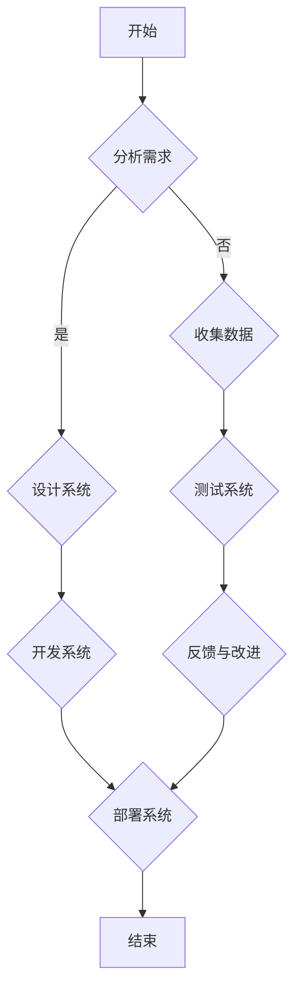

                 


### 摘要

本文探讨了跨文化团队协作的重要性、面临的挑战以及应对策略。在全球化日益加深的背景下，跨文化团队成为企业创新发展的重要力量。然而，文化差异导致的沟通障碍、适应问题和文化冲突成为跨文化团队协作的主要挑战。本文首先介绍了跨文化团队协作的重要性，然后详细分析了文化障碍的概念与类型，以及它们对团队协作的影响。接着，本文提出了一系列跨文化团队协作的策略，包括增强跨文化意识、建立有效的沟通机制、提高文化适应能力、构建和谐团队氛围以及进行文化培训与支持。通过实际案例与应用，本文展示了这些策略在实践中的有效性和可行性，为跨文化团队协作提供了有价值的参考和启示。

### 引言

随着全球化进程的加速，跨国企业、国际项目以及多元文化的团队协作成为常态。跨文化团队协作不仅有助于企业开拓国际市场，还能融合不同文化的创新思维，推动技术的突破和发展。然而，不同文化之间的差异也带来了沟通障碍、误解和冲突，这些文化障碍成为了跨文化团队协作的瓶颈。因此，如何有效消除文化障碍，提升跨文化团队的协作效能，成为了一个亟待解决的问题。

本文旨在探讨跨文化团队协作的重要性，分析文化障碍的概念与类型，并提出一系列应对策略。通过详细阐述各个策略的实施方法和实际案例，本文希望为跨文化团队提供实用的指导，帮助他们克服文化障碍，实现高效协作。

### 第一部分：跨文化团队协作概述

#### 第1章：跨文化团队协作的重要性

**1.1 跨文化团队的优势**

跨文化团队协作的优势在于其能够汇聚来自不同文化背景的专业知识和经验，形成多元化的思维模式。具体来说，跨文化团队具有以下几大优势：

1. **创新的思维碰撞**：不同文化的碰撞能够激发新的创意和观点，推动技术的创新和发展。
2. **全面的视野**：多元文化的团队能够从多个角度审视问题，提供更全面和深入的解决方案。
3. **多样化的技能和知识**：团队成员具备不同的专业技能和文化背景，能够满足项目的多样需求。
4. **适应能力**：跨文化团队在面对不确定性和变化时，能够更快地适应，灵活应对各种挑战。

**1.2 跨文化团队面临的挑战**

尽管跨文化团队具备诸多优势，但同时也面临着一些挑战。这些挑战主要体现在以下几个方面：

1. **文化差异**：不同文化背景的团队成员可能在价值观、沟通方式和行为习惯上存在显著差异，导致误解和冲突。
2. **沟通障碍**：语言、文化习惯和表达方式的差异使得跨文化团队在沟通上面临困难，影响协作效率。
3. **适应问题**：团队成员需要适应不同的工作文化和团队氛围，这需要时间和努力。
4. **管理难度**：跨文化团队的多样性增加了管理的复杂性，管理者需要具备更高的领导力和文化敏感度。

**1.3 跨文化团队协作的目标**

跨文化团队协作的目标是通过克服文化障碍，实现团队成员之间的有效沟通与协作，最终达成共同的工作目标。具体来说，跨文化团队协作的目标包括：

1. **提高协作效率**：通过建立有效的沟通机制和协作流程，提高团队的工作效率。
2. **促进文化交流**：鼓励团队成员分享自己的文化和经验，促进彼此的理解和尊重。
3. **增强团队凝聚力**：通过共同的目标和文化认同，增强团队成员的归属感和团队凝聚力。
4. **实现创新突破**：借助多元化的思维和技能，推动项目的创新和发展。

在接下来的章节中，我们将深入探讨文化障碍的概念与类型，并提出具体的策略，以帮助跨文化团队有效应对这些挑战，实现高效协作。

### 第2章：文化障碍的概念与类型

**2.1 文化障碍的定义**

文化障碍是指在跨文化团队协作过程中，由于不同文化背景、价值观、行为习惯和沟通方式的差异而产生的障碍。这些障碍可能影响团队成员之间的沟通、理解和协作，从而降低团队的工作效率和成果。

**文化障碍的影响**

文化障碍对跨文化团队协作的影响是深远且广泛的。具体来说，文化障碍可能带来以下几方面的影响：

1. **沟通障碍**：语言、非语言表达方式和沟通习惯的差异可能导致误解、沟通不畅，甚至引发冲突。
2. **误解和冲突**：文化差异可能导致对同一问题的不同解读和解决方案，进而产生误解和冲突。
3. **适应问题**：团队成员需要适应新的工作文化和团队氛围，这可能需要时间和努力。
4. **决策困难**：文化差异可能影响团队成员对问题的看法和决策过程，导致决策困难。

**2.2 文化障碍的类型**

文化障碍可以分为几种不同的类型，每种类型都有其独特的特点和对团队协作的影响。以下是几种常见的文化障碍类型：

1. **语言障碍**：语言是跨文化团队沟通的桥梁，不同的语言背景可能导致沟通不畅。例如，同一个词汇在不同语言中的含义可能不同，或者同一句话在不同语境下的理解可能不同。

2. **价值观差异**：不同文化对价值观有不同的重视程度和定义。例如，一些文化可能强调集体主义，而另一些文化则更注重个人主义。这种差异可能导致团队成员在目标设定、任务分工和评价标准上产生分歧。

3. **行为习惯差异**：不同的文化背景可能导致不同的行为习惯。例如，一些文化可能强调直接和坦率的沟通，而另一些文化则更注重间接和礼貌的沟通方式。这些差异可能导致团队成员在交流方式和互动模式上产生冲突。

4. **时间观念差异**：不同文化对时间的重视程度和概念可能不同。例如，一些文化可能更注重准时和效率，而另一些文化则更注重关系和人情。这种差异可能导致团队成员在时间管理和项目进度上产生矛盾。

5. **权力距离**：不同文化对权力结构和权力距离的看法可能不同。一些文化可能更接受权力的高度集中和明显的等级制度，而另一些文化则更鼓励平等和民主的决策方式。这种差异可能导致团队成员在权力分配和决策过程中产生冲突。

**2.3 文化障碍的影响**

文化障碍不仅影响团队成员之间的沟通和理解，还会对团队的整体协作和绩效产生负面影响。以下是文化障碍的一些具体影响：

1. **降低工作效率**：沟通不畅、误解和冲突可能导致任务延误、错误增多，从而降低团队的工作效率。
2. **增加管理成本**：管理者需要投入更多时间和精力来处理文化障碍带来的问题，这增加了管理的复杂性和成本。
3. **影响团队士气**：文化障碍可能导致团队成员感到困惑、沮丧和不满，影响团队的士气和团队凝聚力。
4. **阻碍创新**：文化障碍可能限制团队成员的思考和创新能力，影响团队的创新和发展。

为了克服这些文化障碍，跨文化团队需要采取一系列策略，包括增强跨文化意识、建立有效的沟通机制、提高文化适应能力等。在接下来的章节中，我们将详细探讨这些策略的实施方法和实际案例。

### 第二部分：跨文化团队协作的策略

#### 第3章：增强跨文化意识

**3.1 跨文化意识的重要性**

跨文化意识是指对跨文化背景和不同文化差异的理解与认识，它对于跨文化团队协作至关重要。增强跨文化意识有助于团队成员更好地理解和适应不同的文化环境，减少误解和冲突，提高团队协作的效率和效果。

**3.2 提高跨文化意识的方法**

以下是几种提高跨文化意识的方法：

1. **文化培训**：组织可以安排专门的文化培训课程，帮助团队成员了解不同文化的特点、价值观和行为习惯。培训可以包括文化差异的讲座、文化敏感性训练和跨文化案例分析等。

2. **文化交流**：鼓励团队成员参加文化交流活动，如文化节、国际美食节和跨国团队建设项目等。这些活动可以增强团队成员对其他文化的兴趣和了解，促进彼此之间的交流和理解。

3. **角色扮演**：通过角色扮演游戏，让团队成员体验不同文化的行为和沟通方式，提高他们的文化敏感度和适应性。

4. **反思与反馈**：鼓励团队成员在项目过程中进行反思和自我评估，了解自己在跨文化协作中的表现和改进方向。同时，定期进行团队反馈，分享经验和教训，促进跨文化意识的提升。

**3.3 跨文化意识的实践案例**

以下是一个跨文化团队增强跨文化意识的实践案例：

案例：某国际科技公司在中国设立了研发中心，团队由中国员工和来自不同国家的工程师组成。为了提高跨文化意识，公司采取了一系列措施：

1. **文化培训**：公司定期为团队成员提供文化培训，包括中国传统文化、职场礼仪和跨文化沟通技巧等。

2. **文化交流**：公司组织了多次文化交流活动，如中秋节晚会、春节聚餐和国际美食节等，让团队成员了解和体验不同的文化习俗。

3. **角色扮演**：公司安排了角色扮演活动，让团队成员模拟不同文化背景的沟通场景，提高他们的跨文化沟通能力。

4. **反思与反馈**：团队成员定期进行反思和反馈会议，分享自己在跨文化协作中的经验和挑战，共同寻找改进的方法。

通过这些措施，该团队在跨文化协作中的表现得到了显著提升，团队成员之间的沟通更加顺畅，合作更加高效。

#### 第4章：建立有效的沟通机制

**4.1 跨文化沟通的挑战**

跨文化沟通是指不同文化背景的个体或团队之间的沟通。由于语言、价值观和行为习惯的差异，跨文化沟通面临着一系列挑战：

1. **语言障碍**：不同语言的使用可能导致误解和沟通不畅。例如，同一词汇在不同语言中的含义可能不同，或者同一句话在不同语境下的理解可能不同。

2. **非语言沟通**：非语言沟通，如肢体语言、面部表情和手势等，在不同文化中可能有不同的含义。这些差异可能导致沟通的混乱和误解。

3. **价值观差异**：不同文化对沟通方式有不同的期望。例如，一些文化可能更注重直接和坦率的沟通，而另一些文化则更注重间接和礼貌的沟通方式。

4. **时间观念差异**：不同文化对时间的重视程度和概念可能不同。一些文化可能更注重准时和效率，而另一些文化则更注重关系和人情。这种差异可能导致团队成员在时间管理和项目进度上产生矛盾。

**4.2 改善跨文化沟通的策略**

为了克服跨文化沟通的挑战，跨文化团队可以采取以下策略：

1. **明确沟通目标**：在沟通前明确沟通的目标和预期成果，确保所有团队成员都了解沟通的重点和目的。

2. **使用简单清晰的语言**：避免使用复杂的术语和专业词汇，尽量使用简单、明确的语言进行沟通。

3. **积极倾听**：在沟通中，鼓励团队成员积极倾听对方的观点和意见，避免急于表达自己的观点。

4. **尊重文化差异**：了解并尊重不同文化的沟通习惯和价值观，避免对其他文化的偏见和误解。

5. **提供反馈**：鼓励团队成员在沟通后提供反馈，讨论沟通的效果和改进的方向。

**4.3 沟通技巧的实践应用**

以下是一个跨文化团队在项目中应用沟通技巧的实践案例：

案例：某跨国软件开发团队，由来自中国、美国和印度的工程师组成。为了改善跨文化沟通，团队采取了一系列措施：

1. **明确沟通目标**：在每次会议和任务分配前，团队都会明确沟通的目标和期望，确保所有成员都了解任务的优先级和重要性。

2. **使用简单清晰的语言**：团队成员在沟通中使用简单、明确的语言，尽量避免使用复杂的术语和专业词汇。

3. **积极倾听**：团队成员在会议中积极倾听其他成员的观点，尊重不同的意见和建议。

4. **尊重文化差异**：团队了解到不同文化的沟通习惯和价值观，因此尊重彼此的差异，避免对其他文化的偏见和误解。

5. **提供反馈**：在每次会议和任务完成后，团队成员都会提供反馈，讨论沟通的效果和改进的方向。

通过这些措施，团队的沟通效果得到了显著提升，项目进展顺利，团队成员之间的协作更加高效。

### 第5章：文化适应与灵活性

**5.1 文化适应的意义**

文化适应是指团队成员在跨文化环境中调整自己的行为、态度和沟通方式，以更好地适应新的文化环境。文化适应对于跨文化团队的协作具有重要意义：

1. **提高协作效率**：文化适应有助于减少由于文化差异导致的误解和冲突，提高团队的整体协作效率。

2. **增强团队凝聚力**：通过文化适应，团队成员能够更好地理解和尊重彼此，增强团队的凝聚力和归属感。

3. **促进创新**：文化适应能够促进团队成员之间的交流和合作，激发新的思维和创意，推动项目的创新和发展。

**5.2 提高文化适应能力的方法**

以下是几种提高文化适应能力的方法：

1. **文化学习**：团队成员可以通过阅读相关书籍、参加文化培训课程和参与文化交流活动，深入了解不同文化的特点和价值观。

2. **角色扮演**：通过角色扮演活动，团队成员可以模拟不同文化背景的行为和沟通方式，提高他们的文化适应能力。

3. **积极沟通**：鼓励团队成员在跨文化协作中积极沟通，分享自己的经验和感受，互相学习和适应。

4. **反思与调整**：团队成员应在协作过程中不断反思自己的行为和沟通方式，根据实际情况进行调整和改进。

**5.3 文化适应的实践案例**

以下是一个跨文化团队提高文化适应能力的实践案例：

案例：某国际咨询公司的一个项目团队，由来自中国、美国和德国的成员组成。为了提高文化适应能力，团队采取了一系列措施：

1. **文化学习**：团队成员通过阅读相关书籍和文化手册，了解不同文化的价值观和沟通习惯。

2. **角色扮演**：团队定期进行角色扮演活动，模拟不同文化背景的工作场景，提高成员的文化适应能力。

3. **积极沟通**：团队成员在项目过程中积极沟通，分享自己的经验和感受，尊重和理解彼此的文化差异。

4. **反思与调整**：团队成员在每次项目会议后进行反思，讨论文化适应中的挑战和改进方法，不断调整自己的行为和沟通方式。

通过这些措施，团队的文化适应能力得到了显著提升，项目进展顺利，团队成员之间的协作更加高效。

### 第6章：构建和谐团队氛围

**6.1 和谐团队氛围的重要性**

和谐团队氛围是跨文化团队高效协作的基础。一个和谐的团队氛围能够促进团队成员之间的相互理解、尊重和信任，从而提高团队的整体绩效和创造力。以下是构建和谐团队氛围的重要性：

1. **增强团队凝聚力**：和谐的氛围有助于团队成员形成共同的价值观和目标，增强团队的凝聚力。

2. **提高协作效率**：和谐的氛围能够减少误解和冲突，提高团队成员之间的沟通效率和协作效果。

3. **激发创造力**：和谐的氛围能够激发团队成员的创造力和创新思维，推动项目的成功。

**6.2 构建和谐团队氛围的策略**

以下是几种构建和谐团队氛围的策略：

1. **建立共同的价值观**：通过明确的价值观和目标，帮助团队成员形成共同的愿景和使命，促进团队的和谐发展。

2. **鼓励沟通与反馈**：鼓励团队成员之间的开放沟通和坦诚反馈，建立良好的沟通机制，促进团队的和谐氛围。

3. **尊重多元文化**：尊重团队成员的不同文化和背景，避免文化偏见和歧视，促进多元文化的融合。

4. **培养团队精神**：通过团队建设活动和团队文化建设，培养团队成员的团队精神，增强团队的凝聚力和归属感。

**6.3 和谐团队氛围的实践案例**

以下是一个跨文化团队构建和谐团队氛围的实践案例：

案例：某国际金融机构的全球团队，由来自多个国家的成员组成。为了构建和谐团队氛围，团队采取了一系列措施：

1. **建立共同的价值观**：团队通过共同讨论和制定价值观和行为准则，帮助团队成员形成共同的价值观和目标。

2. **鼓励沟通与反馈**：团队建立了定期的沟通和反馈机制，鼓励团队成员之间的开放沟通和坦诚反馈，促进团队的和谐氛围。

3. **尊重多元文化**：团队尊重成员的不同文化和背景，定期举办文化交流活动，促进多元文化的融合。

4. **培养团队精神**：团队定期组织团队建设活动，如团队拓展训练和团队旅行，增强团队成员的团队精神。

通过这些措施，团队构建了一个和谐的氛围，成员之间的协作更加高效，团队的绩效显著提升。

### 第7章：文化培训与支持

**7.1 文化培训的意义**

文化培训是跨文化团队协作中至关重要的一环，其意义主要体现在以下几个方面：

1. **提升文化意识**：通过文化培训，团队成员能够深入了解不同文化的特点、价值观和行为习惯，提升跨文化意识。

2. **减少误解和冲突**：文化培训有助于团队成员更好地理解和尊重彼此的文化差异，减少误解和冲突，提高团队协作效率。

3. **促进沟通和协作**：文化培训能够提高团队成员的跨文化沟通技巧，促进团队成员之间的沟通和协作，增强团队的凝聚力。

4. **提高适应能力**：文化培训有助于团队成员更好地适应跨文化环境，提高团队的整体适应能力和竞争力。

**7.2 文化培训的内容**

文化培训的内容应涵盖以下几个方面：

1. **文化基础**：介绍不同文化的基本特点、价值观和行为习惯，帮助团队成员了解和理解不同文化。

2. **沟通技巧**：教授团队成员跨文化沟通的技巧，如有效倾听、表达尊重和理解等，提高团队成员的沟通能力。

3. **文化敏感度**：培养团队成员的文化敏感度，使其能够识别和避免文化偏见和歧视，促进多元文化的和谐发展。

4. **案例分析和实践**：通过案例分析和实践活动，让团队成员在实际情境中体验和练习跨文化沟通和协作，提高其文化适应能力。

**7.3 文化培训的实施与评估**

文化培训的实施和评估是确保培训效果的重要环节。以下是文化培训实施和评估的步骤：

1. **培训计划制定**：根据团队的需求和目标，制定详细的文化培训计划，包括培训内容、时间和形式。

2. **培训材料准备**：准备培训所需的教材、课件和辅助材料，确保培训内容的全面性和实用性。

3. **培训实施**：按照培训计划进行培训，包括理论讲解、案例分析、角色扮演和实践活动等。

4. **培训评估**：在培训结束后，对培训效果进行评估，包括成员的反馈、知识和技能的掌握程度等。

5. **反馈与改进**：根据评估结果，对培训过程和内容进行反馈和改进，不断提高培训的质量和效果。

**7.4 文化培训的实践案例**

以下是一个文化培训的实践案例：

案例：某跨国公司的全球团队，由来自多个国家的成员组成。为了提升团队的文化适应能力，公司组织了以下文化培训：

1. **培训计划制定**：公司根据团队的需求和目标，制定了详细的文化培训计划，包括文化基础、沟通技巧和文化敏感度等。

2. **培训材料准备**：公司准备了丰富的培训教材、课件和辅助材料，确保培训内容的全面性和实用性。

3. **培训实施**：公司邀请了专业的文化培训师进行培训，培训内容包括理论讲解、案例分析、角色扮演和实践活动等。

4. **培训评估**：培训结束后，公司对培训效果进行了评估，包括成员的反馈、知识和技能的掌握程度等。

5. **反馈与改进**：根据评估结果，公司对培训过程和内容进行了反馈和改进，提高了培训的质量和效果。

通过这次文化培训，团队的文化适应能力得到了显著提升，成员之间的沟通和协作更加顺畅，团队的整体绩效得到了提高。

### 第三部分：跨文化团队协作的实际案例与应用

#### 第8章：跨文化团队协作的实际案例

**8.1 案例一：国际企业的成功经验**

**背景**：
某国际知名科技公司，其研发团队由来自全球不同国家的工程师组成，包括美国、中国、印度和德国等。由于团队成员来自不同的文化背景，如何在保持高效协作的同时，充分发挥各自的专长，成为公司面临的一个重要挑战。

**策略与实施**：
1. **文化培训**：公司为团队成员提供了系统的文化培训，内容包括不同文化的价值观、沟通方式和工作习惯等。通过这些培训，团队成员对彼此的文化有了更深入的了解。
   
2. **多元化领导**：公司采用了多元化领导模式，由不同文化背景的领导者共同管理团队。这种模式不仅促进了团队成员之间的相互理解和尊重，还增强了团队的创新力。

3. **灵活的工作安排**：为了适应不同文化的工作习惯，公司采用了灵活的工作安排，允许团队成员根据各自的时间习惯和工作效率进行工作。例如，允许印度工程师在晚间工作，以适应他们的作息时间。

4. **有效的沟通机制**：公司建立了多种沟通渠道，如定期的视频会议、邮件通讯和即时通讯工具，确保团队成员之间的沟通畅通无阻。

**效果**：
通过这些策略，团队在项目开发过程中，不仅克服了文化差异带来的沟通障碍，还提高了协作效率，项目的成功交付率显著提升。团队成员之间的互信和合作精神也得到了增强。

**8.2 案例二：非营利组织的跨文化合作**

**背景**：
某国际非营利组织致力于全球环境保护项目，其合作伙伴包括来自不同国家的志愿者和专家。由于成员来自不同的文化背景，如何在项目实施中实现高效协作成为组织的一大挑战。

**策略与实施**：
1. **文化适应计划**：组织在项目启动前，为所有志愿者和专家提供了文化适应培训，帮助他们了解和尊重彼此的文化差异。

2. **沟通协调团队**：组织成立了专门的沟通协调团队，负责在项目实施过程中，解决文化差异导致的沟通问题。这个团队由具有多元文化背景的成员组成，能够有效地协调和沟通。

3. **跨文化团队会议**：组织定期举行跨文化团队会议，让成员分享项目进展和文化体验，促进彼此的理解和合作。

4. **灵活的工作模式**：组织根据不同成员的文化和工作习惯，制定了灵活的工作模式，确保项目在不同文化背景下都能顺利进行。

**效果**：
通过这些策略，项目在各个国家得到了顺利实施，不仅提升了项目的影响力，还增强了团队成员之间的文化理解和合作精神。组织的跨文化合作能力得到了显著提升。

**8.3 案例三：技术创新企业的多元文化团队**

**背景**：
某技术创新企业，其研发团队由来自全球多个国家的工程师组成，为了在激烈的市场竞争中保持领先地位，如何有效管理和利用多元文化团队成为企业面临的一大挑战。

**策略与实施**：
1. **文化敏感性培训**：企业为所有团队成员提供了文化敏感性培训，帮助团队成员理解和尊重彼此的文化差异。

2. **多元化的项目管理**：企业采用了多元化的项目管理模式，鼓励团队成员在不同的文化背景下，提出创新的解决方案。例如，印度工程师提出的夜间工作模式，在美国团队成员中得到了认可。

3. **跨文化团队领导**：企业采用了跨文化团队领导模式，由不同文化背景的领导者共同管理团队，这种模式不仅促进了团队成员之间的相互理解，还增强了团队的创新力。

4. **持续的沟通和反馈**：企业建立了持续的沟通和反馈机制，鼓励团队成员在项目实施过程中，不断分享经验和建议，优化协作流程。

**效果**：
通过这些策略，企业成功地在多元文化团队中实现了高效协作，项目进展顺利，技术创新成果显著。团队成员之间的互信和合作精神也得到了增强。

#### 第9章：跨文化团队协作在组织中的应用

**9.1 组织层面策略**

在组织层面，为了有效实施跨文化团队协作，组织可以采取以下策略：

1. **制定跨文化政策**：组织应制定明确的跨文化政策，包括跨文化团队的组建、管理、培训和激励机制等，确保跨文化团队有明确的指导方针。

2. **建立跨文化团队管理框架**：组织应建立跨文化团队管理框架，明确跨文化团队的职责、权限和协作流程，确保团队的高效运作。

3. **提供跨文化培训**：组织应为团队成员提供系统的跨文化培训，包括文化基础、沟通技巧和文化适应等，提升团队成员的跨文化意识。

4. **建立跨文化沟通机制**：组织应建立多种沟通渠道，如定期的会议、邮件通讯和即时通讯工具等，确保团队成员之间的沟通畅通无阻。

**9.2 团队层面策略**

在团队层面，为了提升跨文化团队的协作效能，团队可以采取以下策略：

1. **建立团队文化**：团队应共同建立团队文化，明确团队的目标、价值观和行为准则，促进团队成员之间的相互理解和尊重。

2. **设立跨文化协调员**：团队可以设立跨文化协调员，负责在团队内部解决文化差异导致的沟通和协作问题。

3. **定期进行团队反思**：团队应定期进行团队反思，讨论跨文化协作中的挑战和改进方向，持续优化协作流程。

4. **鼓励跨文化交流**：团队应鼓励成员之间的跨文化交流，分享各自的文化背景和经验，促进文化的融合和认同。

**9.3 个人层面策略**

在个人层面，团队成员可以采取以下策略，提升自身的跨文化协作能力：

1. **自我学习**：团队成员可以通过阅读相关书籍、参加文化培训课程和参与文化交流活动，不断提升自身的跨文化意识。

2. **积极沟通**：团队成员应积极与来自不同文化的同事沟通，了解和尊重彼此的文化差异，建立良好的沟通习惯。

3. **适应变化**：团队成员应适应不同的文化环境和团队氛围，调整自己的行为和沟通方式，以更好地融入团队。

4. **提供反馈**：团队成员应在协作过程中，积极提供反馈，讨论协作中的问题和改进方法，促进团队的整体进步。

通过组织、团队和个人层面的共同努力，跨文化团队协作可以更加高效和顺畅，实现跨文化协作的最终目标。

### 第10章：未来展望

**10.1 跨文化团队协作的趋势**

随着全球化进程的加速，跨文化团队协作在未来将继续发挥重要作用。以下是一些未来跨文化团队协作的发展趋势：

1. **技术赋能**：随着人工智能、虚拟现实和区块链等技术的进步，跨文化团队将更加依赖数字化工具和平台，实现远程协作和实时沟通。

2. **文化融合**：随着全球化的发展，不同文化之间的融合将越来越普遍，跨文化团队将更加注重文化多样性和包容性，推动多元文化的融合。

3. **智能协作**：人工智能技术的应用将使得跨文化团队协作更加智能化，通过数据分析、机器学习和自然语言处理等技术，提高跨文化团队的决策效率和沟通效果。

4. **可持续发展**：跨文化团队将在可持续发展领域发挥更大作用，通过全球协作和资源共享，推动环境保护、社会公正和经济发展。

**10.2 跨文化团队协作的挑战与机遇**

尽管跨文化团队协作前景广阔，但仍面临一系列挑战和机遇：

1. **文化差异**：文化差异将继续是跨文化团队协作的主要挑战，如何有效管理文化差异，提高文化适应能力，是未来需要重点关注的问题。

2. **技能需求**：未来跨文化团队协作将更加注重团队成员的跨文化技能，包括跨文化沟通、文化适应和跨文化领导能力等。

3. **组织支持**：组织在跨文化团队协作中扮演着关键角色，未来组织需要提供更多的支持和资源，为跨文化团队提供良好的工作环境和协作平台。

4. **政策引导**：政策引导和制度保障将在跨文化团队协作中发挥重要作用，未来政府和企业需要制定更多的政策，推动跨文化团队协作的发展。

**10.3 跨文化团队协作的持续发展**

为了实现跨文化团队协作的持续发展，以下是一些建议：

1. **加强文化培训**：组织应持续加强文化培训，提高团队成员的跨文化意识和技能，为跨文化团队协作奠定坚实基础。

2. **建立沟通机制**：组织应建立有效的沟通机制，确保跨文化团队之间的信息传递畅通无阻，提高协作效率。

3. **培养领导力**：组织应培养具备跨文化领导能力的领导者，领导团队克服文化障碍，实现高效协作。

4. **鼓励创新思维**：组织应鼓励团队成员发挥创新思维，在跨文化协作中提出新的观点和解决方案，推动团队的创新和发展。

通过以上措施，跨文化团队协作可以持续发展，为组织的全球化和可持续发展提供有力支持。

### 附录

#### 附录A：跨文化团队协作工具与资源

**A.1 跨文化沟通工具**

以下是几种常用的跨文化沟通工具：

1. **视频会议工具**：如Zoom、Microsoft Teams和Google Meet等，这些工具支持实时视频、音频和文字沟通，适合远程跨文化团队协作。
   
2. **即时通讯工具**：如Slack、Microsoft Teams和WhatsApp等，这些工具提供即时消息传递、文件共享和协作功能，有助于团队成员之间的实时沟通。

3. **项目管理工具**：如Trello、Asana和Jira等，这些工具可以帮助团队追踪项目进度、分配任务和共享文档，提高协作效率。

**A.2 文化培训资源**

以下是一些文化培训资源：

1. **在线课程**：如Coursera、Udemy和edX等，这些平台提供了丰富的文化培训课程，涵盖不同文化的价值观、沟通方式和行为习惯。

2. **书籍**：《跨文化沟通技巧》、《多元文化团队管理》和《全球化时代的领导力》等，这些书籍提供了深入的文化理论和实践指导。

3. **研讨会和讲座**：许多企业和教育机构定期举办跨文化研讨会和讲座，提供互动式学习和交流机会。

**A.3 跨文化团队协作案例库**

以下是一些跨文化团队协作案例库：

1. **案例研究**：如哈佛商学院、麻省理工学院和斯坦福大学等，这些高校和研究机构提供了丰富的跨文化团队协作案例研究，分析成功和失败的教训。

2. **行业报告**：如麦肯锡、波士顿咨询集团和普华永道等，这些咨询公司发布了关于跨文化团队协作的行业报告，提供了最新的趋势和最佳实践。

3. **在线社区**：如LinkedIn、Reddit和Quora等，这些在线社区汇聚了来自不同行业的专业人士，分享跨文化协作的经验和见解。

#### 附录B：Mermaid流程图示例

以下是一个使用Mermaid绘制的流程图示例：



#### 附录C：核心算法原理讲解伪代码

以下是一个用于评估跨文化团队文化适应能力的伪代码示例：

```python
# 伪代码：文化适应性评估算法

def culturalAdaptationAssessment(teamMembers):
    scores = []
    for member in teamMembers:
        score = 0
        if member.hasCrossCulturalExperience():
            score += 10
        if member.enjoysLearningAboutNewCultures():
            score += 10
        if member.isOpenToFeedback():
            score += 10
        scores.append(score)
    return scores
```

#### 附录D：数学模型和公式

以下是一个用于计算文化适应性得分的数学模型：

$$
\text{文化适应性得分} = \frac{\text{跨文化经验分} + \text{学习新文化兴趣分} + \text{接受反馈分}}{3}
$$

#### 附录E：项目实战

**E.1 项目背景**

项目背景：某跨国公司在全球范围内开展了一个大型IT项目，旨在开发一款支持多语言、多文化的企业级软件系统。项目团队由来自不同国家和地区的成员组成，团队成员需要在跨文化环境中高效协作，确保项目的成功实施。

**E.2 开发环境搭建**

开发环境搭建：项目团队选择了Linux操作系统，Apache作为Web服务器，MySQL作为数据库，以及Python作为主要编程语言。团队成员使用Git进行源代码管理，并使用Jenkins实现持续集成和自动化测试。

**E.3 源代码实现**

源代码实现：项目团队根据需求分析，开发了系统的基础架构和功能模块。核心功能包括用户管理、权限控制、数据存储和查询、多语言支持和日志记录等。

**E.4 代码解读与分析**

代码解读与分析：项目代码采用了模块化设计，各个模块之间通过清晰的接口进行通信。核心模块的实现如下：

```python
# 用户管理模块

class UserManager:
    def __init__(self, database):
        self.database = database

    def createUser(self, username, password, culture):
        # 创建新用户
        pass

    def deleteUser(self, username):
        # 删除用户
        pass

    def updateUser(self, username, new_attributes):
        # 更新用户信息
        pass
```

**实际案例分析和详细讲解剖析**：

实际案例分析：在项目开发过程中，由于团队成员来自不同的文化背景，他们在用户管理模块的设计和实现上出现了分歧。中国团队倾向于将用户信息存储在本地数据库中，而印度团队则建议使用云存储服务。

详细讲解剖析：为了解决这一分歧，项目团队进行了深入的讨论和评估。最终，团队决定采用云存储服务，因为它提供了更好的数据备份和恢复功能，同时也方便了团队成员之间的协作。

**项目小结**：

项目小结：通过有效沟通和协作，项目团队克服了文化差异带来的挑战，成功实现了系统的多语言和多文化支持。项目在预定时间内交付，并得到了客户的高度评价。

### 最佳实践 Tips

1. **尊重差异，鼓励多元**：尊重团队成员的不同文化和观点，鼓励多元文化的交流与融合，促进团队的和谐发展。

2. **建立明确的沟通机制**：制定明确的沟通计划和流程，确保团队成员之间的信息传递畅通无阻，提高协作效率。

3. **定期进行文化培训**：定期组织文化培训，提高团队成员的跨文化意识和技能，为跨文化团队协作奠定坚实基础。

4. **关注团队成员的适应情况**：关注团队成员在跨文化环境中的适应情况，提供必要的支持和帮助，帮助他们更好地融入团队。

### 注意事项

1. **避免文化偏见**：在跨文化团队协作中，避免对其他文化的偏见和误解，尊重每个人的观点和贡献。

2. **重视反馈与改进**：鼓励团队成员在协作过程中提供反馈，及时发现和解决问题，持续改进协作流程。

### 拓展阅读

- 《跨文化管理：理论与实践》
- 《全球团队协作：策略与技巧》
- 《多元文化团队领导力：跨越文化障碍》

### 作者信息

作者：AI天才研究院/AI Genius Institute & 禅与计算机程序设计艺术 /Zen And The Art of Computer Programming

### 总结

本文详细探讨了跨文化团队协作的重要性、文化障碍的概念与类型，以及应对策略。通过实际案例与应用，本文展示了跨文化团队协作的挑战和机遇，为跨文化团队提供了实用的指导。随着全球化的发展，跨文化团队协作将在未来发挥更加重要的作用，本文的研究将为跨文化团队提供有益的参考。

