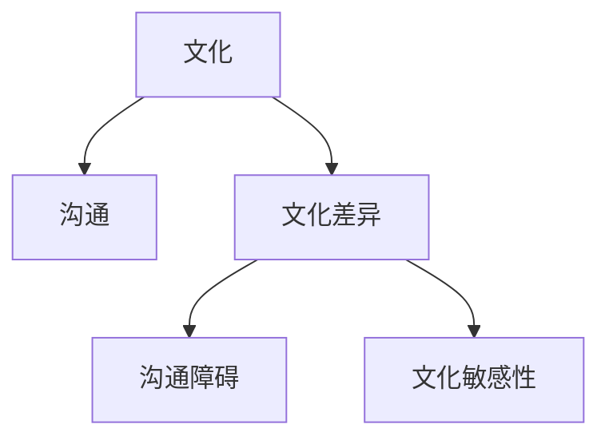

                 

## 第1章：跨文化沟通的概念与重要性

### 1.1 跨文化沟通的定义

#### 核心概念与联系图

在探讨跨文化沟通的定义时，我们首先需要理解几个核心概念：文化、沟通、文化差异、沟通障碍和文化敏感性。以下是这些概念之间的联系图：



- **文化（A）** 是一个社会群体在长期发展过程中形成的共同信仰、价值观、行为规范等的总和。
- **沟通（B）** 是信息、思想和情感在个体与个体、个体与群体之间传递的过程。
- **文化差异（C）** 指的是不同文化背景下的个体或群体在信仰、价值观、行为规范等方面的不同。
- **沟通障碍（D）** 是由于文化差异导致的沟通中的误解、冲突和效率低下等问题。
- **文化敏感性（E）** 是指个体或群体在跨文化沟通中对他人的文化背景和沟通方式的敏感度和适应性。

#### 核心算法原理讲解

为了更好地理解这些概念，我们可以借助一个简单的算法模型来分析跨文化沟通的构成：

```python
def cross_cultural_communication(culture_A, culture_B, communication_skill):
    """
    跨文化沟通函数
    :param culture_A: 文化A
    :param culture_B: 文化B
    :param communication_skill: 沟通技能
    :return: 沟通效果
    """
    cultural_difference = calculate_cultural_difference(culture_A, culture_B)
    communication_barrier = calculate_communication_barrier(cultural_difference)
    sensitivity = calculate_sensitivity(culture_A, culture_B)
    
    communication_effect = communication_skill * (1 - communication_barrier) * sensitivity
    
    return communication_effect

def calculate_cultural_difference(culture_A, culture_B):
    """
    计算文化差异
    :param culture_A: 文化A
    :param culture_B: 文化B
    :return: 文化差异值
    """
    # 根据文化特征差异计算
    return difference_value

def calculate_communication_barrier(cultural_difference):
    """
    计算沟通障碍
    :param cultural_difference: 文化差异值
    :return: 沟通障碍值
    """
    # 根据文化差异值计算沟通障碍
    return barrier_value

def calculate_sensitivity(culture_A, culture_B):
    """
    计算文化敏感性
    :param culture_A: 文化A
    :param culture_B: 文化B
    :return: 文化敏感性值
    """
    # 根据文化背景计算敏感性
    return sensitivity_value
```

#### 数学模型和数学公式

我们可以使用以下数学模型来描述跨文化沟通的效果：

$$
\text{沟通效果} = f(\text{文化适应性} \times \text{沟通技巧})
$$

其中，文化适应性取决于文化差异和个体或团队对文化差异的敏感性。沟通技巧则是指沟通者在实际沟通中使用的策略和方法。

#### 举例说明

在全球化的背景下，企业越来越重视跨文化沟通。例如，一家中国的互联网公司在美国设立分支机构，就需要在项目管理、产品设计和市场推广等方面进行跨文化沟通。如果不了解美国文化，可能会导致以下问题：

1. **沟通障碍**：中美文化在交流方式、表达习惯等方面存在差异，可能导致信息传递不准确。
2. **文化敏感性**：如果不了解对方的文化背景，可能会无意中冒犯对方，影响团队合作。

为了解决这些问题，企业可以采取以下策略：

- **文化培训**：为员工提供跨文化沟通培训，增强对文化差异的识别和理解。
- **沟通策略**：采用适应对方文化的沟通策略，如使用清晰、简洁的语言，避免使用可能引起误解的词汇。
- **反馈机制**：建立有效的反馈机制，确保双方能够及时了解沟通效果，并调整沟通策略。

### 1.2 跨文化沟通的重要性

#### 数学模型和数学公式

跨文化沟通的重要性可以通过以下数学模型来描述：

$$
\text{团队协作效率} = f(\text{沟通效果} \times \text{文化适应性})
$$

沟通效果和文化适应性越高，团队协作效率越高。

#### 举例说明

跨文化沟通在全球化企业的成功中扮演着至关重要的角色。例如，谷歌（Google）作为一家国际性公司，其员工来自世界各地，因此跨文化沟通至关重要。以下是谷歌在跨文化沟通方面的一些成功实践：

1. **文化多样性培训**：谷歌为员工提供各种文化多样性培训，帮助员工更好地理解和尊重不同的文化。
2. **内部沟通平台**：谷歌使用多种语言和沟通工具，确保所有员工都能方便地交流。
3. **全球团队协作**：谷歌鼓励全球团队之间的合作，通过远程协作工具和面对面会议，确保不同文化背景的团队成员能够高效沟通。

通过这些实践，谷歌成功地实现了全球团队的协作，从而在竞争激烈的市场中取得了成功。

### 1.3 多元文化团队的挑战

#### 核心算法原理讲解

多元文化团队的挑战可以通过以下核心算法原理来解释：

- **文化适应性算法**：通过评估团队成员的文化背景和沟通方式，计算文化适应性得分。得分越高，团队成员越容易适应和融合。

```python
def calculate_adaptability_score(team_members):
    """
    计算团队文化适应性得分
    :param team_members: 团队成员列表
    :return: 团队文化适应性得分
    """
    # 根据团队成员的文化背景和沟通方式计算得分
    return adaptability_score
```

- **沟通技巧优化算法**：根据文化适应性得分，为团队成员提供个性化的沟通技巧建议。

```python
def optimize_communication_skills(adaptability_score):
    """
    优化团队成员的沟通技巧
    :param adaptability_score: 团队文化适应性得分
    :return: 沟通技巧优化建议
    """
    if adaptability_score > 80:
        return "高级技巧"
    elif adaptability_score > 50:
        return "中级技巧"
    else:
        return "基础技巧"
```

#### 举例说明

多元文化团队在项目开发中可能会遇到以下挑战：

1. **沟通障碍**：团队成员来自不同文化背景，可能在语言、沟通方式和表达习惯上存在差异，导致沟通不畅。
2. **文化冲突**：团队成员在价值观和行为规范上可能存在差异，导致冲突和误解。
3. **文化适应性问题**：团队成员可能需要时间来适应新的文化环境，影响团队效率和项目进度。

为了克服这些挑战，团队可以采取以下策略：

- **文化培训**：为团队成员提供跨文化沟通培训，增强对文化差异的识别和理解。
- **沟通策略**：采用适应对方文化的沟通策略，如使用清晰、简洁的语言，避免使用可能引起误解的词汇。
- **建立信任**：通过建立信任和尊重，促进团队成员之间的有效沟通和合作。

通过这些策略，多元文化团队可以克服挑战，实现高效协作，从而提高项目质量和效率。

