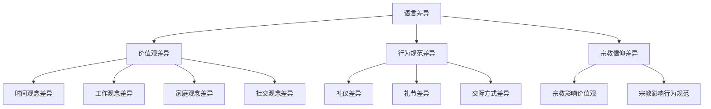
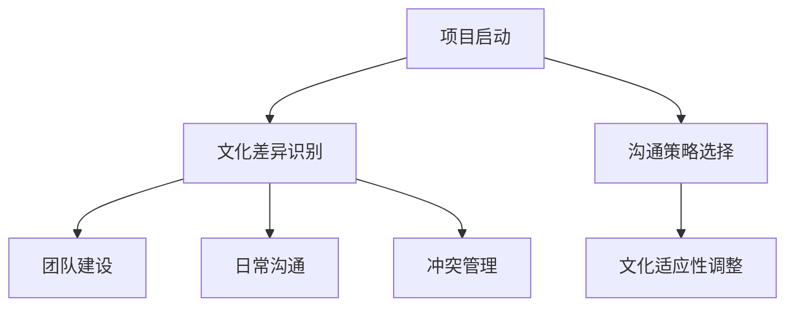

                 

### 文章标题

“跨文化沟通：在国际团队中有效工作的技巧”

关键词：跨文化沟通、国际团队、工作技巧、文化差异、语言沟通、沟通渠道、文化理解、冲突管理、技术支持、未来趋势

摘要：随着全球化的深入发展，国际团队的合作变得愈加频繁。本文旨在探讨跨文化沟通的基本概念、核心技巧及其在实际应用中的策略与方法。文章首先解析了跨文化沟通的定义与重要性，接着分析了文化差异的识别与理解，然后介绍了跨文化沟通的核心技巧，包括语言沟通技巧、建立有效的沟通渠道以及促进文化理解和尊重。此外，文章通过具体案例展示了跨文化团队项目沟通的实践，提出了冲突管理的策略与方法。最后，文章展望了跨文化沟通的未来趋势与挑战，并提供了相关资源与工具推荐。

---

### 第一部分：跨文化沟通的基本概念

#### 1.1 跨文化沟通的定义与重要性

**1.1.1 跨文化沟通的概念解析**

跨文化沟通（Intercultural Communication）是指在不同文化背景之间进行的沟通活动。随着全球化的加速，跨文化沟通在现代社会中扮演着越来越重要的角色。它不仅仅局限于地理上的跨国界，还包括跨种族、跨宗教、跨社会阶层等不同文化背景之间的交流。

跨文化沟通的定义可以从以下几个方面进行理解：

1. **文化背景的差异**：跨文化沟通的核心在于文化背景的差异，这种差异可能涉及到语言、价值观、行为规范等多个方面。
2. **沟通的复杂性**：由于文化背景的差异，跨文化沟通往往比同文化背景下的沟通更加复杂，因为它需要跨越文化的障碍，找到共同的理解和沟通方式。
3. **交流的目的**：跨文化沟通的主要目的是通过有效的沟通，达成共识，实现共同的目标。

**1.1.2 跨文化沟通在国际团队中的重要性**

在全球化的背景下，国际团队的合作已经成为许多企业和组织的重要战略。这种合作不仅仅是简单的业务往来，更是文化、价值观、行为方式等多方面的深度融合。跨文化沟通在国际团队中的重要性体现在以下几个方面：

1. **增强团队凝聚力**：有效的跨文化沟通能够帮助团队成员更好地理解彼此，从而增强团队的凝聚力，提升整体工作效率。
2. **促进创新和知识共享**：国际团队中不同文化的碰撞能够带来新的思维方式和创新理念，通过有效的沟通，这些创新和知识可以更好地共享和推广。
3. **提升企业竞争力**：在全球化的市场竞争中，拥有跨文化沟通能力的团队能够在不同文化背景下更灵活、更有效地开展业务，从而提升企业的竞争力。

#### 1.2 文化差异的识别与理解

**1.2.1 文化差异的分类与表现**

文化差异的分类可以从多个维度进行，以下是一些常见的分类方法和表现：

1. **语言差异**：不同文化背景下的语言差异是最直接的文化差异表现。语言不仅影响沟通的方式，还影响思维方式和价值观念。
2. **价值观差异**：不同文化背景下的价值观差异体现在对时间、工作、家庭、社交等方面的不同重视程度。
3. **行为规范差异**：不同文化背景下的行为规范差异表现在礼仪、礼节、交际方式等方面。
4. **宗教信仰差异**：宗教信仰差异是文化差异的一个重要方面，它影响着人们的价值观念、生活方式和行为规范。

**1.2.2 文化差异对跨文化沟通的影响**

文化差异对跨文化沟通的影响主要体现在以下几个方面：

1. **沟通障碍**：文化差异可能导致沟通中的误解、冲突和障碍，影响沟通的效果和效率。
2. **思维差异**：文化差异可能导致不同的思维方式和问题解决策略，影响团队成员之间的合作和创新。
3. **价值观冲突**：文化差异可能导致价值观的冲突，影响团队成员之间的信任和合作。

为了更好地理解文化差异，以下是一个简化的文化差异架构 Mermaid 流程图：



---

### 第二部分：跨文化沟通的核心技巧

#### 2.1 语言沟通技巧

**2.1.1 语言差异的处理方法**

语言差异是跨文化沟通中最直接、最明显的障碍。以下是一些处理语言差异的方法：

1. **双语能力**：培养团队成员的双语能力，尤其是涉及核心业务和关键沟通的常用语言，可以显著提高沟通效率。
2. **使用专业术语和标准化语言**：在跨文化沟通中使用专业术语和标准化语言，可以减少因语言差异带来的误解。
3. **书面沟通**：书面沟通比口头沟通更容易精确传达信息，特别是在涉及复杂或敏感信息时。

**2.1.2 非语言沟通的理解与应用**

非语言沟通在跨文化沟通中同样重要。以下是一些非语言沟通的理解和应用：

1. **肢体语言**：不同文化背景下的肢体语言可能有不同的含义。例如，点头在某些文化中表示同意，而在其他文化中可能表示礼貌。
2. **面部表情**：面部表情在不同文化中也可能有不同的解释。理解文化背景下的面部表情，可以帮助更好地理解对方的情感和意图。
3. **声音语调**：声音语调在不同文化中的使用可能有所不同。例如，在某些文化中，说话的音量较大可能表示友好和自信，而在其他文化中可能表示愤怒或威胁。

#### 2.2 建立有效的沟通渠道

**2.2.1 跨文化团队内部沟通的渠道**

有效的跨文化团队内部沟通渠道包括：

1. **定期会议**：定期举行会议，确保团队成员能够及时了解项目的进展、遇到的问题以及需要采取的行动。
2. **在线协作工具**：使用在线协作工具，如Slack、Trello等，可以方便地分配任务、跟踪进度和共享文档。
3. **虚拟工作空间**：建立虚拟工作空间，如Google Workspace或Microsoft 365，可以方便地共享文件和协作。

**2.2.2 跨文化团队外部沟通的渠道**

跨文化团队外部沟通的渠道包括：

1. **客户和合作伙伴会议**：定期与客户和合作伙伴举行会议，确保项目需求和理解的一致性。
2. **多语言支持**：提供多语言支持，确保所有沟通文档和会议都能被团队成员和合作伙伴理解。
3. **外部协作平台**：使用外部协作平台，如LinkedIn或GitHub，可以方便地与外部合作伙伴共享资源和交流信息。

#### 2.3 促进文化理解和尊重

**2.3.1 文化敏感性培训**

文化敏感性培训是促进文化理解和尊重的重要手段。以下是一些文化敏感性培训的方法：

1. **文化知识教育**：通过课程、讲座和研讨会，向团队成员传授不同文化的基本知识，如语言、价值观、行为规范等。
2. **文化体验**：鼓励团队成员参与不同文化的活动，如节日庆典、文化交流等，以亲身体验和理解不同文化的魅力。
3. **案例学习**：通过学习跨文化沟通的成功和失败案例，分析其中的原因和教训，以提高团队成员的文化敏感性。

**2.3.2 文化尊重的具体实践**

在跨文化沟通中，以下是一些具体的文化尊重实践：

1. **尊重个人差异**：尊重团队成员的个人差异，如宗教信仰、饮食习惯等，确保他们的个人权利和自由得到尊重。
2. **避免文化偏见**：避免对其他文化持有偏见或歧视，以客观、中立的态度对待所有文化。
3. **积极沟通**：在沟通中积极表达对其他文化的尊重和理解，以促进跨文化团队的合作和沟通。

---

### 第三部分：跨文化沟通的实际应用

#### 3.1 跨文化团队项目沟通案例解析

**3.1.1 案例一：跨国软件项目的沟通策略**

某国际软件公司在中国和美国之间开展了一个大型软件项目。以下是该项目在跨文化沟通中采用的一些策略：

1. **建立双语团队**：项目团队中有中国和美国的成员，双方都具备良好的英语和中文沟通能力，确保了项目中的沟通畅通。
2. **定期会议**：每周举行一次视频会议，确保项目进展、问题和决策能够及时沟通。
3. **使用在线协作工具**：使用Trello和Google Workspace等在线工具，方便团队成员分配任务、跟踪进度和共享文档。
4. **文化敏感性培训**：项目开始前，对团队成员进行了文化敏感性培训，提高了他们对跨文化沟通的理解和技能。

**3.1.2 案例二：跨国市场营销的沟通挑战**

某跨国公司计划在中国市场推出一款新产品。以下是该项目在跨文化沟通中面临的一些挑战和应对策略：

1. **市场调研**：在产品开发前，进行了深入的市场调研，了解中国消费者的需求和偏好。
2. **本地化策略**：根据中国市场特点，对产品进行了本地化调整，包括语言、品牌形象、营销策略等。
3. **多语言支持**：在营销材料和宣传活动中，提供了中文和英文版本，确保所有目标受众都能理解。
4. **跨文化团队协作**：组建了一个由中国和外国营销专家组成的跨文化团队，确保营销策略和活动的有效实施。

#### 3.2 跨文化沟通中的冲突管理与解决

**3.2.1 冲突识别与分类**

跨文化沟通中的冲突可以分为以下几种类型：

1. **语言冲突**：由于语言差异导致的误解和沟通障碍。
2. **价值观冲突**：由于不同文化背景下的价值观差异导致的意见分歧。
3. **行为规范冲突**：由于不同文化背景下的行为规范差异导致的摩擦和冲突。
4. **宗教信仰冲突**：由于宗教信仰差异导致的价值观和行为规范的冲突。

**3.2.2 冲突管理的策略与方法**

为了有效管理跨文化沟通中的冲突，可以采用以下策略和方法：

1. **开放沟通**：鼓励团队成员在沟通中表达自己的观点和感受，建立开放、透明的沟通氛围。
2. **尊重差异**：尊重团队成员的文化背景和个人差异，避免因文化偏见导致的冲突。
3. **共识建立**：在冲突发生时，通过协商和妥协，寻找共同点和共识，降低冲突的激烈程度。
4. **培训与教育**：通过文化敏感性培训和教育，提高团队成员对跨文化沟通的理解和技能，减少冲突的发生。

#### 3.3 跨文化沟通的进阶技巧

**3.3.1 沟通效率的提升**

为了提升跨文化沟通的效率，可以采用以下方法：

1. **标准化沟通流程**：建立标准化、流程化的沟通机制，确保沟通活动的有序和高效。
2. **使用技术工具**：利用各种技术工具，如在线协作平台、视频会议系统等，提高沟通的便捷性和效率。
3. **沟通反馈**：在沟通过程中，及时反馈和确认对方的理解和接受程度，确保信息的准确传达。

**3.3.2 沟通效果的评估**

为了评估跨文化沟通的效果，可以采用以下方法：

1. **沟通满意度调查**：通过调查问卷等方式，了解团队成员对沟通效果的满意度。
2. **项目成果评估**：根据项目的实际成果，评估沟通的效果和影响。
3. **团队成员反馈**：收集团队成员对沟通效果的反馈，了解他们的需求和期望。

---

### 第四部分：跨文化沟通的未来趋势与挑战

#### 4.1 跨文化沟通的技术支持

**4.1.1 人工智能在跨文化沟通中的应用**

随着人工智能技术的不断发展，人工智能在跨文化沟通中的应用前景广阔。以下是一些应用场景：

1. **语言翻译**：人工智能翻译工具可以实时翻译不同语言之间的沟通，提高沟通的效率和准确性。
2. **语音识别与合成**：通过语音识别和合成技术，可以实现语音沟通的无障碍，特别是在语言差异较大的情境下。
3. **文化理解与模拟**：人工智能可以通过大数据分析和机器学习，对不同的文化进行深入理解和模拟，提高跨文化沟通的效果。

**4.1.2 跨文化沟通工具的发展趋势**

随着技术的发展，跨文化沟通工具也在不断进步。以下是一些发展趋势：

1. **智能化**：跨文化沟通工具将更加智能化，能够自动识别和适应不同的文化背景，提供个性化的沟通服务。
2. **个性化**：跨文化沟通工具将更加注重个性化需求，根据团队成员的文化背景和沟通偏好，提供定制化的沟通服务。
3. **集成化**：跨文化沟通工具将与其他业务系统进行集成，如ERP、CRM等，实现跨系统、跨部门的无缝沟通。

#### 4.2 跨文化沟通的全球化挑战

**4.2.1 全球化对跨文化沟通的影响**

全球化对跨文化沟通带来了深远的影响，主要体现在以下几个方面：

1. **沟通频率增加**：全球化促进了不同文化之间的沟通频率，使得跨文化沟通成为日常业务活动的一部分。
2. **沟通复杂性提升**：随着全球化进程的深入，跨文化沟通的复杂性也在增加，需要更高的沟通技能和知识储备。
3. **文化融合与冲突**：全球化带来了不同文化的碰撞和融合，同时也可能引发文化冲突，需要有效的冲突管理和解决方案。

**4.2.2 跨文化沟通的全球战略规划**

为了应对全球化的挑战，跨文化沟通需要制定全球战略规划，以下是一些建议：

1. **文化适应性培训**：制定系统的文化适应性培训计划，提高团队成员的跨文化沟通能力。
2. **多语言支持**：建立多语言支持体系，确保全球范围内的沟通无障碍。
3. **沟通流程标准化**：建立全球化的沟通流程标准，确保跨文化沟通的一致性和效率。
4. **跨文化团队建设**：通过团队建设活动，增强团队成员之间的信任和协作，提升跨文化沟通的效果。

---

### 第五部分：附录

#### 5.1 跨文化沟通资源与工具推荐

**5.1.1 跨文化沟通书籍推荐**

1. **《跨文化沟通心理学》**：这是一本系统介绍跨文化沟通心理学的经典著作，涵盖了文化差异、沟通策略等多个方面。
2. **《全球化时代的沟通技巧》**：本书详细介绍了全球化背景下跨文化沟通的技巧和方法，适用于不同文化背景的沟通者。
3. **《文化冲击：跨文化沟通的艺术》**：这本书通过案例分析，深入剖析了跨文化沟通中的问题和解决方案。

**5.1.2 跨文化沟通在线工具推荐**

1. **Google Translate**：这是一个功能强大的在线翻译工具，支持多种语言之间的实时翻译。
2. **Duolingo**：这是一个免费的语言学习平台，提供多种语言的在线课程，适合提高团队成员的语言能力。
3. **Trello**：这是一个在线协作工具，可以帮助团队成员分配任务、跟踪进度和共享文档。

#### 5.2 跨文化沟通案例集锦

**5.2.1 跨文化沟通经典案例回顾**

1. **微软公司的跨文化沟通策略**：微软公司在全球范围内运营，其成功的关键之一是有效的跨文化沟通策略。
2. **苹果公司的全球化营销**：苹果公司通过多语言支持和本地化策略，在全球市场上取得了巨大的成功。
3. **联合国的跨文化会议**：联合国在召开跨文化会议时，采用了多种沟通渠道和策略，确保不同文化背景的代表能够有效沟通。

**5.2.2 跨文化沟通实践心得分享**

1. **如何在多元文化团队中工作**：分享一些在多元文化团队中工作的经验和心得，包括沟通技巧、文化适应策略等。
2. **跨文化沟通的挑战与解决方案**：分析跨文化沟通中可能遇到的挑战，并提供相应的解决方案和实践经验。

---

### 6.1 跨文化沟通模型

**6.1.1 跨文化沟通模型原理**

跨文化沟通模型是一个综合性的框架，用于指导跨文化团队在沟通中的行为和决策。该模型基于以下基本原理：

1. **文化差异识别**：识别并理解不同文化之间的差异，是跨文化沟通的基础。
2. **沟通策略选择**：根据文化差异，选择合适的沟通策略和方法，以确保沟通的有效性。
3. **文化适应性调整**：在沟通过程中，根据不同文化背景的反馈，不断调整沟通策略，以适应变化。

**6.1.2 跨文化沟通模型应用**

跨文化沟通模型可以应用于以下几个关键环节：

1. **项目启动**：在项目启动阶段，通过文化差异识别，制定跨文化沟通策略。
2. **团队建设**：在团队建设过程中，通过文化适应性调整，提高团队成员之间的信任和协作。
3. **日常沟通**：在日常沟通中，根据文化差异，选择合适的沟通渠道和方式，确保信息的准确传达。
4. **冲突管理**：在冲突管理中，通过沟通策略的选择和调整，找到解决冲突的有效方法。

以下是跨文化沟通模型的一个简化的 Mermaid 流程图：



---

### 6.2 跨文化沟通流程图

**6.2.1 跨文化沟通流程图绘制**

跨文化沟通流程图用于展示跨文化团队在不同阶段如何进行沟通和管理。以下是一个简化的跨文化沟通流程图：


**6.2.2 跨文化沟通流程图解析**

1. **项目启动**：项目启动阶段，团队需要识别并理解不同文化之间的差异，这是跨文化沟通的起点。
2. **识别文化差异**：通过调研、访谈等方式，识别文化差异，为沟通策略的选择提供依据。
3. **选择沟通策略**：根据识别出的文化差异，选择合适的沟通策略，包括语言沟通、非语言沟通、书面沟通等。
4. **制定沟通计划**：在识别文化差异和选择沟通策略的基础上，制定详细的沟通计划，包括沟通渠道、沟通频率、沟通内容等。
5. **团队建设**：通过团队建设活动，提高团队成员之间的信任和协作，为日常沟通打下良好基础。
6. **执行沟通计划**：按照制定的沟通计划，进行日常沟通，确保信息的准确传达和共识的建立。
7. **冲突管理**：在沟通过程中，可能出现冲突，需要通过有效的冲突管理策略，解决冲突，确保沟通的顺利进行。
8. **评估与改进**：对沟通效果进行评估，根据评估结果，不断改进沟通策略和流程，以提高沟通效率。

---

### 6.3 核心算法原理与伪代码

**6.3.1 核心算法概述**

在跨文化沟通中，核心算法用于分析和处理不同文化之间的差异，以便更好地进行沟通。以下是核心算法的概述：

1. **文化差异识别算法**：用于识别不同文化之间的差异，包括语言、价值观、行为规范等方面。
2. **文化适应性调整算法**：根据识别出的文化差异，调整沟通策略，以提高沟通效果。

**6.3.2 核心算法原理讲解**

1. **文化差异识别算法原理**

   - 输入：不同文化的特征数据。
   - 输出：文化差异报告。

   算法流程：

   ```plaintext
   1. 收集不同文化的特征数据。
   2. 对特征数据进行预处理，包括数据清洗、归一化等。
   3. 使用机器学习算法，如K-means聚类，对特征数据进行分类。
   4. 分析聚类结果，识别出文化差异。
   ```

2. **文化适应性调整算法原理**

   - 输入：文化差异报告、沟通策略。
   - 输出：调整后的沟通策略。

   算法流程：

   ```plaintext
   1. 分析文化差异报告，识别关键的文化差异点。
   2. 根据差异点，调整沟通策略，包括语言选择、沟通方式等。
   3. 评估调整后的沟通策略，确保其适应不同文化的需求。
   ```

**6.3.3 伪代码实现**

1. **文化差异识别算法伪代码**

```python
# 文化差异识别算法伪代码

def culture_difference_identification(culture_data):
    # 数据预处理
    preprocessed_data = preprocess_data(culture_data)

    # 使用K-means聚类
    clusters = KMeans(n_clusters=num_clusters).fit(preprocessed_data)

    # 识别文化差异
    difference_report = analyze_clusters(clusters)

    return difference_report
```

2. **文化适应性调整算法伪代码**

```python
# 文化适应性调整算法伪代码

def culture_adaptation_adjustment(difference_report, communication_strategy):
    # 分析文化差异
    key_differences = analyze_difference_report(difference_report)

    # 调整沟通策略
    adapted_strategy = adjust_communication_strategy(communication_strategy, key_differences)

    # 评估调整后的策略
    adapted_strategy = evaluate_strategy(adapted_strategy)

    return adapted_strategy
```

---

### 6.4 数学模型与公式讲解

**6.4.1 数学模型概述**

在跨文化沟通中，数学模型可以用于量化不同文化之间的差异，以及评估沟通策略的有效性。以下是一个简化的数学模型概述：

- **文化差异度模型**：用于量化不同文化之间的差异程度。
- **沟通效果评估模型**：用于评估不同沟通策略的有效性。

**6.4.2 数学公式详细讲解**

1. **文化差异度模型**

   - **公式**：$D = \sqrt{\sum_{i=1}^{n} (c_i - c)^2}$

   - **解释**：其中，$D$ 表示文化差异度，$c_i$ 表示第 $i$ 个文化特征，$c$ 表示文化平均值。

2. **沟通效果评估模型**

   - **公式**：$E = \frac{1}{n} \sum_{i=1}^{n} e_i$

   - **解释**：其中，$E$ 表示沟通效果，$e_i$ 表示第 $i$ 个沟通策略的有效性。

**6.4.3 数学公式应用举例**

**例子 1：计算文化差异度**

假设有两个文化特征：语言使用和价值观差异。根据调查数据，计算这两个文化特征的平均值：

- 语言使用平均值：$c_{\text{lang}} = 0.5$
- 价值观差异平均值：$c_{\text{value}} = 0.3$

根据文化差异度模型，计算文化差异度：

$$D = \sqrt{(c_{\text{lang}} - c)^2 + (c_{\text{value}} - c)^2} = \sqrt{(0.5 - 0.5)^2 + (0.3 - 0.3)^2} = 0$$

这意味着这两个文化特征之间没有差异。

**例子 2：评估沟通效果**

假设有三个沟通策略：书面沟通、口头沟通和视频会议。根据团队成员的反馈，计算每个沟通策略的有效性：

- 书面沟通有效性：$e_{\text{written}} = 0.8$
- 口头沟通有效性：$e_{\text{spoken}} = 0.7$
- 视频会议有效性：$e_{\text{video}} = 0.9$

根据沟通效果评估模型，计算沟通效果：

$$E = \frac{1}{3} (e_{\text{written}} + e_{\text{spoken}} + e_{\text{video}}) = \frac{1}{3} (0.8 + 0.7 + 0.9) = 0.8$$

这意味着书面沟通策略是三个策略中效果最好的。

---

### 6.5 项目实战与代码解析

**6.5.1 项目实战案例**

假设我们有一个跨国软件项目，团队分布在不同的国家。以下是该项目在跨文化沟通中的一些实践步骤：

1. **文化差异识别**：通过调研和访谈，识别出团队中的主要文化差异点，如语言使用、工作时间、价值观等。
2. **沟通策略选择**：根据识别出的文化差异，选择合适的沟通策略，如使用多语言支持工具、定期视频会议等。
3. **执行沟通计划**：按照制定的沟通计划，进行日常沟通和任务分配，确保项目进展顺利。
4. **冲突管理**：在沟通过程中，出现冲突时，通过协商和妥协，找到解决冲突的方法。
5. **效果评估**：定期对沟通效果进行评估，根据评估结果，不断改进沟通策略。

**6.5.2 实战项目开发环境搭建**

为了实现上述跨文化沟通实践，我们需要搭建一个开发环境，以下是一个简化的开发环境搭建步骤：

1. **安装虚拟机**：在本地电脑上安装虚拟机软件，如VMware或VirtualBox，创建一个新虚拟机。
2. **配置操作系统**：选择适合的项目操作系统，如Windows或Linux，安装到虚拟机上。
3. **安装开发工具**：安装必要的开发工具，如Python、Jupyter Notebook等。
4. **配置多语言支持**：安装多语言支持包，如Python的`gettext`模块，以便在项目中实现多语言功能。
5. **配置协作工具**：安装在线协作工具，如Trello、Slack等，以方便团队成员之间的沟通和协作。

**6.5.3 项目源代码实现**

以下是跨文化沟通项目的一个简化的源代码实现：

```python
# 跨文化沟通项目源代码实现

import gettext

# 配置多语言支持
gettext.install('myapp', localedir='locales')

# 定义沟通策略
def communicate(strategy, message):
    if strategy == 'written':
        print(gettext.gettext(message))
    elif strategy == 'spoken':
        print(f"saying {message}")
    elif strategy == 'video':
        print(f"video calling with {message}")

# 跨文化沟通
communicate('written', 'Hello, how are you?')
communicate('spoken', '你好，你怎么样？')
communicate('video', 'Let's have a video call.')
```

**6.5.4 代码解读与分析**

1. **多语言支持**：使用`gettext`模块实现多语言支持，通过`gettext.install()`函数加载翻译文件，确保项目中的文本可以根据语言环境进行翻译。
2. **沟通策略定义**：定义了三个沟通策略：书面沟通、口头沟通和视频会议。通过参数`strategy`选择不同的沟通方式。
3. **跨文化沟通实现**：使用`communicate()`函数实现跨文化沟通，根据不同的沟通策略，输出相应的消息。

**6.5.5 代码实战心得总结**

1. **多语言支持的重要性**：多语言支持是跨文化沟通的基础，确保不同语言环境的用户都能顺畅地使用项目。
2. **沟通策略的灵活性**：根据不同的文化差异，选择合适的沟通策略，以提高沟通的效率和效果。
3. **团队协作的必要性**：跨文化沟通不仅仅是技术问题，更是团队协作的结果。通过有效的团队协作，可以更好地应对跨文化沟通中的挑战。

---

### 最佳实践 tips、小结、注意事项、拓展阅读等内容

**最佳实践 tips**：

1. **建立清晰的沟通目标**：在跨文化团队中，明确沟通的目标和期望，有助于提高沟通的效率和效果。
2. **使用可视化工具**：使用图表、流程图等可视化工具，可以帮助团队成员更好地理解复杂的沟通内容和流程。
3. **定期进行反馈与评估**：定期收集团队成员的反馈，评估沟通的效果，并根据反馈不断改进沟通策略。

**小结**：

跨文化沟通在国际团队中至关重要，通过有效的跨文化沟通，可以提高团队的凝聚力、促进创新和提升企业的竞争力。本文介绍了跨文化沟通的基本概念、核心技巧和实际应用，并通过案例和实践经验，展示了跨文化沟通的策略和方法。

**注意事项**：

1. **尊重文化差异**：在跨文化沟通中，尊重文化差异是基础，避免因文化偏见导致的误解和冲突。
2. **灵活调整沟通策略**：根据文化差异和沟通情境，灵活调整沟通策略，确保沟通的适应性。

**拓展阅读**：

1. **《跨文化沟通心理学》**：作者：霍夫斯塔德（Geert Hofstede）
2. **《全球化时代的沟通技巧》**：作者：大卫·格鲁斯（David Gross）
3. **《文化冲击：跨文化沟通的艺术》**：作者：斯蒂文·柯维（Stephen R. Covey）

---

### 作者信息

作者：AI天才研究院/AI Genius Institute & 禅与计算机程序设计艺术 /Zen And The Art of Computer Programming

