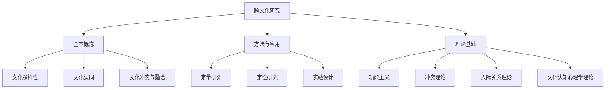

                 

# 跨文化科学研究：多元文化视角下的世界理解

## 关键词

跨文化研究、文化多样性、文化认同、多元文化模型、全球化、文化冲突与融合

## 摘要

随着全球化的加速，跨文化研究成为了理解世界多元性的重要途径。本文从跨文化科学研究的基础出发，探讨了文化多样性与文化认同，分析了跨文化研究的理论基础和方法论，并深入讨论了跨文化心理学、教育研究和商业研究等领域。最后，文章展望了跨文化科学研究的前沿与挑战，提出了未来发展的建议。

## 目录

### 第一部分：跨文化科学研究的基础

#### 第1章：跨文化研究的基本概念

##### 1.1 跨文化研究的起源与发展

##### 1.2 跨文化研究的定义与目的

##### 1.3 跨文化研究的核心问题

#### 第2章：文化多样性与文化认同

##### 2.1 文化多样性的概念与特点

##### 2.2 文化认同的构成与影响

##### 2.3 文化冲突与融合

#### 第3章：跨文化研究的理论基础

##### 3.1 功能主义与冲突理论

##### 3.2 人际关系理论

##### 3.3 文化认知心理学理论

### 第二部分：跨文化科学研究的方法与应用

#### 第4章：跨文化研究的方法论

##### 4.1 定量研究与定性研究

##### 4.2 自我报告法与行为观察法

##### 4.3 实验设计与方法论

#### 第5章：跨文化心理学研究

##### 5.1 跨文化心理差异

##### 5.2 跨文化沟通与冲突

##### 5.3 跨文化适应与心理健康

#### 第6章：跨文化教育研究

##### 6.1 跨文化教育的目标与策略

##### 6.2 跨文化课程设计

##### 6.3 跨文化教学评估

#### 第7章：跨文化商业研究

##### 7.1 跨文化营销与品牌管理

##### 7.2 跨文化人力资源管理

##### 7.3 跨文化企业社会责任

### 第三部分：跨文化科学研究的前沿与挑战

#### 第8章：全球化背景下的跨文化研究趋势

##### 8.1 全球化对文化的影响

##### 8.2 跨文化研究的国际化合作

##### 8.3 跨文化研究的未来展望

#### 第9章：跨文化科学研究中的伦理问题

##### 9.1 跨文化研究的伦理原则

##### 9.2 跨文化研究中的伦理争议

##### 9.3 伦理问题与解决方案

#### 第10章：跨文化科学研究的技术支持

##### 10.1 数据分析与人工智能在跨文化研究中的应用

##### 10.2 跨文化研究的新工具与方法

##### 10.3 技术支持与跨文化研究的发展

### 附录

#### 附录A：跨文化研究的主要工具与资源

##### A.1 跨文化研究的关键数据库

##### A.2 跨文化研究的主要期刊

##### A.3 跨文化研究的学术会议

##### A.4 跨文化研究的主要在线资源

#### 附录B：跨文化研究的案例研究

##### B.1 案例一：跨文化沟通中的障碍与解决策略

##### B.2 案例二：跨文化教育中的挑战与启示

##### B.3 案例三：跨文化商业中的成功与失败分析

### Mermaid 流程图：跨文化研究的核心概念与联系

### 核心算法原理讲解：多元文化模型构建与评估

#### 多元文化模型构建与评估

##### 1. 多元文化模型的定义

多元文化模型是指用于捕捉和分析多个文化群体之间差异和相似性的统计模型。这类模型广泛应用于跨文化研究，帮助研究者理解文化多样性对个体行为、心理和社会结构的影响。

##### 2. 多元文化模型构建

多元文化模型构建主要包括以下几个步骤：

- **数据收集**：收集不同文化群体的数据，包括文化特征、行为指标、心理变量等。
- **变量选择**：根据研究目的选择相关变量，进行数据预处理和筛选。
- **模型建立**：采用统计学方法建立多元文化模型，如线性回归、逻辑回归、因子分析等。
- **模型验证**：使用验证集或交叉验证方法评估模型性能。

##### 3. 多元文化模型评估

多元文化模型评估主要包括以下几个指标：

- **拟合度指标**：如R²值、均方误差（MSE）、均方根误差（RMSE）等。
- **模型稳定性**：通过调整模型参数和变量，观察模型在不同数据集上的稳定性。
- **预测能力**：使用测试集评估模型对新数据的预测能力。

### 跨文化研究的基本概念

##### 1.1 跨文化研究的起源与发展

跨文化研究起源于20世纪中叶，随着全球化进程的加快，人们开始意识到文化多样性对人类行为和社会发展的重要性。最早的跨文化研究主要集中在人类学和社会学领域，研究者通过田野调查和对比分析，试图揭示不同文化群体之间的差异和相似性。

跨文化研究的发展历程可以分为以下几个阶段：

1. **描述阶段**：研究者主要关注文化现象的描述，收集和整理不同文化群体的文化特征和价值观。
2. **解释阶段**：研究者开始试图解释文化差异背后的原因，如功能主义和冲突理论等。
3. **应用阶段**：跨文化研究逐渐应用于心理学、教育学、商业等领域，为解决实际问题提供理论支持和实践指导。

##### 1.2 跨文化研究的定义与目的

跨文化研究是指通过比较和分析不同文化群体之间的行为、心理和社会特征，以理解文化多样性和文化影响的研究领域。其定义可以概括为以下几个方面：

1. **文化**：文化是人们在特定社会环境中形成的共同价值观、信仰、行为规范和生活方式的集合。
2. **文化群体**：文化群体是指具有相似文化特征和价值观的个体组成的群体。
3. **跨文化**：跨文化是指在不同文化群体之间进行的比较和分析。

跨文化研究的目的是：

1. **理解文化差异**：通过比较不同文化群体之间的行为和心理特征，揭示文化差异的实质和原因。
2. **促进文化交流**：通过理解和尊重不同文化的价值观和生活方式，促进不同文化群体之间的交流和合作。
3. **解决实际问题**：跨文化研究为解决实际社会问题提供理论支持和实践指导，如跨文化沟通、跨文化教育、跨文化管理等。

##### 1.3 跨文化研究的核心问题

跨文化研究的核心问题可以概括为以下几个方面：

1. **文化差异的测量与评估**：如何准确测量和评估不同文化群体之间的差异，是跨文化研究的重要问题。研究者通常采用问卷调查、实验设计、实地观察等方法收集数据，然后运用统计学方法分析数据。
2. **文化影响的机制**：不同文化对个体行为和心理的影响是如何发生的，是跨文化研究的另一个重要问题。研究者通过实验、案例研究和理论分析，试图揭示文化影响的心理机制和社会机制。
3. **跨文化适应与心理健康**：跨文化适应对个体的心理健康有何影响，是跨文化研究关注的重要问题。研究者通过问卷调查、实验研究和实地观察，探讨跨文化适应对个体心理健康的影响因素和干预策略。
4. **跨文化沟通与冲突**：如何有效进行跨文化沟通，减少文化冲突，是跨文化研究的另一个重要问题。研究者通过案例研究和实验设计，探讨跨文化沟通的技巧和策略，以及文化冲突的解决方法。

### 文化多样性与文化认同

##### 2.1 文化多样性的概念与特点

文化多样性是指不同文化群体之间在价值观、信仰、行为规范、语言、艺术等方面的差异。文化多样性是人类社会的基本特征，也是全球化背景下一个重要的现象。

文化多样性的特点包括：

1. **广泛性**：文化多样性涵盖了人类生活的各个方面，包括经济、政治、社会、科技、艺术等。
2. **差异性**：不同文化群体之间的差异体现在价值观、信仰、行为规范、语言、艺术等方面。
3. **动态性**：文化多样性是动态发展的，随着社会变迁和全球化进程，不同文化之间相互影响和融合，新的文化形式不断出现。

##### 2.2 文化认同的构成与影响

文化认同是指个体对自己所属文化群体的认同感和归属感。文化认同的构成包括以下几个方面：

1. **文化价值观**：文化价值观是文化认同的核心，反映了个体对文化的认知和评价。
2. **文化传统**：文化传统是文化认同的基础，包括历史、习俗、宗教等。
3. **文化符号**：文化符号是文化认同的象征，如国旗、国歌、传统服饰等。
4. **文化群体**：文化群体是文化认同的社会基础，个体通过所属的文化群体实现文化认同。

文化认同对个体和社会的影响包括：

1. **个体层面**：文化认同有助于个体的身份认同和自尊心，增强个体的文化自信心和归属感。
2. **社会层面**：文化认同有助于社会的稳定和和谐，减少文化冲突和矛盾。
3. **全球化层面**：文化认同有助于全球化背景下的文化交流与合作，促进不同文化群体之间的相互理解和尊重。

##### 2.3 文化冲突与融合

文化冲突是指不同文化群体之间因价值观、信仰、行为规范等方面的差异而产生的矛盾和对抗。文化冲突的原因包括：

1. **文化差异**：不同文化之间的差异是文化冲突的根本原因。
2. **利益冲突**：不同文化群体在资源分配、权力结构等方面的利益冲突也是文化冲突的重要原因。
3. **误解与偏见**：对其他文化的误解和偏见也是导致文化冲突的重要因素。

文化融合是指不同文化群体之间的相互影响和融合，形成新的文化形式。文化融合的方式包括：

1. **文化吸纳**：一个文化群体吸收另一个文化的元素，形成新的文化特征。
2. **文化互鉴**：不同文化群体相互学习，取长补短，形成新的文化形式。
3. **文化创新**：不同文化群体之间的融合产生新的文化创新，如音乐、艺术、科技等领域。

文化冲突与融合的关系：

1. **相互影响**：文化冲突和文化融合是相互影响、相互作用的，文化冲突可以促进文化融合，文化融合也可以缓解文化冲突。
2. **动态发展**：文化冲突与融合是一个动态发展的过程，随着社会变迁和全球化进程，文化冲突与融合的形式和内容也在不断变化。

### 跨文化研究的理论基础

##### 3.1 功能主义与冲突理论

功能主义和冲突理论是跨文化研究中的重要理论基础，它们分别从不同的角度解释文化差异和社会变迁。

**功能主义理论**

功能主义理论起源于社会学领域，主要代表人物有埃米尔·涂尔干和塔尔科特·帕森斯。功能主义理论认为，社会文化体系中的各个部分（如家庭、教育、宗教等）都有其特定的功能，共同维持社会的稳定和秩序。功能主义理论的核心观点包括：

1. **社会整合**：文化通过规范和价值观将个体整合到社会体系中，维护社会秩序。
2. **功能互补**：社会文化体系中的各个部分相互依赖、相互补充，共同实现社会功能。
3. **适应性**：文化具有适应性，可以随着环境变化进行调整和变革。

在跨文化研究中，功能主义理论有助于理解不同文化群体之间的社会结构和功能差异。例如，研究者可以通过分析不同文化群体的家庭结构、教育制度、宗教信仰等，揭示其社会功能和文化特征。

**冲突理论**

冲突理论起源于马克思主义社会学，主要代表人物有赖特·米尔斯、C. Wright Mills和艾德华·A. 塔夫里。冲突理论认为，社会是由不同利益群体组成的，这些利益群体之间存在着竞争和冲突，文化差异是冲突的表现形式。冲突理论的核心观点包括：

1. **阶级斗争**：社会文化体系中的阶级冲突是文化差异的根本原因。
2. **利益分配**：文化差异反映了不同群体在资源分配、权力结构等方面的不平等。
3. **文化构建**：文化是权力斗争的工具，统治阶级通过文化塑造和传播，维护其统治地位。

在跨文化研究中，冲突理论有助于解释文化冲突和社会不平等现象。例如，研究者可以通过分析不同文化群体在经济发展、政治制度、教育机会等方面的差异，揭示其背后的权力结构和利益冲突。

**功能主义与冲突理论的关系**

功能主义和冲突理论是相互补充的，它们共同构成了跨文化研究的理论基础。功能主义理论强调文化对社会的稳定和秩序的作用，而冲突理论则强调文化对社会不平等和冲突的影响。跨文化研究可以结合功能主义和冲突理论的视角，从不同角度分析文化差异和社会变迁。

##### 3.2 人际关系理论

人际关系理论是心理学领域的重要理论，主要研究个体在社交互动中的心理过程和行为模式。人际关系理论对跨文化研究有着重要的影响，因为它关注文化因素在人际交往中的作用。

**人际关系的构成**

人际关系理论认为，人际关系包括三个基本成分：认知成分、情感成分和行为成分。

1. **认知成分**：指个体对他人和自我关系的认知和理解，包括对他人行为的意义解释、自我形象和他人形象等。
2. **情感成分**：指个体对他人和自我关系的情感体验，包括喜爱、厌恶、同情、敌对等。
3. **行为成分**：指个体在人际交往中的行为表现，包括言语表达、非言语表达、社交技巧等。

**文化对人际关系的影响**

文化因素在人际关系中起着重要的作用，它影响着个体对他人和自我关系的认知、情感和行为。

1. **文化价值观**：不同文化价值观对人际关系的认知和情感产生深远影响。例如，一些文化强调集体主义，重视群体利益和关系，而另一些文化强调个人主义，重视个人权利和自由。
2. **文化习俗**：文化习俗影响个体在人际交往中的行为规范和社交技巧。例如，一些文化鼓励直接表达情感，而另一些文化则强调含蓄和克制。
3. **文化认同**：文化认同影响个体对他人的评价和自我形象，进而影响人际关系。

**跨文化人际关系研究**

跨文化人际关系研究关注不同文化背景下的人际关系差异和互动模式。研究者通过实验、问卷调查和案例研究等方法，探讨文化因素在跨文化人际关系中的作用。

1. **文化差异的测量**：研究者使用量表和问卷测量不同文化背景下的人际关系特征，如信任、冲突、合作等。
2. **文化影响的机制**：研究者试图揭示文化因素在跨文化人际关系中的心理机制，如认知偏误、情感反应、行为策略等。
3. **跨文化人际沟通**：研究者探讨跨文化背景下的人际沟通技巧和策略，如语言表达、非言语沟通、文化适应等。

##### 3.3 文化认知心理学理论

文化认知心理学理论是心理学领域近年来兴起的一个研究方向，它关注文化因素在认知过程中的作用。文化认知心理学理论对跨文化研究有着重要的启示，因为它揭示了文化差异对个体认知的影响。

**文化认知心理学的核心观点**

文化认知心理学的核心观点包括：

1. **文化认知框架**：文化认知框架是指个体在认知过程中所采用的文化视角和价值观。不同文化背景下的个体具有不同的文化认知框架，这影响了他们对信息的理解和解释。
2. **文化认知偏差**：文化认知偏差是指个体在认知过程中受到文化因素的影响，导致对信息的解释和评价存在偏差。例如，一些文化强调集体主义，可能导致个体在评价他人时更倾向于考虑群体利益。
3. **文化认知发展**：文化认知发展是指个体在不同文化背景下认知能力的形成和发展。文化认知心理学研究不同文化背景下儿童的认知发展，如语言学习、思维模式、道德判断等。

**文化认知心理学在跨文化研究中的应用**

文化认知心理学理论在跨文化研究中有着广泛的应用，以下是一些具体的研究领域：

1. **跨文化认知差异**：研究者通过实验和问卷调查，探讨不同文化背景下个体在感知、记忆、思维等方面的差异。例如，一些研究发现，集体主义文化背景下的个体在评价他人时更倾向于考虑群体利益，而个人主义文化背景下的个体则更注重个人利益。
2. **跨文化认知适应**：研究者探讨个体在不同文化背景下的认知适应策略，如文化认同、文化调适等。例如，一些研究发现，跨文化迁移者通过适应新的文化认知框架，可以更好地适应新的文化环境。
3. **跨文化认知发展**：研究者探讨不同文化背景下儿童认知发展的过程和特点。例如，一些研究发现，集体主义文化背景下的儿童在道德判断方面更倾向于考虑群体利益，而个人主义文化背景下的儿童则更注重个人利益。

### 跨文化研究的方法论

##### 4.1 定量研究与定性研究

跨文化研究的方法论主要包括定量研究和定性研究两种方法。这两种方法各有优缺点，适用于不同的研究场景。

**定量研究**

定量研究是通过量化的方法收集和分析数据，以揭示变量之间的关系。定量研究的特点包括：

1. **数据量化**：定量研究将研究变量量化，如通过问卷、量表等工具收集数据。
2. **统计分析**：定量研究使用统计学方法对数据进行处理和分析，如回归分析、相关分析等。
3. **样本代表性**：定量研究通常要求大样本量，以提高研究结果的代表性和可靠性。

定量研究的优点包括：

1. **数据精确**：通过量化方法，可以更精确地测量和研究变量。
2. **数据分析**：使用统计学方法，可以揭示变量之间的复杂关系。
3. **可重复性**：定量研究具有可重复性，便于其他研究者验证研究结果。

定量研究的缺点包括：

1. **主观偏差**：定量研究依赖问卷、量表等工具，可能存在主观偏差。
2. **样本局限性**：大样本量可能导致样本局限性，难以全面反映文化差异。
3. **研究成本**：定量研究通常需要大量人力、物力和时间投入。

**定性研究**

定性研究是通过质化的方法收集和分析数据，以揭示文化现象的本质和内在机制。定性研究的特点包括：

1. **数据质性**：定性研究注重数据的质性，如访谈、观察、案例研究等。
2. **深度分析**：定性研究通过深度分析，挖掘数据的深层含义和内涵。
3. **灵活性**：定性研究具有灵活性，可以随时调整研究内容和方法。

定性研究的优点包括：

1. **深度理解**：定性研究可以深入了解文化现象的内涵和机制。
2. **灵活性**：定性研究可以根据研究情境随时调整方法和内容。
3. **数据丰富**：定性研究可以收集丰富多样的数据，为研究提供更多细节。

定性研究的缺点包括：

1. **数据代表性**：定性研究样本量通常较小，难以代表整体文化差异。
2. **分析难度**：定性研究数据质性复杂，分析难度较大。
3. **研究成本**：定性研究通常需要较长时间和人力资源。

**定量研究与定性研究的结合**

为了充分发挥定量和定性研究的优点，跨文化研究常常将两者结合起来。例如，研究者可以先通过定性研究深入了解文化现象的本质和内在机制，然后再通过定量研究验证研究结果。这种结合方法可以弥补单一方法的局限性，提高研究的深度和广度。

##### 4.2 自我报告法与行为观察法

跨文化研究中的数据收集方法主要包括自我报告法和行为观察法。

**自我报告法**

自我报告法是通过问卷、访谈等方式收集个体对自己行为、态度和心理状态的报告。自我报告法的特点包括：

1. **主观性**：自我报告法依赖个体的主观感受和认知，可能存在主观偏差。
2. **灵活性**：自我报告法可以根据研究需要灵活调整问题和选项。
3. **数据量**：自我报告法可以收集大量数据，为统计分析提供基础。

自我报告法的优点包括：

1. **成本低**：自我报告法通常不需要大量人力和物力投入。
2. **数据丰富**：可以通过多种问题形式收集丰富的数据，为研究提供全面的信息。
3. **数据多样**：可以通过问卷调查收集不同文化背景下的数据，进行跨文化比较。

自我报告法的缺点包括：

1. **主观偏差**：个体可能存在记忆偏差、社会期望效应等，影响数据准确性。
2. **回答偏差**：个体可能不愿意或不敢真实回答敏感问题，影响数据的真实性。
3. **样本代表性**：大样本量的自我报告法可能导致样本局限性，难以全面反映文化差异。

**行为观察法**

行为观察法是通过直接观察个体在自然环境中的行为，收集文化相关的数据。行为观察法的特点包括：

1. **客观性**：行为观察法可以更客观地收集数据，减少主观偏差。
2. **全面性**：行为观察法可以收集到个体在不同情境下的行为数据，更全面地反映文化差异。
3. **实时性**：行为观察法可以实时收集数据，为研究提供实时反馈。

行为观察法的优点包括：

1. **客观性**：通过直接观察，可以更客观地记录个体的行为，减少主观偏差。
2. **全面性**：可以收集到个体在不同情境下的行为数据，更全面地反映文化差异。
3. **实时性**：可以实时收集数据，为研究提供实时反馈。

行为观察法的缺点包括：

1. **时间成本**：行为观察法通常需要较长时间，可能影响研究的进度和成本。
2. **样本局限性**：行为观察法样本量通常较小，难以代表整体文化差异。
3. **环境干扰**：自然环境中的观察可能受到环境干扰，影响数据的准确性。

**自我报告法与行为观察法的结合**

为了充分发挥自我报告法和行为观察法的优点，跨文化研究常常将两者结合起来。例如，研究者可以先通过自我报告法收集个体自我报告的数据，再通过行为观察法验证数据的准确性。这种结合方法可以弥补单一方法的局限性，提高研究的深度和广度。

##### 4.3 实验设计与方法论

跨文化研究中的实验设计是验证假设和理论的重要手段。实验设计需要充分考虑文化因素，以确保实验结果的可靠性和有效性。

**实验设计的原则**

1. **控制变量**：实验设计需要控制文化因素，以排除其他变量的影响。例如，可以采用文化匹配的实验组和对照组，确保两组在文化背景上的一致性。
2. **随机分配**：实验设计需要采用随机分配方法，以确保实验组和对照组在文化背景上的平衡。
3. **重复实验**：实验设计需要重复实验，以验证结果的稳定性和可靠性。

**实验设计的方法**

1. **实验室实验**：实验室实验是在受控环境下进行的实验，通过设计特定的实验情境和任务，观察个体在文化背景下的行为和心理反应。实验室实验的优点包括控制变量、实验条件可重复等，缺点包括可能受实验情境的影响，难以完全反映现实情境。
2. **现场实验**：现场实验是在自然环境下进行的实验，通过直接观察个体在自然环境中的行为和心理反应。现场实验的优点包括更接近现实情境，缺点包括实验条件难以控制，结果可能受环境干扰。
3. **模拟实验**：模拟实验是通过模拟现实情境进行的实验，通过计算机模拟或虚拟现实技术，观察个体在模拟情境下的行为和心理反应。模拟实验的优点包括可以控制实验条件，缺点包括可能缺乏现实情境的复杂性。

**实验设计的案例分析**

以下是一个跨文化研究的实验设计案例：

**研究目的**：探讨文化背景对个体决策行为的影响。

**实验设计**：

1. **实验组与对照组**：将参与者随机分为实验组和对照组，实验组在文化匹配的实验情境下进行决策，对照组在自然环境下进行决策。
2. **实验情境**：设计一个模拟决策情境，如投资决策、消费决策等，确保实验组和对照组在决策任务上的一致性。
3. **实验条件**：实验组在实验室中进行决策，对照组在自然环境下进行决策，观察两组在决策过程中的行为和心理反应。
4. **数据收集**：通过问卷调查和观察记录收集实验数据和决策行为数据，分析实验组和对照组在决策行为上的差异。

**数据分析**：

1. **描述性分析**：对实验组和对照组的决策行为进行描述性统计分析，如平均决策时间、决策满意度等。
2. **差异分析**：通过t检验、方差分析等统计方法，比较实验组和对照组在决策行为上的差异，验证文化背景对个体决策行为的影响。

**实验结果**：

1. **实验组与对照组的决策行为差异**：分析结果显示，实验组和对照组在决策行为上存在显著差异，实验组的决策行为更倾向于理性分析，而对照组的决策行为更受情感影响。
2. **文化背景的影响**：实验结果验证了文化背景对个体决策行为的影响，文化背景越强，个体在决策过程中越倾向于考虑文化价值观和规范。

**实验结论**：

1. **文化背景对决策行为的影响**：文化背景对个体决策行为有显著影响，不同文化背景下个体在决策行为上存在差异。
2. **跨文化决策策略**：为应对不同文化背景下的决策挑战，个体需要调整决策策略，考虑文化价值观和规范，提高决策效率。

### 跨文化心理学研究

##### 5.1 跨文化心理差异

跨文化心理学研究关注不同文化背景下个体心理特征的差异。这些差异包括认知风格、情绪表达、价值观、自我认知等方面。

**认知风格差异**

不同文化背景下，个体的认知风格存在显著差异。一些研究发现，集体主义文化背景下的个体更倾向于整体性思维，注重群体利益和关系；而个人主义文化背景下的个体更倾向于分析性思维，注重个人成就和独立性。

例如，一项关于中西方大学生认知风格的研究发现，中国大学生在解决复杂问题时更倾向于使用整体性策略，而美国大学生则更倾向于使用分析性策略。这种认知风格差异反映了文化价值观对个体认知过程的影响。

**情绪表达差异**

不同文化背景下，个体的情绪表达方式也存在差异。一些研究发现，高语境文化背景下的个体更倾向于内敛和含蓄地表达情绪，而低语境文化背景下的个体更倾向于直接和明确地表达情绪。

例如，一项关于亚洲和西方国家的情绪表达研究显示，亚洲国家的个体在公共场合中更倾向于隐藏负面情绪，而西方国家的个体则更倾向于公开表达情绪。这种情绪表达差异反映了文化价值观对个体情绪表达的影响。

**价值观差异**

不同文化背景下，个体的价值观也存在显著差异。一些研究发现，集体主义文化背景下的个体更重视群体利益、合作和社会责任；而个人主义文化背景下的个体更重视个人利益、独立性和自主性。

例如，一项关于中西方大学生价值观的研究发现，中国大学生更重视家庭责任和社会责任，而美国大学生更重视个人自由和成就。这种价值观差异反映了文化价值观对个体行为和决策的影响。

**自我认知差异**

不同文化背景下，个体的自我认知也存在差异。一些研究发现，集体主义文化背景下的个体更倾向于将自我与群体联系起来，强调自我与群体的关系；而个人主义文化背景下的个体更倾向于独立和自主地看待自我。

例如，一项关于亚洲和西方国家的自我认知研究显示，亚洲国家的个体更倾向于将自我视为群体的一部分，而西方国家的个体更倾向于将自我视为独立的个体。这种自我认知差异反映了文化价值观对个体自我认知的影响。

##### 5.2 跨文化沟通与冲突

跨文化沟通是指在不同文化背景下进行的沟通活动。跨文化沟通的有效性取决于文化差异的理解和适应。

**跨文化沟通的差异**

不同文化背景下的个体在沟通方式、语言表达、非言语行为等方面存在差异。一些研究发现，高语境文化背景下的个体更注重间接和含蓄的沟通，低语境文化背景下的个体更注重直接和明确的沟通。

例如，一项关于中西方商务沟通的研究发现，中国人在商务沟通中更倾向于使用间接和礼貌的表达方式，而西方人在商务沟通中更倾向于使用直接和明确的表达方式。这种沟通差异反映了文化价值观对个体沟通方式的影响。

**跨文化沟通的挑战**

跨文化沟通面临以下挑战：

1. **语言障碍**：不同语言和文化背景可能导致语言理解和表达上的困难。
2. **文化误解**：不同文化背景下，个体可能对相同的语言表达有不同的理解，导致沟通误解。
3. **价值观差异**：不同文化背景下，个体可能对相同的行为有不同的价值观判断，导致沟通冲突。

**跨文化沟通策略**

为了有效进行跨文化沟通，可以采取以下策略：

1. **文化敏感训练**：提高对文化差异的敏感度，了解不同文化的价值观和行为规范。
2. **主动倾听**：倾听对方的观点，避免直接批评和反驳，以建立良好的沟通氛围。
3. **语言调整**：根据对方的文化背景调整语言表达方式，避免使用可能引起误解的语言。
4. **建立信任**：建立信任关系，通过共享信息、共同参与等活动增强沟通双方的信任。

**跨文化沟通案例分析**

以下是一个关于跨文化沟通的案例分析：

**案例背景**：一家中国企业在国际化进程中，与一家美国企业进行商务谈判。

**案例描述**：

1. **语言障碍**：中西方语言的差异导致双方在谈判过程中存在一定的沟通障碍。
2. **文化误解**：双方对某些商务术语和表达方式有不同的理解，导致沟通误解。
3. **价值观差异**：中方更注重合作和关系，美方更注重效率和结果，导致沟通冲突。

**解决方案**：

1. **文化敏感训练**：双方进行文化敏感训练，了解对方的文化价值观和行为规范。
2. **语言调整**：根据对方的文化背景调整语言表达方式，使用简单明了的语言。
3. **建立信任**：通过分享信息、共同参与等活动建立信任关系。

**案例结果**：

1. **沟通障碍减少**：通过文化敏感训练和语言调整，双方的沟通障碍得到缓解。
2. **沟通误解减少**：通过了解对方的文化价值观，减少沟通误解。
3. **沟通冲突缓解**：通过建立信任关系，缓解沟通冲突。

**案例启示**：

跨文化沟通需要充分考虑文化差异，采取适当的沟通策略，以提高沟通效果。

##### 5.3 跨文化适应与心理健康

跨文化适应是指个体在不同文化背景下逐渐适应和融入的过程。跨文化适应对个体的心理健康具有重要影响。

**跨文化适应的压力**

跨文化适应可能给个体带来以下压力：

1. **文化差异**：文化差异可能导致个体在价值观、行为规范、语言等方面的适应困难。
2. **社会支持**：社会支持的不足可能使个体在跨文化适应过程中感到孤独和无助。
3. **身份认同**：跨文化适应可能使个体面临身份认同的挑战，影响个体的自尊心和自我价值感。

**跨文化适应的应对策略**

为了有效应对跨文化适应的压力，可以采取以下策略：

1. **文化学习**：主动学习目标文化的价值观和行为规范，提高文化适应能力。
2. **社会支持**：寻求家庭、朋友和社会的支持，建立良好的社会关系网络。
3. **身份认同建设**：积极寻找和确认自己在不同文化背景下的身份认同，增强自尊心和自我价值感。

**跨文化适应对心理健康的影响**

跨文化适应对个体的心理健康具有重要影响，可能产生以下影响：

1. **心理健康问题**：跨文化适应可能使个体面临心理健康问题，如焦虑、抑郁、压力等。
2. **心理韧性**：跨文化适应有助于个体培养心理韧性，提高应对压力的能力。
3. **心理健康促进**：跨文化适应有助于个体更好地理解和管理自己的情绪，提高心理健康水平。

**跨文化适应心理健康案例分析**

以下是一个关于跨文化适应心理健康的案例分析：

**案例背景**：一位中国留学生在美国大学学习生活。

**案例描述**：

1. **文化差异**：留学生在适应美国文化过程中面临文化差异的压力，如饮食、语言、社交等。
2. **社会支持**：留学生通过参加社团活动、结交朋友，获得了一定的社会支持。
3. **身份认同**：留学生在适应美国文化过程中，逐渐建立起新的身份认同。

**案例分析**：

1. **文化适应**：留学生通过主动学习和适应美国文化，逐渐克服文化差异的压力。
2. **社会支持**：留学生通过建立良好的社会关系网络，缓解了社会支持的不足。
3. **身份认同**：留学生通过确认自己在不同文化背景下的身份认同，增强了自尊心和自我价值感。

**案例启示**：

跨文化适应有助于个体提高心理健康水平，培养心理韧性。同时，文化学习和社会支持是跨文化适应的重要策略。

### 跨文化教育研究

##### 6.1 跨文化教育的目标与策略

跨文化教育是指在不同文化背景下进行的教育活动，旨在培养个体对多元文化的理解和尊重。跨文化教育的目标包括：

1. **文化理解**：培养个体对多元文化的理解和认识，了解不同文化的价值观、行为规范和生活方式。
2. **文化适应**：帮助个体在不同文化环境中适应和融入，提高跨文化沟通和合作能力。
3. **文化尊重**：培养个体对多元文化的尊重和包容，消除文化偏见和歧视。

为了实现这些目标，可以采取以下跨文化教育策略：

1. **文化沉浸**：通过沉浸式学习环境，使个体在真实的文化场景中体验和理解多元文化。
2. **文化比较**：通过对比不同文化的价值观和行为规范，培养个体的文化敏感性和批判性思维。
3. **文化实践**：通过文化实践活动，如文化交流、文化体验等，使个体在实际情境中运用和巩固所学文化知识。

##### 6.2 跨文化课程设计

跨文化课程设计是跨文化教育的重要组成部分，它需要充分考虑文化因素，设计符合跨文化教育目标的教学内容和方法。以下是一个跨文化课程设计的案例分析：

**课程目标**：培养学生对多元文化的理解和尊重，提高跨文化沟通和合作能力。

**教学内容**：

1. **文化基础知识**：介绍不同文化的价值观、行为规范和生活方式，包括饮食、礼仪、宗教等。
2. **文化比较研究**：对比不同文化在价值观、行为规范、社会结构等方面的异同，分析文化差异的成因。
3. **跨文化沟通技巧**：教授跨文化沟通的技巧和方法，如非言语沟通、文化适应等。

**教学方法**：

1. **案例教学**：通过真实案例，分析不同文化背景下的沟通冲突和解决策略。
2. **小组讨论**：组织小组讨论，让学生在互动中探讨跨文化教育的意义和实践方法。
3. **文化体验**：安排学生参与文化交流活动，如参加外国节日、体验外国文化等。

**课程评价**：

1. **过程评价**：通过观察学生在课堂上的表现，评估其对跨文化知识的理解和应用能力。
2. **成果评价**：通过期末考试、论文等形式，评估学生对跨文化知识的掌握程度。
3. **反馈评价**：收集学生对自己在跨文化教育中的收获和不足，为课程改进提供参考。

##### 6.3 跨文化教学评估

跨文化教学评估是衡量跨文化教育效果的重要手段。以下是一个跨文化教学评估的案例分析：

**评估目的**：评估跨文化课程的教学效果，发现问题和不足，为课程改进提供参考。

**评估内容**：

1. **知识掌握程度**：评估学生对跨文化知识的理解和应用能力，如文化基础知识、文化比较研究等。
2. **沟通能力**：评估学生跨文化沟通的能力，如非言语沟通、文化适应等。
3. **态度和价值观**：评估学生对多元文化的态度和价值观，如文化理解、文化尊重等。

**评估方法**：

1. **问卷调查**：通过问卷调查，收集学生对跨文化课程的评价和建议。
2. **课堂观察**：通过课堂观察，评估学生在课堂上的表现和互动情况。
3. **案例分析**：通过案例分析，评估学生在实际情境中应用跨文化知识的能力。

**评估结果**：

1. **知识掌握程度**：评估结果显示，学生对跨文化知识的掌握程度较高，但部分学生在应用方面存在不足。
2. **沟通能力**：评估结果显示，学生的跨文化沟通能力有所提高，但仍需加强实践锻炼。
3. **态度和价值观**：评估结果显示，学生对多元文化的态度和价值观积极向上，但需进一步培养文化尊重和包容意识。

**评估启示**：

跨文化教学评估有助于发现教学中的问题和不足，为课程改进提供参考。同时，评估结果也为跨文化教育的持续发展提供了反馈。

### 跨文化商业研究

##### 7.1 跨文化营销与品牌管理

跨文化营销与品牌管理是企业在全球化背景下进行市场拓展和品牌建设的重要策略。以下是一个关于跨文化营销与品牌管理的案例分析：

**案例背景**：某中国电子产品品牌在国际市场进行品牌推广。

**案例分析**：

1. **文化市场研究**：企业在进入国际市场前，进行了深入的文化市场研究，了解目标市场的文化特点、消费习惯和价值观。
2. **品牌本土化**：企业针对目标市场的文化特点，进行了品牌本土化策略，如调整产品功能、设计风格和营销传播策略，以适应不同市场的需求。
3. **跨文化沟通**：企业通过多种跨文化沟通渠道，如社交媒体、广告宣传等，与目标市场进行有效沟通，传递品牌价值和文化内涵。

**案例结果**：

1. **市场接受度提高**：企业的品牌推广策略得到了目标市场的认可，市场接受度显著提高。
2. **品牌形象提升**：企业通过跨文化营销与品牌管理，成功塑造了符合目标市场文化特点的品牌形象。
3. **销售增长**：企业的产品在国际市场的销售业绩显著增长。

**案例启示**：

跨文化营销与品牌管理需要充分考虑目标市场的文化特点，采取合适的品牌推广策略，以提高市场接受度和品牌形象。

##### 7.2 跨文化人力资源管理

跨文化人力资源管理是企业在全球化背景下进行人力资源管理和组织管理的重要策略。以下是一个关于跨文化人力资源管理的案例分析：

**案例背景**：某跨国公司在全球范围内进行人力资源管理。

**案例分析**：

1. **文化多样性培训**：公司为员工提供文化多样性培训，提高员工对多元文化的理解和尊重。
2. **跨文化团队建设**：公司通过跨文化团队建设，促进不同文化背景员工之间的沟通与合作，提高团队绩效。
3. **员工激励与认同**：公司通过员工激励和认同策略，如文化认可、绩效奖励等，激发员工的工作积极性和创造力。

**案例结果**：

1. **员工满意度提高**：通过文化多样性培训和文化认同策略，员工满意度显著提高。
2. **团队绩效提升**：跨文化团队建设有效促进了不同文化背景员工之间的沟通与合作，团队绩效得到提升。
3. **企业竞争力增强**：通过有效的跨文化人力资源管理，企业竞争力得到增强，在全球市场中的表现更为出色。

**案例启示**：

跨文化人力资源管理需要注重文化多样性的培训与建设，通过激励和认同策略，提高员工的满意度和绩效，增强企业的竞争力。

##### 7.3 跨文化企业社会责任

跨文化企业社会责任（CSR）是指企业在全球化背景下，在不同文化背景下履行社会责任的策略。以下是一个关于跨文化企业社会责任的案例分析：

**案例背景**：某跨国公司在全球范围内履行企业社会责任。

**案例分析**：

1. **文化适应性CSR策略**：公司根据不同目标市场的文化特点，制定了具有文化适应性的企业社会责任策略，如环境保护、慈善捐赠、员工关怀等。
2. **跨文化沟通**：公司通过多种跨文化沟通渠道，如企业网站、社交媒体、新闻发布会等，与不同文化背景的公众进行沟通，传播企业社会责任理念。
3. **文化融合**：公司在全球范围内推动文化融合，鼓励员工参与本地社区活动，促进企业文化与本地文化的融合。

**案例结果**：

1. **品牌形象提升**：通过跨文化企业社会责任策略，公司成功提升了品牌形象，在全球市场中赢得了公众的认可。
2. **社会责任履行效果增强**：公司在不同文化背景下履行社会责任的效果显著增强，得到了社会各界的赞誉。
3. **企业竞争力提升**：通过有效的企业社会责任实践，公司竞争力得到提升，在全球市场中的表现更为出色。

**案例启示**：

跨文化企业社会责任需要充分考虑目标市场的文化特点，采取具有文化适应性的社会责任策略，以提升品牌形象、履行社会责任和增强企业竞争力。

### 全球化背景下的跨文化研究趋势

随着全球化的深入发展，跨文化研究呈现出一系列新的趋势和特点。

**1. 全球化对文化的影响**

全球化对文化产生了深远的影响，主要表现在以下几个方面：

1. **文化交融**：全球化促进了不同文化之间的交流和融合，新的文化形式不断出现。
2. **文化多样性**：全球化使文化多样性更加显著，不同文化群体在全球化背景下相互影响，形成新的文化特征。
3. **文化认同**：全球化背景下，个体对文化认同的感受更加复杂，文化认同不仅体现在本民族文化上，也体现在全球文化认同上。

**2. 跨文化研究的国际化合作**

跨文化研究的国际化合作是全球化背景下的一大趋势。以下是一些国际化合作的方面：

1. **学术交流**：国际学术会议、研讨会等成为跨文化研究者交流成果和经验的重要平台。
2. **研究项目**：跨国研究项目日益增多，不同国家的学者合作开展跨文化研究，促进学术交流和知识共享。
3. **合作研究**：跨国公司和政府机构也积极参与跨文化研究，为解决全球化背景下的问题提供理论支持和实践指导。

**3. 跨文化研究的未来展望**

跨文化研究在未来的发展有以下几个展望：

1. **技术支持**：随着数据分析和人工智能技术的发展，跨文化研究将更加依赖于大数据和先进算法，提高研究的精确性和效率。
2. **跨学科研究**：跨文化研究将融合心理学、社会学、人类学等多个学科的理论和方法，从多维度探讨文化差异和影响。
3. **应用领域拓展**：跨文化研究将在商业、教育、医疗等领域得到更广泛的应用，为解决实际问题提供理论支持和实践指导。

### 跨文化科学研究中的伦理问题

##### 9.1 跨文化研究的伦理原则

跨文化研究中的伦理问题涉及到多个方面，如研究对象的权益保护、数据的真实性和隐私保护、文化敏感性和尊重等。以下是一些关键的伦理原则：

**1. 尊重研究对象的权益**

尊重研究对象的权益是跨文化研究的基本伦理原则之一。研究者需要确保研究对象在参与研究过程中自愿、知情、无伤害。具体措施包括：

- **知情同意**：在研究开始前，向研究对象详细说明研究目的、方法、潜在风险和利益，确保研究对象明确知晓并同意参与研究。
- **隐私保护**：在数据收集、处理和分析过程中，严格保护研究对象的隐私，确保数据匿名化。
- **权益保障**：在研究过程中，关注研究对象的权益，确保他们不受伤害。

**2. 保证数据的真实性和准确性**

数据的真实性和准确性是跨文化研究的基础。研究者需要确保数据的客观性、可靠性和有效性，避免数据篡改、误报和虚假陈述。具体措施包括：

- **数据收集方法**：采用科学、可靠的数据收集方法，如问卷调查、实验设计等，确保数据的真实性。
- **数据验证**：使用多种方法验证数据，如交叉验证、一致性检验等，提高数据的准确性。
- **数据存储**：建立严格的数据存储和管理制度，确保数据的安全性和保密性。

**3. 尊重文化差异和敏感性**

跨文化研究需要尊重不同文化群体的差异和敏感性，避免文化偏见和歧视。具体措施包括：

- **文化敏感性培训**：为研究者提供文化敏感性培训，提高其对不同文化的理解和尊重。
- **文化适应**：在研究设计和实施过程中，充分考虑文化差异，采取适当的适应措施，如文化匹配、文化解释等。
- **多元视角**：在数据分析和结果解释中，采用多元视角，避免单一文化视角的偏见。

**4. 伦理争议的处理**

在跨文化研究中，可能会出现伦理争议，如研究对象权益受损、数据泄露、文化冲突等。研究者需要及时处理这些争议，确保研究的伦理合法性。具体措施包括：

- **争议评估**：在研究开始前，评估潜在的伦理争议，制定应对策略。
- **及时沟通**：在出现伦理争议时，及时与研究对象沟通，解释情况，寻求解决方案。
- **伦理审查**：在研究过程中，定期进行伦理审查，确保研究遵循伦理原则。

### 跨文化科学研究中的伦理争议

跨文化科学研究中的伦理争议主要集中在以下几个方面：

**1. 研究对象的权益保护**

跨文化研究涉及到不同文化背景下的个体，研究对象的权益保护成为重要的伦理问题。以下是一些具体的伦理争议：

- **知情同意**：在跨文化研究中，如何确保研究对象在语言和文化差异的情况下充分理解研究目的、方法、风险和利益，这是一个挑战。
- **隐私保护**：在跨文化研究中，如何保护研究对象的个人隐私，避免数据泄露和滥用，是一个重要的伦理问题。
- **权益受损**：在跨文化研究中，如何避免研究对象因参与研究而遭受权益受损，如名誉损害、经济损失等。

**2. 数据的真实性和准确性**

数据的真实性和准确性是跨文化研究的基石。以下是一些具体的伦理争议：

- **数据篡改**：在跨文化研究中，如何防止研究者因主观偏见或研究目的而篡改数据，是一个重要的伦理问题。
- **误报和虚假陈述**：在跨文化研究中，如何确保研究数据的真实性和准确性，避免误报和虚假陈述，是一个重要的伦理问题。
- **数据隐私**：在跨文化研究中，如何保护研究对象的隐私，确保数据的匿名化，是一个重要的伦理问题。

**3. 文化差异和敏感性**

跨文化研究需要尊重文化差异和敏感性。以下是一些具体的伦理争议：

- **文化偏见**：在跨文化研究中，如何避免研究者自身的文化偏见，公正地对待不同文化背景的研究对象，是一个重要的伦理问题。
- **文化适应**：在跨文化研究中，如何确保研究设计和实施过程中的文化适应性，避免文化冲突和误解，是一个重要的伦理问题。
- **文化敏感性**：在跨文化研究中，如何尊重不同文化背景的研究对象的感受和权益，避免对他们的文化敏感性问题造成伤害，是一个重要的伦理问题。

### 伦理问题与解决方案

为了解决跨文化科学研究中的伦理问题，研究者可以采取以下解决方案：

**1. 加强伦理培训**

- **研究者伦理培训**：为跨文化研究者提供专门的伦理培训，提高其对伦理问题的认识和解决能力。
- **跨文化敏感性培训**：为研究者提供跨文化敏感性培训，增强其对不同文化的理解和尊重。

**2. 建立伦理审查机制**

- **伦理审查委员会**：建立跨文化研究的伦理审查委员会，对研究项目进行伦理审查，确保研究符合伦理原则。
- **持续伦理审查**：在研究过程中，定期进行伦理审查，及时发现和解决伦理问题。

**3. 研究对象权益保护**

- **知情同意**：确保研究对象在参与研究前充分了解研究目的、方法、风险和利益，并获得知情同意。
- **隐私保护**：采取严格的隐私保护措施，确保研究对象的个人隐私不受侵犯。

**4. 数据真实性和准确性**

- **数据质量控制**：建立严格的数据质量控制体系，确保数据的真实性和准确性。
- **数据匿名化**：对研究数据进行匿名化处理，确保数据的安全性和隐私。

**5. 文化差异和敏感性**

- **文化适应性**：在研究设计和实施过程中，充分考虑文化差异，采取适当的适应措施。
- **多元视角**：在数据分析和结果解释中，采用多元视角，避免单一文化视角的偏见。

通过以上解决方案，可以有效解决跨文化科学研究中的伦理问题，确保研究的伦理合法性和科学性。

### 跨文化科学研究的技术支持

随着技术的快速发展，数据分析与人工智能在跨文化研究中发挥着越来越重要的作用。这些技术不仅提高了研究效率，还拓宽了研究的深度和广度。

**1. 数据分析在跨文化研究中的应用**

数据分析是跨文化研究的重要工具，可以帮助研究者从大量的数据中提取有价值的信息。以下是一些数据分析在跨文化研究中的应用：

- **数据分析方法**：采用多元统计方法，如回归分析、聚类分析、因子分析等，对跨文化数据进行处理和分析。
- **数据可视化**：通过数据可视化技术，将复杂的数据以图表、图像等形式展示出来，便于研究者理解和解释数据。
- **文本分析**：使用自然语言处理技术，对文本数据进行情感分析、主题建模等，提取文化特征和价值观。
- **大数据分析**：利用大数据技术，对大规模跨文化数据进行挖掘和分析，发现潜在的文化模式和规律。

**2. 人工智能在跨文化研究中的应用**

人工智能技术的发展为跨文化研究提供了新的工具和方法。以下是一些人工智能在跨文化研究中的应用：

- **机器学习模型**：使用机器学习算法，如决策树、支持向量机、神经网络等，对跨文化数据进行分类、预测和模式识别。
- **情感分析**：通过情感分析技术，对跨文化文本数据进行分析，识别不同文化背景下的情感倾向和价值观。
- **语音识别与生成**：使用语音识别和生成技术，实现跨语言交流，帮助研究者理解和分析不同文化背景下的语言表达。
- **虚拟助手**：开发虚拟助手，如聊天机器人，帮助研究者与跨文化背景的研究对象进行交流和访谈，提高数据收集的效率和质量。

**3. 新工具与方法在跨文化研究中的应用**

随着技术的进步，一系列新的工具和方法在跨文化研究中得到了广泛应用。以下是一些新工具与方法的应用：

- **在线调查平台**：利用在线调查平台，如SurveyMonkey、Qualtrics等，进行大规模的跨文化数据收集。
- **社交媒体分析**：通过分析社交媒体平台上的数据，了解不同文化背景下的社会互动和价值观传播。
- **虚拟现实与增强现实**：利用虚拟现实（VR）和增强现实（AR）技术，创建跨文化互动的虚拟环境，进行跨文化教育与研究。
- **移动应用**：开发跨文化研究相关的移动应用，如文化学习应用、跨文化沟通工具等，提高研究的便捷性和互动性。

**4. 技术支持与跨文化研究的发展**

技术支持在跨文化研究中的作用日益显著，它不仅提高了研究的效率和质量，还为跨文化研究提供了新的视角和方法。以下是一些技术支持对跨文化研究发展的贡献：

- **研究效率提升**：通过数据分析、人工智能等技术，研究者可以更高效地进行数据收集、处理和分析，缩短研究周期。
- **研究深度拓展**：利用大数据分析和人工智能技术，研究者可以深入挖掘跨文化数据中的模式和规律，拓展研究的深度和广度。
- **研究成本降低**：在线调查平台、社交媒体分析等新工具和方法，可以降低研究成本，使跨文化研究更加经济高效。
- **跨学科融合**：技术支持促进了跨学科的研究融合，如心理学、社会学、计算机科学等领域的交叉研究，为跨文化研究提供了更丰富的理论和方法。

### 附录

#### 附录A：跨文化研究的主要工具与资源

**A.1 跨文化研究的关键数据库**

1. **Cross-Cultural Psychology Database**：涵盖跨文化心理学研究的期刊、书籍、会议论文等。
2. **Ethnologue**：提供全球不同语言的详细信息，包括语言使用情况和分类。
3. **Global Database of Cultural Differences**：提供不同文化群体的文化差异数据。

**A.2 跨文化研究的主要期刊**

1. **Cross-Cultural Research**：发表跨文化研究的原创论文和综述。
2. **Journal of Cross-Cultural Psychology**：专注于跨文化心理学的研究。
3. **International Journal of Intercultural Relations**：探讨跨文化关系和沟通。

**A.3 跨文化研究的学术会议**

1. **International Congress of Anthropological and Ethnological Sciences**：全球跨文化研究的顶级会议。
2. **Annual Meeting of the Society for Cross-Cultural Research**：美国跨文化研究学会的年度会议。
3. **European Association for Cross-Cultural Psychology Conference**：欧洲跨文化心理学协会的年度会议。

**A.4 跨文化研究的主要在线资源**

1. **Cultural Awareness Online**：提供跨文化培训资源和案例分析。
2. **Culture Matters**：分享跨文化研究和实践的相关资源。
3. **Global Cultures Online**：提供全球文化的研究资料和工具。

#### 附录B：跨文化研究的案例研究

**B.1 案例一：跨文化沟通中的障碍与解决策略**

**案例背景**：一家跨国公司在中国市场拓展过程中，遇到了跨文化沟通的障碍。

**案例分析**：

1. **文化差异**：中西方在沟通方式、语言表达、非言语行为等方面存在显著差异，导致沟通误解和冲突。
2. **解决策略**：通过文化敏感训练、跨文化沟通技巧培训、文化解释等方式，提高员工的跨文化沟通能力。

**案例结果**：

沟通障碍得到显著缓解，公司在中国市场的运营更加顺畅。

**案例启示**：

跨文化沟通需要充分考虑文化差异，采取适当的沟通策略，以提高沟通效果。

**B.2 案例二：跨文化教育中的挑战与启示**

**案例背景**：一所国际学校在文化多样性的教育实践中面临挑战。

**案例分析**：

1. **文化多样性**：学校面临不同文化背景学生的教育需求，需要制定适应不同文化的教育策略。
2. **挑战**：如何平衡文化多样性，避免文化冲突，同时提高学生的文化认同和自尊心。
3. **启示**：通过文化沉浸、文化比较、文化实践活动等方式，培养学生的文化敏感性和跨文化沟通能力。

**案例结果**：

学生跨文化沟通能力得到提升，文化认同感和自尊心增强。

**案例启示**：

跨文化教育需要充分考虑文化多样性，采取适合学生发展的教育策略，以提高学生的综合素质。

**B.3 案例三：跨文化商业中的成功与失败分析**

**案例背景**：某跨国公司在全球市场拓展过程中，成功和失败案例并存。

**案例分析**：

1. **成功案例**：公司通过文化适应性策略，成功进入新市场，如调整产品功能、设计风格，以适应目标市场的需求。
2. **失败案例**：公司因忽视目标市场的文化差异，导致产品不被接受，市场表现不佳。

**案例结果**：

成功案例提高了公司在全球市场的竞争力，失败案例则为其他公司提供了教训。

**案例启示**：

跨文化商业需要充分考虑目标市场的文化特点，采取合适的品牌推广策略，以提高市场接受度。

### 结论

跨文化科学研究作为理解世界多元性的重要途径，具有重要的理论和实践价值。本文从跨文化研究的基础、文化多样性与文化认同、跨文化研究的理论基础和方法论、跨文化心理学研究、跨文化教育研究、跨文化商业研究等方面进行了系统阐述，探讨了跨文化研究中的伦理问题和技术支持。

未来，随着全球化的深入发展，跨文化研究将继续发挥重要作用。研究者需要关注全球化对文化的影响，加强跨学科合作，运用先进的技术手段，提高研究的深度和广度。同时，重视跨文化研究的伦理问题，确保研究的合法性和科学性，为解决实际问题提供理论支持和实践指导。

### 最佳实践 tips、小结、注意事项、拓展阅读等内容

**最佳实践 tips**：

1. 在进行跨文化研究时，充分了解目标文化的价值观和行为规范，避免文化误解。
2. 结合定量研究和定性研究方法，提高研究的深度和广度。
3. 在跨文化沟通中，采用文化敏感的沟通策略，提高沟通效果。

**小结**：

跨文化研究是理解世界多元性的重要途径，涵盖了文化多样性、文化认同、跨文化心理学、教育研究、商业研究等多个领域。本文从理论和实践角度对跨文化研究进行了全面阐述，提供了有益的启示和指导。

**注意事项**：

1. 跨文化研究需要充分考虑研究对象的权益保护，确保数据的真实性和准确性。
2. 在跨文化沟通中，尊重不同文化背景的个体，避免文化偏见和歧视。
3. 运用先进的技术手段，提高跨文化研究的效率和质量。

**拓展阅读**：

1. Berry, J. W. (1997). **The Psychology of Culture and Culture and Psychology**. Allyn & Bacon.
2. Geert Hofstede's Cultural Dimensions website: [https://geert-hofstede.com/](https://geert-hofstede.com/)
3. **Cultural Psychology: A Meeting of Minds** by Richard J. Gerrig and Philip G. Zimbardo (2014). W. W. Norton & Company.

