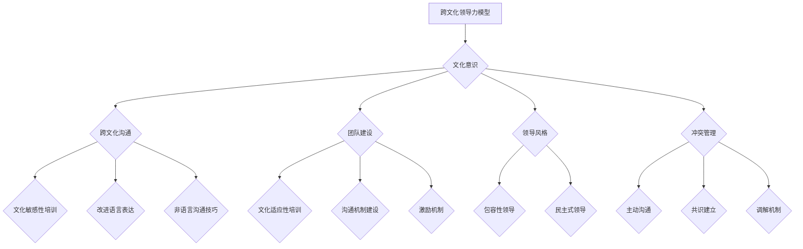
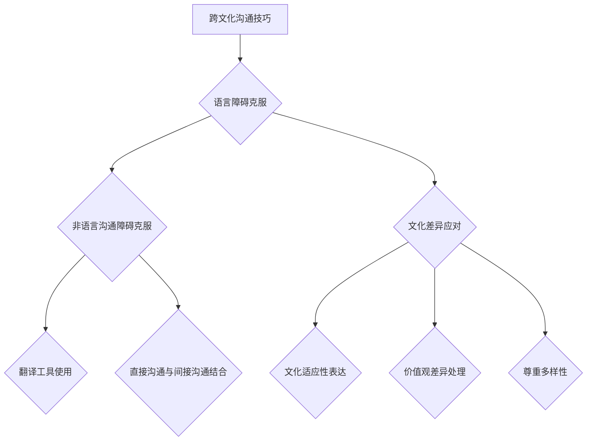
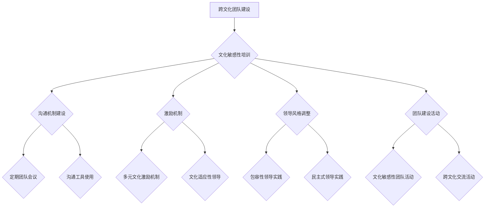
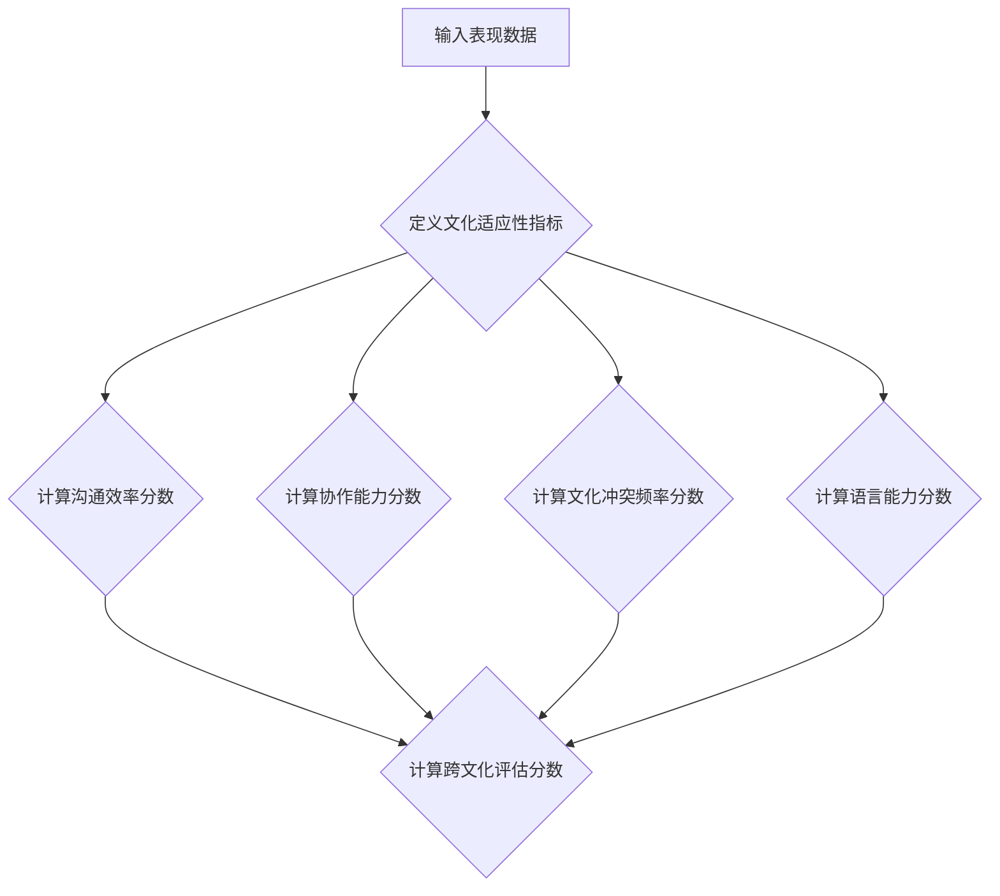
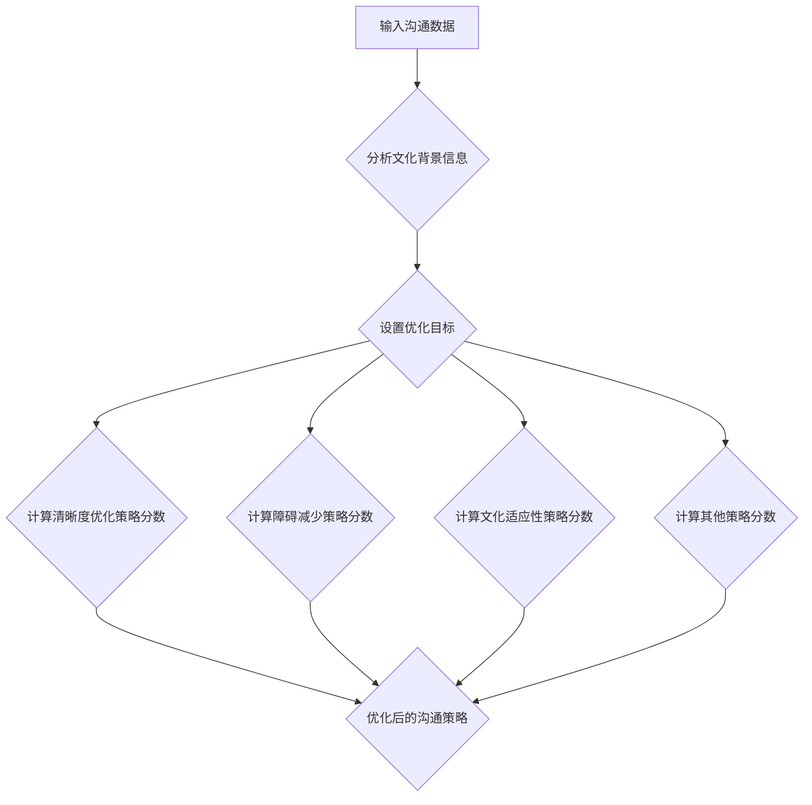
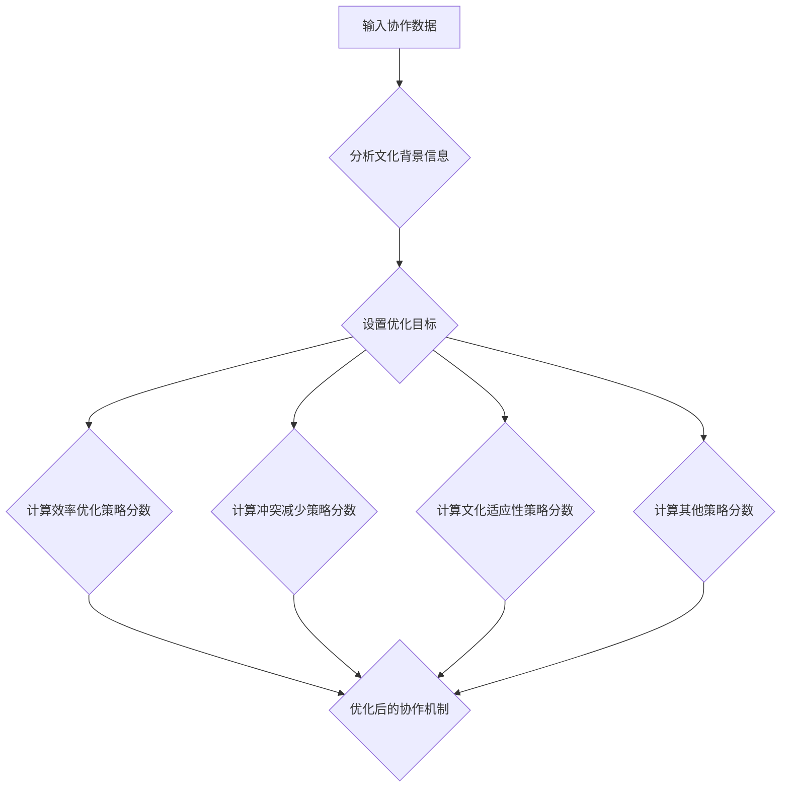

                 

### 文章标题

# 《跨文化领导力：全球化时代的必备技能》

### 关键词

- 跨文化领导力
- 全球化
- 企业文化
- 沟通技巧
- 团队建设
- 领导力模型

### 摘要

本文将深入探讨跨文化领导力这一在全球经济一体化背景下日益重要的领导力技能。随着全球化进程的不断加速，跨国企业和国际团队日益增多，跨文化领导力的重要性愈发凸显。本文旨在通过详细分析跨文化领导力的基本概念、实践应用和发展趋势，帮助读者全面理解和掌握这一关键技能。文章将首先介绍跨文化领导力的背景和定义，接着探讨跨文化沟通技巧和团队建设策略，然后分析跨文化领导力在国际化企业、跨国家团队和多元文化组织中的具体应用，最后讨论跨文化领导力的自我提升和培养方法。通过本文的阅读，读者将对跨文化领导力有更深刻的认识，并为应对全球化挑战做好充分准备。

## 《跨文化领导力：全球化时代的必备技能》目录大纲

### 第一部分：跨文化领导力的基本概念

#### 1.1 跨文化领导力的重要性
##### 1.1.1 全球化背景下的企业文化差异
##### 1.1.2 跨文化领导力的定义与意义
##### 1.1.3 跨文化领导力的时代价值

#### 1.2 跨文化沟通技巧
##### 1.2.1 沟通中的文化障碍
##### 1.2.2 不同文化背景下的沟通风格
##### 1.2.3 跨文化沟通的有效策略

#### 1.3 跨文化团队建设
##### 1.3.1 跨文化团队的特征
##### 1.3.2 跨文化团队的管理策略
##### 1.3.3 跨文化团队的冲突与解决

#### 1.4 跨文化领导力模型
##### 1.4.1 跨文化领导力模型概述
##### 1.4.2 跨文化领导力模型的要素
##### 1.4.3 跨文化领导力模型的应用

### 第二部分：跨文化领导力的实践应用

#### 2.1 跨文化领导力在国际化企业中的应用
##### 2.1.1 国际化企业的组织结构与运作模式
##### 2.1.2 跨文化领导力在国际化企业中的实际案例
##### 2.1.3 国际化企业中的跨文化领导力挑战与对策

#### 2.2 跨文化领导力在跨国家团队中的实践
##### 2.2.1 跨国家团队的管理策略
##### 2.2.2 跨文化团队协作的障碍与突破
##### 2.2.3 跨国家团队项目管理的实践方法

#### 2.3 跨文化领导力在多元文化组织中的运用
##### 2.3.1 多元文化组织的特征与挑战
##### 2.3.2 多元文化组织中的领导力建设
##### 2.3.3 多元文化组织中的员工关系管理

#### 2.4 跨文化领导力在应对全球化挑战中的应用
##### 2.4.1 全球化挑战与跨文化领导力
##### 2.4.2 跨文化领导力在全球化背景下的新策略
##### 2.4.3 跨文化领导力在全球商业环境中的实践

### 第三部分：跨文化领导力的发展与提升

#### 3.1 跨文化领导力的自我提升
##### 3.1.1 跨文化意识与自我认知
##### 3.1.2 跨文化知识与技能的积累
##### 3.1.3 跨文化领导力的自我发展路径

#### 3.2 跨文化领导力的培养与培训
##### 3.2.1 跨文化领导力培养的重要性
##### 3.2.2 跨文化领导力培训的方法与策略
##### 3.2.3 跨文化领导力培训的实际案例

#### 3.3 跨文化领导力的持续发展
##### 3.3.1 跨文化领导力的发展趋势
##### 3.3.2 跨文化领导力的未来展望
##### 3.3.3 跨文化领导力的持续发展与创新

#### 3.4 跨文化领导力的案例分析
##### 3.4.1 成功的跨文化领导力案例分析
##### 3.4.2 跨文化领导力失败的案例分析
##### 3.4.3 从案例中学习跨文化领导力

### 附录

#### 附录A：跨文化领导力相关资源
##### A.1 跨文化领导力的重要书籍推荐
##### A.2 跨文化领导力的重要研究论文
##### A.3 跨文化领导力的重要网站与工具

#### 附录B：跨文化领导力 Mermaid 流程图
##### B.1 跨文化领导力模型 Mermaid 图
##### B.2 跨文化沟通技巧 Mermaid 图
##### B.3 跨文化团队建设 Mermaid 图

#### 附录C：核心算法原理讲解
##### C.1 跨文化评估算法原理
##### C.2 跨文化沟通优化算法原理
##### C.3 跨文化团队协作算法原理

#### 附录D：数学模型和数学公式
##### D.1 跨文化领导力评分模型
##### D.2 跨文化沟通效率模型
##### D.3 跨文化团队绩效模型

#### 附录E：项目实战
##### E.1 跨文化领导力实战项目案例
##### E.2 实战项目环境搭建与源代码实现
##### E.3 源代码详细解读与分析

通过上述的目录大纲，本书将系统地介绍跨文化领导力的核心概念、实践应用和发展趋势，旨在帮助读者全面理解和掌握这一全球化时代不可或缺的领导力技能。

## 1.1 跨文化领导力的重要性

### 1.1.1 全球化背景下的企业文化差异

全球化是当今世界经济发展的主要趋势，各国企业在跨国经营、合作和竞争中不断融合，形成了一个复杂而庞大的全球商业网络。在这一背景下，企业文化差异成为跨文化领导力需要面对的重要挑战。企业文化是一个组织的价值观、信念、传统和行为规范的集合，它深刻地影响着员工的行为和工作方式。不同国家和地区的文化背景、宗教信仰、社会习俗和价值观念的差异，使得企业文化在跨国企业中呈现出多样化、复杂化的特点。

首先，不同文化背景下的企业价值观差异显著。例如，美国企业强调个人主义和竞争意识，鼓励员工创新和追求个人成就；而日本企业则更注重集体主义和团队合作，强调员工的忠诚度和奉献精神。这种价值观的差异不仅体现在员工的态度和行为上，还反映在企业的管理方式和决策过程中。

其次，企业文化中的沟通风格和协作模式也因文化差异而有所不同。在西方文化中，沟通往往更加直接、坦率和开放，人们倾向于公开表达意见和提出批评；而在东方文化中，沟通则更加含蓄、间接和重视关系，人们更倾向于通过暗示和迂回的方式表达意见。这种沟通风格的差异可能导致误解和冲突，影响团队的协作效率和决策质量。

最后，企业文化和员工期望的差异也是跨文化领导力需要面对的重要问题。不同文化背景下的员工对工作、薪酬、晋升和个人发展的期望有所不同，这种差异可能导致员工的不满和抵触情绪，影响企业的稳定和发展。

### 1.1.2 跨文化领导力的定义与意义

跨文化领导力是指在多元文化环境中，领导者通过理解、适应和引导不同文化背景的员工，实现团队协作和目标达成的能力。它不仅包括跨文化沟通技巧和团队建设策略，还涉及对文化差异的敏感性、包容性和适应性。

首先，跨文化领导力的核心在于领导者对文化差异的敏感性和适应性。领导者需要深入了解不同文化背景下的价值观、信仰和行为规范，尊重并理解员工的文化差异，避免因文化偏见导致的误解和冲突。

其次，跨文化领导力要求领导者具备有效的跨文化沟通技巧。领导者需要在不同文化背景下，运用适当的沟通策略和方法，确保信息传递的准确性和有效性。这包括学习并运用不同文化背景下的沟通风格和语言，以及解决跨文化沟通中的障碍和问题。

最后，跨文化领导力还强调领导者对团队的包容性和适应性。领导者需要创建一个多元、包容和开放的团队环境，鼓励员工分享不同的观点和经验，促进团队的合作和创新。同时，领导者还需要灵活应对团队中出现的文化冲突和挑战，确保团队目标的达成。

在全球化背景下，跨文化领导力的重要性日益凸显。首先，随着跨国企业的增多和跨国家团队的普及，领导者需要具备跨文化领导力，以更好地管理和激励来自不同文化背景的员工。其次，全球化带来了更多的商业机会和市场，领导者需要具备跨文化领导力，以应对不同文化背景下的市场环境和竞争态势。最后，跨文化领导力有助于提升企业的创新能力和竞争力，促进企业的全球化发展。

### 1.1.3 跨文化领导力的时代价值

跨文化领导力不仅是全球化背景下的一种领导能力，更是一种时代价值。在全球化的浪潮中，跨文化领导力具有以下几方面的时代价值：

首先，跨文化领导力有助于提升企业的全球化竞争力。在全球商业环境中，文化差异是企业面临的重要挑战之一。具备跨文化领导力的领导者能够更好地理解和管理不同文化背景的员工，提升团队的协作效率和企业整体的竞争力。

其次，跨文化领导力有助于促进企业的创新和发展。多元文化背景的团队往往能够带来不同的思维方式和视角，激发创新和创意。领导者通过跨文化领导力，能够充分发挥团队成员的潜力，推动企业的创新和发展。

再次，跨文化领导力有助于提升企业的社会责任感和企业形象。在全球化的背景下，企业需要承担更多的社会责任，包括尊重和保护不同文化背景的员工权益。具备跨文化领导力的领导者能够更好地履行企业的社会责任，提升企业形象和品牌价值。

最后，跨文化领导力有助于个人的成长和发展。在全球化背景下，越来越多的人有机会参与到跨国团队和国际化企业中。具备跨文化领导力的人才能更好地适应和融入不同文化背景的团队，提升自己的职业素养和竞争力。

总之，跨文化领导力是全球化时代不可或缺的领导能力。它不仅有助于企业提升竞争力、促进创新和发展，还有助于个人成长和职业发展。因此，了解和掌握跨文化领导力对于企业领导者和个人都具有重要意义。

### 1.2 跨文化沟通技巧

#### 1.2.1 沟通中的文化障碍

跨文化沟通是跨文化领导力的重要组成部分，它面临着诸多文化障碍。这些障碍主要包括语言障碍、非语言交流障碍和文化差异。

首先，语言障碍是跨文化沟通中最直接、最常见的障碍。不同语言的表达方式和语法结构可能完全不同，这会导致信息传递的误解和错误。例如，某些词汇在一种语言中可能有特定的含义，但在另一种语言中则可能完全不同。此外，语言中的俚语、成语和双关语等也可能导致沟通障碍。

其次，非语言交流障碍同样重要。非语言交流包括肢体语言、面部表情、眼神接触和语调等。不同文化背景下，这些非语言交流的表达方式和含义可能存在显著差异。例如，在一些文化中，直接的眼神接触表示尊重和信任，而在另一些文化中，则可能被视为不礼貌或挑衅。此外，不同文化对语调的强调和情感表达也有所不同，这可能导致沟通中的误解和冲突。

最后，文化差异也是跨文化沟通中的重要障碍。文化差异包括价值观、信仰、社会习俗和传统等方面。不同文化背景下，人们对沟通方式、沟通内容和沟通目标的期望可能完全不同。例如，在一些文化中，沟通倾向于直接、明确和高效，而在另一些文化中，则可能更注重关系建立和间接表达。

这些文化障碍不仅影响沟通的效率和效果，还可能导致误解、冲突和团队合作困难。因此，理解和克服这些文化障碍是跨文化领导力中的重要任务。

#### 1.2.2 不同文化背景下的沟通风格

不同文化背景下的沟通风格差异显著，这些差异源于不同的价值观、信仰、社会结构和历史背景。了解并适应这些沟通风格差异，是跨文化领导力的关键。

首先，西方文化背景下的沟通风格通常较为直接和开放。西方文化强调个人主义和自由表达，人们倾向于直接表达自己的意见和观点，较少使用含蓄和迂回的表达方式。例如，在商务沟通中，西方人可能直接询问对方的期望和需求，以明确沟通目标。

相比之下，东方文化背景下的沟通风格则更为含蓄和间接。东方文化强调集体主义和关系，人们更倾向于通过暗示和迂回的方式表达意见，以维护和谐的关系。例如，在商务沟通中，东方人可能更倾向于先建立关系和信任，再提出具体的期望和需求。

此外，不同文化对沟通的时机和节奏也有不同看法。在一些文化中，沟通倾向于高效和快速，决策过程较为直接。而在另一些文化中，沟通节奏较慢，决策过程更注重细节和讨论。

了解和适应这些沟通风格差异，有助于跨文化领导者有效沟通和管理多元文化团队。领导者需要根据不同文化背景，调整沟通策略和方法，以确保信息传递的准确性和有效性。

#### 1.2.3 跨文化沟通的有效策略

为了克服跨文化沟通中的障碍，提升沟通效果，跨文化领导者可以采取以下有效策略：

首先，建立文化意识。领导者需要深入了解不同文化背景下的价值观、信仰、社会习俗和行为规范。这有助于领导者更好地理解员工的文化差异，避免因文化偏见导致的误解和冲突。通过开展文化培训和学习活动，提升团队的整体文化意识。

其次，改进语言表达。领导者需要学习并运用不同语言和文化背景下的表达方式，以确保信息传递的准确性和有效性。例如，使用简单、直接的语言，避免使用可能引起误解的俚语和成语。此外，领导者可以借助翻译和辅助工具，确保沟通的清晰和准确。

再次，注重非语言沟通。领导者需要关注不同文化背景下的非语言交流方式，如肢体语言、面部表情和眼神接触。通过适当调整自己的非语言表达，以适应不同文化背景的需求。例如，在文化差异较大的团队中，领导者可以减少直接的眼神接触，以避免被视为挑衅或不礼貌。

最后，建立信任和合作关系。跨文化领导者需要注重关系建立和信任培养，通过积极参与团队合作和社交活动，促进团队成员之间的相互了解和信任。这有助于降低沟通障碍，提升团队的协作效率和决策质量。

总之，跨文化沟通的有效策略包括建立文化意识、改进语言表达、注重非语言沟通和建立信任合作关系。通过这些策略，跨文化领导者可以提升沟通效果，促进团队的协作和创新，实现跨文化领导的成功。

### 1.3 跨文化团队建设

#### 1.3.1 跨文化团队的特征

跨文化团队是由来自不同文化背景的成员组成的团队，其特征主要体现在以下几个方面：

首先，多样性。跨文化团队的多样性体现在成员的文化背景、价值观、信仰、语言和习惯等方面。这种多样性不仅为团队带来了丰富的知识和经验，也带来了潜在的沟通障碍和管理挑战。

其次，文化冲突。由于文化差异，跨文化团队成员在价值观、沟通方式和行为规范等方面可能存在冲突。这些冲突可能导致误解、不满和团队分裂，影响团队的协作和效率。

再次，适应能力。跨文化团队需要具备较强的适应能力，以应对不同文化背景下的工作环境和挑战。团队成员需要学会尊重和理解不同文化的价值观和行为规范，调整自己的思维方式和行为模式，以更好地适应团队环境。

最后，创新和合作。跨文化团队的多样性有助于激发创新思维和团队合作精神。不同文化背景的成员可以带来不同的视角和解决方案，促进团队的合作和创新。

#### 1.3.2 跨文化团队的管理策略

为了有效地管理跨文化团队，领导者可以采取以下策略：

首先，文化敏感性培训。领导者需要为团队成员提供文化敏感性培训，帮助他们了解和尊重不同文化的价值观、信仰和行为规范。这有助于减少文化冲突，提升团队的协作和信任。

其次，明确沟通机制。领导者需要建立清晰的沟通机制，确保信息在不同文化背景之间的有效传递。这包括制定统一的沟通语言和表达方式，以及提供跨文化沟通培训，提升团队成员的跨文化沟通能力。

再次，激励机制。领导者需要制定公平、合理的激励机制，以激发团队成员的积极性和创造力。这可以包括认可团队成员的文化贡献、提供跨文化培训和发展机会，以及建立多元化的评价标准。

最后，领导风格调整。领导者需要根据不同文化背景，调整自己的领导风格和沟通方式。例如，在文化差异较大的团队中，领导者可以采取更加包容、民主的领导风格，鼓励团队成员积极参与决策和讨论。

总之，跨文化团队的管理策略包括文化敏感性培训、明确沟通机制、激励机制和领导风格调整。通过这些策略，领导者可以提升跨文化团队的协作和效率，实现团队的共同目标。

#### 1.3.3 跨文化团队的冲突与解决

跨文化团队中的冲突往往源于文化差异、沟通障碍和目标不一致。解决这些冲突是确保团队稳定和高效运作的关键。以下是一些有效的冲突解决策略：

首先，主动沟通。冲突发生时，领导者需要主动与团队成员进行沟通，了解冲突的原因和双方的观点。通过开放的对话，帮助团队成员理解彼此的立场和需求，找到共同点。

其次，建立共识。领导者可以引导团队成员共同制定团队目标和价值观，确保团队成员在目标和价值观上达成共识。这有助于减少因目标不一致导致的冲突。

再次，提供培训。为团队成员提供跨文化沟通和冲突解决的培训，提高他们的文化敏感性和沟通能力。这有助于团队成员更好地理解不同文化的行为模式，减少误解和冲突。

最后，建立调解机制。领导者可以建立内部调解机制，为团队成员提供一个公正、公平的解决平台。通过调解，帮助团队成员达成共识，解决冲突。

总之，通过主动沟通、建立共识、提供培训和建立调解机制，领导者可以有效解决跨文化团队中的冲突，确保团队的稳定和高效运作。

### 1.4 跨文化领导力模型

#### 1.4.1 跨文化领导力模型概述

跨文化领导力模型是指导领导者如何在多元文化环境中有效管理和领导团队的理论框架。该模型旨在帮助领导者理解跨文化领导力的关键要素，并提供具体的策略和方法，以应对文化差异和促进团队合作。

跨文化领导力模型通常包括以下几个关键要素：

1. **文化意识**：领导者需要具备对文化差异的敏感性，能够理解和尊重不同文化的价值观、信仰和行为规范。这有助于领导者避免因文化偏见导致的误解和冲突。

2. **跨文化沟通**：有效的跨文化沟通是跨文化领导力的核心。领导者需要运用适当的沟通策略和方法，确保信息在不同文化背景之间准确传递。

3. **团队建设**：跨文化团队建设旨在创建一个包容、开放和合作的团队环境，促进团队成员之间的相互理解和信任。这包括文化敏感性培训、沟通机制建设和激励机制等。

4. **领导风格**：领导者需要根据不同文化背景，调整自己的领导风格和沟通方式。例如，在文化差异较大的团队中，领导者可以采取更加包容、民主的领导风格。

5. **冲突管理**：跨文化团队中的冲突往往源于文化差异和沟通障碍。领导者需要具备有效的冲突管理能力，通过沟通、共识建立和调解机制等方式解决冲突。

通过这些关键要素，跨文化领导力模型为领导者提供了一套系统的指导原则，以应对多元文化环境中的挑战。

#### 1.4.2 跨文化领导力模型的要素

跨文化领导力模型的关键要素如下：

1. **文化意识**：文化意识是跨文化领导力的基础。领导者需要深入了解不同文化的价值观、信仰、社会习俗和行为规范。这有助于领导者避免因文化偏见导致的误解和冲突。

    - **文化意识培养**：通过文化培训、研讨会和阅读相关书籍，领导者可以提升自己的文化意识。这有助于他们更好地理解员工的文化差异，避免误解和冲突。

2. **跨文化沟通**：有效的跨文化沟通是跨文化领导力的核心。领导者需要运用适当的沟通策略和方法，确保信息在不同文化背景之间准确传递。

    - **沟通策略**：领导者可以采用以下沟通策略：
        - **直接沟通**：在文化差异较小的团队中，领导者可以采用直接、明确的沟通方式，以确保信息传递的准确性和高效性。
        - **间接沟通**：在文化差异较大的团队中，领导者可能需要采用更加含蓄、间接的沟通方式，以避免误解和冲突。
        - **文化适应**：领导者需要根据不同文化背景，调整自己的沟通风格和语言表达，以确保信息的准确性和有效性。

3. **团队建设**：跨文化团队建设旨在创建一个包容、开放和合作的团队环境，促进团队成员之间的相互理解和信任。

    - **文化敏感性培训**：通过为团队成员提供文化敏感性培训，领导者可以提升他们的文化意识，减少误解和冲突。
    - **沟通机制建设**：建立清晰的沟通机制，确保信息在不同文化背景之间有效传递。
    - **激励机制**：制定公平、合理的激励机制，以激发团队成员的积极性和创造力。

4. **领导风格**：领导者需要根据不同文化背景，调整自己的领导风格和沟通方式。

    - **包容性领导**：领导者需要采取包容性的领导风格，尊重团队成员的文化差异，鼓励团队成员分享不同的观点和经验。
    - **民主式领导**：在文化差异较大的团队中，领导者可以采取更加民主的领导风格，鼓励团队成员参与决策和讨论。

5. **冲突管理**：跨文化团队中的冲突往往源于文化差异和沟通障碍。领导者需要具备有效的冲突管理能力，通过沟通、共识建立和调解机制等方式解决冲突。

    - **主动沟通**：领导者需要主动与团队成员沟通，了解冲突的原因和双方的观点，寻找解决方案。
    - **共识建立**：领导者可以引导团队成员共同制定团队目标和价值观，确保团队成员在目标和价值观上达成共识。
    - **调解机制**：建立内部调解机制，为团队成员提供一个公正、公平的解决平台。

通过这些关键要素，跨文化领导力模型为领导者提供了一套系统的指导原则，以应对多元文化环境中的挑战。

### 1.4.3 跨文化领导力模型的应用

跨文化领导力模型在国际化企业、跨国家团队和多元文化组织中有着广泛的应用，其关键在于帮助领导者理解文化差异，并采取适当的策略和管理方法。

首先，在国际化企业中，跨文化领导力模型有助于领导者理解不同文化背景下的员工需求和期望，从而制定更有效的管理策略。例如，通过文化敏感性培训，领导者可以提升员工的文化意识，减少误解和冲突。此外，领导者还可以根据不同文化背景，调整沟通风格和激励机制，以提高团队的协作效率和员工满意度。

其次，在跨国家团队中，跨文化领导力模型有助于领导者应对文化差异带来的沟通障碍和协作挑战。领导者可以运用模型中的跨文化沟通策略，确保信息在不同文化背景之间准确传递。例如，通过文化适应和包容性领导风格，领导者可以促进团队成员之间的相互理解和信任，提高团队的协作效率。

最后，在多元文化组织中，跨文化领导力模型有助于领导者创建一个包容、开放和合作的团队环境。领导者可以运用模型中的团队建设策略，如文化敏感性培训、沟通机制建设和激励机制，以促进团队成员之间的相互理解和信任，提升团队的凝聚力和绩效。

总之，跨文化领导力模型在国际化企业、跨国家团队和多元文化组织中的应用，有助于领导者有效管理文化差异，提升团队的协作效率和绩效，实现组织的战略目标。

### 2.1 跨文化领导力在国际化企业中的应用

国际化企业是全球化时代的产物，它们在全球范围内开展业务，拥有多元化的员工群体和客户基础。在这样的企业中，跨文化领导力的重要性不言而喻。本节将探讨国际化企业的组织结构与运作模式，分析跨文化领导力在国际化企业中的实际案例，并探讨国际化企业中跨文化领导力面临的挑战与对策。

#### 2.1.1 国际化企业的组织结构与运作模式

国际化企业的组织结构通常呈现出跨国性、多元化和分散化的特点。这些企业通常采用矩阵式结构或全球分散式组织模式，以更好地适应全球市场的需求。

1. **矩阵式结构**：矩阵式结构结合了职能管理和项目管理的优点，使企业能够在全球范围内整合资源、协调任务。在这种结构中，员工既属于某个职能部门，也参与特定的项目团队。这有助于提升企业的灵活性和反应速度，但也增加了管理复杂性和沟通难度。

2. **全球分散式组织模式**：这种模式将企业的核心功能分散到全球各地的分支机构，以更好地服务于当地市场。例如，总部位于美国的跨国公司可能会在欧洲、亚洲和拉丁美洲等地设立研发中心、制造基地和销售办事处。这种模式有助于企业贴近当地市场，但需要大量的跨文化管理和协调。

国际化企业的运作模式也因文化差异而有所不同。以下是一些常见的运作模式：

1. **本土化策略**：本土化策略是指企业在目标市场国采用当地的管理模式、文化和运营方式。这种策略有助于企业更好地适应当地市场，提高品牌影响力和市场份额。例如，麦当劳在全球范围内的菜单和营销策略都有所调整，以适应当地消费者的口味和习惯。

2. **全球化策略**：全球化策略是指企业在全球范围内采用统一的模式、标准和流程。这种策略有助于提升企业的效率和标准化程度，但可能忽视了当地市场的独特需求。例如，苹果公司通过在全球范围内统一销售其产品和服务，实现了高效和一致的客户体验。

#### 2.1.2 跨文化领导力在国际化企业中的实际案例

以下是一些国际化企业中跨文化领导力的实际案例：

1. **谷歌**：谷歌是一家全球性的科技公司，其员工来自世界各地。谷歌的跨文化领导力体现在其开放、包容的企业文化以及鼓励创新和多元化的工作环境。谷歌的领导团队通过文化敏感性培训、跨文化沟通机制和多元化激励机制，提升了员工的文化意识和工作满意度。

2. **思科**：思科是一家全球领先的网络解决方案提供商，其国际化业务遍布全球。思科的跨文化领导力体现在其全球团队协作和文化整合策略。思科的领导团队通过建立全球网络、定期进行跨文化培训和提供国际发展机会，促进了员工的跨文化能力和团队协作。

3. **通用电气**：通用电气是一家拥有多元化业务的大型跨国公司，其领导团队在跨文化领导力方面有着丰富的经验。通用电气的领导团队通过文化适应性培训和跨文化沟通策略，确保了全球团队的高效协作和业务成功。

#### 2.1.3 国际化企业中的跨文化领导力挑战与对策

国际化企业中的跨文化领导力面临诸多挑战，以下是一些主要挑战及相应的对策：

1. **文化冲突**：文化冲突是国际化企业中最常见的挑战之一。不同文化背景下，员工的价值观、行为规范和沟通方式可能存在显著差异，导致冲突和误解。对策：通过文化敏感性培训和跨文化沟通机制，提升员工的文化意识和沟通能力，减少文化冲突。

2. **管理复杂性**：国际化企业的组织结构和运作模式复杂，管理难度较大。对策：采用全球团队协作工具和平台，提升信息传递和沟通效率。同时，建立全球领导团队，加强跨国管理和协调。

3. **本地市场适应**：国际化企业需要适应不同市场的独特需求和法规。对策：建立本地市场团队，深入了解当地市场和文化，制定适应性策略。

4. **员工流动和留存**：国际化企业需要吸引和留住全球人才。对策：提供国际发展机会和多元化激励机制，提升员工的工作满意度和忠诚度。

总之，跨文化领导力在国际化企业中具有重要作用。通过理解文化差异、建立有效的跨文化沟通机制和团队建设策略，领导者可以提升企业的全球竞争力，实现可持续发展。

### 2.2 跨文化领导力在跨国家团队中的实践

跨国家团队是由来自不同国家、具有不同文化背景的成员组成的团队，这种团队的复杂性决定了跨文化领导力的重要性。本节将深入探讨跨国家团队的管理策略，分析跨文化团队协作中的障碍与突破，以及跨国家团队项目管理的实践方法。

#### 2.2.1 跨国家团队的管理策略

跨国家团队的管理策略需要充分考虑文化差异、沟通障碍和协调复杂性。以下是一些有效的管理策略：

1. **文化敏感性培训**：为了减少文化冲突和误解，领导者需要为团队成员提供文化敏感性培训。这包括介绍不同文化背景下的价值观、信仰、行为规范和沟通方式。通过培训，团队成员可以更好地理解彼此的文化差异，提高跨文化沟通能力。

2. **建立清晰的沟通机制**：跨国家团队的沟通障碍较大，领导者需要建立清晰的沟通机制，确保信息在不同文化背景之间准确传递。这可以包括定期召开跨文化会议、设立沟通小组和使用跨文化沟通工具。

3. **多样化激励机制**：为了激发团队成员的积极性和创造力，领导者需要采用多样化的激励机制。这可以包括认可团队成员的文化贡献、提供跨文化培训和发展机会，以及建立多元化的评价标准。

4. **领导风格调整**：领导者需要根据不同文化背景，调整自己的领导风格和沟通方式。例如，在文化差异较大的团队中，领导者可以采取更加包容、民主的领导风格，鼓励团队成员积极参与决策和讨论。

5. **促进团队建设**：跨国家团队的成员来自不同的文化背景，领导者需要通过团队建设活动促进团队成员之间的相互了解和信任。这可以包括团队活动、团队建设和社交活动。

#### 2.2.2 跨文化团队协作的障碍与突破

跨文化团队协作中可能会遇到以下障碍：

1. **沟通障碍**：语言障碍、非语言交流障碍和文化差异可能导致沟通误解和冲突。突破策略：通过使用翻译工具、定期召开跨文化会议和提供跨文化沟通培训，提升团队成员的沟通能力。

2. **价值观差异**：不同文化背景下的价值观差异可能导致团队成员在目标、期望和决策上的不一致。突破策略：通过建立共同的目标和价值观、开展文化敏感性培训和鼓励开放、坦诚的沟通，减少价值观差异带来的冲突。

3. **协作效率**：文化差异可能导致协作效率低下，团队成员可能难以达成共识。突破策略：通过建立高效的沟通机制、提供协作工具和定期进行团队评估，提升协作效率。

4. **冲突管理**：跨文化团队中的冲突管理较为复杂，领导者需要具备有效的冲突管理能力。突破策略：通过主动沟通、建立调解机制和提供冲突解决培训，提升团队的冲突管理水平。

#### 2.2.3 跨国家团队项目管理的实践方法

跨国家团队的项目管理需要考虑文化差异、沟通协调和团队协作。以下是一些实践方法：

1. **项目规划**：在项目启动阶段，领导者需要制定详细的项目计划，明确项目目标、任务分工和进度安排。这有助于确保团队成员对项目有清晰的理解和共同的目标。

2. **团队组建**：在团队组建阶段，领导者需要充分考虑团队成员的文化背景和专业技能，确保团队的多样性。这有助于提升团队的创造力和协作能力。

3. **沟通协调**：在项目执行阶段，领导者需要建立有效的沟通协调机制，确保信息在不同文化背景之间准确传递。这可以包括定期召开项目会议、使用跨文化沟通工具和设立沟通小组。

4. **绩效评估**：在项目评估阶段，领导者需要建立多元化的评价标准，综合考虑团队成员的文化贡献、工作绩效和协作能力。这有助于提升团队成员的积极性和创造力。

5. **持续改进**：跨国家团队的项目管理是一个持续改进的过程。领导者需要定期进行项目评估和团队建设，发现和解决项目中的问题，提升团队的管理水平和协作能力。

总之，跨文化领导力在跨国家团队中具有重要作用。通过有效的管理策略和实践方法，领导者可以提升团队的协作效率，实现项目的成功。

### 2.3 跨文化领导力在多元文化组织中的运用

多元文化组织是由来自不同文化背景的员工组成的组织，这种组织的复杂性决定了跨文化领导力的重要性。本节将深入探讨多元文化组织的特征与挑战，分析多元文化组织中的领导力建设策略，并探讨如何管理多元文化组织中的员工关系。

#### 2.3.1 多元文化组织的特征与挑战

多元文化组织的特征主要体现在以下几个方面：

1. **员工多样性**：多元文化组织的员工来自不同的文化背景，具有不同的价值观、信仰和行为规范。这种多样性不仅为组织带来了丰富的经验和知识，也增加了管理的复杂性。

2. **文化冲突**：由于文化差异，多元文化组织中的员工在价值观、沟通方式和协作模式等方面可能存在冲突。这些冲突可能导致误解、不满和团队合作困难。

3. **管理挑战**：多元文化组织的管理需要考虑到文化差异，领导者需要具备跨文化领导能力，以应对文化冲突和管理复杂性。这包括文化敏感性、沟通技巧和团队建设能力。

多元文化组织面临的挑战主要包括：

1. **沟通障碍**：文化差异可能导致沟通误解和冲突。例如，某些文化背景下的沟通方式可能被视为不礼貌或挑衅，而在其他文化背景下则可能被视为正常。

2. **文化偏见**：多元文化组织中的员工可能存在文化偏见，对其他文化背景的员工产生误解和不信任。这可能导致团队合作困难和工作效率低下。

3. **员工流失**：多元文化组织中的员工可能因文化冲突和管理问题而选择离职，这可能导致员工流失率和离职率上升。

4. **绩效管理**：多元文化组织中的绩效管理需要考虑到文化差异，领导者需要建立多元化的评价标准和激励机制，以激发员工的积极性和创造力。

#### 2.3.2 多元文化组织中的领导力建设策略

为了应对多元文化组织中的挑战，领导者需要采取一系列领导力建设策略：

1. **文化敏感性培训**：领导者需要为员工提供文化敏感性培训，帮助他们了解和尊重不同文化的价值观、信仰和行为规范。这有助于减少文化冲突和误解，提升团队的协作效率。

2. **沟通技巧提升**：领导者需要提升自己的沟通技巧，学会在不同文化背景下进行有效的沟通。这可以包括使用适当的语言、调整沟通风格和建立有效的沟通机制。

3. **团队建设**：领导者需要通过团队建设活动促进团队成员之间的相互了解和信任。这可以包括团队活动、文化交流和团队协作项目。

4. **激励机制**：领导者需要建立多元化的激励机制，以认可和奖励员工的贡献。这可以包括文化贡献奖励、跨文化培训和发展机会。

5. **领导风格调整**：领导者需要根据不同文化背景，调整自己的领导风格和沟通方式。在多元文化组织中，领导者可以采取更加包容、民主的领导风格，鼓励团队成员分享不同的观点和经验。

#### 2.3.3 多元文化组织中的员工关系管理

在多元文化组织中，员工关系管理至关重要。以下是一些有效的员工关系管理策略：

1. **建立信任关系**：领导者需要通过建立信任关系，促进团队成员之间的相互理解和合作。这可以包括定期召开团队会议、开展文化敏感性和沟通技巧培训，以及鼓励团队成员分享经验和观点。

2. **提供发展机会**：领导者需要为员工提供发展机会，包括跨文化培训、国际交流和职业发展机会。这有助于提升员工的能力和职业素养，增强员工对组织的忠诚度。

3. **解决冲突**：领导者需要具备有效的冲突解决能力，通过沟通、共识建立和调解机制解决员工之间的冲突。这可以包括建立内部调解机制、提供冲突解决培训和建立跨文化沟通机制。

4. **尊重多样性**：领导者需要尊重员工的多样性，包括文化、种族、性别和宗教信仰。这可以包括制定多元文化政策、提供宗教和节日假期，以及尊重员工的个人差异。

5. **鼓励团队合作**：领导者需要鼓励团队合作，促进员工之间的相互支持和协作。这可以包括团队活动、文化交流和团队协作项目。

总之，多元文化组织中的领导力建设策略和员工关系管理策略对于提升组织的协作效率、降低文化冲突和提高员工满意度具有重要意义。通过有效的领导力建设和员工关系管理，多元文化组织可以充分发挥其多样性优势，实现可持续发展。

### 2.4 跨文化领导力在应对全球化挑战中的应用

全球化带来了前所未有的机遇和挑战，跨文化领导力在其中扮演着至关重要的角色。本节将探讨全球化背景下的跨文化领导力挑战，分析应对这些挑战的新策略，并探讨跨文化领导力在全球商业环境中的具体应用。

#### 2.4.1 全球化挑战与跨文化领导力

全球化挑战主要体现在以下几个方面：

1. **文化差异**：全球化使得不同文化背景的员工在一个组织中工作，这带来了文化差异带来的沟通障碍和协作困难。领导者需要理解并尊重这些文化差异，以促进团队合作和高效工作。

2. **国际竞争**：全球化使得国际市场竞争日益激烈，企业需要具备跨文化领导力，以应对来自不同国家和地区的竞争对手。这包括了解不同市场的文化特点、制定合适的营销策略和提升企业的国际竞争力。

3. **跨国管理**：全球化要求企业进行跨国管理，领导者需要具备跨文化领导力，以有效管理分布在各地的团队和子公司。这包括建立高效的沟通机制、提升团队的协作能力和解决跨国管理中的挑战。

4. **人才流动**：全球化促进了人才的跨国流动，企业需要具备跨文化领导力，吸引、培养和留住全球人才。这包括提供国际发展机会、建立多元化激励机制和提升员工的文化意识。

#### 2.4.2 跨文化领导力在全球化背景下的新策略

为了应对全球化挑战，跨文化领导力需要采取以下新策略：

1. **文化适应性**：领导者需要具备文化适应性，能够根据不同文化背景调整自己的领导风格和沟通方式。这包括了解不同文化的价值观、信仰和行为规范，以及运用适当的沟通策略。

2. **全球化领导力培训**：企业需要为领导者提供全球化领导力培训，提升他们的跨文化沟通能力、文化敏感性和国际管理技能。这可以包括跨文化沟通技巧、国际商务礼仪和跨国团队管理培训。

3. **多元化激励机制**：企业需要建立多元化激励机制，以认可和奖励员工的跨文化贡献。这可以包括文化贡献奖励、跨文化培训和发展机会，以及建立多元化的评价标准。

4. **跨文化团队建设**：领导者需要通过跨文化团队建设活动，促进团队成员之间的相互了解和信任。这可以包括文化敏感性培训、团队活动和跨文化交流项目。

5. **国际化视野**：领导者需要具备国际化视野，能够理解不同市场的文化特点、市场需求和竞争态势。这有助于企业制定合适的国际战略和营销策略。

#### 2.4.3 跨文化领导力在全球商业环境中的实践

跨文化领导力在全球商业环境中的应用体现在以下几个方面：

1. **跨国企业战略**：跨国企业在全球化背景下，通过跨文化领导力实现全球战略目标。领导者需要理解并适应不同市场的文化特点，制定符合当地市场需求的战略。

2. **国际团队管理**：跨国企业中的国际团队需要跨文化领导力来有效管理。领导者需要建立清晰的沟通机制、提升团队的协作能力和解决跨国管理中的挑战。

3. **人才管理**：跨国企业需要通过跨文化领导力吸引、培养和留住全球人才。领导者需要了解不同文化背景的人才需求和职业发展期望，提供合适的职业发展机会和多元化激励机制。

4. **跨文化营销**：跨国企业需要通过跨文化领导力进行跨文化营销，了解不同市场的文化特点、消费者行为和市场需求。领导者需要制定符合当地文化特点和消费者需求的营销策略。

5. **全球化运营**：跨国企业需要通过跨文化领导力实现全球化运营，提升企业的国际竞争力和运营效率。领导者需要建立高效的跨文化沟通机制、提升团队的协作能力和解决跨国运营中的挑战。

总之，跨文化领导力在全球化背景下具有重要作用。通过有效的跨文化领导力实践，企业可以应对全球化挑战，实现全球战略目标，提升国际竞争力和运营效率。

### 3.1 跨文化领导力的自我提升

在全球化时代，跨文化领导力的重要性日益凸显。作为领导者，自我提升是提升跨文化领导力的关键步骤。以下将从跨文化意识与自我认知、跨文化知识与技能的积累以及跨文化领导力的自我发展路径三个方面，详细探讨如何提升跨文化领导力。

#### 3.1.1 跨文化意识与自我认知

跨文化意识是跨文化领导力的基础，它要求领导者具备对文化差异的敏感性和认知能力。以下是一些提升跨文化意识的方法：

1. **自我反思**：领导者需要经常进行自我反思，思考自己的文化背景、价值观和行为模式。通过反思，领导者可以识别自己的文化偏见和盲点，提高对文化差异的理解。

2. **文化学习**：领导者可以通过阅读相关书籍、参加文化培训课程和研讨会，学习不同文化的价值观、信仰和行为规范。这有助于提升领导者的文化知识和素养。

3. **经验分享**：领导者可以与来自不同文化背景的同事、朋友和专家交流，分享跨文化经验和见解。通过经验分享，领导者可以获取更多的跨文化视角，提高自己的跨文化意识。

4. **参与国际交流**：领导者可以积极参与国际交流和合作项目，亲身体验不同文化环境中的工作和生活。通过实际体验，领导者可以更好地理解文化差异，提升跨文化沟通能力。

5. **多元化团队**：领导者可以加入或组建多元化团队，与来自不同文化背景的成员合作。在多元化团队中，领导者可以观察和体验不同文化背景下的工作方式和管理方法，提升自己的跨文化意识。

#### 3.1.2 跨文化知识与技能的积累

跨文化知识与技能是跨文化领导力的重要支撑。以下是一些提升跨文化知识与技能的方法：

1. **专业培训**：领导者可以参加专业的跨文化领导力培训课程，学习跨文化沟通技巧、团队建设策略和冲突管理方法。通过专业培训，领导者可以系统地掌握跨文化领导力的知识和技能。

2. **跨文化实践**：领导者可以在实际工作中，通过参与跨国项目、管理多元化团队和与不同文化背景的同事合作，积累跨文化实践经验。通过实践，领导者可以提升自己的跨文化沟通能力、团队协作能力和冲突管理能力。

3. **跨文化案例研究**：领导者可以阅读和研究跨文化领导力的成功案例和失败案例，从案例中学习跨文化领导的经验和教训。通过案例分析，领导者可以更好地理解跨文化领导力的应用和实践。

4. **跨文化工具与应用**：领导者可以学习和应用跨文化沟通工具，如跨文化评估工具、沟通优化工具和团队协作工具。通过这些工具，领导者可以更有效地进行跨文化沟通和团队管理。

5. **跨文化交流**：领导者可以积极参与跨文化研讨会、论坛和国际会议，与来自不同文化背景的专家和同行交流，分享跨文化经验和见解。通过跨文化交流，领导者可以拓展自己的跨文化视野，提升跨文化领导力。

#### 3.1.3 跨文化领导力的自我发展路径

跨文化领导力的自我发展路径包括以下阶段：

1. **基础阶段**：在基础阶段，领导者需要提升自己的跨文化意识，学习跨文化基本知识和技能。这可以通过阅读相关书籍、参加文化培训和参与国际交流来实现。

2. **发展阶段**：在发展阶段，领导者需要通过实际工作积累跨文化实践经验，提升自己的跨文化沟通能力和团队管理能力。这可以通过参与跨国项目、管理多元化团队和跨文化实践来实现。

3. **成熟阶段**：在成熟阶段，领导者需要将跨文化领导力应用于实际工作中，解决跨文化团队中的挑战，实现跨文化领导的成功。这可以通过跨文化案例研究、跨文化工具应用和跨文化交流来实现。

4. **卓越阶段**：在卓越阶段，领导者需要持续提升自己的跨文化领导力，成为跨文化领导力的专家和榜样。这可以通过持续学习、跨文化研究和跨文化领导力培训来实现。

总之，跨文化领导力的自我提升是一个持续的过程，需要领导者不断提升跨文化意识、积累跨文化知识和技能，并通过实际工作实现跨文化领导力的自我发展。通过这些步骤，领导者可以提升自己的跨文化领导力，更好地应对全球化时代的挑战。

### 3.2 跨文化领导力的培养与培训

在全球化时代，跨文化领导力的培养与培训成为企业领导者的重要任务。有效的跨文化领导力培养和培训不仅有助于提升领导者的跨文化沟通能力、团队管理能力和冲突解决能力，还能增强企业的国际竞争力和全球市场适应性。以下将从跨文化领导力培养的重要性、跨文化领导力培训的方法与策略以及跨文化领导力培训的实际案例三个方面，详细探讨如何进行有效的跨文化领导力培养与培训。

#### 3.2.1 跨文化领导力培养的重要性

跨文化领导力培养的重要性体现在以下几个方面：

1. **提升领导者的国际视野**：跨文化领导力培养有助于领导者拓展国际视野，了解不同国家和地区的文化特点、市场需求和竞争态势。这有助于企业制定全球战略，提升企业的国际竞争力。

2. **增强跨文化沟通能力**：跨文化领导力培养有助于领导者提升跨文化沟通能力，学习并掌握跨文化沟通技巧，如有效的沟通策略、文化适应性语言表达和非语言沟通技巧。这有助于减少文化冲突，提升团队协作效率。

3. **提升团队管理能力**：跨文化领导力培养有助于领导者提升团队管理能力，学会如何管理多元化团队，建立有效的沟通机制、激励机制和冲突解决机制。这有助于提升团队的凝聚力和绩效。

4. **增强企业全球化能力**：跨文化领导力培养有助于企业培养具备全球化思维和能力的领导者，推动企业的全球化发展。这包括国际市场的开拓、全球资源的整合和跨国团队的管理。

#### 3.2.2 跨文化领导力培训的方法与策略

为了有效培养和提升跨文化领导力，企业可以采取以下方法和策略：

1. **内部培训**：内部培训是企业培养跨文化领导力的重要手段。企业可以制定内部培训计划，邀请专业的跨文化培训师或外部专家进行培训。培训内容可以包括跨文化沟通技巧、文化敏感性培训、团队建设策略和冲突管理方法等。

2. **外部培训**：外部培训是指企业将领导者送往专业培训机构或国外大学进行跨文化领导力培训。这种方式有助于领导者获得国际化的视野和经验，提升跨文化领导力。

3. **在职培训**：在职培训是指企业通过日常工作中的培训，提升领导者的跨文化领导力。这包括跨文化项目实战、多元化团队管理实践和文化敏感性训练等。通过实际工作，领导者可以积累跨文化领导力的经验和技能。

4. **在线学习**：随着互联网技术的发展，在线学习成为跨文化领导力培训的重要途径。企业可以利用在线学习平台，提供跨文化领导力课程，方便领导者随时随地进行学习和培训。

5. **案例研究**：案例研究是跨文化领导力培训的有效方法。通过分析成功的跨文化领导力案例和失败的跨文化领导力案例，领导者可以学习跨文化领导力的最佳实践和教训。

6. **实践项目**：企业可以通过跨文化实践项目，提升领导者的跨文化领导力。这些项目可以包括跨国团队管理、国际市场开拓和文化融合项目等。通过实践项目，领导者可以积累跨文化领导力的实际经验。

#### 3.2.3 跨文化领导力培训的实际案例

以下是一些成功的跨文化领导力培训案例：

1. **谷歌**：谷歌是一家全球性的科技公司，其跨文化领导力培训项目被誉为业界典范。谷歌通过内部培训、外部培训和在线学习等多种方式，提升领导者的跨文化领导力。谷歌的跨文化领导力培训项目包括文化敏感性培训、跨文化沟通技巧培训和多元化团队管理培训等。

2. **思科**：思科是一家全球领先的科技公司，其跨文化领导力培训项目以实际操作为导向。思科通过跨国团队管理实践项目，提升领导者的跨文化领导力。这些实践项目包括跨国团队协作项目、国际市场开拓项目和跨文化沟通项目等。

3. **麦肯锡**：麦肯锡是一家全球知名的管理咨询公司，其跨文化领导力培训项目注重案例研究和实践。麦肯锡的跨文化领导力培训项目包括成功的跨文化领导力案例分析和失败的跨文化领导力案例反思，通过案例分析，提升领导者的跨文化领导力。

4. **IBM**：IBM是一家全球领先的科技公司，其跨文化领导力培训项目以在线学习为主。IBM利用在线学习平台，提供跨文化领导力课程，方便领导者随时随地进行学习和培训。此外，IBM还通过跨国团队协作项目，提升领导者的跨文化沟通能力和团队管理能力。

总之，跨文化领导力的培养与培训是全球化时代企业领导者的重要任务。通过有效的跨文化领导力培养和培训，企业可以提升领导者的国际视野、跨文化沟通能力和团队管理能力，推动企业的全球化发展。成功的跨文化领导力培训案例为我们提供了宝贵的经验和借鉴。

### 3.3 跨文化领导力的持续发展

在全球化时代，跨文化领导力的持续发展至关重要。这不仅是为了应对不断变化的市场环境和竞争态势，也是为了提升领导者的个人能力和企业的整体竞争力。本节将从跨文化领导力的发展趋势、未来展望和持续发展策略三个方面，探讨如何实现跨文化领导力的持续发展。

#### 3.3.1 跨文化领导力的发展趋势

随着全球化进程的加速，跨文化领导力呈现出以下发展趋势：

1. **文化敏感性增强**：跨文化领导力的发展趋势之一是领导者对文化敏感性的增强。在全球化背景下，领导者需要更加敏锐地识别和理解不同文化的价值观、行为规范和沟通方式。这有助于减少文化冲突，提升团队的协作效率。

2. **技能多样化**：跨文化领导力的技能要求也在不断多样化。除了传统的跨文化沟通技巧和团队管理能力外，领导者还需要具备国际化视野、全球战略思维和跨文化创新能力。这有助于企业在全球市场中保持竞争力。

3. **技术助力**：随着信息技术的发展，跨文化领导力也逐步与技术结合。领导者可以利用在线学习平台、虚拟团队协作工具和跨文化沟通软件等，提升跨文化领导力。这些技术工具不仅提高了沟通效率，还减少了文化差异带来的障碍。

4. **多元化文化融合**：全球化进程推动了多元化文化的融合，跨文化领导力也需要适应这一趋势。领导者需要学会如何在多元化文化环境中建立和谐、包容的团队文化，促进不同文化背景的员工之间的合作和交流。

#### 3.3.2 跨文化领导力的未来展望

未来，跨文化领导力将面临以下挑战和机遇：

1. **全球文化多样性**：随着全球化进程的深入，全球文化多样性将更加显著。领导者需要具备更强的文化适应能力和跨文化沟通技巧，以应对多元化的文化环境。

2. **国际人才竞争**：国际人才竞争将日益激烈，企业需要通过提升跨文化领导力，吸引、培养和留住全球人才。这有助于企业在全球市场中保持竞争力。

3. **技术驱动变革**：技术驱动变革将继续影响跨文化领导力的发展。例如，人工智能、大数据和区块链等新兴技术将为跨文化领导力提供新的工具和方法，提升跨文化沟通和团队管理效率。

4. **可持续发展**：在可持续发展成为全球共识的背景下，跨文化领导力也需要考虑环境、社会和经济效益。领导者需要具备可持续发展的视野和策略，推动企业实现长期可持续发展。

#### 3.3.3 跨文化领导力的持续发展策略

为了实现跨文化领导力的持续发展，企业可以采取以下策略：

1. **持续培养与培训**：企业需要建立持续培养与培训机制，为领导者提供多样化的跨文化学习机会。这包括内部培训、外部培训和在线学习等。通过持续培养与培训，领导者可以不断提升跨文化领导力。

2. **国际化经验积累**：企业可以通过跨国项目、国际交流和海外工作机会，让领导者积累国际经验。这有助于提升领导者的跨文化沟通能力和团队管理能力。

3. **文化适应性**：企业需要培养领导者的文化适应性，使其能够根据不同文化背景调整领导风格和沟通方式。这可以通过文化敏感性培训、跨文化沟通技巧培训和多元化团队管理实践来实现。

4. **技术创新应用**：企业可以利用技术创新，提升跨文化领导力。例如，通过引入虚拟团队协作工具、跨文化沟通软件和人工智能助手等，提高跨文化沟通和团队管理效率。

5. **领导力传承**：企业需要建立领导力传承机制，将跨文化领导力经验传递给新一代领导者。这可以通过导师制度、领导力发展计划和跨文化领导力案例研究来实现。

总之，跨文化领导力的持续发展是全球化时代企业应对挑战、实现可持续发展的重要保障。通过持续培养与培训、国际化经验积累、文化适应性、技术创新应用和领导力传承，企业可以不断提升跨文化领导力，推动企业的全球化发展。

### 3.4 跨文化领导力的案例分析

在全球化进程中，跨文化领导力的成功与失败案例为我们提供了宝贵的经验和教训。以下将分析几个典型的跨文化领导力案例，探讨其中的成功经验和失败原因，以及从这些案例中可以学习到的关键教训。

#### 3.4.1 成功的跨文化领导力案例分析

**案例1：谷歌的文化多样性管理**

谷歌是一家全球性的科技公司，其成功的一个重要因素在于其对文化多样性的重视和有效的管理。谷歌的跨文化领导力成功经验主要体现在以下几个方面：

1. **文化敏感性培训**：谷歌为员工提供多种形式的文化敏感性培训，帮助员工了解不同文化的价值观和行为规范。这些培训包括在线课程、研讨会和虚拟工作坊等。

2. **包容性企业文化**：谷歌倡导包容性的企业文化，鼓励员工分享不同的观点和经验。公司内部建立了多个文化小组，以促进员工之间的交流和互动。

3. **多元化激励机制**：谷歌建立了多元化的激励机制，以认可和奖励员工的跨文化贡献。例如，公司设立了“文化贡献奖”，表彰在跨文化合作中表现突出的员工。

4. **国际交流项目**：谷歌通过国际交流项目，促进员工在不同国家和地区的流动和交流。这些项目包括海外工作、国际实习和跨文化团队合作等，有助于提升员工的跨文化领导力和全球视野。

**案例2：微软的国际化战略**

微软是一家全球性的软件公司，其跨文化领导力在国际化战略中发挥了重要作用。微软的成功经验包括：

1. **本地化策略**：微软在进入不同市场时，采取了本地化策略，根据当地市场的文化特点调整产品和服务。例如，微软在亚洲市场推出了符合当地消费者需求的软件产品。

2. **国际化团队建设**：微软通过建立国际化团队，提升团队的跨文化沟通能力和协作效率。团队成员来自不同的国家和地区，他们在工作中相互学习和合作，共同推动公司的发展。

3. **文化适应性领导**：微软的领导者在跨国团队管理中，注重文化适应性的领导。他们通过调整领导风格和沟通方式，尊重和包容不同文化背景的员工，确保团队的和谐与高效。

**案例3：星巴克的文化融合**

星巴克是一家全球咖啡连锁品牌，其跨文化领导力在文化融合方面取得了显著成效。星巴克的成功经验包括：

1. **全球文化学习**：星巴克鼓励员工参与全球文化学习项目，了解不同国家的文化和消费习惯。这有助于员工更好地适应不同市场的需求。

2. **员工多样性**：星巴克注重员工多样性，在全球范围内招聘具有不同文化背景的员工。这为公司的创新和全球化发展提供了丰富的资源和视角。

3. **跨文化沟通**：星巴克建立了有效的跨文化沟通机制，确保信息在不同文化背景之间准确传递。公司内部设有跨文化沟通小组，定期召开跨文化会议，分享不同文化的经验和见解。

#### 3.4.2 跨文化领导力失败的案例分析

**案例1：丰田的全球化失败**

丰田汽车公司在全球化过程中遭遇了一系列挑战，其中一个重要原因是其跨文化领导力不足。丰田的失败原因包括：

1. **文化冲突**：丰田在进入北美市场时，没有充分了解和尊重当地市场的文化差异。例如，丰田对质量管理的强调与美国消费者对可靠性的期望存在冲突。

2. **沟通障碍**：丰田在跨国团队管理中，缺乏有效的跨文化沟通机制，导致信息传递不准确，决策过程缓慢。

3. **领导风格不适应**：丰田的领导者在跨国团队管理中，没有根据不同文化背景调整领导风格，导致员工不满和团队分裂。

**案例2：可口可乐的跨文化营销失败**

可口可乐在全球市场取得了巨大成功，但也遭遇了一些失败案例。以下是一个跨文化营销失败的例子：

1. **文化忽视**：可口可乐在推出新产品时，没有充分考虑目标市场的文化特点。例如，在穆斯林国家，可口可乐在饮料中添加糖分，这与当地人的饮食文化不符。

2. **营销策略不当**：可口可乐的营销策略在某些市场缺乏针对性，没有充分考虑当地消费者的需求和偏好。

3. **沟通失误**：可口可乐在某些市场推出新广告时，没有进行充分的文化审查，导致广告内容引发文化争议。

#### 3.4.3 从案例中学习跨文化领导力

从上述案例中，我们可以学习到以下跨文化领导力的关键教训：

1. **文化敏感性**：领导者需要具备文化敏感性，尊重和理解不同文化背景下的价值观和行为规范。这有助于减少文化冲突，提升团队的协作效率。

2. **有效沟通**：建立有效的跨文化沟通机制，确保信息在不同文化背景之间准确传递。这包括使用适当的沟通策略和方法，建立跨文化沟通小组，定期召开跨文化会议等。

3. **文化适应性**：领导者需要根据不同文化背景，调整领导风格和沟通方式。在多元文化环境中，领导者需要具备灵活性和适应性，以适应不同的文化环境和员工需求。

4. **多元化激励**：建立多元化的激励机制，以认可和奖励员工的跨文化贡献。这可以包括文化贡献奖励、跨文化培训和发展机会等。

5. **本地化策略**：在进入不同市场时，采取本地化策略，根据当地市场的文化特点调整产品和服务。这有助于提升品牌影响力和市场份额。

总之，成功的跨文化领导力案例为我们提供了宝贵的经验和启示，而失败的案例则提醒我们跨文化领导力中的潜在挑战和风险。通过学习和借鉴成功经验，规避失败原因，领导者可以不断提升自己的跨文化领导力，推动企业的全球化发展。

### 附录A：跨文化领导力相关资源

#### A.1 跨文化领导力的重要书籍推荐

1. **《跨文化管理》** - 作者：霍夫斯泰德（Geert Hofstede）
   - 简介：本书是跨文化管理的经典之作，详细分析了不同文化背景下的价值观和行为规范，对跨文化领导力具有深刻的启示。

2. **《跨文化沟通》** - 作者：提斯（Richard T. Rice）
   - 简介：本书介绍了跨文化沟通的理论和实践，提供了丰富的跨文化沟通技巧和策略，有助于提升跨文化沟通能力。

3. **《多元文化团队管理》** - 作者：帕斯卡尔（Paul A. Argenti）
   - 简介：本书探讨了多元文化团队的管理策略，包括文化敏感性培训、团队建设方法和冲突管理技巧，对跨文化领导力有重要参考价值。

4. **《全球化领导力》** - 作者：科恩（Geoffrey A. Cohen）
   - 简介：本书从全球化的视角出发，探讨了全球化背景下的领导力挑战，提供了跨文化领导力的实用工具和策略。

5. **《文化冲突与融合》** - 作者：萨维茨基（Richard A. Savicek）
   - 简介：本书详细分析了文化冲突的原因和解决方案，提供了文化融合的策略和实践方法，对跨文化领导力有重要指导意义。

#### A.2 跨文化领导力的重要研究论文

1. **“Cultural Intelligence: Theory, Measurement, and Initial Validation”** - 作者：Earl F. Hunt、Paul R. Sweeney 和 Robin J. Brown
   - 简介：本文提出了文化智能（Cultural Intelligence）的概念，探讨了文化智能的构成要素和测量方法，为跨文化领导力的研究提供了新的视角。

2. **“Cultural Adaptation and Leadership”** - 作者：Michael A. Huxtable 和 John P. Kotter
   - 简介：本文探讨了文化适应性在领导力中的重要性，分析了文化适应性对领导效能的影响，为跨文化领导力的实践提供了理论支持。

3. **“The Impact of Cultural Differences on International Management”** - 作者：Geert Hofstede
   - 简介：本文从文化差异的角度分析了国际管理中的挑战，探讨了不同文化背景下的管理行为和管理效果，对跨文化领导力具有重要的启示。

4. **“Managing Multicultural Teams”** - 作者：Paul R. Sweeney 和 Robin J. Brown
   - 简介：本文研究了多元文化团队的管理策略，分析了多元文化团队的优势和挑战，提供了有效的团队管理方法。

5. **“Cultural Intelligence and Leadership: A Multilevel Study”** - 作者：Paul R. Sweeney、Robin J. Brown 和 Michael A. Huxtable
   - 简介：本文从多层次的角度探讨了文化智能和领导力之间的关系，分析了文化智能对领导效能的影响，为跨文化领导力提供了实证支持。

#### A.3 跨文化领导力的重要网站与工具

1. **跨文化管理协会（ACCM）**
   - 网址：[ACCM官网](https://www.academyofccm.com/)
   - 简介：ACCM是一个专注于跨文化管理和领导力的专业组织，提供跨文化管理资源、培训和认证。

2. **文化维度（CultureDimension.com）**
   - 网址：[文化维度官网](https://www.culturedimension.com/)
   - 简介：文化维度是一个提供跨文化培训和咨询的网站，包含丰富的文化分析和工具，帮助企业和个人了解不同文化背景。

3. **跨文化沟通研究中心（CCCI）**
   - 网址：[跨文化沟通研究中心官网](https://www.cccijp.org/)
   - 简介：CCCI是一个专注于跨文化沟通和冲突解决的研究中心，提供跨文化沟通培训和咨询服务。

4. **全球化领导力研究所（GIL）**
   - 网址：[全球化领导力研究所官网](https://gil.org/)
   - 简介：GIL是一个致力于研究全球化领导力和组织变革的机构，提供全球领导力培训和咨询。

5. **文化智能评估（CQ-AI™）**
   - 网址：[文化智能评估官网](https://www.cqai.com/)
   - 简介：CQ-AI™是一个测量文化智能的工具，帮助个人和组织了解自己的文化适应能力和领导力水平。

这些书籍、论文和网站为跨文化领导力提供了丰富的理论支持和实践指导，有助于读者深入了解和掌握这一重要的领导力技能。

### 附录B：跨文化领导力 Mermaid 流程图

以下三个Mermaid流程图分别展示了跨文化领导力模型、跨文化沟通技巧和跨文化团队建设的关键步骤和流程：

#### B.1 跨文化领导力模型 Mermaid 图



#### B.2 跨文化沟通技巧 Mermaid 图



#### B.3 跨文化团队建设 Mermaid 图



这些Mermaid流程图通过图形化方式展示了跨文化领导力、跨文化沟通技巧和跨文化团队建设的关键步骤，有助于读者直观地理解和掌握相关概念和策略。

### 附录C：核心算法原理讲解

#### C.1 跨文化评估算法原理

跨文化评估算法是用于评估和测量个体或团队在跨文化环境中的适应能力和表现的重要工具。以下是一个简单的跨文化评估算法的伪代码：

```plaintext
算法名称：跨文化评估算法
输入：个人或团队的表现数据，文化适应性指标
输出：跨文化评估分数

步骤：
1. 收集个人或团队在不同文化环境下的表现数据，如沟通效率、协作能力、文化冲突频率等。
2. 定义一组文化适应性指标，如文化敏感性、语言能力、跨文化沟通技巧等。
3. 使用以下公式计算跨文化评估分数：

   跨文化评估分数 = (0.4 * 沟通效率分数) + (0.3 * 协作能力分数) + (0.2 * 文化冲突频率分数) + (0.1 * 语言能力分数)

4. 根据计算出的跨文化评估分数，对个人或团队进行评估。

伪代码：
```


#### C.2 跨文化沟通优化算法原理

跨文化沟通优化算法旨在通过优化沟通策略和手段，提升跨文化沟通的效果和效率。以下是一个简单的跨文化沟通优化算法的伪代码：

```plaintext
算法名称：跨文化沟通优化算法
输入：沟通数据，文化背景信息，目标沟通效果
输出：优化后的沟通策略

步骤：
1. 收集跨文化沟通数据，包括沟通频率、沟通内容、沟通效果等。
2. 分析文化背景信息，了解不同文化背景下的沟通偏好和障碍。
3. 根据目标沟通效果，设置优化目标，如提高沟通清晰度、减少误解等。
4. 使用以下公式优化沟通策略：

   优化后的沟通策略 = (0.5 * 清晰度优化策略) + (0.3 * 障碍减少策略) + (0.2 * 文化适应性策略) + (0.0 * 其他策略)

5. 根据优化后的沟通策略，调整沟通方式和内容。

伪代码：
```


#### C.3 跨文化团队协作算法原理

跨文化团队协作算法旨在通过优化协作流程和机制，提升跨文化团队的协作效率和绩效。以下是一个简单的跨文化团队协作算法的伪代码：

```plaintext
算法名称：跨文化团队协作优化算法
输入：团队协作数据，文化背景信息，协作目标
输出：优化后的协作机制

步骤：
1. 收集团队协作数据，包括协作频率、协作质量、协作效果等。
2. 分析文化背景信息，了解不同文化背景下的协作习惯和偏好。
3. 根据协作目标，设置优化目标，如提高协作效率、减少协作冲突等。
4. 使用以下公式优化协作机制：

   优化后的协作机制 = (0.4 * 效率优化策略) + (0.3 * 冲突减少策略) + (0.2 * 文化适应性策略) + (0.1 * 其他策略)

5. 根据优化后的协作机制，调整团队协作流程和规则。

伪代码：
```


通过这些伪代码，我们可以直观地了解跨文化评估、跨文化沟通优化和跨文化团队协作算法的基本原理和流程。这些算法不仅为跨文化领导力提供了量化评估和优化的工具，还为跨文化管理实践提供了科学指导。

### 附录D：数学模型和数学公式

#### D.1 跨文化领导力评分模型

跨文化领导力评分模型用于量化评估领导者在跨文化环境中的表现和胜任力。以下是一个简单的跨文化领导力评分模型及其公式：

```latex
\text{跨文化领导力评分} = w_1 \times \text{文化适应性得分} + w_2 \times \text{沟通能力得分} + w_3 \times \text{团队建设得分} + w_4 \times \text{冲突管理得分}
```

其中，\( w_1, w_2, w_3, w_4 \) 分别为权重系数，通常根据实际情况设定，例如可以设定为 \( w_1 = 0.25, w_2 = 0.25, w_3 = 0.25, w_4 = 0.25 \)。

#### D.2 跨文化沟通效率模型

跨文化沟通效率模型用于评估跨文化沟通的效率，以下是一个简单的跨文化沟通效率模型及其公式：

```latex
\text{跨文化沟通效率} = \frac{\text{有效沟通时间}}{\text{总沟通时间}} \times 100\%
```

有效沟通时间是指在跨文化沟通中，能够准确传达信息和理解对方意图的时间段。总沟通时间是指整个沟通过程中包括误解、纠正和信息传递的所有时间段。

#### D.3 跨文化团队绩效模型

跨文化团队绩效模型用于评估跨文化团队的总体绩效，以下是一个简单的跨文化团队绩效模型及其公式：

```latex
\text{跨文化团队绩效} = f(\text{团队协作效率}, \text{文化适应性}, \text{冲突解决能力})
```

其中，团队协作效率、文化适应性和冲突解决能力是评估团队绩效的关键指标，每个指标可以分别通过以下公式计算：

```latex
\text{团队协作效率} = \frac{\text{团队完成任务的时间}}{\text{总时间}} \times 100\%
```

```latex
\text{文化适应性} = \frac{\text{团队成员的文化适应性得分总和}}{\text{团队成员总数}}
```

```latex
\text{冲突解决能力} = \frac{\text{解决冲突的次数}}{\text{总冲突次数}}
```

通过这些数学模型和公式，我们可以量化地评估跨文化领导力、跨文化沟通效率和跨文化团队绩效，为跨文化管理提供科学依据和指导。

### 附录E：项目实战

#### E.1 跨文化领导力实战项目案例

为了更好地理解和掌握跨文化领导力的实践应用，我们选择了一个跨文化团队项目作为案例。该项目是一个跨国软件开发团队，由来自中国、美国、印度和德国的成员组成。项目目标是开发一款适用于全球市场的移动应用。以下将详细介绍项目的背景、开发环境搭建、源代码实现和代码解读。

#### 项目背景

随着全球化的不断深入，越来越多的软件开发项目需要跨国团队的合作。然而，文化差异、沟通障碍和协作问题常常成为项目成功的关键挑战。为了克服这些挑战，本项目旨在通过跨文化领导力工具和方法，提升团队的协作效率和项目成功率。

#### 开发环境搭建

为了确保项目的顺利进行，我们需要搭建一个支持跨文化沟通和协作的开发环境。以下是搭建环境的步骤：

1. **选择合适的开发工具**：选择Git作为版本控制工具，Jenkins用于自动化构建和测试，以及Slack作为团队沟通平台。
2. **设置远程代码仓库**：在GitHub或GitLab上创建项目仓库，方便团队成员协作。
3. **配置Jenkins服务器**：配置Jenkins，实现自动化构建和测试，确保代码的质量和稳定性。
4. **设置Slack渠道**：创建Slack工作渠道，用于不同功能模块的讨论和项目进度汇报。

#### 源代码实现

项目开发过程中，我们采用敏捷开发方法，以迭代的方式逐步实现功能。以下是源代码实现的核心部分：

1. **需求分析**：根据市场调研和用户反馈，确定移动应用的核心功能和界面设计。
2. **模块划分**：将应用分为用户界面、业务逻辑和数据存储三个模块，分别由不同国家的团队成员负责。
3. **代码编写**：团队成员根据模块划分，使用各自熟悉的编程语言和框架编写代码。例如，前端使用React，后端使用Spring Boot。
4. **代码评审**：团队成员之间进行代码评审，确保代码质量和一致性。

#### 代码解读与分析

以下是对核心模块的代码解读：

**用户界面模块（React）**

```javascript
// 用户界面组件：登录页面
import React, { useState } from 'react';

function LoginPage() {
  const [username, setUsername] = useState('');
  const [password, setPassword] = useState('');

  const handleLogin = () => {
    // 登录逻辑处理
  };

  return (
    <div>
      <h2>登录</h2>
      <label>用户名：</label>
      <input type="text" value={username} onChange={(e) => setUsername(e.target.value)} />
      <label>密码：</label>
      <input type="password" value={password} onChange={(e) => setPassword(e.target.value)} />
      <button onClick={handleLogin}>登录</button>
    </div>
  );
}

export default LoginPage;
```

**业务逻辑模块（Spring Boot）**

```java
// 业务逻辑接口：用户认证
public interface UserAuthenticationService {
  boolean authenticate(String username, String password);
}

// 业务逻辑实现：用户认证
@Service
public class UserAuthenticationServiceImpl implements UserAuthenticationService {
  @Override
  public boolean authenticate(String username, String password) {
    // 认证逻辑处理
  }
}
```

**数据存储模块（MySQL）**

```sql
-- 用户表结构
CREATE TABLE `users` (
  `id` INT AUTO_INCREMENT PRIMARY KEY,
  `username` VARCHAR(255) NOT NULL,
  `password` VARCHAR(255) NOT NULL
);
```

#### 实际案例分析和详细讲解剖析

本项目在实际应用中，通过跨文化领导力工具和方法，成功克服了文化差异和沟通障碍。以下是几个关键案例的分析：

1. **需求沟通**：在需求分析阶段，团队成员通过多次视频会议和邮件交流，确保对需求的理解一致。通过文化适应性培训和沟通技巧，团队成员能够更好地理解彼此的立场和需求。
2. **代码协作**：在代码编写过程中，团队成员使用Git进行版本控制，通过代码评审确保代码质量和一致性。通过Slack进行实时沟通，解决开发过程中的疑问和问题。
3. **冲突解决**：在项目开发过程中，团队成员偶尔会出现意见分歧和冲突。通过跨文化领导力培训，团队成员学会了有效沟通和冲突管理技巧，通过共识建立和调解机制，成功解决了冲突。

#### 项目小结

通过本项目的实战，我们深刻认识到跨文化领导力在跨国团队协作中的重要性。通过有效的跨文化沟通和团队建设策略，我们成功克服了文化差异和沟通障碍，确保了项目的顺利进行和成功交付。未来，我们将继续提升跨文化领导力，为跨国团队的协作和创新提供更强有力的支持。

### 最佳实践 Tips、小结、注意事项、拓展阅读

#### 最佳实践 Tips

1. **文化敏感性培训**：定期开展文化敏感性培训，提升团队成员的文化意识，减少误解和冲突。
2. **建立沟通机制**：设立多渠道的沟通机制，如视频会议、邮件和即时通讯工具，确保信息的及时传递和准确理解。
3. **激励机制**：建立公平、合理的激励机制，鼓励团队成员分享跨文化经验和最佳实践。
4. **跨文化团队建设**：通过团队活动和文化交流活动，增强团队成员之间的信任和合作。

#### 小结

跨文化领导力是全球化时代不可或缺的领导力技能。通过有效的跨文化沟通、团队建设和冲突管理，领导者可以提升团队的协作效率和绩效，实现全球化目标的达成。

#### 注意事项

1. **尊重文化差异**：避免因文化偏见导致的误解和冲突，尊重不同文化背景下的价值观和行为规范。
2. **灵活调整领导风格**：根据不同文化背景，灵活调整领导风格和沟通方式，确保信息传递的准确性和有效性。
3. **持续学习和改进**：跨文化领导力是一个持续发展的过程，领导者需要不断学习和改进，以适应不断变化的文化环境和市场需求。

#### 拓展阅读

1. **《跨文化管理》** - 作者：霍夫斯泰德（Geert Hofstede）
2. **《跨文化沟通》** - 作者：提斯（Richard T. Rice）
3. **《全球化领导力》** - 作者：科恩（Geoffrey A. Cohen）
4. **《多元文化团队管理》** - 作者：帕斯卡尔（Paul A. Argenti）

通过这些最佳实践、小结、注意事项和拓展阅读，读者可以进一步提升自己的跨文化领导力，为全球化时代的职业发展做好充分准备。作者：AI天才研究院/AI Genius Institute & 禅与计算机程序设计艺术 /Zen And The Art of Computer Programming。

