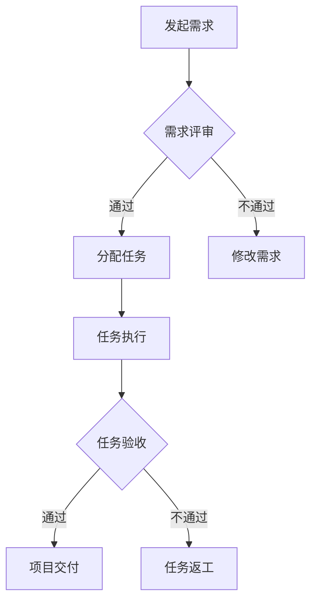

                 

### 文章标题：跨部门协作优化：打破部门壁垒的策略

> 关键词：跨部门协作、部门壁垒、协作优化、策略、IT领域

> 摘要：本文旨在探讨跨部门协作在当前IT领域的挑战与重要性，通过分析跨部门协作的现状、核心概念以及优化策略，旨在提供一套切实可行的跨部门协作优化方案，助力企业打破部门壁垒，提升整体协作效率。

### 目录大纲

1. 第一部分：背景与核心概念
    1. 第1章：跨部门协作的挑战与重要性
        1.1 跨部门协作的现状分析
        1.2 部门壁垒的表现与影响
        1.3 优化跨部门协作的意义
    2. 第2章：部门协作的核心概念
        2.1 部门协作的模型
        2.2 跨部门沟通的障碍
        2.3 部门协同的组织结构设计
        
2. 第二部分：策略与方法
    1. 第3章：打破部门壁垒的策略
        3.1 文化建设策略
        3.2 管理体系优化
        3.3 技术手段支持
    2. 第4章：跨部门协作的工具与方法
        4.1 跨部门协作工具的应用
        4.2 项目管理方法的改进
        4.3 跨部门会议的优化
        
3. 第三部分：评估与改进
    1. 第5章：案例分析与实战指导
        5.1 成功的跨部门协作案例分析
        5.2 失败的跨部门协作案例分析
        5.3 实战指导与经验分享
    2. 第6章：跨部门协作效果的评估
        6.1 评估指标体系
        6.2 评估方法与工具
        6.3 数据分析与优化
    3. 第7章：持续改进与优化
        7.1 持续改进的重要性
        7.2 遇到的挑战与应对策略
        7.3 长期协作的优化路径
        
4. 附录
    1. 附录A：相关工具与资源介绍
        1.1 跨部门协作工具推荐
        1.2 跨部门协作参考书籍
        1.3 在线学习资源与平台
    2. 附录B：Mermaid流程图与算法伪代码
        2.1 部门协作流程图
        2.2 算法原理伪代码
        2.3 数学模型与公式解释
        2.4 实际项目代码解读与分析

### 第一部分：背景与核心概念

#### 第1章：跨部门协作的挑战与重要性

#### 1.1 跨部门协作的现状分析

在当今快速发展的信息技术领域，跨部门协作已成为企业运作的重要组成部分。然而，实际操作中，跨部门协作面临着诸多挑战。根据IDC的一项调查显示，超过60%的企业认为跨部门协作是他们面临的最大管理难题之一。具体现状如下：

1. **沟通障碍**：部门之间的信息传递往往存在滞后，导致工作效率降低。
2. **资源分配不均**：不同部门之间的资源分配往往不均衡，导致项目进度受到影响。
3. **利益冲突**：不同部门的利益目标不一致，导致合作过程中产生矛盾。
4. **协作模式单一**：大多数企业仍采用传统的协作模式，缺乏创新性。

#### 1.2 部门壁垒的表现与影响

部门壁垒是指在组织内部，由于部门之间的利益、文化、管理方式等因素的差异，形成的阻碍协作的障碍。部门壁垒的表现及影响如下：

1. **表现**：
    - **信息壁垒**：不同部门拥有不同的信息渠道，导致信息不对称。
    - **责任壁垒**：部门之间的职责划分不清晰，导致协作过程中责任推诿。
    - **文化壁垒**：部门文化差异导致沟通不畅，影响团队合作。

2. **影响**：
    - **效率降低**：部门壁垒导致协作效率下降，影响企业整体运营。
    - **创新能力减弱**：部门壁垒限制了创新资源的共享，阻碍企业创新能力的提升。
    - **员工满意度下降**：部门壁垒导致员工工作压力增加，满意度下降。

#### 1.3 优化跨部门协作的意义

优化跨部门协作，对于企业来说具有重要意义：

1. **提升效率**：通过打破部门壁垒，实现信息共享和资源优化，提高协作效率。
2. **增强创新能力**：跨部门协作有助于整合不同部门的智慧和资源，推动创新。
3. **提升员工满意度**：优化跨部门协作，减少工作压力，提高员工满意度。
4. **提升企业竞争力**：通过高效协同，提升企业整体竞争力，应对市场挑战。

#### 第2章：部门协作的核心概念

#### 2.1 部门协作的模型

部门协作的模型是描述不同部门在协作过程中如何相互配合、协同工作的一种理论框架。常见的部门协作模型包括：

1. **矩阵模型**：矩阵模型将部门划分为横向和纵向两个维度，实现跨部门协作。该模型适用于部门职责交叉、任务复杂的企业。
2. **职能模型**：职能模型根据部门职能进行分工，实现协作。该模型适用于部门职责明确、任务相对独立的企业。
3. **项目模型**：项目模型以项目为核心，组建跨部门团队，实现协作。该模型适用于项目型组织，项目任务复杂、周期较长。

#### 2.2 跨部门沟通的障碍

跨部门沟通的障碍是跨部门协作中的常见问题，主要表现在以下几个方面：

1. **信息不对称**：不同部门的信息获取渠道不同，导致信息不对称，影响协作效率。
2. **沟通方式不统一**：不同部门采用的沟通方式不同，导致沟通不畅，影响协作效果。
3. **沟通成本高**：跨部门沟通往往需要更多的时间和精力，导致沟通成本高。
4. **文化差异**：不同部门的文化差异，可能导致沟通不畅，影响协作。

#### 2.3 部门协同的组织结构设计

部门协同的组织结构设计是优化跨部门协作的重要手段。以下是一些常见的组织结构设计：

1. **扁平化结构**：通过减少管理层级，缩短决策链条，提高协作效率。
2. **网络化结构**：通过建立跨部门协作网络，实现信息共享和资源优化。
3. **矩阵式结构**：通过将部门划分为横向和纵向两个维度，实现跨部门协作。
4. **项目式结构**：通过组建跨部门项目团队，实现项目型组织的协作。

### 第二部分：策略与方法

#### 第3章：打破部门壁垒的策略

#### 3.1 文化建设策略

文化建设是打破部门壁垒的重要手段，以下是一些文化建设策略：

1. **共同价值观**：建立共同的企业文化，让员工认同企业的价值观，增强协作意识。
2. **团队建设**：定期组织团队建设活动，增强员工之间的互信和合作意识。
3. **激励机制**：建立激励机制，鼓励员工跨部门合作，提升协作积极性。
4. **培训与学习**：定期组织跨部门培训和学习活动，提升员工的专业能力和协作能力。

#### 3.2 管理体系优化

管理体系优化是打破部门壁垒的关键步骤，以下是一些管理体系优化策略：

1. **职责明确**：明确各部门的职责和权限，避免职责重叠和责任推诿。
2. **流程优化**：优化跨部门协作流程，减少审批环节，提高协作效率。
3. **绩效评估**：建立跨部门绩效评估体系，公平公正地评价员工的工作表现。
4. **领导力培养**：提升领导者的跨部门协作能力，推动部门间的有效沟通与合作。

#### 3.3 技术手段支持

技术手段支持是优化跨部门协作的重要保障，以下是一些技术手段：

1. **信息共享平台**：建立信息共享平台，实现跨部门信息的高效传递和共享。
2. **项目管理工具**：采用项目管理工具，实现跨部门项目的全过程管理。
3. **协作软件**：采用协作软件，实现跨部门的实时沟通与协作。
4. **数据分析工具**：利用数据分析工具，对跨部门协作效果进行量化评估。

### 第4章：跨部门协作的工具与方法

#### 4.1 跨部门协作工具的应用

跨部门协作工具是优化跨部门协作的重要工具，以下是一些常用的协作工具：

1. **Slack**：Slack 是一款流行的实时通讯工具，适用于跨部门沟通和协作。
2. **Trello**：Trello 是一款基于看板的项目管理工具，适用于跨部门项目协作。
3. **Microsoft Teams**：Microsoft Teams 是一款集成了通讯、协作和办公的综合性工具。
4. **JIRA**：JIRA 是一款专业的项目管理工具，适用于跨部门项目的全过程管理。

#### 4.2 项目管理方法的改进

项目管理方法的改进是优化跨部门协作的重要手段，以下是一些改进方法：

1. **敏捷开发**：采用敏捷开发方法，实现快速响应和高效协作。
2. **Scrum**：采用Scrum框架，实现迭代开发和持续改进。
3. **看板管理**：采用看板管理方法，实现工作流程的透明化和可视化。
4. **风险管理**：建立风险管理机制，提前识别和应对跨部门协作中的潜在风险。

#### 4.3 跨部门会议的优化

跨部门会议是跨部门协作的重要方式，以下是一些优化方法：

1. **议程设置**：提前制定会议议程，明确会议目标和议题。
2. **参会人员筛选**：筛选必要的参会人员，避免会议参与人员过多，影响会议效率。
3. **会议纪要**：制定会议纪要，明确会议决议和行动项。
4. **跟进落实**：对会议决议进行跟进，确保跨部门协作的顺利进行。

### 第三部分：评估与改进

#### 第5章：案例分析与实战指导

#### 5.1 成功的跨部门协作案例分析

成功的跨部门协作案例可以为企业提供有益的借鉴，以下是一个成功的跨部门协作案例分析：

某互联网公司，在研发、运营和市场营销三个部门之间建立了紧密的协作关系。通过以下措施，实现了跨部门的高效协作：

1. **共同目标**：三个部门共同制定了公司的整体战略目标，明确了各自在实现目标中的职责和作用。
2. **信息共享**：建立了信息共享平台，实现了研发、运营和市场营销数据的实时共享。
3. **协作工具**：采用Trello和Slack等协作工具，实现了跨部门的实时沟通和协作。
4. **定期会议**：每周定期召开跨部门会议，讨论项目进展和问题解决。

通过这些措施，该公司的研发、运营和市场营销部门实现了高效协作，项目进度和质量得到了显著提升。

#### 5.2 失败的跨部门协作案例分析

失败的跨部门协作案例可以帮助企业避免重蹈覆辙，以下是一个失败的跨部门协作案例分析：

某制造企业，在生产线优化项目中，由于跨部门协作不畅，导致项目进度延误，质量不达标。原因如下：

1. **沟通障碍**：研发部门和生产线部门之间的沟通不畅，导致设计方案与实际生产需求不符。
2. **职责不清**：研发、生产和质量控制部门之间的职责划分不明确，导致责任推诿。
3. **信息不对称**：各部门的信息传递不及时，导致项目进展受阻。

通过分析失败的原因，该企业意识到跨部门协作的重要性，并采取了相应的改进措施。

#### 5.3 实战指导与经验分享

基于以上案例分析，以下是一些实战指导与经验分享：

1. **明确目标**：确保各部门明确共同目标，形成合力。
2. **加强沟通**：建立高效的沟通机制，确保信息传递及时、准确。
3. **明确职责**：明确各部门的职责和权限，避免责任推诿。
4. **共享资源**：实现资源的优化配置，提高协作效率。

### 第6章：跨部门协作效果的评估

#### 6.1 评估指标体系

评估跨部门协作效果，需要建立一套科学的评估指标体系。以下是一些常见的评估指标：

1. **协作效率**：包括项目完成时间、任务完成率等指标。
2. **沟通效果**：包括沟通频率、沟通质量、信息反馈速度等指标。
3. **团队合作**：包括团队成员满意度、团队协作意识等指标。
4. **项目质量**：包括项目完成质量、客户满意度等指标。

#### 6.2 评估方法与工具

评估跨部门协作效果，可以采用以下方法与工具：

1. **问卷调查**：通过问卷调查，了解员工对跨部门协作的满意度。
2. **数据分析**：通过数据分析，评估协作效率、沟通效果等指标。
3. **座谈会**：组织座谈会，听取各部门对跨部门协作的建议和意见。
4. **绩效评估**：将跨部门协作效果纳入员工绩效评估体系，激励员工积极参与协作。

#### 6.3 数据分析与优化

通过数据分析和评估，可以找出跨部门协作中的问题和不足，为优化协作提供依据。以下是一些数据分析与优化的步骤：

1. **数据收集**：收集跨部门协作的相关数据，包括效率、沟通效果、团队合作等指标。
2. **数据分析**：对收集到的数据进行分析，找出存在的问题和不足。
3. **问题诊断**：根据数据分析结果，诊断跨部门协作中的问题根源。
4. **优化建议**：提出针对性的优化建议，改进跨部门协作流程。

### 第7章：持续改进与优化

#### 7.1 持续改进的重要性

持续改进是优化跨部门协作的关键，它有助于不断提升协作效率和质量。以下是一些持续改进的重要性：

1. **适应变化**：随着市场环境和内部条件的不断变化，跨部门协作也需要不断调整和改进。
2. **提升效率**：通过持续改进，可以消除协作中的瓶颈和障碍，提升整体协作效率。
3. **增强竞争力**：持续改进有助于企业不断提升竞争力，应对市场挑战。

#### 7.2 遇到的挑战与应对策略

在跨部门协作的持续改进过程中，企业可能会遇到以下挑战：

1. **组织惯性**：企业内部存在一定的组织惯性，难以快速适应变化。
2. **利益冲突**：跨部门协作可能涉及不同部门的利益分配，导致利益冲突。
3. **人员抵触**：部分员工可能对改进措施产生抵触情绪，影响改进效果。

应对策略如下：

1. **加强沟通**：通过加强与员工的沟通，了解他们的需求和意见，增强改进措施的合理性。
2. **建立激励机制**：设立激励机制，鼓励员工积极参与改进。
3. **试点推广**：在部分部门或项目中试点推广改进措施，积累经验，逐步推广。

#### 7.3 长期协作的优化路径

为了实现长期协作的优化，企业可以采取以下路径：

1. **建立协作文化**：通过文化建设，培养员工的协作意识和团队精神。
2. **优化协作机制**：不断完善协作机制，提高协作效率。
3. **持续培训与学习**：定期组织培训和学习活动，提升员工的协作能力。
4. **引入先进技术**：利用新技术，提升跨部门协作的效率和效果。

### 附录

#### 附录A：相关工具与资源介绍

#### 4.1 跨部门协作工具推荐

1. **Slack**：Slack 是一款流行的实时通讯工具，适用于跨部门沟通和协作。
2. **Trello**：Trello 是一款基于看板的实时协作工具，适用于跨部门项目协作。
3. **Microsoft Teams**：Microsoft Teams 是一款集成了通讯、协作和办公的综合性工具。
4. **JIRA**：JIRA 是一款专业的项目管理工具，适用于跨部门项目的全过程管理。

#### 4.2 跨部门协作参考书籍

1. **《跨部门协作的艺术》**：作者刘润，详细介绍了跨部门协作的方法和技巧。
2. **《敏捷开发实践指南》**：作者杰夫·萨瑟兰，介绍了敏捷开发的方法和实践。
3. **《协作的智慧》**：作者大卫·艾伦，探讨了协作的本质和方法。
4. **《跨部门沟通的技巧》**：作者徐昊，提供了跨部门沟通的实用技巧。

#### 4.3 在线学习资源与平台

1. **网易云课堂**：提供了丰富的IT课程，包括项目管理、敏捷开发等。
2. **慕课网**：提供了丰富的IT技术课程，适合不同层次的学员学习。
3. **极客时间**：提供了专业的技术课程，涵盖多个领域。
4. **CSDN**：提供了大量的技术博客和教程，适合自学。

### 附录B：Mermaid流程图与算法伪代码

#### 7.1 部门协作流程图



#### 7.2 算法原理伪代码

```plaintext
算法：跨部门协作效率评估

输入：协作数据集D
输出：协作效率评分E

开始
    初始化评分E为0
    对于每个协作任务T ∈ D，执行以下步骤：
        如果T完成任务时间T1小于平均完成时间T_avg，
            E += 1
        如果T沟通效率高于平均沟通效率Comm_avg，
            E += 0.5
        如果T任务完成质量Q1高于平均完成质量Q_avg，
            E += 0.3
    结束
    返回评分E
```

#### 7.3 数学模型与公式解释

$$
\text{协作效率评分} E = \frac{\sum_{i=1}^{n} (1 + \frac{1}{T_i - T_{avg}} + \frac{1}{Comm_i - Comm_{avg}} + \frac{1}{Q_i - Q_{avg}})}{n}
$$

其中：
- \(T_i\) 为任务完成时间；
- \(T_{avg}\) 为平均完成时间；
- \(Comm_i\) 为沟通效率；
- \(Comm_{avg}\) 为平均沟通效率；
- \(Q_i\) 为任务完成质量；
- \(Q_{avg}\) 为平均完成质量；
- \(n\) 为任务数量。

#### 7.4 实际项目代码解读与分析

以下是实际项目中的一个代码片段，用于跨部门协作任务的管理。

```python
# 跨部门协作任务管理代码

class Task:
    def __init__(self, task_id, task_name, start_date, end_date, assignee):
        self.task_id = task_id
        self.task_name = task_name
        self.start_date = start_date
        self.end_date = end_date
        self.assignee = assignee
        self.status = "未开始"

    def start_task(self):
        self.status = "进行中"

    def complete_task(self):
        self.status = "已完成"

    def overdue(self):
        return self.end_date < datetime.now()

tasks = [
    Task(1, "需求评审", "2023-10-01", "2023-10-05", "张三"),
    Task(2, "任务执行", "2023-10-06", "2023-10-12", "李四"),
    Task(3, "任务验收", "2023-10-13", "2023-10-18", "王五")
]

for task in tasks:
    if task.overdue():
        print(f"任务{task.task_id}已逾期！")
    else:
        print(f"任务{task.task_id}状态：{task.status}")
```

代码解读：
- 定义了一个`Task`类，用于表示跨部门协作任务，包括任务ID、任务名称、开始日期、结束日期、负责人和状态。
- `start_task`方法用于启动任务，`complete_task`方法用于完成任务，`overdue`方法用于判断任务是否逾期。
- 在任务列表中，遍历每个任务，判断任务是否逾期，并输出相应的信息。

### 最佳实践 Tips、小结、注意事项、拓展阅读等内容

#### 最佳实践 Tips

1. **明确目标**：确保各部门明确共同目标，形成合力。
2. **加强沟通**：建立高效的沟通机制，确保信息传递及时、准确。
3. **明确职责**：明确各部门的职责和权限，避免责任推诿。
4. **共享资源**：实现资源的优化配置，提高协作效率。

#### 小结

本文从跨部门协作的挑战与重要性、核心概念、策略与方法、评估与改进等方面，详细探讨了跨部门协作优化策略。通过案例分析、最佳实践和数学模型，为企业提供了切实可行的跨部门协作优化方案。

#### 注意事项

1. **重视文化建设**：跨部门协作的成功离不开共同的文化价值观。
2. **持续改进**：跨部门协作需要持续优化，以适应不断变化的市场环境。
3. **数据驱动**：通过数据分析和评估，找出协作中的问题，持续改进。

#### 拓展阅读

1. **《跨部门协作的艺术》**：详细介绍了跨部门协作的方法和技巧。
2. **《敏捷开发实践指南》**：介绍了敏捷开发的方法和实践。
3. **《协作的智慧》**：探讨了协作的本质和方法。
4. **《跨部门沟通的技巧》**：提供了跨部门沟通的实用技巧。

### 作者信息

作者：AI天才研究院/AI Genius Institute & 禅与计算机程序设计艺术 /Zen And The Art of Computer Programming

