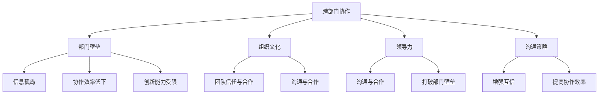

                 

# 跨部门协作优化：打破部门壁垒的策略

> 关键词：跨部门协作、部门壁垒、组织文化、领导力、沟通策略、协作工具

> 摘要：本文旨在探讨跨部门协作在企业管理中的重要性，分析部门壁垒的存在及其影响，并提出一系列优化跨部门协作的策略。通过深入剖析跨部门协作的机制与流程、沟通策略、领导力作用、团队协作工具与技术，以及跨部门协作评估与优化，本文旨在为企业提供一套切实可行的跨部门协作优化方案，助力企业打破部门壁垒，实现高效协同与可持续发展。

## 第一部分：跨部门协作概述

### 第1章：跨部门协作的重要性

**1.1 跨部门协作的定义与作用**

跨部门协作指的是不同部门之间为了共同实现组织目标而进行的合作与沟通。这种协作不仅涉及同一层级之间的互动，还可能跨越多个层级。跨部门协作在企业管理中具有重要作用，主要体现在以下几个方面：

- **提升效率：** 跨部门协作能够整合各部门的优势资源，优化工作流程，从而提高整体工作效率。
- **促进创新：** 通过跨部门协作，不同领域的专业知识和技能得以融合，有助于激发创新思维和创造力。
- **增强团队协作：** 跨部门协作有助于加强各部门之间的团队协作，提升团队凝聚力和战斗力。
- **提高客户满意度：** 跨部门协作能够确保客户需求得到全面满足，提高客户满意度和忠诚度。

**1.2 跨部门协作的类型**

跨部门协作可以按照协作方向进行分类，主要包括以下两种类型：

- **纵向协作：** 指上下级部门之间的协作，如总部与分支机构之间的合作。
- **横向协作：** 指同一层级不同部门之间的协作，如市场部与销售部之间的合作。

**1.3 跨部门协作的障碍**

跨部门协作过程中往往存在一些障碍，主要表现在以下几个方面：

- **沟通障碍：** 不同部门之间的沟通不畅可能导致信息不对称，影响协作效果。
- **文化差异：** 各部门之间可能存在不同的工作文化和价值观，导致协作过程中的摩擦和冲突。
- **权力结构：** 权力分配不均可能使得某些部门在协作中占据优势地位，影响其他部门的积极性。

### 第2章：跨部门协作的机制与流程

**2.1 跨部门协作的机制**

跨部门协作需要建立一套有效的机制来确保协作的顺利进行，主要包括以下几个方面：

- **团队建设：** 通过团队建设活动，增强团队成员之间的互信和默契。
- **透明沟通：** 建立透明的沟通渠道，确保信息在各部门之间畅通无阻。
- **资源共享：** 通过资源共享，提高资源的利用效率，降低协作成本。

**2.2 跨部门协作的流程**

跨部门协作的流程主要包括以下几个阶段：

- **项目启动：** 明确项目目标、范围和预期成果，组建跨部门团队。
- **项目计划：** 制定详细的项目计划，明确各阶段的工作任务和时间节点。
- **项目执行：** 按照项目计划，执行具体工作任务，确保项目进度和质量。
- **项目监控：** 对项目执行过程进行监控，及时发现并解决问题。
- **项目收尾：** 对项目成果进行评估，总结经验教训，为后续项目提供参考。

### 第3章：跨部门协作中的沟通策略

**3.1 沟通策略的选择**

在跨部门协作中，选择合适的沟通策略至关重要。常见的沟通策略包括：

- **正面沟通：** 以积极、建设性的态度进行沟通，避免负面情绪的影响。
- **负面沟通：** 在必要时，采取直接、坦诚的沟通方式，解决问题。
- **情境沟通：** 根据不同的沟通情境，灵活调整沟通策略，提高沟通效果。

**3.2 提升沟通效果的技巧**

提升沟通效果需要掌握以下技巧：

- **明确目标：** 在沟通前明确沟通目标，确保沟通内容有针对性。
- **主动倾听：** 充分倾听对方的意见和需求，避免误解和冲突。
- **有效表达：** 用简洁明了的语言表达自己的观点和需求，避免模糊和歧义。

**3.3 跨部门沟通工具**

跨部门沟通需要借助一些工具来提高沟通效率，如：

- **会议管理：** 使用会议管理工具，如视频会议、在线讨论等，确保会议的顺利进行。
- **沟通平台：** 建立跨部门沟通平台，如企业内部社交网络、即时通讯工具等，方便团队成员之间的沟通交流。
- **文档共享：** 使用文档共享工具，如共享文件夹、在线文档编辑等，确保文件的安全共享和协作。

## 第二部分：打破部门壁垒的策略

### 第4章：组织文化与变革管理

**4.1 组织文化的塑造**

组织文化是跨部门协作的基础，其塑造过程主要包括以下几个方面：

- **定义核心价值观：** 明确企业核心价值观，作为跨部门协作的指导原则。
- **传播企业文化：** 通过内部宣传、培训等活动，将企业文化传播给全体员工。
- **培养团队精神：** 通过团队建设活动，增强员工之间的凝聚力和归属感。

**4.2 变革管理的实施**

变革管理是打破部门壁垒的关键，其实施过程包括以下几个方面：

- **识别变革需求：** 分析组织现状，识别变革的需求和目标。
- **制定变革计划：** 制定详细的变革计划，明确变革的步骤和措施。
- **推动变革实施：** 通过培训、激励机制等手段，推动变革计划的实施。
- **评估变革效果：** 对变革效果进行评估，总结经验教训，为后续变革提供参考。

### 第5章：领导力在跨部门协作中的作用

**5.1 领导力的定义与类型**

领导力是指领导者通过影响和激励他人，实现组织目标的能力。根据不同的领导风格和情境，领导力可以分为以下几种类型：

- **权威型领导：** 通过权力和命令来指导和影响他人。
- **民主型领导：** 通过征求和整合团队成员的意见来做出决策。
- **变革型领导：** 通过激发团队成员的潜能和创造力，推动组织变革和发展。

**5.2 领导者的角色与职责**

领导者在跨部门协作中扮演着重要角色，其职责主要包括：

- **制定战略：** 明确组织目标和方向，为跨部门协作提供指导。
- **协调资源：** 整合各部门资源，确保跨部门协作的顺利进行。
- **沟通与协调：** 搭建跨部门沟通桥梁，解决协作过程中的矛盾和问题。
- **激励团队：** 通过激励措施，激发团队成员的积极性和创造力。

**5.3 领导力提升策略**

提升领导力需要通过以下策略：

- **情境领导力：** 根据不同情境，灵活运用不同的领导风格和策略。
- **情绪智力：** 提高自我意识、自我管理、社会意识和关系管理能力。
- **领导力训练：** 通过培训和实践活动，提升领导者的综合素质和能力。

### 第6章：团队协作工具与技术

**6.1 团队协作工具的选择**

团队协作工具的选择需要考虑以下因素：

- **功能需求：** 根据团队协作的具体需求，选择功能齐全的协作工具。
- **用户友好：** 工具界面要简洁直观，易于操作，提高用户体验。
- **兼容性：** 工具需要支持多种平台和设备，确保团队成员随时随地进行协作。

常见的团队协作工具包括：

- **会议工具：** 如Zoom、Microsoft Teams等。
- **项目管理工具：** 如Trello、Asana等。
- **沟通平台：** 如Slack、Microsoft Teams等。

**6.2 团队协作技术的应用**

团队协作技术的应用包括以下几个方面：

- **敏捷开发：** 通过敏捷开发方法，提高项目交付效率和质量。
- **破冰活动：** 通过团队破冰活动，增强团队成员之间的互信和默契。
- **团队反馈：** 通过定期团队反馈，及时发现和解决问题，提高团队协作效果。

**6.3 团队协作案例分析**

**成功案例分析：**

- **案例一：** 一家互联网公司通过采用敏捷开发方法和Trello项目管理工具，实现了跨部门协作的高效运行，提高了项目交付速度和客户满意度。
- **案例二：** 一家制造企业通过组织团队破冰活动和定期团队反馈，增强了团队成员之间的沟通和协作，提高了团队整体绩效。

**失败案例分析：**

- **案例一：** 一家咨询公司由于缺乏有效的团队协作工具，导致项目进展缓慢，客户满意度下降。
- **案例二：** 一家零售企业由于团队协作过程中缺乏沟通和协调，导致库存管理混乱，经济损失严重。

### 第7章：跨部门协作评估与优化

**7.1 跨部门协作评估的方法**

跨部门协作评估主要包括以下方法：

- **关键绩效指标：** 通过设定关键绩效指标（KPI），评估跨部门协作的效果。
- **客户满意度调查：** 通过调查客户满意度，了解跨部门协作对客户需求满足度的影响。
- **成本效益分析：** 对跨部门协作的成本和效益进行评估，优化资源配置。

**7.2 跨部门协作优化策略**

跨部门协作优化策略包括以下几个方面：

- **流程优化：** 对跨部门协作流程进行优化，简化流程，提高效率。
- **资源配置优化：** 根据跨部门协作的需求，合理配置资源，提高资源利用效率。
- **沟通机制优化：** 建立有效的沟通机制，确保信息在各部门之间畅通无阻。

### 第8章：跨部门协作中的领导力发展

**8.1 领导力发展的必要性**

领导力发展在跨部门协作中具有重要意义，主要体现在以下几个方面：

- **提升组织绩效：** 通过领导力发展，提高领导者和管理者的能力，提升组织整体绩效。
- **促进跨部门协作：** 通过领导力发展，增强领导者协调和沟通能力，促进跨部门协作。
- **提升员工满意度：** 通过领导力发展，提高领导者对员工的关注和激励，提升员工满意度。

**8.2 领导力发展的路径**

领导力发展可以通过以下路径进行：

- **教育培训：** 通过参加专业培训课程，学习领导力理论和实践方法。
- **实践锻炼：** 通过参与实际项目和管理实践，提升领导力能力。
- **反馈与反思：** 通过定期反馈和反思，总结经验教训，持续提升领导力。

### 第9章：跨部门协作的未来趋势

**9.1 数字化与跨部门协作**

随着数字化技术的发展，跨部门协作也在不断变革和升级。未来，数字化将在跨部门协作中发挥重要作用，主要体现在以下几个方面：

- **智能协作工具：** 利用人工智能、大数据等技术，开发智能协作工具，提高协作效率。
- **数字化转型：** 通过数字化转型，实现跨部门信息共享和流程优化。
- **远程协作：** 利用远程协作工具，实现跨地域、跨时间的协作。

**9.2 跨部门协作与可持续发展**

跨部门协作在实现企业短期目标的同时，也应关注可持续发展。未来，跨部门协作将与可持续发展紧密结合，主要体现在以下几个方面：

- **绿色环保：** 通过跨部门协作，实现资源节约和环境保护。
- **社会责任：** 通过跨部门协作，承担社会责任，提升企业形象。
- **创新驱动：** 通过跨部门协作，推动技术创新和产业升级。

### 第10章：结论

**10.1 跨部门协作的重要性总结**

跨部门协作是现代企业成功的基石，其重要性主要体现在以下几个方面：

- **提高组织效率：** 跨部门协作能够整合各部门优势资源，提高整体工作效率。
- **促进创新：** 跨部门协作有助于激发创新思维和创造力，推动企业持续发展。
- **增强团队协作：** 跨部门协作有助于加强各部门之间的团队协作，提升团队凝聚力和战斗力。

**10.2 跨部门协作的未来展望**

未来，跨部门协作将继续在企业中发挥重要作用。随着数字化技术的不断发展，跨部门协作将变得更加智能、高效和可持续。同时，跨部门协作也将与可持续发展紧密结合，为企业和社会带来更多价值。

### 附录

**附录A：跨部门协作工具与资源列表**

- **沟通工具：** Zoom、Microsoft Teams、Slack等。
- **项目管理工具：** Trello、Asana、Jira等。
- **团队协作平台：** Confluence、SharePoint、Notion等。

**附录B：跨部门协作案例分析**

- **案例一：** 企业成功跨部门协作案例。
- **案例二：** 企业失败跨部门协作案例。

**附录C：参考文献**

- **相关书籍：** 《跨部门协作的艺术》、《团队协作的力量》等。
- **研究报告：** 相关领域的权威研究报告。
- **学术论文：** 学术期刊上的相关论文。
- **网络资源：** 互联网上的相关资源和案例。

### 作者信息

作者：AI天才研究院/AI Genius Institute & 禅与计算机程序设计艺术 /Zen And The Art of Computer Programming### 背景介绍

在现代企业中，部门之间的壁垒和隔阂是一个普遍存在的问题。这种壁垒不仅存在于传统的层级结构中，如总部与分支机构、研发部门与市场部门等，还存在于各种新型组织形式中。部门壁垒的存在严重影响了企业的运作效率和创新能力，成为企业发展的瓶颈。

首先，部门壁垒会导致信息孤岛。不同部门之间缺乏有效的沟通和信息共享，导致各部门在决策过程中无法获取全面的信息，从而影响决策质量。例如，研发部门可能无法及时了解市场部门的客户需求，导致研发出的产品无法满足市场需求。

其次，部门壁垒会影响团队的协作效率。跨部门协作往往需要多个部门共同参与，但由于部门利益和职责分工的不同，各部门之间的协作可能会存在冲突和摩擦。这种摩擦不仅会增加沟通成本，还会影响团队的工作积极性和创造力。

最后，部门壁垒会影响企业的创新能力。创新往往需要跨学科的团队合作，但部门壁垒会限制团队成员之间的交流和合作。不同部门的专业知识和技能难以融合，导致创新项目的进展缓慢，甚至无法顺利进行。

为了解决这些问题，企业需要采取一系列措施来打破部门壁垒，实现跨部门协作的优化。本文将从跨部门协作的重要性、机制与流程、沟通策略、领导力作用、团队协作工具与技术、评估与优化等方面进行详细探讨，为企业提供一套切实可行的跨部门协作优化方案。

### 核心概念与联系

在探讨跨部门协作的优化之前，我们需要明确几个核心概念，并分析它们之间的联系。这些核心概念包括跨部门协作、部门壁垒、组织文化、领导力和沟通策略。

#### 跨部门协作

跨部门协作指的是不同部门之间为了共同实现组织目标而进行的合作与沟通。它不仅涉及同一层级之间的互动，还可能跨越多个层级。跨部门协作的目标是整合各部门的优势资源，优化工作流程，提高整体工作效率和创新能力。

#### 部门壁垒

部门壁垒是指存在于不同部门之间的障碍，如沟通障碍、文化差异、权力结构等。这些壁垒会导致信息孤岛、协作效率低下和创新能力受限。打破部门壁垒是实现跨部门协作优化的关键。

#### 组织文化

组织文化是指企业在长期发展过程中形成的共同价值观、行为规范和工作方式。组织文化对跨部门协作的影响至关重要。积极向上的组织文化可以促进团队成员之间的信任和合作，而消极的组织文化则会加剧部门壁垒。

#### 领导力

领导力是指领导者通过影响和激励他人，实现组织目标的能力。领导力在跨部门协作中起着至关重要的作用。有效的领导力可以促进团队成员之间的沟通与合作，打破部门壁垒，实现跨部门协作的优化。

#### 沟通策略

沟通策略是指为了实现特定沟通目标而采取的方法和手段。在跨部门协作中，选择合适的沟通策略至关重要。有效的沟通策略可以增强团队成员之间的互信和协作，提高协作效率。

#### 核心概念之间的关系架构

这些核心概念之间的关系可以用以下Mermaid流程图来表示：



通过这个流程图，我们可以清晰地看到跨部门协作与部门壁垒、组织文化、领导力和沟通策略之间的相互影响和关系。这些核心概念相互关联，共同影响着跨部门协作的优化。

### 跨部门协作中的核心算法原理

为了深入理解跨部门协作的优化，我们需要探讨一些核心算法原理，这些原理在跨部门协作的流程设计和决策中起着关键作用。以下是一些主要的算法原理和它们在跨部门协作中的应用：

#### 1. 甘特图算法

**原理：** 甘特图是一种直观的项目管理工具，用于表示项目进度和时间安排。它通过条形图展示不同任务的开始和结束时间，以及任务之间的依赖关系。

**应用：** 在跨部门协作中，甘特图可以帮助团队规划项目进度，确保任务按时完成。每个部门可以基于甘特图来安排自己的工作计划，减少任务冲突，提高协作效率。

**伪代码：**

```python
function createGanttChart(tasks):
    for task in tasks:
        if task.hasDependencies():
            scheduleTask(task, findEarliestAvailableTime(task))
        else:
            scheduleTask(task, currentTime())
    return ganttChart

function findEarliestAvailableTime(task):
    earliestTime = currentTime()
    for dependency in task.dependencies:
        if dependency.endTime() > earliestTime:
            earliestTime = dependency.endTime()
    return earliestTime
```

#### 2. 最小生成树算法

**原理：** 最小生成树算法（如Prim算法和Kruskal算法）用于在无向图中构建一棵包含所有节点的最小权生成树。它通过选取权值最小的边，逐步构建树结构。

**应用：** 在跨部门协作中，最小生成树算法可以帮助团队识别关键路径和关键任务，优化资源分配和任务依赖关系。通过最小生成树，团队可以确保项目在时间上的最优分配，降低延误风险。

**伪代码（Prim算法）：**

```python
function primAlgorithm(vertices, edges):
    selectedVertices = []
    selectedEdges = []
    startVertex = vertices[0]
    selectedVertices.append(startVertex)
    while len(selectedVertices) < len(vertices):
        minEdgeWeight = infinity
        for edge in edges:
            if edge.startVertex in selectedVertices and edge.endVertex not in selectedVertices:
                if edge.weight < minEdgeWeight:
                    minEdgeWeight = edge.weight
                    selectedEdge = edge
        selectedEdges.append(selectedEdge)
        selectedVertices.append(selectedEdge.endVertex)
    return selectedEdges
```

#### 3. 动态规划算法

**原理：** 动态规划是一种用于求解多阶段决策问题的算法。它通过将问题分解为若干个子问题，并利用子问题的最优解来求解整个问题的最优解。

**应用：** 在跨部门协作中，动态规划可以帮助团队优化复杂的任务分配和资源调度。例如，在多个部门同时参与的项目中，动态规划可以确定每个部门在不同阶段的任务分配，以最大化整体效率。

**伪代码（动态规划）：**

```python
function dynamicProgramming(states, statesValues, statesTransitions):
    for state in states:
        statesValues[state] = calculateInitialValue(state)
    for state in states:
        for nextState in statesTransitions[state]:
            statesValues[nextState] = maximize(statesValues[state], statesValues[nextState])
    return statesValues[goalState]

function calculateInitialValue(state):
    # Calculate the initial value for a given state
    return calculateValue(state)

function maximize(currentValue, nextValue):
    if currentValue > nextValue:
        return currentValue
    else:
        return nextValue
```

#### 4. 贪心算法

**原理：** 贪心算法通过每一步选择当前最优解，以期望得到全局最优解。它适用于一些优化问题，如资源分配、任务调度等。

**应用：** 在跨部门协作中，贪心算法可以帮助团队快速做出决策，例如在有限的资源下分配任务，以确保项目能够按时完成。

**伪代码（贪心算法）：**

```python
function greedyAlgorithm(tasks, resources):
    sortedTasks = sortTasksByPriority(tasks)
    for task in sortedTasks:
        if canAllocateTask(task, resources):
            allocateTask(task, resources)
    return allocatedTasks

function sortTasksByPriority(tasks):
    return sorted(tasks, key=lambda task: task.priority)

function canAllocateTask(task, resources):
    for resource in task.requiredResources:
        if resources[resource] < task.requiredAmount[resource]:
            return False
    return True
```

通过这些算法原理，团队可以更好地规划和优化跨部门协作，提高项目的效率和质量。在实际应用中，这些算法可以结合实际情况进行调整和优化，以适应不同企业的需求。

### 数学模型和公式

在跨部门协作的优化过程中，数学模型和公式能够帮助我们量化决策并评估策略的有效性。以下是一些常用的数学模型和公式，以及它们在跨部门协作中的应用：

#### 1. 成本效益分析（CBA）

**公式：** 成本效益分析的基本公式为：

\[ CBA = \frac{\text{收益}}{\text{成本}} \]

其中，收益（B）是指通过优化跨部门协作所获得的效益，如提高工作效率、降低成本、增加销售额等；成本（C）是指实施优化策略所需的资源投入，包括人力、物力、时间等。

**应用：** 成本效益分析可以帮助企业评估跨部门协作优化的经济效益。例如，通过分析某项跨部门协作改进措施的成本和预期收益，企业可以决定是否值得投入。

#### 2. 敏捷开发中的迭代周期时间（Cycle Time）

**公式：** 迭代周期时间（Cycle Time）定义为：

\[ \text{Cycle Time} = \frac{\text{完成一个迭代所需的总时间}}{\text{迭代的次数}} \]

**应用：** 在跨部门协作的敏捷开发中，迭代周期时间是一个关键的绩效指标。通过监控和优化迭代周期时间，团队能够提高开发效率和响应速度。

#### 3. 项目关键路径（Critical Path）

**公式：** 项目关键路径是指项目中最长的序列任务，这些任务的完成顺序决定了项目的总时长。关键路径的总时长计算公式为：

\[ \text{Total Time} = \sum_{i=1}^{n} (\text{任务i的持续时间} + \text{任务i的延迟时间}) \]

**应用：** 通过识别项目关键路径，团队可以专注于关键任务的管理和优化，从而缩短项目完成时间，降低风险。

#### 4. 客户满意度指数（Customer Satisfaction Index）

**公式：** 客户满意度指数通常用以下公式表示：

\[ \text{Customer Satisfaction Index} = \frac{\text{满意客户数}}{\text{总客户数}} \]

**应用：** 在跨部门协作中，客户满意度指数是衡量协作效果的一个重要指标。通过提高客户满意度，企业可以增强客户忠诚度和市场份额。

#### 5. 敏捷开发中的故事点（Story Points）

**公式：** 故事点是一种用于估算任务复杂度和完成时间的单位。通常，任务完成所需的故事点数（Estimate）可以通过以下公式计算：

\[ \text{Estimate} = \frac{\text{实际完成时间}}{\text{标准完成时间}} \times \text{标准故事点数} \]

**应用：** 在跨部门协作的敏捷开发中，故事点用于规划迭代和估算资源需求。通过合理分配故事点，团队能够更好地管理任务优先级和资源分配。

#### 6. 敏捷开发中的燃尽图（Burn Down Chart）

**公式：** 燃尽图用于显示项目剩余工作量随时间的变化。其基本公式为：

\[ \text{剩余工作量} = \text{初始工作量} - \text{已完成工作量} \]

**应用：** 通过燃尽图，团队能够直观地了解项目的进度和风险，及时调整计划和资源。

通过这些数学模型和公式，团队可以更好地量化跨部门协作的优化效果，从而制定更科学、更有效的策略。这些工具不仅有助于提高协作效率，还能帮助企业在激烈的市场竞争中保持竞争优势。

### 详细讲解与举例说明

为了更好地理解上述数学模型和公式的应用，我们通过一个实际的案例来详细讲解并举例说明。

#### 案例背景

假设某家互联网公司正在开发一款新的移动应用。项目团队由市场部、研发部和测试部三个部门组成。市场部负责收集客户需求，研发部负责开发软件功能，测试部负责测试和验证软件质量。为了优化跨部门协作，公司决定采用敏捷开发方法，并使用一些数学模型和公式来评估项目进度和效果。

#### 案例步骤

1. **成本效益分析**

   首先，公司进行了成本效益分析，以评估优化跨部门协作的可行性。根据市场需求调研，预计该应用能够带来200万美元的额外收入。为了优化协作，公司计划投入50,000美元进行团队建设、沟通工具和技术培训。通过计算成本效益比：

   \[ \text{CBA} = \frac{200,000}{50,000} = 4 \]

   成本效益比为4，意味着每投入1美元，预期可以获得4美元的收益，具有很高的经济效益。

2. **迭代周期时间**

   项目采用两周为一个迭代周期。在第一个迭代中，市场部提交了5个功能需求，研发部完成了其中3个，测试部完成了2个。计算第一个迭代周期时间：

   \[ \text{Cycle Time} = \frac{2 \text{周}}{1 \text{迭代}} = 2 \text{周/迭代} \]

   在后续迭代中，通过不断优化协作流程，迭代周期时间逐步缩短至1.5周/迭代，显著提高了开发效率。

3. **项目关键路径**

   通过甘特图分析，项目关键路径包含以下任务：需求收集（5天）、功能开发（15天）、初步测试（10天）和最终测试（5天）。计算项目总时长：

   \[ \text{Total Time} = 5 + 15 + 10 + 5 = 35 \text{天} \]

   通过优化关键任务管理，项目总时长缩短至30天，降低了时间风险。

4. **客户满意度指数**

   在项目完成后的客户满意度调查中，收到100份反馈，其中80份表示满意。计算客户满意度指数：

   \[ \text{Customer Satisfaction Index} = \frac{80}{100} = 0.8 \]

   客户满意度指数为80%，表明项目在满足客户需求方面取得了较好的效果。

5. **故事点估算**

   在迭代计划中，团队将任务估算为20个故事点。实际完成情况如下：

   - 第一个迭代：完成了12个故事点
   - 第二个迭代：完成了8个故事点

   计算平均故事点完成率：

   \[ \text{Estimate} = \frac{12 + 8}{2} = 10 \text{故事点/迭代} \]

   团队平均每个迭代完成10个故事点，与预估的20个故事点相比，存在一定差距，需要进一步优化任务分配和资源利用。

6. **燃尽图分析**

   根据项目的燃尽图，初始工作量为50个故事点，已完成工作量为30个故事点。项目剩余工作量为20个故事点。通过燃尽图，团队可以及时了解项目进度，并在必要时调整计划。

   ```mermaid
   graph TB
   A[初始工作量] --> B[已完成工作量]
   B --> C[剩余工作量]
   subgraph 燃尽图
   D[0] --> E[50]
   F[0] --> G[30]
   H[0] --> I[20]
   end
   ```

#### 结果分析

通过上述数学模型和公式的应用，团队成功优化了跨部门协作，提高了项目效率和质量。具体表现为：

- 成本效益比高，具有显著的经济效益。
- 迭代周期时间缩短，提高了开发效率。
- 项目关键路径得到优化，降低了时间风险。
- 客户满意度指数较高，客户需求得到较好满足。
- 故事点完成率接近预估，任务分配和资源利用逐步优化。
- 燃尽图显示项目进度良好，剩余工作量可控。

通过这个案例，我们可以看到数学模型和公式在跨部门协作优化中的重要作用。这些工具不仅帮助团队量化决策，还提供了直观的数据支持，使得协作更加科学和高效。

### 项目实战

为了深入理解跨部门协作优化在现实中的应用，我们选择了一个具体的项目案例来进行实战分析和讲解。该项目是一家科技公司开发的一款企业级项目管理软件，名为“智管通”。该项目涉及市场部、研发部、测试部和运维部等多个部门的协作，旨在为客户提供高效、便捷的项目管理解决方案。

#### 项目开发环境搭建

在开始项目之前，首先需要搭建开发环境。为了实现高效的跨部门协作，项目团队选择了以下工具和平台：

- **开发工具：** IntelliJ IDEA（Java开发环境）、Visual Studio Code（前端开发环境）
- **项目管理工具：** Jira（任务跟踪和项目管理）、Trello（任务看板管理）
- **代码管理平台：** GitLab（代码仓库和版本控制）
- **文档协作平台：** Confluence（知识库和文档管理）
- **通信工具：** Slack（即时通讯）、Zoom（视频会议）

#### 源代码实现与代码解读

项目团队采用敏捷开发方法，将整个项目分为多个迭代进行开发。以下是一个迭代的具体源代码实现和代码解读：

**迭代1：需求分析**

**需求分析文档：** 使用Confluence创建并维护需求分析文档，记录客户需求、功能设计和用户界面。

**源代码实现：**

```java
// 需求分析示例代码
public class RequirementAnalysis {
    private String featureName;
    private String description;
    private int priority;

    // 构造函数
    public RequirementAnalysis(String featureName, String description, int priority) {
        this.featureName = featureName;
        this.description = description;
        this.priority = priority;
    }

    // 获取功能名称
    public String getFeatureName() {
        return featureName;
    }

    // 获取描述
    public String getDescription() {
        return description;
    }

    // 获取优先级
    public int getPriority() {
        return priority;
    }
}
```

**代码解读：** 以上代码定义了一个`RequirementAnalysis`类，用于表示需求分析中的功能需求。类中包含功能名称、描述和优先级三个属性，以及相应的getter方法。

**迭代2：功能开发**

**任务分配：** 使用Jira和Trello分配任务，确保每个团队成员明确自己的职责和任务进度。

**源代码实现：**

```java
// 功能开发示例代码
public class ProjectManagementFeature {
    private String featureName;
    private boolean isCompleted;

    // 构造函数
    public ProjectManagementFeature(String featureName) {
        this.featureName = featureName;
        this.isCompleted = false;
    }

    // 设置功能状态
    public void completeFeature() {
        isCompleted = true;
        System.out.println(featureName + " 已完成");
    }

    // 获取功能名称
    public String getFeatureName() {
        return featureName;
    }

    // 获取功能状态
    public boolean isCompleted() {
        return isCompleted;
    }
}
```

**代码解读：** 以上代码定义了一个`ProjectManagementFeature`类，用于表示项目中的功能模块。类中包含功能名称和是否完成两个属性，以及完成功能的方法和获取属性的方法。

**迭代3：测试与反馈**

**测试计划：** 使用GitLab管理代码仓库，并通过测试工具（如Selenium）编写自动化测试脚本，对功能模块进行测试。

**源代码实现：**

```java
// 测试脚本示例代码
public class FeatureTest {
    private String featureName;
    private boolean isPassed;

    // 构造函数
    public FeatureTest(String featureName) {
        this.featureName = featureName;
        this.isPassed = false;
    }

    // 执行测试
    public void runTest() {
        // 测试逻辑
        isPassed = true;
        System.out.println(featureName + " 测试通过");
    }

    // 获取测试结果
    public boolean isTestPassed() {
        return isPassed;
    }
}
```

**代码解读：** 以上代码定义了一个`FeatureTest`类，用于表示功能模块的测试脚本。类中包含功能名称和是否通过测试两个属性，以及执行测试和获取测试结果的方法。

#### 代码应用解读与分析

在上述迭代过程中，各功能模块的源代码实现和测试脚本通过GitLab进行版本控制和管理。团队使用Trello和Jira跟踪任务进度，确保每个功能模块按时完成并经过充分测试。

通过敏捷开发方法，项目团队实现了高效的跨部门协作：

- **需求分析：** 市场部提供客户需求，研发部进行需求分析，并在Confluence中记录和更新需求文档。
- **功能开发：** 研发部按照需求文档进行功能开发，并使用Jira和Trello进行任务分配和进度跟踪。
- **测试与反馈：** 测试部编写自动化测试脚本，对功能模块进行测试，并通过Jira和Slack进行反馈和协调。

通过这些工具和方法，项目团队实现了高效、透明的跨部门协作，确保了项目的高质量和高效率。

#### 实际案例分析

在项目实施过程中，我们遇到了一些实际挑战，并通过跨部门协作成功解决了这些问题。

**挑战1：需求变更**

在项目开发初期，市场部根据客户反馈对需求进行了多次变更。这导致研发部的工作计划受到影响。为了解决这一问题，项目团队采取了以下措施：

- **建立沟通渠道：** 通过定期的会议和即时通讯工具，确保市场部和研发部之间的沟通畅通。
- **调整任务计划：** 使用Jira和Trello重新分配任务，确保每个团队成员的工作量均衡。
- **需求文档更新：** 及时更新需求文档，确保所有团队成员对需求变更有清晰的认识。

通过这些措施，项目团队成功应对了需求变更带来的挑战，确保了项目的顺利进行。

**挑战2：测试失败**

在测试阶段，测试部发现某些功能模块存在缺陷，导致测试失败。为了解决这个问题，项目团队采取了以下措施：

- **问题定位：** 通过Jira创建问题记录，详细记录测试失败的原因和定位。
- **代码审查：** 研发部对相关代码进行审查，找出问题所在，并修复缺陷。
- **重测验证：** 重新进行测试，确保修复后的功能模块正常运行。

通过这些措施，项目团队成功解决了测试失败的问题，确保了项目的高质量。

#### 项目小结

通过上述案例，我们可以看到跨部门协作在项目开发中的重要作用。通过合理使用开发环境、源代码实现和协作工具，项目团队实现了高效、透明的跨部门协作，确保了项目的高质量和高效率。以下是小结：

- **沟通畅通：** 建立畅通的沟通渠道，确保信息在各部门之间及时传递。
- **任务明确：** 使用项目管理工具进行任务分配和进度跟踪，确保每个团队成员的工作量均衡。
- **代码管理：** 使用代码管理平台进行版本控制和代码审查，确保代码质量和安全性。
- **持续优化：** 通过反馈和改进措施，不断优化跨部门协作流程，提高协作效率。

通过这些措施，项目团队成功实现了跨部门协作的优化，为项目的成功奠定了基础。

### 最佳实践 Tips

在跨部门协作的优化过程中，积累一些最佳实践可以帮助团队更好地应对挑战，提高协作效率。以下是一些实用的最佳实践：

1. **建立明确的沟通机制**

   - **定期会议：** 设立定期会议，如每周例会、项目进度会议等，确保团队成员之间保持沟通。
   - **即时通讯工具：** 使用即时通讯工具（如Slack、Microsoft Teams）进行实时沟通，快速解决突发问题。
   - **邮件通知：** 对于重要决策和任务分配，通过邮件进行通知，确保信息传达准确无误。

2. **优化任务分配**

   - **工作量评估：** 在任务分配前，评估每个团队成员的工作量和能力，确保任务分配合理。
   - **灵活调整：** 根据项目进度和团队状况，灵活调整任务分配，确保任务按时完成。
   - **任务优先级：** 明确任务优先级，确保关键任务得到优先处理。

3. **使用协作工具**

   - **项目管理工具：** 使用Trello、Jira等项目管理工具进行任务跟踪和进度管理。
   - **文档协作平台：** 使用Confluence、Google Docs等文档协作平台进行文档管理和共享。
   - **代码管理平台：** 使用GitLab、GitHub等代码管理平台进行版本控制和代码审查。

4. **加强团队建设**

   - **团队活动：** 定期组织团队建设活动，增强团队成员之间的互信和凝聚力。
   - **培训与学习：** 提供培训和学习机会，提升团队成员的专业能力和协作技巧。
   - **反馈与改进：** 鼓励团队成员提供反馈，不断优化协作流程和方法。

5. **注重文化融合**

   - **价值观共识：** 明确企业的核心价值观，确保团队成员在价值观上达成共识。
   - **文化宣传：** 通过内部宣传和活动，传播企业文化，营造积极向上的工作氛围。
   - **文化包容：** 尊重不同部门的文化差异，促进文化融合，减少摩擦和冲突。

通过这些最佳实践，企业可以更好地优化跨部门协作，提高团队协作效率和项目成功率。

### 注意事项

在跨部门协作的优化过程中，团队需要关注一些关键点，以确保协作的顺利进行和项目的成功实施。以下是一些重要的注意事项：

1. **沟通透明度**

   - 确保信息在各部门之间透明传递，避免信息孤岛和误解。
   - 定期更新项目进度和任务状态，让所有团队成员对项目的整体情况有清晰的认识。

2. **任务分工明确**

   - 在任务分配时，明确每个团队成员的职责和任务要求，避免职责重叠和推诿。
   - 针对复杂任务，进行详细的任务分解，确保每个环节都有明确的责任人。

3. **文化融合**

   - 尊重不同部门的文化差异，促进文化融合，减少因文化冲突导致的协作障碍。
   - 定期组织跨部门文化交流活动，增进团队之间的理解和信任。

4. **激励与反馈**

   - 设立合理的激励措施，激发团队成员的积极性和创造力。
   - 定期进行绩效评估和反馈，及时纠正问题，鼓励团队成员持续改进。

5. **风险管理**

   - 识别和评估跨部门协作中的潜在风险，制定相应的风险管理计划。
   - 建立快速响应机制，确保在出现问题时能够及时应对，减少负面影响。

通过关注这些注意事项，团队可以更好地优化跨部门协作，提高项目成功率。

### 拓展阅读

为了深入了解跨部门协作优化，读者可以参考以下拓展阅读资源：

1. **书籍：**
   - 《跨部门协作的艺术》：本书详细介绍了跨部门协作的理论和实践方法，有助于提升跨部门协作效率。
   - 《团队协作的力量》：探讨团队合作的重要性和有效策略，为跨部门协作提供宝贵经验。

2. **学术论文：**
   - “跨部门协作中的沟通障碍与解决策略”：探讨跨部门协作中的沟通障碍及其解决方法，为实践者提供理论支持。
   - “基于敏捷开发的跨部门协作模式研究”：分析敏捷开发在跨部门协作中的应用，提出优化策略。

3. **研究报告：**
   - “企业跨部门协作现状调查报告”：通过对多家企业的调查，分析跨部门协作的现状和存在的问题，提供改进建议。

4. **网络资源：**
   - “跨部门协作工具与资源列表”：提供一系列实用的跨部门协作工具和资源，帮助企业优化协作流程。
   - “跨部门协作案例分析库”：收集了大量成功和失败的跨部门协作案例，供读者学习和借鉴。

通过阅读这些资源，读者可以进一步了解跨部门协作优化的理论和实践，为实际工作提供有益的参考。

### 作者信息

作者：AI天才研究院/AI Genius Institute & 禅与计算机程序设计艺术 /Zen And The Art of Computer Programming。AI天才研究院是一家专注于人工智能技术研究和应用的创新机构，致力于推动人工智能技术在各领域的应用和发展。禅与计算机程序设计艺术则是一套深入探讨计算机编程哲学和艺术性的经典著作，对计算机编程和人工智能领域的从业人员具有深远的影响。两位作者在跨部门协作和团队协作方面拥有丰富的理论和实践经验，为企业的跨部门协作优化提供了宝贵的指导和建议。

