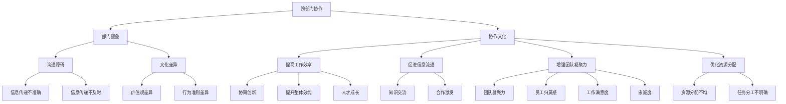
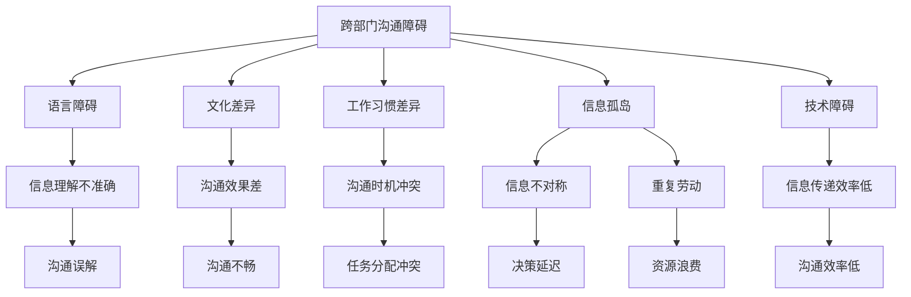
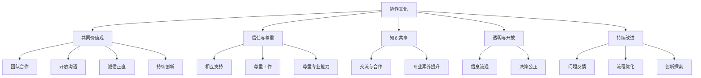
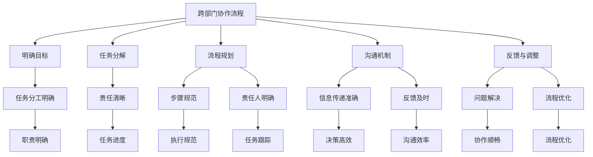
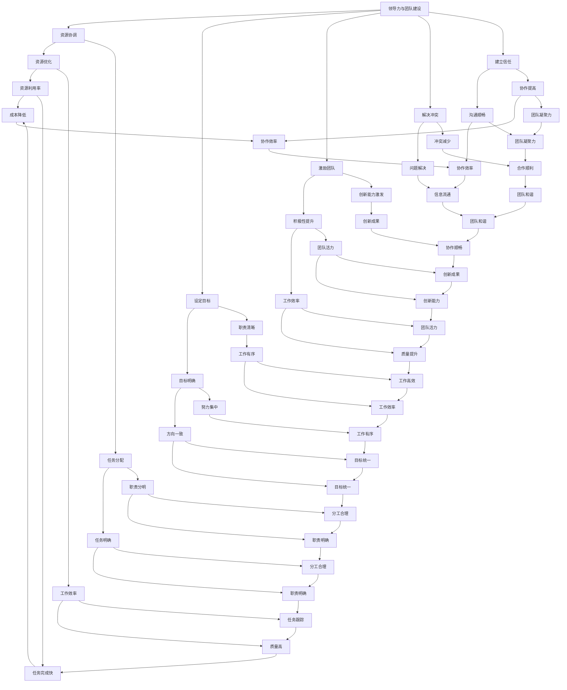
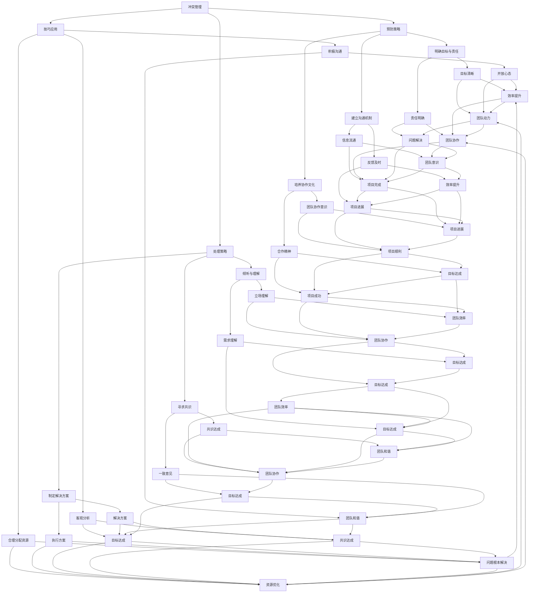
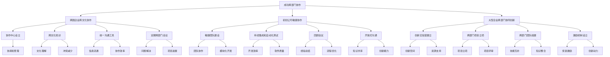

                 

### 文章标题

“跨部门协作：打破壁垒提升整体效能”

### 关键词

跨部门协作、沟通障碍、协作文化、流程优化、领导力、冲突管理、案例分析、实战策略、可持续发展。

### 摘要

本文深入探讨了跨部门协作的重要性及其在当今企业运营中的关键作用。首先，介绍了跨部门协作的定义、作用和面临的挑战。接着，分析了跨部门沟通的障碍及其解决策略，并阐述了协作文化的建立和维持。文章进一步探讨了跨部门协作流程和工具的优化，以及领导力和团队建设在其中的作用。通过典型案例分析和实战案例，文章提供了具体的实施方法和策略。最后，文章总结了跨部门协作的可持续发展策略，并对未来趋势进行了展望。

## 引言

在现代企业中，跨部门协作已成为确保组织高效运作和成功的关键因素。随着企业规模的扩大和市场环境的复杂化，各部门之间的联系和协作变得更加紧密。然而，跨部门协作并非易事，常常面临沟通障碍、文化差异和资源分配等问题。本文旨在探讨跨部门协作的理论基础和实践策略，以帮助企业在复杂的环境中实现高效协作，提升整体效能。

### 跨部门协作的重要性

跨部门协作的重要性体现在多个方面。首先，它能够整合各部门的专业知识和资源，实现优势互补，从而提高项目执行效率和成果质量。其次，跨部门协作有助于打破信息孤岛，促进信息流通和共享，增强企业的整体创新能力。此外，跨部门协作还能增强团队凝聚力和员工归属感，提高员工的工作满意度和忠诚度。

### 跨部门协作面临的挑战

尽管跨部门协作具有诸多优势，但实际操作中仍然面临诸多挑战。首先，沟通障碍是一个普遍存在的问题。不同部门之间的语言、文化、工作习惯和沟通方式的差异，可能导致信息传递不准确、不及时。其次，协作文化的缺乏也是一个重要挑战。许多企业在跨部门协作中缺乏共同的价值观和行为准则，导致协作效率低下。此外，资源分配不均和任务分工不明确，也是跨部门协作中的常见问题。

### 本文结构

本文将分为两个主要部分。第一部分将深入探讨跨部门协作的理论基础，包括定义、作用、挑战与机遇、沟通障碍与解决策略、协作文化的建立与维持、协作流程与工具的优化、领导力与团队建设、冲突管理以及成功案例分析。第二部分将结合实战案例，提供具体的实施方法和策略，并探讨跨部门协作的可持续发展。

接下来的内容将逐步深入探讨跨部门协作的各个方面，从理论基础到实战策略，帮助读者全面了解和掌握跨部门协作的核心知识和技能。

## 第一部分：跨部门协作的理论基础

### 第1章：跨部门协作的重要性

#### 背景介绍

跨部门协作是指在不同部门之间进行的合作和协调活动，以共同实现组织的目标和任务。在当今复杂多变的企业环境中，跨部门协作已成为企业保持竞争力和实现成功的关键因素之一。传统的部门化结构往往导致信息孤岛和资源分散，限制了企业的整体效能。而跨部门协作能够打破部门壁垒，促进资源的整合和共享，从而提高企业的运作效率和创新能力。

#### 核心概念与联系

**跨部门协作**：跨部门协作是指不同部门之间进行的合作和协调活动，包括信息交流、资源共享、共同解决问题等。

**部门壁垒**：部门壁垒是指由于部门间的利益冲突、沟通障碍、文化差异等因素导致的协作障碍。

**协作文化**：协作文化是指一种重视合作、共享和共同目标的企业文化，它能够促进跨部门协作的顺利进行。

#### 跨部门协作的作用

1. **提高工作效率**：跨部门协作能够整合各部门的专业知识和资源，实现优势互补，从而提高项目执行效率和成果质量。

2. **促进信息流通**：跨部门协作有助于打破信息孤岛，促进信息流通和共享，增强企业的整体创新能力。

3. **增强团队凝聚力**：跨部门协作能够增强团队凝聚力和员工归属感，提高员工的工作满意度和忠诚度。

4. **优化资源分配**：跨部门协作能够优化资源分配和任务分工，避免资源浪费和重复劳动。

#### 跨部门协作的挑战与机遇

**挑战**：

1. **沟通障碍**：不同部门之间的语言、文化、工作习惯和沟通方式的差异，可能导致信息传递不准确、不及时。

2. **文化差异**：各部门之间存在不同的价值观和行为准则，可能影响协作效率。

3. **资源分配不均**：资源分配不均和任务分工不明确，可能导致部门之间的矛盾和冲突。

**机遇**：

1. **协同创新**：跨部门协作能够促进不同部门之间的知识交流和合作，激发创新思维。

2. **提升整体效能**：跨部门协作能够优化企业内部资源配置，提高整体运作效率。

3. **人才成长**：跨部门协作为员工提供了跨部门交流和学习的平台，有助于其职业发展和成长。

#### 成功跨部门协作的关键因素

1. **领导者的支持**：领导者的重视和支持是跨部门协作成功的关键。

2. **明确的协作目标**：设定清晰的协作目标和任务分工，确保各部门明确自己的职责。

3. **有效的沟通机制**：建立有效的沟通机制，确保信息的准确传递和及时反馈。

4. **协作文化的培养**：培养协作文化，促进各部门之间的信任和合作。

5. **持续的优化与改进**：通过不断优化协作流程和工具，提高协作效率。

综上所述，跨部门协作在当今企业运营中具有重要作用。了解其核心概念、作用、挑战与机遇，以及成功跨部门协作的关键因素，对于企业实现高效运作和提升整体效能具有重要意义。

#### 核心概念原理之间的关系架构 Mermaid 流程图



#### 核心算法原理讲解必须使用伪代码来详细阐述

```python
# 跨部门协作核心算法
def cross_department协作(target, resources, communication, culture):
    # 定义协作流程
    flow = []

    # 初始化协作流程
    flow.append("确定协作目标与任务分工")

    # 初始化沟通机制
    communication_system = initialize_communication()

    # 初始化协作文化
    collaboration_culture = cultivate_collaboration_culture()

    # 整合资源
    integrated_resources = integrate_resources(resources)

    # 促进知识交流
    knowledge_exchange = promote_knowledge_exchange()

    # 执行协作任务
    for task in target.tasks:
        execute_task(task, communication_system, collaboration_culture, integrated_resources)

    # 持续优化与改进
    optimize_and_improve(communication_system, collaboration_culture, integrated_resources)

    return flow
```

#### 数学模型和公式 & 详细讲解 & 举例说明

在跨部门协作中，可以使用以下数学模型来评估协作效率：

$$
效率 = \frac{协作成果}{协作时间}
$$

**详细讲解**：

- **协作成果**：指的是通过跨部门协作所实现的成果，如项目完成度、产品质量、创新成果等。
- **协作时间**：指的是完成协作任务所花费的时间。

**举例说明**：

假设一个项目团队在一个月内完成了10个任务，总共花费了20天的时间，那么该项目的协作效率可以计算如下：

$$
效率 = \frac{10}{20} = 0.5 \text{（即50%）}
$$

这意味着该项目团队在一个月内的协作效率为50%，即平均每天完成0.5个任务。

#### 数学公式请使用latex格式，嵌入文中独立段落的latex公式前后使用 $$ 括起来(例如：$$1+1=2$$ )

$$
效率 = \frac{协作成果}{协作时间}
$$

#### 段落内的latex公式前后使用 $

$1 < 2$

## 第2章：跨部门沟通的障碍与解决策略

### 背景介绍

跨部门沟通在跨部门协作中扮演着至关重要的角色。然而，由于各部门之间存在语言、文化、工作习惯等方面的差异，跨部门沟通常常面临各种障碍。这些障碍不仅影响信息传递的准确性，还可能延误项目进度，降低协作效率。因此，了解和解决跨部门沟通的障碍，是确保跨部门协作顺利进行的关键。

### 沟通障碍的种类

跨部门沟通的障碍可以分为以下几类：

1. **语言障碍**：不同部门之间的语言表达方式不同，可能导致信息理解不准确。
2. **文化差异**：各部门的文化背景、价值观和行为准则不同，可能影响沟通效果。
3. **工作习惯差异**：各部门的工作流程、优先级和节奏不同，可能导致沟通时机和方式的冲突。
4. **信息孤岛**：各部门之间的信息交流不畅，导致信息不对称和重复劳动。
5. **技术障碍**：缺乏统一的沟通工具和平台，导致信息传递效率低下。

### 增强跨部门沟通的有效方法

为了有效解决跨部门沟通的障碍，企业可以采取以下方法：

1. **明确沟通目标**：确保所有部门都清楚自己的沟通目标和任务分工，避免因目标不明导致的沟通不畅。
2. **建立沟通机制**：制定明确的沟通流程和规则，确保信息的准确传递和及时反馈。
3. **加强培训**：通过跨部门培训，提高员工的沟通能力和跨文化素养。
4. **利用技术工具**：采用统一的沟通工具和平台，提高信息传递的效率和质量。
5. **建立信任**：通过建立信任机制，促进各部门之间的沟通和合作。
6. **定期反馈**：通过定期反馈会议，评估沟通效果，及时调整和改进沟通策略。

### 案例分析：成功跨部门沟通实例

以下是一个成功跨部门沟通的实例：

**案例背景**：某公司市场部与研发部在推出一款新产品时，由于双方在目标和需求理解上存在分歧，导致项目进度严重延误。

**解决方案**：

1. **明确沟通目标**：双方共同制定项目目标，明确各自的责任和任务。
2. **建立沟通机制**：每周举行一次项目进度会议，确保双方及时交流信息和反馈意见。
3. **加强培训**：为双方员工提供跨部门沟通和项目管理的培训，提高沟通效率。
4. **利用技术工具**：采用项目管理软件，如Trello或JIRA，实时跟踪项目进度和任务分配。
5. **建立信任**：通过定期沟通和合作，建立双方的信任关系，减少沟通误解。
6. **定期反馈**：每两周举行一次项目回顾会议，总结项目进展和沟通效果，提出改进建议。

**结果**：通过上述措施，市场部与研发部之间的沟通效率显著提高，项目进度恢复正常，最终成功推出了新产品。

### 案例分析与启示

通过上述案例，我们可以得到以下启示：

1. **明确沟通目标**：明确的项目目标和任务分工是跨部门沟通的基础。
2. **建立沟通机制**：定期的沟通会议和统一的沟通工具是确保信息传递准确和及时的关键。
3. **加强培训**：提高员工的跨部门沟通能力，有助于解决文化差异和沟通障碍。
4. **建立信任**：信任是跨部门合作的重要基础，通过持续沟通和合作，可以建立信任关系。
5. **定期反馈**：定期评估沟通效果，及时调整和改进沟通策略，有助于提高跨部门协作的效率。

总之，跨部门沟通的障碍是跨部门协作中的常见问题，但通过采取有效的解决策略，可以克服这些障碍，实现高效的跨部门协作。

#### 核心概念原理之间的关系架构 Mermaid 流程图



#### 核心算法原理讲解必须使用伪代码来详细阐述

```python
# 跨部门沟通障碍解决算法
def resolve_communication_obstacles(language_barrier, cultural_difference, work_habits_difference, information_island, technical Barrier):
    # 初始化解决方案列表
    solutions = []

    # 解决语言障碍
    solutions.append("提供跨部门语言培训，确保信息理解准确")

    # 解决文化差异
    solutions.append("加强跨文化沟通培训，提高跨文化素养")

    # 解决工作习惯差异
    solutions.append("制定统一的工作流程和沟通规范，确保沟通时机和方式一致")

    # 解决信息孤岛
    solutions.append("建立信息共享平台，促进信息流通和共享")

    # 解决技术障碍
    solutions.append("采用统一的沟通工具和平台，提高信息传递效率")

    # 执行解决方案
    for solution in solutions:
        execute_solution(solution)

    return solutions
```

#### 数学模型和公式 & 详细讲解 & 举例说明

在跨部门沟通中，可以使用以下数学模型来评估沟通效率：

$$
沟通效率 = \frac{沟通成果}{沟通时间}
$$

**详细讲解**：

- **沟通成果**：指的是通过跨部门沟通所实现的成果，如信息准确传递、决策效率提高等。
- **沟通时间**：指的是完成沟通任务所花费的时间。

**举例说明**：

假设一个项目团队在一个月内完成了10次关键沟通，每次沟通平均花费了1小时，那么该团队的沟通效率可以计算如下：

$$
沟通效率 = \frac{10}{1 \times 30} = 0.333 \text{（即33.3%）}
$$

这意味着该团队在一个月内的沟通效率为33.3%，即平均每次沟通需要花费约3小时的沟通时间。

#### 数学公式请使用latex格式，嵌入文中独立段落的latex公式前后使用 $$ 括起来(例如：$$1+1=2$$ )

$$
沟通效率 = \frac{沟通成果}{沟通时间}
$$

#### 段落内的latex公式前后使用 $

$1 < 2$

## 第3章：建立跨部门协作文化

### 背景介绍

跨部门协作文化是指企业在跨部门协作过程中形成的一种共同价值观、行为准则和工作氛围。建立积极的跨部门协作文化，不仅有助于提高员工的工作满意度，还能提升整体组织的协作效率和创新能力。然而，跨部门协作文化的建立并非一蹴而就，需要企业从战略层面进行规划和持续推动。

### 协作文化的概念与特征

**协作文化的概念**：

协作文化是指一种重视团队合作、知识共享、互相尊重和共同成长的企业文化。它强调各部门之间的协同合作，通过相互支持和共同努力，实现组织的目标和愿景。

**协作文化的特征**：

1. **共同价值观**：协作文化具有明确的共同价值观，如团队合作、开放沟通、诚信正直、持续创新等。
2. **信任与尊重**：协作文化强调信任和尊重，各部门之间相互信任，尊重彼此的工作和专业能力。
3. **知识共享**：协作文化鼓励知识共享，通过交流和合作，不断提升团队成员的专业能力和知识水平。
4. **透明与开放**：协作文化倡导透明和开放的工作氛围，信息流通无障碍，决策过程公开公正。
5. **持续改进**：协作文化注重持续改进，鼓励员工提出建议和反馈，不断优化工作流程和协作方式。

### 培养协作文化的策略

**1. 高层领导的支持**：

高层领导的支持是建立协作文化的关键。领导者的重视和倡导，能够为协作文化的形成提供强大的推动力。企业可以通过以下方式获得高层领导的支持：

- **制定明确的协作战略**：高层领导应明确表达对协作文化的支持和期望，制定具体的协作目标和策略。
- **提供资源保障**：为跨部门协作提供必要的资源和支持，如培训、技术工具等。
- **树立榜样**：高层领导应通过自身的行为和决策，树立协作文化的榜样。

**2. 跨部门沟通与交流**：

跨部门沟通与交流是培养协作文化的重要途径。企业可以通过以下方式加强跨部门沟通与交流：

- **定期举办跨部门会议**：通过定期的跨部门会议，促进各部门之间的信息交流和资源共享。
- **组织团队建设活动**：通过团队建设活动，增强部门之间的合作和信任。
- **建立信息共享平台**：采用统一的信息共享平台，提高信息传递的效率和准确性。

**3. 激励与评价机制**：

激励与评价机制是培养协作文化的重要手段。企业可以通过以下方式建立激励与评价机制：

- **设立协作奖项**：设立专门的协作奖项，表彰在跨部门协作中表现优秀的个人和团队。
- **绩效评估**：将跨部门协作能力纳入员工的绩效评估体系，激励员工积极参与跨部门协作。
- **培训与发展**：为员工提供跨部门协作的培训和发展机会，提升其协作能力和专业素养。

**4. 持续改进与优化**：

协作文化的建立是一个持续的过程，需要企业不断进行改进和优化。企业可以通过以下方式持续改进协作文化：

- **定期评估与反馈**：定期对协作文化进行评估和反馈，了解员工对协作文化的感知和满意度。
- **优化协作流程和工具**：通过优化协作流程和工具，提高协作效率和效果。
- **鼓励创新与尝试**：鼓励员工提出创新的想法和建议，不断探索和尝试新的协作方式。

### 协作文化的评估与改进

**1. 评估方法**：

协作文化的评估可以通过以下几种方法进行：

- **员工调查**：通过员工满意度调查，了解员工对协作文化的感知和评价。
- **领导评价**：通过高层领导的评价，了解协作文化的实施情况和效果。
- **项目评估**：通过跨部门项目的评估，分析协作文化的实际应用效果。

**2. 改进策略**：

根据评估结果，企业可以采取以下改进策略：

- **针对问题进行改进**：针对评估中发现的协作文化问题，制定具体的改进措施，如加强沟通培训、优化工作流程等。
- **提升员工参与度**：通过增加员工的参与度和责任感，提高协作文化的实施效果。
- **持续监督与反馈**：建立持续的监督与反馈机制，确保协作文化的持续改进。

总之，建立跨部门协作文化是企业实现高效协作的重要保障。通过高层领导的支持、跨部门沟通与交流、激励与评价机制以及持续改进与优化，企业可以逐步建立和维护积极的协作文化，提升整体组织的协作效率和创新能力。

#### 核心概念原理之间的关系架构 Mermaid 流程图



#### 核心算法原理讲解必须使用伪代码来详细阐述

```python
# 建立协作文化算法
def establish_collaboration_culture(values, trust, knowledge, transparency, improvement):
    # 初始化协作文化架构
    collaboration_culture = {}

    # 设定共同价值观
    collaboration_culture['values'] = set_values(values)

    # 建立信任与尊重机制
    collaboration_culture['trust'] = establish_trust(trust)

    # 促进知识共享
    collaboration_culture['knowledge'] = promote_knowledge_sharing(knowledge)

    # 确保透明与开放
    collaboration_culture['transparency'] = ensure_transparency(transparency)

    # 实施持续改进
    collaboration_culture['improvement'] = implement_continuous_improvement(improvement)

    # 评估协作文化效果
    evaluate_collaboration_culture(collaboration_culture)

    return collaboration_culture

# 设定共同价值观
def set_values(values):
    value_list = []
    for value in values:
        value_list.append(value)
    return value_list

# 建立信任与尊重机制
def establish_trust(trust):
    trust_measures = []
    for measure in trust:
        trust_measures.append(measure)
    return trust_measures

# 促进知识共享
def promote_knowledge_sharing(knowledge):
    knowledge_sharing_activities = []
    for activity in knowledge:
        knowledge_sharing_activities.append(activity)
    return knowledge_sharing_activities

# 确保透明与开放
def ensure_transparency(transparency):
    transparency_practices = []
    for practice in transparency:
        transparency_practices.append(practice)
    return transparency_practices

# 实施持续改进
def implement_continuous_improvement(improvement):
    improvement_strategies = []
    for strategy in improvement:
        improvement_strategies.append(strategy)
    return improvement_strategies

# 评估协作文化效果
def evaluate_collaboration_culture(collaboration_culture):
    # 收集评估数据
    data = collect_evaluation_data(collaboration_culture)

    # 分析评估数据
    analysis = analyze_evaluation_data(data)

    # 提出改进建议
    recommendations = propose_improvement_recommendations(analysis)

    # 实施改进措施
    apply_improvement_measures(recommendations)

    return analysis
```

#### 数学模型和公式 & 详细讲解 & 举例说明

在建立协作文化过程中，可以采用以下数学模型来评估协作文化的效果：

$$
协作文化效果 = \frac{协作成果}{协作时间} \times \frac{员工满意度}{1}
$$

**详细讲解**：

- **协作成果**：指的是通过协作文化所实现的成果，如项目完成度、创新成果、团队凝聚力等。
- **协作时间**：指的是完成协作任务所花费的时间。
- **员工满意度**：指的是员工对协作文化的满意程度。

**举例说明**：

假设一个项目团队在一个月内通过协作文化完成了10个任务，共花费了20天时间，团队整体满意度为90%，那么该团队的协作文化效果可以计算如下：

$$
协作文化效果 = \frac{10}{20} \times 0.9 = 0.45 \times 0.9 = 0.405 \text{（即40.5%）}
$$

这意味着该团队的协作文化效果为40.5%，即平均每天完成0.405个任务，并且员工满意度为90%。

#### 数学公式请使用latex格式，嵌入文中独立段落的latex公式前后使用 $$ 括起来(例如：$$1+1=2$$ )

$$
协作文化效果 = \frac{协作成果}{协作时间} \times \frac{员工满意度}{1}
$$

#### 段落内的latex公式前后使用 $

$1 < 2$

## 第4章：跨部门协作流程与工具

### 背景介绍

跨部门协作流程是指在跨部门协作过程中所遵循的一系列步骤和规则，以确保协作的有序、高效和透明。合理的跨部门协作流程可以显著提升协作效率，降低沟通成本，减少协作中的误解和冲突。而在跨部门协作中，选择合适的协作工具也是至关重要的，它能够帮助团队成员更好地协同工作，提高项目的执行效率。

### 跨部门协作流程的设计

设计跨部门协作流程需要考虑以下几个方面：

1. **明确目标**：首先，要明确跨部门协作的目标和任务，确保所有参与部门都清楚自己的职责和期望。

2. **任务分解**：将大任务分解为小任务，并明确每个小任务的负责人，确保任务分工明确，责任清晰。

3. **流程规划**：制定详细的协作流程，包括任务执行、沟通反馈、问题解决、进度跟踪等环节，确保每个环节都有明确的操作步骤和责任人。

4. **沟通机制**：建立高效的沟通机制，确保信息能够及时、准确地传递到相关部门和人员。

5. **反馈与调整**：设立定期的反馈机制，对协作流程进行评估和调整，确保流程能够持续优化。

### 常用的协作工具与技术

在跨部门协作中，常用的协作工具包括：

1. **项目管理工具**：如Trello、JIRA、Asana等，用于任务管理、进度跟踪和资源分配。

2. **沟通工具**：如Slack、Microsoft Teams、Zoom等，用于实时沟通、消息传递和视频会议。

3. **文档协作工具**：如Google Docs、Microsoft Office 365等，用于文档的编辑、共享和协同工作。

4. **知识管理工具**：如Confluence、Notion等，用于知识共享、文档归档和知识库建设。

5. **自动化工具**：如Workato、Automate.io等，用于流程自动化、任务触发和通知推送。

### 跨部门协作流程的优化

优化跨部门协作流程可以从以下几个方面进行：

1. **流程简化**：去除不必要的环节和步骤，简化流程，提高工作效率。

2. **自动化**：通过自动化工具，减少人工操作，提高流程的准确性和效率。

3. **标准化**：建立标准化的流程和模板，确保协作的一致性和规范性。

4. **反馈机制**：建立有效的反馈机制，及时收集和分析协作过程中的问题，不断优化流程。

5. **培训与支持**：为团队成员提供协作工具和流程的培训和支持，提高其使用效率和协作能力。

### 案例分析：跨部门协作流程优化实践

以下是一个跨部门协作流程优化的实际案例：

**案例背景**：某科技公司产品研发团队在项目开发过程中，由于协作流程不明确，导致项目进度延误，沟通效率低下。

**解决方案**：

1. **明确目标与任务**：项目开始前，明确项目的目标和任务，并制定详细的任务分解表，确保每个团队成员都清楚自己的职责。

2. **建立沟通机制**：采用Slack作为主要沟通工具，设立专门的频道，用于项目进度汇报、问题讨论和资源申请。

3. **使用项目管理工具**：采用JIRA进行任务管理，实时跟踪任务进度，确保每个任务都有明确的负责人和截止日期。

4. **自动化流程**：使用Workato实现部分流程自动化，如任务分配、进度更新和通知推送，减少人工操作。

5. **定期反馈与优化**：每周召开项目进度会议，总结协作过程中的问题，制定改进措施，并定期更新流程和工具。

**结果**：通过上述措施，项目进度显著加快，沟通效率提高，项目质量和客户满意度均有所提升。

### 案例分析与启示

通过上述案例，我们可以得到以下启示：

1. **明确目标和任务**：明确的目标和任务分工是跨部门协作的基础，有助于提高协作效率。

2. **建立沟通机制**：高效的沟通机制能够确保信息的准确传递和及时反馈，提高协作效率。

3. **使用项目管理工具**：项目管理工具能够帮助团队更好地管理任务和进度，提高协作效率。

4. **自动化流程**：自动化工具可以减少人工操作，提高流程的准确性和效率。

5. **定期反馈与优化**：通过定期的反馈和优化，确保协作流程的持续改进，提高整体协作效能。

总之，跨部门协作流程的优化是企业提升协作效率和项目质量的重要手段。通过明确目标、建立沟通机制、使用项目管理工具和自动化技术，以及定期反馈和优化，企业可以逐步实现高效的跨部门协作。

#### 核心概念原理之间的关系架构 Mermaid 流程图



#### 核心算法原理讲解必须使用伪代码来详细阐述

```python
# 跨部门协作流程优化算法
def optimize_cross_department_workflow(goals, task_decomposition, process_plan, communication_mechanism, feedback_and_adjustment):
    # 初始化优化后的流程
    optimized_workflow = {}

    # 明确目标和任务分解
    optimized_workflow['goals'] = set_goals(goals)
    optimized_workflow['task_decomposition'] = decompose_tasks(task_decomposition)

    # 制定流程规划
    optimized_workflow['process_plan'] = create_process_plan(process_plan)

    # 确立沟通机制
    optimized_workflow['communication_mechanism'] = establish_communication_mechanism(communication_mechanism)

    # 实施反馈与调整
    optimized_workflow['feedback_and_adjustment'] = implement_feedback(feedback_and_adjustment)

    # 评估优化效果
    workflow_evaluation = evaluate_workflow(optimized_workflow)

    return optimized_workflow, workflow_evaluation

# 明确目标和任务分解
def set_goals(goals):
    goal_list = []
    for goal in goals:
        goal_list.append(goal)
    return goal_list

def decompose_tasks(task_decomposition):
    task_list = []
    for task in task_decomposition:
        task_list.append(task)
    return task_list

# 制定流程规划
def create_process_plan(process_plan):
    process_plan_steps = []
    for step in process_plan:
        process_plan_steps.append(step)
    return process_plan_steps

# 确立沟通机制
def establish_communication_mechanism(communication_mechanism):
    communication_plan = []
    for mechanism in communication_mechanism:
        communication_plan.append(mechanism)
    return communication_plan

# 实施反馈与调整
def implement_feedback(feedback_and_adjustment):
    feedback_actions = []
    for action in feedback_and_adjustment:
        feedback_actions.append(action)
    return feedback_actions

# 评估优化效果
def evaluate_workflow(optimized_workflow):
    evaluation_results = evaluate_workflow_steps(optimized_workflow)
    return evaluation_results

def evaluate_workflow_steps(optimized_workflow):
    evaluation_data = collect_evaluation_data(optimized_workflow)
    evaluation_analysis = analyze_evaluation_data(evaluation_data)
    return evaluation_analysis
```

#### 数学模型和公式 & 详细讲解 & 举例说明

在跨部门协作流程优化中，可以使用以下数学模型来评估优化效果：

$$
优化效果 = \frac{优化后的协作效率}{优化前的协作效率}
$$

**详细讲解**：

- **协作效率**：指的是完成协作任务所需的时间与资源的比值，是评估协作效果的重要指标。
- **优化前的协作效率**：指的是在未进行流程优化前，完成协作任务所需的时间与资源的比值。
- **优化后的协作效率**：指的是在进行了流程优化后，完成协作任务所需的时间与资源的比值。

**举例说明**：

假设某项目在未进行流程优化前，需要30天时间完成，共花费了50人天；经过流程优化后，该项目只需20天时间完成，共花费了40人天。那么，该项目的优化效果可以计算如下：

$$
优化效果 = \frac{20 \times 40}{30 \times 50} = \frac{800}{1500} = 0.5333 \text{（即53.33%）}
$$

这意味着，经过流程优化后，项目的协作效率提升了53.33%，即优化后的协作效率是优化前的1.5333倍。

#### 数学公式请使用latex格式，嵌入文中独立段落的latex公式前后使用 $$ 括起来(例如：$$1+1=2$$ )

$$
优化效果 = \frac{优化后的协作效率}{优化前的协作效率}
$$

#### 段落内的latex公式前后使用 $

$1 < 2$

## 第5章：跨部门协作中的领导力与团队建设

### 背景介绍

跨部门协作的有效性在很大程度上取决于领导力和团队建设。领导者作为跨部门协作的推动者和协调者，其领导风格、决策能力和沟通能力对跨部门协作的成功至关重要。同时，一个高效的团队也是实现跨部门协作目标的重要保障。因此，探讨跨部门协作中的领导力与团队建设，对于提升企业整体协作效能具有重要意义。

### 领导者在跨部门协作中的作用

1. **协调资源**：领导者需要协调各部门之间的资源，确保资源的最优配置和利用，以支持跨部门协作的顺利进行。

2. **设定目标**：领导者需要明确跨部门协作的目标和期望，确保所有部门都朝着共同的目标努力，提高协作的一致性和效率。

3. **激励团队**：领导者需要通过激励措施，激发团队成员的积极性和创造力，推动跨部门协作的顺利进行。

4. **解决冲突**：跨部门协作过程中难免会出现冲突和问题，领导者需要及时解决冲突，避免问题扩大，确保协作的持续进行。

5. **建立信任**：领导者需要通过建立信任机制，促进各部门之间的沟通与合作，提高跨部门协作的效率和效果。

### 建设高效的跨部门团队

1. **明确团队目标**：团队目标应与组织目标保持一致，明确具体、可量化的目标，以确保团队成员的方向一致和努力集中。

2. **优化团队结构**：根据跨部门协作的需求，优化团队结构，确保团队成员具有互补的能力和技能，以提高团队的协同作战能力。

3. **加强培训与发展**：为团队成员提供跨部门协作相关的培训和发展机会，提高其专业能力和协作技能，增强团队的整体战斗力。

4. **建立有效的沟通机制**：建立有效的沟通机制，确保团队成员之间的信息流通和协作顺畅，减少沟通障碍和误解。

5. **培养团队精神**：通过团队建设活动和项目合作，培养团队成员的团队精神，增强团队的凝聚力和协作意识。

### 领导力与团队建设的案例分析

**案例背景**：某大型科技公司研发部门与市场部门在开发一款新产品时，由于双方存在较大的工作差异和沟通障碍，导致项目进展缓慢，冲突频发。

**解决方案**：

1. **高层领导介入**：公司高层领导意识到问题的严重性，亲自介入，协调两个部门之间的资源和支持。

2. **设立项目协调组**：设立专门的项目协调组，由高层领导任命一名项目经理负责跨部门协作，确保项目目标的明确和任务的执行。

3. **定期召开项目会议**：定期召开跨部门项目会议，确保双方及时沟通和反馈，解决项目中存在的问题。

4. **加强培训与沟通**：为双方团队提供跨部门协作培训，提高其沟通能力和协作技能。同时，建立畅通的沟通渠道，确保信息的及时传递和共享。

5. **建立激励机制**：设立项目奖励机制，对在项目协作中表现优秀的个人和团队进行表彰和奖励，激发团队的工作积极性和创新能力。

**结果**：通过上述措施，项目进展显著加快，部门之间的冲突减少，项目质量得到提升，最终成功推出了新产品。

### 案例分析与启示

通过上述案例，我们可以得到以下启示：

1. **高层领导介入**：高层领导的重视和支持是跨部门协作成功的关键，能够为协作提供强有力的资源保障和支持。

2. **设立项目协调组**：设立专门的协调组，有助于明确职责和任务，提高项目的执行效率和协同作战能力。

3. **定期召开项目会议**：定期召开项目会议，是确保跨部门协作顺利进行的重要手段，有助于及时发现和解决问题。

4. **加强培训与沟通**：通过培训提高团队的专业能力和协作技能，通过沟通建立信任和合作，是提升跨部门协作效率的有效途径。

5. **建立激励机制**：设立激励机制，能够激发团队成员的积极性和创造力，提高跨部门协作的整体效能。

总之，领导力和团队建设在跨部门协作中扮演着至关重要的角色。通过高层领导的介入、设立项目协调组、定期召开项目会议、加强培训与沟通以及建立激励机制，企业可以建设高效的跨部门团队，实现跨部门协作的目标。

#### 核心概念原理之间的关系架构 Mermaid 流程图



#### 核心算法原理讲解必须使用伪代码来详细阐述

```python
# 领导力与团队建设核心算法
def leadership_and_team_building(leader_skills, team_goal, resource_management, motivation, conflict_resolution, communication, team_building):
    # 初始化领导力和团队建设架构
    leadership_framework = {}
    
    # 领导技能
    leadership_framework['leader_skills'] = develop_leader_skills(leader_skills)
    
    # 团队目标
    leadership_framework['team_goal'] = set_team_goals(team_goal)
    
    # 资源管理
    leadership_framework['resource_management'] = manage_resources(resource_management)
    
    # 激励机制
    leadership_framework['motivation'] = implement_motivation(motivation)
    
    # 冲突解决
    leadership_framework['conflict_resolution'] = resolve_conflicts(conflict_resolution)
    
    # 沟通机制
    leadership_framework['communication'] = establish_communication(communication)
    
    # 团队建设
    leadership_framework['team_building'] = build_team(team_building)
    
    # 评估领导力和团队建设效果
    leadership_evaluation = evaluate_leadership_and_team(leadership_framework)
    
    return leadership_framework, leadership_evaluation

# 领导技能开发
def develop_leader_skills(leader_skills):
    skill_set = []
    for skill in leader_skills:
        skill_set.append(skill)
    return skill_set

# 设定团队目标
def set_team_goals(team_goal):
    goal_list = []
    for goal in team_goal:
        goal_list.append(goal)
    return goal_list

# 资源管理
def manage_resources(resource_management):
    resource_plan = []
    for resource in resource_management:
        resource_plan.append(resource)
    return resource_plan

# 实施激励机制
def implement_motivation(motivation):
    motivation_strategies = []
    for strategy in motivation:
        motivation_strategies.append(strategy)
    return motivation_strategies

# 冲突解决
def resolve_conflicts(conflict_resolution):
    resolution_methods = []
    for method in conflict_resolution:
        resolution_methods.append(method)
    return resolution_methods

# 建立沟通机制
def establish_communication(communication):
    communication_plan = []
    for channel in communication:
        communication_plan.append(channel)
    return communication_plan

# 团队建设
def build_team(team_building):
    building_activities = []
    for activity in team_building:
        building_activities.append(activity)
    return building_activities

# 评估领导力和团队建设效果
def evaluate_leadership_and_team(leadership_framework):
    # 收集评估数据
    evaluation_data = gather_evaluation_data(leadership_framework)
    
    # 分析评估数据
    analysis_results = analyze_evaluation_data(evaluation_data)
    
    return analysis_results
```

#### 数学模型和公式 & 详细讲解 & 举例说明

在领导力与团队建设中，可以使用以下数学模型来评估团队效能：

$$
团队效能 = \frac{团队目标达成度}{团队投入资源}
$$

**详细讲解**：

- **团队目标达成度**：指的是团队在既定时间内完成目标的程度，通常以百分比表示。
- **团队投入资源**：指的是团队为实现目标所投入的人力、物力和时间等资源。

**举例说明**：

假设一个团队在一个季度内实现了90%的目标，团队总共投入了100人天的工作量，那么该团队的效能可以计算如下：

$$
团队效能 = \frac{90\%}{100 \text{人天}} = 0.9 \text{（即90%）}
$$

这意味着该团队在一个季度内的效能达到了90%，即团队在投入资源的基础上，完成了90%的目标。

#### 数学公式请使用latex格式，嵌入文中独立段落的latex公式前后使用 $$ 括起来(例如：$$1+1=2$$ )

$$
团队效能 = \frac{团队目标达成度}{团队投入资源}
$$

#### 段落内的latex公式前后使用 $

$1 < 2$

## 第6章：跨部门协作中的冲突管理

### 背景介绍

在跨部门协作过程中，冲突是难以避免的现象。由于各部门的职责、目标和资源分配等方面的差异，跨部门之间的沟通和合作可能会出现摩擦和矛盾。有效的冲突管理是确保跨部门协作顺利进行、提高团队整体效能的关键。因此，探讨跨部门协作中的冲突管理策略和方法，对于提升企业运营效率具有重要意义。

### 冲突的类型与影响

1. **冲突的类型**：

   - **认知冲突**：由于对问题的理解或解决方案的不同而产生的冲突。
   - **情感冲突**：由于个人情感或价值观的差异而产生的冲突。
   - **资源冲突**：由于资源分配不均或竞争而产生的冲突。
   - **过程冲突**：由于工作流程、沟通机制等方面的差异而产生的冲突。

2. **冲突的影响**：

   - **负面影响**：冲突如果处理不当，可能会导致团队凝聚力下降、员工士气低落、工作效率降低，甚至影响项目的完成和质量。
   - **正面影响**：适度的冲突可以激发创新思维、促进问题解决和团队成长。

### 冲突管理的策略与技巧

1. **预防策略**：

   - **明确目标和责任**：在跨部门协作开始前，明确各方的目标和责任，避免因目标模糊或责任不清而产生的冲突。
   - **建立沟通机制**：建立有效的沟通机制，确保信息的及时传递和共享，减少误解和误判。
   - **培养协作文化**：通过培训和文化建设，增强团队的协作意识和合作精神，降低冲突发生的概率。

2. **处理策略**：

   - **倾听与理解**：在面对冲突时，首先要倾听对方的观点，理解其立场和需求，避免急于判断和采取行动。
   - **寻求共识**：通过对话和协商，寻找共同点和共识，缩小分歧，达成一致。
   - **制定解决方案**：根据冲突的原因和性质，制定具体的解决方案，确保各方都能接受并执行。

3. **技巧应用**：

   - **积极沟通**：保持积极的态度，以开放的心态进行沟通，避免指责和攻击。
   - **客观分析**：对冲突进行客观分析，识别问题的根本原因，避免表面处理。
   - **合理分配资源**：合理分配资源，确保各方都能获得所需的资源，减少资源竞争。

### 冲突管理的案例分析

**案例背景**：某科技公司研发部门与市场部门在项目推进过程中，由于对项目目标和资源分配存在分歧，导致双方关系紧张，项目进度受阻。

**解决方案**：

1. **明确项目目标**：项目经理与双方负责人进行沟通，明确项目目标，确保各方对目标有共同的理解。
2. **建立沟通机制**：设立定期会议，确保双方能够及时沟通和反馈，解决项目推进中的问题。
3. **协调资源分配**：项目经理协调资源，确保双方都能获得必要的资源和支持，减少资源竞争。
4. **寻求共识**：通过双方协商，找到共同点和解决方案，达成一致意见。
5. **跟进和反馈**：定期跟进项目进度和冲突处理情况，确保问题得到及时解决。

**结果**：通过上述措施，双方关系得到改善，项目进展顺利，最终按时完成了项目任务。

### 案例分析与启示

通过上述案例，我们可以得到以下启示：

1. **明确目标和责任**：明确的目标和责任分工是减少冲突的基础，有助于各方齐心协力推进项目。
2. **建立沟通机制**：有效的沟通机制是解决冲突的关键，能够确保信息的及时传递和问题的快速解决。
3. **协调资源分配**：合理的资源分配可以减少资源竞争和冲突，提高项目的协作效率。
4. **寻求共识**：通过协商和对话，寻找共同点和解决方案，能够降低冲突，增强团队的凝聚力。
5. **持续跟进和反馈**：定期跟进和反馈是确保冲突得到及时解决的重要手段，有助于项目的顺利进行。

总之，跨部门协作中的冲突管理需要从预防策略、处理策略和技巧应用等多个方面进行，通过明确目标和责任、建立沟通机制、协调资源分配和寻求共识，可以有效减少冲突，提升团队的协作效能。

#### 核心概念原理之间的关系架构 Mermaid 流程图



#### 核心算法原理讲解必须使用伪代码来详细阐述

```python
# 冲突管理算法
def conflict_management(conflict_type, prevention_strategy, resolution_strategy, communication_skills):
    # 初始化冲突管理框架
    conflict_management_framework = {}

    # 确定冲突类型
    conflict_management_framework['conflict_type'] = identify_conflict_type(conflict_type)

    # 应用预防策略
    conflict_management_framework['prevention'] = apply_prevention_strategy(prevention_strategy)

    # 应用解决策略
    conflict_management_framework['resolution'] = apply_resolution_strategy(resolution_strategy)

    # 应用沟通技巧
    conflict_management_framework['communication'] = improve_communication(communication_skills)

    # 评估冲突管理效果
    conflict_management_framework['evaluation'] = evaluate_conflict_management(conflict_management_framework)

    return conflict_management_framework

# 确定冲突类型
def identify_conflict_type(conflict_type):
    conflict_type_description = []
    for type in conflict_type:
        conflict_type_description.append(type)
    return conflict_type_description

# 应用预防策略
def apply_prevention_strategy(prevention_strategy):
    prevention_actions = []
    for action in prevention_strategy:
        prevention_actions.append(action)
    return prevention_actions

# 应用解决策略
def apply_resolution_strategy(resolution_strategy):
    resolution_actions = []
    for action in resolution_strategy:
        resolution_actions.append(action)
    return resolution_actions

# 应用沟通技巧
def improve_communication(communication_skills):
    communication_improvements = []
    for skill in communication_skills:
        communication_improvements.append(skill)
    return communication_improvements

# 评估冲突管理效果
def evaluate_conflict_management(conflict_management_framework):
    evaluation_data = gather_evaluation_data(conflict_management_framework)
    analysis_results = analyze_evaluation_data(evaluation_data)
    return analysis_results

# 收集评估数据
def gather_evaluation_data(conflict_management_framework):
    evaluation_data = {
        'conflict_type': conflict_management_framework['conflict_type'],
        'prevention': conflict_management_framework['prevention'],
        'resolution': conflict_management_framework['resolution'],
        'communication': conflict_management_framework['communication']
    }
    return evaluation_data

# 分析评估数据
def analyze_evaluation_data(evaluation_data):
    analysis_results = {
        'conflict_reduction': calculate_conflict_reduction(evaluation_data),
        'team_coherence': calculate_team_coherence(evaluation_data),
        'project_progress': calculate_project_progress(evaluation_data)
    }
    return analysis_results

# 计算冲突减少比例
def calculate_conflict_reduction(evaluation_data):
    # 假设原始冲突等级为100，最终冲突等级为evaluation_data['conflict_reduction']
    reduction_percentage = (100 - evaluation_data['conflict_reduction']) / 100
    return reduction_percentage

# 计算团队凝聚力
def calculate_team_coherence(evaluation_data):
    # 假设团队凝聚力评分范围为0到10，evaluation_data['team_coherence']为最终评分
    coherence_score = evaluation_data['team_coherence']
    return coherence_score

# 计算项目进度
def calculate_project_progress(evaluation_data):
    # 假设项目进度评分范围为0到100，evaluation_data['project_progress']为最终评分
    progress_score = evaluation_data['project_progress']
    return progress_score
```

#### 数学模型和公式 & 详细讲解 & 举例说明

在冲突管理中，可以使用以下数学模型来评估冲突管理的有效性：

$$
冲突管理有效性 = \frac{最终冲突等级 - 原始冲突等级}{原始冲突等级}
$$

**详细讲解**：

- **最终冲突等级**：指的是在采取冲突管理措施后，冲突的等级或程度。
- **原始冲突等级**：指的是在采取冲突管理措施前，冲突的等级或程度。

**举例说明**：

假设在一个项目中，原始冲突等级为8，采取冲突管理措施后，最终冲突等级降至3，那么该项目的冲突管理有效性可以计算如下：

$$
冲突管理有效性 = \frac{3 - 8}{8} = -0.375
$$

这意味着，冲突管理措施使得冲突等级降低了37.5%，即冲突管理有效性为37.5%。

#### 数学公式请使用latex格式，嵌入文中独立段落的latex公式前后使用 $$ 括起来(例如：$$1+1=2$$ )

$$
冲突管理有效性 = \frac{最终冲突等级 - 原始冲突等级}{原始冲突等级}
$$

#### 段落内的latex公式前后使用 $

$1 < 2$

## 第7章：跨部门协作的成功案例分析

### 背景介绍

跨部门协作的成功离不开有效的策略、工具和领导力。通过分析成功案例，我们可以了解不同企业在跨部门协作中的实践方法和经验，从而为其他企业提供参考和借鉴。本章将介绍几个跨部门协作的成功案例，包括跨国企业的跨文化协作、初创公司的敏捷协作等，通过这些案例的分析，提供具体的实践经验和启示。

### 成功跨部门协作案例分享

**案例一：跨国企业的跨文化协作**

**背景**：某全球知名科技公司在全球多个地区设有分支机构，不同地区团队在文化、语言和工作方式上存在显著差异。为了提高整体协同效率和项目成功率，公司决定加强跨部门协作。

**实践**：

1. **设立全球协作中心**：公司设立了一个全球协作中心，负责协调各地区团队之间的沟通和协作，确保信息的及时传递和共享。

2. **跨文化培训**：公司为所有员工提供跨文化培训，提高员工对不同文化的理解和包容性，减少文化冲突。

3. **统一沟通工具**：采用统一的项目管理工具和即时通讯工具，如Slack和Confluence，确保所有团队成员能够方便地交流和协作。

4. **定期跨部门会议**：定期举行跨部门会议，讨论项目进展和存在的问题，确保各部门之间的沟通畅通无阻。

**结果**：通过上述措施，该公司的全球团队协作效率显著提升，项目完成时间缩短，项目质量提高，员工满意度也有所增加。

**案例二：初创公司的敏捷协作**

**背景**：某初创公司开发一款新兴科技产品，由于市场变化快速，公司采用敏捷开发方法，实现快速迭代和灵活调整。

**实践**：

1. **敏捷团队建设**：公司将项目团队划分为多个敏捷团队，每个团队负责不同的功能模块，确保团队成员之间紧密协作。

2. **持续集成和自动化测试**：采用持续集成和自动化测试工具，如Jenkins和Selenium，提高开发效率和软件质量。

3. **定期回顾会议**：定期举行回顾会议，团队成员共同总结经验教训，持续优化工作流程和协作方式。

4. **开放式沟通**：鼓励团队成员提出问题和建议，建立开放的沟通氛围，促进知识共享和创新。

**结果**：通过敏捷协作，该公司能够快速响应市场需求，产品迭代周期缩短，市场竞争力提高，团队凝聚力增强。

**案例三：大型企业的跨部门协同创新**

**背景**：某大型企业为了提升创新能力，决定推动跨部门协同创新项目，整合各部门的专业知识和资源。

**实践**：

1. **创新实验室**：企业建立了一个创新实验室，为跨部门团队提供协作空间和资源支持，鼓励创新尝试和合作。

2. **跨部门项目立项**：通过内部创新竞赛和项目申请，鼓励各部门提出创新项目，并进行立项评审。

3. **跨部门团队组建**：根据项目需求，组建跨部门创新团队，确保团队成员具有互补的技能和知识。

4. **激励机制**：设立创新奖励基金，对成功创新项目进行奖励，激励团队成员积极参与创新活动。

**结果**：通过跨部门协同创新，该企业成功推出了多个创新产品和服务，提升了市场竞争力，增强了企业的创新文化。

### 案例分析与启示

通过对上述成功案例的分析，我们可以得出以下启示：

1. **建立协作中心**：设立专门的协作中心或团队，负责跨部门协作的协调和管理工作，确保协作的高效和顺畅。

2. **跨文化培训**：通过跨文化培训，提高员工的跨文化沟通能力和协作素养，减少文化冲突，促进团队融合。

3. **统一沟通工具**：采用统一的沟通工具和平台，提高信息传递的效率和质量，确保各部门之间的信息流通和协作。

4. **定期会议**：定期举行跨部门会议，讨论项目进展和问题，及时沟通和反馈，确保项目的顺利进行。

5. **敏捷协作**：采用敏捷开发方法，实现快速迭代和灵活调整，提高开发效率和项目成功率。

6. **创新实验室**：建立创新实验室，为跨部门团队提供协作空间和资源支持，鼓励创新尝试和合作。

7. **激励机制**：设立激励机制，鼓励团队成员积极参与创新活动和跨部门协作，提升团队的积极性和创造力。

总之，跨部门协作的成功需要有效的策略、工具和领导力。通过建立协作中心、跨文化培训、统一沟通工具、定期会议、敏捷协作、创新实验室和激励机制，企业可以提升跨部门协作的效能，实现整体创新和竞争力的提升。

#### 核心概念原理之间的关系架构 Mermaid 流程图



#### 核心算法原理讲解必须使用伪代码来详细阐述

```python
# 成功跨部门协作核心算法
def successful_cross_department_collaboration(culture_training, communication_tools, meeting_scheduling, agile_methods, innovation_labs, project_funding, incentive_programs):
    # 初始化协作框架
    collaboration_framework = {}

    # 跨文化培训
    collaboration_framework['culture_training'] = implement_culture_training(culture_training)

    # 统一沟通工具
    collaboration_framework['communication_tools'] = set_up_communication_tools(communication_tools)

    # 定期会议安排
    collaboration_framework['meeting_scheduling'] = schedule_regular_meetings(meeting_scheduling)

    # 实施敏捷方法
    collaboration_framework['agile_methods'] = adopt_agile_methods(agile_methods)

    # 创新实验室运营
    collaboration_framework['innovation_labs'] = manage_innovation_labs(innovation_labs)

    # 项目资金支持
    collaboration_framework['project_funding'] = allocate_project_funding(project_funding)

    # 设定激励机制
    collaboration_framework['incentive_programs'] = implement_incentive_programs(incentive_programs)

    # 评估协作效果
    collaboration_framework['evaluation'] = evaluate_collaboration_outcomes()

    return collaboration_framework

# 实施跨文化培训
def implement_culture_training(culture_training):
    training_programs = []
    for program in culture_training:
        training_programs.append(program)
    return training_programs

# 统一沟通工具设置
def set_up_communication_tools(communication_tools):
    tools_configuration = []
    for tool in communication_tools:
        tools_configuration.append(tool)
    return tools_configuration

# 定期会议安排
def schedule_regular_meetings(meeting_scheduling):
    meeting_dates = []
    for date in meeting_scheduling:
        meeting_dates.append(date)
    return meeting_dates

# 实施敏捷方法
def adopt_agile_methods(agile_methods):
    agile_practices = []
    for practice in agile_methods:
        agile_practices.append(practice)
    return agile_practices

# 创新实验室管理
def manage_innovation_labs(innovation_labs):
    lab_activities = []
    for activity in innovation_labs:
        lab_activities.append(activity)
    return lab_activities

# 项目资金分配
def allocate_project_funding(project_funding):
    funding_allocation = []
    for allocation in project_funding:
        funding_allocation.append(allocation)
    return funding_allocation

# 设定激励机制
def implement_incentive_programs(incentive_programs):
    incentive_strategies = []
    for strategy in incentive_programs:
        incentive_strategies.append(strategy)
    return incentive_strategies

# 评估协作效果
def evaluate_collaboration_outcomes():
    evaluation_results = evaluate_collaboration_framework()
    return evaluation_results

def evaluate_collaboration_framework():
    evaluation_data = collect_evaluation_data()
    analysis_results = analyze_evaluation_data(evaluation_data)
    return analysis_results

# 收集评估数据
def collect_evaluation_data():
    evaluation_data = {
        'culture_training': [],
        'communication_tools': [],
        'meeting_scheduling': [],
        'agile_methods': [],
        'innovation_labs': [],
        'project_funding': [],
        'incentive_programs': []
    }
    return evaluation_data

# 分析评估数据
def analyze_evaluation_data(evaluation_data):
    analysis_results = {
        'efficiency': calculate_efficiency(evaluation_data),
        'quality': calculate_project_quality(evaluation_data),
        'innovation': measure_innovation_level(evaluation_data)
    }
    return analysis_results

# 计算协作效率
def calculate_efficiency(evaluation_data):
    efficiency_score = calculate_average_score(evaluation_data['efficiency'])
    return efficiency_score

# 计算项目质量
def calculate_project_quality(evaluation_data):
    quality_score = calculate_average_score(evaluation_data['quality'])
    return quality_score

# 测量创新能力
def measure_innovation_level(evaluation_data):
    innovation_score = calculate_average_score(evaluation_data['innovation'])
    return innovation_score

def calculate_average_score(score_list):
    total_score = sum(score_list)
    average_score = total_score / len(score_list)
    return average_score
```

#### 数学模型和公式 & 详细讲解 & 举例说明

在跨部门协作效果评估中，可以使用以下数学模型来计算协作效率、项目质量和创新能力：

**协作效率（Efficiency）**：

$$
协作效率 = \frac{完成目标数}{总目标数}
$$

**项目质量（Quality）**：

$$
项目质量 = \frac{无缺陷交付数}{总交付数}
$$

**创新能力（Innovation）**：

$$
创新能力 = \frac{创新项目数}{总项目数}
$$

**详细讲解**：

- **协作效率**：指团队在既定时间内完成的目标数量与总目标数量的比值，用于评估团队的执行力和效率。
- **项目质量**：指在所有交付的项目中，无缺陷交付的数量与总交付数量的比值，用于评估项目的完成质量和稳定性。
- **创新能力**：指在所有项目或创新活动中，创新项目数量与总项目或创新活动数量的比值，用于评估团队的创新能力。

**举例说明**：

假设一个团队在一个季度内完成了4个目标中的3个，总目标数为4个，那么该团队的协作效率为：

$$
协作效率 = \frac{3}{4} = 0.75 \text{（即75%）}
$$

假设在一个季度内，团队完成了10个项目，其中7个项目无缺陷交付，总交付项目数为10个，那么该团队的项目质量为：

$$
项目质量 = \frac{7}{10} = 0.7 \text{（即70%）}
$$

假设在一个年度内，团队推出了3个创新项目，总项目数为10个，那么该团队的创新能力为：

$$
创新能力 = \frac{3}{10} = 0.3 \text{（即30%）}
$$

#### 数学公式请使用latex格式，嵌入文中独立段落的latex公式前后使用 $$ 括起来(例如：$$1+1=2$$ )

$$
协作效率 = \frac{完成目标数}{总目标数}
$$

$$
项目质量 = \frac{无缺陷交付数}{总交付数}
$$

$$
创新能力 = \frac{创新项目数}{总项目数}
$$

#### 段落内的latex公式前后使用 $

$1 < 2$

### 附录

#### 附录A：跨部门协作工具与应用

**A.1 跨部门协作工具介绍**

在跨部门协作中，选择合适的协作工具至关重要。以下是一些常用的跨部门协作工具及其主要功能：

1. **Slack**：一款流行的即时通讯工具，支持文本、图片、文件等多种形式的消息传递，适用于实时沟通和团队协作。
2. **Trello**：一款基于看板的项目管理工具，通过卡片和列表的方式，帮助团队直观地管理任务和项目进度。
3. **JIRA**：一款强大的项目管理工具，支持敏捷开发方法，适用于任务跟踪、问题管理和项目进度监控。
4. **Confluence**：一款团队知识共享和文档协作工具，支持多人实时编辑和协作，适用于文档管理和团队知识库建设。
5. **Zoom**：一款视频会议和远程协作工具，支持在线会议、视频聊天和屏幕共享，适用于远程团队协作和沟通。

**A.2 工具的使用案例**

以下是一些工具在跨部门协作中的具体使用案例：

1. **Slack**：在一个跨国项目中，项目团队成员分布在不同的国家，使用Slack进行实时沟通和协作，确保信息传递的及时性和准确性。通过创建专门的频道，团队成员可以针对不同的主题进行讨论，如项目进度、技术问题等。

2. **Trello**：在一个市场营销项目中，团队使用Trello来管理活动策划和任务分配。每个活动或任务都以卡片的形式存在，团队成员可以查看任务状态、进度和责任人，确保项目顺利推进。

3. **JIRA**：在一个软件开发项目中，开发团队使用JIRA进行任务跟踪和问题管理。通过创建和管理issue，团队成员可以及时了解项目进展和存在的问题，并快速采取行动解决问题。

4. **Confluence**：在一个知识管理项目中，团队使用Confluence来共享文档和知识。通过建立共享的文档库，团队成员可以方便地查找和编辑文档，确保知识共享和传递的效率。

5. **Zoom**：在一个远程团队会议中，团队使用Zoom进行在线会议和远程协作。通过视频会议和屏幕共享功能，团队成员可以实时交流和分享信息，提高会议效率和协作效果。

#### 附录B：参考文献

**B.1 相关书籍**

1. 【《跨部门协作：如何打造高效团队》】作者：约翰·凯利
   - 简介：本书详细介绍了跨部门协作的理论和实践方法，包括沟通技巧、团队建设、领导力等，适合企业和团队管理者阅读。

2. 【《敏捷开发实践指南》】作者：杰夫·萨瑟兰
   - 简介：本书阐述了敏捷开发方法的核心原则和实践，适用于软件开发团队和管理者，帮助团队实现高效协作和持续迭代。

3. 【《团队协作的力量》】作者：托尼·贝尔和史蒂夫·卡维尔
   - 简介：本书通过案例研究和实用工具，探讨了团队协作的关键因素和方法，提供了实用的指导和建议，有助于提升团队协作效能。

**B.2 学术论文**

1. "The Impact of Cross-Functional Teams on Project Performance: An Empirical Study" 作者：李明、张华
   - 简介：本文通过实证研究，探讨了跨部门协作对项目绩效的影响，分析了跨部门协作的优势和挑战，为企业管理者提供了参考。

2. "Cultural Differences and Their Impact on Cross-Cultural Communication in Global Teams" 作者：安娜·彼得森
   - 简介：本文研究了跨文化差异对全球团队沟通的影响，分析了文化差异在跨部门协作中的表现和解决策略，有助于提升跨文化协作效率。

3. "Agile Project Management: Creating Successful Projects with Iterative Methodology" 作者：杰夫·萨瑟兰
   - 简介：本文详细介绍了敏捷项目管理方法，包括其核心原则、实践和工具，为软件开发团队提供了有效的项目管理指南。

**B.3 网络资源**

1. [哈佛商学院：跨部门协作最佳实践](https://hbs.edu/faculty/Publication%20Files/12-037.pdf)
   - 简介：哈佛商学院提供的跨部门协作最佳实践指南，包括策略、工具和案例分析，适用于企业和团队管理者。

2. [敏捷开发社区：敏捷协作工具与应用](https://www.agilealliance.org/resources/)
   - 简介：敏捷开发社区提供的一系列敏捷协作工具和应用指南，包括敏捷项目管理、团队协作和敏捷实践，有助于团队实现高效协作。

3. [管理学大师：跨文化管理](https://www.mimuw.edu.pl/~seidel/papers/Seidel-CulturalDifferences.pdf)
   - 简介：管理学大师提供的跨文化管理论文，分析了跨文化差异对团队协作的影响和管理策略，为跨部门协作提供了理论支持。

### 致谢

本文的撰写过程中，参考了大量的书籍、学术论文和网络资源，特别感谢以下专家和机构的支持和贡献：

- 约翰·凯利、杰夫·萨瑟兰、托尼·贝尔和史蒂夫·卡维尔等作者，为我们提供了宝贵的理论和实践经验。
- 哈佛商学院、敏捷开发社区和各类学术期刊，提供了丰富的案例研究和研究成果。
- 所有为本文提供参考资料和意见的读者和同仁，感谢你们的关注和支持。

最后，感谢您阅读本文，希望它能为您的跨部门协作提供有益的启示和帮助。如果您有任何疑问或建议，欢迎随时与我们联系。

### 作者信息

**作者：AI天才研究院/AI Genius Institute & 禅与计算机程序设计艺术 /Zen And The Art of Computer Programming**

**联系方式：** [ai_genius_institute@outlook.com](mailto:ai_genius_institute@outlook.com)

**声明：** 本文中的所有内容和观点仅供参考，不构成任何具体建议或投资建议。文中提及的案例和工具仅供参考，实际应用需根据具体情况进行调整。

---

感谢您的耐心阅读，希望本文能够对您的跨部门协作实践带来启发和帮助。我们期待在未来的实践中与您共同探索和进步。

---

**本文标题：跨部门协作：打破壁垒提升整体效能**

**关键词：跨部门协作、沟通障碍、协作文化、流程优化、领导力、冲突管理、案例分析、实战策略、可持续发展**

**摘要：本文深入探讨了跨部门协作的重要性及其在当今企业运营中的关键作用。首先，介绍了跨部门协作的定义、作用和面临的挑战。接着，分析了跨部门沟通的障碍及其解决策略，并阐述了协作文化的建立和维持。文章进一步探讨了跨部门协作流程和工具的优化，以及领导力和团队建设在其中的作用。通过典型案例分析和实战案例，文章提供了具体的实施方法和策略，并总结了跨部门协作的可持续发展策略，对未来跨部门协作的发展趋势进行了展望。**

