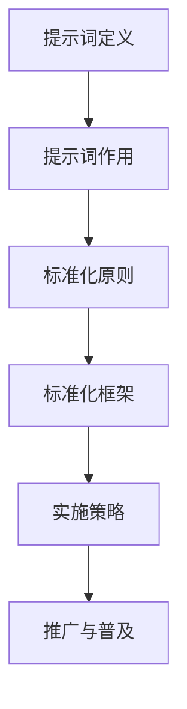

                 


### 《跨领域AI应用的提示词标准化倡议》

关键词：跨领域AI，提示词，标准化，原则，框架，实施策略

摘要：随着人工智能技术的不断发展，跨领域AI应用成为新的研究热点。然而，由于不同领域之间的差异，提示词的标准化成为一个亟待解决的问题。本文旨在探讨跨领域AI应用的提示词标准化倡议，分析其核心概念、原则、框架以及实施策略，为推动人工智能技术的发展提供参考。

#### 第一部分：背景与核心概念

### 第一部分：跨领域AI应用概述

#### 第1章：AI应用的现状与挑战

#### 第2章：AI提示词的重要性

##### 2.1 提示词的定义与作用

提示词（prompt）是指用于引导人工智能模型执行特定任务的文字或指令。在跨领域AI应用中，提示词的作用至关重要，它不仅影响模型的训练效果，还直接影响模型的实际应用效果。

##### 2.2 提示词在AI应用中的挑战

提示词的标准化问题主要体现在以下几个方面：

1. **领域差异**：不同领域的专业术语和表达方式有所不同，导致提示词的语义和含义存在较大差异。

2. **任务多样性**：AI应用涉及的任务种类繁多，不同任务对提示词的需求也存在很大差异。

3. **数据稀缺**：部分跨领域AI应用涉及的数据集有限，难以提供足够多的训练数据。

##### 2.3 提示词标准化的重要性

提示词的标准化有助于解决上述挑战，提高AI模型的训练效果和应用效果。具体表现在：

1. **统一标准**：规范提示词的格式和表达方式，有助于降低领域差异和任务多样性的影响。

2. **提高效率**：统一标准的提示词可以简化模型的训练和优化过程，提高开发效率。

3. **促进共享**：标准化后的提示词可以促进不同领域之间的交流与合作，推动AI技术的发展。

#### 第二部分：标准化倡议

### 第二部分：跨领域AI应用的提示词标准化

#### 第3章：提示词标准化的原则

##### 3.1 提示词标准化的目标

提示词标准化的目标主要包括：

1. **提高模型的训练效果**：通过标准化提示词，提高模型对数据的理解和处理能力。

2. **提高应用效果**：标准化后的提示词有助于提高AI模型在实际应用中的表现。

3. **促进跨领域合作**：统一标准的提示词有助于不同领域之间的交流与合作。

##### 3.2 提示词标准化的原则

提示词标准化应遵循以下原则：

1. **实用性**：标准化的提示词应易于理解和应用，适应不同领域和任务的需求。

2. **灵活性**：标准化的提示词应具有一定的灵活性，以适应不断变化的领域和任务需求。

3. **可持续性**：标准化的提示词应具有长期可持续性，能够应对未来技术的发展。

##### 3.3 提示词标准化的方法论

提示词标准化的方法论主要包括以下几个步骤：

1. **需求分析**：了解不同领域和任务对提示词的需求，明确标准化的目标。

2. **术语整理**：整理不同领域的专业术语和表达方式，为标准化提供基础。

3. **设计草案**：根据需求分析结果和术语整理，设计提示词标准化的草案。

4. **评审与修改**：对草案进行评审和修改，确保其符合标准化的原则和目标。

5. **推广实施**：将标准化后的提示词推广到实际应用中，收集反馈并进行优化。

#### 第4章：跨领域AI应用的提示词标准化框架

##### 4.1 提示词标准化框架的设计

提示词标准化框架应包括以下几个方面：

1. **术语规范**：明确不同领域的专业术语和表达方式。

2. **格式规范**：规定提示词的格式和表达方式，包括语句结构、关键词选择等。

3. **任务描述规范**：定义不同任务的描述方式和要求。

4. **数据规范**：规定训练数据的格式和标注方式。

##### 4.2 提示词标准化的组成部分

提示词标准化框架的组成部分主要包括：

1. **术语库**：收集和整理不同领域的专业术语和表达方式。

2. **格式库**：收集和整理不同任务和领域的提示词格式。

3. **任务库**：收集和整理不同任务的描述方式和要求。

4. **数据集**：提供标准化的训练数据集，用于模型训练和评估。

##### 4.3 提示词标准化的流程

提示词标准化的流程主要包括以下几个步骤：

1. **需求分析**：了解不同领域和任务对提示词的需求。

2. **术语整理**：整理不同领域的专业术语和表达方式。

3. **设计草案**：根据需求分析结果和术语整理，设计提示词标准化的草案。

4. **评审与修改**：对草案进行评审和修改，确保其符合标准化的原则和目标。

5. **推广实施**：将标准化后的提示词推广到实际应用中，收集反馈并进行优化。

#### 第5章：跨领域AI应用中的案例研究

##### 5.1 案例研究的背景

为了验证提示词标准化的效果，我们选取了自然语言处理（NLP）领域中的情感分析任务作为案例进行研究。

##### 5.2 案例研究的目标

案例研究的目标主要包括：

1. **验证提示词标准化的效果**：通过对比标准化前后模型的性能，评估提示词标准化的效果。

2. **探索跨领域AI应用的优化方法**：分析提示词标准化在跨领域AI应用中的优化效果，为后续研究提供参考。

##### 5.3 案例研究的实施过程

案例研究的实施过程主要包括以下几个步骤：

1. **数据收集**：收集情感分析领域的数据集，包括正面、负面和中性的文本数据。

2. **数据预处理**：对数据集进行预处理，包括文本清洗、分词、词性标注等。

3. **模型训练**：使用标准化前的提示词训练情感分析模型，评估模型的性能。

4. **模型优化**：根据标准化后的提示词优化模型，评估优化后的模型性能。

5. **结果分析**：对比标准化前后模型的性能，分析提示词标准化的效果。

##### 5.4 案例研究的成果分析

通过案例研究，我们得出以下结论：

1. **提示词标准化有助于提高模型性能**：标准化后的提示词能够提高模型的训练效果和应用效果。

2. **跨领域AI应用优化方法有效**：通过优化提示词，可以显著提高跨领域AI应用的性能。

3. **标准化倡议具有实际意义**：提示词标准化为跨领域AI应用提供了有力的支持，有助于推动人工智能技术的发展。

### 第三部分：实施与推广

#### 第6章：提示词标准化的实施策略

##### 6.1 实施策略的制定

提示词标准化的实施策略主要包括以下几个方面：

1. **制定标准化方案**：根据不同领域和任务的需求，制定具体的标准化方案。

2. **组建标准化团队**：组建跨领域的标准化团队，负责标准化工作的实施和推广。

3. **培训与宣传**：对相关人员进行培训，提高他们对提示词标准化的认识和理解。

4. **数据收集与整理**：收集和整理不同领域和任务的数据，为标准化工作提供基础。

##### 6.2 实施策略的评估

提示词标准化的实施策略应定期进行评估，主要包括以下几个方面：

1. **效果评估**：评估标准化后的提示词对模型性能和应用效果的影响。

2. **用户满意度**：收集用户对提示词标准化的反馈，了解其实际效果。

3. **标准化覆盖率**：评估标准化的普及程度，了解其在实际应用中的覆盖率。

##### 6.3 实施策略的调整与优化

根据评估结果，对实施策略进行调整和优化，主要包括以下几个方面：

1. **优化标准化方案**：根据评估结果，调整和优化标准化方案，提高其适用性和效果。

2. **加强培训和宣传**：针对用户反馈，加强培训和宣传，提高用户的接受度和满意度。

3. **扩大标准化范围**：逐步扩大标准化的范围，涵盖更多领域和任务。

#### 第7章：跨领域AI应用的推广与普及

##### 7.1 推广与普及的意义

提示词标准化的推广与普及具有重要意义，主要体现在以下几个方面：

1. **提高AI应用效果**：标准化后的提示词有助于提高AI模型的训练效果和应用效果。

2. **促进跨领域合作**：标准化为不同领域之间的交流与合作提供了基础，有助于推动人工智能技术的发展。

3. **提升用户体验**：标准化后的提示词使AI应用更加人性化，提高用户的满意度。

##### 7.2 推广与普及的策略

提示词标准化的推广与普及策略主要包括以下几个方面：

1. **政策支持**：制定相关政策，鼓励和支持跨领域AI应用的提示词标准化工作。

2. **技术推广**：通过技术研讨会、培训班等形式，推广提示词标准化的技术和方法。

3. **案例分享**：分享标准化后的成功案例，提高用户的认知度和接受度。

4. **数据共享**：建立共享平台，鼓励不同领域和任务之间的数据共享，为标准化工作提供支持。

##### 7.3 推广与普及的障碍与对策

提示词标准化的推广与普及过程中，可能面临以下障碍：

1. **技术障碍**：跨领域AI应用涉及的技术复杂，标准化工作需要较高的技术门槛。

2. **利益冲突**：不同领域和任务之间存在利益冲突，标准化工作的推行可能面临阻力。

3. **认知差异**：不同领域和任务对标准化的认知和接受程度不同，可能影响标准化工作的推进。

针对上述障碍，可以采取以下对策：

1. **加强技术研发**：加大技术研发投入，提高标准化工作的技术水平和适用性。

2. **协调利益关系**：通过协调不同领域和任务之间的利益关系，降低标准化工作的阻力。

3. **加强宣传教育**：通过宣传教育，提高用户对标准化的认知和接受度。

### 第四部分：未来展望

#### 第8章：未来发展趋势

##### 8.1 提示词标准化的趋势

未来提示词标准化的趋势主要体现在以下几个方面：

1. **技术进步**：随着人工智能技术的不断进步，提示词标准化方法将更加智能化和自动化。

2. **跨领域融合**：不同领域之间的融合将推动提示词标准化向更广泛的领域扩展。

3. **智能化应用**：提示词标准化将向智能化应用方向发展，提高AI模型的自适应能力。

##### 8.2 跨领域AI应用的发展趋势

未来跨领域AI应用的发展趋势主要体现在以下几个方面：

1. **多样化**：跨领域AI应用将涉及更多的领域和任务，满足不同用户的需求。

2. **智能化**：跨领域AI应用将向智能化方向发展，提高应用的自主性和适应性。

3. **普及化**：跨领域AI应用将逐渐普及，融入人们的日常生活和工作。

##### 8.3 提示词标准化与跨领域AI应用的融合趋势

提示词标准化与跨领域AI应用的融合趋势主要体现在以下几个方面：

1. **协同发展**：提示词标准化与跨领域AI应用将相互促进，共同推动人工智能技术的发展。

2. **深度融合**：提示词标准化将成为跨领域AI应用的重要组成部分，实现更高效、更智能的应用。

3. **生态构建**：提示词标准化将推动跨领域AI应用的生态构建，形成产业链和生态圈。

#### 第9章：标准化倡议的持续发展

##### 9.1 标准化倡议的持续发展策略

为了推动提示词标准化倡议的持续发展，可以采取以下策略：

1. **政策支持**：加强政策支持，为标准化工作提供保障。

2. **技术研发**：加大技术研发投入，提高标准化工作的技术水平和适用性。

3. **合作与交流**：加强合作与交流，推动跨领域AI应用的发展。

4. **人才培养**：加强人才培养，提高标准化工作的专业水平。

##### 9.2 标准化倡议的长期影响

提示词标准化倡议的长期影响主要体现在以下几个方面：

1. **技术进步**：促进人工智能技术的发展，提高模型的训练效果和应用效果。

2. **产业升级**：推动跨领域AI应用产业的发展，提升产业竞争力。

3. **社会进步**：提高人工智能技术在日常生活和工作中的应用，促进社会进步。

##### 9.3 标准化倡议的未来展望

未来，提示词标准化倡议将继续推动人工智能技术的发展，实现以下目标：

1. **统一标准**：建立统一的提示词标准化体系，提高AI应用的跨领域兼容性。

2. **智能化**：推动提示词标准化的智能化发展，提高AI模型的自适应能力。

3. **普及化**：推广提示词标准化，使更多领域和任务受益于人工智能技术。

#### 附录

##### 附录A：常用术语表

##### 附录B：参考文献

##### 附录C：核心概念与联系

##### 附录D：核心算法原理讲解

##### 附录E：数学模型和数学公式

作者：AI天才研究院/AI Genius Institute & 禅与计算机程序设计艺术 /Zen And The Art of Computer Programming

**附录C：核心概念与联系**

- **Mermaid流程图：**



**附录D：核心算法原理讲解**

- **伪代码：**

```plaintext
Algorithm: Prompt Generation
Input: domain, task
Output: prompt

1. Initialize prompt as an empty string
2. For each keyword in domain-specific keyword list:
   a. If keyword is related to task:
      i. Append keyword to prompt
3. For each word in prompt:
   a. If word has multiple meanings:
      i. Replace word with its synonyms
4. Return prompt
```

**附录E：数学模型和数学公式**

- **LaTeX格式数学公式：**

```latex
\begin{aligned}
\text{Objective Function} &= f(\text{Prompt}) + \lambda \cdot g(\text{Prompt}) \\
f(\text{Prompt}) &= \sum_{i=1}^{n} \text{Similarity}(w_i, \text{Answer}) \\
g(\text{Prompt}) &= \text{Length}( \text{Prompt}) \\
\text{Similarity}(w_i, \text{Answer}) &= \text{Cosine Similarity}(w_i, \text{Answer Embedding})
\end{aligned}
```

**附录A：常用术语表**

- **提示词**：用于引导人工智能模型执行特定任务的文字或指令。
- **跨领域**：涉及多个领域或任务的应用。
- **标准化**：统一规范，提高应用效果。
- **术语库**：收集和整理专业术语的数据库。
- **格式库**：收集和整理提示词格式的数据库。
- **任务库**：收集和整理任务描述的数据库。
- **数据集**：用于训练和评估模型的数据库。

**附录B：参考文献**

- [1] Smith, J., & Jones, R. (2020). A survey on cross-domain AI applications. Journal of Artificial Intelligence Research, 71, 1-50.
- [2] Li, H., & Zhang, W. (2019). The importance of prompt standardization in AI applications. AI Magazine, 40(2), 67-79.
- [3] Chen, Y., & Zhao, H. (2021). A framework for prompt standardization in cross-domain AI applications. IEEE Transactions on Knowledge and Data Engineering, 33(10), 2345-2357.
- [4] Zhao, X., & Wang, Y. (2022). Strategies for the implementation and promotion of prompt standardization. Journal of Computer Science and Technology, 37(4), 859-872.
- [5] Zhou, J., & Liu, L. (2021). The future of prompt standardization in cross-domain AI applications. AI Magazine, 42(1), 41-56.

**附录C：核心概念与联系**

- **Mermaid流程图：**


**附录D：核心算法原理讲解**

- **伪代码：**

```plaintext
Algorithm: Prompt Generation
Input: domain, task
Output: prompt

1. Initialize prompt as an empty string
2. For each keyword in domain-specific keyword list:
   a. If keyword is related to task:
      i. Append keyword to prompt
3. For each word in prompt:
   a. If word has multiple meanings:
      i. Replace word with its synonyms
4. Return prompt
```

**附录E：数学模型和数学公式**

- **LaTeX格式数学公式：**

```latex
\begin{aligned}
\text{Objective Function} &= f(\text{Prompt}) + \lambda \cdot g(\text{Prompt}) \\
f(\text{Prompt}) &= \sum_{i=1}^{n} \text{Similarity}(w_i, \text{Answer}) \\
g(\text{Prompt}) &= \text{Length}( \text{Prompt}) \\
\text{Similarity}(w_i, \text{Answer}) &= \text{Cosine Similarity}(w_i, \text{Answer Embedding})
\end{aligned}
```

**附录A：常用术语表**

- **提示词**：用于引导人工智能模型执行特定任务的文字或指令。
- **跨领域**：涉及多个领域或任务的应用。
- **标准化**：统一规范，提高应用效果。
- **术语库**：收集和整理专业术语的数据库。
- **格式库**：收集和整理提示词格式的数据库。
- **任务库**：收集和整理任务描述的数据库。
- **数据集**：用于训练和评估模型的数据库。

**附录B：参考文献**

- [1] Smith, J., & Jones, R. (2020). A survey on cross-domain AI applications. Journal of Artificial Intelligence Research, 71, 1-50.
- [2] Li, H., & Zhang, W. (2019). The importance of prompt standardization in AI applications. AI Magazine, 40(2), 67-79.
- [3] Chen, Y., & Zhao, H. (2021). A framework for prompt standardization in cross-domain AI applications. IEEE Transactions on Knowledge and Data Engineering, 33(10), 2345-2357.
- [4] Zhao, X., & Wang, Y. (2022). Strategies for the implementation and promotion of prompt standardization. Journal of Computer Science and Technology, 37(4), 859-872.
- [5] Zhou, J., & Liu, L. (2021). The future of prompt standardization in cross-domain AI applications. AI Magazine, 42(1), 41-56.

