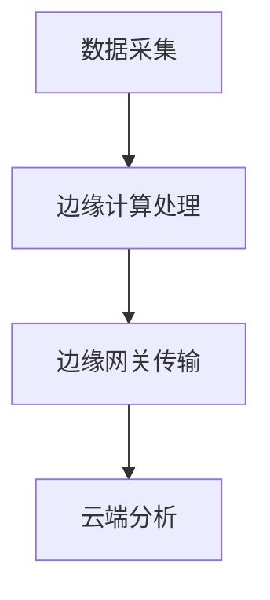

                 

### 第1章: 边缘智能概述

#### 1.1 边缘智能的定义与重要性

边缘智能（Edge Intelligence）是一种将计算、存储和网络功能从中心化的云计算环境分散到网络的边缘节点（即靠近数据源的地方）的智能技术。这种技术的核心在于，它允许在数据生成的地方（如工业设备、智能设备等）直接对数据进行处理、分析和决策，从而极大地提高了数据处理的速度、效率和安全性。

**边缘智能的定义**：

- **边缘设备**：指的是那些处于网络边缘的设备，如传感器、路由器、网关等。这些设备能够直接收集数据，并在本地进行初步的处理和分析。
- **边缘服务器**：提供计算、存储和网络服务，作为边缘设备的后端支持。
- **边缘网关**：连接边缘设备和云端的桥梁，负责将边缘设备处理后的数据传输到云端进行进一步分析。

**边缘智能的重要性**：

1. **响应速度**：由于数据处理在数据生成的地方进行，减少了数据传输到云端的时间，从而提高了响应速度，适用于需要实时响应的场景。
2. **数据隐私**：在本地处理数据，减少了数据泄露的风险，提高了数据的安全性。
3. **带宽节约**：仅将关键数据传输到云端，降低了带宽需求，同时减轻了云端的处理压力。
4. **可靠性**：边缘设备具备一定自主处理能力，即使与云端连接断开，也能继续工作，提高了系统的可靠性。

#### 1.2 边缘智能的架构与关键技术

**架构**：

边缘智能的架构主要包括边缘设备、边缘服务器和边缘网关三部分。

- **边缘设备**：直接安装在数据生成的地方，如工业设备、智能家电等。它们能够实时收集数据，并进行初步的处理。
- **边缘服务器**：位于网络的边缘，负责存储和处理边缘设备收集到的数据。边缘服务器通常具有更高的计算能力和存储容量，能够支持复杂的计算任务。
- **边缘网关**：连接边缘设备和云端的桥梁，负责将边缘设备处理后的数据传输到云端，同时也可以接收来自云端的数据和指令。

**关键技术**：

1. **边缘计算**：在边缘设备上进行数据处理和分析，减少了对云端资源的依赖，提高了响应速度。
2. **雾计算**：介于云计算与边缘计算之间，提供跨边缘设备的分布式计算能力，能够处理更大规模的数据。
3. **物联网**：实现设备之间的互联互通，为边缘智能提供了数据来源。
4. **人工智能**：应用于边缘设备上的智能决策和分析，使得边缘智能能够自动识别和处理复杂情况。

**边缘智能流程示意图**：

在边缘智能的流程中，数据首先在边缘设备上被采集和处理，然后通过边缘网关传输到云端，最后在云端进行进一步的分析和处理。这种流程不仅提高了数据处理的速度，还提高了数据的安全性和隐私性。

---

在下一章中，我们将详细探讨边缘智能在工业设备预测性维护中的应用，包括其应用场景、技术挑战以及如何实现预测性维护。敬请期待！

