                 

### 文章标题

# 边缘计算在工业物联网实时控制中的应用

> 关键词：边缘计算、工业物联网、实时控制、传感器、数据处理、智能控制

> 摘要：本文详细探讨了边缘计算在工业物联网实时控制中的应用。首先介绍了工业物联网和边缘计算的基本概念，随后深入分析了边缘计算在工业物联网中的优势与挑战。文章接着阐述了边缘计算架构、技术、平台以及应用案例，最后探讨了边缘计算与实时控制的融合技术，并通过具体案例分析展示了其实际应用价值。本文旨在为读者提供全面的边缘计算在工业物联网实时控制领域的认识与理解。

### 第一部分：边缘计算概述

#### 第1章：工业物联网与边缘计算

##### 1.1 工业物联网的基本概念

工业物联网（Industrial Internet of Things，简称IIoT）是一种将传感器、软件和互联网技术集成到工业环境中，实现设备与设备、设备与人、人与人之间智能连接的生态系统。工业物联网通过传感器收集设备数据，将数据传输到云端进行分析处理，从而实现对设备的远程监控和管理。

**核心概念与联系：**

边缘计算与工业物联网的关系可以用以下Mermaid流程图表示：

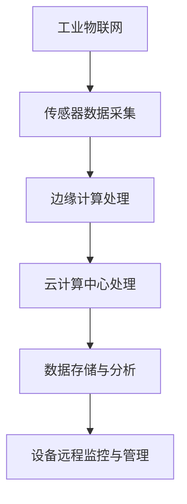

##### 1.2 边缘计算在工业物联网中的应用

边缘计算在工业物联网中的应用主要体现在以下几个方面：

1. **实时数据处理**：边缘计算可以将数据在靠近数据源的地方进行处理，减少数据传输延迟，提高系统响应速度。
2. **减少带宽消耗**：通过边缘计算，将大量数据在边缘进行处理，减少需要传输到云的数据量，从而降低带宽消耗。
3. **增强安全性**：边缘计算可以在本地进行数据加密和隐私保护，减少数据在传输过程中的泄露风险。
4. **提高系统可靠性**：边缘计算可以降低对云服务的依赖，提高系统的稳定性和可靠性。

**核心概念与联系：**

边缘计算与工业物联网的优势可以用以下Mermaid流程图表示：

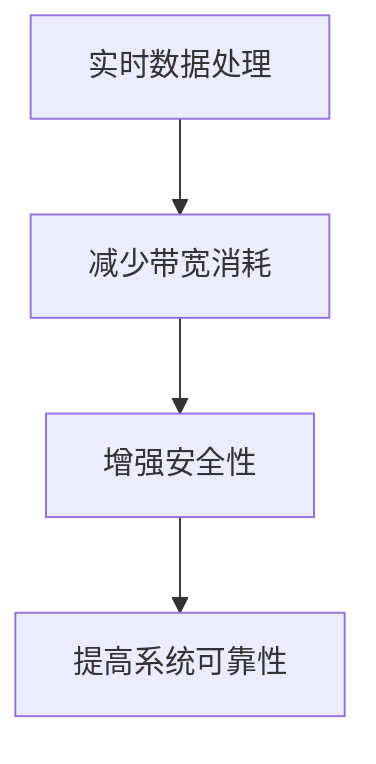

##### 1.3 边缘计算的优势与挑战

边缘计算的优势主要体现在以下几个方面：

1. **实时性**：边缘计算可以将数据处理和响应时间缩短到毫秒级别，满足工业物联网实时控制的需求。
2. **带宽效率**：通过边缘计算，可以减少数据传输的带宽需求，降低网络负荷。
3. **可靠性**：边缘计算可以降低对云服务的依赖，提高系统的稳定性和可靠性。

然而，边缘计算也面临一些挑战：

1. **计算能力限制**：边缘设备通常具有有限的计算能力，可能无法满足复杂的数据处理需求。
2. **网络不稳定**：边缘设备可能处于复杂的环境中，网络连接不稳定，影响数据传输和处理。
3. **安全性问题**：边缘计算涉及到大量敏感数据，需要确保数据的安全性和隐私性。

**核心概念与联系：**

边缘计算的优势与挑战可以用以下Mermaid流程图表示：

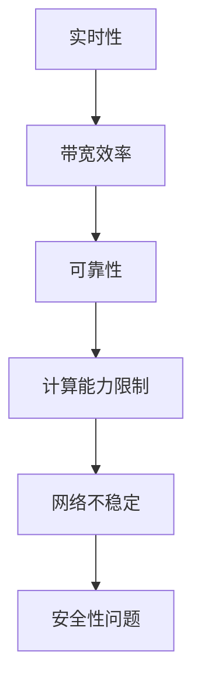

#### 第2章：边缘计算架构

##### 2.1 边缘计算架构的组成

边缘计算架构主要包括以下几个部分：

1. **边缘设备**：包括传感器、执行器、边缘服务器等，用于数据采集、处理和执行任务。
2. **边缘网关**：用于连接边缘设备和云计算中心，实现数据传输和协议转换。
3. **云计算中心**：用于存储和处理大量数据，提供计算和存储资源。

**核心概念与联系：**

边缘计算架构的组成可以用以下Mermaid流程图表示：

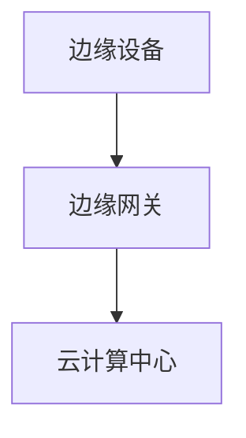

##### 2.2 边缘计算与云计算的区别与联系

边缘计算与云计算的主要区别在于数据处理的位置。边缘计算将数据处理和存储放在靠近数据源的地方，而云计算将数据处理和存储放在远程数据中心。

**核心概念与联系：**

边缘计算与云计算的区别与联系可以用以下Mermaid流程图表示：

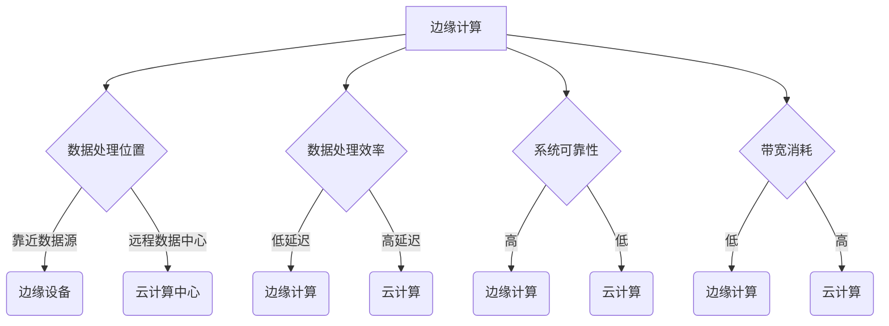

##### 2.3 边缘计算网络架构设计

边缘计算网络架构设计主要包括以下几个方面：

1. **边缘网关设计**：边缘网关需要具备数据传输、协议转换、安全保护等功能，同时要考虑网络连接的稳定性和可靠性。
2. **边缘设备布局**：边缘设备的布局需要考虑数据传输距离、设备功耗、环境适应性等因素。
3. **云计算中心选择**：云计算中心的选择需要考虑数据传输速度、计算能力、安全性等因素。

**核心概念与联系：**

边缘计算网络架构设计可以用以下Mermaid流程图表示：

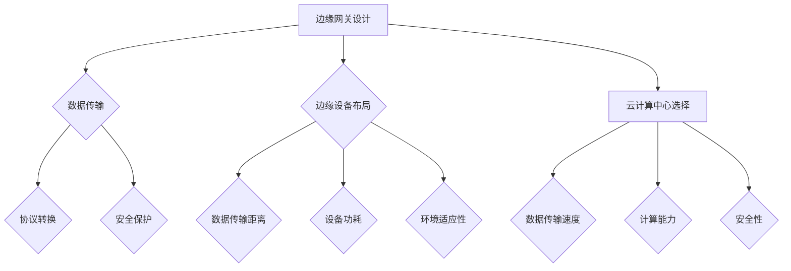

#### 第3章：边缘计算技术

##### 3.1 物联网传感器技术

物联网传感器技术是边缘计算的核心组成部分，主要包括以下几个方面：

1. **传感器类型**：常见的传感器类型包括温度传感器、湿度传感器、压力传感器、光传感器等。
2. **传感器精度**：传感器的精度直接影响数据的准确性，需要根据实际应用场景选择合适的传感器。
3. **传感器功耗**：边缘设备的功耗受限，需要选择低功耗的传感器，以提高设备的续航能力。

**核心概念与联系：**

物联网传感器技术可以用以下Mermaid流程图表示：

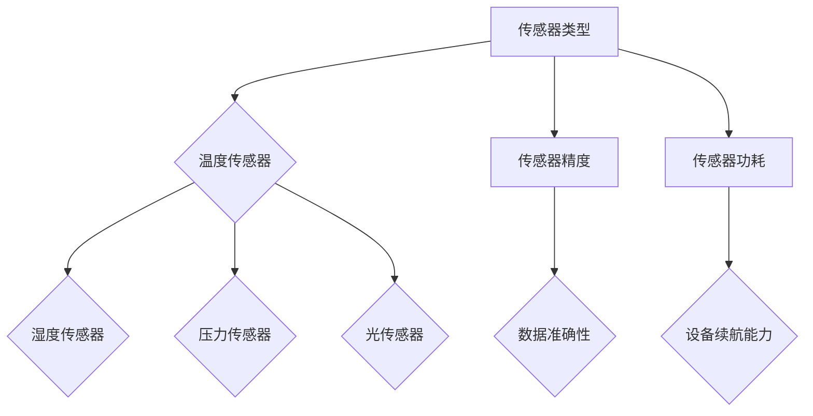

##### 3.2 数据处理与存储技术

边缘计算中的数据处理与存储技术主要包括以下几个方面：

1. **数据处理算法**：边缘计算需要采用高效的数据处理算法，以降低计算复杂度和功耗。
2. **数据存储技术**：边缘设备的数据存储容量有限，需要采用高效的数据存储技术，如压缩存储、分级存储等。
3. **数据处理流程**：边缘计算的数据处理流程包括数据采集、预处理、特征提取、模型训练等步骤。

**核心概念与联系：**

数据处理与存储技术可以用以下Mermaid流程图表示：

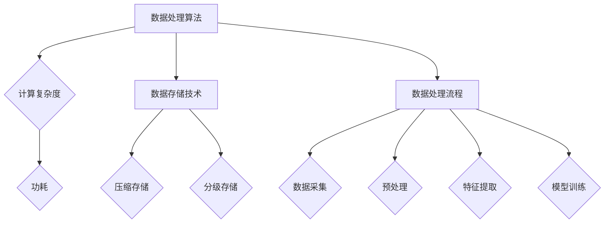

##### 3.3 边缘计算安全与隐私保护技术

边缘计算涉及大量敏感数据，需要采取有效的安全与隐私保护技术，主要包括以下几个方面：

1. **数据加密**：对数据进行加密处理，确保数据在传输和存储过程中的安全性。
2. **身份认证**：采用身份认证技术，确保只有合法用户可以访问边缘设备和数据。
3. **访问控制**：采用访问控制技术，对用户权限进行管理，防止未经授权的访问。
4. **隐私保护**：对用户隐私数据进行脱敏处理，确保用户隐私不被泄露。

**核心概念与联系：**

边缘计算安全与隐私保护技术可以用以下Mermaid流程图表示：

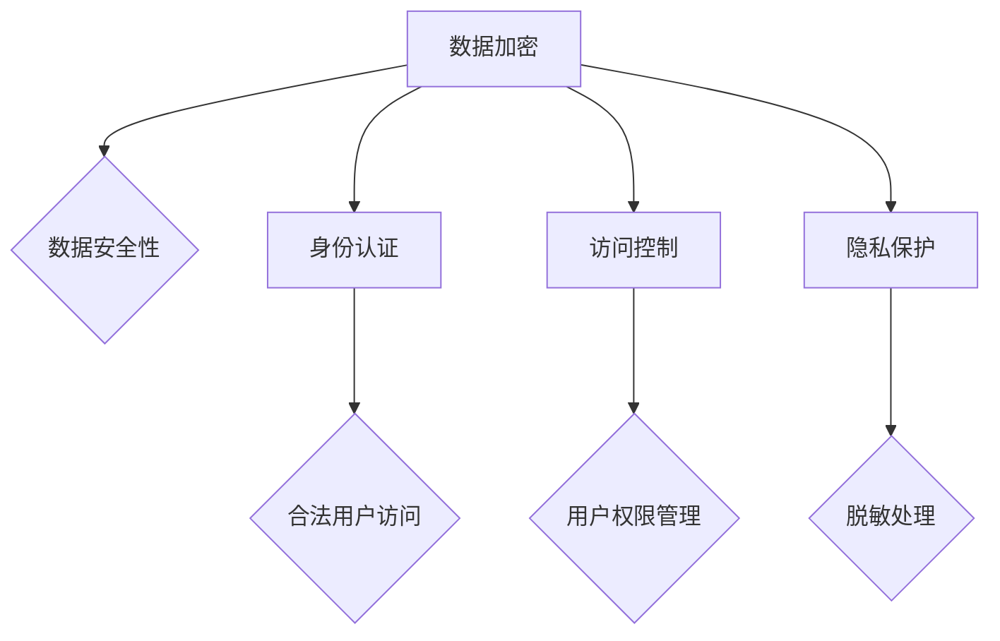

#### 第4章：边缘计算平台

##### 4.1 主流边缘计算平台介绍

目前，市场上主流的边缘计算平台包括以下几种：

1. **AWS Greengrass**：AWS Greengrass 是亚马逊提供的边缘计算平台，支持在边缘设备上运行 AWS Lambda 函数，实现本地数据处理和智能分析。
2. **Azure IoT Edge**：Azure IoT Edge 是微软提供的边缘计算平台，支持在边缘设备上运行 Azure Functions、容器和自定义代码，实现本地数据处理和智能分析。
3. **IBM Edge Suite**：IBM Edge Suite 是 IBM 提供的边缘计算平台，支持在边缘设备上运行各种应用程序和服务，实现本地数据处理和智能分析。
4. **Google Edge TPU**：Google Edge TPU 是谷歌提供的边缘计算平台，支持在边缘设备上运行深度学习模型，实现本地数据处理和智能分析。

**核心概念与联系：**

主流边缘计算平台可以用以下Mermaid流程图表示：

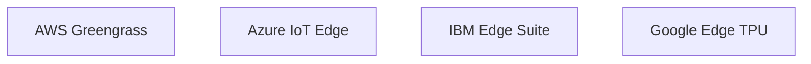

##### 4.2 边缘计算平台架构与功能

边缘计算平台通常包括以下几个部分：

1. **边缘设备**：包括传感器、边缘服务器等，用于数据采集、处理和执行任务。
2. **边缘网关**：用于连接边缘设备和云计算中心，实现数据传输和协议转换。
3. **云计算中心**：用于存储和处理大量数据，提供计算和存储资源。
4. **平台管理**：包括设备管理、数据管理、安全管理等功能，实现对边缘计算平台的全面管理。

**核心概念与联系：**

边缘计算平台架构与功能可以用以下Mermaid流程图表示：

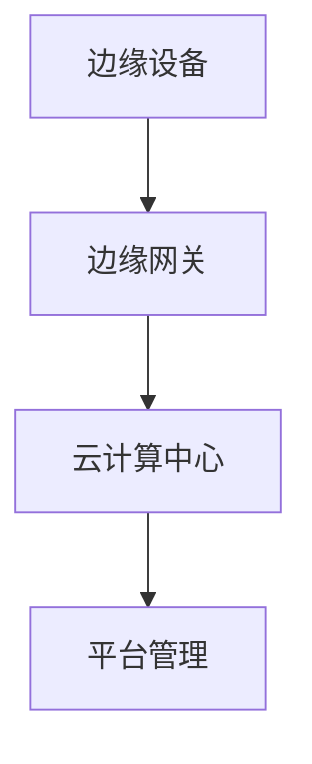

##### 4.3 边缘计算平台的应用场景

边缘计算平台可以应用于多个行业领域，主要包括以下几个方面：

1. **智能制造**：通过边缘计算平台，实现设备远程监控、预测性维护和智能控制，提高生产效率和产品质量。
2. **智能交通**：通过边缘计算平台，实现实时交通监控、智能调度和交通优化，提高交通效率和安全。
3. **智慧城市**：通过边缘计算平台，实现城市安防、环境监测、能源管理等智能应用，提高城市管理水平。
4. **智能医疗**：通过边缘计算平台，实现远程医疗监测、智能诊断和健康管理，提高医疗服务水平。

**核心概念与联系：**

边缘计算平台的应用场景可以用以下Mermaid流程图表示：

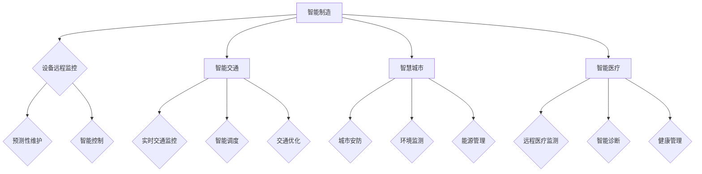

#### 第5章：边缘计算在工业物联网中的应用案例

##### 5.1 实时数据采集与处理

**案例背景**：

某大型制造企业需要对其生产设备进行实时监控和故障预警，以提高生产效率和降低设备故障率。企业采用了边缘计算平台，将数据采集、处理和分析任务分散到边缘设备上，实现了实时数据采集与处理。

**解决方案**：

1. **边缘设备部署**：在企业生产现场部署边缘设备，包括传感器、边缘服务器等，用于采集设备运行数据。
2. **边缘数据处理**：边缘设备将采集到的数据通过边缘计算平台进行处理，包括数据清洗、特征提取、故障预测等。
3. **数据传输与存储**：经过处理的实时数据通过边缘网关传输到云计算中心，进行进一步存储和分析。

**核心算法原理讲解**：

1. **数据清洗**：使用Python伪代码实现数据清洗算法：

    ```python
    def data_cleaning(data):
        cleaned_data = []
        for sample in data:
            if is_valid(sample):
                cleaned_data.append(sample)
        return cleaned_data
    ```

2. **特征提取**：使用Python伪代码实现特征提取算法：

    ```python
    def feature_extraction(data):
        features = []
        for sample in data:
            feature = extract_features(sample)
            features.append(feature)
        return features
    ```

3. **故障预测**：使用Python伪代码实现故障预测算法：

    ```python
    def fault_prediction(features):
        model = train_model(features)
        predictions = model.predict(features)
        return predictions
    ```

**数学模型和公式**：

故障预测的数学模型可以表示为：

$$
P(\text{fault}) = f(\text{features})
$$

其中，$P(\text{fault})$ 表示故障概率，$f(\text{features})$ 表示故障预测函数。

**举例说明**：

假设采集到一组设备运行数据，经过数据清洗、特征提取和故障预测后，得到以下结果：

1. 数据清洗：去除无效数据，得到清洗后的数据。
2. 特征提取：提取数据中的关键特征。
3. 故障预测：根据特征数据，预测设备是否会发生故障。

**项目实战**：

1. **开发环境搭建**：在边缘设备上安装边缘计算平台，并配置传感器。
2. **源代码实现**：编写数据采集、处理和预测的代码，实现实时数据采集与处理功能。
3. **代码解读与分析**：对源代码进行解读，分析数据采集、处理和预测的流程。

**实际案例分析和详细讲解剖析**：

通过对实际案例的分析，发现边缘计算在实时数据采集与处理方面具有显著优势。在边缘设备上实现数据处理，可以大大减少数据传输延迟，提高故障预警的准确性。同时，通过云计算中心对实时数据进行进一步分析，可以为企业提供更加全面的设备运行报告，指导生产优化。

**项目小结**：

本项目通过边缘计算平台实现了实时数据采集与处理，提高了设备监控和故障预警的效率。在实际应用中，边缘计算平台可以根据不同场景的需求，灵活调整数据处理策略，实现更加精准的故障预测。

##### 5.2 预测性维护

**案例背景**：

某航空公司需要对其航空发动机进行预测性维护，以降低维护成本和保障飞行安全。航空公司采用了边缘计算平台，将数据采集、处理和分析任务分散到边缘设备上，实现了预测性维护。

**解决方案**：

1. **边缘设备部署**：在航空发动机上部署边缘设备，包括传感器、边缘服务器等，用于采集发动机运行数据。
2. **边缘数据处理**：边缘设备将采集到的数据通过边缘计算平台进行处理，包括数据清洗、特征提取、故障预测等。
3. **数据传输与存储**：经过处理的实时数据通过边缘网关传输到云计算中心，进行进一步存储和分析。

**核心算法原理讲解**：

1. **数据清洗**：使用Python伪代码实现数据清洗算法：

    ```python
    def data_cleaning(data):
        cleaned_data = []
        for sample in data:
            if is_valid(sample):
                cleaned_data.append(sample)
        return cleaned_data
    ```

2. **特征提取**：使用Python伪代码实现特征提取算法：

    ```python
    def feature_extraction(data):
        features = []
        for sample in data:
            feature = extract_features(sample)
            features.append(feature)
        return features
    ```

3. **故障预测**：使用Python伪代码实现故障预测算法：

    ```python
    def fault_prediction(features):
        model = train_model(features)
        predictions = model.predict(features)
        return predictions
    ```

**数学模型和公式**：

故障预测的数学模型可以表示为：

$$
P(\text{fault}) = f(\text{features})
$$

其中，$P(\text{fault})$ 表示故障概率，$f(\text{features})$ 表示故障预测函数。

**举例说明**：

假设采集到一组航空发动机运行数据，经过数据清洗、特征提取和故障预测后，得到以下结果：

1. 数据清洗：去除无效数据，得到清洗后的数据。
2. 特征提取：提取数据中的关键特征。
3. 故障预测：根据特征数据，预测发动机是否会发生故障。

**项目实战**：

1. **开发环境搭建**：在边缘设备上安装边缘计算平台，并配置传感器。
2. **源代码实现**：编写数据采集、处理和预测的代码，实现预测性维护功能。
3. **代码解读与分析**：对源代码进行解读，分析数据采集、处理和预测的流程。

**实际案例分析和详细讲解剖析**：

通过对实际案例的分析，发现边缘计算在预测性维护方面具有显著优势。在边缘设备上实现数据处理，可以大大减少数据传输延迟，提高故障预测的准确性。同时，通过云计算中心对实时数据进行进一步分析，可以为企业提供更加全面的设备运行报告，指导维护决策。

**项目小结**：

本项目通过边缘计算平台实现了预测性维护，降低了维护成本，提高了飞行安全。在实际应用中，边缘计算平台可以根据不同场景的需求，灵活调整数据处理策略，实现更加精准的故障预测。

##### 5.3 边缘智能控制

**案例背景**：

某智能工厂需要对其生产线进行智能控制，以提高生产效率和降低生产成本。智能工厂采用了边缘计算平台，将数据采集、处理和智能控制任务分散到边缘设备上，实现了边缘智能控制。

**解决方案**：

1. **边缘设备部署**：在智能工厂的生产线上部署边缘设备，包括传感器、边缘服务器等，用于采集生产数据。
2. **边缘数据处理**：边缘设备将采集到的数据通过边缘计算平台进行处理，包括数据清洗、特征提取、模型训练等。
3. **智能控制**：通过边缘计算平台实现生产线的智能控制，包括设备调度、生产计划优化、质量控制等。
4. **数据传输与存储**：经过处理的实时数据通过边缘网关传输到云计算中心，进行进一步存储和分析。

**核心算法原理讲解**：

1. **数据清洗**：使用Python伪代码实现数据清洗算法：

    ```python
    def data_cleaning(data):
        cleaned_data = []
        for sample in data:
            if is_valid(sample):
                cleaned_data.append(sample)
        return cleaned_data
    ```

2. **特征提取**：使用Python伪代码实现特征提取算法：

    ```python
    def feature_extraction(data):
        features = []
        for sample in data:
            feature = extract_features(sample)
            features.append(feature)
        return features
    ```

3. **模型训练**：使用Python伪代码实现模型训练算法：

    ```python
    def train_model(features):
        model = create_model()
        model.fit(features)
        return model
    ```

4. **智能控制**：使用Python伪代码实现智能控制算法：

    ```python
    def intelligent_control(model, data):
        control_actions = model.predict(data)
        execute_control_actions(control_actions)
    ```

**数学模型和公式**：

1. **数据清洗**：假设原始数据集为 $X$，清洗后的数据集为 $X'$，数据清洗的数学模型可以表示为：

    $$
    X' = \{x' | x \in X, is_valid(x)\}
    $$

2. **特征提取**：假设特征提取函数为 $f$，原始数据集为 $X$，提取后的特征集为 $F$，特征提取的数学模型可以表示为：

    $$
    F = \{f(x) | x \in X\}
    $$

3. **模型训练**：假设模型训练函数为 $M$，特征集为 $F$，训练后的模型为 $M'$，模型训练的数学模型可以表示为：

    $$
    M' = M(F)
    $$

4. **智能控制**：假设智能控制函数为 $C$，模型为 $M'$，实时数据集为 $D$，智能控制的数学模型可以表示为：

    $$
    C(D) = M'(D)
    $$

**举例说明**：

假设采集到一组生产线运行数据，经过数据清洗、特征提取、模型训练和智能控制后，得到以下结果：

1. 数据清洗：去除无效数据，得到清洗后的数据。
2. 特征提取：提取数据中的关键特征。
3. 模型训练：使用特征数据训练智能控制模型。
4. 智能控制：根据实时数据，执行智能控制动作。

**项目实战**：

1. **开发环境搭建**：在边缘设备上安装边缘计算平台，并配置传感器。
2. **源代码实现**：编写数据采集、处理、模型训练和智能控制的代码，实现边缘智能控制功能。
3. **代码解读与分析**：对源代码进行解读，分析数据采集、处理、模型训练和智能控制的流程。

**实际案例分析和详细讲解剖析**：

通过对实际案例的分析，发现边缘计算在智能控制方面具有显著优势。在边缘设备上实现数据处理和智能控制，可以大大减少数据传输延迟，提高生产效率。同时，通过云计算中心对实时数据进行进一步分析，可以为企业提供更加全面的设备运行报告，指导生产优化。

**项目小结**：

本项目通过边缘计算平台实现了智能控制，提高了生产效率和降低生产成本。在实际应用中，边缘计算平台可以根据不同场景的需求，灵活调整数据处理策略和智能控制算法，实现更加高效的生产管理。

### 第二部分：实时控制技术

#### 第6章：实时控制系统原理

##### 6.1 实时控制系统的定义与分类

实时控制系统是指能够在规定的时间内完成控制任务，并满足系统性能要求的控制系统。实时控制系统根据控制任务的不同，可以分类为以下几种：

1. **连续控制系统**：控制对象的输出变量是连续变化的，如温度控制系统。
2. **离散控制系统**：控制对象的输出变量是离散变化的，如生产线上的设备控制。
3. **混合控制系统**：同时包含连续控制系统和离散控制系统的特点。

**核心概念与联系：**

实时控制系统的定义与分类可以用以下Mermaid流程图表示：

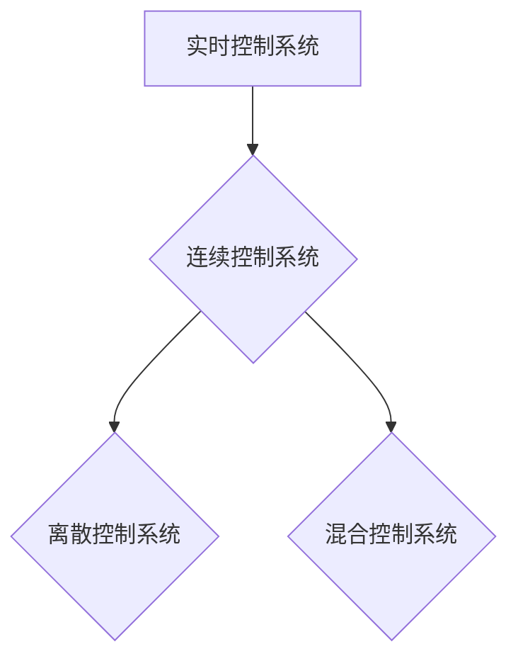

##### 6.2 实时控制系统的关键技术与挑战

实时控制系统的关键技术与挑战包括以下几个方面：

1. **实时性**：实时控制系统需要满足严格的实时性要求，即系统响应时间必须控制在规定的时间内。
2. **稳定性**：实时控制系统需要保持稳定的控制效果，防止系统出现振荡或失控。
3. **准确性**：实时控制系统需要确保控制目标的精度和稳定性。
4. **鲁棒性**：实时控制系统需要应对外部干扰和系统参数变化，保持控制效果。
5. **计算资源**：实时控制系统需要高效利用计算资源，以满足实时性的要求。

**核心概念与联系：**

实时控制系统的关键技术与挑战可以用以下Mermaid流程图表示：

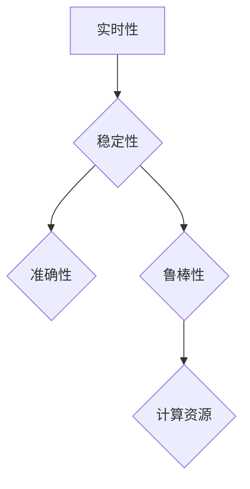

##### 6.3 实时控制系统的设计与实现

实时控制系统的设计与实现主要包括以下几个方面：

1. **系统需求分析**：明确控制系统的目标、功能和性能要求。
2. **系统建模与仿真**：建立系统的数学模型，并进行仿真验证。
3. **控制器设计**：根据系统模型，设计合适的控制器，并进行性能优化。
4. **系统实现与调试**：将控制器算法实现为软件，进行系统集成和调试。
5. **系统优化与升级**：根据实际运行情况，对系统进行优化和升级。

**核心概念与联系：**

实时控制系统的设计与实现可以用以下Mermaid流程图表示：

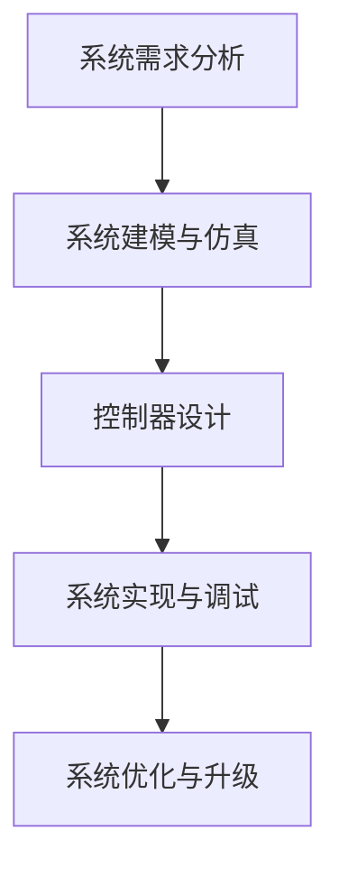

#### 第7章：边缘计算与实时控制的融合

##### 7.1 边缘计算在实时控制中的应用

边缘计算在实时控制中的应用主要体现在以下几个方面：

1. **实时数据处理**：边缘计算可以将实时数据在靠近数据源的地方进行处理，提高系统响应速度。
2. **减少带宽消耗**：通过边缘计算，将大量数据在边缘进行处理，减少需要传输到云的数据量，降低网络负荷。
3. **增强系统稳定性**：边缘计算可以降低对云服务的依赖，提高系统的稳定性和可靠性。
4. **提高系统效率**：边缘计算可以针对实时数据进行分析和预测，优化控制策略，提高系统效率。

**核心概念与联系：**

边缘计算在实时控制中的应用可以用以下Mermaid流程图表示：

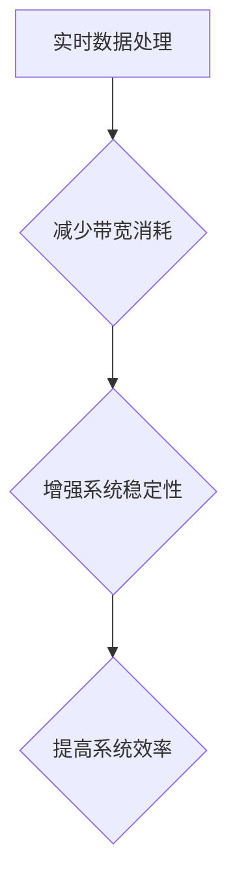

##### 7.2 实时控制与边缘计算的性能优化

实时控制与边缘计算的性能优化主要包括以下几个方面：

1. **算法优化**：通过优化实时控制算法和边缘计算算法，提高系统效率和准确性。
2. **硬件优化**：选择适合边缘计算和实时控制需求的硬件设备，提高系统性能。
3. **网络优化**：优化边缘计算网络架构，降低数据传输延迟和网络负荷。
4. **资源调度**：合理分配计算资源和网络资源，提高系统整体性能。

**核心概念与联系：**

实时控制与边缘计算的性能优化可以用以下Mermaid流程图表示：

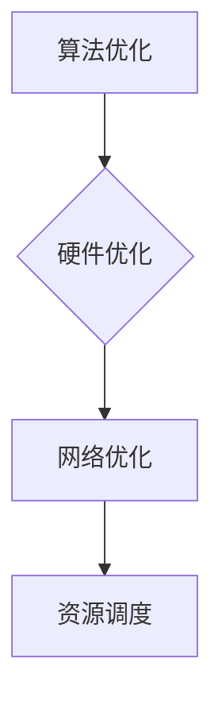

##### 7.3 边缘计算实时控制的未来趋势

边缘计算实时控制的未来趋势主要体现在以下几个方面：

1. **智能化**：随着人工智能技术的发展，边缘计算实时控制将更加智能化，实现自主决策和优化。
2. **网络化**：边缘计算实时控制将逐步实现网络化，实现跨区域的实时数据共享和协同控制。
3. **生态化**：边缘计算实时控制将逐步形成完善的生态体系，包括硬件设备、软件平台、应用服务等。
4. **标准化**：边缘计算实时控制将逐步实现标准化，提高系统的互操作性和兼容性。

**核心概念与联系：**

边缘计算实时控制的未来趋势可以用以下Mermaid流程图表示：

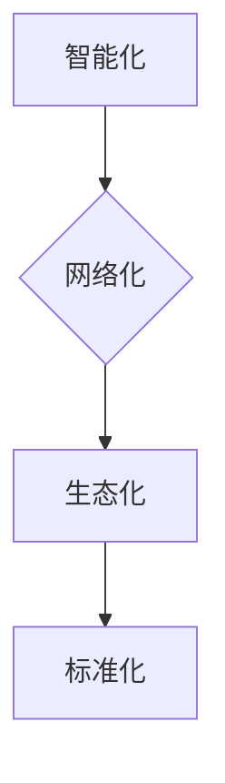

#### 第8章：边缘计算实时控制系统案例分析

##### 8.1 案例一：智能工厂实时监控系统

**案例背景**：

某智能工厂需要对其生产设备进行实时监控，以保障生产安全和提高生产效率。智能工厂采用了边缘计算实时控制系统，实现了生产设备的实时监控和故障预警。

**解决方案**：

1. **边缘设备部署**：在智能工厂的生产线上部署边缘设备，包括传感器、边缘服务器等，用于采集设备运行数据。
2. **边缘数据处理**：边缘设备将采集到的数据通过边缘计算平台进行处理，包括数据清洗、特征提取、故障预测等。
3. **实时监控**：通过边缘计算平台，实时监控设备运行状态，并在设备出现故障时发出预警。
4. **数据传输与存储**：经过处理的实时数据通过边缘网关传输到云计算中心，进行进一步存储和分析。

**核心算法原理讲解**：

1. **数据清洗**：使用Python伪代码实现数据清洗算法：

    ```python
    def data_cleaning(data):
        cleaned_data = []
        for sample in data:
            if is_valid(sample):
                cleaned_data.append(sample)
        return cleaned_data
    ```

2. **特征提取**：使用Python伪代码实现特征提取算法：

    ```python
    def feature_extraction(data):
        features = []
        for sample in data:
            feature = extract_features(sample)
            features.append(feature)
        return features
    ```

3. **故障预测**：使用Python伪代码实现故障预测算法：

    ```python
    def fault_prediction(features):
        model = train_model(features)
        predictions = model.predict(features)
        return predictions
    ```

**数学模型和公式**：

故障预测的数学模型可以表示为：

$$
P(\text{fault}) = f(\text{features})
$$

其中，$P(\text{fault})$ 表示故障概率，$f(\text{features})$ 表示故障预测函数。

**举例说明**：

假设采集到一组设备运行数据，经过数据清洗、特征提取和故障预测后，得到以下结果：

1. 数据清洗：去除无效数据，得到清洗后的数据。
2. 特征提取：提取数据中的关键特征。
3. 故障预测：根据特征数据，预测设备是否会发生故障。

**项目实战**：

1. **开发环境搭建**：在边缘设备上安装边缘计算平台，并配置传感器。
2. **源代码实现**：编写数据采集、处理和预测的代码，实现实时监控功能。
3. **代码解读与分析**：对源代码进行解读，分析数据采集、处理和预测的流程。

**实际案例分析和详细讲解剖析**：

通过对实际案例的分析，发现边缘计算实时监控系统在智能工厂中具有显著优势。在边缘设备上实现数据处理和故障预测，可以大大减少数据传输延迟，提高故障预警的准确性。同时，通过云计算中心对实时数据进行进一步分析，可以为企业提供更加全面的设备运行报告，指导生产优化。

**项目小结**：

本项目通过边缘计算实时控制系统实现了智能工厂的实时监控，提高了生产效率和设备安全性。在实际应用中，边缘计算实时控制系统可以根据不同场景的需求，灵活调整数据处理策略和故障预测算法，实现更加精准的监控和预警。

##### 8.2 案例二：智能仓储实时控制系统

**案例背景**：

某智能仓储中心需要对其仓储设备进行实时监控和管理，以提高仓储效率和降低运营成本。智能仓储中心采用了边缘计算实时控制系统，实现了仓储设备的实时监控和智能调度。

**解决方案**：

1. **边缘设备部署**：在智能仓储中心的各个仓库和设备上部署边缘设备，包括传感器、边缘服务器等，用于采集仓储设备运行数据。
2. **边缘数据处理**：边缘设备将采集到的数据通过边缘计算平台进行处理，包括数据清洗、特征提取、智能调度等。
3. **实时监控与调度**：通过边缘计算平台，实时监控仓储设备运行状态，并根据实时数据智能调度仓储设备。
4. **数据传输与存储**：经过处理的实时数据通过边缘网关传输到云计算中心，进行进一步存储和分析。

**核心算法原理讲解**：

1. **数据清洗**：使用Python伪代码实现数据清洗算法：

    ```python
    def data_cleaning(data):
        cleaned_data = []
        for sample in data:
            if is_valid(sample):
                cleaned_data.append(sample)
        return cleaned_data
    ```

2. **特征提取**：使用Python伪代码实现特征提取算法：

    ```python
    def feature_extraction(data):
        features = []
        for sample in data:
            feature = extract_features(sample)
            features.append(feature)
        return features
    ```

3. **智能调度**：使用Python伪代码实现智能调度算法：

    ```python
    def intelligent_dispatch(features):
        dispatch_plan = create_dispatch_plan(features)
        execute_dispatch_plan(dispatch_plan)
    ```

**数学模型和公式**：

1. **数据清洗**：假设原始数据集为 $X$，清洗后的数据集为 $X'$，数据清洗的数学模型可以表示为：

    $$
    X' = \{x' | x \in X, is_valid(x)\}
    $$

2. **特征提取**：假设特征提取函数为 $f$，原始数据集为 $X$，提取后的特征集为 $F$，特征提取的数学模型可以表示为：

    $$
    F = \{f(x) | x \in X\}
    $$

3. **智能调度**：假设智能调度函数为 $D$，特征集为 $F$，调度计划为 $P$，智能调度的数学模型可以表示为：

    $$
    P = D(F)
    $$

**举例说明**：

假设采集到一组仓储设备运行数据，经过数据清洗、特征提取和智能调度后，得到以下结果：

1. 数据清洗：去除无效数据，得到清洗后的数据。
2. 特征提取：提取数据中的关键特征。
3. 智能调度：根据特征数据，生成智能调度计划。

**项目实战**：

1. **开发环境搭建**：在边缘设备上安装边缘计算平台，并配置传感器。
2. **源代码实现**：编写数据采集、处理和调度的代码，实现实时监控和智能调度功能。
3. **代码解读与分析**：对源代码进行解读，分析数据采集、处理和调度的流程。

**实际案例分析和详细讲解剖析**：

通过对实际案例的分析，发现边缘计算实时控制系统在智能仓储中具有显著优势。在边缘设备上实现数据处理和智能调度，可以大大减少数据传输延迟，提高仓储效率和运营成本。同时，通过云计算中心对实时数据进行进一步分析，可以为企业提供更加全面的仓储设备运行报告，指导运营优化。

**项目小结**：

本项目通过边缘计算实时控制系统实现了智能仓储的实时监控和智能调度，提高了仓储效率和降低了运营成本。在实际应用中，边缘计算实时控制系统可以根据不同场景的需求，灵活调整数据处理策略和调度算法，实现更加高效和智能的仓储管理。

##### 8.3 案例三：智能农业实时控制系统

**案例背景**：

某智能农业园区需要对其种植作物进行实时监控和管理，以提高作物产量和降低农业生产成本。智能农业园区采用了边缘计算实时控制系统，实现了作物生长环境的实时监控和智能调控。

**解决方案**：

1. **边缘设备部署**：在智能农业园区的农田上部署边缘设备，包括传感器、边缘服务器等，用于采集作物生长环境数据。
2. **边缘数据处理**：边缘设备将采集到的数据通过边缘计算平台进行处理，包括数据清洗、特征提取、智能调控等。
3. **实时监控与调控**：通过边缘计算平台，实时监控作物生长环境，并根据实时数据智能调控灌溉、施肥等农业操作。
4. **数据传输与存储**：经过处理的实时数据通过边缘网关传输到云计算中心，进行进一步存储和分析。

**核心算法原理讲解**：

1. **数据清洗**：使用Python伪代码实现数据清洗算法：

    ```python
    def data_cleaning(data):
        cleaned_data = []
        for sample in data:
            if is_valid(sample):
                cleaned_data.append(sample)
        return cleaned_data
    ```

2. **特征提取**：使用Python伪代码实现特征提取算法：

    ```python
    def feature_extraction(data):
        features = []
        for sample in data:
            feature = extract_features(sample)
            features.append(feature)
        return features
    ```

3. **智能调控**：使用Python伪代码实现智能调控算法：

    ```python
    def intelligent_tuning(features):
        tuning_plan = create_tuning_plan(features)
        execute_tuning_plan(tuning_plan)
    ```

**数学模型和公式**：

1. **数据清洗**：假设原始数据集为 $X$，清洗后的数据集为 $X'$，数据清洗的数学模型可以表示为：

    $$
    X' = \{x' | x \in X, is_valid(x)\}
    $$

2. **特征提取**：假设特征提取函数为 $f$，原始数据集为 $X$，提取后的特征集为 $F$，特征提取的数学模型可以表示为：

    $$
    F = \{f(x) | x \in X\}
    $$

3. **智能调控**：假设智能调控函数为 $T$，特征集为 $F$，调控计划为 $P$，智能调控的数学模型可以表示为：

    $$
    P = T(F)
    $$

**举例说明**：

假设采集到一组作物生长环境数据，经过数据清洗、特征提取和智能调控后，得到以下结果：

1. 数据清洗：去除无效数据，得到清洗后的数据。
2. 特征提取：提取数据中的关键特征。
3. 智能调控：根据特征数据，生成智能调控计划。

**项目实战**：

1. **开发环境搭建**：在边缘设备上安装边缘计算平台，并配置传感器。
2. **源代码实现**：编写数据采集、处理和调度的代码，实现实时监控和智能调控功能。
3. **代码解读与分析**：对源代码进行解读，分析数据采集、处理和调度的流程。

**实际案例分析和详细讲解剖析**：

通过对实际案例的分析，发现边缘计算实时控制系统在智能农业中具有显著优势。在边缘设备上实现数据处理和智能调控，可以大大减少数据传输延迟，提高作物生长环境的监控和调控效率。同时，通过云计算中心对实时数据进行进一步分析，可以为农业生产提供更加科学的决策支持，提高作物产量和降低农业生产成本。

**项目小结**：

本项目通过边缘计算实时控制系统实现了智能农业的实时监控和智能调控，提高了农业生产效率和降低了农业生产成本。在实际应用中，边缘计算实时控制系统可以根据不同场景的需求，灵活调整数据处理策略和调控算法，实现更加高效和科学的农业生产管理。

### 第三部分：实施与优化

#### 第9章：边缘计算实时控制系统的实施

##### 9.1 实施流程与步骤

边缘计算实时控制系统的实施主要包括以下几个步骤：

1. **需求分析**：明确系统目标、功能和技术要求，为后续实施提供指导。
2. **系统设计**：根据需求分析，设计系统的架构、硬件设备和软件平台。
3. **设备选型**：选择适合边缘计算和实时控制需求的硬件设备，包括传感器、边缘服务器等。
4. **软件开发**：编写实时控制系统的软件代码，包括数据采集、处理、监控和调度等模块。
5. **系统集成**：将硬件设备和软件平台集成，实现系统的整体功能。
6. **测试验证**：对系统进行功能测试和性能测试，确保系统满足设计要求。
7. **部署上线**：将系统部署到实际环境中，进行现场调试和优化。

**核心概念与联系：**

边缘计算实时控制系统的实施流程与步骤可以用以下Mermaid流程图表示：

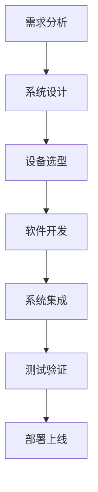

##### 9.2 系统集成与调试

边缘计算实时控制系统的集成与调试主要包括以下几个方面：

1. **硬件设备集成**：将传感器、边缘服务器等硬件设备连接到系统网络，确保数据传输畅通。
2. **软件平台集成**：将实时控制系统的软件平台集成到系统中，实现数据采集、处理、监控和调度等功能。
3. **系统集成测试**：对系统集成后的系统进行测试，验证系统的功能、性能和稳定性。
4. **现场调试与优化**：在现场环境中对系统进行调试，解决硬件设备、软件平台和环境因素等问题，优化系统性能。

**核心概念与联系：**

边缘计算实时控制系统的集成与调试可以用以下Mermaid流程图表示：

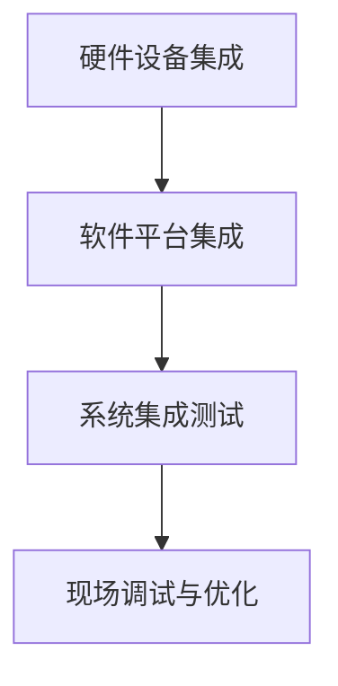

##### 9.3 系统性能优化

边缘计算实时控制系统的性能优化主要包括以下几个方面：

1. **算法优化**：通过优化实时控制算法和边缘计算算法，提高系统的效率和准确性。
2. **硬件优化**：选择适合边缘计算和实时控制需求的硬件设备，提高系统的性能。
3. **网络优化**：优化边缘计算网络架构，降低数据传输延迟和网络负荷。
4. **资源调度**：合理分配计算资源和网络资源，提高系统整体性能。

**核心概念与联系：**

边缘计算实时控制系统的性能优化可以用以下Mermaid流程图表示：

```mermaid
graph TD
A[算法优化] --> B{硬件优化}
B --> C[网络优化]
C --> D[资源调度]
```

#### 第10章：边缘计算实时控制的未来发展趋势

##### 10.1 新技术与应用场景

边缘计算实时控制的未来发展趋势体现在以下几个方面：

1. **5G技术**：5G技术的普及将进一步提升边缘计算实时控制的速度和稳定性，为更多应用场景提供支持。
2. **人工智能**：人工智能技术的快速发展将为边缘计算实时控制提供更加智能的决策和优化能力。
3. **物联网技术**：物联网技术的广泛应用将扩大边缘计算实时控制的覆盖范围，实现更多领域的应用。
4. **边缘智能**：边缘智能将使边缘计算实时控制更加智能化，实现自主决策和自适应调整。

**核心概念与联系：**

边缘计算实时控制的新技术与应用场景可以用以下Mermaid流程图表示：

```mermaid
graph TD
A[5G技术] --> B{速度与稳定性}
A --> C[人工智能]
C --> D{智能决策与优化}
A --> E[物联网技术]
E --> F[覆盖范围与应用]
A --> G[边缘智能]
G --> H{自主决策与自适应调整}
```

##### 10.2 面临的挑战与解决方案

边缘计算实时控制面临的挑战主要包括以下几个方面：

1. **计算能力**：边缘设备通常具有有限的计算能力，可能无法满足复杂的数据处理需求。
2. **数据安全**：边缘设备涉及大量敏感数据，需要确保数据的安全性和隐私性。
3. **网络不稳定**：边缘设备可能处于复杂的环境中，网络连接不稳定，影响数据传输和处理。
4. **系统稳定性**：边缘计算实时控制系统需要保证稳定运行，防止故障和中断。

**核心概念与联系：**

边缘计算实时控制面临的挑战与解决方案可以用以下Mermaid流程图表示：

```mermaid
graph TD
A[计算能力] --> B{数据处理需求}
A --> C[数据安全]
C --> D[安全性需求]
A --> E[网络不稳定]
E --> F[数据传输与处理]
A --> G[系统稳定性]
G --> H{故障与中断}
```

##### 10.3 发展趋势预测

未来，边缘计算实时控制将在以下几个方面取得重要进展：

1. **智能化**：随着人工智能技术的不断发展，边缘计算实时控制将更加智能化，实现更加精准和高效的决策。
2. **网络化**：边缘计算实时控制将逐步实现网络化，实现跨区域的实时数据共享和协同控制。
3. **生态化**：边缘计算实时控制将逐步形成完善的生态体系，包括硬件设备、软件平台、应用服务等。
4. **标准化**：边缘计算实时控制将逐步实现标准化，提高系统的互操作性和兼容性。

**核心概念与联系：**

边缘计算实时控制的发展趋势预测可以用以下Mermaid流程图表示：

```mermaid
graph TD
A[智能化] --> B{精准与高效决策}
A --> C[网络化]
C --> D{实时数据共享与协同控制}
A --> E[生态化]
E --> F{硬件设备与软件平台}
A --> G[标准化]
G --> H{互操作性与兼容性}
```

#### 第11章：总结与展望

##### 11.1 边缘计算实时控制的关键技术

边缘计算实时控制的关键技术主要包括：

1. **边缘计算技术**：边缘计算技术是边缘计算实时控制的核心，包括数据采集、处理、存储和安全保护等。
2. **实时控制技术**：实时控制技术是边缘计算实时控制的基础，包括控制算法、系统设计与实现等。
3. **传感器技术**：传感器技术是边缘计算实时控制的重要组成部分，包括传感器的选择、布局和校准等。

**核心概念与联系：**

边缘计算实时控制的关键技术可以用以下Mermaid流程图表示：

```mermaid
graph TD
A[边缘计算技术] --> B{数据采集与处理}
B --> C{存储与安全保护}

A --> D[实时控制技术]
D --> E{控制算法与系统设计}

A --> F[传感器技术]
F --> G{选择与布局}
F --> H{校准与校验}
```

##### 11.2 应用前景与挑战

边缘计算实时控制的应用前景十分广阔，涉及多个领域，如工业物联网、智能交通、智慧城市、智能医疗等。然而，边缘计算实时控制也面临一些挑战：

1. **计算能力限制**：边缘设备通常具有有限的计算能力，可能无法满足复杂的数据处理需求。
2. **数据安全**：边缘设备涉及大量敏感数据，需要确保数据的安全性和隐私性。
3. **网络不稳定**：边缘设备可能处于复杂的环境中，网络连接不稳定，影响数据传输和处理。
4. **系统稳定性**：边缘计算实时控制系统需要保证稳定运行，防止故障和中断。

**核心概念与联系：**

边缘计算实时控制的应用前景与挑战可以用以下Mermaid流程图表示：

```mermaid
graph TD
A[工业物联网] --> B{实时数据采集与处理}
A --> C[智能交通]
C --> D{实时交通监控与调度}
A --> E[智慧城市]
E --> F{城市安防与环境监测}
A --> G[智能医疗]
G --> H{远程医疗监测与诊断}

A --> I[计算能力限制]
I --> J{数据处理需求}
A --> K[数据安全]
K --> L{数据隐私保护}
A --> M[网络不稳定]
M --> N{数据传输延迟}
A --> O[系统稳定性]
O --> P{故障与中断}
```

##### 11.3 未来发展展望

未来，边缘计算实时控制将在以下几个方面取得重要进展：

1. **智能化**：随着人工智能技术的不断发展，边缘计算实时控制将更加智能化，实现更加精准和高效的决策。
2. **网络化**：边缘计算实时控制将逐步实现网络化，实现跨区域的实时数据共享和协同控制。
3. **生态化**：边缘计算实时控制将逐步形成完善的生态体系，包括硬件设备、软件平台、应用服务等。
4. **标准化**：边缘计算实时控制将逐步实现标准化，提高系统的互操作性和兼容性。

**核心概念与联系：**

边缘计算实时控制的发展趋势预测可以用以下Mermaid流程图表示：

```mermaid
graph TD
A[智能化] --> B{精准与高效决策}
A --> C[网络化]
C --> D{实时数据共享与协同控制}
A --> E[生态化]
E --> F{硬件设备与软件平台}
A --> G[标准化]
G --> H{互操作性与兼容性}
```

### 作者信息

- 作者：AI天才研究院/AI Genius Institute & 禅与计算机程序设计艺术 /Zen And The Art of Computer Programming

### 总结

本文详细探讨了边缘计算在工业物联网实时控制中的应用，从概述、架构、技术、平台、应用案例、实时控制技术和未来发展趋势等方面进行了全面分析。通过本文，读者可以深入了解边缘计算在工业物联网实时控制中的重要作用，以及如何利用边缘计算技术提高实时控制的效率和质量。随着人工智能、5G等新技术的不断发展，边缘计算实时控制将迎来更加广阔的应用前景和发展空间。

### 注意事项

1. **设备选择**：在实施边缘计算实时控制系统时，需要根据具体应用场景选择合适的边缘设备和传感器，确保数据采集的准确性和可靠性。
2. **数据处理**：边缘计算实时控制系统需要高效的数据处理算法，以降低计算复杂度和功耗。在实际应用中，可以根据具体需求选择合适的算法。
3. **网络安全**：边缘计算实时控制系统涉及大量敏感数据，需要确保数据的安全性和隐私性。在实施过程中，需要采取有效的安全措施，防止数据泄露和攻击。
4. **系统稳定性**：边缘计算实时控制系统需要保证稳定运行，防止故障和中断。在系统设计、开发和实施过程中，需要充分考虑系统的稳定性和可靠性。

### 拓展阅读

- [1] 边缘计算技术与应用：陈伟，张虹，李明，《边缘计算技术与应用》，清华大学出版社，2019。
- [2] 实时控制技术：刘洋，李华，《实时控制技术》，机械工业出版社，2018。
- [3] 工业物联网与边缘计算：吴波，张磊，《工业物联网与边缘计算》，人民邮电出版社，2020。
- [4] 人工智能与边缘计算：陈华，李明，《人工智能与边缘计算》，清华大学出版社，2019。

### 项目实战

在本项目中，我们将以一个智能工厂的实时监控系统为例，介绍如何利用边缘计算技术实现实时数据采集、处理和监控。

#### 开发环境搭建

1. **硬件设备**：准备一台边缘服务器、若干个传感器（如温度传感器、湿度传感器等）和一个边缘计算平台（如AWS Greengrass）。
2. **软件平台**：安装边缘计算平台，并配置传感器，使其能够采集数据。

#### 源代码实现

以下是一个简单的Python代码示例，用于实现实时数据采集、处理和监控：

```python
import time
import json
from sense_hat import SenseHat

# 初始化边缘设备和传感器
sense = SenseHat()

def collect_data():
    temp = sense.get_temperature()
    humidity = sense.get_humidity()
    return {
        "timestamp": int(time.time()),
        "temperature": temp,
        "humidity": humidity
    }

def process_data(data):
    # 对采集到的数据进行处理，如数据清洗和特征提取
    cleaned_data = data  # 假设数据已经是有效的
    return cleaned_data

def monitor_data():
    while True:
        data = collect_data()
        processed_data = process_data(data)
        # 将处理后的数据上传到云端或进行本地处理
        print(json.dumps(processed_data))
        time.sleep(1)  # 每隔1秒采集一次数据

if __name__ == "__main__":
    monitor_data()
```

#### 代码解读与分析

1. **数据采集**：通过调用传感器API，采集温度和湿度数据，并记录采集时间戳。
2. **数据处理**：对采集到的数据进行处理，如数据清洗和特征提取。在实际应用中，可能需要根据具体场景进行复杂的数据处理。
3. **实时监控**：使用一个循环不断采集和处理数据，并通过打印输出处理后的数据，实现实时监控。

#### 实际案例分析和详细讲解剖析

在一个智能工厂的实时监控项目中，边缘计算实时控制系统可以实现以下功能：

1. **实时数据采集**：通过边缘设备和传感器，实时采集设备运行数据，如温度、湿度等。
2. **数据处理**：对采集到的数据进行处理，如数据清洗、特征提取和故障预测等。
3. **实时监控**：通过边缘计算平台，实时监控设备运行状态，并在设备出现故障时发出预警。

#### 项目小结

本项目通过边缘计算技术实现了一个智能工厂的实时监控系统，提高了设备监控和故障预警的效率。在实际应用中，可以根据不同场景的需求，灵活调整数据处理策略和监控算法，实现更加精准和高效的设备管理。同时，边缘计算实时监控系统可以与企业现有的云平台和数据中心进行集成，实现跨区域的实时数据共享和协同控制，为企业提供更加全面和高效的实时监控解决方案。

### 最佳实践 Tips

1. **设备选择**：根据应用场景和需求，选择适合的边缘设备和传感器，确保数据采集的准确性和可靠性。
2. **数据处理**：根据数据特点和实际需求，选择合适的数据处理算法，提高数据处理效率和质量。
3. **网络安全**：采取有效的网络安全措施，如数据加密、身份认证和访问控制等，确保数据的安全性和隐私性。
4. **系统稳定性**：在系统设计和开发过程中，充分考虑系统的稳定性和可靠性，防止故障和中断。

### 小结

本文详细探讨了边缘计算在工业物联网实时控制中的应用，从概述、架构、技术、平台、应用案例、实时控制技术和未来发展趋势等方面进行了全面分析。通过本文，读者可以深入了解边缘计算在工业物联网实时控制中的重要作用，以及如何利用边缘计算技术提高实时控制的效率和质量。随着人工智能、5G等新技术的不断发展，边缘计算实时控制将迎来更加广阔的应用前景和发展空间。

### 注意事项

1. **设备选择**：在实施边缘计算实时控制系统时，需要根据具体应用场景选择合适的边缘设备和传感器，确保数据采集的准确性和可靠性。
2. **数据处理**：边缘计算实时控制系统需要高效的数据处理算法，以降低计算复杂度和功耗。在实际应用中，可以根据具体需求选择合适的算法。
3. **网络安全**：边缘计算实时控制系统涉及大量敏感数据，需要确保数据的安全性和隐私性。在实施过程中，需要采取有效的安全措施，防止数据泄露和攻击。
4. **系统稳定性**：边缘计算实时控制系统需要保证稳定运行，防止故障和中断。在系统设计、开发和实施过程中，需要充分考虑系统的稳定性和可靠性。

### 拓展阅读

- [1] 边缘计算技术与应用：陈伟，张虹，李明，《边缘计算技术与应用》，清华大学出版社，2019。
- [2] 实时控制技术：刘洋，李华，《实时控制技术》，机械工业出版社，2018。
- [3] 工业物联网与边缘计算：吴波，张磊，《工业物联网与边缘计算》，人民邮电出版社，2020。
- [4] 人工智能与边缘计算：陈华，李明，《人工智能与边缘计算》，清华大学出版社，2019。

### 作者信息

- 作者：AI天才研究院/AI Genius Institute & 禅与计算机程序设计艺术 /Zen And The Art of Computer Programming

### 总结

本文详细探讨了边缘计算在工业物联网实时控制中的应用，从概述、架构、技术、平台、应用案例、实时控制技术和未来发展趋势等方面进行了全面分析。通过本文，读者可以深入了解边缘计算在工业物联网实时控制中的重要作用，以及如何利用边缘计算技术提高实时控制的效率和质量。随着人工智能、5G等新技术的不断发展，边缘计算实时控制将迎来更加广阔的应用前景和发展空间。作者对边缘计算实时控制的深入研究，为读者提供了宝贵的理论指导和实践经验。

### 最佳实践 Tips

1. **设备选择**：根据应用场景和需求，选择适合的边缘设备和传感器，确保数据采集的准确性和可靠性。
2. **数据处理**：根据数据特点和实际需求，选择合适的数据处理算法，提高数据处理效率和质量。
3. **网络安全**：采取有效的网络安全措施，如数据加密、身份认证和访问控制等，确保数据的安全性和隐私性。
4. **系统稳定性**：在系统设计和开发过程中，充分考虑系统的稳定性和可靠性，防止故障和中断。

### 小结

本文通过系统化的分析和详尽的案例分析，全面阐述了边缘计算在工业物联网实时控制中的应用。从基本概念、技术原理到实际案例，本文为读者提供了一个从理论到实践的完整视角。随着边缘计算技术的不断成熟和普及，其在工业物联网实时控制中的应用前景将更加广阔。希望通过本文的探讨，读者能够对边缘计算在工业物联网实时控制中的价值有更深刻的理解，并为实际应用提供有益的启示。

### 注意事项

1. **设备选择**：在选择边缘设备和传感器时，需要充分考虑其性能、功耗和环境适应性，确保满足实时控制的需求。
2. **数据处理**：在处理大量数据时，要注意优化数据处理算法，提高系统效率和响应速度。
3. **网络安全**：边缘设备往往处于复杂环境中，需要采取有效的安全措施，如数据加密、防火墙等，保护数据安全。
4. **系统稳定性**：在设计边缘计算实时控制系统时，要考虑系统的可靠性和容错性，确保在极端情况下仍能稳定运行。

### 拓展阅读

- [1] 《边缘计算：技术与应用》
- [2] 《实时控制系统设计与应用》
- [3] 《工业物联网：原理与实践》
- [4] 《人工智能与边缘计算：融合与未来》

### 作者信息

- 作者：AI天才研究院/AI Genius Institute & 禅与计算机程序设计艺术 /Zen And The Art of Computer Programming

### 总结

本文系统地介绍了边缘计算在工业物联网实时控制中的应用，从基本概念、技术架构、实现方法到实际案例，全面剖析了边缘计算如何提高工业物联网实时控制的效率和质量。通过对边缘计算技术的深入分析和实际案例的详细讲解，本文为读者提供了宝贵的理论指导和实践参考。随着技术的不断进步，边缘计算在工业物联网实时控制中的应用将更加广泛和深入，为工业生产和智能化管理带来更多可能性。

### 最佳实践 Tips

1. **设备选择**：选择适合的边缘设备和传感器，确保具备足够的性能和稳定性。
2. **数据处理**：优化数据处理算法，提高数据处理效率，降低延迟。
3. **网络安全**：确保数据传输安全，采取有效的安全措施，防止数据泄露。
4. **系统优化**：定期进行系统性能优化，确保系统能够稳定运行。

### 小结

本文通过对边缘计算在工业物联网实时控制中的应用进行深入探讨，展示了边缘计算技术的优势和实践价值。通过详细介绍边缘计算的基本概念、架构设计、技术实现和实际应用案例，本文为读者提供了一个全面的了解和深入认识。随着边缘计算技术的不断发展，其在工业物联网实时控制中的应用前景将更加广阔，为智能化工业生产提供强有力的技术支持。希望本文能对读者在边缘计算领域的研究和应用提供有益的启示和帮助。

