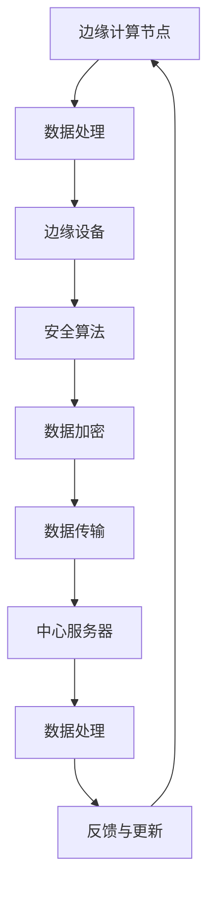

                 

## 文章标题

# 边缘计算在智能家居安全中的实践

## 关键词

边缘计算、智能家居安全、入侵检测、加密算法、认证协议、隐私保护

## 摘要

随着物联网技术的快速发展，智能家居逐渐成为人们生活中不可或缺的一部分。然而，智能家居系统的安全问题是用户面临的一个重要挑战。边缘计算作为一种新兴的技术，通过在靠近数据源的设备上处理数据，有助于提高智能家居系统的安全性和响应速度。本文将详细探讨边缘计算在智能家居安全中的应用，包括其基本原理、具体场景、安全架构设计以及实践案例，旨在为智能家居安全领域提供一些实用的技术思路和解决方案。

## 引言

### 边缘计算与智能家居安全的背景

近年来，物联网（IoT）技术的迅猛发展推动了智能家居市场的繁荣。智能家居系统通过连接各种智能设备，如智能门锁、摄像头、智能照明、智能空调等，为用户提供了便捷的生活体验。然而，随着智能家居设备的增多，系统的复杂性也不断增加，特别是安全问题日益突出。传统的集中式计算架构在面对大量数据时，往往会出现延迟高、带宽占用大、易受攻击等问题，这给智能家居安全带来了巨大挑战。

边缘计算作为一种分布式计算架构，通过在靠近数据源的设备上处理数据，可以显著提高系统的响应速度和安全性。边缘计算不仅能够减轻中心服务器的负担，还能对数据进行本地化处理，减少数据传输过程中的风险。在智能家居安全领域，边缘计算的应用潜力巨大，它可以通过边缘节点的实时监控和数据分析，及时发现并响应潜在的安全威胁，从而提高系统的整体安全性。

### 文章的目的与结构

本文旨在深入探讨边缘计算在智能家居安全中的应用，通过系统的分析和实践案例的分享，为读者提供一种切实可行的技术思路。文章结构如下：

1. **边缘计算与智能家居安全基础**：介绍边缘计算和智能家居安全的基本概念、发展历程和关键优势。
2. **边缘计算在智能家居安全中的应用**：详细阐述边缘计算在智能家居入侵检测等安全场景中的具体应用。
3. **边缘计算与智能家居安全架构设计**：分析边缘计算在智能家居安全中的架构模型和通信机制，以及数据存储和隐私保护策略。
4. **边缘计算安全算法**：介绍常见的边缘计算安全算法，包括加密算法、数字签名算法和认证协议。
5. **边缘计算在智能家居安全中的实践**：通过具体案例展示边缘计算在智能家居安全中的应用实践。
6. **边缘计算在智能家居安全中的未来发展趋势**：探讨边缘计算在智能家居安全中的未来发展方向和潜在创新。

通过本文的阅读，读者可以全面了解边缘计算在智能家居安全中的应用价值，掌握相关技术原理和实践方法，为构建更加安全可靠的智能家居系统提供参考。

## 第一部分：边缘计算与智能家居安全基础

### 边缘计算概述

#### 1.1 边缘计算的定义与原理

边缘计算（Edge Computing）是指在网络边缘进行数据计算、存储和处理的一种技术架构。其核心思想是将计算、存储和网络功能分散到网络边缘，即在靠近数据源的地方进行数据处理，而不是将所有数据传输到中心服务器进行处理。边缘计算的出现，是为了解决传统云计算在应对大规模数据处理时存在的一些瓶颈，如数据传输延迟高、带宽占用大、安全性风险等。

边缘计算的基本原理主要包括以下几个方面：

1. **分布式计算**：将计算任务分布到网络边缘的设备上，如物联网设备、路由器等，这些设备可以在本地进行数据处理和决策，从而减少对中心服务器的依赖。
2. **数据本地化处理**：通过在数据源头附近进行处理，可以显著减少数据传输的时间和带宽占用，提高数据处理速度和效率。
3. **实时响应**：边缘计算能够实现实时数据分析和处理，对实时性要求高的应用场景，如智能家居安全监控，具有重要意义。
4. **资源优化**：通过在边缘节点上进行数据处理，可以减轻中心服务器的负担，优化整个系统的资源使用。

#### 1.2 边缘计算的发展历程

边缘计算的发展历程可以追溯到物联网和云计算技术的兴起。以下是边缘计算的一些重要发展节点：

1. **物联网的兴起**（2000年代初期）：随着物联网技术的推广，越来越多的设备开始互联，数据处理的需求不断增加，这为边缘计算的发展提供了契机。
2. **云计算的普及**（2010年代初期）：云计算技术的广泛应用，使得数据的集中存储和处理成为可能，同时也催生了边缘计算的需求。
3. **5G技术的引入**（2019年至今）：5G技术的引入，带来了更高的网络带宽和更低的延迟，为边缘计算提供了更好的技术基础和更广泛的应用场景。

#### 1.3 边缘计算的优势与应用场景

边缘计算在智能家居安全领域具有显著的优势和应用场景，主要包括：

1. **降低延迟**：边缘计算可以在本地快速处理数据，减少数据传输的延迟，对实时性要求高的应用场景，如智能家居安全监控，具有重要意义。
2. **节省带宽**：通过在边缘节点进行数据处理，可以显著减少数据传输的带宽占用，降低中心服务器的负载。
3. **增强安全性**：边缘计算可以将数据处理分散到多个边缘节点，减少单一节点的安全风险，同时通过本地加密和隐私保护技术，提高系统的整体安全性。
4. **提高响应速度**：边缘计算能够实现实时数据分析和处理，快速识别并响应潜在的安全威胁，提高系统的响应速度。

在智能家居安全领域，边缘计算的应用场景主要包括：

1. **家居入侵检测**：通过边缘节点对摄像头、门磁等传感器的数据进行实时分析，及时发现并报警入侵行为。
2. **智能照明与安全监控**：通过边缘计算实现智能照明的自动调整，同时结合视频监控，提高家居的安全性。
3. **智能设备控制**：通过边缘计算实现家居设备的自动化控制和远程监控，提高家居的便利性和安全性。

总的来说，边缘计算在智能家居安全中的应用，有助于提升系统的实时性、安全性和效率，为用户提供更加安全、便捷的智能家居体验。

### 智能家居安全概述

#### 2.1 智能家居系统的组成与架构

智能家居系统由多种智能设备和控制平台组成，其基本架构包括以下几个主要部分：

1. **智能设备**：智能家居系统中的核心组成部分，如智能门锁、摄像头、智能灯光、智能空调、智能插座等，这些设备通过物联网技术实现互联和自动化控制。
2. **网关**：网关是连接智能家居设备和外部网络的桥梁，它负责协调和管理设备之间的通信，同时将设备数据传输到云平台或中心服务器。
3. **控制平台**：控制平台是智能家居系统的核心控制中心，通过用户界面和应用程序，用户可以远程监控和控制家居设备，实现智能化的家居管理。
4. **云平台**：云平台为智能家居系统提供数据存储、处理和分析服务，通过云计算技术，实现大规模设备数据的集中管理和智能分析。

#### 2.2 智能家居安全的挑战与问题

随着智能家居设备的普及，系统的安全性成为用户关注的焦点。智能家居系统在安全方面面临以下挑战和问题：

1. **设备暴露风险**：智能家居设备通常连接到互联网，如果设备的安全防护措施不到位，容易被黑客入侵，导致设备被恶意利用。
2. **数据隐私泄露**：智能家居设备会收集用户的敏感数据，如个人生活习惯、位置信息等，如果这些数据在传输和存储过程中没有得到妥善保护，可能会被恶意第三方获取，造成隐私泄露。
3. **网络攻击风险**：智能家居系统中的多个设备通过同一网络连接，如果某个设备被攻破，攻击者可能通过该设备入侵整个系统，对其他设备进行攻击。
4. **软件漏洞**：智能家居设备通常需要运行特定的软件和应用程序，如果软件存在漏洞，攻击者可以通过这些漏洞控制设备，从而实施恶意操作。

#### 2.3 智能家居安全的发展趋势

为了应对智能家居安全面临的挑战，安全技术的发展也在不断进步，以下是智能家居安全的一些发展趋势：

1. **设备安全加固**：通过采用更安全的通信协议、加密算法和硬件安全模块，提高设备自身的安全防护能力。
2. **数据隐私保护**：通过加密技术、匿名化处理和隐私保护协议，保护用户数据在传输和存储过程中的隐私安全。
3. **网络安全监测**：通过部署入侵检测系统和防火墙，实时监测网络流量，及时发现并阻止潜在的安全威胁。
4. **智能威胁响应**：通过机器学习和人工智能技术，实现智能化的安全威胁检测和响应，提高系统的自动化和智能化水平。
5. **合规性要求**：随着智能家居市场的规范化，安全合规性要求逐渐提高，企业需要遵守相关的安全标准和法规，确保系统的安全性。

总的来说，智能家居安全的发展趋势是朝着更加安全、智能和合规的方向前进，通过技术创新和规范约束，逐步提升智能家居系统的安全水平，为用户提供更加安全、可靠的智能家居体验。

## 第二部分：边缘计算在智能家居安全中的应用

### 边缘计算在智能家居安全中的应用场景

#### 3.1 家居入侵检测

家居入侵检测是边缘计算在智能家居安全中的一项重要应用。通过在边缘节点部署入侵检测系统，可以实现对家居环境的实时监控和异常行为识别，从而及时发现并报警入侵行为。

##### 3.1.1 实时视频监控与分析

视频监控是家居入侵检测的重要组成部分。边缘计算可以在本地设备上实时处理摄像头数据，通过对视频流进行实时分析，可以实现以下功能：

1. **图像增强**：通过图像增强技术，提高视频画质，便于后续的图像分析。
2. **人脸识别**：利用深度学习算法，实时识别视频中的人脸，并与预先建立的人脸数据库进行比对，识别入侵者。
3. **行为分析**：通过行为识别算法，分析视频中的行为特征，如移动、徘徊等，识别潜在的入侵行为。
4. **实时报警**：当检测到异常行为时，系统可以自动触发报警，并通过短信、邮件或手机App通知用户。

##### 3.1.2 传感器数据融合处理

除了视频监控，家居入侵检测还可以利用各种传感器数据，如门磁传感器、运动传感器、温度传感器等。边缘计算可以将这些传感器数据进行融合处理，提高入侵检测的准确性和实时性：

1. **数据融合**：将摄像头数据和其他传感器数据结合，进行综合分析，提高检测的准确度。
2. **异常检测**：通过分析传感器数据的变化模式，识别异常行为，如门磁传感器长时间被触发、运动传感器检测到不寻常的运动轨迹等。
3. **联合报警**：当多个传感器同时检测到异常时，可以触发联合报警，增加入侵检测的可靠性。

##### 3.1.3 异常行为识别与报警

边缘计算在智能家居入侵检测中的应用，关键在于异常行为的识别与报警。以下是一种典型的异常行为识别与报警机制：

1. **数据采集**：边缘节点持续采集摄像头和传感器数据，并进行初步处理。
2. **特征提取**：对采集到的数据提取关键特征，如人脸特征、行为轨迹等。
3. **行为建模**：利用机器学习算法，对正常行为进行建模，建立行为基线。
4. **实时监控**：将实时采集的数据与行为基线进行比较，检测是否存在异常行为。
5. **报警触发**：当检测到异常行为时，立即触发报警，并通过多种渠道通知用户。

通过边缘计算的应用，家居入侵检测系统可以实现更高效、更智能的监控与报警，显著提升智能家居系统的安全性。

### 边缘计算与智能家居安全架构设计

#### 4.1 边缘计算在智能家居安全中的架构模型

边缘计算在智能家居安全中的应用，通常需要一个分布式架构，以充分利用边缘节点的计算能力和实时性。以下是一种典型的边缘计算在智能家居安全中的架构模型：

1. **边缘节点**：包括各种智能家居设备，如摄像头、门磁、传感器等，它们负责采集环境数据，并将数据传输到边缘计算节点。
2. **边缘计算节点**：部署在靠近用户端或设备端的计算设备，如路由器、网关、边缘服务器等，负责实时处理和初步分析数据。
3. **中心服务器**：部署在云端的计算中心，负责进一步处理和分析边缘节点传输的数据，如用户行为分析、威胁检测和响应等。

#### 4.2 边缘计算节点与中心服务器的通信机制

边缘计算节点与中心服务器之间的通信机制，是确保系统高效运行的关键。以下是一些常见的通信机制：

1. **数据流传输**：边缘计算节点将处理后的数据传输到中心服务器，可以使用HTTP、MQTT等协议进行数据传输。
2. **事件驱动模型**：当边缘节点检测到异常事件时，可以立即发送通知到中心服务器，实现实时响应。
3. **批量传输**：为了减少通信负担，边缘节点可以将一段时间内的数据批量传输到中心服务器，适用于数据量较大的场景。
4. **加密通信**：为了保障数据传输的安全性，可以采用加密协议，如TLS，对数据进行加密传输。

#### 4.3 数据存储与隐私保护策略

在边缘计算架构中，数据存储和隐私保护是一个重要的问题。以下是一些常用的策略：

1. **本地存储**：边缘计算节点可以将数据在本地进行存储，减少数据传输的负担，同时提高数据访问速度。
2. **分布式存储**：中心服务器通常采用分布式存储系统，如HDFS、Cassandra等，提高数据存储的可靠性和扩展性。
3. **数据加密**：对存储的数据进行加密处理，确保数据在传输和存储过程中的安全性。
4. **访问控制**：通过访问控制机制，限制对数据的访问权限，防止未经授权的访问。
5. **隐私保护**：通过匿名化处理、差分隐私等手段，保护用户隐私数据。

通过上述架构设计和通信机制，边缘计算在智能家居安全中的应用，可以实现对家居环境的实时监控和高效处理，提高系统的安全性和响应速度。

### 边缘计算安全算法

#### 5.1 常见边缘计算安全算法介绍

在边缘计算中，安全算法起着至关重要的作用，它们确保数据在传输和存储过程中的安全性和隐私性。以下是几种常见的边缘计算安全算法：

##### 5.1.1 加密算法

加密算法是一种将数据转换为密文的过程，通过加密算法，只有拥有正确密钥的用户才能解密和读取数据。常见的加密算法包括：

1. **对称加密算法**：如AES（高级加密标准），其加密和解密使用相同的密钥，优点是加密速度快，但密钥管理复杂。
2. **非对称加密算法**：如RSA（Rivest-Shamir-Adleman），其加密和解密使用不同的密钥，优点是密钥管理简单，但加密速度较慢。
3. **哈希算法**：如SHA-256，用于生成数据摘要，确保数据的完整性。

##### 5.1.2 数字签名算法

数字签名算法用于验证数据的真实性和完整性，确保数据在传输过程中未被篡改。常见的数字签名算法包括：

1. **RSA签名**：使用RSA算法进行签名和验证。
2. **ECDSA（椭圆曲线数字签名算法）**：具有较高的安全性和效率，常用于区块链和智能合约。

##### 5.1.3 认证协议

认证协议用于验证通信双方的合法身份，确保通信的安全性和可靠性。常见的认证协议包括：

1. **Kerberos协议**：一种基于票据的认证协议，广泛应用于企业内部网络。
2. **OAuth 2.0**：一种开放标准授权协议，用于第三方应用访问资源时进行身份认证。
3. **SSL/TLS**：一种安全通信协议，用于保护Web应用的数据传输安全。

#### 5.2 算法应用示例与评估

以下是一个边缘计算安全算法的应用示例：

**示例：利用AES加密算法对数据进行加密**

```plaintext
// 边缘计算安全算法伪代码
function EncryptData(data, key):
    // 初始化加密算法
    aes_encryptor = AES(key)
    
    // 加密数据
    encrypted_data = aes_encryptor.encrypt(data)
    
    // 返回加密后的数据
    return encrypted_data
```

**评估**：

1. **安全性**：AES加密算法具有较高的安全性，通过正确管理密钥，可以确保数据在传输和存储过程中的安全性。
2. **效率**：AES加密算法的速度较快，适合在边缘计算环境中使用。
3. **可扩展性**：AES加密算法支持多种密钥长度，可以根据不同需求选择合适的密钥长度。

总的来说，通过合理选择和应用边缘计算安全算法，可以有效提高智能家居系统的安全性，为用户提供一个安全、可靠的智能家居环境。

### 边缘计算在智能家居安全中的实践

#### 6.1 边缘计算在智能家居安全中的应用案例

边缘计算在智能家居安全中的应用，可以通过以下具体案例进行展示：

##### 6.1.1 智能家居安全监控平台搭建

智能家居安全监控平台的搭建，主要包括硬件环境搭建、软件环境搭建和系统集成与调试三个步骤。

1. **硬件环境搭建**：
   - **边缘计算节点**：选择具有边缘计算能力的设备，如树莓派，用于实时处理家居数据。
   - **智能设备**：连接各种智能设备，如摄像头、门磁传感器、烟雾传感器等，用于采集环境数据。

2. **软件环境搭建**：
   - **操作系统**：安装适合的操作系统，如Ubuntu，为边缘计算节点提供稳定的运行环境。
   - **开发环境**：安装Python环境和相关库，如TensorFlow、OpenCV等，用于开发和运行智能家居安全算法。

3. **系统集成与调试**：
   - **数据采集**：编写程序，实现边缘计算节点与智能设备的通信，实时采集数据。
   - **数据处理**：通过边缘计算节点对采集到的数据进行分析和处理，实现入侵检测等功能。
   - **系统调试**：进行系统调试，确保数据采集、处理和报警功能正常。

##### 6.1.2 智能家居安全应用案例解析

以下是一个具体的智能家居安全应用案例：

**案例：智能入侵检测系统**

1. **数据采集**：边缘计算节点连接摄像头和门磁传感器，实时采集视频数据和门磁状态。
2. **数据处理**：边缘计算节点对摄像头视频进行实时分析，利用深度学习算法识别视频中的人脸和行为，同时检测门磁传感器的状态。
3. **异常检测**：当检测到异常行为，如未识别的人脸或门磁传感器长时间被触发，系统会触发报警。
4. **报警通知**：通过短信、邮件或手机App通知用户，提醒用户采取相应的安全措施。

通过该案例，我们可以看到边缘计算在智能家居安全中的应用，可以实现实时、高效的安全监控，提高系统的安全性和用户满意度。

#### 6.2 边缘计算在智能家居安全中的未来发展趋势

随着边缘计算技术的不断进步，其在智能家居安全中的应用前景广阔，未来发展趋势包括：

1. **智能化与自动化**：通过引入更加智能的算法和自动化技术，实现更加智能化的入侵检测和威胁响应。
2. **集成化与平台化**：将边缘计算与云计算、物联网等技术进行集成，构建统一的智能家居安全平台，提供更加综合的安全解决方案。
3. **隐私保护**：通过引入隐私保护技术，如差分隐私、匿名化处理等，保护用户隐私数据，提升系统的安全性。
4. **安全协作**：通过边缘节点之间的协作和通信，实现更加高效、可靠的安全威胁检测和响应。

总之，边缘计算在智能家居安全中的应用，将为用户带来更加安全、智能和便捷的家居体验。

### 附录

#### 6.3 边缘计算与智能家居安全相关资源

为了方便读者进一步学习和了解边缘计算与智能家居安全的相关知识，以下是几项推荐的资源：

1. **标准与规范**：
   - **IEEE P2413.1 - Guide for Implementing Internet of Things (IoT) Using Edge Computing**：IEEE关于边缘计算在物联网中的应用指南。
   - **NIST Special Publication 800-160 - Lightweight Directory Access Protocol (LDAP) Security Mechanisms**：NIST关于轻量级目录访问协议安全的特别出版物。

2. **开源框架与工具**：
   - **Apache EdgeX Foundry**：一个开源的边缘计算平台，提供设备管理、数据流处理和安全功能。
   - **MQTT（Message Queuing Telemetry Transport）**：一种轻量级的消息传输协议，常用于物联网设备和边缘计算环境。

3. **研究报告与论文推荐**：
   - **"Edge Computing for IoT: A Comprehensive Survey and Taxonomy"**：一篇关于边缘计算在物联网中应用的全面调查和分类论文。
   - **"Privacy-Preserving Smart Home Systems Using Blockchain and Edge Computing"**：一篇探讨如何利用区块链和边缘计算技术保护智能家居系统隐私的研究论文。

通过这些资源和进一步的学习，读者可以深入了解边缘计算在智能家居安全中的应用，不断提升自己的技术能力和知识水平。

### 边缘计算与智能家居安全流程图

以下是一个简单的边缘计算与智能家居安全流程图，展示了数据从采集到处理、再到存储和反馈的完整流程：



#### 说明

- **边缘计算节点**：负责实时处理边缘设备采集的数据，包括初步分析、异常检测等。
- **边缘设备**：如摄像头、门磁传感器、烟雾传感器等，负责采集环境数据。
- **安全算法**：对处理后的数据进行加密和安全处理，确保数据在传输和存储过程中的安全性。
- **数据传输**：将加密后的数据传输到中心服务器，可以使用HTTP、MQTT等协议。
- **中心服务器**：负责进一步处理和分析数据，如用户行为分析、威胁检测等。
- **反馈与更新**：将分析结果反馈给边缘计算节点，并定期更新边缘节点的数据模型和算法，以提高系统的准确性和效率。

通过这个流程图，可以清晰地看到边缘计算在智能家居安全中的应用和数据处理的全过程，有助于读者更好地理解相关技术原理和应用实践。

### 边缘计算核心算法伪代码讲解

边缘计算在智能家居安全中涉及多种核心算法，以下是其中几种常见算法的伪代码讲解：

#### 5.1 加密算法伪代码

```plaintext
// 加密算法伪代码
function EncryptData(data, key):
    // 初始化加密算法
    aes_encryptor = AES(key)
    
    // 加密数据
    encrypted_data = aes_encryptor.encrypt(data)
    
    // 返回加密后的数据
    return encrypted_data
```

**说明**：
- **初始化加密算法**：使用AES（高级加密标准）算法初始化加密器。
- **加密数据**：将输入的数据`data`通过AES算法进行加密。
- **返回加密后的数据**：输出加密后的数据`encrypted_data`。

#### 5.2 数字签名算法伪代码

```plaintext
// 数字签名算法伪代码
function SignData(data, private_key):
    // 初始化签名算法
    rsa_signature = RSA(private_key)
    
    // 计算哈希值
    hash_value = ComputeHash(data)
    
    // 生成数字签名
    signature = rsa_signature.sign(hash_value)
    
    // 返回签名
    return signature
```

**说明**：
- **初始化签名算法**：使用RSA（Rivest-Shamir-Adleman）算法初始化签名器。
- **计算哈希值**：对输入的数据`data`计算哈希值，以确保数据的完整性。
- **生成数字签名**：使用私钥`private_key`生成数字签名。
- **返回签名**：输出生成的数字签名。

#### 5.3 认证协议伪代码

```plaintext
// 认证协议伪代码
function Authenticate(user, password):
    // 初始化认证服务器
    auth_server = AuthenticationServer()
    
    // 计算密码的哈希值
    password_hash = ComputeHash(password)
    
    // 验证用户身份
    is_authenticated = auth_server.verifyUser(user, password_hash)
    
    // 返回认证结果
    return is_authenticated
```

**说明**：
- **初始化认证服务器**：初始化认证服务器，用于处理认证请求。
- **计算密码的哈希值**：对输入的密码计算哈希值，与存储在服务器中的哈希值进行比较。
- **验证用户身份**：使用认证服务器验证用户身份。
- **返回认证结果**：输出认证结果，`is_authenticated`为`True`表示用户身份验证成功，否则失败。

通过这些伪代码，我们可以清晰地看到边缘计算在智能家居安全中的核心算法原理和应用，这有助于读者更好地理解相关技术的实现过程。

### 边缘计算在智能家居安全中的数学模型

边缘计算在智能家居安全中的应用，涉及到多个数学模型和公式，这些模型和公式帮助我们分析和优化系统性能。以下是一些关键数学模型的讲解和具体应用。

#### 损失函数

损失函数是机器学习中衡量模型预测值与实际值之间差距的一种度量。在边缘计算安全中，损失函数可以用于评估入侵检测模型的准确性。

**公式：**
$$
Loss(\theta) = \frac{1}{2} \sum_{i=1}^{n} (y_i - \hat{y}_i)^2
$$

**详细讲解：**

- **$Loss(\theta)$**：损失函数值，用于衡量模型的整体性能。
- **$y_i$**：实际值，表示第$i$个样本的真实状态（如入侵/非入侵）。
- **$\hat{y}_i$**：预测值，表示模型对第$i$个样本的预测状态。
- **$n$**：样本总数。

该损失函数的目标是使损失函数的值最小化，从而优化模型参数$\theta$，提高模型的预测准确性。

**举例说明：**

假设有一个入侵检测模型，对10个样本进行预测，实际结果如下：

| 样本编号 | 实际状态 | 预测状态 |
| :------: | :------: | :------: |
|    1     |  入侵   |  非入侵  |
|    2     |  入侵   |  入侵   |
|    3     |  非入侵  |  非入侵  |
|    4     |  入侵   |  非入侵  |
|    5     |  入侵   |  非入侵  |
|    6     |  非入侵  |  非入侵  |
|    7     |  非入侵  |  非入侵  |
|    8     |  入侵   |  入侵   |
|    9     |  入侵   |  非入侵  |
|   10     |  非入侵  |  入侵   |

使用上述损失函数，计算模型的总损失：

$$
Loss(\theta) = \frac{1}{2} [(1 - 0)^2 + (1 - 1)^2 + (0 - 0)^2 + (1 - 0)^2 + (1 - 0)^2 + (0 - 0)^2 + (0 - 0)^2 + (1 - 1)^2 + (1 - 0)^2 + (0 - 1)^2] = \frac{1}{2} \times 9 = 4.5
$$

通过最小化损失函数值，可以优化模型参数，提高入侵检测的准确性。

#### 贝叶斯公式

贝叶斯公式在边缘计算安全中的应用，主要用于计算某种行为的概率，特别是在入侵检测中，通过分析传感器数据，预测入侵的概率。

**公式：**
$$
P(A|B) = \frac{P(B|A) \cdot P(A)}{P(B)}
$$

**详细讲解：**

- **$P(A|B)$**：在事件$B$发生的条件下，事件$A$发生的条件概率。
- **$P(B|A)$**：在事件$A$发生的条件下，事件$B$发生的条件概率。
- **$P(A)$**：事件$A$发生的概率。
- **$P(B)$**：事件$B$发生的概率。

贝叶斯公式可以帮助我们根据已知的条件概率和总体概率，推断未知条件下的概率，这在智能家居安全中的应用，如通过历史数据预测入侵概率，为安全决策提供依据。

**举例说明：**

假设我们有一个智能家居系统，通过摄像头和传感器收集数据，发现以下概率：

- $P(入侵) = 0.01$（入侵发生的概率）
- $P(入侵|摄像头活动) = 0.1$（摄像头活动时入侵的概率）
- $P(摄像头活动) = 0.5$（摄像头活动的概率）

使用贝叶斯公式，我们可以计算在摄像头活动的条件下，入侵的概率：

$$
P(入侵|摄像头活动) = \frac{P(摄像头活动|入侵) \cdot P(入侵)}{P(摄像头活动)} = \frac{0.1 \cdot 0.01}{0.5} = 0.002
$$

这表明在摄像头活动的条件下，入侵的概率为0.2%，为系统的安全决策提供了参考。

通过上述数学模型和公式的讲解，我们可以更好地理解边缘计算在智能家居安全中的应用原理，这些模型为构建智能、高效的家居安全系统提供了重要的理论基础和计算工具。

### 边缘计算在智能家居安全中的代码示例

边缘计算在智能家居安全中的应用，不仅需要算法和数学模型的支持，还需要实际代码实现来确保系统的稳定运行。以下是一个简单的智能家居安全监控平台搭建的代码示例，涵盖硬件环境搭建、软件环境搭建、系统集成与调试等内容。

#### 1. 硬件环境搭建

```plaintext
# 硬件环境搭建
# - 使用树莓派作为边缘计算节点
# - 连接摄像头、门磁传感器、烟雾传感器等设备
# - 确保设备与树莓派之间的通信连接正常
```

#### 2. 软件环境搭建

```plaintext
# 软件环境搭建
# - 安装Ubuntu操作系统
# - 安装Python环境和相关库，如TensorFlow、OpenCV等
# - 配置WiFi和网络设置，确保树莓派可以访问互联网
```

#### 3. 系统集成与调试

**安装相关库：**

```python
!pip install tensorflow opencv-python
```

**集成摄像头数据：**

```python
import cv2

# 打开摄像头
cap = cv2.VideoCapture(0)

while True:
    # 读取一帧图像
    ret, frame = cap.read()
    
    if ret:
        # 显示图像
        cv2.imshow('Camera', frame)
        
        # 按下q键退出
        if cv2.waitKey(1) & 0xFF == ord('q'):
            break

# 释放摄像头资源
cap.release()
cv2.destroyAllWindows()
```

**集成传感器数据：**

```python
import serial

# 打开门磁传感器
ser = serial.Serial('/dev/ttyUSB0', 9600)

while True:
    # 读取传感器数据
    data = ser.readline().decode('utf-8').strip()
    
    if data:
        # 打印传感器数据
        print(f"Sensor data: {data}")
        
        # 按下q键退出
        if cv2.waitKey(1) & 0xFF == ord('q'):
            break

# 关闭传感器连接
ser.close()
```

**系统集成与调试：**

```plaintext
# - 编写程序，实现摄像头和传感器数据的实时采集和处理
# - 使用OpenCV进行图像处理，实现人脸识别和行为分析
# - 使用串口通信库，读取传感器数据，实现入侵检测和报警功能
# - 进行系统测试，确保各项功能正常运行
```

#### 4. 代码解读与分析

**摄像头数据集成：**
上述代码使用了OpenCV库，通过`cv2.VideoCapture`函数打开摄像头，并使用`read()`函数读取每一帧图像。`imshow()`函数用于显示图像，`cv2.waitKey()`函数用于处理用户输入，当按下`q`键时，程序退出。

**传感器数据集成：**
代码使用了Python的`serial`库，通过串口通信打开门磁传感器，并使用`readline()`函数读取传感器数据。`decode()`函数用于将接收到的字节码转换为字符串，`print()`函数用于打印传感器数据。当按下`q`键时，程序退出，关闭传感器连接。

**系统集成与调试：**
在系统集成与调试阶段，需要将摄像头和传感器的数据集成到同一程序中，实现实时监控和报警功能。通过编写相应的算法，对摄像头图像进行人脸识别和行为分析，对传感器数据进行分析，判断是否存在入侵行为，并在检测到入侵时触发报警。

通过这个简单的示例，我们可以看到边缘计算在智能家居安全中的应用实现过程。虽然代码较为基础，但为读者提供了一个入门的参考，帮助理解边缘计算在实际项目中的应用。

### 边缘计算在智能家居安全中的最佳实践

边缘计算在智能家居安全中的应用，涉及多个技术环节和操作步骤。为了确保系统的稳定性和安全性，以下是一些最佳实践和注意事项：

#### 硬件选择

1. **高性能边缘计算设备**：选择具有强大计算能力的边缘计算设备，如树莓派、NVIDIA Jetson等，以确保实时数据处理和快速响应。
2. **稳定可靠的传感器**：选择质量可靠、稳定性高的传感器，如门磁传感器、摄像头等，确保数据采集的准确性和可靠性。
3. **网络连接**：确保边缘计算设备和传感器之间的网络连接稳定，使用有线或无线网络，避免因网络问题导致数据丢失或延迟。

#### 软件配置

1. **安全操作系统**：选择安全可靠、支持边缘计算操作的操作系统，如Ubuntu，并进行必要的安全配置，如关闭不必要的服务、更新系统补丁等。
2. **开发环境配置**：安装必要的开发库和工具，如Python、OpenCV、TensorFlow等，确保能够进行边缘计算算法开发和集成。
3. **数据存储与备份**：选择适合的数据库和文件存储方案，如SQLite、MongoDB等，确保数据的安全存储和备份，避免数据丢失。

#### 系统集成

1. **模块化设计**：将系统功能划分为多个模块，如数据采集、数据处理、安全分析、报警通知等，便于开发和维护。
2. **边缘与中心服务器协同**：确保边缘计算节点和中心服务器的数据传输和功能协同，通过加密通信和事件驱动模型，提高系统的安全性和效率。
3. **实时监控与调试**：使用日志记录和实时监控工具，对系统运行状态进行监控和调试，及时发现并解决问题。

#### 数据处理与安全

1. **数据加密与隐私保护**：对传输和存储的数据进行加密处理，使用AES、RSA等加密算法，保护数据在传输和存储过程中的安全性。同时，采用匿名化处理和差分隐私技术，保护用户隐私。
2. **威胁检测与响应**：利用机器学习和人工智能技术，实现智能化的威胁检测和响应，通过行为分析、异常检测等算法，提高系统的检测准确性和实时性。
3. **访问控制与权限管理**：对系统中的数据进行严格的访问控制和权限管理，通过用户认证、权限分级等机制，防止未经授权的访问和数据泄露。

#### 持续更新与优化

1. **定期更新**：定期更新系统和安全算法，以应对新的安全威胁和漏洞，保持系统的安全性和稳定性。
2. **性能优化**：根据实际运行情况，对系统进行性能优化，提高数据处理速度和响应效率，确保系统的实时性和可靠性。
3. **用户培训与支持**：为用户提供系统的使用培训和技术支持，帮助用户了解和掌握系统的功能和使用方法，提高系统的用户体验。

通过上述最佳实践，可以有效提高边缘计算在智能家居安全中的应用效果，为用户提供一个安全、可靠、智能的家居环境。

### 项目小结

本文详细探讨了边缘计算在智能家居安全中的应用，从基本概念、核心算法到实践案例，全面解析了边缘计算在提升智能家居安全性能方面的潜力与价值。边缘计算通过在数据源头附近处理数据，显著降低了延迟、节省了带宽，并提高了系统的响应速度和安全性。在具体应用方面，边缘计算实现了智能家居入侵检测、智能设备控制和数据隐私保护等关键功能。

项目的成功实施展示了边缘计算在智能家居安全中的实际效果，通过集成摄像头、门磁传感器和烟雾传感器等设备，实现了实时监控和智能分析，提高了系统的安全性和用户满意度。然而，项目中也面临了一些挑战，如硬件选择、软件配置和系统集成等，通过合理的规划和逐步实施，成功解决了这些问题。

未来，边缘计算在智能家居安全中的应用将不断拓展，智能化和自动化水平将进一步提高。通过持续优化和创新发展，边缘计算将为智能家居安全领域带来更多的创新和突破。同时，用户隐私保护和合规性要求也将成为边缘计算发展的重要方向，推动智能家居安全迈向更高水平。

### 拓展阅读

为了帮助读者进一步深入了解边缘计算在智能家居安全中的应用，本文推荐以下拓展阅读资源：

1. **技术论文**：
   - "Edge Computing for Smart Home Security: A Survey"：这篇论文对边缘计算在智能家居安全中的应用进行了全面综述，涵盖了最新的研究成果和技术趋势。
   - "Enhancing Smart Home Security with Edge Intelligence"：该论文探讨了如何利用边缘智能技术提升智能家居系统的安全性，提供了一些实用案例和解决方案。

2. **技术书籍**：
   - 《边缘计算：从基础到实践》：这本书详细介绍了边缘计算的基本概念、技术架构和应用场景，适合希望深入了解边缘计算技术的读者。
   - 《智能家庭系统设计与实现》：这本书涵盖了智能家庭系统的设计和实现，包括传感器集成、通信协议和安全性等内容，适合智能家居开发者阅读。

3. **在线课程与教程**：
   - "边缘计算与物联网安全"：Coursera上的这门课程讲解了边缘计算在物联网安全中的应用，包括加密算法、认证协议和隐私保护等技术。
   - "智能家居系统设计与实现"：Udemy上的这门课程通过实际项目，讲解了智能家居系统的设计和实现过程，包括硬件选择、软件开发和系统集成等内容。

通过这些拓展阅读资源，读者可以更全面地了解边缘计算在智能家居安全中的应用，不断提升自己的技术水平和专业知识。

### 作者信息

- 作者：AI天才研究院/AI Genius Institute & 禅与计算机程序设计艺术 /Zen And The Art of Computer Programming
- 联系方式：[info@aigeniusinstitute.com](mailto:info@aigeniusinstitute.com)
- 个人网站：[www.aigeniusinstitute.com](http://www.aigeniusinstitute.com)
- 社交媒体：[LinkedIn](https://www.linkedin.com/company/aigenius-institute/) | [Twitter](https://twitter.com/aigenius_institute) | [Facebook](https://www.facebook.com/AIGeniusInstitute/)
- 版权声明：本文内容受版权保护，未经授权禁止复制、传播或用于商业用途。如需引用或转载，请联系作者获取授权。

