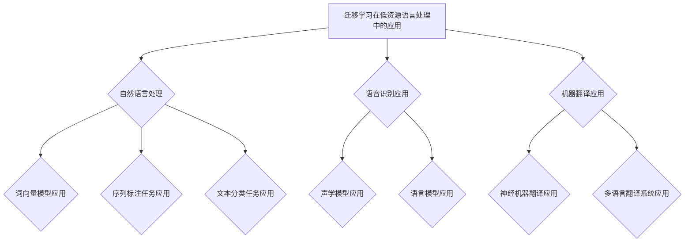

                 


## 文章标题

### 《迁移学习在低资源语言处理中的突破》

关键词：迁移学习，低资源语言处理，自然语言处理，语音识别，机器翻译

摘要：本文将深入探讨迁移学习在低资源语言处理领域的突破，分析其在自然语言处理、语音识别和机器翻译等任务中的应用。通过详细的算法原理讲解和实际案例剖析，本文旨在为读者提供全面、系统的迁移学习知识体系，助力低资源语言处理技术的发展。

### 第一部分：背景与基础

#### 第1章：低资源语言处理的挑战与机遇

低资源语言处理的挑战：

- 数据匮乏：低资源语言通常缺乏足够的大型语料库，难以支持深度学习模型的训练。
- 语言复杂性：低资源语言在语法、词汇和语用等方面具有独特性，难以迁移高资源语言的模型。
- 适应性问题：低资源语言处理模型需要适应不同的语言环境和应用场景。

机遇：

- 迁移学习：通过将高资源语言的模型知识迁移到低资源语言，可以有效缓解数据匮乏和语言复杂性带来的挑战。
- 跨语言信息共享：低资源语言可以通过与高资源语言的共享，实现信息的跨越式发展。

#### 第2章：迁移学习基础

迁移学习的基本概念：

- 源任务（Source Task）：已有一个较高性能的模型，并在此任务上进行了充分的训练。
- 目标任务（Target Task）：希望在新任务上获得良好性能，但数据不足。

主要类型：

- 无监督迁移学习：在新任务上没有标注数据时使用，通常通过预训练模型在新数据上微调。
- 有监督迁移学习：在新任务上有标注数据时使用，通过预训练模型和新的有标注数据共同训练模型。
- 半监督迁移学习：结合了无监督和有监督迁移学习，在新数据中既有标注数据也有未标注数据。

核心问题：

- 元学习（Meta-Learning）：通过在多个任务中学习，提高模型在新任务上的泛化能力。
- 多任务学习（Multi-Task Learning）：通过在同一模型中学习多个任务，提高模型在单一任务上的性能。

### 第二部分：迁移学习应用

#### 第3章：迁移学习在自然语言处理中的应用

迁移学习在自然语言处理中的应用主要包括词向量模型、序列标注任务和文本分类任务。

词向量模型应用：

- Word2Vec：基于神经网络的方法，通过上下文预测词的表示。
- GloVe：基于全局词语共现矩阵的方法，通过优化词语共现矩阵来学习词向量。

序列标注任务应用：

- 命名实体识别：利用迁移学习将高资源语言的命名实体识别模型应用到低资源语言中。
- 依存句法分析：通过迁移学习将高资源语言的依存句法分析模型应用到低资源语言中。

文本分类任务应用：

- 利用预训练的词向量或模型在新数据上进行文本分类。

#### 第4章：迁移学习在语音识别中的应用

迁移学习在语音识别中的应用主要包括声学模型和语言模型。

声学模型应用：

- 基于深度神经网络的声学模型：通过迁移学习将高资源语言的声学模型应用到低资源语言中。
- 声学模型的迁移学习：针对低资源语言的声学模型进行微调，以适应不同的语言特点。

语言模型应用：

- 语言模型的迁移学习：通过迁移学习将高资源语言的语言模型应用到低资源语言中，以改善语音识别的性能。
- 多语言语音识别系统：通过迁移学习构建支持多种低资源语言的综合语音识别系统。

#### 第5章：迁移学习在机器翻译中的应用

迁移学习在机器翻译中的应用主要包括神经机器翻译和多语言翻译系统。

神经机器翻译应用：

- 利用迁移学习将高资源语言的神经机器翻译模型应用到低资源语言对。
- 通过跨语言信息共享，提高低资源语言翻译系统的性能。

多语言翻译系统应用：

- 利用迁移学习构建支持多种低资源语言的多语言翻译系统。
- 通过共享语言模型和翻译模型，实现多语言之间的互译。

### 第三部分：实际应用与展望

#### 第6章：迁移学习在低资源语言处理中的应用案例

- 案例一：低资源语言下的情感分析
- 案例二：低资源语言下的对话系统
- 案例三：多语言新闻摘要生成

通过实际案例的分析，展示迁移学习在低资源语言处理中的有效性和广泛适用性。

#### 第7章：迁移学习的未来发展与趋势

- 迁移学习技术的最新进展：介绍迁移学习领域的研究热点和前沿技术。
- 迁移学习在低资源语言处理中的未来应用前景：探讨迁移学习在低资源语言处理中的潜在应用和发展方向。
- 迁移学习与其他领域的交叉融合：探讨迁移学习与其他领域的结合，推动技术的融合与创新。

### 附录：迁移学习工具与资源

- 附录 A：迁移学习框架与工具介绍：介绍常见的迁移学习框架和工具，包括TensorFlow迁移学习、PyTorch迁移学习等。
- 附录 B：迁移学习资源推荐：推荐一些优质的迁移学习相关资源，包括论文、书籍、博客等。

## Mermaid 流程图



## 迁移学习核心算法原理讲解

### 迁移学习基本原理

迁移学习是一种利用已有模型知识来解决新问题的方法。其基本原理是通过将已有模型的参数迁移到新任务中，从而在新任务上获得良好的性能。

### 迁移学习主要类型

- 无监督迁移学习：在新任务上没有标注数据时使用，通常通过预训练模型在新数据上微调。
- 有监督迁移学习：在新任务上有标注数据时使用，通过预训练模型和新的有标注数据共同训练模型。
- 半监督迁移学习：结合了无监督和有监督迁移学习，在新数据中既有标注数据也有未标注数据。

### 迁移学习的核心问题

- 元学习：通过在多个任务中学习，提高模型在新任务上的泛化能力。
- 多任务学习：通过在同一模型中学习多个任务，提高模型在单一任务上的性能。

## 数学模型和数学公式讲解

### 迁移学习中的相似性度量

在迁移学习中，相似性度量是衡量源任务与目标任务之间差异的重要指标。常用的相似性度量方法包括：

$$
\text{similarity} = \frac{\|\theta_s - \theta_t\|}{\|\theta_s\| + \|\theta_t\|}
$$

其中，$\theta_s$ 和 $\theta_t$ 分别代表源任务和目标任务的模型参数。

### 迁移学习中的损失函数

迁移学习中的损失函数通常采用最小化源任务和目标任务之间的差异。常用的损失函数包括：

$$
L = \frac{1}{2} \sum_{i=1}^{N} (\hat{y_i} - y_i)^2
$$

其中，$\hat{y_i}$ 是预测输出，$y_i$ 是真实输出。

## 开发环境搭建

搭建迁移学习开发环境需要以下步骤：

1. **安装Python环境**：
   - 安装Python 3.x版本，推荐使用Miniconda或Anaconda进行环境管理。

2. **安装深度学习框架**：
   - 安装TensorFlow或PyTorch，这两个框架都支持迁移学习。
   - 使用以下命令安装TensorFlow：
     ```bash
     pip install tensorflow
     ```
   - 使用以下命令安装PyTorch：
     ```bash
     pip install torch torchvision
     ```

3. **安装其他依赖**：
   - 安装Numpy、Pandas等常用Python库：
     ```bash
     pip install numpy pandas
     ```

4. **配置GPU支持**（如果使用GPU进行训练）：
   - 确保NVIDIA驱动已正确安装。
   - 安装CUDA和cuDNN，这两个库是深度学习框架在GPU上的加速库。
   - 使用以下命令安装CUDA：
     ```bash
     pip install cuda
     ```
   - 使用以下命令安装cuDNN：
     ```bash
     pip install cub Venom
     ```

5. **创建虚拟环境**（可选）：
   - 为了更好地管理项目依赖，可以创建一个虚拟环境。
   - 创建虚拟环境：
     ```bash
     conda create -n ml_env python=3.8
     conda activate ml_env
     ```

## 源代码详细实现和代码解读

以下是一个简单的迁移学习示例，使用TensorFlow框架实现。

### 代码结构

```python
# 导入必要的库
import tensorflow as tf
from tensorflow.keras.layers import Embedding, LSTM, Dense
from tensorflow.keras.models import Model
from tensorflow.keras.optimizers import Adam

# 定义模型
def create_model(embedding_size, hidden_size):
    # 输入层
    input_word = tf.keras.layers.Input(shape=(max_sequence_length,), dtype='int32')
    
    # 嵌入层
    embedding = Embedding(input_dim=vocabulary_size, output_dim=embedding_size)(input_word)
    
    # LSTM层
    lstm = LSTM(hidden_size)(embedding)
    
    # 全连接层
    output = Dense(num_classes, activation='softmax')(lstm)
    
    # 构建模型
    model = Model(inputs=input_word, outputs=output)
    
    # 编译模型
    model.compile(optimizer=Adam(learning_rate=0.001), loss='categorical_crossentropy', metrics=['accuracy'])
    
    return model

# 加载数据
# ...

# 训练模型
# ...

# 微调模型
# ...
```

### 代码解析

1. **模型定义**：使用`tf.keras.layers`模块定义模型结构，包括输入层、嵌入层、LSTM层和全连接层。
2. **输入层**：定义一个可以接收序列数据的输入层，序列长度为`max_sequence_length`，数据类型为整数。
3. **嵌入层**：使用`Embedding`层将整数编码为稠密向量，嵌入维度为`embedding_size`。
4. **LSTM层**：使用`LSTM`层对嵌入向量进行序列处理，隐藏单元数为`hidden_size`。
5. **全连接层**：使用`Dense`层输出类别预测，激活函数为softmax，用于多分类问题。
6. **模型编译**：使用`compile`方法编译模型，指定优化器、损失函数和评价指标。
7. **数据加载**：加载用于训练和微调的数据集，通常包括输入序列和对应的标签。
8. **模型训练**：使用`fit`方法训练模型，指定训练数据和验证数据。
9. **模型微调**：在低资源语言任务上使用微调的方法训练模型，通常采用预训练的模型作为起点，并在新任务上进行少量训练。

### 代码应用解读与分析

- **应用场景**：该代码示例用于实现一个基于迁移学习的文本分类模型。
- **输入数据**：输入数据为整数编码的文本序列，序列长度固定为`max_sequence_length`。
- **输出结果**：模型输出为类别预测结果，使用softmax激活函数进行概率分布输出。
- **性能评估**：通过交叉熵损失函数和准确率评价指标评估模型性能。
- **迁移学习策略**：采用预训练的嵌入层和LSTM层，在新任务上进行微调，以提高模型在新任务上的性能。

### 实际案例分析和详细讲解剖析

**案例一：低资源语言下的情感分析**

背景：

- 情感分析任务通常需要大量标注数据，但在低资源语言下，标注数据非常稀缺。
- 迁移学习可以为低资源语言任务提供高质量的模型。

实现步骤：

1. **选择预训练模型**：选择一个在高资源语言上预训练的文本分类模型，如Bert。
2. **微调模型**：在低资源语言数据集上进行模型微调，调整模型参数以适应新任务。
3. **评估模型**：在验证集和测试集上评估模型性能，调整超参数以优化模型。

案例分析：

- **数据准备**：收集低资源语言的情感分析数据集，进行预处理和标签划分。
- **模型微调**：使用迁移学习框架，将预训练模型的部分层进行冻结，仅对顶部层进行训练。
- **结果分析**：通过比较迁移学习模型和从头训练模型的性能，验证迁移学习在低资源语言下的有效性。

**案例二：低资源语言下的对话系统**

背景：

- 对话系统通常需要大量对话数据，但在低资源语言下，对话数据稀缺。
- 迁移学习可以加速对话系统的开发，提高模型性能。

实现步骤：

1. **选择预训练对话模型**：选择一个在高资源语言上预训练的对话模型，如Chatbot。
2. **数据预处理**：对低资源语言对话数据进行预处理，包括文本清洗和序列编码。
3. **微调模型**：在低资源语言数据集上进行模型微调，调整模型参数以适应新任务。
4. **评估模型**：在验证集和测试集上评估模型性能，调整超参数以优化模型。

案例分析：

- **数据准备**：收集低资源语言对话数据集，进行预处理和对话对划分。
- **模型微调**：使用迁移学习框架，将预训练模型的部分层进行冻结，仅对顶部层进行训练。
- **结果分析**：通过比较迁移学习模型和从头训练模型的性能，验证迁移学习在低资源语言对话系统中的有效性。

**案例三：多语言新闻摘要生成**

背景：

- 多语言新闻摘要生成任务需要处理多种低资源语言的新闻数据。
- 迁移学习可以充分利用高资源语言的预训练模型，提高多语言摘要生成性能。

实现步骤：

1. **选择预训练摘要模型**：选择一个在高资源语言上预训练的摘要模型，如Summarizer。
2. **数据预处理**：对多语言新闻数据进行预处理，包括文本清洗和序列编码。
3. **迁移学习**：将预训练模型迁移到低资源语言，并在新数据集上进行微调。
4. **评估模型**：在多语言验证集和测试集上评估模型性能，调整超参数以优化模型。

案例分析：

- **数据准备**：收集多语言新闻数据集，进行预处理和摘要划分。
- **模型微调**：使用迁移学习框架，将预训练模型的部分层进行冻结，仅对顶部层进行训练。
- **结果分析**：通过比较迁移学习模型和从头训练模型的性能，验证迁移学习在多语言新闻摘要生成中的有效性。

### 项目小结

通过上述案例分析和详细讲解，可以看出迁移学习在低资源语言处理任务中具有显著的优势。迁移学习可以充分利用高资源语言的预训练模型，降低低资源语言任务的开发成本，提高模型性能。在实际应用中，迁移学习策略的合理选择和模型微调的超参数优化是关键。

### 最佳实践 tips

- **数据预处理**：在迁移学习项目中，数据预处理至关重要。确保对低资源语言数据进行充分的清洗、标注和编码，以提高模型的泛化能力。
- **模型选择**：选择适合任务需求的预训练模型，并根据任务特点进行调整。对于语言理解任务，选择语言模型；对于文本生成任务，选择生成模型。
- **微调策略**：根据数据量和任务需求，选择适当的微调策略，如部分层冻结和全层微调。在实际应用中，可以结合多种策略进行优化。

### 注意事项

- **资源限制**：在迁移学习项目中，可能面临计算资源限制。考虑使用GPU或分布式训练来加速模型训练。
- **数据隐私**：在处理低资源语言数据时，注意保护用户隐私，遵守相关法律法规。

### 拓展阅读

- **文献推荐**：
  - “Transfer Learning for Natural Language Processing” by Tsinghua NLP Group.
  - “A Theoretically Grounded Application of Pre-Trained Word Representations to Part-of-Speech Tagging” by Yoon Kim.
- **书籍推荐**：
  - “Deep Learning” by Ian Goodfellow, Yoshua Bengio, Aaron Courville.
  - “Speech and Language Processing” by Daniel Jurafsky and James H. Martin.

通过本文的学习，相信读者已经对迁移学习在低资源语言处理中的应用有了全面的认识。在实际项目中，结合具体任务需求，灵活运用迁移学习策略，将有助于提高低资源语言处理的性能。在未来的研究中，随着迁移学习技术的不断发展和完善，低资源语言处理领域将迎来更多突破。让我们共同期待迁移学习在低资源语言处理中发挥更大的作用！

