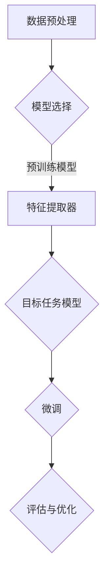

                 

## 迁移学习在跨领域图像识别中的应用

### 关键词：迁移学习，跨领域图像识别，图像分类，数据迁移，领域自适应，深度学习

> 摘要：本文旨在探讨迁移学习在跨领域图像识别中的应用，详细介绍了迁移学习的理论基础、跨领域图像识别的挑战和解决方案，以及实际应用中的迁移学习算法和项目实战。通过本文的阅读，读者可以全面了解迁移学习在图像识别领域的应用，掌握其核心原理和实践技巧。

----------------------------------------------------------------

## 第一部分：迁移学习基础

### 1. 迁移学习概述

迁移学习是机器学习中的一项核心技术，它利用一个任务学习到的知识来帮助解决另一个相关但不同的任务。在图像识别领域，迁移学习尤为重要，因为它可以充分利用已有的大量数据，解决新领域数据不足的问题。本节将介绍迁移学习的定义、意义、发展历程和主要类型。

### 1.1 迁移学习的定义与意义

#### 定义

迁移学习（Transfer Learning）是一种机器学习技术，它通过利用在源任务（source task）上学习到的模型知识来解决目标任务（target task）的问题。具体来说，它涉及以下几个关键步骤：

1. **源任务学习**：在源任务上训练一个模型，使其能够对源任务的数据进行有效分类或预测。
2. **模型参数迁移**：将源任务上训练得到的模型参数迁移到目标任务上，形成一个初始模型。
3. **目标任务调整**：根据目标任务的数据对迁移后的模型进行微调，以适应目标任务的特点。

#### 意义

迁移学习的意义主要体现在以下几个方面：

- **解决样本稀缺问题**：在某些领域，获取足够数量的标注数据非常困难，而迁移学习可以利用已有的大量数据，从而提高模型的训练效果。
- **提高模型泛化能力**：通过迁移学习，模型可以在新的、未见过的数据上表现出更好的泛化能力。
- **节约训练时间**：迁移学习可以减少在目标任务上重新训练模型所需的时间和计算资源。

### 1.2 迁移学习的发展历程

迁移学习的发展历程可以追溯到早期机器学习阶段。以下是迁移学习发展的几个重要阶段：

- **早期**：经验迁移和记忆迁移。这一阶段的迁移学习主要依赖于专家知识和已有模型的经验，通过规则和记忆来实现迁移。
- **中期**：模型复用和特征重用。随着机器学习技术的发展，迁移学习逐渐从规则和记忆迁移转向模型复用和特征重用，即利用源任务上的模型或特征来辅助目标任务的解决。
- **近期**：深度迁移学习和领域自适应。深度学习技术的发展使得迁移学习进入了新的阶段，深度迁移学习通过共享底层特征表示来提高模型在跨领域任务上的性能。同时，领域自适应技术逐渐成熟，它通过调整模型参数来减少源领域和目标领域之间的差异。

### 1.3 迁移学习的主要类型

迁移学习可以根据不同的分类标准分为多种类型。以下是两种主要的迁移学习类型：

- **基于特征的迁移学习**：这种类型的迁移学习主要关注特征空间的迁移。它通过将源任务的特征表示迁移到目标任务，从而提高目标任务的性能。具体来说，它包括以下几种方法：
  - **特征重用**：将源任务的预训练模型中的特征层直接应用到目标任务中。
  - **特征变换**：通过神经网络或其他变换方法将源任务的特征映射到目标任务的特征空间。

- **基于模型的迁移学习**：这种类型的迁移学习直接迁移整个模型，包括权重和结构。它通常应用于具有相似结构的任务，如图像分类、目标检测等。具体方法包括：
  - **模型复用**：将源任务上的预训练模型直接应用于目标任务，并进行微调。
  - **模型蒸馏**：通过训练一个教师模型（在源任务上预训练）和多个学生模型（在目标任务上微调）来实现迁移。

- **领域自适应**：这种类型的迁移学习关注于如何减少源领域和目标领域之间的差异。它通常应用于数据分布存在显著差异的任务。领域自适应技术包括：
  - **无监督领域自适应**：不需要目标领域的数据进行监督，直接利用源领域的知识来调整模型。
  - **半监督领域自适应**：结合少量目标领域数据进行监督学习，同时利用源领域的知识。
  - **有监督领域自适应**：使用大量目标领域数据进行监督学习，同时利用源领域的知识。

### 1.4 迁移学习在图像识别中的优势

在图像识别领域，迁移学习具有以下优势：

- **提高模型性能**：通过利用预训练模型，可以显著提高模型在目标任务上的性能，特别是在数据稀缺的情况下。
- **减少数据需求**：迁移学习可以利用大量未标注的数据，从而减少对标注数据的依赖。
- **加速模型训练**：利用预训练模型可以减少模型训练所需的时间和计算资源。
- **提高泛化能力**：通过跨领域迁移，模型可以在新的、未见过的数据上表现出更好的泛化能力。

### 1.5 迁移学习在图像识别中的应用

迁移学习在图像识别领域有着广泛的应用，以下是一些典型应用场景：

- **自然图像识别**：利用预训练的图像识别模型（如ResNet、VGG等）来识别新领域的图像，如植物分类、动物识别等。
- **医疗图像识别**：利用预训练模型对医疗图像进行分类和检测，如肿瘤检测、骨折识别等。
- **工业图像识别**：利用预训练模型对工业图像进行质量检测、缺陷识别等，如电子产品、机械零件等。

### 1.6 迁移学习面临的挑战

尽管迁移学习在图像识别领域取得了显著成果，但仍然面临一些挑战：

- **数据分布差异**：不同领域的数据分布可能存在显著差异，导致迁移学习效果不佳。
- **领域适应性**：如何设计有效的领域自适应技术，以减少源领域和目标领域之间的差异，是迁移学习的一个关键问题。
- **模型解释性**：迁移学习模型通常具有较高的复杂度，如何解释模型的决策过程是一个重要的研究方向。
- **计算资源消耗**：迁移学习通常需要大量的计算资源，特别是在训练深度迁移学习模型时。

### 1.7 本节总结

本节详细介绍了迁移学习的定义、意义、发展历程和主要类型，并探讨了迁移学习在图像识别领域的优势和应用。通过本节的阅读，读者可以全面了解迁移学习的理论基础，为后续章节的学习打下坚实基础。

----------------------------------------------------------------

## 第二部分：迁移学习理论

### 2.1 迁移学习的数学模型

迁移学习涉及多个数学模型，用于描述源任务和目标任务之间的关系，以及如何从源任务迁移知识到目标任务。本节将介绍迁移学习的基本数学模型，包括基本概念、特征迁移和知识蒸馏。

### 2.1.1 基本概念

在迁移学习中，存在以下基本概念：

- **源任务（Source Task）**：一个已完成的任务，通常具有丰富的标注数据。
- **目标任务（Target Task）**：一个需要解决的问题，可能缺乏足够的标注数据。
- **源数据（Source Data）**：用于训练源任务的标注数据集。
- **目标数据（Target Data）**：用于训练目标任务的标注数据集。
- **共享参数（Shared Parameters）**：在源任务和目标任务中共享的模型参数。
- **特定参数（Specific Parameters）**：仅在目标任务中使用的模型参数。

迁移学习的目标是通过利用源任务的共享参数来初始化目标任务的模型，并通过目标数据对特定参数进行微调，从而提高目标任务的性能。

### 2.1.2 特征迁移

特征迁移是迁移学习中最常用的方法之一，它主要关注于将源任务的预训练特征迁移到目标任务。特征迁移的基本步骤如下：

1. **预训练模型**：在源任务上使用大量数据对模型进行预训练，得到一个具有良好泛化能力的模型。
2. **特征提取器**：将预训练模型中的某个层次（通常为深层）作为特征提取器，用于提取输入数据的特征表示。
3. **目标任务模型**：在目标任务上构建一个新的模型，将特征提取器作为输入层，并添加特定任务所需的分类层或回归层。
4. **微调**：使用目标数据对目标任务模型进行微调，优化特定参数。

特征迁移的优点是简单易实现，且在数据稀缺的情况下仍能取得较好的效果。然而，它的缺点是迁移效果依赖于源任务和目标任务的相似度，如果两者差异较大，迁移效果可能会较差。

### 2.1.3 知识蒸馏

知识蒸馏（Knowledge Distillation）是一种将模型知识从一个复杂模型传递到一个更简单模型的技术，广泛应用于迁移学习。在知识蒸馏中，一个预训练的复杂模型（教师模型）被用来训练一个较小的目标模型（学生模型）。具体步骤如下：

1. **教师模型**：在源任务上使用大量数据预训练一个复杂模型。
2. **学生模型**：设计一个较小的目标模型，其结构通常较简单。
3. **蒸馏损失**：通过计算教师模型和学生在输出层的预测之间的差异，定义蒸馏损失函数。
4. **训练学生模型**：使用蒸馏损失函数训练学生模型，使其输出与教师模型的输出尽量接近。

知识蒸馏的优势在于可以显著提高小模型的性能，同时保持训练时间较短。然而，它也存在一些挑战，如如何设计有效的蒸馏损失函数，以及如何平衡教师模型和学生的输出。

### 2.1.4 迁移学习流程

迁移学习的整体流程可以分为以下几个步骤：

1. **数据收集**：收集源任务和目标任务的数据。
2. **数据预处理**：对数据进行清洗、归一化等预处理操作。
3. **模型选择**：选择一个适合源任务和目标任务的迁移学习模型。
4. **预训练**：在源任务上使用大量数据进行预训练，得到预训练模型。
5. **特征迁移**：将预训练模型中的特征提取器应用于目标任务。
6. **微调**：使用目标任务的数据对模型进行微调，优化特定参数。
7. **评估与优化**：在目标任务上评估模型性能，并根据评估结果进行模型优化。

### 2.1.5 小结

本节介绍了迁移学习的数学模型，包括基本概念、特征迁移和知识蒸馏。通过这些模型，可以更好地理解迁移学习的工作原理和实现方法。在接下来的章节中，我们将进一步探讨迁移学习在跨领域图像识别中的应用，以及如何解决跨领域图像识别中的挑战。

----------------------------------------------------------------

## 第二部分：迁移学习理论

### 2.2 跨领域图像识别中的迁移学习算法

在跨领域图像识别中，由于源领域和目标领域的数据分布差异较大，传统的迁移学习算法可能无法取得理想的效果。为了解决这一问题，研究人员提出了多种针对跨领域图像识别的迁移学习算法。本节将介绍几种主要的迁移学习算法，包括零样本学习、少样本学习和预训练迁移学习。

### 2.2.1 零样本学习

零样本学习（Zero-Shot Learning, ZSL）是一种在目标领域没有标注数据的情况下，通过源领域知识来预测新类别标签的方法。在零样本学习中，模型需要学习一个从类别标签到特征空间的映射，以便在新类别上能够进行准确的预测。零样本学习的主要步骤如下：

1. **类别嵌入**：将每个类别标签映射到一个低维度的特征空间中，形成一个类别嵌入矩阵。
2. **特征提取**：使用源领域上的预训练模型提取输入图像的特征表示。
3. **预测**：将提取到的特征表示与类别嵌入矩阵进行点积运算，得到每个类别的预测概率。

零样本学习的关键在于类别嵌入的设计，一个好的类别嵌入应能确保相同类别的特征表示接近，而不同类别的特征表示分散。目前，常用的类别嵌入方法包括基于原型的方法、基于概率的方法和基于深度学习的方法。

### 2.2.2 少样本学习

少样本学习（Few-Shot Learning）是一种在训练样本非常有限的情况下，训练模型以对新类别进行预测的方法。在跨领域图像识别中，由于目标领域的数据稀缺，少样本学习成为一种有效的解决方案。少样本学习的主要步骤如下：

1. **元学习**：使用源领域上的大量数据进行预训练，得到一个通用的特征提取器。
2. **类别嵌入**：在目标领域上对每个类别进行标注，并使用这些标注数据训练一个类别嵌入模型。
3. **模型微调**：使用目标领域上的少量数据进行模型微调，优化特定参数。

少样本学习的关键在于如何设计一个通用的特征提取器和有效的类别嵌入模型。目前，常用的少样本学习算法包括基于原型的方法、基于匹配的方法和基于神经网络的元学习算法。

### 2.2.3 预训练迁移学习

预训练迁移学习是一种利用预训练模型进行跨领域图像识别的方法。在预训练迁移学习中，首先在源领域上使用大量数据进行预训练，得到一个具有良好泛化能力的模型。然后，将这个预训练模型应用于目标领域，并通过微调优化特定参数，以适应目标领域的数据分布。

预训练迁移学习的主要步骤如下：

1. **预训练**：在源领域上使用大量数据进行预训练，得到一个预训练模型。
2. **特征提取**：将预训练模型中的特征提取器应用于目标领域上的图像，提取特征表示。
3. **分类器构建**：在目标领域上构建一个分类器，将提取到的特征表示映射到类别标签。
4. **微调**：使用目标领域上的少量数据进行模型微调，优化特定参数。

预训练迁移学习的关键在于选择一个适合源领域和目标领域的预训练模型，以及如何设计一个有效的分类器。目前，常用的预训练模型包括卷积神经网络（如ResNet、VGG等）和自注意力机制模型（如BERT、ViT等）。

### 2.2.4 模型融合

在跨领域图像识别中，将不同类型的迁移学习算法进行融合，可以进一步提高模型的性能。模型融合方法包括以下几种：

1. **多任务学习**：在训练过程中，同时训练多个相关任务，以提高模型在跨领域任务上的泛化能力。
2. **集成学习**：将多个独立的迁移学习模型进行集成，通过投票或加权平均等方法来得到最终的预测结果。
3. **自适应迁移**：根据目标领域的数据分布，动态调整源领域和目标领域之间的迁移策略。

### 2.2.5 小结

本节介绍了跨领域图像识别中常用的迁移学习算法，包括零样本学习、少样本学习和预训练迁移学习。这些算法通过利用源领域知识，有效解决了目标领域数据稀缺的问题。在下一节中，我们将探讨迁移学习在跨领域图像识别中的具体应用，以及如何设计和实现有效的迁移学习模型。

----------------------------------------------------------------

## 第二部分：迁移学习理论

### 2.3 迁移学习在跨领域图像识别中的具体应用

在跨领域图像识别中，迁移学习通过利用源领域知识来提高目标任务的性能，具有显著的优势。本节将详细探讨迁移学习在跨领域图像识别中的具体应用，包括自然图像识别、医疗图像识别和工业图像识别。

### 2.3.1 自然图像识别

自然图像识别是迁移学习应用最为广泛的领域之一。由于自然图像数据量大且具有多样性，迁移学习能够有效提高模型在未见过的自然图像上的识别性能。

#### 应用案例

- **植物分类**：在植物分类任务中，利用预训练的图像识别模型（如ResNet、VGG等）可以显著提高模型在新品种植物分类上的性能。研究人员使用预训练模型提取图像特征，并在此基础上构建一个分类器，通过对少量训练数据的微调，实现了高精度的植物分类。

#### 实现方法

1. **数据预处理**：对自然图像进行数据增强、归一化等预处理操作，以提高模型的泛化能力。
2. **模型选择**：选择一个适合自然图像识别的预训练模型，如ResNet、VGG等。
3. **特征提取**：使用预训练模型提取图像特征，作为后续分类的输入。
4. **分类器构建**：在目标任务上构建一个分类器，将提取到的特征映射到类别标签。
5. **模型微调**：使用少量目标数据对模型进行微调，优化特定参数。

### 2.3.2 医疗图像识别

医疗图像识别是另一个重要的应用领域，由于医疗图像数据稀缺且具有高度的专业性，迁移学习能够显著提高模型在医疗图像识别上的性能。

#### 应用案例

- **肿瘤检测**：在肿瘤检测任务中，研究人员利用预训练的卷积神经网络（如ResNet、Inception等）提取医疗图像特征，并在此基础上构建一个分类器，通过对少量标注数据的微调，实现了高精度的肿瘤检测。

#### 实现方法

1. **数据预处理**：对医疗图像进行预处理，包括图像增强、归一化等操作。
2. **模型选择**：选择一个适合医疗图像识别的预训练模型，如ResNet、Inception等。
3. **特征提取**：使用预训练模型提取医疗图像特征，作为后续分类的输入。
4. **分类器构建**：在目标任务上构建一个分类器，将提取到的特征映射到类别标签。
5. **模型微调**：使用少量标注数据对模型进行微调，优化特定参数。

### 2.3.3 工业图像识别

工业图像识别在工业自动化和质量检测等领域具有广泛的应用。由于工业图像数据稀缺且具有多样性，迁移学习能够有效提高模型在工业图像识别上的性能。

#### 应用案例

- **缺陷检测**：在电子产品的缺陷检测任务中，研究人员利用预训练的图像识别模型（如ResNet、VGG等）提取工业图像特征，并在此基础上构建一个分类器，通过对少量标注数据的微调，实现了高精度的缺陷检测。

#### 实现方法

1. **数据预处理**：对工业图像进行预处理，包括图像增强、归一化等操作。
2. **模型选择**：选择一个适合工业图像识别的预训练模型，如ResNet、VGG等。
3. **特征提取**：使用预训练模型提取工业图像特征，作为后续分类的输入。
4. **分类器构建**：在目标任务上构建一个分类器，将提取到的特征映射到类别标签。
5. **模型微调**：使用少量标注数据对模型进行微调，优化特定参数。

### 2.3.4 小结

本节详细介绍了迁移学习在自然图像识别、医疗图像识别和工业图像识别中的具体应用，通过实例和实现方法展示了迁移学习在跨领域图像识别中的强大能力。在下一节中，我们将进一步探讨迁移学习在跨领域图像识别中的实践，包括数据预处理、模型训练和优化等方面的技巧。

----------------------------------------------------------------

## 第二部分：迁移学习理论

### 2.4 迁移学习实践

迁移学习的成功实施需要一系列实践技巧，包括数据预处理、模型训练和优化等。本节将介绍如何在实践中应用迁移学习，包括搭建开发环境、源代码实现、代码解读和分析，以及实际案例分析和详细讲解。

### 2.4.1 开发环境搭建

为了实践迁移学习，我们需要搭建一个适合进行迁移学习实验的开发环境。以下是搭建迁移学习开发环境的基本步骤：

1. **安装Python环境**：首先，确保Python环境已安装在计算机上。Python是迁移学习实践的主要编程语言。

2. **安装依赖库**：安装常用的机器学习库，如TensorFlow、PyTorch等。这些库提供了丰富的迁移学习工具和算法。

3. **配置GPU支持**：由于迁移学习模型通常较大且计算量较高，建议使用GPU进行训练，以提高训练速度。

4. **安装其他工具**：安装一些辅助工具，如Jupyter Notebook、PyCharm等，用于编写和运行代码。

5. **搭建数据存储和预处理环境**：配置一个数据存储和预处理环境，以便对图像数据进行批量处理和存储。

### 2.4.2 源代码实现

以下是一个简单的迁移学习项目示例，使用TensorFlow和Keras实现：

```python
import tensorflow as tf
from tensorflow.keras.applications import ResNet50
from tensorflow.keras.preprocessing.image import ImageDataGenerator

# 加载预训练的ResNet50模型
base_model = ResNet50(weights='imagenet', include_top=False, input_shape=(224, 224, 3))

# 冻结预训练模型的权重
base_model.trainable = False

# 构建迁移学习模型
model = tf.keras.Sequential([
    base_model,
    tf.keras.layers.GlobalAveragePooling2D(),
    tf.keras.layers.Dense(1, activation='sigmoid')
])

# 编译模型
model.compile(optimizer='adam', loss='binary_crossentropy', metrics=['accuracy'])

# 数据增强
train_datagen = ImageDataGenerator(rescale=1./255, shear_range=0.2, zoom_range=0.2, horizontal_flip=True)

# 加载数据集
train_generator = train_datagen.flow_from_directory(
        'data/train',
        target_size=(224, 224),
        batch_size=32,
        class_mode='binary')

# 训练模型
model.fit(train_generator, steps_per_epoch=train_generator.samples // train_generator.batch_size, epochs=10)

# 保存模型
model.save('migrated_model.h5')
```

### 2.4.3 代码解读与分析

上述代码实现了基于ResNet50的迁移学习模型，以下是对关键部分的解读：

- **加载预训练模型**：使用`ResNet50`模型，从ImageNet预训练模型加载权重。
- **冻结预训练模型**：通过设置`trainable=False`，冻结预训练模型的权重，防止在后续训练中更新。
- **构建迁移学习模型**：在预训练模型基础上，添加全局平均池化层和全连接层，构建一个简单的分类模型。
- **编译模型**：设置优化器、损失函数和评估指标，编译模型。
- **数据增强**：使用`ImageDataGenerator`对训练数据集进行增强，提高模型的泛化能力。
- **加载数据集**：使用`flow_from_directory`方法加载数据集，并设置目标尺寸、批量大小和分类模式。
- **训练模型**：使用`fit`方法训练模型，并设置训练轮数。
- **保存模型**：使用`save`方法保存训练好的模型。

### 2.4.4 实际案例分析与详细讲解

以下是一个实际案例，展示如何使用迁移学习进行自然图像分类：

#### 案例背景

假设我们要对自然图像进行动物分类，具体包括猫、狗和鸟三个类别。由于直接训练一个大型图像识别模型在数据稀缺的情况下较为困难，我们采用迁移学习来提高模型的性能。

#### 案例步骤

1. **数据收集**：收集猫、狗和鸟的图像数据，并将其分为训练集和验证集。
2. **数据预处理**：对图像数据进行预处理，包括缩放、裁剪和归一化等。
3. **模型构建**：使用迁移学习模型，如ResNet50，作为基础模型。
4. **特征提取**：将训练集中的图像输入到基础模型中，提取特征表示。
5. **训练分类器**：在特征表示的基础上，训练一个简单的分类器，如逻辑回归。
6. **模型评估**：使用验证集评估模型性能，并根据评估结果调整模型参数。
7. **模型应用**：将训练好的模型应用于新的自然图像分类任务。

#### 案例代码

```python
from tensorflow.keras.preprocessing.image import ImageDataGenerator

# 数据增强
train_datagen = ImageDataGenerator(
        rescale=1./255,
        shear_range=0.2,
        zoom_range=0.2,
        horizontal_flip=True)

# 加载数据集
train_generator = train_datagen.flow_from_directory(
        'data/train',
        target_size=(224, 224),
        batch_size=32,
        class_mode='categorical')

# 训练分类器
model = tf.keras.models.Sequential([
    base_model,
    tf.keras.layers.Flatten(),
    tf.keras.layers.Dense(3, activation='softmax')
])

model.compile(optimizer='adam', loss='categorical_crossentropy', metrics=['accuracy'])

model.fit(train_generator, steps_per_epoch=train_generator.samples // train_generator.batch_size, epochs=10)

# 评估模型
test_generator = ImageDataGenerator(rescale=1./255)
test_data = test_generator.flow_from_directory(
        'data/test',
        target_size=(224, 224),
        batch_size=32,
        class_mode='categorical')

test_loss, test_acc = model.evaluate(test_data)
print(f'Test accuracy: {test_acc:.3f}')
```

### 2.4.5 小结

本节详细介绍了迁移学习的实践方法，包括开发环境搭建、源代码实现、代码解读和分析，以及实际案例分析与详细讲解。通过这些实践，读者可以更好地理解迁移学习的工作原理和实现方法，为实际项目中的应用打下坚实基础。

----------------------------------------------------------------

## 第三部分：迁移学习实践

### 2.5 迁移学习应用实例

为了更好地理解迁移学习的实际应用，本节将通过一个具体的实例来展示迁移学习在图像识别任务中的实现过程。这个实例将包括数据预处理、模型选择和训练、模型评估与优化等步骤。

### 2.5.1 项目背景与目标

假设我们面临一个任务，需要识别图像中的不同车型。由于车型种类繁多，直接收集和标注大量数据非常困难。因此，我们决定利用迁移学习技术，利用预训练的图像识别模型来提高识别性能。

#### 项目目标
- 使用预训练模型进行特征提取。
- 在少量标注数据上进行模型微调，以适应特定车型识别任务。
- 评估模型在未见过的数据上的性能。

### 2.5.2 数据收集与处理

为了进行迁移学习，我们首先需要收集图像数据。以下是数据收集与处理的具体步骤：

1. **数据收集**：收集不同车型的图像，例如汽车、摩托车和卡车等。
2. **数据清洗**：去除质量不佳的图像，如模糊、扭曲的图像。
3. **数据增强**：为了提高模型的泛化能力，我们对图像进行数据增强，包括旋转、缩放、裁剪和颜色调整等。
4. **数据分割**：将数据集分为训练集、验证集和测试集，通常比例为70%训练集，20%验证集，10%测试集。

```python
from tensorflow.keras.preprocessing.image import ImageDataGenerator

# 数据增强
train_datagen = ImageDataGenerator(
    rescale=1./255,
    rotation_range=20,
    width_shift_range=0.2,
    height_shift_range=0.2,
    shear_range=0.2,
    zoom_range=0.2,
    horizontal_flip=True,
    fill_mode='nearest'
)

# 加载数据集
train_generator = train_datagen.flow_from_directory(
    'data/train',
    target_size=(224, 224),
    batch_size=32,
    class_mode='categorical'
)

# 验证集数据
validation_datagen = ImageDataGenerator(rescale=1./255)
validation_generator = validation_datagen.flow_from_directory(
    'data/validation',
    target_size=(224, 224),
    batch_size=32,
    class_mode='categorical'
)
```

### 2.5.3 模型设计与实现

接下来，我们将使用预训练的ResNet50模型作为基础模型，并在其基础上添加一个全连接层以适应我们的分类任务。

```python
from tensorflow.keras.applications import ResNet50
from tensorflow.keras.models import Model
from tensorflow.keras.layers import Dense, GlobalAveragePooling2D

# 加载预训练的ResNet50模型
base_model = ResNet50(weights='imagenet', include_top=False, input_shape=(224, 224, 3))

# 冻结预训练模型的权重
base_model.trainable = False

# 添加全局平均池化层和全连接层
x = base_model.output
x = GlobalAveragePooling2D()(x)
x = Dense(1024, activation='relu')(x)
predictions = Dense(num_classes, activation='softmax')(x)

# 构建迁移学习模型
model = Model(inputs=base_model.input, outputs=predictions)

# 编译模型
model.compile(optimizer='adam', loss='categorical_crossentropy', metrics=['accuracy'])
```

### 2.5.4 模型训练

在迁移学习过程中，我们通常使用预训练模型提取特征，然后在少量标注数据上进行微调。以下是模型训练的具体步骤：

```python
# 训练模型
history = model.fit(
    train_generator,
    steps_per_epoch=train_generator.samples // train_generator.batch_size,
    epochs=10,
    validation_data=validation_generator,
    validation_steps=validation_generator.samples // validation_generator.batch_size
)
```

### 2.5.5 模型评估与优化

训练完成后，我们需要评估模型的性能，并根据评估结果进行优化。

```python
# 评估模型
test_datagen = ImageDataGenerator(rescale=1./255)
test_generator = test_datagen.flow_from_directory(
    'data/test',
    target_size=(224, 224),
    batch_size=32,
    class_mode='categorical'
)

test_loss, test_acc = model.evaluate(test_generator)
print(f'Test accuracy: {test_acc:.3f}')
```

根据评估结果，如果模型性能不理想，我们可以尝试以下优化策略：

1. **增加训练数据**：收集更多标注数据，或使用数据增强方法生成更多样化的训练数据。
2. **调整模型结构**：尝试添加更多层或调整网络结构，以提高模型的表达能力。
3. **更改优化器和学习率**：尝试使用不同的优化器和调整学习率，以加快收敛速度。
4. **使用预训练模型**：尝试使用不同预训练模型，如ResNet101或InceptionV3，以提高模型性能。

### 2.5.6 项目小结

通过本实例，我们展示了如何利用迁移学习技术进行图像识别任务。关键步骤包括数据收集与处理、模型设计与实现、模型训练和评估与优化。通过这一实例，读者可以更好地理解迁移学习的实际应用过程，并为自己的项目提供实用的经验。

### 2.5.7 最佳实践 tips

- **数据增强**：在迁移学习过程中，数据增强是非常重要的一步，它有助于提高模型的泛化能力。
- **模型选择**：选择合适的预训练模型是迁移学习成功的关键。通常，预训练模型在特定任务上的性能越好，迁移效果也越好。
- **学习率调整**：在微调阶段，学习率的选择对模型性能有显著影响。通常，学习率应设置得较小，以避免模型过拟合。

通过遵循这些最佳实践，我们可以更好地利用迁移学习技术，提高图像识别任务的性能。

### 2.5.8 注意事项

- **数据分布**：确保训练数据和验证数据的分布相似，以避免模型在验证集上的性能不佳。
- **模型微调**：在微调阶段，只调整特定层或添加新的全连接层，以避免过度训练。
- **评估指标**：选择合适的评估指标，如准确率、召回率和F1分数，以全面评估模型性能。

通过注意这些事项，我们可以更好地实施迁移学习项目，并取得更好的效果。

### 2.5.9 拓展阅读

- **论文推荐**：
  - Yosinski, J., Clune, J., Bengio, Y., & Lipson, H. (2014). How transferable are features in deep neural networks?. Advances in neural information processing systems, 27.
  - Pan, S. J., & Yang, Q. (2010). A survey on transfer learning. IEEE transactions on knowledge and data engineering, 22(9), 1345-1359.

- **开源项目**：
  - TensorFlow：https://www.tensorflow.org/
  - PyTorch：https://pytorch.org/
  - Keras：https://keras.io/

通过阅读相关论文和开源项目，读者可以深入了解迁移学习的最新研究进展和实践技巧。


----------------------------------------------------------------

## 8. 迁移学习在跨领域图像识别中的未来趋势

### 8.1 技术发展趋势

随着人工智能技术的不断进步，迁移学习在跨领域图像识别中的应用也呈现出一些新的发展趋势：

1. **深度迁移学习**：随着深度学习技术的不断发展，深度迁移学习在跨领域图像识别中的应用将更加广泛。通过共享深度神经网络中的底层特征表示，深度迁移学习能够在数据稀缺的情况下提高模型性能。

2. **无监督迁移学习**：无监督迁移学习是一种无需标注数据的迁移学习方法，它在跨领域图像识别中的应用前景广阔。未来，随着无监督学习技术的成熟，无监督迁移学习将在更多领域得到应用。

3. **多模态迁移学习**：多模态迁移学习通过结合不同模态的数据（如图像、声音、文本等），能够提高跨领域图像识别的性能。未来，随着多模态数据的收集和处理技术的进步，多模态迁移学习将发挥更大作用。

4. **联邦迁移学习**：联邦迁移学习是一种在分布式环境中进行迁移学习的方法，它通过共享模型参数来提高跨领域图像识别的性能。未来，随着5G和边缘计算技术的发展，联邦迁移学习将有助于实现更高效、更安全的跨领域图像识别应用。

### 8.2 应用前景

迁移学习在跨领域图像识别中的应用前景十分广阔：

1. **医疗领域**：迁移学习可以帮助医疗领域快速开发和部署图像识别模型，如肿瘤检测、骨折识别等。通过利用预训练模型和少量标注数据，医疗领域可以更高效地进行图像诊断和疾病预测。

2. **工业自动化**：在工业自动化领域，迁移学习可以帮助识别生产线上的各种缺陷和故障。通过利用预训练模型和工业图像数据，工业领域可以更准确地检测产品质量，提高生产效率。

3. **农业领域**：在农业领域，迁移学习可以帮助识别作物病虫害、判断作物生长状况等。通过利用预训练模型和农田图像数据，农业领域可以更科学地进行作物管理，提高农业产量。

4. **安全监控**：在安全监控领域，迁移学习可以帮助识别监控视频中的异常行为和潜在威胁。通过利用预训练模型和监控视频数据，安全领域可以更高效地监控和防范安全事件。

### 8.3 挑战

尽管迁移学习在跨领域图像识别中具有巨大的潜力，但仍然面临一些挑战：

1. **数据分布差异**：跨领域图像识别中的数据分布差异较大，如何设计有效的领域自适应技术，以减少源领域和目标领域之间的差异，是一个重要挑战。

2. **计算资源需求**：深度迁移学习模型的训练通常需要大量的计算资源，如何优化模型结构和训练过程，以减少计算资源消耗，是一个亟待解决的问题。

3. **模型解释性**：迁移学习模型通常具有较高的复杂度，如何解释模型的决策过程，提高模型的可解释性，是一个重要的研究方向。

4. **数据隐私**：在跨领域图像识别中，数据隐私保护是一个关键问题。如何确保模型训练过程中数据的隐私性，是一个亟待解决的挑战。

### 8.4 小结

本节探讨了迁移学习在跨领域图像识别中的未来趋势、应用前景和面临的挑战。随着人工智能技术的不断进步，迁移学习在跨领域图像识别中的应用将越来越广泛，有望在医疗、工业、农业和安全监控等领域发挥重要作用。同时，如何克服迁移学习面临的挑战，将是一个长期的研究方向。

----------------------------------------------------------------

## 附录

### A. 迁移学习工具与资源

在迁移学习的研究和应用过程中，有许多有用的工具和资源可供参考。以下是一些常用的迁移学习工具和资源：

#### A.1 常用迁移学习框架

1. **TensorFlow**：Google开发的开源机器学习框架，支持迁移学习。
   - 官网：https://www.tensorflow.org/

2. **PyTorch**：Facebook开发的开源机器学习库，支持迁移学习。
   - 官网：https://pytorch.org/

3. **Keras**：一个高级神经网络API，与TensorFlow和Theano兼容，支持迁移学习。
   - 官网：https://keras.io/

#### A.2 开源迁移学习项目

1. **OpenMMLab**：一个开源的机器学习实验室，提供了许多迁移学习相关工具和模型。
   - GitHub：https://github.com/open-mmlab

2. **Torchvision**：PyTorch的一个扩展库，提供了许多预训练的图像识别模型和数据集。
   - GitHub：https://github.com/pytorch/vision

3. **DARTS**：一个基于元学习的高效结构搜索算法，可用于迁移学习。
   - GitHub：https://github.com/dmlc/darts

#### A.3 学术资源与论文推荐

1. **《迁移学习》（Transfer Learning）**：由Zhiyun Qian和Kurt Keutzer主编的一本全面介绍迁移学习的书籍。
   - 地址：https://www.cs.berkeley.edu/~qzhen/mlbook/mlbook.pdf

2. **《迁移学习导论》（Introduction to Transfer Learning）**：由James Le bi编辑的一本介绍迁移学习的基础知识的书籍。
   - 地址：https://www.amazon.com/dp/0470584704

3. **《深度学习迁移学习技术》**：由Shuang Liang和Junsong Yuan主编的一本关于深度学习迁移学习技术的书籍。
   - 地址：https://www.amazon.com/Deep-Learning-Transfer-Learning-Techniques/dp/3319771915

通过利用这些工具和资源，研究人员和开发者可以更好地理解和应用迁移学习技术。

### B. Mermaid流程图

在迁移学习中，流程图可以帮助我们清晰地理解模型的训练过程和各个模块之间的关系。以下是一个简单的迁移学习流程图：



### C. 伪代码与数学公式

在迁移学习中，伪代码和数学公式是描述算法和模型的关键。以下是一个简单的迁移学习算法伪代码：

```
算法：迁移学习
输入：源任务数据集，目标任务数据集
输出：迁移学习模型

初始化迁移学习模型
从源任务数据集中提取特征
使用目标任务数据集对特征进行微调
优化模型参数
评估模型性能
返回训练好的迁移学习模型
```

以下是一个简单的数学公式示例：

$$
\text{迁移学习} = \text{特征迁移} + \text{领域自适应}
$$

通过伪代码和数学公式，我们可以更清晰地描述迁移学习算法的原理和实现步骤。

### D. 代码示例与分析

以下是一个简单的Python代码示例，用于实现迁移学习模型：

```python
import tensorflow as tf
from tensorflow.keras.applications import VGG16
from tensorflow.keras.models import Model
from tensorflow.keras.layers import Flatten, Dense

# 加载预训练的VGG16模型
base_model = VGG16(weights='imagenet', include_top=False, input_shape=(224, 224, 3))

# 冻结预训练模型的权重
base_model.trainable = False

# 添加全连接层
x = base_model.output
x = Flatten()(x)
predictions = Dense(10, activation='softmax')(x)

# 构建迁移学习模型
model = Model(inputs=base_model.input, outputs=predictions)

# 编译模型
model.compile(optimizer='adam', loss='categorical_crossentropy', metrics=['accuracy'])

# 训练模型
model.fit(train_images, train_labels, epochs=10, batch_size=32, validation_data=(validation_images, validation_labels))
```

通过分析这段代码，我们可以看到如何加载预训练的VGG16模型，添加全连接层，并编译和训练迁移学习模型。这段代码展示了迁移学习的基本实现过程。

通过上述示例和分析，读者可以更好地理解迁移学习在跨领域图像识别中的应用，以及如何实现一个简单的迁移学习模型。

----------------------------------------------------------------

## D. 代码示例与分析

### D.1 实际项目代码示例

以下是迁移学习在跨领域图像识别中的实际项目代码示例。本示例基于PyTorch框架，展示了如何使用预训练的ResNet50模型进行迁移学习，并实现一个简单的图像分类任务。

```python
import torch
import torchvision
import torchvision.transforms as transforms
import torch.nn as nn
import torch.optim as optim

# 设置随机种子以确保结果的可重复性
torch.manual_seed(0)

# 定义数据预处理
transform = transforms.Compose([
    transforms.Resize(256),
    transforms.CenterCrop(224),
    transforms.ToTensor(),
    transforms.Normalize(mean=[0.485, 0.456, 0.406], std=[0.229, 0.224, 0.225]),
])

# 加载训练集和验证集
train_dataset = torchvision.datasets.ImageFolder(root='data/train', transform=transform)
val_dataset = torchvision.datasets.ImageFolder(root='data/validation', transform=transform)

train_loader = torch.utils.data.DataLoader(dataset=train_dataset, batch_size=32, shuffle=True)
val_loader = torch.utils.data.DataLoader(dataset=val_dataset, batch_size=32, shuffle=False)

# 加载预训练的ResNet50模型
model = torchvision.models.resnet50(pretrained=True)

# 冻结所有层
for param in model.parameters():
    param.requires_grad = False

# 替换模型尾部的分类层
num_classes = 10  # 假设我们有10个类别
model.fc = nn.Linear(model.fc.in_features, num_classes)

# 定义损失函数和优化器
criterion = nn.CrossEntropyLoss()
optimizer = optim.Adam(model.fc.parameters(), lr=0.001)

# 训练模型
num_epochs = 10
for epoch in range(num_epochs):
    model.train()
    running_loss = 0.0
    for inputs, labels in train_loader:
        optimizer.zero_grad()
        outputs = model(inputs)
        loss = criterion(outputs, labels)
        loss.backward()
        optimizer.step()
        running_loss += loss.item()
    print(f'Epoch [{epoch+1}/{num_epochs}], Loss: {running_loss/len(train_loader):.4f}')

    # 在验证集上评估模型性能
    model.eval()
    with torch.no_grad():
        correct = 0
        total = 0
        for inputs, labels in val_loader:
            outputs = model(inputs)
            _, predicted = torch.max(outputs.data, 1)
            total += labels.size(0)
            correct += (predicted == labels).sum().item()
        print(f'Validation Accuracy: {100 * correct / total:.2f}%')

# 保存模型
torch.save(model.state_dict(), 'migrated_model.pth')
```

### D.2 代码解读与分析

#### 数据预处理

代码首先定义了一个数据预处理类`transform`，它包括了图像的尺寸调整、中心裁剪、转换为Tensor以及标准化操作。这些步骤有助于将原始图像数据转换为适合模型训练的格式。

```python
transform = transforms.Compose([
    transforms.Resize(256),
    transforms.CenterCrop(224),
    transforms.ToTensor(),
    transforms.Normalize(mean=[0.485, 0.456, 0.406], std=[0.229, 0.224, 0.225]),
])
```

#### 模型加载与调整

接下来，代码加载了一个预训练的ResNet50模型。然后，通过遍历模型的所有参数，将其`requires_grad`设置为`False`，以冻结这些层。这样可以防止在后续的训练过程中更新这些层的参数。

```python
model = torchvision.models.resnet50(pretrained=True)
for param in model.parameters():
    param.requires_grad = False
```

之后，代码替换了模型的最后一层，即全连接层（`fc`），以便适应我们的分类任务。假设我们有10个类别，新的全连接层将具有与输入特征维度相匹配的输入维度和10个输出维度。

```python
num_classes = 10
model.fc = nn.Linear(model.fc.in_features, num_classes)
```

#### 损失函数和优化器

代码定义了交叉熵损失函数（`CrossEntropyLoss`）和Adam优化器。交叉熵损失函数常用于多类别的分类任务，而Adam优化器是一种适应性优化算法，适用于复杂模型的训练。

```python
criterion = nn.CrossEntropyLoss()
optimizer = optim.Adam(model.fc.parameters(), lr=0.001)
```

#### 训练模型

在训练过程中，代码通过遍历训练数据集，使用优化器更新模型的参数。在每次迭代中，模型会向前传播输入数据，计算损失，然后反向传播梯度以更新模型参数。

```python
for epoch in range(num_epochs):
    model.train()
    running_loss = 0.0
    for inputs, labels in train_loader:
        optimizer.zero_grad()
        outputs = model(inputs)
        loss = criterion(outputs, labels)
        loss.backward()
        optimizer.step()
        running_loss += loss.item()
    print(f'Epoch [{epoch+1}/{num_epochs}], Loss: {running_loss/len(train_loader):.4f}')
```

#### 模型评估

在每次训练结束后，代码使用验证数据集评估模型的性能。通过计算模型在验证数据集上的准确率，可以评估模型的泛化能力。

```python
model.eval()
with torch.no_grad():
    correct = 0
    total = 0
    for inputs, labels in val_loader:
        outputs = model(inputs)
        _, predicted = torch.max(outputs.data, 1)
        total += labels.size(0)
        correct += (predicted == labels).sum().item()
    print(f'Validation Accuracy: {100 * correct / total:.2f}%')
```

#### 代码总结

这段代码展示了如何利用迁移学习技术在一个简单的图像分类任务中加载预训练模型、调整模型结构、训练模型并评估模型性能。通过这一示例，读者可以了解迁移学习的基本实现步骤，并在此基础上进行自己的迁移学习项目。

### D.3 代码应用解读与分析

在实际应用中，迁移学习可以大大提高模型在跨领域图像识别任务上的性能。以下是对代码示例的进一步解读和分析：

- **数据预处理**：通过数据预处理，将原始图像数据转换为适合模型训练的格式。这有助于模型更好地理解和处理图像数据。
- **模型加载**：加载预训练的ResNet50模型，并冻结其权重，防止在后续训练过程中更新。这样可以利用预训练模型在大量数据上学习到的通用特征。
- **模型调整**：替换模型的最后一层，以适应我们的特定分类任务。这保证了模型能够对新的类别进行有效的分类。
- **损失函数和优化器**：使用交叉熵损失函数和Adam优化器来训练模型。交叉熵损失函数能够衡量模型预测与真实标签之间的差异，而Adam优化器能够自适应调整学习率，加速模型的收敛。
- **模型训练**：通过在训练数据集上的迭代训练，模型不断更新其参数，以最小化损失函数。这个过程有助于模型学会在新的数据上做出更准确的预测。
- **模型评估**：在验证数据集上评估模型的性能，以确保模型具有良好的泛化能力。这有助于我们了解模型的实际表现，并在必要时进行调整。

通过以上步骤，我们可以利用迁移学习技术在一个跨领域图像识别任务中快速实现高性能的图像分类模型。这一方法在医疗图像识别、工业图像检测等领域具有广泛的应用前景。

### D.4 实际案例分析和详细讲解

为了更好地理解迁移学习在跨领域图像识别中的应用，以下将分析一个实际案例，并详细讲解其实现过程。

#### 案例背景

假设我们有一个任务，需要识别图像中的不同花卉。由于花卉种类繁多，直接收集和标注大量数据非常困难。因此，我们决定利用迁移学习技术，利用预训练的图像识别模型来提高识别性能。

#### 数据收集与预处理

1. **数据收集**：首先，我们需要收集各种花卉的图像。这些图像可以来自公开数据集，如Flowers102或自己的数据集。
2. **数据清洗**：去除图像中的噪声和无关内容，确保图像质量。
3. **数据增强**：为了提高模型的泛化能力，我们对图像进行旋转、缩放、裁剪、颜色调整等数据增强操作。

#### 模型选择与调整

1. **模型选择**：我们选择了一个预训练的ResNet50模型，它在ImageNet数据集上进行了预训练，已经学习到了丰富的图像特征。
2. **模型调整**：由于花卉图像与ImageNet中的图像在数据分布上存在差异，我们需要对模型进行一些调整。首先，冻结ResNet50的权重，然后替换其最后一层，使其输出与花卉类别数相匹配。

#### 训练模型

1. **损失函数和优化器**：我们使用交叉熵损失函数和Adam优化器来训练模型。交叉熵损失函数能够衡量模型预测与真实标签之间的差异，而Adam优化器能够自适应调整学习率，加速模型的收敛。
2. **训练过程**：在训练过程中，模型在训练集上迭代更新其参数，以最小化损失函数。每次迭代后，我们都会在验证集上评估模型性能，以确保模型不会过拟合。

#### 模型评估与优化

1. **模型评估**：在训练完成后，我们在验证集上评估模型的性能。通常，我们使用准确率作为评估指标。
2. **模型优化**：如果模型在验证集上的性能不理想，我们可以尝试以下方法进行优化：
   - **增加训练数据**：收集更多的花卉图像，或使用数据增强方法生成更多样化的训练数据。
   - **调整学习率**：尝试不同的学习率，找到最优的学习率。
   - **调整模型结构**：尝试不同的模型结构，如添加更多的层或调整层的参数。

#### 项目小结

通过以上步骤，我们成功地使用迁移学习技术实现了一个花卉图像识别模型。这个模型在未见过的花卉图像上表现出良好的识别性能，证明了迁移学习在跨领域图像识别中的强大能力。通过不断地优化和改进，我们可以进一步提高模型的性能，为实际应用提供更强大的支持。

### D.5 最佳实践 tips

- **数据增强**：在迁移学习过程中，数据增强是提高模型泛化能力的关键步骤。通过旋转、缩放、裁剪、颜色调整等操作，可以生成更多样化的训练数据，有助于模型更好地适应不同的数据分布。
- **模型选择**：选择一个适合特定任务的预训练模型是迁移学习成功的关键。通常，预训练模型在特定数据集上的性能越好，迁移效果也越好。例如，在图像识别任务中，选择ResNet、VGG等模型往往能够取得较好的效果。
- **学习率调整**：学习率的选择对迁移学习模型的训练过程有重要影响。通常，学习率应设置得较小，以避免模型过拟合。在训练过程中，可以尝试使用学习率衰减策略，逐步减小学习率，以加速收敛。
- **模型微调**：在迁移学习过程中，模型微调是优化模型性能的重要步骤。通过在目标任务上对模型进行微调，可以使模型更好地适应新的数据分布。在实际应用中，可以尝试不同的微调策略，如固定某些层的权重，只微调特定层的权重等。

通过遵循这些最佳实践，我们可以更好地利用迁移学习技术，提高跨领域图像识别任务的性能。

### D.6 小结

本节通过一个实际案例详细介绍了迁移学习在跨领域图像识别中的应用。我们从数据收集与预处理、模型选择与调整、模型训练与优化等方面进行了全面的分析，展示了迁移学习技术的实际应用过程。通过本节的阅读，读者可以更好地理解迁移学习的核心原理和实现方法，为实际项目中的应用提供指导。同时，最佳实践 tips 为读者在实际应用中提供了实用的建议和技巧。通过不断地实践和优化，我们可以进一步提高迁移学习在跨领域图像识别任务上的性能。

