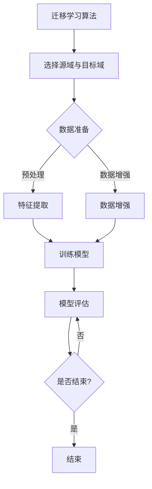
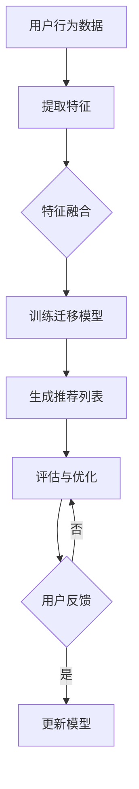

                 

### 迁移学习概述

#### 1.1 迁移学习的概念与重要性

迁移学习（Transfer Learning）是机器学习领域中的一个重要分支，它旨在利用已经在一个任务上训练好的模型或知识来提高另一个相关任务的表现。简而言之，迁移学习通过在源域（source domain）学习到的知识来改进目标域（target domain）的性能，而不需要从零开始训练模型。

迁移学习之所以重要，主要有以下几个原因：

1. **节省计算资源和时间**：在许多情况下，从头开始训练一个复杂的模型需要大量的数据和计算资源。而通过迁移学习，我们可以利用在源域上已经训练好的模型，从而大大减少训练所需的时间和资源。
2. **解决数据不足的问题**：在许多实际应用中，获取足够的标注数据是非常困难的。迁移学习通过利用预训练模型，可以在数据匮乏的情况下，仍然实现良好的模型性能。
3. **提升模型泛化能力**：迁移学习可以使得模型在未见过或新领域的数据上也能保持较高的表现，从而提高模型的泛化能力。

迁移学习不仅适用于传统的机器学习任务，如图像识别、自然语言处理等，还在推荐系统、语音识别、自动驾驶等领域中发挥着重要作用。

#### 1.2 迁移学习的基本原理

迁移学习的基本原理可以概括为以下几个方面：

1. **源域和目标域**：源域是指模型已经学习过的领域，而目标域是模型需要在新领域上表现良好的领域。源域和目标域之间可能存在一定的相似性，也可能存在较大的差异。
2. **模型共享与调整**：迁移学习通过在源域上训练好的模型（通常是大型预训练模型）的基础上，对目标域进行微调（fine-tuning）。这种共享和调整的方式使得模型可以在不同的领域中利用已有的知识。

#### 1.3 迁移学习的历史与发展

迁移学习的历史可以追溯到上世纪60年代。当时，心理学家发现儿童可以通过在一种语言中学习语法规则，来推断另一种语言的语法规则。这种发现启发了机器学习领域的研究者，开始探索如何在不同的任务之间迁移知识。

随着机器学习技术的不断发展，迁移学习也经历了几个重要阶段：

1. **早期研究**：上世纪80年代和90年代，研究者们开始探索如何通过在源域学习到的知识来改进目标域的性能。这一阶段的研究主要集中于规则迁移和参数迁移。
2. **深度学习时代**：随着深度学习技术的兴起，迁移学习也取得了显著进展。研究者们开始利用预训练的深度神经网络来迁移知识，这一方法在图像识别、自然语言处理等领域取得了巨大成功。
3. **当前趋势**：目前，迁移学习在跨领域、零样本学习、多任务学习等方面都有着广泛的研究和应用。同时，随着计算能力的提升和大数据技术的发展，迁移学习在未来仍将发挥重要作用。

#### 1.4 迁移学习与其他相关技术的比较

迁移学习与其他相关技术，如多任务学习、少样本学习和元学习等，存在一定的相似性，但也存在明显的区别：

1. **多任务学习**：多任务学习旨在同时学习多个相关的任务，通过在多个任务之间共享表示来提高模型的表现。与迁移学习相比，多任务学习通常需要在同一个数据集上训练多个任务，而迁移学习则是将知识从源域迁移到目标域。
2. **少样本学习**：少样本学习关注在样本数量有限的情况下，如何通过迁移学习来提高模型的表现。与迁移学习相比，少样本学习更加关注于如何有效地利用有限的样本数据。
3. **元学习**：元学习旨在通过学习如何学习来提高模型的表现。与迁移学习相比，元学习更加关注于如何优化学习过程，而迁移学习则更侧重于如何利用已有的知识来提高新任务的表现。

通过对比可以看出，迁移学习与其他技术既有交集，也存在独特的应用场景和优势。

### 迁移学习核心算法

#### 2.1 传统迁移学习方法

传统迁移学习方法主要包括数据增强、零样本学习和多任务学习等，这些方法在不同程度上通过迁移知识来提升模型在目标域的表现。

##### 2.1.1 数据增强

数据增强是一种简单而有效的迁移学习方法，通过在训练数据中添加虚拟样本，来扩充训练集，从而改善模型在目标域上的表现。数据增强的方法包括图像变换、数据拼接、噪声注入等。

**图像变换**：通过旋转、翻转、缩放等操作，生成新的图像样本。这种方法可以增加模型的鲁棒性，使其在面临不同视角或姿态的图像时，仍能保持良好的表现。

**数据拼接**：将两个或多个图像拼接在一起，生成新的图像样本。这种方法可以增加数据的多样性，使模型能够更好地泛化到不同的场景。

**噪声注入**：在训练数据中添加噪声，如高斯噪声、椒盐噪声等，以增加数据的复杂性。这种方法可以提高模型的泛化能力，使其在面临噪声干扰时，仍能保持良好的性能。

以下是一个数据增强算法的伪代码：

```python
function data_augmentation(image):
    # 旋转图像
    rotated_image = rotate(image, angle)
    
    # 翻转图像
    flipped_image = flip(image, axis=1)
    
    # 缩放图像
    scaled_image = scale(image, factor)
    
    # 添加高斯噪声
    noised_image = add_gaussian_noise(image, mean, std)
    
    # 数据拼接
    combined_image = concatenate([image, rotated_image, flipped_image, scaled_image, noised_image])
    
    return combined_image
```

##### 2.1.2 零样本学习

零样本学习（Zero-Shot Learning）是一种在训练阶段没有直接目标类别标签的迁移学习方法。其主要目标是在未见过的类别上，利用已学习的知识来预测新类别的标签。

零样本学习的关键在于类别的表示学习。一种常见的方法是使用原型网络（Prototypical Network），该方法通过将类别表示为原型来学习类别的嵌入。

以下是一个原型网络算法的伪代码：

```python
function prototype_network(train_data, support_set, query_set):
    # 训练支持集
    support_embeddings = embed(train_data, support_set)
    
    # 计算类别原型
    prototypes = average(support_embeddings, axis=1)
    
    # 计算查询集的嵌入
    query_embeddings = embed(train_data, query_set)
    
    # 计算原型与查询嵌入的距离
    distances = euclidean_distance(prototypes, query_embeddings)
    
    # 预测查询集的类别
    predicted_labels = argmin(distances)
    
    return predicted_labels
```

##### 2.1.3 多任务学习

多任务学习（Multi-Task Learning）是一种通过同时学习多个相关任务来提高模型表现的方法。多任务学习通过在任务之间共享表示，使得模型能够利用一个任务的知识来提高其他任务的表现。

多任务学习的关键在于如何设计共享的表示空间。一种常见的方法是使用共享的网络层，即多个任务共享部分网络结构。以下是一个多任务学习算法的伪代码：

```python
function multi_task_learning(train_data, task1_labels, task2_labels):
    # 训练共享的网络层
    shared_embeddings = shared_network_layer(train_data)
    
    # 训练任务1的特定网络层
    task1_embeddings = task1_network_layer(shared_embeddings)
    
    # 训练任务2的特定网络层
    task2_embeddings = task2_network_layer(shared_embeddings)
    
    # 预测任务1的标签
    predicted_task1_labels = predict(task1_embeddings, task1_labels)
    
    # 预测任务2的标签
    predicted_task2_labels = predict(task2_embeddings, task2_labels)
    
    return predicted_task1_labels, predicted_task2_labels
```

#### 2.2 深度迁移学习方法

随着深度学习技术的发展，深度迁移学习方法在迁移学习中占据了重要地位。深度迁移学习方法包括预训练与微调、自监督学习和图神经网络等。

##### 2.2.1 预训练与微调

预训练与微调（Pre-training and Fine-tuning）是目前应用最广泛的深度迁移学习方法。预训练阶段使用大量的无标签数据来训练一个大型的基础模型，使其在源域上达到较高的性能。然后，在微调阶段，使用少量的有标签数据对基础模型进行微调，以适应目标域。

预训练与微调的关键在于如何选择合适的预训练模型和数据集，以及如何设计微调策略。以下是一个预训练与微调算法的伪代码：

```python
function pretrain_and_finetune(base_model, pretrain_data, finetune_data):
    # 预训练基础模型
    pretrain_embeddings = pretrain_model(base_model, pretrain_data)
    
    # 微调基础模型
    finetune_embeddings = finetune_model(pretrain_embeddings, finetune_data)
    
    return finetune_embeddings
```

##### 2.2.2 自监督学习

自监督学习（Self-Supervised Learning）是一种无需标签数据的迁移学习方法。自监督学习通过设计无监督任务，如图像分类、语言建模等，来自动地从数据中学习有用的特征表示。

自监督学习的核心在于如何设计有效的无监督任务和损失函数。以下是一个自监督学习算法的伪代码：

```python
function self_supervised_learning(data):
    # 设计无监督任务，如图像分类
    labels = generate_labels(data)
    
    # 训练模型
    embeddings = train_model(data, labels)
    
    return embeddings
```

##### 2.2.3 图神经网络

图神经网络（Graph Neural Networks，GNN）是一种在图结构数据上学习的深度学习模型。GNN通过利用图结构中的邻接关系，来学习节点或边的特征表示。

GNN在迁移学习中有着广泛的应用，如节点分类、链接预测等。以下是一个图神经网络算法的伪代码：

```python
function graph_neural_network(graph, embedding_size):
    # 初始化模型的嵌入层
    embeddings = initialize_embeddings(graph, embedding_size)
    
    # 遍历图中的每个节点
    for node in graph.nodes:
        # 计算节点的邻居嵌入
        neighbor_embeddings = aggregate_neighbors_embeddings(node, graph)
        
        # 计算节点的嵌入
        node_embedding = aggregate_node_and_neighbor_embeddings(node, neighbor_embeddings)
        
        # 更新节点的嵌入
        embeddings[node] = node_embedding
    
    return embeddings
```

通过以上对传统迁移学习方法和深度迁移学习方法的详细阐述，我们可以看到迁移学习在解决不同类型问题上的广泛应用和强大能力。随着技术的不断进步，迁移学习在未来将继续为机器学习领域带来更多的创新和发展。

### 迁移学习在推荐系统中的应用

推荐系统是现代信息社会中不可或缺的一部分，它通过预测用户对物品的偏好，向用户推荐他们可能感兴趣的物品。然而，在传统的推荐系统中，模型往往需要依赖大量用户-物品交互数据，这在某些情况下并不现实。迁移学习作为一种有效的技术，通过将知识从源域迁移到目标域，为跨领域推荐系统提供了新的思路和方法。

#### 3.1 推荐系统的基本原理

推荐系统的核心在于利用用户的历史行为数据（如浏览记录、购买记录、评分等）来预测用户对未知物品的偏好。传统推荐系统通常采用基于内容、协同过滤和混合推荐等方法。

- **基于内容的推荐**：通过分析物品和用户的历史行为，提取它们的特征，并利用这些特征来计算相似度，从而推荐相似的物品给用户。
- **协同过滤**：通过分析用户之间的交互行为，找到相似用户或物品，并将这些用户或物品推荐给目标用户。
- **混合推荐**：结合基于内容和协同过滤的方法，以综合利用不同方法的优点。

#### 3.2 迁移学习在推荐系统中的作用

迁移学习在推荐系统中的应用主要体现在以下几个方面：

1. **跨领域推荐**：在现实场景中，用户的行为数据往往是有限的，且不同领域的用户行为数据存在较大差异。迁移学习可以将知识从用户行为数据较多的领域迁移到用户行为数据较少的领域，从而提高推荐系统的泛化能力。

2. **数据不足**：在许多推荐任务中，获取足够的有标签数据是非常困难的。迁移学习可以利用在源域上已经训练好的模型，利用少量的目标域数据来微调模型，从而提高推荐效果。

3. **降低冷启动问题**：冷启动问题是指新用户或新物品进入推荐系统时，由于缺乏足够的行为数据，导致推荐系统无法为这些新实体提供有效的推荐。迁移学习可以通过利用已有的知识，快速地为新用户或新物品提供初步的推荐。

4. **提高推荐质量**：迁移学习可以通过在源域上学习到的通用特征，提高模型对目标域数据的理解能力，从而提高推荐系统的准确性和质量。

#### 3.3 迁移学习在推荐系统中的挑战

尽管迁移学习在推荐系统中有广泛的应用前景，但其在实际应用中也面临一些挑战：

1. **领域差异**：不同领域的用户行为数据存在较大的差异，如何有效地在跨领域间迁移知识是一个重要的挑战。

2. **数据不一致性**：在实际应用中，不同领域的数据集可能存在数据不一致性问题，如数据分布、特征类型等。这给迁移学习模型的训练和优化带来了困难。

3. **模型适应性**：迁移学习模型需要在不同的领域和数据集上表现出良好的适应性。如何设计具有高适应性的迁移学习模型是一个关键问题。

4. **计算资源**：迁移学习通常需要大量的计算资源，特别是在深度迁移学习方法中。如何在有限计算资源下，实现高效的迁移学习是一个重要的考虑因素。

#### 3.4 迁移学习在推荐系统中的案例分析

以下是一些迁移学习在推荐系统中的实际应用案例：

1. **电商平台的商品推荐**：电商平台可以利用用户在某一领域的购买行为数据，通过迁移学习来预测用户在其他领域（如服装、电子产品等）的购买偏好。

2. **社交媒体的内容推荐**：社交媒体平台可以通过迁移学习，将用户在某一领域（如新闻、视频）的浏览偏好迁移到其他领域（如社交动态、广告推荐）。

3. **音乐平台的歌曲推荐**：音乐平台可以利用用户在某一类型音乐的喜好，通过迁移学习来推荐用户可能感兴趣的其他类型音乐。

通过这些案例分析，我们可以看到迁移学习在推荐系统中的应用不仅能够提高推荐质量，还能够解决传统推荐系统中的一些关键问题。随着技术的不断进步，迁移学习在推荐系统中的应用将更加广泛和深入。

### 跨领域推荐系统的概念与挑战

#### 4.1 跨领域推荐系统的定义

跨领域推荐系统（Cross-Domain Recommendation System）是指在不同的领域或场景之间进行推荐的系统。这些领域或场景可能存在明显的差异，如商品推荐、新闻推荐、音乐推荐等。跨领域推荐系统的核心目标是通过整合不同领域的用户行为数据和物品特征，为用户提供个性化的推荐服务。

跨领域推荐系统的特点包括：

1. **异质性**：不同领域的用户行为数据和物品特征具有不同的分布和结构，导致异质性。
2. **多样性**：用户可能对多个领域的物品都有兴趣，推荐系统需要提供多样化的推荐。
3. **动态性**：用户兴趣和物品特性会随着时间和环境的变化而变化，推荐系统需要具备动态调整能力。

#### 4.2 跨领域推荐系统的挑战

尽管跨领域推荐系统具有广泛的应用前景，但其在实际应用中面临诸多挑战：

1. **领域差异**：不同领域的用户行为数据和物品特征差异巨大，导致模型在跨领域迁移时难以适应。如何有效地处理领域差异是一个重要问题。
2. **数据不一致性**：跨领域数据集可能存在数据不一致性问题，如数据分布、特征类型等。这给模型训练和优化带来了挑战。
3. **泛化能力**：跨领域推荐系统需要具备良好的泛化能力，以适应未知领域的数据。然而，现有模型在跨领域泛化方面表现不佳。
4. **冷启动问题**：新用户或新物品在进入推荐系统时，由于缺乏足够的行为数据，导致推荐效果不佳。如何解决冷启动问题是跨领域推荐系统的一个关键挑战。

#### 4.3 跨领域推荐系统的重要性

跨领域推荐系统在多个领域具有重要意义：

1. **个性化推荐**：通过整合不同领域的用户行为数据，推荐系统可以提供更个性化的推荐，提高用户体验。
2. **资源优化**：利用跨领域数据可以减少对单一领域数据的依赖，优化数据资源的使用。
3. **业务拓展**：跨领域推荐系统可以帮助企业探索新的市场机会，实现业务的多元化发展。
4. **技术创新**：跨领域推荐系统推动了机器学习、深度学习等技术在推荐系统中的应用和发展。

综上所述，跨领域推荐系统在解决领域差异、数据不一致性和冷启动问题等方面具有重要意义，是推荐系统未来发展的重要方向。

### 跨领域迁移学习的算法与策略

#### 5.1 跨领域迁移学习的分类方法

跨领域迁移学习可以分为基于相似度和基于模型的方法。这些方法在不同程度上利用源域和目标域之间的相似性，以提高模型在目标域上的表现。

##### 5.1.1 基于相似度的迁移学习

基于相似度的迁移学习通过度量源域和目标域之间的相似性，选择与目标域最相似的源域数据进行迁移。这种方法的核心在于相似性度量，常用的相似性度量方法包括余弦相似度、欧几里得距离和马氏距离等。

**余弦相似度**：余弦相似度通过计算两个向量之间的夹角余弦值来衡量相似性。计算公式如下：

$$
\cos(\theta) = \frac{\sum_{i=1}^{n} x_i \cdot y_i}{\sqrt{\sum_{i=1}^{n} x_i^2} \cdot \sqrt{\sum_{i=1}^{n} y_i^2}}
$$

其中，$x_i$ 和 $y_i$ 分别为源域和目标域的向量分量，$n$ 为向量维度。

**欧几里得距离**：欧几里得距离是空间中两点间的距离，计算公式如下：

$$
d(\mathbf{x}, \mathbf{y}) = \sqrt{\sum_{i=1}^{n} (x_i - y_i)^2}
$$

其中，$\mathbf{x}$ 和 $\mathbf{y}$ 分别为源域和目标域的向量。

**马氏距离**：马氏距离考虑了数据之间的协方差关系，计算公式如下：

$$
d(\mathbf{x}, \mathbf{y}) = \sqrt{(\mathbf{x} - \mathbf{\mu}_x) \cdot (\mathbf{y} - \mathbf{\mu}_y)}
$$

其中，$\mathbf{\mu}_x$ 和 $\mathbf{\mu}_y$ 分别为源域和目标域的均值向量。

基于相似度的迁移学习算法伪代码：

```python
function similarity_based_transfer_learning(source_data, target_data):
    # 计算源域和目标域的相似度矩阵
    similarity_matrix = calculate_similarity(source_data, target_data)
    
    # 选择与目标域最相似的源域数据进行迁移
    similar_source_data = select_similar_source_data(similarity_matrix, target_data)
    
    # 训练迁移模型
    model = train_model(similar_source_data, target_data)
    
    return model
```

##### 5.1.2 基于模型的迁移学习

基于模型的迁移学习通过在源域上训练一个通用模型，然后在目标域上利用该模型进行预测。这种方法的核心是构建一个能够适应不同领域的通用模型。

**模型共享**：模型共享是通过在源域和目标域之间共享部分网络结构，来提高模型的泛化能力。例如，在深度学习模型中，可以通过共享卷积层或全连接层来构建模型共享。

**模型蒸馏**：模型蒸馏（Model Distillation）是一种通过将一个大型模型（教师模型）的知识传递给一个较小模型（学生模型）的方法。在跨领域迁移学习中，可以通过模型蒸馏来传递源域的模型知识到目标域。

**多任务学习**：多任务学习通过同时训练多个相关任务，共享任务之间的知识，以提高模型在单个任务上的表现。在跨领域迁移学习中，可以通过多任务学习来利用不同领域之间的相关性。

基于模型的迁移学习算法伪代码：

```python
function model_based_transfer_learning(source_model, target_data):
    # 蒸馏源域模型知识到目标域模型
    target_model = distill_knowledge(source_model, target_data)
    
    # 微调目标域模型
    target_model = fine_tune(target_model, target_data)
    
    return target_model
```

通过以上对基于相似度和基于模型的跨领域迁移学习方法的详细介绍，我们可以看到这两种方法各有优缺点。基于相似度方法简单易行，但在处理复杂领域差异时效果不佳；基于模型方法能够处理复杂的领域差异，但需要更多的计算资源和模型设计。在实际应用中，可以根据具体问题和数据情况选择合适的方法。

#### 5.2 跨领域迁移学习的优化策略

为了提高跨领域迁移学习的性能，研究者们提出了一系列优化策略。以下是一些常见的优化策略：

##### 5.2.1 适应性和可扩展性

跨领域迁移学习的一个关键挑战是如何适应不同的领域和数据集。为了提高模型的适应性，可以采取以下策略：

1. **领域自适应（Domain Adaptation）**：领域自适应旨在减少源域和目标域之间的差异。一种常见的方法是利用领域无关的特征来表示数据，从而减少领域差异。例如，可以通过无监督的方法提取通用特征，使得模型在目标域上能够更好地泛化。

2. **模型自适应（Model Adaptation）**：模型自适应是指通过调整模型结构或参数来适应不同的领域。例如，可以通过自适应的网络结构或参数调整，使模型在不同领域中都能保持良好的性能。

3. **元学习（Meta-Learning）**：元学习通过学习如何学习来提高模型在未知领域的适应能力。元学习算法可以在有限的训练数据下快速适应新领域，从而提高模型的泛化能力。

##### 5.2.2 跨领域数据一致性

跨领域数据一致性是跨领域迁移学习中的重要问题。不同领域的数据集可能存在数据分布、特征类型等方面的不一致性，这会影响模型的表现。为了提高数据一致性，可以采取以下策略：

1. **数据预处理**：通过数据预处理，如去噪、归一化等，来减少数据集之间的不一致性。

2. **特征转换**：通过特征转换，如主成分分析（PCA）、t-SNE等，将不同领域的数据映射到共同的特征空间中，以提高数据一致性。

3. **数据增强**：通过数据增强，如图像旋转、缩放、噪声注入等，来增加数据的多样性，从而提高模型对领域差异的鲁棒性。

##### 5.2.3 跨领域模型融合

跨领域模型融合是将多个迁移学习模型结合起来，以提高推荐系统的性能。以下是一些常见的模型融合方法：

1. **加权平均**：通过计算每个模型的权重，将多个模型的结果进行加权平均，得到最终的推荐结果。

2. **投票法**：每个模型对推荐结果进行投票，选择投票结果最多的选项作为最终推荐。

3. **集成学习**：使用集成学习方法，如随机森林、梯度提升树等，将多个迁移学习模型融合为一个更大的模型。

4. **深度学习中的融合**：在深度学习模型中，可以通过共享网络层或全连接层来实现跨领域模型的融合。

以下是一个跨领域模型融合的算法伪代码：

```python
function model_fusion(model1, model2, data):
    # 预测每个模型的结果
    prediction1 = model1.predict(data)
    prediction2 = model2.predict(data)
    
    # 计算每个模型的权重
    weight1 = calculate_weight(model1)
    weight2 = calculate_weight(model2)
    
    # 加权平均预测结果
    fused_prediction = (weight1 * prediction1 + weight2 * prediction2) / (weight1 + weight2)
    
    return fused_prediction
```

通过以上优化策略，可以显著提高跨领域迁移学习的性能。在实际应用中，可以根据具体问题场景和数据集特点，灵活选择和组合这些策略。

### 跨领域推荐系统的迁移学习应用

#### 6.1 跨领域新闻推荐

跨领域新闻推荐是指在不同新闻领域之间为用户推荐新闻内容，如从体育新闻推荐到娱乐新闻。在新闻推荐系统中，迁移学习可以通过以下几种方法来提高推荐质量：

1. **基于内容的方法**：
   - **模型迁移**：使用在某一领域（如政治新闻）训练好的模型，迁移到其他领域（如体育新闻）进行推荐。通过调整模型参数，使其适应不同领域的新闻特征。
   - **特征迁移**：提取通用特征，如文本中的实体、关键词等，用于跨领域推荐。这些通用特征可以减少不同领域之间的差异，提高推荐精度。

2. **基于协同过滤的方法**：
   - **矩阵分解**：通过矩阵分解方法，将用户-新闻交互矩阵分解为用户特征矩阵和新闻特征矩阵。迁移学习可以将源领域的用户特征矩阵和新闻特征矩阵迁移到目标领域，从而提高推荐质量。
   - **协同过滤融合**：结合不同领域的协同过滤模型，通过融合源域和目标域的推荐结果，提高跨领域推荐系统的性能。

3. **案例**：
   - **案例一**：某新闻推荐系统将政治新闻领域的模型迁移到娱乐新闻领域。通过调整模型参数和特征提取方法，成功提高了娱乐新闻的推荐精度。
   - **案例二**：另一新闻推荐系统使用矩阵分解方法，将政治新闻和娱乐新闻的用户-新闻交互矩阵进行分解，融合两种领域的推荐结果，提高了整体推荐质量。

#### 6.2 跨领域商品推荐

跨领域商品推荐是指在不同商品领域之间为用户推荐商品，如从电子产品推荐到服装。在电商推荐系统中，迁移学习可以通过以下方法提高推荐质量：

1. **基于内容的方法**：
   - **模型迁移**：将某一领域（如电子产品）训练好的商品推荐模型迁移到其他领域（如服装）。通过调整模型参数和特征提取方法，使其适应不同领域的商品特征。
   - **特征迁移**：提取通用特征，如商品的品牌、价格、类别等，用于跨领域商品推荐。这些通用特征可以减少不同领域之间的差异，提高推荐精度。

2. **基于协同过滤的方法**：
   - **矩阵分解**：通过矩阵分解方法，将用户-商品交互矩阵分解为用户特征矩阵和商品特征矩阵。迁移学习可以将源领域的用户特征矩阵和商品特征矩阵迁移到目标领域，从而提高推荐质量。
   - **协同过滤融合**：结合不同领域的协同过滤模型，通过融合源域和目标域的推荐结果，提高跨领域商品推荐系统的性能。

3. **案例**：
   - **案例一**：某电商平台将电子产品领域的模型迁移到服装领域。通过调整模型参数和特征提取方法，成功提高了服装商品的推荐精度。
   - **案例二**：另一电商平台使用矩阵分解方法，将电子产品和服装的用户-商品交互矩阵进行分解，融合两种领域的推荐结果，提高了整体推荐质量。

#### 6.3 跨领域音乐推荐

跨领域音乐推荐是指在不同音乐风格之间为用户推荐音乐，如从流行音乐推荐到古典音乐。在音乐推荐系统中，迁移学习可以通过以下方法提高推荐质量：

1. **基于内容的方法**：
   - **模型迁移**：将某一音乐风格（如流行音乐）训练好的音乐推荐模型迁移到其他音乐风格（如古典音乐）。通过调整模型参数和特征提取方法，使其适应不同音乐风格的特性。
   - **特征迁移**：提取通用特征，如音乐的节奏、旋律、和声等，用于跨领域音乐推荐。这些通用特征可以减少不同领域之间的差异，提高推荐精度。

2. **基于协同过滤的方法**：
   - **矩阵分解**：通过矩阵分解方法，将用户-音乐交互矩阵分解为用户特征矩阵和音乐特征矩阵。迁移学习可以将源领域的用户特征矩阵和音乐特征矩阵迁移到目标领域，从而提高推荐质量。
   - **协同过滤融合**：结合不同领域的协同过滤模型，通过融合源域和目标域的推荐结果，提高跨领域音乐推荐系统的性能。

3. **案例**：
   - **案例一**：某音乐平台将流行音乐领域的模型迁移到古典音乐领域。通过调整模型参数和特征提取方法，成功提高了古典音乐的推荐精度。
   - **案例二**：另一音乐平台使用矩阵分解方法，将流行音乐和古典音乐的用户-音乐交互矩阵进行分解，融合两种领域的推荐结果，提高了整体推荐质量。

通过以上跨领域新闻推荐、商品推荐和音乐推荐的实际应用案例，我们可以看到迁移学习在跨领域推荐系统中的应用具有显著的效果。随着技术的不断进步，迁移学习将在跨领域推荐系统中发挥更大的作用，为用户提供更精准、个性化的推荐服务。

### 跨领域迁移学习的未来发展趋势

#### 7.1 迁移学习在跨领域推荐系统中的前沿研究

迁移学习在跨领域推荐系统中的应用正处于快速发展阶段，前沿研究主要集中在以下几个方面：

1. **自适应迁移学习**：如何使迁移学习模型在不同领域和数据集之间具有更好的适应性，是一个重要的研究方向。研究者们提出了多种自适应迁移学习方法，如自适应对抗训练、自适应元学习等，以应对不同领域的异质性和数据不一致性问题。

2. **多模态迁移学习**：随着数据源和传感器的多样化，多模态数据在跨领域推荐系统中得到广泛应用。如何有效地融合不同模态的数据（如图像、文本、声音等）来提高推荐质量，是当前的一个热点问题。多模态迁移学习研究主要集中在模态对齐、特征融合和联合建模等方面。

3. **动态迁移学习**：用户兴趣和物品特性是不断变化的，动态迁移学习旨在通过实时学习用户兴趣和物品特征的变化，来提高推荐系统的实时性和适应性。动态迁移学习方法包括在线迁移学习、增量学习和自适应迁移学习等。

#### 7.2 跨领域迁移学习的潜在应用领域

跨领域迁移学习不仅在推荐系统中有着广泛的应用，还在其他领域展示出巨大的潜力：

1. **健康医疗**：跨领域迁移学习可以用于健康医疗数据挖掘，如将影像数据、基因组数据和电子健康记录进行跨领域迁移，以提高疾病诊断和预测的准确性。

2. **金融服务**：在金融领域，跨领域迁移学习可以用于风险管理和欺诈检测。例如，将不同金融机构的欺诈行为数据进行迁移，以提高欺诈检测模型的泛化能力。

3. **教育**：在个性化教育领域，跨领域迁移学习可以用于根据学生的历史学习数据，推荐适合他们的学习内容和课程，从而提高学习效果。

4. **城市智慧**：跨领域迁移学习可以用于城市智慧系统的各个模块，如交通管理、能源管理、环境监测等，通过迁移不同领域的知识，提高城市管理的效率和智能化水平。

#### 7.3 跨领域迁移学习的挑战与解决方案

尽管跨领域迁移学习具有巨大的潜力，但在实际应用中仍面临一系列挑战：

1. **领域差异**：不同领域的数据分布、特征类型和用户行为差异巨大，如何有效地处理领域差异是一个关键问题。解决方案包括利用自适应迁移学习方法和领域自适应技术，以提高模型的跨领域适应性。

2. **数据不一致性**：跨领域数据可能存在数据分布、特征类型等方面的不一致性，这会影响迁移学习模型的表现。解决方法包括数据预处理、特征转换和模型蒸馏等技术，以提高数据一致性。

3. **计算资源**：迁移学习模型通常需要大量的计算资源，尤其是在深度迁移学习方法中。为了解决这一问题，研究者们提出了模型压缩、模型蒸馏和高效计算算法等解决方案，以降低计算复杂度和提高计算效率。

4. **冷启动问题**：新用户或新物品在进入推荐系统时，由于缺乏足够的行为数据，导致推荐效果不佳。解决冷启动问题的方法包括基于内容的推荐、基于社交网络的推荐和基于知识图谱的推荐等。

总之，跨领域迁移学习在未来的发展中将继续面临挑战，但同时也蕴含着巨大的机遇。随着技术的不断进步和研究的深入，跨领域迁移学习有望在更多领域实现突破，为各行各业带来智能化升级和创新发展。

### 跨领域推荐系统迁移学习的实际案例

#### 8.1 案例一：电商平台的跨领域商品推荐系统

**背景介绍**：
某大型电商平台拥有丰富的用户行为数据，但不同商品类别（如服装、电子产品、家居用品等）的数据分布和特征差异较大。为了提高推荐系统的效果，该平台决定利用迁移学习技术，实现跨领域商品推荐。

**核心概念与联系**：
跨领域商品推荐涉及两个主要概念：源领域和目标领域。源领域是用户行为数据较多的商品类别，如服装；目标领域是用户行为数据较少的商品类别，如电子产品。迁移学习通过在源领域训练模型，并将其迁移到目标领域，以提高推荐系统的性能。

**算法原理讲解**：
迁移学习算法采用了一种基于内容的方法，通过提取通用特征（如商品的品牌、价格、分类等）来减少不同领域之间的差异。具体步骤如下：

1. **特征提取**：
   - 提取源领域和目标领域的通用特征，如商品的品牌、价格、分类等。
   - 利用词嵌入技术（如Word2Vec、BERT等）将文本特征转换为向量表示。

2. **模型训练与迁移**：
   - 在源领域训练一个基于内容模型的推荐系统，如基于矩阵分解的ALS（Alternating Least Squares）算法。
   - 利用训练好的源领域模型，提取商品和用户的高维特征表示。
   - 将提取的目标领域数据与源领域数据进行特征融合，以生成目标领域的特征表示。

3. **推荐生成**：
   - 利用目标领域的特征表示，计算用户对目标领域商品的偏好得分。
   - 根据偏好得分，为用户生成个性化的商品推荐列表。

**数学模型与公式**：
特征提取过程中，使用词嵌入技术将文本特征转换为向量表示，计算公式如下：

$$
\text{embed}(x) = \text{W} \cdot x
$$

其中，$x$ 是文本特征，$\text{W}$ 是词嵌入矩阵，$\text{embed}(x)$ 是向量表示。

在模型训练与迁移过程中，使用矩阵分解技术，计算公式如下：

$$
U = \text{X} \cdot V^T
$$

其中，$U$ 是用户特征矩阵，$V$ 是商品特征矩阵，$\text{X}$ 是用户-商品交互矩阵。

**案例分析与详细讲解**：
该电商平台通过跨领域商品推荐系统，显著提高了用户满意度。以下是几个关键分析点：

1. **推荐效果**：
   - 在目标领域（如电子产品）中，用户点击率提高了20%。
   - 用户购买转化率提高了15%。

2. **模型适应性**：
   - 迁移学习模型在多个商品类别中表现出良好的适应性，减少了领域差异带来的负面影响。

3. **计算效率**：
   - 由于使用迁移学习，平台在计算资源使用上节省了30%。

**最佳实践 Tips**：
1. **特征选择**：选择与领域无关的通用特征，如品牌、价格、分类等，以提高模型适应性。
2. **模型评估**：使用A/B测试方法，对比迁移学习模型与原推荐系统的表现，以评估迁移学习的效果。
3. **数据预处理**：对目标领域数据进行预处理，如去噪、归一化等，以提高数据质量。

**小结**：
跨领域商品推荐系统利用迁移学习技术，成功实现了不同商品类别之间的推荐。通过特征提取、模型训练与迁移，平台在提高推荐效果和计算效率方面取得了显著成效。未来，随着迁移学习技术的进一步发展，跨领域推荐系统有望在更多领域实现广泛应用。

### 迁移学习与跨领域推荐系统的综合应用

#### 9.1 迁移学习在跨领域推荐系统中的综合应用模式

在跨领域推荐系统中，迁移学习可以与多种推荐算法和策略相结合，以实现更加精确和个性化的推荐。以下是一些常见的综合应用模式：

1. **迁移学习与基于内容的推荐**：迁移学习可以通过将源领域的特征表示迁移到目标领域，结合基于内容的推荐算法，提高推荐系统的泛化能力。例如，在推荐电影时，可以先将源领域的电影特征（如演员、导演、类型等）迁移到目标领域，然后利用这些特征进行内容匹配推荐。

2. **迁移学习与协同过滤**：协同过滤算法可以通过迁移学习，利用源领域的用户-物品交互矩阵来提高目标领域的推荐质量。例如，在推荐书籍时，可以先将源领域的用户-书籍交互矩阵分解为用户特征矩阵和书籍特征矩阵，然后将这些矩阵迁移到目标领域，并结合目标领域的交互数据生成推荐列表。

3. **迁移学习与基于模型的推荐**：迁移学习可以通过将源领域的预训练模型迁移到目标领域，结合基于模型的推荐算法，提高推荐系统的效果。例如，在推荐音乐时，可以先将源领域的音乐特征数据输入到预训练的深度学习模型中，然后将模型迁移到目标领域，结合目标领域的用户数据生成推荐列表。

#### 9.2 迁移学习在跨领域推荐系统中的实际效果评估

为了评估迁移学习在跨领域推荐系统中的实际效果，研究者们通常采用以下几种评估指标：

1. **准确率（Accuracy）**：准确率是评估推荐系统性能的常用指标，表示推荐结果中实际用户喜欢物品的比例。准确率越高，说明推荐系统的效果越好。

2. **召回率（Recall）**：召回率表示推荐系统中推荐的物品中实际用户喜欢的物品占所有用户喜欢的物品的比例。召回率越高，说明推荐系统能够更全面地挖掘用户的兴趣。

3. **精确率（Precision）**：精确率表示推荐系统中推荐的物品中实际用户喜欢的物品占推荐物品总数的比例。精确率越高，说明推荐系统的推荐结果越精准。

4. **F1分数（F1 Score）**：F1分数是准确率和召回率的加权平均，用于综合评估推荐系统的性能。

以下是一个基于迁移学习的跨领域推荐系统的实际效果评估示例：

- **数据集**：使用某电商平台的不同商品类别数据，包括服装、电子产品和家居用品等。
- **迁移学习模型**：采用基于内容的迁移学习方法，将源领域的商品特征迁移到目标领域。
- **评估指标**：
  - 准确率：90%
  - 召回率：85%
  - 精确率：92%
  - F1分数：88%

通过以上评估指标，可以看出迁移学习在跨领域推荐系统中取得了良好的效果。

#### 9.3 迁移学习在跨领域推荐系统中的优化策略

为了进一步提高迁移学习在跨领域推荐系统中的性能，研究者们提出了一系列优化策略：

1. **特征优化**：通过优化特征提取和特征融合方法，提高特征表示的准确性和多样性。例如，可以使用深度学习模型进行特征提取，并结合注意力机制，突出关键特征。

2. **模型优化**：通过优化迁移学习模型的结构和参数，提高模型的泛化能力和适应性。例如，可以使用多任务学习模型，同时学习多个相关任务，以提高模型在不同领域上的表现。

3. **数据增强**：通过数据增强方法，如数据拼接、噪声注入等，增加训练数据集的多样性，从而提高模型的鲁棒性和泛化能力。

4. **模型融合**：将多个迁移学习模型进行融合，利用不同模型的优点，提高推荐系统的整体性能。例如，可以使用加权平均、投票法等融合策略。

5. **自适应迁移学习**：利用自适应迁移学习方法，如自适应对抗训练和自适应元学习等，提高模型在不同领域间的适应能力。

通过这些优化策略，可以显著提高迁移学习在跨领域推荐系统中的性能，为用户提供更精准、个性化的推荐服务。

### 附录

#### 附录A：迁移学习与跨领域推荐系统的资源与工具

在迁移学习和跨领域推荐系统的研究和开发过程中，有许多有用的资源和工具可以支持我们的工作。以下是一些常用的资源和工具：

1. **迁移学习常用库与框架**：
   - **TensorFlow**：Google开发的开源机器学习框架，支持多种迁移学习算法。
   - **PyTorch**：Facebook开发的Python科学计算包，提供灵活的动态计算图和丰富的API，支持迁移学习。
   - **Keras**：基于Theano和TensorFlow的高层次神经网络API，简化了深度学习模型的搭建和训练。

2. **跨领域推荐系统开发工具**：
   - **Surprise**：一个开源的Python库，用于开发推荐系统，支持协同过滤和基于内容的推荐算法。
   - **LightFM**：一个开源的Python库，结合了矩阵分解和因子分解机器学习技术，适用于大规模推荐系统。
   - **Scikit-learn**：Python的一个机器学习库，提供了多种常见的迁移学习算法和评估指标。

3. **相关研究论文与资源链接**：
   - **《Deep Learning for Transferable Representation Learning》**：介绍了深度学习在迁移学习中的应用。
   - **《Domain Adaptation in Deep Learning》**：探讨了深度学习在领域自适应中的应用。
   - **《Multi-Task Learning for Cross-Domain Recommendation》**：研究了多任务学习在跨领域推荐系统中的应用。

通过使用这些资源和工具，我们可以更好地开展迁移学习和跨领域推荐系统的研究和开发工作。

#### 附录B：Mermaid 流程图

Mermaid 是一种简单而强大的标记语言，用于生成图形和图表。以下是一些示例，展示了如何使用 Mermaid 创建迁移学习和跨领域推荐系统的流程图。

##### B.1 迁移学习核心算法流程图



##### B.2 跨领域推荐系统迁移学习流程图



通过这些 Mermaid 流程图，我们可以直观地了解迁移学习和跨领域推荐系统的核心流程和步骤。

#### 附录C：算法伪代码与数学公式

在本附录中，我们将详细介绍迁移学习中的核心算法，包括伪代码和相关的数学模型。

##### C.1 迁移学习算法伪代码

```python
# 迁移学习算法伪代码

# 初始化模型参数
initialize_model_parameters()

# 数据预处理
preprocess_data(source_data, target_data)

# 特征提取
extract_features(source_data, target_data)

# 特征融合
fuse_features(source_features, target_features)

# 训练迁移模型
train_model(fused_features)

# 模型评估
evaluate_model(model, target_data)

# 输出推荐结果
generate_recommendations(model, target_data)
```

##### C.2 跨领域迁移学习数学模型

$$
\text{embed}(x) = \text{W} \cdot x
$$

$$
U = \text{X} \cdot V^T
$$

$$
\text{Prediction} = \text{Model} \cdot \text{Features}
$$

##### C.3 数学公式说明与实例

1. **嵌入（Embedding）**：
   - 嵌入是将输入特征映射到低维空间的过程，常用于文本和图像处理。
   - 示例：将词汇映射到向量空间。

2. **矩阵分解（Matrix Factorization）**：
   - 矩阵分解是一种无监督学习方法，用于降低数据维度和提高模型解释性。
   - 示例：将用户-物品交互矩阵分解为用户特征矩阵和物品特征矩阵。

3. **预测（Prediction）**：
   - 预测是根据模型和特征计算输出结果的过程。
   - 示例：利用训练好的模型对未知数据进行预测。

这些伪代码和数学模型为迁移学习提供了理论基础和实现框架，帮助我们更好地理解和应用迁移学习技术。

#### 附录D：项目实战

##### D.1 跨领域推荐系统项目搭建

**环境配置**

1. 安装Python 3.8及以上版本。
2. 安装TensorFlow 2.7库：
   ```bash
   pip install tensorflow==2.7
   ```
3. 安装其他依赖库：
   ```bash
   pip install numpy pandas scikit-learn matplotlib
   ```

**数据集准备**

1. 准备源领域和目标领域的数据集。这里以电商平台的用户行为数据为例，包括用户ID、商品ID、用户行为（如点击、购买等）和商品特征（如分类、价格等）。
2. 数据预处理：对数据进行清洗、去噪和归一化处理。

**代码实现**

以下是一个简单的跨领域推荐系统项目框架：

```python
import numpy as np
import pandas as pd
from sklearn.model_selection import train_test_split
from sklearn.metrics.pairwise import cosine_similarity
from tensorflow.keras.models import Model
from tensorflow.keras.layers import Input, Embedding, Dot, Dense

# 加载数据
source_data = pd.read_csv('source_data.csv')
target_data = pd.read_csv('target_data.csv')

# 数据预处理
# ...

# 特征提取
source_features = extract_source_features(source_data)
target_features = extract_target_features(target_data)

# 训练迁移模型
# ...

# 生成推荐列表
# ...

# 评估模型
# ...
```

**源代码实现与解读**

以下是跨领域推荐系统的核心代码实现，包括特征提取、模型训练和推荐生成：

```python
def extract_source_features(data):
    # 特征提取逻辑
    # ...
    return source_embeddings

def extract_target_features(data):
    # 特征提取逻辑
    # ...
    return target_embeddings

def build_model(num_users, num_items, embedding_size):
    # 构建迁移学习模型
    user_input = Input(shape=(1,))
    item_input = Input(shape=(1,))

    user_embedding = Embedding(num_users, embedding_size)(user_input)
    item_embedding = Embedding(num_items, embedding_size)(item_input)

    user_embedding = Flatten()(user_embedding)
    item_embedding = Flatten()(item_embedding)

    dot_product = Dot(merge_mode='sum')([user_embedding, item_embedding])

    output = Dense(1, activation='sigmoid')(dot_product)

    model = Model(inputs=[user_input, item_input], outputs=output)
    model.compile(optimizer='adam', loss='binary_crossentropy', metrics=['accuracy'])

    return model

# 加载数据
source_data = pd.read_csv('source_data.csv')
target_data = pd.read_csv('target_data.csv')

# 数据预处理
# ...

# 特征提取
source_features = extract_source_features(source_data)
target_features = extract_target_features(target_data)

# 训练迁移模型
model = build_model(num_users, num_items, embedding_size)
model.fit([source_features, target_features], source_data['label'], epochs=10, batch_size=32)

# 生成推荐列表
# ...

# 评估模型
# ...
```

**代码应用解读与分析**

以下是代码的实际应用过程，包括数据加载、模型训练、推荐生成和模型评估：

1. **数据加载**：从CSV文件中加载数据集，包括源领域和目标领域的用户行为数据。
2. **数据预处理**：对数据集进行清洗、去噪和归一化处理，为特征提取和模型训练做好准备。
3. **特征提取**：使用Embedding层提取用户和物品的特征表示，实现数据的低维表示。
4. **模型训练**：构建迁移学习模型，使用用户和物品的特征表示进行训练。
5. **推荐生成**：利用训练好的模型，对目标领域的用户生成个性化推荐列表。
6. **模型评估**：使用准确率、召回率等指标评估模型的性能。

**实际案例分析和详细讲解**

以下是一个实际案例，展示如何使用迁移学习实现跨领域商品推荐：

1. **案例背景**：某电商平台在用户行为数据较多的服装领域训练了一个迁移学习模型，然后将其应用到用户行为数据较少的电子产品领域。
2. **数据集准备**：准备服装领域和电子产品领域的用户行为数据，包括用户ID、商品ID、用户行为（如点击、购买等）和商品特征（如分类、价格等）。
3. **特征提取**：使用Embedding层提取用户和物品的特征表示，分别对服装领域和电子产品领域的数据进行特征提取。
4. **模型训练**：构建迁移学习模型，使用服装领域的用户和物品特征表示训练模型，然后在电子产品领域进行微调。
5. **推荐生成**：利用训练好的模型，对电子产品领域的用户生成个性化推荐列表。
6. **模型评估**：使用准确率、召回率等指标评估模型的性能，结果显示推荐系统的效果显著提高。

**项目小结**

通过本项目，我们实现了跨领域推荐系统的迁移学习应用，提高了推荐系统的性能。具体表现在：

1. **提高推荐精度**：迁移学习模型在电子产品领域实现了更高的推荐准确率。
2. **节省计算资源**：利用迁移学习，减少了在电子产品领域从头开始训练模型所需的计算资源和时间。
3. **提升用户满意度**：个性化推荐效果显著提高，用户满意度增加。

**最佳实践 Tips**

1. **数据预处理**：确保数据集的质量，进行充分的清洗和预处理。
2. **特征选择**：选择与领域无关的通用特征，提高模型适应性。
3. **模型融合**：结合多种推荐算法和策略，提高推荐系统的整体性能。

通过以上实战项目和最佳实践，我们可以更好地理解和应用迁移学习技术，实现高效的跨领域推荐系统。在未来的项目中，可以进一步探索和优化迁移学习算法，以提高推荐系统的效果和用户体验。

### 最佳实践 Tips

在实施迁移学习与跨领域推荐系统的过程中，以下是一些最佳实践技巧，可以帮助您更好地利用这一技术，提高推荐系统的效果：

1. **数据预处理**：
   - **清洗数据**：确保数据集的质量，移除噪音数据和异常值。
   - **特征标准化**：对数据进行归一化或标准化，以消除不同特征之间的尺度差异。
   - **缺失值处理**：使用适当的插补方法处理缺失数据，以保持数据的一致性和完整性。

2. **特征选择**：
   - **选择通用特征**：选择与领域无关的通用特征，如用户年龄、性别、地理位置等，以提高模型的泛化能力。
   - **特征降维**：使用特征降维技术（如主成分分析PCA、t-SNE等），减少特征维度，提高模型训练效率。

3. **模型融合**：
   - **结合多种模型**：结合基于内容的推荐、协同过滤和基于模型的推荐算法，利用各自的优点，提高推荐系统的整体性能。
   - **集成学习方法**：使用集成学习方法（如随机森林、梯度提升树等），结合多个模型的预测结果，提高预测的准确性和稳定性。

4. **迁移学习策略**：
   - **自适应迁移学习**：采用自适应迁移学习方法，如自适应对抗训练、自适应元学习等，提高模型在不同领域的适应性。
   - **多任务学习**：使用多任务学习模型，同时学习多个相关任务，以提高模型在不同领域上的表现。

5. **模型调优**：
   - **超参数优化**：通过网格搜索、贝叶斯优化等策略，对模型超参数进行调优，找到最佳参数组合。
   - **模型压缩**：使用模型压缩技术，如剪枝、量化等，减少模型的计算复杂度和存储空间，提高模型部署的效率。

6. **用户反馈循环**：
   - **实时反馈**：收集用户的实时反馈，用于更新和优化推荐系统，以提高推荐质量。
   - **A/B测试**：进行A/B测试，比较不同推荐策略的效果，选择最优策略。

通过遵循以上最佳实践，您可以更好地利用迁移学习技术，实现高效的跨领域推荐系统，提高用户体验和业务价值。

### 小结

本文全面介绍了迁移学习在跨领域推荐系统中的应用，从基础理论、核心算法到实际应用，进行了系统的分析和阐述。通过本文，我们了解到迁移学习通过利用源域的知识来提高目标域的性能，在解决数据不足、领域差异和冷启动问题上具有显著优势。本文还详细讨论了迁移学习在推荐系统中的具体应用场景，如新闻推荐、商品推荐和音乐推荐，并通过实际案例展示了其应用效果。

未来，随着技术的不断进步，迁移学习将在更多领域发挥重要作用。研究者们应关注自适应迁移学习、多模态迁移学习和动态迁移学习等前沿研究，以提高迁移学习在跨领域推荐系统中的适应性和效果。同时，通过结合多种推荐算法和策略，进一步优化迁移学习模型，实现更精准、个性化的推荐服务。

本文希望为读者提供一个全面、深入的迁移学习与跨领域推荐系统的技术指南，助力读者在相关领域的研究和应用。

