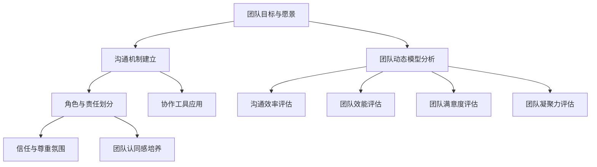

                 

### 文章标题

《远程团队文化：建立虚拟团队认同感》

### 关键词

远程工作、虚拟团队、团队文化、认同感、工作效率、沟通机制

### 摘要

本文旨在探讨远程团队文化的构建与维护，特别是如何建立虚拟团队的认同感。在远程工作日益普及的背景下，团队文化的建立对于提高工作效率、促进沟通与合作具有重要意义。文章首先介绍了远程工作的发展背景和虚拟团队的特点与挑战，随后详细阐述了远程团队文化的核心概念与联系，包括定义、重要性、核心价值观等。接下来，文章提出了构建远程团队文化的策略，包括明确目标与愿景、建立有效沟通机制、促进团队合作与协作、建立信任与尊重的氛围以及培养团队认同感。此外，文章还介绍了远程团队文化的核心算法原理和数学模型，并通过具体案例进行了实战解析。最后，文章总结了远程团队文化建设的持续发展策略，为读者提供了全面的指导。

## 第一部分：引言

### 第1章：远程工作与团队文化概述

#### 1.1 远程工作的发展背景

远程工作，也被称为远程办公或远程协作，是一种允许员工在不位于传统办公室的环境中工作的工作模式。这种工作模式的兴起可以追溯到20世纪末，随着互联网技术的飞速发展，远程工作逐渐成为一种主流的工作方式。特别是近年来，受COVID-19疫情的影响，远程工作更是迎来了前所未有的发展机遇。根据国际数据公司（IDC）的统计，全球远程工作人口在2020年达到了约3亿人，预计到2025年这一数字将增至4.77亿人，占全球劳动力的36%。

远程工作的兴起不仅是技术发展的结果，也是企业对灵活办公需求日益增加的回应。首先，远程工作使得企业能够突破地域限制，吸引全球范围内的高质量人才。其次，远程工作有助于减少办公空间和能源消耗，降低企业的运营成本。此外，远程工作还提高了员工的工作满意度和工作效率，因为员工可以在更加舒适的环境中工作，减少了通勤时间和压力。

#### 1.2 企业远程工作模式的变革

随着远程工作的普及，企业对于远程工作模式也在不断探索和变革。传统的远程工作模式通常依赖于电子邮件和即时通讯工具进行沟通，但这种方式往往存在沟通效率低下、信息更新不及时等问题。为了解决这些问题，现代远程工作模式逐渐采用了更多的协作工具和平台。

首先，视频会议和在线协作工具成为远程工作中不可或缺的工具。例如，Zoom、Microsoft Teams、Google Meet等视频会议工具，以及Trello、Asana、Slack等在线协作工具，大大提高了团队沟通和协作的效率。其次，企业开始采用云存储和文档共享工具，如Google Drive、Dropbox等，使得团队成员可以随时随地访问和编辑文档，提高了工作效率。

此外，企业还开始关注远程工作中员工的情感需求。为了增强员工的归属感和工作满意度，企业采用了更多的虚拟社交活动和团队建设活动，如在线团建、虚拟咖啡时间等，以增强团队成员之间的互动和沟通。

#### 1.3 虚拟团队的特点与挑战

虚拟团队，是指由成员分布在不同的地理位置，通过信息技术进行协作工作的团队。与传统的面对面团队相比，虚拟团队具有以下几个特点：

1. **分散性**：团队成员分布在不同的地理位置，工作时间和工作环境可能存在差异。
2. **依赖信息技术**：虚拟团队的沟通和协作高度依赖各种在线工具和平台。
3. **独立性**：团队成员通常需要独立完成工作任务，自主管理和时间管理能力至关重要。
4. **高灵活性**：虚拟团队可以根据项目需求灵活调整团队成员和工作流程。

然而，虚拟团队也面临一系列挑战：

1. **沟通障碍**：由于地理位置的分散，团队成员之间的沟通可能存在延迟和信息失真。
2. **协调困难**：虚拟团队需要协调不同成员的工作进度和任务分配，确保项目顺利进行。
3. **信任问题**：团队成员之间缺乏面对面的交流和互动，容易产生信任危机。
4. **文化差异**：虚拟团队成员来自不同的文化背景，文化差异可能导致沟通障碍和团队冲突。

#### 1.4 建立远程团队文化的意义

在远程工作模式下，建立良好的团队文化对于提高工作效率、促进沟通与合作具有重要意义。具体来说，建立远程团队文化可以实现以下几点：

1. **增强团队凝聚力**：良好的团队文化能够增强团队成员之间的情感联系，提高团队的凝聚力。
2. **提高工作效率**：通过建立明确的团队目标和愿景，制定有效的沟通和协作机制，可以提高团队的工作效率和产出。
3. **促进团队成员之间的沟通与合作**：远程团队文化鼓励团队成员积极参与团队讨论和决策，提高沟通质量和协作效率。
4. **提升员工满意度**：良好的团队文化能够提升员工的工作满意度和归属感，减少员工流失。

总之，远程团队文化的建立是远程工作中不可或缺的一部分，它能够为团队的成功运作提供坚实的保障。在接下来的章节中，我们将深入探讨远程团队文化的核心概念、构建策略、算法原理和数学模型，为读者提供全面的指导。

### 第2章：远程团队文化核心概念与联系

#### 2.1 远程团队文化的定义与内涵

远程团队文化，是指在远程工作模式下，团队内部所形成的共同价值观、行为规范和工作习惯。这种文化不仅反映了团队对于工作方式的认同，还体现了团队成员之间的互动模式和工作风格。与传统的面对面团队文化不同，远程团队文化更加注重信息技术和协作工具的使用，以及团队成员之间的信任和尊重。

具体来说，远程团队文化的定义可以包含以下几个方面：

1. **价值观**：远程团队文化强调开放性、平等性、透明性和自主性，鼓励团队成员自由表达意见和观点，尊重个人差异。
2. **行为规范**：远程团队文化要求团队成员遵守一定的行为规范，如按时完成任务、保持良好的沟通习惯、积极参与团队讨论等。
3. **工作习惯**：远程团队文化倡导高效的工作方式，通过明确的任务分配、规范的流程管理，以及灵活的时间安排，提高工作效率。

#### 2.2 远程团队文化的重要性

远程团队文化对于远程工作的成功运作至关重要，它能够在以下几个方面产生积极影响：

1. **增强团队凝聚力**：良好的团队文化能够增强团队成员之间的情感联系，提高团队的凝聚力。通过共同价值观和行为规范的建立，团队成员能够更好地理解和支持彼此，形成紧密的团队关系。
2. **提升工作效率**：远程团队文化通过明确的团队目标和愿景，以及有效的沟通和协作机制，可以大幅提高团队的工作效率和产出。团队成员能够更好地协同工作，避免重复劳动和资源浪费。
3. **促进沟通与合作**：远程团队文化鼓励团队成员积极参与团队讨论和决策，提高沟通质量和协作效率。通过多样化的沟通方式和协作工具，团队成员可以更加便捷地交流和分享信息。
4. **提升员工满意度**：良好的团队文化能够提升员工的工作满意度和归属感，减少员工流失。在远程工作中，员工能够感受到企业的关怀和支持，增强对企业的认同感。

#### 2.3 远程团队文化的核心价值观

远程团队文化的核心价值观是团队成功运作的重要保障，它决定了团队成员的行为模式和团队的整体氛围。以下是远程团队文化的一些核心价值观：

1. **开放性**：远程团队文化强调开放性，鼓励团队成员自由表达意见和观点。开放性不仅体现在团队成员之间的互动中，也体现在对待外部信息和反馈上。通过开放性，团队可以吸纳更多的创新思想，提高整体的工作质量。
2. **尊重与信任**：远程团队文化强调尊重和信任，尊重团队成员的个人差异和观点，信任团队成员能够独立完成工作任务。这种文化氛围可以减少冲突和误解，增强团队成员之间的信任感。
3. **透明性**：远程团队文化要求透明性，即在团队内部公开信息、资源和决策过程。通过透明性，团队成员可以更好地了解团队的工作进展和目标，提高决策的效率和准确性。
4. **效率与结果导向**：远程团队文化倡导高效的工作方式，注重实际产出和结果。通过明确的任务分配和规范的流程管理，团队成员可以更加高效地完成工作，提高团队的整体效能。

这些核心价值观在远程团队文化中相互关联，共同构成了团队的文化体系。开放性和透明性确保了信息的自由流动和共享，尊重与信任建立了团队成员之间的紧密联系，而效率与结果导向则促进了团队的高效运作。

在接下来的章节中，我们将进一步探讨如何通过具体的策略和实践，构建和维持远程团队文化，为团队的成功运作提供坚实的保障。

#### 2.4 远程团队文化与传统团队文化的比较

远程团队文化与传统团队文化在多个方面存在显著差异，这些差异主要体现在团队构成、沟通方式、工作模式和文化氛围上。以下是远程团队文化与传统团队文化的详细比较：

1. **团队构成**：
   - **远程团队**：远程团队的成员分布在不同的地理位置，可能跨越不同的时区和国家。团队成员可能来自不同的文化背景，具有多样化的专业知识和技能。
   - **传统团队**：传统团队的成员通常在同一地点办公，面对面的交流更加频繁。团队成员之间的互动和交流主要依赖于共同的工作环境。

2. **沟通方式**：
   - **远程团队**：远程团队的沟通主要依赖于各种在线工具和平台，如电子邮件、即时通讯软件、视频会议系统等。沟通方式更加灵活，可以随时随地进行交流，但也存在信息延迟和误解的风险。
   - **传统团队**：传统团队的沟通主要通过面对面的交流、电话会议和会议记录等方式进行。面对面的交流有助于快速解决问题和增强团队凝聚力，但也受限于时间和空间的限制。

3. **工作模式**：
   - **远程团队**：远程团队的工作模式更加灵活和自主，团队成员可以根据个人情况和任务需求自主安排工作时间和地点。这种模式有助于提高工作满意度和工作效率，但也需要较强的自我管理和时间管理能力。
   - **传统团队**：传统团队的工作模式通常较为固定，团队成员按照公司规定的工作时间和地点进行工作。这种模式有助于统一管理和协调工作，但也可能降低员工的创造性和灵活性。

4. **文化氛围**：
   - **远程团队**：远程团队的文化氛围通常更加开放和包容，团队成员之间的互动和交流更加平等和自由。团队文化的建设需要依赖于信息技术和协作工具的支持，如在线论坛、社交媒体和虚拟会议等。
   - **传统团队**：传统团队的文化氛围往往更加正式和严肃，团队成员之间的互动和交流可能受到工作关系和组织结构的限制。团队文化的建设更多依赖于传统的方法，如团队建设活动、团建旅游等。

综上所述，远程团队文化与传统团队文化在团队构成、沟通方式、工作模式和文化氛围等方面存在显著差异。这些差异决定了远程团队在管理、运营和文化建设方面的特殊需求，也为其提供了更多创新和发展的机会。在接下来的章节中，我们将深入探讨如何针对远程团队的特点，构建和维持有效的远程团队文化。

### 第3章：远程团队文化构建策略

#### 3.1 制定明确的目标与愿景

在远程团队文化的构建过程中，制定明确的目标和愿景是至关重要的一步。目标和愿景不仅是团队的导航灯塔，也是团队成员共同努力的方向。明确的目标和愿景有助于团队统一思想、凝聚力量，从而提高团队的整体效能。

首先，团队目标应该具体、可衡量、可实现和有时限（SMART原则）。具体的目标可以帮助团队成员清晰地了解工作内容和预期结果，可衡量则可以用来评估团队的工作进展，可实现确保目标能够被实际完成，有时限则可以促使团队成员有紧迫感，按时完成任务。

例如，一个远程团队的年度目标可以是“提高项目交付速度20%”，季度目标可以是“确保所有项目按时完成”，月度目标可以是“提高团队内部沟通效率30%”。通过这种具体的目标设定，团队成员可以明确自己的工作重点和努力方向。

其次，团队愿景应该具有启发性和感召力，能够激励团队成员为之努力。愿景不仅描述了团队想要达到的长期目标，还传达了团队的核心价值观和使命。一个有吸引力的愿景可以帮助团队成员在面对困难和挑战时保持积极的态度和坚定的信念。

例如，一个远程团队的愿景可以是“成为行业领先的创新团队，为客户提供卓越的解决方案”。这个愿景不仅明确了团队的长远目标，还体现了团队的价值观和对客户服务的承诺。

为了确保目标和愿景的有效性，团队需要定期进行目标回顾和调整。在目标实施过程中，团队可以定期召开会议，评估目标的完成情况，并根据实际情况进行调整。这种动态的目标管理机制可以确保团队始终朝着正确的方向前进。

#### 3.2 建立有效的沟通机制

沟通是团队协作的核心，对于远程团队来说更是至关重要。有效的沟通机制能够确保信息及时传递、减少误解和冲突，提高团队的工作效率和协作质量。以下是构建远程团队沟通机制的几个关键步骤：

1. **选择合适的沟通工具**：
   - 远程团队需要根据工作需求和团队成员的实际情况，选择合适的沟通工具。常见的沟通工具有电子邮件、即时通讯软件（如Slack、WhatsApp）、视频会议系统（如Zoom、Microsoft Teams）和项目管理工具（如Trello、Asana）等。
   - 例如，电子邮件适合用于正式的、需要详细记录的沟通，即时通讯软件适合用于快速交流和解决问题，视频会议系统适合用于团队会议和远程培训。

2. **制定沟通规范**：
   - 为了确保沟通的效率和效果，团队需要制定明确的沟通规范。这些规范可以包括沟通的频率、方式、格式和责任分配等。
   - 例如，团队可以规定每周召开一次团队会议，每次会议的时间不超过1小时；重要决策需要通过视频会议讨论，并形成会议纪要；团队成员需要及时回复重要信息，保证信息的流通。

3. **确保信息透明**：
   - 在远程团队中，信息透明是建立信任和减少误解的重要保障。团队应该确保所有成员能够及时获取关键信息，避免信息孤岛和壁垒。
   - 例如，团队可以通过共享文档和项目管理工具，将项目进度、任务分配和决策结果公开给所有成员，确保信息的透明度和一致性。

4. **培训团队成员**：
   - 为了提高沟通的效率和质量，团队需要定期对成员进行沟通技巧的培训。培训内容可以包括如何有效地使用沟通工具、如何进行有效表达和倾听、如何处理沟通中的冲突等。
   - 例如，团队可以邀请专业的沟通培训师进行讲座和互动训练，或者通过在线课程和模拟演练提高成员的沟通能力。

5. **建立反馈机制**：
   - 团队应该建立有效的反馈机制，鼓励成员提出意见和建议，及时调整沟通策略。反馈可以来自团队内部，也可以来自客户和其他利益相关方。
   - 例如，团队可以设立定期反馈会议，让成员分享自己的经验和建议，或者通过在线调查和问卷调查收集反馈信息，不断改进沟通机制。

通过以上步骤，远程团队可以建立一个高效、透明和灵活的沟通机制，确保团队成员之间的信息畅通无阻，提高团队协作的质量和效率。

#### 3.3 促进团队合作与协作

在远程团队中，促进团队合作和协作是实现团队目标的关键。有效的团队合作可以确保团队成员之间的高效协作，提高整体工作效率和项目质量。以下是几个促进远程团队合作和协作的策略：

1. **明确角色与责任**：
   - 在远程团队中，明确每个团队成员的角色和责任是促进协作的重要步骤。每个成员都应该清楚自己的职责和工作内容，避免工作重叠和责任模糊。
   - 例如，团队可以制定详细的任务分配表，明确每个成员的具体任务和截止日期，确保每个人都知道自己需要做什么。

2. **使用协作工具**：
   - 远程团队需要使用合适的协作工具来支持团队合作。这些工具可以帮助团队成员共享文档、跟踪项目进度、管理任务和沟通协作。
   - 常用的协作工具包括项目管理软件（如Trello、Asana、Jira）、视频会议系统（如Zoom、Microsoft Teams）、即时通讯软件（如Slack、WhatsApp）等。

3. **建立共同的目标和愿景**：
   - 共同的目标和愿景是团队成员共同奋斗的动力源泉。远程团队需要确保每个成员都认同团队的目标和愿景，并明确自己的贡献方向。
   - 例如，团队可以在启动项目时召开一次会议，共同讨论并确定项目的目标、愿景和关键里程碑，确保团队成员的目标一致。

4. **加强跨职能合作**：
   - 远程团队通常由不同职能部门的成员组成，跨职能合作对于项目的成功至关重要。团队需要建立有效的跨职能沟通和协作机制，确保各个职能团队能够协同工作。
   - 例如，团队可以定期举行跨职能会议，讨论项目中的挑战和需求，共同制定解决方案，确保项目能够顺利进行。

5. **培养团队协作文化**：
   - 远程团队需要培养一种积极、开放和包容的协作文化，鼓励团队成员之间的互动和合作。这种文化可以通过团队建设活动、虚拟团建和定期交流等方式来培养。
   - 例如，团队可以定期组织在线团建活动，如虚拟咖啡时间、线上运动会等，增强团队成员之间的情感联系和团队合作精神。

6. **提供必要的支持和资源**：
   - 为了确保团队成员能够有效协作，团队需要提供必要的支持和资源。这些资源可以包括技术支持、培训资源、沟通工具和设备等。
   - 例如，团队可以确保所有成员都拥有高性能的计算机和网络设备，提供在线培训课程，帮助成员提升协作能力。

通过以上策略，远程团队可以建立有效的团队合作和协作机制，确保团队成员能够高效地合作，共同实现团队的目标。

#### 3.4 建立信任与尊重的氛围

在远程团队中，建立信任和尊重的氛围是确保团队稳定和高效运作的关键。由于团队成员之间缺乏面对面的互动，信任和尊重的建立更加依赖于沟通和文化建设。以下是几个建立信任与尊重氛围的策略：

1. **透明的沟通**：
   - 透明的沟通是建立信任的基础。远程团队应该鼓励成员开放地分享信息，确保信息在团队内部透明流通。
   - 例如，团队可以通过定期的状态更新会议，让每个成员分享自己的工作进展、遇到的困难和需求，确保团队成员之间的信息对称。

2. **及时的反馈**：
   - 及时给予反馈可以增强团队成员之间的信任。团队成员应该在完成任务后及时反馈结果，对遇到的问题和挑战进行讨论和解决。
   - 例如，团队可以设立定期反馈机制，如每周的反馈会议，让成员分享自己的工作成果和经验教训，促进团队内部的互助和协作。

3. **尊重个人差异**：
   - 尊重团队成员的个人差异是建立尊重氛围的重要步骤。每个成员都有自己独特的背景、观点和工作方式，团队应该尊重这些差异，并鼓励成员之间的相互理解。
   - 例如，团队可以通过定期的文化多样性培训，提高成员对不同文化的理解和尊重，避免因文化差异导致的误解和冲突。

4. **公平的决策过程**：
   - 公平的决策过程可以增强团队成员对团队的信任。团队应该确保决策过程公开、透明，每个成员都有机会表达自己的观点和建议。
   - 例如，团队可以通过在线投票、讨论等方式进行决策，确保每个成员的声音都能被听到。

5. **及时的表彰和奖励**：
   - 及时的表彰和奖励可以增强团队成员的工作动力和团队凝聚力。团队应该及时认可成员的成就和贡献，激励他们继续努力。
   - 例如，团队可以设立月度最佳团队成员奖、项目突出贡献奖等，通过公开表彰和奖励机制，激励团队成员积极工作和合作。

6. **建立信任机制**：
   - 建立信任机制是建立长期信任关系的关键。团队可以通过签订保密协议、确保信息安全性等方式，建立和维护信任。
   - 例如，团队可以制定信息安全政策，确保团队成员之间的信息安全和隐私保护，增强团队成员对团队的信任。

通过以上策略，远程团队可以建立一种信任和尊重的氛围，促进团队成员之间的合作和团队的长期稳定发展。

#### 3.5 培养团队认同感

在远程团队中，培养团队认同感是确保团队稳定和高效运作的关键。团队认同感是指团队成员对团队目标、价值观和文化的认同和归属感，它是提高团队凝聚力、工作效率和员工满意度的重要驱动力。以下是几个培养团队认同感的策略：

1. **加强团队文化建设**：
   - 团队文化建设是培养团队认同感的基础。团队应该明确自己的核心价值观和使命，并通过多种方式将其传达给每个成员。
   - 例如，团队可以通过定期的团队活动、会议和内部培训，宣传和强化团队的文化理念，确保每个成员都能深刻理解并认同这些价值观。

2. **鼓励团队成员参与**：
   - 鼓励团队成员参与团队决策和项目实施，可以增强他们的参与感和归属感。团队成员在参与过程中能够感受到自己的价值和重要性。
   - 例如，团队可以定期召开团队会议，讨论项目进展和决策事项，鼓励成员提出建议和意见，确保每个成员都有机会参与到团队的重要决策中。

3. **提供个性化支持**：
   - 提供个性化的支持可以帮助团队成员感受到团队的关怀和关注。团队可以根据成员的个人需求和职业规划，提供相应的培训和发展机会。
   - 例如，团队可以定期为成员提供专业培训和技能提升课程，帮助成员提高自身能力，增强对团队的认同感。

4. **建立共同目标**：
   - 建立共同的目标可以增强团队成员之间的协作和认同感。团队应该确保所有成员都明确团队的目标和愿景，并为之共同努力。
   - 例如，团队可以在项目启动时，共同制定项目目标和关键里程碑，确保每个成员都清楚自己的贡献方向和团队的整体目标。

5. **表彰和奖励**：
   - 表彰和奖励是培养团队认同感的重要手段。团队应该及时认可成员的成就和贡献，激励他们继续努力。
   - 例如，团队可以设立月度最佳团队成员奖、项目突出贡献奖等，通过公开表彰和奖励机制，增强团队成员的认同感和工作动力。

6. **促进团队成员之间的互动**：
   - 促进团队成员之间的互动可以增强他们的情感联系和归属感。团队可以通过定期的在线团建活动、虚拟咖啡时间等方式，为团队成员提供交流的机会。
   - 例如，团队可以定期组织线上交流活动，如在线茶话会、运动比赛等，增强团队成员之间的情感联系和团队凝聚力。

通过以上策略，远程团队可以培养出强烈的团队认同感，确保团队成员能够紧密团结在一起，共同为实现团队的目标而努力。

### 第4章：远程团队文化核心算法原理讲解

#### 4.1 团队动态模型

远程团队文化的构建需要理解团队动态模型，这个模型可以帮助我们分析团队在不同阶段的特征和行为。团队动态模型主要包括以下三个阶段：形成期、震荡期和规范期。

1. **形成期**：
   - 在形成期，团队成员刚刚加入团队，彼此还不熟悉，团队的目标和规则也尚未明确。
   - 算法原理：在此阶段，可以使用“社交网络分析”算法来识别团队成员之间的联系和互动频率，帮助团队形成初步的社交网络结构。

2. **震荡期**：
   - 在震荡期，团队成员开始相互了解，但可能存在意见分歧和冲突，团队内部的权力关系也在逐步形成。
   - 算法原理：在此阶段，可以使用“共识算法”（如BaalAlgo或投票机制）来促进团队成员达成共识，减少冲突，提高团队的整体效率。

3. **规范期**：
   - 在规范期，团队已经形成明确的规则和价值观，团队成员之间建立了深厚的信任和合作关系，团队运作趋于稳定。
   - 算法原理：在此阶段，可以使用“社交网络稳定度算法”来评估团队内部关系网络的稳定性和凝聚力，确保团队在规范期内持续高效运作。

#### 4.2 沟通效率评估算法

沟通效率是远程团队文化构建的重要指标，它直接关系到团队的工作效率和产出。以下是一种用于评估沟通效率的算法：

1. **算法原理**：
   - **沟通频率分析**：通过统计团队成员在特定时间段内的沟通频率，评估沟通的活跃程度。
   - **沟通质量评估**：通过分析沟通内容的深度和广度，评估沟通的质量。

2. **算法步骤**：
   - **数据收集**：收集团队在一定时间内的沟通记录，包括电子邮件、即时通讯记录、视频会议记录等。
   - **频率统计**：统计每个成员的沟通频率，计算平均沟通频率。
   - **内容分析**：对沟通内容进行文本分析，评估沟通的深度和广度。
   - **效率评估**：结合频率和内容分析结果，计算沟通效率得分。

3. **公式示例**：
   - **沟通效率得分**：\[Efficiency = \frac{Depth \times Frequency}{Time}\]
     - **Depth**：沟通内容的深度（例如，解决问题能力、信息共享程度）。
     - **Frequency**：沟通的频率（例如，每天沟通的次数、每次沟通的时间长度）。
     - **Time**：评估时间（例如，每周、每月的沟通时长）。

通过这种算法，团队可以实时监控沟通效率，发现潜在问题，并采取相应措施进行优化。

#### 4.3 团队认同感计算方法

团队认同感是远程团队文化中至关重要的一环，它反映了团队成员对团队的认同和归属感。以下是一种基于行为分析和心理测评的团队认同感计算方法：

1. **算法原理**：
   - **行为分析**：通过观察团队成员在工作中的行为，如参与度、贡献度、团队活动参与情况等，评估其团队认同感。
   - **心理测评**：通过心理测评工具，如问卷调查、心理测试等，评估团队成员的心理状态和对团队认同感的自我评价。

2. **算法步骤**：
   - **行为分析**：
     - **数据收集**：收集团队成员在工作中的行为数据，如项目贡献记录、团队活动参与记录等。
     - **行为评估**：根据行为指标，对团队成员的团队认同感进行评估。
   - **心理测评**：
     - **数据收集**：通过问卷调查、心理测试等方式，收集团队成员的心理数据。
     - **心理评估**：根据心理测评结果，评估团队成员的团队认同感。

3. **公式示例**：
   - **团队认同感得分**：\[Identity = \frac{Behavior \times Psychology}{Total \, Data}\]
     - **Behavior**：行为分析得分。
     - **Psychology**：心理测评得分。
     - **Total \, Data**：总数据（包括行为数据和心理数据）。

通过这种计算方法，团队可以全面了解团队成员的团队认同感，及时发现和解决潜在问题，提高团队的整体凝聚力和工作效率。

### 第5章：远程团队文化数学模型与公式详解

#### 5.1 远程团队效能评估模型

远程团队效能评估模型是衡量团队工作绩效和效率的重要工具。以下是一个具体的评估模型及其相关公式：

1. **效能指标**：
   - **任务完成率**：衡量团队按时完成任务的能力。
   - **项目质量**：衡量团队交付的项目质量。
   - **沟通效率**：衡量团队沟通的质量和效率。

2. **评估方法**：
   - **数据收集**：收集团队在任务完成、项目质量和沟通效率方面的数据。
   - **计算公式**：
     - **任务完成率**：\[Completion \, Rate = \frac{Completed \, Tasks}{Total \, Tasks}\]
     - **项目质量**：\[Quality \, Score = \frac{Passing \, Projects}{Total \, Projects}\]
     - **沟通效率**：\[Efficiency \, Score = \frac{Effective \, Communication}{Total \, Communication}\]

3. **综合效能评估**：
   - **综合效能得分**：\[Efficiency \, Score = \frac{Completion \, Rate \times Quality \, Score \times Communication \, Score}{3}\]

#### 5.2 团队满意度模型

团队满意度是衡量团队成员工作满意度和团队氛围的重要指标。以下是一个具体的团队满意度模型及其相关公式：

1. **满意度影响因素**：
   - **工作环境**：工作场所的舒适度、设备条件等。
   - **工作内容**：工作任务的挑战性和趣味性。
   - **团队支持**：团队提供的资源和支持。

2. **评估方法**：
   - **数据收集**：通过问卷调查、访谈等方式收集团队成员的满意度数据。
   - **计算公式**：
     - **工作环境满意度**：\[Environment \, Satisfaction = \frac{Good \, Reviews}{Total \, Reviews}\]
     - **工作内容满意度**：\[Content \, Satisfaction = \frac{Challenging \, Tasks}{Total \, Tasks}\]
     - **团队支持满意度**：\[Support \, Satisfaction = \frac{Supportive \, Feedback}{Total \, Feedback}\]

3. **综合满意度评估**：
   - **综合满意度得分**：\[Satisfaction \, Score = \frac{Environment \, Satisfaction \times Content \, Satisfaction \times Support \, Satisfaction}{3}\]

#### 5.3 团队凝聚力模型

团队凝聚力是团队内部成员之间相互依赖和协作的重要指标。以下是一个具体的团队凝聚力模型及其相关公式：

1. **凝聚力指标**：
   - **团队成员互动频率**：衡量成员之间的互动和交流频率。
   - **共同目标达成度**：衡量团队在共同目标上的协作和成果。
   - **团队文化认同度**：衡量成员对团队文化和价值观的认同。

2. **评估方法**：
   - **数据收集**：收集团队成员的互动记录、共同目标达成情况和团队文化认同度数据。
   - **计算公式**：
     - **互动频率**：\[Interaction \, Frequency = \frac{Total \, Interactions}{Total \, Members \times Time}\]
     - **共同目标达成度**：\[Goal \, Achievement = \frac{Completed \, Goals}{Total \, Goals}\]
     - **团队文化认同度**：\[Culture \, Identity = \frac{Agreed \, Statements}{Total \, Statements}\]

3. **综合凝聚力评估**：
   - **综合凝聚力得分**：\[Coherence \, Score = \frac{Interaction \, Frequency \times Goal \, Achievement \times Culture \, Identity}{3}\]

通过以上数学模型和公式，团队可以全面、科学地评估团队的效能、满意度和凝聚力，从而为团队的管理和优化提供有力的数据支持。

### 第6章：远程团队文化项目实战案例

#### 6.1 项目背景与目标

为了更好地展示远程团队文化的构建过程和实际效果，我们以一家跨国科技公司为例，介绍其远程团队文化的建设项目。这家科技公司由于业务全球化的需求，其团队分布在不同的国家和地区，为了提高团队的工作效率和凝聚力，公司决定实施一项远程团队文化的建设项目。

**项目背景**：
- 公司业务涉及软件开发、产品测试、市场营销等多个领域，团队成员分布在北美、欧洲、亚洲等地。
- 团队成员之间的沟通主要依赖于电子邮件、即时通讯软件和视频会议系统。
- 随着远程工作的普及，团队成员之间的沟通效率和文化认同感逐渐下降，影响到了团队的整体绩效。

**项目目标**：
- 提高团队成员之间的沟通效率，减少误解和冲突。
- 建立和维护良好的团队文化，增强团队成员的归属感和认同感。
- 提升团队的整体工作效率和项目质量。

#### 6.2 项目实施过程

为了实现项目目标，公司采取了以下具体实施步骤：

1. **项目规划**：
   - 项目团队首先对远程团队文化现状进行了详细分析，确定了项目目标和实施计划。
   - 项目计划包括明确的目标、具体的实施步骤、时间表和资源分配。

2. **制定团队文化指南**：
   - 项目团队制定了一份《远程团队文化指南》，明确了团队的核心价值观、行为规范和沟通原则。
   - 文化指南通过公司内部网站和邮件向所有团队成员传达，并组织了相关的培训活动。

3. **建立有效的沟通机制**：
   - 项目团队引入了新的沟通工具和平台，如Slack、Trello和Zoom等，优化了团队的沟通流程。
   - 定期召开团队会议，确保团队成员能够及时沟通和分享信息。

4. **促进团队合作与协作**：
   - 项目团队制定了明确的任务分配和责任分工，确保每个成员都清楚自己的工作内容和目标。
   - 使用Trello等项目管理工具，实时跟踪项目进度和任务完成情况。

5. **建立信任与尊重的氛围**：
   - 项目团队通过定期的反馈和表彰机制，鼓励团队成员之间互相支持和尊重。
   - 定期组织在线团建活动，如虚拟咖啡时间、线上运动会等，增强团队成员之间的情感联系。

6. **监控和调整**：
   - 项目团队定期评估项目的实施效果，根据反馈和实际情况进行调整。
   - 通过问卷调查和访谈等方式，收集团队成员的反馈意见，持续改进团队文化。

#### 6.3 项目成果与评估

通过一系列的实施步骤，公司远程团队文化的建设项目取得了显著的成果：

1. **沟通效率提升**：
   - 通过引入新的沟通工具和优化沟通流程，团队成员之间的沟通效率显著提升，信息传递更加及时和准确。

2. **团队凝聚力增强**：
   - 定期的团队建设和互动活动，使团队成员之间的信任和尊重氛围得到加强，团队凝聚力显著提高。

3. **工作效率提升**：
   - 明确的任务分配和责任分工，以及有效的沟通和协作机制，使团队的整体工作效率和项目质量得到提升。

4. **员工满意度提高**：
   - 通过建立良好的团队文化和加强员工关怀，员工的满意度和工作积极性得到显著提高。

为了评估项目成果，项目团队采用以下指标：

- **沟通效率指标**：通过统计沟通频率和沟通质量，计算沟通效率得分。
- **团队凝聚力指标**：通过问卷调查和访谈，评估团队成员的团队认同感和凝聚力。
- **工作效率指标**：通过统计项目完成率和项目质量，评估团队的工作效率。

评估结果显示，项目目标基本达成，团队成员对项目的满意度较高，公司远程团队文化的建设取得了成功。

#### 6.4 项目经验总结与启示

通过这个项目，公司积累了丰富的经验，以下是一些关键的经验总结和启示：

1. **明确目标和规划**：
   - 项目成功的关键在于明确的目标和详细的规划。在项目开始前，需要明确项目的目标和实施步骤，确保项目有清晰的方向。

2. **引入合适的工具和平台**：
   - 合适的沟通工具和平台是提高团队效率和凝聚力的基础。根据团队的需求和实际情况，选择并引入合适的工具和平台。

3. **加强团队建设和互动**：
   - 定期的团队建设和互动活动对于增强团队凝聚力至关重要。通过线上团建活动、虚拟咖啡时间等方式，促进团队成员之间的情感联系。

4. **建立反馈和调整机制**：
   - 项目过程中需要持续监控和评估项目效果，根据反馈和实际情况进行调整。通过定期收集团队成员的反馈意见，持续改进团队文化。

5. **关注员工满意度**：
   - 员工的满意度和工作积极性是团队成功的重要保障。通过建立良好的团队文化和加强员工关怀，提高员工的工作满意度和归属感。

总之，远程团队文化的建设项目是一个长期的过程，需要持续的努力和优化。通过这个项目，公司不仅提高了团队的工作效率和凝聚力，也为其他企业提供了有益的经验和启示。

### 第7章：远程团队文化建设与持续发展

#### 7.1 持续改进与优化

远程团队文化的建设是一个持续的过程，需要不断地改进和优化，以适应不断变化的工作环境和团队成员的需求。以下是一些关键的改进和优化策略：

1. **建立反馈机制**：
   - 反馈机制是远程团队文化持续改进的重要工具。团队可以通过定期问卷调查、访谈和在线反馈平台，收集团队成员的建议和意见。
   - **具体步骤**：
     - 设计反馈问卷，涵盖团队沟通、协作、文化氛围等方面。
     - 安排定期反馈会议，讨论问卷结果和改进建议。
     - 根据反馈结果，制定改进计划，并实施具体的改进措施。

2. **员工培训和发展**：
   - 持续的培训和发展可以帮助团队成员提升技能，增强对团队文化的认同感。
   - **具体策略**：
     - 定期组织专业培训，提升团队成员的沟通技巧、项目管理能力和技术能力。
     - 提供在线学习资源，支持团队成员自主学习和提升。
     - 设立导师制度，为新员工提供指导和帮助。

3. **技术工具的迭代**：
   - 随着技术的发展，远程团队需要不断更新和迭代沟通和协作工具，以提高团队效率。
   - **具体行动**：
     - 定期评估现有的沟通和协作工具，识别改进空间和需求。
     - 尝试引入新的工具和平台，提高团队的协作效率和用户体验。

4. **持续的文化传播**：
   - 团队文化需要通过多种渠道和方式，持续传播和强化。
   - **传播策略**：
     - 利用公司内部网站、邮件、内部社交媒体等渠道，定期发布团队文化相关的内容。
     - 组织线上和线下的团队活动，如虚拟团建、文化活动等，增强团队凝聚力。

5. **领导层的支持**：
   - 领导层对团队文化的支持和引导至关重要。领导层需要积极参与团队文化建设，为团队成员树立榜样。
   - **具体措施**：
     - 领导层应积极倡导和践行团队文化，通过行动和语言传达对团队文化的重视。
     - 定期与团队成员交流，了解团队文化的实施情况和团队成员的需求。

#### 7.2 跨部门协同与整合

在远程团队中，跨部门协同与整合是确保项目成功的关键。以下是一些跨部门协同与整合的策略：

1. **明确跨部门目标和任务**：
   - 跨部门协同需要明确的目标和任务，以确保各部门的工作协调一致。
   - **具体步骤**：
     - 在项目启动时，召开跨部门会议，明确项目目标和各部门的任务。
     - 制定详细的任务分配表，明确各部门的责任和分工。

2. **建立跨部门沟通机制**：
   - 跨部门沟通是确保项目顺利进行的重要保障。团队需要建立有效的跨部门沟通机制，确保信息畅通。
   - **沟通策略**：
     - 定期召开跨部门会议，讨论项目进展和问题。
     - 利用即时通讯软件、项目管理工具等，建立实时沟通渠道，确保各部门之间的信息共享。

3. **强化跨部门协作文化**：
   - 建立一种积极的跨部门协作文化，鼓励各部门之间的互动和合作。
   - **具体措施**：
     - 组织跨部门团队建设活动，增强团队成员之间的信任和协作意识。
     - 奖励跨部门协作的优秀团队和个人，提高团队成员的积极性和主动性。

4. **提供跨部门资源支持**：
   - 为了确保跨部门协作的顺利进行，团队需要提供必要的资源支持。
   - **资源策略**：
     - 分配专门的协调人员，负责跨部门的沟通和协调工作。
     - 提供技术支持，确保各部门能够高效地使用协作工具和平台。

5. **优化跨部门流程管理**：
   - 优化跨部门的流程管理，提高项目效率和质量。
   - **流程优化**：
     - 设计清晰的跨部门流程，明确各部门的工作流程和责任。
     - 定期评估和优化跨部门流程，减少冗余和重复劳动。

通过以上策略，远程团队可以有效地实现跨部门协同与整合，提高项目的整体效率和协作质量。

#### 7.3 远程团队文化的可持续发展

远程团队文化的可持续发展是确保团队长期稳定和高效运作的关键。以下是一些确保远程团队文化可持续发展的策略：

1. **适应变化的组织结构**：
   - 随着远程工作的普及和技术的进步，团队的组织结构也需要不断调整和优化。
   - **具体行动**：
     - 评估组织结构是否符合远程工作需求，及时调整部门职责和团队规模。
     - 引入扁平化管理模式，减少层级和冗余，提高决策效率。

2. **培养远程工作能力**：
   - 团队成员需要具备远程工作的能力和素质，以适应远程工作模式。
   - **培养策略**：
     - 定期开展远程工作技能培训，提升团队成员的远程沟通、协作和自我管理能力。
     - 鼓励团队成员参加相关的在线课程和研讨会，持续学习和提升。

3. **优化工作流程**：
   - 优化工作流程可以提高工作效率，减少冗余和浪费，确保团队目标的实现。
   - **优化步骤**：
     - 评估现有的工作流程，识别优化空间和瓶颈。
     - 引入自动化工具和流程管理软件，提高工作流程的自动化和智能化。

4. **建立灵活的工作制度**：
   - 灵活的工作制度可以适应远程工作模式的特点，提高员工的工作满意度和工作效率。
   - **制度策略**：
     - 实行弹性工作时间，允许员工根据自己的需求调整工作时间和地点。
     - 推行远程办公政策，为员工提供必要的技术支持和资源保障。

5. **促进跨地域文化融合**：
   - 跨地域团队需要融合不同的文化和价值观，以增强团队的凝聚力和认同感。
   - **融合策略**：
     - 定期组织跨地域团队建设活动，增强团队成员之间的情感联系。
     - 建立跨地域的文化交流平台，促进团队成员之间的互动和分享。

6. **持续监控和反馈**：
   - 持续监控团队文化建设和实施效果，及时反馈和调整，确保团队文化的可持续发展。
   - **监控反馈**：
     - 设立定期反馈机制，收集团队成员的反馈意见和建议。
     - 根据反馈结果，制定和实施改进计划，持续优化团队文化。

通过以上策略，远程团队可以确保文化的可持续发展，适应远程工作模式的变化，实现长期稳定和高效运作。

### 结束语

远程团队文化是远程工作中不可或缺的一部分，它不仅关系到团队的工作效率、沟通协作和员工满意度，还直接影响团队的成功和企业的竞争力。通过本文的详细探讨，我们了解了远程团队文化的核心概念、构建策略、算法原理、数学模型以及实战案例，为远程团队文化的建设和维护提供了全面的指导。

在构建远程团队文化时，我们需要明确目标和愿景，建立有效的沟通机制，促进团队合作与协作，建立信任与尊重的氛围，并培养团队认同感。同时，通过持续改进与优化、跨部门协同与整合以及文化的可持续发展，我们可以确保远程团队文化在动态变化的工作环境中保持活力和有效性。

展望未来，随着远程工作模式的进一步普及和技术的不断进步，远程团队文化将面临更多的机遇和挑战。我们需要不断探索和实践，不断创新和完善团队文化，以适应新的工作环境和需求，确保团队在竞争激烈的市场中立于不败之地。

最后，希望本文能为广大远程团队成员和管理者提供有价值的参考，助力他们在远程工作中实现更高的效率和更紧密的团队协作。让我们共同为构建富有活力、高效和可持续发展的远程团队文化而努力！

### 作者信息

作者：AI天才研究院/AI Genius Institute & 禅与计算机程序设计艺术 /Zen And The Art of Computer Programming

在远程团队文化的研究和实践中，我们致力于为企业和团队提供专业的解决方案和指导。我们不仅关注技术层面的优化，更注重团队文化的构建和员工体验的提升。通过本文，我们希望与广大读者共同探讨和分享远程团队文化的精髓，助力远程工作的成功实施和持续发展。如果您对远程团队文化有任何疑问或建议，欢迎随时联系我们，我们期待与您共同探讨和进步！

### 最佳实践 Tips

1. **定期沟通和反馈**：
   - 定期召开团队会议，讨论项目进展和团队成员的需求，确保信息的透明和沟通的及时性。
   - 建立反馈机制，鼓励团队成员提出意见和建议，及时解决问题。

2. **文化引导与推广**：
   - 制定明确的团队文化指南，通过内部培训和宣传活动，强化团队文化在日常工作中的体现。
   - 利用公司内部网站、邮件和社交媒体等渠道，持续传播和推广团队文化。

3. **个性化关怀**：
   - 根据团队成员的个人需求和职业规划，提供个性化的培训和资源支持，增强对团队的认同感。
   - 定期组织团建活动，增强团队成员之间的情感联系和团队凝聚力。

4. **灵活的工作安排**：
   - 实行弹性工作时间，允许员工根据自己的需求调整工作时间和地点，提高工作满意度和工作效率。
   - 提供远程办公技术支持和资源，确保团队成员能够高效地开展工作。

5. **跨部门协作**：
   - 明确跨部门目标和任务，建立跨部门沟通和协作机制，促进各部门之间的协作和整合。
   - 奖励跨部门协作的优秀团队和个人，提高团队成员的积极性和主动性。

### 小结

本文详细探讨了远程团队文化的核心概念、构建策略、算法原理、数学模型以及实战案例，为远程团队文化的建设和维护提供了全面的指导。通过明确的目标与愿景、有效的沟通机制、团队合作与协作、信任与尊重的氛围以及团队认同感的培养，远程团队可以实现高效的协作和持续的发展。展望未来，随着远程工作模式的进一步普及和技术的不断进步，远程团队文化将面临更多的机遇和挑战。我们需要不断探索和实践，不断创新和完善团队文化，以适应新的工作环境和需求，确保团队在竞争激烈的市场中立于不败之地。

### 注意事项

1. **文化适应性**：在构建远程团队文化时，需要充分考虑团队成员的文化差异和背景，确保文化的适应性和包容性。
2. **技术支持**：远程团队需要确保技术基础设施的稳定性和安全性，为团队成员提供可靠的技术支持。
3. **持续反馈**：建立有效的反馈机制，及时收集和反馈团队成员的意见和建议，确保团队文化的持续改进。
4. **领导力**：领导层在团队文化建设中起到关键作用，需要积极参与并树立良好的榜样，推动团队文化的落实和执行。

### 拓展阅读

1. **《远程工作的艺术》**：作者大卫·艾伦（David Allen），详细介绍了远程工作的方法和管理技巧，对远程团队文化建设具有参考价值。
2. **《远程团队管理：实践指南》**：作者克里斯·普莱斯（Chris Prichard），提供了远程团队管理的最佳实践和策略，有助于提高团队效率和凝聚力。
3. **《团队协作：如何让团队更高效》**：作者汤姆·彼得斯（Tom Peters）和罗伯特·沃特曼（Robert Waterman），分析了团队协作的关键要素和成功案例，对远程团队文化建设具有启示意义。

### 附录：Mermaid 流程图

以下是远程团队文化建设过程中涉及的核心概念和流程的Mermaid流程图：

此流程图展示了团队文化建设的关键环节和它们之间的逻辑关系，有助于理解和实施远程团队文化建设的策略。在具体实施过程中，团队可以根据实际情况调整和优化流程。

