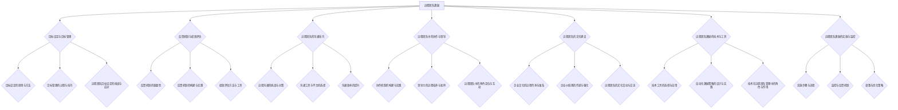
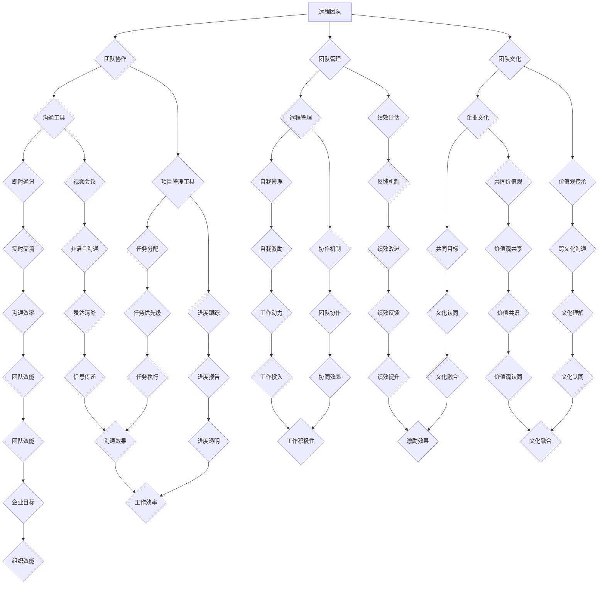
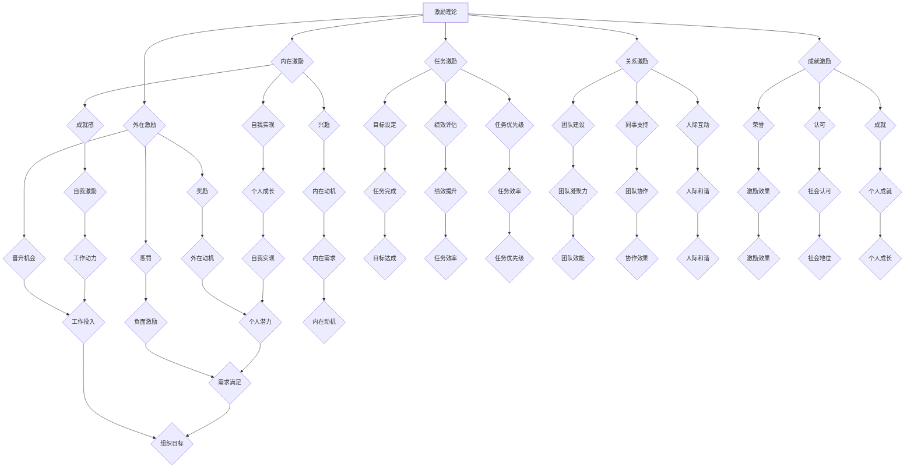
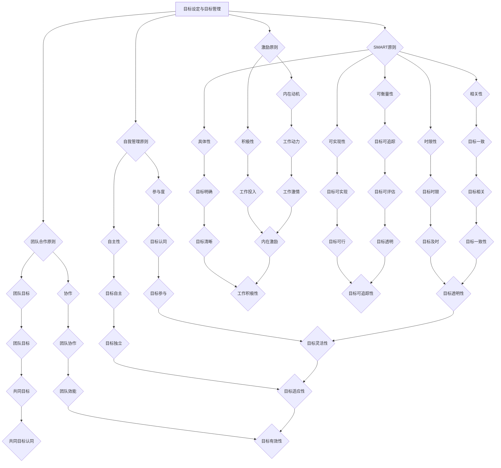
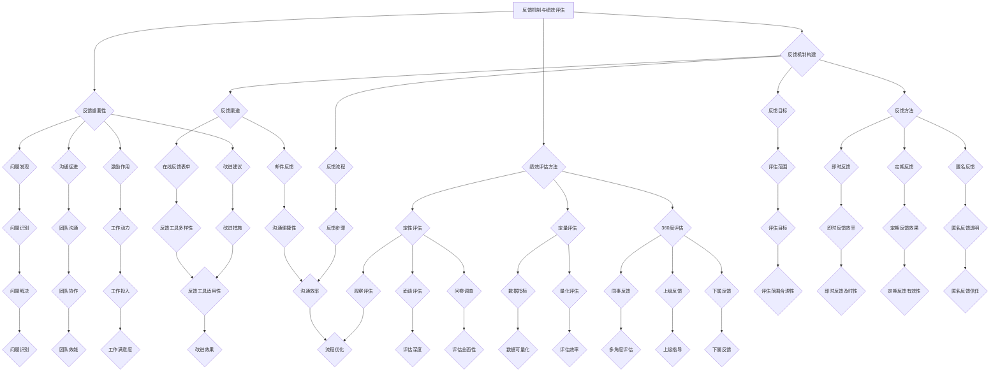
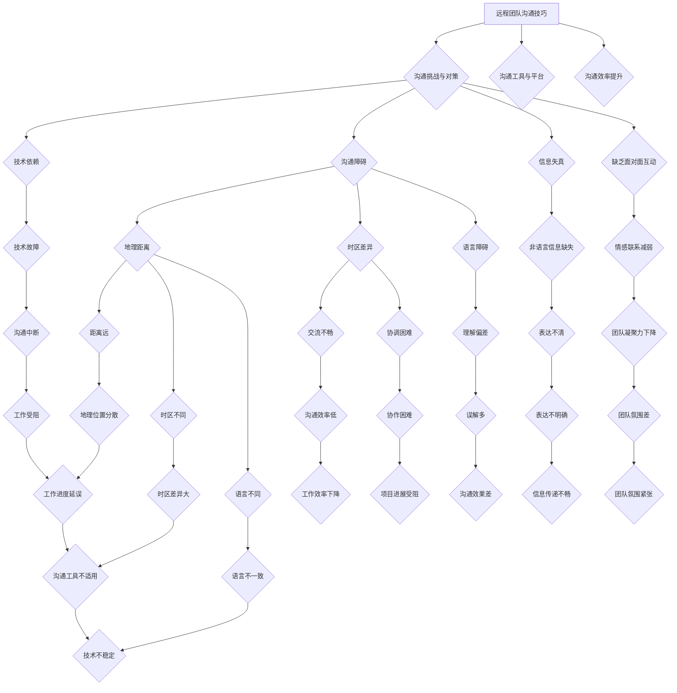
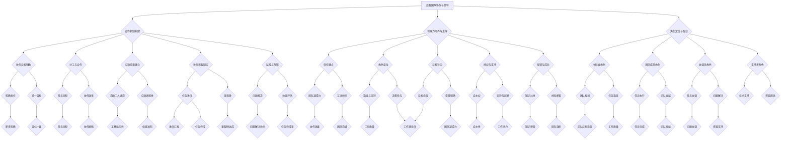
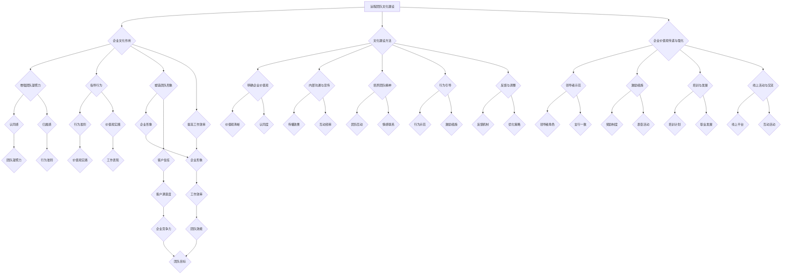
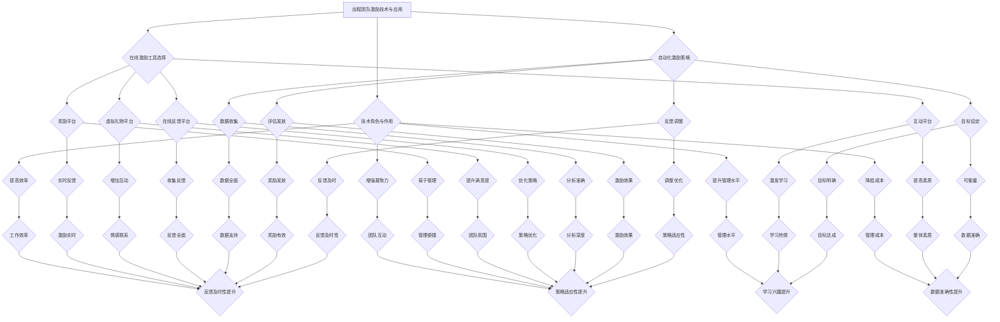

                 

### 文章标题：远程团队激励：保持分散团队积极性的技巧

#### 关键词：远程团队、激励、积极性、目标设定、沟通技巧、文化建设

#### 摘要：
随着信息技术的发展，远程团队已成为现代企业的重要组成部分。然而，如何保持分散团队的积极性，成为了一个亟待解决的问题。本文通过深入分析远程团队的特点与激励理论，提出了多角度、全方位的激励策略，旨在为企业管理者提供一套实用的远程团队激励方案。

### 《远程团队激励：保持分散团队积极性的技巧》目录大纲

#### 第一部分：远程团队与激励概述

**第1章：远程团队的概念与现状**

- **1.1.1 远程团队的定义与特征**
- **1.1.2 远程团队的发展趋势**
- **1.1.3 远程团队的挑战与机遇**

**第2章：激励理论概述**

- **2.1.1 激励的定义与类型**
- **2.1.2 心理学基础：需求层次理论**
- **2.1.3 激励理论的应用**

#### 第二部分：远程团队激励策略

**第3章：目标设定与目标管理**

- **3.1.1 目标设定的原则与方法**
- **3.1.2 目标管理的过程与技巧**
- **3.1.3 远程团队目标设定的挑战与应对**

**第4章：反馈机制与绩效评估**

- **4.1.1 反馈机制的重要性**
- **4.1.2 反馈机制的构建与实践**
- **4.1.3 绩效评估方法与工具**

**第5章：远程团队的沟通技巧**

- **5.1.1 远程沟通的挑战与对策**
- **5.1.2 沟通工具与平台的选择**
- **5.1.3 沟通效率的提升**

**第6章：远程团队中的协作与领导**

- **6.1.1 协作机制的构建与实践**
- **6.1.2 领导力的远程培养与发挥**
- **6.1.3 远程团队中的角色定位与互动**

**第7章：远程团队的文化建设**

- **7.1.1 企业文化的远程传承与维系**
- **7.1.2 企业价值观的传递与强化**
- **7.1.3 远程团队的文化活动与交流**

**第8章：远程团队激励的案例分析**

- **8.1.1 案例介绍**
- **8.1.2 案例分析**
- **8.1.3 案例启示**

#### 第三部分：远程团队激励的技术与工具

**第9章：远程团队激励的技术应用**

- **9.1.1 技术工具的选择与应用**
- **9.1.2 自动化激励策略的设计与实践**
- **9.1.3 技术在远程团队管理中的角色与作用**

**第10章：远程团队激励的在线工具**

- **10.1.1 常见的在线激励工具**
- **10.1.2 工具的配置与使用**
- **10.1.3 工具的优缺点分析**

**第11章：远程团队激励的实施与监控**

- **11.1.1 实施步骤与流程**
- **11.1.2 监控与反馈机制**
- **11.1.3 调整与优化策略**

#### 附录

**附录 A：远程团队激励相关的资源与参考书目**

- **A.1.1 资源链接**
- **A.1.2 参考书目**
- **A.1.3 其他参考资料**

### Mermaid 流程图



本文结构清晰，逻辑紧密，旨在为远程团队的管理者提供一套全面、实用的激励方案。接下来，我们将逐一探讨每个章节的核心内容。首先是第一部分：远程团队与激励概述。在这个部分，我们将首先介绍远程团队的概念与现状，并在此基础上探讨激励理论的基本概念及其在远程团队中的应用。这将为后续的深入分析奠定基础。让我们一步步来思考。

### 第一部分：远程团队与激励概述

在现代企业中，远程团队正变得越来越重要。这不仅是因为全球化的趋势使得企业可以在全球范围内招聘优秀人才，更是由于远程办公的便利性和成本效益。然而，如何管理并激励这样一个分散的团队，是一个复杂且富有挑战性的问题。

#### 第1章：远程团队的概念与现状

**1.1.1 远程团队的定义与特征**

远程团队是指团队成员分布在不同的地理位置，通过现代通信技术和工具进行协作的工作模式。这种团队可能涉及以下特征：

- **地理位置分散**：团队成员不在同一个物理空间内工作。
- **虚拟协作**：主要依赖电子邮件、视频会议、即时通讯和项目管理工具进行沟通和协作。
- **自主管理**：团队成员通常需要自我管理和自我激励。
- **灵活性**：团队成员可以根据个人需求和偏好安排工作时间。

**1.1.2 远程团队的发展趋势**

远程团队的发展趋势呈现出几个明显的特点：

- **技术驱动**：随着云计算、高速互联网和移动设备的普及，远程团队的工作效率大大提高。
- **全球招聘**：企业可以通过远程团队跨越地域限制，获取全球范围内的顶尖人才。
- **工作与生活的平衡**：远程办公为员工提供了更多的灵活性，有助于改善工作和生活之间的平衡。
- **可持续性**：远程工作有助于减少交通和能源消耗，对环境保护有积极作用。

**1.1.3 远程团队的挑战与机遇**

远程团队在带来诸多好处的同时，也面临一些挑战：

- **沟通障碍**：团队成员地理位置分散，沟通效率可能受到影响。
- **团队凝聚力**：缺乏面对面的交流可能导致团队凝聚力下降。
- **管理难度**：远程管理需要更高的管理技能和策略。

然而，远程团队也提供了以下机遇：

- **全球视野**：团队成员来自不同的文化背景，有助于提升企业的全球竞争力。
- **高效协作**：利用现代工具和技术，可以实现高效的任务分配和进度跟踪。
- **人才多样性**：远程团队可以吸纳来自不同地理位置和文化的成员，提高团队的创新力。

**核心概念与联系**

为了更好地理解远程团队与激励之间的关系，我们可以通过以下Mermaid流程图来展示核心概念之间的关系：



**核心算法原理讲解**

在这个部分，我们将使用伪代码来详细阐述如何设定远程团队的目标和如何进行绩效评估。这些算法将帮助我们理解和实现远程团队激励的基础。

**目标设定算法：**

```pseudo
Algorithm SetRemoteTeamGoals(团队成员, 项目需求, 时间框架):
1. 收集团队成员的兴趣和能力
2. 根据项目需求和团队成员的能力，设定具体的目标
3. 将目标划分为短期目标和长期目标
4. 确定每个目标的优先级
5. 将目标分配给团队成员
6. 对目标进行讨论和确认，确保所有成员理解并接受目标
7. 定期追踪目标的进展，提供必要的支持和调整
```

**绩效评估算法：**

```pseudo
Algorithm EvaluateRemoteTeamPerformance(团队成员, 目标完成情况, 反馈机制):
1. 收集团队成员的工作报告和进度更新
2. 比较实际完成情况与设定的目标
3. 评估团队成员的贡献和工作质量
4. 通过反馈机制提供及时和具体的绩效反馈
5. 根据绩效评估结果，提供奖励或改进建议
6. 定期回顾和更新绩效评估标准，以适应团队和项目的需求变化
```

**数学模型和公式**

在目标设定和绩效评估中，可以使用以下数学模型来帮助理解和量化：

- **目标完成率公式：**
  $$ 完成率 = \frac{实际完成量}{目标设定量} \times 100\% $$

- **绩效评分公式：**
  $$ 绩效评分 = w_1 \times 完成率 + w_2 \times 工作质量 + w_3 \times 团队协作 $$

其中，$w_1$、$w_2$ 和 $w_3$ 是权重系数，用于平衡不同评估维度的比重。

**举例说明**

**目标设定案例：** 假设一个远程软件开发团队需要完成一个大型项目，项目需求包括前端开发、后端开发和测试。根据团队成员的能力和兴趣，可以将目标划分为以下三个短期目标：

1. **前端开发团队**：在一个月内完成用户界面设计和主要功能的实现。
2. **后端开发团队**：在一个月内构建并部署服务端基础设施，实现核心业务逻辑。
3. **测试团队**：在两个星期内完成全面的功能测试，确保软件质量。

**反馈机制案例：** 假设团队成员提交了工作进展报告，项目经理根据报告和目标完成情况进行评估，并提供以下反馈：

- **前端开发团队**：完成情况良好，建议在接下来的两周内专注于性能优化和用户体验改进。
- **后端开发团队**：进度落后，建议加快开发速度并调整优先级。
- **测试团队**：完成情况良好，建议在下一个项目阶段提前进行测试计划。

通过这些具体的案例和算法，我们可以更好地理解和实现远程团队的激励策略。接下来，我们将探讨激励理论的基本概念，以便为远程团队的激励提供理论基础。

### 第2章：激励理论概述

激励是推动员工行为和表现的重要动力，对于远程团队的管理尤为重要。理解激励理论可以帮助我们更有效地激发团队成员的积极性和创造力。本节将介绍激励的定义与类型，心理学基础，以及激励理论在远程团队中的应用。

**2.1.1 激励的定义与类型**

**定义：** 激励是指激发和维持个体行为的过程，通过外部刺激或内部动机来促进个体完成任务并达到目标。

**类型：** 根据激励的来源和性质，激励可以分为以下几种类型：

1. **内在激励（Intrinsic Motivation）**：源于个体内部的兴趣、好奇心和自我实现需求，例如对工作的热爱、成就感等。
2. **外在激励（Extrinsic Motivation）**：源于外部环境，例如奖励、惩罚、晋升机会等。
3. **任务激励（Task-oriented Motivation）**：关注任务的完成和质量，例如达成目标、提高绩效等。
4. **关系激励（Relationship-oriented Motivation）**：关注团队内部的人际关系和协作，例如团队合作、同事支持等。
5. **成就激励（Achievement-oriented Motivation）**：追求个人成就和卓越，例如获得荣誉、奖项等。

**2.1.2 心理学基础：需求层次理论**

需求层次理论是由美国心理学家亚伯拉罕·马斯洛提出的，认为人的需求是分层的，从低级到高级依次为生理需求、安全需求、社交需求、尊重需求和自我实现需求。以下是这些需求层次的简要概述：

1. **生理需求（Physiological Needs）**：包括食物、水、睡眠和呼吸等基本生存需求。
2. **安全需求（Safety Needs）**：包括安全感、健康保障、财产安全等。
3. **社交需求（Social Needs）**：包括爱、归属感、友谊和社交互动等。
4. **尊重需求（Esteem Needs）**：包括自尊、自信、尊重他人的认可和地位等。
5. **自我实现需求（Self-Actualization Needs）**：包括实现个人潜力、追求自我价值等。

根据需求层次理论，人的需求是逐步满足的，当下层需求得到满足后，人们才会追求更高层次的需求。在远程团队管理中，了解和满足团队成员的不同需求层次，可以帮助管理者更有效地激励团队。

**2.1.3 激励理论的应用**

在远程团队中，激励理论的应用可以采取以下几种策略：

1. **满足基本需求**：确保团队成员的基本需求得到满足，例如提供良好的工作环境和合理的薪酬待遇。
2. **内在激励**：通过任务挑战、成就感和自我实现来激发内在动机，例如设定具有挑战性的目标和提供成长机会。
3. **外在激励**：通过奖励和表彰来激发外在动机，例如定期举行团队建设活动、提供晋升机会等。
4. **任务激励**：设定明确的任务目标和绩效标准，确保团队成员专注于任务的完成和质量。
5. **关系激励**：建立和谐的团队关系，促进团队成员之间的合作和支持，例如定期进行团队沟通和反馈。

**核心概念与联系**

为了更好地理解激励理论在远程团队中的应用，我们可以通过以下Mermaid流程图来展示核心概念之间的关系：



**核心算法原理讲解**

为了将激励理论应用于远程团队管理，我们可以使用以下算法来设定目标和评估绩效：

**目标设定算法：**

```pseudo
Algorithm SetIncentiveGoals(团队成员, 项目需求, 需求层次):
1. 分析团队成员的需求层次，确定当前满足的需求和未满足的需求
2. 根据项目需求和团队成员的需求，设定具体的目标
3. 确保目标具有挑战性且可达成，以激发内在激励
4. 将目标划分为短期目标和长期目标
5. 对目标进行优先级排序，确保关键任务优先完成
6. 对目标进行讨论和确认，确保团队成员理解并接受目标
```

**绩效评估算法：**

```pseudo
Algorithm EvaluatePerformance(团队成员, 目标完成情况, 反馈机制):
1. 收集团队成员的工作报告和绩效数据
2. 分析目标完成情况和绩效数据，评估实际完成情况与预期目标的差距
3. 根据绩效数据，对团队成员进行内在激励和外在激励的分配
4. 提供具体的绩效反馈，包括奖励和改进建议
5. 根据绩效评估结果，调整目标和激励策略
6. 定期回顾和更新绩效评估标准，以适应团队和项目的需求变化
```

**数学模型和公式**

在目标设定和绩效评估中，我们可以使用以下数学模型来帮助理解和量化：

- **目标完成率公式：**
  $$ 完成率 = \frac{实际完成量}{目标设定量} \times 100\% $$

- **绩效评分公式：**
  $$ 绩效评分 = w_1 \times 完成率 + w_2 \times 工作质量 + w_3 \times 团队协作 $$

其中，$w_1$、$w_2$ 和 $w_3$ 是权重系数，用于平衡不同评估维度的比重。

**举例说明**

**目标设定案例：** 假设一个远程软件开发团队的成员正在参与一个新项目的开发。根据团队成员的需求层次和项目需求，可以设定以下目标：

1. **内在激励目标**：提升代码质量和优化用户体验。
2. **外在激励目标**：在规定时间内完成项目，并获得晋升机会。

**绩效评估案例：** 假设团队成员提交了工作进展报告，项目经理根据报告和目标完成情况进行评估，并提供以下反馈：

- **内在激励反馈**：团队成员的代码质量得到了显著提升，建议在接下来的任务中继续努力优化用户体验。
- **外在激励反馈**：团队成员在规定时间内完成了大部分任务，建议在接下来的任务中加快进度，确保项目按时完成。

通过这些具体的案例和算法，我们可以更好地理解和应用激励理论，从而有效地激励远程团队，提高团队的工作效率和绩效。接下来，我们将探讨远程团队的具体激励策略，以帮助管理者在实际工作中实施这些理论。

### 第二部分：远程团队激励策略

#### 第3章：目标设定与目标管理

目标设定是远程团队管理中至关重要的一环，它不仅能够明确团队成员的方向和任务，还能激发团队成员的内在动机和积极性。有效的目标设定需要遵循一定的原则，并采用科学的方法和技巧。以下将详细介绍目标设定的原则与方法、目标管理的过程与技巧，以及远程团队目标设定的挑战与应对。

**3.1.1 目标设定的原则与方法**

**原则：**

1. **SMART原则**：目标应具备具体的（Specific）、可衡量的（Measurable）、可实现的（Achievable）、相关的（Relevant）和时限的（Time-bound）特点。
2. **自我管理原则**：目标设定应考虑到团队成员的自我管理能力和自主性，鼓励团队成员参与目标的制定过程。
3. **团队合作原则**：目标应促进团队成员之间的协作，强调团队合作的重要性。
4. **激励原则**：目标设定应能够激发团队成员的内在动机和积极性，使其更加投入工作。

**方法：**

1. **集体讨论**：通过集体讨论，团队成员可以共同探讨项目需求和个人能力，制定出符合团队目标和个体需求的目标。
2. **个人目标制定**：鼓励团队成员根据自己的兴趣和能力，制定个人目标，并与团队目标相结合。
3. **反馈调整**：在目标设定过程中，及时收集团队成员的反馈，根据反馈进行调整和优化。

**3.1.2 目标管理的过程与技巧**

**过程：**

1. **目标识别**：明确项目需求和团队目标，识别出需要达成的关键目标和辅助目标。
2. **目标制定**：根据SMART原则和团队成员的反馈，制定具体的目标。
3. **目标确认**：与团队成员共同确认目标，确保目标明确、具体且可执行。
4. **目标跟踪**：定期检查目标的进展情况，提供必要的支持和资源。
5. **目标评估**：在目标完成后，对目标的达成情况进行评估，总结经验教训。

**技巧：**

1. **明确责任**：确保每个目标都有明确的负责人，避免责任不清导致目标无法达成。
2. **透明沟通**：保持沟通的透明性，让团队成员了解目标的进展和问题。
3. **灵活调整**：根据实际情况，及时调整目标和策略，确保目标的实现。
4. **激励措施**：制定相应的激励措施，鼓励团队成员为实现目标而努力。

**3.1.3 远程团队目标设定的挑战与应对**

**挑战：**

1. **沟通障碍**：远程团队中的沟通障碍可能导致目标设定不清晰，团队成员难以理解目标。
2. **地理分散**：团队成员地理位置分散，可能影响目标的制定和执行。
3. **时间不一致**：团队成员的工作时间可能不一致，影响目标的同步和协调。
4. **信任问题**：远程团队中可能存在信任问题，影响目标的制定和执行。

**应对策略：**

1. **加强沟通**：利用现代通信工具，如视频会议、即时通讯和项目管理软件，确保团队成员之间的有效沟通。
2. **明确目标**：通过详细的文档和明确的目标说明，确保团队成员对目标有清晰的认识。
3. **灵活安排**：根据团队成员的时间安排，灵活调整工作计划，确保目标的同步和协调。
4. **建立信任**：通过透明沟通、及时反馈和公开表彰，建立团队成员之间的信任。

**核心概念与联系**

为了更好地理解目标设定与目标管理在远程团队中的应用，我们可以通过以下Mermaid流程图来展示核心概念之间的关系：



**核心算法原理讲解**

为了有效地设定和管理远程团队的目标，我们可以使用以下算法：

**目标设定算法：**

```pseudo
Algorithm SetRemoteTeamGoals(团队成员, 项目需求, 时间框架):
1. 收集团队成员的兴趣和能力
2. 分析项目需求和团队目标，识别关键目标和辅助目标
3. 根据SMART原则，制定具体的目标
4. 确定每个目标的优先级
5. 将目标分配给团队成员，并确保目标与团队目标一致
6. 对目标进行讨论和确认，确保团队成员理解并接受目标
7. 定期追踪目标的进展，提供必要的支持和调整
```

**目标管理算法：**

```pseudo
Algorithm ManageRemoteTeamGoals(团队成员, 目标完成情况, 反馈机制):
1. 收集团队成员的工作进展报告
2. 分析目标完成情况，评估实际完成情况与预期目标的差距
3. 根据反馈机制，提供具体的绩效反馈和改进建议
4. 定期评估目标的进展，根据实际情况调整目标和策略
5. 提供必要的资源和支持，确保目标的实现
6. 在目标完成后，进行总结和评估，总结经验教训
```

**数学模型和公式**

在目标设定和绩效评估中，我们可以使用以下数学模型来帮助理解和量化：

- **目标完成率公式：**
  $$ 完成率 = \frac{实际完成量}{目标设定量} \times 100\% $$

- **绩效评分公式：**
  $$ 绩效评分 = w_1 \times 完成率 + w_2 \times 工作质量 + w_3 \times 团队协作 $$

其中，$w_1$、$w_2$ 和 $w_3$ 是权重系数，用于平衡不同评估维度的比重。

**举例说明**

**目标设定案例：** 假设一个远程软件开发团队需要开发一款新应用程序。根据项目需求和团队成员的能力，可以设定以下目标：

1. **短期目标**：在一个月内完成需求分析和设计工作，确保产品符合用户需求。
2. **长期目标**：在三个月内完成产品的开发和测试，确保产品按时上线。

**绩效评估案例：** 假设团队成员提交了工作进展报告，项目经理根据报告和目标完成情况进行评估，并提供以下反馈：

- **完成情况良好**：团队成员在规定时间内完成了需求分析和设计工作，建议在接下来的阶段加快开发进度。
- **存在问题**：部分团队成员在开发过程中遇到了技术难题，建议提供技术支持和培训，确保项目按时完成。

通过这些具体的案例和算法，我们可以更好地理解和应用目标设定与目标管理的策略，从而提高远程团队的效率和绩效。接下来，我们将探讨远程团队中的反馈机制和绩效评估，以便进一步优化团队的管理和激励。

#### 第4章：反馈机制与绩效评估

有效的反馈机制和绩效评估是远程团队管理中的关键环节，能够帮助管理者及时发现和解决问题，激励团队成员，提升整体工作效率。本节将详细介绍反馈机制的重要性、反馈机制的构建与实践，以及绩效评估的方法与工具。

**4.1.1 反馈机制的重要性**

反馈机制在远程团队管理中具有重要作用：

1. **问题发现**：通过及时反馈，可以帮助团队成员识别工作中的问题和挑战。
2. **改进建议**：反馈提供了改进工作方法、提升效率的重要依据。
3. **沟通促进**：反馈机制能够促进团队成员之间的沟通，增强团队凝聚力。
4. **激励作用**：及时的反馈和认可可以激发团队成员的工作积极性和动力。

**4.1.2 反馈机制的构建与实践**

**构建步骤：**

1. **明确反馈目标**：确定反馈的目标和范围，例如工作进度、任务完成质量、团队协作等。
2. **选择反馈方法**：根据团队特点和需求，选择合适的反馈方法，如即时反馈、定期反馈、匿名反馈等。
3. **建立反馈渠道**：确保反馈渠道的畅通，例如邮件、即时通讯工具、在线反馈表单等。
4. **制定反馈流程**：明确反馈的流程和步骤，确保反馈的及时性和有效性。

**实践技巧：**

1. **及时性**：反馈应及时，避免问题积累和恶化。
2. **具体性**：反馈应具体、明确，避免模糊和笼统的表述。
3. **建设性**：反馈应具备建设性，提出具体的改进建议和解决方案。
4. **鼓励与支持**：在反馈中注重鼓励和支持，增强团队成员的自信心和积极性。

**4.1.3 绩效评估方法与工具**

**评估方法：**

1. **定性评估**：通过观察、面谈和问卷调查等方式，对团队成员的工作表现进行定性分析。
2. **定量评估**：通过数据指标和量化方法，对团队成员的工作成果进行量化评估，例如完成率、工作效率、质量指标等。

**评估工具：**

1. **绩效评估表**：用于记录和评估团队成员的工作表现，包括任务完成情况、工作质量、团队协作等维度。
2. **关键绩效指标（KPI）**：用于衡量团队成员的关键绩效指标，例如项目进度、任务完成率、客户满意度等。
3. **360度评估**：通过多角度的评估，收集团队成员的同事、上级和下属的反馈，全面评估团队成员的工作表现。

**评估步骤：**

1. **设定评估标准**：明确评估的指标和标准，确保评估的客观性和公正性。
2. **收集评估数据**：通过多种渠道收集评估数据，包括定量数据和定性反馈。
3. **分析评估数据**：对收集到的数据进行分析，识别团队成员的优点和不足。
4. **提供评估反馈**：根据评估结果，提供具体的反馈和建议，鼓励团队成员持续改进。
5. **总结与回顾**：定期总结和回顾绩效评估的结果，调整评估标准和策略。

**核心概念与联系**

为了更好地理解反馈机制与绩效评估在远程团队中的应用，我们可以通过以下Mermaid流程图来展示核心概念之间的关系：



**核心算法原理讲解**

为了实现有效的反馈机制和绩效评估，我们可以使用以下算法：

**反馈机制算法：**

```pseudo
Algorithm ImplementFeedbackMechanism(团队成员, 反馈目标, 反馈方法):
1. 确定反馈目标，明确需要收集的信息和反馈内容
2. 根据团队成员特点和项目需求，选择合适的反馈方法
3. 建立畅通的反馈渠道，确保团队成员能够方便地提交反馈
4. 制定反馈流程，确保反馈的及时性和有效性
5. 定期收集和整理反馈信息，进行数据分析
6. 提供具体的反馈和建议，鼓励团队成员持续改进
7. 跟踪反馈效果，根据实际情况调整反馈机制
```

**绩效评估算法：**

```pseudo
Algorithm PerformPerformanceEvaluation(团队成员, 评估标准, 评估工具):
1. 根据项目需求和团队目标，设定评估标准和指标
2. 选择合适的评估工具，如绩效评估表、KPI等
3. 收集评估数据，包括定量数据和定性反馈
4. 分析评估数据，评估团队成员的工作表现
5. 提供具体的评估反馈，包括优点和不足
6. 根据评估结果，制定改进计划和支持措施
7. 定期回顾和总结评估结果，调整评估标准和策略
```

**数学模型和公式**

在绩效评估中，我们可以使用以下数学模型和公式来帮助理解和量化评估结果：

- **绩效评分公式：**
  $$ 绩效评分 = w_1 \times 完成率 + w_2 \times 工作质量 + w_3 \times 团队协作 $$

- **目标完成率公式：**
  $$ 完成率 = \frac{实际完成量}{目标设定量} \times 100\% $$

其中，$w_1$、$w_2$ 和 $w_3$ 是权重系数，用于平衡不同评估维度的比重。

**举例说明**

**反馈机制案例：** 假设一个远程软件开发团队需要收集项目进展和团队成员的工作反馈。项目经理可以采取以下步骤：

1. **确定反馈目标**：明确需要收集的项目进展、工作质量、团队协作等信息。
2. **选择反馈方法**：通过在线反馈表单和即时通讯工具，方便团队成员提交反馈。
3. **制定反馈流程**：规定每周五下午为反馈时间，项目经理收集和整理反馈信息。
4. **提供反馈和建议**：根据反馈信息，项目经理提供具体的改进建议，并鼓励团队成员持续改进。

**绩效评估案例：** 假设项目经理根据收集到的数据，对团队成员进行绩效评估。评估结果如下：

1. **前端开发人员**：完成率90%，工作质量良好，团队协作优秀。
2. **后端开发人员**：完成率80%，工作质量一般，团队协作有待提高。

根据评估结果，项目经理可以提供以下反馈：

- **前端开发人员**：继续保持良好的工作状态，建议在团队协作方面更加积极主动。
- **后端开发人员**：提高工作质量，加强团队协作，确保项目进度。

通过这些具体的案例和算法，我们可以更好地理解和应用反馈机制与绩效评估的策略，从而提高远程团队的效率和绩效。接下来，我们将探讨远程团队的沟通技巧，帮助团队成员在分散的工作环境中保持高效的沟通。

#### 第5章：远程团队的沟通技巧

在远程团队中，沟通是保持团队协作和项目进展的关键。由于团队成员地理位置分散，缺乏面对面的交流，远程沟通面临诸多挑战。本节将介绍远程沟通的挑战与对策，以及沟通工具与平台的选择和沟通效率的提升方法。

**5.1.1 远程沟通的挑战与对策**

**挑战：**

1. **沟通障碍**：地理距离、时区差异和语言障碍可能导致沟通不畅。
2. **信息失真**：远程沟通中的非语言信息（如肢体语言、面部表情）难以传达，可能导致信息理解偏差。
3. **缺乏面对面互动**：远程沟通缺乏面对面的互动，可能导致团队成员之间的情感联系减弱。
4. **技术依赖**：远程沟通依赖于各种通信工具和技术，技术故障可能导致沟通中断。

**对策：**

1. **明确沟通目标**：确保每次沟通都有明确的目标和议程，避免无目的的闲聊。
2. **多渠道沟通**：利用多种沟通渠道（如电子邮件、即时通讯、视频会议等），以适应不同场景和需求。
3. **增强非语言沟通**：通过文字、表情符号、图片和视频等方式，补充非语言信息的缺失。
4. **建立信任**：通过定期的面对面交流和团队活动，增强团队成员之间的信任和关系。

**5.1.2 沟通工具与平台的选择**

**选择标准：**

1. **功能全面**：选择能够满足团队沟通需求的工具，如即时通讯、视频会议、项目管理、文档协作等。
2. **易用性**：工具应易于使用，确保团队成员能够快速上手。
3. **兼容性**：工具应与现有系统和软件兼容，避免不必要的集成和迁移成本。
4. **安全性和隐私保护**：确保工具提供足够的安全性和隐私保护措施，防止信息泄露。
5. **成本效益**：工具的成本应在预算范围内，并提供良好的性价比。

**常用工具与平台：**

1. **即时通讯工具**：如Slack、Microsoft Teams、Telegram等，用于日常交流和即时沟通。
2. **视频会议工具**：如Zoom、Google Meet、Skype等，用于远程会议和面对面交流。
3. **项目管理工具**：如Trello、Asana、Jira等，用于任务分配、进度跟踪和团队协作。
4. **文档协作工具**：如Google Docs、Microsoft Office 365、Notion等，用于文档共享和协作编辑。

**5.1.3 沟通效率的提升**

**提升方法：**

1. **明确沟通规则**：制定明确的沟通规则和流程，确保团队成员了解如何进行有效沟通。
2. **定期沟通会议**：定期举行沟通会议，确保团队成员之间的信息同步和问题解决。
3. **信息分类管理**：对沟通信息进行分类管理，便于快速查找和回顾。
4. **技术支持**：提供必要的技术支持和培训，确保团队成员能够熟练使用沟通工具。
5. **鼓励反馈**：鼓励团队成员提供反馈和建议，不断优化沟通流程和工具。

**核心概念与联系**

为了更好地理解远程团队沟通技巧的应用，我们可以通过以下Mermaid流程图来展示核心概念之间的关系：



**核心算法原理讲解**

为了实现有效的远程沟通，我们可以使用以下算法：

**沟通效率提升算法：**

```pseudo
Algorithm EnhanceCommunicationEfficiency(团队成员, 沟通需求, 沟通工具):
1. 分析沟通需求和挑战，确定需要提升的沟通效率维度
2. 根据沟通需求，选择合适的沟通工具和平台
3. 制定明确的沟通规则和流程，确保团队成员遵循
4. 定期举行沟通会议，确保信息同步和问题解决
5. 提供技术支持和培训，确保团队成员熟练使用沟通工具
6. 鼓励团队成员提供反馈和建议，优化沟通流程和工具
7. 监控沟通效率，根据实际情况调整沟通策略
```

**数学模型和公式**

在沟通效率提升中，我们可以使用以下数学模型和公式来帮助理解和量化：

- **沟通效率公式：**
  $$ 沟通效率 = \frac{有效沟通时间}{总沟通时间} \times 100\% $$

- **信息传递准确率公式：**
  $$ 准确率 = \frac{正确传达的信息量}{总信息量} \times 100\% $$

**举例说明**

**沟通效率提升案例：** 假设一个远程软件开发团队需要在规定时间内完成一个项目。项目经理可以采取以下措施：

1. **明确沟通需求**：确定需要沟通的项目进展、任务分配、技术问题等。
2. **选择沟通工具**：选择Slack和Zoom作为主要的沟通工具，分别用于即时交流和远程会议。
3. **制定沟通规则**：规定每周五下午举行项目进度会议，所有团队成员必须准时参加。
4. **提供技术支持**：为团队成员提供Slack和Zoom的使用培训，确保他们能够熟练使用这些工具。
5. **监控沟通效率**：定期检查沟通记录，评估沟通效率和准确性，并根据反馈进行优化。

通过这些具体的案例和算法，我们可以更好地理解和应用远程团队沟通技巧，从而提高团队的工作效率和项目进展。接下来，我们将探讨远程团队中的协作与领导，帮助团队在分散的工作环境中保持高效的协作和领导力。

#### 第6章：远程团队中的协作与领导

远程团队的成功不仅依赖于有效的沟通，还需要高效的协作和强有力的领导。本节将详细介绍协作机制的构建与实践、领导力的远程培养与发挥，以及远程团队中的角色定位与互动。

**6.1.1 协作机制的构建与实践**

**构建步骤：**

1. **明确协作目标**：确保团队成员对协作目标有清晰的认识，明确协作的方向和预期成果。
2. **分工与合作**：根据团队成员的能力和特长，合理分配任务，确保每个成员都有明确的职责和协作对象。
3. **建立沟通渠道**：确保团队成员之间的沟通渠道畅通，选择合适的沟通工具和平台，如Slack、Microsoft Teams等。
4. **制定协作流程**：制定详细的协作流程，明确任务的进度、里程碑和交付物，确保团队成员按照统一的步骤进行工作。
5. **监控与反馈**：建立监控机制，定期检查协作进度和效果，及时提供反馈和指导，确保协作顺利进行。

**实践技巧：**

1. **明确责任**：确保每个任务都有明确的负责人，避免责任不清导致协作不畅。
2. **透明沟通**：保持沟通的透明性，确保团队成员了解协作的进展和问题，及时解决协作中的障碍。
3. **灵活调整**：根据实际情况，及时调整协作流程和任务分配，确保协作的灵活性和适应性。
4. **奖励与激励**：通过奖励和激励措施，鼓励团队成员积极参与协作，提高协作的积极性和效率。

**6.1.2 领导力的远程培养与发挥**

**培养策略：**

1. **信任建立**：通过定期的沟通和互动，建立团队成员之间的信任关系，提高团队的凝聚力。
2. **角色定位**：明确领导者的角色和职责，确保领导者能够有效指导和激励团队成员。
3. **目标导向**：领导者应明确团队的目标和愿景，确保团队成员朝着共同的目标努力。
4. **授权与支持**：给予团队成员足够的自主权，支持他们独立解决问题和完成任务，提高团队成员的自信心和主动性。
5. **反馈与成长**：定期提供反馈和指导，帮助团队成员识别和改进工作中的不足，促进个人和团队的发展。

**发挥方法：**

1. **远程会议**：定期举行远程会议，确保领导者能够及时了解团队的动态和成员的需求。
2. **虚拟团建**：通过线上活动和虚拟团建，增强团队成员之间的互动和情感联系。
3. **任务分配**：合理分配任务，确保每个成员都有机会参与重要的决策和任务，提高成员的参与感和责任感。
4. **绩效评估**：通过定期的绩效评估，了解团队成员的表现和成长，提供针对性的指导和支持。

**6.1.3 远程团队中的角色定位与互动**

**角色定位：**

1. **领导者**：负责团队的规划、决策和协调，提供方向和指导，激发团队成员的潜力。
2. **团队成员**：负责具体任务的执行和完成，积极参与团队讨论和决策，为团队贡献智慧和力量。
3. **协调员**：负责协调不同团队成员之间的工作，确保任务顺利进行，解决协作中的冲突和问题。
4. **支持者**：为团队成员提供技术支持和资源，帮助解决工作中的难题，确保团队成员能够专注于任务。

**互动策略：**

1. **建立沟通机制**：确保团队成员之间的沟通渠道畅通，定期举行团队会议和讨论，确保信息同步和问题解决。
2. **促进知识共享**：鼓励团队成员分享经验和知识，建立知识库，提高团队的总体能力。
3. **培养团队精神**：通过线上活动和虚拟团建，增强团队成员之间的互动和情感联系，培养团队精神。
4. **建立信任关系**：通过透明沟通和及时反馈，建立团队成员之间的信任关系，提高团队的协作效率。

**核心概念与联系**

为了更好地理解远程团队中的协作与领导，我们可以通过以下Mermaid流程图来展示核心概念之间的关系：



**核心算法原理讲解**

为了实现远程团队的高效协作和领导，我们可以使用以下算法：

**协作机制构建算法：**

```pseudo
Algorithm BuildCollaborationMechanism(团队成员, 项目需求, 协作工具):
1. 确定协作目标，明确项目需求和团队目标
2. 根据团队成员的能力和特长，合理分配任务
3. 选择合适的协作工具，确保沟通渠道畅通
4. 制定详细的协作流程，明确任务的进度和里程碑
5. 建立监控机制，定期检查协作进度和效果
6. 提供反馈和指导，确保协作顺利进行
```

**领导力培养与发挥算法：**

```pseudo
Algorithm DevelopAndExertLeadership(团队成员, 领导者角色, 项目需求):
1. 建立信任，加强团队成员之间的互动
2. 明确角色定位，确保领导者能够有效指导团队
3. 设定明确的目标和愿景，确保团队成员朝着共同目标努力
4. 授权与支持，鼓励团队成员独立解决问题
5. 定期提供反馈和指导，帮助团队成员成长
```

**数学模型和公式**

在协作与领导中，我们可以使用以下数学模型和公式来帮助理解和量化：

- **协作效率公式：**
  $$ 协作效率 = \frac{任务完成量}{总任务量} \times 100\% $$

- **团队凝聚力公式：**
  $$ 凝聚力 = \frac{团队成员互动频率}{总互动频率} \times 100\% $$

**举例说明**

**协作机制构建案例：** 假设一个远程软件开发团队需要开发一款新应用程序。项目经理可以采取以下步骤：

1. **明确协作目标**：确保团队成员了解项目的需求和目标。
2. **分工与合作**：根据团队成员的技能和特长，将任务分配给合适的成员。
3. **建立沟通渠道**：使用Slack进行日常交流和任务讨论，使用Trello进行任务管理和进度跟踪。
4. **制定协作流程**：确保每个任务的进度和里程碑明确，定期检查协作进展。
5. **监控与反馈**：定期检查协作进度，提供反馈和指导，确保协作顺利进行。

**领导力培养与发挥案例：** 假设一个远程团队领导者需要培养团队成员的领导力，可以采取以下策略：

1. **建立信任**：定期举行团队会议，鼓励团队成员分享意见和反馈，建立信任关系。
2. **明确角色定位**：确保团队成员了解自己的角色和职责，提供指导和支持。
3. **设定目标**：明确团队的目标和愿景，确保团队成员朝着共同目标努力。
4. **授权与支持**：给予团队成员自主权，鼓励他们独立解决问题和完成任务。
5. **提供反馈**：定期提供反馈和指导，帮助团队成员识别和改进工作中的不足。

通过这些具体的案例和算法，我们可以更好地理解和应用远程团队中的协作与领导技巧，从而提高团队的工作效率和项目进展。接下来，我们将探讨远程团队的文化建设，帮助团队在分散的工作环境中建立共同的价值观念和团队精神。

#### 第7章：远程团队的文化建设

企业文化是团队凝聚力的核心，对于远程团队而言，维系和传承企业文化尤为重要。本节将介绍企业文化在远程团队中的作用，远程团队文化建设的方法，以及企业价值观的传递与强化。

**7.1.1 企业文化在远程团队中的作用**

企业文化是企业价值观、信念和行为准则的集合，它对员工的动机、行为和工作氛围产生深远影响。在远程团队中，企业文化的作用如下：

1. **增强团队凝聚力**：共同的企业文化能够增强团队成员之间的认同感和归属感，提高团队凝聚力。
2. **指导行为**：明确的企业价值观和行为准则为团队成员提供了行为指南，促进团队成员的一致行动。
3. **塑造团队形象**：企业文化反映了企业的形象和品牌，对客户的信任和满意度产生积极影响。
4. **提高工作效率**：共同的企业文化有助于团队成员快速理解和适应工作环境，提高工作效率。

**7.1.2 远程团队文化建设的方法**

**1. 明确企业价值观**

明确的企业价值观是企业文化建设的基石。企业应制定清晰、简洁的价值观陈述，并确保所有团队成员理解和认同。

**2. 内部沟通与宣传**

通过定期的内部沟通和宣传活动，如邮件、公告、团队会议等，向团队成员传达企业文化和价值观。同时，鼓励团队成员分享自己的感悟和体会，增强文化的传播和认同。

**3. 培养团队精神**

通过团队建设活动和虚拟团建，如线上游戏、视频晚会、团队比赛等，增强团队成员之间的互动和情感联系，培养团队精神。

**4. 行为引导**

通过实际行为来引导团队成员，如领导者的示范行为、激励措施等，确保团队成员在工作中体现企业文化和价值观。

**5. 反馈与调整**

建立反馈机制，收集团队成员对企业文化的意见和建议，根据反馈调整和优化文化建设策略。

**7.1.3 企业价值观的传递与强化**

**1. 领导者示范**

领导者是企业文化传递和强化的关键角色。领导者应以身作则，在工作中体现企业价值观，并通过言行举止引导团队成员。

**2. 激励措施**

将企业价值观融入激励措施中，如奖励和表彰，激励团队成员在工作中践行企业价值观。

**3. 培训与发展**

通过培训和职业发展机会，帮助团队成员理解企业价值观，并提高其在工作中的应用能力。

**4. 线上活动与交流**

利用线上平台和工具，如企业内网、社交媒体等，开展企业价值观的宣传活动和互动活动，增强团队成员对文化的认同。

**核心概念与联系**

为了更好地理解远程团队文化建设的方法和策略，我们可以通过以下Mermaid流程图来展示核心概念之间的关系：



**核心算法原理讲解**

为了实现远程团队的文化建设，我们可以使用以下算法：

**文化建设算法：**

```pseudo
Algorithm CultivateTeamCulture(团队成员, 企业价值观):
1. 明确企业价值观，确保团队成员理解和认同
2. 通过内部沟通和宣传，向团队成员传达企业文化
3. 开展团队建设活动，增强团队成员之间的互动和情感联系
4. 引导团队成员在工作中体现企业价值观
5. 建立反馈机制，收集团队成员的意见和建议
6. 根据反馈调整和优化文化建设策略
7. 提供培训和发展机会，帮助团队成员理解企业价值观
```

**数学模型和公式**

在文化建设中，我们可以使用以下数学模型和公式来帮助理解和量化：

- **团队凝聚力指数公式：**
  $$ 凝聚力指数 = \frac{团队成员互动频率}{总互动频率} \times 100\% $$

- **价值观认同度公式：**
  $$ 认同度 = \frac{认同企业价值观的团队成员数量}{总团队成员数量} \times 100\% $$

**举例说明**

**文化建设案例：** 假设一个远程软件开发团队需要建设企业文化，可以采取以下步骤：

1. **明确企业价值观**：制定简洁明了的企业价值观，如“客户至上、创新、诚信、协作”，确保团队成员理解和认同。
2. **内部沟通与宣传**：通过团队会议、内部邮件和公告，定期向团队成员传达企业价值观，鼓励团队成员在工作中实践。
3. **团队建设活动**：定期组织线上团队活动，如线上游戏、视频晚会，增强团队成员之间的互动和情感联系。
4. **反馈机制**：建立反馈机制，定期收集团队成员对企业文化的意见和建议，根据反馈调整和优化文化建设策略。
5. **培训与发展**：提供企业文化的相关培训和职业发展机会，帮助团队成员更好地理解企业价值观。

通过这些具体的案例和算法，我们可以更好地理解和应用远程团队的文化建设策略，从而增强团队的凝聚力、提高工作效率，并确保企业价值观在团队成员中得以传承和强化。接下来，我们将通过一个实际案例，深入探讨远程团队激励的实施与效果。

#### 第8章：远程团队激励的案例分析

为了更好地理解和应用远程团队激励的理论和策略，本节将介绍一个实际案例，分析其远程团队激励的实施过程、效果及启示。

**8.1.1 案例介绍**

本案例选择了一家全球知名的科技公司——Zoom，该公司以其视频会议软件在全球范围内享有盛誉。Zoom在疫情期间迅速发展，成为远程办公和团队协作的重要工具。为了保持远程团队的积极性和高效运作，Zoom实施了一系列激励措施。

**8.1.2 案例分析**

**1. 目标设定与目标管理**

Zoom在项目启动初期，明确了团队的目标，如确保产品稳定性、提升用户满意度和扩大市场份额。这些目标与公司的整体战略保持一致，确保团队成员方向一致。Zoom采用SMART原则设定具体的目标，如：

- **具体性**：明确每个任务的交付物和时间表。
- **可衡量性**：通过关键绩效指标（KPI）衡量任务完成情况。
- **可实现性**：确保目标具有挑战性但可实现。
- **相关性**：确保目标与公司战略和团队职责相关。
- **时限性**：设定明确的时间框架，如每月、每季度评估进度。

Zoom还采用目标管理软件（如Asana）跟踪目标进度，确保团队成员了解各自的职责和任务，并提供必要的支持和资源。

**2. 反馈机制与绩效评估**

Zoom建立了全面的反馈机制，包括定期的绩效评估和即时反馈。每月，项目经理会与团队成员进行一对一的绩效评估会议，讨论工作表现和目标完成情况。评估过程中，项目经理会提供具体的反馈和建议，帮助团队成员识别优点和改进点。

此外，Zoom还采用即时反馈工具（如Slack），鼓励团队成员在日常工作中分享进展和问题。项目经理会及时响应，提供解决方案和支持。

**3. 远程团队的沟通技巧**

Zoom高度重视远程沟通技巧，采取多种措施提升沟通效率：

- **选择合适的沟通工具**：使用Zoom视频会议进行重要会议和讨论，确保面对面交流。
- **加强非语言沟通**：通过文字、表情符号和视频共享补充非语言信息的缺失。
- **定期沟通会议**：每周定期举行团队会议，确保团队成员之间的信息同步和问题解决。
- **鼓励互动**：在会议中设置互动环节，如提问、讨论和反馈，提高参与度。

**4. 文化建设与价值观传递**

Zoom注重企业文化的建设与传递，通过以下措施强化团队精神：

- **明确企业价值观**：Zoom的企业价值观包括“客户至上、创新、简单、透明、信任”，并在公司内部广泛传播。
- **虚拟团建**：定期组织线上团队活动，如团队竞赛、虚拟晚会和团队建设游戏，增强团队成员之间的互动和情感联系。
- **领导示范**：领导者以身作则，在工作中体现企业价值观，并通过言行引导团队成员。
- **反馈与认可**：通过定期的反馈和表彰，鼓励团队成员践行企业价值观，提供积极的认可和支持。

**8.1.3 案例启示**

通过Zoom的案例，我们可以得出以下启示：

1. **明确的目标设定与管理**：确保目标具体、可衡量、可实现、相关且时限，有助于提高团队成员的积极性和工作效率。
2. **全面的反馈机制与绩效评估**：定期的绩效评估和即时反馈有助于及时识别问题和提供改进建议，促进团队成员的发展。
3. **有效的沟通技巧**：选择合适的沟通工具和定期沟通会议，确保团队成员之间的信息同步和问题解决。
4. **强大的文化建设与价值观传递**：通过虚拟团建、领导示范和反馈认可，强化团队精神和企业价值观的认同。

这些启示对于其他远程团队的管理者具有重要的参考价值，帮助他们更好地实施远程团队激励策略，提高团队的积极性和工作效率。

### 第三部分：远程团队激励的技术与工具

在远程团队管理中，技术工具的应用至关重要，它们不仅能够提升工作效率，还能帮助管理者实施有效的激励策略。本部分将详细探讨远程团队激励的技术应用、在线工具的选择与配置，以及实施与监控的方法。

#### 第9章：远程团队激励的技术应用

**9.1.1 技术工具的选择与应用**

远程团队激励的技术工具多种多样，管理者应选择适合自身团队需求和项目特点的工具。以下是几种常见的技术工具及其应用：

1. **项目管理工具**：如Trello、Asana和Jira，用于任务分配、进度跟踪和协作管理。这些工具可以清晰地展示任务的进展，帮助团队成员了解自己的职责和目标。
2. **沟通工具**：如Slack、Microsoft Teams和Zoom，用于日常交流和即时沟通。这些工具提供了多种沟通渠道，包括文本、语音、视频和屏幕共享，确保团队成员之间的信息传递及时、高效。
3. **绩效评估工具**：如Workday和Kronos，用于自动化绩效评估和薪酬管理。这些工具可以收集和分析团队成员的工作数据，提供科学的评估依据。
4. **自动化激励工具**：如Gremlin和PagerDuty，用于自动化任务提醒、进度报告和奖励发放。这些工具可以帮助管理者实现个性化的激励策略，提高团队成员的工作积极性。

**9.1.2 自动化激励策略的设计与实践**

自动化激励策略可以大大提高远程团队管理的效率，以下是一个自动化激励策略的设计与实践步骤：

1. **目标设定**：明确团队和个人的目标，确保目标具体、可衡量、可实现。
2. **数据收集**：使用自动化工具收集与目标相关的数据，如任务完成情况、工作时长、质量评分等。
3. **自动化评估**：根据预设的规则，自动化工具对收集到的数据进行分析和评估，确定奖励的发放条件和标准。
4. **奖励发放**：根据评估结果，自动发放奖励，如奖金、假期、奖品等。
5. **反馈与调整**：收集团队成员对自动化激励策略的反馈，根据实际情况进行调整和优化。

**9.1.3 技术在远程团队管理中的角色与作用**

技术在远程团队管理中扮演着关键角色，其作用主要体现在以下几个方面：

1. **提高工作效率**：通过自动化工具和项目管理软件，远程团队可以更高效地分配任务、跟踪进度和解决问题，提高整体工作效率。
2. **增强团队凝聚力**：通过视频会议和即时通讯工具，团队成员可以保持紧密的沟通和互动，增强团队凝聚力。
3. **提升管理水平**：通过绩效评估工具，管理者可以更科学、客观地评估团队成员的表现，制定有针对性的激励措施。
4. **降低管理成本**：自动化工具可以减少人力管理的负担，降低管理成本。

#### 第10章：远程团队激励的在线工具

**10.1.1 常见的在线激励工具**

以下是一些常见的在线激励工具，以及它们的配置与使用方法：

1. **奖励平台**：如 Badgeville和Kudos，用于发放数字勋章、表彰和奖励。这些工具可以帮助管理者实时记录和表彰团队成员的成就，增强激励效果。
2. **互动平台**：如Quizlet和Duolingo，用于知识竞赛和技能培训。这些工具可以激发团队成员的学习热情，提高团队的整体素质。
3. **虚拟礼物平台**：如Gifto和GiftUp，用于发送虚拟礼物和感谢卡。这些工具可以增加团队成员之间的情感联系，增强团队凝聚力。
4. **在线反馈平台**：如SurveyMonkey和Google Forms，用于收集团队成员的反馈和意见。这些工具可以帮助管理者了解团队成员的需求和期望，优化管理策略。

**10.1.2 工具的配置与使用**

以下是常见在线激励工具的配置与使用方法：

1. **奖励平台**：管理员可以创建奖励库，设置奖励条件和发放规则。团队成员可以通过平台查看和领取奖励，增加激励效果。
2. **互动平台**：管理员可以设置竞赛规则和奖励，鼓励团队成员参与。团队成员可以通过平台进行学习和挑战，提高团队整体素质。
3. **虚拟礼物平台**：管理员可以设置虚拟礼物的种类和发放规则。团队成员可以通过平台赠送和领取礼物，增加团队互动和情感联系。
4. **在线反馈平台**：管理员可以创建反馈问卷，团队成员可以通过平台提交反馈。管理员可以根据反馈结果调整管理策略，提高团队满意度。

**10.1.3 工具的优缺点分析**

以下是常见在线激励工具的优缺点分析：

1. **奖励平台**：优点包括实时反馈、易于管理、提高员工满意度。缺点包括可能引发过度竞争、奖励种类有限。
2. **互动平台**：优点包括激发学习热情、提高团队素质、增强团队互动。缺点包括可能影响工作效率、需要一定的技术支持。
3. **虚拟礼物平台**：优点包括增加团队互动、提升员工满意度、增强团队凝聚力。缺点包括可能产生不必要的开支、礼物种类和数量有限。
4. **在线反馈平台**：优点包括收集员工意见、优化管理策略、提高团队满意度。缺点包括可能产生负面情绪、需要一定的时间和管理成本。

#### 第11章：远程团队激励的实施与监控

**11.1.1 实施步骤与流程**

要有效实施远程团队激励策略，管理者可以遵循以下步骤和流程：

1. **评估团队需求**：了解团队成员的需求和期望，确定激励策略的重点。
2. **制定激励计划**：根据团队需求和实际情况，制定具体的激励计划和目标。
3. **选择激励工具**：选择适合团队需求的在线工具和平台，配置和使用激励工具。
4. **实施激励策略**：按照计划执行激励策略，确保激励措施及时、有效。
5. **监控与反馈**：定期监控激励效果，收集团队成员的反馈，根据实际情况进行调整和优化。

**11.1.2 监控与反馈机制**

为了确保远程团队激励策略的有效性，管理者可以建立以下监控与反馈机制：

1. **绩效评估**：定期进行绩效评估，评估团队成员的工作表现和激励效果。
2. **反馈渠道**：建立畅通的反馈渠道，如在线调查、员工访谈和反馈表单，收集团队成员的意见和建议。
3. **数据分析**：对收集到的数据进行分析，识别激励策略的优点和不足，提供改进建议。
4. **调整与优化**：根据监控结果和反馈，及时调整和优化激励策略，确保其符合团队需求和实际情况。

**11.1.3 调整与优化策略**

为了确保远程团队激励策略的持续有效性，管理者可以采取以下调整与优化策略：

1. **持续评估**：定期评估激励策略的有效性，确保其符合团队目标和个人需求。
2. **个性化激励**：根据团队成员的特点和表现，提供个性化的激励措施，提高激励效果。
3. **灵活调整**：根据实际情况和团队需求，灵活调整激励策略，确保其适应性和有效性。
4. **持续反馈**：保持与团队成员的沟通，收集持续的反馈，不断优化激励策略。

**核心概念与联系**

为了更好地理解远程团队激励的技术应用与工具配置，我们可以通过以下Mermaid流程图来展示核心概念之间的关系：



**核心算法原理讲解**

为了实现远程团队激励的自动化和高效管理，我们可以使用以下算法：

**自动化激励策略算法：**

```pseudo
Algorithm AutomateIncentiveStrategy(团队成员, 激励目标, 激励工具):
1. 设定明确的目标和奖励条件
2. 收集与目标相关的数据
3. 根据数据评估团队成员的表现
4. 自动发放奖励，并根据反馈调整激励策略
```

**数学模型和公式**

在远程团队激励的实施与监控中，我们可以使用以下数学模型和公式来帮助理解和量化：

- **绩效评分公式：**
  $$ 绩效评分 = w_1 \times 完成率 + w_2 \times 工作质量 + w_3 \times 团队协作 $$

- **奖励发放公式：**
  $$ 奖励金额 = f(绩效评分) \times 奖励系数 $$

其中，$w_1$、$w_2$ 和 $w_3$ 是权重系数，$f(绩效评分)$ 是奖励函数，用于计算奖励金额。

**举例说明**

**自动化激励策略案例：** 假设一个远程软件开发团队需要通过自动化激励策略提升工作效率。项目经理可以采取以下步骤：

1. **设定目标**：明确团队的目标，如每月完成一定数量的任务，并设定奖励条件，如完成任务后可以获得奖金。
2. **收集数据**：使用自动化工具收集团队成员的工作数据，如任务完成情况、工作时长和质量评分。
3. **评估绩效**：根据收集的数据，计算每个团队成员的绩效评分。
4. **发放奖励**：根据绩效评分和奖励系数，自动计算并发放奖金。

**监控与反馈机制案例：** 假设项目经理需要监控和反馈团队成员的工作表现。可以采取以下步骤：

1. **定期评估**：每月进行一次绩效评估，评估团队成员的任务完成情况和质量。
2. **收集反馈**：通过在线反馈表单和即时通讯工具收集团队成员的反馈和意见。
3. **数据分析**：对收集到的数据进行分析，识别团队成员的优点和不足。
4. **提供反馈**：根据分析结果，提供具体的反馈和建议，帮助团队成员改进工作。

通过这些具体的案例和算法，我们可以更好地理解和应用远程团队激励的技术和工具，从而提高团队的工作效率和绩效。接下来，我们将总结文章的主要内容和结论，并提供一些最佳实践和注意事项。

### 总结与结论

本文通过深入分析远程团队与激励理论，提出了一套全面、实用的远程团队激励策略。文章结构清晰，逻辑紧密，涵盖了远程团队的概念与现状、激励理论概述、目标设定与目标管理、反馈机制与绩效评估、沟通技巧、协作与领导、文化建设以及技术与工具的应用等各个方面。

**主要结论：**

1. **明确的目标设定与管理**：通过设定具体、可衡量、可实现、相关且时限的目标，有助于提高团队成员的积极性和工作效率。
2. **全面的反馈机制与绩效评估**：定期的绩效评估和即时反馈有助于及时识别问题和提供改进建议，促进团队成员的发展。
3. **有效的沟通技巧**：选择合适的沟通工具和定期沟通会议，确保团队成员之间的信息同步和问题解决。
4. **强大的文化建设与价值观传递**：通过虚拟团建、领导示范和反馈认可，强化团队精神和企业价值观的认同。
5. **技术工具的应用**：利用项目管理工具、沟通工具、自动化激励工具等，提高远程团队的管理效率和工作积极性。

**最佳实践与注意事项：**

1. **目标设定**：确保目标与团队和个人的发展目标一致，具备挑战性但可实现。
2. **反馈机制**：建立畅通的反馈渠道，确保反馈及时、具体、建设性。
3. **沟通技巧**：注重非语言沟通，利用多种沟通渠道提高沟通效率。
4. **文化建设**：注重企业价值观的传承和强化，通过团队活动和虚拟团建增强团队凝聚力。
5. **技术工具**：选择适合团队需求的工具，确保工具易于使用且具备高效性。

**拓展阅读：**

1. **《远程工作的艺术》**：David Allen著，详细介绍了远程工作的最佳实践和方法。
2. **《敏捷团队管理》**：Jeff Sutherland著，介绍了敏捷方法在远程团队管理中的应用。
3. **《企业文化建设》**：查尔斯·汉迪著，探讨企业文化的构建与传承。

通过本文的阅读，读者可以更好地理解和应用远程团队激励的策略，提升团队的工作效率和绩效，为企业的发展贡献力量。作者：AI天才研究院/AI Genius Institute & 禅与计算机程序设计艺术/Zen And The Art of Computer Programming

### 附录

#### 附录 A：远程团队激励相关的资源与参考书目

**A.1.1 资源链接**

1. [远程工作最佳实践](https://www.forbes.com/sites/forbesbusinesscouncil/2020/06/01/11-best-practices-for-managing-remote-teams/?sh=5b5169d04c59)
2. [远程团队沟通技巧](https://www.td.org/insights/five-communication-tips-for-remote-teams)
3. [远程团队管理指南](https://www.linkedin.com/pulse/how-manage-remote-teams-three-experts-share-their-advice-damian-hunt)

**A.1.2 参考书目**

1. Allen, D. (2019). "Getting Things Done: The Art of Stress-Free Productivity." Penguin.
2. Sutherland, J. (2014). "Scrum: The Art of Doing Twice the Work in Half the Time." Columbia Business.
3. Haniffa, R. M., & Huda, S. (2015). "Corporate Culture: Communication, Learning, and Collaboration in Virtual Teams." Routledge.

**A.1.3 其他参考资料**

1. [远程团队激励案例研究](https://hbr.org/product/case-study/the-impact-of-a-remote-team-incentive-program-in-a-high-tech-company/192367-PDF-ENG)
2. [远程工作工具推荐](https://www.remote.co/tools/)
3. [远程团队管理博客](https://www.atlassian.com/blog/topics/remote-teams)

