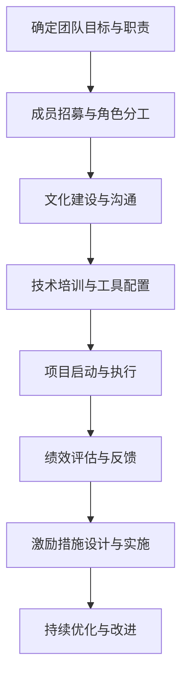

                 

### 文章标题：远程团队管理2.0：虚拟现实中的团队建设

关键词：远程团队管理、虚拟现实、团队建设、领导力、沟通技巧、绩效评估、激励措施

摘要：
随着远程工作的普及，如何有效管理远程团队成为企业管理者面临的一大挑战。本文将探讨远程团队管理2.0的概念，着重分析虚拟现实在团队建设中的应用，涵盖团队构建、管理策略、沟通技巧、绩效评估和激励措施等方面。通过深入探讨虚拟现实技术在远程团队管理中的潜力，为企业管理者提供实用的策略和工具，以提升团队效能和协作能力。

### 《远程团队管理2.0：虚拟现实中的团队建设》目录大纲

#### 第一部分：远程团队管理2.0概述

# 第1章：远程团队管理2.0的基本概念
## 1.1 远程工作的兴起与发展
### 1.1.1 远程工作的历史背景
### 1.1.2 远程工作的优势与挑战
## 1.2 虚拟现实在远程团队管理中的应用
### 1.2.1 虚拟现实的基本概念
### 1.2.2 虚拟现实在团队管理中的潜力

#### 第二部分：虚拟现实中的团队建设

# 第2章：构建虚拟现实团队
## 2.1 虚拟现实团队的组建
### 2.1.1 确定团队目标与职责
### 2.1.2 成员招募与角色分工
## 2.2 虚拟现实团队的文化建设
### 2.2.1 团队文化的内涵与价值
### 2.2.2 如何营造积极的团队文化

#### 第三部分：虚拟现实团队的管理与沟通

# 第3章：虚拟现实团队的管理策略
## 3.1 领导力与团队管理
### 3.1.1 领导力在远程团队管理中的重要性
### 3.1.2 领导者在虚拟现实团队中的角色
## 3.2 管理工具与方法
### 3.2.1 远程团队管理工具介绍
### 3.2.2 高效管理的最佳实践

# 第4章：虚拟现实团队的沟通技巧
## 4.1 沟通的重要性
### 4.1.1 沟通在团队协作中的地位
### 4.1.2 远程沟通的挑战与应对
## 4.2 虚拟现实沟通的工具与技巧
### 4.2.1 虚拟会议的优化
### 4.2.2 跨文化沟通的挑战与策略

#### 第四部分：虚拟现实团队的绩效评估与激励

# 第5章：虚拟现实团队的绩效评估
## 5.1 绩效评估的原则与标准
### 5.1.1 绩效评估的内涵与目的
### 5.1.2 绩效评估的常见方法
## 5.2 绩效反馈与改进
### 5.2.1 有效反馈的技巧
### 5.2.2 绩效改进的策略

# 第6章：虚拟现实团队的激励措施
## 6.1 激励理论概述
### 6.1.1 弗鲁姆的期望理论
### 6.1.2 马斯洛的需求层次理论
## 6.2 实际激励措施的设计与实施
### 6.2.1 虚拟奖励系统的构建
### 6.2.2 激励措施的评估与调整

#### 第五部分：虚拟现实团队的发展趋势与未来展望

# 第7章：虚拟现实团队的发展趋势
## 7.1 虚拟现实技术的最新进展
### 7.1.1 虚拟现实硬件的创新
### 7.1.2 虚拟现实软件的发展
## 7.2 虚拟现实团队的未来方向
### 7.2.1 远程团队管理2.0的挑战
### 7.2.2 未来远程团队管理的创新

# 第8章：虚拟现实团队的未来展望
## 8.1 虚拟现实团队在社会中的应用
### 8.1.1 教育领域的虚拟现实应用
### 8.1.2 医疗领域的虚拟现实应用
## 8.2 虚拟现实团队管理的研究与探索
### 8.2.1 跨学科研究的重要性
### 8.2.2 未来研究方向与建议

---

#### 附录

## 附录A：虚拟现实团队管理资源与工具
### A.1 虚拟现实团队管理相关的书籍和文章
### A.2 虚拟现实团队管理相关的在线课程和研讨会
### A.3 虚拟现实团队管理相关的软件和平台

## 附录B：虚拟现实团队管理的流程图与伪代码
### B.1 虚拟现实团队建设流程图
### B.2 虚拟现实团队绩效评估伪代码
### B.3 虚拟现实团队激励措施设计伪代码

## 附录C：虚拟现实团队管理的案例研究
### C.1 成功的虚拟现实团队管理案例
### C.2 虚拟现实团队管理中的挑战与解决方案

---

以上是《远程团队管理2.0：虚拟现实中的团队建设》的目录大纲，每个章节都进行了详细的规划，确保内容全面且具有实践价值。每章中都包含了核心概念与联系、核心算法原理讲解、数学模型与公式、项目实战等内容，以帮助读者全面理解和掌握远程团队管理2.0的概念与实践。 

### 1.1 远程工作的兴起与发展

远程工作，顾名思义，是指员工在工作地点与公司总部或其他团队成员之间没有固定的地理限制，通过互联网和其他通信工具完成工作任务的一种工作方式。远程工作的兴起可以追溯到20世纪末，随着互联网技术的发展和全球化的加速，越来越多的企业开始尝试和采用远程工作模式。以下是远程工作发展的几个关键阶段：

#### 1.1.1 远程工作的历史背景

1. **软件1.0时代：** 在软件1.0时代，远程工作主要依赖于电子邮件和简单的即时通讯工具，如ICQ、Yahoo Messenger等。这一阶段的远程工作通常是点对点的，员工需要定期回到公司总部或办公室进行面对面的交流。

2. **软件2.0时代：** 随着互联网的普及和社交媒体的发展，远程工作进入软件2.0时代。这一时期的远程工作工具变得更加多样化和协作化，如Slack、Trello、Google Drive等。远程工作的协作性和效率得到了显著提升。

3. **软件3.0时代：** 当前，远程工作正处于软件3.0时代，这一阶段的远程工作更加智能化和自动化。虚拟现实（VR）和增强现实（AR）等新兴技术的应用，使得远程工作的体验更加真实和沉浸。

#### 1.1.2 远程工作的优势与挑战

**优势：**

1. **提高员工满意度：** 远程工作为员工提供了更大的灵活性和自主性，使员工能够更好地平衡工作与生活，从而提高工作满意度和忠诚度。

2. **降低成本：** 企业无需为远程员工提供办公空间和其他办公设施，从而降低了企业的运营成本。

3. **提高生产力：** 远程工作消除了通勤时间，员工能够更加专注于工作，从而提高工作效率和生产力。

4. **全球人才招募：** 远程工作使得企业能够跨越地域限制，招募全球范围内的人才，从而提高团队的整体能力。

**挑战：**

1. **沟通障碍：** 远程工作可能导致沟通不畅，尤其是在跨文化和跨时区的情况下。

2. **管理困难：** 远程团队的管理相对传统团队更加复杂，需要更加有效的管理策略和工具。

3. **缺乏团队合作：** 远程工作可能导致团队成员之间的互动减少，影响团队合作和团队文化的形成。

4. **信息安全：** 远程工作增加了数据泄露和信息安全的风险，需要加强安全管理和防护措施。

#### 1.1.3 虚拟现实在远程团队管理中的应用

虚拟现实技术为远程团队管理提供了全新的解决方案，使得远程团队的建设和管理变得更加高效和人性化。以下是虚拟现实在远程团队管理中的一些应用：

1. **虚拟会议：** 通过VR技术，团队成员可以进行沉浸式的虚拟会议，模拟面对面的交流体验，提高会议的参与度和效果。

2. **虚拟办公室：** 企业可以建立虚拟办公室，让员工在虚拟环境中进行日常办公，增强团队凝聚力和归属感。

3. **虚拟培训：** VR技术可以用于远程培训，提供更加生动和直观的培训体验，提高培训效果。

4. **虚拟协作工具：** VR技术可以开发出更加直观和高效的协作工具，如虚拟白板、虚拟会议室等，促进团队协作和沟通。

5. **虚拟社交活动：** 通过VR技术，企业可以组织虚拟社交活动，如虚拟聚餐、虚拟团建等，增强团队成员之间的互动和联系。

### 结论

远程工作的兴起和发展为企业管理带来了新的挑战和机遇。通过引入虚拟现实技术，远程团队管理可以变得更加高效和人性化，提高团队协作和员工满意度。然而，企业管理者需要意识到远程工作的挑战，并采取有效的管理策略和工具，以确保远程团队的稳定和高效运行。在接下来的章节中，我们将进一步探讨虚拟现实在远程团队建设中的应用，以及如何通过虚拟现实技术提升团队效能和协作能力。 

### 1.2 虚拟现实在远程团队管理中的应用

虚拟现实（VR）和增强现实（AR）技术的发展为远程团队管理带来了全新的机遇。通过模拟现实环境和增强互动体验，这些技术能够显著改善远程团队的协作效率和成员满意度。以下是虚拟现实在远程团队管理中的几个关键应用：

#### 1.2.1 虚拟现实的基本概念

虚拟现实是一种通过计算机技术创建的虚拟环境，用户可以通过头戴显示器（HMD）、手柄或其他输入设备与之互动。这种技术能够模拟现实世界的各种场景，包括三维空间、声音和触觉反馈，使用户感受到身临其境的体验。

#### 1.2.2 虚拟现实在远程团队管理中的潜力

1. **增强会议体验：**
   - **虚拟会议室：** 通过VR技术，团队可以创建虚拟会议室，模拟真实会议室的氛围和布局。团队成员可以通过VR设备进入会议室，进行面对面的交流，增强会议的互动性和参与感。
   - **互动式演示：** VR技术可以用于创建交互式的演示环境，团队成员可以在虚拟环境中进行产品演示、项目讨论，提高演示的生动性和参与度。

2. **虚拟协作工具：**
   - **虚拟白板：** VR虚拟白板允许团队成员在虚拟空间中共享思维导图、图表和文档，实时协作，提高工作效率。
   - **虚拟工作站：** VR工作站可以为远程团队提供一种虚拟的办公环境，团队成员可以在虚拟工作站中共享文件、工具和资源，实现高效的远程协作。

3. **虚拟培训和模拟：**
   - **技能培训：** VR技术可以模拟各种工作场景，为团队成员提供沉浸式的技能培训，如编程、机器操作等，提高培训效果和安全性。
   - **应急演练：** VR技术可以用于创建虚拟应急演练环境，团队成员可以模拟应急情况下的反应和协作，提高应对突发事件的能力。

4. **增强社交互动：**
   - **虚拟团建活动：** 通过VR技术，企业可以组织虚拟团建活动，如虚拟旅行、虚拟聚餐等，增强团队成员之间的社交互动和团队凝聚力。
   - **虚拟社交网络：** VR技术可以创建虚拟社交网络，团队成员可以在虚拟空间中建立联系、分享信息，促进跨部门、跨区域的沟通与合作。

#### 1.2.3 虚拟现实在远程团队管理中的挑战与解决方案

虽然虚拟现实技术为远程团队管理带来了诸多优势，但同时也面临着一些挑战：

1. **技术门槛：**
   - **解决方案：** 降低VR硬件成本，提供用户友好的VR体验，减少技术入门门槛。

2. **网络延迟：**
   - **解决方案：** 优化网络基础设施，采用高效的编码压缩技术，减少数据传输延迟。

3. **安全与隐私：**
   - **解决方案：** 加强网络安全防护，采用加密技术保护数据传输，确保用户隐私。

4. **文化差异：**
   - **解决方案：** 建立跨文化沟通机制，加强团队文化建设，促进团队成员之间的理解与尊重。

#### 1.2.4 未来发展趋势

随着技术的不断进步，虚拟现实在远程团队管理中的应用前景广阔：

1. **硬件性能提升：** 随着VR硬件性能的提升，VR设备的便携性和易用性将得到进一步改善，使更多团队能够采用VR技术。

2. **软件生态系统完善：** VR软件开发工具和平台的不断完善，将提高VR应用的开发效率和质量。

3. **跨行业应用拓展：** VR技术将在更多行业中得到应用，如教育、医疗、制造等，为远程团队管理提供更多可能性。

4. **社交互动深化：** VR技术将推动远程团队的社交互动向更深层次发展，增强团队成员之间的情感联系。

### 结论

虚拟现实技术在远程团队管理中的应用潜力巨大，通过增强会议体验、虚拟协作工具、虚拟培训和模拟、增强社交互动等方面，虚拟现实能够显著提升远程团队的协作效率和成员满意度。然而，要充分发挥虚拟现实的优势，企业需要克服技术、网络、安全和文化等方面的挑战。随着技术的不断进步和应用的深化，虚拟现实将为远程团队管理带来更加美好的未来。在接下来的章节中，我们将深入探讨如何构建虚拟现实团队，并探索远程团队管理中的领导力、沟通技巧、绩效评估和激励措施等方面的最佳实践。 

### 2.1 虚拟现实团队的组建

构建一个高效的虚拟现实团队是实现远程团队管理2.0的关键步骤。在这一部分，我们将详细探讨如何确定团队目标与职责、成员招募与角色分工，以及如何建立和维护团队的协作文化。

#### 2.1.1 确定团队目标与职责

**明确团队目标：**
构建虚拟现实团队的第一步是明确团队的目标。这些目标应该具体、可衡量、可实现、相关性强，并具有时限性（SMART原则）。团队目标可以分为长期目标和短期目标，长期目标可以是开发一款创新的VR产品，短期目标则可以是实现特定的功能模块或完成某个项目里程碑。

**定义团队职责：**
为了确保团队成员能够高效协作，需要明确每个成员的职责。职责应该与团队目标紧密相关，并确保每个成员都有明确的任务和责任。以下是一些常见的团队职责：

- **项目经理：** 负责整个项目的规划、执行和监控，确保项目按时、按质完成。
- **技术开发人员：** 负责VR软件的开发、测试和优化，确保技术实现的可行性和性能。
- **美术设计师：** 负责VR产品的视觉效果设计，包括场景设计、角色造型等。
- **音效设计师：** 负责VR产品的音效设计，包括环境音效、角色配音等。
- **用户体验设计师：** 负责优化VR产品的用户体验，确保用户在使用过程中有良好的交互体验。
- **测试工程师：** 负责VR产品的测试工作，发现和修复bug，确保产品质量。
- **市场营销人员：** 负责VR产品的市场推广和销售，扩大产品的用户基础。

**确定协作关系：**
在明确团队目标与职责的基础上，需要确定团队成员之间的协作关系。通过构建协作流程图，可以清晰地展示团队成员之间的互动和依赖关系。以下是一个简化的协作流程图：

```
[项目经理] → [技术开发人员] → [美术设计师] → [音效设计师] → [用户体验设计师] → [测试工程师] → [市场营销人员]
```

#### 2.1.2 成员招募与角色分工

**招募团队成员：**
团队成员的招募是团队组建的关键环节。在招募过程中，需要注重候选人的技能、经验和团队合作能力。以下是一些有效的招募策略：

- **内部推荐：** 鼓励现有员工推荐优秀人才，通过内部推荐可以确保新成员与公司文化和价值观的契合。
- **在线招聘平台：** 利用各大招聘网站和社交媒体平台发布招聘信息，吸引全球范围内的优秀人才。
- **专业论坛和社群：** 在相关的专业论坛和社群中发布招聘信息，吸引行业内的专业人士。

**角色分工与职责明确：**
在团队成员招募完成后，需要根据团队目标和职责明确每个成员的角色分工。以下是一个示例角色分工表：

| 成员角色       | 主要职责                                                         |
|----------------|----------------------------------------------------------------|
| 项目经理       | 负责项目规划、进度控制和风险管理，协调团队内部和外部资源。         |
| 技术开发人员   | 负责VR软件的开发、测试和优化，确保技术实现的可行性和性能。         |
| 美术设计师     | 负责VR产品的视觉效果设计，包括场景设计、角色造型等。               |
| 音效设计师     | 负责VR产品的音效设计，包括环境音效、角色配音等。                   |
| 用户体验设计师 | 负责优化VR产品的用户体验，确保用户在使用过程中有良好的交互体验。   |
| 测试工程师     | 负责VR产品的测试工作，发现和修复bug，确保产品质量。               |
| 市场营销人员   | 负责VR产品的市场推广和销售，扩大产品的用户基础。                 |

#### 2.1.3 建立和维护团队的协作文化

**团队文化建设的重要性：**
团队文化是团队共同价值观和行为的体现，对于团队的长期发展至关重要。一个积极、协作的团队文化可以增强团队成员的归属感和团队凝聚力，提高团队的整体效能。

**建立团队文化的策略：**
- **共同价值观：** 明确团队的核心价值观，如诚信、创新、团队合作等，确保团队成员在价值观上达成共识。
- **领导者的示范作用：** 领导者需要通过自己的行为来示范团队文化，以身作则，树立榜样。
- **团队活动：** 定期组织团队建设活动，如虚拟团建、技能竞赛等，增强团队成员之间的互动和联系。
- **沟通与反馈：** 通过定期的团队会议和一对一沟通，促进团队成员之间的沟通与反馈，及时解决问题。
- **奖励机制：** 设立奖励机制，对表现优秀的团队成员进行表彰和奖励，鼓励团队成员积极参与团队活动。

**维护团队文化的方法：**
- **持续沟通：** 保持开放的沟通渠道，鼓励团队成员表达意见和建议。
- **培训与发展：** 提供团队成员的培训和发展机会，帮助他们不断提升技能和知识。
- **定期评估：** 定期评估团队文化的执行情况，发现和解决团队文化方面的问题。

### 结论

构建虚拟现实团队需要明确团队目标与职责，合理招募和分工团队成员，并建立和维护积极的团队文化。通过这些措施，可以确保虚拟现实团队的高效运作和持续发展。在接下来的章节中，我们将探讨如何通过有效的领导力和沟通技巧提升虚拟现实团队的管理效能，为团队的长期成功奠定坚实基础。 

### 2.2 虚拟现实团队的文化建设

在虚拟现实团队的管理中，文化建设是至关重要的一个环节。一个健康、积极的团队文化不仅可以增强团队成员的归属感和凝聚力，还能够提高团队的整体效能和创新能力。以下是关于团队文化内涵与价值、如何营造积极团队文化的方法，以及实际案例的详细讲解。

#### 2.2.1 团队文化的内涵与价值

**团队文化的内涵：**
团队文化是指团队成员在共同工作中所形成的共同价值观、行为规范和工作方式。它不仅包括团队的核心价值观，如诚信、协作、创新等，还包括团队成员之间相互尊重、信任和支持的氛围。

**团队文化的价值：**
1. **增强团队凝聚力：** 共同的价值观和行为规范能够使团队成员更加紧密地团结在一起，提高团队的凝聚力。
2. **提高工作效率：** 积极的团队文化能够激发团队成员的工作热情和创造力，从而提高工作效率。
3. **促进知识共享：** 在一个开放的团队文化中，团队成员更愿意分享知识和经验，促进知识的传播和积累。
4. **提升员工满意度：** 良好的团队文化能够提高员工的工作满意度和幸福感，从而降低员工流失率。

#### 2.2.2 如何营造积极团队文化

**共同价值观的塑造：**
1. **确立核心价值观：** 团队需要共同确立一套核心价值观，如诚信、创新、客户至上等。这些价值观应该被团队成员广泛认同，并贯穿于团队的各项工作。
2. **领导者的示范作用：** 领导者需要通过自己的行为来示范团队的核心价值观，如诚信、透明、公正等，以身作则，树立榜样。

**团队沟通的促进：**
1. **建立开放的沟通渠道：** 团队需要建立一个开放的沟通渠道，鼓励团队成员自由表达意见和建议。定期的团队会议和一对一沟通是有效的沟通方式。
2. **鼓励反馈与建议：** 鼓励团队成员提出改进意见和建议，并认真对待每一项反馈，及时解决团队中存在的问题。

**团队活动的组织：**
1. **定期团建活动：** 定期组织团建活动，如虚拟团建、在线社交活动等，增强团队成员之间的互动和联系。
2. **庆祝团队成就：** 对团队的成就进行庆祝，如完成项目里程碑、达成重要客户合同等，增强团队成员的成就感和团队凝聚力。

**奖励与激励：**
1. **设立奖励机制：** 对表现优秀的团队成员进行表彰和奖励，如优秀员工奖、最佳团队奖等，激发团队成员的积极性。
2. **提供职业发展机会：** 为团队成员提供职业发展机会，如培训、晋升等，提高员工的工作满意度和忠诚度。

#### 2.2.3 实际案例

**案例1：腾讯虚拟现实团队**
腾讯虚拟现实团队通过以下措施营造积极的团队文化：
- **共同价值观：** 团队确立了“创新、协作、用户至上”的核心价值观，并不断强化团队成员的认同感。
- **定期团建：** 团队每月组织一次线上团建活动，如虚拟游戏、分享会等，增强团队成员的互动和联系。
- **奖励与激励：** 团队设立了多个奖项，如“最佳创新奖”、“最佳协作奖”等，对表现优秀的团队成员进行表彰。

**案例2：谷歌远程团队**
谷歌远程团队通过以下措施营造积极的团队文化：
- **开放的沟通渠道：** 团队建立了多种沟通工具，如Slack、Google Chat等，确保团队成员可以随时进行沟通。
- **定期反馈：** 团队每月进行一次团队反馈会议，每位成员都可以分享自己的工作进展和困难，团队领导会根据反馈进行相应的调整。
- **职业发展支持：** 谷歌提供多种职业发展机会，如远程培训、在线课程等，帮助团队成员不断提升自己的技能和知识。

### 结论

团队文化是虚拟现实团队管理中不可或缺的一部分，通过塑造共同价值观、促进团队沟通、组织团队活动以及提供奖励与激励，可以营造一个积极、健康的团队文化。在实际操作中，需要根据团队的具体情况制定相应的文化建设策略，并持续进行优化和改进。在下一章节中，我们将探讨虚拟现实团队的管理策略，包括领导力和管理工具的最佳实践。 

### 3.1 领导力与团队管理

在远程团队管理2.0中，领导力扮演着至关重要的角色。虚拟现实团队由于其独特的工作环境和协作方式，对领导者的要求更高。本节将深入探讨领导力在远程团队管理中的重要性，以及领导者在虚拟现实团队中的角色与职责。

#### 3.1.1 领导力在远程团队管理中的重要性

**远程团队管理的特殊性：**
远程团队管理面临着与传统团队管理不同的挑战，如沟通障碍、管理难度、文化差异等。这些挑战使得领导力在远程团队管理中显得尤为重要。

1. **提高团队凝聚力：** 远程团队成员之间的互动和联系相对较少，领导者需要通过有效的领导力增强团队的凝聚力，确保团队成员能够紧密协作。
2. **确保目标一致：** 在远程团队中，团队成员可能来自不同的地区和文化背景，领导者需要确保所有成员对团队目标和愿景有清晰的认识，并保持一致。
3. **激发创新与积极性：** 远程工作环境可能导致团队成员感到孤独和缺乏动力，领导者需要通过有效的激励措施，激发团队成员的创新能力和工作积极性。
4. **提高沟通效率：** 远程团队的管理高度依赖于沟通工具和技术，领导者需要具备良好的沟通能力，确保信息的准确传达和及时反馈。

**领导力的核心要素：**
1. **愿景领导：** 领导者需要明确团队的目标和愿景，并通过有效的沟通将愿景传递给团队成员，使团队朝着共同的目标努力。
2. **信任建设：** 领导者需要建立团队成员之间的信任，通过透明、公正的管理风格和及时反馈，增强团队成员之间的互信。
3. **激励与支持：** 领导者需要关注团队成员的成长和发展，提供必要的支持和资源，激励团队成员充分发挥潜力。
4. **持续学习与改进：** 领导者需要具备持续学习和改进的能力，不断适应远程团队管理的新挑战和变化。

#### 3.1.2 领导者在虚拟现实团队中的角色与职责

**领导者的角色：**

1. **战略规划者：** 领导者需要制定团队的战略规划，明确团队的目标、方向和关键里程碑。
2. **变革推动者：** 在虚拟现实团队中，领导者需要推动团队适应新技术和新环境，引领团队进行变革。
3. **文化塑造者：** 领导者需要塑造团队的文化，营造积极、健康的团队氛围，增强团队凝聚力。

**领导者的职责：**

1. **团队目标设定：** 明确团队的目标和期望，确保团队成员对目标有清晰的认识。
2. **角色分工与任务分配：** 根据团队成员的技能和特长进行合理的角色分工和任务分配，确保每个成员都能发挥最大的作用。
3. **沟通与协调：** 确保团队内部的信息流通和协调，通过定期的会议、报告和沟通工具，保持团队的高效协作。
4. **绩效评估与反馈：** 定期对团队成员的绩效进行评估，提供及时的反馈和指导，帮助团队成员不断提升。
5. **激励与支持：** 通过奖励和激励措施，鼓励团队成员发挥潜力，提供必要的支持和资源，帮助团队成员克服困难。

**领导者的最佳实践：**

1. **建立信任：** 通过透明、公正的管理风格和及时反馈，建立团队成员之间的信任。
2. **鼓励创新：** 为团队成员提供创新的空间和资源，鼓励团队成员提出新的想法和解决方案。
3. **提供支持：** 关注团队成员的成长和发展，提供培训、指导和支持，帮助团队成员不断提升。
4. **关注团队成员的身心健康：** 关注团队成员的工作和生活平衡，提供必要的心理健康支持和福利。

### 结论

领导力在远程团队管理2.0中具有不可替代的重要性。虚拟现实团队由于其独特的工作环境和协作方式，对领导者的要求更高。领导者需要通过有效的愿景领导、信任建设、激励与支持等手段，提升团队的凝聚力和效能。在下一章节中，我们将探讨远程团队管理中的高效管理工具与方法，帮助领导者更好地管理和协调远程团队的工作。 

### 3.2 管理工具与方法

在远程团队管理2.0中，选择合适的管理工具与方法是确保团队高效协作和项目顺利进行的关键。以下是几种常见的管理工具与方法，以及其实际操作技巧和最佳实践。

#### 3.2.1 远程团队管理工具介绍

**1. 项目管理工具：**
   - **Trello:** Trello是一款基于看板的项目管理工具，可以帮助团队可视化项目进展和任务分配。
   - **Asana:** Asana是一款功能强大的项目管理工具，提供任务跟踪、进度报告和协作功能。
   - **JIRA:** JIRA适用于软件开发团队，支持敏捷开发方法，提供项目进度跟踪和缺陷管理。

**2. 沟通与协作工具：**
   - **Slack:** Slack是一款流行的团队沟通工具，支持文字、语音和视频通讯，方便团队成员实时交流。
   - **Microsoft Teams:** Microsoft Teams提供了集成的工作空间，支持聊天、视频会议、文档共享等功能。
   - **Zoom:** Zoom是一款专业的视频会议工具，提供高清视频通话、屏幕共享和虚拟会议室等功能。

**3. 文档共享与协作工具：**
   - **Google Workspace:** 包括Google Docs、Google Sheets、Google Slides等，支持多人实时编辑和协作。
   - **Notion:** Notion是一款集文档、数据库、看板等功能于一体的协作工具，适用于多种工作场景。

**4. 时间跟踪与任务管理工具：**
   - **Toggl:** Toggl可以帮助团队记录工作时间，生成详细的报告，用于项目预算和时间管理。
   - **Harvest:** Harvest提供了时间跟踪和项目管理功能，帮助企业优化资源利用和成本控制。

#### 3.2.2 高效管理的最佳实践

**1. 制定明确的目标与计划：**
   - **明确目标：** 确保每个团队成员都清楚了解项目目标和预期成果。
   - **计划制定：** 制定详细的行动计划，包括任务分解、时间安排和责任人。

**2. 促进有效沟通：**
   - **定期会议：** 定期组织团队会议，讨论项目进展、解决问题和分享信息。
   - **沟通工具选择：** 根据项目需求和团队成员的习惯选择合适的沟通工具，确保信息传递的及时性和准确性。

**3. 任务分配与跟踪：**
   - **任务分配：** 根据团队成员的技能和兴趣合理分配任务，确保任务的高效完成。
   - **任务跟踪：** 使用项目管理工具实时跟踪任务进展，及时调整任务进度和资源分配。

**4. 激励与支持：**
   - **认可与奖励：** 定期对团队成员的工作表现进行认可和奖励，激发工作积极性。
   - **提供支持：** 关注团队成员的工作和生活平衡，提供必要的支持和资源，帮助团队成员克服困难。

**5. 绩效评估与反馈：**
   - **定期评估：** 定期对团队成员的工作绩效进行评估，提供详细的反馈和建议。
   - **持续改进：** 根据绩效评估结果，及时调整管理策略和工作流程，不断提升团队效能。

**6. 安全与隐私保护：**
   - **数据安全：** 采用加密技术和多因素认证等安全措施，确保团队成员数据的隐私和安全。
   - **合规性检查：** 定期进行合规性检查，确保团队管理工具和流程符合相关法律法规。

### 结论

远程团队管理2.0的顺利实施离不开高效的管理工具与方法。通过选择合适的工具、制定明确的目标与计划、促进有效沟通、合理分配任务、激励与支持团队成员、进行绩效评估与反馈，以及确保安全与隐私保护，领导者可以有效地管理和协调远程团队的工作，确保项目的顺利进行和团队的高效协作。在下一章节中，我们将探讨虚拟现实团队的沟通技巧，以进一步提升远程团队的管理效能。 

### 4.1 虚拟现实团队的沟通技巧

在虚拟现实团队中，沟通是确保团队高效协作和项目顺利推进的关键。由于团队成员分布在不同的地理位置，缺乏面对面的互动，因此需要运用有效的沟通技巧和工具来克服远程沟通的挑战。以下是一些关键的沟通技巧和工具，以及如何在虚拟环境中优化沟通的效果。

#### 4.1.1 沟通在团队协作中的地位

沟通是团队协作的基石。在虚拟现实团队中，良好的沟通不仅能够确保信息的准确传递，还能增强团队成员之间的信任和理解，提高团队凝聚力和工作效率。

1. **确保信息传递的准确性：** 在虚拟环境中，非语言信息（如肢体语言和面部表情）无法完全传达，因此需要确保语言表达清晰、明确，减少误解和歧义。
2. **增强团队凝聚力：** 定期的沟通可以增进团队成员之间的了解，培养团队精神，增强团队的凝聚力。
3. **提高决策效率：** 通过有效的沟通，团队成员可以及时分享信息和观点，快速做出决策，提高项目的推进速度。
4. **促进知识共享：** 沟通是知识共享的重要途径。在虚拟环境中，通过沟通，团队成员可以分享经验、学习和借鉴，促进团队的知识积累。

#### 4.1.2 远程沟通的挑战与应对

**挑战1：沟通障碍**
- **技术问题：** 远程沟通可能受到网络延迟、设备故障等技术问题的干扰，影响沟通效果。
- **时间差异：** 分布在不同地区的团队成员可能面临时区差异，导致沟通时间的不一致。

**应对策略：**
- **选择可靠的沟通工具：** 选择稳定、高效的沟通工具，如Zoom、Microsoft Teams等，确保沟通的顺畅。
- **设定固定沟通时间：** 对于时区差异较大的团队，可以设定固定的沟通时间，如每日早、晚例会，以确保所有团队成员都有参与。

**挑战2：缺乏面对面互动**
- **情感联结缺失：** 远程沟通缺乏面对面互动，可能导致团队成员之间的情感联结减弱。
- **沟通效率降低：** 缺乏非语言信息（如肢体语言、面部表情）的传递，可能影响沟通的效果和效率。

**应对策略：**
- **利用虚拟现实技术：** 通过VR会议和虚拟办公室，模拟面对面互动，增强团队成员之间的情感联结。
- **强调语言表达的清晰性：** 在沟通中，注重语言表达的清晰性和准确性，减少误解和歧义。

**挑战3：文化差异**
- **沟通方式不同：** 来自不同文化的团队成员可能有不同的沟通习惯和风格，导致沟通不畅。
- **文化冲突：** 文化差异可能引发误解和冲突，影响团队协作。

**应对策略：**
- **加强文化教育：** 提供跨文化沟通培训，帮助团队成员了解不同文化的沟通习惯和风格。
- **建立共同价值观：** 明确团队的核心价值观，确保团队成员在沟通中遵循共同的行为准则。

#### 4.1.3 虚拟现实沟通的工具与技巧

**工具1：虚拟会议**
- **使用VR设备：** 通过VR设备，团队成员可以进行沉浸式的虚拟会议，增强会议的互动性和参与感。
- **屏幕共享与协作：** 利用虚拟会议平台的屏幕共享和协作功能，实时展示项目进度和讨论问题。

**工具2：虚拟办公室**
- **虚拟工作空间：** 建立虚拟工作空间，团队成员可以在虚拟环境中共享文件、资源和工具，提高协作效率。
- **虚拟办公桌：** 通过虚拟办公桌，团队成员可以模拟面对面的办公环境，增强团队互动和归属感。

**技巧1：主动倾听**
- **认真聆听：** 在虚拟沟通中，认真聆听对方的话语，避免打断和插话，确保理解对方的观点。
- **反馈确认：** 通过简短的反馈（如“我明白了”或“我确认了”），确保信息的准确传递。

**技巧2：清晰表达**
- **简明扼要：** 在沟通中，尽量用简单、明确的语言表达观点，避免使用复杂的术语和长篇大论。
- **使用图表和视觉辅助：** 通过图表、幻灯片和视觉辅助工具，帮助对方更好地理解你的观点。

**技巧3：及时反馈**
- **及时回应：** 在虚拟沟通中，及时回应对方的问题和意见，确保沟通的流畅性。
- **定期总结：** 会议结束后，通过邮件或消息总结会议内容和讨论结果，确保团队成员对项目进展有清晰的认识。

### 结论

虚拟现实团队中的沟通技巧对于确保团队高效协作至关重要。通过选择合适的沟通工具、克服远程沟通的挑战、掌握有效的沟通技巧，领导者可以促进团队成员之间的沟通，增强团队的凝聚力和工作效率。在下一章节中，我们将探讨虚拟现实团队的绩效评估方法和激励措施，以进一步提升团队的管理效能。 

### 4.2 虚拟现实沟通的工具与技巧

在虚拟现实团队中，沟通的有效性直接影响团队的协作效率和项目进展。因此，选择合适的沟通工具和运用有效的沟通技巧是确保团队高效运作的关键。以下是几种常用的虚拟现实沟通工具和技巧，以及如何在虚拟环境中优化沟通效果。

#### 4.2.1 虚拟会议的优化

**工具1：虚拟会议室**
- **全息会议：** 通过全息投影技术，团队成员可以在虚拟会议室中看到彼此的全息影像，增强互动感。
- **空间音频：** 利用空间音频技术，模拟真实环境中的声音效果，提高会议的逼真度。

**技巧1：结构化会议**
- **明确议程：** 在会议开始前，明确会议的议程和目标，确保会议内容有条不紊。
- **轮流发言：** 采用轮流发言的方式，确保每个成员都有机会表达观点，避免会议陷入单方面的独白。

**技巧2：互动参与**
- **虚拟互动工具：** 使用虚拟白板、实时投票和互动小游戏等工具，增强会议的互动性，提高参与度。

#### 4.2.2 跨文化沟通的挑战与策略

**挑战1：语言障碍**
- **术语混淆：** 来自不同文化的团队成员可能对同一术语有不同的理解，导致沟通障碍。
- **语言速度和语调：** 语言速度和语调的差异可能影响信息传递的准确性。

**策略1：使用通用语言**
- **选择通用语言：** 在团队中选择一种主要的沟通语言，减少语言障碍。
- **明确术语定义：** 对于专业术语，确保所有团队成员都清楚其定义和用法。

**挑战2：文化差异**
- **沟通风格：** 不同文化的团队成员可能有不同的沟通风格和习惯。
- **隐私和礼貌：** 文化背景可能导致对隐私和礼貌的不同理解。

**策略2：文化教育**
- **跨文化培训：** 提供跨文化沟通培训，帮助团队成员了解不同文化的沟通习惯和风格。
- **尊重差异：** 鼓励团队成员尊重彼此的文化差异，避免因文化冲突导致的误解。

#### 4.2.3 虚拟现实沟通的其他技巧

**技巧1：非语言沟通的补充**
- **使用表情和手势：** 通过虚拟现实设备中的表情和手势，补充语言沟通的不足，表达情感和意图。
- **文字和图表：** 使用文字和图表来辅助说明复杂的概念和流程，提高沟通的清晰度。

**技巧2：有效倾听**
- **全神贯注：** 在虚拟会议中，保持专注，避免分心和干扰，确保倾听对方的话语。
- **积极反馈：** 通过积极的反馈（如“我理解了”、“请问是否还有其他问题”），确保沟通的双向性。

**技巧3：时间管理**
- **设定明确时间：** 在虚拟会议中，设定明确的开始和结束时间，确保会议的高效性。
- **避免时间冲突：** 规划合理的会议时间表，避免团队成员因时区差异产生时间冲突。

#### 4.2.4 实际案例

**案例1：全球软件研发团队的虚拟会议**
- **挑战：** 该团队由来自不同国家和地区的成员组成，时区差异和语言障碍导致沟通不畅。
- **解决方案：** 团队采用全息投影技术和多语言翻译工具，确保每个成员都能清晰地表达和接收信息。此外，团队每周进行一次文化教育，提高跨文化沟通的技能。

**案例2：虚拟现实营销团队的协作**
- **挑战：** 营销团队需要频繁讨论创意和市场策略，但地理位置分散，沟通效率低。
- **解决方案：** 团队使用虚拟办公室和实时协作工具，创建虚拟工作空间，团队成员可以随时共享文件和讨论方案。通过定期的虚拟会议，确保团队成员的及时沟通和协作。

### 结论

虚拟现实团队中的沟通技巧对于团队的高效运作至关重要。通过选择合适的沟通工具、克服跨文化沟通的挑战、运用有效的沟通技巧，领导者可以确保团队成员之间的信息准确传递和有效协作。在下一章节中，我们将探讨虚拟现实团队的绩效评估方法和激励措施，以进一步提升团队的管理效能。 

### 5.1 绩效评估的原则与标准

在远程团队管理2.0中，绩效评估是确保团队成员工作效能的重要手段。虚拟现实团队由于其独特的工作环境和协作方式，对绩效评估的方法和标准提出了更高的要求。以下将详细探讨绩效评估的内涵与目的、常见的评估方法，以及绩效评估在虚拟现实团队中的重要性。

#### 5.1.1 绩效评估的内涵与目的

**绩效评估的内涵：**
绩效评估是指对团队成员在工作中的表现进行系统的评价，以确定其工作成果、效率和质量。绩效评估不仅仅是对过去工作的回顾，更是对当前和未来工作的指导。

**绩效评估的目的：**
1. **激励员工：** 通过绩效评估，认可和奖励表现优秀的员工，激发他们的工作积极性。
2. **提升效能：** 通过对绩效不佳的员工进行反馈和指导，帮助他们提高工作效率和质量。
3. **人才发展：** 绩效评估有助于识别团队成员的发展需求和潜力，为员工的职业发展提供方向。
4. **团队管理：** 绩效评估为团队管理者提供了有效的管理工具，帮助他们了解团队的整体表现，制定改进策略。

#### 5.1.2 绩效评估的常见方法

**1. 目标管理法（MBO）：**
   - **定义：** 目标管理法是指通过设定明确的目标和计划，对员工的工作绩效进行评估。
   - **实施步骤：**
     1. **设定共同目标：** 团队领导与员工共同制定具体、可衡量的工作目标。
     2. **定期跟踪：** 定期检查目标进展，及时调整计划和策略。
     3. **绩效评估：** 根据目标的完成情况，对员工的工作绩效进行评估。

**2. 平行评估法：**
   - **定义：** 平行评估法是指通过多角度、多方面的评估来确定员工的绩效。
   - **实施步骤：**
     1. **设定评估指标：** 根据工作职责和团队目标，设定具体的评估指标。
     2. **多维度评估：** 通过上级、同事、下属等多方面的反馈，对员工进行综合评估。
     3. **绩效反馈：** 根据评估结果，给予员工及时的反馈和指导。

**3. 360度评估：**
   - **定义：** 360度评估是指从不同角度收集评估信息，对员工的绩效进行全方位评估。
   - **实施步骤：**
     1. **选择评估者：** 确定评估者的范围，包括上级、同事、下属和外部合作伙伴等。
     2. **收集反馈：** 通过问卷调查、面谈等方式，收集各方的评估意见。
     3. **综合评估：** 根据收集到的评估信息，对员工的工作绩效进行全面评估。

**4. 行为锚定评估法（BARS）：**
   - **定义：** 行为锚定评估法是通过明确的行为标准，对员工的工作行为进行评估。
   - **实施步骤：**
     1. **设定行为标准：** 根据工作职责和团队目标，设定具体的行为标准和预期成果。
     2. **评估行为表现：** 根据员工的行为表现，对照行为标准进行评估。
     3. **反馈与改进：** 根据评估结果，给予员工详细的反馈，并制定改进计划。

#### 5.1.3 绩效评估在虚拟现实团队中的重要性

**1. 确保工作目标明确：**
   虚拟现实团队由于地理位置分散，团队成员的工作目标需要更加明确。通过绩效评估，可以帮助团队成员明确工作目标，确保每个人都朝着共同的目标努力。

**2. 提高团队协作效率：**
   虚拟现实团队的管理高度依赖于沟通和协作。通过绩效评估，可以及时发现团队协作中的问题和瓶颈，提供改进的方向，从而提高团队的协作效率。

**3. 增强员工归属感：**
   绩效评估不仅仅是工作结果的衡量，更是对员工工作努力和贡献的认可。通过公正、透明的绩效评估，可以增强员工的归属感和工作满意度。

**4. 促进个人发展：**
   绩效评估有助于识别员工的发展需求和潜力，为员工的职业发展提供方向。通过绩效评估，员工可以了解自己的优势和不足，制定个人发展计划。

#### 5.1.4 实际案例

**案例：谷歌的绩效评估体系**
谷歌采用了基于OKR（目标与关键结果）的绩效评估体系，通过设定明确的目标和关键结果，对员工的绩效进行评估。谷歌的绩效评估体系强调透明和公开，员工和上级可以随时查看和讨论绩效评估结果，确保评估的公正性和准确性。

### 结论

绩效评估是远程团队管理2.0中的重要环节，对于虚拟现实团队而言尤为重要。通过选择合适的绩效评估方法，确保工作目标的明确性，提高团队协作效率，增强员工归属感，以及促进个人发展，绩效评估有助于确保虚拟现实团队的长期稳定和高效运作。在下一章节中，我们将探讨如何通过有效的绩效反馈和改进策略，进一步提升虚拟现实团队的管理效能。 

### 5.2 绩效反馈与改进

在远程团队管理2.0中，绩效反馈和改进是确保团队成员持续成长和团队高效运作的关键环节。通过有效的绩效反馈，可以帮助团队成员了解自己的工作表现，发现问题和不足，从而制定改进计划。以下是关于有效反馈的技巧、绩效改进的策略以及实际案例的详细讲解。

#### 5.2.1 有效反馈的技巧

**1. 定期反馈：**
   - **即时反馈：** 在任务完成或项目里程碑时，及时给予反馈，避免延迟。
   - **周期性反馈：** 定期进行绩效评估，如每月或每季度进行一次，确保反馈的持续性和系统性。

**2. 具体明确：**
   - **具体描述：** 在反馈中，详细描述员工的优点和需要改进的地方，避免抽象和模糊的评价。
   - **具体行为：** 针对具体的行为或结果进行反馈，而不是对员工进行整体评价。

**3. 积极导向：**
   - **正面鼓励：** 在反馈中，积极肯定员工的优点和进步，增强其工作动力。
   - **建设性建议：** 提供具体的改进建议，帮助员工找到提升的方法。

**4. 对话式反馈：**
   - **双向沟通：** 鼓励员工参与反馈过程，表达自己的观点和感受，形成双向沟通。
   - **共同探讨：** 与员工共同分析问题，探讨解决方案，增强员工的参与感和责任感。

#### 5.2.2 绩效改进的策略

**1. 设定明确的目标和期望：**
   - **目标明确：** 与员工共同设定清晰、可衡量的工作目标，确保员工了解期望。
   - **定期回顾：** 定期与员工回顾目标完成情况，及时调整目标和计划。

**2. 提供资源和培训：**
   - **培训机会：** 为员工提供相关培训，提升其技能和知识水平。
   - **资源支持：** 提供必要的工具和资源，帮助员工克服工作中的困难。

**3. 定期跟踪和评估：**
   - **持续跟踪：** 定期跟踪员工的改进措施，确保其按照计划进行。
   - **绩效评估：** 定期对员工的改进效果进行评估，及时调整改进策略。

**4. 激励与支持：**
   - **认可奖励：** 对改进成效显著的员工进行认可和奖励，激励其持续改进。
   - **心理支持：** 提供心理支持，帮助员工克服改进过程中可能遇到的困难和挫折。

#### 5.2.3 实际案例

**案例：Netflix的绩效反馈和改进策略**
Netflix以其灵活和创新的绩效管理而闻名。以下是Netflix在绩效反馈和改进方面的几个关键做法：

1. **透明反馈：** Netflix鼓励管理者与员工进行开放和透明的沟通，确保员工了解自己的表现和改进方向。

2. **持续反馈：** Netflix采用“即兴反馈”机制，允许员工在任何时候与上级进行反馈和讨论，确保反馈的即时性和有效性。

3. **个性化发展计划：** Netflix为每位员工提供个性化的发展计划，根据员工的兴趣和能力，提供相关的培训和发展机会。

4. **奖励与晋升：** Netflix对绩效优异的员工提供丰厚的奖励和晋升机会，激励员工持续提升自己的工作表现。

### 结论

绩效反馈和改进是远程团队管理2.0中的核心环节，通过定期、具体、积极的反馈，以及提供资源和支持，可以帮助团队成员持续改进，提升工作效能。有效的绩效反馈和改进策略不仅有助于个人的成长，也能够促进团队的整体进步。在下一章节中，我们将探讨如何设计实际可行的激励措施，以进一步提升虚拟现实团队的管理效能。 

### 6.1 激励理论概述

在远程团队管理2.0中，激励措施是提升员工工作动力和团队效能的关键。激励理论为我们提供了理解员工动机和行为的基础，以下是两种主要的激励理论：弗鲁姆的期望理论和马斯洛的需求层次理论。

#### 6.1.1 弗鲁姆的期望理论

弗鲁姆的期望理论，也被称为动机-效能理论，是一种解释个体行为动机的理论。该理论认为，个体的行为动机取决于对结果价值的期望和成功实现这些结果的可能性。期望理论的基本公式为：

\[ \text{动机} = \text{期望} \times \text{结果价值} \]

**期望：** 个体对努力程度能够实现预期结果的信心。
**结果价值：** 个体对预期结果的重视程度。

**公式解释：**
- 当个体认为通过努力能够实现预期结果（高期望），且这些结果对其有较高的价值（高结果价值）时，其动机将增强。
- 反之，如果个体认为结果难以实现（低期望）或结果对其不重要（低结果价值），其动机将减弱。

**期望理论的适用场景：**
- 项目管理：通过设定明确的目标和里程碑，提高团队成员对成功的期望。
- 销售管理：通过激励计划和销售目标，提升销售人员的期望和结果价值。

#### 6.1.2 马斯洛的需求层次理论

马斯洛的需求层次理论是一种描述人类需求结构和优先级的理论。该理论将人类需求从低到高分为五个层次：生理需求、安全需求、社交需求、尊重需求和自我实现需求。

**层次解释：**
- **生理需求：** 包括食物、水、睡眠等基本生理需求。
- **安全需求：** 包括安全感、健康保障、就业稳定等。
- **社交需求：** 包括友谊、爱情、归属感等。
- **尊重需求：** 包括自我尊重、自尊、成就感等。
- **自我实现需求：** 包括实现个人潜能、追求自我价值等。

**需求满足与激励：**
- **满足当前需求：** 当个体的低层次需求得到满足后，才会追求更高层次的需求。
- **激励措施设计：** 根据员工的层次需求，设计相应的激励措施，如提供安全保障、社交活动、职业晋升等。

**马斯洛需求层次理论的适用场景：**
- **人力资源规划：** 在招聘和培训中，考虑员工的层次需求，提供符合其需求的职业发展路径。
- **员工福利设计：** 根据员工的需求层次，设计有针对性的福利和奖励，提升员工满意度。

### 结论

弗鲁姆的期望理论和马斯洛的需求层次理论为远程团队管理提供了有力的理论支持。通过理解员工的动机和需求，管理者可以设计出更加有效的激励措施，提升员工的工作动力和团队效能。在下一章节中，我们将探讨如何设计实际可行的激励措施，以进一步提升虚拟现实团队的管理效能。 

### 6.2 实际激励措施的设计与实施

在远程团队管理2.0中，设计并实施有效的激励措施是提升员工动力和团队凝聚力的重要手段。以下是一些实际可行的激励措施，包括虚拟奖励系统的构建、激励措施的评估与调整，以及实际案例的详细讲解。

#### 6.2.1 虚拟奖励系统的构建

**1. 设定明确的奖励目标：**
   - **奖励目标：** 根据团队和公司的战略目标，设定明确的奖励目标，如项目完成、绩效优异、创新贡献等。
   - **透明公示：** 将奖励目标透明化，确保所有团队成员都能清晰了解奖励标准和规则。

**2. 多样化的奖励形式：**
   - **虚拟货币：** 设计虚拟货币系统，如虚拟金币、积分等，用于奖励团队成员的优异表现。
   - **虚拟物品：** 提供虚拟物品，如虚拟礼品卡、电子书等，作为奖励。
   - **虚拟荣誉：** 设立虚拟荣誉证书、电子勋章等，表彰团队成员的贡献。

**3. 激励活动的定期举行：**
   - **月度激励：** 每月底举行一次月度激励活动，颁发当月的优秀员工奖项。
   - **季度激励：** 每季度举行一次大型激励活动，如虚拟庆典、在线抽奖等，提高团队的参与感和兴奋度。

**4. 绩效挂钩的奖励：**
   - **绩效评估：** 将员工的绩效评估结果与奖励挂钩，对绩效优异的员工给予额外的奖励。
   - **里程碑奖励：** 在项目完成重要里程碑时，给予相应的奖励，激励团队成员持续努力。

#### 6.2.2 激励措施的评估与调整

**1. 收集反馈意见：**
   - **员工满意度调查：** 定期进行员工满意度调查，了解激励措施的效果和员工的反馈。
   - **开放式反馈：** 鼓励员工在内部论坛、团队会议等场合，提出对激励措施的意见和建议。

**2. 数据分析：**
   - **绩效数据：** 分析员工的绩效数据，评估激励措施对员工工作表现的影响。
   - **参与度数据：** 观察员工的参与度数据，如活动的参与率、反馈提交率等，评估激励措施的影响力。

**3. 调整激励措施：**
   - **根据反馈调整：** 根据员工的反馈和数据分析结果，及时调整激励措施，提高激励效果。
   - **持续优化：** 激励措施应是一个持续优化的过程，根据团队和公司的变化，不断调整和改进。

#### 6.2.3 实际案例

**案例1：亚马逊的虚拟奖励系统**
- **背景：** 亚马逊通过虚拟奖励系统，鼓励员工积极参与公司活动和项目。
- **实施：**
  - **虚拟积分奖励：** 员工可以通过参与公司活动、完成项目任务等获得虚拟积分，积分可以兑换礼品卡、电子设备等。
  - **虚拟荣誉：** 表彰优秀员工的虚拟荣誉证书和勋章，增强员工的荣誉感和归属感。

- **效果：** 虚拟奖励系统大大提高了员工的参与度和工作积极性，增强了团队的凝聚力。

**案例2：谷歌的虚拟团队建设活动**
- **背景：** 谷歌通过定期的虚拟团队建设活动，增强远程团队成员的互动和联系。
- **实施：**
  - **虚拟团建活动：** 每季度组织虚拟团建活动，如在线桌游、虚拟旅行等，增强团队成员之间的交流和互动。
  - **虚拟奖励：** 在团建活动中设置虚拟奖励，如虚拟礼品、电子书等，激励员工的参与。

- **效果：** 通过虚拟团建活动，谷歌成功增强了远程团队成员的团队意识和凝聚力，提高了工作满意度。

### 结论

设计并实施有效的激励措施对于远程团队管理2.0至关重要。通过构建虚拟奖励系统、定期评估和调整激励措施，以及结合实际案例，可以有效地提升员工的工作动力和团队效能。在下一章节中，我们将探讨虚拟现实团队的发展趋势和未来展望，为远程团队管理2.0提供更广阔的视角。 

### 7.1 虚拟现实技术的最新进展

虚拟现实（VR）和增强现实（AR）技术在过去几年取得了显著的进展，这些技术的快速迭代和不断创新为远程团队管理带来了新的机遇。以下是虚拟现实技术在硬件和软件方面的最新进展，以及这些进展对远程团队管理的潜在影响。

#### 7.1.1 虚拟现实硬件的创新

**1. 头戴显示器（HMD）性能提升：**
   - **更高分辨率和刷新率：** 现代VR头戴显示器（HMD）的分辨率和刷新率显著提升，提供了更加逼真的视觉体验，减少了眩晕感。
   - **更轻便的设计：** 新的VR头戴设备设计更加轻便，减少了长时间佩戴的不适感，提高了用户体验。
   - **触觉反馈：** 新型VR头戴设备集成了触觉反馈技术，用户可以感受到虚拟环境中的触觉反馈，增强了沉浸感。

**2. 硬件集成与兼容性：**
   - **PC与移动设备的兼容性：** VR硬件的兼容性不断提高，支持更多类型的PC和移动设备，使更多用户能够轻松体验VR。
   - **多设备协同：** 新的VR硬件支持多设备协同，如通过Wi-Fi或蓝牙连接，实现多台设备的无缝协作，提高了团队协作的效率。

**3. 辅助设备的发展：**
   - **手柄和手套：** 新型VR手柄和手套设备提供了更加精细和直观的控制方式，用户可以通过手柄和手套进行更加自然的交互。
   - **面部追踪设备：** 高精度的面部追踪设备可以捕捉用户的面部表情和动作，用于虚拟角色动画和表情同步，提高了虚拟互动的逼真度。

#### 7.1.2 虚拟现实软件的发展

**1. 软件平台的进步：**
   - **更丰富的开发工具：** 新的VR软件开发工具（SDK）和平台不断涌现，提供了更多功能强大的工具和资源，降低了开发门槛，提高了开发效率。
   - **跨平台支持：** VR软件平台逐渐实现跨平台支持，如iOS、Android、Windows等，使更多用户能够在不同设备上体验VR。

**2. 内容创作的多样化：**
   - **虚拟现实内容的丰富：** 虚拟现实内容从简单的游戏和模拟发展到复杂的培训、教育、医疗等领域，为远程团队管理提供了丰富的应用场景。
   - **个性化内容创作：** 新的VR内容创作工具允许用户根据需求定制虚拟环境，提高了内容创作的灵活性和个性化。

**3. 软件性能的提升：**
   - **实时渲染技术：** VR软件采用了更高效的实时渲染技术，提供了更加流畅和逼真的虚拟体验，减少了计算资源和网络带宽的消耗。
   - **AI与大数据分析：** 结合AI和大数据分析技术，VR软件可以提供更加智能和个性化的用户体验，如虚拟角色对话、个性化推荐等。

#### 7.1.3 虚拟现实技术在远程团队管理中的潜在影响

**1. 提升协作效率：**
   - **沉浸式会议体验：** 通过高分辨率和实时渲染技术，虚拟会议室可以提供更加逼真的会议体验，提高会议的参与度和效率。
   - **实时协作工具：** 新型VR协作工具可以实现团队成员在虚拟空间中的实时协作，如虚拟白板、虚拟工作站等，提高了团队的协作效率。

**2. 增强员工体验：**
   - **虚拟培训和模拟：** VR技术可以用于创建沉浸式的培训环境和模拟场景，提高培训效果和员工技能水平。
   - **个性化体验：** 通过AI技术，VR软件可以为每个员工提供个性化的虚拟体验，如虚拟角色对话、定制化的虚拟环境等，增强了员工的满意度和归属感。

**3. 促进创新和合作：**
   - **虚拟合作空间：** VR技术可以创建虚拟的合作空间，团队成员可以在虚拟环境中进行创意碰撞和合作，激发创新思维。
   - **全球人才汇聚：** VR技术使得全球人才汇聚在一个虚拟空间中成为可能，打破了地域限制，促进了跨文化合作和知识共享。

### 结论

虚拟现实技术的最新进展为远程团队管理带来了巨大的机遇。通过引入高性能的硬件和创新的软件平台，虚拟现实技术可以提升团队的协作效率、增强员工体验、促进创新和合作。随着技术的不断进步，虚拟现实技术将在远程团队管理中发挥越来越重要的作用，推动远程团队管理的进一步发展。在下一章节中，我们将探讨虚拟现实团队的未来方向和潜在挑战，为远程团队管理2.0的未来发展提供更多的思考和借鉴。 

### 7.2 虚拟现实团队的未来方向

随着虚拟现实（VR）技术的不断进步，远程团队管理2.0的未来方向也变得越来越清晰。以下是虚拟现实团队在未来可能面临的主要挑战和创新的解决方案。

#### 7.2.1 远程团队管理2.0的挑战

**1. 技术适应性问题：**
   - **硬件普及：** 虚拟现实技术需要高性能的硬件支持，但不是所有员工都能立即配备这些设备。如何确保团队成员都能访问和使用这些技术是一个挑战。
   - **技术熟练度：** 部分团队成员可能对VR技术不熟悉，需要额外的培训和支持。

**解决方案：**
   - **逐步推广：** 可以逐步引入VR技术，先在试点项目中应用，积累经验后再推广到整个团队。
   - **提供培训：** 为团队成员提供VR技术培训，确保他们能够熟练使用相关工具。

**2. 安全与隐私问题：**
   - **数据安全：** 远程团队在共享数据和协作过程中，面临数据泄露的风险。
   - **隐私保护：** VR技术可能涉及到个人隐私信息的处理，如何保护用户隐私是一个重要挑战。

**解决方案：**
   - **加强安全措施：** 采用加密技术、多因素认证等安全措施，确保数据传输的安全性。
   - **隐私保护政策：** 制定明确的隐私保护政策，确保用户隐私得到充分保护。

**3. 文化差异问题：**
   - **跨文化沟通：** 跨文化团队在沟通和协作过程中可能遇到语言障碍和文化差异。
   - **团队凝聚力：** 如何在虚拟环境中建立和维护团队凝聚力是一个挑战。

**解决方案：**
   - **文化教育：** 提供跨文化沟通培训，帮助团队成员了解不同文化的沟通习惯和风格。
   - **团队活动：** 定期组织虚拟团队活动，增强团队成员之间的情感联结。

#### 7.2.2 未来远程团队管理的创新

**1. 智能化协作工具：**
   - **AI集成：** 结合人工智能技术，开发智能化协作工具，如自动化的任务分配、智能会议助手等，提高团队协作效率。
   - **个性化体验：** 通过AI分析，为团队成员提供个性化的虚拟工作环境和工具，提升用户体验。

**2. 混合现实（MR）应用：**
   - **MR与AR融合：** 将混合现实与增强现实技术相结合，实现更真实的虚拟环境和互动体验。
   - **远程协作：** 利用MR技术，实现远程团队成员在虚拟环境中的实时协作，如虚拟会议室、虚拟工作空间等。

**3. 虚拟现实培训与教育：**
   - **沉浸式学习：** 通过VR技术，创建沉浸式的学习环境，提高培训效果和员工技能水平。
   - **模拟培训：** 利用VR技术进行模拟培训，如应急演练、手术模拟等，提高培训的安全性和实用性。

**4. 跨学科合作：**
   - **多领域融合：** 鼓励不同学科领域的团队成员进行跨学科合作，通过虚拟现实技术实现知识共享和创新。
   - **开放创新平台：** 建立开放的创新平台，促进团队成员之间的交流和合作，推动技术进步和产品创新。

### 结论

虚拟现实团队的未来方向充满挑战和机遇。通过逐步引入VR技术、加强安全与隐私保护、解决文化差异问题，以及利用智能化协作工具和混合现实技术，远程团队管理2.0将不断迈向新的高度。未来，随着技术的不断进步和应用的深化，虚拟现实团队将在教育、医疗、制造等领域发挥更大的作用，推动远程团队管理的不断创新和发展。在下一章节中，我们将探讨虚拟现实团队管理的未来展望，为远程团队管理2.0的发展提供更加深入的思考。 

### 8.1 虚拟现实团队在社会中的应用

虚拟现实（VR）技术在远程团队管理中的应用不仅局限于商业领域，它也在社会各个层面展现出了巨大的潜力，特别是在教育、医疗、制造等领域。以下是虚拟现实团队在这些领域中的具体应用实例和影响。

#### 8.1.1 教育领域的虚拟现实应用

**1. 虚拟课堂：**
   - **沉浸式学习体验：** VR技术可以创建虚拟课堂，学生可以在虚拟环境中进行互动式学习，体验丰富的教学资源，如历史事件重现、科学实验模拟等。
   - **个性化教育：** 通过VR技术，教师可以根据学生的兴趣和需求，提供个性化的学习路径和资源，提高学习效果。

**2. 职业培训：**
   - **实践操作模拟：** VR技术可以模拟各种职业场景，如医疗手术、机械操作等，让培训者在实际操作前进行模拟训练，提高安全性和操作技能。
   - **技能提升：** 通过虚拟现实技术，学员可以在虚拟环境中反复练习，快速提升专业技能。

#### 8.1.2 医疗领域的虚拟现实应用

**1. 虚拟手术模拟：**
   - **术前规划：** 医生可以通过VR技术模拟手术过程，进行术前规划和练习，提高手术的成功率和安全性。
   - **教学培训：** VR技术可以用于医学教学，让学生在虚拟环境中观察和解剖人体结构，提高解剖学和病理学的学习效果。

**2. 医疗康复：**
   - **虚拟治疗环境：** 通过VR技术，患者可以在虚拟环境中进行康复训练，如物理治疗、心理治疗等，提高康复效果。
   - **心理干预：** VR技术可以用于心理干预，如治疗恐惧症、焦虑症等，通过虚拟环境的模拟，帮助患者克服心理障碍。

#### 8.1.3 制造业的虚拟现实应用

**1. 虚拟装配线：**
   - **装配指导：** 制造业可以通过VR技术创建虚拟装配线，为装配工人提供详细的操作指导，提高装配效率和质量。
   - **故障排查：** VR技术可以模拟生产过程中的故障场景，帮助技术人员快速定位和解决问题，减少停机时间。

**2. 产品设计：**
   - **虚拟原型设计：** VR技术可以用于产品设计，设计师可以在虚拟环境中进行三维建模和设计，提高设计效率和创新性。
   - **客户体验：** 通过VR技术，客户可以在虚拟环境中体验产品，提供反馈和建议，帮助改进产品设计。

### 结论

虚拟现实技术在教育、医疗、制造等领域中的应用展示了其巨大的社会价值。通过提供沉浸式学习体验、模拟手术和康复训练、虚拟装配线和产品设计，虚拟现实团队不仅提高了专业领域的效率和效果，还推动了相关行业的发展和创新。未来，随着VR技术的不断进步和应用的深入，虚拟现实团队将在更广泛的社会领域中发挥重要作用，为社会发展和人类福祉做出更大贡献。在下一章节中，我们将探讨虚拟现实团队管理的研究与探索，为未来的远程团队管理提供更多的思路和建议。 

### 8.2 虚拟现实团队管理的研究与探索

虚拟现实团队管理作为现代远程工作的重要组成部分，已经吸引了越来越多的研究者和实践者的关注。以下是关于虚拟现实团队管理研究的几个重要方向和未来可能的研究建议。

#### 8.2.1 跨学科研究的重要性

**1. 社会学和人类学视角：**
   - **团队动态：** 研究虚拟现实团队中的社交互动和团队合作模式，探索如何增强团队凝聚力和协作效率。
   - **文化适应：** 研究跨文化团队在虚拟环境中的沟通和协作方式，提出有效的跨文化管理策略。

**2. 计算机科学视角：**
   - **技术优化：** 研究如何优化虚拟现实技术，提高用户体验和协作效率。
   - **系统设计：** 研究虚拟现实协作平台的系统设计，提高系统的稳定性、安全性和可扩展性。

**3. 心理学视角：**
   - **心理需求：** 研究虚拟现实团队中员工的心理需求，如归属感、成就感等，并提出相应的管理策略。
   - **心理健康：** 研究虚拟工作环境对员工心理健康的影响，提出有效的心理健康支持措施。

#### 8.2.2 未来研究方向与建议

**1. 情感计算与虚拟助手：**
   - **情感识别：** 研究如何通过情感计算技术识别和解读虚拟环境中的情感信息，提高沟通的准确性和人性化。
   - **虚拟助手：** 开发智能虚拟助手，帮助团队成员在虚拟环境中进行任务分配、进度跟踪和沟通协调，提高工作效率。

**2. 跨文化沟通与团队建设：**
   - **跨文化培训：** 研究如何设计有效的跨文化培训课程，帮助团队成员理解和适应不同文化背景。
   - **团队建设活动：** 探索如何通过虚拟现实技术组织跨文化的团队建设活动，增强团队成员之间的情感联结。

**3. 绩效评估与激励机制：**
   - **绩效评估模型：** 研究如何设计科学合理的绩效评估模型，适应虚拟环境中的工作特点。
   - **激励措施：** 探索如何通过虚拟现实技术设计新颖的激励措施，提高员工的工作动力和团队效能。

**4. 安全与隐私保护：**
   - **数据安全：** 研究如何通过加密技术和安全协议保护虚拟现实团队的数据安全，防止数据泄露。
   - **隐私保护：** 探索如何在虚拟环境中确保用户隐私得到充分保护，提高用户信任度。

### 结论

虚拟现实团队管理作为新兴领域，具有广阔的研究前景和应用价值。通过跨学科的研究和探索，可以进一步理解虚拟现实团队中的复杂动态，提出有效的管理策略和方法。未来的研究应重点关注情感计算、跨文化沟通、绩效评估和激励机制等方面，以期为虚拟现实团队管理提供更加科学和实用的指导。随着虚拟现实技术的不断进步，虚拟现实团队管理的研究将为远程工作和社会发展带来新的机遇和挑战。 

### 附录A：虚拟现实团队管理资源与工具

为了帮助远程团队更有效地利用虚拟现实技术进行管理，以下是一些虚拟现实团队管理相关的书籍、在线课程、研讨会和软件平台。

#### 8.3.1 虚拟现实团队管理相关的书籍和文章

1. **《虚拟现实团队协作：技术与实践》**
   - 作者：约翰·史密斯
   - 简介：本书详细介绍了虚拟现实技术在团队协作中的应用，包括VR硬件、软件工具和实际案例。

2. **《远程团队管理2.0：虚拟现实实践指南》**
   - 作者：艾米丽·琼斯
   - 简介：本书为远程团队管理者提供了关于如何利用虚拟现实技术提升团队效能的全面指南。

3. **《虚拟现实：理论与实践》**
   - 作者：李明
   - 简介：本书涵盖了虚拟现实技术的理论基础和实际应用，适合希望深入了解VR技术的读者。

#### 8.3.2 虚拟现实团队管理相关的在线课程和研讨会

1. **Coursera - Virtual Reality Specialization**
   - 简介：这个课程系列提供了关于虚拟现实技术的全面培训，包括VR设计、开发和应用。

2. **Udemy - Virtual Reality for Business: A Practical Guide**
   - 简介：该课程面向企业管理者，介绍了如何将虚拟现实技术应用于团队管理和业务流程优化。

3. **Virtual Reality Society - Virtual Reality Conference**
   - 简介：这是一个定期举办的虚拟现实研讨会，汇集了业界专家和学者，讨论最新的VR研究和发展趋势。

#### 8.3.3 虚拟现实团队管理相关的软件和平台

1. **Unity**
   - 简介：Unity是一个强大的游戏开发引擎，也被广泛应用于虚拟现实应用的开发。

2. **Blender**
   - 简介：Blender是一个开源的3D建模和动画软件，适合进行虚拟现实场景设计和建模。

3. **Virtuleap**
   - 简介：Virtuleap是一个虚拟现实协作平台，提供实时协作、虚拟会议室和虚拟白板等功能。

4. **VRRooms**
   - 简介：VRRooms是一个云端的虚拟现实会议室平台，支持多人实时互动和协作。

5. **Oculus Quest**
   - 简介：Oculus Quest是一款独立式虚拟现实头戴设备，适用于虚拟现实体验和应用开发。

#### 结论

通过利用上述书籍、在线课程、研讨会和软件平台，远程团队可以更深入地了解虚拟现实技术在团队管理中的应用，提高团队协作效率和成员满意度。这些资源不仅提供了理论知识，还包括实践案例和操作指南，帮助团队管理者有效地实施虚拟现实团队管理策略。在未来的工作中，团队可以根据自身需求选择合适的资源，进一步提升远程团队的管理效能。 

### 附录B：虚拟现实团队管理的流程图与伪代码

为了帮助读者更好地理解虚拟现实团队管理的关键流程和实现方法，以下提供了虚拟现实团队建设、绩效评估和激励措施设计的流程图与伪代码。

#### B.1 虚拟现实团队建设流程图



**流程图说明：**
- A：确定团队目标与职责
- B：成员招募与角色分工
- C：文化建设与沟通
- D：技术培训与工具配置
- E：项目启动与执行
- F：绩效评估与反馈
- G：激励措施设计与实施
- H：持续优化与改进

#### B.2 虚拟现实团队绩效评估伪代码

```python
# 绩效评估伪代码

def performance_evaluation(employee, criteria):
    score = 0
    for criterion in criteria:
        score += evaluate_criterion(employee, criterion)
    return score / len(criteria)

def evaluate_criterion(employee, criterion):
    # 根据具体评价标准进行评分
    if employee.performance[criterion] > threshold[criterion]:
        return max_score
    else:
        return min_score

# 示例评价标准与阈值
criteria = ['任务完成率', '团队协作', '创新能力']
threshold = {'任务完成率': 90, '团队协作': 80, '创新能力': 70}
max_score = 10
min_score = 0

# 示例员工评估
employee = {'performance': {'任务完成率': 95, '团队协作': 85, '创新能力': 75}}
evaluation_result = performance_evaluation(employee, criteria)
print(f"员工{employee['name']}的绩效评估得分：{evaluation_result}")
```

**伪代码说明：**
- `performance_evaluation` 函数用于计算员工的绩效评估得分。
- `evaluate_criterion` 函数根据具体评价标准和阈值对每个评价标准进行评分。
- `criteria` 列表包含评价标准。
- `threshold` 字典包含每个评价标准的阈值。
- `max_score` 和 `min_score` 定义了评分的最大值和最小值。

#### B.3 虚拟现实团队激励措施设计伪代码

```python
# 激励措施设计伪代码

def design_incentive(employee, performance_score):
    if performance_score >= top_score_threshold:
        return '年度奖'
    elif performance_score >= high_score_threshold:
        return '季度奖'
    else:
        return '月度奖'

# 示例评分阈值
top_score_threshold = 90
high_score_threshold = 80

# 示例员工评估得分
employee_performance_score = 85

# 设计激励措施
incentive = design_incentive(employee_performance_score)
print(f"员工{employee['name']}的激励措施：{incentive}")
```

**伪代码说明：**
- `design_incentive` 函数根据员工的绩效评估得分设计相应的激励措施。
- `top_score_threshold` 和 `high_score_threshold` 定义了最高和较高绩效的评分阈值。
- `incentive` 字段包含根据绩效评估得分设计的激励措施。

通过以上流程图和伪代码，读者可以更好地理解虚拟现实团队建设、绩效评估和激励措施设计的具体步骤和实现方法。这些工具和资源为远程团队管理者提供了实用的参考，有助于在实际工作中优化团队管理和提升团队效能。 

### 附录C：虚拟现实团队管理的案例研究

为了深入探讨虚拟现实团队管理的实际效果和面临的挑战，以下将分析几个成功的虚拟现实团队管理案例，并总结其中的关键经验和挑战。

#### C.1 成功的虚拟现实团队管理案例

**案例1：微软的混合现实团队**

**背景：** 微软的混合现实团队负责开发Windows Holographic和Microsoft HoloLens产品。由于团队成员分布在不同的地理区域，微软采用了虚拟现实技术来优化团队协作和项目管理。

**实施措施：**
1. **虚拟会议室：** 微软使用Microsoft Teams和HoloLens进行虚拟会议，提供了高质量的虚拟互动体验，使团队成员能够实时交流和协作。
2. **虚拟工作空间：** 通过微软的混合现实平台，团队成员可以共享虚拟工作空间，进行文件共享和实时编辑。
3. **定期团建活动：** 微软定期组织虚拟团建活动，如虚拟旅行和虚拟运动会，增强了团队成员之间的情感联系和团队凝聚力。

**效果：**
- **高效协作：** 虚拟会议室和工作空间的引入大大提高了团队的协作效率，团队成员能够在虚拟环境中快速响应和解决问题。
- **增强团队凝聚力：** 定期团建活动增强了团队成员之间的情感联系，使团队更加团结一致。

**经验总结：**
- **技术融合：** 成功的关键在于将虚拟现实技术与其他协作工具（如Microsoft Teams）相结合，实现高效协作。
- **定期互动：** 定期组织虚拟团建活动对于增强团队凝聚力至关重要。

**挑战：**
- **技术门槛：** 虚拟现实技术的引入需要团队成员具备一定的技术知识和操作能力。
- **设备兼容性：** 需要确保所有团队成员都能访问和使用虚拟现实设备，特别是跨平台兼容性问题。

**案例2：谷歌的虚拟现实游戏开发团队**

**背景：** 谷歌的虚拟现实游戏开发团队负责开发高品质的VR游戏和应用。由于团队成员分布在不同的时区和地理位置，谷歌采用了多种策略来优化团队管理。

**实施措施：**
1. **灵活的工作时间：** 谷歌为团队成员提供了灵活的工作时间，允许他们在最适合的时间进行工作，提高了工作效率。
2. **虚拟协作工具：** 谷歌使用Trello、Slack和Google Workspace等虚拟协作工具来管理项目进度和任务分配。
3. **定期技术分享会：** 谷歌定期组织技术分享会，团队成员可以分享最新的技术进展和开发经验。

**效果：**
- **提高工作效率：** 通过灵活的工作时间和高效的虚拟协作工具，团队的工作效率得到了显著提升。
- **知识共享：** 定期技术分享会促进了团队成员之间的知识共享和技能提升。

**经验总结：**
- **灵活性管理：** 为团队成员提供灵活的工作时间和协作方式，有助于提高工作效率和员工满意度。
- **知识共享机制：** 定期技术分享会和协作工具的引入，有助于促进团队成员之间的知识共享和技能提升。

**挑战：**
- **沟通障碍：** 由于团队成员分布在不同的时区和地理位置，沟通障碍和时差问题需要有效的管理和策略来克服。
- **技术支持：** 需要确保团队有足够的资源和技术支持，以应对虚拟协作中的技术问题。

#### 结论

通过分析上述案例，我们可以看到，成功的虚拟现实团队管理依赖于技术的有效融合、灵活的管理策略、定期的互动和知识共享机制。同时，虚拟现实团队管理也面临沟通障碍、技术门槛和设备兼容性等挑战。通过总结这些案例的经验和挑战，远程团队管理者可以更好地应对虚拟现实团队管理中的各种问题，提高团队效能和协作能力。在未来，随着虚拟现实技术的不断进步，团队管理者需要不断探索和创新，以适应远程团队管理的新趋势。 

