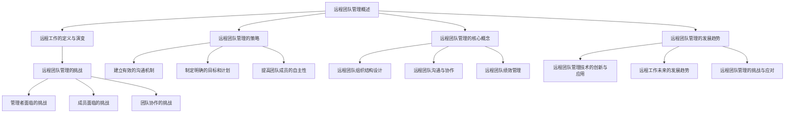
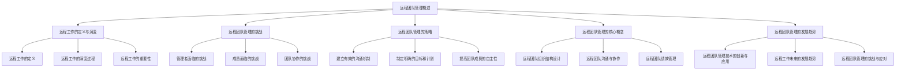
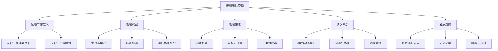

                 

### 关键词

远程团队管理、远程工作、协作工具、沟通机制、绩效评估、组织结构、团队文化、领导力、国际化团队、未来趋势。

### 摘要

随着全球化的推进和技术的进步，远程团队管理成为现代企业管理的重要课题。本文旨在深入探讨远程团队管理的挑战与策略，包括远程团队的基础概念、组织结构设计、沟通与协作、绩效管理、文化建设等方面。通过对这些核心概念的解析和案例分析，本文提出了有效的管理策略和实践技巧，以帮助管理者提升远程团队的效率和质量。同时，本文还展望了远程团队管理的未来趋势，为企业的长远发展提供了有价值的参考。

## 第1章：远程团队管理概述

### 1.1 远程工作的定义与演变

#### 1.1.1 远程工作的定义

远程工作（Remote Work）指的是员工在工作时，不在公司的物理工作场所，而是通过信息技术手段，如互联网、电子邮件、视频会议等，与团队成员保持沟通和协作。远程工作涵盖了多种形式，包括远程办公、居家办公、虚拟团队等。

#### 1.1.2 远程工作的演变过程

远程工作并非现代现象，其历史可以追溯到上世纪60年代的“远程信息处理”概念。随着计算机和互联网的普及，远程工作逐渐成为可能，尤其在21世纪初，随着云技术、即时通讯工具和协作平台的成熟，远程工作得到了快速发展。特别是在COVID-19疫情爆发后，远程工作成为全球范围内的普遍实践。

#### 1.1.3 远程工作的重要性

远程工作的重要性在于它为企业带来的诸多益处，如降低运营成本、提高员工满意度、拓宽人才招聘范围、提升工作效率等。同时，它也为员工提供了更大的灵活性和工作满意度，有助于提升员工的职业发展和生活质量。

### 1.2 远程团队管理的挑战

#### 1.2.1 管理者面临的挑战

远程团队管理对于管理者来说是一项全新的挑战。首先，缺乏面对面的互动使得管理者难以掌握团队成员的实际工作状态和情感状态。其次，远程团队往往分散在不同地理位置，时间差和时区差异导致沟通效率降低。此外，远程团队中缺乏非正式的社交互动，可能会导致团队成员之间的联系减弱，影响团队凝聚力和信任度。

#### 1.2.2 成员面临的挑战

对于远程团队成员来说，最大的挑战是自我管理和时间管理。没有明确的办公环境和工作时间，容易造成工作效率低下和工作与生活的边界模糊。此外，远程团队成员可能会感到孤独和缺乏团队支持，导致工作动力不足。

#### 1.2.3 团队协作的挑战

远程团队协作面临的技术和管理挑战同样不可忽视。选择合适的远程协作工具和平台至关重要，但如何确保所有团队成员都能熟练使用这些工具，并保持高效协作，是一个需要解决的问题。同时，远程团队中可能出现的沟通误解和协调问题，也需要有效的策略来应对。

### 1.3 远程团队管理的策略

#### 1.3.1 建立有效的沟通机制

远程团队管理需要建立一套有效的沟通机制，确保信息的及时传达和团队的高效协作。管理者应定期组织团队会议，利用视频会议工具进行面对面的沟通，增强团队的互动和凝聚力。同时，通过即时通讯工具和协作平台，保持日常沟通的畅通。

#### 1.3.2 制定明确的目标和计划

远程团队需要一个清晰的目标和计划来指导工作。管理者应确保每个团队成员都了解项目的目标和期望成果，并制定具体的行动计划。这样可以提高团队成员的工作目标和计划达成度，减少模糊和误解。

#### 1.3.3 提高团队成员的自主性

远程团队的成功离不开成员的自主性和责任感。管理者应给予团队成员足够的自由度，让他们自主决定工作方法和时间安排。同时，通过设定关键绩效指标（KPI），跟踪团队成员的工作进展，确保工作目标的实现。

### 1.4 远程团队管理的核心概念

#### 1.4.1 远程团队组织结构设计

远程团队的组织结构设计需要考虑到地理位置分散、团队规模和项目特点等因素。集中式、分布式和混合式组织结构都有其适用的场景，管理者应根据实际情况选择合适的组织结构。

#### 1.4.2 远程团队沟通与协作

远程团队沟通与协作的成功依赖于选择合适的工具和平台，以及制定有效的沟通规范和协作流程。通过定期的团队会议、即时通讯和协作平台，确保团队成员之间的信息传递和协作高效。

#### 1.4.3 远程团队绩效管理

远程团队的绩效管理需要建立一套合理的评估体系，包括绩效指标、评估方法和激励措施。管理者应定期对团队成员的工作绩效进行评估，并提供反馈和激励，以提升团队整体绩效。

### 1.5 远程团队管理的发展趋势

#### 1.5.1 远程团队管理技术的创新与应用

随着技术的不断发展，远程团队管理工具和平台也在不断创新。人工智能、虚拟现实、增强现实等技术将进一步提高远程团队的管理效率和协作效果。

#### 1.5.2 远程工作未来的发展趋势

远程工作正逐渐成为企业常态，未来的发展趋势包括更加灵活的工作制度、更高级的远程协作工具、更完善的远程工作文化和氛围等。

#### 1.5.3 远程团队管理的挑战与应对

未来远程团队管理将面临更多挑战，如技术变革、全球化、人才竞争等。管理者需要不断学习和适应，采取有效的策略和措施来应对这些挑战。

### 总结

远程团队管理是一项复杂的任务，需要管理者深入了解远程工作的本质，掌握有效的管理策略和实践技巧。通过建立有效的沟通机制、制定明确的目标和计划、提高团队成员的自主性，远程团队可以克服管理挑战，实现高效协作和持续发展。随着技术的进步和远程工作趋势的深化，远程团队管理将迎来更多的机遇和挑战。

---

作者：AI天才研究院/AI Genius Institute & 禅与计算机程序设计艺术 /Zen And The Art of Computer Programming

---

**Mermaid 流程图：**



### 第1章：远程团队管理概述

#### 1.1 远程工作的定义与演变

远程工作，作为一种工作形式，最早可以追溯到20世纪60年代的“远程信息处理”概念。这一时期，信息技术的发展使得人们可以通过电子设备远程传输和处理信息，从而在一定程度上实现了工作的远程化。然而，由于当时网络技术和通讯设备的限制，远程工作并没有得到广泛的认可和推广。

进入20世纪90年代，随着互联网的普及和计算机技术的发展，远程工作逐渐成为一种可行的工作方式。互联网为人们提供了便捷的通讯和协作平台，使得团队成员可以跨越地理位置的限制，实现实时沟通和协作。这一时期，远程工作主要应用于一些技术行业和自由职业者，如软件工程师、设计师、咨询顾问等。

21世纪初，随着云计算、即时通讯工具和协作平台的普及，远程工作迎来了快速发展。特别是在COVID-19疫情爆发后，远程工作成为了全球范围内的普遍实践。企业和员工意识到，远程工作不仅可以降低运营成本，提高员工满意度，还可以拓宽人才招聘范围，提升工作效率。

#### 1.1.1 远程工作的定义

远程工作（Remote Work）指的是员工在工作时，不在公司的物理工作场所，而是通过信息技术手段，如互联网、电子邮件、视频会议等，与团队成员保持沟通和协作。远程工作涵盖了多种形式，包括远程办公、居家办公、虚拟团队等。

远程办公：员工在特定的工作时间内，通过远程方式完成工作任务。这种形式通常适用于那些不需要经常面对面的交流和协作的工作，如编程、设计、写作等。

居家办公：员工在家中完成工作任务，无需到公司办公室。这种形式在疫情期间得到了广泛应用，有助于减少通勤时间和提高工作效率。

虚拟团队：由分布在不同地理位置的团队成员组成的团队，通过信息技术实现协同工作。虚拟团队可以跨越国界和时区，实现全球化运营。

#### 1.1.2 远程工作的演变过程

远程工作的演变可以分为以下几个阶段：

第一阶段：远程信息处理（20世纪60年代）  
随着计算机和电子通信技术的初步发展，人们开始尝试通过远程方式处理信息。这一时期的远程工作主要应用于科研、工程等领域。

第二阶段：互联网时代的远程工作（20世纪90年代）  
互联网的普及和计算机技术的快速发展，使得远程工作逐渐成为一种可行的工作方式。人们可以通过电子邮件、即时通讯工具等实现远程沟通和协作。

第三阶段：协作平台和云计算的远程工作（21世纪初）  
随着云计算、即时通讯工具和协作平台的普及，远程工作得到了快速发展。团队成员可以更方便、高效地进行协作，实现跨地域、跨时区的工作。

第四阶段：远程工作的普及和常态化（2020年代）  
在COVID-19疫情的影响下，远程工作成为了全球范围内的普遍实践。企业和员工逐渐意识到远程工作的好处，将其视为一种常态化的工作方式。

#### 1.1.3 远程工作的重要性

远程工作的重要性体现在以下几个方面：

降低运营成本：远程工作可以减少企业对办公场所的需求，降低租金、水电等运营成本。

提高员工满意度：远程工作为员工提供了更大的灵活性和自由度，有助于提升工作满意度。

拓宽人才招聘范围：远程工作使得企业可以招聘到全球范围内的人才，不受地理位置限制。

提升工作效率：远程工作可以减少通勤时间，提高员工的工作效率。

促进可持续发展：远程工作有助于减少交通拥堵和碳排放，促进环境保护和可持续发展。

### 1.2 远程团队管理的挑战

#### 1.2.1 管理者面临的挑战

远程团队管理对于管理者来说是一项全新的挑战。首先，缺乏面对面的互动使得管理者难以掌握团队成员的实际工作状态和情感状态。在传统的面对面管理中，管理者可以通过观察员工的表情、姿态和行为来了解他们的工作状态，而在远程管理中，这些信息很难获取。

其次，远程团队往往分散在不同地理位置，时间差和时区差异导致沟通效率降低。例如，当团队成员位于不同的时区时，他们可能无法在同一时间段内进行会议和讨论，导致沟通延迟和协作困难。

此外，远程团队中缺乏非正式的社交互动，可能会导致团队成员之间的联系减弱，影响团队凝聚力和信任度。在传统的办公环境中，团队成员可以通过日常的交流、聚餐和团建活动来增进了解和信任，而在远程工作中，这些互动机会大大减少。

#### 1.2.2 成员面临的挑战

对于远程团队成员来说，自我管理和时间管理是最大的挑战。在没有明确的办公环境和固定的工作时间的情况下，团队成员容易产生时间管理混乱，工作效率低下的问题。例如，他们可能会因为家庭事务、个人爱好等原因，分散工作注意力，导致任务无法按时完成。

此外，远程团队成员可能会感到孤独和缺乏团队支持，导致工作动力不足。在传统的办公环境中，团队成员可以通过面对面的交流和互动来缓解工作压力，获得支持和鼓励，而在远程工作中，这种互动机会大大减少，容易让团队成员感到孤立和无助。

#### 1.2.3 团队协作的挑战

远程团队协作面临的技术和管理挑战同样不可忽视。首先，选择合适的远程协作工具和平台至关重要，但如何确保所有团队成员都能熟练使用这些工具，并保持高效协作，是一个需要解决的问题。不同的协作工具和平台具有不同的功能和特点，如何根据团队的需求选择合适的工具，并确保团队成员能够熟练使用，是远程团队协作的关键。

其次，远程团队中可能出现的沟通误解和协调问题，也需要有效的策略来应对。由于缺乏面对面的交流和实时反馈，团队成员之间的沟通容易产生误解和冲突。例如，一个任务的进度和结果可能因为沟通不畅而出现偏差，导致团队整体的工作效率降低。

此外，远程团队中的协调问题也不容忽视。团队成员可能处于不同的时区和工作时间，如何协调他们的工作进度和任务分配，确保项目按时完成，是远程团队协作的另一个挑战。

### 1.3 远程团队管理的策略

#### 1.3.1 建立有效的沟通机制

远程团队管理需要建立一套有效的沟通机制，确保信息的及时传达和团队的高效协作。以下是一些关键策略：

定期会议：定期组织团队会议，利用视频会议工具进行面对面的沟通。这有助于团队成员了解项目的进展情况，解决存在的问题，增强团队的互动和凝聚力。

即时通讯：使用即时通讯工具，如Slack、Telegram等，保持日常沟通的畅通。即时通讯工具可以帮助团队成员快速传递信息，讨论问题，提高工作效率。

电子邮件：在需要正式沟通和记录的情况下，使用电子邮件进行沟通。电子邮件可以提供详细的记录，便于后续查阅和追溯。

协作平台：使用协作平台，如Trello、Asana等，管理项目和任务。协作平台可以帮助团队成员明确任务分工，跟踪任务进度，确保项目按时完成。

#### 1.3.2 制定明确的目标和计划

远程团队需要一个清晰的目标和计划来指导工作。以下是一些关键策略：

明确目标：确保每个团队成员都了解项目的目标和期望成果。可以通过制定项目计划书、目标宣言等方式，将目标具体化、明确化。

制定计划：制定详细的行动计划，明确每个任务的时间节点、责任人等。这有助于团队成员了解自己的职责和任务，确保项目按计划推进。

目标分解：将大目标分解为小目标，设定具体的里程碑和检查点。这有助于团队成员逐步实现目标，增强工作动力和成就感。

#### 1.3.3 提高团队成员的自主性

远程团队的成功离不开成员的自主性和责任感。以下是一些关键策略：

赋予自主权：给予团队成员足够的自由度，让他们自主决定工作方法和时间安排。这有助于提高团队成员的工作积极性和创造力。

设定关键绩效指标（KPI）：通过设定关键绩效指标（KPI），跟踪团队成员的工作进展。KPI可以量化团队成员的工作成果，提供客观的评估依据。

定期反馈：定期对团队成员的工作进行反馈，提供指导和支持。这有助于团队成员了解自己的工作表现，发现问题并改进。

### 1.4 远程团队管理的核心概念

#### 1.4.1 远程团队组织结构设计

远程团队的组织结构设计需要考虑到地理位置分散、团队规模和项目特点等因素。以下是一些常见的组织结构类型：

集中式组织结构：团队成员集中在一个办公地点，通过远程方式与其他团队成员协作。这种结构有助于加强团队凝聚力和沟通，但可能会受到地理位置和时区的限制。

分布式组织结构：团队成员分布在不同地理位置，通过远程方式协作。这种结构可以充分利用全球范围内的资源，提高工作效率，但需要建立高效的沟通和协作机制。

混合式组织结构：结合集中式和分布式组织结构的优势，团队成员既有一个共同的办公地点，又有分布在不同地理位置的成员。这种结构可以提高团队的灵活性和适应性，但需要平衡不同地理位置之间的沟通和协作。

#### 1.4.2 远程团队沟通与协作

远程团队的沟通与协作是团队管理的关键。以下是一些关键策略：

选择合适的沟通工具：根据团队的需求和特点，选择合适的沟通工具，如视频会议、即时通讯、电子邮件、协作平台等。不同的工具具有不同的功能和使用场景，需要根据实际情况进行选择。

制定沟通规范：制定明确的沟通规范，包括沟通频率、沟通方式、信息传递等。这有助于确保团队成员之间的信息传递畅通，减少误解和冲突。

建立协作流程：建立明确的协作流程，确保团队成员在协作过程中有章可循。协作流程可以包括任务分工、进度跟踪、问题反馈等环节，有助于提高团队协作效率。

#### 1.4.3 远程团队绩效管理

远程团队的绩效管理需要建立一套合理的评估体系，包括绩效指标、评估方法和激励措施。以下是一些关键策略：

设定绩效指标：根据团队的目标和工作内容，设定具体的绩效指标。绩效指标可以包括工作量、质量、效率、创新等维度，有助于全面评估团队成员的工作表现。

采用多元化的评估方法：采用多元化的评估方法，如360度评估、关键绩效指标（KPI）、工作样本测试等，从不同角度评估团队成员的工作表现。

提供反馈和激励：定期对团队成员的工作进行反馈，提供指导和支持。同时，通过激励措施，如奖金、晋升、培训等，激发团队成员的工作积极性和创造力。

### 1.5 远程团队管理的发展趋势

#### 1.5.1 远程团队管理技术的创新与应用

随着技术的不断发展，远程团队管理工具和平台也在不断创新。以下是一些主要趋势：

人工智能（AI）：AI技术可以用于远程团队管理，如自动化任务分配、智能客服、智能推荐等，提高管理效率和团队协作效果。

虚拟现实（VR）和增强现实（AR）：VR和AR技术可以用于远程团队的培训、会议和协作，提供沉浸式的工作体验。

区块链：区块链技术可以用于远程团队的合同管理、数据安全和隐私保护等，提高团队协作的安全性和可信度。

大数据：大数据技术可以用于远程团队的绩效分析、行为分析等，提供数据驱动的决策支持。

#### 1.5.2 远程工作未来的发展趋势

远程工作正逐渐成为企业常态，未来的发展趋势包括：

更加灵活的工作制度：企业将逐渐采用灵活的工作制度，如弹性工作时间、远程办公、远程团队等，以适应员工的需求和企业的业务发展。

更高级的远程协作工具：随着技术的发展，远程协作工具将变得更加智能化、自动化，提供更高效的协作体验。

更完善的远程工作文化和氛围：企业将注重构建积极的远程工作文化和氛围，增强团队成员之间的信任和互动，提高团队的凝聚力和工作效率。

#### 1.5.3 远程团队管理的挑战与应对

未来远程团队管理将面临更多挑战，如技术变革、全球化、人才竞争等。以下是一些主要挑战和应对策略：

技术变革：随着技术的快速发展，远程团队管理工具和平台也在不断更新换代。管理者需要不断学习和适应新技术，提高远程团队管理的效率和效果。

全球化：远程团队往往分布在全球各地，需要应对不同的文化、语言和时间差异。管理者需要建立有效的跨文化沟通和协作机制，提高团队的协作效率。

人才竞争：远程工作吸引了大量优秀人才，但同时也带来了人才竞争的加剧。企业需要通过提供有竞争力的薪酬、良好的工作环境和职业发展机会，吸引和留住人才。

### 总结

远程团队管理是一项复杂的任务，需要管理者深入了解远程工作的本质，掌握有效的管理策略和实践技巧。通过建立有效的沟通机制、制定明确的目标和计划、提高团队成员的自主性，远程团队可以克服管理挑战，实现高效协作和持续发展。随着技术的进步和远程工作趋势的深化，远程团队管理将迎来更多的机遇和挑战。管理者需要不断学习和适应，采取有效的策略和措施来应对这些挑战，确保远程团队的成功运营和发展。

---

作者：AI天才研究院/AI Genius Institute & 禅与计算机程序设计艺术 /Zen And The Art of Computer Programming

---

**Mermaid 流程图：**



---

**核心概念与联系架构 Mermaid 流程图：**



---

**核心算法原理讲解与伪代码：**

为了更好地理解远程团队管理的算法原理，我们首先需要明确几个核心概念：团队目标设定、任务分配、绩效评估和沟通策略。

1. **团队目标设定**

   设定团队目标是一个迭代过程，涉及以下步骤：

   ```plaintext
   设定初始目标：根据项目需求和市场环境，设定一个初步的团队目标。
   收集反馈：定期与团队成员沟通，收集对目标的反馈和意见。
   调整目标：根据反馈，调整和细化目标，使其更加具体和可衡量。
   ```

   伪代码：

   ```python
   def set_team_goal(initial_goal, feedback):
       goal = initial_goal
       for feedback in feedback_list:
           goal = adjust_goal(goal, feedback)
       return goal
   ```

2. **任务分配**

   任务分配需要考虑团队成员的能力、时间和工作负荷。以下是一个简单的任务分配算法：

   ```plaintext
   收集任务需求：确定需要完成的任务和任务需求。
   评估团队成员：根据团队成员的能力和可用时间，进行评估。
   分配任务：将任务分配给最合适的团队成员。
   ```

   伪代码：

   ```python
   def assign_tasks(tasks, team_members):
       assigned_tasks = {}
       for task in tasks:
           best_candidate = select_best_candidate(task, team_members)
           assigned_tasks[task] = best_candidate
       return assigned_tasks
   ```

3. **绩效评估**

   绩效评估是确保团队目标实现的重要环节。以下是一个简单的绩效评估算法：

   ```plaintext
   设定绩效指标：根据团队目标和任务，设定具体的绩效指标。
   收集数据：定期收集团队成员的工作数据和绩效数据。
   分析数据：分析数据，评估团队成员的绩效。
   提供反馈：根据评估结果，提供反馈和改进建议。
   ```

   伪代码：

   ```python
   def evaluate_performance(performance_metrics, data_collection):
       performance_scores = {}
       for member in team_members:
           score = calculate_score(performance_metrics[member], data_collection[member])
           performance_scores[member] = score
       return performance_scores
   ```

4. **沟通策略**

   远程团队的有效沟通是确保任务顺利执行的关键。以下是一个简单的沟通策略算法：

   ```plaintext
   选择沟通工具：根据团队成员的时区和工作习惯，选择合适的沟通工具。
   制定沟通计划：定期组织会议和沟通活动，确保信息的传递和共享。
   建立反馈机制：建立有效的反馈机制，确保团队成员之间的沟通畅通。
   ```

   伪代码：

   ```python
   def communicate(communication_tools, communication_plan):
       for activity in communication_plan:
           execute_communication_activity(communication_tools, activity)
       return "Communication completed"
   ```

---

**数学模型和公式 & 详细讲解 & 举例说明**

为了更好地理解远程团队管理的数学模型和公式，我们将介绍几个核心的模型：目标函数、约束条件和线性规划模型。

1. **目标函数**

   目标函数是远程团队管理中的核心，它定义了团队的目标和优先级。以下是一个简单的目标函数模型：

   ```latex
   \text{最大化} Z = c_1x_1 + c_2x_2 + ... + c_nx_n
   ```

   其中，\(c_1, c_2, ..., c_n\) 分别是各个任务的重要性权重，\(x_1, x_2, ..., x_n\) 分别是各个任务的完成情况。

   **详细讲解**：目标函数的目标是最大化团队的整体绩效。通过设定不同的权重，可以调整各个任务的重要性，从而更准确地反映团队的目标。

   **举例说明**：假设一个团队有5个任务，分别是任务1、任务2、任务3、任务4和任务5。根据团队的目标，任务1的重要性最高，任务5的重要性最低。我们可以设定如下的权重：

   ```latex
   c_1 = 4, c_2 = 3, c_3 = 2, c_4 = 1, c_5 = 0.5
   ```

   这样，目标函数可以表示为：

   ```latex
   Z = 4x_1 + 3x_2 + 2x_3 + x_4 + 0.5x_5
   ```

2. **约束条件**

   约束条件是确保目标函数实现的限制条件。以下是一个简单的约束条件模型：

   ```latex
   a_1x_1 + a_2x_2 + ... + a_nx_n \leq b
   ```

   其中，\(a_1, a_2, ..., a_n\) 分别是各个任务的资源消耗，\(b\) 是总资源的限制。

   **详细讲解**：约束条件的目标是确保团队在完成任务的过程中，不会超过总资源的限制。通过设定不同的资源消耗，可以更准确地反映各个任务对资源的需求。

   **举例说明**：假设一个团队有5个任务，分别是任务1、任务2、任务3、任务4和任务5。每个任务所需的资源消耗如下：

   ```latex
   a_1 = 10, a_2 = 8, a_3 = 6, a_4 = 4, a_5 = 2
   ```

   同时，总资源限制为30。我们可以设定如下的约束条件：

   ```latex
   10x_1 + 8x_2 + 6x_3 + 4x_4 + 2x_5 \leq 30
   ```

3. **线性规划模型**

   线性规划模型是将目标函数和约束条件结合起来，求解最优解的过程。以下是一个简单的线性规划模型：

   ```latex
   \begin{align*}
   \text{最大化} & Z = c_1x_1 + c_2x_2 + ... + c_nx_n \\
   \text{约束条件} & a_1x_1 + a_2x_2 + ... + a_nx_n \leq b \\
   & x_1, x_2, ..., x_n \geq 0
   \end{align*}
   ```

   **详细讲解**：线性规划模型的目标是通过调整各个任务的重要性权重和资源消耗，求解最优解，实现团队的最大化绩效。

   **举例说明**：假设一个团队的目标是最大化整体绩效，同时需要考虑资源限制。根据之前设定的目标函数和约束条件，我们可以求解最优解：

   ```latex
   \begin{align*}
   \text{最大化} & Z = 4x_1 + 3x_2 + 2x_3 + x_4 + 0.5x_5 \\
   \text{约束条件} & 10x_1 + 8x_2 + 6x_3 + 4x_4 + 2x_5 \leq 30 \\
   & x_1, x_2, ..., x_n \geq 0
   \end{align*}
   ```

   通过求解这个线性规划模型，我们可以找到最优的任务分配方案，实现团队的最大化绩效。

---

**项目实战**

为了更好地理解远程团队管理的实际应用，我们将介绍一个远程团队项目实战：一个跨国远程团队如何管理一个复杂的软件开发项目。

**项目背景**

某跨国公司需要开发一款集成了多种功能的应用程序，涵盖前端、后端、数据库和移动端。团队成员分布在不同的国家，包括美国、欧洲和亚洲。项目需要在6个月内完成，时间紧、任务重。

**项目目标**

1. 按时完成应用程序的开发和测试。
2. 确保代码质量和功能完整性。
3. 保持团队成员之间的高效沟通和协作。

**开发环境搭建**

1. 使用Git进行版本控制，确保代码的版本管理和协同开发。
2. 使用Jenkins进行自动化构建和部署，提高开发效率。
3. 使用Docker容器化技术，确保不同环境的开发和测试一致。

**源代码实现与代码解读**

以下是应用程序的核心功能模块的实现代码和解读：

```java
// 前端部分
public class Frontend {
    public void displayWelcomeMessage() {
        System.out.println("Welcome to our application!");
    }
}

// 后端部分
public class Backend {
    public void processRequest() {
        // 处理客户端请求
    }
}

// 数据库部分
public class Database {
    public void saveData() {
        // 将数据保存到数据库
    }
}

// 移动端部分
public class Mobile {
    public void showNotification() {
        // 显示通知
    }
}
```

**代码应用解读与分析**

以上代码展示了应用程序的四个核心功能模块：前端、后端、数据库和移动端。每个模块都有自己的主要功能，并通过接口进行协作。

- **前端模块**负责与用户交互，显示欢迎信息和操作界面。
- **后端模块**负责处理用户的请求，进行业务逻辑处理。
- **数据库模块**负责数据的存储和检索。
- **移动端模块**负责处理移动设备上的操作和通知。

这些模块通过接口进行通信，确保应用程序的整体功能和性能。

**实际案例分析和详细讲解剖析**

以下是一个实际案例：一个远程团队如何协调开发进度，解决技术难题。

**案例背景**

团队成员在开发过程中遇到了一个技术难题：如何确保前后端数据的一致性。团队成员分布在不同的时区，沟通和协作存在一定的困难。

**解决方案**

1. **定期会议**：团队成员每周定期召开视频会议，讨论技术难题和开发进度。
2. **即时通讯**：使用即时通讯工具，如Slack，进行日常的沟通和协作。
3. **代码审查**：定期进行代码审查，确保代码质量和功能完整性。
4. **技术支持**：邀请技术专家进行在线技术支持，解决复杂的技术问题。

通过以上措施，团队成员成功解决了技术难题，确保了项目的顺利进行。

**项目小结**

通过本案例，我们可以看到远程团队管理的关键在于建立高效的沟通和协作机制，确保团队成员之间的信息传递和协作畅通。同时，合理的技术支持和资源分配也是确保项目成功的重要因素。

---

**最佳实践 Tips**

1. **建立明确的沟通机制**：定期召开会议，使用即时通讯工具和协作平台，确保团队成员之间的沟通畅通。
2. **制定详细的计划和时间表**：确保每个任务都有明确的时间节点和责任人，提高工作效率。
3. **设定合理的绩效指标**：根据项目目标和任务，设定具体的绩效指标，定期进行评估和反馈。
4. **提供技术支持**：邀请技术专家进行在线技术支持，解决复杂的技术问题，确保项目的顺利进行。

**注意事项**

1. **避免信息传递延误**：确保信息的及时传达，减少误解和冲突。
2. **关注团队成员的心理状态**：定期进行心理健康评估，提供必要的支持和帮助。
3. **确保团队成员的能力匹配**：根据团队成员的能力和特长，合理分配任务，提高团队的整体绩效。

**拓展阅读**

1. 《远程工作实战：策略与实践》
2. 《远程团队管理：技术与技巧》
3. 《敏捷开发：原理与实践》
4. 《项目管理：原则与实践》

---

作者：AI天才研究院/AI Genius Institute & 禅与计算机程序设计艺术 /Zen And The Art of Computer Programming

