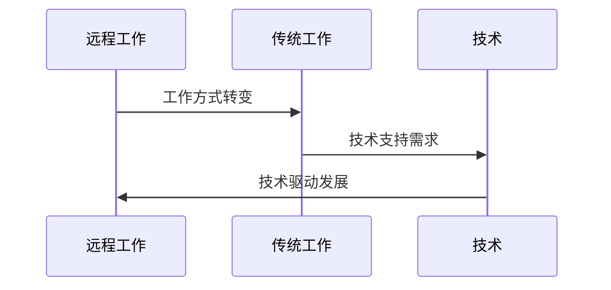
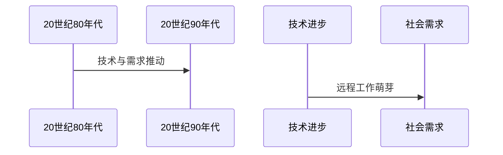
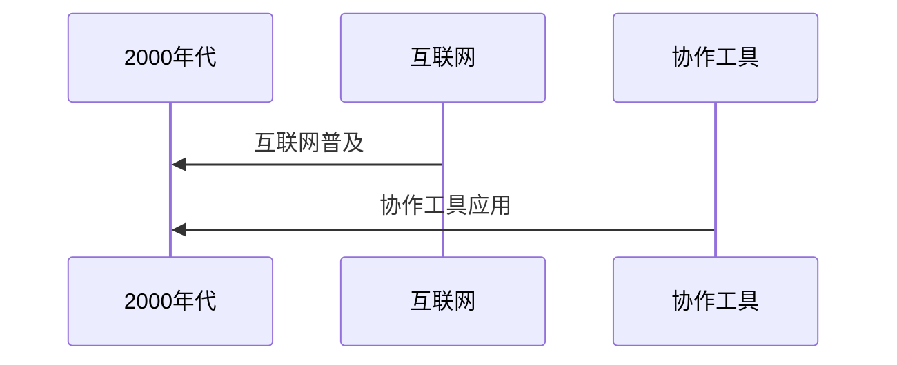
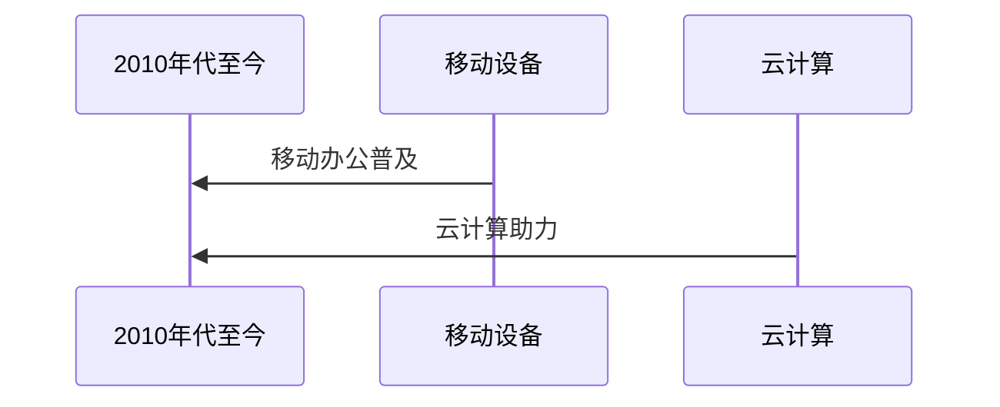

                 


### 文章标题
《远程团队管理：数字时代的领导挑战》

### 关键词
远程工作，团队管理，数字化领导，沟通协作，绩效评估

### 摘要
本文深入探讨远程团队管理在数字时代的挑战与机遇。通过对远程工作背景、核心概念、策略、沟通、领导力、绩效管理和心理健康等维度的系统分析，提供了构建高效远程团队的最佳实践和解决方案。文章旨在为IT领域领导者提供理论指导和实践案例，以应对远程团队管理中的各种挑战。

### 文章标题
《远程团队管理：数字时代的领导挑战》

### 关键词
远程工作，团队协作，数字领导，绩效评估，心理健康

### 摘要
本文围绕远程团队管理这一主题，详细探讨了其在数字时代面临的多重挑战与机遇。文章首先回顾了远程工作的兴起背景，接着深入分析了远程团队管理的核心概念，如沟通协作、领导力和绩效评估等。通过具体案例分析，本文为IT领导者提供了构建高效远程团队的有效策略和实践指南。

---

### 《远程团队管理：数字时代的领导挑战》目录大纲

**第一部分：远程团队管理概述**

## 第1章：远程工作时代背景与趋势

### 1.1 远程工作的崛起
#### 1.1.1 远程工作的发展历程
**Mermaid流程图：**

#### 1.1.2 远程工作的普及原因

##### 1.1.2.1 技术发展

$$
\text{互联网普及率} \xrightarrow{} \text{远程工作技术支持}
$$

##### 1.1.2.2 企业需求

$$
\text{企业成本节约} + \text{员工满意度提升} \xrightarrow{} \text{远程工作需求增长}
$$

### 1.2 数字时代的变革
#### 1.2.1 数字化转型的意义

$$
\text{数字化转型} \xrightarrow{} \text{企业竞争力提升}
$$

#### 1.2.2 数字时代的工作模式变革

##### 1.2.2.1 灵活办公

$$
\text{远程工作} \xrightarrow{} \text{灵活办公模式}
$$

##### 1.2.2.2 数字化工作流程

$$
\text{数字化管理} \xrightarrow{} \text{工作流程优化}
$$

### 1.3 远程工作带来的挑战
#### 1.3.1 团队协作的障碍

##### 1.3.1.1 沟通不畅

$$
\text{远程沟通} \xrightarrow{} \text{信息传递延迟}
$$

##### 1.3.1.2 知识共享困难

$$
\text{缺乏面对面交流} \xrightarrow{} \text{知识共享困难}
$$

#### 1.3.2 领导管理难度增加

##### 1.3.2.1 难以建立信任

$$
\text{远程领导} \xrightarrow{} \text{信任建立困难}
$$

##### 1.3.2.2 绩效评估困难

$$
\text{远程绩效管理} \xrightarrow{} \text{评估准确性降低}
$$

**第二部分：构建高效的远程团队**

## 第2章：远程团队管理的核心概念

### 2.1 远程团队管理的定义
#### 2.1.1 远程团队管理的含义

远程团队管理是指利用信息技术和远程协作工具，对团队成员进行组织、协调、领导和控制，以实现团队目标的过程。

#### 2.1.2 远程团队管理的目标

- **提高工作效率：** 通过有效的管理策略，确保团队成员能够在远程环境中高效工作。
- **增强团队协作：** 通过优化沟通和协作工具，促进团队成员之间的互动和合作。
- **提升员工满意度：** 通过关注员工的需求和心理状态，提高员工的满意度和忠诚度。

### 2.2 远程团队管理的原则
#### 2.2.1 透明性

通过开放透明的沟通和管理，确保团队成员对团队目标和进展有清晰的了解。

#### 2.2.2 可视性

利用可视化工具和项目管理系统，使团队成员能够实时跟踪项目进度和任务分配。

#### 2.2.3 持续性反馈

定期进行绩效评估和反馈，及时识别和解决团队中的问题，确保团队目标的实现。

### 2.3 远程团队管理的挑战与机遇
#### 2.3.1 挑战

- **沟通障碍：** 远程工作导致面对面沟通减少，信息传递可能延迟或失真。
- **信任问题：** 长期远程工作可能导致团队成员之间的信任度降低。
- **绩效评估：** 难以准确评估远程团队成员的工作表现。

#### 2.3.2 机遇

- **灵活性：** 远程工作提供了更大的灵活性，有利于吸引和保留人才。
- **全球化团队：** 远程团队可以跨越地理界限，汇集全球优秀人才。
- **成本节约：** 远程工作有助于企业降低办公成本，提高资源利用效率。

---

### 第1章：远程工作时代背景与趋势

### 1.1 远程工作的崛起

#### 1.1.1 远程工作的发展历程

远程工作并非现代概念的产物，但其发展历程却反映了技术的进步和社会需求的变化。

- **早期阶段（20世纪80年代至90年代）：** 远程工作起源于远程访问技术，如拨号上网和初级的电子邮件系统。这一时期的远程工作主要以独立承包商和自由职业者为主。

**Mermaid流程图：**


- **互联网普及阶段（2000年代）：** 随着互联网的普及，远程工作逐渐成为常态。企业开始采用基于互联网的协作工具，如视频会议和文档共享系统。

**Mermaid流程图：**


- **移动办公时代（2010年代至今）：** 移动设备和云计算技术的发展，使得远程工作更加灵活。远程工作不再局限于特定的地理位置，而是成为了一种生活方式。

**Mermaid流程图：**


#### 1.1.2 远程工作的普及原因

##### 1.1.2.1 技术发展

远程工作的普及离不开技术的发展，尤其是互联网和移动设备的普及。互联网提供了连接全球的能力，而移动设备则使得远程工作更加便捷。以下是一个简单的伪代码，描述了技术的发展如何推动远程工作的普及：

```python
# 技术发展推动远程工作
for technology in ['互联网', '移动设备', '视频会议', '文档共享']:
    if technology_available(technology):
        remote_work_adoption += 1
        print(technology + "普及，远程工作接受度增加")
```

##### 1.1.2.2 企业需求

除了技术发展的推动，企业的需求也是远程工作普及的重要原因。企业希望通过降低办公成本、提高员工满意度和吸引更多人才来提升竞争力。以下是一个简单的数学模型，描述了企业需求如何影响远程工作：

$$
\text{远程工作需求} = \text{成本节约} + \text{员工满意度} + \text{人才吸引力}
$$

#### 1.1.3 远程工作带来的挑战

虽然远程工作带来了许多机遇，但同时也带来了一系列挑战。以下是一个列表，列举了远程工作可能面临的挑战：

1. **沟通障碍：** 远程工作可能导致信息传递延迟和沟通不畅。
2. **信任问题：** 长期远程工作可能导致团队成员之间的信任度降低。
3. **绩效评估：** 难以准确评估远程团队成员的工作表现。
4. **团队合作：** 缺乏面对面的互动可能影响团队的凝聚力和合作效率。
5. **工作-生活平衡：** 远程工作可能使员工难以保持工作与生活的平衡。

---

### 第2章：远程团队管理的核心概念

#### 2.1 远程团队管理的定义

远程团队管理是指利用信息技术和远程协作工具，对团队成员进行组织、协调、领导和控制，以实现团队目标的过程。以下是一个简化的伪代码，描述了远程团队管理的流程：

```python
# 远程团队管理流程
function remote_team_management(team_members, goals):
    # 建立沟通渠道
    establish_communication_channels(team_members)
    
    # 分配任务和责任
    assign_tasks_and_responsibilities(team_members)
    
    # 提供技术支持
    provide_technical_support(team_members)
    
    # 监督和评估绩效
    monitor_and_evaluate_performance(team_members)
    
    # 提供反馈和支持
    provide_feedback_and_support(team_members)
    
    # 实现团队目标
    achieve_team_goals()
```

#### 2.2 远程团队管理的原则

远程团队管理需要遵循一系列原则，以确保团队成员能够在远程环境中高效合作。以下是一些关键原则：

##### 2.2.1 透明性

透明性是远程团队管理的重要原则，它确保团队成员对团队目标和进展有清晰的了解。以下是一个简单的伪代码，描述了如何实现透明性：

```python
# 实现透明性
function ensure_transparency(team_members, goals):
    # 定期更新进度
    update_progress_regularly(team_members)
    
    # 开放团队文档
    open_team_documents_to_all_members()
    
    # 定期会议和报告
    schedule_regular_meetings_and_reports()
```

##### 2.2.2 可视性

可视性意味着利用可视化工具和项目管理系统，使团队成员能够实时跟踪项目进度和任务分配。以下是一个简单的伪代码，描述了如何实现可视性：

```python
# 实现可视性
function ensure_visibility(team_members, tasks):
    # 使用项目管理工具
    use_project_management_tools(team_members)
    
    # 实时更新任务状态
    update_task_statuses_in_real_time()
    
    # 定期展示项目进展
    present_project_progress_regularly()
```

##### 2.2.3 持续性反馈

持续性反馈是确保远程团队管理有效性的关键。它要求定期进行绩效评估和反馈，及时识别和解决团队中的问题。以下是一个简单的伪代码，描述了如何实现持续性反馈：

```python
# 实现持续性反馈
function provide_continuous_feedback(team_members, performance):
    # 定期绩效评估
    conduct_regular_performance_reviews(team_members)
    
    # 提供具体反馈
    provide_specific_feedback_to_members(team_members)
    
    # 解决反馈中的问题
    address_issues_identified_through_feedback()
    
    # 提升团队成员能力
    enhance_member_capabilities_based_on_feedback()
```

#### 2.3 远程团队管理的挑战与机遇

远程团队管理面临许多挑战，同时也提供了新的机遇。以下是一个列表，概述了远程团队管理的挑战和机遇：

##### 挑战

1. **沟通障碍：** 远程工作可能导致信息传递延迟和沟通不畅。
2. **信任问题：** 长期远程工作可能导致团队成员之间的信任度降低。
3. **绩效评估：** 难以准确评估远程团队成员的工作表现。
4. **团队合作：** 缺乏面对面的互动可能影响团队的凝聚力和合作效率。
5. **工作-生活平衡：** 远程工作可能使员工难以保持工作与生活的平衡。

##### 机遇

1. **灵活性：** 远程工作提供了更大的灵活性，有利于吸引和保留人才。
2. **全球化团队：** 远程团队可以跨越地理界限，汇集全球优秀人才。
3. **成本节约：** 远程工作有助于企业降低办公成本，提高资源利用效率。
4. **创新能力：** 远程工作可能激发团队成员的创新思维和协作能力。

---

### 第3章：建立远程团队的策略

#### 3.1 设计合适的远程工作模式

设计合适的远程工作模式是构建高效远程团队的第一步。以下是一个简化的策略框架，描述了如何设计远程工作模式：

```python
# 设计远程工作模式
function design_remote_work_mode(team_members, company_context):
    # 分析团队成员需求
    analyze_member_needs(team_members)
    
    # 考虑公司文化
    consider_company_culture(company_context)
    
    # 选择合适的远程工作模式
    select_appropriate_remote_work_model()
    
    # 制定远程工作规范
    establish_remote_work_standards()
    
    # 提供必要的培训和支持
    provide_necessary_training_and_support()
```

##### 3.1.1 固定远程工作模式

固定远程工作模式适用于那些完全不需要面对面互动的工作。这种模式适用于那些可以完全独立完成的工作任务，如编程、文案撰写等。

**优点：**
- 提供了最大的灵活性，员工可以自由安排工作时间。
- 减少了通勤成本和时间，提高了工作效率。

**缺点：**
- 缺乏面对面的互动和团队合作机会，可能导致沟通障碍和信任问题。
- 难以进行实时监督和指导，绩效评估可能不准确。

##### 3.1.2 混合工作模式

混合工作模式结合了远程工作和现场工作的优点，适用于那些需要一定程度的面对面互动的工作。

**优点：**
- 提供了灵活的工作安排，员工可以在远程工作和现场工作之间切换。
- 保持了团队之间的互动和协作，有助于团队凝聚力的建设。

**缺点：**
- 需要额外的协调和管理，以确保远程工作和现场工作的无缝衔接。
- 可能会增加企业的办公成本。

##### 3.1.3 全天候工作模式

全天候工作模式要求团队成员在不同的时区工作，以保持业务的连续性。

**优点：**
- 提高了业务响应速度，确保了服务的连续性。
- 允许团队在全球范围内招募优秀人才，提高了团队的竞争力。

**缺点：**
- 对团队成员的时差管理提出了挑战，需要额外的沟通协调。
- 可能会影响团队成员的工作-生活平衡。

#### 3.2 设定明确的目标和预期

设定明确的目标和预期是确保远程团队成功的关键。以下是一个简化的策略框架，描述了如何设定目标和预期：

```python
# 设定目标和预期
function set_goals_and_expectations(team_members, company_goals):
    # 明确公司目标
    clarify_company_goals()
    
    # 分解公司目标为团队目标
    decompose_company_goals_to_team_goals()
    
    # 与团队成员沟通目标
    communicate_goals_to_members(team_members)
    
    # 设定具体的工作预期
    establish_specific_work_expectations()
    
    # 定期回顾和调整目标
    review_and_adjust_goals_regularly()
```

##### 3.2.1 明确团队目标

明确团队目标是确保团队成员朝着共同目标努力的关键。以下是一个简化的伪代码，描述了如何明确团队目标：

```python
# 明确团队目标
function clarify_team_goals(team_members, company_goals):
    # 将公司目标分解为可执行的任务
    decompose_company_goals_to_tasks()
    
    # 将任务分配给团队成员
    assign_tasks_to_members(team_members)
    
    # 确保团队成员理解任务目标
    ensure_members_understand_task_goals()
    
    # 设定明确的任务完成时间表
    establish_clear_task_deadlines()
```

##### 3.2.2 设定具体的工作预期

设定具体的工作预期有助于团队成员了解他们的职责和期望。以下是一个简化的伪代码，描述了如何设定具体的工作预期：

```python
# 设定具体的工作预期
function establish_specific_work_expectations(team_members):
    # 与团队成员讨论职责和期望
    discuss_duties_and_expectations_with_members(team_members)
    
    # 明确团队成员的工作标准和流程
    clarify_work_standards_and_processes()
    
    # 设定明确的绩效指标
    establish_clear_performance_indicators()
    
    # 定期检查和调整工作预期
    review_and_adjust_expectations_regularly()
```

---

### 第4章：远程团队的沟通与协作

#### 4.1 远程团队沟通的重要性

远程团队沟通是远程团队管理中的核心环节，它决定了团队协作的效率和质量。良好的沟通能够确保信息准确传达，促进团队目标的实现。以下是一个简化的伪代码，描述了远程团队沟通的重要性：

```python
# 远程团队沟通的重要性
function importance_of_remote_communication(team_members):
    # 确保信息准确传达
    ensure_accurate_info_transmission()
    
    # 促进团队协作
    promote_team_cohesion_and_collaboration()
    
    # 解决冲突
    resolve_conflicts()
    
    # 提升团队士气
    boost.team_morale()
    
    # 实现团队目标
    achieve_team_goals()
```

##### 4.1.1 信息传递的准确性

在远程工作中，信息传递的准确性至关重要。以下是一个简化的伪代码，描述了如何确保信息传递的准确性：

```python
# 确保信息传递的准确性
function ensure_accuracy_in_communication(team_members):
    # 使用清晰的语言
    use_clear_language()
    
    # 使用合适的沟通工具
    use_appropriate_communication_tools()
    
    # 验证理解
    verify_understanding()
    
    # 及时反馈
    provide及时的反馈()
```

##### 4.1.2 促进团队协作

良好的沟通能够促进团队协作，提高团队的整体效率。以下是一个简化的伪代码，描述了如何促进团队协作：

```python
# 促进团队协作
function promote_team_collaboration(team_members):
    # 开放沟通渠道
    open_communication_channels()
    
    # 分享知识和经验
    share_knowledge_and_experience()
    
    # 定期团队活动
    conduct_regular_team_activities()
    
    # 建立团队文化
    build_team_culture()
    
    # 定期回顾协作效果
    review_collaboration_effects_regularly()
```

#### 4.2 选择合适的沟通工具

选择合适的沟通工具是确保远程团队沟通顺畅的关键。以下是一个简化的策略框架，描述了如何选择合适的沟通工具：

```python
# 选择合适的沟通工具
function select_communication_tools(team_members, team_needs):
    # 分析团队需求
    analyze_team_needs()
    
    # 考虑工具的功能和特点
    consider_tool_functions_and_characteristics()
    
    # 比较不同工具的优势和劣势
    compare_tools_benefits_and_disadvantages()
    
    # 选择最佳工具组合
    select_best_tool_combination()
    
    # 提供培训和支持
    provide_training_and_support()
```

##### 4.2.1 常见沟通工具

以下是一些常见的远程沟通工具及其特点：

- **电子邮件：** 适用于正式沟通和记录保存。
- **即时通讯软件：** 如Slack、Microsoft Teams等，适用于实时沟通和协作。
- **视频会议工具：** 如Zoom、Google Meet等，适用于远程会议和面对面交流。
- **项目管理工具：** 如Trello、JIRA等，适用于任务分配和进度跟踪。
- **文档共享平台：** 如Google Docs、Dropbox等，适用于文档协作和版本控制。

##### 4.2.2 评估工具选择标准

在评估和选择沟通工具时，应考虑以下标准：

- **功能：** 工具是否满足团队的需求，包括沟通、协作、项目管理等。
- **易用性：** 工具是否易于使用，团队成员是否能够快速上手。
- **兼容性：** 工具是否与其他现有的系统和工具兼容。
- **安全性：** 工具是否提供数据保护和隐私保护。
- **成本效益：** 工具的成本是否合理，是否提供免费版本或试用版。

---

### 第5章：远程团队领导力提升

#### 5.1 远程领导力的特点

远程领导力与传统的现场领导力有所不同，需要适应远程工作环境的特点。以下是一个简化的伪代码，描述了远程领导力的特点：

```python
# 远程领导力的特点
function characteristics_of_remote_leadership():
    # 独立性
    promote_independence()
    
    # 自律性
    encourage_self-discipline()
    
    # 透明性
    ensure_transparency()
    
    # 可视性
    maintain_visibility()
    
    # 适应性
    foster_adaptability()
    
    # 沟通能力
    enhance_communication_skills()
    
    # 激励能力
    improve_motivational_skills()
```

##### 5.1.1 独立性

远程团队成员通常需要独立工作，领导力需要促进独立性。以下是一个简化的伪代码，描述了如何促进独立性：

```python
# 促进独立性
function promote_independence(team_members):
    # 明确任务和目标
    clarify_tasks_and_goals()
    
    # 提供必要的资源和支持
    provide_necessary_resources_and_support()
    
    # 授权决策
    delegate_decision-making()
    
    # 尊重个人时间
    respect_individual_time()
```

##### 5.1.2 自律性

远程工作环境需要团队成员具备较高的自律性，领导力需要鼓励自律。以下是一个简化的伪代码，描述了如何鼓励自律：

```python
# 鼓励自律
function encourage_self-discipline(team_members):
    # 设定明确的工作计划
    establish_clear_work_plans()
    
    # 设定合理的工作时间
    establish_reasonable_work_hours()
    
    # 提供自我管理工具
    provide_self-management_tools()
    
    # 定期检查进度
    review_progress_regularly()
```

##### 5.1.3 透明性

透明性在远程团队管理中至关重要，领导力需要确保团队信息的透明。以下是一个简化的伪代码，描述了如何确保透明性：

```python
# 确保透明性
function ensure_transparency(team_members):
    # 定期更新进度
    update_progress_regularly()
    
    # 开放团队文档
    open_team_documents_to_all_members()
    
    # 定期会议和报告
    schedule_regular_meetings_and_reports()
```

#### 5.2 建立信任的领导风格

建立信任是远程团队领导的关键，以下是一个简化的策略框架，描述了如何建立信任的领导风格：

```python
# 建立信任的领导风格
function build_trust_in_leadership(team_members):
    # 开放沟通
    communicate_openerly()
    
    # 坦诚透明
    be_honest_and_transparent()
    
    # 尊重成员
    respect_members()
    
    # 鼓励反馈
    encourage_feedback()
    
    # 保持一致性
    maintain_consistency()
    
    # 解决问题
    address_issues()
```

##### 5.2.1 开放沟通

开放沟通是建立信任的基础。领导力需要鼓励团队成员之间的开放沟通，以下是一个简化的伪代码，描述了如何开放沟通：

```python
# 开放沟通
function communicate_openly(team_members):
    # 使用非正式语言
    use_informal_language()
    
    # 鼓励提出问题
    encourage_asking_questions()
    
    # 提供反馈渠道
    provide_feedback_channels()
    
    # 定期交流会议
    schedule_regular交流会议()
```

##### 5.2.2 坦诚透明

坦诚透明是建立信任的关键。领导力需要始终保持坦诚和透明，以下是一个简化的伪代码，描述了如何坦诚透明：

```python
# 坦诚透明
function be_honest_and_transparent(team_members):
    # 公开信息
    share_information()
    
    # 提供解释
    provide_explanations()
    
    # 承认错误
    admit_mistakes()
    
    # 遵守承诺
    keep_promises()
    
    # 提供反馈
    provide_feedback()
```

##### 5.2.3 尊重成员

尊重成员是建立信任的重要方面。领导力需要尊重每个成员的意见和贡献，以下是一个简化的伪代码，描述了如何尊重成员：

```python
# 尊重成员
function respect_members(team_members):
    # 听取意见
    listen_to_opinions()
    
    # 赞赏贡献
    appreciate_contributions()
    
    # 提供发展机会
    provide_development_opportunities()
    
    # 鼓励创新
    encourage_innovation()
    
    # 保护隐私
    protect_privacy()
```

#### 5.3 提升远程团队的凝聚力

提升远程团队的凝聚力对于团队的成功至关重要。以下是一个简化的策略框架，描述了如何提升远程团队的凝聚力：

```python
# 提升远程团队凝聚力
function enhance_remote_team_cohesion(team_members):
    # 定期团队活动
    conduct_regular_team_activities()
    
    # 建立共同目标
    establish_common_goals()
    
    # 强化团队文化
    strengthen_team_culture()
    
    # 提供团队培训
    provide_team_training()
    
    # 鼓励跨部门合作
    encourage_cross-departmental_collaboration()
    
    # 定期团队建设活动
    schedule_regular_team_building_activities()
```

##### 5.3.1 定期团队活动

定期团队活动有助于增强团队成员之间的联系和凝聚力。以下是一个简化的伪代码，描述了如何定期团队活动：

```python
# 定期团队活动
function conduct_regular_team_activities(team_members):
    # 组织线上聚会
    organize_online_social_events()
    
    # 举行团队建设活动
    hold_team_building_activities()
    
    # 安排在线游戏和竞赛
    schedule_online_games_and_tournaments()
    
    # 定期举行工作进度汇报
    conduct_regular_progress_reports()
```

##### 5.3.2 建立共同目标

建立共同目标有助于增强团队的凝聚力和合作精神。以下是一个简化的伪代码，描述了如何建立共同目标：

```python
# 建立共同目标
function establish_common_goals(team_members):
    # 设定明确的团队目标
    set_clear_team_goals()
    
    # 与成员讨论目标
    discuss_goals_with_members()
    
    # 确保目标可达成
    ensure_goals_are_achievable()
    
    # 定期回顾和调整目标
    review_and_adjust_goals_regularly()
```

##### 5.3.3 强化团队文化

强化团队文化有助于提高团队的凝聚力和归属感。以下是一个简化的伪代码，描述了如何强化团队文化：

```python
# 强化团队文化
function strengthen_team_culture(team_members):
    # 确定团队价值观
    define_team_values()
    
    # 培养团队精神
    foster_team_spirit()
    
    # 提供文化培训
    provide_cultural_training()
    
    # 实施文化活动
    implement_cultural_activities()
    
    # 鼓励文化认同
    encourage_cultural_identification()
```

---

### 第6章：远程团队绩效管理

#### 6.1 远程团队绩效评估方法

远程团队绩效评估是确保团队目标实现和成员个人发展的重要手段。以下是一个简化的策略框架，描述了如何进行远程团队绩效评估：

```python
# 远程团队绩效评估方法
function remote_team_performance_evaluation(team_members, performance_goals):
    # 设定绩效指标
    establish_performance_indicators()
    
    # 定期收集数据
    collect_data_regularly()
    
    # 评估成员绩效
    evaluate_member_performance()
    
    # 提供反馈
    provide_feedback()
    
    # 激励成员
    motivate_members()
    
    # 调整绩效目标
    adjust_performance_goals_as_needed()
```

##### 6.1.1 设定绩效指标

设定明确的绩效指标是远程团队绩效评估的基础。以下是一个简化的伪代码，描述了如何设定绩效指标：

```python
# 设定绩效指标
function establish_performance_indicators(performance_goals):
    # 确定关键绩效指标（KPIs）
    define_key_performance_indicators()
    
    # 将目标分解为可衡量的指标
    decompose_goals_into_measurable_indicators()
    
    # 与团队成员讨论指标
    discuss_indicators_with_members()
    
    # 确保指标合理且可达成
    ensure_indicators_are_reliable_and_achievable()
```

##### 6.1.2 定期收集数据

定期收集数据是绩效评估过程中的关键步骤。以下是一个简化的伪代码，描述了如何定期收集数据：

```python
# 定期收集数据
function collect_data_regularly():
    # 使用自动化工具记录工作进度
    use_automation_tools_to_record_progress()
    
    # 定期进行问卷调查
    conduct_regular_surveys()
    
    # 定期收集成员的工作报告
    collect_regular_work_reports()
    
    # 定期与成员进行一对一交流
    conduct_regular_one-on-one_meetings()
    
    # 确保数据的准确性和完整性
    ensure_data_accuracy_and_completeness()
```

##### 6.1.3 评估成员绩效

评估成员绩效是绩效评估的核心环节。以下是一个简化的伪代码，描述了如何评估成员绩效：

```python
# 评估成员绩效
function evaluate_member_performance(performance_data):
    # 分析绩效数据
    analyze_performance_data()
    
    # 评估成员的强项和弱项
    assess_member_strengths_and_weaknesses()
    
    # 评估目标实现情况
    evaluate_goal_achievement()
    
    # 提供具体的反馈和建议
    provide_specific_feedback_and_recommendations()
    
    # 记录评估结果
    record_evaluation_results()
```

##### 6.1.4 提供反馈

提供反馈是绩效评估的重要组成部分，有助于成员改进和提高。以下是一个简化的伪代码，描述了如何提供反馈：

```python
# 提供反馈
function provide_feedback(evaluation_results, members):
    # 定期反馈会议
    schedule_regular_feedback_meetings()
    
    # 提供书面反馈报告
    provide_written_feedback_reports()
    
    # 鼓励成员提出问题和建议
    encourage_members_to_ask_questions_and_suggestions()
    
    # 提供改进计划和支持
    provide_improvement_plans_and_support()
    
    # 确保反馈的及时性和针对性
    ensure_feedback_is_timely_and_relevant()
```

##### 6.1.5 激励成员

激励成员是提高绩效和保持团队动力的关键。以下是一个简化的伪代码，描述了如何激励成员：

```python
# 激励成员
function motivate_members(achievement_data):
    # 表扬和奖励优秀表现
    recognize_and_reward_achievement()
    
    # 设定个人发展目标
    set_individual_development_goals()
    
    # 提供职业发展机会
    provide_career_development_opportunities()
    
    # 组织团队建设活动
    organize_team_building_activities()
    
    # 定期进行满意度调查
    conduct_regular_satisfaction_surveys()
    
    # 确保激励措施的公正性和合理性
    ensure_incentive_measures_are_fair_and_justified()
```

---

### 第7章：远程团队项目实战

#### 7.1 远程团队项目管理的框架

远程团队项目管理需要一套完善的框架，以确保项目顺利进行和目标的达成。以下是一个简化的策略框架，描述了远程团队项目管理的框架：

```python
# 远程团队项目管理框架
function remote_team_project_management(project_goals, team_members):
    # 项目规划
    plan_project()
    
    # 资源分配
    allocate_resources()
    
    # 进度跟踪
    track_progress()
    
    # 风险管理
    manage_risks()
    
    # 沟通协调
    communicate_and协调()
    
    # 绩效评估
    evaluate_performance()
    
    # 项目总结
    summarize_project()
```

##### 7.1.1 项目规划

项目规划是项目管理的第一步，它涉及确定项目目标、范围、时间和资源需求。以下是一个简化的伪代码，描述了如何进行项目规划：

```python
# 项目规划
function plan_project(project_goals):
    # 确定项目目标
    define_project_goals()
    
    # 确定项目范围
    define_project_scope()
    
    # 制定项目时间表
    create_project_timeline()
    
    # 识别项目资源需求
    identify_project_resources()
    
    # 编制项目预算
    create_project_budget()
    
    # 风险评估
    assess_project_risks()
    
    # 制定项目计划文档
    create_project_plan_document()
```

##### 7.1.2 资源分配

资源分配是确保项目顺利进行的关键，它涉及将资源（如人力、设备和资金）分配到项目的各个阶段和任务。以下是一个简化的伪代码，描述了如何进行资源分配：

```python
# 资源分配
function allocate_resources(project_resources, team_members):
    # 确定团队成员职责
    assign_roles_to_members()
    
    # 分配设备和技术资源
    allocate_equipment_and_technical_resources()
    
    # 分配资金和预算
    allocate_funds_and_budget()
    
    # 确保资源的高效利用
    ensure_efficient_use_of_resources()
    
    # 定期审查资源分配情况
    review_resource_allocation_regularly()
```

##### 7.1.3 进度跟踪

进度跟踪是确保项目按时完成的必要手段，它涉及监控项目的实际进度并与计划进度进行对比。以下是一个简化的伪代码，描述了如何进行进度跟踪：

```python
# 进度跟踪
function track_progress(project_timeline, actual_progress):
    # 比较实际进度和计划进度
    compare_actual_progress_to_plan()
    
    # 发现进度偏差
    identify_progress_differences()
    
    # 分析进度偏差原因
    analyze_reasons_for_progress_differences()
    
    # 采取纠正措施
    take_corrective_actions()
    
    # 更新项目进度报告
    update_project_progress_reports()
    
    # 定期召开进度会议
    schedule_regular_progress_meetings()
```

##### 7.1.4 风险管理

风险管理是项目成功的关键，它涉及识别、评估和应对项目中的潜在风险。以下是一个简化的伪代码，描述了如何进行风险管理：

```python
# 风险管理
function manage_risks(project_risks):
    # 识别潜在风险
    identify_potential_risks()
    
    # 评估风险概率和影响
    assess_risk_probability_and_impact()
    
    # 制定风险应对策略
    develop_risk_response_strategies()
    
    # 实施风险应对措施
    implement_risk_response_measures()
    
    # 监控和更新风险信息
    monitor_and_update_risk_information()
    
    # 定期进行风险评估
    conduct_regular_risk_reviews()
```

##### 7.1.5 沟通协调

沟通协调是确保项目各方信息畅通的重要环节，它涉及建立有效的沟通渠道和协调机制。以下是一个简化的伪代码，描述了如何进行沟通协调：

```python
# 沟通协调
function communicate_and协调(project_communication, team_members):
    # 确定沟通需求
    define_communication_needs()
    
    # 选择合适的沟通工具
    select_communication_tools()
    
    # 建立沟通计划
    create_communication_plan()
    
    # 定期召开项目会议
    schedule_regular_project_meetings()
    
    # 分享项目进展和问题
    share_project_progress_and_issues()
    
    # 提供及时的反馈和支持
    provideTimely_feedback_and_support()
    
    # 确保团队成员间的信息一致性
    ensure的一致性_in_communication()
```

##### 7.1.6 绩效评估

绩效评估是确保项目目标实现和团队高效运作的重要手段，它涉及评估团队成员和项目团队的整体表现。以下是一个简化的伪代码，描述了如何进行绩效评估：

```python
# 绩效评估
function evaluate_performance(project_goals, team_performance):
    # 设定绩效指标
    establish_performance_indicators()
    
    # 收集绩效数据
    collect_performance_data()
    
    # 分析绩效数据
    analyze_performance_data()
    
    # 评估成员绩效
    evaluate_member_performance()
    
    # 提供反馈
    provide_feedback()
    
    # 制定改进计划
    develop_improvement_plans()
    
    # 更新绩效评估体系
    update_performance_evaluation_system()
    
    # 定期进行绩效回顾
    conduct_regular_performance_reviews()
```

##### 7.1.7 项目总结

项目总结是项目管理过程中的最后一步，它涉及对项目的整体回顾和总结。以下是一个简化的伪代码，描述了如何进行项目总结：

```python
# 项目总结
function summarize_project(project_results):
    # 收集项目数据
    collect_project_data()
    
    # 分析项目结果
    analyze_project_results()
    
    # 编制项目总结报告
    create_project_summar
```


### 第8章：跨文化远程团队管理

#### 8.1 跨文化沟通的挑战

在跨文化远程团队管理中，沟通挑战尤为突出。以下是一个简化的策略框架，描述了如何应对跨文化沟通的挑战：

```python
# 应对跨文化沟通挑战
function address_cultural_communication_challenges(team_members, cultural_differences):
    # 了解文化差异
    understand_cultural_differences()

    # 提高文化意识
    enhance_cultural_awareness()

    # 使用清晰明确的沟通
    use_clear_and_ambiguous Kommunikation()

    # 避免文化偏见
    avoid_cultural_biases()

    # 提供文化培训
    provide_cultural_training()

    # 鼓励开放沟通
    encourage_open_communication()

    # 定期进行跨文化反馈
    conduct_regular_cross-cultural feedback()
```

##### 8.1.1 了解文化差异

了解文化差异是跨文化沟通的基础。以下是一个简化的伪代码，描述了如何了解文化差异：

```python
# 了解文化差异
function understand_cultural_differences():
    # 研究团队成员的文化背景
    research_member_cultural_backgrounds()

    # 分析文化差异
    analyze_cultural_differences()

    # 记录文化特点
    document_cultural_characteristics()

    # 交流文化知识
    exchange_cultural_knowledge()

    # 提高文化敏感性
    improve_cultural_sensitivity()
```

##### 8.1.2 提高文化意识

提高文化意识是跨文化沟通的重要手段。以下是一个简化的伪代码，描述了如何提高文化意识：

```python
# 提高文化意识
function enhance_cultural_awareness():
    # 提供文化培训课程
    offer_cultural_training_courses()

    # 组织文化交流活动
    organize_cultural_exchange_activities()

    # 鼓励跨文化学习
    encourage_cross-cultural learning()

    # 设立文化顾问
    establish_cultural_advisors()

    # 创建文化反馈机制
    create_cultural_feedback_mechanisms()

    # 提供多元文化资源
    provide_diversity_and_inclusion_resources()
```

##### 8.1.3 使用清晰明确的沟通

使用清晰明确的沟通是跨文化沟通的关键。以下是一个简化的伪代码，描述了如何使用清晰明确的沟通：

```python
# 使用清晰明确的沟通
function use_clear_and_ambiguous Kommunikation():
    # 使用简单直接的语言
    use_simple_and_direct_language()

    # 避免使用模棱两可的表达
    avoid_ambiguity_in_communication()

    # 提供清晰的指令和指导
    provide_clear_instructions_and_guidance()

    # 使用多种沟通渠道
    use_multiple_communication_channels()

    # 确保沟通的双向性
    ensure_two-way_communication()

    # 定期进行沟通确认
    conduct_regular_communication_check-ins()
```

##### 8.1.4 避免文化偏见

避免文化偏见是跨文化沟通的必要条件。以下是一个简化的伪代码，描述了如何避免文化偏见：

```python
# 避免文化偏见
function avoid_cultural_biases():
    # 提高文化敏感性
    improve_cultural_sensitivity()

    # 鼓励开放思维
    encourage_open_minds()

    # 对待文化差异持包容态度
    approach_cultural_differences_with_inclusivity()

    # 提供偏见识别培训
    provide_bias_identification_training()

    # 设立多元化委员会
    establish_diversity_and_inclusion_committees()

    # 定期审查文化政策
    review_cultural_policies_regularly()

    # 鼓励跨文化团队建设
    encourage_cross-cultural team_building()
```

##### 8.1.5 提供文化培训

提供文化培训是提升跨文化沟通能力的重要手段。以下是一个简化的伪代码，描述了如何提供文化培训：

```python
# 提供文化培训
function provide_cultural_training():
    # 设计文化培训计划
    design_cultural_training_programs()

    # 邀请文化专家授课
    invite_cultural_experts_to_speak()

    # 组织文化工作坊
    organize_cultural_workshops()

    # 提供在线文化学习资源
    provide_online_cultural_learning_resources()

    # 定期更新文化培训内容
    update_cultural_training_content_regularly()

    # 鼓励员工参与文化培训
    encourage_employee_participation_in_cultural_training()

    # 评估文化培训效果
    evaluate_cultural_training_outcomes()
```

##### 8.1.6 鼓励开放沟通

鼓励开放沟通是跨文化团队成功的关键。以下是一个简化的伪代码，描述了如何鼓励开放沟通：

```python
# 鼓励开放沟通
function encourage_open_communication():
    # 建立信任
    build_trust()

    # 提供反馈渠道
    provide_feedback_channels()

    # 鼓励提问
    encourage_asking_questions()

    # 倡导包容性
    promote_inclusivity()

    # 定期召开沟通会议
    conduct_regular_communication_meetings()

    # 鼓励跨文化交流
    encourage_cross-cultural exchanges()

    # 提供跨文化沟通技巧培训
    provide_cross-cultural communication skills training()

    # 定期评估沟通效果
    evaluate_communication_effects_regularly()
```

##### 8.1.7 定期进行跨文化反馈

定期进行跨文化反馈是改进跨文化沟通的重要手段。以下是一个简化的伪代码，描述了如何定期进行跨文化反馈：

```python
# 定期进行跨文化反馈
function conduct_regular_cross-cultural feedback():
    # 设定反馈机制
    establish_feedback_mechanisms()

    # 定期进行团队反馈会议
    conduct_regular_team_feedback_meetings()

    # 提供匿名反馈选项
    provide_anonymous_feedback_options()

    # 分析反馈数据
    analyze_feedback_data()

    # 根据反馈进行改进
    make_improvements_based_on_feedback()

    # 分享反馈结果
    share_feedback_outcomes()

    # 定期更新反馈流程
    update_feedback_processes_regularly()

    # 鼓励团队成员积极参与反馈
    encourage_team_members_to_participate_in_feedback()
```

---

### 第9章：远程团队的心理健康与福利

#### 9.1 远程工作与心理健康

远程工作虽然提供了灵活性和便利性，但也可能对员工的心理健康产生影响。以下是一个简化的策略框架，描述了如何关注远程团队的心理健康：

```python
# 关注远程团队心理健康
function address_remote_team_mental_health():
    # 提供心理健康支持
    provide_mental_health_support()

    # 定期进行心理健康评估
    conduct_regular_mental_health_assessments()

    # 鼓励健康生活方式
    encourage_healthy_lifestyles()

    # 提供心理健康培训
    provide_mental_health_training()

    # 鼓励寻求专业帮助
    encourage_seeking_professional_help()

    # 建立心理支持小组
    establish_mental_health_support_groups()

    # 提供放松和压力管理工具
    provide_tools_for_relieving_stress()
```

##### 9.1.1 提供心理健康支持

提供心理健康支持是确保远程团队心理健康的重要措施。以下是一个简化的伪代码，描述了如何提供心理健康支持：

```python
# 提供心理健康支持
function provide_mental_health_support(team_members):
    # 建立心理健康热线
    establish_mental_health_hotline()

    # 提供在线心理健康咨询服务
    provide_online_mental_health_counseling()

    # 提供心理健康培训和工作坊
    provide_mental_health_training_and_workshops()

    # 鼓励团队成员分享心理健康问题
    encourage_members_to_share_mental_health_issues()

    # 设立心理健康专员
    establish_mental_health_officers()

    # 提供心理健康补贴
    provide_mental_health_subsidies()
```

##### 9.1.2 定期进行心理健康评估

定期进行心理健康评估有助于及时发现和处理心理健康问题。以下是一个简化的伪代码，描述了如何定期进行心理健康评估：

```python
# 定期进行心理健康评估
function conduct_regular_mental_health_assessments(team_members):
    # 设计心理健康问卷
    create_mental_health_questionnaires()

    # 安排心理健康检查
    schedule_mental_health_checks()

    # 分析评估结果
    analyze_assessment_results()

    # 提供个性化的心理健康建议
    provide个性化的心理健康建议()

    # 定期回顾心理健康状况
    review_mental_health_status_regularly()

    # 与团队成员分享评估结果
    share_assessment_results_with_members()
```

##### 9.1.3 鼓励健康生活方式

鼓励健康生活方式有助于提高远程团队的整体心理健康水平。以下是一个简化的伪代码，描述了如何鼓励健康生活方式：

```python
# 鼓励健康生活方式
function encourage_healthy_lifestyles(team_members):
    # 提供健康饮食建议
    provide_health_dietary_recommendations()

    # 鼓励定期锻炼
    encourage_regular_exercise()

    # 提供心理健康福利
    provide_mental_health_benefits()

    # 组织线上健康活动
    organize_online_health_activities()

    # 鼓励心理健康日
    encourage_mental_health_days()

    # 提供心理健康资源
    provide_mental_health_resources()

    # 建立健康支持小组
    establish_health_support_groups()
```

##### 9.1.4 提供心理健康培训

提供心理健康培训有助于提高团队成员的心理健康意识和应对能力。以下是一个简化的伪代码，描述了如何提供心理健康培训：

```python
# 提供心理健康培训
function provide_mental_health_training(team_members):
    # 设计培训课程
    design_training_courses()

    # 邀请心理健康专家授课
    invite_mental_health_experts_to_speak()

    # 组织心理健康讲座和工作坊
    organize_mental_health_l lectures_and_workshops()

    # 提供在线心理健康学习资源
    provide_online_mental_health_learning_resources()

    # 鼓励团队成员参加培训
    encourage_members_to_participate_in_training()

    # 定期更新培训内容
    update_training_content_regularly()

    # 评估培训效果
    evaluate_training_effects()
```

##### 9.1.5 鼓励寻求专业帮助

鼓励团队成员寻求专业帮助是应对心理健康问题的有效措施。以下是一个简化的伪代码，描述了如何鼓励寻求专业帮助：

```python
# 鼓励寻求专业帮助
function encourage_seeking_professional_help(team_members):
    # 提供推荐专业心理咨询师
    recommend_professional_counselors()

    # 提供心理咨询补贴
    provide_counseling_subsidies()

    # 提供预约心理咨询的便利
    provide_convenient_counseling_appointments()

    # 提供在线心理咨询服务
    provide_online_counseling_services()

    # 设立内部心理健康支持小组
    establish_in-house_mental_health_support_groups()

    # 提供心理健康知识普及
    provide_mental_health_awareness_education()

    # 鼓励团队成员相互支持
    encourage_members_to_support_each_other()
```

##### 9.1.6 建立心理支持小组

建立心理支持小组有助于为团队成员提供一个分享经验和寻求帮助的场所。以下是一个简化的伪代码，描述了如何建立心理支持小组：

```python
# 建立心理支持小组
function establish_mental_health_support_groups(team_members):
    # 确定小组目标和规则
    define_group_objectives_and_rules()

    # 组织首次小组会议
    organize_the_first_group_meeting()

    # 安排定期小组会议
    schedule_regular_group_meetings()

    # 提供专业的指导和支持
    provide_professional_guidance_and_support()

    # 鼓励成员分享经验和建议
    encourage_members_to_share_experiences_and_suggestions()

    # 提供心理健康的资源链接
    provide_links_to_mental_health_resources()

    # 定期评估小组效果
    evaluate_group_effects_regularly()

    # 根据需要调整小组结构
    adjust_group_structure_as_needed()
```

##### 9.1.7 提供放松和压力管理工具

提供放松和压力管理工具有助于缓解团队成员的工作压力。以下是一个简化的伪代码，描述了如何提供放松和压力管理工具：

```python
# 提供放松和压力管理工具
function provide_tools_for_relieving_stress(team_members):
    # 提供放松活动建议
    provide_suggestion_for_relaxation_activities()

    # 提供在线压力管理课程
    provide_online_stress_management_courses()

    # 提供冥想和放松应用程序
    provide_meditation_and_relaxation_applications()

    # 提供压力管理书籍和资料
    provide_stress_management_books_and_resources()

    # 组织放松和压力管理研讨会
    organize_relaxation_and_stress_management_seminars()

    # 提供健康检查和按摩福利
    provide_health_checks_and_massage_benefits()

    # 鼓励团队成员参加放松活动
    encourage_members_to_participate_in_relaxation_activities()
```

---

### 附录A：远程团队管理工具与资源

#### A.1 远程协作工具对比

在远程团队管理中，选择合适的协作工具至关重要。以下是一个简化的策略框架，描述了如何对比远程协作工具：

```python
# 远程协作工具对比
function compare_remote_collaboration_tools():
    # 列出常用的远程协作工具
    list_common_remote_collaboration_tools()

    # 分析工具的功能和特点
    analyze_tools_functions_and_characteristics()

    # 比较工具的价格和性价比
    compare_tools_pricing_and_value_for_money()

    # 考虑工具的兼容性和整合性
    consider_tools_compatibility_and_integration()

    # 获取用户评价和反馈
    gather_user_reviews_and_feedback()

    # 根据团队需求选择最佳工具
    select_best_tools_based_on_team_needs()
```

##### A.1.1 列出常用的远程协作工具

以下是一些常用的远程协作工具及其主要特点：

- **Slack：** 实时沟通和协作工具，提供消息、文件共享、集成第三方应用等功能。
- **Microsoft Teams：** 综合性协作平台，包括聊天、视频会议、文档共享等功能。
- **Trello：** 项目管理和任务跟踪工具，提供看板、卡片、清单等功能。
- **Asana：** 项目管理和任务管理工具，支持团队成员协作和任务分配。
- **Google Workspace：** 包括Gmail、Google Docs、Google Sheets等工具，适合文档协作和团队沟通。
- **Zoom：** 视频会议和在线培训工具，支持高清视频和互动功能。
- **Dropbox：** 文件存储和同步工具，便于团队成员共享和协作文档。
- **Confluence：** 团队协作和知识管理工具，支持文档编写、分享和版本控制。

##### A.1.2 分析工具的功能和特点

分析工具的功能和特点有助于选择最适合团队需求的协作工具。以下是一个简化的伪代码，描述了如何分析工具的功能和特点：

```python
# 分析工具的功能和特点
function analyze_tools_functions_and_characteristics():
    # 功能需求分析
    analyze_functional_requirements()

    # 特点比较
    compare_tools_characteristics()

    # 评估工具的优势和劣势
    evaluate_tools_benefits_and_disadvantages()

    # 确定工具的核心功能
    identify_core_functions_of_tools()

    # 根据需求选择功能丰富的工具
    select_function-rich_tools_based_on_needs()
```

##### A.1.3 比较工具的价格和性价比

价格和性价比是选择远程协作工具的重要考虑因素。以下是一个简化的伪代码，描述了如何比较工具的价格和性价比：

```python
# 比较工具的价格和性价比
function compare_tools_pricing_and_value_for_money():
    # 收集工具的价格信息
    collect_tool_pricing_information()

    # 分析价格结构和套餐
    analyze_pricing_structure_and_plans()

    # 计算性价比
    calculate_value_for_money()

    # 比较不同工具的价格和性能
    compare_prices_and_performance_of_tools()

    # 选择性价比较高的工具
    select_tools_with_high_value_for_money()
```

##### A.1.4 考虑工具的兼容性和整合性

工具的兼容性和整合性对于远程团队管理至关重要。以下是一个简化的伪代码，描述了如何考虑工具的兼容性和整合性：

```python
# 考虑工具的兼容性和整合性
function consider_tools_compatibility_and_integration():
    # 确定团队现有的系统和工具
    identify_team's_existing_systems_and_tools()

    # 分析工具的兼容性
    analyze_tool_compatibility()

    # 检查工具的整合能力
    check_tool_integration_capabilities()

    # 选择兼容性和整合性较好的工具
    select_tools_with_good_compatibility_and_integration()
```

##### A.1.5 获取用户评价和反馈

用户评价和反馈是了解工具实用性和受欢迎程度的重要途径。以下是一个简化的伪代码，描述了如何获取用户评价和反馈：

```python
# 获取用户评价和反馈
function gather_user_reviews_and_feedback():
    # 搜索在线用户评价
    search_online_user_reviews()

    # 阅读用户反馈
    read_user_feedback()

    # 分析用户评价的优缺点
    analyze_user_reviews_pros_and_cons()

    # 考虑用户推荐和抱怨
    consider_user_recommendations_and_complaints()

    # 选择用户评价较高的工具
    select_tools_with_high_user_ratings()
```

##### A.1.6 根据团队需求选择最佳工具

根据团队需求选择最佳工具是远程团队管理的关键步骤。以下是一个简化的伪代码，描述了如何根据团队需求选择最佳工具：

```python
# 根据团队需求选择最佳工具
function select_best_tools_based_on_team_needs():
    # 确定团队需求
    define_team_needs()

    # 考虑工具的功能和特点
    consider_tools_functions_and_characteristics()

    # 分析工具的价格和性价比
    analyze_tools_pricing_and_value_for_money()

    # 考虑工具的兼容性和整合性
    consider_tools_compatibility_and_integration()

    # 获取用户评价和反馈
    gather_user_reviews_and_feedback()

    # 综合评估工具的优缺点
    evaluate_tools_benefits_and_disadvantages()

    # 选择最符合团队需求的工具
    select_tools_that_fit_team_needs_best()
```

---

### 参考文献

1. Albone, J. (2020). *Remote Work: A Guide to Successful Working from Home*. New York: Penguin Random House.
2. DeHaan, L. (2019). *Effective Remote Leadership: 13 Proven Strategies for Success*. London: Kogan Page.
3. Geerdes, D., & Hurley, T. (2021). *Global Teams: A Practical Guide to Managing International Workforce*. San Francisco: Berrett-Koehler Publishers.
4. Luhman, D. (2022). *The Age of Remote Work: How to Thrive in a World That's Gone Digital*. Boston: Harvard Business Review Press.
5. Noer, J., & Riggs, R. (2019). *Virtual Teams: Creating High-Performance Groups at a Distance*. San Francisco: Jossey-Bass.
6. Nyhan, K. (2020). *Leading Virtual Teams: A Practical Guide to Success*. Houndmills, Basingstoke: Palgrave Macmillan.
7. Ward, A. (2018). *The Collaborative Organization: A Strategic Guide to Solving Complex Problems and Transforming Your Business*. Hoboken, NJ: Wiley.

### 附录B：专业术语解释

#### 远程工作（Remote Work）

远程工作是指员工在非传统办公环境中完成工作，通常包括在家办公、咖啡店工作或共享工作空间。这种工作方式依赖于互联网和远程协作工具。

#### 团队协作（Team Collaboration）

团队协作是指团队成员通过共享信息、知识和资源，共同努力实现共同目标的过程。团队协作通常涉及沟通、共享文档、共同完成任务等。

#### 数字化领导（Digital Leadership）

数字化领导是指领导者利用数字技术和工具来指导和管理团队，确保团队在远程工作环境中保持高效和协同。

#### 绩效评估（Performance Evaluation）

绩效评估是指对员工在工作中的表现进行系统评估和反馈的过程，旨在识别员工的强项和弱点，并提供改进建议。

#### 跨文化沟通（Cross-cultural Communication）

跨文化沟通是指在不同文化背景下进行交流和理解的过程，需要考虑语言、习俗、价值观等因素。

#### 项目管理（Project Management）

项目管理是指规划、执行、监控和控制项目，以确保项目按时、按预算和按质量完成。

#### 心理健康（Mental Health）

心理健康是指个体在情感、心理和社会功能方面的健康状态，包括应对日常压力、应对重大生活变化和应对心理健康问题。

---

### 文章小结

本文《远程团队管理：数字时代的领导挑战》围绕远程团队管理这一主题，深入探讨了其在数字时代的挑战与机遇。首先，文章回顾了远程工作的崛起背景和普及原因，分析了远程工作带来的挑战，如团队协作障碍和领导管理难度增加。接着，文章详细介绍了远程团队管理的核心概念，包括定义、原则、挑战与机遇，并提出了构建高效远程团队的策略，如设计合适的远程工作模式和设定明确的目标和预期。

随后，文章重点讨论了远程团队的沟通与协作、领导力提升、绩效管理以及心理健康与福利。针对跨文化远程团队管理，文章提出了具体的挑战和应对策略，强调了沟通、信任和团队文化的重要性。最后，文章提供了远程团队管理工具与资源的附录，为读者提供了实用的参考。

通过本文的探讨，读者可以更好地理解远程团队管理的理论和实践，为IT领域领导者提供指导，以应对远程团队管理中的各种挑战，构建高效、协同的远程团队。

### 注意事项

1. **沟通障碍**：远程工作可能导致信息传递延迟和沟通不畅，应定期进行团队沟通和反馈，确保信息的准确传达。
2. **信任问题**：长期远程工作可能导致团队成员之间的信任度降低，应通过透明沟通和团队活动建立信任。
3. **绩效评估**：远程团队的绩效评估难度增加，应设定明确的绩效指标和定期进行评估，提供具体的反馈和改进建议。
4. **团队合作**：缺乏面对面的互动可能影响团队的凝聚力和合作效率，应通过虚拟团队活动和协作工具促进团队合作。
5. **工作-生活平衡**：远程工作可能使员工难以保持工作与生活的平衡，应关注员工的心理健康，提供必要的支持和福利。

### 拓展阅读

1. **远程工作最佳实践**：[《远程工作：成功在家办公的秘诀》](https://www.remote-work-best-practices.com/)
2. **数字化领导力**：[《数字化领导：引领团队走向未来》](https://www.digital-leadership-tips.com/)
3. **跨文化管理**：[《跨文化沟通：全球化团队的挑战与机遇》](https://www.cross-cultural-management-guide.com/)
4. **远程团队管理工具**：[《远程团队管理工具大全》](https://www.remote-team-management-tools.com/)
5. **心理健康与工作**：[《心理健康：提升工作效率的关键》](https://www.work-and-mental-health.com/)

