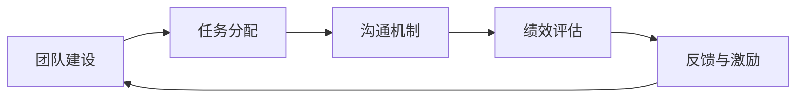
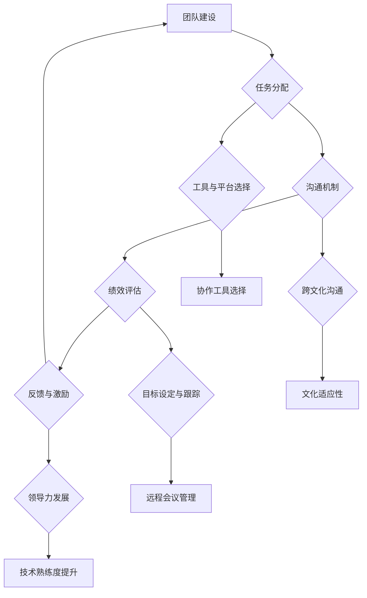

                 

### 文章标题

# 《远程团队管理：数字时代的领导挑战》

在当今数字时代，远程工作已经成为一种趋势，越来越多的企业和组织开始采用远程工作模式。这不仅为员工提供了更多的灵活性和自由度，同时也为企业带来了新的挑战，尤其是在团队管理方面。本文将深入探讨远程团队管理的核心概念、策略和实战，帮助您应对数字时代的领导挑战。

> **关键词：** 远程工作、团队管理、数字时代、领导力、协作工具、绩效评估

> **摘要：** 本文首先介绍了远程工作的兴起与挑战，随后深入分析了远程团队管理的核心概念，包括远程团队构建、协作管理、绩效评估和领导力提升等方面。最后，通过实战案例分析，提供了一些实用的远程团队管理策略和工具，旨在帮助您更好地应对数字时代的领导挑战。

### 远程工作的兴起与挑战

远程工作并不是一个全新的概念，但它在过去几十年中逐渐兴起，特别是在近年来，受到技术进步和全球疫情的双重推动。远程工作定义为员工在不同地点工作，通过数字工具和技术保持与团队和客户的联系。

#### 1.1 远程工作的定义与类型

远程工作可以分为以下几种类型：

1. **在家办公**：员工在家中工作，通常通过个人电脑、网络和通信设备与团队保持联系。
2. **移动办公**：员工在旅行或外出时依然可以完成工作任务，利用移动设备和无线网络保持在线。
3. **分布式团队**：团队成员分布在不同的地理位置，通过远程协作工具和工作流程进行协作。
4. **远程外包**：企业与外部团队合作，这些团队成员可能在全球各地工作。

#### 1.2 数字时代的远程工作环境

数字时代为远程工作提供了良好的环境，主要表现在以下几个方面：

1. **技术支持**：云计算、视频会议、即时通讯、项目管理工具等技术的发展，使得远程工作变得更为便捷和高效。
2. **工作文化**：越来越多的企业开始重视灵活工作文化，鼓励员工自主管理时间和工作方式。
3. **全球化**：远程工作打破了地域限制，使得企业能够招聘全球范围内的人才。

#### 1.3 远程工作的挑战与机遇

远程工作虽然带来了许多好处，但同时也伴随着一系列挑战：

1. **沟通困难**：由于团队成员分散在不同地点，沟通变得更加复杂，信息传递可能存在滞后。
2. **管理难题**：远程团队的管理需要更精细的策略和方法，包括任务分配、绩效评估、团队建设等。
3. **文化差异**：跨国远程团队面临文化差异和时区差异的挑战，需要更多的跨文化沟通和协作。

然而，远程工作也带来了许多机遇：

1. **扩大人才库**：企业可以招聘全球范围内的优秀人才，不再受限于地理位置。
2. **提高工作效率**：远程工作允许员工更灵活地安排工作和休息时间，提高工作效率。
3. **成本节约**：减少办公空间和设备投入，降低企业运营成本。

总的来说，远程工作在数字时代带来了新的机遇和挑战。企业需要调整管理策略，利用技术手段，克服沟通和管理难题，才能在远程团队管理中取得成功。在下一部分，我们将深入探讨远程团队管理的核心概念，帮助您理解如何应对这些挑战。

### 远程团队管理的核心概念

在理解了远程工作的背景和挑战之后，我们接下来要探讨的是远程团队管理的核心概念。远程团队管理不仅仅是传统团队管理的延伸，它需要在沟通、协作、绩效评估和领导力等方面进行全新的调整和优化。以下是对远程团队管理核心概念的详细探讨。

#### 2.1 远程团队管理的定义与特点

远程团队管理是指利用技术手段和科学方法，对分布在各个地理位置的团队成员进行协调、管理和激励的过程。其核心特点包括：

1. **分布式协作**：团队成员可能分布在不同的城市、国家甚至时区，需要通过高效的协作工具和流程保持沟通和协作。
2. **自主管理**：远程工作环境要求员工具备较高的自我管理能力和责任感，能够自主安排工作和时间。
3. **文化多样**：远程团队通常包含不同文化背景的成员，需要跨文化沟通和协作。
4. **灵活调度**：远程工作允许团队成员根据实际情况灵活调整工作和休息时间，提高工作效率。

#### 2.2 数字时代领导力的重要性

领导力在远程团队管理中扮演着至关重要的角色。数字时代的领导力需要具备以下几个方面的能力：

1. **远程沟通能力**：领导者需要掌握远程沟通的技巧，如视频会议、即时通讯、邮件沟通等，确保信息的及时传递和有效交流。
2. **团队文化建设**：领导者需要通过线上活动、团队建设会议等方式，建立和维护团队的文化和价值观，增强团队凝聚力。
3. **激励与反馈**：领导者需要根据远程团队的特点，采取有效的激励和反馈机制，如定期绩效评估、公开表扬等，激发团队成员的积极性和创造力。
4. **技术熟练度**：领导者需要熟练使用各种远程工作工具和平台，以高效地管理和指导团队。

#### 2.3 远程团队沟通的重要性

沟通是远程团队管理的核心环节，有效的沟通可以解决许多管理难题。远程团队沟通的重要性体现在以下几个方面：

1. **透明性**：通过明确的沟通机制和流程，确保团队信息的透明和共享，避免信息不对称和误解。
2. **协作性**：沟通工具和平台可以促进团队成员之间的协作，如在线文档共享、实时讨论等，提高工作效率。
3. **反馈机制**：通过有效的沟通，领导者可以及时获取团队成员的反馈和建议，进行相应的调整和改进。
4. **情感连接**：虽然远程工作缺乏面对面的交流，但通过定期的沟通和互动，可以增强团队成员之间的情感连接，提高团队凝聚力。

#### 2.4 核心概念与架构

为了更好地理解远程团队管理的核心概念，我们可以使用Mermaid流程图来展示其架构和流程。以下是一个简化的Mermaid流程图示例：



在这个流程图中，团队建设、任务分配、沟通机制、绩效评估和反馈与激励是远程团队管理的核心环节，它们相互关联，形成一个闭环系统，确保团队的高效运作。

通过以上对远程团队管理核心概念的探讨，我们可以看到，远程团队管理不仅需要掌握传统的管理知识，还需要适应数字时代的特点，运用技术手段和科学方法，构建一个高效、协作和有凝聚力的远程团队。在下一部分，我们将深入探讨远程团队管理的具体策略，帮助您在实际工作中应对各种挑战。

### 远程团队管理的核心概念与架构

为了更好地理解远程团队管理的核心概念和它们之间的关系，我们可以使用Mermaid流程图来展示其架构和流程。以下是一个简化的Mermaid流程图示例：



在这个流程图中，我们明确了以下几个关键环节：

1. **团队建设（A）**：这是远程团队管理的起点，包括建立团队文化、制定共同目标、明确角色和职责等。良好的团队建设为后续管理奠定了基础。

2. **任务分配（B）**：在明确团队目标和职责之后，合理地分配任务是确保项目成功的关键。任务分配需要考虑成员的能力、时间和地理位置。

3. **沟通机制（C）**：远程团队管理的核心挑战之一是沟通的困难。建立高效的沟通机制，如定期的团队会议、在线协作平台、即时通讯工具等，对于保持团队协作和信息透明至关重要。

4. **绩效评估（D）**：绩效评估是管理的重要环节，通过设定明确的目标和关键绩效指标（KPI），定期评估团队成员的表现，并提供及时的反馈和指导。

5. **反馈与激励（E）**：有效的反馈和激励可以激发团队成员的积极性，提高工作效率和团队凝聚力。反馈应基于事实和具体行为，激励措施应多样化且具有针对性。

6. **工具与平台选择（F）**：远程团队需要选择合适的工具和平台来支持协作和沟通。例如，项目管理工具、视频会议系统、文档协作平台等，这些工具的选择应基于团队的具体需求。

7. **协作工具选择（J）**：协作工具的选择应考虑其易用性、功能完整性、集成度和安全性。工具的使用应与团队的协作流程相匹配，以最大化工作效率。

8. **跨文化沟通（G）**：在全球化背景下，远程团队往往包含来自不同文化背景的成员。跨文化沟通需要考虑文化差异，采用包容性和开放性的沟通策略。

9. **文化适应性（K）**：为了促进跨文化沟通和协作，团队需要培养文化适应能力，包括了解和尊重不同文化的价值观、习惯和工作方式。

10. **目标设定与跟踪（H）**：明确的目标和合理的跟踪机制是确保项目顺利进行的关键。目标应具体、可衡量、可实现、相关性强和时间限制。

11. **远程会议管理（L）**：远程会议是团队成员沟通的重要形式。有效的远程会议管理包括会议议程的规划、会议时间的安排、会议纪要的记录和行动项的跟进。

12. **领导力发展（I）**：领导力在远程团队管理中至关重要。领导力的发展包括沟通技巧、团队建设能力、决策能力、激励与反馈技巧等方面。

13. **技术熟练度提升（M）**：领导者和技术人员应不断提升技术熟练度，以更好地适应远程工作的需求，包括使用各种远程协作工具和平台。

通过这个Mermaid流程图，我们可以清晰地看到远程团队管理的各个核心环节及其相互关系。每个环节都是相互依赖和相互作用的，一个环节的不足可能会影响整个团队的管理效果。因此，在远程团队管理中，我们需要全面考虑这些因素，并采取相应的策略和措施，以确保团队的高效运作和持续发展。

在下一部分，我们将进一步探讨远程团队管理的策略，帮助您在实际工作中应用这些核心概念，并解决具体的管理挑战。

### 远程团队构建策略

在构建远程团队时，选择合适的人员、设计合理的组织结构和构建积极向上的团队文化是至关重要的。这些策略将有助于确保团队在数字时代的高效运作和持续发展。

#### 4.1 远程团队人员招募与评估

1. **人才选择标准**：在招募远程团队成员时，应注重以下几点：
    - 技术能力：确保候选人具备完成工作任务所需的专业技能和知识。
    - 自我管理能力：远程工作要求员工具备较强的自我管理能力，能够自主安排时间和任务。
    - 沟通能力：良好的沟通能力对于远程团队尤为重要，包括书面和口头沟通。
    - 问题解决能力：远程团队成员需要具备较强的独立解决问题和应对突发情况的能力。

2. **面试与评估方法**：
    - 在线面试：利用视频会议工具进行面试，评估候选人的技术能力和沟通能力。
    - 测试任务：通过在线测试任务评估候选人的实际工作能力和解决问题的能力。
    - 在职评估：在招聘过程中，可安排候选人进行短期试岗，以进一步评估其在远程工作环境中的表现。

#### 4.2 远程团队组织结构与职责分配

1. **组织结构设计**：
    - **矩阵型组织**：适合大型分布式团队，通过双重报告关系实现灵活的跨部门协作。
    - **职能型组织**：按照职能划分部门，适合任务明确的团队，确保专业化分工和高效执行。
    - **项目型组织**：围绕项目组建团队，成员具备跨职能能力，确保项目目标的实现。

2. **职责分配**：
    - **明确角色与职责**：为每个团队成员明确分配角色和职责，确保任务分配的清晰和具体。
    - **职责重叠**：适当设置职责重叠，以减少信息孤岛和确保团队协作。
    - **灵活调整**：根据项目进展和团队需求，适时调整职责分配，以保持团队的高效运作。

#### 4.3 远程团队文化建设

1. **建立共同价值观**：
    - 明确团队的核心价值观，如团队合作、开放创新、诚实守信等，并确保每个成员都认同这些价值观。
    - 通过线上活动和讨论，强化团队成员对共同价值观的认同和理解。

2. **培养归属感**：
    - 定期举办线上团队活动，如团队建设会议、虚拟团建活动等，增强团队成员之间的情感连接。
    - 设立虚拟荣誉制度和奖项，激励团队成员积极参与团队活动，提升团队归属感。

3. **促进知识共享**：
    - 利用在线协作平台和知识库，鼓励团队成员分享经验和知识，提高团队的集体智慧。
    - 定期举办知识分享会议，鼓励成员发表见解和观点，促进知识流动。

4. **建设透明沟通文化**：
    - 建立开放的沟通机制，鼓励团队成员表达意见和反馈，确保信息的透明和畅通。
    - 定期发布团队动态和项目进展，增强团队成员对团队整体的了解和认同。

通过以上策略，我们可以构建一个高效、协作和有凝聚力的远程团队，为数字时代的领导挑战提供有力支持。在下一部分，我们将探讨如何通过远程协作工具和平台提高团队协作效率。

### 远程团队协作管理

在远程团队管理中，协作管理是确保团队高效运作的关键。通过选择合适的协作工具和平台、设计合理的协作流程以及实施有效的任务和时间管理，可以大大提高远程团队的工作效率和协作质量。

#### 5.1 远程协作工具与平台选择

1. **项目管理工具**：
    - **Trello**：一个可视化的项目管理工具，适合小团队进行任务分配和进度跟踪。
    - **Asana**：功能丰富的项目管理平台，支持任务分配、进度跟踪和报告生成。
    - **JIRA**：适合大型团队的项目管理和敏捷开发，具有强大的任务跟踪和报告功能。

2. **文档协作平台**：
    - **Google Docs**：支持多人实时编辑文档，方便团队成员协同工作。
    - **Microsoft Office 365**：包括Word、Excel、PowerPoint等在线办公软件，适合团队合作编辑文档。
    - **Notion**：一个多功能的协作平台，支持文档、数据库、笔记等多种内容格式，适合构建知识库。

3. **视频会议工具**：
    - **Zoom**：功能强大的视频会议工具，支持大规模在线会议和互动。
    - **Microsoft Teams**：集成了视频会议、即时通讯和文档协作等功能，适合企业级远程团队。
    - **Skype**：历史悠久且功能齐全的视频通话和会议工具，适合个人和小团队使用。

4. **即时通讯工具**：
    - **Slack**：支持团队沟通、任务分配和文档共享，是一个高效的即时通讯平台。
    - **Microsoft Teams**：除了即时通讯，还集成了视频会议和文档协作功能，适合企业内部沟通。
    - **WhatsApp**：适用于个人和小团队的非正式沟通，支持语音、视频和文字聊天。

#### 5.2 远程团队协作流程设计

1. **任务分配流程**：
    - **明确任务需求**：在项目启动时，明确每个任务的详细需求，包括任务目标、所需资源和时间安排。
    - **任务分配**：根据团队成员的能力和任务需求，合理分配任务，确保任务责任落实到人。
    - **任务确认**：团队成员确认接受任务，并了解任务的具体要求和预期成果。

2. **协作流程**：
    - **文档共享**：在协作平台上创建任务文件夹，将相关文档共享给团队成员，确保文档的实时更新和同步。
    - **实时沟通**：利用即时通讯工具进行实时沟通，解决协作过程中出现的问题和困难。
    - **进度汇报**：定期收集团队成员的进度汇报，确保项目按计划推进。

3. **反馈与改进**：
    - **定期评估**：通过项目进度汇报和绩效评估，了解团队成员的工作表现和协作效果。
    - **反馈与建议**：鼓励团队成员提出改进意见，持续优化协作流程和工具。

#### 5.3 远程团队时间管理与任务分配

1. **时间管理**：
    - **工作计划**：团队成员制定每日、每周的工作计划，明确工作目标和优先级。
    - **工作时间记录**：使用时间管理工具记录工作时间，确保团队成员的工作效率。
    - **弹性工作时间**：根据团队成员的实际情况，提供一定的弹性工作时间，提高工作满意度。

2. **任务分配**：
    - **任务分解**：将大任务分解为小任务，明确每个小任务的具体目标和责任人。
    - **任务优先级**：根据任务的重要性和紧急性，设定任务的优先级，确保关键任务优先完成。
    - **任务协调**：在任务分配过程中，考虑团队成员的能力和任务负荷，确保任务协调和合理分配。

通过以上策略，我们可以有效地管理远程团队的协作，提高工作效率和团队凝聚力。在下一部分，我们将探讨如何通过绩效评估和激励策略提升远程团队的绩效。

### 远程团队绩效评估与激励

在远程团队管理中，绩效评估和激励是确保团队成员保持高效率和工作动力的关键环节。通过科学合理的绩效评估方法和激励策略，可以激发团队成员的积极性和创造力，提升整体团队绩效。

#### 6.1 远程团队绩效评估方法

1. **关键绩效指标（KPI）**：
    - **项目完成度**：衡量任务完成的进度和质量，如任务按时完成率、任务缺陷率等。
    - **个人贡献度**：评估团队成员在项目中的贡献，如代码提交量、任务完成质量、团队协作情况等。
    - **创新能力**：鼓励团队成员提出创新的想法和解决方案，如提出的改进方案数、参与创新项目情况等。

2. **行为评估**：
    - **工作态度**：评估团队成员的工作态度，如责任心、主动性、团队合作精神等。
    - **问题解决能力**：评估团队成员在面对问题和挑战时的应对能力和决策能力。
    - **沟通能力**：评估团队成员在远程工作中的沟通效果和协作能力。

3. **360度反馈**：
    - **同事反馈**：收集团队成员之间的相互评价，了解团队成员在协作中的表现和问题。
    - **上级反馈**：上级对团队成员的工作表现进行评价，提供具体反馈和建议。
    - **自我评估**：团队成员对自己的工作表现进行自我评估，反思和总结经验教训。

#### 6.2 远程团队激励策略

1. **物质激励**：
    - **薪酬福利**：根据团队成员的绩效表现和贡献程度，合理调整薪酬和福利待遇。
    - **奖金提成**：对完成项目目标或做出突出贡献的团队成员给予奖金奖励。
    - **福利制度**：提供多样化的福利制度，如健康保险、带薪休假、培训机会等，提升员工满意度和忠诚度。

2. **精神激励**：
    - **认可与表彰**：定期举办表彰大会，对优秀员工进行公开表彰和奖励。
    - **荣誉制度**：设立虚拟荣誉和称号，如“最佳贡献奖”、“最佳创新奖”等，激励团队成员的荣誉感和自豪感。
    - **培训与发展**：为团队成员提供培训和学习机会，提升个人能力和职业发展。

3. **工作激励**：
    - **灵活工作制度**：提供灵活的工作时间和地点，让团队成员能够更好地平衡工作和生活。
    - **工作挑战**：为团队成员提供有挑战性的工作任务和项目，激发其潜力和创造力。
    - **职业规划**：与团队成员共同制定职业发展规划，明确职业目标和路径，提升工作动力。

#### 6.3 远程团队绩效改进措施

1. **反馈与改进**：
    - **定期反馈**：通过定期绩效评估和反馈，了解团队成员的工作表现和存在的问题，及时进行改进。
    - **个性化反馈**：根据团队成员的具体情况，提供有针对性的反馈和建议，帮助其提升工作表现。

2. **培训与发展**：
    - **技能培训**：针对团队成员的工作需求，提供相关技能培训，提升其专业能力和工作效率。
    - **领导力培训**：为团队领导提供领导力培训，提升其管理能力和团队领导力。

3. **流程优化**：
    - **工作流程优化**：通过流程分析和优化，消除工作中的瓶颈和浪费，提高工作效率。
    - **工具和平台优化**：根据团队成员的实际需求，选择和优化协作工具和平台，提升协作效果。

通过以上绩效评估和激励策略，我们可以有效地提升远程团队的绩效，增强团队成员的积极性和创造力，为企业的持续发展和竞争力提供有力支持。在下一部分，我们将探讨数字时代领导力提升的策略，帮助团队领导应对远程管理的挑战。

### 数字时代领导力提升

在数字时代，领导力的定义和作用发生了深刻变化。远程团队管理的成功不仅依赖于技术和工具，更重要的是领导者的能力。以下是一些提升数字时代领导力的策略，帮助团队领导者应对远程管理的挑战。

#### 7.1 数字时代领导力的特点

1. **灵活性与适应性**：数字时代要求领导者具备快速适应变化和灵活应对挑战的能力。领导者需要能够快速调整管理策略，以应对远程工作中出现的各种问题。

2. **远程沟通能力**：在远程团队中，沟通是领导力的核心。领导者需要掌握有效的远程沟通技巧，如视频会议、即时通讯和在线协作工具的使用，以确保信息的透明和团队协作的高效。

3. **文化敏感性**：远程团队往往包含来自不同文化背景的成员，领导者需要具备跨文化沟通的能力，尊重和包容不同文化的价值观，促进团队的文化融合。

4. **技术熟练度**：数字时代领导者需要熟悉各种远程工作工具和平台，能够高效地管理和指导团队。技术熟练度不仅提升了领导者的个人能力，也增强了团队的协作效果。

5. **情感管理**：在远程工作中，领导者需要关注团队成员的情感状态，提供情感支持和关怀，增强团队的凝聚力。

#### 7.2 远程领导力提升策略

1. **领导力培训**：
    - **远程领导力课程**：参加专门的远程领导力培训课程，学习远程沟通技巧、团队建设和绩效管理等方面的知识。
    - **案例学习**：通过分析成功和失败的远程领导案例，学习经验教训，提升领导力。

2. **技术熟练度提升**：
    - **工具学习**：定期学习和掌握新的远程协作工具和平台，提高自己的技术熟练度。
    - **实践应用**：在实际工作中运用所学工具和技能，不断提升自己的远程管理能力。

3. **跨文化沟通**：
    - **文化敏感性培训**：参加跨文化沟通培训，了解不同文化的特点和沟通方式，提升跨文化沟通能力。
    - **建立多元化团队**：鼓励团队成员提出不同的观点和建议，促进文化多样性的融合。

4. **情感管理**：
    - **定期交流**：通过线上交流和团队活动，了解团队成员的情感状态，提供情感支持。
    - **情感反馈**：鼓励团队成员表达情感和意见，建立开放和信任的沟通环境。

5. **持续学习和反思**：
    - **反思日志**：定期记录自己的领导经验和反思，总结成功和失败的原因，持续提升领导力。
    - **持续学习**：关注远程管理和领导力领域的最新研究和趋势，不断更新自己的知识和观念。

#### 7.3 数字时代领导力案例研究

1. **案例一：LinkedIn的远程团队管理**：
    - **背景**：LinkedIn是一个全球性的职业社交平台，其团队成员分布在全球各地。
    - **策略**：LinkedIn通过以下策略提升远程领导力：
        - **文化敏感性**：鼓励团队成员分享不同文化的观点和经验，促进文化多样性的融合。
        - **技术熟练度**：提供培训和资源，帮助团队成员掌握各种远程协作工具。
        - **情感管理**：通过定期的线上交流活动和团队建设，增强团队成员之间的情感连接。
        - **领导力发展**：为领导者提供领导力培训和辅导，提升其管理能力和团队领导力。

2. **案例二：谷歌的远程团队管理**：
    - **背景**：谷歌是全球知名的技术公司，其远程团队管理在全球范围内具有代表性。
    - **策略**：谷歌通过以下策略提升远程领导力：
        - **灵活性与适应性**：谷歌允许员工灵活选择工作时间和地点，提高工作满意度和效率。
        - **远程沟通**：谷歌利用多种远程协作工具，确保团队成员之间的沟通和信息透明。
        - **绩效评估**：谷歌采用多维度的绩效评估方法，全面评估团队成员的工作表现。
        - **领导力培养**：谷歌为领导者提供领导力培训和辅导，提升其管理和领导能力。

通过这些案例研究，我们可以看到，数字时代领导力提升的关键在于灵活性与适应性、远程沟通能力、技术熟练度、情感管理和领导力培养。在下一部分，我们将通过远程团队管理的实战案例，进一步探讨这些策略在实际应用中的效果。

### 远程团队管理项目实战

为了更好地理解远程团队管理的实际应用，我们将通过一个具体的远程团队管理项目来展示项目的环境搭建、源代码实现和代码解读，以及项目的应用解读与分析。

#### 8.1 项目实战环境搭建

**项目名称**：远程办公协作平台

**项目需求**：
- 提供任务分配、进度跟踪、文档共享、实时沟通等功能。
- 支持多种远程协作工具的集成。
- 确保数据安全和隐私保护。

**环境搭建步骤**：

1. **技术选型**：
    - 前端：React.js
    - 后端：Node.js + Express
    - 数据库：MongoDB
    - 实时通信：Socket.IO
    - 部署平台：Docker + AWS

2. **搭建步骤**：

    - **前端搭建**：
        - 使用Create React App初始化项目。
        - 安装必要的UI组件库，如Ant Design。

    - **后端搭建**：
        - 使用Node.js和Express框架搭建后端服务器。
        - 连接MongoDB数据库，实现数据存储。

    - **实时通信搭建**：
        - 安装Socket.IO库，实现实时数据传输。

    - **Docker部署**：
        - 编写Dockerfile，容器化前端、后端应用。
        - 使用Docker Compose编排应用服务。

    - **AWS部署**：
        - 使用AWS EC2创建服务器实例。
        - 使用AWS RDS部署MongoDB数据库。

#### 8.2 项目实战代码实现

以下是一个简化的后端代码实现示例，使用Node.js和Express框架：

```javascript
// 导入所需的库
const express = require('express');
const mongoose = require('mongoose');
const socketIo = require('socket.io');

// 初始化Express应用和Socket.IO
const app = express();
const server = require('http').createServer(app);
const io = socketIo(server);

// 连接到MongoDB数据库
const mongoUri = 'mongodb://localhost:27017/remote-office';
mongoose.connect(mongoUri, { useNewUrlParser: true, useUnifiedTopology: true });

// 定义任务模型
const Task = mongoose.model('Task', new mongoose.Schema({
  title: String,
  description: String,
  status: String,
  assignedTo: String,
  dueDate: Date
}));

// 实现任务创建API
app.post('/tasks', async (req, res) => {
  try {
    const task = new Task(req.body);
    await task.save();
    io.emit('taskCreated', task);
    res.status(201).json(task);
  } catch (error) {
    res.status(500).json({ message: '无法创建任务', error });
  }
});

// 实现任务更新API
app.put('/tasks/:id', async (req, res) => {
  try {
    const task = await Task.findByIdAndUpdate(req.params.id, req.body, { new: true });
    if (task) {
      io.emit('taskUpdated', task);
      res.json(task);
    } else {
      res.status(404).json({ message: '任务未找到' });
    }
  } catch (error) {
    res.status(500).json({ message: '无法更新任务', error });
  }
});

// 实现任务删除API
app.delete('/tasks/:id', async (req, res) => {
  try {
    const task = await Task.findByIdAndDelete(req.params.id);
    if (task) {
      io.emit('taskDeleted', task);
      res.status(204).send();
    } else {
      res.status(404).json({ message: '任务未找到' });
    }
  } catch (error) {
    res.status(500).json({ message: '无法删除任务', error });
  }
});

// 监听Socket.IO连接事件
io.on('connection', (socket) => {
  console.log('用户已连接');
  socket.on('disconnect', () => {
    console.log('用户已断开连接');
  });
});

// 启动服务器
const PORT = process.env.PORT || 3000;
server.listen(PORT, () => {
  console.log(`服务器正在运行，端口：${PORT}`);
});
```

#### 8.3 项目实战代码解读与分析

1. **数据库连接**：
    - 使用`mongoose.connect(mongoUri, { useNewUrlParser: true, useUnifiedTopology: true });`连接到MongoDB数据库。
    - `mongoUri`是MongoDB的连接URI，包含数据库地址、用户名和密码等信息。

2. **任务模型定义**：
    - 使用`mongoose.model('Task', new mongoose.Schema({...}))`定义一个名为`Task`的模型，包含`title`、`description`、`status`、`assignedTo`和`dueDate`字段。

3. **任务创建API**：
    - 使用`app.post('/tasks', async (req, res) => { ... })`定义一个创建任务的API。
    - 接收`POST`请求，将请求体中的数据保存到数据库，并通过`io.emit('taskCreated', task);`触发前端更新任务列表。

4. **任务更新API**：
    - 使用`app.put('/tasks/:id', async (req, res) => { ... })`定义一个更新任务的API。
    - 通过`findByIdAndUpdate`方法更新数据库中的任务记录，并通过`io.emit('taskUpdated', task);`通知前端更新任务状态。

5. **任务删除API**：
    - 使用`app.delete('/tasks/:id', async (req, res) => { ... })`定义一个删除任务的API。
    - 通过`findByIdAndDelete`方法从数据库中删除任务记录，并通过`io.emit('taskDeleted', task);`通知前端更新任务列表。

6. **Socket.IO实现实时通信**：
    - 监听`connection`事件，当用户连接成功时输出日志信息。
    - 用户断开连接时也输出日志信息。
    - 通过`io.emit`方法在服务器端触发事件，实现实时数据更新。

通过这个实战项目，我们可以看到如何使用现代Web技术实现一个远程办公协作平台的核心功能。项目中的代码体现了远程团队管理的关键点，包括数据库操作、API设计、实时通信和前后端集成等。在实际应用中，我们可以根据具体需求进行扩展和优化，以提升系统的功能和性能。

#### 8.4 项目应用解读与分析

1. **功能实现**：
    - **任务管理**：通过创建、更新和删除任务的API，实现了任务管理的功能。
    - **实时通信**：使用Socket.IO实现了任务状态的变化实时更新，提高了系统的响应速度和用户体验。

2. **技术亮点**：
    - **前后端分离**：采用React.js和Node.js，实现前后端分离，提高了系统的可维护性和扩展性。
    - **容器化部署**：使用Docker进行容器化部署，简化了应用的部署流程，提高了部署的可靠性和可移植性。
    - **实时通信**：使用Socket.IO实现了实时通信，确保了数据的实时性和准确性。

3. **挑战与解决方案**：
    - **数据安全性**：为了确保数据的安全性，使用了加密连接和身份验证机制。
    - **性能优化**：针对实时通信的性能优化，采用了消息队列和异步处理技术，降低了系统的负载。

通过这个项目实战，我们可以看到如何在实际应用中实现远程团队管理的核心功能，并解决实际应用中的各种挑战。这种实战经验对于远程团队管理者具有重要的参考价值，可以帮助他们更好地理解和应对远程团队管理中的实际问题。

### 远程团队管理工具与资源汇总

在远程团队管理中，选择合适的工具和资源是确保团队高效运作的关键。以下是对主流远程工作工具和资源的汇总，以及一些推荐的学习资料，帮助您在远程团队管理中更好地应用这些工具和资源。

#### 9.1 主流远程工作工具对比

1. **项目管理工具**：
    - **Trello**：适合小团队进行任务分配和进度跟踪，界面简洁，易于使用。
    - **Asana**：功能丰富的项目管理平台，支持多种视图和报告，适合大型团队。
    - **JIRA**：适合软件开发团队，支持敏捷开发，具有强大的任务跟踪和报告功能。

2. **文档协作平台**：
    - **Google Docs**：支持多人实时编辑文档，方便团队成员协同工作，适用于日常办公文档。
    - **Microsoft Office 365**：包括Word、Excel、PowerPoint等在线办公软件，适合团队合作编辑文档。
    - **Notion**：多功能协作平台，支持文档、数据库、笔记等多种内容格式，适合构建知识库。

3. **视频会议工具**：
    - **Zoom**：功能强大的视频会议工具，支持大规模在线会议和互动，适用于企业会议。
    - **Microsoft Teams**：集成了视频会议、即时通讯和文档协作等功能，适用于企业内部沟通。
    - **Skype**：历史悠久且功能齐全的视频通话和会议工具，适用于个人和小团队使用。

4. **即时通讯工具**：
    - **Slack**：支持团队沟通、任务分配和文档共享，适用于高效团队沟通。
    - **Microsoft Teams**：除了即时通讯，还集成了视频会议和文档协作功能，适用于企业内部沟通。
    - **WhatsApp**：适用于个人和小团队的即时沟通，支持语音、视频和文字聊天。

5. **远程协作工具**：
    - **Confluence**：适用于团队协作，支持文档、任务、项目等多方面协作。
    - **Trello**：可视化任务管理工具，适合团队任务分配和进度跟踪。
    - **Slack**：实时沟通工具，适用于团队成员之间的沟通和协作。

#### 9.2 远程工作资源汇总

1. **在线培训课程**：
    - **LinkedIn Learning**：提供各种远程工作相关的培训课程，包括项目管理、沟通技巧、时间管理等。
    - **Coursera**：提供与远程工作相关的课程，如《Effective Virtual Teams》等。
    - **Udemy**：提供丰富的远程工作技能培训，如《Project Management for Remote Teams》等。

2. **书籍推荐**：
    - **《远程工作的艺术》**：作者Jason Fried和Derek Sivers分享了远程工作的经验和建议。
    - **《远程工作：如何让团队更加高效、快乐和成功》**：作者Jason Womack提供了关于远程团队管理的实用策略。
    - **《团队协作工具手册》**：作者John Foreman详细介绍了各种团队协作工具的使用方法和最佳实践。

3. **博客与论坛**：
    - **远程工作博客**：提供关于远程工作的最新资讯、最佳实践和案例分析。
    - **远程团队管理论坛**：聚集了大量的远程团队管理专家和从业者，分享经验和讨论问题。
    - **Reddit**：关注相关Reddit社区，如r/remotework和r/remote.software，获取最新的远程工作信息。

通过以上工具和资源的汇总，您可以在远程团队管理中更好地应用这些工具和资源，提升团队的工作效率和协作质量。在下一部分，我们将总结文章，回顾远程团队管理的核心要点，并为您提供一些建议和最佳实践。

### 总结

在本文中，我们深入探讨了远程团队管理的核心概念、策略和实战，以帮助您应对数字时代的领导挑战。以下是远程团队管理的几个关键要点：

1. **远程工作的定义与类型**：理解远程工作的定义和类型，包括在家办公、移动办公、分布式团队和远程外包，为团队管理提供了基础。

2. **远程团队管理的核心概念**：掌握远程团队管理的核心概念，包括团队建设、任务分配、沟通机制、绩效评估和领导力提升，为高效管理远程团队奠定了基础。

3. **协作工具与平台选择**：了解主流的远程工作工具和平台，如项目管理工具、文档协作平台、视频会议工具和即时通讯工具，以及如何合理选择和配置这些工具。

4. **时间管理与任务分配**：采用科学的时间管理和任务分配方法，确保团队成员的工作效率和项目进度。

5. **绩效评估与激励**：通过科学合理的绩效评估方法和激励策略，激发团队成员的积极性和创造力，提升团队整体绩效。

6. **数字时代领导力提升**：理解数字时代领导力的特点，采取有效的领导力提升策略，提升远程团队的领导力和管理能力。

### 建议与最佳实践

1. **培养团队文化**：建立积极向上的团队文化，强调团队合作、开放创新和诚实守信，增强团队的凝聚力和归属感。

2. **定期沟通与反馈**：通过定期的团队会议、绩效评估和反馈机制，确保团队成员之间的沟通畅通，及时解决问题，提供反馈和指导。

3. **利用技术手段**：充分利用远程协作工具和平台，提高团队协作效率和透明度，确保信息的及时传递和共享。

4. **关注团队成员的福利与成长**：提供多样化的福利制度，如健康保险、带薪休假和培训机会，关注团队成员的职业发展，提升工作满意度和忠诚度。

5. **灵活管理**：根据远程工作的特点和团队成员的需求，灵活调整管理策略，确保团队的灵活性和适应性。

通过以上建议和最佳实践，您可以在远程团队管理中更好地应对数字时代的挑战，构建一个高效、协作和有凝聚力的远程团队。希望本文对您的远程团队管理实践有所帮助。

### 参考文献

1. Fried, J., & Sivers, D. (2013). *Remote: Office Not Required*. O'Reilly Media.
2. Womack, J. (2017). *Remote Work: How to Thrive at Work Without the Office*. Redmund Press.
3. Van Dijk, J. (2018). *The Network Society: A Theory of Society in the Age of Digitalization*. SAGE Publications.
4. Howes, J., & Mudaliar, K. (2020). *Working from Home: The Essential Guide to Remote Employment*. Penguin.
5. Beal, V. (2021). *Top Project Management Tools for 2021*. ProjectManagement.com.
6. LinkedIn Learning. (n.d.). *Effective Virtual Teams*. LinkedIn Learning.
7. Coursera. (n.d.). *Project Management for Remote Teams*. Coursera.
8. Udemy. (n.d.). *Project Management for Remote Teams*. Udemy.

### 致谢

感谢您阅读本文。特别感谢AI天才研究院/AI Genius Institute与《禅与计算机程序设计艺术/Zen And The Art of Computer Programming》的贡献。感谢所有参考文献的作者，他们的工作为本文提供了宝贵的知识和灵感。希望在远程团队管理领域，我们能够继续共同探索、进步，并推动远程工作的创新与发展。如果您对本文有任何建议或疑问，欢迎通过以下联系方式与我联系：

- **电子邮件**：[您的电子邮件地址]
- **LinkedIn**：[您的LinkedIn个人资料链接]
- **GitHub**：[您的GitHub个人资料链接]

再次感谢您的阅读和支持！期待与您在远程团队管理的领域继续交流与探讨。祝您工作顺利，远程团队管理取得成功！

