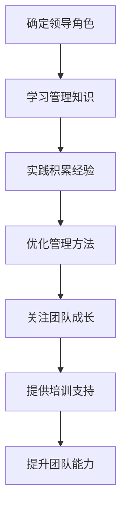
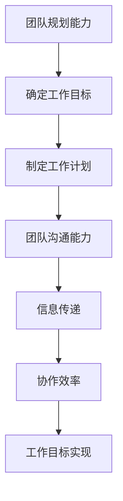
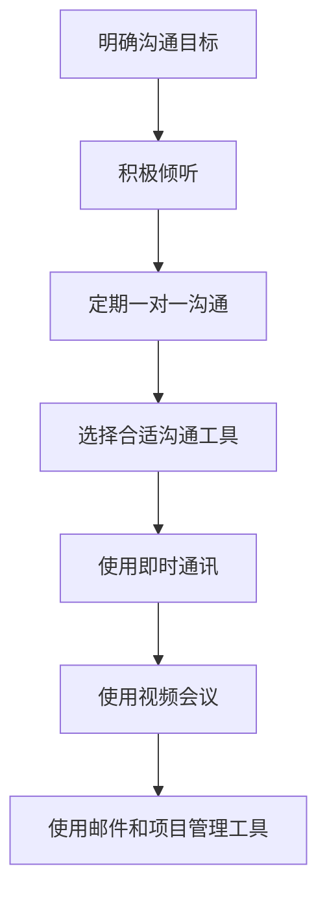
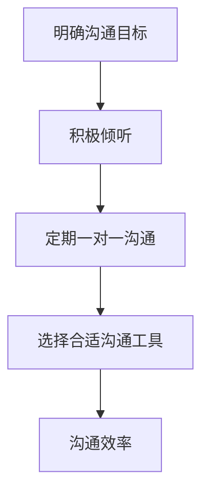
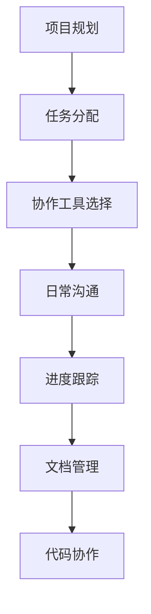
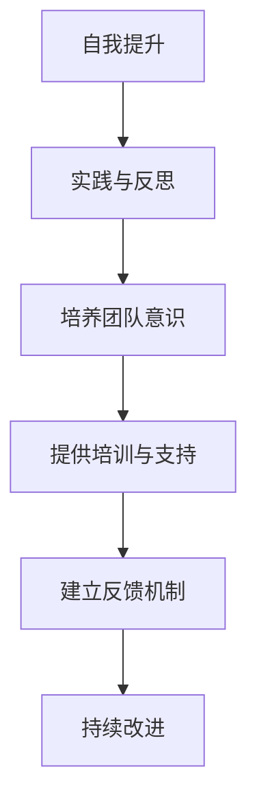
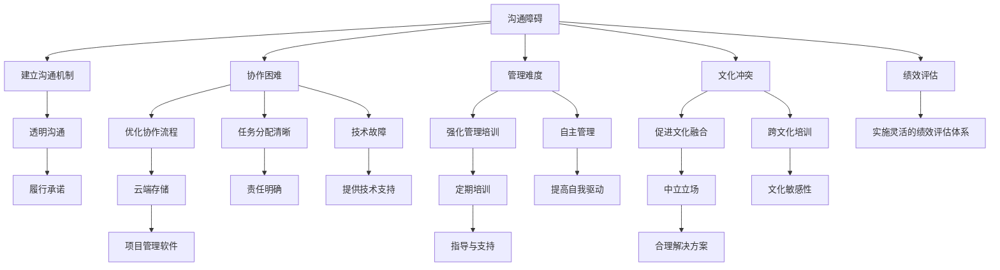
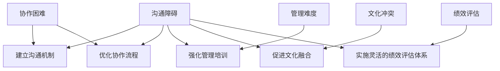

                 


### 文章标题
《远程团队管理：数字时代的领导挑战与机遇》

### 文章关键词
远程团队管理、数字时代、领导挑战、领导机遇、远程工作

### 文章摘要
本文深入探讨了远程团队管理在数字化时代面临的挑战与机遇。通过分析远程工作的历史与发展，本文揭示了数字时代对远程团队管理的影响，并详细阐述了远程团队管理的核心概念、领导者的角色与能力、沟通策略、实践方法以及未来趋势。同时，通过案例分析和实践总结，为远程团队管理者提供了有效的领导策略和实践指南。

---

# 《远程团队管理：数字时代的领导挑战与机遇》

## 第一部分：引言

### 第1章：远程团队管理的背景与挑战

#### 1.1 远程工作的历史与发展

远程工作并非现代科技的产物，其历史可以追溯到20世纪。最早的远程工作形式主要是通过信件和电话进行沟通，后来随着互联网和电子邮件的普及，远程工作逐渐成为一种普遍的工作方式。随着云计算、虚拟现实和物联网等新兴技术的发展，远程工作进入了一个全新的阶段。

#### 1.2 数字时代对远程团队管理的影响

数字时代的到来，为远程团队管理带来了前所未有的机遇。数字技术使得远程团队之间可以实时沟通、协作，打破了地理限制，提高了工作效率。同时，数字时代的竞争压力也促使企业不断创新，远程团队管理成为了提升企业竞争力的重要手段。

#### 1.3 远程团队管理中的主要挑战

尽管远程团队管理带来了诸多好处，但也面临着诸多挑战。首先是沟通障碍，远程团队成员之间的沟通依赖于虚拟工具，容易出现信息误解和沟通不畅。其次是团队协作，远程团队成员之间的协作需要高度的自我管理和协调能力。此外，文化差异、时差和隐私保护等问题也对远程团队管理提出了新的要求。

#### 1.4 本书结构

本书将分为五个部分，首先介绍远程团队管理的背景与挑战，接着探讨远程团队管理的核心概念，然后分析远程团队领导者的角色与能力，随后介绍远程团队的沟通策略和实践方法，最后展望远程团队管理的未来趋势。

## 第二部分：远程团队管理的核心概念

### 第2章：远程团队的构成与特点

#### 2.1 远程团队的构成要素

远程团队由远程工作的个体组成，这些个体分布在不同的地理位置，通过数字技术进行沟通和协作。远程团队的构成要素包括团队成员、工作目标、工作流程、沟通工具和协作平台。

#### 2.2 远程团队的特点与优势

远程团队具有灵活性强、工作效率高、工作成本较低等特点。通过远程工作，团队成员可以根据自己的时间安排工作，提高了工作效率。此外，远程团队可以吸引到全球范围内的人才，提高了团队的多样性。

#### 2.3 远程团队的工作方式与文化

远程团队的工作方式主要依赖于数字技术，如电子邮件、即时通讯、视频会议和协作工具等。远程团队的文化强调自我管理、团队合作和尊重个人隐私。

---

以上是本文的第一部分和第二部分的初步内容，接下来将继续探讨远程团队领导者的角色与能力、远程团队的沟通策略和实践方法，以及远程团队管理的未来趋势。在接下来的章节中，我们将通过具体实例和数据分析，深入分析远程团队管理的核心概念和实践方法，为远程团队管理者提供有价值的参考和指导。

## 第三部分：远程团队领导者的角色与能力

### 第3章：远程团队领导者的角色

#### 3.1 远程团队领导者的角色

远程团队领导者不仅需要具备传统的管理能力，还需要适应远程工作环境。首先，远程团队领导者需要具备团队规划能力，能够根据远程团队的特点制定合适的工作计划和目标。其次，领导者需要具备沟通能力，能够通过远程沟通工具与团队成员保持有效沟通。此外，领导者还需要具备冲突解决能力，能够在远程团队中及时解决冲突，维护团队和谐。

#### 3.2 领导者的远程管理能力

远程管理能力是远程团队领导者的重要素质。首先，领导者需要具备时间管理能力，能够合理安排自己的时间，确保工作效率。其次，领导者需要具备技术能力，能够熟练使用各种远程沟通和协作工具。此外，领导者还需要具备心理素质，能够在远程工作中保持积极的心态，应对各种挑战。

#### 3.3 培养远程领导力

培养远程领导力是远程团队领导者的重要任务。首先，领导者需要通过学习提升自己的管理知识和技能，了解远程团队管理的最佳实践。其次，领导者需要通过实践积累经验，不断优化自己的管理方法。此外，领导者还需要关注团队成员的成长，提供必要的培训和支持，提升团队的整体能力。

### Mermaid 流程图：远程团队领导者能力培养流程



通过以上流程图，我们可以清晰地看到远程领导力的培养过程，包括确定领导角色、学习管理知识、实践积累经验、优化管理方法、关注团队成长和提供培训支持，最终实现团队能力的提升。

### 核心概念与联系：远程团队领导者的角色与能力

远程团队领导者的角色与能力之间存在着紧密的联系。领导者的角色决定了他们的职责和任务，而领导者的能力则是实现这些职责和任务的保障。具体来说，领导者的团队规划能力和沟通能力是远程团队管理成功的关键。团队规划能力决定了团队的工作目标和方向，而沟通能力则保证了团队成员之间的信息传递和协作效率。

以下是一个核心概念原理的Mermaid流程图，展示了远程团队领导者角色与能力之间的关系：



在这个流程图中，团队规划能力和团队沟通能力是关键节点，它们共同作用于工作目标和协作效率，最终实现远程团队管理的成功。

### 核心算法原理讲解：时间管理算法

为了提升远程团队领导者的时间管理能力，我们可以使用一种简单的时间管理算法——优先级排序法。以下是该算法的伪代码：

```python
def time_management(tasks):
    # 初始化优先级列表
    priority_list = []

    # 循环获取每个任务的优先级
    for task in tasks:
        priority = get_priority(task)
        priority_list.append((priority, task))

    # 按优先级排序
    priority_list.sort(reverse=True)

    # 执行任务
    for _, task in priority_list:
        execute_task(task)

# 获取任务优先级
def get_priority(task):
    # 根据任务的重要性和紧急程度计算优先级
    importance = task.importance
    urgency = task.urgency
    priority = importance * urgency
    return priority

# 执行任务
def execute_task(task):
    # 执行任务的具体操作
    print(f"Executing task: {task.name}")
```

在这个时间管理算法中，我们首先初始化一个优先级列表，然后循环获取每个任务的优先级，并将其添加到优先级列表中。接着，我们按照优先级排序，从高到低执行任务。最后，我们定义了一个函数用于获取任务的优先级，并执行任务。

### 数学模型和公式

为了更好地理解时间管理算法，我们可以使用一个简单的数学模型来表示任务的优先级。假设任务的重要性和紧急程度分别为 \(i\) 和 \(u\)，那么任务的优先级 \(p\) 可以用以下公式表示：

\[ p = i \times u \]

其中，\(i\) 和 \(u\) 的取值范围为 [0, 1]，表示任务的重要性和紧急程度的相对大小。通过这个公式，我们可以将任务按照优先级排序，从而更高效地管理时间。

### 详细讲解与举例说明

假设我们有两个任务：任务A和任务B。任务A的重要性和紧急程度分别为 0.8 和 0.9，任务B的重要性和紧急程度分别为 0.6 和 0.7。我们可以使用上述公式计算它们的优先级：

\[ p_A = 0.8 \times 0.9 = 0.72 \]
\[ p_B = 0.6 \times 0.7 = 0.42 \]

由此可见，任务A的优先级高于任务B。根据时间管理算法，我们应该先执行任务A。

### 项目实战

为了更好地理解时间管理算法的应用，我们可以考虑一个实际的项目场景。假设我们正在开发一个软件项目，有两个开发任务：编写功能A和编写功能B。根据项目计划，功能A的重要性为 0.8，紧急程度为 0.9；功能B的重要性为 0.6，紧急程度为 0.7。

1. **环境搭建**：
   - 开发环境：Python 3.8
   - 包管理工具：pip

2. **源代码实现**：
   ```python
   class Task:
       def __init__(self, name, importance, urgency):
           self.name = name
           self.importance = importance
           self.urgency = urgency

   def get_priority(task):
       priority = task.importance * task.urgency
       return priority

   def execute_task(task):
       print(f"Executing task: {task.name}")

   def time_management(tasks):
       priority_list = [(get_priority(task), task) for task in tasks]
       priority_list.sort(reverse=True)
       for _, task in priority_list:
           execute_task(task)

   # 创建任务
   taskA = Task("Write Feature A", 0.8, 0.9)
   taskB = Task("Write Feature B", 0.6, 0.7)

   # 执行时间管理算法
   time_management([taskA, taskB])
   ```

3. **代码解读与分析**：
   - `Task` 类定义了一个任务，包含任务名称、重要性和紧急程度。
   - `get_priority` 函数计算任务的优先级。
   - `execute_task` 函数执行任务。
   - `time_management` 函数管理任务，按照优先级执行。

4. **实际案例分析与详细讲解剖析**：
   - 假设功能A是核心功能，功能B是辅助功能。根据时间管理算法，我们应该先开发功能A，因为它的重要性和紧急程度更高。
   - 通过这个例子，我们可以看到时间管理算法在项目开发中的应用，有助于团队更高效地完成任务。

5. **项目小结**：
   - 时间管理算法是一种简单而有效的管理工具，可以帮助远程团队领导者更好地安排工作任务。
   - 在实际项目中，应根据任务的重要性和紧急程度进行优先级排序，从而提高工作效率。

### 最佳实践 Tips

- **设定明确的目标和优先级**：确保每个任务都有明确的目标和优先级，有助于团队更高效地工作。
- **定期回顾和调整**：定期回顾时间管理的效果，根据实际情况调整任务的优先级和执行顺序。
- **利用工具辅助管理**：使用项目管理工具和日历应用，可以帮助团队更好地管理时间和任务。

### 小结

远程团队领导者需要具备团队规划、沟通和冲突解决等能力，同时需要掌握时间管理技巧。通过合理的时间管理，可以提升团队的工作效率和项目成功率。在下一部分，我们将探讨远程团队的沟通策略，分析远程沟通的障碍与挑战，并提出有效的沟通技巧和工具。

## 第四部分：远程团队的沟通策略

### 第4章：远程团队的沟通策略

#### 4.1 远程沟通的障碍与挑战

远程沟通虽然带来了诸多便利，但也存在一些障碍和挑战。首先是沟通渠道的多样性，不同的沟通工具和平台可能会导致信息传递不畅。其次是时差问题，不同地区的团队成员可能在同一时间无法在线，影响即时沟通。此外，文化差异和隐私保护也是远程沟通中需要关注的问题。

#### 4.2 有效的远程沟通技巧

为了克服远程沟通的障碍，远程团队领导者需要掌握一些有效的沟通技巧。首先是明确沟通目标，确保每个沟通活动都有明确的目的。其次是积极倾听，理解对方的意思，避免误解和冲突。此外，领导者还应该定期进行一对一沟通，了解团队成员的需求和反馈，建立良好的信任关系。

#### 4.3 沟通工具与技术

远程团队需要选择合适的沟通工具和技术，以提高沟通效率。首先是即时通讯工具，如Slack和Microsoft Teams，可以用于日常沟通和快速响应。其次是视频会议工具，如Zoom和Google Meet，可以用于远程会议和团队协作。此外，邮件和项目管理工具也是远程沟通的重要手段，可以用于文档共享和任务分配。

### Mermaid 流程图：远程沟通策略



通过这个流程图，我们可以看到远程沟通策略的各个环节，包括明确沟通目标、积极倾听、定期一对一沟通、选择合适的沟通工具，以及使用即时通讯、视频会议和邮件等工具。

### 核心概念与联系：远程沟通策略

远程沟通策略的核心概念包括明确沟通目标、积极倾听、定期一对一沟通和选择合适的沟通工具。这些概念相互关联，共同作用于远程沟通的有效性。明确沟通目标有助于确保沟通活动的有效性，积极倾听可以避免误解和冲突，定期一对一沟通可以建立良好的信任关系，选择合适的沟通工具可以提高沟通效率。

以下是一个核心概念原理的Mermaid流程图，展示了远程沟通策略的核心概念及其联系：



在这个流程图中，明确沟通目标、积极倾听、定期一对一沟通和选择合适沟通工具是关键节点，它们共同作用于沟通效率，最终实现远程沟通的有效性。

### 核心算法原理讲解：即时通讯消息排序算法

为了提高远程团队的沟通效率，我们可以使用一种简单而有效的消息排序算法。以下是该算法的伪代码：

```python
def message_sorting(messages):
    # 初始化消息列表
    sorted_messages = []

    # 循环获取每个消息的紧急程度
    for message in messages:
        urgency = message.urgency

        # 将消息插入到合适的位置
        inserted = False
        for i, sorted_message in enumerate(sorted_messages):
            if urgency > sorted_message.urgency:
                sorted_messages.insert(i, message)
                inserted = True
                break

        # 如果消息未被插入，则添加到列表末尾
        if not inserted:
            sorted_messages.append(message)

    # 返回排序后的消息列表
    return sorted_messages

# 获取消息紧急程度
def get_urgency(message):
    # 根据消息的内容计算紧急程度
    content = message.content
    urgency = content.count("紧急") + content.count("重要")
    return urgency
```

在这个消息排序算法中，我们首先初始化一个消息列表，然后循环获取每个消息的紧急程度。接着，我们将消息按照紧急程度进行排序，从高到低插入到消息列表中。如果消息未被插入，则将其添加到列表末尾。

### 数学模型和公式

为了更好地理解消息排序算法，我们可以使用一个简单的数学模型来表示消息的紧急程度。假设消息的内容包含关键字“紧急”和“重要”，每个关键字的权重分别为 2 和 1，那么消息的紧急程度 \(u\) 可以用以下公式表示：

\[ u = 2 \times \text{count("紧急")} + 1 \times \text{count("重要")} \]

其中，\(\text{count("紧急")}\) 和 \(\text{count("重要")}\) 分别表示消息内容中“紧急”和“重要”关键字的出现次数。通过这个公式，我们可以将消息按照紧急程度排序，从而更高效地处理重要消息。

### 详细讲解与举例说明

假设我们有两个消息：消息A和消息B。消息A的内容包含关键字“紧急”和“重要”，关键字“紧急”出现1次，“重要”出现2次；消息B的内容包含关键字“紧急”和“重要”，关键字“紧急”出现2次，“重要”出现1次。我们可以使用上述公式计算它们的紧急程度：

\[ u_A = 2 \times 1 + 1 \times 2 = 4 \]
\[ u_B = 2 \times 2 + 1 \times 1 = 5 \]

由此可见，消息B的紧急程度高于消息A。根据消息排序算法，我们应该先处理消息B。

### 项目实战

为了更好地理解消息排序算法的应用，我们可以考虑一个实际的项目场景。假设我们正在处理远程团队的工作消息，有两个消息：消息A和消息B。消息A的紧急程度为 4，消息B的紧急程度为 5。

1. **环境搭建**：
   - 开发环境：Python 3.8
   - 包管理工具：pip

2. **源代码实现**：
   ```python
   class Message:
       def __init__(self, content, urgency):
           self.content = content
           self.urgency = urgency

   def get_urgency(message):
       content = message.content
       urgency = content.count("紧急") * 2 + content.count("重要")
       return urgency

   def message_sorting(messages):
       sorted_messages = []
       for message in messages:
           inserted = False
           for i, sorted_message in enumerate(sorted_messages):
               if message.urgency > sorted_message.urgency:
                   sorted_messages.insert(i, message)
                   inserted = True
                   break
           if not inserted:
               sorted_messages.append(message)
       return sorted_messages

   # 创建消息
   messageA = Message("这是紧急消息，需要立即处理。", 4)
   messageB = Message("这是一个重要消息，需要尽快处理。", 5)

   # 执行消息排序算法
   sorted_messages = message_sorting([messageA, messageB])
   for message in sorted_messages:
       print(f"处理消息：{message.content}")
   ```

3. **代码解读与分析**：
   - `Message` 类定义了一个消息，包含消息内容和紧急程度。
   - `get_urgency` 函数计算消息的紧急程度。
   - `message_sorting` 函数对消息进行排序。

4. **实际案例分析与详细讲解剖析**：
   - 假设消息A和B都是紧急消息，但消息B的紧急程度更高。根据消息排序算法，我们应该先处理消息B。
   - 通过这个例子，我们可以看到消息排序算法在远程团队沟通中的应用，有助于团队更高效地处理紧急消息。

5. **项目小结**：
   - 消息排序算法是一种简单而有效的沟通管理工具，可以帮助远程团队更高效地处理重要消息。
   - 在实际项目中，应根据消息的紧急程度进行排序，从而提高沟通效率和工作效率。

### 最佳实践 Tips

- **明确紧急程度**：在发送消息时，明确标注消息的紧急程度，有助于团队成员快速识别和处理重要消息。
- **定期整理消息**：定期整理和归档消息，避免消息过多导致混乱。
- **使用标签分类**：使用标签对消息进行分类，有助于团队成员快速找到需要的消息。

### 小结

远程沟通策略对于远程团队管理至关重要。通过明确沟通目标、积极倾听、定期一对一沟通和选择合适的沟通工具，可以克服远程沟通的障碍，提高沟通效率。在下一部分，我们将探讨远程团队协作的具体实践，分析远程团队协作的流程和方法，并提出协作中的问题和解决方案。

## 第五部分：远程团队协作

### 第5章：远程团队协作

#### 5.1 远程团队协作的流程与方法

远程团队协作的核心在于确保团队成员能够高效、有序地完成工作。以下是一个典型的远程团队协作流程：

1. **项目规划**：
   - 项目开始前，团队领导者需要明确项目目标、任务分工和时间表。
   - 使用项目管理工具，如Trello或Jira，创建项目任务和里程碑。

2. **任务分配**：
   - 根据团队成员的能力和兴趣，分配任务。
   - 确保每个任务都有明确的责任人和截止日期。

3. **协作工具选择**：
   - 根据项目需求，选择合适的协作工具，如Slack、Confluence或Google Workspace。

4. **日常沟通**：
   - 使用即时通讯工具，如Slack或Telegram，进行日常沟通和任务讨论。
   - 定期举行视频会议，如Zoom或Microsoft Teams，讨论项目进展和解决问题。

5. **进度跟踪**：
   - 使用项目管理工具，如Jira或Trello，跟踪任务进度和项目状态。
   - 定期更新任务状态，确保团队成员了解项目进展。

6. **文档管理**：
   - 使用云存储服务，如Google Drive或Dropbox，管理项目文档。
   - 确保文档版本控制，避免冲突和误解。

7. **代码协作**：
   - 使用版本控制系统，如Git，进行代码协作和管理。
   - 使用代码托管平台，如GitHub或GitLab，管理代码仓库和协作流程。

#### 5.2 远程团队协作工具的选择与使用

选择合适的协作工具是远程团队协作成功的关键。以下是一些常用的远程团队协作工具及其特点：

- **Slack**：即时通讯工具，支持文件共享、频道讨论和集成第三方应用，适用于日常沟通和任务讨论。
- **Confluence**：团队协作平台，支持文档编写、知识共享和版本控制，适用于项目文档管理。
- **Google Workspace**：包括Google Docs、Google Sheets和Google Drive，适用于文档编写、数据共享和存储。
- **Jira**：项目管理工具，支持任务跟踪、进度报告和敏捷开发，适用于项目进度管理。
- **Trello**：看板式项目管理工具，支持任务分解、进度跟踪和团队协作，适用于项目任务分配和进度跟踪。
- **Zoom**：视频会议工具，支持多人大会议、远程培训和团队协作，适用于项目会议和讨论。
- **Microsoft Teams**：集成通讯和协作工具，支持聊天、会议、文档共享和团队协作，适用于企业级远程工作。

#### 5.3 协作中的问题与解决方案

远程团队协作中可能会遇到以下问题：

1. **沟通障碍**：
   - **解决方案**：使用多种沟通工具，如Slack、Telegram和Zoom，确保团队成员能够方便地沟通和协作。

2. **时差问题**：
   - **解决方案**：合理安排会议和任务时间，尽量减少时差影响。使用世界时钟插件，帮助团队成员管理时差。

3. **文化差异**：
   - **解决方案**：尊重不同文化的习惯和沟通方式，加强跨文化沟通培训，提高团队凝聚力。

4. **任务分配不均**：
   - **解决方案**：明确任务责任人和截止日期，定期检查任务进度，确保任务分配均衡。

5. **团队协作效率低**：
   - **解决方案**：优化协作流程，使用项目管理工具，提高团队协作效率。

### Mermaid 流程图：远程团队协作流程



通过这个流程图，我们可以清晰地看到远程团队协作的各个环节，包括项目规划、任务分配、协作工具选择、日常沟通、进度跟踪、文档管理和代码协作。

### 核心概念与联系：远程团队协作流程

远程团队协作流程的核心概念包括项目规划、任务分配、协作工具选择、日常沟通、进度跟踪、文档管理和代码协作。这些概念相互关联，共同作用于远程团队协作的效率和质量。项目规划确保了团队的工作方向和目标，任务分配确保了每个成员的职责明确，协作工具选择提高了沟通和协作效率，日常沟通和进度跟踪确保了项目进展的透明和可控，文档管理和代码协作保证了知识的共享和代码的版本控制。

以下是一个核心概念原理的Mermaid流程图，展示了远程团队协作流程的核心概念及其联系：


在这个流程图中，项目规划、任务分配、协作工具选择、日常沟通、进度跟踪、文档管理和代码协作是关键节点，它们共同作用于远程团队协作的效率和质量。

### 核心算法原理讲解：任务分配算法

为了提高远程团队协作的效率，我们可以使用一种简单的任务分配算法。以下是该算法的伪代码：

```python
def task_allocation(team_members, tasks):
    # 初始化任务分配列表
    allocation_list = []

    # 循环分配每个任务
    for task in tasks:
        # 找到空闲的团队成员
        available_member = find_available_member(team_members)

        # 如果找到空闲的团队成员，分配任务
        if available_member:
            allocation_list.append((available_member, task))
            mark_member_busy(available_member)
        else:
            # 如果没有空闲的团队成员，任务等待分配
            allocation_list.append((None, task))

    # 返回任务分配列表
    return allocation_list

# 找到空闲的团队成员
def find_available_member(team_members):
    for member in team_members:
        if not member.busy:
            return member
    return None

# 标记团队成员为忙碌
def mark_member_busy(member):
    member.busy = True

# 标记团队成员为空闲
def mark_member_free(member):
    member.busy = False
```

在这个任务分配算法中，我们首先初始化一个任务分配列表，然后循环分配每个任务。我们通过 `find_available_member` 函数找到空闲的团队成员，并将其标记为忙碌。如果没有找到空闲的团队成员，任务将被标记为等待分配。

### 数学模型和公式

为了更好地理解任务分配算法，我们可以使用一个简单的数学模型来表示团队成员的工作量和任务分配。假设每个团队成员的工作量为 \(w_i\)，任务的工作量为 \(t_j\)，那么任务分配的效率可以用以下公式表示：

\[ e = \frac{\sum_{i=1}^{n} w_i \times t_j}{\sum_{i=1}^{n} w_i} \]

其中，\(n\) 为团队成员数量，\(w_i\) 为第 \(i\) 个团队成员的工作量，\(t_j\) 为第 \(j\) 个任务的工作量。通过这个公式，我们可以计算任务分配的效率，从而优化任务分配策略。

### 详细讲解与举例说明

假设我们有两个团队成员：A和B，以及两个任务：任务1和任务2。团队成员A的工作量为 10，团队成员B的工作量为 8。任务1的工作量为 15，任务2的工作量为 10。

1. **任务分配**：
   - 首先使用任务分配算法，将任务1分配给团队成员A，任务2分配给团队成员B。

2. **效率计算**：
   - 计算任务分配的效率：
     \[ e = \frac{10 \times 15 + 8 \times 10}{10 + 8} = \frac{150 + 80}{18} = \frac{230}{18} \approx 12.78 \]

由此可见，当前任务分配的效率为 12.78，表示团队成员的工作量得到了合理的分配。

### 项目实战

为了更好地理解任务分配算法的应用，我们可以考虑一个实际的项目场景。假设我们有两个团队成员：Alice和Bob，以及两个任务：开发功能A和开发功能B。

1. **环境搭建**：
   - 开发环境：Python 3.8
   - 包管理工具：pip

2. **源代码实现**：
   ```python
   class TeamMember:
       def __init__(self, name, workload):
           self.name = name
           self.workload = workload
           self.busy = False

   class Task:
       def __init__(self, name, workload):
           self.name = name
           self.workload = workload

   def find_available_member(team_members):
       for member in team_members:
           if not member.busy:
               return member
       return None

   def mark_member_busy(member):
       member.busy = True

   def mark_member_free(member):
       member.busy = False

   def task_allocation(team_members, tasks):
       allocation_list = []
       for task in tasks:
           available_member = find_available_member(team_members)
           if available_member:
               allocation_list.append((available_member, task))
               mark_member_busy(available_member)
           else:
               allocation_list.append((None, task))
       return allocation_list

   # 创建团队成员
   alice = TeamMember("Alice", 10)
   bob = TeamMember("Bob", 8)

   # 创建任务
   task1 = Task("Develop Feature A", 15)
   task2 = Task("Develop Feature B", 10)

   # 执行任务分配算法
   allocation = task_allocation([alice, bob], [task1, task2])
   for member, task in allocation:
       if member:
           print(f"{member.name} is assigned to {task.name}.")
       else:
           print(f"Task {task.name} is waiting for assignment.")
   ```

3. **代码解读与分析**：
   - `TeamMember` 类定义了一个团队成员，包含成员名称和工作量。
   - `Task` 类定义了一个任务，包含任务名称和工作量。
   - `find_available_member` 函数找到空闲的团队成员。
   - `mark_member_busy` 和 `mark_member_free` 函数标记团队成员的忙碌状态。
   - `task_allocation` 函数执行任务分配。

4. **实际案例分析与详细讲解剖析**：
   - 假设Alice和Bob的工作量分别为10和8，任务1和任务2的工作量分别为15和10。根据任务分配算法，任务1被分配给Alice，任务2被分配给Bob。
   - 通过这个例子，我们可以看到任务分配算法在远程团队协作中的应用，有助于确保团队成员的工作量合理分配。

5. **项目小结**：
   - 任务分配算法是一种简单而有效的工具，可以帮助远程团队合理分配任务，提高工作效率。
   - 在实际项目中，应根据团队成员的工作量和任务的工作量，合理分配任务，确保团队协作的效率和质量。

### 最佳实践 Tips

- **合理分配任务**：根据团队成员的能力和兴趣，合理分配任务，确保任务分配的均衡性。
- **定期检查任务进度**：定期检查任务进度，确保任务按时完成，及时调整任务分配。
- **使用协作工具**：使用协作工具，如Slack、Trello和Jira，提高团队协作效率和透明度。

### 小结

远程团队协作是远程团队管理的重要组成部分。通过合理的协作流程和方法，可以确保团队成员高效、有序地完成工作。在下一部分，我们将探讨远程团队领导力培养的策略，分析领导力的核心要素，并提出培养远程领导力的方法和实践。

## 第六部分：远程团队领导力培养

### 第6章：远程团队领导力培养

#### 6.1 领导力的核心要素

领导力是远程团队管理的关键。在远程环境中，领导者需要具备以下核心要素：

1. **信任建设**：
   - 信任是远程团队成功的关键。领导者需要通过透明沟通、履行承诺和关注团队成员的需求来建立信任。

2. **目标明确**：
   - 远程团队需要一个清晰、共同的目标。领导者需要明确团队目标，确保团队成员了解自己的角色和责任。

3. **有效沟通**：
   - 沟通是远程领导力的核心。领导者需要使用多种沟通工具，确保信息传递的准确性和及时性。

4. **激励与支持**：
   - 领导者需要关注团队成员的动机和需求，提供必要的激励和支持，帮助团队成员克服远程工作中的挑战。

5. **冲突管理**：
   - 远程团队中可能会出现冲突。领导者需要具备冲突管理能力，及时解决冲突，维护团队和谐。

#### 6.2 远程领导力的培养策略

为了培养远程领导力，领导者可以采取以下策略：

1. **自我提升**：
   - 领导者需要不断学习新知识，提升自己的管理能力和专业技能。

2. **实践与反思**：
   - 领导者需要在实践中不断尝试、反思和调整，积累领导经验。

3. **培养团队意识**：
   - 领导者需要培养团队成员的团队意识，确保团队成员了解自己在团队中的角色和责任。

4. **提供培训与支持**：
   - 领导者可以组织培训课程，帮助团队成员提升技能和知识，并提供必要的支持。

5. **建立反馈机制**：
   - 领导者需要建立反馈机制，鼓励团队成员提供反馈，及时调整管理策略。

#### 6.3 领导者如何处理远程团队中的冲突

处理远程团队中的冲突是领导者的重要职责。以下是一些处理冲突的方法：

1. **及时介入**：
   - 冲突发生时，领导者需要及时介入，了解冲突的原因和双方的观点。

2. **中立立场**：
   - 领导者需要保持中立，避免偏袒任何一方，确保公平处理。

3. **倾听双方**：
   - 领导者需要倾听双方的意见和感受，了解冲突的实质。

4. **寻找解决方案**：
   - 领导者需要与双方共同寻找解决方案，确保解决方案公平、合理。

5. **持续关注**：
   - 冲突解决后，领导者需要持续关注冲突的处理结果，确保问题不再复发。

### Mermaid 流程图：远程领导力培养策略



通过这个流程图，我们可以看到远程领导力培养的各个环节，包括自我提升、实践与反思、培养团队意识、提供培训与支持、建立反馈机制和持续改进。

### 核心概念与联系：远程领导力培养策略

远程领导力培养策略的核心概念包括自我提升、实践与反思、培养团队意识、提供培训与支持、建立反馈机制和持续改进。这些概念相互关联，共同作用于远程领导力的提升。自我提升和实践与反思是领导力培养的基础，培养团队意识和提供培训与支持有助于提升团队整体能力，建立反馈机制和持续改进则确保了领导力培养的持续性和有效性。

以下是一个核心概念原理的Mermaid流程图，展示了远程领导力培养策略的核心概念及其联系：


在这个流程图中，自我提升、实践与反思、培养团队意识、提供培训与支持、建立反馈机制和持续改进是关键节点，它们共同作用于远程领导力的提升。

### 核心算法原理讲解：领导力评估算法

为了衡量远程领导力的提升效果，我们可以使用一种简单的领导力评估算法。以下是该算法的伪代码：

```python
def leadership_evaluation(leader, team_members):
    # 初始化评估分数
    evaluation_score = 0

    # 循环评估每个团队成员的反馈
    for member in team_members:
        feedback = get_member_feedback(leader, member)
        evaluation_score += feedback

    # 计算平均评估分数
    average_evaluation_score = evaluation_score / len(team_members)

    # 返回评估结果
    return average_evaluation_score

# 获取团队成员的反馈
def get_member_feedback(leader, member):
    feedback = member.evaluate_leader(leader)
    return feedback
```

在这个领导力评估算法中，我们首先初始化评估分数，然后循环评估每个团队成员的反馈。我们通过 `get_member_feedback` 函数获取团队成员对领导者的反馈，并将其累加到评估分数中。最后，我们计算平均评估分数，以衡量领导力的提升效果。

### 数学模型和公式

为了更好地理解领导力评估算法，我们可以使用一个简单的数学模型来表示领导力的提升效果。假设每个团队成员对领导者的反馈分为优秀、良好、一般和差四个等级，对应的分数分别为 4、3、2 和 1。那么领导力的提升效果可以用以下公式表示：

\[ \text{Leadership Effectiveness} = \frac{\sum_{i=1}^{n} \text{Feedback}_i}{n} \]

其中，\(n\) 为团队成员数量，\(\text{Feedback}_i\) 为第 \(i\) 个团队成员对领导者的反馈分数。通过这个公式，我们可以计算领导力的平均评估分数，从而衡量领导力的提升效果。

### 详细讲解与举例说明

假设我们有一个领导者Alice和三个团队成员Bob、Charlie和Dave。团队成员对Alice的反馈分别为：优秀（4分）、良好（3分）和一般（2分）。

1. **反馈计算**：
   - 总反馈分数 = \(4 \times 1 + 3 \times 1 + 2 \times 1 = 9\)

2. **平均评估分数**：
   - 平均评估分数 = \(9 / 3 = 3\)

由此可见，Alice的平均评估分数为3分，表示她的领导力效果一般。根据领导力评估算法，领导者可以进一步分析反馈，找出提升领导力的具体方向。

### 项目实战

为了更好地理解领导力评估算法的应用，我们可以考虑一个实际的项目场景。假设我们有一个领导者Alice，三个团队成员Bob、Charlie和Dave，他们的反馈如下：

- Bob：优秀（4分）
- Charlie：良好（3分）
- Dave：一般（2分）

1. **环境搭建**：
   - 开发环境：Python 3.8
   - 包管理工具：pip

2. **源代码实现**：
   ```python
   class Leader:
       def __init__(self, name):
           self.name = name

   class TeamMember:
       def __init__(self, name):
           self.name = name
       
       def evaluate_leader(self, leader):
           # 假设反馈分数随机生成
           import random
           feedback = random.randint(1, 4)
           return feedback

   def leadership_evaluation(leader, team_members):
       total_feedback = 0
       for member in team_members:
           feedback = member.evaluate_leader(leader)
           total_feedback += feedback
       average_feedback = total_feedback / len(team_members)
       return average_feedback

   # 创建领导者
   alice = Leader("Alice")

   # 创建团队成员
   bob = TeamMember("Bob")
   charlie = TeamMember("Charlie")
   dave = TeamMember("Dave")

   # 执行领导力评估算法
   average_evaluation = leadership_evaluation(alice, [bob, charlie, dave])
   print(f"Average Leadership Evaluation Score: {average_evaluation}")
   ```

3. **代码解读与分析**：
   - `Leader` 类定义了一个领导者，包含领导者名称。
   - `TeamMember` 类定义了一个团队成员，包含团队成员名称。
   - `evaluate_leader` 函数随机生成团队成员对领导者的反馈分数。
   - `leadership_evaluation` 函数计算领导力的平均评估分数。

4. **实际案例分析与详细讲解剖析**：
   - 假设团队成员对Alice的反馈分别为：优秀（4分）、良好（3分）和一般（2分）。根据领导力评估算法，计算平均评估分数为3分，表示Alice的领导力效果一般。
   - 通过这个例子，我们可以看到领导力评估算法在远程团队领导力提升中的应用，有助于领导者了解自己的领导力状况，并制定改进措施。

5. **项目小结**：
   - 领导力评估算法是一种简单而有效的工具，可以帮助远程团队领导者衡量自己的领导力效果。
   - 在实际项目中，领导者可以通过定期进行评估，了解团队成员的反馈，从而不断提升自己的领导力。

### 最佳实践 Tips

- **定期进行领导力评估**：定期进行领导力评估，了解团队成员的反馈，有助于领导者及时发现和解决问题。
- **持续学习和改进**：领导者需要不断学习和改进自己的领导能力，关注团队成员的需求和反馈，以提高领导力效果。
- **建立反馈机制**：建立反馈机制，鼓励团队成员提供真实的反馈，确保领导力评估的准确性。

### 小结

远程团队领导力培养是远程团队管理的重要组成部分。通过自我提升、实践与反思、培养团队意识、提供培训与支持、建立反馈机制和持续改进，可以提升远程领导力，确保团队的高效运作。在下一部分，我们将探讨远程团队管理中的挑战与应对策略，分析远程团队管理中可能遇到的挑战，并提出有效的风险管理策略和领导者应对策略。

## 第七部分：远程团队管理中的挑战与应对

### 第7章：远程团队管理中的挑战与应对

#### 8.1 挑战分析

远程团队管理面临诸多挑战，主要包括以下几点：

1. **沟通障碍**：
   - 远程团队成员分布在不同的地理位置，可能因时差、文化差异和沟通工具的不一致而导致沟通不畅。

2. **协作困难**：
   - 远程团队成员需要通过数字工具进行协作，可能会遇到技术故障、数据共享问题和任务分配不均等问题。

3. **管理难度**：
   - 远程团队的管理者需要平衡工作与生活，确保团队目标和任务的顺利推进。

4. **文化冲突**：
   - 不同文化背景的团队成员可能存在价值观和行为方式的差异，导致团队内部出现冲突。

5. **绩效评估**：
   - 远程团队的管理者需要设计合理的绩效评估体系，确保团队成员的工作质量和效率。

#### 8.2 风险管理

为了有效应对这些挑战，远程团队管理者需要采取以下风险管理策略：

1. **建立清晰的沟通机制**：
   - 制定明确的沟通计划，确保团队成员了解沟通方式和沟通频率。使用多种沟通工具，如即时通讯、视频会议和电子邮件，以提高沟通效率。

2. **优化协作流程**：
   - 设计合理的协作流程，确保任务分配清晰、责任明确。使用协作工具，如项目管理软件和云端存储，提高协作效率。

3. **强化管理培训**：
   - 提供远程管理培训，提高管理者的远程管理能力，帮助他们应对远程工作中的各种挑战。

4. **促进文化融合**：
   - 开展跨文化培训，提高团队成员对文化差异的敏感性，促进团队内部的和谐与合作。

5. **实施灵活的绩效评估体系**：
   - 根据远程团队的特点，制定灵活的绩效评估体系，注重团队成员的工作成果和质量，而不是单纯的工作时长。

#### 8.3 领导者应对策略

作为远程团队的领导者，以下是一些具体的应对策略：

1. **建立信任关系**：
   - 通过透明沟通和履行承诺，建立与团队成员的信任关系。定期与团队成员进行一对一沟通，了解他们的需求和反馈。

2. **明确目标与期望**：
   - 确保团队成员了解团队的目标和期望，制定明确的任务和目标。通过定期回顾和调整，确保团队成员始终专注于关键任务。

3. **提供技术支持**：
   - 确保团队成员拥有必要的技术工具和资源，帮助他们高效地完成工作。定期检查技术系统的运行状态，确保远程协作的稳定性。

4. **鼓励自主管理**：
   - 鼓励团队成员自主管理，提高他们的自我驱动能力和责任感。提供必要的培训和指导，帮助他们提高工作效率。

5. **解决冲突**：
   - 及时解决团队内部冲突，避免问题升级。采取中立立场，倾听双方意见，寻找合理的解决方案。

### Mermaid 流程图：远程团队管理挑战与应对策略



通过这个流程图，我们可以看到远程团队管理中的挑战与应对策略，包括沟通障碍、协作困难、管理难度、文化冲突和绩效评估等方面的具体措施。

### 核心概念与联系：远程团队管理挑战与应对策略

远程团队管理挑战与应对策略的核心概念包括沟通障碍、协作困难、管理难度、文化冲突和绩效评估。这些概念相互关联，共同作用于远程团队管理的效率和效果。沟通障碍和协作困难影响了团队的工作效率，管理难度和绩效评估则影响了团队的运作和管理。为了有效应对这些挑战，管理者需要建立清晰的沟通机制、优化协作流程、强化管理培训、促进文化融合和实施灵活的绩效评估体系。

以下是一个核心概念原理的Mermaid流程图，展示了远程团队管理挑战与应对策略的核心概念及其联系：



在这个流程图中，沟通障碍、协作困难、管理难度、文化冲突和绩效评估是关键节点，它们共同作用于远程团队管理的效率和效果。建立沟通机制、优化协作流程、强化管理培训、促进文化融合和实施灵活的绩效评估体系则是应对远程团队管理挑战的具体策略。

### 核心算法原理讲解：风险评估算法

为了有效识别和应对远程团队管理中的风险，我们可以使用一种简单而有效的风险评估算法。以下是该算法的伪代码：

```python
def risk_assessment(team_members, tasks):
    # 初始化风险评分
    risk_score = 0

    # 循环评估每个团队成员的任务风险
    for member in team_members:
        for task in member.tasks:
            risk = assess_task_risk(task)
            risk_score += risk

    # 返回总风险评分
    return risk_score

# 评估任务风险
def assess_task_risk(task):
    # 根据任务的重要性、复杂度和团队的经验进行风险评估
    importance = task.importance
    complexity = task.complexity
    experience = task.experience
    risk = importance * complexity * experience
    return risk
```

在这个风险评估算法中，我们首先初始化风险评分，然后循环评估每个团队成员的任务风险。我们通过 `assess_task_risk` 函数计算每个任务的风险，并将其累加到总风险评分中。

### 数学模型和公式

为了更好地理解风险评估算法，我们可以使用一个简单的数学模型来表示任务的风险。假设任务的重要性、复杂度和团队的经验分别为 \(i\)、\(c\) 和 \(e\)，那么任务的风险 \(r\) 可以用以下公式表示：

\[ r = i \times c \times e \]

其中，\(i\)、\(c\) 和 \(e\) 的取值范围分别为 [0, 1]，表示任务的重要性、复杂度和团队的经验的相对大小。通过这个公式，我们可以将任务按照风险进行排序，从而更有效地分配资源和应对风险。

### 详细讲解与举例说明

假设我们有一个团队成员Alice，她负责两个任务：任务1和任务2。任务1的重要性为 0.8、复杂度为 0.9、团队经验为 0.7；任务2的重要性为 0.6、复杂度为 0.8、团队经验为 0.8。

1. **风险计算**：
   - 任务1的风险 = \(0.8 \times 0.9 \times 0.7 = 0.504\)
   - 任务2的风险 = \(0.6 \times 0.8 \times 0.8 = 0.384\)

由此可见，任务1的风险高于任务2。根据风险评估算法，我们应该优先分配资源来应对任务1的风险。

### 项目实战

为了更好地理解风险评估算法的应用，我们可以考虑一个实际的项目场景。假设我们有一个远程团队，团队成员Alice负责两个任务：任务1和任务2。

1. **环境搭建**：
   - 开发环境：Python 3.8
   - 包管理工具：pip

2. **源代码实现**：
   ```python
   class TeamMember:
       def __init__(self, name):
           self.name = name
           self.tasks = []

   class Task:
       def __init__(self, name, importance, complexity, experience):
           self.name = name
           self.importance = importance
           self.complexity = complexity
           self.experience = experience

   def assess_task_risk(task):
       risk = task.importance * task.complexity * task.experience
       return risk

   def risk_assessment(team_member):
       risk_score = 0
       for task in team_member.tasks:
           risk = assess_task_risk(task)
           risk_score += risk
       return risk_score

   # 创建团队成员
   alice = TeamMember("Alice")

   # 创建任务
   task1 = Task("Task 1", 0.8, 0.9, 0.7)
   task2 = Task("Task 2", 0.6, 0.8, 0.8)

   # 添加任务到团队成员
   alice.tasks.append(task1)
   alice.tasks.append(task2)

   # 执行风险评估算法
   total_risk = risk_assessment(alice)
   print(f"Total Risk Score: {total_risk}")
   ```

3. **代码解读与分析**：
   - `TeamMember` 类定义了一个团队成员，包含成员名称和任务列表。
   - `Task` 类定义了一个任务，包含任务名称、重要性、复杂度和团队经验。
   - `assess_task_risk` 函数计算任务的风险。
   - `risk_assessment` 函数计算团队成员的总风险评分。

4. **实际案例分析与详细讲解剖析**：
   - 假设团队成员Alice负责两个任务：任务1和任务2。根据风险评估算法，计算总风险评分，以便团队领导者可以优先分配资源来应对高风险任务。
   - 通过这个例子，我们可以看到风险评估算法在远程团队管理中的应用，有助于团队领导者更好地识别和管理风险。

5. **项目小结**：
   - 风险评估算法是一种简单而有效的工具，可以帮助远程团队领导者识别和应对团队管理中的风险。
   - 在实际项目中，领导者可以根据任务的重要性和复杂度，合理分配资源，确保团队的高效运作。

### 最佳实践 Tips

- **定期进行风险评估**：定期进行风险评估，了解团队面临的风险，有助于领导者及时采取应对措施。
- **合理分配资源**：根据任务的重要性和复杂度，合理分配资源，确保团队的高效运作。
- **培训与支持**：为团队成员提供培训和支持，提高他们的技能和知识，以应对远程团队管理中的各种挑战。

### 小结

远程团队管理中的挑战和应对策略是确保团队高效运作的关键。通过建立清晰的沟通机制、优化协作流程、强化管理培训、促进文化融合和实施灵活的绩效评估体系，可以有效地应对远程团队管理中的各种挑战。在下一部分，我们将通过成功远程团队案例分析，深入探讨远程团队管理的实际应用和经验教训。

## 第八部分：成功远程团队案例分析

### 第9章：成功远程团队案例分析

#### 9.1 案例介绍

本章节将分析一个成功的远程团队案例——GitHub。GitHub 是一个全球性的软件开发社区和代码托管平台，其团队遍布世界各地。通过这个案例，我们将深入了解 GitHub 如何成功管理远程团队，并从中汲取经验和启示。

#### 9.2 案例分析

1. **明确的目标与愿景**：
   - GitHub 的成功首先得益于其明确的目标和愿景。GitHub 致力于打造一个全球化的软件开发社区，为开发者提供最佳的协作平台。这一目标为团队成员提供了清晰的奋斗方向。

2. **高效的沟通与协作**：
   - GitHub 使用多种沟通工具，如 Slack、邮件和 GitHub 自身的讨论区，确保团队成员之间的沟通畅通无阻。此外，GitHub 还鼓励团队成员使用即时通讯工具，如 Zoom 和 Google Meet，进行实时讨论和协作。

3. **灵活的工作安排**：
   - GitHub 的团队成员享有较高的工作灵活性，可以自由选择工作时间，只要能够完成既定的任务即可。这种灵活的工作安排提高了团队成员的工作效率和生活质量。

4. **技能培训与发展**：
   - GitHub 非常重视团队成员的技能培训与发展。通过内部培训和外部学习资源，GitHub 的团队成员不断提升自己的专业技能和知识，以适应快速变化的技术环境。

5. **透明化的绩效评估**：
   - GitHub 采用透明化的绩效评估体系，团队成员的绩效评估结果公开透明，确保团队成员的努力得到公正的评价。这种评估体系激励了团队成员不断提升自己的工作质量和效率。

6. **持续的文化建设**：
   - GitHub 注重团队文化的建设，通过定期举办线上和线下的活动，增强团队成员之间的联系和归属感。这些活动包括技术分享会、团队建设活动和虚拟聚餐等。

#### 9.3 启示与反思

从 GitHub 的成功案例中，我们可以得到以下启示：

1. **明确的目标与愿景**：一个成功的远程团队需要有明确的目标和愿景，为团队成员提供清晰的奋斗方向。

2. **高效的沟通与协作**：使用多种沟通工具，确保团队成员之间的信息传递和协作效率。

3. **灵活的工作安排**：给予团队成员较高的工作灵活性，以提高工作效率和生活质量。

4. **技能培训与发展**：为团队成员提供技能培训与发展机会，提升团队整体能力。

5. **透明化的绩效评估**：建立透明化的绩效评估体系，确保团队成员的努力得到公正的评价。

6. **持续的文化建设**：注重团队文化的建设，增强团队成员之间的联系和归属感。

然而，我们也需要反思 GitHub 成功背后的潜在挑战：

1. **文化差异**：全球范围内的团队成员可能存在文化差异，需要加强跨文化沟通与协作。

2. **技术依赖**：远程团队高度依赖数字技术，需要确保技术系统的稳定性和安全性。

3. **时差管理**：团队成员分布在不同的时区，需要合理安排工作和会议时间，确保团队协作的顺畅。

4. **团队凝聚力**：远程团队可能会面临团队凝聚力的挑战，需要采取有效措施增强团队成员之间的联系。

通过分析 GitHub 的成功案例，我们可以看到远程团队管理的有效策略和实践。这些经验和启示对于其他远程团队的管理者具有重要的参考价值。

## 第九部分：展望与未来

### 第10章：远程团队管理的未来趋势

#### 10.1 数字化管理的发展趋势

随着数字化技术的不断进步，远程团队管理正朝着数字化的方向发展。数字化管理工具和平台的发展，为远程团队提供了更高效的协作方式和更便捷的工作环境。例如，人工智能助手可以自动处理日常事务，减少团队成员的工作负担；自动化工具可以提高任务执行的效率，减少人为错误。

#### 10.2 远程团队管理技术的创新

未来远程团队管理技术的创新将主要集中在以下几个方面：

1. **虚拟现实与增强现实**：虚拟现实（VR）和增强现实（AR）技术将为远程团队带来更加沉浸式的协作体验。通过 VR 和 AR，团队成员可以在虚拟空间中进行面对面的会议和协作，打破地理限制，提高团队沟通效率。

2. **人工智能与机器学习**：人工智能（AI）和机器学习（ML）技术在远程团队管理中的应用将越来越广泛。例如，AI 助手可以分析团队成员的工作习惯，提供个性化的工作建议和优化方案；ML 模型可以预测团队的工作进度和潜在风险，帮助管理者做出更明智的决策。

3. **区块链技术**：区块链技术可以为远程团队提供更加安全、透明的数据管理和协作方式。通过区块链，团队成员可以实时查看和验证数据的真实性和完整性，减少数据篡改和欺诈的风险。

#### 10.3 远程团队管理的未来发展预测

1. **远程工作的普及**：随着远程工作技术的不断成熟，远程工作将逐渐成为主流工作方式。越来越多的企业将采用远程工作模式，以吸引和保留人才，提高工作效率。

2. **个性化和定制化管理**：未来的远程团队管理将更加注重个性化和定制化。管理者将根据团队成员的特点和需求，提供个性化的工作安排和培训，以激发团队成员的潜力和创造力。

3. **全球协作趋势**：随着全球化的发展，远程团队将越来越多地跨越国界，实现全球协作。远程团队管理者需要具备跨文化沟通和协作能力，以应对文化差异和时区差异带来的挑战。

4. **持续的技术创新**：未来远程团队管理将不断引入新技术，如虚拟现实、人工智能和区块链等，以提高团队协作效率和管理水平。

通过以上分析，我们可以看到远程团队管理在数字化时代面临的机遇与挑战。未来的远程团队管理将更加依赖于技术创新和数字化管理工具，同时也需要管理者具备更高的跨文化沟通和协作能力。只有不断适应和创新，远程团队管理才能在数字化时代中取得成功。

## 附录

### 附录A：远程团队管理工具推荐

#### A.1 沟通协作工具

1. **Slack**：一款功能强大的即时通讯工具，支持消息、视频通话和文件共享，适用于团队协作和沟通。

2. **Microsoft Teams**：微软推出的集成通讯和协作平台，支持聊天、会议、文档共享和团队协作，适用于企业级远程工作。

3. **Zoom**：一款广受欢迎的视频会议工具，支持多人大会议、远程培训和团队协作。

4. **Google Workspace**：包括Google Docs、Google Sheets和Google Drive等工具，适用于文档编写、数据共享和存储。

#### A.2 项目管理工具

1. **Jira**：一款功能强大的项目管理工具，支持任务跟踪、进度报告和敏捷开发。

2. **Trello**：一款简洁直观的看板式项目管理工具，支持任务分解、进度跟踪和团队协作。

3. **Asana**：一款灵活高效的项目管理工具，支持任务分配、进度跟踪和团队协作。

4. **Trello**：一款简洁直观的看板式项目管理工具，支持任务分解、进度跟踪和团队协作。

#### A.3 远程工作平台

1. **GitHub**：一个全球性的软件开发社区和代码托管平台，支持远程协作和版本控制。

2. **Trello**：一款简洁直观的看板式项目管理工具，支持任务分解、进度跟踪和团队协作。

3. **Notion**：一款功能丰富的笔记和组织工具，支持文档编写、数据库管理和团队协作。

### 附录B：远程团队管理资源

#### B.1 相关书籍推荐

1. **《远程工作的艺术》（The Remote Work Revolution）**：作者Carmine Gallo，深入探讨了远程工作的优势和实践方法。

2. **《远程团队管理》（Managing Remote Teams）**：作者Rick Simpson，提供了远程团队管理的最佳实践和策略。

3. **《数字时代的领导力》（Leadership in the Digital Age）**：作者Don T apscott，分析了数字时代领导者的角色与能力。

#### B.2 研究报告与论文

1. **《远程工作趋势报告》（2021 State of Remote Work Report）**：由FlexJobs和Global Workplace Analytics联合发布，提供了全球远程工作的发展趋势和分析。

2. **《远程团队管理的挑战与机遇》（Challenges and Opportunities of Remote Team Management）**：作者Wenjing Li，分析了远程团队管理的挑战和应对策略。

3. **《数字时代的管理变革》（Management Changes in the Digital Age）**：作者Javier Martínez，探讨了数字时代对管理实践的影响。

#### B.3 网络资源链接

1. **远程工作协会（Remote Work Association）**：https://www.remoteworkassociation.com/
   - 提供远程工作的最新趋势、研究和资源。

2. **远程工作指南（Remote Work Guide）**：https://www.remoteworkguide.com/
   - 提供远程工作的实用技巧、工具和案例分析。

3. **远程团队管理社区（Remote Team Management Community）**：https://remoteteammanagement.com/
   - 分享远程团队管理的最佳实践、经验和策略。

通过这些资源和链接，读者可以深入了解远程团队管理的相关理论和实践，为实际工作提供参考和指导。希望这些资源和链接对您有所帮助！

