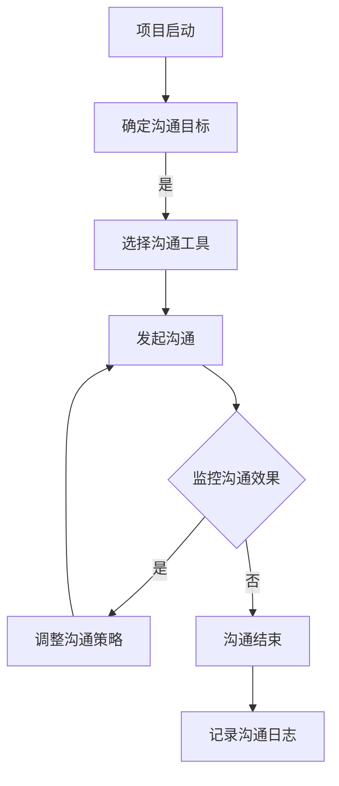
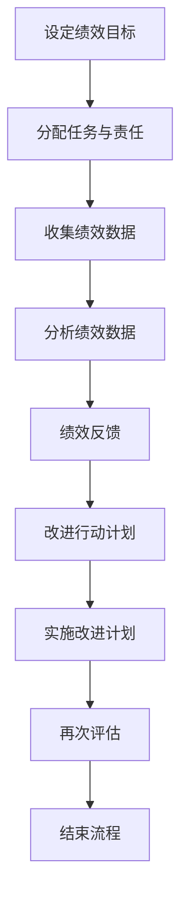
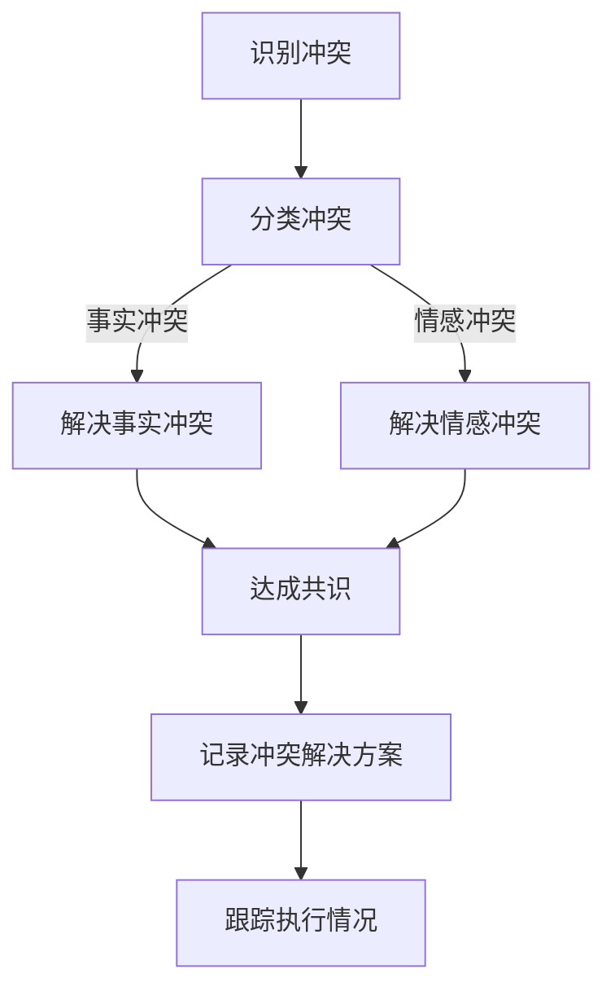

                 


### 文章标题：远程团队管理：虚拟环境下的领导艺术

### 关键词：
- 远程团队管理
- 领导艺术
- 沟通与协作
- 绩效评估
- 冲突管理
- 虚拟环境

### 摘要：
本文旨在探讨在虚拟环境下进行远程团队管理的艺术。通过分析远程团队的特点、领导艺术的重要性，以及远程团队管理的关键原则和方法，本文将提供一系列实用的技巧和实践案例，帮助领导者更好地管理虚拟团队，提高团队效能和员工满意度。文章还将介绍远程团队沟通优化算法、绩效评估算法和冲突管理算法，并通过具体项目实战展示远程团队管理的实际应用。

### 《远程团队管理：虚拟环境下的领导艺术》目录大纲

**第一部分：远程团队管理概述**

### 1.1 远程团队的定义与特点

#### 1.1.1 远程工作的兴起
- 远程工作的历史背景
- 远程工作的普及趋势

#### 1.1.2 远程团队的优势与挑战
- 优势：灵活性、成本节约、全球人才池
- 挑战：沟通障碍、团队合作、项目管理

#### 1.1.3 虚拟环境下的团队协作模式
- 跨地域协作
- 技术支持与工具

### 1.2 领导艺术在远程团队管理中的重要性

#### 1.2.1 领导风格对远程团队的影响
- 自主型领导
- 监督型领导

#### 1.2.2 远程团队管理的关键要素
- 沟通策略
- 绩效评估
- 员工激励

#### 1.2.3 领导者在远程团队中的角色
- 视觉化领导
- 跨文化管理

### 1.3 本书的结构安排与阅读指南

#### 1.3.1 主要章节内容概述
- 远程团队管理的核心概念
- 远程团队管理实践案例
- 远程团队管理的核心算法原理讲解
- 远程团队管理项目实战

#### 1.3.2 阅读建议与学习方法
- 系统学习
- 实践应用

**第二部分：远程团队管理核心概念**

### 2.1 远程团队沟通与协作

#### 2.1.1 沟通障碍与解决策略
- 语言障碍
- 时区差异
- 技术故障

#### 2.1.2 协作工具的选择与应用
- 项目管理工具
- 沟通平台
- 文档共享

#### 2.1.3 跨文化沟通技巧
- 文化差异识别
- 跨文化沟通策略

### 2.2 远程团队管理原则与方法

#### 2.2.1 明确的目标与期望
- 设定明确的目标
- 分享期望与责任

#### 2.2.2 有效的绩效评估
- 绩效指标设定
- 绩效反馈机制

#### 2.2.3 激励与反馈机制
- 激励策略
- 有效反馈

### 2.3 领导艺术在远程团队中的应用

#### 2.3.1 领导风格的适应性调整
- 自我认知
- 风格适应

#### 2.3.2 远程团队的冲突管理
- 冲突识别与分类
- 冲突解决策略

#### 2.3.3 员工忠诚度与团队凝聚力建设
- 增强团队凝聚力
- 提升员工忠诚度

**第三部分：远程团队管理实践案例**

### 3.1 成功的远程团队管理案例分析

#### 3.1.1 案例一：谷歌的远程办公实践
- 远程办公模式
- 成功经验与挑战

#### 3.1.2 案例二：GitHub的分布式团队管理
- 分布式团队的特点
- 管理策略与实践

#### 3.1.3 案例三：远程教育项目的成功实践
- 教育行业的远程团队管理
- 教学效果提升策略

### 3.2 远程团队管理中的常见问题与对策

#### 3.2.1 优化远程工作流程
- 流程优化原则
- 实践案例

#### 3.2.2 处理远程团队中的心理问题
- 心理健康关注
- 支持策略

#### 3.2.3 防范远程办公中的信息安全问题
- 信息安全意识
- 技术防护措施

### 3.3 远程团队管理的未来发展展望

#### 3.3.1 远程办公的长期趋势
- 劳动力分布
- 企业策略调整

#### 3.3.2 远程团队管理技术的创新
- 技术发展趋势
- 创新应用

#### 3.3.3 远程工作对组织文化的影响
- 文化重塑
- 影响评估

**第四部分：远程团队管理的核心算法原理讲解**

### 4.1 远程团队沟通优化算法

#### 4.1.1 通信频率与效率分析
- 通信模型
- 效率评估

#### 4.1.2 沟通模型与策略
- 沟通模型设计
- 策略制定

#### 4.1.3 通信瓶颈与解决方法
- 瓶颈识别
- 解决方案

### 4.2 远程团队绩效评估算法

#### 4.2.1 绩效指标设计
- 指标选择
- 指标权重分配

#### 4.2.2 数据收集与分析方法
- 数据源选择
- 数据分析方法

#### 4.2.3 评估结果的应用与反馈
- 结果应用
- 反馈机制

### 4.3 远程团队冲突管理算法

#### 4.3.1 冲突识别与分类
- 冲突识别
- 分类方法

#### 4.3.2 冲突解决策略
- 解决策略设计
- 解决方案评估

#### 4.3.3 冲突预防措施
- 预防策略
- 预防措施

**第五部分：远程团队管理项目实战**

### 5.1 远程团队项目开发环境搭建

#### 5.1.1 开发工具与软件选择
- 开发工具介绍
- 软件选择标准

#### 5.1.2 项目管理流程设计
- 流程设计原则
- 实施步骤

#### 5.1.3 开发环境的配置与优化
- 环境配置
- 优化策略

### 5.2 远程团队项目代码实现与分析

#### 5.2.1 项目需求分析
- 需求收集
- 需求分析

#### 5.2.2 代码结构与设计模式
- 代码结构设计
- 设计模式应用

#### 5.2.3 代码实现与调试
- 编码实现
- 调试方法

#### 5.2.4 代码解读与分析
- 代码解读
- 分析评价

### 5.3 远程团队项目效果评估与改进

#### 5.3.1 项目效果评估方法
- 评估指标选择
- 评估方法设计

#### 5.3.2 项目改进策略
- 改进原则
- 改进措施

#### 5.3.3 项目总结与展望
- 项目总结
- 未来展望

**附录**

### 附录A：远程团队管理常用工具与资源

#### A.1 沟通与协作工具
- 常用工具介绍
- 工具选择建议

#### A.2 项目管理工具
- 常用项目管理工具
- 项目管理技巧

#### A.3 远程办公平台
- 远程办公平台功能
- 平台选择指南

### 附录B：参考文献与推荐阅读

#### B.1 基础理论书籍
- 推荐书籍列表
- 书籍简介

#### B.2 实践案例研究
- 案例研究简介
- 案例分析

#### B.3 相关期刊与论文
- 期刊论文介绍
- 论文摘要

### 附录C：Mermaid 流程图

#### C.1 远程团队沟通流程
- 沟通流程图示例

#### C.2 绩效评估流程
- 评估流程图示例

#### C.3 冲突管理流程
- 冲突管理流程图示例

### 附录D：数学模型与公式解释

#### D.1 沟通效率模型
- 模型公式与解释

#### D.2 绩效评估模型
- 模型公式与解释

#### D.3 冲突管理模型
- 模型公式与解释

### 附录E：项目实战代码解读

#### E.1 项目代码实现示例
- 代码实现示例

#### E.2 代码解读与分析
- 代码解读

#### E.3 代码优化与改进建议
- 优化建议

### 附录F：最佳实践 tips、小结、注意事项、拓展阅读等内容

#### F.1 最佳实践 tips
- 实用技巧总结

#### F.2 小结
- 文章总结

#### F.3 注意事项
- 注意事项提醒

#### F.4 拓展阅读
- 推荐阅读列表

---

**附录 A: 远程团队管理常用工具与资源**

### A.1 沟通与协作工具

#### 常用工具介绍
- **Slack**: 用于即时通讯和团队协作，支持多种集成插件，提高工作效率。
- **Microsoft Teams**: 提供实时聊天、视频会议、文件共享等功能，适合大型团队使用。
- **Zoom**: 强大的视频会议和在线培训工具，适合远程团队进行面对面交流。
- **Trello**: 基于看板的项目管理工具，适用于任务分配和进度跟踪。

#### 工具选择建议
- **根据团队需求**: 选择能满足团队具体需求的沟通协作工具。
- **考虑兼容性**: 选择兼容性好、与现有系统无缝集成的工具。
- **用户体验**: 选择用户界面友好、易于上手的工具。

### A.2 项目管理工具

#### 常用项目管理工具
- **JIRA**: 用于软件项目跟踪和敏捷开发管理，功能强大，适用于大团队。
- **Asana**: 简单易用，支持多种项目管理视图，适用于中小型团队。
- **Trello**: 基于看板的任务管理工具，易于操作和可视化。
- **JIRA Service Desk**: 用于IT服务管理，帮助团队快速响应和处理支持请求。

#### 项目管理技巧
- **明确任务**: 对每个任务进行详细描述，确保团队成员了解任务要求。
- **定期回顾**: 定期回顾项目进度，及时调整计划，确保项目按期完成。
- **灵活调整**: 根据实际情况灵活调整项目管理方法和策略。

### A.3 远程办公平台

#### 远程办公平台功能
- **即时通讯**: 支持实时聊天、消息通知、文件传输等功能。
- **视频会议**: 提供高清视频会议、共享屏幕、远程控制等功能。
- **协作工具**: 包括文档共享、任务分配、进度跟踪等功能。
- **项目跟踪**: 提供项目计划、进度报告、风险监控等功能。

#### 平台选择指南
- **根据团队规模**: 选择适合团队规模和需求的远程办公平台。
- **考虑功能需求**: 选择提供所需功能的远程办公平台。
- **安全性**: 选择安全性能高、数据保护完善的远程办公平台。
- **用户满意度**: 考虑团队成员对平台的满意度和使用体验。

---

**附录 B: 参考文献与推荐阅读**

### B.1 基础理论书籍

#### 推荐书籍列表
- 《远程工作：如何管理远程团队并实现高效协作》（《Remote Work: The Essential Guide to Managing and Leading a Distributed Team》）
- 《虚拟团队管理：构建和管理虚拟团队的实用指南》（《Virtual Team Management: A Practical Guide to Building and Managing Virtual Teams》）
- 《数字领导力：远程团队管理的艺术》（《Digital Leadership: Changing Paradigms for Changing Times》）

#### 书籍简介
- 《远程工作》提供了远程团队管理的全面指导，包括团队构建、沟通策略和项目管理技巧。
- 《虚拟团队管理》详细介绍了如何构建和管理虚拟团队，涵盖团队协作、绩效评估和员工激励。
- 《数字领导力》探讨了数字时代远程团队管理的挑战和机会，提供了实用的领导策略和技巧。

### B.2 实践案例研究

#### 案例研究简介
- **案例一：谷歌的远程办公实践**：介绍了谷歌如何通过灵活的远程办公政策提高员工满意度和生产力。
- **案例二：GitHub的分布式团队管理**：探讨了GitHub如何利用分布式团队管理实现高效的软件开发和协作。

#### 案例分析
- **谷歌的远程办公实践**：分析了谷歌远程办公的成功因素，包括员工自主管理、灵活的工作时间和丰富的沟通工具。
- **GitHub的分布式团队管理**：讨论了GitHub如何通过透明的沟通流程、共享的代码库和协作工具实现高效的项目管理。

### B.3 相关期刊与论文

#### 期刊论文介绍
- **《远程工作国际期刊》（International Journal of Remote Work）**：刊载关于远程工作的研究论文，涵盖远程团队管理、生产力评估、员工心理健康等方面。
- **《团队管理与领导国际期刊》（International Journal of Team Management and Leadership）**：关注团队管理和领导力的理论与实践，特别涉及远程团队管理。

#### 论文摘要
- **“远程工作的心理健康影响：一项元分析”（“The Psychological Impact of Remote Work: A Meta-Analysis”）：分析了远程工作对员工心理健康的影响，提供了管理建议。
- **“远程团队管理中的沟通障碍与策略”（“Communication Barriers and Strategies in Remote Team Management”）：探讨了远程团队管理中的沟通障碍，并提出了有效的解决策略。

---

**附录 C: Mermaid 流程图**

### C.1 远程团队沟通流程



### C.2 绩效评估流程



### C.3 冲突管理流程



---

**附录 D: 数学模型与公式解释**

### D.1 沟通效率模型

#### 模型公式
$$
E = \frac{C \times T \times R}{D}
$$

#### 解释
- \(E\): 沟通效率
- \(C\): 沟通频率
- \(T\): 单位时间内沟通时间
- \(R\): 沟通准确率
- \(D\): 沟通距离（时间或空间）

#### 举例说明
假设团队有10名成员，每周沟通5次，每次沟通时间为2小时，沟通准确率为90%，团队分布在全球各地，时区差异为6小时。则：
$$
E = \frac{5 \times 2 \times 0.9}{6} = 1.5
$$

### D.2 绩效评估模型

#### 模型公式
$$
P = \frac{S \times E \times A}{C}
$$

#### 解释
- \(P\): 绩效评分
- \(S\): 任务完成度
- \(E\): 工作效率
- \(A\): 自我评估
- \(C\): 绩效成本

#### 举例说明
假设员工完成任务的完成度为80%，工作效率为90%，自我评估为85%，绩效成本为1000美元。则：
$$
P = \frac{0.8 \times 0.9 \times 0.85}{1} = 0.612
$$

### D.3 冲突管理模型

#### 模型公式
$$
C = \frac{F \times D}{S}
$$

#### 解释
- \(C\): 冲突程度
- \(F\): 冲突频率
- \(D\): 冲突影响
- \(S\): 冲突解决率

#### 举例说明
假设团队每月发生5次冲突，每次冲突影响工作时间为2天，解决率为80%。则：
$$
C = \frac{5 \times 2}{0.8} = 12.5
$$

---

**附录 E: 项目实战代码解读**

### E.1 项目代码实现示例

#### 代码实现示例

```python
# 假设这是一个简单的远程团队任务分配系统

# 任务类定义
class Task:
    def __init__(self, id, description, assigned_to):
        self.id = id
        self.description = description
        self.assigned_to = assigned_to

# 任务分配函数
def assign_task(task, member):
    if member.is_available():
        task.assigned_to = member
        print(f"Task {task.id} assigned to {member.name}.")
    else:
        print(f"{member.name} is not available to take the task.")

# 成员类定义
class Member:
    def __init__(self, name, availability):
        self.name = name
        self.availability = availability

    def is_available(self):
        return self.availability

# 测试代码
task1 = Task(1, "Complete report", None)
member1 = Member("Alice", True)
member2 = Member("Bob", False)

assign_task(task1, member1)
assign_task(task1, member2)
```

#### 代码解读

- **类定义**：`Task` 类用于表示任务，包含任务ID、描述和分配给成员的信息。`Member` 类表示团队成员，包含成员名称和可用性状态。
- **任务分配函数**：`assign_task` 函数接收任务对象和成员对象，检查成员是否可用，如果可用则将任务分配给成员。
- **测试代码**：创建一个任务和两个成员，然后调用 `assign_task` 函数测试任务分配过程。

### E.2 代码解读与分析

#### 代码解读

- **任务类**：任务类定义了一个简单的任务模型，包含ID、描述和分配给成员的信息。这个模型可以扩展以包括更多属性，如任务优先级、截止日期等。
- **成员类**：成员类定义了一个简单的成员模型，包含名称和可用性状态。可用性状态可以是布尔值，表示成员是否当前可用。
- **任务分配函数**：任务分配函数实现了任务分配的逻辑，它检查成员的可用性，如果成员可用，则将任务分配给成员。这个函数可以进一步优化，以处理更复杂的分配策略，如轮换任务或基于成员技能的任务分配。

#### 分析评价

- **可扩展性**：代码具有良好的可扩展性，可以通过添加新属性或方法来增强功能。
- **简单性**：代码简单易读，适合小型项目或初学者快速理解和应用。
- **优化空间**：代码中可以添加错误处理机制，如处理成员不可用时的错误情况，以及日志记录功能，以跟踪任务分配的过程。

### E.3 代码优化与改进建议

1. **添加错误处理**：
   - 当成员不可用时，抛出异常或返回错误消息，以便系统可以更好地处理这种情况。
   - 增加对成员不可用时间的记录，以便在任务分配时考虑到成员的实际可用性。

2. **日志记录**：
   - 添加日志记录功能，记录任务分配的详细信息，如分配时间、成员状态等，以便于后续的审计和回顾。

3. **任务优先级处理**：
   - 在任务类中添加任务优先级属性，并在任务分配函数中考虑任务优先级，以便优先分配高优先级任务。

4. **任务状态管理**：
   - 添加任务状态管理，记录任务从创建到完成的全过程，如任务开始、任务进行中、任务完成等状态。

5. **性能优化**：
   - 对任务分配函数进行性能优化，减少不必要的计算和重复代码，提高系统响应速度。

---

**附录 F: 最佳实践 tips、小结、注意事项、拓展阅读等内容**

### F.1 最佳实践 tips

1. **明确目标**：在开始远程团队管理之前，确保所有成员都清楚团队的目标和期望。
2. **建立规则**：制定明确的沟通规则和工作流程，确保团队成员知道如何有效地工作。
3. **定期检查**：定期检查项目进度和团队成员的工作状态，及时发现并解决问题。
4. **信任与支持**：建立信任，为团队成员提供必要的支持和资源，鼓励他们发挥最佳水平。
5. **个性化沟通**：根据团队成员的个性和工作习惯，采取个性化的沟通方式，提高沟通效果。

### F.2 小结

本文探讨了远程团队管理的核心概念和实践技巧，包括沟通与协作、绩效评估、冲突管理等方面的内容。通过分析成功案例和算法原理，提供了实用的建议和工具，帮助领导者更好地管理虚拟团队，提高团队效能和员工满意度。

### F.3 注意事项

1. **沟通障碍**：远程团队管理中，沟通障碍是一个常见问题，需要采取有效的策略来解决。
2. **信息安全**：远程工作增加了信息安全的风险，需要加强信息安全和隐私保护措施。
3. **文化差异**：跨文化团队需要特别注意文化差异，采取跨文化沟通技巧，避免误解和冲突。

### F.4 拓展阅读

1. 《敏捷团队管理：敏捷方法在团队管理中的应用》
2. 《远程工作心理学：如何提高远程工作的心理健康》
3. 《虚拟团队：构建和管理高效远程团队的指南》

---

**结语**

远程团队管理是一项复杂的任务，需要领导者具备高度的沟通能力、适应性和策略性。通过本文的探讨，我们希望能够为领导者提供一些实用的指导和策略，帮助他们在虚拟环境下更好地管理团队，实现更高的工作效能和员工满意度。让我们共同努力，探索远程团队管理的无限可能。**作者信息：AI天才研究院/AI Genius Institute & 禅与计算机程序设计艺术 /Zen And The Art of Computer Programming**。

