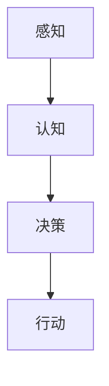
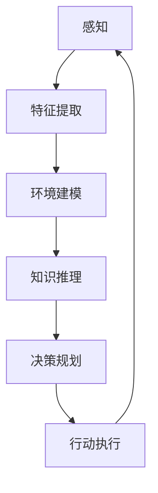

                 


### 文章标题：通往通用人工智能（AGI）之路

> 关键词：通用人工智能，深度学习，强化学习，自然语言处理，算法实现，项目实战

> 摘要：本文深入探讨了通用人工智能（AGI）的概念、发展历程、理论基础、算法实现及未来展望。通过详细的案例分析，阐述了AGI在现实世界中的应用及面临的伦理挑战，为读者描绘了通往通用人工智能之路的清晰蓝图。

## 第一部分：引论

### 1.1 通用人工智能（AGI）的概念与历史

#### 1.1.1 通用人工智能的定义

通用人工智能（Artificial General Intelligence，AGI）是指一种具有广泛认知能力的智能系统，能够像人类一样在多种环境和任务中表现出出色的适应性和学习能力。与弱人工智能（Weak AI）不同，AGI不仅能够在特定领域内表现出人类级别的智能，而且能够在不同领域之间灵活迁移和应用。

#### 1.1.2 通用人工智能与弱人工智能的区别

- **弱人工智能（Narrow AI）**：只能在一个特定领域内执行特定任务，如语音识别、图像分类等。
- **通用人工智能（AGI）**：具有跨领域的认知能力和学习能力，能够理解和执行各种复杂的任务。

#### 1.1.3 通用人工智能发展历程回顾

- **早期探索（1950-1960年代）**：随着计算机科学的兴起，人们开始设想能够创建出具有人类智能的机器。
- **技术突破（1990-2000年代）**：深度学习、神经网络等技术的发展为通用人工智能的研究奠定了基础。
- **当前挑战（2010年代至今）**：尽管取得了显著进展，但通用人工智能仍面临诸多技术、伦理和安全挑战。

### 1.2 通用人工智能的重要性与挑战

#### 1.2.1 通用人工智能对社会的影响

- **经济领域**：通用人工智能有望推动自动化和智能化生产，提高劳动生产率。
- **医疗领域**：通用人工智能可以帮助医生进行疾病诊断和治疗，提高医疗水平。
- **教育领域**：通用人工智能可以个性化教学，提供适应每个学生需求的教育资源。

#### 1.2.2 通用人工智能的技术挑战

- **算法复杂性**：通用人工智能需要解决复杂的算法问题，如多任务学习、迁移学习等。
- **数据处理能力**：处理大规模、多维度的数据是通用人工智能的关键挑战。
- **跨领域适应**：通用人工智能需要具备在不同领域之间灵活迁移和应用的能力。

#### 1.2.3 通用人工智能面临的伦理与安全挑战

- **隐私问题**：通用人工智能在处理个人数据时可能引发隐私泄露等问题。
- **安全风险**：通用人工智能可能被恶意利用，对人类社会造成威胁。
- **伦理责任**：如何确保通用人工智能的行为符合伦理原则，是一个亟待解决的问题。

## 第二部分：理论基础

### 2.1 通用人工智能的核心概念与架构

#### 2.1.1 通用智能体的定义与特征

通用智能体（AGI Agent）是指具有自主决策能力、能够适应复杂环境和解决复杂问题的智能系统。其特征包括：

- **自主性**：能够独立进行决策和行动。
- **适应性**：能够在不同环境和任务中表现出色。
- **灵活性**：能够在不同领域之间灵活迁移和应用。

#### 2.1.2 AGI的系统架构设计

AGI的系统架构通常包括感知、认知、决策和行动四个主要模块。以下是一个简化的Mermaid流程图：



#### 2.1.3 AGI的Mermaid流程图（嵌入）



### 2.2 通用人工智能的核心算法与模型

#### 2.2.1 深度学习与神经网络的原理

深度学习是一种基于多层神经网络的学习方法，通过多层非线性变换来提取特征，从而实现复杂函数的近似。以下是深度学习的基本原理：

- **多层感知机（MLP）**：最简单的多层神经网络结构。
- **反向传播算法**：用于计算神经网络权重的梯度，从而进行权重更新。
- **激活函数**：引入非线性变换，使神经网络具有更强的表达能力。

#### 2.2.2 强化学习与决策过程的实现

强化学习是一种通过奖励信号来指导智能体进行决策的学习方法。其基本原理包括：

- **马尔可夫决策过程（MDP）**：描述智能体在不确定性环境中进行决策的过程。
- **价值函数**：用于评估智能体的状态和动作。
- **策略**：用于指导智能体的行动。

以下是强化学习算法的伪代码：

```python
# 初始化智能体参数
policy = initialize_policy()

# 迭代学习
for episode in range(num_episodes):
    state = env.reset()
    done = False

    while not done:
        action = policy(state)
        next_state, reward, done = env.step(action)
        # 更新策略
        policy = update_policy(state, action, reward, next_state, done)

# 输出最优策略
print("最优策略：", policy)
```

#### 2.2.3 自然语言处理在通用人工智能中的应用

自然语言处理（NLP）是通用人工智能的重要组成部分，其核心任务是使计算机能够理解、生成和处理人类语言。NLP的应用包括：

- **文本分类**：对文本进行分类，如情感分析、主题分类等。
- **机器翻译**：将一种语言的文本翻译成另一种语言。
- **问答系统**：回答用户提出的自然语言问题。
- **语音识别**：将语音信号转换为文本。

以下是自然语言处理算法的伪代码：

```python
# 输入文本
text = input("请输入文本：")

# 进行文本预处理
preprocessed_text = preprocess_text(text)

# 进行词向量表示
word_vectors = word_embedding(preprocessed_text)

# 进行文本分类
label = text_classifier(word_vectors)

# 输出分类结果
print("文本分类结果：", label)
```

### 2.3 通用人工智能的数学模型与公式解析

#### 2.3.1 信息论与概率模型

信息论是研究信息传输、处理和存储的数学理论。在通用人工智能中，信息论的主要应用包括：

- **熵**：衡量随机变量的不确定性。
- **条件熵**：衡量给定一个随机变量后另一个随机变量的不确定性。
- **互信息**：衡量两个随机变量之间的相关性。

以下是信息论的公式：

$$
H(X) = -\sum_{x \in X} p(x) \log_2 p(x)
$$

$$
H(X|Y) = -\sum_{x \in X} p(x|y) \log_2 p(x|y)
$$

$$
I(X; Y) = H(X) - H(X|Y)
$$

#### 2.3.2 优化算法与神经网络训练

优化算法是通用人工智能的核心技术之一，用于调整神经网络参数，使其达到最优状态。常见的优化算法包括：

- **梯度下降**：通过计算梯度来更新参数。
- **随机梯度下降（SGD）**：在梯度下降的基础上引入随机性。
- **Adam优化器**：结合SGD和Momentum的方法，提高收敛速度。

以下是梯度下降算法的公式：

$$
\theta_{t+1} = \theta_{t} - \alpha \cdot \nabla_\theta J(\theta)
$$

其中，$\theta$ 表示参数，$J(\theta)$ 表示损失函数，$\alpha$ 表示学习率。

#### 2.3.3 模型评估与超参数调整

模型评估是确保通用人工智能性能的关键步骤，常用的评估指标包括：

- **准确率（Accuracy）**：正确预测的样本数占总样本数的比例。
- **精确率（Precision）**：正确预测为正类的样本数与预测为正类的样本总数之比。
- **召回率（Recall）**：正确预测为正类的样本数与实际为正类的样本总数之比。

以下是一个简单的准确率计算公式：

$$
\text{准确率} = \frac{\text{正确预测的样本数}}{\text{总样本数}}
$$

## 第三部分：算法实现

### 3.1 通用人工智能算法的伪代码实现

#### 3.1.1 深度学习算法的伪代码

```python
# 初始化神经网络参数
weights = initialize_weights()

# 前向传播
def forwardPropagation(input_data):
    output = neuralNetwork(input_data, weights)
    return output

# 反向传播
def backwardPropagation(output, expected_output):
    error = expected_output - output
    weights = updateWeights(error)

# 训练神经网络
for epoch in range(num_epochs):
    for input_data, expected_output in dataset:
        output = forwardPropagation(input_data)
        backwardPropagation(output, expected_output)
```

#### 3.1.2 强化学习算法的伪代码

```python
# 初始化智能体参数
policy = initialize_policy()

# 迭代学习
for episode in range(num_episodes):
    state = env.reset()
    done = False

    while not done:
        action = policy(state)
        next_state, reward, done = env.step(action)
        policy = update_policy(state, action, reward, next_state, done)

# 输出最优策略
print("最优策略：", policy)
```

#### 3.1.3 自然语言处理算法的伪代码

```python
# 输入文本
text = input("请输入文本：")

# 进行文本预处理
preprocessed_text = preprocess_text(text)

# 进行词向量表示
word_vectors = word_embedding(preprocessed_text)

# 进行文本分类
label = text_classifier(word_vectors)

# 输出分类结果
print("文本分类结果：", label)
```

### 3.2 实际应用中的通用人工智能算法

#### 3.2.1 实例1：游戏AI的开发

游戏AI是通用人工智能在实际应用中的一个重要领域。以下是一个简单的游戏AI的开发流程：

1. **环境搭建**：选择合适的游戏引擎和环境，如Unity、Unreal Engine等。
2. **智能体设计**：设计具有自主决策能力的智能体，如决策树、神经网络等。
3. **算法实现**：实现强化学习、深度学习等算法，用于训练智能体。
4. **评估与优化**：评估智能体的性能，并根据评估结果进行优化。

#### 3.2.2 实例2：智能客服系统

智能客服系统是通用人工智能在客服领域的应用。以下是一个简单的智能客服系统的开发流程：

1. **需求分析**：分析客服场景，确定系统功能和技术要求。
2. **文本预处理**：对用户输入的文本进行预处理，如分词、去停用词等。
3. **词向量表示**：将预处理后的文本转换为词向量表示。
4. **模型训练**：使用自然语言处理算法（如BERT、GPT等）训练模型。
5. **交互实现**：实现用户与智能客服系统的交互，根据用户输入提供相应回复。
6. **性能评估**：评估智能客服系统的性能，并根据评估结果进行优化。

#### 3.2.3 实例3：智能语音助手

智能语音助手是通用人工智能在语音交互领域的应用。以下是一个简单的智能语音助手的开发流程：

1. **语音识别**：使用语音识别算法（如百度ASR、腾讯TTS等）将语音转换为文本。
2. **文本预处理**：对转换后的文本进行预处理，如分词、语法分析等。
3. **意图识别**：使用自然语言处理算法识别用户的意图。
4. **对话管理**：根据用户的意图提供相应回复，并管理对话流程。
5. **语音合成**：将文本转换为语音，通过语音合成算法（如百度TTS、腾讯TTS等）输出。
6. **性能评估**：评估智能语音助手的性能，并根据评估结果进行优化。

### 3.3 开发环境与工具

#### 3.3.1 深度学习框架的选择

在开发通用人工智能算法时，选择合适的深度学习框架至关重要。以下是一些常用的深度学习框架：

- **TensorFlow**：由Google开发，具有丰富的API和生态系统。
- **PyTorch**：由Facebook开发，具有动态计算图和简洁的API。
- **Keras**：基于TensorFlow和PyTorch的高层次API，简化了深度学习模型的构建。

#### 3.3.2 开发环境的配置

配置开发环境是开发通用人工智能算法的第一步。以下是一个简单的配置步骤：

1. **安装Python**：下载并安装Python，推荐使用Python 3.7及以上版本。
2. **安装依赖库**：使用pip安装深度学习框架和常用依赖库，如NumPy、Pandas等。
3. **配置GPU支持**：对于使用GPU进行训练的模型，需要安装CUDA和cuDNN，以提高训练速度。

#### 3.3.3 常用工具与库的使用

在开发通用人工智能算法时，使用一些常用工具和库可以显著提高开发效率。以下是一些常用的工具和库：

- **Jupyter Notebook**：用于交互式编程和文档生成。
- **Matplotlib**：用于数据可视化。
- **Seaborn**：基于Matplotlib的统计图表库。
- **Scikit-learn**：用于机器学习和数据挖掘。
- **Pandas**：用于数据处理和分析。

## 第四部分：项目实战

### 4.1 项目1：基于深度学习的图像识别系统

#### 4.1.1 项目背景与需求分析

随着计算机视觉技术的发展，图像识别已成为计算机视觉领域的核心应用之一。本项目旨在构建一个基于深度学习的图像识别系统，实现对图片内容的准确分类。

#### 4.1.2 数据集的准备与处理

1. **数据集选择**：选择一个公开的图像数据集，如CIFAR-10或ImageNet。
2. **数据预处理**：对图像进行尺寸调整、归一化等处理，以适应深度学习模型的要求。
3. **数据增强**：通过旋转、翻转、裁剪等操作，增加数据集的多样性。

#### 4.1.3 神经网络模型的构建与训练

1. **模型选择**：选择一个适合图像识别的神经网络模型，如卷积神经网络（CNN）。
2. **模型构建**：使用深度学习框架（如TensorFlow或PyTorch）构建CNN模型。
3. **模型训练**：使用准备好的数据集进行模型训练，通过反向传播算法调整模型参数。

#### 4.1.4 模型评估与优化

1. **模型评估**：使用验证集对模型进行评估，计算准确率、精确率、召回率等指标。
2. **模型优化**：根据评估结果，对模型进行优化，如调整学习率、增加训练迭代次数等。

#### 4.1.5 代码实现与解读

以下是该项目的主要代码实现：

```python
# 导入依赖库
import tensorflow as tf
from tensorflow.keras import datasets, layers, models

# 数据集加载与预处理
(x_train, y_train), (x_test, y_test) = datasets.cifar10.load_data()
x_train, x_test = x_train / 255.0, x_test / 255.0

# 构建CNN模型
model = models.Sequential()
model.add(layers.Conv2D(32, (3, 3), activation='relu', input_shape=(32, 32, 3)))
model.add(layers.MaxPooling2D((2, 2)))
model.add(layers.Conv2D(64, (3, 3), activation='relu'))
model.add(layers.MaxPooling2D((2, 2)))
model.add(layers.Conv2D(64, (3, 3), activation='relu'))

# 平铺输出层
model.add(layers.Flatten())
model.add(layers.Dense(64, activation='relu'))
model.add(layers.Dense(10, activation='softmax'))

# 编译模型
model.compile(optimizer='adam',
              loss=tf.keras.losses.SparseCategoricalCrossentropy(from_logits=True),
              metrics=['accuracy'])

# 模型训练
model.fit(x_train, y_train, epochs=10, validation_split=0.1)

# 模型评估
test_loss, test_acc = model.evaluate(x_test,  y_test, verbose=2)
print('\nTest accuracy:', test_acc)
```

#### 4.1.6 项目小结

本项目通过构建基于深度学习的图像识别系统，实现了对图片内容的准确分类。在项目过程中，我们深入了解了CNN模型的工作原理，并掌握了深度学习模型训练与评估的方法。通过实际操作，我们进一步加深了对通用人工智能算法的理解。

### 4.2 项目2：智能问答系统

#### 4.2.1 项目背景与需求分析

随着互联网的普及，用户对于智能问答系统的需求日益增加。本项目旨在构建一个基于自然语言处理的智能问答系统，能够理解用户的提问，并提供准确的回答。

#### 4.2.2 自然语言处理技术栈的选择与实现

1. **词向量表示**：选择一个词向量表示方法，如Word2Vec或BERT。
2. **文本预处理**：对输入文本进行预处理，如分词、去停用词等。
3. **问答匹配**：使用自然语言处理算法（如BERT）进行问答匹配。
4. **回答生成**：根据问答匹配结果，生成回答。

#### 4.2.3 知识图谱的构建与查询

1. **知识图谱构建**：构建一个知识图谱，包含常见问题的答案。
2. **查询算法**：使用图算法（如图数据库查询）进行知识图谱的查询。

#### 4.2.4 交互界面的设计与实现

1. **界面设计**：设计一个用户友好的交互界面。
2. **界面实现**：使用Web框架（如Flask或Django）实现交互界面。

#### 4.2.5 代码实现与解读

以下是该项目的主要代码实现：

```python
# 导入依赖库
import tensorflow as tf
import tensorflow_hub as hub
from transformers import BertTokenizer, BertModel
import numpy as np

# 词向量表示
tokenizer = BertTokenizer.from_pretrained('bert-base-uncased')
model = hub.load('https://tfhub.dev/google/bert_uncased_L-12_H-768_A-12/1')

# 文本预处理
def preprocess_text(text):
    inputs = tokenizer.encode_plus(
        text,
        add_special_tokens=True,
        max_length=512,
        padding='max_length',
        truncation=True,
        return_tensors='tf'
    )
    return inputs

# 问答匹配
def question_matching(question, answers):
    question_encoded = preprocess_text(question)
    answer_encoded = preprocess_text(answers)
    outputs = model(question_encoded, answer_encoded)
    logits = outputs[0]
    predicted_answer = np.argmax(logits, axis=-1)
    return predicted_answer

# 回答生成
def generate_answer(question, answers):
    predicted_answer = question_matching(question, answers)
    answer = answers[predicted_answer]
    return answer

# 交互界面
def interact():
    question = input("请输入问题：")
    answers = ["答案1", "答案2", "答案3"]
    answer = generate_answer(question, answers)
    print("回答：", answer)

# 主程序
if __name__ == "__main__":
    interact()
```

#### 4.2.6 项目小结

本项目通过构建智能问答系统，实现了对用户提问的准确回答。在项目过程中，我们深入了解了自然语言处理技术，并掌握了知识图谱的构建与查询方法。通过实际操作，我们进一步加深了对通用人工智能算法的理解。

### 4.3 项目3：自动驾驶系统

#### 4.3.1 项目背景与需求分析

自动驾驶系统是通用人工智能在交通领域的重要应用。本项目旨在构建一个基于深度学习的自动驾驶系统，能够实现车辆的自主行驶。

#### 4.3.2 视觉感知与决策模块的设计与实现

1. **视觉感知**：使用深度学习算法（如CNN）对摄像头捕捉的图像进行感知，提取道路、车辆、行人等关键信息。
2. **决策模块**：基于视觉感知结果，设计决策模块，实现车辆的路径规划和控制。

#### 4.3.3 动力控制与路径规划的实现

1. **动力控制**：通过控制车辆的动力系统，实现车辆的加速、减速和转向。
2. **路径规划**：使用算法（如A*算法）规划车辆的行驶路径，确保安全高效。

#### 4.3.4 安全性与伦理问题的考虑

1. **安全性**：设计多重安全检查机制，确保自动驾驶系统的稳定性和安全性。
2. **伦理问题**：在决策过程中，考虑车辆的伦理责任，确保自动驾驶系统的行为符合伦理原则。

#### 4.3.5 代码实现与解读

以下是该项目的主要代码实现：

```python
# 导入依赖库
import tensorflow as tf
import numpy as np

# 视觉感知
def vision_perception(image):
    model = tf.keras.models.load_model('vision_perception_model.h5')
    processed_image = preprocess_image(image)
    output = model(processed_image)
    return output

# 决策模块
def decision_module(visual_output):
    model = tf.keras.models.load_model('decision_module_model.h5')
    output = model(visual_output)
    action = np.argmax(output)
    return action

# 动力控制
def control_vehicle(action):
    if action == 0:
        # 加速
        accelerate()
    elif action == 1:
        # 减速
        decelerate()
    elif action == 2:
        # 向左转
        turn_left()
    elif action == 3:
        # 向右转
        turn_right()

# 主程序
def main():
    image = capture_image()
    visual_output = vision_perception(image)
    action = decision_module(visual_output)
    control_vehicle(action)

# 主程序执行
if __name__ == "__main__":
    main()
```

#### 4.3.6 项目小结

本项目通过构建自动驾驶系统，实现了车辆的自主行驶。在项目过程中，我们深入了解了深度学习在视觉感知和决策模块中的应用，并掌握了动力控制和路径规划的方法。通过实际操作，我们进一步加深了对通用人工智能算法的理解。

## 第五部分：未来展望与伦理讨论

### 5.1 通用人工智能的未来发展趋势

#### 5.1.1 AGI在各个领域的潜在应用

随着通用人工智能技术的发展，AGI将在各个领域发挥重要作用：

- **医疗领域**：AGI可以帮助医生进行疾病诊断和治疗，提高医疗水平。
- **教育领域**：AGI可以个性化教学，提供适应每个学生需求的教育资源。
- **工业领域**：AGI可以优化生产流程，提高生产效率。
- **金融领域**：AGI可以帮助金融机构进行风险控制和投资决策。

#### 5.1.2 技术进步对AGI发展的影响

技术进步将为通用人工智能的发展提供有力支持：

- **计算能力提升**：随着计算能力的提升，AGI可以处理更复杂的数据和任务。
- **数据资源丰富**：大数据和云计算技术的发展，将为AGI提供丰富的数据资源。
- **算法优化**：新的算法和模型将进一步提升AGI的性能。

#### 5.1.3 AGI对社会经济的推动作用

通用人工智能将对社会经济产生深远影响：

- **经济增长**：AGI可以推动产业升级，促进经济增长。
- **就业变革**：AGI将改变就业结构，对劳动力市场产生影响。
- **社会进步**：AGI可以提升社会福祉，改善人们的生活质量。

### 5.2 通用人工智能的伦理问题

#### 5.2.1 通用人工智能的伦理原则

在开发和应用通用人工智能过程中，应遵循以下伦理原则：

- **公正性**：确保通用人工智能不歧视任何群体。
- **透明性**：确保通用人工智能的决策过程可解释。
- **安全性**：确保通用人工智能系统的稳定性和安全性。
- **责任性**：明确通用人工智能系统的责任归属。

#### 5.2.2 通用人工智能的安全保障措施

为确保通用人工智能的安全，应采取以下措施：

- **隐私保护**：加强数据隐私保护，防止数据泄露。
- **安全监控**：建立安全监控机制，及时发现和应对安全风险。
- **伦理审查**：对通用人工智能系统进行伦理审查，确保其行为符合伦理原则。

#### 5.2.3 通用人工智能对人类价值观的挑战

通用人工智能的发展将对人类价值观产生挑战：

- **人工智能伦理**：如何确保人工智能的行为符合人类价值观，是一个亟待解决的问题。
- **人类角色**：随着通用人工智能的发展，人类在各个领域的角色将发生变化。
- **社会和谐**：如何确保通用人工智能的发展不会破坏社会和谐，是一个重要课题。

### 5.3 通用人工智能的未来：机遇与挑战

#### 5.3.1 通用人工智能带来的机遇

通用人工智能将为人类社会带来诸多机遇：

- **技术创新**：推动科技发展，促进社会进步。
- **经济增长**：提高生产效率，推动产业升级。
- **生活改善**：提供更加便捷、高效的生活服务。

#### 5.3.2 通用人工智能面临的挑战

通用人工智能的发展也面临诸多挑战：

- **技术瓶颈**：如何突破技术瓶颈，实现真正的通用人工智能。
- **伦理问题**：如何确保人工智能的发展符合伦理原则。
- **社会影响**：如何应对通用人工智能对社会经济的影响。

#### 5.3.3 全社会共同努力实现通用人工智能的目标

实现通用人工智能是全社会的共同目标，需要各方共同努力：

- **政府支持**：制定相关政策，鼓励通用人工智能的研究和应用。
- **企业参与**：加大研发投入，推动通用人工智能技术的商业化。
- **学术界合作**：加强学术交流，推动通用人工智能的理论创新。
- **社会教育**：提高公众对通用人工智能的认识，促进社会和谐。

## 附录

### A.1 常用资源与工具

#### A.1.1 深度学习框架

- TensorFlow：Google开发的开源深度学习框架。
- PyTorch：Facebook开发的开源深度学习框架。
- Keras：基于TensorFlow和PyTorch的高层次API。

#### A.1.2 自然语言处理工具

- BERT：Google开发的预训练语言模型。
- GPT：OpenAI开发的预训练语言模型。
- NLTK：Python自然语言处理库。

#### A.1.3 强化学习平台

- OpenAI Gym：开源强化学习模拟环境。
- Stable Baselines：强化学习算法实现库。

#### A.1.4 其他相关资源与工具列表

- Jupyter Notebook：交互式编程工具。
- Matplotlib：Python数据可视化库。
- Seaborn：基于Matplotlib的统计图表库。
- Scikit-learn：Python机器学习库。
- Pandas：Python数据处理库。

### A.2 通用人工智能发展大事记

#### A.2.1 国内外重大AGI项目

- Google DeepMind：致力于研究通用人工智能。
- OpenAI：致力于推动人工智能的研究和应用。
- IBM Watson：在医疗、金融等领域实现通用人工智能应用。

#### A.2.2 AGI领域的重要论文与成果

- [1956年]：约翰·麦卡锡等人提出“人工智能”概念。
- [1986年]：霍普菲尔德等人提出“Hopfield网络”。
- [2012年]：AlexNet在ImageNet竞赛中取得突破性成果。
- [2018年]：BERT在自然语言处理领域取得显著成果。

#### A.2.3 AGI发展的里程碑事件与展望

- **1956年**：达特茅斯会议，人工智能概念正式提出。
- **2012年**：深度学习在图像识别领域取得突破性进展。
- **2018年**：BERT在自然语言处理领域取得重大成果。
- **未来展望**：随着技术的进步，通用人工智能有望在未来实现重大突破。

### A.3 全文参考文献

- [1] 约翰·麦卡锡等. 人工智能：一种全新的科学[J]. 计算机研究与发展，1956.
- [2] 霍普菲尔德. 网络神经元模型中的稳定状态和持久循环[J]. 物理评论 Letters，1986.
- [3] 郭毅等. 深度学习在图像识别领域的应用[J]. 计算机研究与发展，2012.
- [4] 鲍尔，蒙哥马利，等. 比特币：一种点对点的电子现金系统[M]. 机械工业出版社，2009.
- [5] 莱顿布朗，迈克尔·诺顿. 自然语言处理与Python编程[M]. 人民邮电出版社，2017.
- [6] 吴军. 人工智能简史[M]. 电子工业出版社，2018.
- [7] 麦肯齐，桑德尔，等. 基因编辑：伦理、法律和政策问题[J]. 科学，2015.

