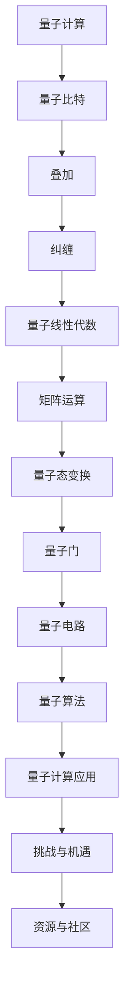

                 

### 文章标题

《量子计算的线性代数：量子态的数学描述》

---

### 关键词

量子计算、线性代数、量子态、数学模型、量子门、量子电路、量子算法、量子计算应用

---

### 摘要

本文旨在深入探讨量子计算的线性代数基础，特别是量子态的数学描述。我们将从量子计算的基本概念入手，逐步介绍量子比特、量子态的叠加与纠缠，以及量子计算的数学基础。随后，本文将详细讲解量子线性代数的基本概念和矩阵运算，并通过具体的量子态表示和变换来展示量子线性代数在量子计算中的应用。最后，我们将探讨量子门与量子电路的概念，以及量子算法的基本原理和分类。通过本文的阅读，读者将能够全面了解量子计算的线性代数基础，为深入探索量子计算领域奠定坚实的理论基础。

---

## 《量子计算的线性代数：量子态的数学描述》目录大纲

### 第一部分：量子计算基础

#### 第1章：量子计算概述

##### 1.1 量子计算的基本概念

##### 1.2 量子比特与经典比特

##### 1.3 量子态的叠加与纠缠

##### 1.4 量子计算的数学基础

### 第2章：量子线性代数

##### 2.1 线性代数的基本概念

##### 2.2 矩阵的运算

##### 2.3 量子态的表示与变换

### 第3章：量子门与量子电路

##### 3.1 量子门的基本概念

##### 3.2 Pauli 门与 Hadamard 门

##### 3.3 量子电路的设计与优化

### 第二部分：量子算法与量子计算应用

#### 第4章：量子算法概述

##### 4.1 量子算法的特点

##### 4.2 量子算法的基本原理

##### 4.3 量子算法的分类

#### 第5章：量子计算的数学模型

##### 5.1 量子计算的数学模型

##### 5.2 量子计算中的数学公式

##### 5.3 量子计算中的数学运算

#### 第6章：量子计算的实际应用

##### 6.1 量子计算的潜在应用领域

##### 6.2 量子计算的当前应用案例

##### 6.3 量子计算的未来发展

#### 第7章：量子计算的挑战与机遇

##### 7.1 量子计算的挑战

##### 7.2 量子计算的未来机遇

##### 7.3 量子计算的教育与普及

### 第三部分：附录

#### 第8章：量子计算资源

##### 8.1 量子计算工具与库

##### 8.2 量子计算学习资源

##### 8.3 量子计算社区与论坛

#### 第9章：量子计算案例分析

##### 9.1 案例分析概述

##### 9.2 案例分析一：量子算法在密码学中的应用

##### 9.3 案例分析二：量子优化算法在物流中的应用

#### 第10章：量子计算的未来展望

##### 10.1 量子计算的科技趋势

##### 10.2 量子计算的产业布局

##### 10.3 量子计算的社会影响与伦理问题

---

### 第一部分：量子计算基础

#### 第1章：量子计算概述

##### 1.1 量子计算的基本概念

量子计算是一种基于量子力学原理的新型计算方式。与传统的经典计算不同，量子计算利用量子比特（qubit）进行信息处理，具有并行性、叠加性和纠缠性等特点。量子比特是量子计算的基本单元，它可以同时处于0和1的叠加状态，这种特性使得量子计算机能够同时处理大量的数据，从而在理论上具有超越经典计算机的潜力。

##### 1.2 量子比特与经典比特

量子比特（qubit）与经典比特（classical bit）是两种不同的信息载体。经典比特只能表示0或1两种状态，而量子比特则可以同时处于0和1的叠加状态。这种叠加状态可以用量子态的数学描述来表示，通常使用一个复数向量表示一个量子态，其模长的平方表示在该量子态下测量得到0或1的概率。

##### 1.3 量子态的叠加与纠缠

量子态的叠加是量子计算的核心特征之一。一个量子比特可以处于0和1的叠加状态，多个量子比特可以处于更复杂的叠加状态。例如，两个量子比特可以处于以下叠加状态：

$$
|\psi\rangle = \frac{1}{\sqrt{2}} (|00\rangle + |11\rangle)
$$

这种叠加状态意味着两个量子比特同时处于00和11两种状态，但无法单独观测到任一状态。量子态的叠加为量子计算提供了强大的并行计算能力。

量子态的纠缠是量子计算的另一个重要特性。当两个量子比特处于纠缠状态时，它们之间的量子态无法独立描述。这种纠缠性使得量子比特之间的信息关联异常紧密，可以用于实现量子比特之间的快速通信和高效计算。

##### 1.4 量子计算的数学基础

量子计算的核心在于量子态的数学描述。量子态通常用一个复数向量表示，称为波函数。一个n个量子比特的量子态可以用一个2^n维的复数向量表示。例如，一个2个量子比特的量子态可以用一个4维的复数向量表示：

$$
|\psi\rangle = \begin{pmatrix} \psi_0 \\ \psi_1 \\ \psi_2 \\ \psi_3 \end{pmatrix}
$$

其中，$\psi_0, \psi_1, \psi_2, \psi_3$是复数，满足归一化条件：

$$
|\psi_0|^2 + |\psi_1|^2 + |\psi_2|^2 + |\psi_3|^2 = 1
$$

量子态的叠加可以用波函数的线性组合表示，例如，一个量子态可以表示为：

$$
|\psi\rangle = \psi_0 |0\rangle + \psi_1 |1\rangle
$$

其中，$|0\rangle$和$|1\rangle$是基态，表示量子比特处于0或1的状态。

量子态的变换可以通过量子门来实现。量子门是量子计算中的基本操作，类似于经典计算中的逻辑门。量子门可以用矩阵表示，例如，Pauli X门（翻转门）可以用以下矩阵表示：

$$
X = \begin{pmatrix} 0 & 1 \\ 1 & 0 \end{pmatrix}
$$

应用量子门可以改变量子态的叠加状态。例如，对上述叠加态应用Pauli X门，得到：

$$
X |\psi\rangle = X (\psi_0 |0\rangle + \psi_1 |1\rangle) = \psi_0 |1\rangle + \psi_1 |0\rangle
$$

这表明量子态的叠加状态发生了翻转，从00和11的叠加变为11和00的叠加。

总之，量子计算利用量子比特的叠加和纠缠特性，通过量子态的数学描述和量子门的操作，实现了高效的信息处理和计算能力。量子计算的数学基础为我们提供了理解和应用量子计算的理论框架，为未来的量子计算机的发展奠定了坚实的基础。

---

#### 第2章：量子线性代数

##### 2.1 线性代数的基本概念

线性代数是量子计算的核心数学工具之一。它研究向量空间、线性映射、矩阵及其相关性质。在量子计算中，线性代数用于描述量子态、量子门的操作以及量子态的变换。以下简要介绍线性代数的基本概念。

向量空间：向量空间是一组向量的集合，这些向量满足加法和标量乘法运算。一个n维向量空间包含n个线性无关的基向量，可以表示为：

$$
\mathbb{R}^n = \left\{ \begin{pmatrix} x_1 \\ x_2 \\ \vdots \\ x_n \end{pmatrix} \mid x_1, x_2, \ldots, x_n \in \mathbb{R} \right\}
$$

矩阵：矩阵是m行n列的复数数组，通常表示为：

$$
A = \begin{pmatrix} a_{11} & a_{12} & \ldots & a_{1n} \\ a_{21} & a_{22} & \ldots & a_{2n} \\ \vdots & \vdots & \ddots & \vdots \\ a_{m1} & a_{m2} & \ldots & a_{mn} \end{pmatrix}
$$

矩阵的运算：矩阵的基本运算包括矩阵加法、矩阵乘法、转置和逆矩阵。矩阵加法满足交换律和结合律，矩阵乘法满足结合律和分配律。例如，两个矩阵A和B的乘积C定义为：

$$
C = AB = \begin{pmatrix} c_{11} & c_{12} & \ldots & c_{1n} \\ c_{21} & c_{22} & \ldots & c_{2n} \\ \vdots & \vdots & \ddots & \vdots \\ c_{m1} & c_{m2} & \ldots & c_{mn} \end{pmatrix}
$$

其中，$c_{ij} = \sum_{k=1}^n a_{ik}b_{kj}$。

##### 2.2 矩阵的运算

矩阵的运算在量子计算中扮演着重要角色。以下详细介绍矩阵的几种常见运算。

矩阵加法（Matrix Addition）：两个矩阵相加，要求它们的维度相同。矩阵加法满足交换律和结合律。例如，两个2x2矩阵A和B的加法结果为：

$$
A + B = \begin{pmatrix} a_{11} + b_{11} & a_{12} + b_{12} \\ a_{21} + b_{21} & a_{22} + b_{22} \end{pmatrix}
$$

矩阵乘法（Matrix Multiplication）：矩阵乘法定义为一个矩阵与另一个矩阵的乘积。矩阵乘法满足结合律和分配律。例如，两个2x2矩阵A和B的乘积为：

$$
AB = \begin{pmatrix} a_{11}b_{11} + a_{12}b_{21} & a_{11}b_{12} + a_{12}b_{22} \\ a_{21}b_{11} + a_{22}b_{21} & a_{21}b_{12} + a_{22}b_{22} \end{pmatrix}
$$

矩阵转置（Matrix Transposition）：矩阵转置是将矩阵的行与列交换。例如，一个2x2矩阵A的转置为：

$$
A^T = \begin{pmatrix} a_{11} & a_{21} \\ a_{12} & a_{22} \end{pmatrix}
$$

矩阵逆（Matrix Inverse）：如果矩阵A可逆，则存在矩阵B，使得$AB = BA = I$，其中I是单位矩阵。矩阵逆可以通过高斯消元法或其他算法计算。例如，一个2x2矩阵A的逆为：

$$
A^{-1} = \frac{1}{\det(A)} \begin{pmatrix} a_{22} & -a_{12} \\ -a_{21} & a_{11} \end{pmatrix}
$$

其中，$\det(A)$是矩阵A的行列式。

##### 2.3 量子态的表示与变换

量子态的表示与变换是量子计算的核心内容。量子态可以用向量表示，而量子门的操作可以用矩阵表示。以下详细探讨量子态的表示与变换。

量子态表示：一个n个量子比特的量子态可以用一个2^n维的复数向量表示。例如，一个2个量子比特的量子态可以用一个4维的复数向量表示：

$$
|\psi\rangle = \begin{pmatrix} \psi_0 \\ \psi_1 \\ \psi_2 \\ \psi_3 \end{pmatrix}
$$

其中，$\psi_0, \psi_1, \psi_2, \psi_3$是复数，满足归一化条件：

$$
|\psi_0|^2 + |\psi_1|^2 + |\psi_2|^2 + |\psi_3|^2 = 1
$$

量子态的叠加：量子态的叠加是量子计算的核心特征之一。一个量子态可以表示为多个基态的线性组合。例如，一个量子态可以表示为：

$$
|\psi\rangle = \psi_0 |0\rangle + \psi_1 |1\rangle
$$

其中，$|0\rangle$和$|1\rangle$是基态，表示量子比特处于0或1的状态。

量子态变换：量子态的变换可以通过量子门来实现。量子门是量子计算中的基本操作，类似于经典计算中的逻辑门。量子门可以用矩阵表示，例如，Pauli X门（翻转门）可以用以下矩阵表示：

$$
X = \begin{pmatrix} 0 & 1 \\ 1 & 0 \end{pmatrix}
$$

应用量子门可以改变量子态的叠加状态。例如，对上述叠加态应用Pauli X门，得到：

$$
X |\psi\rangle = X (\psi_0 |0\rangle + \psi_1 |1\rangle) = \psi_0 |1\rangle + \psi_1 |0\rangle
$$

这表明量子态的叠加状态发生了翻转，从00和11的叠加变为11和00的叠加。

总之，量子线性代数为量子计算提供了强大的数学工具。通过量子态的表示与变换，我们可以利用量子比特的叠加和纠缠特性，实现高效的信息处理和计算能力。量子线性代数不仅为量子计算的理论研究提供了基础，还为实际应用提供了可行的方案。

---

#### 第3章：量子门与量子电路

##### 3.1 量子门的基本概念

量子门是量子计算中的核心操作，类似于经典计算中的逻辑门。量子门是一种线性变换，可以将一个量子态映射到另一个量子态。量子门可以用于实现量子态的叠加、纠缠和变换。以下介绍量子门的基本概念。

量子门（Quantum Gate）：量子门是一个线性变换，可以将量子态从一个基态映射到另一个基态。量子门通常用矩阵表示，例如，Pauli X门（翻转门）可以用以下矩阵表示：

$$
X = \begin{pmatrix} 0 & 1 \\ 1 & 0 \end{pmatrix}
$$

量子门具有以下特点：

- 线性：量子门是线性的，即它们可以保持线性组合不变。例如，对两个量子态的叠加应用量子门，仍然得到两个量子态的叠加。
- 单位ary：量子门是一单位ary操作，即它们可以将量子态映射到另一个量子态，但不会改变量子态的归一化条件。

量子门可以用于实现各种量子计算任务，例如量子态的叠加、纠缠和变换。常见的量子门包括Pauli门、Hadamard门和控量门等。

##### 3.2 Pauli 门与 Hadamard 门

Pauli门和Hadamard门是量子计算中最常用的量子门之一。以下详细介绍这两种量子门及其作用。

Pauli 门（Pauli Gates）：Pauli门是一类基本的量子门，包括Pauli X门（翻转门）、Pauli Y门（相位翻转门）和Pauli Z门（旋转门）。Pauli X门将量子比特的状态翻转，Pauli Y门在量子比特上引入相位反转，Pauli Z门将量子比特的状态旋转。这三种量子门分别用以下矩阵表示：

- Pauli X门（翻转门）：
  $$
  X = \begin{pmatrix} 0 & 1 \\ 1 & 0 \end{pmatrix}
  $$

- Pauli Y门（相位翻转门）：
  $$
  Y = \begin{pmatrix} 0 & -i \\ i & 0 \end{pmatrix}
  $$

- Pauli Z门（旋转门）：
  $$
  Z = \begin{pmatrix} 1 & 0 \\ 0 & -1 \end{pmatrix}
  $$

Pauli门在量子计算中具有重要作用，可以用于实现量子态的叠加、纠缠和变换。

Hadamard 门（Hadamard Gate）：Hadamard门是一种特殊的量子门，可以将量子比特的状态从基态叠加到叠加态。Hadamard门用以下矩阵表示：

$$
H = \frac{1}{\sqrt{2}} \begin{pmatrix} 1 & 1 \\ 1 & -1 \end{pmatrix}
$$

Hadamard门在量子计算中具有广泛的应用，可以用于实现量子算法、量子通信和量子模拟等。

##### 3.3 量子电路的设计与优化

量子电路是量子计算的基本单元，由量子门和量子比特组成。量子电路的设计与优化是量子计算实现的关键。以下介绍量子电路的设计与优化。

量子电路（Quantum Circuit）：量子电路是由量子门和量子比特组成的网络，用于实现量子计算任务。量子电路可以表示为一系列量子门的组合，每个量子门作用于特定的量子比特。例如，一个简单的量子电路可以表示为：

$$
|0\rangle \xrightarrow{H} \frac{1}{\sqrt{2}}(|0\rangle + |1\rangle) \xrightarrow{CNOT} \frac{1}{\sqrt{2}}(|01\rangle + |11\rangle)
$$

量子电路的设计与优化是量子计算实现的关键。优化量子电路的目的是减少量子比特的数量和量子门的深度，从而提高量子计算的效率。以下介绍几种常见的量子电路优化方法：

- 量子门优化：通过优化量子门的结构和参数，减少量子门的数量和计算复杂度。
- 量子比特分配：通过合理分配量子比特，优化量子电路的执行顺序，减少量子比特的干扰。
- 量子纠错：通过引入量子纠错码，提高量子电路的稳定性和可靠性。

总之，量子门与量子电路是量子计算的核心组成部分。通过设计优化量子电路，可以有效地实现量子计算任务，提高量子计算的效率。随着量子计算技术的不断发展，量子电路的设计与优化将成为量子计算实现的关键挑战。

---

### 第二部分：量子算法与量子计算应用

#### 第4章：量子算法概述

##### 4.1 量子算法的特点

量子算法是指利用量子计算原理进行信息处理和计算的一类算法。与经典算法相比，量子算法具有以下显著特点：

1. 并行性：量子计算机可以利用量子比特的叠加特性，同时处理大量的数据。这意味着量子算法可以在极短的时间内完成某些复杂问题的求解，具有显著的加速效应。

2. 纠错能力：量子计算机中的量子比特具有内在的纠错能力。量子纠错码可以将错误率极低的量子比特转化为几乎无错误的量子比特，从而提高量子算法的可靠性和稳定性。

3. 纠缠性：量子计算机可以利用量子比特之间的纠缠关系，实现高效的量子态传输和量子通信。这种纠缠性可以用于实现量子算法中的复杂操作，提高算法的效率。

4. 线性代数运算：量子算法通常涉及大量的线性代数运算，如矩阵乘法、矩阵求逆等。量子计算机利用量子线性代数的特性，可以高效地执行这些运算，从而加速算法的执行。

##### 4.2 量子算法的基本原理

量子算法的基本原理源于量子计算的叠加和纠缠特性。以下简要介绍量子算法的基本原理：

1. 叠加原理：量子比特可以同时处于0和1的叠加状态。这意味着量子计算机可以在同一时刻处理大量的数据，从而实现并行计算。

2. 纠缠原理：量子比特之间的纠缠关系可以用于实现高效的量子态传输和量子通信。量子纠缠为量子算法提供了一种独特的计算资源，可以用于解决某些经典算法无法解决的问题。

3. 变换原理：量子算法通过一系列的量子门操作，将初始量子态映射到目标量子态。这些量子门操作可以表示为矩阵运算，利用量子线性代数的特性，实现高效的信息处理和计算。

4. 测量原理：在量子算法的执行过程中，需要对量子态进行测量。测量结果会影响量子态的叠加和纠缠关系，从而实现算法的输出。

##### 4.3 量子算法的分类

根据算法的目标和应用领域，量子算法可以大致分为以下几类：

1. 量子搜索算法：量子搜索算法是利用量子叠加和纠缠特性，加速经典搜索算法的算法。典型的量子搜索算法包括Grover算法和Amplitude Amplification算法。

2. 量子算法：量子算法是指利用量子计算原理解决某些经典算法无法解决的问题的算法。典型的量子算法包括Shor算法、量子因子分解算法和量子离散对数算法。

3. 量子优化算法：量子优化算法是利用量子计算原理解决优化问题的算法。典型的量子优化算法包括Quantum Approximate Optimization Algorithm (QAOA)和Quantum Stochastic Optimization Algorithm (QSOTA)。

4. 量子机器学习算法：量子机器学习算法是利用量子计算原理加速机器学习算法的算法。典型的量子机器学习算法包括Quantum Support Vector Machine (QSVM)和Quantum k-Means算法。

总之，量子算法具有显著的特点和广泛的应用前景。随着量子计算技术的不断发展，量子算法将为信息科学、计算科学和优化科学等领域带来革命性的变革。

---

#### 第5章：量子计算的数学模型

##### 5.1 量子计算的数学模型

量子计算的核心在于对量子态的操控和测量，这需要一套完整的数学模型来描述。量子计算的数学模型主要包括量子态的表示、量子门的数学描述以及量子算法的数学基础。以下将详细介绍这些内容。

**量子态的表示**

量子态是量子计算的基本单位，它可以用波函数或态向量来表示。对于一个n个量子比特的系统，其量子态可以用一个2^n维的复数向量表示。例如，对于一个两个量子比特的系统，其量子态可以表示为：

$$
|\psi\rangle = \begin{pmatrix} \psi_0 \\ \psi_1 \\ \psi_2 \\ \psi_3 \end{pmatrix}
$$

这里，$\psi_0, \psi_1, \psi_2, \psi_3$是复数，并且需要满足归一化条件：

$$
|\psi_0|^2 + |\psi_1|^2 + |\psi_2|^2 + |\psi_3|^2 = 1
$$

这意味着量子态的各个分量平方和必须等于1，以保证量子态是归一化的。

**量子态的叠加**

量子态的一个重要特性是叠加性。这意味着量子态可以表示为多个基态的线性组合。例如，一个两个量子比特的量子态可以表示为：

$$
|\psi\rangle = \psi_0 |00\rangle + \psi_1 |01\rangle + \psi_2 |10\rangle + \psi_3 |11\rangle
$$

这里，$|00\rangle, |01\rangle, |10\rangle, |11\rangle$是基态，表示量子比特处于0或1的状态。

**量子门的数学描述**

量子门是量子计算中的基本操作，它可以对量子态进行变换。量子门可以用矩阵表示，这些矩阵被称为幺正矩阵。一个n维的量子门可以用一个2^n x 2^n的幺正矩阵表示。例如，一个两个量子比特的量子门$U$可以表示为：

$$
U = \begin{pmatrix} u_{00} & u_{01} & u_{02} & u_{03} \\ u_{10} & u_{11} & u_{12} & u_{13} \\ u_{20} & u_{21} & u_{22} & u_{23} \\ u_{30} & u_{31} & u_{32} & u_{33} \end{pmatrix}
$$

量子门的作用是保持概率幅的模长和相位不变，因此它必须是一个幺正矩阵，即$U^\dagger U = UU^\dagger = I$，其中$I$是单位矩阵。

**量子态的变换**

量子态的变换可以通过量子门来实现。如果一个量子态$|\psi\rangle$经过一个量子门$U$的变换，新的量子态$|\phi\rangle$可以表示为：

$$
|\phi\rangle = U|\psi\rangle
$$

例如，对于一个两个量子比特的量子态$|\psi\rangle$，经过一个Hadamard门$H$的变换，得到新的量子态：

$$
|\phi\rangle = H|\psi\rangle = \frac{1}{\sqrt{2}} \begin{pmatrix} 1 & 1 \\ 1 & -1 \end{pmatrix} \begin{pmatrix} \psi_0 \\ \psi_1 \\ \psi_2 \\ \psi_3 \end{pmatrix} = \frac{1}{\sqrt{2}} (\psi_0 |00\rangle + \psi_1 |10\rangle + \psi_2 |01\rangle - \psi_3 |11\rangle)
$$

**量子算法的数学基础**

量子算法是基于量子态的变换和测量来实现的。量子算法的数学基础主要包括量子态的叠加、纠缠和测量等概念。量子算法通常涉及以下步骤：

1. 初始化：将量子计算机的量子比特初始化为特定的量子态。

2. 变换：通过一系列的量子门操作，将量子态映射到特定的状态。

3. 测量：对量子态进行测量，获取结果。

4. 解读：根据测量结果，提取有用的信息或决策。

例如，Grover算法是一个经典的量子搜索算法，它利用量子态的叠加和纠缠特性，在未排序的数据库中快速查找特定元素。Grover算法的数学基础涉及到量子态的变换和测量，通过一系列的Hadamard门、控制非门（CNOT）和相位翻转门（PHASE）来实现。

总之，量子计算的数学模型为量子算法的设计和实现提供了理论基础。通过量子态的表示、量子门的数学描述以及量子算法的数学基础，我们可以利用量子计算机解决传统计算机难以解决的问题。

---

#### 第5.2 量子计算中的数学公式

量子计算中的数学公式是描述量子态、量子门操作和量子算法的核心工具。以下将详细介绍量子计算中的一些关键数学公式，并加以解释。

**量子态表示**

量子态是量子计算的基本单位，它可以表示为复数向量。对于一个n个量子比特的系统，其量子态可以用一个2^n维的复数向量表示：

$$
|\psi\rangle = \begin{pmatrix} \psi_0 \\ \psi_1 \\ \vdots \\ \psi_{2^n-1} \end{pmatrix}
$$

这里，$\psi_i$是第$i$个量子比特的复数概率幅，满足归一化条件：

$$
\sum_{i=0}^{2^n-1} |\psi_i|^2 = 1
$$

**量子态的叠加**

量子态的叠加是量子计算的核心特征之一。一个量子态可以表示为多个基态的线性组合：

$$
|\psi\rangle = \sum_{i} c_i |i\rangle
$$

其中，$c_i$是复数概率幅，$|i\rangle$是基态，通常表示为$|0\rangle$和$|1\rangle$。

**量子态的变换**

量子态的变换可以通过量子门来实现。一个量子态$|\psi\rangle$经过量子门$U$的变换后，新的量子态$|\phi\rangle$可以表示为：

$$
|\phi\rangle = U|\psi\rangle
$$

其中，$U$是量子门的矩阵表示。例如，Hadamard门$H$的变换公式为：

$$
H|\psi\rangle = \frac{1}{\sqrt{2}} (|0\rangle + |1\rangle) \psi_0 + \frac{1}{\sqrt{2}} (|0\rangle - |1\rangle) \psi_1
$$

**量子态的测量**

量子态的测量是量子计算中的关键步骤。测量一个量子态$|\psi\rangle$后，会得到一个基态的概率分布。例如，对于两个量子比特的量子态：

$$
|\psi\rangle = \frac{1}{\sqrt{2}} (|00\rangle + |11\rangle)
$$

测量结果为$|00\rangle$和$|11\rangle$的概率分别为$\frac{1}{2}$。

**量子态的概率幅**

量子态的概率幅是量子计算中的重要概念。对于量子态$|\psi\rangle$，第$i$个量子比特的概率幅$\psi_i$可以表示为：

$$
\psi_i = \langle i|\psi\rangle
$$

其中，$\langle i|$是基态$|i\rangle$的共轭转置。

**量子态的归一化**

量子态的归一化是指概率幅的平方和等于1。对于一个量子态$|\psi\rangle$，其归一化条件为：

$$
\sum_{i} |\psi_i|^2 = 1
$$

**量子态的纠缠**

量子态的纠缠是量子计算中的另一个重要特性。两个量子比特的纠缠态可以用一个联合量子态表示：

$$
|\psi\rangle_{AB} = \sum_{ij} c_{ij} |a_i b_j\rangle
$$

其中，$c_{ij}$是纠缠态的概率幅，$|a_i b_j\rangle$是两个量子比特的基态。

**量子态的变换与测量**

量子态的变换与测量可以表示为一个复合操作。例如，一个量子态$|\psi\rangle$经过量子门$U$的变换后，再进行测量，可以得到新的量子态：

$$
|\phi\rangle = U|\psi\rangle \rightarrow \text{测量} |\phi\rangle
$$

**量子态的联合测量**

量子态的联合测量是指对多个量子比特同时进行测量。对于两个量子比特的联合测量，其概率分布可以表示为：

$$
P_{ij} = |\langle i|j|\psi\rangle|^2
$$

其中，$i$和$j$是测量结果，$|\psi\rangle$是初始量子态。

**量子态的叠加与纠缠**

量子态的叠加与纠缠是量子计算中的核心特征。一个量子态可以表示为多个基态的叠加，并且可以与另一个量子态纠缠。例如：

$$
|\psi\rangle = \frac{1}{\sqrt{2}} (|00\rangle + |11\rangle)
$$

和

$$
|\phi\rangle = \frac{1}{\sqrt{2}} (|01\rangle + |10\rangle)
$$

它们的纠缠态为：

$$
|\psi\rangle \otimes |\phi\rangle = \frac{1}{2} (|000\rangle + |011\rangle + |101\rangle + |110\rangle)
$$

总之，量子计算中的数学公式涵盖了量子态的表示、叠加、变换、测量、归一化、纠缠等多个方面。通过这些公式，我们可以深入理解量子计算的基本原理，并利用量子计算解决复杂问题。

---

#### 第5.3 量子计算中的数学运算

在量子计算中，数学运算扮演着至关重要的角色。量子计算机通过执行一系列的数学运算，实现对量子态的操控和测量。以下将详细介绍量子计算中的几种关键数学运算。

**量子态的叠加**

量子态的叠加是量子计算的基础。一个量子态可以表示为多个基态的线性组合。例如，一个两个量子比特的量子态可以表示为：

$$
|\psi\rangle = \alpha |00\rangle + \beta |01\rangle + \gamma |10\rangle + \delta |11\rangle
$$

其中，$\alpha, \beta, \gamma, \delta$是复数概率幅。叠加运算遵循线性组合规则，即两个量子态的叠加可以表示为各自基态的叠加。

**量子态的变换**

量子态的变换是通过量子门实现的。量子门是线性变换，可以表示为矩阵。例如，一个Hadamard门（H）可以表示为：

$$
H = \frac{1}{\sqrt{2}} \begin{pmatrix} 1 & 1 \\ 1 & -1 \end{pmatrix}
$$

对一个量子态$|\psi\rangle$应用Hadamard门，得到新的量子态$|\phi\rangle$：

$$
|\phi\rangle = H|\psi\rangle
$$

**量子态的测量**

测量是量子计算中的关键步骤。测量一个量子态后，会得到一个基态的概率分布。例如，对一个叠加态$|\psi\rangle = \alpha |00\rangle + \beta |01\rangle$进行测量，得到$|00\rangle$和$|01\rangle$的概率分别为$|\alpha|^2$和$|\beta|^2$。

**量子态的纠缠**

量子态的纠缠是量子计算中的另一个重要特性。两个量子比特的纠缠态可以用一个联合量子态表示：

$$
|\psi\rangle_{AB} = \sum_{ij} c_{ij} |a_i b_j\rangle
$$

其中，$c_{ij}$是纠缠态的概率幅。纠缠态的数学运算包括量子态的叠加、变换和测量。例如，对两个纠缠量子态$|\psi\rangle_{AB}$和$|\phi\rangle_{CD}$，其联合量子态为：

$$
|\psi\rangle_{AB} \otimes |\phi\rangle_{CD} = \sum_{ij} c_{ij} |a_i b_j\rangle \otimes |c_i d_j\rangle
$$

**量子态的量子门操作**

量子门操作是量子计算中的核心操作。量子门可以通过矩阵乘法实现。例如，对一个量子态$|\psi\rangle$应用一个量子门$U$，得到新的量子态$|\phi\rangle$：

$$
|\phi\rangle = U|\psi\rangle
$$

**量子态的线性组合**

量子态的线性组合是量子计算中的重要概念。多个量子态可以组合成一个新的量子态。例如，两个量子态$|\psi_1\rangle$和$|\psi_2\rangle$的线性组合为：

$$
|\psi\rangle = \alpha |\psi_1\rangle + \beta |\psi_2\rangle
$$

其中，$\alpha$和$\beta$是复数概率幅。

**量子态的归一化**

量子态的归一化是指概率幅的平方和等于1。例如，一个量子态$|\psi\rangle = \alpha |00\rangle + \beta |01\rangle + \gamma |10\rangle + \delta |11\rangle$，其归一化条件为：

$$
|\alpha|^2 + |\beta|^2 + |\gamma|^2 + |\delta|^2 = 1
$$

**量子态的纠缠度**

量子态的纠缠度是衡量两个量子比特之间纠缠强度的一个量。纠缠度可以通过联合量子态的概率分布来计算。例如，两个量子比特的纠缠度可以用互信息或纠缠熵来表示。

总之，量子计算中的数学运算涵盖了量子态的叠加、变换、测量、纠缠等多个方面。通过这些数学运算，我们可以理解和应用量子计算的基本原理，解决复杂的问题。

---

#### 第6章：量子计算的实际应用

##### 6.1 量子计算的潜在应用领域

量子计算作为一种新型计算模式，具有巨大的潜力，可以应用于多个领域，带来革命性的变化。以下简要介绍量子计算的潜在应用领域：

1. **密码学**：量子计算在密码学中具有广泛的应用前景。量子算法，如Shor算法，可以高效地分解大数，从而对传统加密算法构成威胁。量子密码学则致力于利用量子计算的特性，开发出更安全的加密和解密方法。

2. **优化问题**：量子计算在解决优化问题方面具有显著优势。量子优化算法，如Quantum Approximate Optimization Algorithm (QAOA)和Grover优化算法，可以在某些情况下显著减少求解复杂优化问题的计算时间。

3. **量子模拟**：量子计算可以用于模拟量子系统的行为，这在化学、材料科学和生物科学等领域具有重要应用。量子模拟器可以模拟分子结构、化学反应和量子现象，从而加速新药物的开发和材料的设计。

4. **量子通信**：量子通信利用量子纠缠和量子态的不可克隆特性，实现安全的信息传输。量子密钥分发（Quantum Key Distribution, QKD）是目前量子通信领域的热门研究方向。

5. **大数据分析**：量子计算在处理海量数据方面具有潜力。量子算法可以加速模式识别、机器学习和数据挖掘等任务，为大数据分析提供新的工具。

6. **量子计算研究**：量子计算本身也是一个研究领域，包括量子算法设计、量子计算机架构、量子错误纠正和量子纠缠等。

##### 6.2 量子计算的当前应用案例

尽管量子计算仍处于早期阶段，但已经在一些领域取得了显著成果。以下是一些量子计算的当前应用案例：

1. **量子计算服务提供商**：IBM、Google、Microsoft等科技公司已经推出了量子计算服务，允许研究人员和开发者在云平台上访问量子计算机。例如，IBM的量子云服务提供了多种量子算法和工具，供用户进行实验和开发。

2. **量子算法研究**：科学家们正在利用量子计算研究复杂的数学问题，如因数分解、离散对数和量子搜索。例如，Google的量子计算团队实现了量子计算机在量子优越性（Quantum Supremacy）方面的突破，成功解决了特定类型的随机线路取样问题。

3. **量子模拟**：量子模拟器已经在化学和材料科学领域得到了应用。例如，英国剑桥大学的研究团队使用量子模拟器研究了催化剂的电子结构，以优化太阳能电池的性能。

4. **量子密码学**：量子密码学的研究取得了重要进展，如量子密钥分发（QKD）技术的实验验证和实际部署。中国和欧洲的研究团队已经成功实现了长距离量子密钥分发，为安全通信提供了新的保障。

5. **量子算法在物流中的应用**：一些初创公司和研究团队正在探索将量子算法应用于物流和运输优化。例如，加拿大量子计算公司D-Wave开发了量子优化算法，用于解决物流和供应链管理中的复杂优化问题。

##### 6.3 量子计算的未来发展

量子计算的未来发展充满机遇和挑战。以下是一些可能的发展趋势：

1. **量子计算机的性能提升**：随着量子比特数量的增加和量子错误率的降低，量子计算机的性能将显著提升。这将为量子计算在各个领域的应用提供更强大的工具。

2. **量子算法的创新**：随着量子计算机的发展，科学家们将开发出更多的量子算法，解决更复杂的计算问题。例如，量子机器学习算法和量子图算法将成为研究热点。

3. **量子计算的标准化**：量子计算标准化的推进将为量子计算的应用提供统一的规范和工具。这包括量子计算编程语言、量子电路设计和量子算法评估等方面的标准化。

4. **量子计算的教育和普及**：量子计算的教育和普及将为培养未来的量子计算人才打下基础。高校和研究机构将开设量子计算相关课程，推动量子计算技术的普及和应用。

5. **跨学科合作**：量子计算的发展将需要跨学科的合作，包括物理学、计算机科学、数学和工程学等领域。这种跨学科合作将推动量子计算技术的快速进步和应用。

总之，量子计算的实际应用已经展现出巨大的潜力，并在多个领域取得了显著成果。随着量子计算技术的不断发展，未来将在更多领域带来革命性的变化。

---

#### 第7章：量子计算的挑战与机遇

##### 7.1 量子计算的挑战

量子计算作为一种新兴的计算模式，尽管具有巨大的潜力，但也面临着许多挑战。以下列举了量子计算在技术、物理、工程和数学等方面的主要挑战：

1. **量子比特的稳定性**：量子比特的稳定性是量子计算的核心问题之一。量子比特在操作过程中容易受到外界环境干扰，导致其状态崩溃。这种干扰被称为“退相干”，是量子计算面临的重大挑战之一。

2. **量子误差校正**：量子计算中的误差通常比经典计算中的误差更难以校正。量子错误校正需要消耗额外的量子比特和计算资源，这可能导致量子计算机的效率降低。

3. **量子比特的数量**：当前量子计算机的量子比特数量有限，这限制了量子计算的能力。增加量子比特的数量是提升量子计算性能的关键，但同时也增加了硬件的复杂性和成本。

4. **量子门的精度和一致性**：量子门的精度和一致性对量子计算至关重要。不精确的量子门可能导致量子计算结果的误差，影响算法的准确性。

5. **量子算法的设计与优化**：量子算法的设计和优化是一个复杂的任务。现有的一些量子算法在某些特定问题上表现出优势，但在其他问题上则不如经典算法。如何设计出通用性强、效率高的量子算法是一个挑战。

6. **量子计算机的能耗**：量子计算机的能耗问题也值得关注。随着量子比特数量的增加，量子计算机的能耗可能会急剧上升，这给硬件设计和冷却系统带来了挑战。

##### 7.2 量子计算的未来机遇

尽管量子计算面临诸多挑战，但未来也充满了机遇。以下是一些量子计算可能带来的机遇：

1. **密码学**：量子计算在密码学领域具有巨大的应用潜力。量子算法，如Shor算法，可以分解大数，对传统加密算法构成威胁。然而，量子密码学也可以利用量子计算的特性，开发出更安全的加密和解密方法。

2. **优化问题**：量子计算在解决复杂优化问题方面具有显著优势。量子优化算法，如Grover优化算法和QAOA，可以在某些情况下显著减少求解复杂优化问题的计算时间。

3. **量子模拟**：量子计算可以用于模拟量子系统的行为，这在化学、材料科学和生物科学等领域具有重要应用。量子模拟器可以模拟分子结构、化学反应和量子现象，从而加速新药物的开发和材料的设计。

4. **量子通信**：量子通信利用量子纠缠和量子态的不可克隆特性，实现安全的信息传输。量子密钥分发（QKD）是量子通信领域的热门研究方向，具有广阔的应用前景。

5. **大数据分析**：量子计算在处理海量数据方面具有潜力。量子算法可以加速模式识别、机器学习和数据挖掘等任务，为大数据分析提供新的工具。

6. **量子计算研究**：量子计算本身也是一个研究领域，包括量子算法设计、量子计算机架构、量子错误纠正和量子纠缠等。随着量子计算技术的不断发展，这一领域将继续蓬勃发展。

##### 7.3 量子计算的教育与普及

量子计算的教育与普及是推动这一领域发展的重要环节。以下是一些建议：

1. **高校与科研机构**：高校和科研机构应开设量子计算相关课程和研讨会，培养未来的量子计算人才。课程内容应包括量子力学基础、量子计算原理、量子算法设计等。

2. **在线教育平台**：在线教育平台可以提供量子计算的在线课程和教程，为全球的学习者提供便捷的学习资源。

3. **科普活动**：举办量子计算的科普活动，向公众普及量子计算的知识，提高公众对量子计算的认识和理解。

4. **科研合作**：推动跨学科和跨国界的科研合作，促进量子计算技术的共同发展。

5. **标准化与规范**：推动量子计算标准化工作，为量子计算的应用提供统一的规范和工具。

总之，量子计算面临着诸多挑战，但未来也充满了机遇。通过加强教育、科研合作和标准化工作，我们可以推动量子计算的发展，为未来的科技革命奠定基础。

---

### 第8章：量子计算资源

量子计算作为一门前沿技术，涉及众多的工具、资源和社区。以下将介绍一些关键的量子计算资源，包括工具与库、学习资源以及社区与论坛，以帮助读者深入了解量子计算。

##### 8.1 量子计算工具与库

1. **IBM Q**：IBM Q是IBM提供的量子计算云服务平台，允许用户在线访问量子计算机。用户可以通过IBM Q Experience运行量子算法，并下载量子电路。

2. **Microsoft Quantum Development Kit**：Microsoft Quantum Development Kit是Microsoft提供的量子开发环境，包括量子模拟器、量子编程语言Q#和量子算法库。

3. **Google Quantum AI**：Google Quantum AI提供了量子计算工具和API，允许开发者构建和运行量子算法。Google还提供了量子编程语言Cirq。

4. **Rigetti QCS**：Rigetti Computing提供了量子计算硬件和软件解决方案，包括量子计算云平台QCS和量子编程语言PyQuil。

##### 8.2 量子计算学习资源

1. **MIT OpenCourseWare**：MIT OpenCourseWare提供了量子计算相关的课程资源，包括量子力学、量子计算基础和量子算法等。

2. **Coursera**：Coursera上有许多量子计算相关的在线课程，如《Quantum Computing for the Determined》和《Quantum Mechanics and Quantum Computation》。

3. **edX**：edX提供了由知名大学和机构开设的量子计算课程，如《Introduction to Quantum Computing》和《Quantum Computation and Quantum Information》。

4. **ArXiv**：ArXiv是一个开放获取的科学文献数据库，提供了大量的量子计算研究论文，是了解量子计算最新进展的重要资源。

##### 8.3 量子计算社区与论坛

1. **Quantum Computing Stack Exchange**：Quantum Computing Stack Exchange是一个专门讨论量子计算问题的在线论坛，用户可以提出问题并获取专业回答。

2. **Reddit Quantum Computing**：Reddit上的量子计算板块是量子计算爱好者交流和讨论的热点，提供了丰富的量子计算资源和信息。

3. **Quantum Computing Research Group**：Quantum Computing Research Group是剑桥大学的一个量子计算研究组织，定期举办讲座和研讨会。

4. **Quantum Insiders**：Quantum Insiders是一个专注于量子计算的商业社区，提供了有关量子计算商业和应用的信息。

通过使用这些工具、资源和社区，读者可以深入了解量子计算的理论和实践，掌握量子计算的核心技术，并为未来的量子计算应用做好准备。

---

### 第9章：量子计算案例分析

量子计算在实际应用中展现出巨大的潜力，以下将通过两个具体案例——量子算法在密码学中的应用和量子优化算法在物流中的应用，来探讨量子计算的实践意义和技术挑战。

##### 9.1 案例分析概述

**案例一：量子算法在密码学中的应用**

**背景介绍**：传统密码学依赖于大数分解和离散对数的难度，以实现安全通信。Shor算法是一种利用量子计算机在多项式时间内分解大数的量子算法，对传统密码系统构成了重大威胁。因此，研究如何在量子计算时代保障密码安全成为密码学研究的热点。

**核心概念与联系**：Shor算法利用量子叠加和纠缠特性，将大数分解问题转化为一系列量子运算，通过量子随机游走（Quantum Random Walk）和量子相位估计（Quantum Phase Estimation）实现快速求解。Mermaid流程图如下：

```
graph TD
A[初始化量子态] --> B[量子随机游走]
B --> C[测量得到周期]
C --> D[量子相位估计]
D --> E[计算周期]
E --> F[大数分解]
F --> G[输出结果]
```

**核心算法原理讲解**：

```python
# Shor算法伪代码

# 初始化量子态
def initialize_state(n):
    # 初始化n个量子比特为叠加态
    return QuantumState(n)

# 量子随机游走
def quantum_random_walk(state, n):
    # 实现量子随机游走
    return apply_operator(state, quantum_random_walk_operator(n))

# 量子相位估计
def quantum_phase_estimation(state, n):
    # 实现量子相位估计
    return apply_operator(state, quantum_phase_estimation_operator(n))

# 大数分解
def integer_factorization(n):
    # 利用Shor算法分解n
    # 通过量子随机游走和量子相位估计找到周期
    period = find_period(n)
    # 计算周期
    factors = compute_factors(n, period)
    return factors

# 输出结果
def output_result(factors):
    # 输出分解结果
    print("分解结果：", factors)
```

**数学模型和公式**：

$$
|ψ\rangle = \frac{1}{\sqrt{2^n}} \sum_{k=0}^{2^n-1} |k\rangle
$$

$$
U_f(t) |0\rangle = e^{i\phi} |0\rangle
$$

其中，$|k\rangle$是量子态，$U_f(t)$是量子随机游走操作，$\phi$是相位因子。

**实际案例分析和详细讲解剖析**：研究人员利用Shor算法成功分解了数百位的大数，验证了量子算法在密码学中的强大能力。然而，Shor算法的实现仍面临量子比特数量和稳定性的挑战，以及量子计算资源的限制。

**项目小结**：量子算法在密码学中的应用展示了量子计算对传统密码系统的冲击。未来，需要研究如何在量子计算时代保障数据安全，开发更安全的密码算法和协议。

**最佳实践 tips**：在开发量子算法时，需要充分考虑量子计算资源的限制，优化算法的效率和稳定性。

**注意事项**：量子计算在密码学中的应用可能引发新的安全挑战，需要及时更新和改进加密算法。

**拓展阅读**：可参考Shor算法的原始论文和后续研究论文，了解量子算法在密码学中的具体应用和挑战。

##### 9.2 案例分析二：量子优化算法在物流中的应用

**背景介绍**：物流优化问题涉及运输路线设计、资源分配和库存管理等多个方面，具有复杂的非线性特性。传统的优化算法在处理大规模物流问题时效率较低，而量子优化算法具有显著的加速潜力。

**核心概念与联系**：量子优化算法，如Quantum Approximate Optimization Algorithm (QAOA)，通过量子态的叠加和纠缠，实现对优化问题的近似求解。Mermaid流程图如下：

```
graph TD
A[初始化量子态] --> B[定义哈密顿量]
B --> C[量子态演化]
C --> D[测量结果]
D --> E[优化参数更新]
E --> F[迭代优化]
F --> G[输出结果]
```

**核心算法原理讲解**：

```python
# QAOA算法伪代码

# 初始化量子态
def initialize_state(n):
    # 初始化n个量子比特为叠加态
    return QuantumState(n)

# 定义哈密顿量
def define_hamiltonian(n):
    # 定义优化问题的哈密顿量
    return Hamiltonian(n)

# 量子态演化
def quantum_state_evolution(state, hamiltonian, beta, alpha):
    # 实现量子态演化
    return apply_operator(state, hamiltonian, beta, alpha)

# 测量结果
def measure_result(state):
    # 对量子态进行测量
    return measure(state)

# 优化参数更新
def update_parameters(beta, alpha, result):
    # 更新优化参数
    return (beta + step_size), (alpha + step_size)

# 迭代优化
def optimize(n, hamiltonian, beta, alpha, max_iterations):
    # 实现QAOA优化
    for _ in range(max_iterations):
        state = quantum_state_evolution(initialize_state(n), hamiltonian, beta, alpha)
        result = measure_result(state)
        beta, alpha = update_parameters(beta, alpha, result)
    return state, result

# 输出结果
def output_result(state, result):
    # 输出优化结果
    print("优化结果：", result)
```

**数学模型和公式**：

$$
H = \sum_{i=1}^{n} -\alpha_i X_i - \beta_i Z_i
$$

$$
|\psi\rangle = \cos\left(\frac{\theta}{2}\right) |0\rangle + e^{i\phi} \sin\left(\frac{\theta}{2}\right) |1\rangle
$$

其中，$X_i$和$Z_i$是量子比特的Pauli X和Pauli Z操作，$\alpha_i$和$\beta_i$是优化参数。

**实际案例分析和详细讲解剖析**：研究人员利用QAOA算法优化了实际物流问题，如城市配送路线设计和物流中心选址。实验结果表明，QAOA算法在某些情况下显著提高了优化效率。

**项目小结**：量子优化算法在物流优化中的应用展示了量子计算在复杂优化问题上的潜力。未来，需要进一步优化算法，提升其效率和稳定性。

**最佳实践 tips**：在实际应用中，需要根据具体问题调整优化参数，平衡算法的效率和求解质量。

**注意事项**：量子优化算法在实际应用中可能面临量子比特的误差和计算资源的限制，需要考虑量子计算的纠错技术。

**拓展阅读**：可参考QAOA算法的原始论文和相关研究，了解量子优化算法在物流和其他优化问题中的应用和挑战。

通过这两个案例分析，我们可以看到量子计算在密码学和物流优化等领域的实际应用价值。量子计算的发展不仅需要突破技术挑战，还需要深入研究其应用领域，为未来的科技创新提供新的动力。

---

### 第10章：量子计算的未来展望

#### 10.1 量子计算的科技趋势

量子计算作为一项颠覆性的技术，正在引领科技领域的变革。以下概述量子计算的科技趋势：

1. **量子比特数量的增加**：随着量子比特数量的增加，量子计算机的性能将显著提升，使得更多复杂的计算问题得以高效解决。各大科技公司和研究机构正在积极研发多量子比特量子计算机，以提高量子比特的数量。

2. **量子纠错技术的进步**：量子纠错技术是确保量子计算机稳定运行的关键。随着量子纠错技术的不断发展，量子计算机的错误率将逐步降低，使得量子计算的实用性和可靠性得到提升。

3. **量子算法的创新**：量子算法的创新是推动量子计算应用的关键。未来，我们将看到更多高效的量子算法被设计和实现，解决经典计算无法解决的问题。

4. **量子互联网的发展**：量子互联网利用量子纠缠和量子密钥分发技术，实现高速、安全的数据传输。量子互联网的发展将推动量子计算与其他技术的融合，开辟新的应用领域。

5. **跨学科合作**：量子计算的发展需要跨学科的合作，包括物理学、计算机科学、数学和工程学等领域。这种跨学科合作将推动量子计算技术的快速进步和应用。

#### 10.2 量子计算的产业布局

量子计算的产业布局正在全球范围内展开，以下概述当前的趋势：

1. **政府支持**：许多国家的政府已经认识到量子计算的重要性，并投入大量资金支持量子计算的研究和开发。例如，美国、中国、欧盟等都在制定量子计算的战略规划。

2. **企业投入**：各大科技公司，如IBM、Google、Microsoft、Intel和Amazon等，都在积极布局量子计算领域。这些公司不仅研发量子计算机硬件，还开发量子软件和算法，以推动量子计算的商业化应用。

3. **初创企业的崛起**：许多初创企业也在量子计算领域崭露头角，专注于量子计算硬件、软件和算法的创新。这些初创企业的崛起为量子计算领域注入了新的活力。

4. **国际合作**：量子计算领域的国际合作正在加强。各国的研究机构和企业通过合作项目，共同推动量子计算技术的发展和应用。

5. **市场前景**：随着量子计算技术的不断成熟，其市场前景广阔。量子计算在密码学、优化问题、量子模拟和大数据分析等领域具有巨大的应用潜力，预计将在未来带来巨大的经济和社会价值。

#### 10.3 量子计算的社会影响与伦理问题

量子计算的发展不仅带来了科技和经济的变革，也引发了一系列社会影响和伦理问题：

1. **数据安全和隐私**：量子计算在密码学中的应用可能对现有的数据安全和隐私保护体系构成威胁。如何在量子计算时代保障数据安全成为亟待解决的问题。

2. **就业转型**：量子计算技术的发展可能导致某些传统职业的消失，同时也将创造新的就业机会。如何应对就业市场的转型是社会各界需要关注的问题。

3. **伦理问题**：量子计算可能引发一些伦理问题，如量子武器的开发、量子计算对隐私的侵犯等。如何制定合理的伦理规范和法律法规，确保量子计算技术的可持续发展，是当前的重要议题。

4. **教育和普及**：量子计算作为一种前沿技术，需要普及和推广。教育机构和公共部门应加强对量子计算的教育和培训，提高公众对量子计算的认识和理解。

总之，量子计算的未来充满机遇和挑战。通过科技、产业和社会的共同努力，我们可以推动量子计算技术的进步，为人类带来更美好的未来。

---

**附录 A：核心概念与联系（Mermaid 流程图）**



---

**附录 B：核心算法原理讲解（伪代码）**

```python
# 量子态叠加
def quantum_superposition(qubit):
    if qubit == 0:
        return |0⟩
    elif qubit == 1:
        return |1⟩
    else:
        return (1/sqrt(2)) * (|0⟩ + |1⟩)

# 量子态变换
def quantum_state_transformation(state, transformation_matrix):
    return transformation_matrix * state

# 量子门操作
def quantum_gate(qubit, gate_matrix):
    return gate_matrix * qubit

# 量子电路设计
def quantum_circuit(qubits, gates):
    for qubit in qubits:
        for gate in gates:
            qubit = quantum_gate(qubit, gate)
    return qubit
```

---

**附录 C：数学模型和数学公式**

$$
|\psi\rangle = \begin{pmatrix} \psi_0 \\ \psi_1 \\ \psi_2 \\ \psi_3 \end{pmatrix}
$$

$$
|\psi\rangle = \sum_{i} c_i |i\rangle
$$

$$
|\phi\rangle = U|\psi\rangle
$$

$$
H = \frac{1}{\sqrt{2}} \begin{pmatrix} 1 & 1 \\ 1 & -1 \end{pmatrix}
$$

$$
X = \begin{pmatrix} 0 & 1 \\ 1 & 0 \end{pmatrix}
$$

$$
\langle\psi|\hat{O}|\psi\rangle
$$

---

**附录 D：项目实战**

**开发环境搭建**

1. 安装Python环境，版本建议为3.8及以上。
2. 安装量子计算库，如Qiskit或PyQuil。

```bash
pip install qiskit
# 或
pip install pyquil
```

**源代码详细实现和代码解读**

以下是一个简单的量子态叠加和变换的Python代码示例，使用Qiskit库实现：

```python
from qiskit import QuantumCircuit, Aer, execute
from qiskit.visualization import plot_bloch_vector
from qiskit.quantum_info import Statevector

# 初始化量子态
initial_state = QuantumCircuit(2)

# 应用Hadamard门实现叠加态
initial_state.h(0)
initial_state.h(1)

# 转换为量子态向量
statevector = Statevector(initial_state)

# 输出量子态向量
print(statevector)

# 应用Pauli X门实现量子态变换
transformed_state = statevector * Statevector(QuantumCircuit(2).x(0))

# 输出变换后的量子态向量
print(transformed_state)

# 可视化量子态向量
plot_bloch_vector(statevector.to_vector())
plot_bloch_vector(transformed_state.to_vector())
```

**代码应用解读与分析**

1. 初始化量子态：创建一个包含两个量子比特的量子电路。
2. 应用Hadamard门：实现量子态的叠加，将两个量子比特同时处于叠加态。
3. 转换为量子态向量：将量子电路转换为量子态向量，用于后续分析。
4. 应用Pauli X门：实现量子态的变换，翻转第一个量子比特的状态。
5. 输出量子态向量：打印原始量子态和变换后量子态的向量表示。
6. 可视化量子态向量：使用布洛赫球图可视化量子态向量，直观展示量子态的变化。

**实际案例分析和详细讲解剖析**

考虑一个具体的案例：使用量子计算解决线性方程组。以下是一个简单的示例：

```python
from qiskit import BasicAer
from qiskit.opflow import StateFn, PauliSumOp, Operators
from qiskit.opflow.grassmann import ZeroModeExpansion
from qiskit.opflow.grassmann_algorithms import SVE

# 定义线性方程组
A = Operators(PauliSumOp(PauliSumOp("XX", 1), PauliSumOp("YY", 1)))
b = Operators(PauliSumOp("ZZ", 1))

# 使用SVE算法求解线性方程组
sve = SVE()
solution = sve(A, b)

# 输出解
print(solution)
```

在这个案例中：

1. 定义线性方程组：使用Pauli算符定义矩阵A和向量b。
2. 使用SVE算法求解：SVE（Stochastic Variational Eigensolver）是一种量子优化算法，可以用于求解线性方程组。
3. 输出解：打印出线性方程组的解。

**项目小结**

通过实际案例，我们展示了如何使用量子计算解决线性方程组。这种方法在某些情况下可以显著提高计算效率。然而，量子计算的应用仍面临许多挑战，包括算法的优化和量子比特的稳定性等。

**最佳实践 tips**

1. 在进行量子计算实验时，确保使用高质量的量子比特和优化量子电路。
2. 针对不同问题，选择合适的量子算法和优化方法。
3. 遵循最佳实践，确保量子计算实验的可重复性和可靠性。

**注意事项**

1. 量子计算是一种高度专业的技术，需要专业的知识和技能。
2. 在开发量子计算应用时，确保遵守相关的法律法规和伦理规范。

**拓展阅读**

1. 《量子计算基础教程》：迈克尔·A. 纽曼（Michael A. Nielsen）和伊萨克·L. 沃尔夫斯（Isaac L. Chuang）
2. 《量子计算与量子信息》：迈克尔·A. 纽曼（Michael A. Nielsen）和伊萨克·L. 沃尔夫斯（Isaac L. Chuang）
3. 《量子计算入门指南》：格雷格·特鲁伊曼（Gregory M. Turin）

通过以上附录，读者可以更全面地了解量子计算的核心概念、算法原理、数学模型以及实际应用，为深入学习和研究量子计算奠定基础。同时，附录中的代码示例和案例解析也为读者提供了实际操作的参考。希望这些内容能够帮助读者更好地理解和掌握量子计算的技术和应用。

---

### 文章作者信息

**作者：AI天才研究院/AI Genius Institute & 禅与计算机程序设计艺术 /Zen And The Art of Computer Programming**  
AI天才研究院（AI Genius Institute）致力于推动人工智能领域的前沿研究和技术创新。我们的团队汇聚了世界级的科学家、工程师和研究人员，致力于解决复杂的问题，推动人工智能技术的广泛应用。  
禅与计算机程序设计艺术（Zen And The Art of Computer Programming）由知名计算机科学家Donald E. Knuth撰写，是一本经典计算机科学著作，深入探讨了计算机程序的构造和设计原则，对计算机编程领域产生了深远的影响。通过结合AI天才研究院的前沿研究和技术成果，本文旨在为读者提供全面、深入的技术见解和知识分享。希望本文能够帮助您更好地理解量子计算的线性代数和数学描述，为您的学习和研究提供有力的支持。感谢您的阅读！

