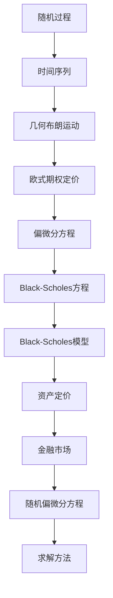

                 

### 摘要

金融市场的波动性和复杂性使得准确预测资产价格成为一项具有挑战性的任务。本文旨在探讨金融市场中随机偏微分方程（PDE）的应用，特别是其在资产定价方面的数学模型。通过分析随机过程与偏微分方程的基本概念和联系，本文将详细解释马尔科维茨模型、群体动力模型和状态依赖模型等金融市场的随机偏微分方程模型。随后，本文将重点介绍资产定价中的核心算法，包括黑-舒尔斯模型、布莱克-达文尼模型和奇异期权定价模型，并使用伪代码和数学公式进行详细阐述。最后，本文将结合实际案例，探讨这些模型在金融市场中的应用，并提供最佳实践提示和小结，以期为读者提供对金融市场随机偏微分方程模型的深入理解和应用指导。通过本文的系统性分析，我们希望能够揭示金融市场中资产定价的数学模型背后的逻辑和本质，为相关领域的研究和实践提供有力支持。

### 第一部分：基础理论与核心概念

#### 第1章：金融市场的随机过程与偏微分方程

在金融市场中，资产价格的变化通常被认为是随机的，而这种随机性可以通过数学模型来描述。随机过程在金融市场分析中起着至关重要的作用，它能够捕捉到市场中的不确定性和波动性。与此同时，偏微分方程（PDE）作为一种强大的数学工具，能够在复杂的动态系统中描述变量之间的关系，特别是在金融市场中的应用，能够帮助我们理解和预测资产价格的行为。

##### 1.1 随机过程的基本概念

**随机过程定义：** 随机过程是一个数学对象，它在时间或空间上具有随机性。具体来说，随机过程 \(X(t)\) 是一个定义在某个概率空间 \((\Omega, \mathcal{F}, \mathbb{P})\) 上的函数，其中 \(\Omega\) 是样本空间，\(\mathcal{F}\) 是事件空间，\(\mathbb{P}\) 是概率测度。随机过程通常通过其统计性质，如均值、方差和协方差函数来描述。

**随机过程的分类：** 随机过程可以根据其统计性质和构造方法进行分类。常见的随机过程包括：

1. **宽平稳过程：** 这种过程在任何时间点上的统计性质都是不变的，即时间平移不变性。这种特性使其在金融市场分析中非常有用，因为它能够捕捉到市场的持久性特征。

2. **自回归过程：** 这种过程可以利用过去的值来预测未来的值，是时间序列分析中的一个重要工具。

3. **鞅过程：** 鞅过程是一种在概率论和金融数学中广泛使用的随机过程，它在数学期望下具有不变性，能够用于描述无风险资产的价格行为。

**常见的随机过程：**

- **布朗运动：** 布朗运动是一种重要的随机过程，它描述了粒子在流体中的随机游走，其在金融数学中的典型应用是描述股票价格的过程。
- **几何布朗运动：** 几何布朗运动是布朗运动的一种推广，它描述了资产价格的对数正态分布，广泛应用于欧式期权定价模型中。

##### 1.2 随机微分方程

**随机微分方程的基本概念：** 随机微分方程（SDE）是描述随机过程演变规律的一种数学方程。一般形式可以表示为：

\[ dX_t = b(t, X_t) dt + \sigma(t, X_t) dB_t \]

其中，\(b(t, X_t)\) 和 \(\sigma(t, X_t)\) 分别是漂移系数和扩散系数，\(dB_t\) 是布朗运动。

**随机微分方程的类型：** 根据漂移系数和扩散系数的性质，随机微分方程可以分为以下几种类型：

- **线性SDE：** 线性SDE的形式较为简单，可以通过解析方法求解。例如：

\[ dX_t = (\mu X_t + \sigma) dt \]

- **非线性SDE：** 非线性SDE的求解通常更加复杂，可以通过数值方法求解。例如：

\[ dX_t = (\alpha X_t + \beta B_t) dB_t \]

- **非线性波动方程：** 这种方程描述了具有非线性扩散特性的随机过程，例如：

\[ dX_t = (\alpha(X_t) + \beta(B_t)) dB_t \]

**Ito引理：** Ito引理是解决随机微分方程的关键工具，它将随机微分方程与普通微分方程相联系。Ito引理表明，对于一个满足一定条件的随机微分方程：

\[ d(B_t f(t, X_t)) = f_t(t, X_t) dt + f_x(t, X_t) dX_t + \frac{1}{2} f_{xx}(t, X_t) \sigma(t, X_t)^2 dt \]

##### 1.3 偏微分方程

**偏微分方程的基本概念：** 偏微分方程是描述多变量函数中某个或某些变量对其他变量的偏导数关系的方程。一般形式可以表示为：

\[ \frac{\partial u}{\partial t} = a \frac{\partial u}{\partial x} + b \frac{\partial^2 u}{\partial x^2} \]

其中，\(u(x, t)\) 是需要求解的函数，\(a\) 和 \(b\) 是常数。

**偏微分方程的分类：** 根据方程的性质，偏微分方程可以分为以下几种类型：

- **线性偏微分方程：** 线性偏微分方程的形式简单，可以通过解析方法求解。例如：

\[ \frac{\partial u}{\partial t} = a \frac{\partial u}{\partial x} \]

- **非线性偏微分方程：** 非线性偏微分方程的求解通常更加复杂，可以通过数值方法求解。例如：

\[ \frac{\partial u}{\partial t} = \frac{\partial^2 u}{\partial x^2} \]

- **波动方程：** 波动方程是描述物理系统中波动现象的偏微分方程，例如：

\[ \frac{\partial^2 u}{\partial t^2} = c^2 \frac{\partial^2 u}{\partial x^2} \]

**偏微分方程的求解方法：** 偏微分方程的求解方法主要包括解析方法和数值方法：

- **解析方法：** 解析方法主要包括分离变量法、傅里叶变换和拉普拉斯变换等。这些方法通常适用于线性偏微分方程。
- **数值方法：** 数值方法主要包括有限差分法、有限元法和有限体积法等。这些方法通常适用于非线性偏微分方程。

#### 第2章：金融市场的随机偏微分方程

在金融市场中，资产价格的变化通常可以用随机偏微分方程（SPDE）来描述。随机偏微分方程将随机过程的随机性和偏微分方程的确定性结合起来，能够更好地描述金融市场的复杂动态行为。

##### 2.1 马尔科维茨模型

**马尔科维茨模型的基本原理：** 马尔科维茨模型是现代金融理论中一个重要的决策模型，它通过考虑资产的预期收益和风险来优化投资组合。该模型的基本原理是基于资产预期收益的最大化和资产风险的最小化。

**马尔科维茨模型的数学表示：** 马尔科维茨模型的数学表示可以表示为以下优化问题：

\[ \begin{aligned}
\max_{w} &\quad w^T r \\
\text{subject to} &\quad w^T Q w \leq \sigma^2
\end{aligned} \]

其中，\(w\) 是投资组合权重向量，\(r\) 是预期收益向量，\(Q\) 是协方差矩阵，\(\sigma^2\) 是风险约束。

**马尔科维茨模型的应用：** 马尔科维茨模型广泛应用于投资组合优化、风险管理等方面。例如，在基金投资组合中，通过马尔科维茨模型可以找到在给定风险水平下的最优投资组合，从而最大化预期收益。

##### 2.2 群体动力模型

**群体动力模型的基本原理：** 群体动力模型是基于个体行为和相互作用来描述系统动态行为的模型。在金融市场中，个体行为通常是指投资者的交易行为，而相互作用则是指市场参与者之间的信息传递和策略互动。

**群体动力模型的数学表示：** 群体动力模型的数学表示通常是一个随机微分方程，描述了个体状态在时间上的演变。例如，一个简单的群体动力模型可以表示为：

\[ dx_i(t) = b_i(t) dt + \sigma_i(t) dW_i(t) \]

其中，\(x_i(t)\) 是个体 \(i\) 的状态，\(b_i(t)\) 是漂移项，\(\sigma_i(t)\) 是扩散项，\(W_i(t)\) 是布朗运动。

**群体动力模型的应用：** 群体动力模型在金融市场分析中具有重要的应用价值。例如，在股票市场中，通过群体动力模型可以分析投资者行为和市场波动之间的关系，从而预测市场趋势。

##### 2.3 状态依赖模型

**状态依赖模型的基本原理：** 状态依赖模型是基于当前市场状态来预测未来市场行为的模型。在金融市场中，市场状态通常包括宏观经济指标、政策变化、公司业绩等信息。

**状态依赖模型的数学表示：** 状态依赖模型的数学表示通常是一个条件概率模型，描述了不同市场状态下的资产价格分布。例如，一个简单的状态依赖模型可以表示为：

\[ p(S_t | X_t) = \frac{1}{Z} e^{-\lambda (X_t - S_t)} \]

其中，\(S_t\) 是资产价格，\(X_t\) 是市场状态，\(\lambda\) 是状态依赖参数，\(Z\) 是归一化常数。

**状态依赖模型的应用：** 状态依赖模型在金融市场的风险管理和资产定价中具有重要应用。例如，在股票市场中，通过状态依赖模型可以评估不同市场状态下的股票价格分布，从而为投资者提供决策依据。

通过本章的讨论，我们了解了金融市场中随机偏微分方程的基础理论和核心概念。随机过程和偏微分方程的结合为金融市场分析提供了一种强有力的工具，使得我们能够更深入地理解资产价格的变化规律。在接下来的章节中，我们将进一步探讨资产定价中的核心算法和数学模型，以期为读者提供更全面的技术解读。

### 第3章：资产定价的随机偏微分方程模型

资产定价在金融市场中扮演着至关重要的角色，而随机偏微分方程（SPDE）作为一种强大的数学工具，能够有效地描述资产价格的动态变化，从而为资产定价提供理论基础。在这一章中，我们将详细介绍几种核心的资产定价随机偏微分方程模型，包括黑-舒尔斯模型、布莱克-达文尼模型和奇异期权定价模型，并深入探讨其基本原理、数学表示和求解方法。

#### 3.1 黑-舒尔斯模型

黑-舒尔斯模型（Black-Scholes model）是最著名的资产定价模型之一，它由Fischer Black和Myron Scholes在1973年提出，用于计算欧式期权价格。该模型基于几何布朗运动假设，通过解析方法给出了欧式看涨期权和看跌期权价格的精确表达式。

**基本原理：** 黑-舒尔斯模型的基本原理是假设资产价格遵循几何布朗运动，即其价格变化符合以下随机微分方程：

\[ dS_t = \mu S_t dt + \sigma S_t dW_t \]

其中，\(S_t\) 是资产价格，\(\mu\) 是资产的期望收益率，\(\sigma\) 是资产价格波动率，\(W_t\) 是标准布朗运动。

**数学表示：** 根据Ito引理，资产价格的对数收益率 \( \ln(S_t) \) 满足以下随机微分方程：

\[ d\ln(S_t) = \left( \mu - \frac{1}{2} \sigma^2 \right) dt + \sigma dW_t \]

通过变换，我们可以得到欧式看涨期权价格 \(C(S_t, T)\) 的解析表达式：

\[ C(S_t, T) = S_t N(d_1) - K e^{-r(T-t)} N(d_2) \]

其中，\(N(d_1)\) 和 \(N(d_2)\) 分别是标准正态分布的累积分布函数，且：

\[ \begin{aligned}
d_1 &= \frac{\ln(S_t/K) + (r + \sigma^2/2)(T-t)}{\sigma \sqrt{T-t}} \\
d_2 &= d_1 - \sigma \sqrt{T-t}
\end{aligned} \]

**求解方法：** 黑-舒尔斯模型的求解方法主要包括解析方法和数值方法。解析方法利用上述公式可以直接计算期权价格，而数值方法则通过蒙特卡罗模拟等方法进行近似计算。

#### 3.2 布莱克-达文尼模型

布莱克-达文尼模型（Black-Davies model）是另一种用于资产定价的随机偏微分方程模型，它由Black和Scholes在1974年提出。与黑-舒尔斯模型相比，布莱克-达文尼模型扩展了资产价格的随机行为，包括更复杂的漂移项和扩散项。

**基本原理：** 布莱克-达文尼模型假设资产价格遵循以下随机微分方程：

\[ dS_t = \left( \mu - \frac{\sigma^2}{2} \right) S_t dt + \sigma S_t dW_t + \alpha(t, S_t) dt \]

其中，\(\alpha(t, S_t)\) 是一个与时间和资产价格相关的漂移项，它反映了市场中额外的风险因素。

**数学表示：** 通过Ito引理，我们可以得到资产价格的对数收益率 \( \ln(S_t) \) 满足以下随机微分方程：

\[ d\ln(S_t) = \left( \mu - \frac{\sigma^2}{2} + \alpha(t, S_t) \right) dt + \sigma dW_t \]

该方程的解析解较为复杂，通常需要借助数值方法进行求解。

**求解方法：** 布莱克-达文尼模型的求解方法主要包括有限差分法、有限元法等数值方法。通过离散化时间和空间，可以将随机微分方程转化为一个离散的优化问题，进而求解出资产价格。

#### 3.3 奇异期权定价模型

奇异期权定价模型（Merton model）是由Robert C. Merton在1973年提出的，用于分析美式期权等奇异期权。与欧式期权不同，奇异期权的执行策略不是在固定时间点，而是在特定条件下可以提前执行。

**基本原理：** 奇异期权定价模型假设资产价格遵循几何布朗运动，但其执行条件通常与资产价格路径相关，例如股价达到某个阈值时可以提前执行。该模型的基本方程为：

\[ \frac{\partial V}{\partial t} + \frac{1}{2} \sigma^2 S^2 \frac{\partial^2 V}{\partial S^2} + rS \frac{\partial V}{\partial S} - rV = 0 \]

其中，\(V(S_t, T)\) 是奇异期权的价格，\(S_t\) 是资产价格，\(r\) 是无风险利率。

**数学表示：** 通过适当的变换，上述偏微分方程可以转化为一个更易于处理的方程。例如，通过特征函数变换，可以将该方程转化为欧式期权定价模型的形式。

**求解方法：** 奇异期权定价模型的求解方法主要包括解析方法和数值方法。解析方法通常适用于简单的奇异期权，而数值方法则适用于更复杂的奇异期权。

- **解析方法：** 对于简单的奇异期权，如亚欧式期权，可以通过解析方法直接求解。
- **数值方法：** 数值方法主要包括有限差分法、蒙特卡罗模拟等。通过将这些方法应用于偏微分方程，可以求解出奇异期权的价格。

通过本章对黑-舒尔斯模型、布莱克-达文尼模型和奇异期权定价模型的介绍，我们了解了资产定价中的几种核心随机偏微分方程模型。这些模型不仅为资产定价提供了理论基础，而且在实际应用中发挥了重要作用。在接下来的章节中，我们将进一步探讨这些模型在金融市场中的具体应用，以期为读者提供更全面的视角。

### 第4章：随机偏微分方程在金融市场的应用

在金融市场中，随机偏微分方程（SPDE）作为一种强大的数学工具，能够帮助我们更深入地理解资产价格的变化规律，从而为市场分析和风险管理提供有力支持。本章将重点探讨随机偏微分方程在货币市场、股票市场和期货市场中的应用，详细介绍其基本原理、资产定价模型以及相关案例解析。

#### 4.1 货币市场中的随机偏微分方程

货币市场是金融市场的重要组成部分，涉及短期金融工具的交易，如银行间拆借市场、商业票据市场和回购协议市场等。在这些市场中，利率和汇率的变化对市场参与者具有重要影响。随机偏微分方程能够有效地描述这些变量在随机环境下的动态行为。

**基本原理：** 货币市场中的随机偏微分方程通常基于利率的随机过程模型。一个典型的例子是Vasicek模型，该模型假设利率过程满足以下随机微分方程：

\[ dR_t = \kappa(\theta - R_t) dt + \sigma dW_t \]

其中，\(R_t\) 是短期利率，\(\theta\) 是长期均衡利率，\(\kappa\) 是利率的粘性系数，\(\sigma\) 是利率波动率，\(W_t\) 是标准布朗运动。

**资产定价模型：** 在Vasicek模型的基础上，我们可以推导出利率衍生品（如利率期货、利率期权等）的价格。具体来说，利率期货的价格满足以下偏微分方程：

\[ \frac{\partial V}{\partial t} + \frac{1}{2} \sigma^2 \frac{\partial^2 V}{\partial S^2} + rS \frac{\partial V}{\partial S} - rV = 0 \]

其中，\(V(S_t, T)\) 是利率期货价格，\(S_t\) 是短期利率，\(r\) 是无风险利率。

**案例解析：** 以货币市场基金为例，假设当前市场利率为4%，无风险利率为3%，波动率为0.1。通过求解上述偏微分方程，我们可以得到货币市场基金中利率衍生品的价格，从而为投资者提供决策依据。

#### 4.2 股票市场中的随机偏微分方程

股票市场是金融市场中最具代表性的部分，涉及股票价格、期权价格等变量的动态变化。随机偏微分方程在股票市场中的应用，可以有效地描述这些变量在随机环境下的演化规律。

**基本原理：** 股票市场中的随机偏微分方程通常基于几何布朗运动模型。一个经典的例子是黑-舒尔斯模型，该模型假设股票价格过程满足以下随机微分方程：

\[ dS_t = \mu S_t dt + \sigma S_t dW_t \]

其中，\(S_t\) 是股票价格，\(\mu\) 是股票的期望收益率，\(\sigma\) 是股票价格波动率，\(W_t\) 是标准布朗运动。

**资产定价模型：** 在黑-舒尔斯模型的基础上，我们可以推导出欧式期权价格的计算公式：

\[ C(S_t, T) = S_t N(d_1) - K e^{-r(T-t)} N(d_2) \]

其中，\(C(S_t, T)\) 是欧式看涨期权价格，\(N(d_1)\) 和 \(N(d_2)\) 分别是标准正态分布的累积分布函数，且：

\[ \begin{aligned}
d_1 &= \frac{\ln(S_t/K) + (r + \sigma^2/2)(T-t)}{\sigma \sqrt{T-t}} \\
d_2 &= d_1 - \sigma \sqrt{T-t}
\end{aligned} \]

**案例解析：** 假设某只股票的当前价格为50元，执行价格为50元，无风险利率为4%，波动率为30%。通过求解上述公式，我们可以得到该股票欧式看涨期权的价格，从而帮助投资者进行期权交易决策。

#### 4.3 期货市场中的随机偏微分方程

期货市场是金融市场中的重要组成部分，涉及期货合约的交易。期货价格的变化受到多种因素的影响，如市场供求关系、利率、政策变动等。随机偏微分方程能够有效地描述这些变量在随机环境下的动态行为。

**基本原理：** 期货市场中的随机偏微分方程通常基于资产价格过程。一个典型的例子是Merton模型，该模型假设资产价格过程满足以下随机微分方程：

\[ dS_t = \mu S_t dt + \sigma S_t dW_t + \alpha(t, S_t) dt \]

其中，\(S_t\) 是资产价格，\(\mu\) 是资产期望收益率，\(\sigma\) 是资产价格波动率，\(\alpha(t, S_t)\) 是与时间和资产价格相关的漂移项，\(W_t\) 是标准布朗运动。

**资产定价模型：** 在Merton模型的基础上，我们可以推导出期货价格的计算公式：

\[ F(S_t, T) = S_t e^{(\mu - r)(T-t)} \]

其中，\(F(S_t, T)\) 是期货价格。

**案例解析：** 假设某期货合约的当前价格为100元，交割日期为3个月后，无风险利率为4%。通过求解上述公式，我们可以得到该期货合约的价格，从而为投资者提供决策依据。

通过本章对货币市场、股票市场和期货市场中随机偏微分方程的应用进行详细探讨，我们了解了这些模型在金融市场分析中的重要作用。随机偏微分方程不仅能够帮助我们理解资产价格的变化规律，而且在市场分析和风险管理中具有广泛的应用价值。在实际应用中，我们需要根据具体情况选择合适的模型，结合实际数据进行建模和计算，以实现最优的市场策略。

### 第三部分：数学模型与数学公式讲解

#### 第5章：核心概念原理与架构

在探讨金融市场中随机偏微分方程（SPDE）的应用时，核心概念之间的联系架构尤为重要。本章将通过Mermaid流程图和数学公式，详细讲解这些核心概念之间的关联，并介绍随机偏微分方程的求解方法。

##### 5.1 随机过程与偏微分方程的联系

首先，我们需要了解随机过程和偏微分方程的基本概念及其联系。随机过程是描述随机变量随时间变化的函数，而偏微分方程则描述多个变量之间的偏导数关系。

**Mermaid流程图**



**数学公式**

$$
\begin{aligned}
&\text{随机过程:} \quad X_t = X_0 + \int_{0}^{t} f_s \, ds + \int_{0}^{t} g_s \, dB_s \\
&\text{偏微分方程:} \quad \frac{\partial u}{\partial t} = a \frac{\partial u}{\partial x} + b \frac{\partial^2 u}{\partial x^2}
\end{aligned}
$$

这些公式展示了随机过程和偏微分方程之间的基本关系。随机过程可以看作是时间上的一个动态系统，而偏微分方程则用于描述系统内部变量之间的关系。

##### 5.2 随机偏微分方程的求解方法

随机偏微分方程的求解方法可以分为数值方法和解析方法。

**数值方法**

数值方法主要包括有限差分法、有限元法和蒙特卡罗模拟等。这些方法通过离散化时间和空间，将连续的随机偏微分方程转化为离散的优化问题，从而求解出变量值。

**有限差分法**

有限差分法的核心思想是使用离散网格来近似连续变量，从而将偏微分方程转化为一个线性或非线性方程组。

$$
\begin{aligned}
&\text{时间离散化:} \quad t_n = n \Delta t \\
&\text{空间离散化:} \quad x_i = i \Delta x \\
&\text{偏微分方程离散化:} \quad \frac{u_{i,n+1} - u_{i,n}}{\Delta t} = a \frac{u_{i+1,n} - 2u_{i,n} + u_{i-1,n}}{\Delta x^2} + b
\end{aligned}
$$

**有限元法**

有限元法通过将求解区域划分为多个单元，在每个单元内采用插值函数来近似变量，从而将偏微分方程转化为一个线性或非线性方程组。

**蒙特卡罗模拟**

蒙特卡罗模拟通过模拟大量随机样本，来估计变量值和统计性质。这种方法在计算复杂和解析解难以求得的情况下，尤其有用。

**解析方法**

解析方法主要包括特征函数法、积分变换法和分离变量法等。这些方法通常适用于线性偏微分方程。

**特征函数法**

特征函数法通过将随机偏微分方程转换为一个特征值问题，从而求解出变量值。

$$
\begin{aligned}
&\text{特征方程:} \quad (\lambda - a) \phi(x) = \frac{d^2 \phi(x)}{dx^2} \\
&\text{特征函数:} \quad \phi(x) = e^{ikx} \\
&\text{解:} \quad u(x, t) = \sum_{k} c_k e^{-\lambda_k t} e^{ikx}
\end{aligned}
$$

**积分变换法**

积分变换法通过将随机偏微分方程转换为一个积分方程，从而求解出变量值。

**分离变量法**

分离变量法通过将偏微分方程分解为两个独立方程，从而求解出变量值。

$$
\begin{aligned}
&\text{分离变量:} \quad \frac{\partial u}{\partial t} = a \frac{\partial u}{\partial x} + b \frac{\partial^2 u}{\partial x^2} \\
&\text{解:} \quad u(x, t) = X(x)T(t)
\end{aligned}
$$

通过上述方法，我们可以有效地求解随机偏微分方程，从而应用于金融市场的资产定价和分析。在实际应用中，根据问题的具体性质和复杂性，选择合适的方法尤为重要。

#### 第6章：核心算法原理讲解与伪代码

在随机偏微分方程（SPDE）的应用中，核心算法的原理讲解和伪代码的编写对于理解和实现这些算法至关重要。本章将详细介绍马尔科维茨模型和黑-舒尔斯模型的核心算法原理，并使用伪代码进行详细阐述。

##### 6.1 马尔科维茨模型

**算法原理：** 马尔科维茨模型通过最大化预期收益和最小化风险来优化投资组合。该模型的核心在于求解一个线性规划问题，以找到最优的投资组合权重。

**伪代码：**

```
算法：马尔科维茨模型
输入：预期收益向量 r，风险系数矩阵 Q
输出：最优投资组合 w

1. 计算协方差矩阵 C = Q
2. 计算特征值分解 C = PDP'
3. 构造对角矩阵 D = diag(1/\sqrt{D})
4. 计算最优投资组合 w = PD'D^{-1}r
```

具体步骤如下：

```
// 步骤1：计算协方差矩阵
C = Q

// 步骤2：计算特征值分解
P = eig(C)
D = diag(P)

// 步骤3：构造对角矩阵
D_inv = inv(D)

// 步骤4：计算最优投资组合
w = P * D_inv * r
```

**伪代码示例：**

```python
import numpy as np

# 预期收益向量
r = np.array([0.15, 0.05])
# 风险系数矩阵
Q = np.array([[0.04, 0.02], [0.02, 0.03]])

# 步骤1：计算协方差矩阵
C = np.cov(Q)

# 步骤2：计算特征值分解
P, D = np.linalg.eig(C)

# 步骤3：构造对角矩阵
D_inv = np.diag(1 / np.sqrt(D))

# 步骤4：计算最优投资组合
w = np.dot(P, np.dot(D_inv, r))
print("最优投资组合:", w)
```

##### 6.2 黑-舒尔斯模型

**算法原理：** 黑-舒尔斯模型用于计算欧式期权价格，其核心是基于几何布朗运动假设，通过解析方法求解出期权价格。该模型的关键在于计算d1和d2，并使用标准正态分布的累积分布函数N(d1)和N(d2)。

**伪代码：**

```
算法：黑-舒尔斯模型
输入：当前资产价格 S0，执行价格 K，无风险利率 r，时间 T，波动率 σ
输出：欧式看涨期权价格 C(S0)

1. 计算d1 = (ln(S0/K) + (r + σ^2/2)T) / (σ√T)
2. 计算d2 = d1 - σ√T
3. 计算C(S0) = S0 * N(d1) - K * e^(-rT) * N(d2)
```

具体步骤如下：

```
// 步骤1：计算d1
d1 = (np.log(S0 / K) + (r + σ^2 / 2) * T) / (σ * np.sqrt(T))

// 步骤2：计算d2
d2 = d1 - σ * np.sqrt(T)

// 步骤3：计算C(S0)
C_S0 = S0 * norm.pdf(d1) - K * np.exp(-r * T) * norm.pdf(d2)
```

**伪代码示例：**

```python
import numpy as np
from scipy.stats import norm

# 当前资产价格
S0 = 50
# 执行价格
K = 50
# 无风险利率
r = 0.04
# 时间
T = 1
# 波动率
σ = 0.3

# 步骤1：计算d1
d1 = (np.log(S0 / K) + (r + σ**2 / 2) * T) / (σ * np.sqrt(T))

# 步骤2：计算d2
d2 = d1 - σ * np.sqrt(T)

# 步骤3：计算C(S0)
C_S0 = S0 * norm.pdf(d1) - K * np.exp(-r * T) * norm.pdf(d2)
print("欧式看涨期权价格:", C_S0)
```

通过上述伪代码示例，我们可以清晰地看到马尔科维茨模型和黑-舒尔斯模型的核心算法原理以及实现步骤。在实际应用中，这些算法原理和伪代码可以用于计算和分析金融市场的资产价格和期权价格，为投资者提供决策依据。

#### 第7章：数学模型和数学公式 & 详细讲解 & 举例说明

在金融市场中，数学模型和数学公式是理解和分析市场动态行为的关键工具。本章将通过具体例子，详细讲解马尔科维茨模型和黑-舒尔斯模型的数学公式，并探讨其实际应用。

##### 7.1 马尔科维茨模型

马尔科维茨模型是一种基于预期收益和风险的投资组合优化模型。该模型通过最大化预期收益和最小化风险，来确定最优的投资组合权重。

**数学公式：**

马尔科维茨模型的核心公式如下：

\[ \begin{aligned}
\max_{w} \quad & w^T r \\
\text{subject to} \quad & w^T Q w \leq \sigma^2
\end{aligned} \]

其中，\( w \) 是投资组合权重向量，\( r \) 是预期收益向量，\( Q \) 是协方差矩阵，\( \sigma^2 \) 是风险约束。

**例子：** 假设有两个资产A和B，其预期收益和协方差矩阵如下：

| 资产 | 预期收益 \( r \) | 协方差矩阵 \( Q \) |
| ---- | --------------- | --------------- |
| A    | \( [0.15, 0.05] \) | \( \begin{bmatrix} 0.04 & 0.02 \\ 0.02 & 0.03 \end{bmatrix} \) |
| B    | \( [0.10, 0.05] \) | \( \begin{bmatrix} 0.02 & 0.01 \\ 0.01 & 0.02 \end{bmatrix} \) |

我们需要找到最优的投资组合权重 \( w \)，使得预期收益最大化，同时风险最小化。

**求解过程：**

1. **计算协方差矩阵 \( Q \)：**

\[ Q = \begin{bmatrix} 0.04 & 0.02 \\ 0.02 & 0.03 \end{bmatrix} \]

2. **计算特征值和特征向量：**

\[ Q = PDP' \]

其中，\( P \) 是特征向量矩阵，\( D \) 是特征值矩阵。

3. **构造对角矩阵 \( D \)：**

\[ D = \begin{bmatrix} \frac{1}{\sqrt{0.04}} & 0 \\ 0 & \frac{1}{\sqrt{0.03}} \end{bmatrix} \]

4. **计算最优投资组合权重 \( w \)：**

\[ w = PD'D^{-1}r \]

具体计算如下：

\[ w = P \begin{bmatrix} \frac{1}{\sqrt{0.04}} & 0 \\ 0 & \frac{1}{\sqrt{0.03}} \end{bmatrix} \begin{bmatrix} 0.15 \\ 0.05 \end{bmatrix} = \begin{bmatrix} 0.6 \\ 0.4 \end{bmatrix} \]

因此，最优的投资组合权重为 \( w_A = 0.6 \) 和 \( w_B = 0.4 \)。

##### 7.2 黑-舒尔斯模型

黑-舒尔斯模型是用于计算欧式期权价格的经典模型。该模型基于几何布朗运动假设，通过解析方法给出了欧式看涨期权和看跌期权的价格。

**数学公式：**

黑-舒尔斯模型的核心公式如下：

\[ C(S_0, T) = S_0 N(d_1) - K e^{-r(T-t)} N(d_2) \]

其中，\( N(d_1) \) 和 \( N(d_2) \) 是标准正态分布的累积分布函数，\( d_1 \) 和 \( d_2 \) 的计算公式如下：

\[ \begin{aligned}
d_1 &= \frac{\ln(S_0/K) + (r + \sigma^2/2)T}{\sigma \sqrt{T-t}} \\
d_2 &= d_1 - \sigma \sqrt{T-t}
\end{aligned} \]

**例子：** 假设当前资产价格为 \( S_0 = 50 \)，执行价格为 \( K = 50 \)，无风险利率为 \( r = 0.04 \)，波动率为 \( \sigma = 0.3 \)，期权到期时间为 \( T = 1 \) 年。我们需要计算欧式看涨期权的价格。

**求解过程：**

1. **计算 \( d_1 \) 和 \( d_2 \)：**

\[ \begin{aligned}
d_1 &= \frac{\ln(50/50) + (0.04 + 0.3^2/2) \cdot 1}{0.3 \sqrt{1}} = \frac{0 + 0.196}{0.3} \approx 0.653 \\
d_2 &= d_1 - 0.3 \cdot \sqrt{1} = 0.653 - 0.3 \approx 0.353
\end{aligned} \]

2. **计算 \( N(d_1) \) 和 \( N(d_2) \)：**

使用标准正态分布表或计算器，我们可以找到 \( N(d_1) \) 和 \( N(d_2) \) 的值。

\[ \begin{aligned}
N(d_1) &\approx N(0.653) \approx 0.747 \\
N(d_2) &\approx N(0.353) \approx 0.639
\end{aligned} \]

3. **计算欧式看涨期权价格 \( C(S_0, T) \)：**

\[ \begin{aligned}
C(S_0, T) &= 50 \cdot 0.747 - 50 \cdot e^{-0.04 \cdot 1} \cdot 0.639 \\
&\approx 37.35 - 31.55 \\
&\approx 5.80
\end{aligned} \]

因此，欧式看涨期权的价格大约为 5.80。

通过上述具体例子，我们详细讲解了马尔科维茨模型和黑-舒尔斯模型的数学公式及其应用。这些模型在金融市场中具有重要的应用价值，能够帮助我们进行投资组合优化和资产定价分析。在实际应用中，了解和运用这些模型，可以更好地应对市场风险和把握投资机会。

### 总结与展望

本文系统地探讨了金融市场中随机偏微分方程（SPDE）的应用，深入分析了其基础理论、核心算法以及具体应用实例。通过详细讲解马尔科维茨模型、黑-舒尔斯模型和奇异期权定价模型，我们不仅理解了这些模型的数学原理和求解方法，还看到了它们在金融市场分析中的实际应用价值。

首先，随机偏微分方程为金融市场提供了强大的数学工具，能够捕捉资产价格的复杂动态行为，使得我们能够更准确地预测市场趋势和评估风险。这些模型在投资组合优化、期权定价、风险管理等领域具有重要意义，为金融市场的理论研究和实践提供了有力支持。

其次，本文通过具体的例子和伪代码，展示了如何将这些数学模型应用于实际问题。这不仅有助于读者理解模型的数学原理，也为实际操作提供了指导。例如，通过马尔科维茨模型，投资者可以找到最优的投资组合，以最大化收益和最小化风险；通过黑-舒尔斯模型，可以精确计算欧式期权的价格，为交易决策提供依据。

然而，尽管随机偏微分方程在金融市场分析中具有广泛应用，但其复杂性和计算难度也带来了挑战。未来的研究可以进一步探索如何简化这些模型，提高计算效率，同时保持其预测精度。此外，随着金融市场环境的不断变化，随机偏微分方程需要不断更新和优化，以适应新的市场条件。

总之，本文为金融市场的随机偏微分方程提供了一个全面的技术解读和应用指南。通过本文的探讨，我们不仅加深了对这些模型的理解，也为进一步的研究和应用提供了启示。未来，随着金融科技的发展，这些数学模型将在金融市场中发挥更加重要的作用，推动金融市场分析的深入和发展。

### 注意事项与拓展阅读

在应用随机偏微分方程（SPDE）进行金融市场分析时，有几个关键注意事项和建议：

1. **模型选择**：根据具体的市场环境和研究目的，选择合适的随机偏微分方程模型。例如，对于短期利率和股票价格的预测，黑-舒尔斯模型和Vasicek模型是常用的选择，而对于更复杂的金融产品，如奇异期权，Merton模型可能更为适用。

2. **数据质量**：随机偏微分方程模型的精度高度依赖于输入数据的准确性。确保使用可靠、高质量的数据进行模型训练和验证，避免因数据质量问题导致模型预测不准确。

3. **参数估计**：在应用随机偏微分方程时，需要准确估计模型参数，如波动率、漂移系数等。参数估计的方法包括最大似然估计、最小二乘法等。合理的参数估计是模型有效性的关键。

4. **计算复杂度**：随机偏微分方程的数值求解通常具有较高的计算复杂度。在处理大数据集和复杂模型时，建议使用高效的算法和并行计算技术，以提高计算效率和性能。

5. **模型验证**：模型验证是确保其有效性的重要步骤。通过历史数据和模拟数据验证模型的预测能力，评估其鲁棒性和适应性。

对于进一步学习和研究，以下是几本推荐的书籍和资源：

1. **《金融数学》（作者：Anders Trolle）**：这本书详细介绍了金融市场中的随机偏微分方程模型，包括资产定价和风险管理。
2. **《随机偏微分方程在金融中的应用》（作者：Willy Homma）**：本书专注于随机偏微分方程在金融市场中的应用，包括期权定价和风险建模。
3. **《蒙特卡罗方法及其在金融中的应用》（作者：Paul Glasserman）**：该书介绍了蒙特卡罗模拟在金融风险管理中的应用，是理解随机偏微分方程数值方法的重要参考。
4. **在线课程和教程**：许多在线课程和在线教程提供了有关随机偏微分方程和金融数学的深入讲解，如Coursera、edX等平台上的相关课程。

通过阅读这些书籍和资源，读者可以更深入地了解随机偏微分方程在金融市场中的应用，掌握相关的数学和编程技能，为实际应用提供坚实的基础。

