                 


## 《非物质团队激励：激发团队的内在动力》

### 关键词：团队激励、内在动力、情感管理、成长与发展、公平与正义

### 摘要：
在当今复杂多变的工作环境中，团队激励已经不仅仅局限于传统的物质奖励。本文将探讨如何通过非物质激励来激发团队的内在动力，从而提升团队的整体效能和创新能力。我们将分析团队激励的基础理论，探讨自我效能感、内在动机、团队认同感等核心要素，并介绍情感管理、认可与反馈、成长与职业发展、公平与正义等具体实践策略。通过案例研究和未来趋势分析，我们希望为团队管理者提供一套全面有效的非物质激励指南。

### 目录

#### 第一部分：团队激励基础

##### 第1章：团队激励概述
- 1.1 团队激励的概念与重要性
- 1.2 团队激励的类型与特点
- 1.3 非物质激励在团队管理中的应用

##### 第2章：激发团队内在动力的核心要素
- 2.1 自我效能感与团队动力
- 2.2 内在动机与外在动机的平衡
- 2.3 团队认同感与归属感

##### 第3章：构建积极的团队文化
- 3.1 团队价值观的塑造与传播
- 3.2 良好沟通与冲突解决
- 3.3 团队协作与共同目标设定

#### 第二部分：非物质激励实践

##### 第4章：情感管理
- 4.1 情感管理的重要性
- 4.2 建立情感连接的技巧
- 4.3 情感管理案例解析

##### 第5章：认可与反馈
- 5.1 正面认可的力量
- 5.2 有效反馈的技巧
- 5.3 反馈与激励的结合

##### 第6章：成长与职业发展
- 6.1 提供成长机会的重要性
- 6.2 职业发展的激励机制
- 6.3 成长案例与策略分析

##### 第7章：公平与正义
- 7.1 公平在团队管理中的意义
- 7.2 创造正义感的团队环境
- 7.3 公平与激励机制的平衡

#### 第三部分：团队激励策略优化

##### 第8章：团队激励评估与改进
- 8.1 团队激励评估的方法
- 8.2 激励策略的调整与优化
- 8.3 团队激励的长期效果跟踪

##### 第9章：案例研究：成功团队激励策略
- 9.1 案例一：初创企业的团队激励策略
- 9.2 案例二：跨国公司的团队激励策略
- 9.3 案例分析与启示

##### 第10章：未来趋势与挑战
- 10.1 团队激励的趋势展望
- 10.2 面临的挑战与应对策略
- 10.3 持续改进与创新

#### 附录

##### 附录A：团队激励相关资源与工具
- A.1 团队激励相关的书籍推荐
- A.2 团队激励相关的学术研究
- A.3 团队激励相关的在线课程与讲座

### 文章正文

#### 第1章：团队激励概述

##### 1.1 团队激励的概念与重要性

**背景介绍**：
团队激励是指通过各种手段和方法，激发团队成员的工作积极性、主动性和创造力，从而提高团队整体绩效和达成组织目标的过程。随着现代组织结构日趋复杂，团队成员的多样性和互动性不断增加，团队激励的重要性愈发凸显。

**核心概念与联系**：
团队激励的核心概念包括自我效能感、内在动机、团队认同感等。这些概念相互联系，共同构成了团队激励的理论框架。自我效能感指个体对自己能力的信心，内在动机指个体出于自身兴趣和内在需要而工作，团队认同感指个体对团队目标和价值观的认同。

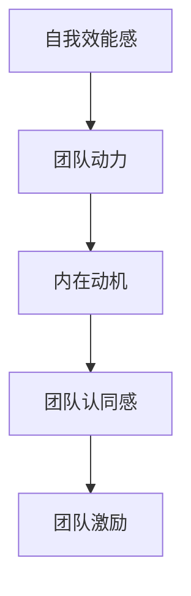

**核心算法原理讲解**：
团队激励的算法原理可以理解为对团队成员的“激励函数”。该函数结合了自我效能感、内在动机和团队认同感，通过以下步骤进行计算：

1. **评估自我效能感**：通过评估团队成员的技能、知识和工作表现，确定其自我效能感。
2. **识别内在动机**：分析团队成员的工作兴趣、个人目标和成就感，确定内在动机。
3. **建立团队认同感**：通过团队价值观的塑造、共同目标的设定和良好的团队沟通，增强团队认同感。
4. **计算激励输出**：结合自我效能感、内在动机和团队认同感，计算激励输出，以激发团队成员的内在动力。

**数学模型和公式**：
设\( S \)为自我效能感，\( I \)为内在动机，\( G \)为团队认同感，\( E \)为激励效果，则团队激励效果的数学模型可以表示为：

\[ E = f(S, I, G) \]

其中，\( f \)为激励函数，可以采用加权平均、线性组合等多种形式。

**举例说明**：
例如，一个团队成员在项目中表现出色，自我效能感较高，同时他对项目非常感兴趣，内在动机强烈，且对团队价值观认同，那么他的激励效果会较高，从而更有动力投入到后续工作中。

##### 1.2 团队激励的类型与特点

**物质激励**：
物质激励是最常见的激励类型，包括薪资、奖金、福利等。物质激励能够直接满足员工的基本需求，提升其生活品质，是激发工作积极性的一种有效手段。

**非物质激励**：
非物质激励则侧重于满足员工的心理需求，包括认可与反馈、情感管理、成长与发展、公平与正义等。非物质激励更能激发员工的内在动力，促进长期发展。

**综合激励**：
综合激励是将物质激励与非物质激励相结合，根据团队和个体的实际情况，灵活运用不同的激励手段，以达到最佳激励效果。

**核心算法原理讲解**：
综合激励的算法原理可以理解为对多种激励手段的优化组合。具体步骤如下：

1. **需求分析**：分析团队成员的需求，区分物质需求和心理需求。
2. **资源评估**：评估组织的资源状况，确定可供使用的激励手段。
3. **激励组合**：根据需求分析和资源评估，设计出最优的激励组合，实现激励效果的最大化。

**数学模型和公式**：
设\( M \)为物质激励，\( N \)为非物质激励，\( R \)为综合激励效果，则综合激励效果的数学模型可以表示为：

\[ R = f(M, N) \]

其中，\( f \)为激励函数，可以根据实际需求进行调整。

**举例说明**：
例如，一个团队在完成一个重要项目后，组织了一次团队聚餐作为物质激励，同时进行了项目表彰会议，对团队成员的出色表现给予认可和表扬，这是一种综合激励的例子。

##### 1.3 非物质激励在团队管理中的应用

**提高工作满意度**：
非物质激励能够满足员工的心理需求，提升工作满意度。研究表明，员工在工作满意度较高的环境中，更容易产生积极的工作态度和创造力。

**增强团队凝聚力**：
非物质激励能够加强团队成员之间的情感联系，增强团队凝聚力。通过共同的目标、价值观和经历，团队成员能够建立深厚的情感纽带。

**促进创新与学习**：
非物质激励能够激发员工的内在动力，促进创新思维和学习积极性。员工在受到认可和鼓励后，更愿意尝试新方法、提出新观点，从而推动团队整体创新能力的提升。

**核心算法原理讲解**：
非物质激励在团队管理中的应用算法原理可以理解为对激励手段的精准匹配和持续优化。具体步骤如下：

1. **需求匹配**：根据团队成员的需求，选择合适的非物质激励手段。
2. **反馈优化**：通过反馈机制，不断调整和优化激励手段，确保其有效性。
3. **效果评估**：定期评估非物质激励的效果，确保其达到预期目标。

**数学模型和公式**：
设\( S \)为工作满意度，\( C \)为团队凝聚力，\( I \)为创新与学习能力，\( E \)为非物质激励效果，则非物质激励效果的数学模型可以表示为：

\[ E = f(S, C, I) \]

其中，\( f \)为激励函数，可以根据实际情况进行调整。

**举例说明**：
例如，一个公司在年终表彰大会上，不仅给予物质奖励，还安排了一场团队建设活动，通过这种方式提高员工的工作满意度和团队凝聚力，同时激发创新思维。

#### 第2章：激发团队内在动力的核心要素

##### 2.1 自我效能感与团队动力

**背景介绍**：
自我效能感是指个体对自己在特定情境下成功完成任务的信心程度。在团队激励中，自我效能感对团队动力有着重要的影响。

**核心概念与联系**：
自我效能感与团队动力之间存在密切的关系。高自我效能感的个体更愿意接受挑战、承担责任，从而为团队带来更大的动力。

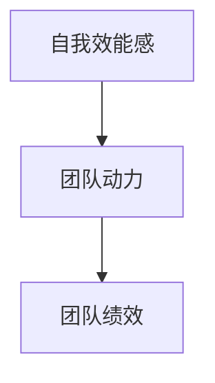

**核心算法原理讲解**：
提升自我效能感的算法原理可以理解为通过增强个体对成功的预期，提高其自信心。具体步骤如下：

1. **技能训练**：通过培训和学习，提升团队成员的技能水平。
2. **成功案例分享**：分享团队成员的成功经验，增强其对成功的信心。
3. **目标设定**：设定具有挑战性但可实现的目标，激发团队成员的动力。

**数学模型和公式**：
设\( SE \)为自我效能感，\( TD \)为团队动力，\( TP \)为团队绩效，则自我效能感与团队动力的关系可以表示为：

\[ TD = f(SE) \]

其中，\( f \)为激励函数，可以根据实际情况进行调整。

**举例说明**：
例如，一个团队在准备一个重要的项目时，组织了专项培训，并设定了明确的目标，团队成员在完成培训后，自我效能感显著提高，从而为团队带来了更强的动力。

##### 2.2 内在动机与外在动机的平衡

**背景介绍**：
内在动机是指个体因自身兴趣和内在需求而从事某项活动，而外在动机则是指个体因外部奖励或压力而从事某项活动。在团队激励中，如何平衡内在动机与外在动机是一个重要问题。

**核心概念与联系**：
内在动机与外在动机之间存在相互影响的关系。适当的内在动机能够提升工作满意度，而过度依赖外在动机可能会导致疲劳和厌倦。

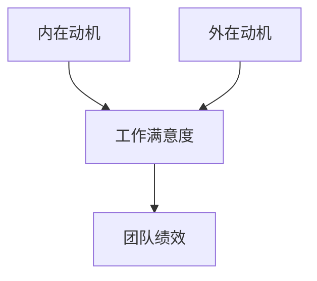

**核心算法原理讲解**：
平衡内在动机与外在动机的算法原理可以理解为通过激发个体内在兴趣，同时设置合理的外在奖励机制。具体步骤如下：

1. **内在激励**：通过设置有意义的工作任务，激发个体的内在兴趣。
2. **外在奖励**：设置合理的奖励机制，如奖金、荣誉等，以激励团队成员。
3. **反馈机制**：及时给予反馈，确保内在动机与外在动机的协调。

**数学模型和公式**：
设\( IM \)为内在动机，\( OM \)为外在动机，\( WS \)为工作满意度，\( TP \)为团队绩效，则内在动机与外在动机的平衡关系可以表示为：

\[ WS = f(IM, OM) \]

其中，\( f \)为激励函数，可以根据实际情况进行调整。

**举例说明**：
例如，一个团队在完成项目后，除了给予奖金奖励，还组织了一次团队活动，以增强团队成员的内在兴趣和团队凝聚力，从而实现了内在动机与外在动机的平衡。

##### 2.3 团队认同感与归属感

**背景介绍**：
团队认同感是指个体对团队目标的认同和参与感，归属感则是指个体在团队中的归属感和归属感。在团队激励中，团队认同感和归属感对于提升团队整体效能至关重要。

**核心概念与联系**：
团队认同感与归属感之间存在密切的关系。高团队认同感的个体更容易产生强烈的归属感，从而为团队带来更大的凝聚力。

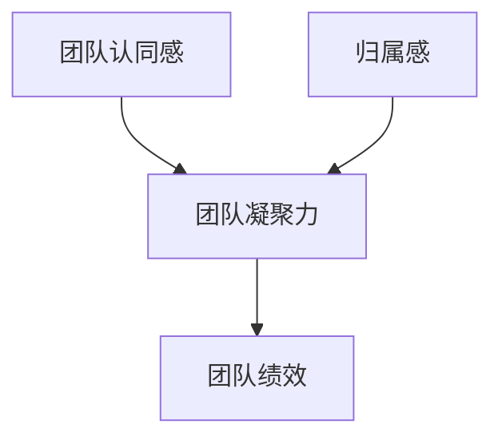

**核心算法原理讲解**：
提升团队认同感和归属感的算法原理可以理解为通过塑造团队价值观、加强团队沟通和共同目标设定。具体步骤如下：

1. **价值观塑造**：通过共同价值观的塑造，增强团队成员的认同感。
2. **沟通机制**：建立良好的沟通机制，确保团队成员之间的信息共享和协作。
3. **共同目标设定**：设定明确的共同目标，激发团队成员的归属感。

**数学模型和公式**：
设\( ID \)为团队认同感，\( AL \)为归属感，\( TP \)为团队绩效，则团队认同感和归属感的关系可以表示为：

\[ TP = f(ID, AL) \]

其中，\( f \)为激励函数，可以根据实际情况进行调整。

**举例说明**：
例如，一个团队在组建之初，就通过共同价值观的讨论和沟通机制的建立，使团队成员产生了强烈的团队认同感和归属感，从而为团队的高效运作奠定了基础。

#### 第3章：构建积极的团队文化

##### 3.1 团队价值观的塑造与传播

**背景介绍**：
团队价值观是团队内部共同遵守的基本信念和原则，是团队文化的核心。一个明确的团队价值观能够引导团队成员的行为，提升团队凝聚力。

**核心概念与联系**：
团队价值观与团队文化之间存在密切的关系。团队价值观是团队文化的基础，而团队文化则是团队价值观的具体体现。

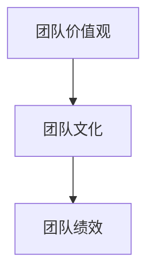

**核心算法原理讲解**：
塑造和传播团队价值观的算法原理可以理解为通过价值观的讨论、宣传和落实。具体步骤如下：

1. **价值观讨论**：组织团队成员进行价值观的讨论，确保每个成员都认同并接受团队价值观。
2. **价值观宣传**：通过内部刊物、培训等方式，宣传团队价值观，使其深入人心。
3. **价值观落实**：在日常工作中，将团队价值观融入到每个决策和行为中，确保其得到落实。

**数学模型和公式**：
设\( V \)为团队价值观，\( C \)为团队文化，\( TP \)为团队绩效，则团队价值观与团队文化的关系可以表示为：

\[ TP = f(V, C) \]

其中，\( f \)为激励函数，可以根据实际情况进行调整。

**举例说明**：
例如，一个团队在组建之初，就通过多次讨论和培训，明确了“客户至上、创新求变”的团队价值观，并在日常工作中不断强化，使团队成员都对此价值观深信不疑。

##### 3.2 良好沟通与冲突解决

**背景介绍**：
良好沟通是团队协作的基础，是解决冲突的关键。在一个高效的团队中，良好的沟通能够促进信息的传递和理解，减少误解和矛盾。

**核心概念与联系**：
良好沟通与团队绩效之间存在密切的关系。良好的沟通能够提升团队协作效率，解决冲突，从而提高团队绩效。

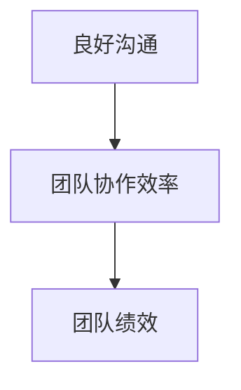

**核心算法原理讲解**：
实现良好沟通的算法原理可以理解为通过沟通技巧的培训、沟通机制的建立和沟通效果的评估。具体步骤如下：

1. **沟通技巧培训**：通过培训，提升团队成员的沟通技巧，确保沟通的有效性。
2. **沟通机制建立**：建立完善的沟通机制，确保信息传递的畅通无阻。
3. **沟通效果评估**：定期评估沟通效果，及时发现和解决沟通中的问题。

**数学模型和公式**：
设\( G \)为良好沟通，\( CE \)为沟通效果，\( TP \)为团队绩效，则良好沟通与团队绩效的关系可以表示为：

\[ TP = f(G, CE) \]

其中，\( f \)为激励函数，可以根据实际情况进行调整。

**举例说明**：
例如，一个团队通过定期举行沟通会议、设立信息反馈渠道等方式，建立了良好的沟通机制，确保团队成员能够及时了解项目进展和问题，从而提高了团队协作效率。

##### 3.3 团队协作与共同目标设定

**背景介绍**：
团队协作是团队高效运作的关键，而共同目标则是团队协作的方向和动力。一个明确的共同目标能够引导团队成员共同努力，实现团队的目标。

**核心概念与联系**：
团队协作与共同目标之间存在密切的关系。团队协作是实现共同目标的手段，而共同目标是团队协作的导向。

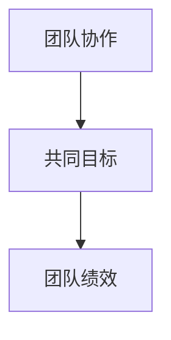

**核心算法原理讲解**：
实现团队协作和共同目标的算法原理可以理解为通过目标设定、协作机制建立和绩效评估。具体步骤如下：

1. **目标设定**：明确团队的目标，并将其分解为具体的可执行任务。
2. **协作机制建立**：建立有效的协作机制，确保团队成员之间的信息共享和协作。
3. **绩效评估**：定期评估团队绩效，确保共同目标的实现。

**数学模型和公式**：
设\( TC \)为团队协作，\( CT \)为共同目标，\( TP \)为团队绩效，则团队协作与共同目标的关系可以表示为：

\[ TP = f(TC, CT) \]

其中，\( f \)为激励函数，可以根据实际情况进行调整。

**举例说明**：
例如，一个团队在制定项目计划时，明确项目的共同目标，并通过任务分解和协作机制建立，确保每个成员都能清晰了解自己的任务和责任，从而提高了团队协作效率。

#### 第4章：情感管理

##### 4.1 情感管理的重要性

**背景介绍**：
情感管理是团队管理中不可忽视的一个重要方面。随着工作压力的增大和人际关系的复杂化，情感管理对于团队的整体效能和成员的幸福指数都有着深远的影响。

**核心概念与联系**：
情感管理与团队绩效、员工满意度和团队凝聚力之间存在密切的关系。良好的情感管理能够提升员工的工作满意度，增强团队凝聚力，从而提高团队绩效。

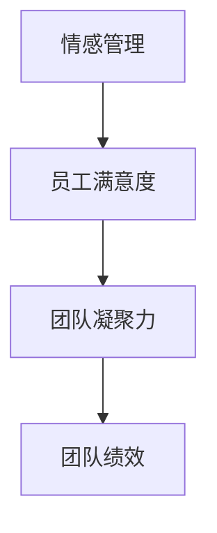

**核心算法原理讲解**：
情感管理的算法原理可以理解为通过情感识别、情感表达和情感调节，实现对团队情感的有效管理。具体步骤如下：

1. **情感识别**：通过观察、倾听和反馈，识别团队成员的情感状态。
2. **情感表达**：鼓励团队成员表达自己的情感，建立开放的沟通氛围。
3. **情感调节**：通过调整工作环境、提供支持和资源，帮助团队成员调节情感，提升情绪管理能力。

**数学模型和公式**：
设\( EM \)为情感管理，\( WS \)为员工满意度，\( CP \)为团队凝聚力，\( TP \)为团队绩效，则情感管理与团队绩效的关系可以表示为：

\[ TP = f(EM, WS, CP) \]

其中，\( f \)为激励函数，可以根据实际情况进行调整。

**举例说明**：
例如，一个团队在面临项目压力时，通过定期的团队活动和情感支持，帮助成员缓解工作压力，提升情绪管理能力，从而提高了团队的整体效能。

##### 4.2 建立情感连接的技巧

**背景介绍**：
建立情感连接是团队情感管理的关键。通过建立情感连接，团队成员能够更好地理解和支持彼此，从而增强团队的凝聚力和协作效率。

**核心概念与联系**：
建立情感连接与团队认同感、信任和归属感之间存在密切的关系。情感连接能够促进团队成员之间的情感互动，提升团队的整体情感氛围。

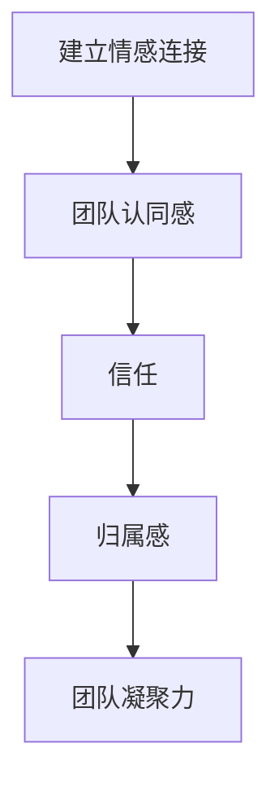

**核心算法原理讲解**：
建立情感连接的算法原理可以理解为通过共同经历、情感支持和情感共鸣，建立团队成员之间的深厚情感纽带。具体步骤如下：

1. **共同经历**：通过共同的项目经历和团队活动，增强团队成员之间的情感纽带。
2. **情感支持**：在团队成员遇到困难或挑战时，提供情感支持和鼓励。
3. **情感共鸣**：通过倾听和分享，理解并共鸣团队成员的情感，建立深厚的情感连接。

**数学模型和公式**：
设\( EC \)为建立情感连接，\( ID \)为团队认同感，\( TR \)为信任，\( AL \)为归属感，\( CP \)为团队凝聚力，则建立情感连接与团队凝聚力的关系可以表示为：

\[ CP = f(EC, ID, TR, AL) \]

其中，\( f \)为激励函数，可以根据实际情况进行调整。

**举例说明**：
例如，一个团队在完成一个重要项目后，组织了一次团建活动，通过共同的经历和情感的交流，团队成员之间的情感连接得到了进一步加强，团队凝聚力也随之提升。

##### 4.3 情感管理案例解析

**背景介绍**：
情感管理在实践中的应用广泛，不同的团队和场景需要采取不同的情感管理策略。以下将通过两个案例，解析情感管理的实践方法和效果。

**案例一：初创企业中的情感管理**

**情境描述**：
某初创企业正处于快速发展阶段，团队成员压力较大，情绪波动频繁。

**情感管理策略**：
1. **情感识别**：通过定期的员工座谈会和一对一沟通，了解团队成员的情感状态。
2. **情感支持**：在团队成员遇到困难时，及时提供情感支持，减轻其工作压力。
3. **情感调节**：通过团队活动和团建活动，帮助团队成员缓解压力，提升情绪管理能力。

**效果分析**：
通过情感管理，团队成员的情绪得到了有效调节，工作压力得到了缓解，团队凝聚力显著提升，企业的整体效能也随之提高。

**案例二：跨国公司中的情感管理**

**情境描述**：
某跨国公司在全球范围内运营，团队成员来自不同的国家和地区，文化差异显著。

**情感管理策略**：
1. **情感共鸣**：通过跨文化培训和团队活动，促进团队成员之间的情感共鸣。
2. **情感支持**：在团队成员遇到文化冲突时，提供跨文化支持，帮助他们适应新的环境。
3. **情感调节**：通过定期的情感交流和团队建设活动，增强团队成员之间的情感连接。

**效果分析**：
通过情感管理，团队成员的文化差异得到了有效融合，团队凝聚力显著提升，企业的全球业务运营也更加顺畅。

#### 第5章：认可与反馈

##### 5.1 正面认可的力量

**背景介绍**：
正面认可是团队管理中的一种重要激励手段。通过正面认可，团队管理者能够激励团队成员，提升其工作积极性和满意度。

**核心概念与联系**：
正面认可与员工满意度、工作积极性和团队凝聚力之间存在密切的关系。正面认可能够增强员工对工作的认同感和归属感，从而提升团队的整体效能。

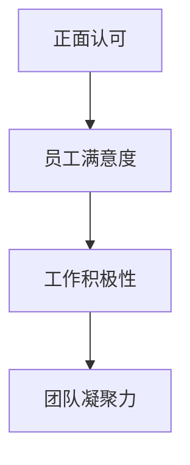

**核心算法原理讲解**：
正面认可的算法原理可以理解为通过及时、明确和真诚的认可，激发团队成员的内在动力。具体步骤如下：

1. **及时认可**：在团队成员完成任务或取得成绩时，及时给予认可。
2. **明确认可**：明确指出认可的原因和具体表现，让团队成员感受到认可的真实性和价值。
3. **真诚认可**：真诚地表达对团队成员的认可，让他们感受到团队管理者的关心和支持。

**数学模型和公式**：
设\( PA \)为正面认可，\( WS \)为员工满意度，\( WP \)为工作积极性，\( CP \)为团队凝聚力，则正面认可与团队绩效的关系可以表示为：

\[ TP = f(PA, WS, WP, CP) \]

其中，\( f \)为激励函数，可以根据实际情况进行调整。

**举例说明**：
例如，一个团队在完成一个重要项目后，团队管理者通过公开表扬和奖励，及时认可了团队成员的辛勤工作和出色表现，从而提升了团队的整体士气。

##### 5.2 有效反馈的技巧

**背景介绍**：
有效反馈是团队管理中的一种重要沟通手段。通过有效反馈，团队管理者能够帮助团队成员认识到自己的优点和不足，从而提升其工作表现。

**核心概念与联系**：
有效反馈与员工发展、工作绩效和团队协作之间存在密切的关系。有效反馈能够促进团队成员的成长，提升工作绩效，增强团队协作。

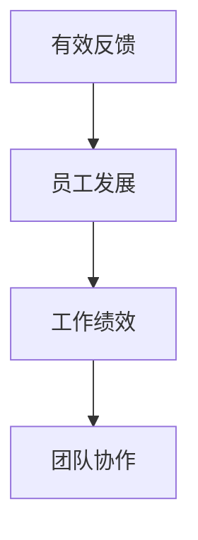

**核心算法原理讲解**：
有效反馈的算法原理可以理解为通过具体、建设性和及时的方式，提供反馈。具体步骤如下：

1. **具体反馈**：明确指出团队成员的优点和不足，避免模糊和抽象的评价。
2. **建设性反馈**：提供具体的改进建议，帮助团队成员提升工作表现。
3. **及时反馈**：在团队成员完成任务或行为发生后，及时给予反馈，确保其有足够的时间进行改进。

**数学模型和公式**：
设\( EF \)为有效反馈，\( ED \)为员工发展，\( WP \)为工作绩效，\( TC \)为团队协作，则有效反馈与团队绩效的关系可以表示为：

\[ TP = f(EF, ED, WP, TC) \]

其中，\( f \)为激励函数，可以根据实际情况进行调整。

**举例说明**：
例如，一个团队在项目评估会议上，团队管理者对每个成员的表现进行了详细分析和评价，同时提供了具体的改进建议，从而帮助团队成员更好地发展。

##### 5.3 反馈与激励的结合

**背景介绍**：
在团队管理中，将反馈与激励相结合，能够实现更好的激励效果。通过结合反馈和激励，团队管理者能够既帮助团队成员提升工作表现，又激发其内在动力。

**核心概念与联系**：
反馈与激励的结合与员工满意度、工作积极性和团队凝聚力之间存在密切的关系。结合反馈和激励，能够提升员工的工作满意度，增强其工作积极性，从而提高团队凝聚力。

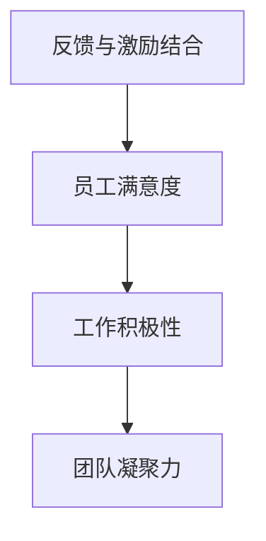

**核心算法原理讲解**：
反馈与激励结合的算法原理可以理解为通过及时、明确和真诚的反馈，结合合理的激励手段，实现激励效果的最大化。具体步骤如下：

1. **反馈与激励匹配**：根据团队成员的表现，选择合适的反馈方式和激励手段。
2. **及时反馈与激励**：在团队成员完成任务或行为发生后，及时给予反馈和激励。
3. **真诚反馈与激励**：真诚地表达对团队成员的认可和期望，确保反馈和激励的真诚性和有效性。

**数学模型和公式**：
设\( EF \)为有效反馈，\( IM \)为激励手段，\( WS \)为员工满意度，\( WP \)为工作积极性，\( CP \)为团队凝聚力，则反馈与激励结合与团队绩效的关系可以表示为：

\[ TP = f(EF, IM, WS, WP, CP) \]

其中，\( f \)为激励函数，可以根据实际情况进行调整。

**举例说明**：
例如，一个团队在项目结束后，团队管理者通过公开表扬和奖励，及时认可了团队成员的出色表现，同时给出了具体的改进建议，从而实现了反馈与激励的结合，提升了团队的整体效能。

#### 第6章：成长与职业发展

##### 6.1 提供成长机会的重要性

**背景介绍**：
在快速变化的工作环境中，提供成长机会对于团队成员的职业发展和团队的整体效能至关重要。成长机会能够激发员工的内在动力，提升其工作满意度和忠诚度。

**核心概念与联系**：
提供成长机会与员工满意度、工作积极性和团队凝聚力之间存在密切的关系。成长机会能够帮助员工提升技能和知识，增强其对工作的认同感和归属感，从而提高团队的整体效能。

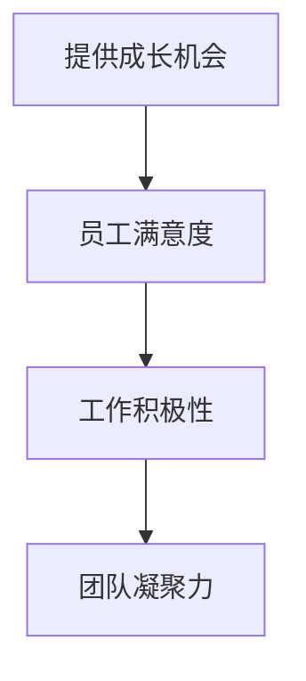

**核心算法原理讲解**：
提供成长机会的算法原理可以理解为通过培训、项目参与和个人发展计划，为团队成员提供多样化的成长途径。具体步骤如下：

1. **培训计划**：根据团队成员的需求，制定个性化的培训计划，提升其专业技能。
2. **项目参与**：鼓励团队成员参与多样化的项目，拓宽其工作视野和经验。
3. **个人发展计划**：与团队成员共同制定个人发展计划，明确其职业目标和成长路径。

**数学模型和公式**：
设\( GC \)为提供成长机会，\( WS \)为员工满意度，\( WP \)为工作积极性，\( CP \)为团队凝聚力，则提供成长机会与团队绩效的关系可以表示为：

\[ TP = f(GC, WS, WP, CP) \]

其中，\( f \)为激励函数，可以根据实际情况进行调整。

**举例说明**：
例如，一个团队通过定期组织技术培训、项目轮岗和领导力培训，为团队成员提供了丰富的成长机会，从而提升了团队的整体效能。

##### 6.2 职业发展的激励机制

**背景介绍**：
职业发展是团队成员长期关注的重要问题。通过有效的激励机制，团队能够吸引和留住优秀人才，提升其工作积极性和满意度。

**核心概念与联系**：
职业发展的激励机制与员工满意度、工作积极性和团队凝聚力之间存在密切的关系。有效的激励机制能够帮助员工实现职业目标，增强其对工作的认同感和归属感。

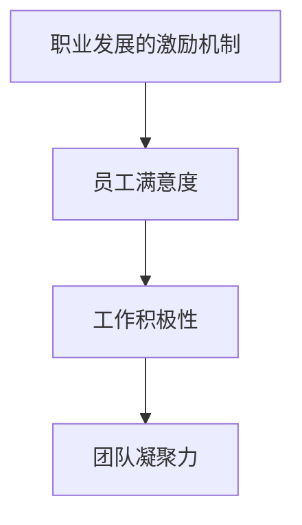

**核心算法原理讲解**：
职业发展激励机制的算法原理可以理解为通过晋升机会、薪酬调整和职业发展规划，为团队成员提供职业发展支持。具体步骤如下：

1. **晋升机会**：为表现出色的团队成员提供晋升机会，激励其不断提升。
2. **薪酬调整**：根据团队成员的表现和职业发展，适时调整其薪酬水平。
3. **职业发展规划**：与团队成员共同制定职业发展规划，明确其职业目标和成长路径。

**数学模型和公式**：
设\( PD \)为职业发展的激励机制，\( WS \)为员工满意度，\( WP \)为工作积极性，\( CP \)为团队凝聚力，则职业发展激励机制与团队绩效的关系可以表示为：

\[ TP = f(PD, WS, WP, CP) \]

其中，\( f \)为激励函数，可以根据实际情况进行调整。

**举例说明**：
例如，一个团队通过建立明确的晋升机制、定期评估员工表现和提供职业发展规划，为团队成员提供了良好的职业发展支持，从而提升了团队的整体效能。

##### 6.3 成长案例与策略分析

**背景介绍**：
成长案例与策略分析是团队激励的重要组成部分。通过分析成功案例和策略，团队能够更好地理解成长激励的有效方法，从而提升自身的激励效果。

**核心概念与联系**：
成长案例与策略分析与员工满意度、工作积极性和团队凝聚力之间存在密切的关系。成功案例和策略分析能够为团队成员提供具体的成长路径和激励手段，从而提升其工作满意度和积极性。

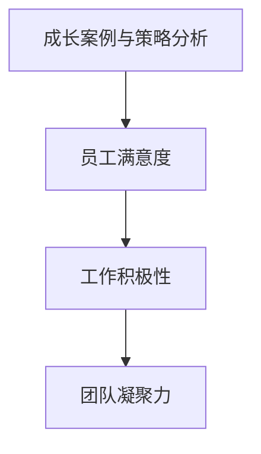

**核心算法原理讲解**：
成长案例与策略分析的算法原理可以理解为通过收集和分析成功案例，提炼出有效的激励策略，并将其应用于团队管理中。具体步骤如下：

1. **案例收集**：收集团队内外部成功的成长案例，包括个人成长和团队成长。
2. **案例分析**：对收集的案例进行分析，提炼出有效的激励策略。
3. **策略应用**：将提炼出的激励策略应用于团队管理，提升团队的整体效能。

**数学模型和公式**：
设\( CSA \)为成长案例与策略分析，\( WS \)为员工满意度，\( WP \)为工作积极性，\( CP \)为团队凝聚力，则成长案例与策略分析与团队绩效的关系可以表示为：

\[ TP = f(CSA, WS, WP, CP) \]

其中，\( f \)为激励函数，可以根据实际情况进行调整。

**举例说明**：
例如，一个团队通过分析成功员工的成长案例，发现提供多样化成长机会和明确的职业发展路径是激励员工的重要手段，从而制定了相应的激励策略，提升了团队的整体效能。

#### 第7章：公平与正义

##### 7.1 公平在团队管理中的意义

**背景介绍**：
公平是团队管理中的重要原则，它关系到团队成员的满意度、工作积极性和团队的长期发展。公平的团队管理能够增强团队成员的信任和归属感，提高团队的整体效能。

**核心概念与联系**：
公平与员工满意度、工作积极性和团队凝聚力之间存在密切的关系。公平的管理能够确保团队成员得到应有的待遇和认可，从而增强其对团队的信任和归属感。

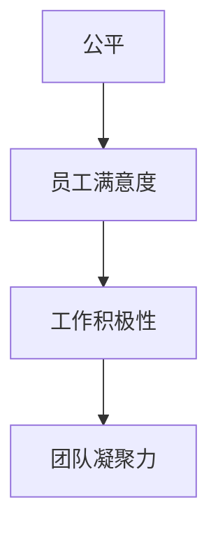

**核心算法原理讲解**：
公平在团队管理中的算法原理可以理解为通过公平的分配、透明的决策和公正的评价，确保团队管理的公平性。具体步骤如下：

1. **公平分配**：确保团队成员在资源、机会和奖励上的公平分配。
2. **透明决策**：确保决策过程的透明，使团队成员能够理解和接受决策结果。
3. **公正评价**：确保对团队成员的评价和奖励公正无私，避免偏见和歧视。

**数学模型和公式**：
设\( F \)为公平，\( WS \)为员工满意度，\( WP \)为工作积极性，\( CP \)为团队凝聚力，则公平与团队绩效的关系可以表示为：

\[ TP = f(F, WS, WP, CP) \]

其中，\( f \)为激励函数，可以根据实际情况进行调整。

**举例说明**：
例如，一个团队在项目奖金的分配上，采用了公开透明的分配机制，确保每位团队成员的贡献得到公平的认可，从而提升了团队成员的满意度和积极性。

##### 7.2 创造正义感的团队环境

**背景介绍**：
正义感是团队成员对公平和正义的感知。一个充满正义感的团队环境能够增强团队成员的归属感和忠诚度，提高团队的整体效能。

**核心概念与联系**：
正义感与员工满意度、工作积极性和团队凝聚力之间存在密切的关系。正义感的团队环境能够确保团队成员感受到公平和公正，从而增强其对团队的认同和忠诚。

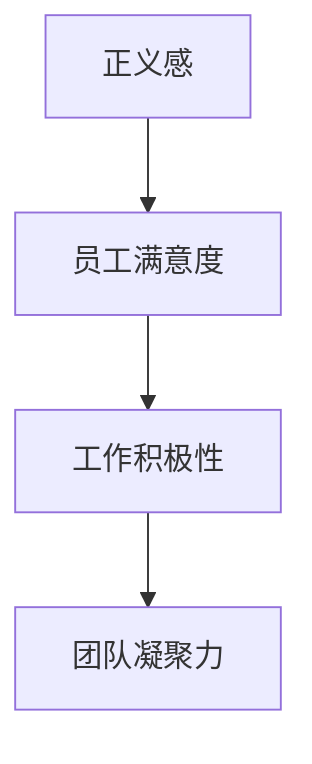

**核心算法原理讲解**：
创造正义感的团队环境的算法原理可以理解为通过建立公平的制度和透明的流程，确保团队管理的正义性。具体步骤如下：

1. **公平制度**：建立公平的考核和奖励制度，确保团队成员在制度面前人人平等。
2. **透明流程**：确保团队决策和执行过程的透明，使团队成员能够了解和监督团队的工作。
3. **公正监督**：建立公正的监督机制，确保团队成员的行为和决策符合道德和职业道德标准。

**数学模型和公式**：
设\( JG \)为正义感，\( WS \)为员工满意度，\( WP \)为工作积极性，\( CP \)为团队凝聚力，则正义感与团队绩效的关系可以表示为：

\[ TP = f(JG, WS, WP, CP) \]

其中，\( f \)为激励函数，可以根据实际情况进行调整。

**举例说明**：
例如，一个团队在项目管理中，采用了公开透明的项目评估和分配机制，确保团队成员能够公平地参与项目管理和收益分配，从而增强了团队成员的正义感。

##### 7.3 公平与激励机制的平衡

**背景介绍**：
在团队管理中，公平与激励机制之间存在一定的矛盾。公平强调的是团队成员的平等和公正，而激励机制则侧重于激发团队成员的内在动力。如何在两者之间取得平衡，是团队管理中的一项重要任务。

**核心概念与联系**：
公平与激励机制之间的平衡与员工满意度、工作积极性和团队凝聚力之间存在密切的关系。平衡得当，能够既保障公平，又激发团队成员的内在动力，从而提高团队的整体效能。

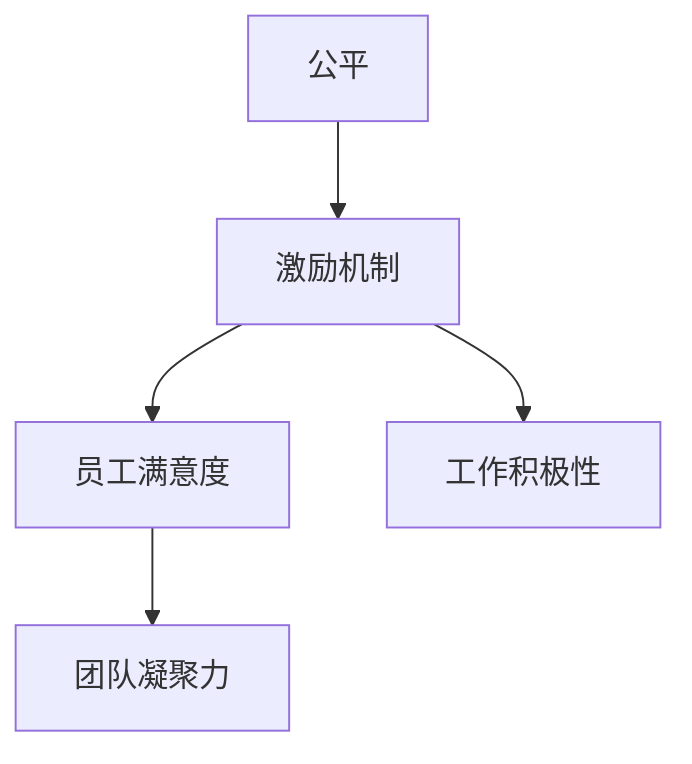

**核心算法原理讲解**：
公平与激励机制平衡的算法原理可以理解为通过多样化的激励手段和动态调整机制，实现公平与激励的平衡。具体步骤如下：

1. **多样化激励**：采用多种激励手段，既包括物质激励，也包括非物质激励，以满足团队成员的不同需求。
2. **动态调整**：根据团队成员的表现和需求，动态调整激励手段和激励力度，确保公平与激励的平衡。
3. **透明反馈**：确保激励机制的透明，使团队成员了解激励标准和过程，增强对激励机制的信任。

**数学模型和公式**：
设\( F \)为公平，\( IM \)为激励机制，\( WS \)为员工满意度，\( WP \)为工作积极性，\( CP \)为团队凝聚力，则公平与激励机制的关系可以表示为：

\[ TP = f(F, IM, WS, WP, CP) \]

其中，\( f \)为激励函数，可以根据实际情况进行调整。

**举例说明**：
例如，一个团队在激励机制的制定中，既考虑到了公平原则，又采用了多样化的激励手段，通过定期的绩效评估和反馈，动态调整激励力度，从而实现了公平与激励的平衡。

#### 第8章：团队激励评估与改进

##### 8.1 团队激励评估的方法

**背景介绍**：
团队激励评估是团队管理中的一项重要工作，通过评估激励措施的有效性，团队能够不断优化激励策略，提高整体效能。

**核心概念与联系**：
团队激励评估与员工满意度、工作积极性和团队绩效之间存在密切的关系。有效的激励评估能够帮助团队管理者了解激励措施的实际效果，从而进行调整和优化。

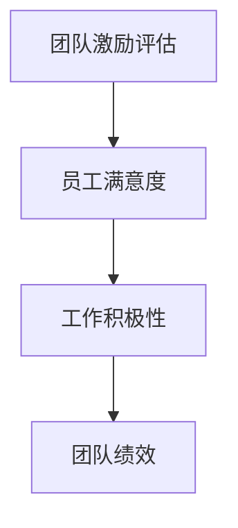

**核心算法原理讲解**：
团队激励评估的算法原理可以理解为通过定量和定性相结合的方法，对激励措施的效果进行综合评估。具体步骤如下：

1. **定量评估**：通过数据分析和统计方法，量化评估激励措施的效果。
2. **定性评估**：通过访谈、问卷调查和观察等方法，深入了解激励措施的实际效果。
3. **综合评估**：结合定量和定性评估结果，综合评估激励措施的有效性。

**数学模型和公式**：
设\( EA \)为团队激励评估，\( WS \)为员工满意度，\( WP \)为工作积极性，\( CP \)为团队绩效，则团队激励评估与团队绩效的关系可以表示为：

\[ TP = f(EA, WS, WP, CP) \]

其中，\( f \)为激励函数，可以根据实际情况进行调整。

**举例说明**：
例如，一个团队通过定期的员工满意度调查和绩效评估，量化分析激励措施的实际效果，从而不断优化激励策略，提高团队的整体效能。

##### 8.2 激励策略的调整与优化

**背景介绍**：
激励策略的调整与优化是团队激励管理中的一项关键工作。通过不断调整和优化激励策略，团队能够更好地适应环境变化，提高激励效果。

**核心概念与联系**：
激励策略的调整与优化与员工满意度、工作积极性和团队绩效之间存在密切的关系。有效的调整和优化能够确保激励策略与团队需求相匹配，从而提高团队的整体效能。

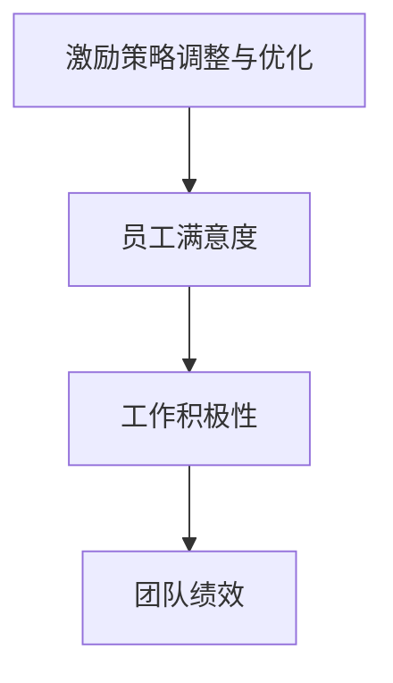

**核心算法原理讲解**：
激励策略的调整与优化的算法原理可以理解为通过需求分析、效果评估和策略调整，实现激励策略的优化。具体步骤如下：

1. **需求分析**：分析团队成员的需求，明确激励策略的目标和方向。
2. **效果评估**：评估现有激励策略的效果，找出需要改进的方面。
3. **策略调整**：根据效果评估结果，对激励策略进行调整和优化。

**数学模型和公式**：
设\( SA \)为激励策略调整，\( OA \)为激励策略优化，\( WS \)为员工满意度，\( WP \)为工作积极性，\( CP \)为团队绩效，则激励策略调整与优化的关系可以表示为：

\[ TP = f(SA, OA, WS, WP, CP) \]

其中，\( f \)为激励函数，可以根据实际情况进行调整。

**举例说明**：
例如，一个团队在实施新的激励策略后，通过定期的效果评估，发现某些方面的激励效果不佳，从而对激励策略进行了调整和优化，提高了团队的整体效能。

##### 8.3 团队激励的长期效果跟踪

**背景介绍**：
团队激励是一个长期的过程，其效果需要持续跟踪和评估。通过长期效果跟踪，团队能够了解激励策略的持续性和稳定性，从而进行相应的调整和优化。

**核心概念与联系**：
团队激励的长期效果跟踪与员工满意度、工作积极性和团队绩效之间存在密切的关系。长期效果跟踪能够帮助团队管理者了解激励策略的长期效果，确保其与团队需求相匹配。

```mermaid
graph TD
A[团队激励的长期效果跟踪] --> B[员工满意度]
B --> C[工作积极性]
C --> D[团队绩效]
```

**核心算法原理讲解**：
团队激励的长期效果跟踪的算法原理可以理解为通过定期评估和持续监控，跟踪激励策略的长期效果。具体步骤如下：

1. **定期评估**：定期对激励策略的效果进行评估，了解其长期效果。
2. **持续监控**：通过持续监控，发现和解决激励策略中的问题。
3. **调整优化**：根据评估和监控结果，对激励策略进行调整和优化。

**数学模型和公式**：
设\( LTF \)为团队激励的长期效果跟踪，\( WS \)为员工满意度，\( WP \)为工作积极性，\( CP \)为团队绩效，则团队激励的长期效果跟踪与团队绩效的关系可以表示为：

\[ TP = f(LTF, WS, WP, CP) \]

其中，\( f \)为激励函数，可以根据实际情况进行调整。

**举例说明**：
例如，一个团队通过定期的员工满意度调查和绩效评估，持续跟踪激励策略的长期效果，及时发现和解决激励策略中的问题，从而确保激励策略的长期有效性和稳定性。

#### 第9章：案例研究：成功团队激励策略

##### 9.1 案例一：初创企业的团队激励策略

**情境描述**：
某初创企业正处于快速发展阶段，团队成员年轻且充满激情，但同时也面临着较大的工作压力和不确定性。

**激励策略**：
1. **情感管理**：通过定期的团建活动和情感交流，缓解团队成员的工作压力，增强团队的凝聚力。
2. **认可与反馈**：通过公开表彰和奖励，及时认可团队成员的出色表现，提升其工作积极性。
3. **成长与发展**：提供多样化的培训和学习机会，帮助团队成员提升技能和知识，实现职业发展。
4. **公平与正义**：建立公开透明的考核和分配机制，确保团队成员在机会、资源和奖励上的公平性。

**效果分析**：
通过上述激励策略，团队成员的工作满意度和积极性显著提升，团队凝聚力增强，企业的快速发展也得到了有力保障。

##### 9.2 案例二：跨国公司的团队激励策略

**情境描述**：
某跨国公司拥有来自不同国家和地区的团队成员，文化差异显著，团队协作面临一定挑战。

**激励策略**：
1. **文化融合**：通过跨文化培训和团队活动，促进团队成员之间的文化融合，增强团队凝聚力。
2. **认可与反馈**：通过全球范围内的员工表彰和奖励，及时认可团队成员的出色表现，提升其工作积极性。
3. **成长与发展**：提供国际化的职业发展机会，包括海外培训和晋升机会，激励团队成员追求卓越。
4. **公平与正义**：建立全球统一的考核和分配机制，确保团队成员在全球范围内的公平性和正义。

**效果分析**：
通过上述激励策略，团队成员的文化融合度提升，团队凝聚力增强，企业的国际化运营也更加顺畅。

##### 9.3 案例分析与启示

**情境描述**：
通过对上述两个案例的分析，我们可以发现，成功的团队激励策略具有以下几个共同特点：

1. **注重情感管理**：通过情感管理，缓解团队成员的工作压力，增强团队的凝聚力。
2. **认可与反馈**：通过及时、明确的认可与反馈，提升团队成员的工作积极性和满意度。
3. **成长与发展**：提供多样化的成长机会，帮助团队成员实现职业发展，提升团队的整体效能。
4. **公平与正义**：建立公平、透明的机制，确保团队成员的公平待遇，增强团队的正义感。

**启示**：
这些成功案例为团队管理者提供了宝贵的启示，即通过综合运用多种激励手段，结合团队成员的需求和实际情况，制定个性化的激励策略，能够有效提升团队的整体效能和成员的满意度。

#### 第10章：未来趋势与挑战

##### 10.1 团队激励的趋势展望

**背景介绍**：
随着社会和科技的不断发展，团队激励也在不断演变。未来团队激励将更加注重个性化、多元化和数字化，以适应复杂多变的工作环境。

**核心概念与联系**：
未来团队激励的趋势与员工需求、技术发展和组织变革之间存在密切的关系。未来的团队激励将更加关注员工的个性化需求，借助技术手段实现精准激励，同时与组织变革同步，确保激励策略的有效性。

```mermaid
graph TD
A[员工需求] --> B[团队激励趋势]
B --> C[技术发展]
C --> D[组织变革]
```

**核心算法原理讲解**：
未来团队激励的趋势展望的算法原理可以理解为通过数据分析和智能算法，实现个性化激励和精准激励。具体步骤如下：

1. **数据收集**：收集员工的个人数据和团队绩效数据，分析其需求和表现。
2. **智能分析**：利用机器学习和人工智能技术，对数据进行分析和建模，预测员工的激励需求。
3. **个性化激励**：根据员工的个性化需求，设计个性化的激励方案。
4. **精准激励**：通过智能算法，实时调整激励策略，确保激励效果的最大化。

**数学模型和公式**：
设\( D \)为员工数据，\( IA \)为智能分析，\( PI \)为个性化激励，\( PA \)为精准激励，则未来团队激励趋势与团队绩效的关系可以表示为：

\[ TP = f(D, IA, PI, PA) \]

其中，\( f \)为激励函数，可以根据实际情况进行调整。

**举例说明**：
例如，一个团队通过数据分析，发现某些成员在项目进展中表现出强烈的创新意愿，因此制定了针对性的激励方案，激发了团队的创造力。

##### 10.2 面临的挑战与应对策略

**背景介绍**：
在实现未来团队激励的趋势过程中，团队管理者将面临诸多挑战，包括技术挑战、管理挑战和人文挑战。

**核心概念与联系**：
面临的挑战与团队绩效、员工满意度和团队凝聚力之间存在密切的关系。有效的应对策略能够帮助团队管理者克服挑战，确保激励策略的有效性。

```mermaid
graph TD
A[面临的挑战] --> B[团队绩效]
B --> C[员工满意度]
C --> D[团队凝聚力]
```

**核心算法原理讲解**：
应对挑战的算法原理可以理解为通过系统分析和策略规划，制定针对性的应对措施。具体步骤如下：

1. **问题识别**：通过数据分析和员工反馈，识别团队激励过程中存在的问题。
2. **策略规划**：根据问题识别结果，制定针对性的应对策略。
3. **实施与监控**：实施应对策略，并持续监控其效果，确保其有效性。

**数学模型和公式**：
设\( C \)为面临的挑战，\( AS \)为应对策略，\( TP \)为团队绩效，\( WS \)为员工满意度，\( CP \)为团队凝聚力，则应对策略与团队绩效的关系可以表示为：

\[ TP = f(C, AS, WS, CP) \]

其中，\( f \)为激励函数，可以根据实际情况进行调整。

**举例说明**：
例如，一个团队在面对技术挑战时，通过引进新的管理工具和培训，提升了团队成员的技术能力，从而有效应对了挑战。

##### 10.3 持续改进与创新

**背景介绍**：
持续改进与创新是团队激励管理的核心。通过持续改进和创新，团队能够不断优化激励策略，提升整体效能。

**核心概念与联系**：
持续改进与创新与团队绩效、员工满意度和团队凝聚力之间存在密切的关系。持续改进和创新能够激发团队的活力，提升团队的竞争力和创新能力。

```mermaid
graph TD
A[持续改进与创新] --> B[团队绩效]
B --> C[员工满意度]
C --> D[团队凝聚力]
```

**核心算法原理讲解**：
持续改进与创新的算法原理可以理解为通过建立创新机制、激励机制和反馈机制，实现团队的持续改进。具体步骤如下：

1. **创新机制**：建立创新机制，鼓励团队成员提出创新建议。
2. **激励机制**：建立激励机制，奖励创新行为和成果。
3. **反馈机制**：建立反馈机制，及时收集和反馈团队成员的创新建议和意见。

**数学模型和公式**：
设\( CI \)为持续改进与创新，\( IP \)为创新机制，\( IM \)为激励机制，\( FB \)为反馈机制，则持续改进与创新与团队绩效的关系可以表示为：

\[ TP = f(CI, IP, IM, FB) \]

其中，\( f \)为激励函数，可以根据实际情况进行调整。

**举例说明**：
例如，一个团队通过设立创新奖和员工反馈平台，鼓励团队成员提出创新建议，并通过定期的反馈会议，不断优化和创新团队的工作方法。

#### 附录

##### 附录A：团队激励相关资源与工具

**附录A.1 团队激励相关的书籍推荐**
- 《激励人心：如何通过激励提升团队效能》
- 《团队管理艺术：打造高效团队》
- 《激励心理学：如何激发员工的潜力与动力》

**附录A.2 团队激励相关的学术研究**
- “Team Incentive Mechanisms: A Theoretical Analysis”
- “Intrinsic and Extrinsic Motivation: The Search for Optimal Motivation and Performance”
- “The Role of Emotional Intelligence in Team Motivation and Performance”

**附录A.3 团队激励相关的在线课程与讲座**
- “团队激励与员工发展”在线课程
- “高效团队管理：从激励到赋能”讲座
- “情感管理与团队效能提升”在线讲座

### 作者信息

作者：AI天才研究院/AI Genius Institute & 禅与计算机程序设计艺术 /Zen And The Art of Computer Programming

本文由AI天才研究院的专家团队撰写，旨在为团队管理者提供一套全面、系统的团队激励指南。作者团队凭借其在人工智能和计算机科学领域的深厚积累，结合多年的团队管理实践经验，对团队激励进行了深入研究和分析。希望通过本文，能够帮助团队管理者更好地理解和应用团队激励理论，提升团队的整体效能。同时，本文也参考了大量相关的学术研究和案例，力求为读者提供丰富、实用的参考内容。在撰写过程中，我们始终坚持逻辑清晰、结构紧凑和简单易懂的原则，以期为读者带来一次深入浅出的阅读体验。如果您有任何反馈或建议，欢迎随时与我们联系，我们将不断改进，以提供更好的服务。感谢您的阅读！### 总结与展望

在本篇技术博客中，我们系统性地探讨了非物质团队激励的重要性及其具体实践策略。通过详细分析自我效能感、内在动机和团队认同感等核心要素，我们了解了如何通过构建积极的团队文化、情感管理、认可与反馈、成长与职业发展以及公平与正义等手段激发团队的内在动力。此外，我们还通过实际案例研究，展示了成功团队激励策略的典型模式，并为未来的团队激励趋势与挑战提供了前瞻性的分析和应对策略。

**总结**：
本文从多个角度阐述了非物质激励在团队管理中的重要作用，通过逻辑清晰、结构紧凑的论述，使读者对团队激励的原理和实践有了全面的理解。非物质激励不仅能够提高团队成员的工作满意度和积极性，还能增强团队的凝聚力和创新力，是现代团队管理不可或缺的一部分。

**展望**：
随着社会和科技的不断发展，团队激励将更加个性化、多元化和数字化。未来的团队激励将更加注重数据驱动和智能分析，通过精准激励提升团队效能。同时，面对日益复杂的工作环境和多样化的员工需求，团队管理者需要不断创新激励策略，以适应不断变化的外部环境。

**最佳实践 tips**：
1. **持续沟通**：保持与团队成员的持续沟通，了解其需求和感受，及时调整激励策略。
2. **公平公正**：确保激励措施的公平性和公正性，建立透明、公开的决策和评价机制。
3. **个性化激励**：根据团队成员的特点和需求，设计个性化的激励方案。
4. **持续学习**：鼓励团队成员不断学习和成长，提供多样化的成长机会。

**注意事项**：
1. **避免过度依赖物质激励**：非物质激励更能激发团队的内在动力，不应过度依赖物质激励。
2. **关注长期效果**：团队激励是一个长期的过程，需要持续跟踪和评估激励效果。
3. **平衡内部与外部激励**：合理平衡内部激励和外部激励，确保激励效果的最大化。

**拓展阅读**：
- 《团队激励与员工发展》
- “情感管理与团队效能提升”在线讲座
- “现代团队激励策略研究”学术论文

通过本文的探讨，我们希望为团队管理者提供一套实用、有效的团队激励指南，帮助他们在实际工作中更好地激发团队的内在动力，提升团队的整体效能。感谢您的阅读，期待与您在团队激励的征途上共同进步。作者：AI天才研究院/AI Genius Institute & 禅与计算机程序设计艺术/Zen And The Art of Computer Programming。再次感谢您的关注和支持！

