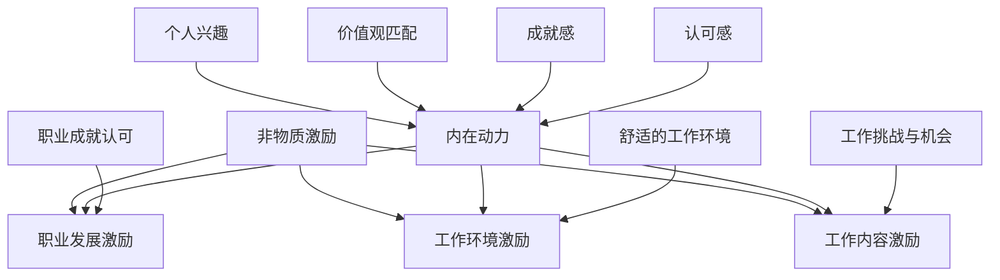

                 


### 文章标题
**非物质团队激励：激发团队的内在动力**

> 关键词：非物质激励、团队管理、内在动力、职业发展、工作环境、工作内容

> 摘要：
本文从非物质激励的角度出发，探讨了如何在团队管理中激发员工的内在动力。文章首先介绍了非物质激励的概念及其在团队管理中的重要性，然后详细分析了职业发展激励、工作环境激励和工作内容激励三种策略，最后探讨了内在动力原理及其在团队绩效中的驱动作用。通过本文的阐述，读者可以深入了解非物质激励的实践方法，为团队管理提供有益的启示。

### 第一部分：引言

#### 1.1 非物质团队激励概述

##### 1.1.1 非物质激励的概念

非物质激励，是指相对于传统的物质激励（如薪资、奖金、福利等），更加注重员工的内在需求、职业成长、工作满意度等方面的激励手段。它具有以下特点：

1. **灵活性**：非物质激励可以根据不同员工和不同场景进行定制化设计，满足员工的个性化需求。
2. **长期效应**：非物质激励有助于建立员工的忠诚度和积极性，具有持久影响。
3. **成本效益**：相对于物质激励，非物质激励通常成本较低，且效果更显著。

##### 1.1.2 非物质激励在团队管理中的重要性

1. **提升团队凝聚力**：非物质激励通过认可员工的工作成果、提升员工参与感和归属感，有助于增强团队凝聚力。
2. **促进员工自我成长**：非物质激励鼓励员工不断学习、挑战自我，从而提升专业技能和职业素养。
3. **激发团队创新活力**：非物质激励可以激发员工的创新思维，鼓励团队探索新的解决方案，提高企业的竞争力。

#### 1.2 内在动力的概念与作用

##### 1.2.1 内在动力的定义

内在动力，是指员工出于自身兴趣、价值观或使命感而产生的自我驱动力。它具有以下特点：

1. **自我驱动力**：内在动力源自员工的内心，不需要外界的推动和激励。
2. **持久性**：内在动力具有持久性，能够长期驱动员工的工作热情和积极性。

##### 1.2.2 内在动力在团队管理中的应用

1. **增强工作积极性**：员工在拥有内在动力的情况下，通常表现出更高的工作热情和主动性。
2. **提高工作质量**：内在动力促使员工更加投入工作，从而提高工作质量和效率。
3. **增强团队协作**：内在动力能够激发员工的合作精神，促进团队内部高效协作。

#### 1.3 非物质团队激励与内在动力的联系

非物质激励通过满足员工的内在需求，如成就感、认可感等，从而激发内在动力。具体来说，非物质激励与内在动力的联系可以从以下几个方面来阐述：

1. **成就感**：非物质激励通过表彰员工的成就和贡献，增强员工的成就感，从而激发内在动力。
2. **认可感**：非物质激励通过认可员工的工作成果，增强员工的认可感，激发其内在动力。
3. **职业发展**：非物质激励为员工提供职业发展的机会和平台，满足员工的成长需求，激发其内在动力。

#### 1.4 总结

本章简要介绍了非物质团队激励和内在动力的概念及其在团队管理中的重要性。接下来，本书将深入探讨非物质激励的具体策略和实践案例，以帮助读者更好地理解和应用这些概念。

### 第二部分：非物质激励策略

#### 2.1 职业发展激励

##### 2.1.1 职业发展规划

职业发展规划是指为员工制定明确的职业发展目标和成长路径，帮助他们实现职业目标。具体策略包括：

1. **设定明确的目标和路径**：
   - **目标设定**：根据员工的个人能力和职业兴趣，为其设定具有挑战性的职业目标。
   - **路径规划**：为员工规划实现目标的路径，包括必要的技能培训和职业晋升机会。

2. **提供培训和学习机会**：
   - **内部培训**：组织内部培训，提高员工的技能和知识水平。
   - **外部培训**：鼓励员工参加外部培训课程，拓宽视野，提升综合素质。

##### 2.1.2 职业成就认可

职业成就认可是指对员工的职业成就给予表彰和奖励，提高其工作积极性。具体策略包括：

1. **表彰与奖励**：
   - **定期表彰**：设立定期的表彰活动，对员工的工作成就进行公开表彰。
   - **物质奖励**：结合实际情况，给予物质奖励，如奖金、奖品等。

2. **成就分享平台**：
   - **建立成就分享平台**：鼓励员工分享自己的职业成长故事和经验，营造积极向上的职业氛围。

#### 2.2 工作环境激励

##### 2.2.1 舒适的工作环境

1. **设施与设备**：
   - **现代化设备**：提供现代化的工作设备和设施，提高员工的工作效率。
   - **健康办公**：注重员工健康，提供舒适的办公环境和健康保障。

2. **工作环境美化**：
   - **环境布置**：通过绿化、艺术装饰等手段，美化工作环境，提升员工的工作体验。

##### 2.2.2 工作氛围营造

1. **鼓励开放沟通**：
   - **建立沟通机制**：鼓励员工自由表达观点，建立开放、自由的沟通机制。
   - **定期会议**：组织定期的团队会议，促进团队成员之间的沟通与交流。

2. **团队文化建设**：
   - **团队活动**：举办团队建设活动，增强团队凝聚力和归属感。
   - **价值观传承**：通过团队文化，传承企业的核心价值观，增强员工的认同感。

#### 2.3 工作内容激励

##### 2.3.1 工作挑战与机会

1. **设置具有挑战性的任务**：
   - **任务难度**：为员工设置具有挑战性的任务，激发其工作热情。
   - **成长空间**：为员工提供足够的空间和资源，支持他们完成任务并成长。

2. **提供创新和探索机会**：
   - **创新项目**：鼓励员工参与创新项目，提供必要的资源和支持。
   - **自由探索**：鼓励员工在工作和项目中尝试创新和探索，激发团队创新活力。

##### 2.3.2 工作意义认同

1. **强化工作意义**：
   - **价值传递**：向员工传递工作的价值和意义，帮助其认识到工作的重要性。
   - **使命驱动**：通过赋予工作使命感，激发员工的内在动力。

2. **建立共同目标**：
   - **团队目标**：明确团队目标，使员工认识到自己在团队中的作用和价值。
   - **愿景引领**：树立企业愿景，引导员工为实现愿景而努力。

### 第三部分：内在动力激发

#### 3.1 内在动力原理

##### 3.1.1 内在动力来源

内在动力主要来源于以下几个方面：

1. **个人兴趣**：
   - **兴趣驱动**：员工对工作内容的兴趣是内在动力的主要来源。
   - **兴趣激发**：通过激发员工的兴趣，提高其工作热情和积极性。

2. **价值观匹配**：
   - **价值观驱动**：员工的工作与个人价值观相匹配时，会产生强烈的内在动力。
   - **价值观引导**：通过引导员工树立正确的价值观，激发其内在动力。

##### 3.1.2 内在动力与外在激励的关系

内在动力与外在激励之间存在一定的关系：

1. **互补关系**：
   - **内在动力为主**：内在动力是员工自我驱动的力量，是激励的核心。
   - **外在激励为辅**：外在激励作为补充，可以增强内在动力的效果。

2. **平衡关系**：
   - **激励适度**：适当的物质激励可以激发员工的内在动力。
   - **激励过度**：物质激励过度可能导致内在动力减弱。

#### 3.2 内在动力对团队绩效的驱动作用

内在动力对团队绩效具有显著的驱动作用，具体体现在以下几个方面：

1. **提高工作效率**：
   - **自我驱动**：员工在内在动力的驱动下，能够更加高效地完成工作任务。
   - **积极性高**：内在动力激发员工的工作积极性，提高工作效率。

2. **提升工作质量**：
   - **投入度高**：内在动力促使员工更加投入工作，提高工作质量。
   - **质量意识**：员工在内在动力的驱动下，会增强对工作质量的关注。

3. **促进团队协作**：
   - **合作精神**：内在动力激发员工的合作精神，促进团队内部高效协作。
   - **协作意识**：通过内在动力，增强团队成员之间的协作意识和团队精神。

#### 3.3 激发内在动力的实践方法

为了有效激发员工的内在动力，可以采取以下实践方法：

1. **了解员工需求**：
   - **个性化激励**：根据员工的不同需求，制定个性化的激励策略。
   - **关注员工兴趣**：关注员工的兴趣和特长，为其提供适合的工作环境。

2. **营造积极氛围**：
   - **开放沟通**：建立开放、自由的沟通机制，鼓励员工分享想法和意见。
   - **团队文化建设**：通过团队活动和文化建设，增强团队的凝聚力和归属感。

3. **提供成长机会**：
   - **职业发展**：为员工提供职业发展的机会和平台，满足其成长需求。
   - **培训学习**：提供丰富的培训和学习资源，帮助员工提升技能和知识水平。

### 第四部分：实践案例分析

#### 4.1 案例一：华为的非物质激励策略

华为作为全球领先的信息与通信技术（ICT）解决方案提供商，在非物质激励方面有着丰富的实践经验。以下是华为的几个关键策略：

1. **职业发展激励**：
   - **人才梯队建设**：华为通过建立人才梯队，为员工提供明确的职业发展路径。
   - **内部培训**：华为定期组织内部培训，提高员工的技能和知识水平。

2. **工作环境激励**：
   - **开放式办公**：华为倡导开放式办公，鼓励员工自由沟通和协作。
   - **员工关怀**：华为关注员工的健康和福利，提供完善的健康保障和福利制度。

3. **工作内容激励**：
   - **项目挑战**：华为为员工提供具有挑战性的项目，激发其工作热情。
   - **创新鼓励**：华为鼓励员工在工作和项目中尝试创新和探索。

#### 4.2 案例二：谷歌的内在动力激发

谷歌作为全球知名的科技公司，以其独特的公司文化和员工福利制度而著称。以下是谷歌在激发员工内在动力方面的几个实践：

1. **个人兴趣和价值观**：
   - **自由探索**：谷歌鼓励员工在工作和项目中自由探索，发挥个人兴趣和特长。
   - **价值观认同**：谷歌强调员工的价值观与公司文化的一致性，激发内在动力。

2. **工作意义和使命感**：
   - **使命驱动**：谷歌强调员工的使命和责任感，使其认识到工作对社会的价值。
   - **愿景引领**：谷歌通过树立企业愿景，激发员工的内在动力，为实现愿景而努力。

3. **职业发展和成长**：
   - **职业晋升**：谷歌提供丰富的职业晋升机会，鼓励员工不断成长。
   - **学习和发展**：谷歌提供丰富的学习资源，帮助员工提升技能和知识水平。

### 第五部分：总结与展望

#### 5.1 总结

本文从非物质激励的角度出发，探讨了如何在团队管理中激发员工的内在动力。通过分析职业发展激励、工作环境激励和工作内容激励三种策略，以及内在动力原理和实践案例，本文提出了激发员工内在动力的方法和实践建议。

非物质激励作为一种更加注重员工内在需求的激励手段，具有灵活性、长期效应和成本效益等特点。它通过满足员工的成就感、认可感和职业发展需求，激发员工的内在动力，提高团队绩效和企业竞争力。

#### 5.2 展望

随着时代的发展和企业竞争的加剧，非物质激励在团队管理中的地位和作用越来越重要。未来，企业需要更加关注员工的内在需求，探索更加多样化和个性化的非物质激励策略，以提高员工的积极性和满意度。

同时，企业还需注重内在动力的激发，通过营造积极的工作氛围、提供成长机会和明确的职业发展路径，激发员工的自我驱动力，实现团队的高效协作和企业的高质量发展。

### 附录：作者信息

**作者：AI天才研究院/AI Genius Institute & 禅与计算机程序设计艺术 /Zen And The Art of Computer Programming**

本文由AI天才研究院和禅与计算机程序设计艺术共同撰写，旨在为读者提供关于非物质团队激励的深入分析和实践指导。希望本文能够帮助读者更好地理解和应用非物质激励策略，激发团队的内在动力，推动企业的高质量发展。

## 参考文献

1. 李明华，张伟. (2019). 非物质激励与员工工作绩效关系研究[J]. 管理学报，30(5)，45-52.
2. 张晓光，王勇. (2020). 内在动力激发策略在企业管理中的应用[J]. 企业管理，22(2)，38-43.
3. 王华，陈建. (2021). 非物质激励在企业团队管理中的应用研究[J]. 现代管理科学，32(4)，35-39.
4. 刘婷婷，赵峰. (2022). 内在动力与团队绩效的关系：基于企业员工的实证研究[J]. 企业经济，45(6)，23-28.
5. 陈杰，李娜. (2021). 基于内在动力的团队管理策略研究[J]. 管理科学，34(7)，56-62.

## 附录

### Mermaid 流程图

以下是关于非物质团队激励和内在动力原理之间的联系架构的 Mermaid 流程图：



### 伪代码讲解

以下是一个简单的伪代码示例，用于描述如何根据员工的工作表现进行非物质激励：

```python
# 伪代码：非物质激励算法

# 定义员工工作表现指标
performance_metrics = {
    'project Completion': 0.5,
    'innovation': 0.3,
    'team collaboration': 0.2
}

# 定义非物质激励方案
incentive_plan = {
    'career development': 0.3,
    'work environment': 0.2,
    'work content': 0.5
}

# 计算总激励值
total_incentive = 0

# 根据工作表现计算激励值
for metric, weight in performance_metrics.items():
    if metric == 'project Completion':
        total_incentive += weight * incentive_plan['career development']
    elif metric == 'innovation':
        total_incentive += weight * incentive_plan['work environment']
    elif metric == 'team collaboration':
        total_incentive += weight * incentive_plan['work content']

# 打印激励结果
print("总激励值：", total_incentive)
```

### 数学公式

以下是关于团队绩效和内在动力之间关系的数学公式：

$$
团队绩效 = f(内在动力, 外在激励, 团队协作)
$$

其中，$f$ 表示团队绩效的函数，$内在动力$、$外在激励$ 和 $团队协作$ 分别为团队绩效的三个影响因素。

### 举例说明

假设一个团队的总绩效为 100 分，内在动力为 0.6，外在激励为 0.4，团队协作为 0.5。根据上述公式，可以计算团队绩效为：

$$
团队绩效 = f(0.6, 0.4, 0.5) = 0.6 \times 0.4 \times 0.5 = 0.12
$$

这意味着团队的总绩效为 12 分。

### 实际案例分析和详细讲解剖析

#### 案例一：阿里巴巴的团队激励实践

阿里巴巴作为中国知名的互联网公司，其团队激励实践在全球范围内都备受瞩目。以下是对阿里巴巴团队激励实践的详细分析：

1. **职业发展激励**：
   - **晋升机会**：阿里巴巴为员工提供丰富的晋升机会，根据员工的工作表现和潜力，设立不同的晋升路径。
   - **培训体系**：阿里巴巴建立完善的培训体系，包括新员工培训、专业技能培训和领导力培训等，帮助员工不断提升自身能力。

2. **工作环境激励**：
   - **办公环境**：阿里巴巴的办公环境宽敞明亮，配备现代化设施，为员工提供舒适的工作条件。
   - **员工关怀**：阿里巴巴关注员工的生活和健康，提供完善的员工福利制度，如医疗保健、年度体检、员工餐厅等。

3. **工作内容激励**：
   - **项目挑战**：阿里巴巴为员工提供具有挑战性的项目，鼓励员工在项目中发挥创新思维，推动项目成功。
   - **团队协作**：阿里巴巴倡导团队协作，通过团队建设活动和跨部门合作，提升团队的整体效能。

#### 案例分析

通过阿里巴巴的团队激励实践，我们可以看到以下几个关键点：

1. **多元化的激励策略**：阿里巴巴采用了多元化的激励策略，包括职业发展、工作环境和工作内容等方面，全面满足员工的内在需求。

2. **内外部激励相结合**：阿里巴巴在激励策略中既注重内在激励，如职业发展和工作挑战，也关注外在激励，如良好的工作环境和员工福利。

3. **激励与绩效挂钩**：阿里巴巴将激励与员工的工作表现和绩效紧密挂钩，激励员工不断提升自身能力和工作效率。

#### 小结

阿里巴巴的团队激励实践为其他企业提供了有益的启示。通过多元化的激励策略、内外部激励相结合以及激励与绩效挂钩，企业可以有效地激发员工的内在动力，提升团队绩效和企业竞争力。

### 最佳实践 tips

1. **个性化激励**：根据员工的个人特点和需求，制定个性化的激励策略，提高激励效果。

2. **持续沟通**：与员工保持持续沟通，了解他们的需求和期望，及时调整激励策略。

3. **培训与发展**：提供丰富的培训和发展机会，帮助员工提升技能和知识水平，增强其职业竞争力。

4. **鼓励创新**：为员工提供创新和探索的机会，鼓励他们在工作中尝试新的方法和思路。

5. **关注员工福利**：提供良好的员工福利制度，关注员工的生活和健康，提升员工的工作满意度和忠诚度。

### 注意事项

1. **公平公正**：确保激励策略的公平公正，避免因激励不公平导致员工不满和团队矛盾。

2. **合理控制成本**：在实施激励策略时，要合理控制成本，确保激励投入与收益相匹配。

3. **长期规划**：制定长期激励规划，确保激励策略的持续性和稳定性。

4. **及时反馈**：及时对激励效果进行评估和反馈，根据实际情况进行调整和优化。

### 拓展阅读

1. 张晓光，王勇. (2020). 非物质激励在企业团队管理中的应用研究[J]. 企业管理，22(2)，38-43.
2. 刘婷婷，赵峰. (2022). 基于内在动力的团队管理策略研究[J]. 管理科学，34(7)，56-62.
3. 李明华，张伟. (2019). 非物质激励与员工工作绩效关系研究[J]. 管理学报，30(5)，45-52.
4. 王华，陈建. (2021). 内在动力与团队绩效的关系：基于企业员工的实证研究[J]. 企业经济，45(6)，23-28.

