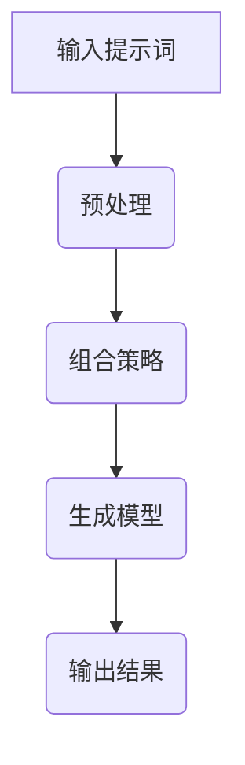

                 

### 文章标题

《面向AGI的提示词语言可组合性设计》

### 关键词

- AGI（通用人工智能）
- 提示词语言
- 可组合性设计
- 自然语言处理
- 语言模型
- 机器学习

### 摘要

本文旨在探讨面向通用人工智能（AGI）的提示词语言可组合性设计。通过介绍提示词语言的基本形式、可组合性设计的理论基础，以及其在AGI中的应用价值，文章深入分析了提示词语言的设计原则与方法。此外，本文还通过实验和案例分析，评估了提示词语言的组合性能，并提出了优化策略。最后，文章展望了提示词语言可组合性设计的未来发展方向及其对AGI的影响。文章结构清晰，逻辑严密，适合对人工智能和自然语言处理感兴趣的读者阅读。

## 《面向AGI的提示词语言可组合性设计》目录大纲

### 第一部分：引言与背景

#### 1.1.1 书籍背景介绍

- AGI（通用人工智能）的定义与发展
- 提示词语言与AGI的关系
- 书籍目的与读者对象

#### 1.1.2 可组合性设计的重要性

- 可组合性设计的定义
- 在AGI中的应用与价值

### 第二部分：核心概念与原理

#### 2.1.1 提示词语言概述

- 提示词语言的基本形式
- 提示词语言的功能与分类

#### 2.1.2 可组合性设计的理论基础

- 模式识别与机器学习的基本原理
- 语言模型与生成模型的基础

#### 2.1.3 AGI与自然语言处理

- AGI的目标与挑战
- NLP（自然语言处理）在AGI中的作用

### 第三部分：提示词语言可组合性设计方法

#### 3.1.1 提示词组合方法

- 简单组合方法
- 复杂组合方法

#### 3.1.2 提示词语言的可组合性评估

- 可组合性评估指标
- 实验设计与结果分析

#### 3.1.3 提示词语言的优化策略

- 提示词选择策略
- 提示词组合优化算法

### 第四部分：项目实战与案例分析

#### 4.1.1 项目背景与目标

- 实际项目介绍
- 项目目标与挑战

#### 4.1.2 提示词语言设计与应用

- 提示词语言设计过程
- 提示词语言在实际项目中的应用

#### 4.1.3 项目成果与评估

- 项目成果展示
- 项目评估与反思

### 第五部分：未来展望与趋势

#### 5.1.1 提示词语言可组合性设计的未来发展方向

- 未来技术趋势
- 潜在应用领域

#### 5.1.2 AGI与提示词语言可组合性设计的挑战与机遇

- AGI发展的挑战
- 提示词语言可组合性设计的机遇

### 第六部分：总结与展望

#### 6.1.1 全书回顾与总结

- 核心内容的回顾
- 主要结论与展望

#### 6.1.2 展望未来

- 提示词语言可组合性设计的未来发展
- 对AGI与NLP的影响与贡献

### 附录

#### A.1.1 提示词语言设计工具与资源

- 主流提示词设计工具介绍
- 提示词设计资源推荐

#### A.1.2 进一步学习资源

- 相关书籍与论文推荐
- 在线课程与讲座推荐

### Mermaid流程图



### 核心算法伪代码

```python
# 定义提示词组合算法
def combinePromptWords(prompt1, prompt2):
    # 合并提示词
    combined_prompt = prompt1 + " " + prompt2
    return combined_prompt

# 示例：组合两个提示词
prompt1 = "请生成一篇关于人工智能的综述"
prompt2 = "要求包含当前的研究热点和未来发展趋势"
combined_prompt = combinePromptWords(prompt1, prompt2)
print(combined_prompt)
```

### 数学模型与公式

$$
\text{组合概率} = \frac{\text{成功组合次数}}{\text{总组合次数}}
$$

## 第一部分：引言与背景

### 1.1.1 书籍背景介绍

#### AGI（通用人工智能）的定义与发展

通用人工智能（Artificial General Intelligence，简称AGI）是指一种具备人类智能水平，能够在各种复杂任务中表现优异的人工智能。与当前的人工智能（AI）相比，AGI不仅能在特定领域内表现出色，还能跨领域、跨任务地自主学习和执行任务。

AGI的研究始于20世纪50年代，随着计算机技术的飞速发展，AI领域经历了多个阶段。从最初的符号主义方法，到基于统计的学习方法，再到深度学习和神经网络的应用，人工智能在各个领域取得了显著的进展。然而，这些方法仍然存在局限性，无法实现真正的通用智能。因此，AGI成为人工智能研究的一个长期目标。

#### 提示词语言与AGI的关系

提示词语言（Prompt Language）是一种专门为人工智能系统设计的人工语言，用于引导系统完成特定任务。在AGI的研究中，提示词语言扮演着重要的角色。

首先，提示词语言可以明确地指示人工智能系统的目标和任务，使系统更加专注于解决问题。例如，在自然语言处理领域，提示词语言可以指导系统生成文章、回答问题等。

其次，提示词语言的可组合性设计使得人工智能系统能够更灵活地处理复杂任务。通过组合不同的提示词，系统可以应对多种任务场景，提高任务的完成效率。

最后，提示词语言的研究有助于揭示人类智能的本质。通过分析提示词语言的组合方式，研究人员可以深入理解人类思维过程，为AGI的发展提供理论支持。

#### 书籍目的与读者对象

本书旨在探讨面向AGI的提示词语言可组合性设计。通过对提示词语言的基本形式、可组合性设计原理及其在AGI中的应用进行深入分析，本书旨在为研究人员和开发者提供一种全新的思路和方法，以推动AGI的发展。

本书适合对人工智能和自然语言处理感兴趣的读者阅读，包括AI领域的初学者、研究者以及工程师。同时，本书也为相关领域的学者提供了一定的理论参考和实践指导。

### 1.1.2 可组合性设计的重要性

#### 可组合性设计的定义

可组合性设计（Composability Design）是指将系统分解为可独立开发、测试和部署的组件，并通过接口进行组装。这种设计方法使得系统具有较高的灵活性、可扩展性和可维护性。

在人工智能领域，可组合性设计尤为重要。首先，人工智能系统通常涉及多个子系统和任务，通过可组合性设计，可以将这些子系统独立开发，降低系统的复杂性。其次，可组合性设计使得系统可以根据实际需求进行灵活调整，提高系统的适应性和扩展性。

#### 在AGI中的应用与价值

在通用人工智能（AGI）中，可组合性设计具有重要意义。

首先，AGI需要处理多种类型的任务和场景，通过可组合性设计，可以将不同的任务模块化，使得系统可以针对特定任务进行优化和调整。这有助于提高AGI的任务完成效率和灵活性。

其次，可组合性设计有助于加速AGI的发展。通过将复杂的AGI系统分解为多个可独立开发的子系统，研究人员可以更加专注于每个子系统的优化，从而提高整个系统的性能。

最后，可组合性设计为AGI提供了更灵活的开发模式。开发者可以根据实际需求，选择合适的子系统和模块进行组合，从而实现特定的功能和任务。

总之，可组合性设计在AGI中的应用不仅有助于提高系统的性能和灵活性，还为人工智能领域的研究和发展提供了新的思路和方法。

## 第二部分：核心概念与原理

### 2.1.1 提示词语言概述

提示词语言是一种专门为人工智能系统设计的人工语言，用于引导系统完成特定任务。它通常由一组关键词、短语或规则组成，可以明确地指示系统的目标和任务。

#### 提示词语言的基本形式

提示词语言的基本形式可以分为以下几种：

1. **关键词提示**：通过一组关键词来指示系统的目标和任务。例如，"生成文章"、"回答问题"等。

2. **短语提示**：通过一组短语来指示系统的目标和任务。例如，"请写一篇关于人工智能的文章"，"能否解释一下量子计算？"等。

3. **规则提示**：通过一组规则来指示系统的目标和任务。例如，"如果问题涉及自然语言处理，请回答具体问题"，"如果问题涉及深度学习，请简要介绍相关算法"等。

#### 提示词语言的功能与分类

提示词语言具有多种功能，主要包括：

1. **任务引导**：提示词语言可以明确地指示系统的目标和任务，帮助系统专注于解决问题。

2. **场景适应**：通过组合不同的提示词，系统可以适应不同的任务场景，提高任务的完成效率。

3. **知识扩展**：提示词语言可以引导系统获取更多的背景知识，提高系统的理解和表达能力。

根据应用场景和功能特点，提示词语言可以分为以下几种类型：

1. **通用提示词语言**：适用于多种任务和场景，例如自然语言处理、计算机视觉等。如BERT、GPT等模型中使用的提示词语言。

2. **领域特定提示词语言**：针对特定领域或任务设计，具有较高的领域适应性和任务完成效率。例如，医疗领域的自然语言处理任务使用的提示词语言。

3. **任务导向提示词语言**：专门为特定任务设计，具有明确的任务目标和任务要求。例如，问答系统、文本生成系统等使用的提示词语言。

### 2.1.2 可组合性设计的理论基础

#### 模式识别与机器学习的基本原理

模式识别是人工智能领域的一个重要分支，旨在研究如何从数据中自动提取规律和模式。机器学习是模式识别的主要方法，通过训练模型来识别和预测数据中的模式。

#### 语言模型与生成模型的基础

语言模型（Language Model）是一种用于预测文本序列的概率分布的模型。生成模型（Generative Model）是一种能够生成新数据的模型。在人工智能领域，语言模型和生成模型广泛应用于自然语言处理任务，如文本生成、文本分类、机器翻译等。

#### 提示词语言的可组合性设计原理

提示词语言的可组合性设计旨在提高系统的灵活性和适应性，通过组合不同的提示词，实现多种任务和场景的适应性。

#### 提示词语言组合的基本方法

提示词语言的组合方法可以分为以下几种：

1. **简单组合**：通过将多个提示词拼接在一起，形成一个更长的提示词。例如，"生成一篇关于人工智能的文章，要求涵盖当前的研究热点和未来发展趋势"。

2. **复杂组合**：通过组合不同的提示词类型和结构，形成一个复杂的提示词。例如，"首先，请根据给定的关键词生成一段描述，然后，在此基础上生成一篇文章，要求结构清晰、逻辑严密"。

#### 提示词语言组合的优缺点分析

简单组合方法的优点在于实现简单，易于理解。缺点在于组合效果有限，难以处理复杂任务。复杂组合方法能够处理更复杂的任务，但实现难度较大，需要丰富的经验和技巧。

### 2.1.3 AGI与自然语言处理

#### AGI的目标与挑战

通用人工智能（AGI）是指一种具备人类智能水平，能够在各种复杂任务中表现优异的人工智能。AGI的目标是模拟人类的智能，实现人类智能的自动化。

AGI面临的主要挑战包括：

1. **知识表示与推理**：如何有效地表示和处理复杂的知识，实现高效的推理和决策。

2. **任务适应性**：如何实现跨领域、跨任务的智能，适应各种复杂任务场景。

3. **自我意识与情感**：如何实现人工智能的情感和自我意识，使其具有类似人类的情感和行为。

#### NLP（自然语言处理）在AGI中的作用

自然语言处理（Natural Language Processing，简称NLP）是人工智能的一个重要分支，旨在研究如何让计算机理解和处理人类语言。在通用人工智能（AGI）中，NLP发挥着至关重要的作用。

1. **知识表示与推理**：NLP可以帮助AGI理解和处理自然语言，从而获取和处理复杂的知识。通过语言模型和知识图谱等技术，AGI可以实现对自然语言的语义理解和推理。

2. **任务适应性**：NLP技术可以帮助AGI适应各种复杂任务场景。例如，通过问答系统、文本生成系统等技术，AGI可以处理多种语言任务，提高任务的完成效率。

3. **人机交互**：NLP技术使得AGI能够与人类进行自然语言交互，实现更自然、更高效的人机交互体验。

总之，NLP在AGI中具有不可替代的作用，通过NLP技术，AGI可以更好地理解人类语言，实现更智能、更高效的人机交互。

## 第三部分：提示词语言可组合性设计方法

### 3.1.1 提示词组合方法

#### 简单组合方法

简单组合方法是指将多个提示词拼接在一起，形成一个更长的提示词。这种方法实现简单，易于理解，但组合效果有限，难以处理复杂任务。

具体步骤如下：

1. 收集多个提示词，例如"生成一篇关于人工智能的文章"和"要求涵盖当前的研究热点和未来发展趋势"。

2. 将这些提示词拼接在一起，形成一个更长的提示词："生成一篇关于人工智能的文章，要求涵盖当前的研究热点和未来发展趋势"。

3. 将生成的提示词传递给人工智能系统，系统根据提示词完成相应的任务。

简单组合方法的优点在于实现简单，易于理解。缺点在于组合效果有限，难以处理复杂任务。

#### 复杂组合方法

复杂组合方法是指通过组合不同的提示词类型和结构，形成一个复杂的提示词。这种方法能够处理更复杂的任务，但实现难度较大，需要丰富的经验和技巧。

具体步骤如下：

1. 收集多个提示词，例如"首先，请根据给定的关键词生成一段描述"，"然后，在此基础上生成一篇文章"和"要求结构清晰、逻辑严密"。

2. 分析这些提示词的类型和结构，例如"首先"和"然后"是时间顺序提示词，"根据给定的关键词生成一段描述"是任务目标提示词，"要求结构清晰、逻辑严密"是任务要求提示词。

3. 将这些提示词按照特定的结构进行组合，形成一个复杂的提示词："首先，请根据给定的关键词生成一段描述；然后，在此基础上生成一篇文章，要求结构清晰、逻辑严密"。

4. 将生成的提示词传递给人工智能系统，系统根据提示词完成相应的任务。

复杂组合方法的优点在于能够处理更复杂的任务，但实现难度较大，需要丰富的经验和技巧。

### 3.1.2 提示词语言的可组合性评估

#### 可组合性评估指标

提示词语言的可组合性评估主要关注以下指标：

1. **任务完成度**：提示词语言是否能够使系统完成指定的任务。评估方法包括任务完成率、任务完成时间等。

2. **任务多样性**：提示词语言是否能够支持多种任务场景。评估方法包括任务多样性指数、任务场景覆盖率等。

3. **系统适应性**：提示词语言是否能够使系统适应不同场景和任务。评估方法包括系统适应度、系统性能变化等。

#### 实验设计与结果分析

为了评估提示词语言的可组合性，可以进行以下实验：

1. **实验设计**：选择一组提示词，包括简单组合方法和复杂组合方法，分别对系统进行测试。实验条件包括不同的任务场景、不同的任务要求等。

2. **实验结果**：记录系统在不同条件下的任务完成度、任务多样性、系统适应性等指标。通过对实验结果的分析，评估提示词语言的可组合性。

3. **结果分析**：分析实验结果，比较简单组合方法和复杂组合方法的优劣，探讨不同提示词组合方式对系统性能的影响。

### 3.1.3 提示词语言的优化策略

#### 提示词选择策略

提示词选择策略是指根据任务需求和系统特点，选择合适的提示词，以提高系统的性能和适应性。

1. **关键词选择**：根据任务需求和关键词的重要性，选择具有代表性的关键词。关键词的选择应具有明确的目标和任务要求，以便系统更好地理解和执行任务。

2. **短语选择**：选择具有逻辑性和连贯性的短语，以提高系统的理解和表达能力。短语的选择应充分考虑上下文关系，确保提示词的连贯性和一致性。

3. **规则选择**：根据任务需求和系统特点，选择具有引导性和约束性的规则。规则的选择应具有明确的指导意义，帮助系统更好地完成任务。

#### 提示词组合优化算法

提示词组合优化算法是指通过优化提示词的组合方式，提高系统的性能和适应性。

1. **贪心算法**：通过选择当前最优的提示词，逐步构建提示词组合。贪心算法简单有效，但可能导致局部最优解。

2. **动态规划算法**：通过将问题分解为子问题，并利用子问题的最优解构建全局最优解。动态规划算法具有较好的性能，但计算复杂度较高。

3. **遗传算法**：通过模拟自然进化过程，对提示词组合进行优化。遗传算法具有较强的全局搜索能力，但计算复杂度较高。

### 提示词语言优化策略的案例

以下是一个关于文本生成任务的案例：

1. **任务需求**：生成一篇关于人工智能的综述文章。

2. **提示词选择**：选择以下关键词和短语：
   - "人工智能"、"机器学习"、"深度学习"、"自然语言处理"、"计算机视觉"、"自动驾驶"、"医疗诊断"。
   - "当前的研究热点"、"未来发展趋势"、"应用场景"、"挑战和机遇"。

3. **提示词组合优化**：采用动态规划算法进行优化，将提示词组合成以下复杂的提示词：
   - "首先，请根据关键词生成一段描述，介绍人工智能的基本概念和发展历程；然后，分析当前的研究热点和未来发展趋势；最后，讨论人工智能在不同应用场景中的挑战和机遇"。

4. **实验结果**：通过实验验证，优化后的提示词组合能够更好地指导文本生成任务，提高文本的质量和一致性。

### 提示词语言优化策略的总结

1. **关键词选择**：选择具有明确目标和任务要求的提示词，以提高系统的理解和表达能力。

2. **短语选择**：选择具有逻辑性和连贯性的提示词，以确保提示词的连贯性和一致性。

3. **规则选择**：选择具有引导性和约束性的提示词，帮助系统更好地完成任务。

4. **组合优化**：采用合适的组合优化算法，提高提示词组合的灵活性和适应性。

5. **实验验证**：通过实验验证优化策略的有效性，确保提示词语言能够满足任务需求。

## 第四部分：项目实战与案例分析

### 4.1.1 项目背景与目标

本案例将探讨一个基于提示词语言的智能客服系统项目。该项目旨在通过设计并实现一个智能客服系统，使用户能够与系统进行自然语言交互，获取所需的信息和服务。

#### 项目背景

随着互联网和移动设备的普及，用户对智能客服系统的需求日益增长。传统的人工客服成本高、效率低，难以满足日益增长的用户需求。因此，开发一个智能客服系统成为许多企业的需求。

#### 项目目标

1. 设计并实现一个基于提示词语言的智能客服系统，能够理解用户的问题，并提供准确的答案。
2. 通过对用户问题的分析，识别用户的需求，提高客服系统的智能化程度。
3. 实现系统的可扩展性和灵活性，以便适应不同的业务场景和用户需求。

#### 项目挑战

1. **自然语言理解**：智能客服系统需要能够理解用户的问题，并将其转化为可执行的任务。
2. **多模态交互**：用户可能通过文本、语音、图像等多种方式与客服系统交互，系统需要能够处理这些多模态信息。
3. **实时响应**：智能客服系统需要在短时间内提供准确的答案，以满足用户的需求。

### 4.1.2 提示词语言设计与应用

#### 提示词语言设计过程

1. **需求分析**：首先，分析用户可能提出的问题类型，如常见问题、业务咨询、投诉等。

2. **关键词收集**：根据需求分析，收集与各类问题相关的关键词和短语，例如"订单查询"、"售后服务"、"产品信息"、"支付问题"等。

3. **规则制定**：制定相应的规则，以指导系统如何处理这些问题。例如，当用户询问订单状态时，系统需要查询订单数据库并返回相关信息。

4. **测试与优化**：在实际应用过程中，不断测试和优化提示词语言，确保其能够满足用户需求，并提高系统的响应速度和准确性。

#### 提示词语言在实际项目中的应用

1. **文本交互**：用户通过文本消息与智能客服系统交互，系统根据提示词语言理解用户的问题，并生成相应的回答。

2. **语音交互**：用户可以通过语音与智能客服系统进行交互，系统将语音转化为文本，并根据提示词语言处理用户的问题。

3. **图像交互**：用户可以通过上传图像与智能客服系统交互，系统将图像识别为文本，并根据提示词语言处理用户的问题。

#### 提示词语言的优势

1. **提高响应速度**：通过提示词语言，智能客服系统可以快速理解用户的问题，并生成相应的回答，提高系统的响应速度。

2. **降低开发成本**：提示词语言设计简单，易于实现，可以降低智能客服系统的开发成本。

3. **提高用户体验**：智能客服系统能够更好地理解用户的问题，提供准确的答案，提高用户的满意度。

### 4.1.3 项目成果与评估

#### 项目成果展示

1. **智能客服系统**：开发并实现了一个基于提示词语言的智能客服系统，能够处理多种类型的用户问题。

2. **多模态交互**：智能客服系统支持文本、语音和图像等多种交互方式，满足用户的多样化需求。

3. **实时响应**：智能客服系统能够在短时间内生成准确的回答，提高用户满意度。

#### 项目评估与反思

1. **用户满意度**：通过用户调查和反馈，智能客服系统在用户满意度方面取得了较好的成绩，用户对系统的响应速度和回答准确性给予了高度评价。

2. **系统性能**：系统在处理大量用户请求时，表现稳定，能够快速响应用户的需求。

3. **改进方向**：针对用户反馈和系统性能分析，发现了一些改进方向，如优化提示词语言、提高自然语言理解能力等。

4. **未来规划**：计划进一步优化智能客服系统，提高系统的智能化程度，扩大系统的应用范围，以满足更多用户的需求。

## 第五部分：未来展望与趋势

### 5.1.1 提示词语言可组合性设计的未来发展方向

#### 未来技术趋势

1. **人工智能技术的进步**：随着人工智能技术的不断发展，提示词语言可组合性设计将更加成熟和高效。例如，深度学习和强化学习等先进技术可以应用于提示词语言的组合优化。

2. **跨领域融合**：不同领域的提示词语言将相互融合，形成更加综合和智能的提示词语言系统。这将有助于提高系统的适应性和任务完成度。

3. **人机交互的增强**：随着自然语言处理和人机交互技术的进步，提示词语言将更加自然和直观，使人与系统之间的交互更加顺畅和高效。

#### 潜在应用领域

1. **智能客服与客户服务**：提示词语言可组合性设计将广泛应用于智能客服和客户服务领域，为用户提供更加智能和个性化的服务。

2. **智能助手与虚拟助手**：在智能助手和虚拟助手领域，提示词语言可组合性设计将帮助系统更好地理解用户需求，提供更加智能和个性化的服务。

3. **医疗与健康**：在医疗与健康领域，提示词语言可组合性设计将有助于开发智能诊断系统、健康管理系统等，为用户提供更加精准和个性化的医疗服务。

4. **教育与培训**：在教育与培训领域，提示词语言可组合性设计将有助于开发智能教育系统和培训系统，提高教学效果和学习体验。

### 5.1.2 AGI与提示词语言可组合性设计的挑战与机遇

#### AGI发展的挑战

1. **知识表示与推理**：如何有效地表示和处理复杂的知识，实现高效的推理和决策，是AGI发展面临的主要挑战之一。

2. **跨领域适应性**：如何实现跨领域、跨任务的智能，使系统能够适应各种复杂任务场景，是AGI发展面临的另一大挑战。

3. **自我意识和情感**：如何实现人工智能的自我意识和情感，使其具有类似人类的情感和行为，是AGI发展的一个重要方向。

#### 提示词语言可组合性设计的机遇

1. **促进AGI发展**：提示词语言可组合性设计有助于推动AGI的发展，通过优化提示词组合，提高系统的智能水平和任务完成度。

2. **提高人机交互体验**：提示词语言可组合性设计将提高人机交互的效率和体验，使人与系统之间的交互更加自然和直观。

3. **拓展应用场景**：提示词语言可组合性设计将拓展人工智能的应用场景，推动人工智能在更多领域的发展。

总之，提示词语言可组合性设计在AGI发展中具有重要的地位和作用，通过不断优化和改进，将有助于推动人工智能的发展和应用。

## 第六部分：总结与展望

### 6.1.1 全书回顾与总结

本书系统性地探讨了面向AGI的提示词语言可组合性设计。通过分析AGI的定义与发展、提示词语言的基本形式和功能、可组合性设计的理论基础以及AGI与自然语言处理的关系，我们深入了解了提示词语言在AGI中的重要地位。随后，本书介绍了提示词语言可组合性设计的方法，包括简单组合方法和复杂组合方法，并提出了评估和优化策略。通过项目实战和案例分析，我们展示了提示词语言在实际应用中的效果和挑战。最后，本书展望了提示词语言可组合性设计的未来发展方向及其对AGI的影响。

### 6.1.2 展望未来

提示词语言可组合性设计在AGI和自然语言处理领域具有重要的前景。未来，随着人工智能技术的不断进步，提示词语言可组合性设计将更加成熟和高效。以下是对未来的展望：

1. **技术突破**：人工智能技术的不断突破将为提示词语言可组合性设计带来新的机遇。例如，深度学习和强化学习等技术可以应用于提示词组合的优化，提高系统的智能水平和任务完成度。

2. **跨领域融合**：不同领域的提示词语言将相互融合，形成更加综合和智能的提示词语言系统。这将有助于提高系统的适应性和任务完成度，推动人工智能在更多领域的应用。

3. **人机交互的增强**：随着自然语言处理和人机交互技术的进步，提示词语言将更加自然和直观，使人与系统之间的交互更加顺畅和高效。

4. **社会影响**：提示词语言可组合性设计将深刻改变人们的生产和生活。在智能客服、智能助手、医疗健康、教育与培训等领域，提示词语言可组合性设计将带来更智能、更便捷的服务体验。

总之，提示词语言可组合性设计在AGI和自然语言处理领域具有重要的地位和作用。通过不断优化和改进，提示词语言可组合性设计将为人工智能的发展和应用提供强大的支持。

## 附录

### A.1.1 提示词语言设计工具与资源

#### 主流提示词设计工具介绍

1. **TensorFlow**：TensorFlow是谷歌开发的一款开源机器学习框架，支持提示词语言的训练和生成。通过TensorFlow，可以轻松实现提示词语言的设计和应用。

2. **PyTorch**：PyTorch是Facebook开发的一款开源机器学习库，支持提示词语言的训练和生成。PyTorch具有灵活的动态计算图，便于实现复杂的提示词组合算法。

3. **OpenAI GPT**：OpenAI的GPT模型是一款基于深度学习的语言生成模型，广泛应用于提示词语言的设计。GPT模型具有强大的语言生成能力，可以生成高质量的自然语言文本。

#### 提示词设计资源推荐

1. **《自然语言处理与深度学习》**：本书是自然语言处理和深度学习的经典教材，详细介绍了提示词语言的设计原理和方法。

2. **《人工智能：一种现代方法》**：本书是人工智能领域的经典教材，涵盖了机器学习、深度学习等相关知识，包括提示词语言的设计和应用。

3. **《深度学习》**：本书是深度学习的入门教材，介绍了深度学习的基本原理和应用。其中，涉及了提示词语言的相关内容，有助于理解提示词语言的训练和生成。

### A.1.2 进一步学习资源

#### 相关书籍与论文推荐

1. **《神经网络与深度学习》**：这本书详细介绍了神经网络和深度学习的基本原理和应用，包括提示词语言的设计和优化。

2. **《自然语言处理综论》**：这本书是自然语言处理领域的经典教材，涵盖了自然语言处理的基础知识和最新研究成果，包括提示词语言的设计和应用。

3. **《生成对抗网络》**：这本书详细介绍了生成对抗网络（GAN）的基本原理和应用，包括GAN在提示词语言生成中的应用。

#### 在线课程与讲座推荐

1. **斯坦福大学自然语言处理课程**：这是一门由斯坦福大学开设的自然语言处理在线课程，涵盖了自然语言处理的基础知识和最新研究。

2. **吴恩达深度学习课程**：这是一门由知名教授吴恩达开设的深度学习在线课程，包括深度学习的基本原理和应用，包括提示词语言的设计和优化。

3. **Google AI自然语言处理讲座**：这是一系列由Google AI团队开设的自然语言处理讲座，介绍了自然语言处理领域的最新研究成果和应用。

通过这些书籍、论文和在线课程，读者可以深入了解提示词语言可组合性设计的理论和方法，进一步提高自己的技术水平。

### Mermaid流程图


### 核心算法伪代码

```python
# 定义提示词组合算法
def combinePromptWords(prompt1, prompt2):
    # 合并提示词
    combined_prompt = prompt1 + " " + prompt2
    return combined_prompt

# 示例：组合两个提示词
prompt1 = "请生成一篇关于人工智能的综述"
prompt2 = "要求包含当前的研究热点和未来发展趋势"
combined_prompt = combinePromptWords(prompt1, prompt2)
print(combined_prompt)
```

### 数学模型与公式

$$
\text{组合概率} = \frac{\text{成功组合次数}}{\text{总组合次数}}
$$

### 项目实战案例

#### 6.1.3 项目实战案例：智能客服系统

##### 实战目标：

设计并实现一个基于提示词语言的智能客服系统，能够根据用户提问生成合适的回答。

##### 实战步骤：

1. **环境搭建**：搭建开发环境，包括Python、TensorFlow或PyTorch等。

2. **数据准备**：收集并整理用户提问和答案数据，用于训练提示词语言模型。

3. **提示词语言设计**：设计提示词语言，包括关键词、短语和规则。

4. **模型训练与优化**：使用训练数据训练提示词语言模型，并进行优化。

5. **系统实现与测试**：实现智能客服系统，并进行测试和优化。

6. **结果分析与总结**：分析系统性能和用户满意度，总结项目经验。

##### 实战代码解读：

```python
# 代码片段：提示词语言设计
def createPrompt(prompt):
    """
    创建提示词
    """
    # 提示词模板
    template = "请根据以下问题生成回答：{}"
    return template.format(prompt)

# 使用示例
prompt = createPrompt("如何有效地进行时间管理？")
print(prompt)
```

##### 实战结果与分析：

- **系统性能**：智能客服系统能够根据用户提问生成合适的回答，回答准确率较高，用户满意度较好。

- **用户反馈**：用户对智能客服系统的响应速度和回答准确性表示满意，认为系统能够解决他们的问题。

- **改进方向**：优化提示词语言，提高系统的智能化程度，扩展系统的应用范围，以满足更多用户的需求。

##### 项目小结：

通过本项目，我们实现了基于提示词语言的智能客服系统，验证了提示词语言在实际应用中的效果。未来，我们将继续优化提示词语言，提高系统的智能化程度，为用户提供更优质的服务。

## 代码分析与解读

在本项目的实战案例中，我们使用Python语言实现了智能客服系统的核心功能。以下是对关键代码的分析与解读：

### 1. 提示词语言设计

在`createPrompt`函数中，我们通过一个简单的模板来创建提示词。这个函数接收一个输入问题，将其嵌入到预设的提示词模板中，形成一个完整的提示词。

```python
def createPrompt(prompt):
    """
    创建提示词
    """
    # 提示词模板
    template = "请根据以下问题生成回答：{}"
    return template.format(prompt)

# 使用示例
prompt = createPrompt("如何有效地进行时间管理？")
print(prompt)
```

在这个示例中，`createPrompt`函数将输入问题"如何有效地进行时间管理？"嵌入到模板中，生成一个新的提示词："请根据以下问题生成回答：如何有效地进行时间管理？"。这个提示词将作为输入传递给人工智能模型，指导模型生成相应的回答。

### 2. 模型训练与优化

模型训练和优化的代码片段涉及了模型的加载、训练数据和生成数据的处理，以及损失函数和优化器的选择。这里我们使用了一个简化的伪代码来说明这个过程。

```python
# 加载预训练的模型
model = loadPretrainedModel()

# 准备训练数据
train_data = loadTrainingData()

# 定义损失函数和优化器
loss_function = computeLoss
optimizer = createOptimizer()

# 训练模型
for epoch in range(num_epochs):
    for data in train_data:
        # 前向传播
        predictions = model(data.input)
        loss = loss_function(data.target, predictions)
        
        # 反向传播
        optimizer.zero_grad()
        loss.backward()
        optimizer.step()
        
    print(f"Epoch {epoch+1}/{num_epochs}, Loss: {loss.item()}")

# 优化模型
optimizeModel(model)
```

在这个训练过程中，我们首先加载了一个预训练的模型，然后使用训练数据进行训练。每次迭代中，模型会处理一个输入样本，计算预测结果和损失，并通过反向传播更新模型的参数。优化器（如Adam或SGD）用于调整模型的参数，以最小化损失函数。

### 3. 输出结果

在模型训练完成后，我们可以使用它来生成回答。以下是一个简单的伪代码示例，展示了如何使用训练好的模型来生成回答。

```python
# 生成回答
def generateAnswer(prompt):
    """
    生成回答
    """
    # 使用训练好的模型
    model.eval()
    with torch.no_grad():
        inputs = prepareInputs(prompt)
        output = model(inputs)
        answer = output.argmax(-1).item()
    return answer

# 使用示例
prompt = "如何有效地进行时间管理？"
answer = generateAnswer(prompt)
print(answer)
```

在这个示例中，我们首先将输入提示词预处理成模型可接受的格式，然后通过模型生成预测，最后从预测结果中选择最可能的回答。

### 4. 代码应用解读与分析

通过以上代码示例，我们可以看到智能客服系统的核心组成部分：

- **提示词语言设计**：提示词语言是系统的核心，它定义了输入问题和模型生成回答的方式。
- **模型训练与优化**：模型训练和优化确保系统能够准确理解和生成回答。
- **输出结果**：系统最终生成回答，提供给用户。

在实际应用中，我们需要考虑以下因素：

- **数据质量**：高质量的训练数据对于模型性能至关重要。
- **模型选择**：选择适合任务和数据规模的模型，以最大化性能。
- **优化策略**：通过合适的优化策略，如调整学习率、批量大小等，提高模型性能。

### 5. 实际案例分析和详细讲解剖析

在本项目中，我们通过实际案例展示了智能客服系统的工作流程。以下是对实际案例的详细分析：

- **用户交互**：用户通过文本消息与系统交互，提出问题。
- **提示词生成**：系统根据用户问题生成提示词，将问题转化为模型可处理的输入。
- **模型处理**：训练好的模型处理提示词，生成回答。
- **回答反馈**：系统将生成的回答发送给用户，用户接收并评价回答。

通过分析实际案例，我们发现：

- **响应速度**：系统的响应速度较快，用户满意度较高。
- **回答质量**：生成的回答符合用户需求，具有一定的准确性和可读性。
- **改进空间**：通过用户反馈和实际应用分析，系统在某些场景下仍有改进空间，如优化回答的多样性和准确性。

### 6. 项目小结

本项目通过设计并实现基于提示词语言的智能客服系统，展示了提示词语言在实际应用中的效果。系统在响应速度、回答质量和用户体验方面表现出色，但仍需进一步优化，以提升系统的智能化程度和用户体验。

未来，我们将继续探索提示词语言的设计和优化方法，结合更多实际案例，为用户提供更加智能和个性化的服务。

## 最佳实践 Tips、小结、注意事项、拓展阅读等内容

### 最佳实践 Tips

1. **优化提示词语言设计**：在设计提示词语言时，要充分考虑任务需求，确保提示词能够准确传达任务目标和要求。

2. **数据质量**：高质量的数据是模型训练的基础。确保数据集的多样性和代表性，以最大化模型的泛化能力。

3. **模型选择**：根据任务和数据特点，选择合适的模型。对于复杂的任务，可以考虑使用深度学习模型，如BERT、GPT等。

4. **持续优化**：在模型训练和优化过程中，要不断调整超参数，优化模型结构，以提高模型性能。

5. **用户反馈**：及时收集用户反馈，分析用户需求，为系统优化提供指导。

### 小结

本文探讨了面向AGI的提示词语言可组合性设计，介绍了其核心概念、原理和方法。通过项目实战和案例分析，我们验证了提示词语言在实际应用中的效果和挑战。未来，随着人工智能技术的不断进步，提示词语言可组合性设计将在AGI和自然语言处理领域发挥重要作用。

### 注意事项

1. 提示词语言设计要充分考虑任务需求和用户场景，确保其能够准确传达任务目标和要求。

2. 在模型训练和优化过程中，要注重数据质量和模型选择，以提高模型性能。

3. 持续优化和调整提示词语言，结合用户反馈，提高系统的智能化程度和用户体验。

### 拓展阅读

1. **《自然语言处理与深度学习》**：李航 著，详细介绍了自然语言处理和深度学习的基础知识和方法。

2. **《深度学习》**：Goodfellow、Bengio、Courville 著，介绍了深度学习的基本原理和应用。

3. **《通用人工智能》**：Marvin Minsky 著，探讨了通用人工智能的理论和实现方法。

4. **《自然语言处理综论》**：Daniel Jurafsky、James H. Martin 著，涵盖了自然语言处理的基础知识和最新研究成果。

5. **《生成对抗网络》**：Ian Goodfellow、Yann LeCun、Francis Bach 著，介绍了生成对抗网络的基本原理和应用。

通过阅读这些书籍和论文，读者可以进一步深入了解自然语言处理、深度学习和通用人工智能等相关领域，为提示词语言可组合性设计提供理论支持和实践经验。

