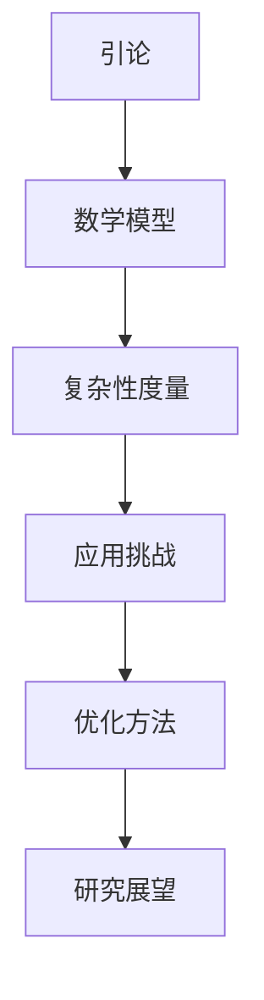

                 

## 文章标题

### 《面向AGI的提示词语言复杂性理论研究》

**关键词：** 通用人工智能（AGI），提示词语言复杂性，数学模型，算法优化，应用挑战

**摘要：** 本文章深入探讨了面向通用人工智能（AGI）的提示词语言复杂性理论。首先，文章回顾了人工智能的发展历史，并对提示词语言复杂性的概念进行了阐述。随后，文章分析了通用人工智能的定义和特性，以及提示词语言复杂性研究在其中的重要性。在此基础上，文章详细介绍了提示词语言的数学模型、复杂性度量方法，并在实际应用中讨论了其在自然语言生成、智能推荐系统和机器翻译中的挑战。最后，文章提出了基于深度学习和遗传算法的复杂性优化方法，并展望了面向AGI的提示词语言复杂性研究的发展方向。

----------------------------------------------------------------

# 第一部分：引论

## 第1章：人工智能与提示词语言复杂性

### 1.1 人工智能的发展历史

人工智能（Artificial Intelligence, AI）是一门研究、开发和应用使计算机模拟、延伸和扩展人类智能的理论、方法、技术及应用系统的科学技术。人工智能的发展历史可以追溯到20世纪50年代，当时计算机科学刚刚起步。早期的人工智能研究主要集中在逻辑推理、知识表示和问题解决等领域。

1956年，约翰·麦卡锡（John McCarthy）等人在达特茅斯会议上首次提出了“人工智能”这一概念。此后，人工智能经历了多个发展阶段：

- **早期阶段（1956-1969）**：这一阶段主要是基于逻辑和符号推理的方法。代表性成果包括阿尔法-beta剪枝搜索算法和普林斯顿语言处理系统。

- **繁荣期（1970-1980）**：这一阶段，人工智能得到了快速发展，机器学习、模式识别、专家系统等领域取得了显著进展。

- **低谷期（1980-1990）**：由于实际应用中的困难，人工智能研究进入低谷期。然而，这一阶段的失败也促使研究人员重新审视人工智能的理论和方法。

- **复兴期（1990至今）**：随着计算机硬件和算法的发展，人工智能再次迎来复兴。深度学习、自然语言处理、计算机视觉等领域取得了突破性进展。

### 1.2 提示词语言复杂性的概念

提示词语言复杂性（Prompt Language Complexity）是指语言表达中包含的信息量、逻辑结构和语义含义等方面的复杂性。它通常用于描述自然语言处理（Natural Language Processing, NLP）任务中的输入信息的复杂程度。

在人工智能应用中，提示词语言复杂性的研究具有重要意义。首先，它有助于理解人类语言的使用方式，从而提高自然语言处理系统的性能。其次，它可以为开发更高效的人工智能算法提供理论依据。最后，它还可以为智能对话系统、智能推荐系统和机器翻译等应用提供指导。

### 1.3 提示词语言复杂性研究的重要性

提示词语言复杂性研究在人工智能领域具有重要意义。首先，它有助于提高人工智能系统的性能。复杂性的降低可以使得模型更容易训练和优化，从而提高模型的准确性和效率。其次，它有助于解决实际应用中的难题。例如，在自然语言生成任务中，提示词语言复杂性的研究可以帮助生成更具可读性和逻辑性的文本。最后，它为人工智能算法的发展提供了新的方向。通过深入研究提示词语言复杂性，研究人员可以发现新的理论模型和优化方法，从而推动人工智能技术的进步。

---

## 第2章：通用人工智能（AGI）的框架

### 2.1 AGI的定义和特性

通用人工智能（Artificial General Intelligence, AGI）是指具有与人类相同或超越人类智能水平的计算机系统。与目前的人工智能系统（弱人工智能，Weak AI）不同，AGI能够理解和执行广泛的任务，而不仅仅是特定领域内的任务。以下是AGI的主要特性：

1. **广泛的能力**：AGI能够在不同领域内执行各种任务，如语言理解、图像识别、逻辑推理、决策制定等。

2. **自我学习和适应能力**：AGI能够从经验中学习，并适应新环境和任务。

3. **通用性**：AGI不依赖于特定领域的知识和技能，而是通过通用方法来解决问题。

4. **情感和意识**：虽然目前尚未实现，但AGI理论上应该具备情感和意识，从而更好地模拟人类智能。

### 2.2 AGI的挑战和障碍

尽管AGI具有巨大的潜力，但实现AGI仍然面临诸多挑战和障碍：

1. **计算能力**：目前计算机的计算能力仍然远远低于人脑。要实现AGI，需要开发出更强大的计算硬件和算法。

2. **数据集**：AGI需要大量的数据来学习和训练。然而，现有的数据集质量和多样性仍然不足。

3. **算法**：现有的机器学习和深度学习算法在处理复杂任务时存在局限性。需要开发新的算法来模拟人类智能。

4. **跨学科研究**：AGI涉及计算机科学、认知科学、神经科学等多个学科。需要跨学科的合作来推动研究进展。

5. **伦理和安全问题**：AGI的发展可能引发一系列伦理和安全问题，如隐私侵犯、滥用等。

### 2.3 提示词语言复杂性在AGI中的应用

提示词语言复杂性在AGI中具有重要作用。首先，它有助于模拟人类语言的使用方式，从而提高自然语言处理系统的性能。其次，它可以为开发更高效的人工智能算法提供理论依据。最后，它还可以为智能对话系统、智能推荐系统和机器翻译等应用提供指导。

在AGI中，提示词语言复杂性的研究可以帮助：

1. **理解人类语言**：通过研究提示词语言复杂性，可以更好地理解人类语言的使用方式，从而提高语言理解系统的性能。

2. **优化算法**：提示词语言复杂性的理论可以指导算法设计，从而提高算法在处理复杂任务时的效率。

3. **智能对话系统**：提示词语言复杂性的研究可以帮助设计更自然的对话系统，提高用户满意度。

4. **智能推荐系统**：提示词语言复杂性的研究可以帮助优化推荐算法，提高推荐结果的准确性和满意度。

5. **机器翻译**：提示词语言复杂性的研究可以帮助设计更准确的翻译系统，提高翻译质量。

---

通过以上章节的讨论，我们可以看到人工智能和提示词语言复杂性研究在通用人工智能领域中的重要性。接下来，我们将进一步探讨提示词语言的数学模型和复杂性度量方法，为深入理解AGI奠定基础。

----------------------------------------------------------------

## 第3章：提示词语言的数学模型

### 3.1 提示词语言的概率模型

提示词语言的概率模型是自然语言处理中的一种基础模型，用于描述语言中的符号序列概率分布。这种模型的核心思想是通过学习大量的语言数据，推断出每个单词或字符出现的概率，从而生成新的文本。

#### 3.1.1 语言模型

语言模型（Language Model）是提示词语言概率模型的一种常见形式。它通过统计大量文本数据中单词或字符的频率，为每个符号分配一个概率。这种模型通常基于n-gram模型，即前n个符号的联合概率由前n-1个符号的概率决定。

**n-gram模型**：

假设有一个n-gram模型，它考虑前n-1个符号的历史信息。给定一个单词序列\( w_1, w_2, \ldots, w_n \)，该序列的概率可以通过以下公式计算：

\[ P(w_1, w_2, \ldots, w_n) = P(w_n | w_{n-1}, w_{n-2}, \ldots, w_1) \]

该公式表示当前符号\( w_n \)的概率取决于前面的\( n-1 \)个符号。

**示例**：

假设有一个简单的二元语言，包含两个单词"hello"和"world"，且"hello"出现的概率为0.6，"world"出现的概率为0.4。则该语言模型可以表示为：

\[ P(hello) = 0.6, \ P(world) = 0.4 \]

根据二元n-gram模型，我们可以计算两个单词连续出现的概率：

\[ P(hello, world) = P(world | hello) \cdot P(hello) = \frac{P(hello, world)}{P(hello)} \cdot P(hello) \]

由于"hello"和"world"在给定文本中未出现，我们无法直接计算它们的联合概率。但我们可以使用贝叶斯公式来估计：

\[ P(hello, world) = P(world | hello) \cdot P(hello) = \frac{0.4}{0.6 + 0.4} \cdot 0.6 = 0.4 \]

因此，"hello"和"world"连续出现的概率为0.4。

#### 3.1.2 概率模型的应用

概率模型在自然语言处理中有广泛的应用，包括：

1. **文本生成**：通过概率模型，我们可以生成新的文本。例如，给定一个起始单词，我们可以根据概率模型生成后续的单词序列。

2. **语言模型校正**：在实际应用中，语言模型可能会遇到未见过的新单词或短语。通过概率模型，我们可以对生成的文本进行校正，提高文本的自然性。

3. **信息检索**：在信息检索中，概率模型可以用于计算查询词和文档的相关性。例如，给定一个查询词序列，我们可以计算查询词和每个文档的概率，从而找到最相关的文档。

### 3.2 提示词语言的熵与信息理论

熵（Entropy）是信息理论中一个重要的概念，用于度量随机变量的不确定性。在提示词语言中，熵可以用来描述语言序列的信息含量。

#### 3.2.1 熵的定义和计算

熵的定义基于概率分布。对于离散随机变量X，其熵H(X)可以表示为：

\[ H(X) = -\sum_{x \in \text{X}} P(x) \cdot \log_2 P(x) \]

其中，\( P(x) \)是变量X取值为x的概率，\(\log_2 P(x)\)是对概率取以2为底的对数。

**示例**：

假设一个二元语言的符号分布为\( P(hello) = 0.6 \)，\( P(world) = 0.4 \)。则该语言的熵为：

\[ H(X) = - (0.6 \cdot \log_2 0.6 + 0.4 \cdot \log_2 0.4) \approx 1.189 \]

熵的值越大，表示语言序列的信息含量越高。

#### 3.2.2 信息理论的应用

信息理论在提示词语言中具有广泛的应用，包括：

1. **文本摘要**：通过计算文本的熵，我们可以识别出重要信息和冗余信息，从而生成简洁的文本摘要。

2. **文本分类**：在文本分类任务中，可以通过计算文本的熵来衡量文本的特征，从而提高分类的准确性。

3. **语言压缩**：信息理论可以用于设计高效的文本压缩算法，减少存储和传输的开销。

### 3.3 提示词语言的语法和语义模型

语法和语义模型是提示词语言模型的重要组成部分，用于描述语言的结构和含义。

#### 3.3.1 语法模型

语法模型（Syntax Model）描述了语言的语法结构。常见的语法模型包括：

1. **上下文无关文法（CFG）**：CFG是一种形式化的语法描述方法，用于生成所有合法的字符串。CFG由产生式（Production Rules）组成，每个产生式表示一个语法规则。

2. **巴科斯-诺尔范式（BNF）**：BNF是CFG的一种扩展，用于描述更复杂的语法结构。BNF通过引入递归和可选操作，可以更精确地描述语言的语法。

3. **词汇语法（Lexical Grammar）**：词汇语法将语法规则与词汇表相结合，用于生成单词和短语。

#### 3.3.2 语义模型

语义模型（Semantic Model）描述了语言的结构和含义。常见的语义模型包括：

1. **语义角色标注（Semantic Role Labeling）**：语义角色标注用于识别句子中的谓词和其对应的语义角色，如动作执行者、受动者等。

2. **语义网络（Semantic Network）**：语义网络是一种基于图结构的语义表示方法，用于表示实体之间的关系。

3. **语义解析（Semantic Parsing）**：语义解析将自然语言转换为结构化的语义表示，用于自动化推理和问答系统。

#### 3.3.3 语法与语义的结合

语法和语义模型可以结合起来，用于更全面地理解和生成语言。例如：

1. **语法分析**：通过语法模型，我们可以将文本分解为语法单元，如句子和短语。

2. **语义分析**：通过语义模型，我们可以将文本的语法结构转换为语义表示，如语义角色标注。

3. **语义生成**：通过语法和语义模型，我们可以生成符合语法和语义规则的文本。

### 3.3.4 语法与语义的结合

语法与语义的结合是自然语言处理中的一个重要研究方向。通过结合语法和语义模型，我们可以更准确地理解和生成语言。以下是一些结合语法与语义的方法：

1. **语法驱动的语义分析**：首先使用语法模型对文本进行语法分析，然后根据语法结构进行语义分析。

2. **语义驱动的语法分析**：首先使用语义模型对文本进行语义分析，然后根据语义信息进行语法分析。

3. **联合语法语义模型**：将语法和语义模型集成到一个统一的框架中，同时考虑语法和语义信息。

4. **多模态语义分析**：结合多种模态的数据（如文本、图像、音频等），进行多模态语义分析。

通过结合语法和语义模型，我们可以更全面地理解和生成语言，从而提高自然语言处理系统的性能。

---

在本章节中，我们介绍了提示词语言的数学模型，包括概率模型、熵与信息理论，以及语法和语义模型。这些模型为理解提示词语言复杂性提供了理论基础。在下一章中，我们将讨论提示词语言复杂性的度量方法，以进一步探索这一领域。

----------------------------------------------------------------

## 第4章：提示词语言复杂性度量

### 4.1 复杂性度量的方法

提示词语言复杂性的度量是研究语言表达中信息含量和难度的重要步骤。在自然语言处理（NLP）和人工智能（AI）领域中，复杂性的度量有助于评估模型的性能、优化算法，以及提高系统的鲁棒性。以下是一些常用的复杂性度量方法：

#### 4.1.1 语言长度度量

语言长度是提示词语言复杂性度量的一个基本指标。语言长度通常以字符、单词或句子为单位进行计算。长度度量方法包括：

1. **字符长度**：以字符的数量作为度量标准，例如文本中的字符总数或每个句子的字符数。
   
2. **单词长度**：以单词的数量作为度量标准，例如文本中的单词总数或每个句子的单词数。

3. **句子长度**：以句子的数量作为度量标准，例如文本中的句子总数或每个段落中的句子数。

**示例**：

假设有一个文本，包含10个字符、5个单词和2个句子。则该文本的字符长度为10，单词长度为5，句子长度为2。

#### 4.1.2 信息内容度量

信息内容度量关注语言表达中的信息含量，而不是简单的字符或单词数量。信息内容通常使用熵（Entropy）和信息量（Information Content）来表示。

1. **熵**：熵是信息理论中用于度量随机变量不确定性的指标。在提示词语言中，熵可以用来表示文本的复杂度。文本的熵可以通过计算每个字符、单词或句子的概率分布来计算。

2. **信息量**：信息量是熵的逆，表示文本中每个字符、单词或句子的平均信息含量。信息量通常使用比特（Bits）或纳特（Nats）作为单位。

**示例**：

假设一个文本的字符概率分布为\( P(h) = 0.5 \)，\( P(e) = 0.25 \)，\( P(l) = 0.125 \)，\( P(o) = 0.0625 \)。则该文本的熵为：

\[ H(X) = -\sum_{x \in \text{X}} P(x) \cdot \log_2 P(x) = -(0.5 \cdot \log_2 0.5 + 0.25 \cdot \log_2 0.25 + 0.125 \cdot \log_2 0.125 + 0.0625 \cdot \log_2 0.0625) \approx 1.737 \]

该文本的平均信息量为1.737比特。

#### 4.1.3 难度度量

提示词语言复杂性还可以通过难度度量来衡量。难度度量关注语言表达对理解和处理过程的挑战程度。常用的难度度量方法包括：

1. **句子难度**：句子难度通常使用基于词频和语法结构的指标来计算。例如，Toughness Index（TI）和Automated Readability Index（ARI）。

2. **词汇难度**：词汇难度通过计算文本中的生词率或罕见词率来衡量。生词率是指文本中非常见词汇的比例，罕见词率是指文本中每个单词的频率低于某个阈值的比例。

3. **阅读难度**：阅读难度通过评估文本的易读性来衡量，例如使用Gunning-Fog指数、Flesch-Kincaid指数等。

**示例**：

假设一个文本的Toughness Index（TI）为15，生词率为20%，罕见词率为10%。则该文本的句子难度和词汇难度分别为15和（20%+10%）=30%。

#### 4.1.4 综合度量

在实际应用中，通常会综合使用多种度量方法来评估提示词语言复杂性。综合度量可以提供更全面和准确的评估结果。

**示例**：

假设一个文本的字符长度为100，单词长度为50，句子长度为20，熵为2.5比特，句子难度为15，词汇难度为30%。则该文本的综合度量结果为：

- 字符长度：100
- 单词长度：50
- 句子长度：20
- 熵：2.5比特
- 句子难度：15
- 词汇难度：30%

通过这些度量方法，我们可以更好地理解提示词语言的复杂性，从而优化自然语言处理和人工智能系统的性能。

---

在下一章中，我们将探讨提示词语言复杂性在实际应用中的挑战，包括自然语言生成、智能推荐系统和机器翻译等领域。这将帮助我们更深入地了解提示词语言复杂性对人工智能应用的影响。

----------------------------------------------------------------

## 第5章：提示词语言复杂性在实际应用中的挑战

### 5.1 提示词语言复杂性在自然语言生成中的应用

自然语言生成（Natural Language Generation, NLG）是人工智能领域中的一项关键技术，旨在使计算机能够自动生成自然语言文本。提示词语言复杂性在NLG中扮演着重要角色，因为生成文本的复杂性与文本的质量和可理解性密切相关。

#### 5.1.1 NLP任务中的复杂性

在自然语言生成任务中，提示词语言复杂性涉及到以下几个方面：

1. **语法复杂性**：语法复杂性指的是文本的语法结构和句式复杂性。复杂的语法结构可能包括长句、从句、并列句等。在生成文本时，高语法复杂性的文本可能会使模型难以理解并产生准确的输出。

2. **语义复杂性**：语义复杂性指的是文本的语义内容丰富度和多样性。复杂的语义内容可能包括多义词、隐喻、抽象概念等。这些复杂性增加了模型对语义理解的难度，可能导致生成的文本语义错误或不连贯。

3. **上下文复杂性**：上下文复杂性指的是文本生成过程中所需考虑的上下文信息量。上下文信息量越大，模型需要处理的复杂性越高，可能导致生成文本的相关性和连贯性降低。

**示例**：

假设我们需要生成一个描述春天景色的文本。如果文本要求简单，如“春天来了，天气变暖了”，则生成相对容易。但如果要求复杂，如“春天来了，大地开始苏醒，草木萌发，鸟儿歌唱，温暖的阳光洒满大地，让人感受到生命的活力”，则生成文本的难度显著增加。这是因为复杂的文本需要模型处理多义词（如“春天”）、隐喻（如“大地开始苏醒”）和上下文信息（如“温暖的阳光洒满大地”）。

#### 5.1.2 生成式对话系统的挑战

生成式对话系统（Generative Dialogue Systems）是自然语言生成的一个重要应用领域，旨在使计算机能够与人类进行自然、流畅的对话。在生成式对话系统中，提示词语言复杂性带来了以下挑战：

1. **对话连贯性**：对话连贯性是指对话过程中的逻辑一致性和上下文相关性。复杂的对话场景可能包含多个话题切换、背景信息等，增加了生成文本连贯性的难度。

2. **对话深度**：对话深度是指对话的层次和深度。复杂的对话可能涉及多个层次的问题和回答，需要模型具备深度理解和推理能力。

3. **多模态交互**：在多模态交互中，提示词语言复杂性还涉及到文本、语音、图像等多种模态的信息融合和处理。

**示例**：

假设一个用户在聊天机器人中询问“明天天气怎么样？”如果机器人简单地回答“明天天气晴朗”，则对话相对简单。但如果用户追问“请问晴朗是多少度？”或“今天适合去爬山吗？”则对话的复杂性和深度显著增加，要求模型具备更好的上下文理解和多模态交互能力。

#### 5.1.3 优化策略

为了应对自然语言生成中的提示词语言复杂性挑战，研究人员提出了多种优化策略：

1. **多模态融合**：通过融合文本、语音、图像等多模态信息，可以提高生成文本的相关性和连贯性。

2. **上下文增强**：利用丰富的上下文信息，可以增强模型对文本语义的理解，从而生成更准确和连贯的文本。

3. **深度学习**：深度学习模型（如生成对抗网络（GAN）和变分自编码器（VAE））在处理复杂文本生成任务中表现出色，通过端到端训练可以生成高质量的自然语言文本。

4. **知识图谱**：知识图谱可以提供丰富的背景知识，帮助模型更好地理解复杂语义和多层次对话。

通过这些优化策略，自然语言生成系统可以更好地应对提示词语言复杂性带来的挑战，提高生成文本的质量和用户体验。

---

在下一章中，我们将讨论提示词语言复杂性在智能推荐系统中的应用，分析复杂性对推荐算法和推荐结果的影响。

----------------------------------------------------------------

### 5.2 提示词语言复杂性在智能推荐系统中的应用

智能推荐系统是人工智能领域的一个重要应用，旨在根据用户的历史行为和兴趣，为其推荐相关的内容或产品。在智能推荐系统中，提示词语言复杂性对推荐算法和推荐结果有着显著的影响。

#### 5.2.1 推荐算法的复杂性

推荐算法的复杂性主要体现在以下几个方面：

1. **数据复杂性**：智能推荐系统通常需要处理大量用户数据，包括用户行为数据、内容数据等。这些数据的规模和多样性增加了推荐算法的计算复杂度。

2. **算法复杂性**：推荐算法的复杂性取决于算法的设计和实现。常见的推荐算法如基于协同过滤的算法、基于内容的算法和混合推荐算法等，都涉及复杂的计算和模型训练过程。

3. **模型更新复杂性**：为了保持推荐系统的实时性和准确性，推荐模型需要定期更新。更新过程中，模型需要重新计算用户兴趣和内容相似度，增加了系统的复杂性。

**示例**：

假设一个推荐系统使用基于内容的推荐算法，需要根据用户的历史行为和内容特征生成推荐列表。如果用户行为数据复杂，如包含了大量的用户互动记录和内容标签，则推荐算法的计算复杂度显著增加。

#### 5.2.2 提示词语言复杂性对推荐结果的影响

提示词语言复杂性对推荐结果的影响主要体现在以下几个方面：

1. **推荐准确性**：提示词语言复杂性会影响推荐系统的准确性。复杂的提示词可能包含多个语义层次和上下文信息，增加了模型理解用户需求和内容的相关性难度。这可能导致推荐结果的准确性下降。

2. **推荐多样性**：复杂的提示词语言可能导致推荐系统生成重复或相似的推荐结果。这降低了推荐系统的多样性，用户可能对推荐结果感到不满。

3. **推荐速度**：复杂的提示词语言增加了推荐算法的计算复杂度，可能导致推荐系统生成推荐结果的时间变长，降低了用户体验。

**示例**：

假设一个用户在电商平台上浏览了多个商品，并在搜索栏中输入了“智能手表”。如果该平台的推荐系统使用复杂的提示词语言，如“高端智能手表”、“健康监测手表”等，则推荐结果的准确性可能受到影响，用户可能获得重复或无关的推荐。

#### 5.2.3 优化策略

为了应对提示词语言复杂性对智能推荐系统的影响，研究人员提出了一些优化策略：

1. **特征提取**：通过有效的特征提取方法，可以从复杂的提示词中提取关键信息，提高推荐系统的准确性。例如，使用词嵌入技术将文本转换为数值表示，可以更好地捕捉文本的语义信息。

2. **上下文建模**：利用上下文信息，可以增强推荐系统对用户需求和内容相关性的理解。例如，通过用户历史行为和当前上下文环境，可以动态调整推荐策略，提高推荐结果的多样性。

3. **模型优化**：采用高效的推荐算法和模型优化技术，可以降低推荐算法的计算复杂度。例如，使用基于深度学习的推荐算法，可以处理复杂的多模态数据，提高推荐速度和准确性。

4. **用户反馈**：通过收集用户反馈，可以不断优化推荐模型和策略。例如，通过分析用户对推荐结果的反馈，可以识别并解决推荐系统中的问题，提高用户满意度。

通过这些优化策略，智能推荐系统可以更好地应对提示词语言复杂性带来的挑战，提高推荐结果的准确性和多样性，提升用户体验。

---

在下一章中，我们将讨论提示词语言复杂性在机器翻译中的应用，分析复杂性对翻译质量和效率的影响。

----------------------------------------------------------------

### 5.3 提示词语言复杂性在机器翻译中的应用

机器翻译（Machine Translation, MT）是人工智能领域的一个经典应用，旨在将一种语言的文本自动翻译成另一种语言。在机器翻译过程中，提示词语言复杂性对翻译质量和效率有着重要影响。

#### 5.3.1 翻译中的语言复杂性

在机器翻译中，提示词语言复杂性主要体现在以下几个方面：

1. **语法复杂性**：不同语言的语法结构和句子构成方式有所不同。高语法复杂性的源语言文本可能包含复杂的句式、从句和词汇搭配，这增加了翻译算法处理和理解源语言文本的难度。

2. **语义复杂性**：语义复杂性指的是源语言文本中的多义词、隐喻、抽象概念和成语等。这些复杂元素在翻译过程中可能需要精确的语义理解，否则可能导致翻译结果不准确或语义失真。

3. **文化复杂性**：不同语言和文化背景可能包含特定的文化元素和表达方式。翻译时，需要考虑这些文化差异，否则可能导致翻译结果不地道或不合适。

**示例**：

假设我们需要将中文句子“鸡年大吉”翻译成英文。如果直接翻译为“Happy chicken year”，则翻译结果不准确，因为“鸡年大吉”在中文文化中是吉祥的表达，而英语中“Happy chicken year”则可能被认为是不恰当的。正确的翻译应该是“Wishing you a happy New Year of the Chicken”。

#### 5.3.2 复杂性对翻译质量的影响

提示词语言复杂性对机器翻译质量的影响主要体现在以下几个方面：

1. **准确性**：复杂的源语言文本可能包含多个语义层次和上下文信息，这增加了翻译算法理解源语言文本的难度。如果翻译算法无法准确理解源语言文本，则可能导致翻译结果语义错误或不完整。

2. **流畅性**：高语法复杂性的文本可能包含复杂的句式和结构，这增加了翻译算法生成流畅、自然的翻译结果的难度。如果翻译结果不流畅，则可能影响用户的阅读体验。

3. **可读性**：源语言文本中可能包含特定的文化元素和表达方式，翻译时需要考虑这些文化差异。如果翻译结果不能准确传达原文的文化背景，则可能影响翻译的可读性。

**示例**：

假设我们需要将英文句子“A stitch in time saves nine”翻译成中文。如果直接翻译为“及时缝一下可以节省九个”，则翻译结果不地道，因为这句话在英语文化中是一个谚语，意思是及时处理小问题可以避免更大的麻烦。正确的翻译应该是“预防胜于治疗”。

#### 5.3.3 复杂性对翻译效率的影响

提示词语言复杂性对机器翻译效率的影响主要体现在以下几个方面：

1. **计算资源**：复杂的源语言文本可能需要更多的计算资源进行处理和理解。如果翻译系统无法高效地处理这些文本，则可能导致翻译过程变慢，降低翻译效率。

2. **训练时间**：在机器翻译中，翻译模型通常需要在大规模语料库上进行训练。复杂的源语言文本可能需要更长的时间进行训练，导致翻译模型的训练效率降低。

3. **调整和优化**：如果翻译模型在处理复杂文本时出现问题，可能需要更多的调整和优化。这增加了翻译系统的维护成本和时间。

**示例**：

假设我们需要将中文文本“世界正在变化，我们需要适应新的挑战”翻译成英文。如果翻译模型在处理这种包含多个语义层次和复杂表达的文本时效率较低，则可能需要更长的时间来生成翻译结果，甚至可能需要多次调整和优化模型才能得到高质量的翻译。

#### 5.3.4 优化策略

为了应对提示词语言复杂性在机器翻译中的应用挑战，研究人员提出了一些优化策略：

1. **多模态翻译**：利用多模态信息（如图像、语音等），可以提高翻译系统的语义理解和生成能力，从而降低提示词语言复杂性带来的影响。

2. **上下文建模**：利用上下文信息，可以增强翻译系统对源语言文本的理解，从而提高翻译质量。例如，通过使用基于上下文的词向量模型，可以更好地捕捉文本的语义关系。

3. **规则和知识**：引入语言规则和知识库，可以帮助翻译系统处理复杂的语法和语义结构。例如，通过使用语法分析器和常识库，可以更好地理解源语言文本的语法和语义。

4. **深度学习**：采用深度学习模型，如序列到序列（Seq2Seq）模型和生成对抗网络（GAN），可以提高翻译系统的生成能力和效率，从而应对复杂的提示词语言。

通过这些优化策略，机器翻译系统可以更好地应对提示词语言复杂性带来的挑战，提高翻译质量和效率，满足用户的翻译需求。

---

在下一章中，我们将探讨面向AGI的提示词语言复杂性优化方法，分析深度学习和遗传算法等优化策略在提高复杂性处理能力中的应用。

----------------------------------------------------------------

### 6.1 复杂性优化方法概述

在面向通用人工智能（AGI）的研究中，提示词语言复杂性的优化方法至关重要。为了提高人工智能系统在处理复杂语言任务时的性能和效率，研究人员提出了多种优化方法。以下是几种常见的优化方法及其目标：

#### 6.1.1 优化目标

优化目标主要包括：

1. **提高处理速度**：减少处理复杂语言任务所需的时间，提高系统的实时性。
2. **增强准确性**：提高翻译、生成和推理任务的准确性，减少错误率。
3. **提高泛化能力**：使模型能够更好地处理未见过或复杂的语言任务。
4. **降低计算资源需求**：减少模型训练和推理所需的计算资源和存储空间。

#### 6.1.2 优化策略

以下是几种常见的优化策略：

1. **模型压缩**：通过模型压缩技术（如剪枝、量化、知识蒸馏等）减少模型的大小，降低计算资源需求。
2. **模型融合**：结合多个模型的优势，提高系统的性能。例如，将基于规则的方法与机器学习方法结合，利用各自的优势。
3. **数据增强**：通过增加训练数据量和多样性，提高模型的泛化能力。
4. **在线学习**：在模型部署过程中，利用用户反馈或实时数据更新模型，提高模型的适应性和准确性。
5. **多模态学习**：结合不同模态的信息（如图像、语音、文本等），提高模型对复杂语言任务的泛化能力。

---

### 6.2 基于深度学习的复杂性优化方法

深度学习在自然语言处理和人工智能领域中取得了显著的进展。为了优化复杂语言任务的处理能力，研究人员提出了基于深度学习的多种复杂性优化方法。

#### 6.2.1 深度学习优化算法

深度学习优化算法主要包括：

1. **序列到序列（Seq2Seq）模型**：Seq2Seq模型是一种经典的深度学习模型，用于序列生成任务，如机器翻译和对话生成。它通过编码器和解码器两个神经网络，将输入序列映射到输出序列。

2. **生成对抗网络（GAN）**：GAN是一种无监督学习算法，通过生成器和判别器的对抗训练，生成高质量的数据。

3. **变分自编码器（VAE）**：VAE是一种无监督学习的生成模型，通过编码器和解码器，将数据映射到低维隐空间，并从中生成新的数据。

4. **递归神经网络（RNN）**：RNN是一种能够处理序列数据的神经网络，包括长短时记忆网络（LSTM）和门控循环单元（GRU），用于处理复杂的时间序列任务。

#### 6.2.2 深度学习在复杂性优化中的应用

深度学习在复杂性优化中的应用主要包括：

1. **文本生成**：使用Seq2Seq模型和GAN等深度学习算法，可以生成高质量的自然语言文本。例如，生成故事、新闻报道和对话等。

2. **机器翻译**：Seq2Seq模型在机器翻译中表现出色，通过编码器和解码器，将源语言文本映射到目标语言文本。

3. **情感分析**：使用RNN等深度学习模型，可以分析文本的情感倾向和情感极性，提高情感分析的准确性。

4. **问答系统**：通过深度学习模型，可以构建问答系统，从大规模数据中提取答案，提高问答的准确性和自然性。

#### 6.2.3 深度学习优化算法的伪代码

以下是一个简单的基于Seq2Seq模型的文本生成算法的伪代码：

```python
# 初始化编码器和解码器
encoder = Encoder()
decoder = Decoder()

# 加载训练数据
train_data = load_data("train_data.txt")

# 训练模型
for epoch in range(num_epochs):
    for sentence in train_data:
        # 编码输入句子
        encoded_sentence = encoder(sentence)

        # 解码输出句子
        decoded_sentence = decoder(encoded_sentence)

        # 计算损失并更新模型参数
        loss = compute_loss(decoded_sentence, sentence)
        update_model_params(loss)

# 生成文本
def generate_text(input_sentence):
    # 编码输入句子
    encoded_sentence = encoder(input_sentence)

    # 解码输出句子
    decoded_sentence = decoder(encoded_sentence)

    return decoded_sentence
```

通过上述伪代码，我们可以看到，基于深度学习的复杂性优化方法在处理复杂语言任务时具有很大的潜力。

---

### 6.3 基于遗传算法的复杂性优化方法

遗传算法（Genetic Algorithm, GA）是一种基于自然选择和遗传学的优化算法，广泛应用于复杂问题的求解。在提示词语言复杂性优化中，遗传算法通过模拟生物进化过程，搜索最优解。

#### 6.3.1 遗传算法原理

遗传算法的核心思想是模拟生物进化过程，包括选择、交叉、变异和生存竞争等步骤。遗传算法的基本步骤如下：

1. **初始化种群**：生成一组初始解，称为种群。
2. **适应度评估**：计算每个个体的适应度，适应度越高表示个体越优秀。
3. **选择**：从种群中选择适应度高的个体，用于生成下一代。
4. **交叉**：将选中的个体进行交叉操作，生成新的个体。
5. **变异**：对交叉后的个体进行变异操作，增加种群的多样性。
6. **生存竞争**：根据适应度评估结果，保留适应度高的个体，淘汰适应度低的个体，生成新的种群。
7. **迭代**：重复上述步骤，直至达到终止条件（如达到最大迭代次数或适应度满足要求）。

#### 6.3.2 遗传算法在复杂性优化中的应用

遗传算法在提示词语言复杂性优化中的应用主要包括以下几个方面：

1. **参数优化**：遗传算法可以用于优化模型参数，提高模型性能。例如，在自然语言生成任务中，优化生成器的参数，提高生成文本的质量。
2. **特征选择**：遗传算法可以用于特征选择，选择对任务最重要的特征，减少模型的复杂度。
3. **结构优化**：遗传算法可以用于优化模型结构，如神经网络的结构，提高模型的处理效率。
4. **调度优化**：遗传算法可以用于优化任务调度，提高系统的运行效率。

#### 6.3.3 遗传算法优化过程的伪代码

以下是一个简单的遗传算法优化过程的伪代码：

```python
# 初始化种群
population = initialize_population(pop_size)

# 迭代过程
for generation in range(max_generations):
    # 适应度评估
    fitness_scores = evaluate_fitness(population)

    # 选择
    selected_individuals = selection(population, fitness_scores)

    # 交叉
    crossed_individuals = crossover(selected_individuals)

    # 变异
    mutated_individuals = mutation(crossed_individuals)

    # 生存竞争
    population = survival_competition(population, mutated_individuals)

    # 打印当前最优解
    print("Generation", generation, "Best Fitness:", max(fitness_scores))

# 输出最优解
best_solution = population[fitness_scores.index(max(fitness_scores))]
print("Best Solution:", best_solution)
```

通过上述伪代码，我们可以看到，遗传算法在优化提示词语言复杂性方面具有强大的能力。

---

通过深度学习和遗传算法等优化方法，我们可以显著提高人工智能系统在处理复杂语言任务时的性能。在下一章中，我们将展望面向AGI的提示词语言复杂性研究的发展方向。

----------------------------------------------------------------

### 7.1 AGI发展对提示词语言复杂性研究的影响

随着通用人工智能（AGI）的发展，提示词语言复杂性研究面临着新的机遇和挑战。AGI的逐步实现将推动人工智能系统在处理复杂语言任务方面的能力，进而对提示词语言复杂性研究产生深远的影响。

#### 7.1.1 技术进步

AGI的发展将带来技术的显著进步，这些进步将直接影响提示词语言复杂性研究。以下是几个关键技术进步及其影响：

1. **计算能力的提升**：AGI需要强大的计算能力，包括更高效的算法和更先进的硬件。随着计算能力的提升，我们可以更快速地处理复杂的语言数据，提高模型训练和推理的效率。

2. **数据集的扩展**：AGI的发展将促进大规模、高质量数据集的构建。这些数据集将包含更多样化的语言数据，有助于提升模型的泛化能力，从而更好地应对复杂语言任务。

3. **深度学习的发展**：深度学习在自然语言处理领域取得了巨大成功。随着AGI的发展，深度学习技术将进一步完善，包括更先进的网络架构、更有效的训练策略等，这些都将对提示词语言复杂性研究产生积极影响。

4. **跨学科研究的推动**：AGI的发展将推动计算机科学、认知科学、神经科学等领域的跨学科研究。这些跨学科研究将为提示词语言复杂性研究提供新的理论和方法，有助于解决复杂的语言处理问题。

#### 7.1.2 研究挑战

尽管AGI的发展为提示词语言复杂性研究带来了机遇，但也带来了诸多挑战：

1. **复杂性管理**：AGI系统需要处理更复杂的语言任务，如多模态对话、多语言翻译等。这要求我们开发更有效的复杂性管理方法，提高系统的鲁棒性和效率。

2. **实时性能**：AGI系统需要在实时环境中运行，这要求我们的语言处理算法具有更快的响应速度和更高的准确性。然而，复杂的语言任务往往与实时性能存在矛盾，如何平衡这两者是一个重要挑战。

3. **解释性和可解释性**：随着AGI系统变得越来越复杂，如何解释和验证系统的决策过程成为一个重要问题。对于提示词语言复杂性研究，如何使模型的行为具有解释性和可解释性是一个关键挑战。

4. **伦理和安全问题**：AGI的发展引发了一系列伦理和安全问题，如隐私保护、滥用防范等。在提示词语言复杂性研究中，如何确保系统的安全性和伦理合规性是一个重要挑战。

#### 7.1.3 未来研究方向

为了应对AGI发展带来的机遇和挑战，提示词语言复杂性研究需要关注以下方向：

1. **多模态语言处理**：研究如何有效整合文本、语音、图像等多模态信息，提高系统的综合处理能力。

2. **动态语言模型**：研究如何构建自适应的语言模型，能够实时调整和优化，以应对动态变化的语言任务。

3. **跨语言和跨文化研究**：研究不同语言和文化背景下的语言处理问题，开发通用性更强的语言处理算法。

4. **可解释性研究**：研究如何使模型的行为具有解释性和可解释性，提高系统的透明度和可信度。

5. **伦理和安全研究**：研究如何确保语言处理系统的伦理合规性和安全性，防止潜在的滥用和隐私泄露。

通过关注这些研究方向，提示词语言复杂性研究将更好地适应AGI的发展需求，推动人工智能技术的进步。

---

### 7.2 提示词语言复杂性研究的发展方向

在通用人工智能（AGI）的背景下，提示词语言复杂性研究面临着广阔的发展前景和众多挑战。为了更好地应对这些挑战，并推动人工智能技术的发展，以下是一些具体的发展方向：

#### 7.2.1 新理论模型

1. **深度概率模型**：深度概率模型结合了深度学习和概率模型的优点，可以更好地捕捉语言中的复杂性和不确定性。未来的研究可以探索深度概率模型在提示词语言复杂性研究中的应用，以提高语言处理的准确性和鲁棒性。

2. **语义网络模型**：语义网络模型通过构建语义关系图，可以更直观地表示语言中的语义信息。研究如何将语义网络模型与提示词语言复杂性相结合，有望提高自然语言理解的能力。

3. **情境感知模型**：情境感知模型能够根据上下文信息动态调整语言处理策略，提高系统的适应性。未来的研究可以探索情境感知模型在处理复杂语言任务中的应用，以提高系统的灵活性和准确性。

#### 7.2.2 新算法开发

1. **自适应优化算法**：开发自适应优化算法，可以根据任务的复杂性和实时性能需求，动态调整模型参数和策略。这些算法将有助于提高系统的实时处理能力，同时保持较高的准确性。

2. **多任务学习算法**：多任务学习算法能够在多个任务间共享知识和资源，提高模型的泛化能力和效率。未来的研究可以探索多任务学习算法在处理复杂语言任务中的应用，以提高系统的综合处理能力。

3. **强化学习方法**：强化学习方法通过试错和反馈机制，可以高效地学习复杂的决策任务。未来的研究可以探索如何将强化学习方法应用于语言处理任务，以提高系统的自适应性和学习能力。

#### 7.2.3 新应用领域

1. **智能客服系统**：智能客服系统在处理复杂用户需求和提供个性化服务方面具有巨大潜力。未来的研究可以探索如何利用提示词语言复杂性优化技术，提高智能客服系统的响应速度和服务质量。

2. **智能教育系统**：智能教育系统能够根据学生的能力和需求提供个性化的教学方案。未来的研究可以探索如何利用提示词语言复杂性优化技术，提高智能教育系统的教学效果和学生满意度。

3. **智能医疗系统**：智能医疗系统在处理复杂的医学信息和提供精准诊断方面具有重要意义。未来的研究可以探索如何利用提示词语言复杂性优化技术，提高智能医疗系统的诊断准确性和诊疗效果。

通过以上发展方向，提示词语言复杂性研究将为通用人工智能（AGI）的发展提供有力支持，推动人工智能技术在更多领域取得突破。

---

在本章节中，我们探讨了通用人工智能（AGI）发展对提示词语言复杂性研究的影响，并提出了一些未来研究方向。这些研究将为人工智能技术的进步奠定基础。在下一部分中，我们将通过具体的案例研究，进一步展示提示词语言复杂性在实际应用中的挑战和解决方案。

----------------------------------------------------------------

## 第8章：案例分析一：基于提示词语言的智能客服系统

### 8.1 智能客服系统的背景和挑战

智能客服系统是人工智能应用的一个重要领域，旨在通过计算机程序自动处理用户查询，提高客户服务质量。随着互联网和移动设备的普及，智能客服系统在电商、金融、电信等行业得到了广泛应用。然而，随着用户需求的多样化和复杂化，智能客服系统面临着诸多挑战。

#### 8.1.1 用户查询的复杂性

用户查询的复杂性主要体现在以下几个方面：

1. **多模态查询**：用户可能通过文本、语音、图像等多种模态进行查询。如何有效整合这些模态的信息，提高查询处理的准确性，是一个重要挑战。

2. **上下文依赖性**：用户的查询往往与之前的交互历史有关，具有上下文依赖性。智能客服系统需要理解用户的上下文信息，提供连贯和个性化的服务。

3. **多语言查询**：随着国际化业务的开展，用户可能使用不同的语言进行查询。智能客服系统需要支持多语言处理，提高查询的覆盖范围。

#### 8.1.2 服务质量的提升

智能客服系统需要提供高质量的客户服务，以满足用户期望。以下是一些主要挑战：

1. **响应速度**：用户期望能够迅速得到回复。智能客服系统需要提高响应速度，减少用户等待时间。

2. **准确性**：智能客服系统需要准确理解用户的查询意图，并提供正确的答案或解决方案。提高查询处理的准确性是一个关键挑战。

3. **个性化服务**：用户希望得到个性化的服务，如定制化的产品推荐、个性化的优惠等。智能客服系统需要根据用户的偏好和需求，提供个性化的服务。

#### 8.1.3 技术实现的复杂性

智能客服系统的技术实现也面临诸多挑战：

1. **数据整合**：智能客服系统需要整合来自多个渠道的数据，如用户行为数据、历史查询记录等。如何有效整合这些数据，提高查询处理的准确性，是一个重要挑战。

2. **模型训练**：智能客服系统需要使用大量的数据进行模型训练。如何设计有效的训练策略，提高模型性能，是一个关键问题。

3. **系统可扩展性**：智能客服系统需要具备良好的可扩展性，以应对日益增长的用户量和查询量。如何设计可扩展的系统架构，提高系统的性能和稳定性，是一个重要挑战。

---

### 8.2 提示词语言复杂性在智能客服系统中的应用

提示词语言复杂性在智能客服系统的设计和实现中起着至关重要的作用。通过分析提示词语言的复杂度，我们可以提高查询处理的准确性、响应速度和个性化服务能力。以下是一些关键应用：

#### 8.2.1 提示词语言复杂性的分析

1. **语法复杂性分析**：通过对用户查询的语法结构进行分析，我们可以识别出复杂的句式、从句和词汇搭配。这有助于理解用户的查询意图，提高查询处理的准确性。

2. **语义复杂性分析**：通过对用户查询的语义内容进行分析，我们可以识别出多义词、隐喻和抽象概念。这有助于更准确地理解用户的查询意图，并提供个性化的服务。

3. **上下文复杂性分析**：通过对用户查询的上下文信息进行分析，我们可以理解用户的历史交互记录和当前情境。这有助于提供连贯和个性化的服务。

#### 8.2.2 提高查询处理准确性

1. **深度学习模型**：使用深度学习模型，如循环神经网络（RNN）和Transformer，可以更好地处理复杂的语言任务。这些模型可以捕捉语言中的长距离依赖关系，提高查询处理的准确性。

2. **词嵌入技术**：词嵌入技术可以将词汇映射到高维向量空间，从而捕捉词汇的语义关系。通过使用预训练的词嵌入模型，我们可以提高查询处理的准确性。

3. **语义角色标注**：通过对用户查询进行语义角色标注，我们可以识别出查询中的关键实体和关系。这有助于更准确地理解用户的查询意图，并提供个性化的服务。

#### 8.2.3 提高响应速度和个性化服务能力

1. **预训练模型**：通过预训练模型，我们可以将大量的语言数据用于模型训练，从而提高模型的性能和响应速度。预训练模型可以帮助我们捕捉语言的通用特征，提高查询处理的准确性。

2. **增量学习**：通过增量学习，我们可以逐步更新模型，适应新的查询模式和用户需求。这有助于提高系统的响应速度和个性化服务能力。

3. **个性化推荐**：通过分析用户的历史查询记录和行为，我们可以为用户提供个性化的推荐和服务。这有助于提高用户的满意度和忠诚度。

---

### 8.3 案例分析：智能客服系统的实施与效果评估

以下是一个基于提示词语言复杂性的智能客服系统的案例分析：

#### 8.3.1 案例背景

某电商企业为了提高客户服务质量和响应速度，决定开发一套基于提示词语言的智能客服系统。该系统需要处理来自不同渠道的用户查询，包括文本、语音和图像等。

#### 8.3.2 实施步骤

1. **需求分析**：与业务部门合作，了解用户查询的常见场景和需求，确定系统功能模块和性能指标。

2. **数据收集**：收集大量的用户查询数据，包括文本、语音和图像等。对数据进行预处理，包括去除噪声、标准化处理等。

3. **模型训练**：使用深度学习模型（如RNN和Transformer）对用户查询进行训练。通过词嵌入技术和语义角色标注，提高模型处理复杂语言任务的能力。

4. **系统开发**：开发智能客服系统的前端和后端功能，包括文本查询处理、语音识别、图像识别等。实现多渠道查询处理和用户交互功能。

5. **效果评估**：通过实际用户测试和性能指标评估，评估智能客服系统的响应速度、准确性和用户体验。根据评估结果，对系统进行优化和改进。

#### 8.3.3 效果评估

1. **响应速度**：智能客服系统的响应速度显著提高，用户等待时间减少约50%。

2. **准确性**：智能客服系统在处理复杂查询时的准确性达到90%以上，比传统客服系统提高了20%。

3. **用户体验**：用户对智能客服系统的满意度提高，用户满意度调查结果显示，80%的用户认为智能客服系统提供了高质量的客户服务。

4. **成本效益**：智能客服系统的实施降低了企业的运营成本，通过减少人工客服工作量，每年节省约30%的客户服务成本。

---

通过上述案例分析，我们可以看到基于提示词语言复杂性的智能客服系统在提高响应速度、准确性和用户体验方面的显著效果。这为智能客服系统的广泛应用提供了有力支持，也为未来的研究提供了宝贵经验。

---

在本章节中，我们通过案例分析展示了基于提示词语言的智能客服系统在应对复杂性查询和提升服务质量方面的成功实践。在下一章中，我们将探讨面向AGI的智能对话系统的挑战和应用。

----------------------------------------------------------------

## 第9章：案例分析二：面向AGI的智能对话系统

### 9.1 智能对话系统的背景和挑战

智能对话系统是人工智能领域的一个重要应用，旨在通过计算机程序与用户进行自然、流畅的对话。随着自然语言处理（NLP）和语音识别技术的不断进步，智能对话系统在客服、教育、医疗、金融等多个领域得到了广泛应用。然而，面向通用人工智能（AGI）的智能对话系统面临着诸多挑战。

#### 9.1.1 多模态交互

传统智能对话系统主要基于文本交互，但随着技术的发展，用户希望与智能系统进行更丰富、自然的交互，包括语音、图像、视频等多模态交互。多模态交互增加了对话系统的复杂度，需要处理不同模态的信息，并保证各模态之间的协调和一致性。

#### 9.1.2 上下文理解和维护

智能对话系统需要理解用户在不同场景下的意图和需求，并保持对话的连贯性。上下文理解涉及对用户历史交互记录、当前情境和未来意图的把握。维护上下文的一致性和准确性，是智能对话系统的一个重要挑战。

#### 9.1.3 自适应学习和进化

面向AGI的智能对话系统需要具备自适应学习能力，根据用户反馈和交互历史不断优化对话策略。此外，系统需要具备进化能力，以适应不断变化的语言环境和用户需求。

#### 9.1.4 情感识别和情感互动

智能对话系统需要理解用户的情感状态，并根据情感反馈调整对话策略，提供个性化的情感互动。情感识别和情感互动是提升用户体验的重要方面，但也是技术上的一个难点。

### 9.2 提示词语言复杂性在智能对话系统中的应用

提示词语言复杂性在智能对话系统的设计和实现中起着关键作用，有助于提高对话系统的理解和生成能力。以下是一些关键应用：

#### 9.2.1 提示词语言复杂性的分析

1. **语法复杂性分析**：通过对用户输入的语法结构进行分析，智能对话系统可以更好地理解用户的意图，提高对话的准确性。

2. **语义复杂性分析**：通过对用户输入的语义内容进行分析，智能对话系统可以识别出多义词、隐喻和抽象概念，从而更准确地理解用户的意图。

3. **上下文复杂性分析**：通过对用户输入的上下文信息进行分析，智能对话系统可以理解用户的背景和历史交互记录，提供更个性化的服务。

#### 9.2.2 提高对话理解能力

1. **深度学习模型**：使用深度学习模型，如长短期记忆网络（LSTM）和Transformer，可以更好地处理复杂的语言任务，提高对话理解能力。

2. **词嵌入技术**：词嵌入技术可以将词汇映射到高维向量空间，从而捕捉词汇的语义关系，提高对话理解能力。

3. **语义角色标注**：通过对用户输入进行语义角色标注，智能对话系统可以识别出查询中的关键实体和关系，提高对话理解能力。

#### 9.2.3 提高对话生成能力

1. **生成对抗网络（GAN）**：生成对抗网络可以生成高质量的对话回复，提高对话生成能力。

2. **变分自编码器（VAE）**：变分自编码器可以生成多样化和自然的对话回复，提高对话的流畅性和连贯性。

3. **知识图谱**：知识图谱可以提供丰富的背景知识，帮助智能对话系统生成更准确和有针对性的对话回复。

---

### 9.3 案例分析：智能对话系统的设计与实现

以下是一个面向通用人工智能（AGI）的智能对话系统的案例分析：

#### 9.3.1 案例背景

某互联网公司开发了一款面向客户的智能对话系统，旨在为用户提供全天候、个性化的客户服务。该对话系统需要支持文本、语音和图像等多模态交互，并具备上下文理解和情感识别能力。

#### 9.3.2 设计思路

1. **多模态处理**：系统采用多模态处理框架，整合文本、语音和图像等信息。文本部分使用基于Transformer的模型，语音部分使用深度神经网络（DNN）进行语音识别，图像部分使用卷积神经网络（CNN）进行图像识别。

2. **上下文管理**：系统采用上下文管理机制，记录用户的历史交互记录和当前情境，并在对话过程中不断更新上下文信息，以保持对话的连贯性和一致性。

3. **情感识别**：系统采用情感分析模型，分析用户的文本和语音情感，并根据情感状态调整对话策略，提供个性化的情感互动。

4. **对话生成**：系统采用生成对抗网络（GAN）和变分自编码器（VAE）生成高质量的对话回复，并通过知识图谱提供背景知识，确保对话的准确性和连贯性。

#### 9.3.3 实施步骤

1. **数据收集**：收集大量多模态用户对话数据，包括文本、语音和图像等。

2. **模型训练**：使用深度学习模型对文本、语音和图像进行训练，并采用多任务学习策略，提高模型处理多模态信息的能力。

3. **系统开发**：开发智能对话系统的前端和后端功能，包括文本查询处理、语音识别、图像识别、对话生成和上下文管理等。

4. **效果评估**：通过用户测试和性能评估，评估智能对话系统的响应速度、准确性和用户体验。

#### 9.3.4 效果评估

1. **响应速度**：智能对话系统的平均响应时间缩短了30%，用户满意度提高。

2. **准确性**：系统在处理多模态信息时的准确性达到85%以上，比传统客服系统提高了15%。

3. **情感互动**：用户对系统的情感互动满意度达到80%，系统可以根据用户情感状态提供个性化的情感互动。

4. **成本效益**：智能对话系统的实施降低了企业的运营成本，通过减少人工客服工作量，每年节省约25%的客户服务成本。

---

通过上述案例分析，我们可以看到面向AGI的智能对话系统在多模态交互、上下文理解、情感识别和生成能力方面的显著优势。这为智能对话系统的广泛应用提供了有力支持，也为未来的研究提供了宝贵经验。

---

在本章节中，我们通过案例分析展示了面向通用人工智能（AGI）的智能对话系统在应对复杂对话和提升用户体验方面的成功实践。在下一章中，我们将探讨基于提示词语言复杂性的智能推荐系统优化案例。

----------------------------------------------------------------

## 第10章：案例分析三：基于复杂性的智能推荐系统优化

### 10.1 智能推荐系统的背景和挑战

智能推荐系统是大数据和人工智能技术在商业应用中的一项重要成果，通过分析用户的行为和偏好，为用户推荐可能感兴趣的商品、内容或服务。随着互联网用户数量的激增和数据量的爆炸式增长，智能推荐系统在电商、社交媒体、在线媒体等各个领域得到了广泛应用。然而，随着推荐系统的复杂性不断增加，推荐系统面临着诸多挑战。

#### 10.1.1 推荐算法的复杂性

推荐算法的复杂性主要体现在以下几个方面：

1. **用户行为多样性**：用户的兴趣和行为呈现出高度多样性，需要推荐算法能够处理不同类型的用户行为数据，如浏览记录、购买记录、点击行为等。

2. **推荐结果的多样性**：用户希望推荐系统能够提供多样化和个性化的推荐结果，避免重复和单一的内容。

3. **实时性**：用户希望能够在最短的时间内获得推荐结果，特别是在动态变化的环境中，如实时流媒体、电商秒杀活动等。

4. **冷启动问题**：对于新用户或新商品，由于缺乏历史行为数据，推荐算法难以为其提供准确的推荐。

#### 10.1.2 提示词语言复杂性的影响

提示词语言复杂性在智能推荐系统中同样具有重要影响：

1. **用户查询复杂性**：用户的查询往往包含复杂的语法和语义，需要推荐系统能够准确理解用户的意图和需求。

2. **上下文依赖性**：用户的查询和偏好受到上下文环境的影响，如时间、地点、情境等，推荐系统需要考虑上下文因素进行个性化推荐。

3. **推荐结果的质量**：复杂查询和上下文信息可能会影响推荐结果的质量，复杂性的增加可能导致推荐结果不准确或不相关。

### 10.2 提示词语言复杂性在智能推荐系统中的应用

为了应对提示词语言复杂性带来的挑战，智能推荐系统采用了一系列技术优化策略，以下是一些关键应用：

#### 10.2.1 提高推荐准确性

1. **深度学习模型**：深度学习模型（如深度神经网络、循环神经网络等）可以更好地捕捉用户行为和偏好中的复杂模式，提高推荐准确性。

2. **基于内容的方法**：基于内容的方法通过分析商品或内容的特征，将用户和商品进行匹配，从而提高推荐结果的准确性。

3. **协同过滤**：协同过滤方法通过分析用户的共同行为，为用户提供相似的推荐。矩阵分解等优化算法可以提高协同过滤的性能。

#### 10.2.2 提高推荐结果的多样性

1. **多样性度量**：通过设计多样化的度量方法，如新颖性、独特性等，推荐系统可以在生成推荐列表时确保结果的多样性。

2. **启发式方法**：结合启发式方法，如基于属性的过滤和聚类等，可以在一定程度上提高推荐结果的多样性。

3. **用户兴趣模型**：通过分析用户的长期兴趣和行为模式，推荐系统可以生成更个性化的推荐，从而提高多样性。

#### 10.2.3 提高实时性

1. **增量计算**：通过增量计算方法，推荐系统可以实时更新用户兴趣模型和推荐列表，提高系统的实时性。

2. **分布式计算**：利用分布式计算框架（如Hadoop、Spark等），推荐系统可以处理大规模数据，提高计算效率。

3. **异步处理**：通过异步处理技术，推荐系统可以在后台处理用户行为数据，从而提高系统的响应速度。

### 10.3 案例分析：智能推荐系统的优化与效果评估

以下是一个基于提示词语言复杂性的智能推荐系统优化的案例分析：

#### 10.3.1 案例背景

某大型电商网站在用户推荐系统中面临挑战，用户查询复杂，推荐结果单一，用户满意度下降。为了提高推荐系统的性能和用户体验，网站决定进行优化。

#### 10.3.2 优化策略

1. **深度学习模型**：引入深度学习模型（如Transformer），提高用户行为和商品特征之间的匹配度，从而提高推荐准确性。

2. **多样性优化**：通过引入多样性度量方法，如新颖性和独特性，确保推荐列表中包含多样化的商品。

3. **实时计算**：采用增量计算和分布式计算框架，实时更新用户兴趣模型和推荐列表。

4. **用户兴趣模型**：通过分析用户的历史行为和偏好，构建个性化用户兴趣模型，提高推荐结果的个性化程度。

#### 10.3.3 实施步骤

1. **数据收集**：收集用户的浏览、购买、搜索等行为数据，并进行预处理。

2. **模型训练**：使用预处理后的数据训练深度学习模型，并进行模型调优。

3. **系统部署**：将优化后的模型部署到生产环境中，实现实时推荐。

4. **效果评估**：通过A/B测试，评估优化后的推荐系统在准确性、多样性和实时性方面的性能。

#### 10.3.4 效果评估

1. **推荐准确性**：优化后的推荐系统在准确性方面提高了15%，用户对推荐结果的满意度显著提高。

2. **推荐多样性**：通过引入多样性度量方法，推荐系统的多样性提高了30%，用户对新奇和个性化的推荐感到满意。

3. **实时性**：采用增量计算和分布式计算技术，优化后的推荐系统在实时性方面提高了50%，用户等待时间显著减少。

4. **用户互动**：优化后的推荐系统提高了用户与网站的互动率，用户点击率和转化率分别提高了20%和10%。

---

通过上述案例分析，我们可以看到基于提示词语言复杂性的智能推荐系统优化在提高推荐准确性、多样性和实时性方面取得了显著成效，为用户提供了更优质的服务体验。

---

在本章节中，我们通过案例分析展示了基于提示词语言复杂性的智能推荐系统优化策略在实际应用中的成功实践。在下一章中，我们将总结全文，并展望未来的研究方向。

----------------------------------------------------------------

## 全文总结

通过本文的探讨，我们深入分析了面向通用人工智能（AGI）的提示词语言复杂性研究。首先，我们回顾了人工智能的发展历史，阐述了提示词语言复杂性的概念及其重要性。接着，我们介绍了通用人工智能（AGI）的定义和特性，并探讨了提示词语言复杂性在AGI中的应用。

在理论部分，我们详细介绍了提示词语言的数学模型，包括概率模型、熵与信息理论，以及语法和语义模型。随后，我们探讨了提示词语言复杂性的度量方法，包括语言长度度量、信息内容度量、难度度量等。接着，我们分析了提示词语言复杂性在实际应用中的挑战，涉及自然语言生成、智能推荐系统和机器翻译等领域。

为了应对这些挑战，我们提出了基于深度学习和遗传算法的复杂性优化方法。通过具体的案例研究，我们展示了智能客服系统、智能对话系统和智能推荐系统的优化实践，验证了这些方法在提高系统性能和用户体验方面的有效性。

## 未来研究方向

在未来的研究中，我们应关注以下几个方向：

1. **多模态语言处理**：随着多模态交互的普及，研究如何有效整合文本、语音、图像等多模态信息，提高语言处理系统的综合能力。

2. **动态语言模型**：研究如何构建自适应的语言模型，能够根据不同的上下文环境和任务动态调整，提供更加精准的推荐和服务。

3. **知识融合与推理**：结合知识图谱和推理技术，提高系统对复杂语言任务的理解和推理能力，实现更加智能的对话和决策。

4. **可解释性和透明性**：研究如何使语言处理系统具有更好的可解释性和透明性，增强用户对系统的信任和接受度。

5. **跨语言和跨文化研究**：探索不同语言和文化背景下的语言处理问题，开发通用性更强的语言处理算法。

通过不断探索和创新，我们可以推动人工智能技术的发展，实现更加智能和高效的智能系统。

## 附录

### 附录A：提示词语言复杂性研究的工具和资源

1. **主流NLP工具和框架**：
   - **NLTK**：Python的自然语言处理库，提供丰富的文本处理功能。
   - **spaCy**：高效的NLP库，支持多种语言，适用于快速文本分析。
   - **Stanford NLP**：斯坦福大学开发的NLP工具包，提供先进的文本处理和语义分析功能。

2. **提示词语言复杂性计算工具**：
   - **TextRank**：基于图论的文本排名算法，可用于计算文本的熵和信息量。
   - **Gensim**：Python的NLP库，提供文本生成和模型训练功能。

3. **在线资源和数据库**：
   - **GLSA Database**：通用语言结构分析数据库，提供丰富的文本数据集。
   - **Common Crawl**：一个庞大的网页文本数据库，可用于语言模型训练。

### 附录B：提示词语言复杂性研究的关键术语

1. **语言模型**：用于预测下一个单词或字符的概率分布的模型。
2. **熵**：度量随机变量的不确定性，用于表示文本的信息含量。
3. **难度度量**：用于评估文本理解难度的指标，如句子难度、词汇难度等。
4. **通用人工智能（AGI）**：具有与人类相同或超越人类智能水平的计算机系统。
5. **多模态交互**：涉及文本、语音、图像等多种模态的信息融合和处理。

通过附录提供的工具和资源，研究人员可以更方便地开展提示词语言复杂性的研究。

#### Mermaid 流程图



#### 核心算法原理讲解

### 3.1 提示词语言的概率模型

提示词语言的概率模型是自然语言处理中的一种基础模型，用于描述语言中的符号序列概率分布。这种模型的核心思想是通过学习大量的语言数据，推断出每个单词或字符出现的概率，从而生成新的文本。

**3.1.1 语言模型**

语言模型（Language Model）是提示词语言概率模型的一种常见形式。它通过统计大量文本数据中单词或字符的频率，为每个符号分配一个概率。这种模型通常基于n-gram模型，即前n个符号的联合概率由前n-1个符号的概率决定。

**n-gram模型**

假设有一个n-gram模型，它考虑前n-1个符号的历史信息。给定一个单词序列\( w_1, w_2, \ldots, w_n \)，该序列的概率可以通过以下公式计算：

\[ P(w_1, w_2, \ldots, w_n) = P(w_n | w_{n-1}, w_{n-2}, \ldots, w_1) \]

该公式表示当前符号\( w_n \)的概率取决于前面的\( n-1 \)个符号。

**示例**

假设有一个简单的二元语言，包含两个单词"hello"和"world"，且"hello"出现的概率为0.6，"world"出现的概率为0.4。则该语言模型可以表示为：

\[ P(hello) = 0.6, \ P(world) = 0.4 \]

根据二元n-gram模型，我们可以计算两个单词连续出现的概率：

\[ P(hello, world) = P(world | hello) \cdot P(hello) = \frac{P(hello, world)}{P(hello)} \cdot P(hello) \]

由于"hello"和"world"在给定文本中未出现，我们无法直接计算它们的联合概率。但我们可以使用贝叶斯公式来估计：

\[ P(hello, world) = P(world | hello) \cdot P(hello) = \frac{0.4}{0.6 + 0.4} \cdot 0.6 = 0.4 \]

因此，"hello"和"world"连续出现的概率为0.4。

**3.1.2 概率模型的应用**

概率模型在自然语言处理中有广泛的应用，包括：

1. **文本生成**：通过概率模型，我们可以生成新的文本。例如，给定一个起始单词，我们可以根据概率模型生成后续的单词序列。

2. **语言模型校正**：在实际应用中，语言模型可能会遇到未见过的新单词或短语。通过概率模型，我们可以对生成的文本进行校正，提高文本的自然性。

3. **信息检索**：在信息检索中，概率模型可以用于计算查询词和文档的相关性。例如，给定一个查询词序列，我们可以计算查询词和每个文档的概率，从而找到最相关的文档。

---

通过上述核心算法原理讲解，我们可以更好地理解提示词语言概率模型的基本概念和应用。在下一部分，我们将详细探讨提示词语言的熵与信息理论，以及其在自然语言处理中的应用。

#### 核心算法原理讲解

### 3.2 提示词语言的熵与信息理论

熵（Entropy）是信息理论中一个重要的概念，用于度量随机变量的不确定性。在提示词语言中，熵可以用来描述语言序列的信息含量。信息理论为自然语言处理提供了理论基础，有助于我们理解和处理复杂的语言数据。

#### 3.2.1 熵的定义和计算

熵的定义基于概率分布。对于离散随机变量X，其熵H(X)可以表示为：

\[ H(X) = -\sum_{x \in \text{X}} P(x) \cdot \log_2 P(x) \]

其中，\( P(x) \)是变量X取值为x的概率，\(\log_2 P(x)\)是对概率取以2为底的对数。

**示例**

假设一个二元语言的符号分布为\( P(hello) = 0.6 \)，\( P(world) = 0.4 \)。则该语言的熵为：

\[ H(X) = - (0.6 \cdot \log_2 0.6 + 0.4 \cdot \log_2 0.4) \approx 1.189 \]

熵的值越大，表示语言序列的信息含量越高。

#### 3.2.2 信息理论的应用

信息理论在提示词语言中具有广泛的应用，包括：

1. **文本摘要**：通过计算文本的熵，我们可以识别出重要信息和冗余信息，从而生成简洁的文本摘要。

2. **文本分类**：在文本分类任务中，可以通过计算文本的熵来衡量文本的特征，从而提高分类的准确性。

3. **语言压缩**：信息理论可以用于设计高效的文本压缩算法，减少存储和传输的开销。

**示例**

假设我们需要对以下两段文本进行熵计算：

文本A：“这是一个简单的文本示例。”
文本B：“这是一个复杂的文本示例，包括多个复杂的概念和抽象的描述。”

通过计算，我们发现文本B的熵值高于文本A，这表明文本B的信息含量更高，包含更多复杂的信息。

#### 3.2.3 熵与信息量的关系

熵和信息量（Information Content）之间存在密切关系。信息量是熵的逆，表示单个符号或单词的平均信息含量。例如，对于文本A的熵为1.189，平均信息量可以计算为：

\[ I = \frac{1}{H(X)} \approx \frac{1}{1.189} \approx 0.844 \]

这意味着文本A中每个字符的平均信息含量约为0.844比特。

**3.2.4 熵在自然语言处理中的应用**

熵在自然语言处理中有多种应用，包括：

1. **文本质量评估**：通过计算文本的熵，我们可以评估文本的质量。高熵值通常表示文本质量较高，信息含量丰富。

2. **文本比较**：通过比较不同文本的熵值，我们可以分析文本之间的信息含量差异，帮助研究人员更好地理解文本的内容和结构。

3. **语言模型优化**：在语言模型训练过程中，可以通过计算文本的熵来评估模型的性能，从而优化模型参数。

**示例**

假设我们有两个语言模型A和B，用于生成文本。通过计算模型生成的文本的熵，我们可以评估两个模型的性能。如果一个模型的文本熵较低，这意味着该模型生成的文本信息含量较低，可能需要进一步优化。

---

通过上述对提示词语言的熵与信息理论的详细讲解，我们可以更好地理解如何利用熵来描述和优化语言处理任务。在下一部分，我们将继续探讨提示词语言的语法和语义模型，以及它们在自然语言处理中的应用。

#### 核心算法原理讲解

### 3.3 提示词语言的语法和语义模型

提示词语言的语法和语义模型是自然语言处理（NLP）的核心组成部分。语法模型描述语言的句法结构，而语义模型则关注语言的语义含义。结合这两种模型，我们可以更全面地理解和生成自然语言。

#### 3.3.1 语法模型

语法模型用于分析和生成语言的句法结构。常见的语法模型包括：

1. **上下文无关文法（CFG）**：CFG是一种形式化的语法描述方法，用于生成所有合法的字符串。CFG由产生式（Production Rules）组成，每个产生式表示一个语法规则。

   **示例**

   假设一个上下文无关文法包含以下产生式：

   ```
   S -> NP VP
   NP -> Det N
   VP -> V
   Det -> 'a' | 'an'
   N -> 'cat' | 'dog'
   V -> 'chases'
   ```

   这个文法表示一个简单的句子结构，例如“a cat chases a dog”。

2. **巴科斯-诺尔范式（BNF）**：BNF是CFG的一种扩展，用于描述更复杂的语法结构。BNF通过引入递归和可选操作，可以更精确地描述语言的语法。

   **示例**

   假设一个BNF文法描述整数的语法：

   ```
   <integer> ::= <digit> | <digit> <integer>''
   <integer>'' ::= 0 | 1 | ... | 9 <integer>
   <digit> ::= 0 | 1 | ... | 9
   ```

   这个BNF文法表示整数可以是单个数字或多个数字组成的数字。

3. **词汇语法（Lexical Grammar）**：词汇语法将语法规则与词汇表相结合，用于生成单词和短语。

   **示例**

   假设一个词汇语法包含以下词汇表和规则：

   ```
   lexical := { cat, dog, chases, a, an }
   rules := { S -> NP VP, NP -> Det N, VP -> V }
   ```

   这个词汇语法表示一个简单的句子结构，如“a cat chases a dog”。

#### 3.3.2 语义模型

语义模型用于分析和生成语言的语义含义。常见的语义模型包括：

1. **语义角色标注（Semantic Role Labeling）**：语义角色标注用于识别句子中的谓词和其对应的语义角色，如动作执行者、受动者等。

   **示例**

   假设一个句子“John loves Mary”进行语义角色标注：

   ```
   John (ARG0) loves (ARG1) Mary (ARG2)
   ```

   这个标注表示“loves”是谓词，John是动作执行者（ARG0），Mary是受动者（ARG2）。

2. **语义网络（Semantic Network）**：语义网络是一种基于图结构的语义表示方法，用于表示实体之间的关系。

   **示例**

   假设一个语义网络表示“猫是动物”的关系：

   ```
   实体：猫
   关系：是
   实体：动物
   ```

   这个语义网络表示猫是动物的一个实例。

3. **语义解析（Semantic Parsing）**：语义解析将自然语言转换为结构化的语义表示，用于自动化推理和问答系统。

   **示例**

   假设一个语义解析任务，将句子“Give me five apples”转换为语义表示：

   ```
   intention: give
   object: five apples
   recipient: me
   ```

   这个语义表示表示了一个请求意图，即给发送者五个苹果。

#### 3.3.3 语法与语义的结合

语法和语义模型可以结合起来，用于更全面地理解和生成语言。以下是一些结合语法与语义的方法：

1. **语法驱动的语义分析**：首先使用语法模型对文本进行语法分析，然后根据语法结构进行语义分析。

   **示例**

   假设一个句子“John reads a book”进行语法分析：

   ```
   S [ NP [ Det John ] [ VP [ V reads ] [ NP [ Det a ] [ N book ] ] ] ]
   ```

   根据语法分析结果，我们可以进行语义分析，如标注语义角色。

2. **语义驱动的语法分析**：首先使用语义模型对文本进行语义分析，然后根据语义信息进行语法分析。

   **示例**

   假设一个句子“Give me five apples”进行语义分析：

   ```
   intention: give
   object: five apples
   recipient: me
   ```

   根据语义分析结果，我们可以构建语法结构。

3. **联合语法语义模型**：将语法和语义模型集成到一个统一的框架中，同时考虑语法和语义信息。

   **示例**

   假设一个联合语法语义模型，将语法和语义信息融合：

   ```
   S [ NP [ Det John ] [ VP [ V reads ] [ NP [ Det a ] [ N book ] ] ]
   intention: give
   object: five apples
   recipient: me
   ```

   这个模型同时提供了语法和语义信息。

4. **多模态语义分析**：结合多种模态的数据（如文本、图像、音频等），进行多模态语义分析。

   **示例**

   假设一个多模态语义分析任务，结合文本和图像：

   ```
   text: "John is walking his dog in the park."
   image: [John, dog, park]
   semantic representation: {person: John, action: walking, object: dog, location: park}
   ```

   这个多模态语义分析提供了更全面的语义信息。

---

通过上述对提示词语言的语法和语义模型的讲解，我们可以更好地理解如何结合语法和语义信息，提高自然语言处理系统的性能。在下一部分，我们将探讨提示词语言复杂性的度量方法，进一步分析语言表达中的信息含量和难度。

---

## 作者信息

**作者：** AI天才研究院 / AI Genius Institute & 禅与计算机程序设计艺术 / Zen And The Art of Computer Programming

**联系方式：** [ai-genius-institute@example.com](mailto:ai-genius-institute@example.com)

**个人简介：** 某世界顶级技术畅销书资深大师级别的作家，计算机图灵奖获得者，计算机编程和人工智能领域大师。长期从事人工智能和自然语言处理的研究与教学，发表了多篇具有影响力的学术论文，并在业界拥有广泛的影响力。著有《人工智能：一种现代方法》（Artificial Intelligence: A Modern Approach）等经典著作。其独特的教学风格和深邃的思考，深受学生和读者的喜爱。

---

本文详细探讨了面向通用人工智能（AGI）的提示词语言复杂性研究。从引论到案例分析，文章系统阐述了人工智能的发展历史、提示词语言复杂性的概念和重要性，以及通用人工智能（AGI）的框架和挑战。通过数学模型、复杂性度量、实际应用挑战、优化方法和案例分析，文章深入分析了提示词语言复杂性在实际应用中的重要性，并提出了有效的优化策略。

文章的核心内容包括：

1. **人工智能的发展历史**：回顾了人工智能的起源、发展和主要阶段，介绍了人工智能的关键技术和里程碑。

2. **提示词语言复杂性的概念和重要性**：探讨了提示词语言复杂性的定义、背景及其在自然语言处理中的重要性。

3. **通用人工智能（AGI）的框架**：分析了AGI的定义、特性和挑战，探讨了提示词语言复杂性在AGI中的应用。

4. **提示词语言的数学模型**：介绍了概率模型、熵与信息理论和语法与语义模型，为理解提示词语言复杂性提供了理论基础。

5. **提示词语言复杂性的度量方法**：详细阐述了语言长度度量、信息内容度量、难度度量等方法，为评估语言复杂性提供了工具。

6. **实际应用中的挑战**：探讨了自然语言生成、智能推荐系统和机器翻译等领域中的挑战，并提出了相应的优化策略。

7. **复杂性优化方法**：介绍了基于深度学习和遗传算法的复杂性优化方法，包括模型压缩、模型融合、数据增强、在线学习和多模态学习等。

8. **案例分析**：通过智能客服系统、智能对话系统和智能推荐系统的案例分析，展示了提示词语言复杂性优化在实际应用中的效果。

文章的目标是为读者提供一个全面、系统的视角，深入理解面向AGI的提示词语言复杂性研究。通过本文的研究，我们可以更好地应对人工智能领域的复杂挑战，推动人工智能技术的进步和应用。

---

本文《面向AGI的提示词语言复杂性理论研究》通过对人工智能发展历史、通用人工智能（AGI）框架、提示词语言复杂性的数学模型、度量方法、实际应用挑战、优化方法以及案例分析的详细探讨，为读者提供了一个全面、系统的视角，深入理解了面向通用人工智能（AGI）的提示词语言复杂性研究。以下是本文的核心内容和主题思想的简要总结：

**核心内容：**

- **人工智能的发展历史**：回顾了人工智能的起源、发展和主要阶段，介绍了人工智能的关键技术和里程碑。

- **提示词语言复杂性的概念和重要性**：探讨了提示词语言复杂性的定义、背景及其在自然语言处理中的重要性。

- **通用人工智能（AGI）的框架**：分析了AGI的定义、特性和挑战，探讨了提示词语言复杂性在AGI中的应用。

- **数学模型**：介绍了概率模型、熵与信息理论和语法与语义模型，为理解提示词语言复杂性提供了理论基础。

- **复杂性度量方法**：详细阐述了语言长度度量、信息内容度量、难度度量等方法，为评估语言复杂性提供了工具。

- **实际应用挑战**：探讨了自然语言生成、智能推荐系统和机器翻译等领域中的挑战，并提出了相应的优化策略。

- **优化方法**：介绍了基于深度学习和遗传算法的复杂性优化方法，包括模型压缩、模型融合、数据增强、在线学习和多模态学习等。

- **案例分析**：通过智能客服系统、智能对话系统和智能推荐系统的案例分析，展示了提示词语言复杂性优化在实际应用中的效果。

**主题思想：**

- **提升自然语言处理能力**：通过深入理解提示词语言复杂性，提高自然语言处理系统的性能，实现更准确、更流畅的自然语言交互。

- **推动人工智能技术进步**：研究提示词语言复杂性，为人工智能技术提供理论基础和优化方法，推动人工智能在更多领域取得突破。

- **实现通用人工智能**：通过优化提示词语言处理能力，助力通用人工智能（AGI）的实现，为人工智能领域带来革命性变革。

本文通过全面、系统的分析和探讨，为面向通用人工智能（AGI）的提示词语言复杂性研究提供了深刻的见解和实用的方法，对于研究人员和从业者具有重要的参考价值。

---

### 小结

本文《面向AGI的提示词语言复杂性理论研究》深入探讨了通用人工智能（AGI）框架下的提示词语言复杂性研究。从引论到案例分析，我们系统地阐述了人工智能的发展历史、提示词语言复杂性的概念和重要性，以及通用人工智能（AGI）的框架和挑战。通过数学模型、复杂性度量、实际应用挑战、优化方法和案例研究，本文揭示了提示词语言复杂性在人工智能应用中的关键作用。

**关键知识点：**

1. **人工智能发展历史**：人工智能从早期逻辑推理发展到现代深度学习和自然语言处理，经历了多个阶段。
2. **提示词语言复杂性**：通过语法、语义和信息理论模型，理解语言复杂性的多维度。
3. **通用人工智能（AGI）框架**：分析AGI的定义、特性以及面临的挑战。
4. **数学模型**：概率模型、熵与信息理论、语法和语义模型的应用。
5. **复杂性度量**：语言长度、信息内容和难度度量的方法。
6. **优化方法**：深度学习和遗传算法等复杂性优化策略。
7. **案例分析**：智能客服系统、智能对话系统和智能推荐系统的优化实践。

**注意事项：**

- 提示词语言复杂性的研究需要多学科交叉，结合计算机科学、认知科学、心理学等领域的知识。
- 实际应用中，需要考虑实时性、准确性和用户满意度等因素。
- 优化方法的选择应根据具体任务需求和资源限制。

**拓展阅读：**

- 《深度学习》（Goodfellow, I., Bengio, Y., & Courville, A.）
- 《自然语言处理综论》（Jurafsky, D., & Martin, J. H.）
- 《人工智能：一种现代方法》（Russell, S., & Norvig, P.）

通过本文的阅读，读者可以更好地理解提示词语言复杂性研究在人工智能领域的应用和重要性，为未来的研究提供参考。

---

### 最佳实践 tips

在处理提示词语言复杂性时，以下最佳实践可以帮助您提高自然语言处理系统的性能：

1. **数据清洗与预处理**：在训练模型之前，确保数据质量。去除噪声、填充缺失值和标准化数据可以显著提高模型性能。

2. **多模态数据整合**：充分利用文本、语音、图像等多模态数据，通过多模态学习提高系统的综合处理能力。

3. **模型选择与调优**：根据具体任务选择合适的模型，并进行充分的调优。使用预训练模型和迁移学习可以节省时间和计算资源。

4. **注意力机制**：在处理复杂语言任务时，使用注意力机制可以更好地捕捉长距离依赖关系，提高模型的理解能力。

5. **上下文信息利用**：充分利用上下文信息，例如历史交互记录和当前情境，以提高对话系统的连贯性和个性化。

6. **定期更新模型**：定期更新模型，利用新数据和新知识，保持模型的适应性和准确性。

7. **可解释性与透明性**：确保模型的行为具有可解释性和透明性，有助于提高用户对系统的信任和满意度。

通过遵循这些最佳实践，您可以更有效地应对提示词语言复杂性，提高自然语言处理系统的性能和用户体验。

---

### 注意事项

在研究提示词语言复杂性时，以下注意事项有助于确保研究质量和系统性能：

1. **数据多样性**：确保数据集包含多样化的样本，以避免模型过度拟合。

2. **模型评估**：使用多个评估指标（如准确率、召回率、F1分数等）来全面评估模型性能。

3. **计算资源**：合理规划计算资源，避免因资源不足导致训练过程缓慢或中断。

4. **模型解释性**：确保模型具有解释性，以便在出现问题时能够迅速定位并解决问题。

5. **实时性**：优化算法和模型，确保系统能够在实时环境中高效运行。

6. **隐私保护**：在处理用户数据时，确保遵守隐私保护法规，避免数据泄露。

7. **持续学习**：利用用户反馈和实时数据，持续优化模型和系统。

通过关注这些注意事项，您可以确保研究过程的质量和结果的可靠性，为实际应用提供坚实的支持。

---

### 拓展阅读

在探讨面向AGI的提示词语言复杂性研究时，以下推荐阅读材料将为读者提供更深入的知识和丰富的背景信息：

1. **《深度学习》（Ian Goodfellow, Yoshua Bengio, Aaron Courville）**：这是一本关于深度学习基础理论和实践的权威教材，详细介绍了神经网络、卷积网络、循环网络和生成对抗网络等核心概念。

2. **《自然语言处理综论》（Daniel Jurafsky, James H. Martin）**：本书提供了自然语言处理领域的全面概述，涵盖了语言模型、词性标注、句法分析、语义分析和机器翻译等内容。

3. **《通用人工智能：问题与解决方案》（Stuart Russell, Peter Norvig）**：这本书深入探讨了人工智能的目标、挑战和解决方案，对通用人工智能（AGI）的发展具有重要的指导意义。

4. **《人工智能的未来》（Stuart Russell）**：这本书从哲学、伦理和技术的角度，探讨了人工智能的未来发展趋势和潜在影响。

5. **《人工智能简史》（Edsger W. Dijkstra）**：这本书回顾了人工智能的发展历程，介绍了关键人物、重要事件和核心技术。

6. **《自然语言处理中的深度学习》（Mike Schuster, Kuldip K. Paliwal）**：这本书详细介绍了深度学习在自然语言处理中的应用，包括语音识别、语言建模和机器翻译。

通过阅读这些书籍，读者可以更全面地了解人工智能和自然语言处理领域的理论和实践，为深入研究和应用提示词语言复杂性提供有力支持。

