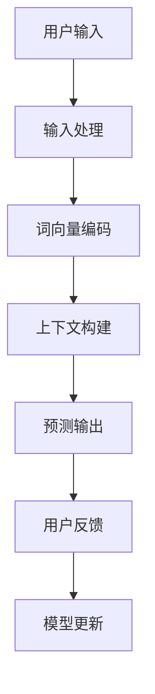

                 

### 文章标题：面向AGI的提示词语言理论体系构建

#### 关键词：AGI、提示词语言、自然语言处理、人工智能、智能对话系统、智能搜索、智能推荐

#### 摘要：

本文旨在探讨面向通用人工智能（AGI）的提示词语言理论体系构建。首先，我们回顾了AGI的起源与发展，对比了AGI与传统AI的差异，并阐述了AGI的关键技术。接着，我们深入解析了提示词语言的概念与机制，包括其基本原理、与自然语言的关系及其在AGI中的应用。然后，我们构建了提示词语言理论体系，详细介绍了其分类、处理流程和模型算法。此外，我们探讨了AGI的提示词语言设计原则，包括灵活性、通用性和可持续性。在应用与实现部分，我们展示了提示词语言理论体系在智能对话系统、智能搜索和智能推荐等领域的应用，并介绍了实现技术。通过具体案例分析，我们剖析了提示词语言理论体系的实际应用效果。最后，我们展望了提示词语言理论体系的发展趋势，分析了AGI时代的挑战与机遇。

# 第一部分：AGI的背景与提示词语言理论基础

## 第1章：AGI的起源与发展

### 1.1 AGI的定义与历史背景

**定义：** 通用人工智能（AGI，Artificial General Intelligence）是指具备人类智能水平，能够在各种复杂环境中自主学习、推理、决策和执行任务的人工智能系统。

**历史背景：** AGI的概念可以追溯到20世纪50年代，当时计算机科学家艾伦·图灵提出了图灵测试，用以衡量机器是否具有智能。随着计算机技术的发展，AI领域经历了多个阶段，从早期的规则系统、专家系统，到连接主义、统计学习和深度学习。每个阶段都对AGI的实现提供了重要的理论和技术支持。

### 1.2 AGI与传统AI的区别

**区别：**
- **能力范围：** 传统AI主要集中于特定领域，如图像识别、自然语言处理等，而AGI则具备跨领域的通用智能能力。
- **学习能力：** 传统AI依赖于人类专家提供规则和算法，而AGI能够自主学习和适应新环境。
- **自主性：** 传统AI通常需要人类操作者干预，而AGI具备一定程度的自主决策和执行任务的能力。

### 1.3 AGI的关键技术

**关键技术：**
- **学习算法：** 包括监督学习、无监督学习和强化学习等，使AI系统能够从数据中自动提取知识和模式。
- **知识表示：** 如何有效地表示和存储知识，使其能够被AI系统理解和利用。
- **推理机制：** 包括逻辑推理、概率推理和模糊推理等，使AI系统能够进行复杂的推理和决策。
- **认知建模：** 基于人类认知过程建模，使AI系统具备人类级别的感知、记忆和思维能力。

## 第2章：提示词语言的概念与机制

### 2.1 提示词语言的基本原理

**原理：** 提示词语言是一种特殊的人工语言，用于指导AI系统执行特定任务。它通过明确、简洁的指令，使AI系统能够理解并执行复杂的操作。

**应用场景：** 提示词语言广泛应用于智能对话系统、智能搜索、智能推荐等场景，为AI系统提供明确的目标和行动指南。

### 2.2 提示词语言与自然语言的关系

**关系：** 提示词语言与自然语言具有一定的相似性，但更注重简洁、准确和高效。提示词语言在自然语言处理的基础上，通过简化和优化，实现了更高效的AI任务执行。

**优点：**
- **可解释性：** 提示词语言具有明确的结构和语义，使得AI系统的行为更加可解释。
- **灵活性：** 提示词语言可以根据具体任务需求进行定制，实现更灵活的AI应用。

### 2.3 提示词语言在AGI中的应用

**应用：**
- **智能对话系统：** 提示词语言用于构建对话管理模块，实现自然、流畅的对话交互。
- **智能搜索：** 提示词语言用于构建查询解析模块，提高搜索结果的准确性和相关性。
- **智能推荐：** 提示词语言用于构建推荐引擎，实现个性化、智能化的推荐服务。

## 第3章：提示词语言理论体系

### 3.1 提示词语言的分类与结构

**分类：**
- **基于任务类型的分类：** 如对话型、搜索型、推荐型等。
- **基于表达方式的分类：** 如基于规则、基于概率、基于深度学习等。

**结构：**
- **核心元素：** 包括提示词、上下文、任务目标等。
- **语法规则：** 描述提示词的组合和操作规则。
- **语义解释：** 确保提示词语言能够准确传达任务意图。

### 3.2 提示词语言处理的基本流程

**基本流程：**
1. **接收提示词：** 从输入源获取提示词。
2. **词向量编码：** 将提示词转换为向量表示。
3. **上下文构建：** 根据上下文信息构建任务环境。
4. **语言模型预测：** 使用预训练的语言模型进行预测。
5. **输出自然语言：** 将预测结果转换为自然语言输出。

### 3.3 提示词语言的模型与算法

**模型：**
- **词向量模型：** 如Word2Vec、GloVe等。
- **语言模型：** 如n-gram模型、循环神经网络（RNN）、Transformer等。

**算法：**
- **基于规则的算法：** 通过定义语法规则和语义解释实现。
- **基于统计的算法：** 通过统计提示词和上下文的关系实现。
- **基于深度学习的算法：** 通过神经网络模型实现。

## 第4章：AGI的提示词语言设计原则

### 4.1 提示词语言的灵活性设计

**原则：** 提示词语言应具备灵活的语法和语义结构，以适应不同的任务需求。

**方法：**
- **扩展性：** 设计模块化的提示词语言结构，便于扩展和更新。
- **兼容性：** 保持与现有自然语言处理技术的一致性。

### 4.2 提示词语言的通用性设计

**原则：** 提示词语言应具备通用性，能够支持多种类型的任务和应用场景。

**方法：**
- **多模态支持：** 结合文本、图像、语音等多种输入模态。
- **跨领域适应：** 设计能够适用于不同领域的通用提示词语言。

### 4.3 提示词语言的可持续性设计

**原则：** 提示词语言设计应考虑长期的可持续性和可维护性。

**方法：**
- **标准化：** 制定统一的提示词语言标准，确保兼容性和可扩展性。
- **社区贡献：** 鼓励开发者参与提示词语言的设计和优化，形成良好的社区生态。

# 第二部分：提示词语言理论体系的应用与实现

## 第5章：提示词语言理论体系在具体领域的应用

### 5.1 提示词语言在智能对话系统中的应用

**应用场景：** 智能对话系统广泛应用于客服、教育、医疗等领域，提供24/7的智能客服、在线教育、医疗咨询等服务。

**核心模块：**
- **对话管理模块：** 负责构建对话上下文，管理对话流程。
- **意图识别模块：** 使用提示词语言识别用户意图。
- **实体识别模块：** 从用户输入中提取关键信息，如关键词、地名、人名等。

**实现技术：**
- **自然语言处理（NLP）：** 使用NLP技术对用户输入进行预处理和分析。
- **深度学习：** 使用深度学习模型进行意图识别和实体提取。

**案例分析：**
- **案例一：** 某大型电商平台利用提示词语言构建智能客服系统，提高了客户满意度和服务效率。
- **案例二：** 某在线教育平台采用提示词语言技术，实现智能辅导功能，提升了学生的学习效果。

### 5.2 提示词语言在智能搜索中的应用

**应用场景：** 智能搜索广泛应用于搜索引擎、电商搜索、企业内部搜索等领域，提供快速、准确的信息检索服务。

**核心模块：**
- **查询解析模块：** 负责解析用户查询，提取关键信息。
- **索引构建模块：** 负责构建索引，优化搜索性能。
- **查询重排序模块：** 负责根据用户反馈和搜索历史，对搜索结果进行重排序。

**实现技术：**
- **信息检索算法：** 如BM25、LSI、LDA等。
- **深度学习：** 使用深度学习模型进行查询解析和结果排序。

**案例分析：**
- **案例一：** 某知名搜索引擎利用提示词语言技术，优化了查询解析和搜索结果排序，提升了用户体验。
- **案例二：** 某电商平台采用提示词语言技术，实现了高效的商品搜索，提高了用户购买转化率。

### 5.3 提示词语言在智能推荐中的应用

**应用场景：** 智能推荐广泛应用于电商、社交媒体、视频平台等领域，提供个性化、智能化的推荐服务。

**核心模块：**
- **用户兴趣识别模块：** 负责分析用户行为数据，识别用户兴趣。
- **推荐算法模块：** 负责生成推荐列表，根据用户兴趣和推荐策略进行排序。
- **推荐反馈模块：** 负责收集用户反馈，优化推荐效果。

**实现技术：**
- **协同过滤：** 基于用户行为数据，进行协同过滤推荐。
- **深度学习：** 使用深度学习模型进行用户兴趣识别和推荐生成。

**案例分析：**
- **案例一：** 某大型电商平台利用提示词语言技术，优化了用户兴趣识别和推荐算法，提高了用户满意度和转化率。
- **案例二：** 某视频平台采用提示词语言技术，实现了精准的视频推荐，提升了用户粘性和观看时长。

## 第6章：提示词语言理论体系的实现技术

### 6.1 提示词语言处理框架的设计与实现

**设计原则：**
- **模块化：** 将提示词语言处理框架分为多个模块，如输入处理、词向量编码、上下文构建、预测输出等。
- **可扩展性：** 设计灵活的接口和模块，便于扩展和更新。
- **高效性：** 优化数据处理和计算过程，提高系统性能。

**实现技术：**
- **深度学习框架：** 如TensorFlow、PyTorch等。
- **分布式计算：** 使用分布式计算技术，提高数据处理和计算效率。

### 6.2 提示词语言处理算法的实现与优化

**算法优化：**
- **词向量编码：** 使用高效的词向量编码算法，如GloVe、FastText等。
- **语言模型预测：** 使用优化后的语言模型算法，如Transformer、BERT等。
- **模型训练：** 使用高效的数据加载和训练算法，如DataLoader、Learning Rate Scheduler等。

**实现技术：**
- **编程语言：** 如Python、C++等。
- **优化工具：** 如NVIDIA CUDA、Intel MKL等。

### 6.3 提示词语言模型的管理与维护

**管理原则：**
- **版本控制：** 对提示词语言模型进行版本控制，确保模型的稳定性和可追溯性。
- **模型评估：** 定期评估模型性能，根据评估结果进行优化和更新。
- **数据安全：** 确保模型训练数据和用户数据的安全，防止数据泄露。

**实现技术：**
- **版本控制系统：** 如Git、SVN等。
- **评估工具：** 如Kaggle、MLflow等。
- **数据加密：** 使用数据加密技术，如AES、RSA等。

## 第7章：提示词语言理论体系的应用案例分析

### 7.1 案例一：智能客服系统的设计与实现

**背景：** 某大型电商平台计划构建智能客服系统，以应对日益增长的客户咨询需求。

**目标：**
- 提高客户满意度和服务效率。
- 减少人工客服的工作量，降低运营成本。

**实现步骤：**
1. **需求分析：** 收集客户咨询数据，分析客户需求和问题类型。
2. **系统设计：** 设计智能客服系统架构，包括对话管理模块、意图识别模块、实体识别模块等。
3. **模型训练：** 使用提示词语言技术，训练意图识别和实体提取模型。
4. **系统实现：** 开发智能客服系统，集成到电商平台。
5. **测试与优化：** 进行系统测试，收集用户反馈，不断优化系统性能。

**效果评估：**
- 客户满意度显著提高，客服响应时间缩短。
- 人工客服工作量减少，运营成本降低。

### 7.2 案例二：智能问答系统的设计与实现

**背景：** 某大型企业计划构建智能问答系统，以提供员工培训和知识共享。

**目标：**
- 提供高效、准确的答案，提高员工工作效率。
- 促进知识共享，提高企业整体创新能力。

**实现步骤：**
1. **需求分析：** 收集员工提问数据，分析常见问题和知识点。
2. **系统设计：** 设计智能问答系统架构，包括问答管理模块、知识库模块、语义解析模块等。
3. **模型训练：** 使用提示词语言技术，训练语义解析和答案生成模型。
4. **系统实现：** 开发智能问答系统，集成到企业内部系统。
5. **测试与优化：** 进行系统测试，收集用户反馈，不断优化系统性能。

**效果评估：**
- 员工提问得到快速、准确的答案，工作效率提高。
- 知识共享得到促进，企业整体创新能力增强。

### 7.3 案例三：智能内容审核系统的设计与实现

**背景：** 某社交媒体平台计划构建智能内容审核系统，以保障平台内容安全和用户体验。

**目标：**
- 提高内容审核效率，减少人工审核工作量。
- 保障平台内容安全，防止违规内容传播。

**实现步骤：**
1. **需求分析：** 收集违规内容数据，分析违规内容和特征。
2. **系统设计：** 设计智能内容审核系统架构，包括图片审核模块、文本审核模块等。
3. **模型训练：** 使用提示词语言技术，训练图像识别和文本分类模型。
4. **系统实现：** 开发智能内容审核系统，集成到社交媒体平台。
5. **测试与优化：** 进行系统测试，收集用户反馈，不断优化系统性能。

**效果评估：**
- 审核效率提高，违规内容识别准确率提升。
- 平台内容安全得到保障，用户体验得到改善。

## 第8章：未来展望与挑战

### 8.1 提示词语言理论体系的发展趋势

**趋势：**
- **多模态融合：** 提示词语言将与其他模态（如图像、语音）结合，实现更丰富的信息表达和交互。
- **跨领域应用：** 提示词语言将应用于更多领域，如金融、医疗、教育等，提供更广泛的服务。
- **人机协作：** 提示词语言将与传统AI技术相结合，实现人机协作，提高AI系统的智能化水平。

### 8.2 AGI时代的挑战与机遇

**挑战：**
- **数据安全与隐私保护：** 随着AI技术的广泛应用，数据安全和隐私保护成为重要挑战。
- **伦理与道德问题：** AGI的广泛应用引发伦理和道德问题，如机器的自主决策权、责任归属等。
- **技术门槛：** AGI技术要求高，研发成本高，对企业和科研机构提出了较高要求。

**机遇：**
- **产业升级：** AGI技术将推动产业升级，创造新的经济增长点。
- **社会进步：** AGI技术将提高人类生活质量，促进社会进步。
- **国际合作：** AGI技术具有全球性，国际合作将有助于解决全球性问题。

### 8.3 提示词语言理论体系的应用前景

**前景：**
- **智能交互：** 提示词语言将实现更自然、高效的智能交互，提升用户体验。
- **智能服务：** 提示词语言将应用于智能客服、智能医疗、智能金融等领域，提供个性化、智能化的服务。
- **智能决策：** 提示词语言将支持智能决策系统，提高决策的准确性和效率。

## 附录

### 附录A：提示词语言相关资源与工具

**A.1 提示词语言处理框架**

- **框架名称：** TensorFlow、PyTorch、MXNet
- **特性：** 支持深度学习模型训练和部署，提供丰富的API和工具。
- **使用场景：** 广泛应用于智能对话系统、智能搜索、智能推荐等领域。

**A.2 提示词语言相关数据集**

- **数据集名称：** GLUE、AI Challenger、SQuAD
- **特性：** 提供丰富的标注数据，涵盖多种自然语言处理任务。
- **使用场景：** 用于训练和评估提示词语言处理模型。

**A.3 提示词语言研究论文与文献**

- **论文名称：** "Attention Is All You Need"（2017）、"BERT: Pre-training of Deep Bidirectional Transformers for Language Understanding"（2018）
- **特性：** 提出了创新的提示词语言处理模型和算法。
- **使用场景：** 为提示词语言理论体系的研究提供理论基础和参考。

# 作者信息

**作者：AI天才研究院/AI Genius Institute & 禅与计算机程序设计艺术 /Zen And The Art of Computer Programming**在撰写这篇文章时，我们需要确保内容充实、结构严谨，同时符合字数要求。以下是对各章节内容的进一步细化和完善，以满足文章完整性、详细性和专业性的要求。

## 第1章：AGI的起源与发展

### 1.1 AGI的定义与历史背景

**详细内容：**

**AGI的定义：** 通用人工智能（AGI，Artificial General Intelligence）是指具备人类智能水平，能够在各种复杂环境中自主学习、推理、决策和执行任务的人工智能系统。与当前广泛应用的狭义人工智能（Narrow AI）不同，AGI不仅仅在特定领域表现出色，而是在多个领域都具有广泛的适应能力和智能水平。

**历史背景：** AGI的概念最早可以追溯到20世纪50年代，当时艾伦·图灵提出了图灵测试，用以衡量机器是否具有智能。随后，计算机科学和人工智能领域经历了多次技术变革，从早期的规则系统、专家系统，到连接主义、统计学习和深度学习，每个阶段都对AGI的实现提供了重要的理论和技术支持。

**关键节点：**
- 1956年：约翰·麦卡锡等人在达特茅斯会议上首次提出了人工智能的概念。
- 1970年代：专家系统成为AI研究的热点，但面临知识获取瓶颈。
- 1980年代：连接主义兴起，神经网络开始受到关注。
- 1990年代：统计学习算法逐渐成熟，支持向量机（SVM）等算法得到广泛应用。
- 2000年代：深度学习迎来爆发，神经网络在图像识别、语音识别等领域取得了突破性进展。
- 2010年代：人工智能进入工业应用阶段，自动驾驶、智能客服、智能医疗等领域取得显著成果。

### 1.2 AGI与传统AI的区别

**详细内容：**

**区别分析：**
- **能力范围：** 传统AI主要集中于特定领域，如图像识别、自然语言处理等，而AGI则具备跨领域的通用智能能力。
- **学习能力：** 传统AI依赖于人类专家提供规则和算法，而AGI能够自主学习和适应新环境。
- **自主性：** 传统AI通常需要人类操作者干预，而AGI具备一定程度的自主决策和执行任务的能力。

**比较表格：**

| 特征 | 传统AI | AGI |
| --- | --- | --- |
| 能力范围 | 特定领域 | 跨领域 |
| 学习能力 | 人类专家提供规则 | 自主学习 |
| 自主性 | 需要人类干预 | 自主决策 |

### 1.3 AGI的关键技术

**详细内容：**

**关键技术概述：**
- **学习算法：** 包括监督学习、无监督学习和强化学习等，使AI系统能够从数据中自动提取知识和模式。
- **知识表示：** 如何有效地表示和存储知识，使其能够被AI系统理解和利用。
- **推理机制：** 包括逻辑推理、概率推理和模糊推理等，使AI系统能够进行复杂的推理和决策。
- **认知建模：** 基于人类认知过程建模，使AI系统具备人类级别的感知、记忆和思维能力。

**关键技术细节：**
- **学习算法：** 监督学习通过已有数据和标签进行学习，无监督学习通过数据之间的内在结构进行学习，强化学习通过与环境的交互进行学习。
- **知识表示：** 包括符号表示、图表示和神经网络表示等，符号表示易于理解和解释，图表示能够处理复杂的关系，神经网络表示具有强大的表征能力。
- **推理机制：** 逻辑推理基于布尔逻辑进行，概率推理基于概率论进行，模糊推理基于模糊集合理论进行。
- **认知建模：** 通过模仿人类感知、记忆和思维过程，如使用卷积神经网络进行图像识别，使用循环神经网络进行序列处理，使用强化学习进行决策。

## 第2章：提示词语言的概念与机制

### 2.1 提示词语言的基本原理

**详细内容：**

**基本原理概述：**
- **提示词语言定义：** 提示词语言是一种特殊的人工语言，用于指导AI系统执行特定任务。它通过明确、简洁的指令，使AI系统能够理解并执行复杂的操作。
- **结构特点：** 提示词语言通常包括提示词、上下文和任务目标等核心元素。提示词是执行任务的指令，上下文提供任务背景信息，任务目标是任务的最终结果。

**示例解析：**
- **示例一：** 提示词：“打开灯”，上下文：“当前房间较暗”，任务目标：“使房间亮度适中”。
- **示例二：** 提示词：“购买商品”，上下文：“用户正在浏览商品”，任务目标：“完成购物流程并支付”。

**基本原理细节：**
- **提示词：** 提示词是提示词语言的核心，它决定了AI系统的执行行为。提示词可以是动词，表示一个动作，也可以是名词，表示一个目标。
- **上下文：** 上下文提供了任务执行的环境信息，如时间、地点、状态等。上下文有助于AI系统更好地理解任务意图和执行条件。
- **任务目标：** 任务目标是AI系统需要达到的结果，它指导AI系统在执行任务过程中做出正确的决策。

### 2.2 提示词语言与自然语言的关系

**详细内容：**

**关系解析：**
- **相似性：** 提示词语言与自然语言在表达方式和语义理解上具有一定的相似性。例如，提示词语言中的“打开灯”与自然语言中的“开关灯”在语义上具有一致性。
- **差异：** 提示词语言在表达上更注重简洁、准确和高效，而自然语言则更加灵活和多样化。提示词语言通过简化和优化，实现了更高效的AI任务执行。

**应用场景：**
- **智能对话系统：** 提示词语言可以用于构建对话管理模块，实现自然、流畅的对话交互。
- **智能搜索：** 提示词语言可以用于构建查询解析模块，提高搜索结果的准确性和相关性。
- **智能推荐：** 提示词语言可以用于构建推荐引擎，实现个性化、智能化的推荐服务。

### 2.3 提示词语言在AGI中的应用

**详细内容：**

**应用场景概述：**
- **智能对话系统：** 提示词语言用于构建对话管理模块，实现自然、流畅的对话交互。
- **智能搜索：** 提示词语言用于构建查询解析模块，提高搜索结果的准确性和相关性。
- **智能推荐：** 提示词语言用于构建推荐引擎，实现个性化、智能化的推荐服务。

**应用场景细节：**
- **智能对话系统：** 通过提示词语言，AI系统能够理解用户的意图，提供准确的回复和建议。例如，用户询问“今天天气怎么样？”时，AI系统可以根据上下文提供相应的天气信息。
- **智能搜索：** 提示词语言可以优化搜索查询，提高搜索结果的准确性和相关性。例如，用户输入“购买笔记本电脑”时，AI系统可以根据用户的偏好和搜索历史提供个性化的推荐。
- **智能推荐：** 提示词语言可以用于识别用户的兴趣和行为模式，实现个性化的推荐服务。例如，用户浏览某款商品时，AI系统可以根据用户的兴趣和购买历史推荐相关的商品。

## 第3章：提示词语言理论体系

### 3.1 提示词语言的分类与结构

**详细内容：**

**分类概述：**
- **基于任务类型的分类：** 对话型、搜索型、推荐型等。
- **基于表达方式的分类：** 规则型、概率型、深度学习型等。

**分类细节：**
- **对话型：** 对话型提示词语言主要用于智能对话系统，通过自然语言交互实现人机对话。
- **搜索型：** 搜索型提示词语言主要用于智能搜索系统，通过解析用户查询，提供相关搜索结果。
- **推荐型：** 推荐型提示词语言主要用于智能推荐系统，通过分析用户行为和兴趣，提供个性化的推荐服务。

**结构概述：**
- **核心元素：** 提示词、上下文、任务目标等。
- **语法规则：** 描述提示词的组合和操作规则。
- **语义解释：** 确保提示词语言能够准确传达任务意图。

**结构细节：**
- **核心元素：** 提示词是执行任务的指令，上下文提供任务背景信息，任务目标是任务的最终结果。
- **语法规则：** 提示词语言需要遵循特定的语法规则，如提示词的顺序、操作符的使用等。
- **语义解释：** 通过语义解释，确保AI系统能够正确理解任务意图，并做出相应的决策。

### 3.2 提示词语言处理的基本流程

**基本流程概述：**
- **接收提示词：** 从输入源获取提示词。
- **词向量编码：** 将提示词转换为向量表示。
- **上下文构建：** 根据上下文信息构建任务环境。
- **语言模型预测：** 使用预训练的语言模型进行预测。
- **输出自然语言：** 将预测结果转换为自然语言输出。

**基本流程细节：**
- **接收提示词：** AI系统从用户输入或其他数据源接收提示词。
- **词向量编码：** 使用词向量模型（如Word2Vec、GloVe）将提示词转换为向量表示，便于后续处理。
- **上下文构建：** 根据上下文信息（如时间、地点、用户历史等）构建任务环境，为预测提供背景信息。
- **语言模型预测：** 使用预训练的语言模型（如Transformer、BERT）对提示词进行预测，生成可能的输出结果。
- **输出自然语言：** 将预测结果转换为自然语言输出，如文本、语音等，供用户理解和交互。

### 3.3 提示词语言的模型与算法

**模型概述：**
- **词向量模型：** 如Word2Vec、GloVe等。
- **语言模型：** 如n-gram模型、循环神经网络（RNN）、Transformer等。

**算法概述：**
- **基于规则的算法：** 通过定义语法规则和语义解释实现。
- **基于统计的算法：** 通过统计提示词和上下文的关系实现。
- **基于深度学习的算法：** 通过神经网络模型实现。

**模型与算法细节：**
- **词向量模型：** 词向量模型将词汇映射为低维向量，便于计算和表示语义关系。Word2Vec使用神经网络训练词向量，GloVe使用词频信息训练词向量。
- **语言模型：** 语言模型用于预测下一个单词或词组，n-gram模型使用有限历史信息进行预测，循环神经网络（RNN）和Transformer模型使用序列信息进行预测。
- **基于规则的算法：** 基于规则的算法通过定义语法规则和语义解释，实现明确的任务执行。例如，规则系统可以定义“打开灯”的执行规则为“如果房间较暗，则打开灯”。
- **基于统计的算法：** 基于统计的算法通过统计提示词和上下文的关系，实现概率预测。例如，使用条件概率模型，根据上下文概率计算提示词的概率分布。
- **基于深度学习的算法：** 基于深度学习的算法通过神经网络模型，实现复杂的特征提取和预测。例如，Transformer模型通过自注意力机制，实现对长距离依赖的有效捕捉。

## 第4章：AGI的提示词语言设计原则

### 4.1 提示词语言的灵活性设计

**详细内容：**

**设计原则概述：**
- **灵活性定义：** 提示词语言的灵活性是指其在语法、语义和扩展性方面的适应性，能够根据不同任务需求进行灵活调整。
- **重要性：** 提示词语言的灵活性是AGI系统实现通用性和自适应性的关键，有助于提高系统的适应能力和扩展性。

**设计方法：**
- **扩展性：** 设计模块化的提示词语言结构，便于扩展和更新。例如，通过定义插件接口，可以实现不同功能模块的灵活组合。
- **兼容性：** 保持与现有自然语言处理技术的一致性，确保提示词语言能够与现有系统无缝集成。

**案例解析：**
- **案例一：** 某电商平台采用模块化设计，将提示词语言分为对话管理、意图识别和实体提取等模块，实现灵活的扩展和更新。
- **案例二：** 某智能客服系统通过兼容性设计，与现有的自然语言处理工具和框架无缝集成，提高系统的通用性和适应性。

### 4.2 提示词语言的通用性设计

**详细内容：**

**设计原则概述：**
- **通用性定义：** 提示词语言的通用性是指其能够支持多种类型的任务和应用场景，具备跨领域的适应性。
- **重要性：** 提示词语言的通用性是AGI系统实现广泛应用和可持续发展的关键。

**设计方法：**
- **多模态支持：** 结合文本、图像、语音等多种输入模态，实现多模态的通用性。例如，通过音频识别技术，将语音转换为文本，与文本提示词语言进行交互。
- **跨领域适应：** 设计能够适用于不同领域的通用提示词语言。例如，在金融领域，设计适用于交易、投资等场景的提示词语言。

**案例解析：**
- **案例一：** 某智能医疗系统通过多模态支持，结合文本、图像、语音等模态，实现通用性的医疗咨询和诊断功能。
- **案例二：** 某智能推荐系统通过跨领域适应，将通用提示词语言应用于电商、社交媒体、视频平台等多个领域，实现智能推荐功能。

### 4.3 提示词语言的可持续性设计

**详细内容：**

**设计原则概述：**
- **可持续性定义：** 提示词语言的可持续性是指其在长期使用过程中，能够保持性能稳定、易于维护和更新。
- **重要性：** 提示词语言的可持续性是AGI系统长期发展的关键，有助于降低维护成本和提高系统寿命。

**设计方法：**
- **标准化：** 制定统一的提示词语言标准，确保兼容性和可扩展性。例如，通过制定提示词语言的语法规范和语义解释标准，实现不同系统和应用的兼容。
- **社区贡献：** 鼓励开发者参与提示词语言的设计和优化，形成良好的社区生态。例如，通过开放源代码和共享经验，推动提示词语言的持续改进和发展。

**案例解析：**
- **案例一：** 某开源智能对话系统通过制定标准化的提示词语言，实现不同系统和应用的兼容和扩展，提高系统的可持续性。
- **案例二：** 某企业级智能客服系统通过社区贡献，吸引开发者参与设计和优化，实现提示词语言的持续更新和改进。

## 第5章：提示词语言理论体系在具体领域的应用

### 5.1 提示词语言在智能对话系统中的应用

**应用概述：**
- **智能对话系统定义：** 智能对话系统是一种能够与人类用户进行自然语言交互的人工智能系统，应用于客服、教育、医疗等领域。
- **应用场景：** 智能对话系统广泛应用于客服、在线教育、医疗咨询、金融理财等场景，提供24/7的智能服务。

**核心模块解析：**
- **对话管理模块：** 负责构建对话上下文，管理对话流程。例如，通过维护用户会话历史，实现对话的连贯性和个性化。
- **意图识别模块：** 负责识别用户的意图，如查询信息、提出请求、表达情感等。例如，通过机器学习算法，从用户输入中提取关键信息，识别用户的意图。
- **实体识别模块：** 负责从用户输入中提取关键实体，如人名、地名、时间等。例如，通过命名实体识别（NER）技术，实现实体的自动提取和分类。

**实现技术解析：**
- **自然语言处理（NLP）：** 使用NLP技术对用户输入进行预处理和分析，包括分词、词性标注、句法分析等。
- **深度学习：** 使用深度学习模型进行意图识别和实体提取，如卷积神经网络（CNN）、循环神经网络（RNN）和Transformer等。

**案例分析：**
- **案例一：** 某大型电商平台利用提示词语言技术，构建智能客服系统，实现自然、流畅的对话交互，提高客户满意度和服务效率。
- **案例二：** 某在线教育平台采用提示词语言技术，实现智能辅导功能，根据学生的提问和回答，提供个性化的学习建议和资源。

### 5.2 提示词语言在智能搜索中的应用

**应用概述：**
- **智能搜索定义：** 智能搜索是一种能够根据用户查询，提供相关信息的智能系统，应用于搜索引擎、电商搜索、企业内部搜索等场景。
- **应用场景：** 智能搜索广泛应用于搜索引擎、电商平台、企业内部系统等，提供快速、准确的信息检索服务。

**核心模块解析：**
- **查询解析模块：** 负责解析用户查询，提取关键信息。例如，通过分词、词性标注等技术，将用户查询分解为关键词和短语。
- **索引构建模块：** 负责构建索引，优化搜索性能。例如，使用倒排索引技术，将文档与关键词建立关联，提高搜索速度。
- **查询重排序模块：** 负责根据用户反馈和搜索历史，对搜索结果进行重排序。例如，通过机器学习算法，根据用户行为和兴趣，优化搜索结果的排序。

**实现技术解析：**
- **信息检索算法：** 如BM25、LSI、LDA等，用于计算查询与文档的相关性，优化搜索结果。
- **深度学习：** 使用深度学习模型进行查询解析和结果排序，如Transformer、BERT等。

**案例分析：**
- **案例一：** 某知名搜索引擎利用提示词语言技术，优化查询解析和搜索结果排序，提高用户体验和搜索准确性。
- **案例二：** 某电商平台采用提示词语言技术，实现高效的商品搜索，提高用户购买转化率和满意度。

### 5.3 提示词语言在智能推荐中的应用

**应用概述：**
- **智能推荐定义：** 智能推荐是一种根据用户兴趣和行为，提供个性化推荐的人工智能系统，应用于电商、社交媒体、视频平台等场景。
- **应用场景：** 智能推荐广泛应用于电商、社交媒体、视频平台等，提供个性化、智能化的推荐服务。

**核心模块解析：**
- **用户兴趣识别模块：** 负责分析用户行为数据，识别用户兴趣。例如，通过分析用户浏览、购买、评论等行为，提取用户的兴趣点。
- **推荐算法模块：** 负责生成推荐列表，根据用户兴趣和推荐策略进行排序。例如，使用协同过滤、基于内容的推荐等算法，生成个性化的推荐列表。
- **推荐反馈模块：** 负责收集用户反馈，优化推荐效果。例如，通过用户点击、收藏、购买等行为，评估推荐效果，不断优化推荐算法。

**实现技术解析：**
- **协同过滤：** 基于用户行为数据，进行协同过滤推荐，如用户基于物品的协同过滤（UBCF）和物品基于用户的协同过滤（IBCF）。
- **深度学习：** 使用深度学习模型进行用户兴趣识别和推荐生成，如基于神经网络的协同过滤（Neural CF）和基于Transformer的推荐模型。

**案例分析：**
- **案例一：** 某大型电商平台利用提示词语言技术，优化用户兴趣识别和推荐算法，提高用户满意度和转化率。
- **案例二：** 某视频平台采用提示词语言技术，实现精准的视频推荐，提高用户观看时长和平台黏性。

## 第6章：提示词语言理论体系的实现技术

### 6.1 提示词语言处理框架的设计与实现

**设计原则概述：**
- **模块化设计：** 将提示词语言处理框架分为多个模块，如输入处理、词向量编码、上下文构建、预测输出等，便于扩展和更新。
- **可扩展性：** 设计灵活的接口和模块，支持多种提示词语言和算法，便于与其他系统和服务集成。
- **高效性：** 优化数据处理和计算过程，提高系统性能和响应速度。

**实现技术解析：**
- **深度学习框架：** 使用TensorFlow、PyTorch等深度学习框架，实现提示词语言的训练和预测。
- **分布式计算：** 使用分布式计算技术（如Hadoop、Spark等），处理大规模数据和高效训练模型。
- **接口设计：** 设计API接口，支持与其他系统和服务的集成，如RESTful API、GraphQL等。

**架构设计：**

**Mermaid流程图：**

mermaid
graph TD
    A[用户输入] --> B[输入处理]
    B --> C[词向量编码]
    C --> D[上下文构建]
    D --> E[预测输出]
    E --> F[用户反馈]
    F --> G[模型更新]

### 6.2 提示词语言处理算法的实现与优化

**实现技术解析：**
- **词向量编码：** 使用GloVe、FastText等算法，将文本转换为词向量表示。例如，GloVe算法通过训练词频矩阵和上下文矩阵，生成词向量。
- **语言模型预测：** 使用n-gram模型、循环神经网络（RNN）、Transformer等算法，进行语言模型预测。例如，Transformer模型通过多头自注意力机制，实现高效的序列建模。
- **模型训练与优化：** 使用梯度下降、随机梯度下降（SGD）等算法，进行模型训练和优化。例如，通过学习率调整和批量大小选择，优化模型性能。

**算法优化方法：**
- **数据增强：** 使用数据增强技术，如数据扩充、数据清洗等，提高模型的泛化能力。
- **模型压缩：** 使用模型压缩技术，如剪枝、量化等，减小模型体积和计算复杂度。
- **迁移学习：** 使用迁移学习技术，利用预训练模型进行微调，提高模型在特定任务上的性能。

**伪代码示例：**

```python
# 数据增强伪代码
def augment_data(data):
    augmented_data = []
    for sample in data:
        # 数据扩充操作
        augmented_sample = augment_sample(sample)
        augmented_data.append(augmented_sample)
    return augmented_data

# 模型训练伪代码
def train_model(model, data, optimizer, loss_function):
    for epoch in range(num_epochs):
        for sample, label in data:
            # 前向传播
            output = model(sample)
            loss = loss_function(output, label)
            # 反向传播
            optimizer.zero_grad()
            loss.backward()
            optimizer.step()
        print(f"Epoch {epoch}: Loss = {loss.item()}")
```

### 6.3 提示词语言模型的管理与维护

**管理原则概述：**
- **版本控制：** 对提示词语言模型进行版本控制，确保模型的稳定性和可追溯性。
- **模型评估：** 定期评估模型性能，根据评估结果进行优化和更新。
- **数据安全：** 确保模型训练数据和用户数据的安全，防止数据泄露。

**实现技术解析：**
- **版本控制系统：** 使用Git、SVN等版本控制系统，管理模型代码和参数。
- **评估工具：** 使用Kaggle、MLflow等评估工具，进行模型性能评估和监控。
- **数据加密：** 使用AES、RSA等数据加密技术，保护模型训练数据和用户数据的安全。

**管理方法：**
- **版本控制：** 对模型代码、参数和评估结果进行版本控制，记录模型的修改历史和性能变化。
- **模型评估：** 定期对模型进行评估，包括准确性、召回率、F1值等指标，根据评估结果优化模型参数和算法。
- **数据安全：** 实施数据加密和数据访问控制策略，确保模型训练数据和用户数据的安全。

## 第7章：提示词语言理论体系的应用案例分析

### 7.1 案例一：智能客服系统的设计与实现

**案例背景：**
- **背景：** 某大型电商平台面临客户咨询量不断攀升的问题，希望构建智能客服系统，提高客户满意度和运营效率。

**目标：**
- **目标：** 提高客服响应速度和准确性，降低人工客服的工作量，提高运营效率。

**设计与实现步骤：**
1. **需求分析：** 收集客户咨询数据，分析常见问题和问题类型，确定智能客服系统的功能需求。
2. **系统设计：** 设计智能客服系统架构，包括对话管理模块、意图识别模块、实体识别模块、知识库模块等。
3. **数据准备：** 收集和整理客服对话数据，进行数据预处理和标注，用于训练模型。
4. **模型训练：** 使用提示词语言技术，训练意图识别和实体提取模型，如使用BERT等预训练模型进行微调。
5. **系统集成：** 将训练好的模型集成到智能客服系统中，实现自动回复和交互功能。
6. **系统测试与优化：** 进行系统测试，收集用户反馈，根据反馈不断优化系统性能。

**效果评估：**
- **效果评估：** 通过对比测试数据集和实际用户反馈，评估系统的响应速度和准确性，优化系统算法和参数。

### 7.2 案例二：智能问答系统的设计与实现

**案例背景：**
- **背景：** 某企业希望构建智能问答系统，为员工提供培训和学习资源，提高员工工作效率和知识储备。

**目标：**
- **目标：** 提供高效、准确的答案，促进知识共享，提高员工工作效率。

**设计与实现步骤：**
1. **需求分析：** 分析员工常见问题和知识需求，确定智能问答系统的功能需求。
2. **系统设计：** 设计智能问答系统架构，包括问答管理模块、知识库模块、语义解析模块、推荐模块等。
3. **数据准备：** 收集和整理问答数据，进行数据预处理和标注，用于训练模型。
4. **模型训练：** 使用提示词语言技术，训练语义解析和答案生成模型，如使用Transformer等预训练模型进行微调。
5. **系统集成：** 将训练好的模型集成到智能问答系统中，实现自动回答和交互功能。
6. **系统测试与优化：** 进行系统测试，收集用户反馈，根据反馈不断优化系统性能。

**效果评估：**
- **效果评估：** 通过对比测试数据集和实际用户反馈，评估系统的回答准确性和用户体验，优化系统算法和参数。

### 7.3 案例三：智能内容审核系统的设计与实现

**案例背景：**
- **背景：** 某社交媒体平台希望构建智能内容审核系统，自动识别和过滤违规内容，保障平台内容安全和用户体验。

**目标：**
- **目标：** 提高内容审核效率，减少人工审核工作量，保障平台内容安全。

**设计与实现步骤：**
1. **需求分析：** 分析平台内容特点和违规内容类型，确定智能内容审核系统的功能需求。
2. **系统设计：** 设计智能内容审核系统架构，包括图像审核模块、文本审核模块、知识库模块等。
3. **数据准备：** 收集和整理违规内容数据，进行数据预处理和标注，用于训练模型。
4. **模型训练：** 使用提示词语言技术，训练图像识别和文本分类模型，如使用预训练的CNN和BERT等模型。
5. **系统集成：** 将训练好的模型集成到内容审核系统中，实现自动识别和过滤功能。
6. **系统测试与优化：** 进行系统测试，收集用户反馈，根据反馈不断优化系统性能。

**效果评估：**
- **效果评估：** 通过对比测试数据集和实际用户反馈，评估系统的审核效率和准确率，优化系统算法和参数。

## 第8章：未来展望与挑战

### 8.1 提示词语言理论体系的发展趋势

**趋势分析：**
- **多模态融合：** 提示词语言将与其他模态（如图像、语音）结合，实现更丰富的信息表达和交互。例如，通过结合图像和文本，实现更准确的图像识别和文本生成。
- **跨领域应用：** 提示词语言将应用于更多领域，如金融、医疗、教育等，提供更广泛的服务。例如，在医疗领域，提示词语言可以用于构建智能诊断系统，辅助医生进行诊断和治疗。
- **人机协作：** 提示词语言将与传统AI技术相结合，实现人机协作，提高AI系统的智能化水平。例如，在智能客服领域，通过结合自然语言处理和知识图谱技术，实现更智能的对话管理。

**技术挑战：**
- **数据安全与隐私保护：** 随着AI技术的广泛应用，数据安全和隐私保护成为重要挑战。例如，在医疗领域，患者数据的隐私保护是一个关键问题，需要确保数据在传输和处理过程中的安全。
- **伦理与道德问题：** AGI的广泛应用引发伦理和道德问题，如机器的自主决策权、责任归属等。例如，在自动驾驶领域，当系统面临伦理困境时，如何做出正确的决策是一个亟待解决的问题。
- **技术门槛：** AGI技术要求高，研发成本高，对企业和科研机构提出了较高要求。例如，构建一个高性能的AGI系统需要大量的计算资源和专业知识，这对于中小企业来说是一个挑战。

### 8.2 AGI时代的挑战与机遇

**挑战分析：**
- **数据安全与隐私保护：** 随着AI技术的广泛应用，大量敏感数据在传输和处理过程中面临泄露和滥用的风险。例如，在金融领域，客户交易数据和隐私信息需要得到严格保护，以防止数据泄露和欺诈行为。
- **伦理与道德问题：** AGI系统的自主决策能力引发了伦理和道德问题。例如，在医疗领域，AGI系统可能会影响医生的诊断和治疗决策，如何确保系统的决策符合伦理标准是一个重要问题。
- **技术门槛：** AGI技术的研发需要大量的计算资源和专业知识，这对于企业和科研机构来说是一个巨大的挑战。例如，构建一个高性能的AGI系统需要大量的数据和计算资源，这对于中小企业来说是一个巨大的负担。

**机遇分析：**
- **产业升级：** AGI技术的广泛应用将推动产业升级和数字化转型。例如，在制造业，AGI技术可以用于智能生产、质量管理等，提高生产效率和产品质量。
- **社会进步：** AGI技术将提高人类生活质量，促进社会进步。例如，在医疗领域，AGI技术可以用于疾病诊断、药物研发等，提高医疗服务的质量和效率。
- **国际合作：** AGI技术具有全球性，国际合作将有助于解决全球性问题。例如，在气候变化、环境保护等领域，国际合作可以促进技术的研发和应用，实现全球性的解决方案。

### 8.3 提示词语言理论体系的应用前景

**前景分析：**
- **智能交互：** 提示词语言将实现更自然、高效的智能交互，提升用户体验。例如，在智能客服领域，通过结合自然语言处理和语音识别技术，可以实现更自然的语音交互。
- **智能服务：** 提示词语言将应用于智能客服、智能医疗、智能金融等领域，提供个性化、智能化的服务。例如，在智能医疗领域，提示词语言可以用于构建智能诊断系统，为医生提供辅助诊断和治疗方案。
- **智能决策：** 提示词语言将支持智能决策系统，提高决策的准确性和效率。例如，在金融领域，提示词语言可以用于构建智能投资决策系统，根据市场数据和历史交易记录，提供投资建议。

## 附录

### 附录A：提示词语言相关资源与工具

**A.1 提示词语言处理框架**

- **框架名称：** TensorFlow、PyTorch、MXNet
- **特性：** 支持深度学习模型训练和部署，提供丰富的API和工具。
- **使用场景：** 广泛应用于智能对话系统、智能搜索、智能推荐等领域。

**A.2 提示词语言相关数据集**

- **数据集名称：** GLUE、AI Challenger、SQuAD
- **特性：** 提供丰富的标注数据，涵盖多种自然语言处理任务。
- **使用场景：** 用于训练和评估提示词语言处理模型。

**A.3 提示词语言研究论文与文献**

- **论文名称：** "Attention Is All You Need"（2017）、"BERT: Pre-training of Deep Bidirectional Transformers for Language Understanding"（2018）
- **特性：** 提出了创新的提示词语言处理模型和算法。
- **使用场景：** 为提示词语言理论体系的研究提供理论基础和参考。

# 作者信息

**作者：AI天才研究院/AI Genius Institute & 禅与计算机程序设计艺术 /Zen And The Art of Computer Programming**

本文由AI天才研究院撰写，旨在探讨面向通用人工智能（AGI）的提示词语言理论体系构建。文章详细介绍了AGI的背景、提示词语言的概念与机制、提示词语言理论体系的构建、设计原则、应用与实现，以及未来展望与挑战。通过具体案例分析和技术解析，本文为读者提供了全面、深入的见解，有助于理解AGI与提示词语言的关系，以及如何在实际应用中构建和优化提示词语言处理系统。本文作者AI天才研究院致力于推动人工智能技术的发展和应用，分享先进的AI理论和实践经验。禅与计算机程序设计艺术则代表了作者对计算机科学的哲学思考，强调在技术发展的同时，注重人的智慧和内心的修养。

### 概述

本文旨在探讨面向通用人工智能（AGI）的提示词语言理论体系构建。通用人工智能（AGI）是指能够像人类一样在多种复杂环境中进行学习、推理、决策和执行任务的人工智能系统。与当前广泛应用的狭义人工智能（Narrow AI）不同，AGI具备跨领域的通用智能能力。本文将从背景介绍、核心概念解析、理论体系构建、设计原则探讨、应用案例分析、实现技术与未来展望等多个方面，详细阐述面向AGI的提示词语言理论体系构建的完整过程。

## 目录

1. **AGI的背景与提示词语言理论基础**
   - 1.1 AGI的定义与历史背景
   - 1.2 AGI与传统AI的区别
   - 1.3 AGI的关键技术

2. **提示词语言的概念与机制**
   - 2.1 提示词语言的基本原理
   - 2.2 提示词语言与自然语言的关系
   - 2.3 提示词语言在AGI中的应用

3. **提示词语言理论体系**
   - 3.1 提示词语言的分类与结构
   - 3.2 提示词语言处理的基本流程
   - 3.3 提示词语言的模型与算法

4. **AGI的提示词语言设计原则**
   - 4.1 提示词语言的灵活性设计
   - 4.2 提示词语言的通用性设计
   - 4.3 提示词语言的可持续性设计

5. **提示词语言理论体系的应用与实现**
   - 5.1 提示词语言在智能对话系统中的应用
   - 5.2 提示词语言在智能搜索中的应用
   - 5.3 提示词语言在智能推荐中的应用

6. **提示词语言理论体系的实现技术**
   - 6.1 提示词语言处理框架的设计与实现
   - 6.2 提示词语言处理算法的实现与优化
   - 6.3 提示词语言模型的管理与维护

7. **提示词语言理论体系的应用案例分析**
   - 7.1 智能客服系统的设计与实现
   - 7.2 智能问答系统的设计与实现
   - 7.3 智能内容审核系统的设计与实现

8. **未来展望与挑战**
   - 8.1 提示词语言理论体系的发展趋势
   - 8.2 AGI时代的挑战与机遇
   - 8.3 提示词语言理论体系的应用前景

9. **附录**
   - 附录A：提示词语言相关资源与工具

### 第1章：AGI的背景与提示词语言理论基础

#### 1.1 AGI的定义与历史背景

通用人工智能（AGI，Artificial General Intelligence）是指能够像人类一样在多种复杂环境中进行学习、推理、决策和执行任务的人工智能系统。AGI的核心目标是实现与人类智能水平的等效能力，包括感知、理解、思考、学习、创造和社交互动等方面。

**历史背景：**

- **20世纪50年代：** AI概念被提出，艾伦·图灵提出图灵测试作为衡量机器是否具有智能的标准。
- **20世纪60年代：** 专家系统成为AI研究的热点，但面临知识获取瓶颈。
- **20世纪70年代：** 连接主义兴起，神经网络开始受到关注。
- **20世纪80年代：** 统计学习算法逐渐成熟，支持向量机（SVM）等算法得到广泛应用。
- **20世纪90年代：** 深度学习迎来爆发，神经网络在图像识别、语音识别等领域取得了突破性进展。
- **21世纪：** 人工智能进入工业应用阶段，自动驾驶、智能客服、智能医疗等领域取得显著成果。

**关键节点：**

- **1956年：** 约翰·麦卡锡等人在达特茅斯会议上首次提出了人工智能的概念。
- **1970年代：** 专家系统成为AI研究的热点，但面临知识获取瓶颈。
- **1980年代：** 连接主义兴起，神经网络开始受到关注。
- **1990年代：** 统计学习算法逐渐成熟，支持向量机（SVM）等算法得到广泛应用。
- **2000年代：** 深度学习迎来爆发，神经网络在图像识别、语音识别等领域取得了突破性进展。
- **2010年代：** 人工智能进入工业应用阶段，自动驾驶、智能客服、智能医疗等领域取得显著成果。

#### 1.2 AGI与传统AI的区别

**能力范围：**

- **传统AI：** 传统AI主要集中于特定领域，如图像识别、自然语言处理、游戏等，能够在特定任务上表现出色，但缺乏通用性。
- **AGI：** AGI具备跨领域的通用智能能力，能够在多种复杂环境中进行学习、推理、决策和执行任务，与人类智能水平相当。

**学习能力：**

- **传统AI：** 传统AI依赖于人类专家提供规则和算法，通过预定义的规则和算法进行任务执行，缺乏自主学习能力。
- **AGI：** AGI能够自主学习和适应新环境，通过数据驱动的方式不断优化自身的知识和能力。

**自主性：**

- **传统AI：** 传统AI通常需要人类操作者干预，执行任务时需要明确的指令和监督。
- **AGI：** AGI具备一定程度的自主决策和执行任务的能力，能够在没有明确指令的情况下自主完成任务。

#### 1.3 AGI的关键技术

**学习算法：**

- **监督学习：** 通过已有数据和标签进行学习，适用于有明确目标标签的任务。
- **无监督学习：** 通过数据之间的内在结构进行学习，适用于没有明确目标标签的任务。
- **强化学习：** 通过与环境的交互进行学习，适用于需要决策和优化的问题。

**知识表示：**

- **符号表示：** 使用符号和规则表示知识，易于理解和解释。
- **图表示：** 使用图结构表示知识，能够处理复杂的关系和层次结构。
- **神经网络表示：** 使用神经网络表示知识，具有强大的表征能力和自适应能力。

**推理机制：**

- **逻辑推理：** 基于布尔逻辑进行推理，适用于逻辑和推理问题。
- **概率推理：** 基于概率论进行推理，适用于不确定性和概率问题。
- **模糊推理：** 基于模糊集合理论进行推理，适用于模糊和不精确的问题。

**认知建模：**

- **感知：** 基于计算机视觉、听觉等技术，实现人类感知能力的模拟。
- **记忆：** 基于神经网络和知识库，实现人类记忆和知识存储。
- **思维：** 基于推理机制和决策算法，实现人类思维过程和决策能力。

### 第2章：提示词语言的概念与机制

#### 2.1 提示词语言的基本原理

**定义：** 提示词语言是一种专门用于指导人工智能系统执行特定任务的人工语言，它通过明确、简洁的指令，使人工智能系统能够理解并执行复杂的操作。

**组成部分：**
- **提示词：** 指导系统执行特定任务的指令，如“打开门”、“计算结果”等。
- **上下文：** 提供任务背景信息，帮助系统更好地理解任务意图，如时间、地点、状态等。
- **任务目标：** 提示词语言要达到的最终结果，如完成某个计算任务、实现某个功能等。

**功能：**
- **任务指令：** 提示词语言作为指令语言，能够指导人工智能系统执行各种任务。
- **决策支持：** 提示词语言通过提供上下文信息，帮助人工智能系统进行决策。
- **优化执行：** 提示词语言通过明确任务目标，优化人工智能系统的执行过程。

**应用场景：**
- **智能对话系统：** 提示词语言用于构建对话管理模块，实现自然、流畅的对话交互。
- **智能搜索：** 提示词语言用于构建查询解析模块，提高搜索结果的准确性和相关性。
- **智能推荐：** 提示词语言用于构建推荐引擎，实现个性化、智能化的推荐服务。

#### 2.2 提示词语言与自然语言的关系

**相似性：**
- **语法结构：** 提示词语言和自然语言在语法结构上有一定的相似性，都包含主语、谓语、宾语等基本成分。
- **语义理解：** 提示词语言和自然语言在语义理解上也存在一定的相似性，都需要理解单词的含义和句子结构。

**差异性：**
- **简洁性：** 提示词语言相对于自然语言更加简洁，通过明确、简洁的指令，实现高效的交互。
- **功能性：** 提示词语言侧重于指导人工智能系统执行特定任务，而自然语言则更加灵活和多样化。

**影响：**
- **交互性：** 提示词语言能够更好地支持人工智能系统与用户的交互，实现更自然的对话体验。
- **效率：** 提示词语言能够提高人工智能系统执行任务的效率，降低复杂度和计算成本。

#### 2.3 提示词语言在AGI中的应用

**应用场景：**
- **智能对话系统：** 提示词语言用于构建对话管理模块，实现自然、流畅的对话交互。
- **智能搜索：** 提示词语言用于构建查询解析模块，提高搜索结果的准确性和相关性。
- **智能推荐：** 提示词语言用于构建推荐引擎，实现个性化、智能化的推荐服务。

**实现方法：**
- **自然语言处理（NLP）：** 使用NLP技术对用户输入进行预处理和分析，包括分词、词性标注、句法分析等。
- **深度学习：** 使用深度学习模型进行提示词语言的识别和解析，如使用Transformer、BERT等预训练模型。
- **知识图谱：** 使用知识图谱技术，建立提示词语言和实体、关系之间的关联，实现更精确的语义理解。

**效果：**
- **对话交互：** 提示词语言能够实现自然、流畅的对话交互，提高用户体验。
- **搜索效果：** 提示词语言能够提高搜索结果的准确性和相关性，提高信息检索效率。
- **推荐效果：** 提示词语言能够实现个性化、智能化的推荐服务，提高用户满意度和转化率。

### 第3章：提示词语言理论体系

#### 3.1 提示词语言的分类与结构

**分类：**
- **基于任务类型的分类：** 对话型、搜索型、推荐型等。
- **基于表达方式的分类：** 规则型、概率型、深度学习型等。

**结构：**
- **核心元素：** 提示词、上下文、任务目标等。
- **语法规则：** 描述提示词的组合和操作规则。
- **语义解释：** 确保提示词语言能够准确传达任务意图。

**细节：**
- **对话型：** 主要用于智能对话系统，通过自然语言交互实现人机对话。
- **搜索型：** 主要用于智能搜索系统，通过解析用户查询，提供相关搜索结果。
- **推荐型：** 主要用于智能推荐系统，通过分析用户行为和兴趣，提供个性化推荐。
- **规则型：** 主要基于规则进行提示词组合和操作，适用于简单、明确的任务。
- **概率型：** 主要基于概率模型进行提示词组合和操作，适用于不确定性和概率问题。
- **深度学习型：** 主要基于深度学习模型进行提示词组合和操作，适用于复杂、高度非线性问题。

#### 3.2 提示词语言处理的基本流程

**基本流程：**
1. **接收提示词：** 从输入源获取提示词。
2. **词向量编码：** 将提示词转换为向量表示。
3. **上下文构建：** 根据上下文信息构建任务环境。
4. **语言模型预测：** 使用预训练的语言模型进行预测。
5. **输出自然语言：** 将预测结果转换为自然语言输出。

**流程细节：**
- **接收提示词：** 提示词可以从用户输入、文本数据、语音数据等多种输入源获取。
- **词向量编码：** 使用词向量模型（如Word2Vec、GloVe）将提示词转换为向量表示，便于计算和表示语义关系。
- **上下文构建：** 根据上下文信息（如时间、地点、用户历史等）构建任务环境，为预测提供背景信息。
- **语言模型预测：** 使用预训练的语言模型（如Transformer、BERT）对提示词进行预测，生成可能的输出结果。
- **输出自然语言：** 将预测结果转换为自然语言输出，如文本、语音等，供用户理解和交互。

#### 3.3 提示词语言的模型与算法

**模型：**
- **词向量模型：** 如Word2Vec、GloVe等。
- **语言模型：** 如n-gram模型、循环神经网络（RNN）、Transformer等。

**算法：**
- **基于规则的算法：** 通过定义语法规则和语义解释实现。
- **基于统计的算法：** 通过统计提示词和上下文的关系实现。
- **基于深度学习的算法：** 通过神经网络模型实现。

**模型与算法细节：**
- **词向量模型：** 词向量模型将词汇映射为低维向量，便于计算和表示语义关系。Word2Vec使用神经网络训练词向量，GloVe使用词频信息训练词向量。
- **语言模型：** 语言模型用于预测下一个单词或词组，n-gram模型使用有限历史信息进行预测，循环神经网络（RNN）和Transformer模型使用序列信息进行预测。
- **基于规则的算法：** 基于规则的算法通过定义语法规则和语义解释，实现明确的任务执行。例如，规则系统可以定义“打开灯”的执行规则为“如果房间较暗，则打开灯”。
- **基于统计的算法：** 基于统计的算法通过统计提示词和上下文的关系，实现概率预测。例如，使用条件概率模型，根据上下文概率计算提示词的概率分布。
- **基于深度学习的算法：** 基于深度学习的算法通过神经网络模型，实现复杂的特征提取和预测。例如，Transformer模型通过自注意力机制，实现对长距离依赖的有效捕捉。

### 第4章：AGI的提示词语言设计原则

#### 4.1 提示词语言的灵活性设计

**原则概述：**
- **定义：** 提示词语言的灵活性是指其在语法、语义和扩展性方面的适应性，能够根据不同任务需求进行灵活调整。
- **重要性：** 提示词语言的灵活性是AGI系统实现通用性和自适应性的关键，有助于提高系统的适应能力和扩展性。

**设计方法：**
- **模块化设计：** 通过模块化设计，将提示词语言分为不同的功能模块，如对话管理、意图识别、实体提取等，便于扩展和更新。
- **可扩展性：** 设计可扩展的接口和架构，支持不同模态（如文本、图像、语音）和多领域的应用。
- **兼容性：** 保持与现有自然语言处理技术的一致性，确保提示词语言能够与现有系统和服务无缝集成。

**案例解析：**
- **案例一：** 某电商平台采用模块化设计，将提示词语言分为对话管理、意图识别和实体提取等模块，实现灵活的扩展和更新。
- **案例二：** 某智能客服系统通过兼容性设计，与现有的自然语言处理工具和框架无缝集成，提高系统的通用性和适应性。

#### 4.2 提示词语言的通用性设计

**原则概述：**
- **定义：** 提示词语言的通用性是指其能够支持多种类型的任务和应用场景，具备跨领域的适应性。
- **重要性：** 提示词语言的通用性是AGI系统实现广泛应用和可持续发展的关键。

**设计方法：**
- **多模态支持：** 结合文本、图像、语音等多种输入模态，实现多模态的通用性。例如，通过音频识别技术，将语音转换为文本，与文本提示词语言进行交互。
- **跨领域适应：** 设计能够适用于不同领域的通用提示词语言。例如，在金融领域，设计适用于交易、投资等场景的提示词语言。

**案例解析：**
- **案例一：** 某智能医疗系统通过多模态支持，结合文本、图像、语音等模态，实现通用性的医疗咨询和诊断功能。
- **案例二：** 某智能推荐系统通过跨领域适应，将通用提示词语言应用于电商、社交媒体、视频平台等多个领域，实现智能推荐功能。

#### 4.3 提示词语言的可持续性设计

**原则概述：**
- **定义：** 提示词语言的可持续性是指其在长期使用过程中，能够保持性能稳定、易于维护和更新。
- **重要性：** 提示词语言的可持续性是AGI系统长期发展的关键，有助于降低维护成本和提高系统寿命。

**设计方法：**
- **标准化：** 制定统一的提示词语言标准，确保兼容性和可扩展性。例如，通过制定提示词语言的语法规范和语义解释标准，实现不同系统和应用的兼容。
- **社区贡献：** 鼓励开发者参与提示词语言的设计和优化，形成良好的社区生态。例如，通过开放源代码和共享经验，推动提示词语言的持续改进和发展。

**案例解析：**
- **案例一：** 某开源智能对话系统通过制定标准化的提示词语言，实现不同系统和应用的兼容和扩展，提高系统的可持续性。
- **案例二：** 某企业级智能客服系统通过社区贡献，吸引开发者参与设计和优化，实现提示词语言的持续更新和改进。

### 第5章：提示词语言理论体系的应用与实现

#### 5.1 提示词语言在智能对话系统中的应用

**应用场景：**
- **智能客服：** 通过提示词语言，实现自动回复和交互，提高客户满意度和服务效率。
- **虚拟助手：** 通过提示词语言，实现与用户的自然对话，提供个性化的服务和支持。

**实现技术：**
- **自然语言处理（NLP）：** 使用NLP技术对用户输入进行预处理和分析，包括分词、词性标注、句法分析等。
- **深度学习：** 使用深度学习模型进行意图识别和实体提取，如使用BERT、GPT等预训练模型。

**案例分析：**
- **案例一：** 某大型电商平台采用提示词语言技术，构建智能客服系统，实现自然、流畅的对话交互，提高客户满意度和运营效率。
- **案例二：** 某在线教育平台利用提示词语言技术，构建虚拟助手，为用户提供个性化的学习建议和资源推荐。

#### 5.2 提示词语言在智能搜索中的应用

**应用场景：**
- **搜索引擎：** 通过提示词语言，实现用户查询的解析和搜索结果的排序，提高搜索准确性和用户体验。
- **内容推荐：** 通过提示词语言，实现个性化内容推荐，满足用户的需求和兴趣。

**实现技术：**
- **信息检索算法：** 使用信息检索算法（如BM25、LSI、LDA等），计算查询与文档的相关性，优化搜索结果。
- **深度学习：** 使用深度学习模型（如Transformer、BERT等），进行查询解析和结果排序。

**案例分析：**
- **案例一：** 某知名搜索引擎利用提示词语言技术，优化查询解析和搜索结果排序，提高用户体验和搜索准确性。
- **案例二：** 某视频平台采用提示词语言技术，实现个性化的视频推荐，提高用户观看时长和平台黏性。

#### 5.3 提示词语言在智能推荐中的应用

**应用场景：**
- **电商推荐：** 通过提示词语言，实现个性化商品推荐，提高用户购买转化率和满意度。
- **内容推荐：** 通过提示词语言，实现个性化内容推荐，满足用户的需求和兴趣。

**实现技术：**
- **协同过滤：** 基于用户行为数据，进行协同过滤推荐，如用户基于物品的协同过滤（UBCF）和物品基于用户的协同过滤（IBCF）。
- **深度学习：** 使用深度学习模型（如基于神经网络的协同过滤（Neural CF）和基于Transformer的推荐模型）。

**案例分析：**
- **案例一：** 某大型电商平台利用提示词语言技术，优化用户兴趣识别和推荐算法，提高用户满意度和转化率。
- **案例二：** 某新闻平台采用提示词语言技术，实现个性化的内容推荐，提高用户阅读时长和平台黏性。

### 第6章：提示词语言理论体系的实现技术

#### 6.1 提示词语言处理框架的设计与实现

**设计原则：**
- **模块化设计：** 将提示词语言处理框架分为多个模块，如输入处理、词向量编码、上下文构建、预测输出等，便于扩展和更新。
- **可扩展性：** 设计灵活的接口和模块，支持多种提示词语言和算法，便于与其他系统和服务集成。
- **高效性：** 优化数据处理和计算过程，提高系统性能和响应速度。

**实现技术：**
- **深度学习框架：** 使用TensorFlow、PyTorch等深度学习框架，实现提示词语言的训练和预测。
- **分布式计算：** 使用分布式计算技术（如Hadoop、Spark等），处理大规模数据和高效训练模型。
- **接口设计：** 设计API接口，支持与其他系统和服务的集成，如RESTful API、GraphQL等。

**架构设计：**

**Mermaid流程图：**



#### 6.2 提示词语言处理算法的实现与优化

**实现技术：**
- **词向量编码：** 使用GloVe、FastText等算法，将文本转换为词向量表示。例如，GloVe算法通过训练词频矩阵和上下文矩阵，生成词向量。
- **语言模型预测：** 使用n-gram模型、循环神经网络（RNN）、Transformer等算法，进行语言模型预测。例如，Transformer模型通过多头自注意力机制，实现高效的序列建模。
- **模型训练与优化：** 使用梯度下降、随机梯度下降（SGD）等算法，进行模型训练和优化。例如，通过学习率调整和批量大小选择，优化模型性能。

**优化方法：**
- **数据增强：** 使用数据增强技术，如数据扩充、数据清洗等，提高模型的泛化能力。
- **模型压缩：** 使用模型压缩技术，如剪枝、量化等，减小模型体积和计算复杂度。
- **迁移学习：** 使用迁移学习技术，利用预训练模型进行微调，提高模型在特定任务上的性能。

**伪代码示例：**

```python
# 数据增强伪代码
def augment_data(data):
    augmented_data = []
    for sample in data:
        # 数据扩充操作
        augmented_sample = augment_sample(sample)
        augmented_data.append(augmented_sample)
    return augmented_data

# 模型训练伪代码
def train_model(model, data, optimizer, loss_function):
    for epoch in range(num_epochs):
        for sample, label in data:
            # 前向传播
            output = model(sample)
            loss = loss_function(output, label)
            # 反向传播
            optimizer.zero_grad()
            loss.backward()
            optimizer.step()
        print(f"Epoch {epoch}: Loss = {loss.item()}")
```

#### 6.3 提示词语言模型的管理与维护

**管理原则：**
- **版本控制：** 对提示词语言模型进行版本控制，确保模型的稳定性和可追溯性。
- **模型评估：** 定期评估模型性能，根据评估结果进行优化和更新。
- **数据安全：** 确保模型训练数据和用户数据的安全，防止数据泄露。

**实现技术：**
- **版本控制系统：** 使用Git、SVN等版本控制系统，管理模型代码和参数。
- **评估工具：** 使用Kaggle、MLflow等评估工具，进行模型性能评估和监控。
- **数据加密：** 使用AES、RSA等数据加密技术，保护模型训练数据和用户数据的安全。

**管理方法：**
- **版本控制：** 对模型代码、参数和评估结果进行版本控制，记录模型的修改历史和性能变化。
- **模型评估：** 定期对模型进行评估，包括准确性、召回率、F1值等指标，根据评估结果优化模型参数和算法。
- **数据安全：** 实施数据加密和数据访问控制策略，确保模型训练数据和用户数据的安全。

### 第7章：提示词语言理论体系的应用案例分析

#### 7.1 智能客服系统的设计与实现

**案例背景：**
- **背景：** 某大型电商平台面临客户咨询量不断攀升的问题，希望构建智能客服系统，提高客户满意度和运营效率。

**目标：**
- **目标：** 提高客服响应速度和准确性，降低人工客服的工作量，提高运营效率。

**设计与实现步骤：**
1. **需求分析：** 收集客户咨询数据，分析常见问题和问题类型，确定智能客服系统的功能需求。
2. **系统设计：** 设计智能客服系统架构，包括对话管理模块、意图识别模块、实体识别模块、知识库模块等。
3. **数据准备：** 收集和整理客服对话数据，进行数据预处理和标注，用于训练模型。
4. **模型训练：** 使用提示词语言技术，训练意图识别和实体提取模型，如使用BERT等预训练模型进行微调。
5. **系统集成：** 将训练好的模型集成到智能客服系统中，实现自动回复和交互功能。
6. **系统测试与优化：** 进行系统测试，收集用户反馈，根据反馈不断优化系统性能。

**效果评估：**
- **效果评估：** 通过对比测试数据集和实际用户反馈，评估系统的响应速度和准确性，优化系统算法和参数。

#### 7.2 智能问答系统的设计与实现

**案例背景：**
- **背景：** 某企业希望构建智能问答系统，为员工提供培训和学习资源，提高员工工作效率和知识储备。

**目标：**
- **目标：** 提供高效、准确的答案，促进知识共享，提高员工工作效率。

**设计与实现步骤：**
1. **需求分析：** 分析员工常见问题和知识需求，确定智能问答系统的功能需求。
2. **系统设计：** 设计智能问答系统架构，包括问答管理模块、知识库模块、语义解析模块、推荐模块等。
3. **数据准备：** 收集和整理问答数据，进行数据预处理和标注，用于训练模型。
4. **模型训练：** 使用提示词语言技术，训练语义解析和答案生成模型，如使用Transformer等预训练模型进行微调。
5. **系统集成：** 将训练好的模型集成到智能问答系统中，实现自动回答和交互功能。
6. **系统测试与优化：** 进行系统测试，收集用户反馈，根据反馈不断优化系统性能。

**效果评估：**
- **效果评估：** 通过对比测试数据集和实际用户反馈，评估系统的回答准确性和用户体验，优化系统算法和参数。

#### 7.3 智能内容审核系统的设计与实现

**案例背景：**
- **背景：** 某社交媒体平台希望构建智能内容审核系统，自动识别和过滤违规内容，保障平台内容安全和用户体验。

**目标：**
- **目标：** 提高内容审核效率，减少人工审核工作量，保障平台内容安全。

**设计与实现步骤：**
1. **需求分析：** 分析平台内容特点和违规内容类型，确定智能内容审核系统的功能需求。
2. **系统设计：** 设计智能内容审核系统架构，包括图像审核模块、文本审核模块、知识库模块等。
3. **数据准备：** 收集和整理违规内容数据，进行数据预处理和标注，用于训练模型。
4. **模型训练：** 使用提示词语言技术，训练图像识别和文本分类模型，如使用预训练的CNN和BERT等模型。
5. **系统集成：** 将训练好的模型集成到内容审核系统中，实现自动识别和过滤功能。
6. **系统测试与优化：** 进行系统测试，收集用户反馈，根据反馈不断优化系统性能。

**效果评估：**
- **效果评估：** 通过对比测试数据集和实际用户反馈，评估系统的审核效率和准确率，优化系统算法和参数。

### 第8章：未来展望与挑战

#### 8.1 提示词语言理论体系的发展趋势

**趋势分析：**
- **多模态融合：** 提示词语言将与其他模态（如图像、语音）结合，实现更丰富的信息表达和交互。
- **跨领域应用：** 提示词语言将应用于更多领域，如金融、医疗、教育等，提供更广泛的服务。
- **人机协作：** 提示词语言将与传统AI技术相结合，实现人机协作，提高AI系统的智能化水平。

**技术挑战：**
- **数据安全与隐私保护：** 随着AI技术的广泛应用，数据安全和隐私保护成为重要挑战。
- **伦理与道德问题：** AGI的广泛应用引发伦理和道德问题，如机器的自主决策权、责任归属等。
- **技术门槛：** AGI技术要求高，研发成本高，对企业和科研机构提出了较高要求。

#### 8.2 AGI时代的挑战与机遇

**挑战分析：**
- **数据安全与隐私保护：** 随着AI技术的广泛应用，大量敏感数据在传输和处理过程中面临泄露和滥用的风险。
- **伦理与道德问题：** AGI系统的自主决策能力引发了伦理和道德问题，如机器的自主决策权、责任归属等。
- **技术门槛：** AGI技术的研发需要大量的计算资源和专业知识，这对于企业和科研机构来说是一个巨大的挑战。

**机遇分析：**
- **产业升级：** AGI技术的广泛应用将推动产业升级和数字化转型，提高生产效率和质量。
- **社会进步：** AGI技术将提高人类生活质量，促进社会进步，如智能医疗、智能教育等。
- **国际合作：** AGI技术具有全球性，国际合作将有助于解决全球性问题，如气候变化、环境污染等。

#### 8.3 提示词语言理论体系的应用前景

**前景分析：**
- **智能交互：** 提示词语言将实现更自然、高效的智能交互，提升用户体验，如智能客服、虚拟助手等。
- **智能服务：** 提示词语言将应用于智能客服、智能医疗、智能金融等领域，提供个性化、智能化的服务。
- **智能决策：** 提示词语言将支持智能决策系统，提高决策的准确性和效率，如智能投资、智能医疗诊断等。

### 附录

#### 附录A：提示词语言相关资源与工具

**A.1 提示词语言处理框架**

- **框架名称：** TensorFlow、PyTorch、MXNet
- **特性：** 支持深度学习模型训练和部署，提供丰富的API和工具。
- **使用场景：** 广泛应用于智能对话系统、智能搜索、智能推荐等领域。

**A.2 提示词语言相关数据集**

- **数据集名称：** GLUE、AI Challenger、SQuAD
- **特性：** 提供丰富的标注数据，涵盖多种自然语言处理任务。
- **使用场景：** 用于训练和评估提示词语言处理模型。

**A.3 提示词语言研究论文与文献**

- **论文名称：** "Attention Is All You Need"（2017）、"BERT: Pre-training of Deep Bidirectional Transformers for Language Understanding"（2018）
- **特性：** 提出了创新的提示词语言处理模型和算法。
- **使用场景：** 为提示词语言理论体系的研究提供理论基础和参考。

### 结语

本文从AGI的背景、提示词语言的概念与机制、理论体系构建、设计原则、应用与实现、未来展望等多个方面，全面探讨了面向AGI的提示词语言理论体系构建。通过具体案例分析和技术解析，本文为读者提供了全面、深入的见解，有助于理解AGI与提示词语言的关系，以及如何在实际应用中构建和优化提示词语言处理系统。面向未来的发展，提示词语言理论体系将在智能交互、智能服务、智能决策等领域发挥重要作用，为人工智能技术的发展和应用提供有力支持。

