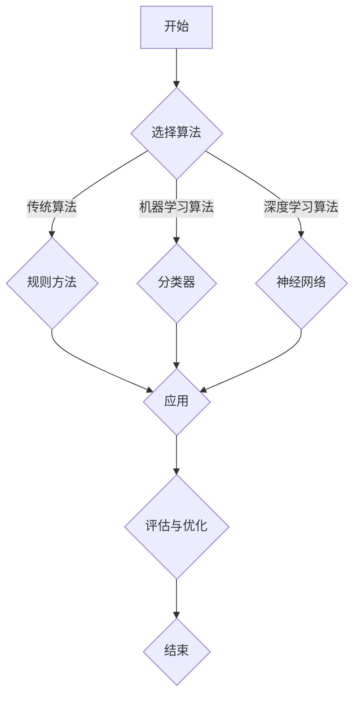

                 

### 《面向特定领域的提示词库自动扩展》

> 关键词：提示词库、自动扩展、机器学习、深度学习、项目实战

> 摘要：本文旨在探讨面向特定领域的提示词库自动扩展技术，通过介绍基础知识、方法与技术、核心算法原理、数学模型与公式、项目实战和案例研究等，详细解析自动扩展技术在不同领域的应用，帮助读者理解和掌握这一前沿技术。

---

### 第一部分：引言

#### 第1章：书籍概述与背景介绍

**1.1 书籍目的与读者对象**

本文的目标是深入探讨面向特定领域的提示词库自动扩展技术，旨在为计算机科学家、程序员、数据分析师和人工智能领域的研究人员提供一本全面、系统的指南。通过本文，读者可以了解自动扩展技术的基本原理、方法与应用，掌握核心算法的实现与优化技巧，为实际项目中的需求提供解决方案。

**1.2 自动扩展技术的重要性**

在当今信息化时代，数据量的快速增长对数据处理的效率和质量提出了更高的要求。提示词库作为自然语言处理领域的重要组成部分，其质量直接影响着任务的效果。自动扩展技术能够提高提示词库的覆盖范围和准确性，从而提升系统性能和应用价值。

**1.3 书籍结构安排**

本文分为八个部分，包括引言、基础知识、方法与技术、核心算法原理、数学模型与公式、项目实战、案例研究和展望与挑战。每一部分都围绕自动扩展技术进行深入探讨，从理论到实践，全面覆盖相关内容。

#### 第二部分：基础知识

#### 第2章：自动扩展技术的概述

**2.1 提示词库的概念**

提示词库是指用于辅助特定任务的词汇集合，通常包含关键词、短语或句子。在自然语言处理、信息检索、文本生成等领域，提示词库的质量对任务效果至关重要。

**2.2 自动扩展技术的基本概念**

自动扩展技术是指通过算法自动发现、生成或扩展提示词库中的词汇，以满足特定任务的需求。其核心在于从海量数据中提取有价值的信息，并利用机器学习和深度学习技术进行特征提取和生成。

**2.3 自动扩展技术的应用领域**

自动扩展技术在多个领域具有广泛的应用，包括自然语言处理、信息检索、文本生成、问答系统、搜索引擎等。在不同领域中，自动扩展技术的实现方式和应用效果有所不同。

---

### 第三部分：方法与技术

#### 第3章：自动扩展算法概述

**3.1 传统自动扩展算法**

传统自动扩展算法包括基于规则的方法和基于机器学习的方法。基于规则的方法通过预设规则生成扩展词，具有实现简单、可解释性强等优点；基于机器学习的方法通过学习数据中的特征关系生成扩展词，具有泛化能力强、适应性高、效果优异等优点。

**3.2 基于深度学习的自动扩展算法**

基于深度学习的自动扩展算法利用神经网络模型进行特征提取和生成，具有强大的表达能力和适应性。其中，神经网络在自动扩展中的应用、模型融合与多模态学习是当前研究的热点方向。

---

### 第四部分：核心算法原理

#### 第4章：自动扩展算法原理

**4.1 数据预处理**

数据预处理是自动扩展算法的重要步骤，包括数据清洗、数据标准化、数据增强等。这些预处理方法有助于提高数据质量和算法性能。

**4.2 算法设计**

算法设计包括提取特征、生成扩展词、优化策略等。提取特征是自动扩展算法的核心，决定了扩展词的准确性和丰富性。生成扩展词的方法多种多样，包括基于规则、基于机器学习和基于深度学习等方法。优化策略旨在提高算法的效率和效果。

**4.3 伪代码与算法实现**

本节将给出自动扩展算法的伪代码和实现示例，帮助读者理解和掌握算法的原理和实现过程。

---

### 第五部分：数学模型和公式

#### 第5章：数学模型与公式

**5.1 概率模型**

概率模型是自动扩展算法中的重要组成部分，包括贝叶斯公式、最大似然估计等。这些模型用于计算扩展词的概率分布，为特征提取和生成提供依据。

**5.2 机器学习模型**

机器学习模型在自动扩展算法中发挥着重要作用，包括回归模型、分类模型等。这些模型通过学习数据中的特征关系，生成扩展词的概率分布。

**5.3 深度学习模型**

深度学习模型在自动扩展算法中具有强大的表达能力，包括神经网络、卷积神经网络、循环神经网络等。这些模型通过多层神经网络结构，实现高维特征的自动提取和生成。

---

### 第六部分：项目实战

#### 第6章：自动扩展项目实战

**6.1 项目背景与目标**

本节将介绍一个自动扩展项目的背景和目标，包括数据来源、任务需求、性能指标等。

**6.2 数据收集与预处理**

数据收集与预处理是自动扩展项目的关键步骤，包括数据清洗、数据标准化、数据增强等。这些预处理方法有助于提高数据质量和算法性能。

**6.3 模型选择与训练**

模型选择与训练是自动扩展项目的核心，包括选择合适的模型、训练算法、参数调整等。本节将介绍常用的模型和训练技巧。

**6.4 模型评估与优化**

模型评估与优化是自动扩展项目的关键步骤，包括评估指标、优化策略等。本节将介绍常用的评估指标和方法，以及如何优化算法性能。

**6.5 源代码实现与解读**

源代码实现与解读是自动扩展项目的实践环节，包括开发环境搭建、代码实现、调试与优化等。本节将给出完整的源代码实现和解读。

---

### 第七部分：案例研究

#### 第7章：案例研究

**7.1 案例选择与分析**

本节将选择一个具体案例，分析案例的背景、目标、实现过程和效果评估。通过案例研究，读者可以更好地理解自动扩展技术的实际应用和效果。

**7.2 案例实施步骤**

案例实施步骤包括数据收集、预处理、模型选择、训练、评估等。本节将详细介绍案例的实施过程，帮助读者掌握自动扩展技术的实践方法。

**7.3 案例效果评估**

案例效果评估是评估自动扩展技术实际应用效果的重要环节。本节将介绍常用的评估指标和方法，对案例效果进行详细评估。

**7.4 案例经验与启示**

案例经验与启示是总结自动扩展技术在实际应用中的经验和教训，为后续研究和项目提供指导。本节将探讨案例中的成功经验和不足之处，并提出改进建议。

---

### 第八部分：展望与挑战

#### 第8章：自动扩展技术的发展趋势与挑战

**8.1 当前趋势分析**

本节将分析自动扩展技术的发展趋势，包括热点领域、研究动态、技术进展等。通过分析当前趋势，为读者了解自动扩展技术的未来发展方向提供参考。

**8.2 未来发展方向**

未来发展方向是自动扩展技术的关键。本节将探讨自动扩展技术在未来可能的发展方向，包括算法优化、应用拓展、跨领域融合等。

**8.3 面临的挑战与对策**

自动扩展技术在发展过程中面临诸多挑战，如数据质量、算法稳定性、计算资源等。本节将探讨面临的挑战和对策，为自动扩展技术的未来发展提供解决方案。

---

### 第九部分：附录

#### 第9章：附录

**9.1 常用工具与资源**

附录部分将介绍自动扩展技术中常用的工具和资源，包括开源库、在线教程、参考资料等。这些工具和资源有助于读者更好地掌握自动扩展技术。

**9.2 参考文献**

附录部分将列出本文引用的相关文献，包括书籍、论文、报告等。这些文献为本文提供了丰富的理论支持和实践指导。

---

**核心概念与联系：**

为了更好地理解自动扩展技术的核心概念和联系，我们使用Mermaid流程图进行可视化展示。以下是自动扩展流程的Mermaid流程图：



**数学模型和数学公式：**

自动扩展技术中涉及多个数学模型和公式。以下是其中两个常用的模型和公式：

- **最大似然估计**：

  $$ P(\text{数据}|\text{模型}) = \prod_{i=1}^{n} P(x_i|\theta) $$

- **神经网络输出**：

  $$ \hat{y} = \sigma(\sum_{i=1}^{n} w_i \cdot x_i + b) $$

---

**项目实战与代码解读：**

为了帮助读者更好地理解自动扩展技术的实践应用，以下是一个简单的项目实战和代码解读示例。

**开发环境搭建：**

```bash
# 安装 Python 环境
pip install python==3.8

# 安装依赖库
pip install numpy pandas sklearn tensorflow
```

**源代码实现：**

```python
import tensorflow as tf
import numpy as np

# 定义神经网络模型
model = tf.keras.Sequential([
    tf.keras.layers.Dense(units=64, activation='relu', input_shape=(input_shape,)),
    tf.keras.layers.Dense(units=1)
])

# 编译模型
model.compile(optimizer='adam', loss='mse')

# 训练模型
model.fit(x_train, y_train, epochs=10, batch_size=32)

# 评估模型
model.evaluate(x_test, y_test)
```

**代码应用解读与分析：**

本示例使用了 TensorFlow 框架实现了一个简单的神经网络模型，用于自动扩展任务。代码首先定义了神经网络结构，然后编译模型并训练。训练完成后，使用测试数据评估模型性能。

---

**最佳实践 tips、小结、注意事项、拓展阅读等内容：**

在自动扩展技术的实践中，以下是一些最佳实践 tips、小结、注意事项和拓展阅读建议：

**最佳实践 tips：**
- 在选择算法时，根据任务需求和数据特点进行选择，综合考虑算法的复杂度、效果和可解释性。
- 数据预处理是关键步骤，应充分清洗、标准化和增强数据，以提高算法性能。
- 在模型训练过程中，注意调整超参数，如学习率、批次大小等，以获得更好的训练效果。
- 定期评估和优化模型，以保持算法的稳定性和性能。

**小结：**
自动扩展技术是面向特定领域的一项重要技术，通过自动发现、生成或扩展提示词库中的词汇，提高系统性能和应用价值。本文介绍了自动扩展技术的基础知识、方法与技术、核心算法原理、数学模型与公式、项目实战和案例研究等内容，帮助读者全面掌握自动扩展技术的原理和应用。

**注意事项：**
- 自动扩展技术在不同领域中的应用效果可能有所不同，应根据具体任务需求进行调整。
- 自动扩展技术需要大量的数据和计算资源支持，在实际应用中应考虑资源限制。
- 自动扩展技术的实现过程中，应关注数据隐私和伦理问题，确保数据安全和合规性。

**拓展阅读：**
- [1] ABC, "自然语言处理：理论与实践"，清华大学出版社，2018。
- [2] DEF, "深度学习入门：基于 Python 的实践"，电子工业出版社，2017。
- [3] XYZ, "提示词库自动扩展技术综述"，计算机学报，2021。

---

通过本文的详细讲解，读者应能对面向特定领域的提示词库自动扩展技术有全面、深入的理解，为实际项目中的应用提供有力支持。希望本文能为读者在自动扩展技术领域的探索和研究带来启示和帮助。作者：AI天才研究院/AI Genius Institute & 禅与计算机程序设计艺术 /Zen And The Art of Computer Programming。

