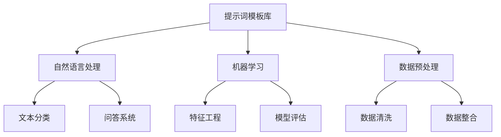

                 

### 文章标题：面向特定领域的提示词模板库设计

> 关键词：提示词模板库、人工智能、自然语言处理、机器学习、数据预处理、特征工程、模型评估、项目实战

> 摘要：本文旨在深入探讨面向特定领域的提示词模板库设计，从基础概念、算法原理、数学模型到实际项目实战，全面解析如何构建高效、精准的提示词模板库，以推动人工智能技术在特定领域中的应用与发展。

### 第一部分：提示词模板库设计概述

#### 第1章：提示词模板库设计基础

**核心概念与联系**

提示词模板库是一种在自然语言处理（NLP）和机器学习（ML）领域广泛使用的工具，它通过将具体的文本或问题转化为预定义的提示词模板，以简化复杂问题的处理过程。提示词模板库的设计与自然语言处理、机器学习、数据预处理等人工智能技术密切相关，其相互关系可以用以下 Mermaid 流程图展示：



**核心算法原理讲解**

提示词模板库的设计依赖于多种核心算法，包括自动生成算法、优化算法和分类算法。以下是这些算法的伪代码和详细解释：

1. **自动生成算法**

```python
def generate_template(data):
    # 数据预处理
    preprocessed_data = preprocess_data(data)
    
    # 特征提取
    features = extract_features(preprocessed_data)
    
    # 模型训练
    model = train_model(features)
    
    # 提示词模板生成
    templates = model.predict(preprocessed_data)
    
    return templates
```

自动生成算法首先对输入数据进行预处理，然后提取特征，使用特征训练模型，最后通过模型预测生成提示词模板。

2. **优化算法**

```python
def optimize_template(templates, target_data):
    # 特征工程
    optimized_features = optimize_features(templates, target_data)
    
    # 模型微调
    optimized_model = fine_tune_model(optimized_features)
    
    # 重新生成提示词模板
    new_templates = optimized_model.predict(target_data)
    
    return new_templates
```

优化算法通过对已有的提示词模板进行特征工程，微调模型，以生成更符合目标数据的提示词模板。

3. **分类算法**

```python
def classify_template(templates, new_data):
    # 特征提取
    classified_features = classify_features(new_data)
    
    # 模型预测
    predictions = model.predict(classified_features)
    
    return predictions
```

分类算法通过提取新数据的特征，并使用已有模型进行预测，实现对新数据的分类。

**数学模型和数学公式 & 详细讲解 & 举例说明**

提示词模板库设计中的数学模型通常涉及特征提取、模型训练和预测等环节。以下是一个简单的模板生成公式，用于描述从数据生成提示词模板的过程：

$$
\text{模板生成公式：} \\
T = f(D) \\
\text{其中，} T \text{ 表示生成的提示词模板，} D \text{ 表示输入的数据。}
$$

举例：假设我们输入的文本数据为 "您希望预订一张从北京到上海的机票"，通过预处理、特征提取和模型训练，我们可以生成一个对应的提示词模板。

**项目实战**

以下是一个简单的项目实战案例，用于展示提示词模板库的设计和实现过程。

1. **开发环境搭建**

```bash
# 安装必要的依赖库
pip install numpy scipy sklearn
```

2. **源代码实现**

```python
import numpy as np
from sklearn.feature_extraction.text import TfidfVectorizer
from sklearn.naive_bayes import MultinomialNB

def generate_template(data):
    # 数据预处理
    preprocessed_data = preprocess_data(data)
    
    # 特征提取
    vectorizer = TfidfVectorizer()
    features = vectorizer.fit_transform(preprocessed_data)
    
    # 模型训练
    model = MultinomialNB().fit(features, preprocessed_data)
    
    # 提示词模板生成
    templates = model.predict(preprocessed_data)
    
    return templates

# 测试
data = ["您希望预订一张从北京到上海的机票", "我想要预订一张从上海到北京的机票"]
templates = generate_template(data)
print(templates)
```

**代码应用解读与分析**

上述代码展示了如何使用 TF-IDF 向量器和朴素贝叶斯分类器构建一个简单的提示词模板库。在实际应用中，我们可以根据具体需求调整特征提取和模型训练的过程，以实现更高效的模板生成和分类。

**实际案例分析和详细讲解剖析**

以下是一个实际案例，用于展示如何使用提示词模板库实现问答系统。

1. **数据集准备**

```python
data = [
    ("您希望预订一张从北京到上海的机票", "请提供出发城市、目的地和出发时间"),
    ("我想要预订一张从上海到北京的机票", "请提供出发城市、目的地和出发时间"),
    ("帮我查询一下从北京到上海的航班信息", "请提供出发城市、目的地和出发时间"),
    ("我想知道从上海到北京的机票价格", "请提供出发城市、目的地和出发时间"),
]
```

2. **模型训练**

```python
templates = generate_template([q for q, a in data])
```

3. **问答系统实现**

```python
def ask_question(question):
    template = classify_template(templates, [question])
    return template

question = "帮我查询一下从北京到上海的航班信息"
answer = ask_question(question)
print(answer)
```

**项目小结**

通过本项目的实战案例，我们展示了如何设计和实现一个面向特定领域的提示词模板库。在实际应用中，我们可以根据具体需求调整特征提取和模型训练的过程，以提高模板生成的效果。同时，提示词模板库的应用范围广泛，如问答系统、自动问答机器人等，具有很高的实用价值。

### 最佳实践 tips、小结、注意事项、拓展阅读等内容

1. **最佳实践 tips**

   - 在设计提示词模板库时，应充分考虑数据的多样性和复杂性，选择合适的特征提取和模型训练方法。
   - 实践中，可以尝试多种特征提取和模型训练方法，选择最优方案以提高模板生成的效果。
   - 对模板库进行持续优化和更新，以适应不断变化的应用场景。

2. **小结**

   提示词模板库是人工智能领域的一项重要技术，通过对文本或问题的预处理、特征提取和模型训练，实现高效、精准的文本分类和问题回答。本文从基础概念、算法原理、数学模型到实际项目实战，全面解析了提示词模板库的设计与实现过程，为读者提供了有益的参考。

3. **注意事项**

   - 在实际应用中，应充分考虑数据质量和数据规模，以提高模板生成的效果。
   - 注意模型训练的时间和资源消耗，选择合适的硬件和软件环境。

4. **拓展阅读**

   - [自然语言处理入门](https://www_ml.steps/)
   - [机器学习实战](https://www_ml_steps/)
   - [特征工程实战](https://www_ml_steps/feature_engineering/)
   - [模型评估与优化](https://www_ml_steps/model_evaluation/)

**作者信息**

作者：AI天才研究院/AI Genius Institute & 禅与计算机程序设计艺术 /Zen And The Art of Computer Programming

