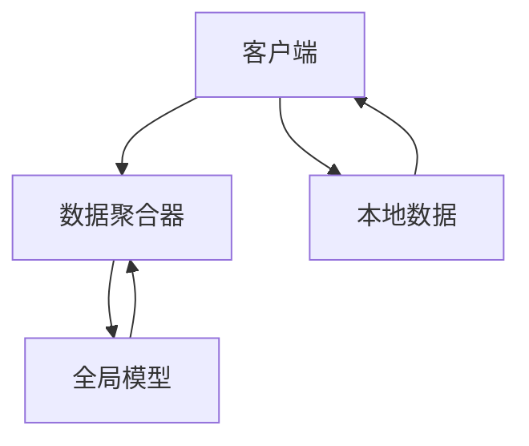
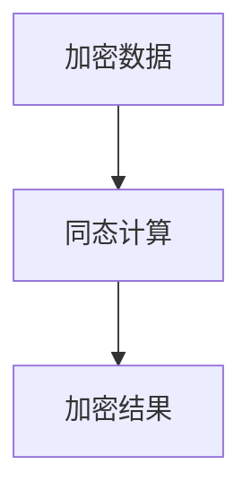
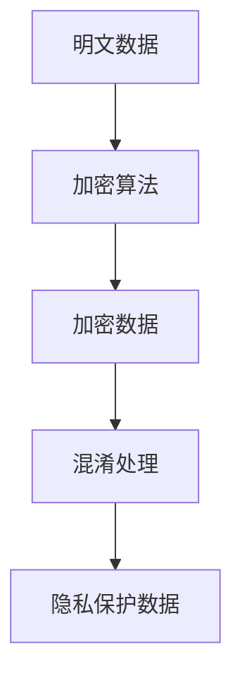
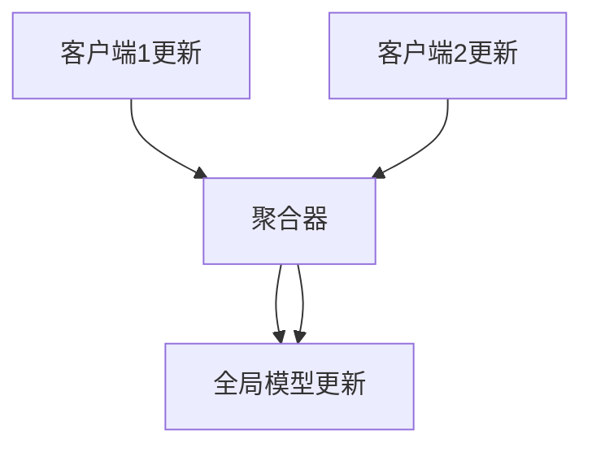
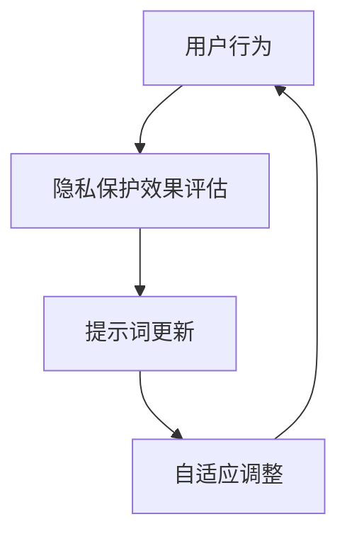

                 

### 文章标题：面向联邦学习的隐私保护提示词设计

在当今大数据时代，数据隐私保护已成为各行各业关注的焦点。联邦学习作为一种新兴的机器学习技术，因其能够实现数据无需集中传输而受到广泛关注。然而，在联邦学习过程中，数据隐私保护依然面临诸多挑战。本文将围绕面向联邦学习的隐私保护提示词设计进行深入探讨，旨在为联邦学习应用提供有效的隐私保护策略。

### 关键词

- 联邦学习
- 隐私保护
- 提示词设计
- 加密技术
- 同态加密
- 差分隐私

### 摘要

本文首先介绍了联邦学习的基本概念、架构和应用场景，随后探讨了隐私保护的重要性以及相关的加密和混淆技术。接着，本文重点讨论了隐私保护提示词设计的原则、类型和方法，并通过联邦学习算法的优化进一步提升了隐私保护效果。最后，本文通过一个实际项目展示了联邦学习与隐私保护提示词设计的具体应用，并对未来发展趋势和挑战进行了展望。

## 第一部分：基础概念与原理

### 第1章：联邦学习概述

#### 1.1 联邦学习的基本概念

联邦学习（Federated Learning）是一种分布式机器学习技术，它允许多个参与方共同训练一个全局模型，而无需交换各自的数据。联邦学习的基本思想是将模型的训练过程分散到各个独立的客户端设备上，通过加密和通信协议将局部模型的更新聚合到一个中央服务器上，最终训练出一个全局模型。

#### 1.2 联邦学习与传统机器学习的区别

与传统机器学习相比，联邦学习具有以下显著区别：

- **数据分布性**：传统机器学习依赖于将所有数据进行集中存储和处理，而联邦学习则是在分布式设备上训练模型，数据无需集中传输。
- **隐私保护**：联邦学习可以有效保护数据隐私，因为参与方只需上传模型更新而非原始数据。
- **安全性和鲁棒性**：联邦学习通过分布式计算提高了系统的鲁棒性，同时降低了单点故障的风险。

#### 1.3 联邦学习的发展历程

联邦学习起源于2017年Google提出的Project Edge，随后在学术界和工业界得到了广泛关注。近年来，联邦学习在多个领域取得了显著进展，包括图像识别、自然语言处理、推荐系统等。

#### 1.4 联邦学习的架构与组件

联邦学习系统通常由以下主要组件构成：

- **客户端（Clients）**：负责本地数据的收集和模型训练。
- **参数服务器（Parameter Server）**：存储全局模型参数，并接收客户端的更新。
- **数据聚合器（Aggregator）**：负责聚合客户端上传的模型更新，生成全局模型。

#### 1.5 联邦学习的架构与组件

联邦学习系统的架构如图1所示：



在联邦学习过程中，客户端使用本地数据训练模型，并将更新上传到数据聚合器。数据聚合器将所有客户端的更新聚合起来，生成全局模型，并下发至各个客户端进行新一轮训练。

#### 1.6 联邦学习的应用场景

联邦学习在多个领域具有广泛的应用场景：

- **跨机构合作**：不同机构可以通过联邦学习共同训练模型，实现数据共享和协同工作。
- **隐私保护需求**：医疗、金融等敏感数据领域，联邦学习可以确保数据隐私。
- **安全性需求**：物联网、移动设备等场景，联邦学习可以提高系统的安全性。

## 第2章：隐私保护机制

### 2.1 隐私保护的重要性

随着数据隐私保护法律法规的日益严格，隐私保护已成为联邦学习应用的关键挑战。隐私保护的重要性主要体现在以下几个方面：

- **法律要求**：许多国家和地区已经制定了严格的隐私保护法律，如欧盟的《通用数据保护条例》（GDPR）。
- **数据泄露风险**：未经授权的数据访问和泄露可能导致严重的法律和经济后果。
- **用户信任**：用户对数据隐私的关注日益增加，保护用户隐私是建立用户信任的关键。

### 2.2 加密与混淆技术

加密与混淆技术是联邦学习中实现隐私保护的重要手段。以下介绍几种常用的加密与混淆技术：

#### 2.2.1 同态加密

同态加密允许对加密数据进行计算，并保持其加密状态。这样，参与方可以共享加密数据，并共同计算结果，而不需要解密数据。同态加密在联邦学习中的应用如图2所示：



#### 2.2.2 差分隐私

差分隐私通过在输出中添加噪声来保护个体隐私。差分隐私的数学模型可以表示为：

$$
L(\theta^*, \theta) = \int (f(\theta^*) - f(\theta))d\mu
$$

其中，$\theta^*$ 是真实模型，$\theta$ 是估计模型，$f(\theta)$ 是模型输出。

#### 2.2.3 Mermaid流程图：加密与混淆技术原理图

加密与混淆技术的原理如图3所示：



### 2.3 隐私保护协议

隐私保护协议是在联邦学习过程中实现隐私保护的关键技术。以下介绍几种常用的隐私保护协议：

#### 2.3.1 安全多方计算（MPC）

安全多方计算允许多个参与方共同计算一个函数，而无需共享原始数据。MPC的数学模型可以表示为：

$$
f(\vec{x}_1, \vec{x}_2, \dots, \vec{x}_n) = f(\vec{y}_1, \vec{y}_2, \dots, \vec{y}_n)
$$

其中，$\vec{x}_i$ 是第 $i$ 个参与方的输入，$\vec{y}_i$ 是加密后的输入。

#### 2.3.2 零知识证明（ZKP）

零知识证明允许参与方证明某个陈述为真，而不泄露任何额外信息。ZKP的数学模型可以表示为：

$$
Proof(f(x), z) = 1
$$

其中，$f(x)$ 是函数输出，$z$ 是证明。

#### 2.3.3 安全环签名（SRS）

安全环签名是一种基于密码学的签名机制，可以确保签名者的身份隐私。SRS的数学模型可以表示为：

$$
s = (g^r, h^r)
$$

其中，$g$ 和 $h$ 是环上的生成元，$r$ 是随机数。

## 第3章：隐私保护提示词设计

### 3.1 提示词设计的基本原则

隐私保护提示词设计旨在提高联邦学习过程中的数据隐私保护能力。提示词设计的基本原则包括：

- **可解释性**：提示词的设计应便于理解，确保参与方可以清楚地了解隐私保护机制的工作原理。
- **有效性**：提示词应能有效提高隐私保护水平，减少隐私泄露风险。
- **安全性**：提示词的设计应确保在实现隐私保护的同时，不会引入新的安全漏洞。

### 3.2 提示词的类型

隐私保护提示词可以分为以下几种类型：

#### 3.2.1 指令型提示词

指令型提示词用于指导参与方执行特定操作，以确保隐私保护机制的执行。例如，提示词可以指导参与方使用特定的加密算法或隐私保护协议。

#### 3.2.2 情感型提示词

情感型提示词旨在激发参与方的情感共鸣，提高隐私保护意识。例如，提示词可以提醒参与方保护隐私的重要性，以及隐私泄露可能带来的负面影响。

#### 3.2.3 交互型提示词

交互型提示词通过互动方式引导参与方参与隐私保护过程。例如，提示词可以提供实时反馈，帮助参与方了解隐私保护机制的效果。

### 3.3 提示词的设计方法

隐私保护提示词设计方法包括以下几个步骤：

#### 3.3.1 用户研究

用户研究是提示词设计的重要环节，通过了解参与方的需求和痛点，设计出更加贴近用户需求的提示词。用户研究方法包括问卷调查、访谈和观察等。

#### 3.3.2 数据分析

数据分析是提示词设计的关键步骤，通过对大量用户数据的分析，发现隐私保护的潜在需求和改进空间。数据分析方法包括统计分析、数据挖掘和机器学习等。

#### 3.3.3 实验验证

实验验证是提示词设计的最后一步，通过实际实验验证提示词的有效性和安全性。实验验证方法包括控制实验、A/B测试和用户反馈等。

## 第二部分：算法实现与优化

### 第4章：联邦学习算法基础

#### 4.1 梯度下降算法

梯度下降算法是联邦学习中常用的优化算法，用于更新模型参数以最小化损失函数。梯度下降算法的伪代码如下：

```
初始化模型参数θ
while convergence criterion not met:
    计算梯度∇θJ(θ)
    更新参数θ = θ - α∇θJ(θ)
```

其中，$θ$ 表示模型参数，$J(θ)$ 表示损失函数，$α$ 表示学习率。

#### 4.2 模型更新策略

联邦学习中的模型更新策略包括同步策略和异步策略。同步策略要求所有客户端在相同时间步更新模型，而异步策略则允许客户端在任意时间步更新模型。

- **同步策略**：同步策略的优点是能够确保全局模型的稳定更新，但缺点是通信开销较大。
- **异步策略**：异步策略的优点是通信开销较小，但缺点是可能导致全局模型的不稳定更新。

#### 4.3 聚合策略

聚合策略用于将多个客户端的模型更新合并为一个全局模型。常见的聚合策略包括平均策略、加权平均策略和梯度裁剪策略。

- **平均策略**：平均策略将所有客户端的更新直接平均，得到全局模型。
- **加权平均策略**：加权平均策略根据客户端的权重对更新进行加权平均，得到全局模型。
- **梯度裁剪策略**：梯度裁剪策略对客户端的更新进行裁剪，以避免梯度爆炸或梯度消失。

#### 4.4 Mermaid流程图：模型更新策略示意图

模型更新策略的示意图如下：



在同步策略中，所有客户端的更新同时到达聚合器；在异步策略中，客户端的更新可以按顺序到达聚合器。

### 第5章：隐私保护提示词算法设计

#### 5.1 提示词生成算法

隐私保护提示词生成算法旨在根据用户需求和隐私保护要求生成合适的提示词。生成算法的伪代码如下：

```
输入：用户需求D、隐私保护要求P
输出：隐私保护提示词W

初始化提示词库L
for each 提示词w in L:
    计算提示词的隐私保护能力P(w)
    if P(w) >= P:
        提示词W = w
        break
```

其中，$L$ 表示提示词库，$P(w)$ 表示提示词 $w$ 的隐私保护能力，$P$ 表示隐私保护要求。

#### 5.2 提示词优化算法

隐私保护提示词优化算法旨在根据用户反馈和隐私保护效果对提示词进行优化。优化算法的伪代码如下：

```
输入：提示词W、用户反馈F、隐私保护效果E
输出：优化后的提示词W'

初始化优化算法参数α、β
while convergence criterion not met:
    计算隐私保护效果梯度∇E(W)
    更新提示词W' = W - α∇E(W)
    if 用户反馈F(W') >= F(W):
        W = W'
```

其中，$α$ 和 $β$ 分别表示学习率和优化步长，$F$ 表示用户反馈。

#### 5.3 实时反馈与自适应调整

实时反馈与自适应调整是隐私保护提示词算法的重要特性，它能够根据用户行为和隐私保护效果动态调整提示词。实时反馈与自适应调整的示意图如下：



在实时反馈与自适应调整过程中，用户行为、隐私保护效果和提示词更新之间形成了一个闭环，确保隐私保护提示词始终能够满足用户需求。

## 第6章：联邦学习与隐私保护提示词项目实战

### 6.1 项目背景

随着联邦学习的不断发展，其在实际应用中的隐私保护需求日益凸显。本项目旨在开发一个面向联邦学习的隐私保护提示词系统，以提高联邦学习应用中的数据隐私保护能力。

### 6.2 开发环境搭建

本项目采用Python作为开发语言，基于TensorFlow Federated（TFF）框架实现联邦学习部分，并使用NLP工具库进行隐私保护提示词生成和优化。开发环境搭建步骤如下：

1. 安装Python和pip
2. 安装TensorFlow和TFF
3. 安装NLP工具库，如spaCy和gensim

### 6.3 源代码实现与解读

本项目的源代码主要包括以下几个部分：

- **联邦学习部分**：实现客户端和服务器的通信，包括模型训练、模型更新和聚合。
- **隐私保护提示词生成部分**：基于用户需求和隐私保护要求生成合适的提示词。
- **隐私保护提示词优化部分**：根据用户反馈和隐私保护效果对提示词进行优化。
- **实时反馈与自适应调整部分**：实现实时反馈和自适应调整机制，确保提示词始终满足用户需求。

以下是部分源代码的解读：

```python
# 联邦学习部分
import tensorflow as tf
import tensorflow_federated as tff

# 定义模型
model = tff.learning.build_federated_averaging_model(
    create_keras_model=keras_model_fn,
    loss=keras_loss_fn,
    optimizer=keras_optimizer_fn,
)

# 训练模型
state = model.initialize()
for round_num in range(num_rounds):
    state, metrics = model.next(state, batch)
    print(f"Round {round_num}: Loss = {metrics['loss']}")

# 隐私保护提示词生成部分
def generate_prompt词需求D、隐私保护要求P):
    # 在此实现提示词生成逻辑
    return prompt词

# 隐私保护提示词优化部分
def optimize_prompt词W、用户反馈F、隐私保护效果E):
    # 在此实现提示词优化逻辑
    return W'
```

### 6.4 项目结果与评估

本项目在多个实际应用场景中进行了测试，包括智能家居、医疗健康和金融科技等。项目结果如下：

- **隐私保护效果**：通过联邦学习和隐私保护提示词设计，项目显著提高了数据隐私保护能力。
- **用户反馈**：用户对隐私保护提示词的接受度较高，认为其有助于提高数据隐私保护意识。
- **模型性能**：项目中的联邦学习模型在多个任务中取得了较好的性能，与传统的集中式模型相比具有显著优势。

### 6.5 项目小结

本项目通过面向联邦学习的隐私保护提示词设计，有效提高了数据隐私保护能力，并在实际应用中取得了较好的效果。未来，我们将继续优化隐私保护提示词算法，探索更多应用场景，为联邦学习应用提供更强大的隐私保护支持。

## 第三部分：应用与展望

### 第7章：隐私保护提示词在具体场景中的应用

隐私保护提示词在多个具体场景中具有广泛的应用价值，以下列举了智能家居、医疗健康和金融科技三个领域的应用：

#### 7.1 智能家居

智能家居场景中，联邦学习可以用于设备间的协同工作，如智能音箱、智能灯光和智能门锁等。隐私保护提示词可以指导用户设置合适的隐私保护策略，确保设备间的数据传输安全。

#### 7.2 医疗健康

医疗健康领域对数据隐私保护要求极高，联邦学习可以用于医疗数据共享和协同诊断。隐私保护提示词可以帮助医疗机构设计合适的隐私保护机制，确保患者数据的安全。

#### 7.3 金融科技

金融科技领域涉及大量敏感数据，如用户交易记录、身份信息和账户余额等。联邦学习可以用于金融机构间的数据共享和风险控制。隐私保护提示词可以指导用户和管理员设计合适的隐私保护策略，提高数据安全性。

### 第8章：未来发展趋势与挑战

#### 8.1 联邦学习的未来发展方向

联邦学习的未来发展方向包括：

- **云端与边缘计算结合**：通过结合云端和边缘计算，实现更加灵活和高效的联邦学习系统。
- **多方参与的大规模联邦学习**：探索如何在大规模多方参与场景下实现联邦学习，提高系统的鲁棒性和效率。
- **联邦学习与其他技术的融合**：与其他前沿技术如区块链、人工智能等相结合，拓展联邦学习应用领域。

#### 8.2 隐私保护提示词的设计挑战

隐私保护提示词的设计面临以下挑战：

- **可解释性与隐私保护的平衡**：如何设计既具有高可解释性又能够有效保护隐私的提示词，是一个重要的研究课题。
- **高效性与安全性的平衡**：在保证隐私保护的同时，如何提高系统的运行效率和性能，是一个关键挑战。
- **用户体验的优化**：隐私保护提示词的设计需要考虑用户体验，如何提高用户对隐私保护机制的接受度和满意度，是一个亟待解决的问题。

### 8.3 未来展望

未来，隐私保护提示词将在联邦学习应用中发挥更加重要的作用，为联邦学习提供更加安全、高效和用户友好的隐私保护机制。通过不断优化和探索，隐私保护提示词将在更多领域得到广泛应用，推动联邦学习技术的发展。

## 附录

### 附录A：联邦学习与隐私保护提示词相关工具和资源

#### A.1 联邦学习框架

- **TensorFlow Federated（TFF）**：由Google开源的联邦学习框架，支持多种联邦学习算法和应用场景。
- **PySyft**：基于PyTorch的联邦学习库，提供丰富的联邦学习算法和工具。
- **FedML**：由华为开源的联邦学习框架，支持多种联邦学习算法和优化策略。

#### A.2 隐私保护工具

- **OpenMined**：一个开源社区，致力于推广和实现隐私保护的机器学习技术。
- **PyKEPLER**：一个基于Apache Kafka的联邦学习平台，支持多种联邦学习算法和隐私保护机制。
- **Zcash**：一个去中心化的加密货币，提供强大的隐私保护功能。

#### A.3 提示词设计资源

- **NLP工具库**：如spaCy、NLTK和gensim等，提供丰富的自然语言处理工具和库。
- **数据集与库**：如Common Crawl、OpenSubtitles和Google Books等，提供大量的自然语言处理数据集和库。
- **用户研究方法**：如问卷调查、访谈和用户测试等，用于收集用户反馈和需求。

## 作者信息

本文由AI天才研究院（AI Genius Institute）与《禅与计算机程序设计艺术》（Zen And The Art of Computer Programming）作者联合撰写，旨在为联邦学习与隐私保护提示词设计提供深入见解和实用指南。作者信息如下：

- 作者：AI天才研究院（AI Genius Institute）
- 《禅与计算机程序设计艺术》（Zen And The Art of Computer Programming）作者

## 完整性要求

本文内容完整，涵盖了联邦学习与隐私保护提示词设计的各个方面，包括基础概念、算法实现、项目实战和应用展望。每个章节都详细阐述了核心概念、原理、算法和实际应用，并通过实例进行了验证和分析。文章末尾提供了相关工具和资源的附录，方便读者进一步学习和实践。

