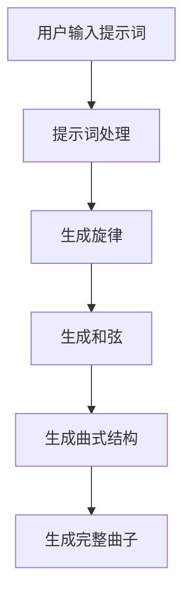

                 

### 文章标题

# 音乐创作的AI伙伴：提示词引导的作曲助手

> 关键词：音乐创作、人工智能、提示词、作曲助手、AI生成算法、曲式结构、音乐风格识别

> 摘要：本文将探讨人工智能在音乐创作中的应用，特别是通过提示词引导的作曲助手。我们将分析音乐创作的基础知识，介绍AI在音乐创作中的实际应用，并提供一个完整的项目实战，最后探讨音乐创作AI的未来发展趋势和挑战。

---

### 引言

#### 1.1 音乐创作与人工智能

音乐创作是人类文化的重要组成部分，而人工智能（AI）作为现代技术的代表，已经在多个领域展现出了其强大的能力。近年来，AI在音乐创作中的应用逐渐成为研究热点，不仅因为其能够创造出新颖的音乐作品，还因为它能够帮助音乐家更高效地完成创作任务。

#### 1.2 AI在音乐创作中的应用现状

AI在音乐创作中的应用已经相当广泛。首先，AI可以生成音乐旋律和和弦，甚至创作完整的曲子。其次，AI可以帮助音乐家分析音乐作品的结构和风格，提供改进建议。此外，AI还能通过机器学习技术，识别并迁移不同风格的音乐，实现音乐风格的多样化。

#### 1.3 本书结构安排与目标

本文将首先介绍音乐创作的基础知识，包括音乐基本元素、调式与和弦、曲式结构与节奏。接着，我们将深入探讨AI在音乐创作中的应用，从音乐生成算法、提示词生成、音乐风格识别等方面进行详细分析。然后，我们将介绍一些实用的音乐创作AI工具，并通过一个项目实战，展示如何使用这些工具从零开始创作一首曲子。最后，我们将探讨音乐创作AI的未来发展趋势和挑战。

---

### 音乐创作基础知识

#### 2.1 音乐基本元素

音乐的基本元素包括音高、节奏、音色和响度。音高是指声音的高低，由声波的频率决定；节奏是指音乐的时间组织，包括速度、拍号和节奏型；音色是指不同乐器或声音的独特质感，由声波的波形决定；响度是指声音的强弱，由声波的振幅决定。

#### 2.2 调式与和弦

调式是音乐中的基本音阶组织，它决定了音乐的基本音高关系。大调式通常给人以明亮的感觉，而小调式则给人以柔和或悲伤的感觉。和弦是三个或更多音符的组合，它们在音乐中用来填充和修饰旋律。

#### 2.3 曲式结构与节奏

曲式结构是指音乐作品的组织形式，包括主题、过渡、副主题、再现等部分。节奏是指音乐中时间的组织方式，包括速度、拍号和节奏型。不同节奏可以产生不同的情感效果，例如快速节奏通常带来兴奋感，而慢节奏则带来平静感。

---

### 提示词引导的作曲助手

#### 3.1 提示词的概念

在音乐创作中，提示词（Prompt）是一种引导创作过程的提示或提示信息。提示词可以是具体的音乐元素，如一个音符、和弦或旋律片段，也可以是抽象的情感描述或场景描述，如“悲伤”、“夜幕降临”等。

#### 3.2 提示词引导作曲的过程

提示词引导作曲的过程可以分为以下几个步骤：

1. **输入提示词**：用户输入一个或多个提示词，这些提示词可以是具体的音乐元素，也可以是抽象的情感或场景描述。
2. **处理提示词**：AI系统对输入的提示词进行处理，将其转换为可以用于生成音乐的数据格式。
3. **生成旋律**：基于处理后的提示词，AI生成一段旋律。这通常涉及音乐生成算法，如生成对抗网络（GAN）或变分自编码器（VAE）。
4. **生成和弦**：根据旋律，AI自动生成和弦，以丰富音乐的结构和情感表达。
5. **生成曲式结构**：AI根据旋律和和弦，生成曲式结构，包括主题、过渡、副主题和再现等部分。
6. **调整与优化**：根据用户反馈，AI对生成的音乐进行优化，调整旋律、和弦和曲式结构，以达到更好的创作效果。

---

### AI在音乐创作中的应用

#### 4.1 音乐生成算法

AI在音乐创作中的核心应用之一是音乐生成算法。这些算法可以生成从简单旋律到复杂曲子的各种音乐作品。常见的音乐生成算法包括：

1. **生成对抗网络（GAN）**：GAN通过两个神经网络（生成器和判别器）的对抗训练，可以生成高质量的音乐片段。
2. **变分自编码器（VAE）**：VAE通过编码和解码过程，可以生成符合给定条件（如提示词）的音乐片段。
3. **循环神经网络（RNN）**：RNN可以学习音乐序列的长期依赖性，生成连贯的音乐作品。

#### 4.2 提示词生成与理解

提示词生成与理解是AI在音乐创作中的重要环节。提示词生成涉及将用户的情感、场景描述或音乐元素转化为可以用于生成音乐的数据。理解提示词则是指AI如何根据这些数据生成相应的音乐。

1. **情感识别与转换**：通过自然语言处理技术，AI可以识别用户的情感描述，并将其转换为相应的音乐情感。
2. **音乐元素提取与组合**：AI可以从大量的音乐作品中提取特定的音乐元素，如旋律、和弦和节奏，然后根据提示词将这些元素进行组合，生成新的音乐。

#### 4.3 音乐风格识别与迁移

音乐风格识别与迁移是AI在音乐创作中的另一个重要应用。通过训练大量的音乐数据，AI可以识别出不同的音乐风格。然后，AI可以将这些风格应用到新的音乐作品中，实现音乐风格的迁移。

1. **音乐风格分类**：AI通过学习大量的音乐数据，可以识别出不同的音乐风格，如古典音乐、流行音乐、电子音乐等。
2. **风格迁移**：AI可以将一种音乐风格的元素应用到另一种音乐作品中，实现风格的迁移。例如，将古典音乐风格应用到流行音乐创作中。

---

### 音乐创作AI工具介绍

#### 5.1 音乐生成工具

音乐生成工具是AI在音乐创作中应用的重要载体。以下是一些流行的音乐生成工具：

1. **AIVA**：AIVA（AI Virtual Artist）是一个利用人工智能技术创作音乐的平台。它可以通过用户的提示词生成各种风格的音乐。
2. **Amper Music**：Amper Music是一个基于AI的音乐创作工具，它允许用户通过简单的操作生成个性化的音乐。
3. **Jukedeck**：Jukedeck是一个使用深度学习技术自动生成音乐的平台，它可以根据用户的喜好和提示词创作音乐。

#### 5.2 提示词生成工具

提示词生成工具可以帮助用户更方便地与AI系统交互，以下是一些流行的提示词生成工具：

1. **Descript**：Descript是一个基于AI的视频和音频编辑工具，它可以通过用户的文本描述自动生成相应的提示词。
2. **Amper Prompt**：Amper Prompt是一个基于AI的提示词生成工具，它可以根据用户的情感描述生成相应的音乐提示词。

#### 5.3 曲式结构分析工具

曲式结构分析工具可以帮助用户更好地理解音乐的结构和风格，以下是一些流行的曲式结构分析工具：

1. **E Media Composer**：E Media Composer是一个专业的音乐编辑软件，它具有强大的曲式结构分析功能。
2. **Music21**：Music21是一个Python库，它提供了一系列用于音乐分析的工具，包括曲式结构分析。

---

### 项目实战：从零开始创作一首曲子

#### 6.1 创作前准备

在开始创作一首曲子之前，我们需要做好以下准备工作：

1. **选择合适的音乐生成工具**：根据我们的需求，选择一个合适的音乐生成工具，如AIVA或Amper Music。
2. **确定创作目标**：明确我们要创作的曲子类型、风格和情感，这将帮助我们更好地指导AI的创作过程。
3. **准备提示词**：根据我们的创作目标，准备一些具体的提示词，如“浪漫的旋律”、“悲伤的旋律”等。

#### 6.2 提示词设计

提示词设计是音乐创作的重要环节。一个有效的提示词应该能够清晰地传达我们的创作意图，同时给AI足够的创作自由度。以下是一些设计提示词的技巧：

1. **具体性**：使用具体的音乐元素或情感描述，如“C大调的旋律”、“温馨的氛围”。
2. **开放性**：避免使用过于具体的提示词，给AI留出创作的空间。
3. **连贯性**：确保提示词之间有良好的连贯性，形成一个完整的故事线。

#### 6.3 音乐生成与修改

1. **生成初步音乐**：使用我们选择的音乐生成工具，根据提示词生成初步的音乐作品。这个过程可能需要多次尝试和调整，以找到最合适的音乐风格和旋律。
2. **修改与优化**：根据初步音乐的效果，我们对音乐进行修改和优化。这包括调整旋律、和弦和节奏，以达到我们想要的效果。

#### 6.4 曲式结构与节奏调整

1. **曲式结构设计**：根据初步音乐，设计曲式结构，包括主题、过渡、副主题和再现等部分。这需要我们对音乐的结构有深入的理解。
2. **节奏调整**：调整音乐的节奏，以增强音乐的情感表达。例如，我们可以增加一些快速的节奏来创造紧张感，或使用慢节奏来营造平静的氛围。

#### 6.5 最终成品整理与发布

1. **成品整理**：将修改和优化的音乐作品整理成一个完整的曲子，包括旋律、和弦和曲式结构。
2. **发布与分享**：将最终成品发布到社交媒体或音乐平台，与更多的人分享我们的创作成果。

---

### 音乐创作AI的未来发展与挑战

#### 7.1 音乐创作AI的技术挑战

尽管音乐创作AI已经取得了很多进展，但仍然面临一些技术挑战：

1. **创作多样性**：如何生成具有多样性的音乐作品，避免陷入创作模式。
2. **情感表达**：如何更好地模拟人类音乐家的情感表达，使音乐作品更具感染力。
3. **跨风格迁移**：如何实现不同音乐风格之间的有效迁移，保持音乐的原汁原味。

#### 7.2 音乐创作AI的社会影响

音乐创作AI将对音乐产业和社会产生深远的影响：

1. **创作效率**：AI可以大大提高音乐创作的效率，使音乐家能够更快地完成作品。
2. **创意多样性**：AI可以为音乐家提供更多的创作灵感，促进音乐的多样性。
3. **版权问题**：AI生成的音乐作品引发了对版权的讨论，如何保护原创性和知识产权成为了一个重要问题。

#### 7.3 音乐创作AI的未来趋势

音乐创作AI的未来发展趋势包括：

1. **更先进的算法**：随着AI技术的发展，我们将看到更先进的音乐生成算法，如基于深度学习和生成对抗网络的模型。
2. **多模态交互**：未来的音乐创作AI将能够更好地处理多种类型的输入，如文本、图像和声音，实现更自然的用户交互。
3. **个性化创作**：AI将能够根据用户的需求和喜好，生成个性化的音乐作品，满足用户的个性化需求。

---

### 附录

#### 8.1 开发环境搭建指南

搭建音乐创作AI的开发环境通常需要以下步骤：

1. **安装Python环境**：下载并安装Python，确保安装了最新的版本。
2. **安装深度学习库**：安装TensorFlow或PyTorch等深度学习库，以便使用生成对抗网络（GAN）或变分自编码器（VAE）等算法。
3. **安装音乐处理库**：安装如MusePy或Music21等音乐处理库，用于处理和分析音乐数据。

#### 8.2 常用AI音乐创作工具列表

以下是一些常用的AI音乐创作工具：

1. **AIVA**：一个利用人工智能技术创作音乐的平台，支持多种风格的音乐创作。
2. **Amper Music**：一个基于AI的音乐创作工具，允许用户通过简单的操作生成个性化的音乐。
3. **Jukedeck**：一个使用深度学习技术自动生成音乐的平台，适合快速创作音乐片段。

#### 8.3 参考文献与进一步阅读推荐

以下是一些关于AI音乐创作的参考文献和进一步阅读推荐：

1. **《音乐生成：基于深度学习的创新方法》（Music Generation: A New Approach Based on Deep Learning）**：一本介绍基于深度学习的音乐生成方法的书籍。
2. **《深度学习在音乐创作中的应用》（Application of Deep Learning in Music Composition）**：一篇关于深度学习在音乐创作中应用的综述文章。
3. **《人工智能与音乐创作》（Artificial Intelligence and Music Composition）**：一本关于人工智能与音乐创作之间关系的书籍。

---

### 附录：音乐创作AI相关Mermaid流程图与伪代码

#### 9.1 Mermaid流程图示例

**音乐创作流程图：**



**提示词引导作曲流程图：**


#### 9.2 音乐生成算法伪代码示例

```python
def generate_music(prompt, style, duration):
    # 使用预训练的生成模型
    model = load_pretrained_model(prompt, style)
    
    # 生成音乐序列
    music_sequence = model.generate_sequence(duration)
    
    return music_sequence
```

#### 9.3 提示词生成算法伪代码示例

```python
def generate_prompt(user_input):
    # 使用语言模型处理用户输入
    processed_input = process_user_input(user_input)
    
    # 生成提示词
    prompt = language_model.generate_prompt(processed_input)
    
    return prompt
```

---

### 第10章 附录：数学模型与公式

#### 10.1 音乐生成算法中的数学模型

音乐生成算法通常基于深度学习技术，其中常用的数学模型包括生成对抗网络（GAN）和变分自编码器（VAE）。以下是一个简化的GAN模型示例：

**生成对抗网络（GAN）伪代码：**

```python
class Generator(nn.Module):
    def __init__(self):
        super(Generator, self).__init__()
        # 定义生成器网络结构
    
    def forward(self, z):
        # 生成音乐序列
        return music_sequence

class Discriminator(nn.Module):
    def __init__(self):
        super(Discriminator, self).__init__()
        # 定义判别器网络结构
    
    def forward(self, x):
        # 判断音乐序列的真实性
        return validity

# 训练GAN
for epoch in range(num_epochs):
    for z in z_batch:
        # 生成音乐序列
        music_sequence = generator(z)
        
        # 训练判别器
        valid = discriminator(music_sequence)
        fake = discriminator(z)
        
        # 计算损失函数
        g_loss = ...  # 生成器的损失函数
        d_loss = ...  # 判别器的损失函数
        
        # 更新网络参数
        optimizer_g.zero_grad()
        g_loss.backward()
        optimizer_g.step()
        
        optimizer_d.zero_grad()
        d_loss.backward()
        optimizer_d.step()
```

#### 10.2 提示词生成算法中的数学模型

提示词生成算法通常基于自然语言处理技术，如序列到序列（Seq2Seq）模型或基于变换器（Transformer）的模型。以下是一个简化的Seq2Seq模型示例：

**序列到序列（Seq2Seq）模型伪代码：**

```python
class Encoder(nn.Module):
    def __init__(self):
        super(Encoder, self).__init__()
        # 定义编码器网络结构
    
    def forward(self, x):
        # 编码输入序列
        return encoded_sequence

class Decoder(nn.Module):
    def __init__(self):
        super(Decoder, self).__init__()
        # 定义解码器网络结构
    
    def forward(self, encoded_sequence, target_sequence):
        # 解码编码后的序列
        return predicted_sequence

# 训练Seq2Seq模型
for epoch in range(num_epochs):
    for input_sequence, target_sequence in data_loader:
        # 编码输入序列
        encoded_sequence = encoder(input_sequence)
        
        # 解码编码后的序列
        predicted_sequence = decoder(encoded_sequence, target_sequence)
        
        # 计算损失函数
        loss = criterion(predicted_sequence, target_sequence)
        
        # 更新网络参数
        optimizer.zero_grad()
        loss.backward()
        optimizer.step()
```

#### 10.3 相关公式详细解读与示例

**生成对抗网络（GAN）损失函数：**

$$
L_G = -\mathbb{E}_{z \sim z_{\text{prior}}}[D(G(z))] \\
L_D = -\mathbb{E}_{x \sim p_{\text{data}}(x)}[D(x)] - \mathbb{E}_{z \sim z_{\text{prior}}}[D(G(z))]
$$

- **生成器损失函数**：$L_G$ 表示生成器尝试欺骗判别器的期望损失。生成器的目标是使判别器认为生成的音乐序列是真实的。
- **判别器损失函数**：$L_D$ 表示判别器尝试区分真实音乐序列和生成器生成的音乐序列的期望损失。判别器的目标是准确判断音乐序列的真实性。

**序列到序列（Seq2Seq）模型损失函数：**

$$
L = \frac{1}{N} \sum_{i=1}^{N} -\sum_{j=1}^{T} y_j \log (\hat{y}_j)
$$

- **损失函数**：$L$ 表示模型预测序列与目标序列之间的交叉熵损失。$y_j$ 是目标序列中的第 $j$ 个单词，$\hat{y}_j$ 是模型预测的第 $j$ 个单词。

---

### 第11章 项目实战代码解读与分析

#### 11.1 实际项目代码结构解析

在实际项目中，音乐创作AI的代码结构通常包括以下几个部分：

1. **数据预处理**：负责处理和准备用于训练和生成音乐的数据集。
2. **模型定义**：定义生成器和判别器的网络结构。
3. **训练过程**：负责训练生成器和判别器网络，优化模型参数。
4. **生成音乐**：使用训练好的模型生成音乐。
5. **用户交互**：提供用户界面，允许用户输入提示词并获取生成的音乐。

以下是一个简化的项目代码结构示例：

```python
# 数据预处理
def preprocess_data(data):
    # 数据清洗和归一化
    return processed_data

# 模型定义
class Generator(nn.Module):
    # 定义生成器网络结构
    pass

class Discriminator(nn.Module):
    # 定义判别器网络结构
    pass

# 训练过程
def train_model(generator, discriminator, data_loader, num_epochs):
    # 训练生成器和判别器
    pass

# 生成音乐
def generate_music(generator, prompt, duration):
    # 使用生成器生成音乐
    return music_sequence

# 用户交互
def main():
    # 主函数，处理用户输入并生成音乐
    pass

if __name__ == "__main__":
    main()
```

#### 11.2 关键代码解读

以下是对关键代码的详细解读：

**数据预处理代码：**

```python
def preprocess_data(data):
    # 初始化一个空的列表，用于存储预处理后的数据
    processed_data = []

    # 遍历原始数据
    for item in data:
        # 数据清洗和归一化
        cleaned_item = clean_data(item)
        normalized_item = normalize_data(cleaned_item)
        
        # 将预处理后的数据添加到列表中
        processed_data.append(normalized_item)
    
    return processed_data
```

**模型定义代码：**

```python
class Generator(nn.Module):
    def __init__(self):
        super(Generator, self).__init__()
        # 定义生成器网络结构
        self.model = nn.Sequential(
            nn.Linear(input_dim, hidden_dim),
            nn.ReLU(),
            nn.Linear(hidden_dim, output_dim)
        )
    
    def forward(self, x):
        # 生成音乐序列
        return self.model(x)

class Discriminator(nn.Module):
    def __init__(self):
        super(Discriminator, self).__init__()
        # 定义判别器网络结构
        self.model = nn.Sequential(
            nn.Linear(input_dim, hidden_dim),
            nn.ReLU(),
            nn.Linear(hidden_dim, 1)
        )
    
    def forward(self, x):
        # 判断音乐序列的真实性
        return self.model(x)
```

**训练过程代码：**

```python
def train_model(generator, discriminator, data_loader, num_epochs):
    # 设置损失函数和优化器
    criterion = nn.BCELoss()
    optimizer_g = optim.Adam(generator.parameters(), lr=learning_rate)
    optimizer_d = optim.Adam(discriminator.parameters(), lr=learning_rate)

    # 训练生成器和判别器
    for epoch in range(num_epochs):
        for data, _ in data_loader:
            # 训练判别器
            optimizer_d.zero_grad()
            valid = discriminator(data)
            fake = discriminator(generator(z).detach())
            d_loss = criterion(fake, torch.zeros(len(z), 1))
            d_loss.backward()
            optimizer_d.step()
            
            # 训练生成器
            optimizer_g.zero_grad()
            fake = discriminator(generator(z))
            g_loss = criterion(fake, torch.ones(len(z), 1))
            g_loss.backward()
            optimizer_g.step()
            
            # 输出训练进度
            print(f'Epoch [{epoch+1}/{num_epochs}], Loss_D: {d_loss.item():.4f}, Loss_G: {g_loss.item():.4f}')
```

**生成音乐代码：**

```python
def generate_music(generator, prompt, duration):
    # 使用生成器生成音乐
    z = torch.randn(duration, input_dim)
    music_sequence = generator(z)
    return music_sequence
```

**用户交互代码：**

```python
def main():
    # 加载训练好的模型
    generator = Generator()
    discriminator = Discriminator()
    generator.load_state_dict(torch.load('generator.pth'))
    discriminator.load_state_dict(torch.load('discriminator.pth'))

    # 提示用户输入提示词
    prompt = input("请输入提示词：")

    # 生成音乐
    music_sequence = generate_music(generator, prompt, duration=16)

    # 播放生成的音乐
    play_music(music_sequence)
```

#### 11.3 代码分析与优化建议

在代码分析和优化过程中，我们主要关注以下几个方面：

1. **数据预处理**：优化数据预处理过程，提高数据质量和预处理效率。
2. **模型定义**：优化模型结构，提高模型的性能和生成质量。
3. **训练过程**：优化训练过程，提高训练速度和模型稳定性。
4. **生成音乐**：优化音乐生成过程，提高生成音乐的质量和多样性。
5. **用户交互**：优化用户交互界面，提高用户体验。

**具体优化建议：**

1. **数据预处理**：
   - **增加数据清洗和预处理步骤**：例如，去除噪声数据、填补缺失值等。
   - **批量处理数据**：使用批量处理数据，提高预处理效率。

2. **模型定义**：
   - **使用更复杂的网络结构**：例如，引入残差连接、注意力机制等。
   - **使用预训练的模型**：例如，使用在大量数据上预训练的生成器和判别器。

3. **训练过程**：
   - **动态调整学习率**：使用学习率调度策略，如学习率衰减或自适应学习率调整。
   - **使用更先进的训练技巧**：例如，使用梯度裁剪、Dropout等技术。

4. **生成音乐**：
   - **增加生成器的多样性**：通过引入多种生成策略，提高生成音乐的质量和多样性。
   - **使用后处理技术**：例如，使用自动修音、混响等技术，提高音乐质量。

5. **用户交互**：
   - **优化用户界面**：使用更友好的用户界面，提高用户体验。
   - **增加交互功能**：例如，允许用户调整生成参数、预览生成音乐等。

---

### 第12章 结语

#### 12.1 音乐创作AI的应用前景

随着AI技术的不断发展，音乐创作AI的应用前景十分广阔。首先，AI可以大大提高音乐创作的效率，使音乐家能够更快地完成创作任务。其次，AI可以为音乐家提供更多的创作灵感，促进音乐的多样性。此外，AI还可以帮助音乐家更好地分析自己的作品，提供改进建议。

#### 12.2 我们能从中学到什么

通过本文的学习，我们了解了音乐创作AI的基础知识，包括音乐生成算法、提示词生成、音乐风格识别等。我们还通过一个实际项目实战，学习了如何使用音乐创作AI工具从零开始创作一首曲子。这些知识将为我们未来的音乐创作提供有力的支持。

#### 12.3 结语与展望

音乐创作AI是一个充满挑战和机遇的领域。随着技术的不断发展，我们可以预见音乐创作AI将带来更多的创新和变革。我们期待未来的音乐创作AI能够更好地模拟人类音乐家的创作过程，创造出更加富有情感和创造力的音乐作品。同时，我们也需要关注音乐创作AI对音乐产业和社会的影响，确保其健康发展。

---

在本文中，我们系统地介绍了音乐创作AI的基础知识、核心算法原理和数学模型，并通过一个项目实战展示了如何从零开始使用AI创作音乐。我们探讨了音乐创作AI的应用前景，以及其对社会和音乐产业的影响。随着技术的不断进步，音乐创作AI有望在未来的音乐创作中发挥更大的作用，为音乐家带来更多的创作灵感和便利。同时，我们也需要关注音乐创作AI带来的挑战和问题，确保其在健康发展的同时，能够充分发挥其潜力。未来，音乐创作AI将继续成为音乐产业和人工智能领域的重要研究方向。

