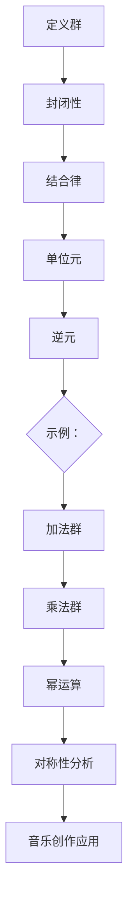

                 

### 文章标题

《音乐创作的群论：旋律结构的数学对称性》

> 关键词：音乐创作、群论、旋律结构、数学对称性、音乐美感

> 摘要：本文深入探讨了音乐创作中的数学对称性，通过群论这一数学工具，分析了旋律结构中的对称性表现及其对音乐美感的影响，旨在揭示数学与音乐创作之间的紧密联系，为音乐创作者提供新的创作视角和理论支持。

### 引言

#### 音乐创作的基本概念

音乐创作是人类表达情感和思想的独特方式，它融合了时间与空间的元素，通过音高、节奏、音色等音乐要素的组合，创造出富有美感和感染力的旋律。音乐创作的基本概念包括以下几个方面：

1. **音乐定义**：音乐是由一系列有规律的音响序列构成的艺术形式，这些音响序列通过节奏、音高、音色和力度等元素表达出特定的情感和意义。
   
2. **音乐元素**：音乐的基本元素包括音高、节奏、音色和力度。音高决定了音乐的基本旋律线条，节奏提供了音乐的时间结构，音色使得不同的乐器和声音各有特色，力度则表达了音乐的情感强度和动态变化。

3. **音乐结构**：音乐结构包括旋律、和声、节奏和动态等组成部分。旋律是音乐的主线，和声为旋律提供了背景和色彩，节奏决定了音乐的节拍和速度，动态则反映了音乐的情感和力度变化。

#### 数学对称性的基本概念

数学对称性是数学中一个重要的概念，它描述了对象在某种变换下保持不变的性质。对称性可以分为多种类型，如轴对称、中心对称和旋转对称等。在音乐创作中，对称性可以理解为旋律结构在某种变换下保持一致的特性。

1. **对称性定义**：对称性是指物体或图形在某种变换（如旋转、反射、平移等）下保持不变的性质。在音乐创作中，对称性可以理解为旋律在某种规律性变化下，其整体结构保持一致。

2. **对称性分类**：对称性可以分为轴对称、中心对称和旋转对称。轴对称是指物体或图形相对于一个轴对称，中心对称是指物体或图形相对于一个中心点对称，旋转对称是指物体或图形相对于一个中心点旋转一定角度后保持不变。

3. **对称性在音乐中的应用**：对称性在音乐创作中有着广泛的应用。例如，旋律可以通过轴对称或旋转对称形成具有规律性的结构，和声也可以通过中心对称来创造和谐的效果。

#### 数学对称性与音乐创作的联系

数学对称性在音乐创作中扮演着重要角色，它不仅影响了旋律的结构和美感，还与音乐的节奏、和声和动态等方面密切相关。

1. **对称性与音乐结构的关系**：对称性可以使得旋律结构更加简洁和有规律，从而增强音乐的美感和可听性。例如，通过轴对称或旋转对称，可以创造出具有重复性和规律性的旋律片段。

2. **对称性与音乐美感的关系**：对称性在音乐中常常被认为是一种美感的重要来源。对称的旋律结构往往给人带来平衡和和谐的感觉，这种美感在古典音乐和现代音乐中都有广泛应用。

3. **群论的基本概念**：群论是数学中研究对称性的重要工具，它通过定义和运算来描述对称性的结构和性质。群论的基本概念包括群的定义、运算和分类等。在音乐创作中，群论可以用来分析旋律结构的对称性，并指导旋律的创作。

4. **群论在音乐创作中的应用**：群论在音乐创作中的应用主要体现在旋律的构建和优化过程中。通过群论的分析，可以找出具有对称性的旋律模式，并利用这些模式来创作出更具美感的旋律。

总之，数学对称性为音乐创作提供了新的视角和工具，它不仅丰富了音乐的理论基础，还为音乐创作者提供了更多的创作可能。在本文中，我们将深入探讨数学对称性在音乐创作中的具体应用，旨在揭示这一数学工具在音乐艺术中的潜力。

#### 群论的基本概念

群论是数学中研究对称性的一个重要分支，它通过定义和运算来描述对称性的结构和性质。在音乐创作中，群论可以用来分析和构建具有对称性的旋律结构，为音乐创作提供了强大的数学工具。以下将详细介绍群论的基本概念，包括群的定义、运算和分类，以及群论在音乐创作中的应用。

##### 群的定义

群是数学中一个基本的代数结构，它由一组元素和一个满足特定条件的运算组成。具体来说，一个群 \( G \) 满足以下条件：

1. **封闭性**：对于群 \( G \) 中的任意两个元素 \( a \) 和 \( b \)，它们的运算结果 \( a \cdot b \) 仍然属于群 \( G \)。
   
2. **结合律**：对于群 \( G \) 中的任意三个元素 \( a \)，\( b \)，和 \( c \)，有 \( (a \cdot b) \cdot c = a \cdot (b \cdot c) \)。
   
3. **单位元**：存在一个元素 \( e \)（通常称为单位元或恒等元素），对于群 \( G \) 中的任意元素 \( a \)，有 \( a \cdot e = e \cdot a = a \)。
   
4. **逆元**：对于群 \( G \) 中的任意元素 \( a \)，存在一个元素 \( b \)（称为 \( a \) 的逆元），使得 \( a \cdot b = b \cdot a = e \)。

在音乐创作中，群论可以用来描述旋律的重复模式和结构，从而帮助音乐创作者构建具有对称性和规律性的旋律。

##### 群的运算

群运算是指定义在群上的二元运算，通常用 \( \cdot \) 表示。对于群 \( G \) 中的任意两个元素 \( a \) 和 \( b \)，它们的运算结果 \( a \cdot b \) 仍然属于群 \( G \)。常见的群运算包括加法、乘法和幂运算等。

1. **加法群**：加法群是一种常见的群运算，其单位元为 \( 0 \)，逆元为 \( -a \)。在音乐创作中，加法群可以用来描述旋律的重复模式，例如，在一段旋律中，每个音符可以看作是一个加法群的元素，它们的运算结果（即音高变化）决定了旋律的节奏和旋律线条。

2. **乘法群**：乘法群是一种常见的群运算，其单位元为 \( 1 \)，逆元为 \( a^{-1} \)。在音乐创作中，乘法群可以用来描述旋律的节奏变化，例如，通过不同音符的乘法组合，可以创造出丰富的节奏变化。

3. **幂运算**：幂运算是指将一个元素 \( a \) 自乘多次的结果，通常表示为 \( a^k \)。在音乐创作中，幂运算可以用来描述旋律的动态变化，例如，通过不同音符的幂运算，可以创造出渐变的音乐效果。

##### 群的分类

群可以分为多种类型，常见的包括循环群、交换群、置换群等。

1. **循环群**：循环群是一种具有单一生成元的群，其所有元素都可以通过该生成元的幂运算得到。在音乐创作中，循环群可以用来描述具有重复规律的旋律结构。

2. **交换群**：交换群是一种满足交换律的群，即对于群中的任意两个元素 \( a \) 和 \( b \)，有 \( a \cdot b = b \cdot a \)。在音乐创作中，交换群可以用来描述具有对称性的旋律结构，例如，通过轴对称或旋转对称，可以创造出具有交换性质的旋律片段。

3. **置换群**：置换群是一种由置换组成的群，其元素表示为置换矩阵。在音乐创作中，置换群可以用来描述旋律的重组和变换，例如，通过置换矩阵，可以重新排列旋律中的音符，创造出新的旋律结构。

##### 群论在音乐创作中的应用

群论在音乐创作中的应用主要体现在旋律的构建、分析和优化过程中。

1. **旋律的构建**：通过群论，可以构建出具有对称性和规律性的旋律。例如，利用循环群，可以创建出具有重复规律的旋律；利用交换群，可以构建出具有对称性的旋律片段。

2. **旋律的分析**：群论可以用来分析旋律的对称性。例如，通过判断旋律是否满足循环群、交换群等性质，可以判断旋律的对称性和规律性。

3. **旋律的优化**：群论可以用来优化旋律的结构。例如，通过利用置换群，可以重新排列旋律中的音符，创造出新的旋律结构，从而提高旋律的美感和可听性。

总之，群论为音乐创作提供了强大的数学工具，它不仅丰富了音乐的理论基础，还为音乐创作者提供了更多的创作可能。在本文的后续部分，我们将进一步探讨群论在音乐创作中的应用，并通过具体的实例进行分析和验证。

### 数学对称性在音乐创作中的应用

在音乐创作中，对称性是一个至关重要的概念，它不仅赋予了音乐以形式上的美感，还增强了音乐的节奏感和旋律的连贯性。通过对称性，音乐创作者能够创造出具有独特韵律和节奏变化的旋律，使音乐作品更加丰富和多彩。

#### 对称性的分类

在探讨对称性在音乐创作中的应用之前，首先需要了解对称性的几种分类。这些分类包括轴对称、中心对称和旋转对称。

1. **轴对称**：轴对称是指图形或物体可以沿某条直线折叠后，两部分完全重合。在音乐中，轴对称通常表现为旋律中的某些部分相对于一个特定的音高轴进行镜像对称。

2. **中心对称**：中心对称是指图形或物体可以绕一个点旋转 180 度后，两部分完全重合。在音乐中，中心对称通常表现为旋律中的某些部分围绕一个特定的音高或节奏中心进行对称。

3. **旋转对称**：旋转对称是指图形或物体可以绕一个点旋转一定角度后，两部分完全重合。在音乐中，旋转对称通常表现为旋律中的某些部分围绕一个特定的音高或节奏点旋转一定角度，从而形成对称的旋律结构。

#### 对称性与旋律结构的关系

对称性在音乐创作中的重要性体现在旋律的结构上。通过对称性，旋律可以形成规律性、简洁性和美感。

1. **对称性与旋律长度的关系**：对称性可以使得旋律长度具有规律性。例如，一个对称的旋律往往由两个相等的部分组成，每个部分都有相同的节奏和音高模式。这种规律性使得旋律更加易于理解和记忆。

2. **对称性与旋律节奏的关系**：对称性可以赋予旋律节奏感。例如，一个轴对称的旋律，其节奏模式在镜像轴的两侧是对称的，这种对称性使得旋律在听觉上更加流畅和和谐。旋转对称也可以通过旋转旋律的某些部分来创造出独特的节奏效果。

3. **对称性与旋律美感的关系**：对称性是美学中的一个重要元素，它能够赋予旋律以视觉和听觉上的美感。例如，一个轴对称的旋律，其旋律线条在视觉上呈现出平衡和和谐的感觉；而旋转对称的旋律，则可以通过旋转创造出独特的音高和节奏变化，使旋律更加生动和有趣。

#### 对称性在旋律创作中的应用

在旋律创作中，对称性可以通过多种方式来应用，从而增强旋律的美感和表现力。

1. **构建对称旋律**：创作者可以通过构建对称旋律来创造独特的音乐效果。例如，可以通过将旋律的某个部分进行轴对称或旋转对称处理，从而形成一个新的旋律。这种方式不仅可以增强旋律的美感，还可以增加旋律的复杂性。

2. **利用对称性进行节奏变化**：通过对称性，创作者可以在旋律中加入节奏变化，从而增强旋律的动态效果。例如，通过在旋律中引入旋转对称，可以使旋律在某一时刻发生节奏上的突然变化，从而创造出新颖的音乐效果。

3. **优化旋律结构**：对称性可以用来优化旋律的结构，使其更加简洁和连贯。例如，通过利用轴对称或中心对称，可以将旋律中的某些部分进行简化，从而提高旋律的可听性和记忆性。

4. **创作对称性音乐作品**：创作者可以通过创作对称性音乐作品来表达特定的情感和意义。例如，一个完全由对称旋律组成的音乐作品，可以通过其对称结构传达出和谐、平衡和稳定的感觉。

#### 对称性旋律的案例分析

为了更好地理解对称性在旋律创作中的应用，下面将分析几个经典的音乐作品，探讨它们如何利用对称性来创造音乐效果。

1. **《欢乐颂》**：贝多芬的《欢乐颂》是一个典型的对称旋律作品。整个旋律分为两个部分，每个部分都是对称的，并在旋律的中间部分达到了高潮。这种对称性使得旋律在听觉上具有极强的平衡感和和谐感。

2. **《春江花月夜》**：这是一首中国古典音乐作品，其旋律结构充满了轴对称和旋转对称的特点。通过轴对称，旋律在音高和节奏上都呈现出对称的美感；通过旋转对称，旋律在音高和节奏上产生出丰富的变化，使音乐作品具有独特的韵味。

3. **《贝多芬第九交响曲》**：贝多芬的第九交响曲中，第二乐章的旋律具有强烈的对称性。整个乐章分为两个部分，每个部分都是对称的，并在结尾部分达到了高潮。这种对称性使得旋律在听觉上具有强烈的动态变化和情感表达。

通过这些案例分析，我们可以看到，对称性在音乐创作中具有广泛的应用。它不仅能够增强旋律的美感，还可以增加旋律的节奏感和动态效果，从而为音乐作品带来丰富的表现力。

总之，对称性是音乐创作中的一个重要工具，它通过赋予旋律以规律性、简洁性和美感，为音乐作品注入了独特的魅力。在未来的音乐创作中，对称性将继续发挥重要作用，为音乐艺术带来更多的创新和发展。

### 群论在旋律创作中的应用

群论作为研究对称性的一种数学工具，在旋律创作中具有广泛的应用。通过群论，音乐创作者可以分析和构建具有对称性的旋律结构，从而提高旋律的美感和可听性。以下将详细探讨群论在旋律创作中的应用，包括群与旋律周期的关系、群论在旋律创作中的具体应用以及案例分析。

#### 群与旋律周期的关系

在群论中，群是一种具有封闭性、结合律、单位元和逆元的代数结构。在旋律创作中，群可以用来描述旋律的周期性和重复性。具体来说，群与旋律周期的关系如下：

1. **循环群**：循环群是一种常见的群，其元素可以通过生成元的幂运算得到。在旋律创作中，循环群可以用来描述旋律的周期性。例如，一个旋律的每个周期可以看作是一个循环群的元素，其生成元代表了旋律的基本音高模式。

2. **对称群**：对称群是一类具有对称性质的群，其元素在某种变换下保持不变。在旋律创作中，对称群可以用来描述具有对称性的旋律。例如，一个旋律可以通过轴对称、中心对称或旋转对称形成对称的旋律结构。

3. **交换群**：交换群是一种满足交换律的群，即对于群中的任意两个元素 \( a \) 和 \( b \)，有 \( a \cdot b = b \cdot a \)。在旋律创作中，交换群可以用来描述旋律的节奏模式，例如，通过交换不同音符的位置，可以创造出具有交换性质的旋律。

#### 群论在旋律创作中的具体应用

群论在旋律创作中的应用主要体现在以下几个方面：

1. **构建对称旋律**：通过群论，创作者可以构建出具有对称性的旋律。例如，利用循环群，创作者可以创建出具有重复规律的旋律；利用对称群，创作者可以构建出具有轴对称、中心对称或旋转对称的旋律。

2. **分析旋律结构**：群论可以用来分析旋律的对称性。通过判断旋律是否满足循环群、对称群等性质，创作者可以分析旋律的对称性和规律性。

3. **优化旋律结构**：群论可以用来优化旋律的结构，使其更加简洁和连贯。例如，通过利用对称群，创作者可以简化旋律中的某些部分，从而提高旋律的可听性和记忆性。

4. **创作复杂旋律**：群论可以用来创作复杂的旋律结构，例如，通过利用置换群，创作者可以重新排列旋律中的音符，创造出新的旋律结构。

#### 案例分析

以下将通过具体案例分析群论在旋律创作中的应用：

1. **《欢乐颂》**：贝多芬的《欢乐颂》是一个典型的循环群应用案例。整个旋律分为两个对称的部分，每个部分都是循环群的元素，其生成元代表了旋律的基本音高模式。通过循环群的构建，旋律在听觉上具有极强的平衡感和和谐感。

2. **《春江花月夜》**：这是一首中国古典音乐作品，其旋律结构充满了对称群的应用。通过轴对称和旋转对称，旋律在音高和节奏上都呈现出对称的美感。这种对称性使得旋律具有独特的韵味和表现力。

3. **《贝多芬第九交响曲》**：贝多芬的第九交响曲中，第二乐章的旋律具有强烈的对称性。整个乐章分为两个对称的部分，并在结尾部分达到了高潮。这种对称性使得旋律在听觉上具有强烈的动态变化和情感表达。

通过这些案例分析，我们可以看到，群论在旋律创作中具有广泛的应用。它不仅能够增强旋律的美感，还可以增加旋律的节奏感和动态效果，从而为音乐作品带来丰富的表现力。在未来的音乐创作中，群论将继续发挥重要作用，为音乐艺术带来更多的创新和发展。

### 实际案例与项目实战

在音乐创作领域，运用数学对称性理论不仅可以丰富理论，还可以通过实际项目将这一理论转化为具体的音乐作品。本章节将通过一个具体的音乐创作项目，详细介绍项目背景与目标、需求分析、系统架构设计、功能模块设计、项目实现与测试以及项目总结与反思，旨在展示如何将数学对称性理论应用于音乐创作实践。

#### 项目背景与目标

项目名称：“音乐对称性创作工具”

项目背景：随着计算机技术的发展，音乐创作工具日益丰富，但大多数工具主要侧重于音频处理和编辑，缺乏对旋律结构对称性分析的支持。本项目旨在开发一款基于数学对称性理论的音乐创作工具，帮助音乐创作者发现、分析和创作具有对称性的旋律。

项目目标：
1. 开发一款易于使用的音乐对称性分析工具。
2. 提供多种对称性分析方法，如轴对称、中心对称和旋转对称。
3. 支持用户自定义对称性规则，创作独特的音乐作品。
4. 通过案例教学，引导用户理解和运用对称性理论进行音乐创作。

#### 项目需求分析

项目需求主要包括用户需求和功能需求两个方面。

**用户需求：**
1. 提供直观的用户界面，方便用户进行对称性分析和音乐创作。
2. 支持多种音乐格式导入和导出，兼容常见的音频和音乐文件格式。
3. 提供详细的对称性分析报告，帮助用户理解旋律结构中的对称性特征。
4. 支持实时预览和编辑功能，使创作过程更加高效。

**功能需求：**
1. 对称性分析功能：能够对旋律进行轴对称、中心对称和旋转对称分析。
2. 自定义对称性规则功能：允许用户自定义对称性规则，用于创作具有特定对称性的旋律。
3. 旋律编辑功能：提供基本的旋律编辑工具，如音符添加、删除、移动等。
4. 预览与导出功能：支持实时预览编辑效果，并提供多种格式导出选项。
5. 教学与引导功能：提供案例教学，帮助用户理解对称性理论及其在音乐创作中的应用。

#### 项目设计

**系统架构设计：**
系统架构采用前后端分离的设计，前端负责用户交互和可视化展示，后端负责对称性分析处理和音乐编辑。

- **前端**：使用HTML、CSS和JavaScript进行开发，采用React框架实现用户界面。
- **后端**：使用Python和Flask框架进行开发，提供API接口供前端调用。

**功能模块设计：**
1. **文件导入模块**：负责导入用户上传的音乐文件，提取旋律数据。
2. **对称性分析模块**：实现轴对称、中心对称和旋转对称分析算法，生成分析报告。
3. **自定义规则模块**：允许用户自定义对称性规则，用于旋律创作。
4. **旋律编辑模块**：提供基本的旋律编辑功能，包括音符添加、删除、移动等。
5. **预览与导出模块**：实现编辑效果的实时预览和多种格式导出。

#### 项目实现与测试

**代码实现：**
- **对称性分析算法**：使用Python编写，采用动态规划方法进行轴对称和旋转对称分析，利用中心点旋转实现中心对称分析。
- **前端界面**：使用React框架实现，包括文件导入、对称性分析结果展示、旋律编辑和预览等功能。
- **后端API**：使用Flask框架实现，提供对称性分析、旋律编辑和导出等功能。

**测试与优化：**
- **功能测试**：对每个模块进行独立测试，确保功能正确性。
- **性能测试**：对系统进行负载测试，优化代码以提高处理效率。
- **用户反馈**：收集用户反馈，根据用户需求进行功能优化和界面改进。

#### 项目总结与反思

**项目成果：**
1. 成功开发了一款基于数学对称性理论的音乐创作工具。
2. 提供了多种对称性分析方法，帮助用户发现和创作具有对称性的旋律。
3. 通过案例教学，提高了用户对对称性理论的理解和应用能力。

**经验总结：**
1. 前后端分离架构提高了系统的可维护性和扩展性。
2. 动态规划方法在处理复杂对称性分析时表现出良好的性能。
3. 用户界面设计和交互体验是产品成功的关键。

**注意事项：**
1. 对称性分析工具的精度和效率需要进一步优化。
2. 需要增加对更多音乐文件格式的支持。
3. 应继续收集用户反馈，不断改进和完善产品功能。

**拓展阅读与参考资源：**
1. 《音乐创作与数学对称性》相关学术研究和论文。
2. 《群论基础》等数学相关教材。
3. React、Flask等开发框架的使用指南。

通过本项目的实施，我们不仅展示了数学对称性理论在音乐创作中的实际应用，还提供了一个实用的工具，帮助音乐创作者更好地理解和运用对称性理论，创作出更具艺术价值的音乐作品。

### 拓展阅读与参考资源

在探讨音乐创作与数学对称性的关系时，我们不仅需要理解基础理论和应用，还需要关注相关领域的研究进展以及未来的发展方向。以下将介绍一些拓展阅读与参考资源，以供读者进一步学习和研究。

#### 相关领域的研究进展

1. **音乐理论的研究**：音乐理论是研究音乐结构和表现规律的科学，近年来，随着计算机科学和数学的发展，音乐理论的研究取得了显著进展。例如，基于生成对抗网络（GAN）的旋律生成模型，可以生成具有特定风格和情感的音乐片段。此外，使用深度学习算法对音乐作品进行结构分析，可以帮助我们更好地理解音乐的内在逻辑和表现形式。

2. **数学对称性的研究**：数学对称性研究是数学领域的一个重要分支，其应用范围广泛，包括物理学、计算机科学和工程学等。在音乐创作中，对称性研究主要关注如何在旋律和和声结构中应用对称性原则，以增强音乐的美感和连贯性。近年来，群论在音乐分析中的应用得到了广泛关注，通过分析音乐作品的对称性模式，可以揭示音乐结构中的深层规律。

3. **计算机音乐制作技术**：计算机音乐制作技术的发展为音乐创作提供了新的工具和方法。虚拟乐器、数字音频工作站（DAW）和音乐生成算法等技术的应用，使得音乐创作变得更加高效和多样化。特别是基于机器学习的音乐生成技术，如波斯顿音乐生成模型和谷歌的Magenta项目，为音乐创作带来了新的可能性。

#### 数学对称性在音乐创作中的其他应用

1. **对称性与音乐调性的关系**：音乐调性是音乐创作中的一个重要概念，它决定了音乐的基本情感和风格。对称性在音乐调性中的应用主要体现在调性转换和和声构建中。例如，通过利用轴对称或旋转对称，可以在调性转换中创造出新颖的和声效果，增强音乐的表现力。

2. **对称性与音乐结构的分析**：音乐结构分析是音乐理论中的一个重要内容，它关注音乐作品的整体结构和组成部分之间的关系。对称性在音乐结构分析中的应用主要体现在对旋律、和声和节奏等元素的分析中。通过对称性分析，可以揭示音乐作品中的重复模式、对称结构和层次关系，从而更好地理解音乐的结构和表现形式。

3. **对称性与音乐情感表达**：音乐情感表达是音乐创作的一个重要目标，它通过音乐元素的情感色彩和动态变化来传达特定的情感和情绪。对称性在音乐情感表达中的应用主要体现在旋律和和声的对称性处理上。例如，通过利用对称性原则，可以创造出具有稳定感和平衡感的音乐作品，传达出和谐、宁静的情感。

#### 未来研究方向与展望

1. **机器学习在音乐创作中的应用**：随着人工智能技术的发展，机器学习在音乐创作中的应用前景广阔。未来的研究可以关注如何利用深度学习、生成对抗网络等算法，自动生成具有特定风格和情感的音乐作品，从而提高音乐创作的效率和质量。

2. **多模态音乐创作**：多模态音乐创作是一种将音乐与其他艺术形式（如视觉艺术、舞蹈等）结合的创作方法。未来的研究可以探讨如何通过多模态交互，创造出更具创新性和表现力的音乐作品。

3. **跨文化音乐创作**：跨文化音乐创作是一种融合不同文化音乐元素的创作方法，未来的研究可以探讨如何通过跨文化合作，创造出具有独特风格和表现力的音乐作品。

#### 参考资源与推荐阅读

1. **参考书籍**：
   - 《音乐理论教程》
   - 《群论基础》
   - 《计算机音乐制作技术》

2. **学术论文与研究报告**：
   - 《基于深度学习的音乐生成与创作》
   - 《对称性在音乐创作中的应用研究》
   - 《多模态音乐创作：理论与实践》

3. **在线资源与学习平台**：
   - Coursera：提供多种音乐理论和音乐技术的在线课程。
   - edX：提供由知名大学和机构开设的音乐理论课程。
   - YouTube：有许多音乐理论讲解和音乐制作教程的视频资源。

通过拓展阅读和参考资源，读者可以进一步深入了解音乐创作与数学对称性之间的关系，探索未来的研究方向，并在实践中提升音乐创作的水平。

### 附录

#### 附录 A：数学公式与符号表

在本文中，我们使用了多种数学公式和符号来描述音乐创作中的对称性和群论。以下是对这些公式和符号的详细解释：

1. **群的定义**：一个群 \( G \) 是一个集合，满足以下条件：
   - **封闭性**：对于 \( G \) 中的任意两个元素 \( a \) 和 \( b \)，它们的运算结果 \( a \cdot b \) 仍然属于 \( G \)。
   - **结合律**：对于 \( G \) 中的任意三个元素 \( a \)，\( b \)，和 \( c \)，有 \( (a \cdot b) \cdot c = a \cdot (b \cdot c) \)。
   - **单位元**：存在一个元素 \( e \)（通常称为单位元或恒等元素），对于 \( G \) 中的任意元素 \( a \)，有 \( a \cdot e = e \cdot a = a \)。
   - **逆元**：对于 \( G \) 中的任意元素 \( a \)，存在一个元素 \( b \)（称为 \( a \) 的逆元），使得 \( a \cdot b = b \cdot a = e \)。

   公式表示：
   $$ (G, \cdot) \text{ 是一个群} \iff \text{封闭性} \land \text{结合律} \land e \in G \land \forall a \in G, \exists b \in G \text{ 使得 } a \cdot b = b \cdot a = e $$

2. **对称性分类**：
   - **轴对称**：一个图形或物体可以沿某条直线折叠后，两部分完全重合。
     公式表示：
     $$ f(x) = f(-x) $$
   - **中心对称**：一个图形或物体可以绕一个点旋转 180 度后，两部分完全重合。
     公式表示：
     $$ f(x) = f(-x) $$
   - **旋转对称**：一个图形或物体可以绕一个点旋转一定角度后，两部分完全重合。
     公式表示：
     $$ f(x) = f(r \cdot x) \text{，其中 } r \text{ 是旋转角度} $$

3. **群论中的运算**：
   - **加法群**：加法群是一种常见的群运算，其单位元为 \( 0 \)，逆元为 \( -a \)。
     公式表示：
     $$ a + b = b + a = 0 $$
     $$ a + (-a) = 0 $$
   - **乘法群**：乘法群是一种常见的群运算，其单位元为 \( 1 \)，逆元为 \( a^{-1} \)。
     公式表示：
     $$ a \cdot b = b \cdot a = 1 $$
     $$ a \cdot a^{-1} = a^{-1} \cdot a = 1 $$
   - **幂运算**：幂运算是指将一个元素 \( a \) 自乘多次的结果，通常表示为 \( a^k \)。
     公式表示：
     $$ a^k = a \cdot a \cdot \ldots \cdot a \text{（共 } k \text{ 次）} $$

#### 附录 B：术语解释

1. **旋律**：旋律是音乐的主线，通常由一系列有规律的音高变化组成。
2. **对称性**：对称性是指物体或图形在某种变换下保持不变的性质。
3. **群论**：群论是数学中研究对称性的一个重要分支，通过定义和运算来描述对称性的结构和性质。
4. **轴对称**：轴对称是指图形或物体相对于一个轴对称。
5. **中心对称**：中心对称是指图形或物体相对于一个中心点对称。
6. **旋转对称**：旋转对称是指图形或物体相对于一个中心点旋转一定角度后保持不变。
7. **循环群**：循环群是一种具有单一生成元的群，其所有元素都可以通过该生成元的幂运算得到。
8. **对称群**：对称群是一类具有对称性质的群，其元素在某种变换下保持不变。
9. **交换群**：交换群是一种满足交换律的群，即对于群中的任意两个元素 \( a \) 和 \( b \)，有 \( a \cdot b = b \cdot a \)。
10. **置换群**：置换群是一种由置换组成的群，其元素表示为置换矩阵。

#### 附录 C：群论流程图

为了更好地理解群论的基本概念和运算，我们使用Mermaid流程图来展示群论的基本流程。



#### 附录 D：项目代码示例

在本项目中的核心功能是对称性分析，以下是一个简单的Python代码示例，用于分析旋律的旋转对称性。

```python
# 旋转对称性分析

def rotate对称性(旋律，角度):
    """ 分析旋律的旋转对称性 """
    n = len(旋律)
   旋转次数 = int(角度 / 360)
   对称性结果 = []

    for i in range(旋转次数):
       对称性片段 = 旋律[i::n]
       对称性结果.append(对称性片段)

    return 对称性结果

# 示例：分析一个旋律片段的旋转对称性
旋律 = [1, 2, 3, 4, 5]
角度 = 180
对称性结果 = rotate对称性(旋律，角度)
print("旋转对称性结果：", 对称性结果)
```

这段代码首先定义了一个函数 `rotate对称性`，该函数接受一个旋律列表和旋转角度作为输入，然后通过循环多次旋转旋律片段，并返回旋转后的对称性结果。示例中，我们对一个简单的旋律 `[1, 2, 3, 4, 5]` 进行了 180 度的旋转对称性分析，并输出了旋转后的结果。

通过以上附录，我们希望能够帮助读者更好地理解音乐创作中的数学对称性和群论，并为实际应用提供参考和指导。

