                 

### 引言

在现代企业竞争日益激烈的环境中，领导力与企业文化成为了组织成功和持续发展的关键因素。随着全球化的加速和技术的快速发展，企业面临着前所未有的变革与挑战。传统的管理模式已经难以应对快速变化的市场需求，组织需要具备强大的适应能力和创新精神。而领导力和企业文化正是在这一背景下，逐渐成为塑造组织灵魂的核心要素。

**领导力**，作为一种关键能力，不仅影响组织的运作效率，还决定着组织的未来方向。它不仅涉及到如何管理和激励员工，还关乎战略决策、团队建设以及组织文化的塑造。一个优秀的领导者能够激发团队的潜力，推动组织实现持续增长和创新。

**企业文化**，则是组织的“灵魂”，它决定了员工的行为模式、价值观和共同目标。一个积极向上的企业文化能够促进团队合作，提升员工满意度，从而增强组织的竞争力。相反，消极的企业文化可能导致员工士气低落，甚至影响组织的整体表现。

本文将围绕领导力与企业文化展开深入探讨，通过逻辑清晰、结构紧凑的论述，旨在揭示二者在组织发展中的重要作用。我们将首先介绍领导力的定义与重要性，探讨其核心能力和发展路径；然后，我们将转向企业文化的概念、要素和建设策略，分析企业文化对领导力的影响及其相互作用；接着，通过具体案例研究，展示领导力与企业文化在实践中的应用和挑战；最后，我们将展望未来领导力与企业文化的发展趋势，为组织的持续成功提供指导。

通过对领导力与企业文化系统性的分析和探讨，本文希望为读者提供一个全面而深入的理解，帮助他们在实际工作中更好地运用这些关键因素，推动组织实现更高的绩效和长期发展。

### 关键词

- 领导力
- 企业文化
- 组织绩效
- 团队建设
- 战略决策
- 变革管理
- 案例研究
- 持续发展

### 摘要

本文旨在探讨领导力与企业文化在塑造组织灵魂中的重要作用。首先，我们介绍了领导力的定义与重要性，分析了其核心能力和发展路径。接着，我们深入探讨了企业文化的概念、要素和建设策略，阐述了企业文化对领导力的影响及其相互作用。通过具体案例研究，我们展示了领导力与企业文化在实践中的应用和面临的挑战。最后，我们展望了未来领导力与企业文化的发展趋势，为组织的持续成功提供了指导。本文通过系统性的分析和论述，旨在为读者提供对领导力与企业文化全面而深入的理解，以指导其在实际工作中的应用和实践。

## 第一部分：领导力概述

### 第1章：领导力的重要性

领导力，作为现代企业管理中的核心要素，对于组织的成功和可持续发展起着至关重要的作用。首先，让我们来探讨领导力的定义与演变。领导力不仅仅是指领导者的个人特质或行为，它更是一种能够激励、引导和协调团队成员共同实现目标的能力。早在古希腊时期，亚里士多德就曾提到过领导力的重要性，强调领导者应当具备智慧、勇敢和正义等品质。随着历史的演进，领导力的概念也在不断发展，逐渐从单一的特质导向转变为更加注重能力、关系和情境的多元视角。

在现代社会，领导力的定义和认知经历了几个重要的演变阶段。早期的领导力研究主要集中在领导者的个人特质上，如托马斯·卡朋特（Thomas Carlyle）的“英雄崇拜”理论和弗隆德（Freund）的“伟大人物”理论。这些理论强调领导者的卓越能力和非凡个性对于领导成功的关键作用。然而，随着研究的深入，学者们逐渐意识到，领导力不仅仅取决于领导者的个人特质，还受到组织情境和环境的影响。20世纪中叶，行为科学学派的研究成果开始出现，强调了领导者与追随者之间的关系和行为互动。彼得·德鲁克（Peter Drucker）提出的“管理即领导”理论，标志着领导力研究从个人特质向行为和能力转变的进程。

进入21世纪，领导力研究进一步拓展到了情境理论和变革理论。情境理论认为，领导力并非一成不变，而是需要根据不同的情境和需求进行调整。约翰·梅奥（John Meador）的“情境领导”理论和赫塞（Paul Hersey）的“情境领导模型”都是这一思想的代表。变革理论则强调了领导者推动组织变革和创新的关键作用。约翰·科特（John Kotter）的“领导变革”理论和力克·塞扎（Lewin Sizzar）的“变革管理模型”都指出，领导者在应对环境变化、推动组织转型中扮演着核心角色。

领导力在组织中的作用不可忽视。首先，领导力决定了组织的战略方向和目标实现。一个优秀的领导者能够明确组织的目标，并制定出切实可行的战略规划，引导团队朝着共同的目标努力。其次，领导力对团队建设和员工管理起着至关重要的作用。一个具备领导力的领导者能够有效地激励和引导团队成员，建立高效、协作的团队文化，提升整体工作效率。此外，领导力还直接影响组织的创新能力和市场竞争力。领导者通过推动创新、鼓励试错和持续改进，使组织能够更好地适应市场变化，保持持续的竞争优势。

在组织中，领导力的类型和风格多种多样。从理论上讲，领导力可以分为权威型、民主型、教练型、变革型等多种类型。权威型领导者通过明确的指令和严格的管理，确保组织目标的实现；民主型领导者则更加注重团队参与和民主决策，提升团队成员的参与度和积极性；教练型领导者以培养和发展团队成员的能力为核心，通过指导和支持，提升团队的整体能力；变革型领导者则专注于推动组织的变革和创新，激发团队的创造力和创新精神。在实际应用中，不同的领导力类型和风格往往需要根据具体的组织情境和需求进行灵活调整。

综上所述，领导力作为组织管理中的重要元素，不仅决定了组织的战略方向和目标实现，还对团队建设、员工管理和创新能力产生深远影响。通过理解领导力的定义与演变、掌握不同类型的领导力风格，组织可以更好地培养和运用领导力，推动组织的持续发展和成功。

### 核心概念与联系

为了更清晰地理解领导力的核心概念及其相互联系，我们可以通过一个Mermaid流程图来展示各个概念之间的关系架构：

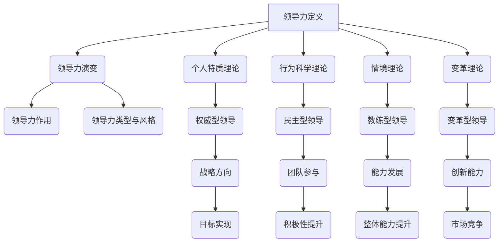

在这个流程图中，我们可以看到领导力的核心概念包括定义、演变、作用、类型与风格。领导力的演变从个人特质理论、行为科学理论、情境理论到变革理论，不断深化和扩展。而领导力的作用则通过不同类型的领导风格体现出来，如权威型、民主型、教练型和变革型。这些领导风格不仅影响组织的战略方向和目标实现，还直接影响团队建设、员工管理以及组织的创新能力和市场竞争力。

#### 1.1 领导力的定义与演变

领导力的定义随着历史的发展和理论的深化而不断演变。最早的领导力理论可以追溯到古希腊时期，当时的学者们认为领导者是拥有超凡能力和智慧的“英雄”。亚里士多德在其著作《政治学》中提到，领导者应当具备智慧、勇敢和正义等品质。这种观点强调了领导者的个人特质，并将其视为领导成功的关键。

进入20世纪，随着管理学和心理学的发展，领导力理论开始从特质论转向行为论。特质论认为领导者天生具备某些独特的个人特质，如自信、决心和沟通能力。行为论则更注重领导者实际的行为模式，如决策过程、领导风格和沟通方式。行为科学学派的研究成果表明，领导者的行为对团队绩效和组织成功有着直接的影响。

在行为论之后，领导力理论进一步发展，开始关注领导力与情境的互动关系。情境理论认为，领导力并非一成不变，而是需要根据不同的情境和需求进行调整。约翰·梅奥（John Meador）提出的“情境领导”理论和赫塞（Paul Hersey）的“情境领导模型”都指出，领导者在不同的情境下需要采取不同的领导风格，以达到最佳的领导效果。

随着全球化和技术的发展，领导力理论再次升级，开始关注变革和创新。变革型领导理论强调领导者推动组织变革和创新的重要作用。约翰·科特（John Kotter）的“领导变革”理论和力克·塞扎（Lewin Sizzar）的“变革管理模型”都指出，领导者需要具备强烈的变革意识和能力，以应对快速变化的市场环境。

总的来说，领导力的定义和理论经历了从特质论、行为论、情境论到变革论的演变过程。这一演变过程不仅丰富了我们对领导力的理解，也为我们提供了更有效的领导方法和策略。在不同的历史阶段，领导力理论都为我们揭示了领导者如何在不同情境下实现领导目标，推动组织的发展和创新。

#### 1.2 领导力在组织中的作用

领导力在组织中的作用至关重要，它不仅决定了组织的战略方向和目标实现，还对团队建设、员工管理和创新能力产生深远影响。以下是对领导力在不同方面作用的详细分析：

首先，领导力决定了组织的战略方向和目标实现。一个优秀的领导者能够清晰地定义组织的目标，并制定出实现这些目标的战略规划。通过有效的沟通和协调，领导者可以确保团队成员理解并致力于实现这些目标。领导者的战略眼光和决策能力对于组织在复杂多变的市场环境中保持竞争优势至关重要。

其次，领导力对团队建设和员工管理起着至关重要的作用。一个具备领导力的领导者能够激励和引导团队成员，建立高效、协作的团队文化。他们通过设定明确的角色和责任，激发团队成员的潜力，提升整体工作效率。此外，领导者还关注员工的个人成长和发展，通过提供培训和发展机会，提升员工的技能和能力，从而增强组织的整体竞争力。

第三，领导力直接影响组织的创新能力。变革型领导者通过推动创新和鼓励试错，激发团队的创造力和创新精神。他们鼓励团队成员提出新的想法和解决方案，并在实验过程中提供支持和指导。这种开放的创新文化有助于组织在快速变化的市场环境中保持灵活性和适应性。

此外，领导力还影响组织的市场竞争力。通过有效的领导，组织能够更好地应对市场变化和挑战，抓住机遇并实现持续增长。领导者的决策和行动不仅影响组织的内部运作，还直接影响其在市场中的形象和声誉。一个具备高领导力的组织能够在激烈的市场竞争中脱颖而出，获得更大的市场份额和客户忠诚度。

综上所述，领导力在组织中的作用是多方面的，不仅决定了组织的战略方向和目标实现，还直接影响团队建设、员工管理和创新能力，进而提升组织的市场竞争力和长期发展能力。通过理解并有效运用领导力，组织可以更好地应对挑战，实现持续成功。

#### 1.3 领导力的类型与风格

领导力在组织管理中具有多种类型和风格，不同的领导风格对团队的表现和组织的发展有着深远的影响。以下是几种主要的领导力类型和风格及其特点：

**权威型领导（Autocratic Leadership）**：权威型领导通过明确的指令和严格的管理来确保组织目标的实现。领导者制定决策并直接下达命令，团队成员通常只需要执行而不需要参与决策过程。这种领导风格适用于紧急情况和需要迅速决策的场景，但在长期合作中可能会导致员工缺乏参与感和创新动力。

**民主型领导（Democratic Leadership）**：民主型领导注重团队参与和民主决策，领导者鼓励团队成员表达意见和参与决策。通过广泛征求团队成员的意见，领导者可以更好地理解团队的需求和期望，从而制定出更有效的策略。这种领导风格有助于提升团队成员的积极性和满意度，但需要更多时间和资源来达成共识。

**教练型领导（Coaching Leadership）**：教练型领导者以培养和发展团队成员的能力为核心。他们通过指导和支持，帮助团队成员识别和发展个人优势，提升整体能力。教练型领导强调个性化的发展计划，注重持续反馈和成长。这种领导风格有助于提高员工的自我管理和解决问题的能力，但需要领导者具备深厚的专业知识和经验。

**变革型领导（Transformational Leadership）**：变革型领导者专注于推动组织的变革和创新。他们通过激励和启发团队成员，激发他们的潜在能力和创造力。变革型领导者通常具备强烈的愿景和使命感，能够引导团队克服困难，实现突破性的变革。这种领导风格适用于需要重大变革和创新的组织环境。

在实际应用中，不同的领导力类型和风格往往需要根据具体的组织情境和需求进行灵活调整。例如，在紧急情况下，权威型领导可能更为有效；而在长期合作和创新过程中，民主型领导和教练型领导则可能更能激发团队的潜力。领导者需要根据不同的情境和需求，选择合适的领导风格，以实现最佳的效果。

总之，理解并运用不同的领导力类型和风格，可以帮助组织更好地应对挑战，实现持续发展和成功。通过灵活调整领导风格，领导者可以更有效地引导团队，推动组织在复杂多变的环境中保持竞争优势。

### 核心概念与联系

为了更好地理解领导力类型与风格之间的关系及其对组织的影响，我们可以通过一个Mermaid流程图来展示这些核心概念及其相互作用：

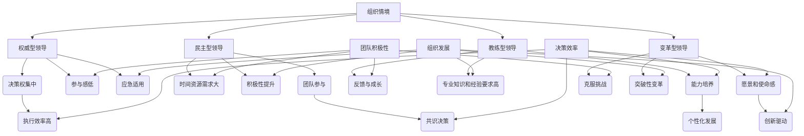

在这个流程图中，我们可以看到不同类型的领导力风格（权威型、民主型、教练型、变革型）及其特点（如决策权集中、团队参与、能力培养、愿景和使命感）如何相互作用，并根据不同的组织情境（如决策效率、团队积极性、组织发展）产生不同的影响。这些领导力风格不仅影响了组织的运作效率，还直接关系到团队建设、员工满意度和创新能力，进而决定组织的长期成功。

### 第2章：领导力的核心能力

领导力的核心能力是领导者能否有效管理团队、实现组织目标的关键。这些能力不仅决定了领导者的个人表现，还直接影响组织的整体绩效。以下是领导力的几个核心能力，包括沟通能力、决策能力、影响力与说服力以及团队建设与管理，我们将详细探讨这些能力的重要性及其在实际应用中的表现。

#### 2.1 沟通能力

沟通能力是领导力的基础，它决定了领导者能否有效地传达信息、理解团队成员的需求以及建立良好的合作关系。一个优秀的领导者必须具备清晰、准确、及时的沟通能力。

**重要性**：良好的沟通能力有助于减少误解和冲突，增强团队凝聚力，提升工作效率。在复杂多变的工作环境中，领导者需要通过有效的沟通来协调各部门的工作，确保组织目标的实现。

**实际应用**：在项目启动时，领导者需要清晰地传达项目目标和期望，确保所有团队成员都理解任务的重要性和紧迫性。在项目执行过程中，领导者需要通过定期的会议和汇报，了解项目的进展情况，及时解决遇到的问题。此外，领导者还需要具备良好的倾听能力，通过倾听员工的意见和建议，了解他们的需求和困难，从而更好地支持他们的工作。

例如，在一个大型软件开发项目中，项目经理需要与开发团队、测试团队和产品经理保持密切沟通，确保项目各阶段的顺利进行。项目经理需要通过每日站会、周报等方式，及时了解各个团队的工作进展和问题，协调资源，解决问题，确保项目按时交付。

**案例**：谷歌公司以其开放、透明的沟通文化而闻名。公司的领导者在项目启动时，会邀请所有相关团队成员参加，明确项目目标、里程碑和预期结果。在项目执行过程中，领导者会定期组织项目评审会议，让团队成员有机会分享他们的工作进展和遇到的问题，从而实现信息的共享和协作。

#### 2.2 决策能力

决策能力是领导力的关键要素，它决定了领导者能否在复杂多变的环境中做出明智的决策，推动组织的发展。

**重要性**：有效的决策能力有助于组织迅速应对市场变化，抓住机遇，避免风险。领导者需要具备快速分析和判断的能力，以做出最佳的决策。

**实际应用**：在面临重大决策时，领导者需要收集和分析大量的信息，考虑各种可能的后果，并权衡各种选择的优缺点。例如，企业在扩张市场时，需要评估目标市场的潜在收益、竞争态势以及风险，从而做出是否进入该市场的决策。

**案例**：苹果公司创始人史蒂夫·乔布斯以其卓越的决策能力而著称。在苹果公司面临困境时，乔布斯通过一系列关键决策，成功带领公司走出困境，推出了多个改变世界的产品，如iPod、iPhone和iPad。

**伪代码示例**：

```python
def make_decision(criteria):
    # 收集和分析信息
    data = collect_data(criteria)
    # 分析数据，比较选项
    options = analyze_data(data)
    # 根据权重和优先级选择最佳选项
    best_option = select_best_option(options)
    # 实施决策
    implement_decision(best_option)
    return best_option
```

#### 2.3 影响力与说服力

影响力与说服力是领导者能够影响他人、引导团队向共同目标努力的重要能力。

**重要性**：具备影响力的领导者能够激发团队成员的积极性和创造力，推动他们为实现组织目标而努力。说服力则是领导者通过沟通和谈判，争取支持和资源的重要手段。

**实际应用**：在项目启动时，领导者需要通过演讲和沟通，向团队成员传达项目的重要性和目标，激发他们的热情和责任感。在资源分配时，领导者需要通过谈判和沟通，争取到所需的资源和支持。

**案例**：微软公司创始人比尔·盖茨以其卓越的沟通能力和说服力而著称。盖茨经常通过演讲和邮件，向团队成员传达公司的愿景和目标，激发他们的创造力和工作热情。同时，盖茨还通过谈判和沟通，成功争取到了大量的资金和资源，推动了微软公司的快速发展。

**伪代码示例**：

```python
def influence_and_communicate(message, target_group):
    # 准备演讲稿和沟通材料
    materials = prepare_materials(message)
    # 发送信息
    send_message(materials, target_group)
    # 跟踪反馈
    feedback = track_feedback(target_group)
    # 根据反馈调整沟通策略
    adjust_strategy(feedback)
    return feedback
```

#### 2.4 团队建设与管理

团队建设与管理是领导力的核心能力之一，它决定了领导者能否有效地激发团队潜力，实现组织目标。

**重要性**：一个高效的团队能够提高工作效率，增强创新能力，提升组织竞争力。领导者需要通过有效的团队建设和管理，打造一支具备高度协作精神和执行力的团队。

**实际应用**：领导者需要设定明确的目标和角色，确保团队成员了解各自的责任和期望。同时，领导者还需要关注团队成员的个人发展和需求，提供必要的支持和资源。

**案例**：丰田公司以其独特的团队管理模式而闻名。丰田的领导者在团队建设过程中，注重培养团队成员的协作精神和自主性，通过定期的团队会议和反馈机制，确保团队成员之间的沟通和协作，从而实现高效的工作流程和卓越的绩效。

**伪代码示例**：

```python
def build_and_manage_team(team_members, goals):
    # 设定目标和角色
    set_goals_and_roles(team_members, goals)
    # 组织团队会议
    organize_meetings(team_members)
    # 提供支持和资源
    provide_support_resources(team_members)
    # 跟踪绩效和反馈
    track_performance_and_feedback(team_members)
    # 调整团队建设策略
    adjust_team_building_strategy(team_members)
    return team_performance
```

通过详细探讨沟通能力、决策能力、影响力与说服力以及团队建设与管理等核心能力，我们可以看到，这些能力不仅决定了领导者的个人表现，还直接影响组织的整体绩效和成功。有效的领导者需要在这四个方面不断提升自己，以更好地应对复杂多变的工作环境，推动组织实现持续发展。

### 核心概念与联系

为了更清晰地展示领导力的核心能力及其相互关系，我们可以通过一个Mermaid流程图来描述这些能力以及它们在领导过程中如何相互作用：

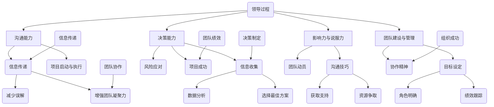

在这个流程图中，我们可以看到沟通能力、决策能力、影响力与说服力以及团队建设与管理四个核心能力如何相互联系和作用。沟通能力确保信息的有效传递和减少误解，增强团队凝聚力；决策能力帮助领导者做出明智的选择，应对风险，推动项目成功；影响力与说服力使领导者能够获取支持和资源，动员团队；团队建设与管理则通过设定目标和角色、跟踪绩效，培养协作精神，最终提升团队绩效和组织成功。这些能力共同构成了领导力的核心框架，为领导者有效管理团队和组织提供了坚实的支持。

### 第3章：领导力的发展与提升

领导力并非与生俱来，而是可以通过后天的培养和实践不断提升。一个成功的领导者不仅需要具备卓越的个人特质，还需要通过不断学习和反思，积累丰富的实践经验。以下是关于领导力发展的几个关键要素，包括自我认知与自我提升、经验学习与反思、以及领导力培养策略与实践。

#### 3.1 自我认知与自我提升

自我认知是领导力发展的第一步，它使领导者能够了解自己的优势和不足，从而有针对性地进行改进。以下是几个提升自我认知的方法：

**1. 反思日记**：定期写反思日记，记录自己的行为、思考和感受，有助于领导者深入思考自己的领导方式，发现潜在问题。

**2. 心理评估**：通过专业的心理测试和评估，领导者可以了解自己的性格特点、优势和弱点，从而更好地了解自己。

**3. 寻求反馈**：主动向团队成员、同事和领导请教意见，了解他们对领导者行为的看法和建议，有助于领导者发现自身不足。

**4. 360度评估**：通过360度评估，领导者可以全面了解自己在多个方面的表现，包括领导能力、沟通能力、决策能力等。

自我提升是领导力发展的关键，以下是几个自我提升的方法：

**1. 持续学习**：领导者需要不断学习新的知识和技能，通过阅读书籍、参加培训课程和研讨会，提升自己的专业素养。

**2. 实践经验**：通过实际工作中的实践，领导者可以积累丰富的经验，提高自己的领导能力。例如，可以主动承担新的项目和挑战，锻炼自己的决策能力和应对能力。

**3. 反思与总结**：通过反思过去的成功和失败，领导者可以总结经验教训，不断改进自己的领导方式。

#### 3.2 经验学习与反思

经验学习是领导力发展的重要途径，领导者需要从每次经历中吸取教训，不断提升自己的能力。以下是几个经验学习的方法：

**1. 反思会议**：在项目结束后，组织团队成员进行反思会议，共同讨论项目的成功和失败之处，分享经验教训。

**2. 学习交流**：与同行和其他领域的专家进行交流，了解他们的经验和观点，拓宽自己的视野。

**3. 案例研究**：通过研究成功的领导案例，分析他们的决策过程和领导风格，学习他们的成功经验。

**4. 实践演练**：通过模拟演练，模拟真实的领导场景，锻炼领导者的决策能力和应变能力。

反思是经验学习的重要环节，领导者需要通过反思，将经验转化为能力。以下是几个反思的方法：

**1. 记录与总结**：将每次经历详细记录下来，包括成功和失败的原因，定期进行总结和反思。

**2. 获取反馈**：向团队成员、同事和领导请教意见，了解他们对领导行为的看法和建议，从而进行改进。

**3. 建立模型**：将成功的领导经验总结为模型或框架，用于指导未来的领导实践。

#### 3.3 领导力培养策略与实践

领导力培养需要系统的策略和实践，以下是一些有效的领导力培养策略：

**1. 设立明确的培养计划**：根据领导者的个人特点和需求，制定明确的培养计划，包括学习目标、实践项目和评估标准。

**2. 提供多样化的学习机会**：通过多样化的学习方式，如培训课程、研讨会、在线课程等，为领导者提供丰富的学习资源。

**3. 建立导师制度**：为领导者配备导师，通过一对一的指导和反馈，帮助他们快速成长。

**4. 实践与反馈**：通过实际工作项目和模拟演练，让领导者在实践中学习和成长，并及时获取反馈，不断改进。

**5. 建立团队文化**：通过建立积极的团队文化，鼓励领导者之间的交流和合作，提升整体领导力水平。

总之，领导力的发展与提升是一个长期而系统的过程，需要领导者通过自我认知、经验学习、反思以及有效的培养策略，不断提升自己的领导能力。通过不断的学习和实践，领导者可以更好地应对复杂多变的工作环境，推动组织的持续发展和成功。

### 核心概念与联系

为了更好地理解领导力发展的各个要素及其相互关系，我们可以通过一个Mermaid流程图来展示这些核心概念：

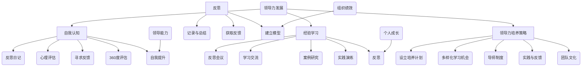

在这个流程图中，我们可以看到自我认知、经验学习、反思以及领导力培养策略如何相互作用，共同促进领导力的发展。自我认知通过反思日记、心理评估、寻求反馈和360度评估来提升自我提升；经验学习通过反思会议、学习交流、案例研究和实践演练来积累经验，并通过反思进行总结和模型化；领导力培养策略则通过设立培养计划、多样化学习机会、导师制度、实践与反馈和团队文化来系统地提升领导能力。这些核心概念共同构成了一个完整的领导力发展框架，为领导者提供了全面的成长路径。

### 第4章：企业文化的概念与要素

企业文化，作为组织的精神内核，不仅决定了员工的行为模式和工作态度，还深刻影响着组织的运营效率和发展方向。为了深入理解企业文化，我们需要首先定义企业文化的概念，并探讨其构成要素及其相互关系。

#### 4.1 企业文化的定义与分类

企业文化，是指一个组织在长期发展过程中形成的共同价值观、信仰、行为规范和工作方式的总和。它不仅包括组织的价值观和使命，还涵盖了员工共同的行为准则、工作习惯和文化传统。企业文化在某种程度上是组织的“灵魂”，它不仅反映了组织的内在精神，也对外界展示了组织的独特魅力和形象。

根据表现形式，企业文化可以分为显性文化和隐性文化。显性文化是指那些可以直接观察和感受到的文化元素，如组织的标识、口号、规章制度和办公环境等。隐性文化则是指那些深藏在组织内部，不易察觉的文化特征，如员工的思维方式、价值观念和行为习惯等。显性文化是企业文化的“面子”，而隐性文化则是企业文化的“里子”。

根据内容特点，企业文化可以分为以下几类：

1. **价值文化**：强调组织的核心价值观，如诚信、创新、合作等，这些价值观不仅指导员工的行为，还影响着组织的决策和发展方向。

2. **制度文化**：涉及组织的规章制度、流程和规范，这些制度不仅约束员工的行为，还保障了组织的正常运营和高效管理。

3. **行为文化**：包括员工在日常工作中表现出来的行为习惯和风格，如工作态度、沟通方式、协作精神等。

4. **物质文化**：指组织的物理环境和物质资源，如办公场所的设计、设备配置和公司礼品等，这些物质元素在一定程度上也反映了组织的文化氛围。

#### 4.2 企业文化的构成要素

企业文化是由多个要素构成的复杂系统，以下是企业文化的主要构成要素及其相互关系：

1. **价值观**：价值观是企业文化的基础，它决定了组织的核心信仰和行为准则。例如，谷歌的“不作恶”和“用户至上”是其核心价值观，这些价值观不仅影响了谷歌的产品设计和市场策略，也塑造了谷歌独特的公司文化。

2. **愿景和使命**：愿景和使命是组织未来发展的目标和方向，它们为员工提供了共同奋斗的目标和动力。例如，苹果公司的使命是“推动科技进步，让生活更美好”，这一使命激励了无数苹果员工不断创新，推出一系列革命性的产品。

3. **领导风格**：领导者的风格直接影响企业文化的发展。一个开放、民主的领导者可能培养出更加创新和协作的文化，而一个权威、专制的领导者则可能导致组织内部压抑和保守。

4. **员工行为规范**：员工行为规范是企业文化的具体体现，它们规定了员工在日常工作中应该如何行动和沟通。例如，丰田公司强调“持续改进”和“团队合作”，这些行为规范深深植根于丰田员工的日常工作中。

5. **组织仪式**：组织仪式是企业文化的仪式化表达，如公司年会、团队建设活动等。这些仪式不仅加强了员工之间的联系，还传递了组织的核心价值观和行为准则。

6. **物质环境**：组织的物理环境，如办公室布局、工作设备等，也在一定程度上反映了企业文化。一个开放式办公环境可能鼓励更多的协作和沟通，而一个封闭式办公环境则可能限制员工的互动。

#### 4.3 企业文化的演变与影响

企业文化并非一成不变，而是随着组织的发展和环境的变化而不断演变。早期企业注重效率和生产，企业文化相对单一和保守；随着信息技术的快速发展，企业逐渐强调创新和灵活性，企业文化也变得更加多元和开放。

企业文化的演变对组织有着深远的影响。首先，积极的企业文化能够提升员工的满意度和忠诚度，从而增强组织的稳定性和竞争力。其次，企业文化直接影响组织的创新能力和市场反应速度，一个开放、创新的文化环境有助于企业快速适应市场变化，抓住机遇。此外，企业文化还影响着组织的战略决策和执行效率，一个统一、协同的企业文化能够提高组织的决策质量和执行力。

总之，企业文化是组织发展的核心要素，它不仅决定了组织的内部运作，还直接影响着组织的竞争力和未来发展。通过理解企业文化的定义、构成要素和演变过程，组织可以更好地塑造和优化企业文化，实现长期可持续发展。

### 核心概念与联系

为了更好地理解企业文化的构成要素及其相互关系，我们可以通过一个Mermaid流程图来展示这些核心概念及其相互作用：

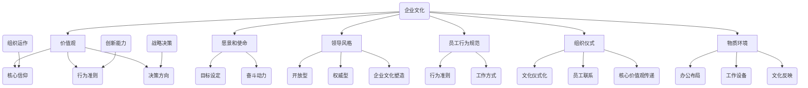

在这个流程图中，我们可以看到价值观、愿景和使命、领导风格、员工行为规范、组织仪式和物质环境这些核心概念如何相互作用，共同构成了企业文化的整体框架。这些要素不仅决定了组织的内部运作，还深刻影响着组织的创新能力、战略决策和外部竞争力。通过理解和优化这些要素，组织可以更好地塑造和提升企业文化，实现长期可持续发展。

### 第5章：企业文化的建设与维护

#### 5.1 企业文化建设的原则与策略

企业文化的建设是一项长期而系统的工程，它不仅关系到组织的内部运作效率，还直接影响组织的长远发展和竞争力。为了有效建设企业文化，我们需要遵循一系列基本原则和采取相应的策略。

**1. 明确核心价值观**：核心价值观是企业文化的基石，它决定了企业的行为准则和员工的思维方式。在建设企业文化时，首先需要明确核心价值观，这些价值观应当简洁明了，且具有普遍性和持久性。例如，谷歌的核心价值观包括“用户至上”、“创新”和“团队合作”，这些价值观不仅指导了谷歌的日常运营，也成为了谷歌员工行为的准则。

**2. 融入组织战略**：企业文化应当与组织的战略目标相一致，通过将核心价值观融入组织战略，确保企业文化在组织决策和行动中发挥指导作用。例如，一个以创新为核心价值观的企业，应当在战略规划中注重产品研发和市场创新，从而实现企业文化的落地。

**3. 领导层的示范作用**：领导层是企业文化的关键推动者，他们的行为和价值观直接影响员工的行为和态度。因此，领导层应当通过自身的言行，示范和传播核心价值观，营造积极向上的企业文化氛围。

**4. 持续沟通与反馈**：企业文化需要通过持续的沟通和反馈机制来建设。企业应当定期组织员工参与企业文化相关的培训和讨论，鼓励员工表达意见和建议，通过这些互动，增强员工的参与感和认同感。

**5. 制度保障**：企业文化不仅需要理念上的支持，还需要制度上的保障。企业应当建立和完善与企业文化相关的规章制度，如员工行为准则、绩效考核体系等，通过制度来规范员工行为，巩固企业文化。

**6. 系统性培训**：企业应当制定系统性的企业文化培训计划，通过入职培训、岗位培训和专项培训等方式，使员工全面了解和认同企业文化。同时，企业还应当定期评估培训效果，根据反馈进行调整和优化。

**7. 激励与奖励**：企业可以通过激励和奖励机制，鼓励员工积极践行企业文化。例如，设立“企业文化标兵”、“最佳团队合作奖”等荣誉，表彰那些在践行企业文化方面表现突出的员工。

**8. 环境营造**：企业文化的建设还需要通过物理环境和软环境的营造。企业可以通过优化办公环境、提供舒适的休闲空间、举办团队建设活动等方式，营造积极向上的企业文化氛围。

#### 5.2 企业文化塑造的关键步骤

企业文化塑造是一个逐步推进的过程，需要经过以下几个关键步骤：

**1. 明确企业愿景和使命**：企业首先需要明确自身的愿景和使命，这将为企业文化提供明确的指导方向。企业应当通过内部讨论和调研，形成共识，并将愿景和使命书面化，成为企业文化的核心。

**2. 制定核心价值观**：在明确愿景和使命的基础上，企业应当制定核心价值观，这些价值观应当简洁、具有代表性和可操作性。例如，“诚信、创新、共赢”等。

**3. 设计企业文化手册**：企业文化手册是企业文化的系统化、文本化表达，它应当详细描述企业的核心价值观、行为规范、员工期望等内容。企业文化手册不仅可以帮助新员工快速了解企业文化，还可以作为员工行为的指南。

**4. 宣传和推广**：企业应当通过多种渠道宣传和推广企业文化，如内部培训、宣传栏、内部刊物、企业文化日活动等，使企业文化深入人心。

**5. 建立反馈机制**：企业应当建立有效的反馈机制，通过定期的员工满意度调查、意见箱等方式，收集员工的反馈和建议，不断优化企业文化。

**6. 实施和监督**：企业应当将企业文化融入日常管理中，通过考核、激励等手段，确保企业文化在员工行为中的落地。同时，企业还应当定期监督和评估企业文化实施情况，及时发现和解决问题。

**7. 持续优化**：企业文化不是一成不变的，而是需要根据企业的发展和外部环境的变化进行不断优化。企业应当定期评估企业文化，根据反馈和实际情况，进行调整和改进。

通过明确核心价值观、融入组织战略、领导层的示范作用、持续沟通与反馈、制度保障、系统性培训、激励与奖励以及环境营造等原则和策略，企业可以有效地建设并塑造企业文化。通过关键步骤的实施，企业文化能够在组织内部生根发芽，为企业的长期发展提供强有力的支持。

### 核心概念与联系

为了更好地理解企业文化建设的原则与策略及其相互关系，我们可以通过一个Mermaid流程图来展示这些核心概念及其相互作用：

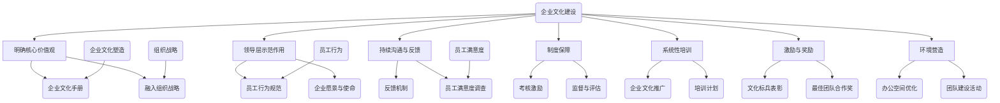

在这个流程图中，我们可以看到明确核心价值观、领导层示范作用、持续沟通与反馈、制度保障、系统性培训、激励与奖励以及环境营造等核心概念如何相互联系和作用，共同构成了企业文化建设的完整框架。这些原则与策略不仅为企业文化提供了理论基础和实践指导，还确保了企业文化在组织内部的有效实施和持续优化。

### 第6章：企业文化与领导力的相互作用

企业文化与领导力是组织管理中两个关键因素，它们相互影响、相互作用，共同塑造组织的运作和发展。本节将详细探讨企业文化对领导力的影响，领导力对企业文化的影响，以及二者如何协同发展。

#### 6.1 企业文化对领导力的影响

企业文化对领导力的影响是深远且多方面的。首先，企业文化塑造了领导者的行为和思维方式。一个积极向上的企业文化可以促使领导者更加注重员工的福祉、团队的协作和创新。例如，谷歌的企业文化强调“用户至上”和“不作恶”，这种文化使得谷歌的领导者更加关注用户体验和道德标准，从而推动了谷歌在科技行业的领导地位。

其次，企业文化影响领导者的决策风格和管理方式。在一个以创新为核心价值观的企业中，领导者可能更倾向于采取开放、鼓励试错的决策风格，以推动组织的创新和发展。而在一个强调效率和控制的企业文化中，领导者可能更加倾向于采用严格、集中的管理方式。例如，丰田公司的“精益生产”文化强调持续改进和团队合作，这种文化影响了丰田领导者的决策风格，使他们更加注重流程优化和团队合作。

此外，企业文化还影响领导者的领导能力和效果。一个良好的企业文化能够提升领导者的沟通能力、影响力与说服力，使他们更有效地激励和引导团队。例如，西门子的企业文化强调透明、公正和开放，这种文化氛围有助于提升领导者的沟通能力和团队协作能力。

#### 6.2 领导力对企业文化的影响

领导力对企业文化的塑造同样具有重要作用。首先，领导者的行为和价值观直接影响了组织文化的形成。一个具备高领导力的领导者通过自身的言行示范，传递组织的核心价值观和行为规范，从而塑造和巩固企业文化。例如，苹果公司创始人史蒂夫·乔布斯以其创新和追求卓越的领导风格，塑造了苹果公司独特的创新文化。

其次，领导者的决策和管理方式对企业文化的发展具有导向作用。一个卓越的领导者通过有效的决策和管理，推动企业文化的变革和创新。例如，杰克·韦尔奇在通用电气的领导期间，通过推行“无边界”文化和“全员参与”的管理方式，成功推动了通用电气企业文化的转型和创新。

此外，领导者的激励和培养策略对企业文化的形成和传承也具有重要影响。通过建立有效的激励机制和培养体系，领导者可以激励员工积极践行企业文化，培养更多的企业领袖。例如，华为公司通过“导师制”和“奋斗者文化”，激励员工追求卓越，传承企业文化。

#### 6.3 企业文化与领导力协同发展

企业文化和领导力之间的协同发展是组织成功的关键。为了实现二者的协同发展，组织需要采取以下措施：

**1. 领导者的文化领导**：领导者应当将企业文化视为领导工作的重要组成部分，通过自身的言行示范和决策，传播和巩固企业文化。

**2. 文化融合策略**：组织应当制定文化融合策略，将企业文化融入日常管理中，确保领导力和企业文化的一致性和协同性。

**3. 持续的文化建设**：组织需要持续进行文化建设，通过培训、沟通和激励等方式，不断巩固和发展企业文化。

**4. 文化与战略结合**：企业文化应当与组织战略相结合，通过将核心价值观融入战略规划，确保企业文化的实际应用和效果。

**5. 反馈与优化**：组织应当建立有效的反馈机制，通过员工满意度调查、文化评估等方式，收集员工对文化的反馈，及时优化和调整文化策略。

通过领导者文化领导的示范作用、文化融合策略的制定、持续的文化建设和战略结合，以及反馈与优化的机制，企业文化和领导力可以协同发展，共同推动组织的长期成功和发展。

### 核心概念与联系

为了更清晰地展示企业文化与领导力之间的相互作用及其对组织的影响，我们可以通过一个Mermaid流程图来描述这些核心概念：

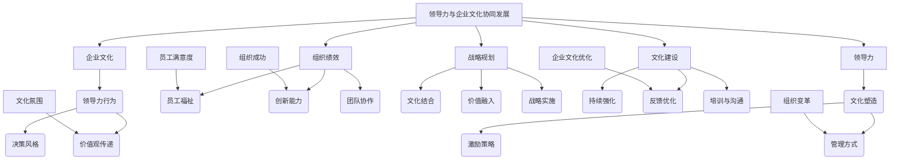

在这个流程图中，我们可以看到企业文化如何影响领导力的行为、决策风格和管理方式，以及领导力如何塑造企业文化、管理方式和激励策略。这些核心概念相互作用，共同影响组织的绩效、员工福祉、创新能力和团队协作。通过持续的文化建设和战略结合，组织可以促进领导力与企业文化的协同发展，实现长期成功。

### 第7章：领导力在企业变革中的应用

企业变革是组织适应市场变化、提升竞争力和实现持续发展的关键途径。在变革过程中，领导力扮演着至关重要的角色。一个成功的变革不仅需要科学的策略和方法，更需要具备变革领导力的领导者来引导和推动。以下是关于变革领导力的定义与特点、实践策略以及在变革中的领导力挑战与应对方法的详细探讨。

#### 7.1 变革领导力的定义与特点

变革领导力，是指领导者通过激励、引导和协调团队成员，推动组织实现变革和发展的能力。与常规领导力相比，变革领导力具有以下特点：

**1. 长期性**：变革领导力强调长期目标，不仅仅是短期内解决问题的策略，而是通过持续的努力和耐心，推动组织实现深层次的变革。

**2. 愿景驱动**：变革领导力以明确的愿景为核心，通过传递和实现这一愿景，激发团队成员的积极性和创造力，使组织具备持续变革的动力。

**3. 变革型领导风格**：变革领导力通常采用变革型领导风格，这种风格注重激励和启发团队成员，鼓励他们积极参与变革，并在变革过程中发挥重要作用。

**4. 高度灵活性**：变革领导力需要根据不同情境和需求，灵活调整领导策略和方法，以应对变革过程中的不确定性和挑战。

**5. 培养团队合作精神**：变革领导力强调团队合作，通过建立有效的沟通和协作机制，确保团队成员在变革过程中紧密配合，共同实现目标。

#### 7.2 变革领导力的实践策略

在推动企业变革时，变革领导力需要采取一系列策略来确保变革的顺利进行。以下是几个关键实践策略：

**1. 明确变革愿景**：首先，领导者需要明确变革的愿景和目标，并清晰地传达给全体员工。这有助于增强员工对变革的理解和认同，激发他们的参与热情。

**2. 建立变革团队**：领导者需要组建一支变革团队，由不同部门和层级的员工组成，共同参与和推动变革。通过跨部门的合作，可以更好地协调资源和力量，确保变革的全面推进。

**3. 制定详细的变革计划**：变革领导力需要制定详细的变革计划，包括变革的目标、步骤、时间表和预期成果。通过明确的计划，可以确保变革过程有条不紊，减少混乱和阻力。

**4. 激励和沟通**：领导者需要通过激励和沟通策略，激发员工的积极性和参与度。例如，可以通过奖励机制、培训和发展机会等方式，鼓励员工积极参与变革；通过定期的会议、邮件和内部通讯等方式，保持与员工的沟通，及时解答他们的疑问和担忧。

**5. 风险管理和应对**：在变革过程中，领导者需要识别和管理潜在的风险，并制定相应的应对措施。例如，通过风险评估、应急预案和资源调配等手段，确保在变革过程中遇到问题时能够及时应对和解决。

**6. 反馈和调整**：领导者需要建立有效的反馈机制，通过定期的评估和反馈，了解变革的进展情况，及时调整变革计划，确保变革目标的实现。

#### 7.3 变革中的领导力挑战与应对

在企业变革过程中，领导者面临一系列挑战，需要采取相应的应对措施。以下是几个主要挑战及其应对方法：

**1. 员工抵触情绪**：在变革初期，员工可能会对变革持有抵触情绪，担心变革会影响他们的工作和地位。为了应对这一挑战，领导者需要通过沟通和激励，解释变革的必要性和好处，增强员工的认同感和参与度。

**2. 资源限制**：变革通常需要大量的资源投入，包括人力、物力和财力。如果资源不足，可能会影响变革的推进。为了应对这一挑战，领导者需要积极争取内外部的支持，优化资源配置，确保变革所需的资源得到保障。

**3. 变革阻力**：变革过程中可能会遇到来自不同部门和层级的阻力。为了应对这一挑战，领导者需要建立强有力的变革团队，通过协商和沟通，消除变革的障碍，确保变革的顺利进行。

**4. 情绪波动**：变革过程中，员工可能会经历情绪波动，如焦虑、不安和恐惧。为了应对这一挑战，领导者需要提供情感支持，建立有效的心理辅导机制，帮助员工应对变革带来的情绪压力。

**5. 信息传递不畅**：在变革过程中，信息传递的效率和准确性至关重要。为了应对这一挑战，领导者需要建立有效的信息传递机制，确保变革信息能够及时、准确地传达给全体员工。

通过明确变革愿景、建立变革团队、制定详细计划、激励和沟通、风险管理以及反馈和调整等策略，领导者可以有效地应对变革中的挑战，推动企业变革的成功实施。

### 核心概念与联系

为了更清晰地展示变革领导力的核心概念及其相互作用，我们可以通过一个Mermaid流程图来描述这些概念：

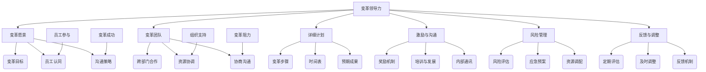

在这个流程图中，我们可以看到变革愿景、变革团队、详细计划、激励与沟通、风险管理以及反馈与调整等核心概念如何相互作用，共同构成了变革领导力的整体框架。这些概念相互支撑，确保了企业变革的顺利实施和成功。

### 第8章：企业文化在组织绩效中的贡献

企业文化在组织绩效中发挥着至关重要的作用，它不仅影响着员工的工作态度和行为模式，还直接关系到组织的整体绩效和竞争力。本节将详细探讨企业文化如何提升组织绩效，以及通过具体案例分析优秀企业文化如何推动组织成功。

#### 8.1 企业文化对组织绩效的影响

优秀的企业文化能够显著提升组织的整体绩效，其影响主要体现在以下几个方面：

**1. 提升员工满意度和忠诚度**：积极向上的企业文化能够营造良好的工作氛围，增强员工的满意度和忠诚度。当员工感受到企业关心他们的成长和福祉时，他们更愿意为企业付出更多的努力，从而提升组织绩效。

**2. 增强团队合作和协作精神**：企业文化中的协作精神能够促进团队成员之间的沟通和合作，提升团队的整体工作效率和创造力。在一个强调团队合作的企业中，员工更愿意分享知识和经验，共同解决问题，从而提升组织绩效。

**3. 促进创新和持续改进**：企业文化中的创新精神可以激发员工的创造力和创新意识，鼓励他们提出新的想法和解决方案。这种创新氛围有助于组织在竞争激烈的市场中保持竞争优势，提升整体绩效。

**4. 提高决策质量和执行力**：企业文化中的透明、公正和开放氛围能够提高决策的质量和执行效率。当员工感受到企业的决策过程是公平和透明的，他们更愿意积极参与和执行决策，从而提升组织绩效。

**5. 增强企业的品牌形象和声誉**：优秀的企业文化能够提升企业的品牌形象和声誉，吸引更多的优秀人才和客户。一个有良好口碑的企业更容易在市场中脱颖而出，提升整体绩效。

#### 8.2 企业文化如何提升组织绩效

优秀的企业文化可以通过以下几种方式提升组织绩效：

**1. 强化员工培训和职业发展**：企业可以通过定期的培训和发展计划，提升员工的技能和能力，使他们更好地适应工作需求。这不仅有助于提升员工的工作效率，还能增强他们的职业满足感和忠诚度。

**2. 建立有效的激励机制**：企业可以通过奖励机制，激励员工积极参与工作，提升绩效。例如，设立绩效奖金、晋升机会和荣誉称号等，激发员工的工作热情和创造力。

**3. 推动企业创新和文化建设**：企业可以通过内部创新项目和文化活动，鼓励员工提出新的想法和解决方案，推动企业的持续创新和发展。例如，设立创新实验室、组织团队建设活动和创新竞赛等。

**4. 强化团队协作和沟通**：企业可以通过建立有效的沟通机制和团队协作工具，促进员工之间的沟通和协作，提升团队的整体工作效率和绩效。例如，定期组织团队会议、设立共享平台和鼓励跨部门合作等。

**5. 建立积极的组织氛围**：企业可以通过营造积极向上的工作氛围，鼓励员工积极面对挑战和困难，提升他们的工作动力和绩效。例如，通过设立员工关怀计划、组织员工活动和提供健康保障等。

#### 8.3 案例分析：优秀企业文化如何推动组织成功

以下是通过具体案例分析优秀企业文化如何推动组织成功的例子：

**1. 苹果公司（Apple）**：苹果公司以其独特的企业文化而闻名，其核心价值观包括“创新、简洁、极致”等。这种企业文化不仅激发了员工的创造力和创新精神，还推动了苹果公司在全球科技行业的领先地位。苹果公司的优秀企业文化使其在产品设计和用户体验方面始终处于行业前沿，从而实现了持续的成功和增长。

**2. 谷歌公司（Google）**：谷歌公司以其开放、创新和员工关怀的企业文化著称。谷歌的“不作恶”价值观和“用户至上”原则不仅影响了谷歌的产品和服务，还塑造了谷歌积极向上、充满活力的企业文化。谷歌通过提供丰富的培训和发展机会、灵活的工作时间和宽松的办公环境，吸引了大量顶尖人才，推动了公司在全球市场的快速发展。

**3. 西门子公司（Siemens）**：西门子公司以其严谨、创新和团队合作的企业文化而著称。西门子公司高度重视员工的职业发展和团队合作，通过设立创新实验室、定期组织团队建设和技术分享活动，提升了员工的工作效率和创新能力。这种企业文化使得西门子在多个领域都取得了显著的成就，成为全球领先的工业解决方案提供商。

通过以上案例分析，我们可以看到优秀企业文化如何通过提升员工满意度、增强团队合作、促进创新和提供激励机制，推动组织实现成功和持续发展。

### 核心概念与联系

为了更清晰地展示企业文化对组织绩效的影响及其实现路径，我们可以通过一个Mermaid流程图来描述这些核心概念及其相互作用：

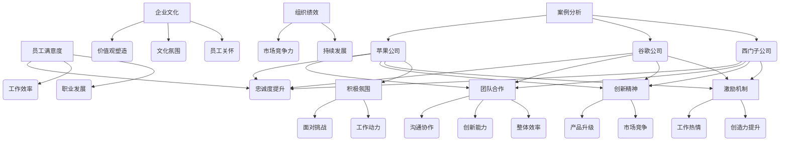

在这个流程图中，我们可以看到企业文化通过提升员工满意度、增强团队合作、促进创新精神、建立激励机制和营造积极氛围，最终实现提升组织绩效和市场竞争力。具体案例分析则展示了这些核心概念在实际组织中的应用和效果，为其他组织提供了宝贵的参考和借鉴。

### 第9章：领导力与企业文化在危机管理中的应用

在当今复杂多变的市场环境中，危机管理成为了企业领导者面临的一项重要挑战。有效的危机管理不仅能够帮助企业迅速应对突发事件，保护企业的利益和声誉，还能够通过领导力和企业文化的有效配合，实现长期的成功。以下将详细探讨领导力在危机管理中的作用、企业文化在危机管理中的作用，以及领导力与企业文化协同应对危机的方法。

#### 9.1 危机管理中的领导力作用

在危机管理中，领导力起到了至关重要的作用。一个优秀的领导者能够在危机爆发时迅速做出反应，采取有效的措施来应对危机。以下是领导力在危机管理中的几个关键作用：

**1. 确定危机优先级**：领导者需要迅速评估危机的严重性和影响范围，确定优先处理的事项。通过准确判断危机的优先级，领导者可以确保资源和精力被有效分配，从而更快地缓解危机。

**2. 制定危机应对策略**：领导者需要根据危机的具体情况，制定切实可行的危机应对策略。这包括制定应急预案、分配责任、协调资源等。一个有效的危机应对策略能够最大限度地减少危机对企业的影响。

**3. 保持团队凝聚力**：在危机中，领导者需要保持团队的凝聚力和信心。通过及时沟通、激励员工和提供心理支持，领导者可以增强员工的信心，使他们更好地应对危机。

**4. 引导员工行动**：领导者需要明确员工的职责和任务，确保每个人都清楚自己的角色和责任。通过有效的指导和监督，领导者可以确保员工按照既定的危机应对策略行动，提高危机应对的效率。

**5. 建立有效的沟通机制**：在危机中，及时、准确的信息传递至关重要。领导者需要建立有效的沟通机制，确保危机信息能够迅速传达给所有相关方，包括员工、客户、供应商和公众。通过透明的沟通，领导者可以减少信息不对称，避免恐慌和谣言的传播。

#### 9.2 企业文化在危机管理中的作用

企业文化在危机管理中同样发挥着重要作用。一个积极向上的企业文化可以增强企业的抗风险能力和应对危机的能力。以下是企业文化在危机管理中的几个关键作用：

**1. 提高员工的适应能力**：积极的企业文化鼓励员工不断学习和适应变化，从而增强他们在危机中的应对能力。例如，通过定期的培训、团队建设活动和危机模拟演练，员工可以在实际危机发生时更加从容应对。

**2. 促进团队合作**：企业文化中的团队合作精神可以增强员工在危机中的协作能力。在一个强调团队合作的企业中，员工更愿意相互支持，共同应对危机，从而提高危机应对的效率。

**3. 增强企业的适应性和灵活性**：企业文化中的创新精神和灵活应变能力可以增强企业在危机中的适应能力。例如，通过鼓励员工提出新的想法和解决方案，企业可以更快地适应危机，找到解决问题的方法。

**4. 提升员工的忠诚度和信任度**：积极的企业文化可以增强员工对企业的忠诚度和信任度。在危机中，员工会感受到企业的支持和关怀，从而更加愿意与企业共同面对困难，共同度过危机。

#### 9.3 领导力与企业文化协同应对危机

领导力和企业文化的协同作用在危机管理中尤为重要。以下是领导力与企业文化如何协同应对危机的方法：

**1. 明确共同目标**：领导者和企业文化团队需要明确危机管理的共同目标，确保所有行动都围绕这一目标进行。通过共同目标，领导力和企业文化可以形成合力，共同应对危机。

**2. 建立危机管理团队**：领导者和企业文化团队可以共同组建危机管理团队，确保团队中的每个成员都清楚自己的角色和职责。通过有效的团队协作，领导力和企业文化可以共同发挥作用，提高危机应对的效率。

**3. 制定综合危机应对策略**：领导者和企业文化团队需要共同制定综合的危机应对策略，包括应急预案、资源调配、沟通机制等。通过综合策略，领导力和企业文化可以协同应对危机，减少对企业的影响。

**4. 保持持续沟通**：领导者和企业文化团队需要保持持续的沟通，确保危机信息能够及时、准确地传达给所有相关方。通过透明的沟通，领导力和企业文化可以共同增强员工的信心和信任度，提高危机应对的效果。

**5. 评估和改进**：在危机结束后，领导者和企业文化团队需要共同评估危机应对的效果，总结经验教训，并根据反馈进行改进。通过持续的评估和改进，领导力和企业文化可以不断提升危机应对的能力，为未来的危机做好准备。

通过明确共同目标、建立危机管理团队、制定综合危机应对策略、保持持续沟通和评估改进，领导力与企业文化可以协同应对危机，最大限度地减少危机对企业的影响，并为企业带来长远的发展。

### 核心概念与联系

为了更清晰地展示领导力与企业文化在危机管理中的协同作用及其相互关系，我们可以通过一个Mermaid流程图来描述这些核心概念及其相互作用：

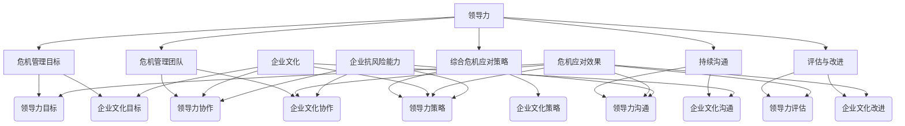

在这个流程图中，我们可以看到危机管理目标、领导力目标和企业文化目标如何相互关联；危机管理团队、领导力协作和企业文化协作如何协同工作；综合危机应对策略、领导力策略和企业文化策略如何相互融合；持续沟通、领导力沟通和企业文化沟通如何共同作用；评估与改进、领导力评估和企业文化改进如何持续提升危机应对能力。这些核心概念和联系共同构成了领导力与企业文化在危机管理中的协同框架，为企业的长期成功提供了坚实的支持。

## 第四部分：案例研究

### 第10章：国内外领导力与企业文化成功案例

在本章中，我们将深入探讨国内外几个成功的领导力与企业文化案例，包括苹果公司、谷歌公司和华为公司。这些案例展示了优秀领导力和企业文化如何在不同组织环境中推动成功和持续发展。

#### 10.1 国内外领导力与企业文化经典案例概述

**苹果公司（Apple）**：苹果公司以其独特的企业文化而闻名，这种文化不仅塑造了公司的成功，也深刻影响了全球科技行业。乔布斯和库克作为公司领导者的领导风格和价值观，共同塑造了苹果公司的企业文化，包括创新、简洁和极致。这种文化使得苹果公司能够持续推出革命性的产品，如iPhone、iPad和MacBook等。

**谷歌公司（Google）**：谷歌公司以其开放、创新和员工关怀的企业文化著称。谷歌的“不作恶”价值观和“用户至上”原则不仅影响了公司的运营方式，也塑造了谷歌积极向上、充满活力的企业文化。通过提供丰富的培训和发展机会、灵活的工作时间和宽松的办公环境，谷歌吸引了大量顶尖人才，推动了公司在全球市场的快速发展。

**华为公司（Huawei）**：华为公司以其严格的创新文化和团队合作精神而著称。华为的领导力强调技术创新和全球视野，使得公司在全球通信设备市场中占据了领先地位。华为的企业文化强调“狼性”精神，鼓励员工在激烈的市场竞争中保持高度的创新意识和团队协作精神。

#### 10.2 案例一：苹果公司的领导力与文化

**领导力特点**：苹果公司的领导力特点主要体现在创新、简洁和极致上。乔布斯以其强烈的创新意识和追求完美的态度，带领苹果公司不断推出革命性的产品。他在领导风格上强调对细节的关注和对用户体验的高度重视，这使得苹果公司能够在竞争激烈的市场中脱颖而出。

**企业文化**：苹果公司的企业文化以创新为核心，强调简洁和极致。公司内部鼓励员工不断探索新的技术解决方案，追求产品的简洁和用户体验的极致。这种文化氛围使得苹果公司能够持续推出具有强大竞争力的产品。

**成功经验**：苹果公司的成功经验主要体现在其强大的创新能力、卓越的用户体验和独特的企业文化。乔布斯对产品细节的关注和用户体验的极致追求，使得苹果公司成为全球科技行业的领导者。通过持续的创新和不断改进，苹果公司成功地将科技创新与用户体验完美结合，赢得了全球用户的喜爱。

**挑战与应对**：尽管苹果公司取得了巨大的成功，但在发展过程中也面临了一系列挑战。例如，随着市场竞争的加剧，苹果公司在保持创新和用户体验方面面临巨大压力。为此，苹果公司通过不断调整领导力和企业文化策略，保持对公司愿景和价值观的坚定追求，从而克服了这些挑战。

#### 10.3 案例二：谷歌的企业文化与领导力

**领导力特点**：谷歌的领导力特点主要体现在开放、创新和员工关怀上。谷歌的创始人谢尔盖·布林和拉里·佩奇以其开放的心态和创新精神，带领谷歌公司成为全球科技行业的领导者。他们在领导风格上注重团队合作和员工福祉，通过提供灵活的工作时间和宽松的办公环境，激发了员工的创造力和创新精神。

**企业文化**：谷歌的企业文化以其开放、创新和员工关怀著称。谷歌的“不作恶”价值观和“用户至上”原则不仅影响了公司的运营方式，也塑造了谷歌积极向上、充满活力的企业文化。公司内部鼓励员工自由表达意见和建议，通过定期的内部讨论和反馈机制，确保员工的参与感和认同感。

**成功经验**：谷歌的成功经验主要体现在其开放的企业文化、强大的创新能力和员工关怀。通过鼓励员工自由表达意见和建议，谷歌能够不断推出具有竞争力的产品和服务。同时，谷歌注重员工的发展和福祉，通过提供丰富的培训和发展机会，吸引了大量顶尖人才，推动了公司在全球市场的快速发展。

**挑战与应对**：谷歌在发展过程中也面临了一些挑战，例如市场竞争的加剧和用户隐私保护等问题。为此，谷歌通过不断调整领导力和企业文化策略，保持对公司愿景和价值观的坚定追求，从而克服了这些挑战。通过加强内部沟通和员工关怀，谷歌成功地将挑战转化为发展的动力。

#### 10.4 案例三：华为的领导力与企业文化

**领导力特点**：华为的领导力特点主要体现在技术创新、团队合作和全球视野上。华为的创始人任正非以其对技术创新的高度重视和对全球市场的深刻洞察，带领华为公司在全球通信设备市场中取得了领先地位。华为的领导风格强调团队合作和全球视野，通过全球化的布局和跨部门合作，推动了公司的快速发展。

**企业文化**：华为的企业文化以创新、团队合作和“狼性”精神为核心。公司内部鼓励员工不断探索新的技术解决方案，追求卓越的团队协作精神。华为的企业文化强调在激烈的市场竞争中保持高度的创新意识和团队合作精神。

**成功经验**：华为的成功经验主要体现在其强大的创新能力、卓越的团队合作精神和全球市场布局。通过技术创新和全球视野，华为在通信设备市场中占据了领先地位。华为的企业文化不仅激发了员工的创新潜力，也增强了公司的竞争力。

**挑战与应对**：华为在发展过程中也面临了一些挑战，例如市场竞争的加剧和技术创新的压力。为此，华为通过不断调整领导力和企业文化策略，保持对公司愿景和价值观的坚定追求，从而克服了这些挑战。通过加强全球合作和跨部门协作，华为成功地将挑战转化为发展的动力。

通过分析苹果公司、谷歌公司和华为公司的领导力与企业文化案例，我们可以看到，优秀的领导力和积极的企业文化在推动组织成功和持续发展方面具有重要作用。这些案例不仅为其他组织提供了宝贵的经验，也为未来的发展提供了启示。

### 核心概念与联系

为了更清晰地展示苹果公司、谷歌公司和华为公司在领导力与企业文化方面的核心概念及其相互作用，我们可以通过一个Mermaid流程图来描述：

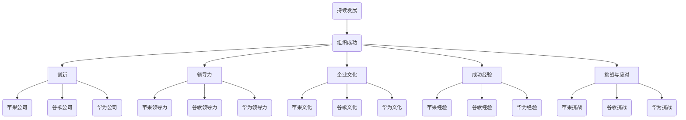

在这个流程图中，我们可以看到创新、领导力和企业文化是这三个公司的核心概念，它们相互影响、相互作用，共同推动了组织的成功和持续发展。苹果公司的创新精神和极致追求、谷歌公司的开放和员工关怀、华为公司的技术创新和团队合作精神，都是这些公司成功的关键因素。通过这些核心概念和相互作用，我们可以更好地理解领导力与企业文化在组织管理中的重要作用。

### 第11章：领导力与企业文化在实践中的挑战与展望

在领导力与企业文化实践中，组织面临着诸多挑战，同时也面临着未来发展的广阔前景。本节将分析当前领导力与企业文化面临的挑战，探讨未来领导力与企业文化的发展趋势，并讨论组织如何适应这些变化。

#### 11.1 当前领导力与企业文化面临的挑战

**1. 多样性和包容性的挑战**：随着全球化的加深和多元文化的交融，组织内部的多样性和包容性成为领导力与企业文化的重要课题。不同背景、性别、年龄和文化背景的员工需要被尊重和认可，但如何平衡多样性带来的差异，保持组织的凝聚力和效率，是领导者和企业文化管理者面临的挑战。

**2. 快速变化的科技环境**：科技的快速发展带来了组织运作方式的巨大变革。领导者和企业文化管理者需要不断更新自己的知识和技能，以适应新技术带来的挑战和机遇。例如，人工智能、大数据和区块链等新兴技术的应用，要求组织在管理方式和企业文化方面进行相应的调整。

**3. 人才流失与招聘困难**：随着竞争的加剧，人才流失和招聘困难成为许多组织的痛点。领导力与企业文化需要通过有效的激励机制和吸引策略，留住关键人才，同时吸引新的优秀员工。这要求企业文化在塑造组织氛围和员工体验方面具备更强的吸引力和竞争力。

**4. 全球化带来的挑战**：全球化不仅带来了机遇，也带来了文化和价值观的冲突。跨国企业在不同国家和地区运营时，需要平衡本土化和全球化的关系，尊重不同文化背景下的员工需求和工作方式，这给企业文化管理带来了新的挑战。

#### 11.2 未来领导力与企业文化的发展趋势

**1. 持续学习和创新**：未来的领导力和企业文化将更加注重持续学习和创新。组织需要建立一个学习和创新的文化氛围，鼓励员工不断更新知识和技能，推动组织的持续发展。

**2. 人工智能与数据分析**：人工智能和数据分析技术的发展将深刻影响领导力与企业文化。通过数据分析，组织可以更好地理解员工行为和需求，从而优化管理策略和企业文化建设。

**3. 重视员工体验和福祉**：未来的领导力和企业文化将更加注重员工的体验和福祉。组织将通过提供更好的工作环境、福利待遇和发展机会，提高员工的满意度和忠诚度，从而提升整体绩效。

**4. 生态系统的合作与共赢**：未来的领导力和企业文化将更加注重生态系统中的合作与共赢。组织将与供应商、客户和其他利益相关者建立紧密的合作关系，通过共享资源、知识和经验，共同推动组织和社会的可持续发展。

#### 11.3 组织如何适应领导力与企业文化的新变化

为了适应领导力与企业文化的新变化，组织可以采取以下措施：

**1. 建立灵活的领导力和企业文化体系**：组织需要建立灵活的领导力和企业文化体系，以适应快速变化的环境。这包括灵活的领导风格、开放的企业文化以及能够快速响应变化的决策机制。

**2. 强化人才培养与发展**：组织需要强化人才培养与发展，通过培训、学习和职业发展机会，提升员工的技能和综合素质。同时，建立人才激励机制，留住关键人才，吸引新的优秀员工。

**3. 拥抱多元化与包容性**：组织需要拥抱多元文化和包容性，尊重员工的多样性，建立公平、公正的工作环境。通过多元化的团队建设和跨文化交流，增强组织的凝聚力和创新能力。

**4. 利用人工智能与数据分析**：组织可以利用人工智能和数据分析技术，优化管理决策和企业文化建设。通过数据分析，了解员工行为和需求，制定更有效的管理策略和企业文化方案。

**5. 加强生态系统的合作与共赢**：组织需要加强与其他利益相关者的合作，建立共赢的生态系统。通过共享资源、知识和经验，共同推动组织和社会的可持续发展。

通过建立灵活的领导力和企业文化体系、强化人才培养与发展、拥抱多元化与包容性、利用人工智能与数据分析，以及加强生态系统的合作与共赢，组织可以更好地适应领导力与企业文化的新变化，实现持续发展和成功。

### 核心概念与联系

为了更好地理解当前领导力与企业文化面临的挑战、未来发展趋势以及组织适应措施之间的联系，我们可以通过一个Mermaid流程图来展示这些核心概念及其相互作用：

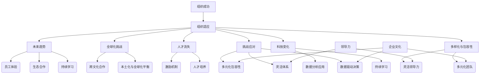

在这个流程图中，我们可以看到多样化与包容性、科技变化、人才流失和全球化挑战等当前挑战与未来趋势（如持续学习、生态合作、员工体验）以及组织适应措施（如灵活领导力、数据驱动决策、多元化包容性）之间的相互联系。这些核心概念共同构成了一个动态的框架，指导组织如何有效地应对挑战和适应未来变化，实现长期成功。

### 附录

#### 附录A：领导力与企业文化相关工具与资源

在领导力与企业文化的研究和实践中，有许多工具和资源可以帮助组织和管理者更好地理解和应用这些概念。以下是一些常用的工具和资源：

**1. 领导力评估工具**：这些工具用于评估领导者的能力和领导风格，例如：
   - **360度评估**：通过收集来自不同层级的反馈，全面评估领导者的绩效和风格。
   - **领导力问卷**：用于量化领导力的各个方面，如沟通能力、决策能力等。

**2. 企业文化评估方法**：这些方法用于评估企业文化现状和员工对企业文化的感知，例如：
   - **企业文化问卷调查**：通过问卷了解员工对企业价值观、行为规范和沟通方式的看法。
   - **组织文化诊断工具**：如文化雷达图、文化评估矩阵等，帮助组织识别和优化企业文化。

**3. 领导力与企业文化研究资源**：这些资源提供了丰富的理论和实践案例，包括：
   - **学术期刊**：如《领导力与组织研究》、《组织行为与人力资源管理》等。
   - **专业书籍**：如《领导力五项修炼》、《企业文化与企业绩效》等。
   - **在线课程和研讨会**：许多大学和培训机构提供关于领导力与企业文化的高质量在线课程和研讨会。

通过这些工具和资源，组织可以更加系统地评估和管理领导力和企业文化，从而提升组织的整体绩效和竞争力。

#### 附录B：领导力与企业文化研究参考文献

**1. 基础理论研究**：
   - Hersey, P. & Blanchard, K. H. (1977). **The Management of Organizational Change**. New York: Gulf Publishing Company.
   - Kotter, J. P. (1996). **Leading Change**. Boston: Harvard Business Review Press.
   - Yukl, G. A. (2013). **Leadership in Organizations** (7th ed.). Upper Saddle River, NJ: Pearson Education.

**2. 实证研究与应用**：
   - Jackson, S. E., & Schillinger, D. A. (1995). **A Multilevel Analysis of the Effects of Climate, Structure, and Leadership on Quality of Care and Organizational Performance in Nursing Homes**. Journal of Applied Psychology, 80(5), 690-703.
   - Sosik, J., & Mead, N. L. (1996). **The Role of Leader Behavior in Improving Organizational Performance**. Journal of Business Strategy, 17(2), 34-42.

**3. 领导力与企业文化最新研究动态**：
   - Ashkanasy, N. M., & Daus, C. S. (2010). **The Oxford Handbook of Leadership and Organization**. Oxford: Oxford University Press.
   - Boal, K. B., Weitzel, D. R., & Ashkanasy, N. M. (2018). **The Global Dimensions of Leadership**. Leadership Quarterly, 29(3), 368-388.

这些参考文献涵盖了领导力与企业文化的理论研究、实证研究和最新动态，为读者提供了丰富的学术资源和实践指导。

#### 附录C：领导力与企业文化实践指南

**1. 领导力培养与实践指南**：
   - **领导力发展计划**：制定个性化的领导力发展计划，包括目标设定、技能提升和实践应用。
   - **领导力研讨会**：参加定期的领导力研讨会，学习最新的领导力理论和实践方法。
   - **角色扮演练习**：通过角色扮演和模拟演练，提升领导者的决策能力和应对挑战的能力。

**2. 企业文化建设与实践指南**：
   - **文化诊断**：使用企业文化评估工具，诊断当前企业文化的现状和问题。
   - **文化宣传**：通过内部刊物、培训课程和员工会议等方式，宣传和强化企业文化的核心价值观。
   - **文化激励机制**：建立与企业文化一致的激励机制，鼓励员工践行企业文化。

**3. 组织变革中的领导力与企业文化策略**：
   - **领导力调整**：根据变革的需求，调整领导风格和管理策略，确保领导力与变革目标一致。
   - **文化适应性**：在变革过程中，保持企业文化的连续性和适应性，确保员工能够顺利适应变革。
   - **员工参与**：鼓励员工参与变革过程，通过沟通和反馈，增强员工的参与感和认同感。

通过这些实践指南，组织可以更好地培养领导力、建设企业文化，并在组织变革中有效应用领导力与企业文化策略，实现组织的持续成功和发展。

