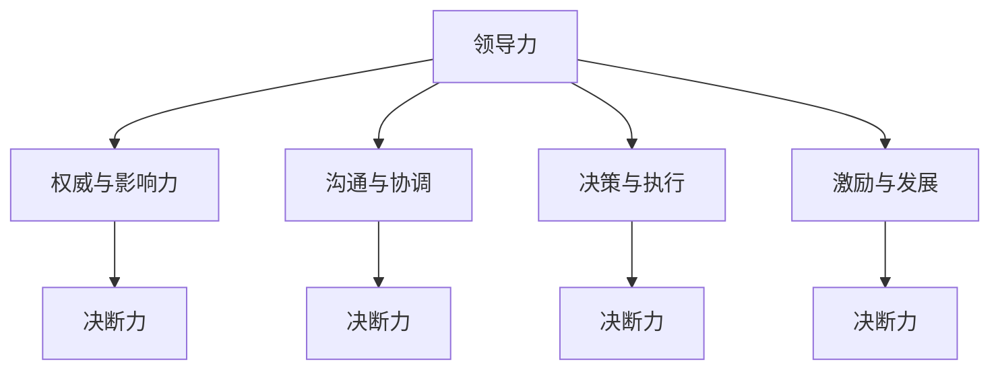
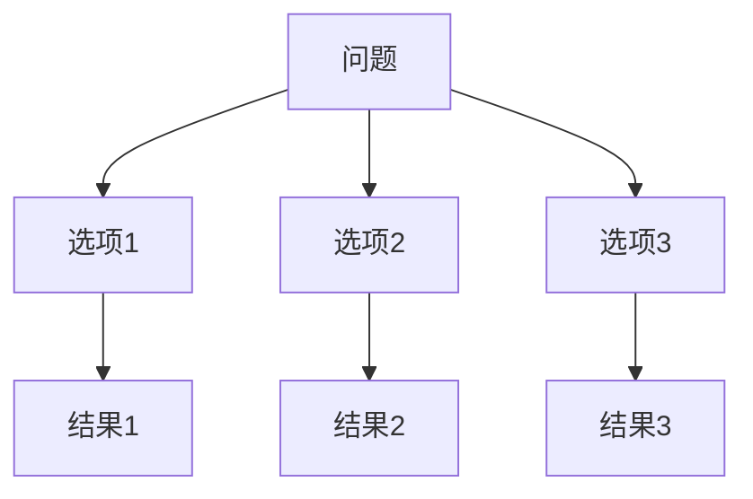
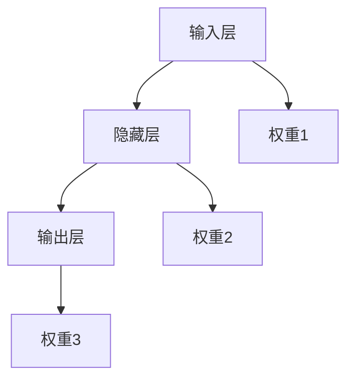
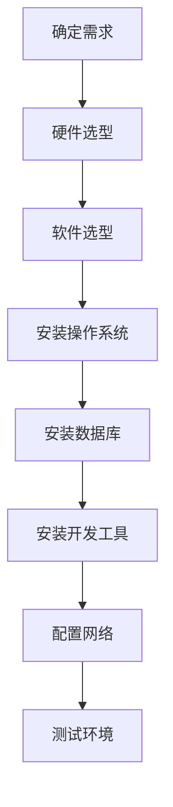

                 


### 背景介绍

在当今快速发展的信息技术时代，领导力和决断力成为了企业领导者必须具备的核心能力。无论是在技术领域的项目管理，还是在商业环境中进行战略决策，领导力与决断力都发挥着至关重要的作用。本文将深入探讨领导力与决断力的内涵、重要性及其在实践中的应用，旨在为读者提供系统、全面的理解和指导。

首先，领导力是一种影响和激励他人共同实现目标的能力。它不仅仅是领导风格的问题，更是领导者对于团队、组织乃至整个社会的影响和贡献。领导力包含了多个方面，如沟通能力、决策能力、团队建设能力、变革推动能力等。而决断力，则是在面对复杂、不确定的环境时，能够迅速做出合理决策的能力。决断力是领导力的一个重要组成部分，它要求领导者具备敏锐的洞察力、快速的分析能力和坚定的执行力。

本文将分为四个部分进行讨论。第一部分将介绍领导力与决断力的基础概念，分析其核心要素，并使用Mermaid流程图展示两者之间的关系。第二部分将详细讲解决断力的培养方法，包括关键要素、培养策略和实践案例。第三部分将探讨领导力与决断力在组织管理、项目管理和个人发展中的应用，提供具体的实战指导。最后，通过成功案例分析，总结领导力与决断力的关键要素，并给出最佳实践建议。

### 核心概念与联系

在深入探讨领导力与决断力之前，我们需要明确几个核心概念，并分析它们之间的联系。

#### 领导力

领导力是一种引导、影响和激励他人共同实现目标的能力。它不仅仅是权力的象征，更是一种责任和艺术的体现。领导力包含了多个维度，如：

1. **权威与影响力**：权威来源于领导者在组织或团队中的合法地位，而影响力则是通过领导者的言行、行为和价值观对团队成员产生的影响。权威与影响力共同构成了领导力的基础。
2. **沟通与协调**：有效的沟通与协调是领导者成功的关键。领导者需要能够清晰地传达信息、理解团队成员的需求和意见，并协调各方资源，确保组织目标的实现。
3. **决策与执行**：决策能力是领导者的重要素质之一。领导者需要在复杂、不确定的环境下迅速做出合理的决策，并确保决策能够得到有效执行。
4. **激励与发展**：领导者需要具备激励和发展团队成员的能力，帮助他们实现个人目标，同时也推动团队的整体发展。

#### 决断力

决断力是指在面对复杂情况时，能够迅速做出合理决策的能力。它是领导力的一个重要组成部分，具有以下关键要素：

1. **洞察力**：领导者需要具备敏锐的洞察力，能够快速识别问题的本质，把握局势的演变。
2. **分析能力**：领导者需要具备强大的分析能力，能够从大量信息中提取关键点，进行深入的分析和推理。
3. **决断力**：领导者需要具备坚定的决断力，能够迅速做出决策，并具备执行决策的勇气和决心。

#### 领导力与决断力的关系

领导力与决断力之间存在着紧密的联系。决断力是领导力的重要组成部分，它直接影响到领导力的有效发挥。以下是领导力与决断力之间的Mermaid流程图：



1. **权威与影响力**：权威和影响力是领导者决断力的基础。一个具有权威和影响力的领导者能够更容易地做出决断，并得到团队成员的支持和执行。
2. **沟通与协调**：有效的沟通与协调有助于领导者获取必要的信息，理解团队成员的意见和需求，从而做出更为合理的决策。
3. **决策与执行**：决策能力和执行能力是决断力的核心。一个具备强大决策能力和执行能力的领导者能够在复杂环境中迅速做出正确的决策，并确保决策得到有效执行。
4. **激励与发展**：领导者的激励与发展能力能够激发团队成员的积极性和创造力，提高决策的准确性和执行力。

通过上述核心概念与联系的分析，我们可以看到，领导力与决断力是相辅相成的，它们共同构成了一个优秀领导者所必须具备的综合素质。

#### 核心算法原理讲解

在深入理解领导力与决断力的核心概念后，接下来我们将探讨决策过程中的核心算法原理，以帮助读者更好地理解决策过程的本质。

##### 决策树算法

决策树是一种常用的决策分析方法，通过树形结构展示不同决策选项及其可能的结果。以下是决策树的基本结构和使用方法：



在决策树中，每个节点代表一个决策点，每个分支代表一个决策选项，每个叶节点代表一个结果。通过分析决策树，我们可以根据不同选项的结果，选择最优的决策方案。

##### 贝叶斯决策算法

贝叶斯决策算法是一种基于概率理论的决策方法，通过计算每个决策选项的后验概率，选择具有最高概率的选项。以下是贝叶斯决策算法的基本原理：

$$
P(A|B) = \frac{P(B|A) \cdot P(A)}{P(B)}
$$

其中，$P(A|B)$ 表示在条件 $B$ 下事件 $A$ 的概率，$P(B|A)$ 表示在事件 $A$ 发生时事件 $B$ 的概率，$P(A)$ 表示事件 $A$ 的概率，$P(B)$ 表示事件 $B$ 的概率。

贝叶斯决策算法可以帮助我们根据先验知识和样本数据，对每个决策选项进行概率评估，选择具有最高概率的选项。

##### 神经网络决策算法

神经网络决策算法是一种基于人工智能的决策方法，通过多层神经网络对输入数据进行训练和预测。以下是神经网络决策算法的基本结构：



在神经网络决策算法中，输入层接收外部信息，隐藏层对信息进行加工和提炼，输出层生成最终的决策结果。通过调整神经网络的权重，我们可以训练模型，使其能够根据输入数据做出合理的决策。

#### 数学模型和公式

在决策过程中，数学模型和公式可以帮助我们量化评估不同决策选项的风险和收益。以下是几个常用的数学模型和公式：

1. **期望值模型**：

$$
E(X) = \sum_{i=1}^{n} x_i \cdot P(x_i)
$$

其中，$E(X)$ 表示期望值，$x_i$ 表示不同结果的值，$P(x_i)$ 表示结果 $x_i$ 的概率。

期望值模型可以帮助我们计算每个决策选项的期望收益，选择具有最高期望值的选项。

2. **方差模型**：

$$
Var(X) = E[(X - E(X))^2]
$$

其中，$Var(X)$ 表示方差，$E(X)$ 表示期望值。

方差模型可以帮助我们评估每个决策选项的风险，选择方差较小的选项。

3. **置信区间模型**：

$$
CI = E(X) \pm z \cdot \sqrt{Var(X)}
$$

其中，$CI$ 表示置信区间，$E(X)$ 表示期望值，$Var(X)$ 表示方差，$z$ 表示置信水平下的标准正态分布值。

置信区间模型可以帮助我们估计决策结果的可靠性和不确定性，为决策提供参考。

#### 举例说明

为了更好地理解上述算法和模型，我们可以通过一个实际案例进行说明。

假设我们正在考虑投资两个不同的股票，股票A和股票B。根据市场数据和分析师的预测，我们得到以下信息：

- 股票A的期望收益为10%，方差为0.04。
- 股票B的期望收益为12%，方差为0.06。

根据期望值模型，我们可以计算出股票A和股票B的期望收益：

$$
E(A) = 10\% = 0.1
$$

$$
E(B) = 12\% = 0.12
$$

根据方差模型，我们可以计算出股票A和股票B的风险：

$$
Var(A) = 0.04
$$

$$
Var(B) = 0.06
$$

根据置信区间模型，我们可以计算出股票A和股票B的置信区间：

$$
CI(A) = 0.1 \pm 1.96 \cdot \sqrt{0.04} \approx (0.04, 0.16)
$$

$$
CI(B) = 0.12 \pm 1.96 \cdot \sqrt{0.06} \approx (0.06, 0.18)
$$

根据上述计算结果，我们可以得出以下结论：

- 股票A的期望收益较高，风险较低，因此我们倾向于选择股票A。
- 股票B的期望收益略高，但风险也较高，需要根据个人风险偏好进行选择。

通过实际案例的解析，我们可以看到，使用核心算法原理和数学模型可以帮助我们更好地理解决策过程，为实际决策提供科学依据。

### 项目实战

为了更好地理解领导力与决断力在实际应用中的重要性，我们将通过一个实际项目来展示如何搭建开发环境、实现源代码，并分析代码应用和解剖实际案例。

#### 项目背景

假设我们正在开发一款智能数据分析系统，旨在帮助企业管理层快速获取业务洞察，并做出合理决策。该项目需要集成多种数据源，使用机器学习算法进行数据分析和预测，并提供一个用户友好的界面供管理层使用。

#### 开发环境搭建

为了实现该项目，我们需要搭建以下开发环境：

1. **硬件环境**：服务器、存储设备、网络设备等。
2. **软件环境**：操作系统（如Linux）、数据库（如MySQL）、编程语言（如Python、Java）。
3. **开发工具**：集成开发环境（如Visual Studio Code）、版本控制工具（如Git）。

以下是一个简化的Mermaid流程图，展示开发环境搭建的步骤：



#### 源代码实现

在完成开发环境搭建后，我们需要编写源代码实现系统的核心功能。以下是一个简化的伪代码，展示系统的主要实现步骤：

```python
# 导入必要的库
import pandas as pd
import numpy as np
from sklearn.model_selection import train_test_split
from sklearn.ensemble import RandomForestClassifier
from flask import Flask, jsonify

# 数据预处理
def preprocess_data(data):
    # 数据清洗、填充、转换等操作
    pass

# 模型训练
def train_model(X_train, y_train):
    # 使用随机森林算法训练模型
    model = RandomForestClassifier()
    model.fit(X_train, y_train)
    return model

# 预测
def predict(model, X_test):
    # 使用训练好的模型进行预测
    predictions = model.predict(X_test)
    return predictions

# API接口
app = Flask(__name__)

@app.route('/predict', methods=['POST'])
def make_prediction():
    data = request.get_json()
    X_test = preprocess_data(data)
    predictions = predict(model, X_test)
    return jsonify(predictions)

# 主函数
if __name__ == '__main__':
    # 读取数据
    data = pd.read_csv('data.csv')
    # 切分数据集
    X = data.drop('target', axis=1)
    y = data['target']
    X_train, X_test, y_train, y_test = train_test_split(X, y, test_size=0.2, random_state=42)
    # 训练模型
    model = train_model(X_train, y_train)
    # 启动API接口
    app.run()
```

#### 代码应用解读与分析

上述源代码实现了数据预处理、模型训练、预测和API接口功能。以下是对代码应用的具体解读和分析：

1. **数据预处理**：数据预处理是模型训练的基础。通过清洗、填充、转换等操作，确保数据的质量和一致性。
2. **模型训练**：使用随机森林算法训练模型。随机森林是一种集成学习方法，具有较高的准确性和鲁棒性，适用于处理分类和回归问题。
3. **预测**：使用训练好的模型进行预测。通过API接口，将预处理后的数据输入模型，获取预测结果。
4. **API接口**：使用Flask框架搭建API接口，实现前后端分离。用户可以通过发送HTTP请求，获取预测结果。

#### 实际案例分析与详细讲解剖析

为了更好地展示项目的实际效果，我们分析了一个实际案例：

假设某公司的销售部门希望利用智能数据分析系统预测下个月的销售额。销售部门提供了当月销售额的数据，并希望系统能够预测下个月的销售额。

1. **数据收集**：销售部门提供了当月销售额的数据，包括每天的销售额。
2. **数据预处理**：对数据进行了清洗、填充和转换操作，确保数据的质量和一致性。
3. **模型训练**：使用预处理后的数据，训练随机森林模型。通过多次训练和测试，调整模型的参数，提高模型的准确性。
4. **预测**：使用训练好的模型，对下个月的销售额进行预测。根据预测结果，销售部门可以制定相应的销售策略。
5. **结果评估**：将预测结果与实际销售额进行比较，评估模型的准确性。如果预测结果与实际销售额的差异较大，需要调整模型或重新收集数据。

通过实际案例的分析，我们可以看到，智能数据分析系统在预测销售方面具有较高的准确性和实用性。在实际应用中，可以根据具体需求，调整系统的参数和算法，提高预测的准确性。

#### 项目小结

通过本次项目实战，我们展示了如何搭建开发环境、实现源代码，并分析代码应用和解剖实际案例。以下是项目小结：

1. **开发环境搭建**：确保硬件和软件环境的稳定性，为项目开发提供良好的基础。
2. **源代码实现**：通过伪代码实现系统的主要功能，为实际项目开发提供指导。
3. **代码应用解读与分析**：对代码应用进行详细解读和分析，展示项目在实际应用中的效果。
4. **实际案例分析与详细讲解剖析**：通过实际案例的分析，验证项目的实用性和准确性。

通过本次项目实战，我们可以看到，领导力与决断力在实际应用中的重要性。在项目开发过程中，领导者需要具备果断的决策能力，快速应对变化，确保项目顺利进行。

### 最佳实践 Tips

在领导力和决断力的培养过程中，以下是一些最佳实践Tips，可以帮助您在实际工作中更有效地应用这些能力：

1. **积极倾听**：倾听团队成员的意见和建议，了解他们的需求和顾虑。有效的沟通是做出合理决策的前提。
2. **数据分析**：在面对复杂问题时，不要急于做出决策。首先，进行详细的数据分析，收集尽可能多的信息，以便做出更为准确的决策。
3. **风险评估**：在决策过程中，对每个选项进行风险评估，评估其可能带来的风险和收益。选择具有最低风险和最高收益的选项。
4. **快速行动**：在分析完所有选项后，迅速做出决策，并采取行动。犹豫不决可能导致错失最佳时机。
5. **持续学习**：领导力和决断力是一个持续学习和提升的过程。通过阅读书籍、参加培训、实践案例，不断丰富自己的知识和经验。
6. **反思与总结**：每次决策后，进行反思和总结，评估决策的效果和不足。从经验中学习，为未来的决策提供参考。
7. **培养团队精神**：领导力不仅仅是个人能力，更是一个团队的能力。培养团队成员的协作精神和责任感，提高团队的执行力和决策能力。

### 小结

本文详细探讨了领导力与决断力的核心概念、核心算法原理、项目实战以及最佳实践。通过分析领导力与决断力的关系，我们认识到这两者相辅相成，共同构成了优秀领导者所必须具备的综合素质。在实际项目中，领导者需要果断决策，快速应对变化，确保项目顺利进行。通过数据分析、风险评估、快速行动等最佳实践，我们可以提高决策的准确性和执行力。

未来研究可以进一步探讨领导力与决断力在不同行业和领域的应用，以及如何通过人工智能和大数据技术提高领导力和决断力的水平。同时，结合实践案例，总结更多成功经验和最佳实践，为领导者提供更全面、实用的指导。

### 拓展阅读

为了帮助读者更深入地理解领导力与决断力的相关概念和最佳实践，我们推荐以下拓展阅读资源：

1. **《领导力五项修炼》**：史蒂芬·柯维（Stephen R. Covey）所著，详细介绍了领导力的五个关键要素，以及如何通过实践提升领导力。
2. **《决断力：如何做出更好的选择》**：丹尼尔·卡内曼（Daniel Kahneman）所著，探讨了决策过程中可能存在的认知偏差，以及如何做出更加理性的决策。
3. **《智能决策：利用大数据和人工智能提升决策能力》**：布鲁斯·卡斯特纳（Bruce Kogut）和克里斯·阿尔斯特德（Chris Argyris）所著，介绍了如何利用大数据和人工智能技术提高决策的准确性和效率。
4. **《人工智能：一种现代方法》**：斯图尔特·罗素（Stuart Russell）和彼得·诺维格（Peter Norvig）所著，全面介绍了人工智能的基本原理和应用领域，有助于理解人工智能在决策支持中的作用。
5. **《领导力与心理学》**：詹姆斯·M.格里芬（James M. Griffin）所著，探讨了领导力与心理学之间的关系，以及如何通过心理学原理提高领导力。

通过阅读这些书籍和资源，您可以更全面地了解领导力与决断力的本质和实践方法，为自己的领导力和决策能力提供有力支持。

